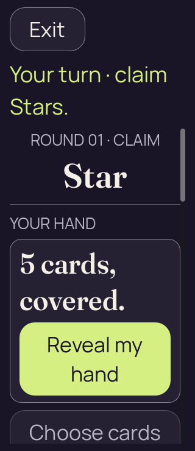
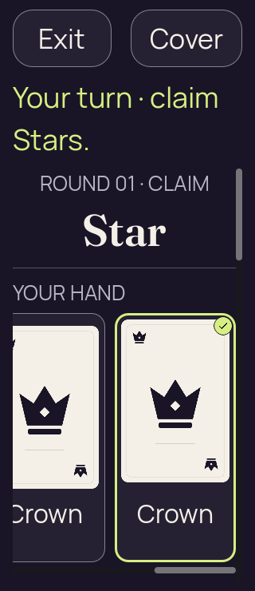
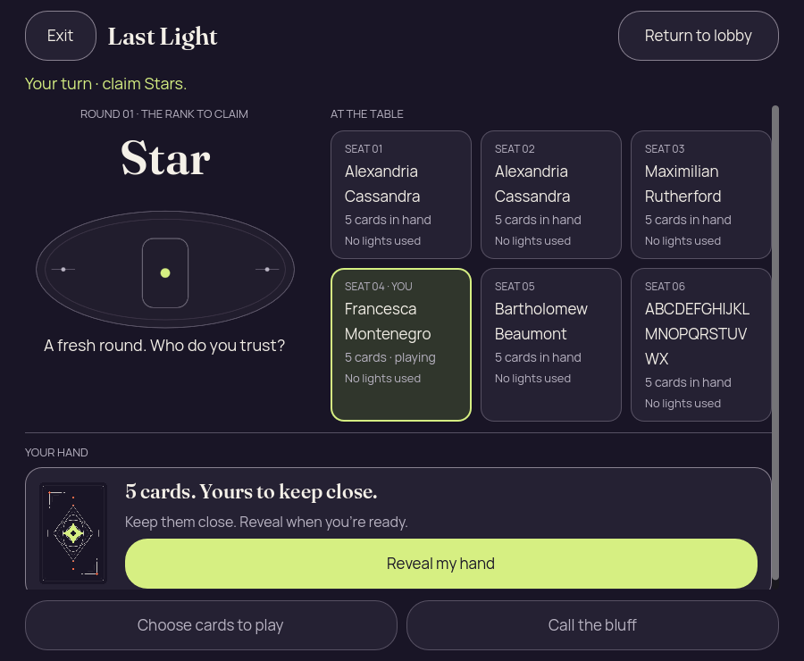
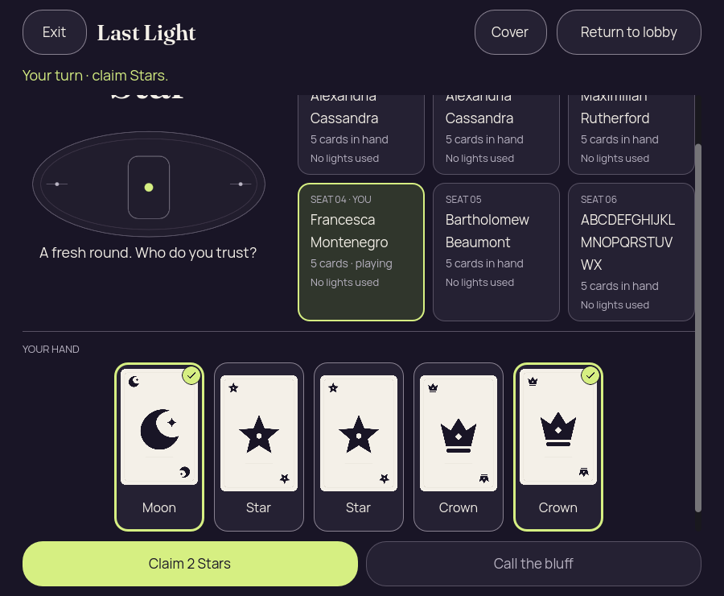
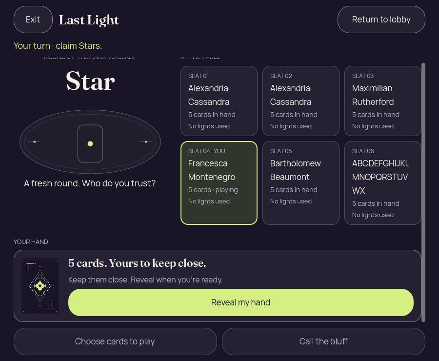
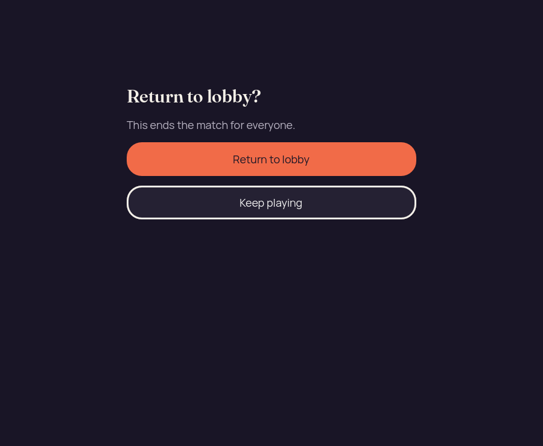
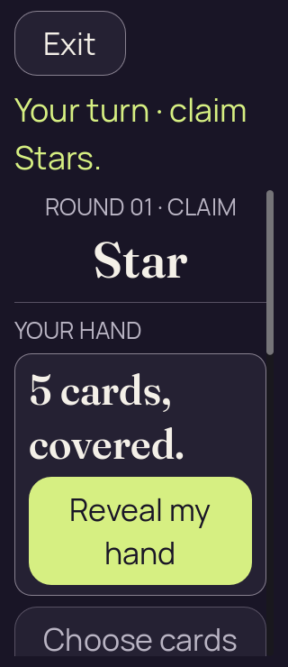
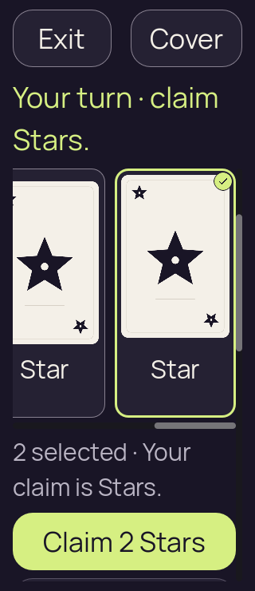
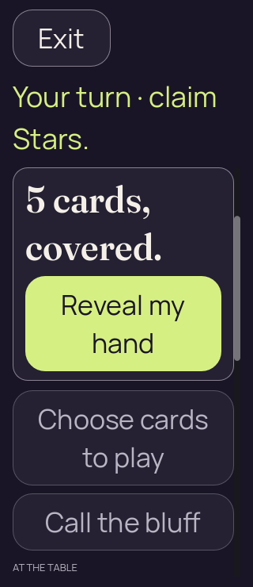

# Godot 2D — iteration 10, final compact Reveal and confirmation checks

[All screenshot collections](../README.md)

**Evidence status:** Three static reports pass. Initial Reveal fully fits at 900 × 740; 200% confirmation fits both choices; repeated emulated input and cover/resume checks pass.

Actual Godot `4.7.2.stable.official.ed1daf0bf`, OpenGL Compatibility / Mesa llvmpipe / Xvfb. The images are desktop renderer pixels at the recorded sizes and text settings. [Original source provenance](source-provenance.json) records a working tree over milestone `6457270`; no exact capture commit is claimed. Renderer implementation hashes are retained, but its implementation files were not frozen for these captures.

The final 900 × 740 initial Reveal occupies `[140,603,708,56]`; its bottom is 659 within a content clip ending at 660. At 320 × 740 and 200% text, the lobby consequence plus Confirm and Cancel are fully visible together. These are independent visual and geometry checks of the retained originals.

Inputs and their case-specific authority provenance are frozen with [iteration 09](../godot-2d-iteration-09/README.md). All three cases here use seed 2. The six-name lobby input is authority-derived, with the supported host return-to-lobby permission.

The emulated-touch observations are retained in each applicable `report.json`. Normal text records page drag 0 → 188 and hand drag 0 → 218; 200% text records page drag 0 → 284 and hand drag 0 → 528. Page drags keep the hand concealed; hand drags do not select a card. A tiny-motion tap keeps the hand scroll offset unchanged and selects one card. Iteration 10 repeats the 200% case.

Concealed, covered, resumed, confirmation and public-outcome diagnostics have zero private faces, labels and selection. Ordinary selected frames have five private faces/labels and two selected cards; the one-card frame in iteration 09 has one of each. These are local renderer/privacy checks over a static projection, with simulated foreground changes. No renderer action round-trip to the authority is exercised.

All 14 supplied PNGs are preserved, including repeated states and failures where present. Every unique image state was visually inspected and copied bytes were verified. Programmatic scrolling and mouse input with Godot touch emulation do not establish native finger input, accessibility, OS snapshot privacy or device performance. Original clean-process runtime logs were not supplied; passing static reports do not independently establish a clean engine exit.

## Lobby large text phone

[Original static report](lobby-large-text-phone/report.json).

| Original image | Scenario and provenance |
| --- | --- |
|  | **Initial concealed own hand — lobby large text phone** Godot 4.7.2 desktop, 2D Compatibility renderer Original: [01-concealed.png](lobby-large-text-phone/01-concealed.png) 320 × 740 px; text 2×; seed 2 SHA-256: <code>b2ed5df86fff9a48c1f6c0821718a70b5ac604ebfb97b8aff99ccdfadee57bf5</code> [Original diagnostics](lobby-large-text-phone/01-concealed.json) Static seed-2 recipient-safe Kotlin-authority projection; renderer actions are not round-tripped to the authority. This uses the real six-seat authority projection with host return-to-lobby permission. The consequence and both confirmation choices fit at 320 × 740 with 200% text. |
|  | **Own hand revealed with first and last cards selected — lobby large text phone** Godot 4.7.2 desktop, 2D Compatibility renderer Original: [02-revealed-selected.png](lobby-large-text-phone/02-revealed-selected.png) 320 × 740 px; text 2×; seed 2 SHA-256: <code>fb1427025f8add87c30416e92a985777472395b51dd8ba7cf23bd73686267924</code> [Original diagnostics](lobby-large-text-phone/02-revealed-selected.json) Static seed-2 recipient-safe Kotlin-authority projection; renderer actions are not round-tripped to the authority. This uses the real six-seat authority projection with host return-to-lobby permission. The consequence and both confirmation choices fit at 320 × 740 with 200% text. |
|  | **Hand covered with selection cleared — lobby large text phone** Godot 4.7.2 desktop, 2D Compatibility renderer Original: [03-covered-again.png](lobby-large-text-phone/03-covered-again.png) 320 × 740 px; text 2×; seed 2 SHA-256: <code>b2ed5df86fff9a48c1f6c0821718a70b5ac604ebfb97b8aff99ccdfadee57bf5</code> [Original diagnostics](lobby-large-text-phone/03-covered-again.json) Static seed-2 recipient-safe Kotlin-authority projection; renderer actions are not round-tripped to the authority. This uses the real six-seat authority projection with host return-to-lobby permission. The consequence and both confirmation choices fit at 320 × 740 with 200% text. |
|  | **Hand remains covered after simulated background and resume — lobby large text phone** Godot 4.7.2 desktop, 2D Compatibility renderer Original: [04-resumed-covered.png](lobby-large-text-phone/04-resumed-covered.png) 320 × 740 px; text 2×; seed 2 SHA-256: <code>b2ed5df86fff9a48c1f6c0821718a70b5ac604ebfb97b8aff99ccdfadee57bf5</code> [Original diagnostics](lobby-large-text-phone/04-resumed-covered.json) Static seed-2 recipient-safe Kotlin-authority projection; renderer actions are not round-tripped to the authority. This uses the real six-seat authority projection with host return-to-lobby permission. The consequence and both confirmation choices fit at 320 × 740 with 200% text. |
|  | **Return-to-lobby confirmation — lobby large text phone** Godot 4.7.2 desktop, 2D Compatibility renderer Original: [05-lobby-confirmation.png](lobby-large-text-phone/05-lobby-confirmation.png) 320 × 740 px; text 2×; seed 2 SHA-256: <code>e98f760c7323c8d0f91c1852101bf1b7007e3669011b45a855713bd8e6136b76</code> [Original diagnostics](lobby-large-text-phone/05-lobby-confirmation.json) Static seed-2 recipient-safe Kotlin-authority projection; renderer actions are not round-tripped to the authority. This uses the real six-seat authority projection with host return-to-lobby permission. The consequence and both confirmation choices fit at 320 × 740 with 200% text. Confirm [20,333,280,124] and Cancel [20,473,280,74] both fit within clip [20,30,280,680]. |

## Six long names narrow desktop

[Original static report](six-long-names-narrow-desktop/report.json).

| Original image | Scenario and provenance |
| --- | --- |
|  | **Initial concealed own hand — six long names narrow desktop** Godot 4.7.2 desktop, 2D Compatibility renderer Original: [01-concealed.png](six-long-names-narrow-desktop/01-concealed.png) 900 × 740 px; text 1×; seed 2 SHA-256: <code>aab1fb1d670882fb6687db6d599a595c06af25c06dfefb36b4703c46cc5a3433</code> [Original diagnostics](six-long-names-narrow-desktop/01-concealed.json) Static seed-2 recipient-safe Kotlin-authority projection; renderer actions are not round-tripped to the authority. Initial Reveal is now fully visible: [140,603,708,56] inside content clip [28,118,844,542], with button bottom 659 and clip bottom 660. |
|  | **Own hand revealed with first and last cards selected — six long names narrow desktop** Godot 4.7.2 desktop, 2D Compatibility renderer Original: [02-revealed-selected.png](six-long-names-narrow-desktop/02-revealed-selected.png) 900 × 740 px; text 1×; seed 2 SHA-256: <code>eb87dab218a9951d9cb172d99243937354984b3a33977b76cfa11f9968fdaf04</code> [Original diagnostics](six-long-names-narrow-desktop/02-revealed-selected.json) Static seed-2 recipient-safe Kotlin-authority projection; renderer actions are not round-tripped to the authority. Initial Reveal is now fully visible: [140,603,708,56] inside content clip [28,118,844,542], with button bottom 659 and clip bottom 660. |
|  | **Hand covered with selection cleared — six long names narrow desktop** Godot 4.7.2 desktop, 2D Compatibility renderer Original: [03-covered-again.png](six-long-names-narrow-desktop/03-covered-again.png) 900 × 740 px; text 1×; seed 2 SHA-256: <code>096a44bac4ec4f9d237c589b3ed0b47009148b323549aeaaece0668be61d0d9d</code> [Original diagnostics](six-long-names-narrow-desktop/03-covered-again.json) Static seed-2 recipient-safe Kotlin-authority projection; renderer actions are not round-tripped to the authority. Initial Reveal is now fully visible: [140,603,708,56] inside content clip [28,118,844,542], with button bottom 659 and clip bottom 660. |
|  | **Hand remains covered after simulated background and resume — six long names narrow desktop** Godot 4.7.2 desktop, 2D Compatibility renderer Original: [04-resumed-covered.png](six-long-names-narrow-desktop/04-resumed-covered.png) 900 × 740 px; text 1×; seed 2 SHA-256: <code>096a44bac4ec4f9d237c589b3ed0b47009148b323549aeaaece0668be61d0d9d</code> [Original diagnostics](six-long-names-narrow-desktop/04-resumed-covered.json) Static seed-2 recipient-safe Kotlin-authority projection; renderer actions are not round-tripped to the authority. Initial Reveal is now fully visible: [140,603,708,56] inside content clip [28,118,844,542], with button bottom 659 and clip bottom 660. |
|  | **Return-to-lobby confirmation — six long names narrow desktop** Godot 4.7.2 desktop, 2D Compatibility renderer Original: [05-lobby-confirmation.png](six-long-names-narrow-desktop/05-lobby-confirmation.png) 900 × 740 px; text 1×; seed 2 SHA-256: <code>90e39b4d6281e4638413018f10dfb4a8571bde4ae14c1f3766e9181c4c9c8001</code> [Original diagnostics](six-long-names-narrow-desktop/05-lobby-confirmation.json) Static seed-2 recipient-safe Kotlin-authority projection; renderer actions are not round-tripped to the authority. Initial Reveal is now fully visible: [140,603,708,56] inside content clip [28,118,844,542], with button bottom 659 and clip bottom 660. |

## Touch large text phone

[Original static report](touch-large-text-phone/report.json).

| Original image | Scenario and provenance |
| --- | --- |
|  | **Initial concealed own hand — touch large text phone** Godot 4.7.2 desktop, 2D Compatibility renderer Original: [01-concealed.png](touch-large-text-phone/01-concealed.png) 320 × 740 px; text 2×; seed 2 SHA-256: <code>e4e90003fb34a1bce70f32c15664d7f314299f4b21e662a1b1d09214e12af59c</code> [Original diagnostics](touch-large-text-phone/01-concealed.json) Static seed-2 recipient-safe Kotlin-authority projection; renderer actions are not round-tripped to the authority. Desktop emulated-touch trace at 200% text: page drag 0 → 284 keeps the hand concealed; hand drag 0 → 528 leaves selection at zero; a tiny-motion tap keeps scroll offset unchanged and selects one card. |
|  | **Own hand revealed with first and last cards selected — touch large text phone** Godot 4.7.2 desktop, 2D Compatibility renderer Original: [02-revealed-selected.png](touch-large-text-phone/02-revealed-selected.png) 320 × 740 px; text 2×; seed 2 SHA-256: <code>e6d534d66fa42fbf92b5fe4166ac08a2a2df963079043230ff21883b646c48d9</code> [Original diagnostics](touch-large-text-phone/02-revealed-selected.json) Static seed-2 recipient-safe Kotlin-authority projection; renderer actions are not round-tripped to the authority. Desktop emulated-touch trace at 200% text: page drag 0 → 284 keeps the hand concealed; hand drag 0 → 528 leaves selection at zero; a tiny-motion tap keeps scroll offset unchanged and selects one card. |
|  | **Hand covered with selection cleared — touch large text phone** Godot 4.7.2 desktop, 2D Compatibility renderer Original: [03-covered-again.png](touch-large-text-phone/03-covered-again.png) 320 × 740 px; text 2×; seed 2 SHA-256: <code>09b8531a69a051480ca159a0698471f7a74eace2bb751b83c9672b2df1b91eae</code> [Original diagnostics](touch-large-text-phone/03-covered-again.json) Static seed-2 recipient-safe Kotlin-authority projection; renderer actions are not round-tripped to the authority. Desktop emulated-touch trace at 200% text: page drag 0 → 284 keeps the hand concealed; hand drag 0 → 528 leaves selection at zero; a tiny-motion tap keeps scroll offset unchanged and selects one card. |
|  | **Hand remains covered after simulated background and resume — touch large text phone** Godot 4.7.2 desktop, 2D Compatibility renderer Original: [04-resumed-covered.png](touch-large-text-phone/04-resumed-covered.png) 320 × 740 px; text 2×; seed 2 SHA-256: <code>09b8531a69a051480ca159a0698471f7a74eace2bb751b83c9672b2df1b91eae</code> [Original diagnostics](touch-large-text-phone/04-resumed-covered.json) Static seed-2 recipient-safe Kotlin-authority projection; renderer actions are not round-tripped to the authority. Desktop emulated-touch trace at 200% text: page drag 0 → 284 keeps the hand concealed; hand drag 0 → 528 leaves selection at zero; a tiny-motion tap keeps scroll offset unchanged and selects one card. |
