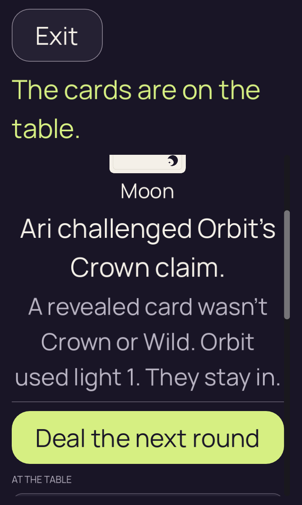
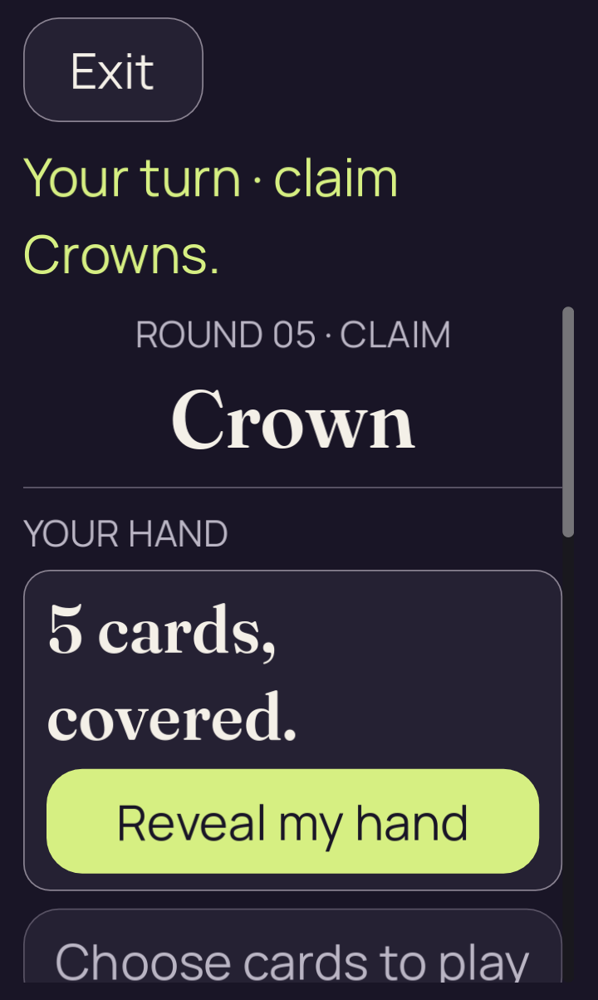
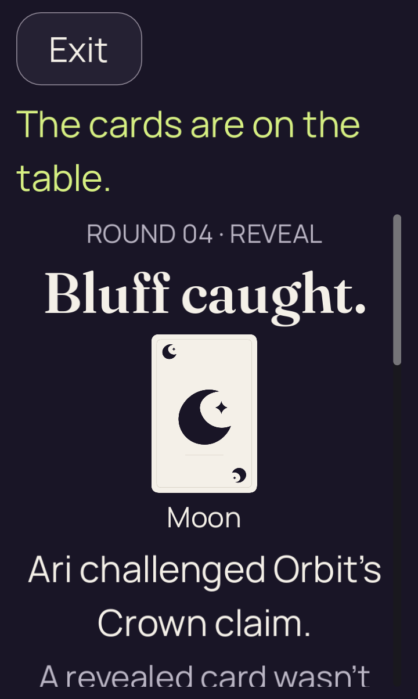
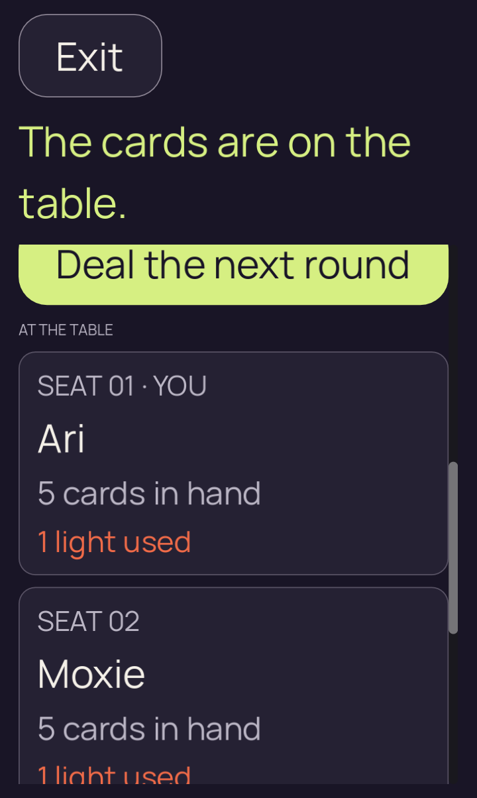
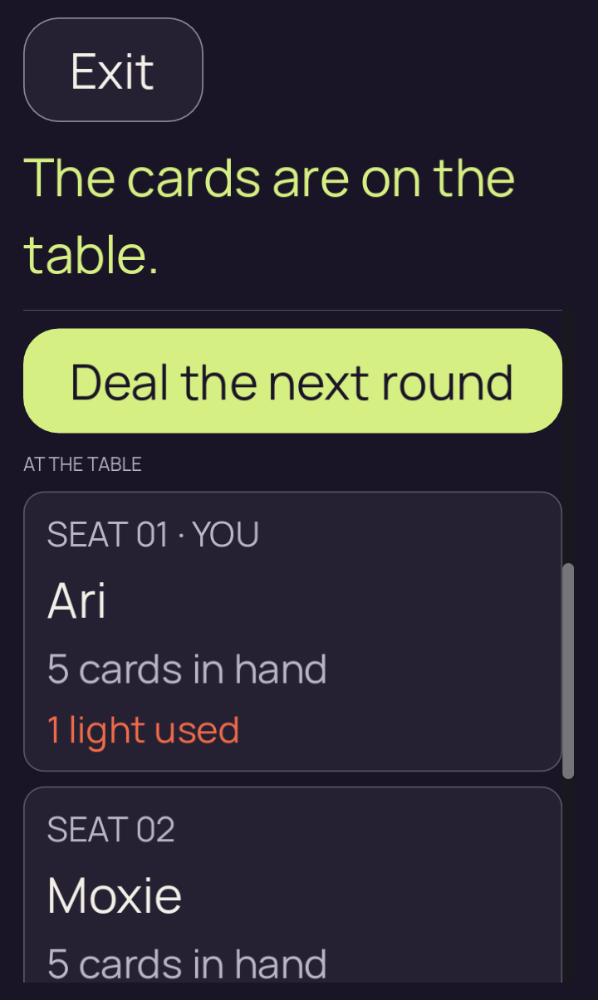

# Godot 2D — adaptive desktop gestures and real authority acceptance

[All screenshot collections](../README.md) · [Original native failure](../godot-android-34433457249/README.md)

**Evidence status:** Both adaptive gestures leave Next fully visible; captured unmodified input is accepted by the real adapter and Kotlin authority, and round 5/revision 12 renders. These are **desktop reproductions**, with actual Godot input and rendering at the failed Android case’s geometry. No Android rerun or iOS failure cause is established here.

Godot 4.7.2.stable.official.ed1daf0bf, X11/Xvfb, OpenGL 4.5 Compatibility / Mesa 25.2.8 llvmpipe LLVM 20.1.2. The 720 × 1204 window at density 1.75 yields a 411.428558 × 688 logical viewport; text is 2.0. The round-4/revision-11 fixture is generated from the real seed-2 authority and contains only its recipient-safe view. The original native failure uses PCK `6599f825a418f9d2a7049b3ba9325e8e0dcb474685262899079231b7ec955938` and revision `bf77ea73e8b3b2f3f4115fda3a95f598c8de1148`.

The local run’s exact whole-tree commit and capture time were not recorded. Twelve [recorded renderer source hashes](provenance.json) independently match that native revision. Reports retain actual input-event counts, physical/logical coordinates and measured durations. No renderer source or direct scroll offset was changed.

Both proposed checker gestures pass the local geometry experiment: a 387-pixel/885 ms upward stroke for a below-clip target and a 63-pixel/350 ms reverse stroke for an above-clip target. The above case first reaches y=191 through three real setup strokes with a held-touch correction; it does not set the scene’s scroll offset. Complete Next labels and borders are visible after both releases.

The actual tap emits an unmodified Ready/Next stream. [AcceptNext.java](AcceptNext.java) reconstructs the same real authority state, verifies the safe launch is byte-identical to the [original fixture](../godot-2d-scroll-investigation-20260910/round-four-launch-2d.json), feeds the captured events to a fresh real bridge adapter, advances the real Kotlin authority and rejects a replay. The returned safe command is then applied to the real renderer; both final originals show round 5/Crown with five concealed own cards. This file-mediated desktop round trip is limited to the exercised step.

All seven PNGs and twenty-two original evidence files remain unchanged, including duplicate initial and final pixels from different cases. [Input probe](adaptive_probe.gd) · [Below-case acceptance](below/authority-receipt.json) · [Above-case acceptance](above/authority-receipt.json) · [Below raw events](below/bridge-events.jsonl) · [Above raw events](above/bridge-events.jsonl).

Source: `/tmp/partydeck-native-2d-scroll-adaptive`. Every thumbnail displays and links to its original PNG.

## below

| Original image | Scenario and provenance |
| --- | --- |
|  | **Round-4 result before below gesture** Godot 4.7.2 desktop, X11/Xvfb, OpenGL Compatibility / Mesa llvmpipe Original: [01-initial.png](below/01-initial.png) 720 × 1204 px; text 2× SHA-256: <code>fe89a612862477c28fc1083cd388777745a64626702659514e0293ebafe1bdff</code> [Original receipt](below/report.json) [Original measurements](below/01-initial.json) Actual desktop Godot/Xvfb/Mesa input at Android-equivalent geometry. This image is not an Android execution. Ari catches Orbit’s Crown claim with a public Moon; Orbit uses light 1 and stays in. Next round starts below the initial viewport at y=809. Each repeated initial original remains separate. |
|  | **Adaptive below-clip gesture leaves the complete Next action visible** Godot 4.7.2 desktop, X11/Xvfb, OpenGL Compatibility / Mesa llvmpipe Original: [03-after-release.png](below/03-after-release.png) 720 × 1204 px; text 2× SHA-256: <code>c844676d20130f89b940d3b747d249dbab2230ae48a3d26fa92e5e872d4a2dce</code> [Original receipt](below/report.json) [Original measurements](below/03-after-release.json) Actual desktop Godot/Xvfb/Mesa input at Android-equivalent geometry. This image is not an Android execution. The proposed 387-pixel stroke requests 885 ms; rendered-frame delivery measures 900.785 ms. Next ends at y=560..632 inside the y=211..676 clip, before the actual tap and subsequent authority acceptance. |
|  | **Actual captured Next accepted by the Kotlin authority — below case** Godot 4.7.2 desktop, X11/Xvfb, OpenGL Compatibility / Mesa llvmpipe Original: [04-after-authority-acceptance.png](below/04-after-authority-acceptance.png) 720 × 1204 px; text 2× SHA-256: <code>e1556857e1438d21c3ddbf0d392a59186bbd1f2d7eff11312863e7bd92a7a774</code> [Original receipt](below/report.json) [Original measurements](below/04-after-authority-acceptance.json) Actual desktop Godot/Xvfb/Mesa input at Android-equivalent geometry. This image is not an Android execution. The fresh real bridge adapter accepts the unmodified Ready/Next events and the authority advances to round 5/revision 12. The returned safe view is applied to this real renderer: Crown table, Ari’s turn, five cards concealed and complete Reveal. Replaying Next is rejected. |

## above

| Original image | Scenario and provenance |
| --- | --- |
|  | **Round-4 result before above gesture** Godot 4.7.2 desktop, X11/Xvfb, OpenGL Compatibility / Mesa llvmpipe Original: [01-initial.png](above/01-initial.png) 720 × 1204 px; text 2× SHA-256: <code>fe89a612862477c28fc1083cd388777745a64626702659514e0293ebafe1bdff</code> [Original receipt](above/report.json) [Original measurements](above/01-initial.json) Actual desktop Godot/Xvfb/Mesa input at Android-equivalent geometry. This image is not an Android execution. Ari catches Orbit’s Crown claim with a public Moon; Orbit uses light 1 and stays in. Next round starts below the initial viewport at y=809. Each repeated initial original remains separate. |
|  | **Above-clip starting position prepared through real touch strokes** Godot 4.7.2 desktop, X11/Xvfb, OpenGL Compatibility / Mesa llvmpipe Original: [02-prepared.png](above/02-prepared.png) 720 × 1204 px; text 2× SHA-256: <code>1a49b4d51cb6d394c55964cd81f6870e301d5571fd7757f87675652cb25c5fec</code> [Original receipt](above/report.json) [Original measurements](above/02-prepared.json) Actual desktop Godot/Xvfb/Mesa input at Android-equivalent geometry. This image is not an Android execution. Three actual touch strokes, a held-touch correction and a stationary hold put Next at y=191. Its top 20 logical units are above the clip beginning at y=211. No scroll setter or renderer edit is used. |
|  | **Adaptive above-clip gesture leaves the complete Next action visible** Godot 4.7.2 desktop, X11/Xvfb, OpenGL Compatibility / Mesa llvmpipe Original: [03-after-release.png](above/03-after-release.png) 720 × 1204 px; text 2× SHA-256: <code>90849ae31fb51c0be462ec40a13361bf81cf5889b55241834642e987755fca73</code> [Original receipt](above/report.json) [Original measurements](above/03-after-release.json) Actual desktop Godot/Xvfb/Mesa input at Android-equivalent geometry. This image is not an Android execution. The proposed 63-pixel reverse stroke requests 350 ms; rendered-frame delivery measures 350.970 ms. Next ends at y=226..298 inside the y=211..676 clip, before the actual tap and subsequent authority acceptance. |
|  | **Actual captured Next accepted by the Kotlin authority — above case** Godot 4.7.2 desktop, X11/Xvfb, OpenGL Compatibility / Mesa llvmpipe Original: [04-after-authority-acceptance.png](above/04-after-authority-acceptance.png) 720 × 1204 px; text 2× SHA-256: <code>e1556857e1438d21c3ddbf0d392a59186bbd1f2d7eff11312863e7bd92a7a774</code> [Original receipt](above/report.json) [Original measurements](above/04-after-authority-acceptance.json) Actual desktop Godot/Xvfb/Mesa input at Android-equivalent geometry. This image is not an Android execution. The fresh real bridge adapter accepts the unmodified Ready/Next events and the authority advances to round 5/revision 12. The returned safe view is applied to this real renderer: Crown table, Ari’s turn, five cards concealed and complete Reveal. Replaying Next is rejected. |
