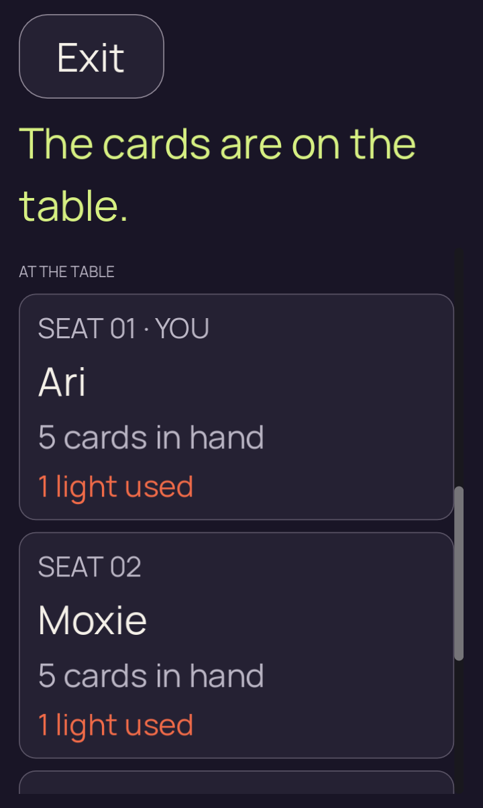
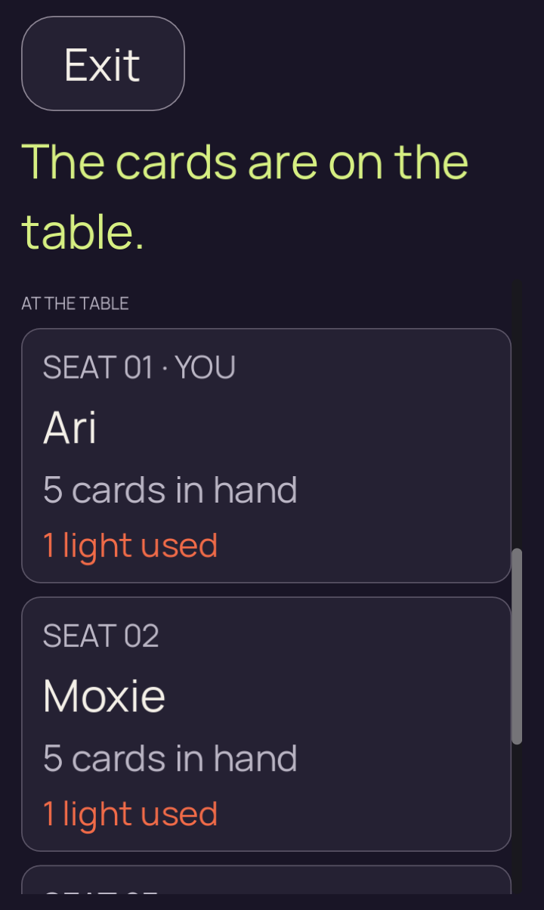
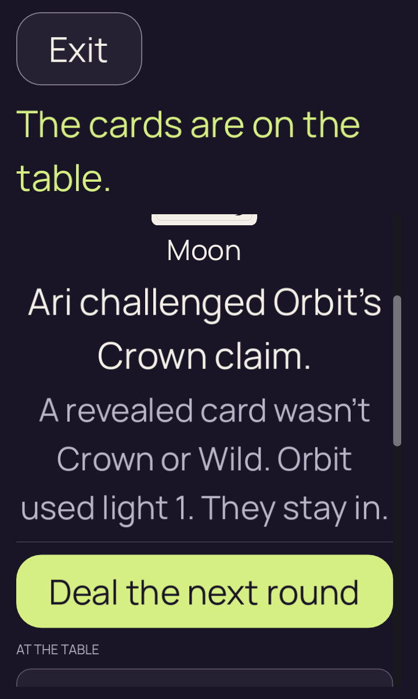

# Godot 2D — desktop investigation of native scroll geometry

[All screenshot collections](../README.md) · [Original native failure](../godot-android-34433457249/README.md)

**Evidence status:** Fast touch and mouse strokes reproduce overshoot; the slow touch leaves Next visible and emits one renderer event without authority acceptance. These are **desktop reproductions**, with actual Godot input and rendering at the failed Android case’s geometry. No Android rerun or iOS failure cause is established here.

Godot 4.7.2.stable.official.ed1daf0bf, X11/Xvfb, OpenGL 4.5 Compatibility / Mesa 25.2.8 llvmpipe LLVM 20.1.2. The 720 × 1204 window at density 1.75 yields a 411.428558 × 688 logical viewport; text is 2.0. The round-4/revision-11 fixture is generated from the real seed-2 authority and contains only its recipient-safe view. The original native failure uses PCK `6599f825a418f9d2a7049b3ba9325e8e0dcb474685262899079231b7ec955938` and revision `bf77ea73e8b3b2f3f4115fda3a95f598c8de1148`.

The local run’s exact whole-tree commit and capture time were not recorded. Twelve [recorded renderer source hashes](provenance.json) independently match that native revision. Reports retain actual input-event counts, physical/logical coordinates and measured durations. No renderer source or direct scroll offset was changed.

The fixed 407-pixel/250 ms touch and mouse strokes expose Next while held, then inertia sends it above the clip. A 900 ms touch stroke over the same distance leaves the complete action visible and emits one legitimate renderer `advance_round` event. That event is not applied to authority in this first fixture probe; the [adaptive follow-up](../godot-2d-scroll-adaptive-20260910/README.md) retains the later real acceptance separately.

All six PNGs and fourteen original diagnostic/report/fixture files remain unchanged. [Fixture generator](RoundFourFixture.java) · [Safe launch](round-four-launch-2d.json) · [Authority operation trace](authority-trace.txt) · [Input probe](scroll_probe.gd). Downloaded upstream research `.cpp` files are not screenshot artifacts; their exact source URLs and hashes remain in the original provenance.

Source: `/tmp/partydeck-native-2d-scroll-investigation`. Every thumbnail displays and links to its original PNG.

## fast-touch

| Original image | Scenario and provenance |
| --- | --- |
|  | **Round-4 result before fast-touch gesture** Godot 4.7.2 desktop, X11/Xvfb, OpenGL Compatibility / Mesa llvmpipe Original: [01-before.png](fast-touch/01-before.png) 720 × 1204 px; text 2× SHA-256: <code>fe89a612862477c28fc1083cd388777745a64626702659514e0293ebafe1bdff</code> [Original receipt](fast-touch/report.json) [Original measurements](fast-touch/01-before.json) Actual desktop Godot/Xvfb/Mesa input at Android-equivalent geometry. This image is not an Android execution. Ari catches Orbit’s Crown claim with a public Moon; Orbit uses light 1 and stays in. Next round starts below the initial viewport at y=809. Each repeated initial original remains separate. |
|  | **fast-touch release overshoots Next above the clip** Godot 4.7.2 desktop, X11/Xvfb, OpenGL Compatibility / Mesa llvmpipe Original: [02-after-release.png](fast-touch/02-after-release.png) 720 × 1204 px; text 2× SHA-256: <code>1e3df145c5fef17c7925720167841f177ec9ddbfca88ecc0ffbc08c99251ab65</code> [Original receipt](fast-touch/report.json) [Original measurements](fast-touch/02-after-release.json) Actual desktop Godot/Xvfb/Mesa input at Android-equivalent geometry. This image is not an Android execution. The 407-pixel stroke requested over 250 ms temporarily exposes Next while held, then inertia moves it to y=138, above the y=211..676 clip. Only Ready is emitted; no advance_round event occurs. |

## fast-mouse

| Original image | Scenario and provenance |
| --- | --- |
|  | **Round-4 result before fast-mouse gesture** Godot 4.7.2 desktop, X11/Xvfb, OpenGL Compatibility / Mesa llvmpipe Original: [01-before.png](fast-mouse/01-before.png) 720 × 1204 px; text 2× SHA-256: <code>fe89a612862477c28fc1083cd388777745a64626702659514e0293ebafe1bdff</code> [Original receipt](fast-mouse/report.json) [Original measurements](fast-mouse/01-before.json) Actual desktop Godot/Xvfb/Mesa input at Android-equivalent geometry. This image is not an Android execution. Ari catches Orbit’s Crown claim with a public Moon; Orbit uses light 1 and stays in. Next round starts below the initial viewport at y=809. Each repeated initial original remains separate. |
|  | **fast-mouse release overshoots Next above the clip** Godot 4.7.2 desktop, X11/Xvfb, OpenGL Compatibility / Mesa llvmpipe Original: [02-after-release.png](fast-mouse/02-after-release.png) 720 × 1204 px; text 2× SHA-256: <code>d7a2aa32463ef5e0f2446924b715cb47d6236acfcd085dcf4fe4127646b13ed8</code> [Original receipt](fast-mouse/report.json) [Original measurements](fast-mouse/02-after-release.json) Actual desktop Godot/Xvfb/Mesa input at Android-equivalent geometry. This image is not an Android execution. The 407-pixel stroke requested over 250 ms temporarily exposes Next while held, then inertia moves it to y=136, above the y=211..676 clip. Only Ready is emitted; no advance_round event occurs. |

## slow-touch

| Original image | Scenario and provenance |
| --- | --- |
|  | **Round-4 result before slow-touch gesture** Godot 4.7.2 desktop, X11/Xvfb, OpenGL Compatibility / Mesa llvmpipe Original: [01-before.png](slow-touch/01-before.png) 720 × 1204 px; text 2× SHA-256: <code>fe89a612862477c28fc1083cd388777745a64626702659514e0293ebafe1bdff</code> [Original receipt](slow-touch/report.json) [Original measurements](slow-touch/01-before.json) Actual desktop Godot/Xvfb/Mesa input at Android-equivalent geometry. This image is not an Android execution. Ari catches Orbit’s Crown claim with a public Moon; Orbit uses light 1 and stays in. Next round starts below the initial viewport at y=809. Each repeated initial original remains separate. |
|  | **Slow touch release leaves Next fully visible** Godot 4.7.2 desktop, X11/Xvfb, OpenGL Compatibility / Mesa llvmpipe Original: [02-after-release.png](slow-touch/02-after-release.png) 720 × 1204 px; text 2× SHA-256: <code>55c4fc338533dfb6fb39c179842ff712964cef31b521dc43a6f928acb1c158ed</code> [Original receipt](slow-touch/report.json) [Original measurements](slow-touch/02-after-release.json) Actual desktop Godot/Xvfb/Mesa input at Android-equivalent geometry. This image is not an Android execution. The 407-pixel stroke requested over 900 ms leaves Next at y=546 with its complete label/border visible. A real touch emits exactly one advance_round event, but this fixture probe does not accept it in authority. |
