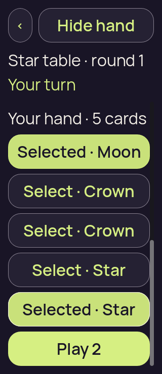
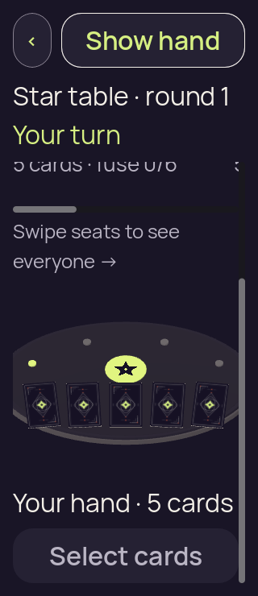
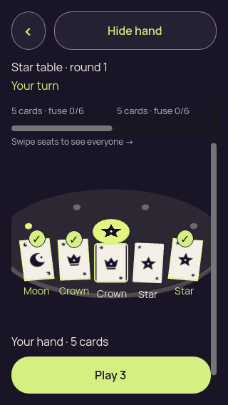
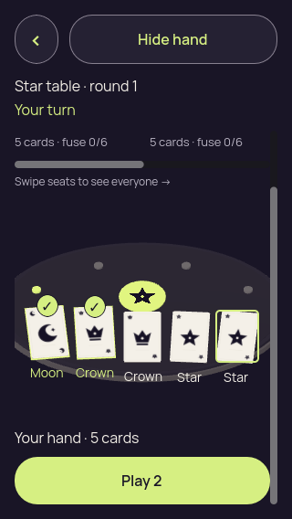
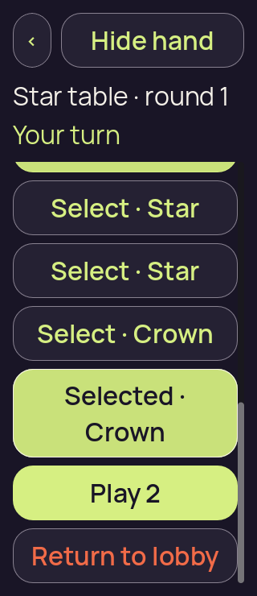
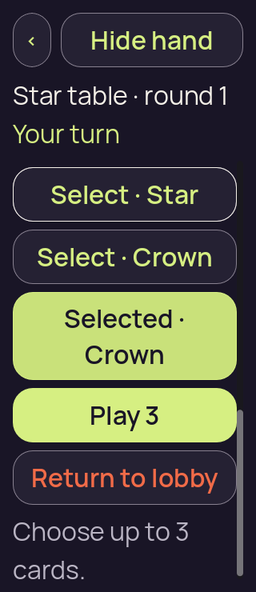
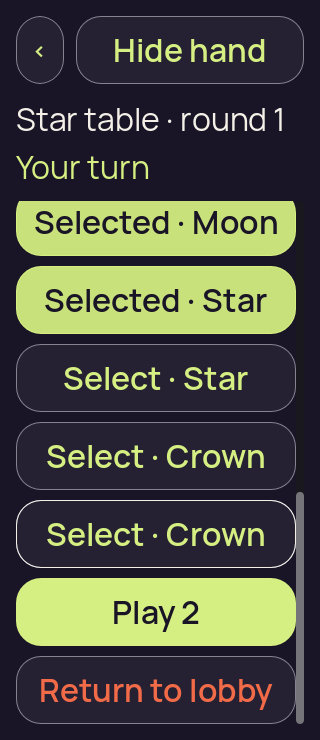
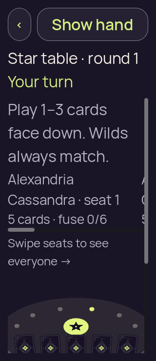

# Godot 3D — v10, final compact input and confirmation checks

[All screenshot collections](../README.md)

**Evidence status:** All three focused cases pass with exit 0. Turn/rank context and Show/Hide remain visible while compact content scrolls; the six-name 200% focused card stays inside the clip, both confirmation actions fit, and emulated drag/tap/selection/privacy checks pass.

All 21 original PNGs are retained, including repeated image states and failed attempts. Every unique state was visually inspected; original bytes, filenames, dimensions and source locations are preserved. Inline thumbnails open the original file.

Actual Godot `4.7.2.stable.official.ed1daf0bf`, OpenGL Compatibility / Mesa llvmpipe / Xvfb. Each case retains its original command, exit code, source-before/source-after hashes, exact `fixture.json`, diagnostics and runtime log. The recorded 8-file [source subset](source/) is frozen and independently matches every corresponding receipt. No exact capture commit was recorded. Passing logs contain no engine/script errors; failing logs retain their original errors.

[Authority provenance](fixture-provenance/authority-provenance.json) and [the edge-fixture manifest](fixture-provenance/fixture-manifest.json) retain case-specific seeds and source recipes. Truthful-rank, truthful-Wild and burnout fixtures use seed 1; other edge inputs and the canonical launch/winner inputs use seed 2. The first five imported cases preserve deterministic recipes and verified safe bytes, without claiming original per-operation logs; new cases record real authority operations. Original fixture tooling is retained with [2D iteration 09](../godot-2d-iteration-09/README.md). Every copied fixture hash and the authority-provenance hash were independently verified.

The reports exercise local reveal, selection, fourth-card rejection, deselection, cover and simulated foreground changes where applicable. A lobby check emits its final local intent without an authority round-trip. All retained concealed, covered, resumed, confirmation and public-outcome frames have zero private faces, labels and selection. Ordinary selected frames have five private faces, seven labels including selection markers and two selections; maximum-selection frames have five faces, eight labels and three selections. Emulated drag frames have five faces/labels and zero selection. The v6 one-card selected frame has one face, two labels and one selection.

Reported hand-target rectangles have at least 48-pixel dimensions and no mutual overlap in the reviewed diagnostics. That full-rectangle check does not make every target visible at every scroll position: v7/v8 containment failures and other offscreen cards remain explicit. These desktop checks do not establish native touch, accessibility, OS lifecycle/snapshot privacy, device performance or LAN behavior.

The final six-name case at 320 × 740 and 200% text fixes the specific v8 failure: focused card 2 now starts at y=209 inside a clip starting at y=201, rather than y=199. The lobby consequence and both choices fit together with dark focused text on the citron choice. Other cards can remain above the current scroll position.

The narrow emulated vertical drag records 0 → 74 at 320 × 568; the 200% drag records 204 → 528 at 320 × 740. Both leave selection at zero and keep the bridge event count at its initial Ready. The original check uses a two-pixel motion for the subsequent tap, rejects a fourth selection without changing the chosen three, and clears selection/private nodes on cover and simulated background/resume. Godot’s emulated touchscreen flag is not evidence of a native device. The broader authority edge coverage belongs to the separately retained v6/v7 source iterations; this final batch contains three focused cases.

## Large text touch

[Capture basis](large-text-touch/capture-basis.json) · [Runtime log](large-text-touch/runtime.log) · [Frozen input](large-text-touch/fixture.json) · [Static report](large-text-touch/report.json) · [Gesture trace](large-text-touch/gesture-diagnostics.json).

| Original image | Scenario and provenance |
| --- | --- |
|  | **Initial concealed own hand — large text touch** Godot 4.7.2 desktop 3D, Compatibility renderer Original: [01-concealed.png](large-text-touch/01-concealed.png) 320 × 740 px; text 2×; seed 2 SHA-256: <code>cb29857d3589cc486fc6724c8893e73e757403cfaf18f0253cc0701e57cf52d6</code> [Original diagnostics](large-text-touch/01-concealed.json) Static seed-2 recipient-safe authority input; no renderer action round-trip to the authority. Emulated vertical card drag: offset 204 → 528, selection 0, event count unchanged at the initial Ready (1). The frozen check also exercises a two-pixel-motion tap, fourth-card rejection and deselection. Turn/rank context and Show/Hide stay in the compact header while content scrolls. This frame belongs to one of three focused static cases, not a rerun of every v6 edge case. |
|  | **Revealed hand after emulated vertical drag, with no selection — large text touch** Godot 4.7.2 desktop 3D, Compatibility renderer Original: [01a-emulated-touch-drag.png](large-text-touch/01a-emulated-touch-drag.png) 320 × 740 px; text 2×; seed 2 SHA-256: <code>eef3f4d15c29d51756ac22258f52b13fabd4858f0b6de5eb204a0715c8904ba5</code> [Original diagnostics](large-text-touch/01a-emulated-touch-drag.json) Static seed-2 recipient-safe authority input; no renderer action round-trip to the authority. Emulated vertical card drag: offset 204 → 528, selection 0, event count unchanged at the initial Ready (1). The frozen check also exercises a two-pixel-motion tap, fourth-card rejection and deselection. Turn/rank context and Show/Hide stay in the compact header while content scrolls. This frame belongs to one of three focused static cases, not a rerun of every v6 edge case. |
|  | **Own hand revealed with first and last cards selected — large text touch** Godot 4.7.2 desktop 3D, Compatibility renderer Original: [02-revealed-selected.png](large-text-touch/02-revealed-selected.png) 320 × 740 px; text 2×; seed 2 SHA-256: <code>39cd72cf3bc4ac535db3bf6df979ce17b4771fbfff5db72e1d89fa735e710bc1</code> [Original diagnostics](large-text-touch/02-revealed-selected.json) Static seed-2 recipient-safe authority input; no renderer action round-trip to the authority. Emulated vertical card drag: offset 204 → 528, selection 0, event count unchanged at the initial Ready (1). The frozen check also exercises a two-pixel-motion tap, fourth-card rejection and deselection. Turn/rank context and Show/Hide stay in the compact header while content scrolls. This frame belongs to one of three focused static cases, not a rerun of every v6 edge case. |
|  | **Three cards selected; fourth choice rejected with count-only feedback — large text touch** Godot 4.7.2 desktop 3D, Compatibility renderer Original: [02a-selection-limit.png](large-text-touch/02a-selection-limit.png) 320 × 740 px; text 2×; seed 2 SHA-256: <code>ebe2b9f2a8b7517f0ca6bff81be42de450af370382d41b3b7650e0abe96984b7</code> [Original diagnostics](large-text-touch/02a-selection-limit.json) Static seed-2 recipient-safe authority input; no renderer action round-trip to the authority. Emulated vertical card drag: offset 204 → 528, selection 0, event count unchanged at the initial Ready (1). The frozen check also exercises a two-pixel-motion tap, fourth-card rejection and deselection. Turn/rank context and Show/Hide stay in the compact header while content scrolls. This frame belongs to one of three focused static cases, not a rerun of every v6 edge case. |
|  | **Last selected card deselected; two selections remain — large text touch** Godot 4.7.2 desktop 3D, Compatibility renderer Original: [02b-deselected-last.png](large-text-touch/02b-deselected-last.png) 320 × 740 px; text 2×; seed 2 SHA-256: <code>4abfa0547a0f4c41f81464d7d7764331a712662a1bfe05c7256bb04a5193b174</code> [Original diagnostics](large-text-touch/02b-deselected-last.json) Static seed-2 recipient-safe authority input; no renderer action round-trip to the authority. Emulated vertical card drag: offset 204 → 528, selection 0, event count unchanged at the initial Ready (1). The frozen check also exercises a two-pixel-motion tap, fourth-card rejection and deselection. Turn/rank context and Show/Hide stay in the compact header while content scrolls. This frame belongs to one of three focused static cases, not a rerun of every v6 edge case. |
|  | **Hand covered with selection cleared — large text touch** Godot 4.7.2 desktop 3D, Compatibility renderer Original: [03-covered-again.png](large-text-touch/03-covered-again.png) 320 × 740 px; text 2×; seed 2 SHA-256: <code>5ed45c165eb85b4607a963f1ceea3b6477c39c8bf50934e389b1694074e8eaa8</code> [Original diagnostics](large-text-touch/03-covered-again.json) Static seed-2 recipient-safe authority input; no renderer action round-trip to the authority. Emulated vertical card drag: offset 204 → 528, selection 0, event count unchanged at the initial Ready (1). The frozen check also exercises a two-pixel-motion tap, fourth-card rejection and deselection. Turn/rank context and Show/Hide stay in the compact header while content scrolls. This frame belongs to one of three focused static cases, not a rerun of every v6 edge case. |
|  | **Hand remains covered after simulated background and resume — large text touch** Godot 4.7.2 desktop 3D, Compatibility renderer Original: [04-resumed-covered.png](large-text-touch/04-resumed-covered.png) 320 × 740 px; text 2×; seed 2 SHA-256: <code>cb29857d3589cc486fc6724c8893e73e757403cfaf18f0253cc0701e57cf52d6</code> [Original diagnostics](large-text-touch/04-resumed-covered.json) Static seed-2 recipient-safe authority input; no renderer action round-trip to the authority. Emulated vertical card drag: offset 204 → 528, selection 0, event count unchanged at the initial Ready (1). The frozen check also exercises a two-pixel-motion tap, fourth-card rejection and deselection. Turn/rank context and Show/Hide stay in the compact header while content scrolls. This frame belongs to one of three focused static cases, not a rerun of every v6 edge case. |

## Narrow touch

[Capture basis](narrow-touch/capture-basis.json) · [Runtime log](narrow-touch/runtime.log) · [Frozen input](narrow-touch/fixture.json) · [Static report](narrow-touch/report.json) · [Gesture trace](narrow-touch/gesture-diagnostics.json).

| Original image | Scenario and provenance |
| --- | --- |
|  | **Initial concealed own hand — narrow touch** Godot 4.7.2 desktop 3D, Compatibility renderer Original: [01-concealed.png](narrow-touch/01-concealed.png) 320 × 568 px; text 1×; seed 2 SHA-256: <code>720130a029e51e9dd3cb611e641929d394921de69bdc42eaf3852e8b67e9a539</code> [Original diagnostics](narrow-touch/01-concealed.json) Static seed-2 recipient-safe authority input; no renderer action round-trip to the authority. Emulated vertical card drag: offset 0 → 74, selection 0, event count unchanged at the initial Ready (1). The frozen check also exercises a two-pixel-motion tap, fourth-card rejection and deselection. Turn/rank context and Show/Hide stay in the compact header while content scrolls. This frame belongs to one of three focused static cases, not a rerun of every v6 edge case. |
|  | **Revealed hand after emulated vertical drag, with no selection — narrow touch** Godot 4.7.2 desktop 3D, Compatibility renderer Original: [01a-emulated-touch-drag.png](narrow-touch/01a-emulated-touch-drag.png) 320 × 568 px; text 1×; seed 2 SHA-256: <code>c94175a8c08056377f6a8b356ef3847c9c0d7af237fc6d0fcd1e335403e27d6e</code> [Original diagnostics](narrow-touch/01a-emulated-touch-drag.json) Static seed-2 recipient-safe authority input; no renderer action round-trip to the authority. Emulated vertical card drag: offset 0 → 74, selection 0, event count unchanged at the initial Ready (1). The frozen check also exercises a two-pixel-motion tap, fourth-card rejection and deselection. Turn/rank context and Show/Hide stay in the compact header while content scrolls. This frame belongs to one of three focused static cases, not a rerun of every v6 edge case. |
|  | **Own hand revealed with first and last cards selected — narrow touch** Godot 4.7.2 desktop 3D, Compatibility renderer Original: [02-revealed-selected.png](narrow-touch/02-revealed-selected.png) 320 × 568 px; text 1×; seed 2 SHA-256: <code>c750118142f29fc4ee0b814b19485e7be5a3181471ac3d33a23235ff3d51671e</code> [Original diagnostics](narrow-touch/02-revealed-selected.json) Static seed-2 recipient-safe authority input; no renderer action round-trip to the authority. Emulated vertical card drag: offset 0 → 74, selection 0, event count unchanged at the initial Ready (1). The frozen check also exercises a two-pixel-motion tap, fourth-card rejection and deselection. Turn/rank context and Show/Hide stay in the compact header while content scrolls. This frame belongs to one of three focused static cases, not a rerun of every v6 edge case. |
|  | **Three cards selected; fourth choice rejected with count-only feedback — narrow touch** Godot 4.7.2 desktop 3D, Compatibility renderer Original: [02a-selection-limit.png](narrow-touch/02a-selection-limit.png) 320 × 568 px; text 1×; seed 2 SHA-256: <code>86ac4da1cc69ce8db70796024dffad1c204d149c4dc050776f12e7d0ad5d4ac0</code> [Original diagnostics](narrow-touch/02a-selection-limit.json) Static seed-2 recipient-safe authority input; no renderer action round-trip to the authority. Emulated vertical card drag: offset 0 → 74, selection 0, event count unchanged at the initial Ready (1). The frozen check also exercises a two-pixel-motion tap, fourth-card rejection and deselection. Turn/rank context and Show/Hide stay in the compact header while content scrolls. This frame belongs to one of three focused static cases, not a rerun of every v6 edge case. |
|  | **Last selected card deselected; two selections remain — narrow touch** Godot 4.7.2 desktop 3D, Compatibility renderer Original: [02b-deselected-last.png](narrow-touch/02b-deselected-last.png) 320 × 568 px; text 1×; seed 2 SHA-256: <code>e27b90d77a47d6773e412ec108d50441b37705105eacdfc4d4adb3ac252c0a06</code> [Original diagnostics](narrow-touch/02b-deselected-last.json) Static seed-2 recipient-safe authority input; no renderer action round-trip to the authority. Emulated vertical card drag: offset 0 → 74, selection 0, event count unchanged at the initial Ready (1). The frozen check also exercises a two-pixel-motion tap, fourth-card rejection and deselection. Turn/rank context and Show/Hide stay in the compact header while content scrolls. This frame belongs to one of three focused static cases, not a rerun of every v6 edge case. |
|  | **Hand covered with selection cleared — narrow touch** Godot 4.7.2 desktop 3D, Compatibility renderer Original: [03-covered-again.png](narrow-touch/03-covered-again.png) 320 × 568 px; text 1×; seed 2 SHA-256: <code>b47cb68d287c9ea7bda86cd39895d47590053357173c4ae62e1a20cc3a155698</code> [Original diagnostics](narrow-touch/03-covered-again.json) Static seed-2 recipient-safe authority input; no renderer action round-trip to the authority. Emulated vertical card drag: offset 0 → 74, selection 0, event count unchanged at the initial Ready (1). The frozen check also exercises a two-pixel-motion tap, fourth-card rejection and deselection. Turn/rank context and Show/Hide stay in the compact header while content scrolls. This frame belongs to one of three focused static cases, not a rerun of every v6 edge case. |
|  | **Hand remains covered after simulated background and resume — narrow touch** Godot 4.7.2 desktop 3D, Compatibility renderer Original: [04-resumed-covered.png](narrow-touch/04-resumed-covered.png) 320 × 568 px; text 1×; seed 2 SHA-256: <code>720130a029e51e9dd3cb611e641929d394921de69bdc42eaf3852e8b67e9a539</code> [Original diagnostics](narrow-touch/04-resumed-covered.json) Static seed-2 recipient-safe authority input; no renderer action round-trip to the authority. Emulated vertical card drag: offset 0 → 74, selection 0, event count unchanged at the initial Ready (1). The frozen check also exercises a two-pixel-motion tap, fourth-card rejection and deselection. Turn/rank context and Show/Hide stay in the compact header while content scrolls. This frame belongs to one of three focused static cases, not a rerun of every v6 edge case. |

## Six long names large text

[Capture basis](six-long-names-large-text/capture-basis.json) · [Runtime log](six-long-names-large-text/runtime.log) · [Frozen input](six-long-names-large-text/fixture.json) · [Static report](six-long-names-large-text/report.json).

| Original image | Scenario and provenance |
| --- | --- |
|  | **Initial concealed own hand — six long names large text** Godot 4.7.2 desktop 3D, Compatibility renderer Original: [01-concealed.png](six-long-names-large-text/01-concealed.png) 320 × 740 px; text 2×; seed 2 SHA-256: <code>d2a19f623dcb036640582f1ad9fe7d7eb9ae2226fe167b160132f70237d8208c</code> [Original diagnostics](six-long-names-large-text/01-concealed.json) Static seed-2 recipient-safe authority input; no renderer action round-trip to the authority. Turn/rank context and Show/Hide stay in the compact header while content scrolls. This frame belongs to one of three focused static cases, not a rerun of every v6 edge case. |
|  | **Own hand revealed with first and last cards selected — six long names large text** Godot 4.7.2 desktop 3D, Compatibility renderer Original: [02-revealed-selected.png](six-long-names-large-text/02-revealed-selected.png) 320 × 740 px; text 2×; seed 2 SHA-256: <code>047a4ed11344904ac5df65f2e13b45207b71b24dc60dfdaf9c5587003a0dc449</code> [Original diagnostics](six-long-names-large-text/02-revealed-selected.json) Static seed-2 recipient-safe authority input; no renderer action round-trip to the authority. Turn/rank context and Show/Hide stay in the compact header while content scrolls. This frame belongs to one of three focused static cases, not a rerun of every v6 edge case. |
|  | **Three cards selected; fourth choice rejected with count-only feedback — six long names large text** Godot 4.7.2 desktop 3D, Compatibility renderer Original: [02a-selection-limit.png](six-long-names-large-text/02a-selection-limit.png) 320 × 740 px; text 2×; seed 2 SHA-256: <code>574234d36ef821257fb765438aa85de33c09c6941d4d0305820119b1264aab53</code> [Original diagnostics](six-long-names-large-text/02a-selection-limit.json) Static seed-2 recipient-safe authority input; no renderer action round-trip to the authority. The focused card 2 now occupies [16,209,280,68], fully within clip [16,201,288,523] with an eight-pixel top margin. Other cards remain above this scrolled viewport; simultaneous visibility of every selection is not claimed. Turn/rank context and Show/Hide stay in the compact header while content scrolls. This frame belongs to one of three focused static cases, not a rerun of every v6 edge case. |
|  | **Last selected card deselected; two selections remain — six long names large text** Godot 4.7.2 desktop 3D, Compatibility renderer Original: [02b-deselected-last.png](six-long-names-large-text/02b-deselected-last.png) 320 × 740 px; text 2×; seed 2 SHA-256: <code>5a5597c0ff5520dcae12eee058001aea44eb8f5ac051d8b4895be8b19419b2fa</code> [Original diagnostics](six-long-names-large-text/02b-deselected-last.json) Static seed-2 recipient-safe authority input; no renderer action round-trip to the authority. Turn/rank context and Show/Hide stay in the compact header while content scrolls. This frame belongs to one of three focused static cases, not a rerun of every v6 edge case. |
|  | **Hand covered with selection cleared — six long names large text** Godot 4.7.2 desktop 3D, Compatibility renderer Original: [03-covered-again.png](six-long-names-large-text/03-covered-again.png) 320 × 740 px; text 2×; seed 2 SHA-256: <code>5df5e2e92f0992f9fab3cd14adbc9f79a6fb5ab7c2dce5562f05d51139569eba</code> [Original diagnostics](six-long-names-large-text/03-covered-again.json) Static seed-2 recipient-safe authority input; no renderer action round-trip to the authority. Turn/rank context and Show/Hide stay in the compact header while content scrolls. This frame belongs to one of three focused static cases, not a rerun of every v6 edge case. |
|  | **Hand remains covered after simulated background and resume — six long names large text** Godot 4.7.2 desktop 3D, Compatibility renderer Original: [04-resumed-covered.png](six-long-names-large-text/04-resumed-covered.png) 320 × 740 px; text 2×; seed 2 SHA-256: <code>d2a19f623dcb036640582f1ad9fe7d7eb9ae2226fe167b160132f70237d8208c</code> [Original diagnostics](six-long-names-large-text/04-resumed-covered.json) Static seed-2 recipient-safe authority input; no renderer action round-trip to the authority. Turn/rank context and Show/Hide stay in the compact header while content scrolls. This frame belongs to one of three focused static cases, not a rerun of every v6 edge case. |
|  | **Return-to-lobby consequence and both choices — six long names large text** Godot 4.7.2 desktop 3D, Compatibility renderer Original: [05-lobby-confirmation.png](six-long-names-large-text/05-lobby-confirmation.png) 320 × 740 px; text 2×; seed 2 SHA-256: <code>b99bf2755d270f042dd938e0adb08482d886a14ccd43a60c9383dba06ad361d1</code> [Original diagnostics](six-long-names-large-text/05-lobby-confirmation.json) Static seed-2 recipient-safe authority input; no renderer action round-trip to the authority. Confirm [24,335,272,68] and Keep playing [24,423,272,68] both fit clip [24,24,272,692]. The focused Keep playing label has readable dark text on citron. Turn/rank context and Show/Hide stay in the compact header while content scrolls. This frame belongs to one of three focused static cases, not a rerun of every v6 edge case. |
