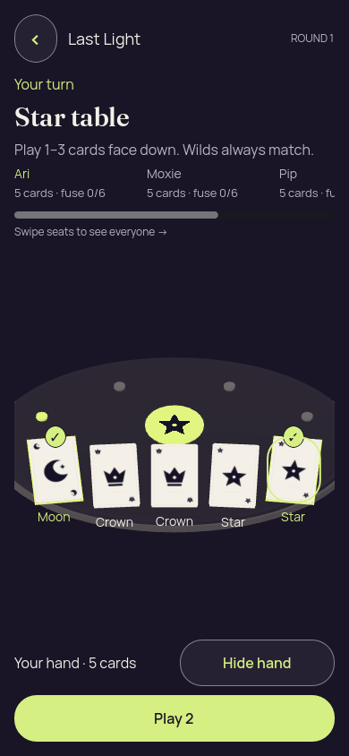
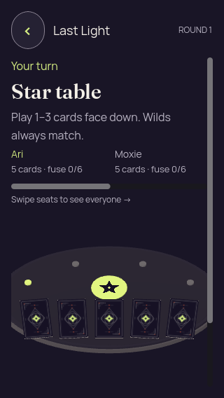
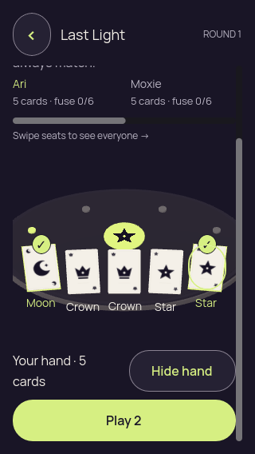
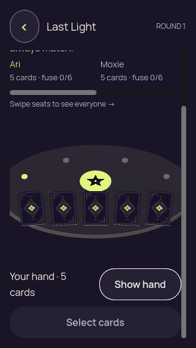
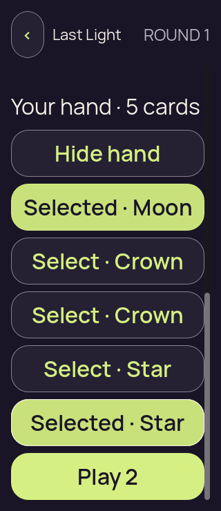
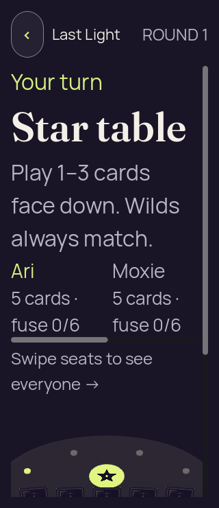
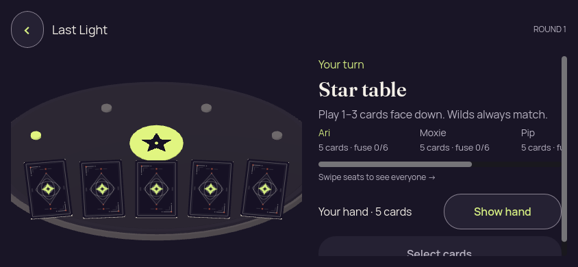
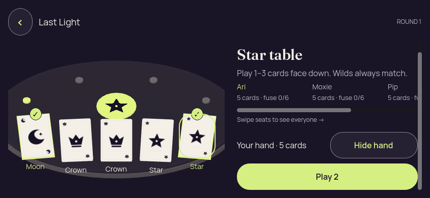
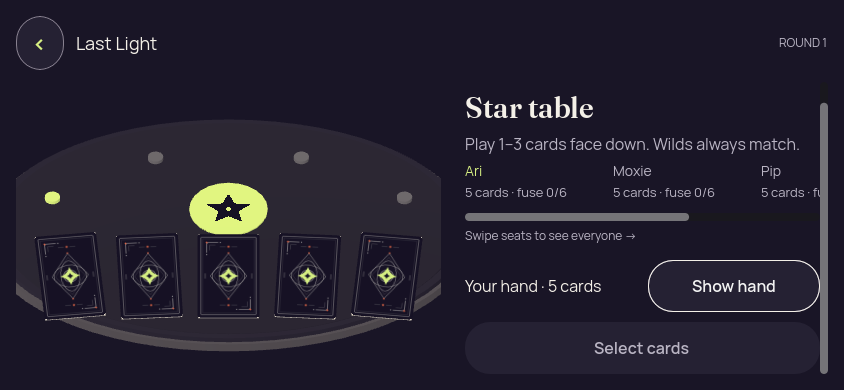
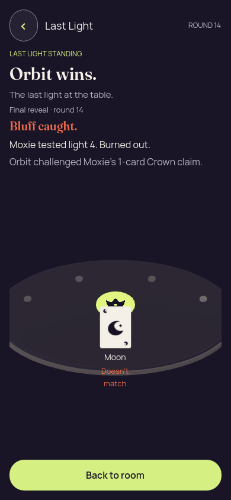

# Godot 3D — v5, corrected winner and larger selectable controls

[All screenshot collections](../README.md)

**Evidence status:** The Crown winner emblem and named final challenge/burnout explanation are corrected. Four local hand-target checks have at least 48-pixel dimensions and no overlap; 200% selection uses readable controls. Scrolled compact views still lose current turn/rank context, and a rounded focus outline remains around the focused card.

Actual Godot `4.7.2.stable.official.ed1daf0bf`, OpenGL Compatibility / Mesa llvmpipe 25.2.8 LLVM 20.1.2 / Xvfb Linux. [Original provenance](provenance.json) describes isolated v5 source based on canonical v4. All six frozen [source files](source/) match the recorded hashes. The exact source commit was not recorded.

Five original capture-basis/runtime pairs all record exit 0, unchanged before/after source hashes and matching seed-2 authority fixture hashes. Neither error nor script-error diagnostics appear in their logs. The [playing](../history/godot-3d-fixtures/launch-3d.json) and [finished](../history/godot-3d-fixtures/finished-launch-3d.json) fixtures remain frozen recipient-safe Kotlin-authority projections. No gameplay input is round-tripped to the authority in this static suite.

The winner now shows **Crown** behind the public Moon and names Orbit’s challenge, Moxie’s one-card claim and light-4 burnout. This corrects the [v4 winner defect](../history/godot-3d-20260910-v4/README.md); it does not retroactively change the earlier matched packed gameplay captures.

The revealed hand targets in portrait, narrow, landscape and 200% captures independently measure at least 48 × 48 **desktop pixels**, with no pairwise overlap. Those source/receipt coordinates do not establish Android dp, iOS pt or native finger input. At 200%, five enlarged selectable controls replace dependence on the small projected card targets.

Visual limits remain: Show hand begins below the initial narrow/200% viewports; the checker scrolls to it. Selected compact views lose current-turn context, and the 200% action view also loses the claim rank. Landscape selection scrolls the turn line away. The focused projected card has a rounded pill-like outline. These are retained current observations, not a full visual pass.

All 13 unique states were visually inspected and all 17 scenario PNGs are retained. Each resumed image is byte-identical to its initial concealed state; post-cover frames retain their distinct scroll/focus state. Concealed, covered, resumed and winner diagnostics have zero private faces, labels and selected cards. Revealed selected frames report five private faces, seven private labels and two selected cards.

## Portrait

[Original static report](portrait/report.json) · [Original capture basis](portrait/capture-basis.json) · [Original runtime log](portrait/runtime.log).

| Original image | Scenario and provenance |
| --- | --- |
|  | **Initial concealed own hand — portrait** Godot 4.7.2 desktop 3D, Compatibility renderer Original: [01-concealed.png](portrait/01-concealed.png) 390 × 844 px; text 1×; seed 2 SHA-256: <code>9b31edd4d8a07d0353e4732c5676f0e76b4fc536e193cc804e3f85ce52e51b9f</code> [Original diagnostics](portrait/01-concealed.json) Static seed-2 authority-derived fixture with local renderer input/privacy checks; no authority round trip is exercised. |
|  | **Own hand revealed with first and last cards selected — portrait** Godot 4.7.2 desktop 3D, Compatibility renderer Original: [02-revealed-selected.png](portrait/02-revealed-selected.png) 390 × 844 px; text 1×; seed 2 SHA-256: <code>afd1dde12013b45ac2b0f064ab4d81ddf619ee20719672c997f38984d5af5305</code> [Original diagnostics](portrait/02-revealed-selected.json) Static seed-2 authority-derived fixture with local renderer input/privacy checks; no authority round trip is exercised. Five hand targets independently measure at least 48 pixels in both dimensions with no overlap; this is desktop geometry, not native dp/pt. A rounded focus outline remains around the last focused selected card. |
|  | **Hand covered with selection cleared — portrait** Godot 4.7.2 desktop 3D, Compatibility renderer Original: [03-covered-again.png](portrait/03-covered-again.png) 390 × 844 px; text 1×; seed 2 SHA-256: <code>7cfb096aac1acb5315bfe842bbfa0b9ad1a20cfb7589e4c8a7ade3555388401d</code> [Original diagnostics](portrait/03-covered-again.json) Static seed-2 authority-derived fixture with local renderer input/privacy checks; no authority round trip is exercised. |
|  | **Hand remains covered after background and resume — portrait** Godot 4.7.2 desktop 3D, Compatibility renderer Original: [04-resumed-covered.png](portrait/04-resumed-covered.png) 390 × 844 px; text 1×; seed 2 SHA-256: <code>9b31edd4d8a07d0353e4732c5676f0e76b4fc536e193cc804e3f85ce52e51b9f</code> [Original diagnostics](portrait/04-resumed-covered.json) Static seed-2 authority-derived fixture with local renderer input/privacy checks; no authority round trip is exercised. |

## Narrow

[Original static report](narrow/report.json) · [Original capture basis](narrow/capture-basis.json) · [Original runtime log](narrow/runtime.log).

| Original image | Scenario and provenance |
| --- | --- |
|  | **Initial concealed own hand — narrow** Godot 4.7.2 desktop 3D, Compatibility renderer Original: [01-concealed.png](narrow/01-concealed.png) 320 × 568 px; text 1×; seed 2 SHA-256: <code>3e97da9cf2cd2405a5948fe4cfdd90984c7fe7b3d26fbcc75dd4c07b1e7a6636</code> [Original diagnostics](narrow/01-concealed.json) Static seed-2 authority-derived fixture with local renderer input/privacy checks; no authority round trip is exercised. Initial/re-entered viewport does not show Show hand; the local checker scrolls to reach it. |
|  | **Own hand revealed with first and last cards selected — narrow** Godot 4.7.2 desktop 3D, Compatibility renderer Original: [02-revealed-selected.png](narrow/02-revealed-selected.png) 320 × 568 px; text 1×; seed 2 SHA-256: <code>eddd8856ead3c2211235537de2867355cfc80fc69cb422cacd96161f1fabcc21</code> [Original diagnostics](narrow/02-revealed-selected.json) Static seed-2 authority-derived fixture with local renderer input/privacy checks; no authority round trip is exercised. Scrolled hand/actions are visible, but current turn text is above the viewport. At 200% the selected view also loses visible claim-rank context. Five hand targets independently measure at least 48 pixels in both dimensions with no overlap; this is desktop geometry, not native dp/pt. A rounded focus outline remains around the last focused selected card. |
|  | **Hand covered with selection cleared — narrow** Godot 4.7.2 desktop 3D, Compatibility renderer Original: [03-covered-again.png](narrow/03-covered-again.png) 320 × 568 px; text 1×; seed 2 SHA-256: <code>20369e1625dafc7bf8a9237ec9001aa8fcb500f901d3ccf6d7428b726e32826b</code> [Original diagnostics](narrow/03-covered-again.json) Static seed-2 authority-derived fixture with local renderer input/privacy checks; no authority round trip is exercised. Scrolled hand/actions are visible, but current turn text is above the viewport. At 200% the selected view also loses visible claim-rank context. |
|  | **Hand remains covered after background and resume — narrow** Godot 4.7.2 desktop 3D, Compatibility renderer Original: [04-resumed-covered.png](narrow/04-resumed-covered.png) 320 × 568 px; text 1×; seed 2 SHA-256: <code>3e97da9cf2cd2405a5948fe4cfdd90984c7fe7b3d26fbcc75dd4c07b1e7a6636</code> [Original diagnostics](narrow/04-resumed-covered.json) Static seed-2 authority-derived fixture with local renderer input/privacy checks; no authority round trip is exercised. Initial/re-entered viewport does not show Show hand; the local checker scrolls to reach it. |

## Large text

[Original static report](large-text/report.json) · [Original capture basis](large-text/capture-basis.json) · [Original runtime log](large-text/runtime.log).

| Original image | Scenario and provenance |
| --- | --- |
|  | **Initial concealed own hand — large text** Godot 4.7.2 desktop 3D, Compatibility renderer Original: [01-concealed.png](large-text/01-concealed.png) 320 × 740 px; text 2×; seed 2 SHA-256: <code>665a7ff040f9988b04ae492883b2c7a9ea0e3b60db9b04b616b4c66e7d9681af</code> [Original diagnostics](large-text/01-concealed.json) Static seed-2 authority-derived fixture with local renderer input/privacy checks; no authority round trip is exercised. Initial/re-entered viewport does not show Show hand; the local checker scrolls to reach it. |
|  | **Own hand revealed with first and last cards selected — large text** Godot 4.7.2 desktop 3D, Compatibility renderer Original: [02-revealed-selected.png](large-text/02-revealed-selected.png) 320 × 740 px; text 2×; seed 2 SHA-256: <code>2c41be2dd26e1dd11a0b745c58bd25bb7189b4366b9f0b064f0e85c71f3a4779</code> [Original diagnostics](large-text/02-revealed-selected.json) Static seed-2 authority-derived fixture with local renderer input/privacy checks; no authority round trip is exercised. Scrolled hand/actions are visible, but current turn text is above the viewport. At 200% the selected view also loses visible claim-rank context. Five hand targets independently measure at least 48 pixels in both dimensions with no overlap; this is desktop geometry, not native dp/pt. Five enlarged selection Buttons and Play 2 are visible after scrolling; these Godot controls do not establish native accessibility. |
|  | **Hand covered with selection cleared — large text** Godot 4.7.2 desktop 3D, Compatibility renderer Original: [03-covered-again.png](large-text/03-covered-again.png) 320 × 740 px; text 2×; seed 2 SHA-256: <code>7ca1595f4dabdfc7d624613668ea4d778db1e860c039c6b96816be351fdbc0d9</code> [Original diagnostics](large-text/03-covered-again.json) Static seed-2 authority-derived fixture with local renderer input/privacy checks; no authority round trip is exercised. Scrolled hand/actions are visible, but current turn text is above the viewport. At 200% the selected view also loses visible claim-rank context. |
|  | **Hand remains covered after background and resume — large text** Godot 4.7.2 desktop 3D, Compatibility renderer Original: [04-resumed-covered.png](large-text/04-resumed-covered.png) 320 × 740 px; text 2×; seed 2 SHA-256: <code>665a7ff040f9988b04ae492883b2c7a9ea0e3b60db9b04b616b4c66e7d9681af</code> [Original diagnostics](large-text/04-resumed-covered.json) Static seed-2 authority-derived fixture with local renderer input/privacy checks; no authority round trip is exercised. Initial/re-entered viewport does not show Show hand; the local checker scrolls to reach it. |

## Landscape

[Original static report](landscape/report.json) · [Original capture basis](landscape/capture-basis.json) · [Original runtime log](landscape/runtime.log).

| Original image | Scenario and provenance |
| --- | --- |
|  | **Initial concealed own hand — landscape** Godot 4.7.2 desktop 3D, Compatibility renderer Original: [01-concealed.png](landscape/01-concealed.png) 844 × 390 px; text 1×; seed 2 SHA-256: <code>932a54887cb5483616be71521c27040f9055dcf6ced2765a6d6f68277b68c3b2</code> [Original diagnostics](landscape/01-concealed.json) Static seed-2 authority-derived fixture with local renderer input/privacy checks; no authority round trip is exercised. |
|  | **Own hand revealed with first and last cards selected — landscape** Godot 4.7.2 desktop 3D, Compatibility renderer Original: [02-revealed-selected.png](landscape/02-revealed-selected.png) 844 × 390 px; text 1×; seed 2 SHA-256: <code>88cd032a546c09d5f3572657d0eb2eac794b80e1988d6df9833629662f88dfa1</code> [Original diagnostics](landscape/02-revealed-selected.json) Static seed-2 authority-derived fixture with local renderer input/privacy checks; no authority round trip is exercised. The current-turn text has scrolled above the visible action column; the table rank remains visible. Five hand targets independently measure at least 48 pixels in both dimensions with no overlap; this is desktop geometry, not native dp/pt. A rounded focus outline remains around the last focused selected card. |
|  | **Hand covered with selection cleared — landscape** Godot 4.7.2 desktop 3D, Compatibility renderer Original: [03-covered-again.png](landscape/03-covered-again.png) 844 × 390 px; text 1×; seed 2 SHA-256: <code>d0969f69f3321a4a64e6bacada526e68d22bbc719fac3f6e6494b1fccd2faa83</code> [Original diagnostics](landscape/03-covered-again.json) Static seed-2 authority-derived fixture with local renderer input/privacy checks; no authority round trip is exercised. The current-turn text has scrolled above the visible action column; the table rank remains visible. |
|  | **Hand remains covered after background and resume — landscape** Godot 4.7.2 desktop 3D, Compatibility renderer Original: [04-resumed-covered.png](landscape/04-resumed-covered.png) 844 × 390 px; text 1×; seed 2 SHA-256: <code>932a54887cb5483616be71521c27040f9055dcf6ced2765a6d6f68277b68c3b2</code> [Original diagnostics](landscape/04-resumed-covered.json) Static seed-2 authority-derived fixture with local renderer input/privacy checks; no authority round trip is exercised. |

## Winner

[Original static report](winner/report.json) · [Original capture basis](winner/capture-basis.json) · [Original runtime log](winner/runtime.log).

| Original image | Scenario and provenance |
| --- | --- |
|  | **Orbit wins; Crown emblem and named final Moon-bluff explanation** Godot 4.7.2 desktop 3D, Compatibility renderer Original: [01-concealed.png](winner/01-concealed.png) 390 × 844 px; text 1×; seed 2 SHA-256: <code>9c05677e9419a61112c638769c78a8644fdf7049452dbea28b1c228792f5ae93</code> [Original diagnostics](winner/01-concealed.json) Static seed-2 authority-derived fixture with local renderer input/privacy checks; no authority round trip is exercised. Orbit challenged Moxie’s one-card Crown claim; Moxie used light 4 and burned out. Crown, public Moon and the named explanation are now visible. |
