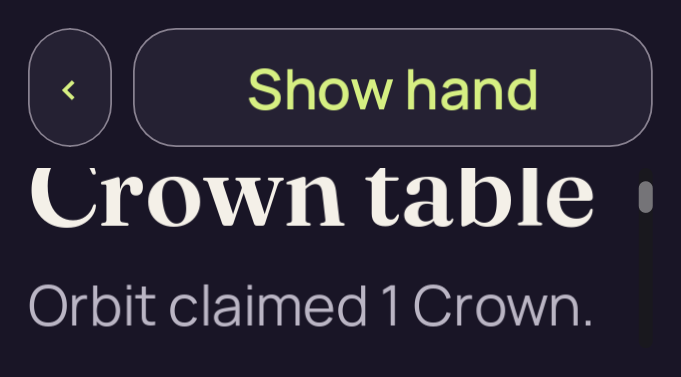

# candidate-short-density-v2

**Superseded iteration**. This run retains **3 original PNGs**: 3 direct views, 0 reviewed byte matches and 0 without attributed pixel review.

Table source SHA-256: `aa351d4ed7a7ff51cb1292e4eabdb93408b3507c60c02018cfb6a962a7bde0fe`. Project fingerprint: `6416ab747e32135e4f95dc20ea9f8d1fbe7e18e77f5ed976c3ee7d33d30d4e31`.

[Collection and scope](../../README.md) · [Original run receipt](../../provenance/owner/runs/candidate-short-density-v2/run-receipt.json) · [Independent review](../../provenance/review/INDEPENDENT-REVIEW.json)

This earlier source or harness iteration was superseded. Its original execution result and pixel-review status remain separate from final V2 acceptance.

Source filenames identify recorded stages. A stage name alone does not confer pixel review or native acceptance.

## 01-initial.png

**Direct view** · /root/pixel_d2_sea · 681 × 377 · 38,659 bytes.

Owner identity 14; SHA-256 `638958deda7588604bb2826fd783316347dccd3421a07507318cfae89b8979a9`.

[Original capture receipt](../../provenance/owner/runs/candidate-short-density-v2/01-initial.png.receipt.json) · [Attributed review or unviewed record](../../provenance/review/candidate-v1-interim-review.json).

## 02-claim-scroll.png

**Direct view** · /root/pixel_d2_sea · 681 × 377 · 53,210 bytes.

Owner identity 15; SHA-256 `c3b9cd9990fe6c727b2cfce673f18c9a3fce6ef7277d22a988a31744ed21f708`.

[Original capture receipt](../../provenance/owner/runs/candidate-short-density-v2/02-claim-scroll.png.receipt.json) · [Attributed review or unviewed record](../../provenance/review/candidate-v1-interim-review.json).

## 03-claim-scroll.png

**Direct view** · /root/pixel_d2_sea · 681 × 377 · 49,438 bytes.

Owner identity 16; SHA-256 `bc589896db0d92cc68cc11f473cc9d8e2c1facbf715afbd51b756d4e01450c68`.

[Original capture receipt](../../provenance/owner/runs/candidate-short-density-v2/03-claim-scroll.png.receipt.json) · [Attributed review or unviewed record](../../provenance/review/candidate-v1-interim-review.json).
