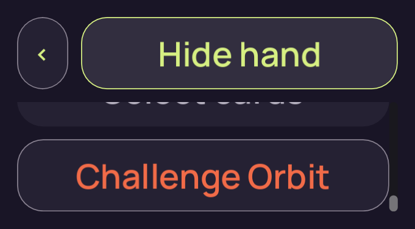
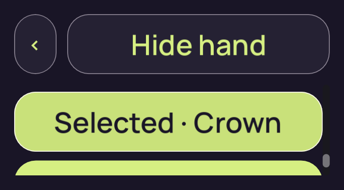
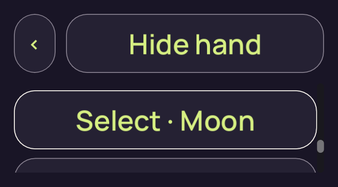
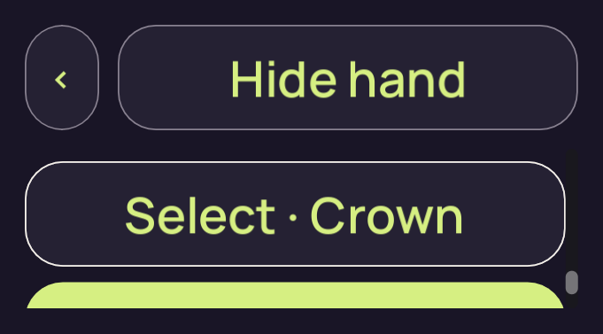
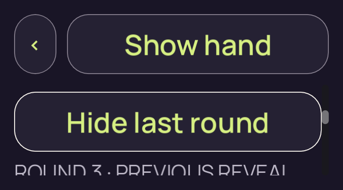

# candidate-short-input-v1

**Superseded iteration**. This run retains **8 original PNGs**: 0 direct views, 0 reviewed byte matches and 8 without attributed pixel review.

Table source SHA-256: `aa351d4ed7a7ff51cb1292e4eabdb93408b3507c60c02018cfb6a962a7bde0fe`. Project fingerprint: `6416ab747e32135e4f95dc20ea9f8d1fbe7e18e77f5ed976c3ee7d33d30d4e31`.

[Collection and scope](../../README.md) · [Original run receipt](../../provenance/owner/runs/candidate-short-input-v1/run-receipt.json) · [Independent review](../../provenance/review/INDEPENDENT-REVIEW.json)

This earlier source or harness iteration was superseded. Its original execution result and pixel-review status remain separate from final V2 acceptance.

Source filenames identify recorded stages. A stage name alone does not confer pixel review or native acceptance.

## 01-concealed.png

**Unviewed** · No attributed pixel review · 681 × 377 · 38,659 bytes.

Owner identity 17; SHA-256 `638958deda7588604bb2826fd783316347dccd3421a07507318cfae89b8979a9`.

[Original capture receipt](../../provenance/owner/runs/candidate-short-input-v1/01-concealed.png.receipt.json) · [Attributed review or unviewed record](../../provenance/review/new-capture-review-index.json).

## 01a-emulated-touch-drag.png

**Unviewed** · No attributed pixel review · 681 × 377 · 34,245 bytes.

Owner identity 18; SHA-256 `0f5da58df615d0808ec27c7d7567d84a6d518e2415aa661dfa97811fe60bfcdd`.

[Original capture receipt](../../provenance/owner/runs/candidate-short-input-v1/01a-emulated-touch-drag.png.receipt.json) · [Attributed review or unviewed record](../../provenance/review/new-capture-review-index.json).

## 02-revealed-selected.png

**Unviewed** · No attributed pixel review · 681 × 377 · 36,015 bytes.

Owner identity 19; SHA-256 `481d760423fe64361f1464d5c6201aa0a955aec1ed506ac7954caf21b2b02579`.

[Original capture receipt](../../provenance/owner/runs/candidate-short-input-v1/02-revealed-selected.png.receipt.json) · [Attributed review or unviewed record](../../provenance/review/new-capture-review-index.json).

## 02a-selection-limit.png

**Unviewed** · No attributed pixel review · 681 × 377 · 33,257 bytes.

Owner identity 20; SHA-256 `6f657713ee628f09fc01f8eb3187a15e4f6cbf196b68dbc865d5654566d07bf4`.

[Original capture receipt](../../provenance/owner/runs/candidate-short-input-v1/02a-selection-limit.png.receipt.json) · [Attributed review or unviewed record](../../provenance/review/new-capture-review-index.json).

## 02b-deselected-last.png

**Unviewed** · No attributed pixel review · 681 × 377 · 33,222 bytes.

Owner identity 21; SHA-256 `4f9782fef639ef107e860d28c200ab156ed60841372bc4749a99164eac47799d`.

[Original capture receipt](../../provenance/owner/runs/candidate-short-input-v1/02b-deselected-last.png.receipt.json) · [Attributed review or unviewed record](../../provenance/review/new-capture-review-index.json).

## 03-covered-again.png

**Unviewed** · No attributed pixel review · 681 × 377 · 37,714 bytes.

Owner identity 22; SHA-256 `1b42b2660864e36fd8422eca7ba92decbf2fa31d3ede60ce94750a0fb9f99246`.

[Original capture receipt](../../provenance/owner/runs/candidate-short-input-v1/03-covered-again.png.receipt.json) · [Attributed review or unviewed record](../../provenance/review/new-capture-review-index.json).

## 04-resumed-covered.png

**Unviewed** · No attributed pixel review · 681 × 377 · 36,488 bytes.

Owner identity 23; SHA-256 `9bcf6e7ca98a7575ea8faec7b0a2af3f318244a6e08ff47654c5f97c4a5bb716`.

[Original capture receipt](../../provenance/owner/runs/candidate-short-input-v1/04-resumed-covered.png.receipt.json) · [Attributed review or unviewed record](../../provenance/review/new-capture-review-index.json).

## 04a-previous-round.png

**Unviewed** · No attributed pixel review · 681 × 377 · 40,822 bytes.

Owner identity 24; SHA-256 `dc312b0fddc91ec4e49c35528c616301dbaba4e161d82a6d4c64f83d45b11893`.

[Original capture receipt](../../provenance/owner/runs/candidate-short-input-v1/04a-previous-round.png.receipt.json) · [Attributed review or unviewed record](../../provenance/review/new-capture-review-index.json).
