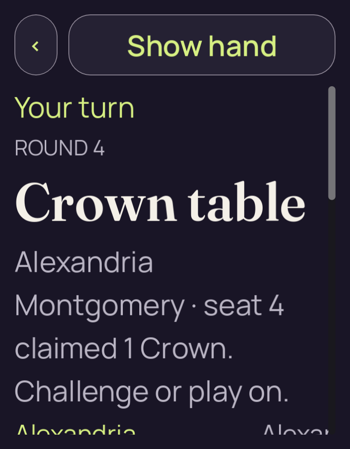
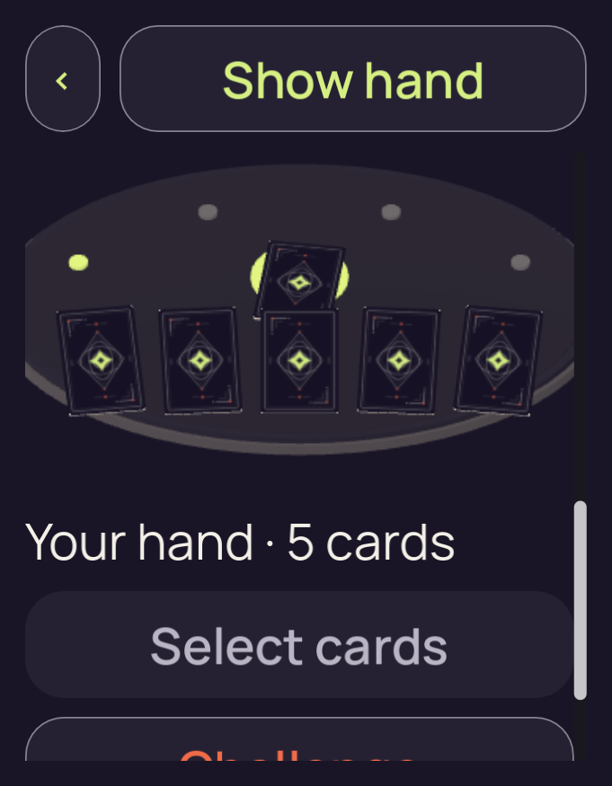
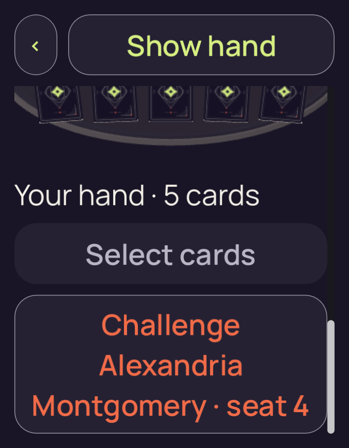

# candidate-v2-long-500

**Final V2 desktop check passed**. This run retains **3 original PNGs**: 3 direct views, 0 reviewed byte matches and 0 without attributed pixel review.

Table source SHA-256: `a91e94b910f763efb9c108d9e7602230736c503c6e53e4bd018a61ad9eebeb4d`. Project fingerprint: `df3f323e06fcc8cfdd99998eb405044ccf3eaf4607bcac96507df334211adc79`.

[Collection and scope](../../README.md) · [Original run receipt](../../provenance/owner/runs/candidate-v2-long-500/run-receipt.json) · [Independent review](../../provenance/review/INDEPENDENT-REVIEW.json)

Source filenames identify recorded stages. A stage name alone does not confer pixel review or native acceptance.

## 01-initial.png

**Direct view** · /root/pixel_d2_sea · 681 × 875 · 113,882 bytes.

Owner identity 26; SHA-256 `f74b8ce4cba2c1ce7e57fe1f127bfe3ea21defd9e54305fce06cc79202fc4b80`.

[Original capture receipt](../../provenance/owner/runs/candidate-v2-long-500/01-initial.png.receipt.json) · [Attributed review or unviewed record](../../provenance/review/candidate-v2-layout-matrix-review.json).

## 02-actions-scroll.png

**Direct view** · /root/pixel_d2_sea · 681 × 875 · 135,647 bytes.

Owner identity 27; SHA-256 `969520db8067b31c5b0541904cda8bcb8ec23966cfb801888ad4c8f1ae1a605a`.

[Original capture receipt](../../provenance/owner/runs/candidate-v2-long-500/02-actions-scroll.png.receipt.json) · [Attributed review or unviewed record](../../provenance/review/candidate-v2-layout-matrix-review.json).

## 03-actions-scroll.png

**Direct view** · /root/pixel_d2_sea · 681 × 875 · 130,473 bytes.

Owner identity 28; SHA-256 `9f7a88b6ddd9d43f7abe7512f3cadb1f8e9c1a4cb10ac4ea4625e6b2da307c79`.

[Original capture receipt](../../provenance/owner/runs/candidate-v2-long-500/03-actions-scroll.png.receipt.json) · [Attributed review or unviewed record](../../provenance/review/candidate-v2-layout-matrix-review.json).
