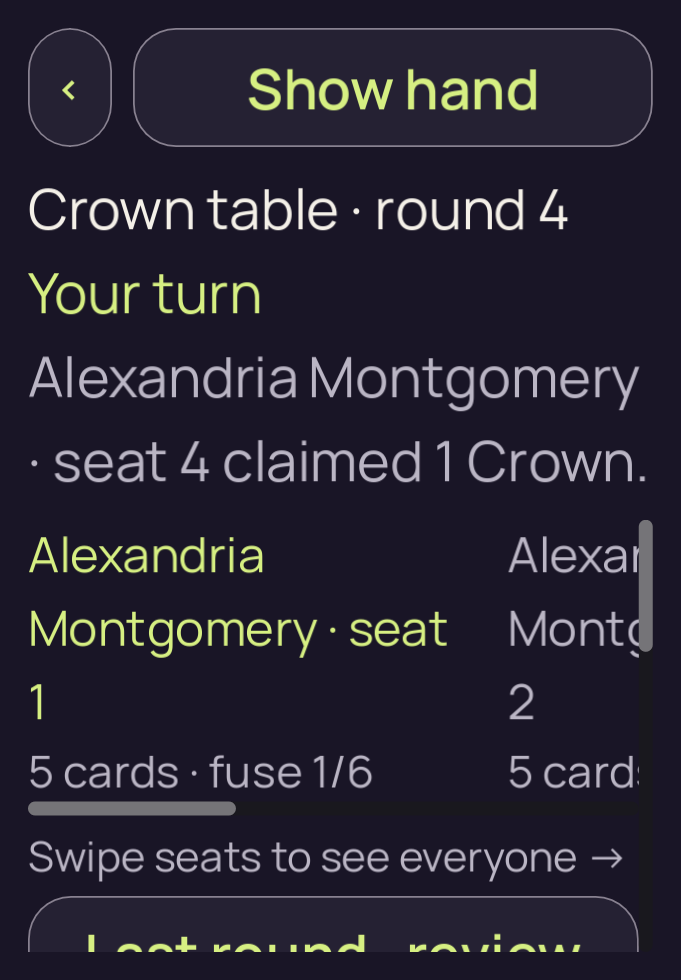
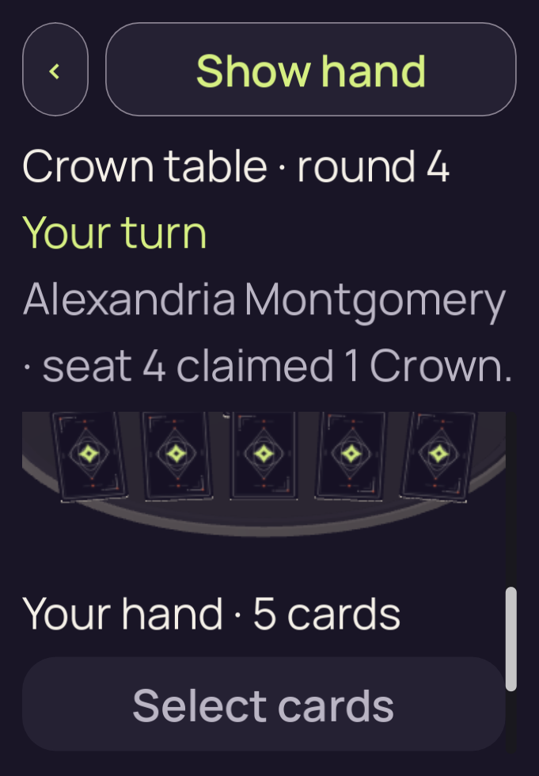
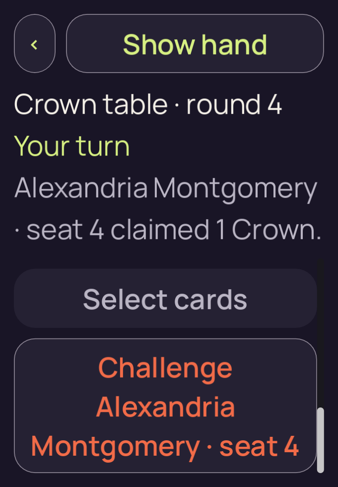

# candidate-v2-long-560

**Final V2 desktop check passed**. This run retains **3 original PNGs**: 3 direct views, 0 reviewed byte matches and 0 without attributed pixel review.

Table source SHA-256: `a91e94b910f763efb9c108d9e7602230736c503c6e53e4bd018a61ad9eebeb4d`. Project fingerprint: `df3f323e06fcc8cfdd99998eb405044ccf3eaf4607bcac96507df334211adc79`.

[Collection and scope](../../README.md) · [Original run receipt](../../provenance/owner/runs/candidate-v2-long-560/run-receipt.json) · [Independent review](../../provenance/review/INDEPENDENT-REVIEW.json)

Source filenames identify recorded stages. A stage name alone does not confer pixel review or native acceptance.

## 01-initial.png

**Direct view** · /root/pixel_d2_sea · 681 × 980 · 156,534 bytes.

Owner identity 29; SHA-256 `c0438b7a2bed65f2eba964f965d3da7cf381ffd97c73830f434b042783640c2c`.

[Original capture receipt](../../provenance/owner/runs/candidate-v2-long-560/01-initial.png.receipt.json) · [Attributed review or unviewed record](../../provenance/review/candidate-v2-layout-matrix-review.json).

## 02-actions-scroll.png

**Direct view** · /root/pixel_d2_sea · 681 × 980 · 175,338 bytes.

Owner identity 30; SHA-256 `192828378cc739fd7e4b052550fe124c2f748be93ff0ccfff7c8a18124246128`.

[Original capture receipt](../../provenance/owner/runs/candidate-v2-long-560/02-actions-scroll.png.receipt.json) · [Attributed review or unviewed record](../../provenance/review/candidate-v2-layout-matrix-review.json).

## 03-actions-scroll.png

**Direct view** · /root/pixel_d2_sea · 681 × 980 · 129,053 bytes.

Owner identity 31; SHA-256 `184f667e80fc41af8560f8f26512137a305f5666dc40e34fd387014ef1e1ac7b`.

[Original capture receipt](../../provenance/owner/runs/candidate-v2-long-560/03-actions-scroll.png.receipt.json) · [Attributed review or unviewed record](../../provenance/review/candidate-v2-layout-matrix-review.json).
