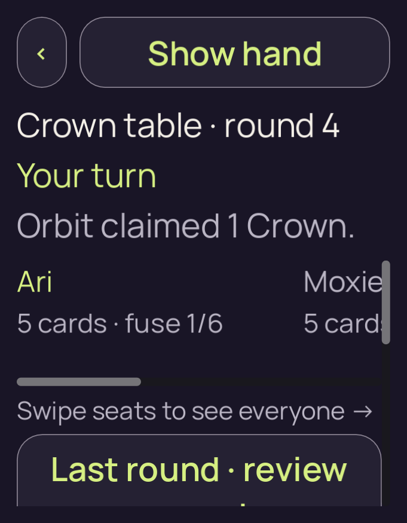
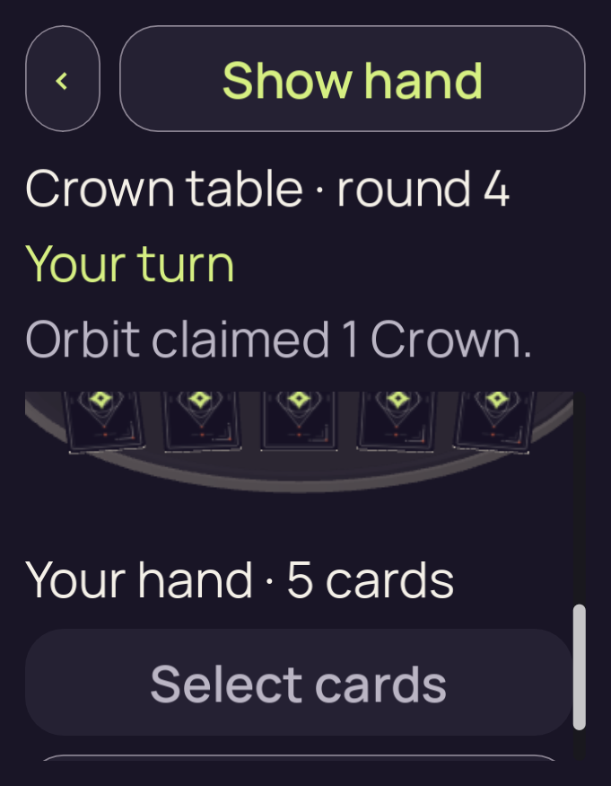
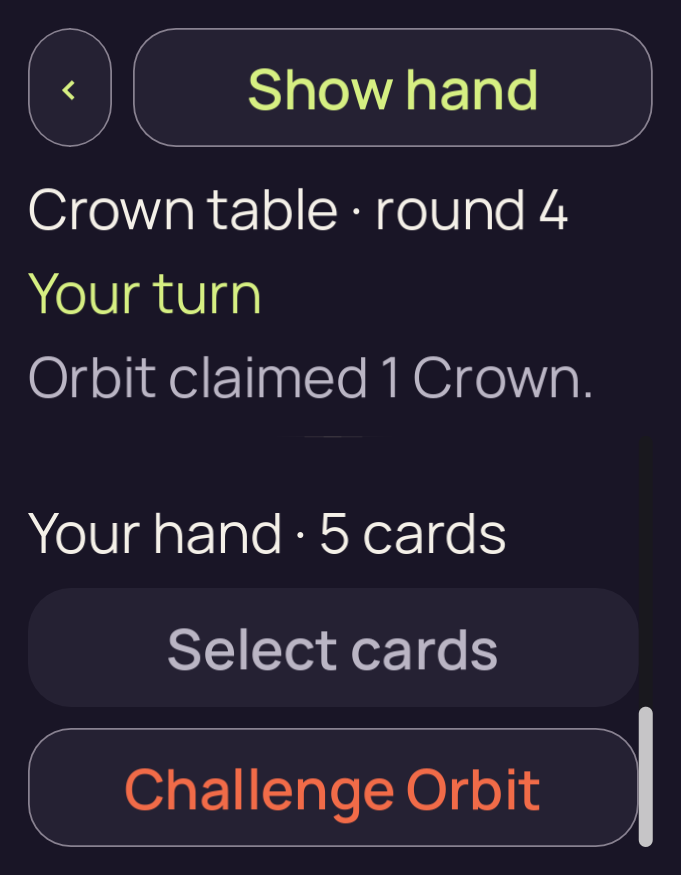

# candidate-v2-ordinary-500

**Final V2 desktop check passed**. This run retains **3 original PNGs**: 3 direct views, 0 reviewed byte matches and 0 without attributed pixel review.

Table source SHA-256: `a91e94b910f763efb9c108d9e7602230736c503c6e53e4bd018a61ad9eebeb4d`. Project fingerprint: `df3f323e06fcc8cfdd99998eb405044ccf3eaf4607bcac96507df334211adc79`.

[Collection and scope](../../README.md) · [Original run receipt](../../provenance/owner/runs/candidate-v2-ordinary-500/run-receipt.json) · [Independent review](../../provenance/review/INDEPENDENT-REVIEW.json)

Source filenames identify recorded stages. A stage name alone does not confer pixel review or native acceptance.

## 01-initial.png

**Direct view** · /root/pixel_d2_sea · 681 × 875 · 112,829 bytes.

Owner identity 32; SHA-256 `880a3db06e5588463dfafa0932c4deead25d1f966635c90d5babbc03d632d56a`.

[Original capture receipt](../../provenance/owner/runs/candidate-v2-ordinary-500/01-initial.png.receipt.json) · [Attributed review or unviewed record](../../provenance/review/candidate-v2-layout-matrix-review.json).

## 02-actions-scroll.png

**Direct view** · /root/pixel_d2_sea · 681 × 875 · 132,695 bytes.

Owner identity 33; SHA-256 `e79b0f38cb485ba141afbbc801660a3995581edbd42541c3fd2e525565cd4877`.

[Original capture receipt](../../provenance/owner/runs/candidate-v2-ordinary-500/02-actions-scroll.png.receipt.json) · [Attributed review or unviewed record](../../provenance/review/candidate-v2-layout-matrix-review.json).

## 03-actions-scroll.png

**Direct view** · /root/pixel_d2_sea · 681 × 875 · 102,770 bytes.

Owner identity 34; SHA-256 `269df21b6f70fc368750fd85b730008eb76b370269464436b4a00038174fd432`.

[Original capture receipt](../../provenance/owner/runs/candidate-v2-ordinary-500/03-actions-scroll.png.receipt.json) · [Attributed review or unviewed record](../../provenance/review/candidate-v2-layout-matrix-review.json).
