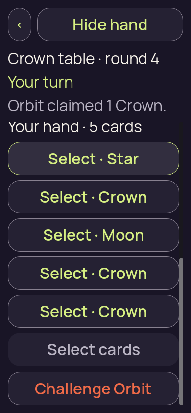
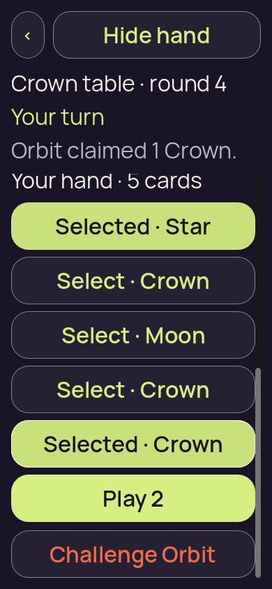
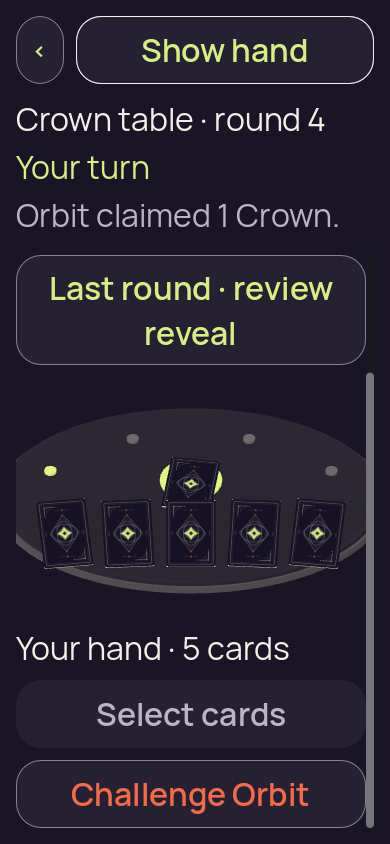
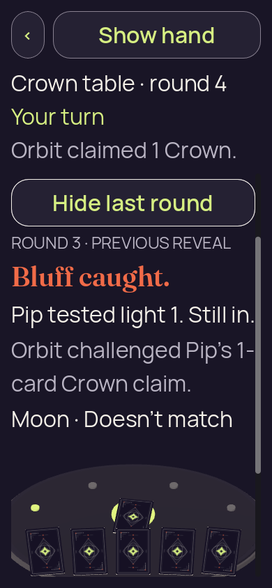

# candidate-v2-original-input

**Final V2 desktop check passed**. This run retains **8 original PNGs**: 8 direct views, 0 reviewed byte matches and 0 without attributed pixel review.

Table source SHA-256: `a91e94b910f763efb9c108d9e7602230736c503c6e53e4bd018a61ad9eebeb4d`. Project fingerprint: `df3f323e06fcc8cfdd99998eb405044ccf3eaf4607bcac96507df334211adc79`.

[Collection and scope](../../README.md) · [Original run receipt](../../provenance/owner/runs/candidate-v2-original-input/run-receipt.json) · [Independent review](../../provenance/review/INDEPENDENT-REVIEW.json)

Source filenames identify recorded stages. A stage name alone does not confer pixel review or native acceptance.

## 01-concealed.png

**Direct view** · /root/pixel_d2_sea · 390 × 844 · 83,627 bytes.

Owner identity 35; SHA-256 `389f255872d9bc3af658f5c11da268a784c1c52ff5f73e74375b34c43460d2f2`.

[Original capture receipt](../../provenance/owner/runs/candidate-v2-original-input/01-concealed.png.receipt.json) · [Attributed review or unviewed record](../../provenance/review/candidate-v2-strict-behavior-review.json).

## 01a-emulated-touch-drag.png

**Direct view** · /root/pixel_d2_sea · 390 × 844 · 67,425 bytes.

Owner identity 36; SHA-256 `0365888bd41086b747c09948962a1cfb3065397356037dced187fa30043bd00e`.

[Original capture receipt](../../provenance/owner/runs/candidate-v2-original-input/01a-emulated-touch-drag.png.receipt.json) · [Attributed review or unviewed record](../../provenance/review/candidate-v2-strict-behavior-review.json).

## 02-revealed-selected.png

**Direct view** · /root/pixel_d2_sea · 390 × 844 · 66,790 bytes.

Owner identity 37; SHA-256 `b2882c06cc4224187b588271b4981c7641190af26934ee321a68c3da74bb06f5`.

[Original capture receipt](../../provenance/owner/runs/candidate-v2-original-input/02-revealed-selected.png.receipt.json) · [Attributed review or unviewed record](../../provenance/review/candidate-v2-strict-behavior-review.json).

## 02a-selection-limit.png

**Direct view** · /root/pixel_d2_sea · 390 × 844 · 68,520 bytes.

Owner identity 38; SHA-256 `25cef6517f58bec9705d6b878fde87de20acfdba92b8b16aea299faa70cd9776`.

[Original capture receipt](../../provenance/owner/runs/candidate-v2-original-input/02a-selection-limit.png.receipt.json) · [Attributed review or unviewed record](../../provenance/review/candidate-v2-strict-behavior-review.json).

## 02b-deselected-last.png

**Direct view** · /root/pixel_d2_sea · 390 × 844 · 66,990 bytes.

Owner identity 39; SHA-256 `eb3972ee35848928ca14964cb2e674210f3806c7687d5d7d607c3423b0146c58`.

[Original capture receipt](../../provenance/owner/runs/candidate-v2-original-input/02b-deselected-last.png.receipt.json) · [Attributed review or unviewed record](../../provenance/review/candidate-v2-strict-behavior-review.json).

## 03-covered-again.png

**Direct view** · /root/pixel_d2_sea · 390 × 844 · 82,440 bytes.

Owner identity 40; SHA-256 `d30f3a449501d56d64423d1dd8e9aa3cf8c92d7f663c707a96e085ff46583595`.

[Original capture receipt](../../provenance/owner/runs/candidate-v2-original-input/03-covered-again.png.receipt.json) · [Attributed review or unviewed record](../../provenance/review/candidate-v2-strict-behavior-review.json).

## 04-resumed-covered.png

**Direct view** · /root/pixel_d2_sea · 390 × 844 · 81,908 bytes.

Owner identity 41; SHA-256 `f93bf5634f09b99d2ce13f8e473c2d8bca4263f21378683a16435add5d9a45dc`.

[Original capture receipt](../../provenance/owner/runs/candidate-v2-original-input/04-resumed-covered.png.receipt.json) · [Attributed review or unviewed record](../../provenance/review/candidate-v2-strict-behavior-review.json).

## 04a-previous-round.png

**Direct view** · /root/pixel_d2_sea · 390 × 844 · 91,558 bytes.

Owner identity 42; SHA-256 `9aeb37db3879009d78372c09672a9723320f25156810ca822889bc48913c5e8d`.

[Original capture receipt](../../provenance/owner/runs/candidate-v2-original-input/04a-previous-round.png.receipt.json) · [Attributed review or unviewed record](../../provenance/review/candidate-v2-strict-behavior-review.json).
