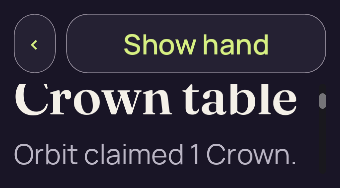

# candidate-v2-short-density

**Failed harness attempt**. This run retains **4 original PNGs**: 0 direct views, 0 reviewed byte matches and 4 without attributed pixel review.

Table source SHA-256: `a91e94b910f763efb9c108d9e7602230736c503c6e53e4bd018a61ad9eebeb4d`. Project fingerprint: `df3f323e06fcc8cfdd99998eb405044ccf3eaf4607bcac96507df334211adc79`.

[Collection and scope](../../README.md) · [Original run receipt](../../provenance/owner/runs/candidate-v2-short-density/run-receipt.json) · [Independent review](../../provenance/review/INDEPENDENT-REVIEW.json)

The original harness execution failed. Its PNGs and diagnostics remain evidence of that attempt; the failure is preserved.

Source filenames identify recorded stages. A stage name alone does not confer pixel review or native acceptance.

## 01-initial.png

**Unviewed** · No attributed pixel review · 681 × 377 · 30,545 bytes.

Owner identity 43; SHA-256 `9b1b22d7477f20b98c5ed543ec9128a3019c348031cfacb6dd9e3a56b66cf7e6`.

[Original capture receipt](../../provenance/owner/runs/candidate-v2-short-density/01-initial.png.receipt.json) · [Attributed review or unviewed record](../../provenance/review/new-capture-review-index.json).

## 02-claim-scroll.png

**Unviewed** · No attributed pixel review · 681 × 377 · 50,705 bytes.

Owner identity 44; SHA-256 `5efad1f84d54cd100be0793390e3ee87f99a70dbd97d89ea1e83751578ad8fef`.

[Original capture receipt](../../provenance/owner/runs/candidate-v2-short-density/02-claim-scroll.png.receipt.json) · [Attributed review or unviewed record](../../provenance/review/new-capture-review-index.json).

## 03-claim-scroll.png

**Unviewed** · No attributed pixel review · 681 × 377 · 44,528 bytes.

Owner identity 45; SHA-256 `e919aa9f27d7ca6c7b49d78d5ad6417069906ea562589c6a27cfa176ccef771c`.

[Original capture receipt](../../provenance/owner/runs/candidate-v2-short-density/03-claim-scroll.png.receipt.json) · [Attributed review or unviewed record](../../provenance/review/new-capture-review-index.json).

## failure.png

**Unviewed** · No attributed pixel review · 681 × 377 · 44,402 bytes.

Owner identity 46; SHA-256 `241991ae41aa5bd9cb4f44dc103756cc21e84ae49d73eac624d72bc986255ddb`.

[Original capture receipt](../../provenance/owner/runs/candidate-v2-short-density/failure.png.receipt.json) · [Attributed review or unviewed record](../../provenance/review/new-capture-review-index.json).
