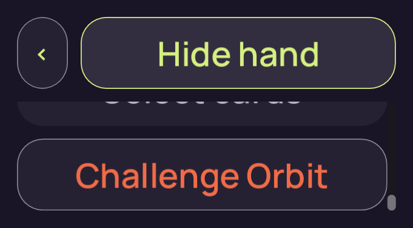
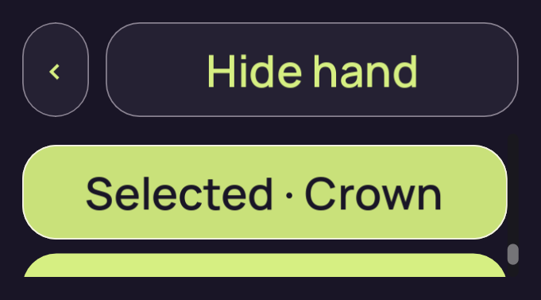
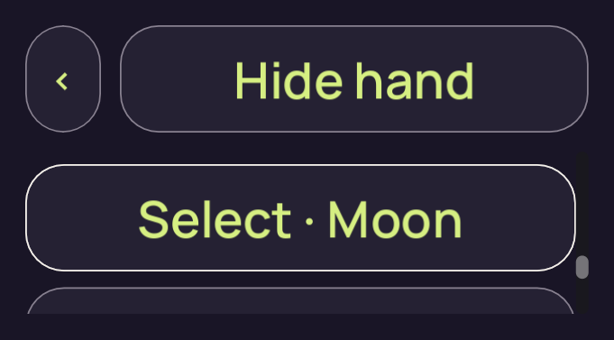
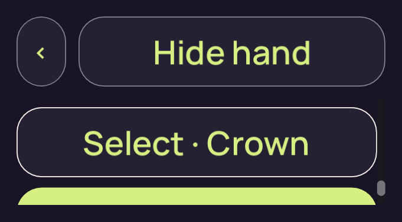
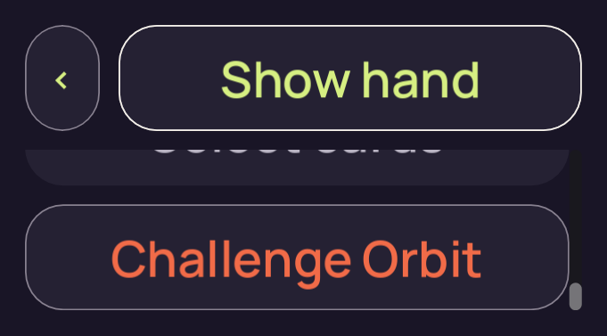
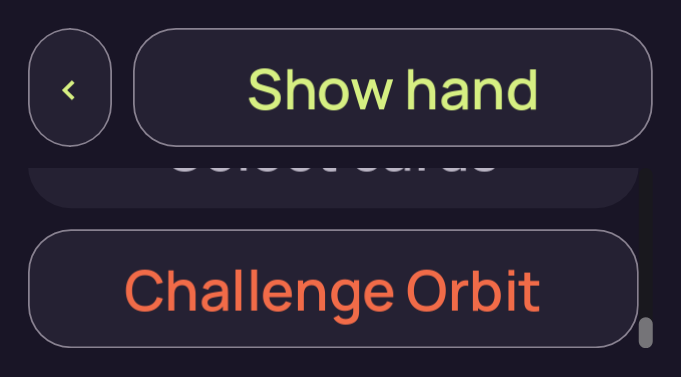
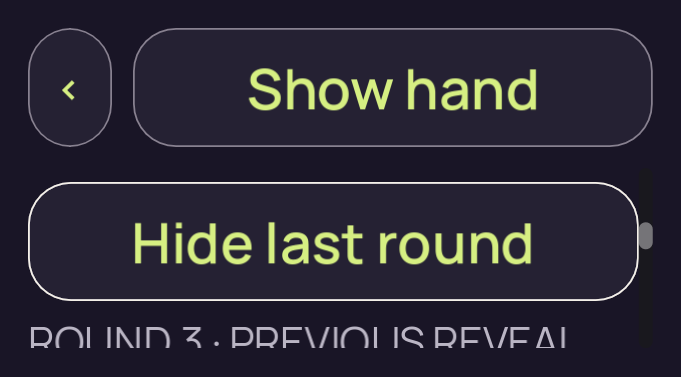

# candidate-v2-short-input

**Final V2 desktop check passed**. This run retains **8 original PNGs**: 7 direct views, 1 reviewed byte matches and 0 without attributed pixel review.

Table source SHA-256: `a91e94b910f763efb9c108d9e7602230736c503c6e53e4bd018a61ad9eebeb4d`. Project fingerprint: `df3f323e06fcc8cfdd99998eb405044ccf3eaf4607bcac96507df334211adc79`.

[Collection and scope](../../README.md) · [Original run receipt](../../provenance/owner/runs/candidate-v2-short-input/run-receipt.json) · [Independent review](../../provenance/review/INDEPENDENT-REVIEW.json)

Source filenames identify recorded stages. A stage name alone does not confer pixel review or native acceptance.

## 01-concealed.png

**Reviewed byte match** · /root/pixel_d2_sea · 681 × 377 · 30,545 bytes.

Owner identity 52; SHA-256 `9b1b22d7477f20b98c5ed543ec9128a3019c348031cfacb6dd9e3a56b66cf7e6`.

[Original capture receipt](../../provenance/owner/runs/candidate-v2-short-input/01-concealed.png.receipt.json) · [Attributed review or unviewed record](../../provenance/review/candidate-v2-strict-behavior-review.json).

This distinct capture exactly matches the [directly viewed representative](../candidate-v2-short-density-final/01-initial.png).

## 01a-emulated-touch-drag.png

**Direct view** · /root/pixel_d2_sea · 681 × 377 · 34,251 bytes.

Owner identity 53; SHA-256 `d3bb35dba691a7f30e92501f723fba34014b0d7a33b81f75e45eae1b7d9c782a`.

[Original capture receipt](../../provenance/owner/runs/candidate-v2-short-input/01a-emulated-touch-drag.png.receipt.json) · [Attributed review or unviewed record](../../provenance/review/candidate-v2-strict-behavior-review.json).

## 02-revealed-selected.png

**Direct view** · /root/pixel_d2_sea · 681 × 377 · 35,987 bytes.

Owner identity 54; SHA-256 `a6437598062f10277684dcb15714120569b98c83d8e40504fe4e14283e982a08`.

[Original capture receipt](../../provenance/owner/runs/candidate-v2-short-input/02-revealed-selected.png.receipt.json) · [Attributed review or unviewed record](../../provenance/review/candidate-v2-strict-behavior-review.json).

## 02a-selection-limit.png

**Direct view** · /root/pixel_d2_sea · 681 × 377 · 33,255 bytes.

Owner identity 55; SHA-256 `34dc40771e6af38ffed5f91cf5e9ac245b5d812d2db6a4df897836cfb054307f`.

[Original capture receipt](../../provenance/owner/runs/candidate-v2-short-input/02a-selection-limit.png.receipt.json) · [Attributed review or unviewed record](../../provenance/review/candidate-v2-strict-behavior-review.json).

## 02b-deselected-last.png

**Direct view** · /root/pixel_d2_sea · 681 × 377 · 33,194 bytes.

Owner identity 56; SHA-256 `b18dcde5bdee245ec41d78f2d7b6c057c3d967e8320e8a98ca92700451493785`.

[Original capture receipt](../../provenance/owner/runs/candidate-v2-short-input/02b-deselected-last.png.receipt.json) · [Attributed review or unviewed record](../../provenance/review/candidate-v2-strict-behavior-review.json).

## 03-covered-again.png

**Direct view** · /root/pixel_d2_sea · 681 × 377 · 37,737 bytes.

Owner identity 57; SHA-256 `bf7284c8165c4e87fa4834553e31238bd0bffc8b0282799262802f080d1254cb`.

[Original capture receipt](../../provenance/owner/runs/candidate-v2-short-input/03-covered-again.png.receipt.json) · [Attributed review or unviewed record](../../provenance/review/candidate-v2-strict-behavior-review.json).

## 04-resumed-covered.png

**Direct view** · /root/pixel_d2_sea · 681 × 377 · 36,493 bytes.

Owner identity 58; SHA-256 `613277c6d087b68d02fe13cb975f2b02196852a18485253388ad693771f9e06b`.

[Original capture receipt](../../provenance/owner/runs/candidate-v2-short-input/04-resumed-covered.png.receipt.json) · [Attributed review or unviewed record](../../provenance/review/candidate-v2-strict-behavior-review.json).

## 04a-previous-round.png

**Direct view** · /root/pixel_d2_sea · 681 × 377 · 40,823 bytes.

Owner identity 59; SHA-256 `440d38878a00d9b23ac4e19b67e4537d0b3703efb837175d19e8b59d9107ab6a`.

[Original capture receipt](../../provenance/owner/runs/candidate-v2-short-input/04a-previous-round.png.receipt.json) · [Attributed review or unviewed record](../../provenance/review/candidate-v2-strict-behavior-review.json).
