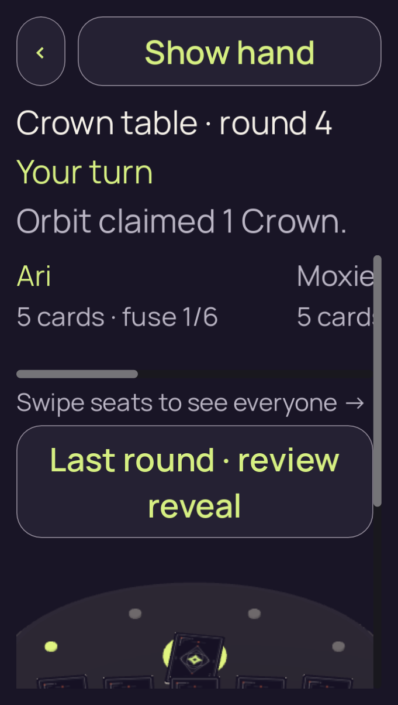
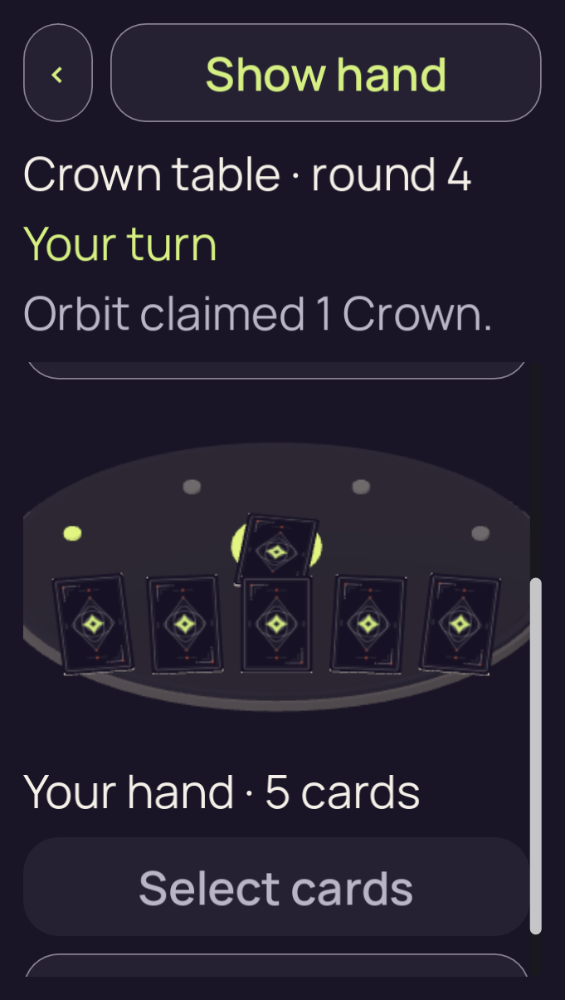
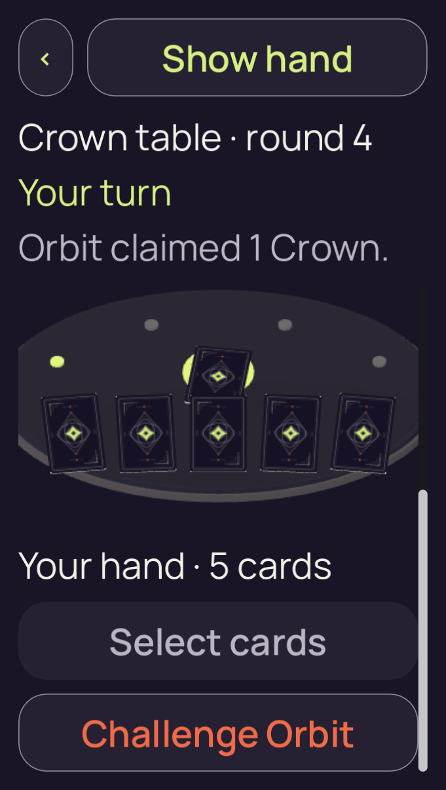

# candidate-v2-tall-density

**Final V2 desktop check passed**. This run retains **3 original PNGs**: 3 direct views, 0 reviewed byte matches and 0 without attributed pixel review.

Table source SHA-256: `a91e94b910f763efb9c108d9e7602230736c503c6e53e4bd018a61ad9eebeb4d`. Project fingerprint: `df3f323e06fcc8cfdd99998eb405044ccf3eaf4607bcac96507df334211adc79`.

[Collection and scope](../../README.md) · [Original run receipt](../../provenance/owner/runs/candidate-v2-tall-density/run-receipt.json) · [Independent review](../../provenance/review/INDEPENDENT-REVIEW.json)

Source filenames identify recorded stages. A stage name alone does not confer pixel review or native acceptance.

## 01-initial.png

**Direct view** · /root/pixel_d2_sea · 681 × 1204 · 150,250 bytes.

Owner identity 60; SHA-256 `a1f0dbb12b6fc4f19f4a00155c406c67fd93afd9316057b8c898c0c3ed13db63`.

[Original capture receipt](../../provenance/owner/runs/candidate-v2-tall-density/01-initial.png.receipt.json) · [Attributed review or unviewed record](../../provenance/review/candidate-v2-layout-matrix-review.json).

## 02-actions-scroll.png

**Direct view** · /root/pixel_d2_sea · 681 × 1204 · 175,871 bytes.

Owner identity 61; SHA-256 `7dde9b6e833aa2c634363af78596261faba76a3eda5ce5e0eda3b58460b83f62`.

[Original capture receipt](../../provenance/owner/runs/candidate-v2-tall-density/02-actions-scroll.png.receipt.json) · [Attributed review or unviewed record](../../provenance/review/candidate-v2-layout-matrix-review.json).

## 03-actions-scroll.png

**Direct view** · /root/pixel_d2_sea · 681 × 1204 · 188,097 bytes.

Owner identity 62; SHA-256 `79d411cabd24a7c5e4ac7a2c689397dd4adaf1bf13ccfa27926928b3be5e6629`.

[Original capture receipt](../../provenance/owner/runs/candidate-v2-tall-density/03-actions-scroll.png.receipt.json) · [Attributed review or unviewed record](../../provenance/review/candidate-v2-layout-matrix-review.json).
