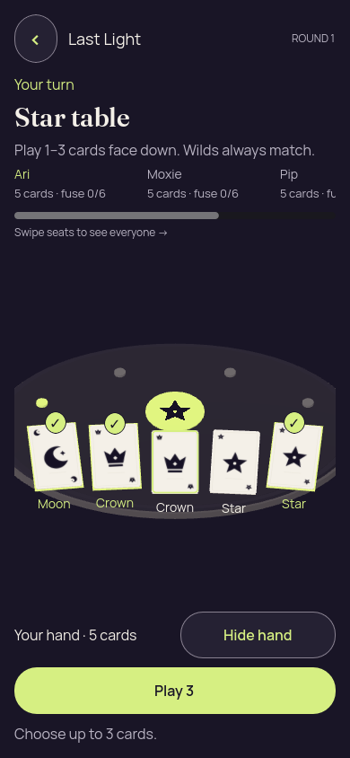
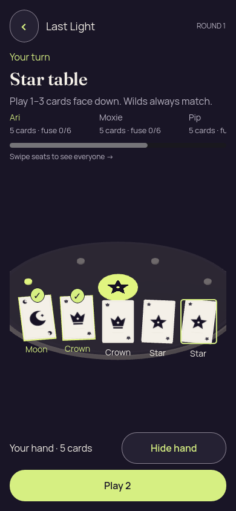
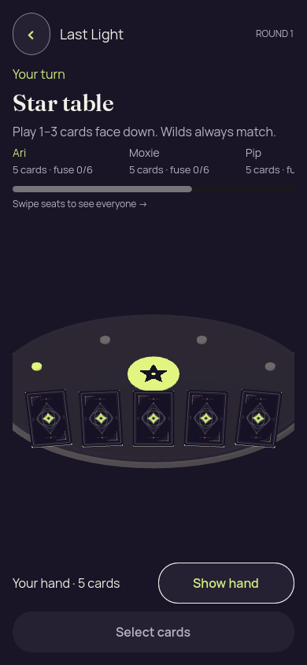
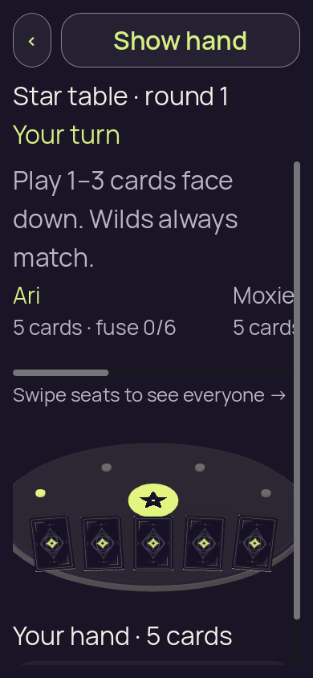
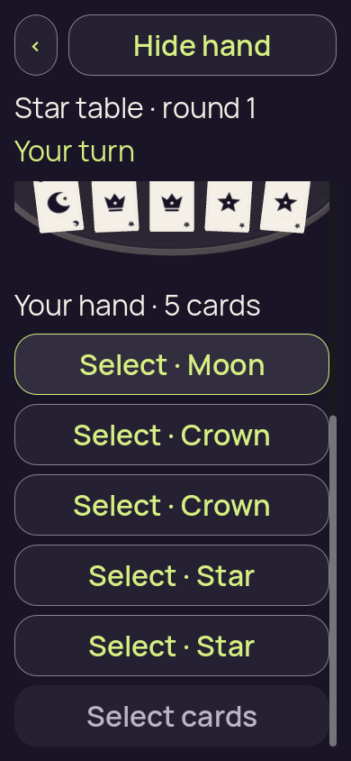

# Godot 3D demand redraw — desktop functional review

Thirteen unchanged original PNGs show the final 390 × 844 scene flows at 100% and 200% text. The final redraw, bridge and terminal-return reports pass 306, 155 and 216 assertions respectively; the enlarged scene flow uses emulated touch. These are desktop functional results.

The reviewed candidate preserves complete normal-size hand actions and clear 2 → 3 → 2 selection feedback. At 200% text, the current turn/rank and Show/Hide header remain visible; emulated scrolling exposes the five card rows, Play action and selection-limit feedback. Earlier text and 3D geometry clip at scroll boundaries. Concealment removes private faces in the captured covered/resumed states. No native timing or iOS stall-fix result is inferred.

The frozen `three_d/table.gd` source SHA-256 is `45ee2ac81cd371f13b16e2b29b47468cbd86f2cbe98c1a0f8ba55787609cdf40`. The exact clean whole-tree capture revision was not recorded. The [independent source audit](review/partydeck-gallery-next-demand-source-audit.json) verifies all 772 source checksums, 155 final source inputs and 15 pinned upstream files. The [visual review](review/partydeck-gallery-next-demand-visual-review.json) covers every original.

| Executed check | Result | Assertions | Evidence |
| --- | --- | ---: | --- |
| redraw | passed | 306 | [Receipt](evidence/validation-final/redraw-receipt.json) · [Report](evidence/validation-final/redraw/report.json) |
| native-bridge | passed | 155 | [Receipt](evidence/validation-final/native-bridge-receipt.json) · [Report](evidence/validation-final/native-bridge/report.json) |
| terminal-return | passed | 216 | [Receipt](evidence/validation-final/terminal-return-receipt.json) · [Report](evidence/validation-final/terminal-return/report.json) |
| 3d-scene-portrait | passed | — | [Receipt](evidence/validation-final/3d-scene-portrait-receipt.json) · [Report](evidence/validation-final/3d-scene-portrait/report.json) |
| 3d-scene-large-text | passed | — | [Receipt](evidence/validation-final/3d-scene-large-text-receipt.json) · [Report](evidence/validation-final/3d-scene-large-text/report.json) |

The bridge report uses Java registry doubles and does not execute Android JNI. No native timing, native privacy-cover presentation, authority-accepted native gameplay or iOS stall fix follows from these local checks.

## Preserved earlier failures

Iteration 01’s import process exits **0**, while its original log reports the duplicate `_exit_tree` parse failure. A zero exit is not a clean parse result. Iteration 02 exits **1**, with three failed assertions: first revealed overlay pixels, first selected overlay pixels and an incorrect node zero-size expectation. The node clamps zero size to 2 × 2; the later tests separately exercise a server draw skip and zero view count. The original [proposal and execution record](evidence/README.md) and audit retain both failures.

## 100% text

| Original image | Scenario and provenance |
| --- | --- |
|  | **01-concealed** Godot 4.7.2 official, desktop Xvfb/Mesa llvmpipe Compatibility Original: [01-concealed.png](3d-scene-portrait/01-concealed.png) 390 × 844 px; text 1× SHA-256: <code>9b31edd4d8a07d0353e4732c5676f0e76b4fc536e193cc804e3f85ce52e51b9f</code> [Original paired measurements](evidence/validation-final/3d-scene-portrait/01-concealed.json) [Execution receipt](evidence/validation-final/3d-scene-portrait-receipt.json) Recorded enclosing case: passed Five card backs, Show hand and disabled Select cards fit. Current turn and Star table are readable; the seat roster continues horizontally. |
|  | **02-revealed-selected** Godot 4.7.2 official, desktop Xvfb/Mesa llvmpipe Compatibility Original: [02-revealed-selected.png](3d-scene-portrait/02-revealed-selected.png) 390 × 844 px; text 1× SHA-256: <code>81ed93be5c09cb651fa182601adaebc6d4df7625623650ab37599bed886d825b</code> [Original paired measurements](evidence/validation-final/3d-scene-portrait/02-revealed-selected.json) [Execution receipt](evidence/validation-final/3d-scene-portrait-receipt.json) Recorded enclosing case: passed Moon and the last Star have distinct selection markers/checks; all five rank captions and the full Play 2 action fit. |
|  | **02a-selection-limit** Godot 4.7.2 official, desktop Xvfb/Mesa llvmpipe Compatibility Original: [02a-selection-limit.png](3d-scene-portrait/02a-selection-limit.png) 390 × 844 px; text 1× SHA-256: <code>298fd444896c0ba7351436507993f82c00583531eb2d52016d63b55fd1a66ee4</code> [Original paired measurements](evidence/validation-final/3d-scene-portrait/02a-selection-limit.json) [Execution receipt](evidence/validation-final/3d-scene-portrait-receipt.json) Recorded enclosing case: passed Moon, the first Crown and last Star are marked selected. Play 3 and Choose up to 3 cards are complete; the fourth-choice feedback moves the table upward without clipping its focused card. |
|  | **02b-deselected-last** Godot 4.7.2 official, desktop Xvfb/Mesa llvmpipe Compatibility Original: [02b-deselected-last.png](3d-scene-portrait/02b-deselected-last.png) 390 × 844 px; text 1× SHA-256: <code>cb137e7569d79e796589b36404f8a81f8c310dd806d410751d0d4f44fd67fc0a</code> [Original paired measurements](evidence/validation-final/3d-scene-portrait/02b-deselected-last.json) [Execution receipt](evidence/validation-final/3d-scene-portrait-receipt.json) Recorded enclosing case: passed The last Star is deselected while Moon and Crown remain selected. Its thin focus border is separate from the removed selection check; Play 2 is complete. |
|  | **03-covered-again** Godot 4.7.2 official, desktop Xvfb/Mesa llvmpipe Compatibility Original: [03-covered-again.png](3d-scene-portrait/03-covered-again.png) 390 × 844 px; text 1× SHA-256: <code>f8d7410cf64da58de7c8befaa020f795f1cae903028d5a09473826f0b45374a1</code> [Original paired measurements](evidence/validation-final/3d-scene-portrait/03-covered-again.json) [Execution receipt](evidence/validation-final/3d-scene-portrait-receipt.json) Recorded enclosing case: passed Cover replaces all five private faces and rank captions with card backs. Show hand and disabled Select cards are complete. |
|  | **04-resumed-covered** Godot 4.7.2 official, desktop Xvfb/Mesa llvmpipe Compatibility Original: [04-resumed-covered.png](3d-scene-portrait/04-resumed-covered.png) 390 × 844 px; text 1× SHA-256: <code>9b31edd4d8a07d0353e4732c5676f0e76b4fc536e193cc804e3f85ce52e51b9f</code> [Original paired measurements](evidence/validation-final/3d-scene-portrait/04-resumed-covered.json) [Execution receipt](evidence/validation-final/3d-scene-portrait-receipt.json) Recorded enclosing case: passed Resume remains concealed with all five backs. This original is byte-identical to the initial capture but retains its own scenario and source identity. |

## 200% text with emulated touch

| Original image | Scenario and provenance |
| --- | --- |
|  | **01-concealed** Godot 4.7.2 official, desktop Xvfb/Mesa llvmpipe Compatibility Original: [01-concealed.png](3d-scene-large-text/01-concealed.png) 390 × 844 px; text 2× SHA-256: <code>a8f67e7c9cc2f5234e1283883056a861c54d1f898017f2b92991acaaffd7d685</code> [Original paired measurements](evidence/validation-final/3d-scene-large-text/01-concealed.json) [Execution receipt](evidence/validation-final/3d-scene-large-text-receipt.json) Recorded enclosing case: passed Back, Show hand, Star table and Your turn fit at 200%. Five backs are visible, while the disabled action is below the initial viewport and the seat roster extends horizontally. |
|  | **01a-emulated-touch-drag** Godot 4.7.2 official, desktop Xvfb/Mesa llvmpipe Compatibility Original: [01a-emulated-touch-drag.png](3d-scene-large-text/01a-emulated-touch-drag.png) 390 × 844 px; text 2× SHA-256: <code>8b058ad50aeefb54eb6ae21e69978d044d918613115330273d5598b7e8d4da1d</code> [Original paired measurements](evidence/validation-final/3d-scene-large-text/01a-emulated-touch-drag.json) [Execution receipt](evidence/validation-final/3d-scene-large-text-receipt.json) Recorded enclosing case: passed After emulated touch drag, all five labeled card rows and the disabled Select cards action fit. The upper 3D faces are partly clipped by scrolling; fixed rank/turn context and Hide hand remain readable. |
|  | **02-revealed-selected** Godot 4.7.2 official, desktop Xvfb/Mesa llvmpipe Compatibility Original: [02-revealed-selected.png](3d-scene-large-text/02-revealed-selected.png) 390 × 844 px; text 2× SHA-256: <code>8f927ca58390aabe677d476d68ec345c2d4cb952935da54131e97165e4303737</code> [Original paired measurements](evidence/validation-final/3d-scene-large-text/02-revealed-selected.json) [Execution receipt](evidence/validation-final/3d-scene-large-text-receipt.json) Recorded enclosing case: passed Selected Moon and last Star rows have clear lime fills. All five labels and Play 2 fit, while the 3D fan is partly clipped above the scrolled list. |
|  | **02a-selection-limit** Godot 4.7.2 official, desktop Xvfb/Mesa llvmpipe Compatibility Original: [02a-selection-limit.png](3d-scene-large-text/02a-selection-limit.png) 390 × 844 px; text 2× SHA-256: <code>b5f0dbee9e31ad3c4043c5a2282c11f9ecd0a576dfaec95e7fc382ac3fab3ba4</code> [Original paired measurements](evidence/validation-final/3d-scene-large-text/02a-selection-limit.json) [Execution receipt](evidence/validation-final/3d-scene-large-text-receipt.json) Recorded enclosing case: passed Three selected rows, Play 3 and Choose up to 3 cards are fully readable. The 3D fan lies mostly above the scroll viewport; the fixed claim and turn remain visible. |
|  | **02b-deselected-last** Godot 4.7.2 official, desktop Xvfb/Mesa llvmpipe Compatibility Original: [02b-deselected-last.png](3d-scene-large-text/02b-deselected-last.png) 390 × 844 px; text 2× SHA-256: <code>93ec6951c8f1c3df7860af4584349d31a8674562d9057c286726a6895204d7c7</code> [Original paired measurements](evidence/validation-final/3d-scene-large-text/02b-deselected-last.json) [Execution receipt](evidence/validation-final/3d-scene-large-text-receipt.json) Recorded enclosing case: passed Moon and Crown remain selected after deselecting the last Star. All five row labels and Play 2 are complete; the last Star keeps only its focus border. |
|  | **03-covered-again** Godot 4.7.2 official, desktop Xvfb/Mesa llvmpipe Compatibility Original: [03-covered-again.png](3d-scene-large-text/03-covered-again.png) 390 × 844 px; text 2× SHA-256: <code>519ce556fb6bfc3e434f091a7f5f83e76ba5415a44f898b776a80a3a3862ed1c</code> [Original paired measurements](evidence/validation-final/3d-scene-large-text/03-covered-again.json) [Execution receipt](evidence/validation-final/3d-scene-large-text-receipt.json) Recorded enclosing case: passed All five faces are covered and the disabled action fits after scrolling. The beginning of the earlier instruction is above the viewport; Star table, Your turn and Show hand remain visible. |
|  | **04-resumed-covered** Godot 4.7.2 official, desktop Xvfb/Mesa llvmpipe Compatibility Original: [04-resumed-covered.png](3d-scene-large-text/04-resumed-covered.png) 390 × 844 px; text 2× SHA-256: <code>1377b6b7330fb5c07e932e74e40ef2b99e8aeae431a7247899b3fed479e44d01</code> [Original paired measurements](evidence/validation-final/3d-scene-large-text/04-resumed-covered.json) [Execution receipt](evidence/validation-final/3d-scene-large-text-receipt.json) Recorded enclosing case: passed Resume remains concealed with five backs and the complete disabled action. This separate original retains the scrolled instruction clipping and its own PNG bytes. |
