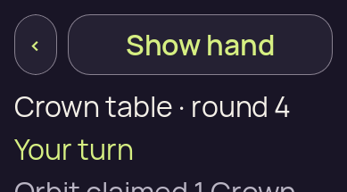

# Baseline — two expected-failure capture identities

[Collection overview](../README.md)

The producer’s baseline run exited 1 with the expected short-viewport regression failure. One original was viewed directly and the second was independently matched byte for byte. The pixel review observes a clipped current-claim line; the execution failure and source geometry are separate evidence. No per-image export timestamp was recorded by this source manifest.

## 01 · Baseline initial concealed capture

**Direct view** by `/root/pixel_d1_split`; 389 × 215 original pixels. [Attributed pixel receipt](../provenance/pixel-review/capture-review.json).

Original filename: `01-concealed.png`. Original size: 18,707 bytes. SHA-256: `7d7bfb85cb75d9371dc3e238a76f8c8206812018271919f894baf6150cd161b7`.

Original source run: `baseline`; capture index 0. Preserved test outcome: **failed regression**. [Execution receipt](../provenance/owner/runs/pair-v1/baseline/run-receipt.json).

A large Show hand control and back control occupy the top. Crown table · round 4 and Your turn are visible below. Only the top of the ordinary claim line begins at the bottom edge; its full wording and the action controls are not visible.

Ordinary claim text is visibly clipped by the bottom image boundary. No body scrollbar is visible in this captured viewport.

Review limits: This still does not establish whether or how the baseline can scroll; producer regression failure is separate evidence.

## 02 · Baseline initial concealed capture

**Reviewed byte match** by `/root/pixel_d1_split`; 389 × 215 original pixels. [Attributed pixel receipt](../provenance/pixel-review/capture-review.json).

Original filename: `failure.png`. Original size: 18,707 bytes. SHA-256: `7d7bfb85cb75d9371dc3e238a76f8c8206812018271919f894baf6150cd161b7`.

Original source run: `baseline`; capture index 1. Preserved test outcome: **failed regression**. [Execution receipt](../provenance/owner/runs/pair-v1/baseline/run-receipt.json).

This distinct capture was matched to the [directly viewed original](../originals/baseline/01-concealed.png); its own filename, outcome and timestamp metadata remain separate.

A large Show hand control and back control occupy the top. Crown table · round 4 and Your turn are visible below. Only the top of the ordinary claim line begins at the bottom edge; its full wording and the action controls are not visible.

Ordinary claim text is visibly clipped by the bottom image boundary. No body scrollbar is visible in this captured viewport.

Review limits: This still does not establish whether or how the baseline can scroll; producer regression failure is separate evidence.
