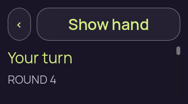
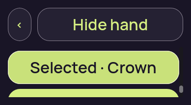
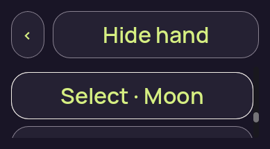
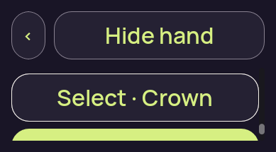
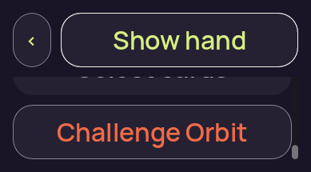
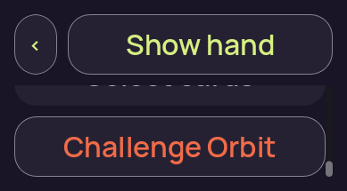
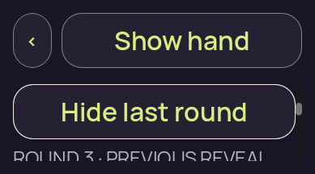

# Fixed renderer — seven passing-run captures

[Collection overview](../README.md)

These seven directly viewed originals come from the passing fixed-source regression run. The complete current claim and complete readable Play control are absent from the saved pixels. The test’s recorded geometry checks have a separate independent review. Source filesystem timestamps identify file metadata, not proven capture or interaction times.

## 01 · Candidate initial concealed capture

**Direct view** by `/root/pixel_d1_split`; 389 × 215 original pixels. [Attributed pixel receipt](../provenance/pixel-review/capture-review.json).

Original filename: `01-concealed.png`. Original size: 11,908 bytes. SHA-256: `9dd0d8e133adb620c0b466adb7bc4425082fd678af8e555a914baff67ac86f40`.

Original source run: `candidate`; capture index 2. Preserved test outcome: **passed regression**. [Execution receipt](../provenance/owner/runs/pair-v1/candidate/run-receipt.json).

The top back and Show hand controls remain fully visible. The body below shows Your turn and ROUND 4, with a vertical scrollbar at the right. The ordinary claim text, Crown rank label and actions are not visible at this saved position.

The candidate visibly has a scrollable-looking body area under the header; this still shows turn and round without the baseline's partially clipped claim line.

Review limits: A drawn scrollbar is not evidence of successful scrolling, full current-claim readability, or reachable actions.

## 02 · Candidate revealed selected-card capture

**Direct view** by `/root/pixel_d1_split`; 389 × 215 original pixels. [Attributed pixel receipt](../provenance/pixel-review/capture-review.json).

Original filename: `02-revealed-selected.png`. Original size: 13,653 bytes. SHA-256: `e8f78bb666da87bea1d4fa306382103223502ecb6ccbee6ed04ac8708c1d5f4c`.

Original source run: `candidate`; capture index 3. Preserved test outcome: **passed regression**. [Execution receipt](../provenance/owner/runs/pair-v1/candidate/run-receipt.json).

Hide hand and the back control remain visible at the top. A complete citron-filled control reads Selected · Crown. The upper edge of another filled control is clipped at the body viewport's bottom. No 3D card artwork is displayed.

The selected-card control has both a text state and a filled treatment. The full ordinary claim, round and action controls are outside this saved position.

Review limits: The Crown rank is visible hand information in the producer-labeled revealed state, not evidence of unintended exposure. The image does not prove a successful selection action or authority acceptance.

## 03 · Candidate selection-limit capture

**Direct view** by `/root/pixel_d1_split`; 389 × 215 original pixels. [Attributed pixel receipt](../provenance/pixel-review/capture-review.json).

Original filename: `02a-selection-limit.png`. Original size: 12,491 bytes. SHA-256: `4447566988fdc893cd00663e2f60d77a4661be982c24cdf1b737a7746684f35a`.

Original source run: `candidate`; capture index 4. Preserved test outcome: **passed regression**. [Execution receipt](../provenance/owner/runs/pair-v1/candidate/run-receipt.json).

Hide hand and the back control remain visible. A complete outlined control reads Select · Moon. The next control is partly visible below the body boundary, and a scrollbar thumb is visible on the right.

The Moon control label fits and carries a text selection affordance. No selection-count or selection-limit message is visible at this saved position.

Review limits: The Moon rank is visible hand information in the producer-labeled revealed state. Selection-limit enforcement is not independently established by this still; it is a separate test result.

## 04 · Candidate deselected-card capture

**Direct view** by `/root/pixel_d1_split`; 389 × 215 original pixels. [Attributed pixel receipt](../provenance/pixel-review/capture-review.json).

Original filename: `02b-deselected-last.png`. Original size: 13,288 bytes. SHA-256: `25e0c0aafb0a81ce312f5af968f7e83251aefb6b4835b577c1e1798de6c0e77c`.

Original source run: `candidate`; capture index 5. Preserved test outcome: **passed regression**. [Execution receipt](../provenance/owner/runs/pair-v1/candidate/run-receipt.json).

Hide hand and the back control remain visible. A complete outlined control reads Select · Crown, compared with Selected · Crown and a filled treatment in the selected capture. Another filled control is partially cut at the body boundary.

The visible Crown control distinguishes the saved selected and deselected presentations in both wording and treatment. Other content remains outside the short viewport.

Review limits: The Crown rank is visible hand information in the producer-labeled revealed state. The image does not establish the input sequence or authority acceptance.

## 05 · Candidate covered-again action capture

**Direct view** by `/root/pixel_d1_split`; 389 × 215 original pixels. [Attributed pixel receipt](../provenance/pixel-review/capture-review.json).

Original filename: `03-covered-again.png`. Original size: 14,613 bytes. SHA-256: `758ff4b8db30d4042342786a240da7e3fba1042a84a2523d76efd05b151e2b29`.

Original source run: `candidate`; capture index 6. Preserved test outcome: **passed regression**. [Execution receipt](../provenance/owner/runs/pair-v1/candidate/run-receipt.json).

Show hand and the back control are fully visible. Challenge Orbit is fully visible in the lower body. Only the bottom fragment of another control and its unreadable text appears at the top of the clipped body area. No hand rank text or card face is visible.

Challenge Orbit fits in the saved viewport. The other projected action is not shown as a complete readable control here; the ordinary claim and round are absent at this saved position.

Review limits: The still records visible covered-state content only; it does not prove cover ordering or continuous privacy. No action invocation or authority acceptance is established.

## 06 · Candidate resumed-covered action capture

**Direct view** by `/root/pixel_d1_split`; 389 × 215 original pixels. [Attributed pixel receipt](../provenance/pixel-review/capture-review.json).

Original filename: `04-resumed-covered.png`. Original size: 14,046 bytes. SHA-256: `9e5247ecff9a4c08902999886450aa2aee3795c84e7eb64b292e3eaf98142125`.

Original source run: `candidate`; capture index 7. Preserved test outcome: **passed regression**. [Execution receipt](../provenance/owner/runs/pair-v1/candidate/run-receipt.json).

Show hand and the back control remain visible, with Challenge Orbit fully visible in the lower body. The bottom fragment of another control is clipped at the body's top. No hand rank text or card face is visible.

The same action content remains visible as in the covered-again capture, with a different visible Show hand outline treatment. Current-claim text and round are absent at this saved position.

Review limits: The producer's resumed label does not by itself prove a lifecycle transition or recovery behavior. No continuous privacy, action invocation or authority acceptance is established.

## 07 · Candidate previous-round capture

**Direct view** by `/root/pixel_d1_split`; 389 × 215 original pixels. [Attributed pixel receipt](../provenance/pixel-review/capture-review.json).

Original filename: `04a-previous-round.png`. Original size: 16,212 bytes. SHA-256: `736f0cbd1a70f1320b8e650da516a9ea9c2db459767ffe9b57a51c47e0b1f75f`.

Original source run: `candidate`; capture index 8. Preserved test outcome: **passed regression**. [Execution receipt](../provenance/owner/runs/pair-v1/candidate/run-receipt.json).

Show hand and the back control are visible above a complete Hide last round control. The start of the ROUND 3 · PREVIOUS REVEAL heading appears at the lower body edge and is vertically clipped. No prior revealed-card detail is visible.

The history toggle label is readable, while the history heading and any detail continue beyond the short viewport. This is previous-round context, not a displayed change to the current round.

Review limits: This capture does not visually establish the full prior-round content or the complete current-claim sentence. History interaction behavior is separate test evidence.
