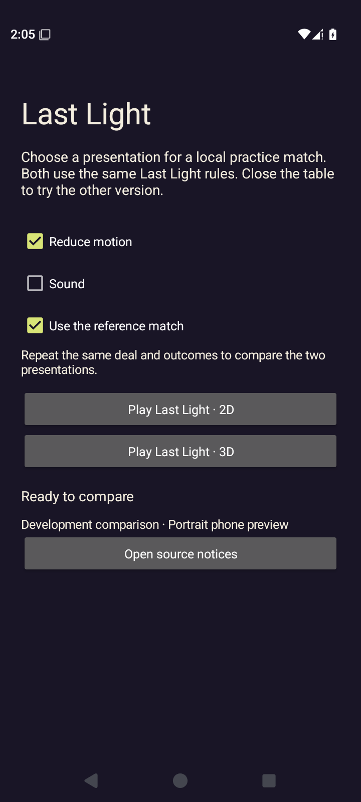
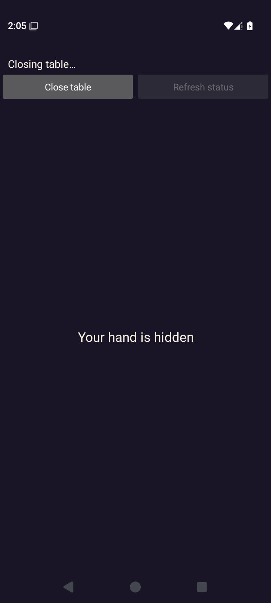
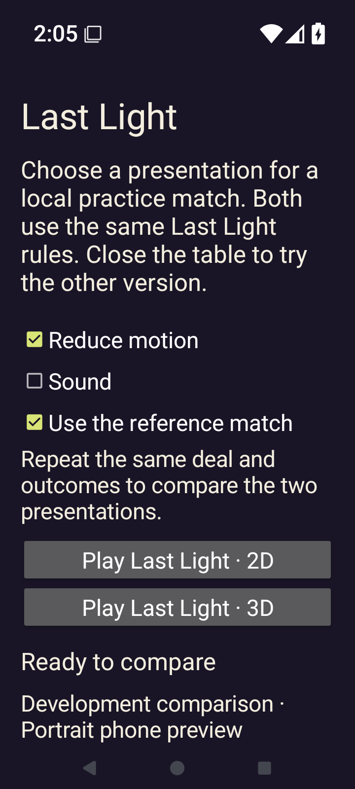
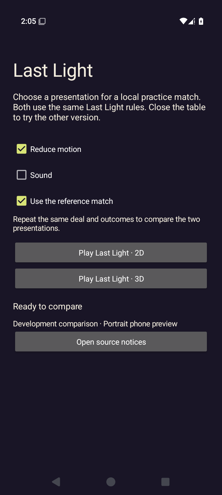
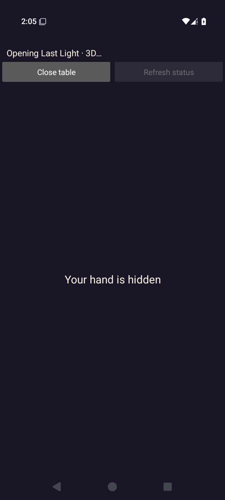
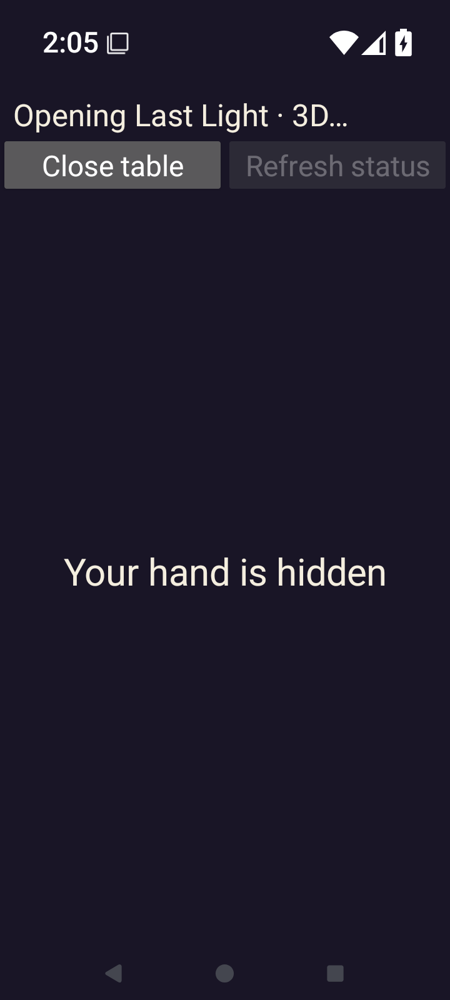

# Godot Android comparison host — failed native entries

[All screenshot collections](../README.md) · [CI run 34427418175](https://github.com/Apdelrahman1911/PartyDeck/actions/runs/34427418175)

**Evidence status:** All four native jobs fail at match entry: 2D and 3D, each at 100% and 200% text. Each records zero play, challenge and advance-round intents. These eight originals show the native chooser and the final covered host. Native Godot game rendering, gameplay, privacy transitions and lifecycle acceptance are not established.

The exact CI revision is `c0474960f76459bf07160ec3dba6dcbb084af3ea`. The three capture-runner hashes in each original result independently match that Git revision. Actual Android API 35 emulator captures are 720 × 1600 pixels at 280 dpi (approximately 411 × 914 dp); the original display logs are retained. Reference match and reduced motion are enabled; sound is disabled. This run used the older CI renderer source, separately retained in the [desktop CI collection](../godot-desktop-34427418175/README.md).

- Debug APK SHA-256: `878b0074bef8adef5a68f0741d2931fca74e4e9201d7cbd16894fea44c255f23`; 314,300,296 bytes.
- Embedded PCK SHA-256: `6bb343ada85e9554ae8886159c6a0461b9232ce5eff864e0ca424f0a7189caa8`; independently verified against the APK and both loose PCK copies.
- Original CI [pack receipt](provenance/partydeck-last-light.receipt.json), [run metadata](provenance/last-run-status.json), [job metadata](provenance/last-jobs-status.json) and [artifact metadata](provenance/artifacts.json) are retained. Large executable packages are not copied into this screenshot gallery.

Every result retains the same immediate error: reading `/sdcard/partydeck-ci-ui.xml` through `adb shell cat` exits 1 during match entry. Final diagnostics later overwrite `last-ui-dump.log` with a successful dump; that success does not erase the earlier error in `result.json`. No retained readiness evidence precedes accepted gameplay. The images and dumps are sequential diagnostics: the 2D/100% final PNG says **Closing table…**, while its dump still says **Opening Last Light · 2D…**. Captions follow the image pixels.

The 200% last-ANR logs retain a Launcher focus timeout; the 100% logs report no ANR since boot. Those preparation/system observations do not identify the underlying Godot entry failure. Original selected logs remain available beside each case. The [downloaded-artifact audit](provenance/evidence-summary.json) and [source-pack audit log](provenance/source-pack-check.log) were produced later by the CI reviewer; they are not original runner reports.

Four `android/emulator/preparation/attempt-1/final-screen.png` files were visually inspected and excluded because they show Android Launcher before app installation. Their exact source paths, dimensions, bytes and hashes are recorded in the main [manifest exclusions](../manifest.json). Renderer source artwork and proof PNGs are assets and add no app captures. Internal review sheets are not published.

All eight app originals retain their filenames and exact bytes. The two 200% chooser PNGs happen to be byte-identical; both distinct job records remain present. At 200%, the notices link is below the initial viewport, while both launch labels remain readable.

## 2D — 1× text

[Original result](2d-font-1.0-debug/result.json) · [Display size](2d-font-1.0-debug/display-size.log) · [Density](2d-font-1.0-debug/display-density.log) · [Final dump log](2d-font-1.0-debug/last-ui-dump.log) · [Last ANR](2d-font-1.0-debug/last-anr.log) · [Preparation result](2d-font-1.0-debug/preparation/preparation-result.json).

| Original image | Scenario and provenance |
| --- | --- |
|  | **Native comparison chooser before 2D launch — 1× text** Android API 35 emulator, native comparison host, 2D requested, debug APK Original: [chooser.png](2d-font-1.0-debug/chooser.png) 720 × 1600 px; text 1× SHA-256: <code>c41851f79da8d5d1013021d903b505d9c2e4c5a9cd5af8c4a12081b8755acb14</code> [Original UI dump](2d-font-1.0-debug/chooser.xml) Reference match enabled, reduced motion enabled, sound disabled. Both presentation launch buttons are visible; no Godot game scene is shown. |
|  | **Failed 2D entry — native cover says “Closing table…” — 1× text** Android API 35 emulator, native comparison host, 2D requested, debug APK Original: [final-screen.png](2d-font-1.0-debug/final-screen.png) 720 × 1600 px; text 1× SHA-256: <code>bc7953f525d51b1efd94f95332ad7bcfb692a958fe6318d739f90a2cefc9979b</code> [Original UI dump](2d-font-1.0-debug/last-ui.xml) Your hand is hidden covers the native host. Close table and a disabled Refresh status remain visible. No rendered game or accepted gameplay intent is established. The PNG visibly says Closing table…, while last-ui.xml still says Opening Last Light · 2D…. Final diagnostics are captured sequentially and are not perfectly simultaneous. |

## 2D — 2× text

[Original result](2d-font-2.0-debug/result.json) · [Display size](2d-font-2.0-debug/display-size.log) · [Density](2d-font-2.0-debug/display-density.log) · [Final dump log](2d-font-2.0-debug/last-ui-dump.log) · [Last ANR](2d-font-2.0-debug/last-anr.log) · [Preparation result](2d-font-2.0-debug/preparation/preparation-result.json).

| Original image | Scenario and provenance |
| --- | --- |
|  | **Native comparison chooser before 2D launch — 2× text** Android API 35 emulator, native comparison host, 2D requested, debug APK Original: [chooser.png](2d-font-2.0-debug/chooser.png) 720 × 1600 px; text 2× SHA-256: <code>8a642e6ee51dc413827d72d4575b0d81689ea22723e44dbefcf2f6aa54cb2c73</code> [Original UI dump](2d-font-2.0-debug/chooser.xml) Reference match enabled, reduced motion enabled, sound disabled. Both presentation launch buttons are visible; no Godot game scene is shown. At 200% text, Open source notices is below the initial viewport. Both presentation launch labels remain readable. |
|  | **Failed 2D entry — native cover says “Opening Last Light · 2D…” — 2× text** Android API 35 emulator, native comparison host, 2D requested, debug APK Original: [final-screen.png](2d-font-2.0-debug/final-screen.png) 720 × 1600 px; text 2× SHA-256: <code>682af23876d54979b6a4cab70315b84874e11959c607bc72fdd9194d4379fe51</code> [Original UI dump](2d-font-2.0-debug/last-ui.xml) Your hand is hidden covers the native host. Close table and a disabled Refresh status remain visible. No rendered game or accepted gameplay intent is established. |

## 3D — 1× text

[Original result](3d-font-1.0-debug/result.json) · [Display size](3d-font-1.0-debug/display-size.log) · [Density](3d-font-1.0-debug/display-density.log) · [Final dump log](3d-font-1.0-debug/last-ui-dump.log) · [Last ANR](3d-font-1.0-debug/last-anr.log) · [Preparation result](3d-font-1.0-debug/preparation/preparation-result.json).

| Original image | Scenario and provenance |
| --- | --- |
|  | **Native comparison chooser before 3D launch — 1× text** Android API 35 emulator, native comparison host, 3D requested, debug APK Original: [chooser.png](3d-font-1.0-debug/chooser.png) 720 × 1600 px; text 1× SHA-256: <code>097e45d90fd7f92b0cf5abcefcacb9579306e7eab4cd872d75155e9ef6252678</code> [Original UI dump](3d-font-1.0-debug/chooser.xml) Reference match enabled, reduced motion enabled, sound disabled. Both presentation launch buttons are visible; no Godot game scene is shown. |
|  | **Failed 3D entry — native cover says “Opening Last Light · 3D…” — 1× text** Android API 35 emulator, native comparison host, 3D requested, debug APK Original: [final-screen.png](3d-font-1.0-debug/final-screen.png) 720 × 1600 px; text 1× SHA-256: <code>8625e8925f336800ff5cddf3da5166aa33a263dadf7c73ed09a77a22df3298ac</code> [Original UI dump](3d-font-1.0-debug/last-ui.xml) Your hand is hidden covers the native host. Close table and a disabled Refresh status remain visible. No rendered game or accepted gameplay intent is established. |

## 3D — 2× text

[Original result](3d-font-2.0-debug/result.json) · [Display size](3d-font-2.0-debug/display-size.log) · [Density](3d-font-2.0-debug/display-density.log) · [Final dump log](3d-font-2.0-debug/last-ui-dump.log) · [Last ANR](3d-font-2.0-debug/last-anr.log) · [Preparation result](3d-font-2.0-debug/preparation/preparation-result.json).

| Original image | Scenario and provenance |
| --- | --- |
|  | **Native comparison chooser before 3D launch — 2× text** Android API 35 emulator, native comparison host, 3D requested, debug APK Original: [chooser.png](3d-font-2.0-debug/chooser.png) 720 × 1600 px; text 2× SHA-256: <code>8a642e6ee51dc413827d72d4575b0d81689ea22723e44dbefcf2f6aa54cb2c73</code> [Original UI dump](3d-font-2.0-debug/chooser.xml) Reference match enabled, reduced motion enabled, sound disabled. Both presentation launch buttons are visible; no Godot game scene is shown. At 200% text, Open source notices is below the initial viewport. Both presentation launch labels remain readable. |
|  | **Failed 3D entry — native cover says “Opening Last Light · 3D…” — 2× text** Android API 35 emulator, native comparison host, 3D requested, debug APK Original: [final-screen.png](3d-font-2.0-debug/final-screen.png) 720 × 1600 px; text 2× SHA-256: <code>d7fd8f78ebd29278bae24de833868a2dcf373aa2e2c5e7f1e827b99460a14376</code> [Original UI dump](3d-font-2.0-debug/last-ui.xml) Your hand is hidden covers the native host. Close table and a disabled Refresh status remain visible. No rendered game or accepted gameplay intent is established. |
