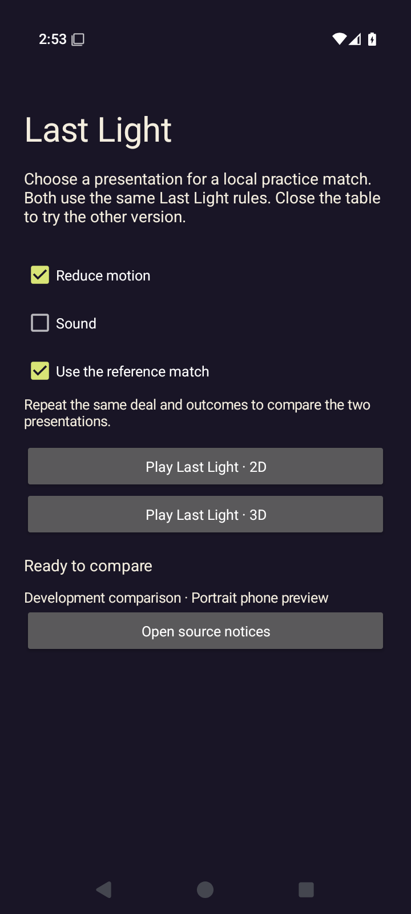
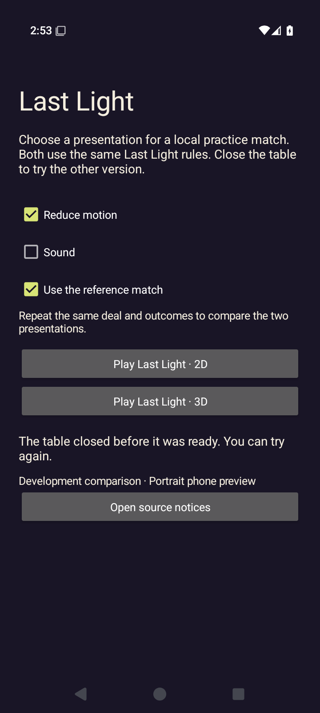
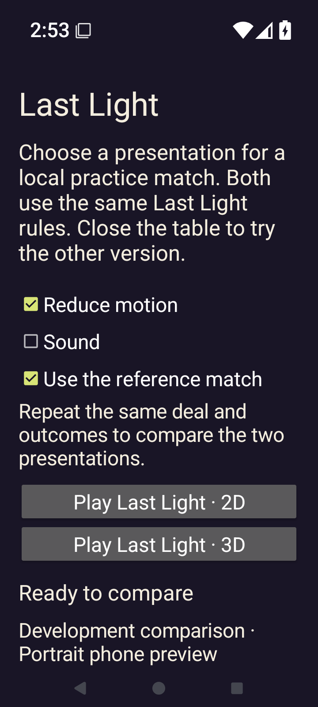
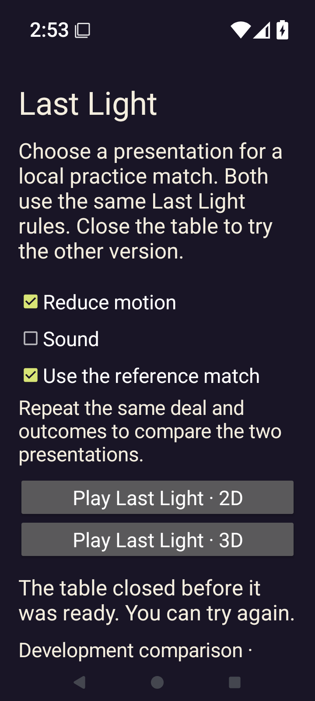

# Godot Android comparison host — initialization failures

[All screenshot collections](../README.md) · [CI run 34430556814](https://github.com/Apdelrahman1911/PartyDeck/actions/runs/34430556814)

**Evidence status:** All four 2D/3D × 100%/200% jobs fail at match entry with `renderer_initialization_failed`, no accepted Ready, no started main loop and zero gameplay intents. The eight original PNGs show the native chooser before launch and after failure. The final chooser says **The table closed before it was ready. You can try again.** No native game scene or gameplay pass is established.

Exact CI revision: `83874c164df7c4a8ee73aad10e7b98b77d67c4d7`. All recorded capture-runner hashes independently match that revision. Actual Android API 35 emulator, 720 × 1600 pixels at 280 dpi, with the per-job font scale recorded in each result. Reference seed 2 and reduced motion are enabled; sound is disabled. Native TalkBack, OS privacy/lifecycle acceptance, audio, sustained device performance and physical LAN remain unqualified.

- Debug APK SHA-256: `9756e81315b746dc900644197763d677c89c27d5a3e174867e3baa12e651f3f8`; 314,309,912 bytes.
- Embedded PCK SHA-256: `26bfbb72efa55b63bef2e0ab989c82356c75b3bb3ca40bcf1c5e70e931bff890`; independently matched to both loose copies and the [desktop comparison](../godot-desktop-34430556814/README.md).
- [Original pack receipt](provenance/partydeck-last-light.receipt.json) · [CI artifacts](provenance/artifacts.json) · [Job metadata](provenance/last-jobs-status.json) · [Later reviewer audit](provenance/evidence-summary.json).

Each actual process log records **PartyDeck Android bridge did not provide its display density.** The captured renderer’s display-scale plugin-method check fails during initialization. Host observations record `setupCompleted=true` but `readyAccepted=false`, `mainLoopStarted=false` and `acceptedIntents=0`; a setup callback does not establish rendered readiness. Both before/after diagnostic observations and the original process logs are retained.

The 3D/200% process additionally logs **Unable to exit the renderer within 1500 ms... Force quitting the process.** Its missing process after cleanup is not evidence of clean teardown. All cases preserve the UI-dump retry diagnostics and original cleanup errors. Unlike the [first native attempt](../godot-android-34427418175/README.md), these final images have returned to the chooser rather than remaining on a covered table.

Both launch labels fit at 200%; the notices link is below the viewport, and the failure message pushes part of the development footer below it. Four pre-install Launcher PNGs are excluded with source paths, dimensions and hashes in the main manifest. The source artwork PNGs are assets, not app captures. All eight app originals, including byte-identical 2D/3D states, remain separate source records.

## 2D — 1× text

[Original result](2d-font-1.0-debug/result.json) · [Failure observations](2d-font-1.0-debug/2d/match/failure-host-observations.log) · [Original process log](2d-font-1.0-debug/2d/match/final-process-logcat.log) · [UI dump retries](2d-font-1.0-debug/ui-dump-failures.log).

| Original image | Scenario and provenance |
| --- | --- |
|  | **Native chooser before 2D launch — 1× text** Android API 35 emulator, native comparison host, 2D requested, debug APK Original: [chooser.png](2d-font-1.0-debug/chooser.png) 720 × 1600 px; text 1× SHA-256: <code>5b60f756fffa671bbf9017cbd42caaefdbfe5574f7a8e152897e5c3621a78128</code> [Original UI dump](2d-font-1.0-debug/chooser.xml) Reference match and reduced motion are enabled; sound is disabled. No game scene is shown. |
|  | **Failed 2D entry returns to the chooser — 1× text** Android API 35 emulator, native comparison host, 2D requested, debug APK Original: [final-screen.png](2d-font-1.0-debug/final-screen.png) 720 × 1600 px; text 1× SHA-256: <code>a050fabe82080474e8cacf910f3a549237f99163bbe4ae4ef5299d4501c1235b</code> [Original UI dump](2d-font-1.0-debug/last-ui.xml) Reference match and reduced motion are enabled; sound is disabled. No game scene is shown. The native chooser says The table closed before it was ready. You can try again. The original result and process log retain renderer_initialization_failed before Ready or accepted gameplay. |

## 2D — 2× text

[Original result](2d-font-2.0-debug/result.json) · [Failure observations](2d-font-2.0-debug/2d/match/failure-host-observations.log) · [Original process log](2d-font-2.0-debug/2d/match/final-process-logcat.log) · [UI dump retries](2d-font-2.0-debug/ui-dump-failures.log).

| Original image | Scenario and provenance |
| --- | --- |
|  | **Native chooser before 2D launch — 2× text** Android API 35 emulator, native comparison host, 2D requested, debug APK Original: [chooser.png](2d-font-2.0-debug/chooser.png) 720 × 1600 px; text 2× SHA-256: <code>a56b410c17b8f27b49abd0021475d05ad3e7df26108363e4792ca21516344111</code> [Original UI dump](2d-font-2.0-debug/chooser.xml) Reference match and reduced motion are enabled; sound is disabled. No game scene is shown. Both presentation launch labels remain visible at 200%. Notices lie below the viewport; after failure, the development footer also continues below it. |
|  | **Failed 2D entry returns to the chooser — 2× text** Android API 35 emulator, native comparison host, 2D requested, debug APK Original: [final-screen.png](2d-font-2.0-debug/final-screen.png) 720 × 1600 px; text 2× SHA-256: <code>37cbf6c90694600d14957a914d802db65a84a74aed01904ef3ced9f5a4a30ce2</code> [Original UI dump](2d-font-2.0-debug/last-ui.xml) Reference match and reduced motion are enabled; sound is disabled. No game scene is shown. The native chooser says The table closed before it was ready. You can try again. The original result and process log retain renderer_initialization_failed before Ready or accepted gameplay. Both presentation launch labels remain visible at 200%. Notices lie below the viewport; after failure, the development footer also continues below it. |

## 3D — 1× text

[Original result](3d-font-1.0-debug/result.json) · [Failure observations](3d-font-1.0-debug/3d/match/failure-host-observations.log) · [Original process log](3d-font-1.0-debug/3d/match/final-process-logcat.log) · [UI dump retries](3d-font-1.0-debug/ui-dump-failures.log).

| Original image | Scenario and provenance |
| --- | --- |
|  | **Native chooser before 3D launch — 1× text** Android API 35 emulator, native comparison host, 3D requested, debug APK Original: [chooser.png](3d-font-1.0-debug/chooser.png) 720 × 1600 px; text 1× SHA-256: <code>5b60f756fffa671bbf9017cbd42caaefdbfe5574f7a8e152897e5c3621a78128</code> [Original UI dump](3d-font-1.0-debug/chooser.xml) Reference match and reduced motion are enabled; sound is disabled. No game scene is shown. |
|  | **Failed 3D entry returns to the chooser — 1× text** Android API 35 emulator, native comparison host, 3D requested, debug APK Original: [final-screen.png](3d-font-1.0-debug/final-screen.png) 720 × 1600 px; text 1× SHA-256: <code>a050fabe82080474e8cacf910f3a549237f99163bbe4ae4ef5299d4501c1235b</code> [Original UI dump](3d-font-1.0-debug/last-ui.xml) Reference match and reduced motion are enabled; sound is disabled. No game scene is shown. The native chooser says The table closed before it was ready. You can try again. The original result and process log retain renderer_initialization_failed before Ready or accepted gameplay. |

## 3D — 2× text

[Original result](3d-font-2.0-debug/result.json) · [Failure observations](3d-font-2.0-debug/3d/match/failure-host-observations.log) · [Original process log](3d-font-2.0-debug/3d/match/final-process-logcat.log) · [UI dump retries](3d-font-2.0-debug/ui-dump-failures.log).

| Original image | Scenario and provenance |
| --- | --- |
|  | **Native chooser before 3D launch — 2× text** Android API 35 emulator, native comparison host, 3D requested, debug APK Original: [chooser.png](3d-font-2.0-debug/chooser.png) 720 × 1600 px; text 2× SHA-256: <code>a56b410c17b8f27b49abd0021475d05ad3e7df26108363e4792ca21516344111</code> [Original UI dump](3d-font-2.0-debug/chooser.xml) Reference match and reduced motion are enabled; sound is disabled. No game scene is shown. Both presentation launch labels remain visible at 200%. Notices lie below the viewport; after failure, the development footer also continues below it. |
|  | **Failed 3D entry returns to the chooser — 2× text** Android API 35 emulator, native comparison host, 3D requested, debug APK Original: [final-screen.png](3d-font-2.0-debug/final-screen.png) 720 × 1600 px; text 2× SHA-256: <code>37cbf6c90694600d14957a914d802db65a84a74aed01904ef3ced9f5a4a30ce2</code> [Original UI dump](3d-font-2.0-debug/last-ui.xml) Reference match and reduced motion are enabled; sound is disabled. No game scene is shown. The native chooser says The table closed before it was ready. You can try again. The original result and process log retain renderer_initialization_failed before Ready or accepted gameplay. Both presentation launch labels remain visible at 200%. Notices lie below the viewport; after failure, the development footer also continues below it. This 3D/200% process also logs Unable to exit the renderer within 1500 ms... Force quitting the process. Process disappearance is not a clean teardown pass. |
