# Godot Android — bounded gameplay and Ready evidence

[All screenshot collections](../README.md) · [CI run 34433457249](https://github.com/Apdelrahman1911/PartyDeck/actions/runs/34433457249)

**Evidence status: all four full qualification jobs fail.** The originals also establish narrower executed results: 2D/100% completes the seed-2 match and records native destruction; 2D/200% plays through round 4; both 3D entries render their native Ready scene. The failed runner outcomes remain unchanged.

| Native case | Originals | Executed result and stopping point |
| --- | ---: | --- |
| 2D, 100% | 14 | Two plays, two challenges, thirteen advances, winner at round 14/revision 41, then accepted Return to lobby. Final PNG shows the chooser; original observations record acknowledged close, closed bridge, native destruction returned in 253 ms and absent engine PIDs. The runner still times out in **2d lobby reachability**, before a complete teardown receipt or the fresh-entry/later close sequence. |
| 2D, 200% | 13 | One play, one challenge, three advances and round-4 public outcome. Next round reachability times out after repeated scroll overshoot; no winner or teardown pass. |
| 3D, 100% | 2 | Actual native Ready/Star-table rendering and concealed hand. Zero gameplay intents; shader-cache warning classification stops the runner at match entry. |
| 3D, 200% | 2 | Actual enlarged Ready/Star-table rendering; hand/table content continues below the viewport. Zero gameplay intents; the same warning classification stops match entry. |

Exact CI revision `bf77ea73e8b3b2f3f4115fda3a95f598c8de1148`; captured runner hashes independently match this source. Actual Android API 35 emulator, 720 × 1600 at 280 dpi (density 1.75), with recorded font scale 1.0/2.0. The normal engine surface is 720 × 1244 at y=272; the 200% surface is 720 × 1204 at y=312. Their root viewports are approximately 411.43 × 710.86 and 411.43 × 688 logical units. Reference seed 2 and reduced motion are enabled; sound is disabled.

- Executed APK SHA-256: `2957db8d5bff4fa7c02b9a4bedbab9a2ee474bfc289c47380e9ac94499c96fa0`; 314,309,880 bytes.
- Embedded PCK SHA-256: `6599f825a418f9d2a7049b3ba9325e8e0dcb474685262899079231b7ec955938`; independently matched to both loose CI copies and the [passing desktop comparison](../godot-desktop-34433457249/README.md).
- [Original pack receipt](provenance/partydeck-last-light.receipt.json) · [CI artifacts](provenance/artifacts.json) · [Job metadata](provenance/last-jobs-status.json) · [Later reviewer audit](provenance/evidence-summary.json).

The original 2D/100% checker waits for a lobby confirmation after tapping Return to lobby, but the retained observations already show the finished table's accepted return and native destruction. The resulting failed stage must not be rewritten as a full-mode pass. Its initial Reveal label is readable while the lower rounded edge extends four root-viewport units (seven device pixels) past the scroll clip; later scrolling and touch actions succeed. At 200%, the last six Next round target y positions alternate 809 → 81 → 797 → 191 → 809 → 100 around a clip spanning y=211..676, then the deadline expires. Enlarged public result explanations and actions continue below their initial captured viewports.

Both actual 3D process logs contain `WARNING: Failed to load cached shader, recompiling.` and its `_load_from_cache` location on Android **E** priority. The [captured checker](https://github.com/Apdelrahman1911/PartyDeck/blob/bf77ea73e8b3b2f3f4115fda3a95f598c8de1148/godot/android-checks/run.py) rejects any E-priority Godot line, producing the original engine-or-resource-error result. Final host observations reach Ready, a foreground frame and zero gameplay intents; there is no successful 3D gameplay or teardown sequence.

Both 2D background flows first reveal/select the own hand, then press Home, inspect Recents and resume the same process/presentation concealed. Direct inspection of both Recents originals shows covered previews without private faces, labels or selection. The paired resumed diagnostics record all three private counts as zero. This supports the exercised emulator path; it does not qualify every lifecycle, device or assistive-technology case.

All 31 originals remain separate, including byte-identical scene stages, background Launcher frames and final diagnostics. The nineteen original `captures.log` entries provide **cropped engine RGB hashes**, independently recomputed against each PNG and paired host JSON; full-PNG hashes in this gallery are independently computed separately. Original UI dumps, input geometry, host observations, failure observations and process logs are retained beside the PNGs. Four pre-install Launcher PNGs are excluded with full metadata, while the two background-Home images above remain lifecycle evidence. Source-art PNGs are renderer assets, not app captures. The [two earlier Android initialization-failure runs](../godot-android-34430556814/README.md) remain in history.

## 2D — 1× text

[Original result](2d-font-1.0-debug/result.json) · [Original failure observations](2d-font-1.0-debug/2d/match/failure-host-observations.log) · [Original process log](2d-font-1.0-debug/2d/match/final-process-logcat.log).

[Original scene crop hashes](2d-font-1.0-debug/2d/match/captures.log) · [Actual scene inputs](2d-font-1.0-debug/2d/match/scene-input-geometry.log) · [Host observation sequence](2d-font-1.0-debug/2d/match/host-observations.log).

| Original image | Scenario and provenance |
| --- | --- |
|  | **Native 2D reference match begins with the own hand concealed — 1× text** Android API 35 emulator, actual native 2D comparison host, debug APK Original: [01-concealed.png](2d-font-1.0-debug/2d/match/01-concealed.png) 720 × 1600 px; text 1× SHA-256: <code>52d8b06c0cb7a51e4b0dc0e87f31ed75bd4922491925ac792b6dcf57b218db3b</code> [Original UI dump](2d-font-1.0-debug/2d/match/01-concealed.xml) [Original measurements](2d-font-1.0-debug/2d/match/01-concealed.json) Initial Reveal label is readable but its lower rounded border is clipped. Original rect [32,512,339,56] ends at y=568; clip [16,118,379,446] ends at y=564, a four-unit/seven-device-pixel overrun at density 1.75. Later reachability scrolling and taps succeed. |
| <a href="2d-font-1.0-debug/2d/match/02-revealed.png">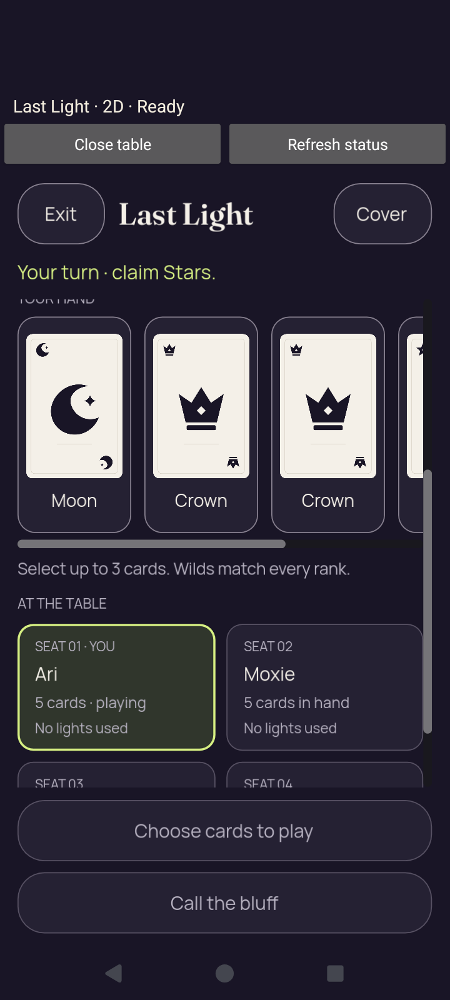</a> | **Native 2D own hand revealed through actual touch input — 1× text** Android API 35 emulator, actual native 2D comparison host, debug APK Original: [02-revealed.png](2d-font-1.0-debug/2d/match/02-revealed.png) 720 × 1600 px; text 1× SHA-256: <code>ec22f3fee01e09e019ece5a7e767fb86e1ba35230dc647e458a1ffd69445ea49</code> [Original UI dump](2d-font-1.0-debug/2d/match/02-revealed.xml) [Original measurements](2d-font-1.0-debug/2d/match/02-revealed.json) |
| <a href="2d-font-1.0-debug/2d/match/03-selected.png">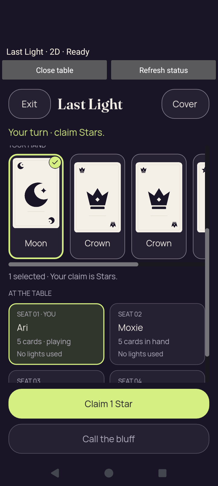</a> | **Native 2D Moon selected for a one-Star claim — 1× text** Android API 35 emulator, actual native 2D comparison host, debug APK Original: [03-selected.png](2d-font-1.0-debug/2d/match/03-selected.png) 720 × 1600 px; text 1× SHA-256: <code>86d5c840de27d46516c7d43337aa82db5f102e5ce5dd1eed3693fa6f58ca5d7e</code> [Original UI dump](2d-font-1.0-debug/2d/match/03-selected.xml) [Original measurements](2d-font-1.0-debug/2d/match/03-selected.json) |
|  | **Native 2D hand covered and selection cleared — 1× text** Android API 35 emulator, actual native 2D comparison host, debug APK Original: [04-covered.png](2d-font-1.0-debug/2d/match/04-covered.png) 720 × 1600 px; text 1× SHA-256: <code>b5ee8f4d91fa5e0c592af4b1f3a8510d660780f6a34932375a9157bec468cae6</code> [Original UI dump](2d-font-1.0-debug/2d/match/04-covered.xml) [Original measurements](2d-font-1.0-debug/2d/match/04-covered.json) Original paired host diagnostics record zero private faces, private labels and selection. Resume retains the same engine process and presentation identity. |
|  | **Android Home while the revealed native match is backgrounded — 1× text** Android API 35 emulator, actual native 2D comparison host, debug APK Original: [05-background-home.png](2d-font-1.0-debug/2d/match/05-background-home.png) 720 × 1600 px; text 1× SHA-256: <code>5c310a5cc252feca19c8c8183330d1d154d093ba80e701c9b9696982568eb576</code> [Original UI dump](2d-font-1.0-debug/2d/match/05-background-home.xml) This Launcher image is retained lifecycle evidence, captured after the runner reveals/selects the own hand and presses Home. It is distinct from the excluded pre-install Launcher diagnostics. |
|  | **Android Recents with the native task preview covered — 1× text** Android API 35 emulator, actual native 2D comparison host, debug APK Original: [06-recents-privacy.png](2d-font-1.0-debug/2d/match/06-recents-privacy.png) 720 × 1600 px; text 1× SHA-256: <code>fa26e159dc1b7dffe2e8b174b8c4148a69735bd739ee68a02279c6e5138d3d47</code> [Original UI dump](2d-font-1.0-debug/2d/match/06-recents-privacy.xml) Direct inspection shows a covered task preview without private card faces, rank labels or selection. Original observations retain native cover and recents_disabled policy. This supports the exercised 2D emulator path, not all device/lifecycle cases. |
| <a href="2d-font-1.0-debug/2d/match/07-resumed-concealed.png">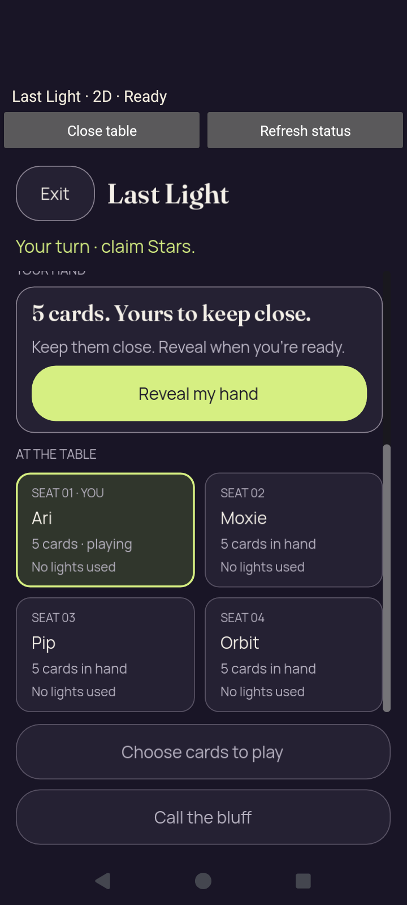</a> | **Same native presentation resumes with the hand concealed — 1× text** Android API 35 emulator, actual native 2D comparison host, debug APK Original: [07-resumed-concealed.png](2d-font-1.0-debug/2d/match/07-resumed-concealed.png) 720 × 1600 px; text 1× SHA-256: <code>b5ee8f4d91fa5e0c592af4b1f3a8510d660780f6a34932375a9157bec468cae6</code> [Original UI dump](2d-font-1.0-debug/2d/match/07-resumed-concealed.xml) [Original measurements](2d-font-1.0-debug/2d/match/07-resumed-concealed.json) Original paired host diagnostics record zero private faces, private labels and selection. Resume retains the same engine process and presentation identity. |
|  | **Native result after Moxie catches Ari’s Star bluff — 1× text** Android API 35 emulator, actual native 2D comparison host, debug APK Original: [08-after-play.png](2d-font-1.0-debug/2d/match/08-after-play.png) 720 × 1600 px; text 1× SHA-256: <code>a6c656b104f4c6fab8277a540aff606c3e28fdb7efb7007c49b22dd8e2b3b706</code> [Original UI dump](2d-font-1.0-debug/2d/match/08-after-play.xml) [Original measurements](2d-font-1.0-debug/2d/match/08-after-play.json) Moxie challenges Ari’s one-Star claim; the public Moon does not match. Ari uses light 1 and stays in. The two stage originals remain separate even where pixels match. |
|  | **Native public round-1 outcome retained as its own capture — 1× text** Android API 35 emulator, actual native 2D comparison host, debug APK Original: [09-public-outcome.png](2d-font-1.0-debug/2d/match/09-public-outcome.png) 720 × 1600 px; text 1× SHA-256: <code>a6c656b104f4c6fab8277a540aff606c3e28fdb7efb7007c49b22dd8e2b3b706</code> [Original UI dump](2d-font-1.0-debug/2d/match/09-public-outcome.xml) [Original measurements](2d-font-1.0-debug/2d/match/09-public-outcome.json) Moxie challenges Ari’s one-Star claim; the public Moon does not match. Ari uses light 1 and stays in. The two stage originals remain separate even where pixels match. |
|  | **Native round-2 result after an accepted round advance — 1× text** Android API 35 emulator, actual native 2D comparison host, debug APK Original: [10-next-round.png](2d-font-1.0-debug/2d/match/10-next-round.png) 720 × 1600 px; text 1× SHA-256: <code>03a7db1235529cd56a39d5acc3bb8fcb246d67caa6e2ed026b750b958a9cb17d</code> [Original UI dump](2d-font-1.0-debug/2d/match/10-next-round.xml) [Original measurements](2d-font-1.0-debug/2d/match/10-next-round.json) After the accepted advance, autonomous turns already settle round 2: Pip catches Moxie’s Crown claim with a public Moon. Moxie uses light 1 and stays in. |
|  | **Native round-4 result after Ari challenges Orbit — 1× text** Android API 35 emulator, actual native 2D comparison host, debug APK Original: [11-after-challenge.png](2d-font-1.0-debug/2d/match/11-after-challenge.png) 720 × 1600 px; text 1× SHA-256: <code>37a96b415688cbdb8d9c1028fa9bb96cd386e51ecb584dd9d5f7eb0147e374e9</code> [Original UI dump](2d-font-1.0-debug/2d/match/11-after-challenge.xml) [Original measurements](2d-font-1.0-debug/2d/match/11-after-challenge.json) Ari catches Orbit’s Crown claim with a public Moon. Orbit uses light 1 and stays in; the authoritative receipt is at revision 11 / round 4. |
|  | **Native round-14 winner: Orbit wins after Moxie burns out — 1× text** Android API 35 emulator, actual native 2D comparison host, debug APK Original: [12-winner.png](2d-font-1.0-debug/2d/match/12-winner.png) 720 × 1600 px; text 1× SHA-256: <code>e74cbb701eb5150fdbb59b4f6bfca6434ada79fcb0c912432413159180faa867</code> [Original UI dump](2d-font-1.0-debug/2d/match/12-winner.xml) [Original measurements](2d-font-1.0-debug/2d/match/12-winner.json) Authority revision 41 / round 14. Orbit catches Moxie’s Crown claim with Moon; Moxie uses light 4 and burns out. The complete Return to lobby action is visible. |
|  | **Native chooser before 2D launch — 1× text** Android API 35 emulator, actual native 2D comparison host, debug APK Original: [chooser.png](2d-font-1.0-debug/chooser.png) 720 × 1600 px; text 1× SHA-256: <code>243a2b9d3883ffb77eabe7bbbfe11a381a075f5a1a7c1a5e2307929003879f45</code> [Original UI dump](2d-font-1.0-debug/chooser.xml) Reduced motion and the seed-2 reference match are enabled; sound is disabled. |
|  | **Final chooser after completed match and observed native destruction** Android API 35 emulator, actual native 2D comparison host, debug APK Original: [final-screen.png](2d-font-1.0-debug/final-screen.png) 720 × 1600 px; text 1× SHA-256: <code>243a2b9d3883ffb77eabe7bbbfe11a381a075f5a1a7c1a5e2307929003879f45</code> [Original UI dump](2d-font-1.0-debug/last-ui.xml) The match reaches winner round 14 and accepts Return to lobby. Original failure observations retain closed bridge, acknowledged close, native destruction returned in 253 ms and absent engine PIDs. The checker still fails 2d lobby reachability; no complete teardown receipt or fresh-entry sequence was reached. |

## 2D — 2× text

[Original result](2d-font-2.0-debug/result.json) · [Original failure observations](2d-font-2.0-debug/2d/match/failure-host-observations.log) · [Original process log](2d-font-2.0-debug/2d/match/final-process-logcat.log).

[Original scene crop hashes](2d-font-2.0-debug/2d/match/captures.log) · [Actual scene inputs](2d-font-2.0-debug/2d/match/scene-input-geometry.log) · [Host observation sequence](2d-font-2.0-debug/2d/match/host-observations.log).

| Original image | Scenario and provenance |
| --- | --- |
| <a href="2d-font-2.0-debug/2d/match/01-concealed.png">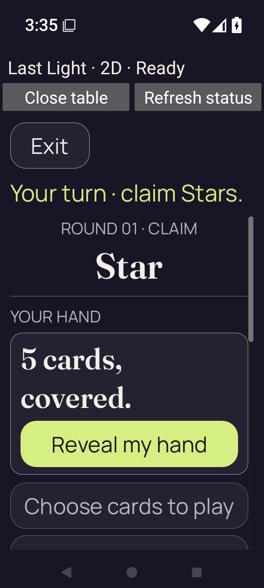</a> | **Native 2D reference match begins with the own hand concealed — 2× text** Android API 35 emulator, actual native 2D comparison host, debug APK Original: [01-concealed.png](2d-font-2.0-debug/2d/match/01-concealed.png) 720 × 1600 px; text 2× SHA-256: <code>93490505aba85801b5604d2b61f6e3f9e4ef893a89715ef95366d970bc0dac93</code> [Original UI dump](2d-font-2.0-debug/2d/match/01-concealed.xml) [Original measurements](2d-font-2.0-debug/2d/match/01-concealed.json) |
| <a href="2d-font-2.0-debug/2d/match/02-revealed.png">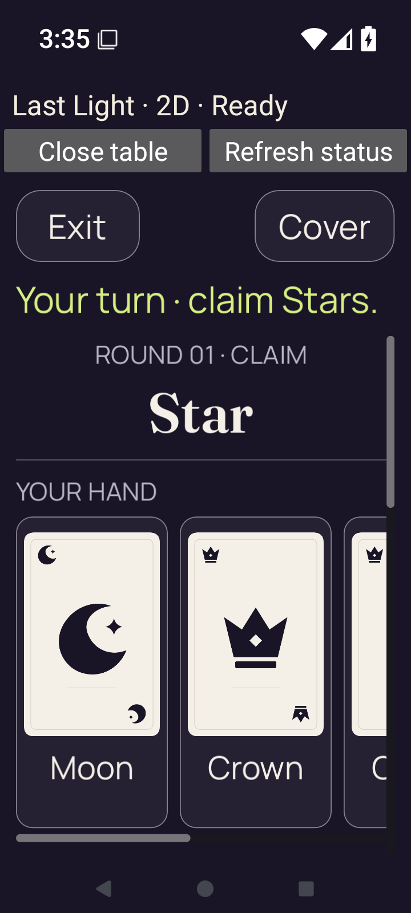</a> | **Native 2D own hand revealed through actual touch input — 2× text** Android API 35 emulator, actual native 2D comparison host, debug APK Original: [02-revealed.png](2d-font-2.0-debug/2d/match/02-revealed.png) 720 × 1600 px; text 2× SHA-256: <code>ff869cc6133311ded99914ab2b5bb58bfd9533e5803baa04b3de9ca00ee3ae47</code> [Original UI dump](2d-font-2.0-debug/2d/match/02-revealed.xml) [Original measurements](2d-font-2.0-debug/2d/match/02-revealed.json) |
| <a href="2d-font-2.0-debug/2d/match/03-selected.png">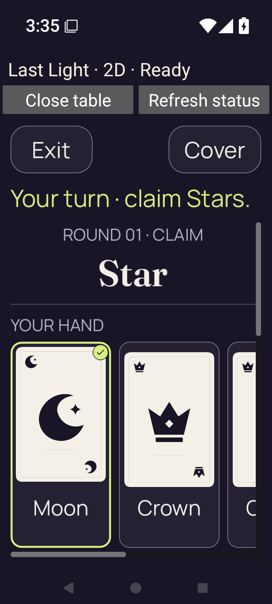</a> | **Native 2D Moon selected for a one-Star claim — 2× text** Android API 35 emulator, actual native 2D comparison host, debug APK Original: [03-selected.png](2d-font-2.0-debug/2d/match/03-selected.png) 720 × 1600 px; text 2× SHA-256: <code>696a9c2c0c57c47edbceb9b102854f62d41a42cb75adb0986cae5c1a039a782c</code> [Original UI dump](2d-font-2.0-debug/2d/match/03-selected.xml) [Original measurements](2d-font-2.0-debug/2d/match/03-selected.json) |
|  | **Native 2D hand covered and selection cleared — 2× text** Android API 35 emulator, actual native 2D comparison host, debug APK Original: [04-covered.png](2d-font-2.0-debug/2d/match/04-covered.png) 720 × 1600 px; text 2× SHA-256: <code>59b0bd2920029214ffd9e87140e28e5d3e11b527137eb8cfd3a464d8d4e80447</code> [Original UI dump](2d-font-2.0-debug/2d/match/04-covered.xml) [Original measurements](2d-font-2.0-debug/2d/match/04-covered.json) Original paired host diagnostics record zero private faces, private labels and selection. Resume retains the same engine process and presentation identity. |
| <a href="2d-font-2.0-debug/2d/match/05-background-home.png">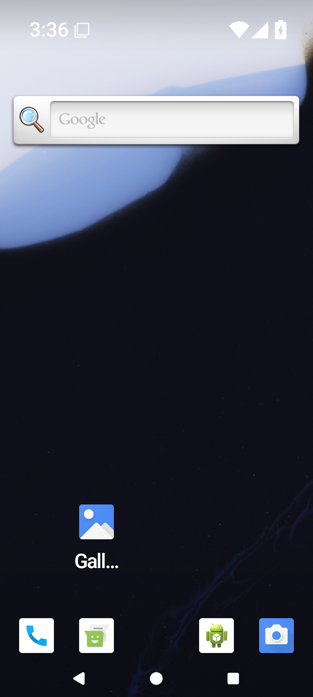</a> | **Android Home while the revealed native match is backgrounded — 2× text** Android API 35 emulator, actual native 2D comparison host, debug APK Original: [05-background-home.png](2d-font-2.0-debug/2d/match/05-background-home.png) 720 × 1600 px; text 2× SHA-256: <code>4eb2af1e41dae96c2e366e15dcd1755ab1211c64f7c969ddef593335480cd9de</code> [Original UI dump](2d-font-2.0-debug/2d/match/05-background-home.xml) This Launcher image is retained lifecycle evidence, captured after the runner reveals/selects the own hand and presses Home. It is distinct from the excluded pre-install Launcher diagnostics. |
| <a href="2d-font-2.0-debug/2d/match/06-recents-privacy.png">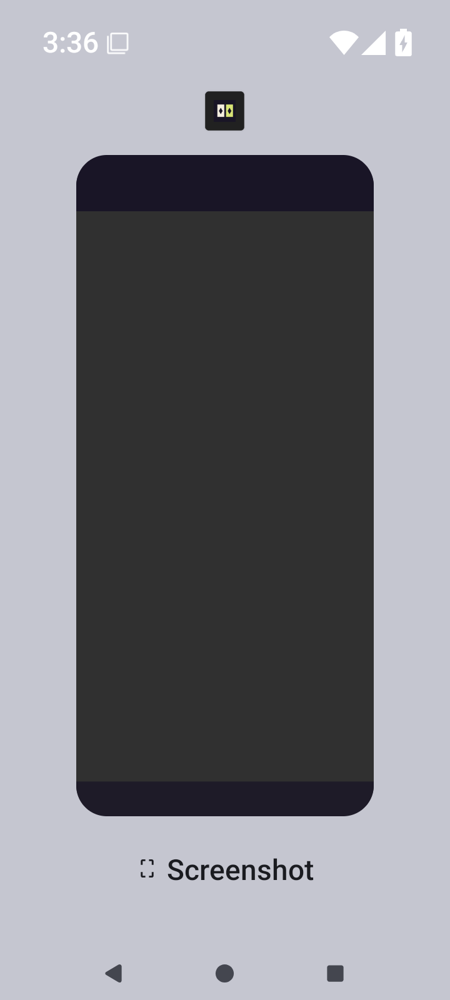</a> | **Android Recents with the native task preview covered — 2× text** Android API 35 emulator, actual native 2D comparison host, debug APK Original: [06-recents-privacy.png](2d-font-2.0-debug/2d/match/06-recents-privacy.png) 720 × 1600 px; text 2× SHA-256: <code>874f2309a269aa34861d3674ebb656663470786067f816ad9da41e0b3ab3f8bc</code> [Original UI dump](2d-font-2.0-debug/2d/match/06-recents-privacy.xml) Direct inspection shows a covered task preview without private card faces, rank labels or selection. Original observations retain native cover and recents_disabled policy. This supports the exercised 2D emulator path, not all device/lifecycle cases. |
|  | **Same native presentation resumes with the hand concealed — 2× text** Android API 35 emulator, actual native 2D comparison host, debug APK Original: [07-resumed-concealed.png](2d-font-2.0-debug/2d/match/07-resumed-concealed.png) 720 × 1600 px; text 2× SHA-256: <code>59b0bd2920029214ffd9e87140e28e5d3e11b527137eb8cfd3a464d8d4e80447</code> [Original UI dump](2d-font-2.0-debug/2d/match/07-resumed-concealed.xml) [Original measurements](2d-font-2.0-debug/2d/match/07-resumed-concealed.json) Original paired host diagnostics record zero private faces, private labels and selection. Resume retains the same engine process and presentation identity. |
|  | **Native result after Moxie catches Ari’s Star bluff — 2× text** Android API 35 emulator, actual native 2D comparison host, debug APK Original: [08-after-play.png](2d-font-2.0-debug/2d/match/08-after-play.png) 720 × 1600 px; text 2× SHA-256: <code>838f08c50c996befef28949e1d970bcb1ecca21aa99835a9b191785bd01954b2</code> [Original UI dump](2d-font-2.0-debug/2d/match/08-after-play.xml) [Original measurements](2d-font-2.0-debug/2d/match/08-after-play.json) Moxie challenges Ari’s one-Star claim; the public Moon does not match. Ari uses light 1 and stays in. The two stage originals remain separate even where pixels match. The enlarged result explanation and next action continue below the captured initial viewport. |
| <a href="2d-font-2.0-debug/2d/match/09-public-outcome.png">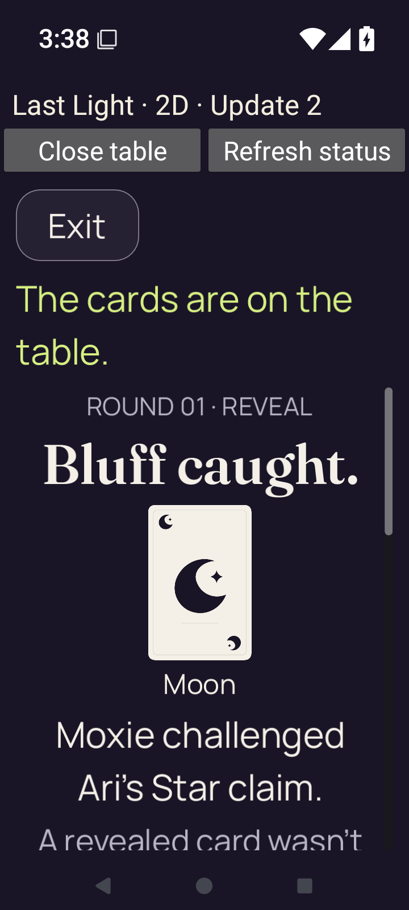</a> | **Native public round-1 outcome retained as its own capture — 2× text** Android API 35 emulator, actual native 2D comparison host, debug APK Original: [09-public-outcome.png](2d-font-2.0-debug/2d/match/09-public-outcome.png) 720 × 1600 px; text 2× SHA-256: <code>838f08c50c996befef28949e1d970bcb1ecca21aa99835a9b191785bd01954b2</code> [Original UI dump](2d-font-2.0-debug/2d/match/09-public-outcome.xml) [Original measurements](2d-font-2.0-debug/2d/match/09-public-outcome.json) Moxie challenges Ari’s one-Star claim; the public Moon does not match. Ari uses light 1 and stays in. The two stage originals remain separate even where pixels match. The enlarged result explanation and next action continue below the captured initial viewport. |
| <a href="2d-font-2.0-debug/2d/match/10-next-round.png">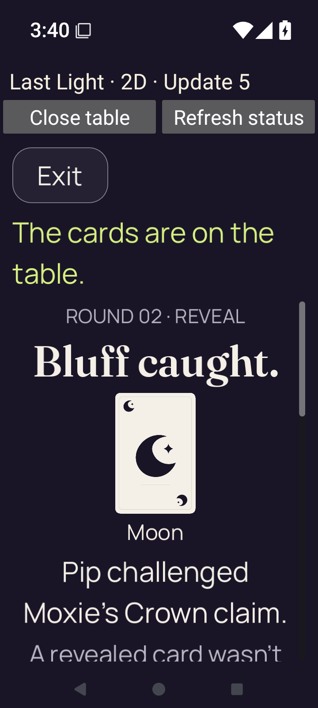</a> | **Native round-2 result after an accepted round advance — 2× text** Android API 35 emulator, actual native 2D comparison host, debug APK Original: [10-next-round.png](2d-font-2.0-debug/2d/match/10-next-round.png) 720 × 1600 px; text 2× SHA-256: <code>1ba836b05280d5ebdcbd4088e74ae1e47fb29bfa4b227a338352263ebf399c02</code> [Original UI dump](2d-font-2.0-debug/2d/match/10-next-round.xml) [Original measurements](2d-font-2.0-debug/2d/match/10-next-round.json) After the accepted advance, autonomous turns already settle round 2: Pip catches Moxie’s Crown claim with a public Moon. Moxie uses light 1 and stays in. The enlarged result explanation and next action continue below the captured initial viewport. |
| <a href="2d-font-2.0-debug/2d/match/11-after-challenge.png">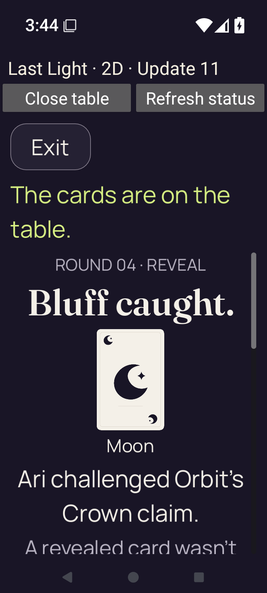</a> | **Native round-4 result after Ari challenges Orbit — 2× text** Android API 35 emulator, actual native 2D comparison host, debug APK Original: [11-after-challenge.png](2d-font-2.0-debug/2d/match/11-after-challenge.png) 720 × 1600 px; text 2× SHA-256: <code>eccc1633096f7462be68b5488b0f891802ec0b4bf43e1c525498b95b4b5e8ae3</code> [Original UI dump](2d-font-2.0-debug/2d/match/11-after-challenge.xml) [Original measurements](2d-font-2.0-debug/2d/match/11-after-challenge.json) Ari catches Orbit’s Crown claim with a public Moon. Orbit uses light 1 and stays in; the authoritative receipt is at revision 11 / round 4. The enlarged result explanation and next action continue below the captured initial viewport. |
|  | **Native chooser before 2D launch — 2× text** Android API 35 emulator, actual native 2D comparison host, debug APK Original: [chooser.png](2d-font-2.0-debug/chooser.png) 720 × 1600 px; text 2× SHA-256: <code>d253f04b21b34c17462021ef07c3917dad178ac5c0ed043957cb12e6a0a5b071</code> [Original UI dump](2d-font-2.0-debug/chooser.xml) Reduced motion and the seed-2 reference match are enabled; sound is disabled. Both launch labels fit at 200%; Open source notices is below the initial viewport. |
|  | **Final round-4 result after 200% Next round reachability timeout** Android API 35 emulator, actual native 2D comparison host, debug APK Original: [final-screen.png](2d-font-2.0-debug/final-screen.png) 720 × 1600 px; text 2× SHA-256: <code>767b338e82ae20e7ea2ddd3a202dc458e4175b58afd12ff7020dcf8e59ef529b</code> [Original UI dump](2d-font-2.0-debug/last-ui.xml) Ari challenged Orbit’s Crown claim; the public Moon catches the bluff. The remaining explanation and Next round action continue below this viewport. Repeated swipes move the target above and below its clip, then the checker deadline expires. No winner or native teardown is established for this case. |

## 3D — 1× text

[Original result](3d-font-1.0-debug/result.json) · [Original failure observations](3d-font-1.0-debug/3d/match/failure-host-observations.log) · [Original process log](3d-font-1.0-debug/3d/match/final-process-logcat.log).

| Original image | Scenario and provenance |
| --- | --- |
|  | **Native chooser before 3D launch — 1× text** Android API 35 emulator, actual native 3D comparison host, debug APK Original: [chooser.png](3d-font-1.0-debug/chooser.png) 720 × 1600 px; text 1× SHA-256: <code>243a2b9d3883ffb77eabe7bbbfe11a381a075f5a1a7c1a5e2307929003879f45</code> [Original UI dump](3d-font-1.0-debug/chooser.xml) Reduced motion and the seed-2 reference match are enabled; sound is disabled. |
|  | **Actual native 3D Ready scene after checker warning rejection — 1× text** Android API 35 emulator, actual native 3D comparison host, debug APK Original: [final-screen.png](3d-font-1.0-debug/final-screen.png) 720 × 1600 px; text 1× SHA-256: <code>65057e0353a02e5e2bd19b44f3bcd0ff2d42c9e76b00c4e065ef9a8a403627d3</code> [Original UI dump](3d-font-1.0-debug/last-ui.xml) The Star table and concealed hand render. Original host observations reach Ready and a foreground frame with zero gameplay intents. The checker rejects the Android E-priority WARNING: Failed to load cached shader, recompiling. This remains a failed full qualification run. |

## 3D — 2× text

[Original result](3d-font-2.0-debug/result.json) · [Original failure observations](3d-font-2.0-debug/3d/match/failure-host-observations.log) · [Original process log](3d-font-2.0-debug/3d/match/final-process-logcat.log).

| Original image | Scenario and provenance |
| --- | --- |
| <a href="3d-font-2.0-debug/chooser.png">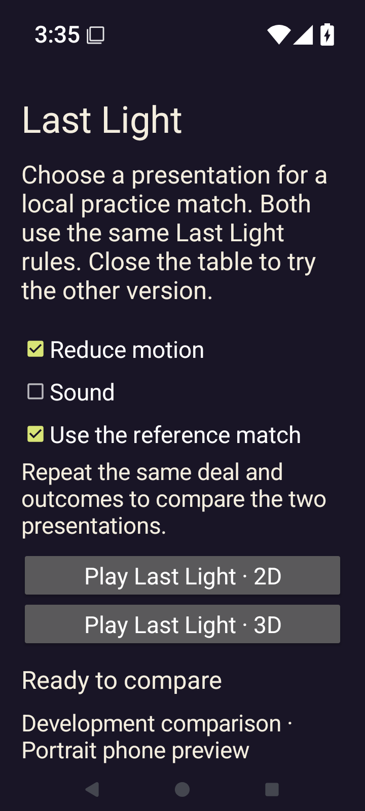</a> | **Native chooser before 3D launch — 2× text** Android API 35 emulator, actual native 3D comparison host, debug APK Original: [chooser.png](3d-font-2.0-debug/chooser.png) 720 × 1600 px; text 2× SHA-256: <code>c819b9b177d5e28f5ef570e737fc399b1d60e4c0cc50f7e9f77e75098ad19c52</code> [Original UI dump](3d-font-2.0-debug/chooser.xml) Reduced motion and the seed-2 reference match are enabled; sound is disabled. Both launch labels fit at 200%; Open source notices is below the initial viewport. |
| <a href="3d-font-2.0-debug/final-screen.png">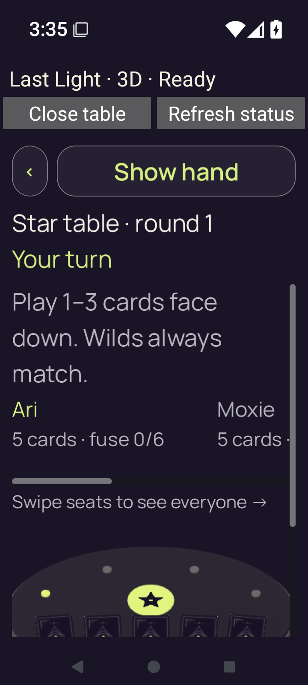</a> | **Actual native 3D Ready scene after checker warning rejection — 2× text** Android API 35 emulator, actual native 3D comparison host, debug APK Original: [final-screen.png](3d-font-2.0-debug/final-screen.png) 720 × 1600 px; text 2× SHA-256: <code>bbb7c23c40c8cdfc07199cac95c086a76931bc325738d66ccb4d0d4270340a3d</code> [Original UI dump](3d-font-2.0-debug/last-ui.xml) The Star table and concealed hand render. Original host observations reach Ready and a foreground frame with zero gameplay intents. The checker rejects the Android E-priority WARNING: Failed to load cached shader, recompiling. This remains a failed full qualification run. Show hand, Star table/round and current actor are visible; the table and hand continue below the initial scroll viewport. |
