# Godot Android — both 2D lifecycle scripts pass; both 3D cases fail

[All screenshot collections](../README.md) · [Desktop from this workflow](../godot-desktop-34439587132/README.md) · [Previous native run](../godot-android-34433457249/README.md)

**Evidence status:** Both native 2D text scales pass their complete local-practice scripts. Both native 3D cases remain failed. All **48 runtime PNGs** are retained, including ten from the failed 3D cases and repeated chooser/fresh-entry images.

| Native case | Original PNGs | Actual result |
| --- | ---: | --- |
| 2D / 100% | 19 | Full seed-2 match through Orbit's round-14 win, Return to lobby, fresh renderer Exit and fresh native Close; all three engine processes terminate and chooser restoration passes. |
| 2D / 200% | 19 | The same complete script passes using recorded geometry-directed scrolling and actual accepted input. |
| 3D / 100% | 2 | Ready and a foreground frame render, then diagnostic request 2 times out before gameplay. |
| 3D / 200% | 8 | Reveal/select/hide, Home and an opaque Recents preview are retained; the existing engine process crashes with SIGSEGV during resume. Zero gameplay intents. |

Exact CI revision `ff6e0ac04f917c2830c98cf25cee2b3220b151e4`; the recorded checker hashes independently match that source. Debug APK SHA-256 `8be9d3f1714895c541b6e3936e411df61a6f332cb1f8e66308148d3548795b51`; embedded PCK `6599f825a418f9d2a7049b3ba9325e8e0dcb474685262899079231b7ec955938`. Actual API 35 x86_64 emulator, Godot 4.7.2-stable, GLES Compatibility / ANGLE/SwiftShader, 720 × 1600 at 280 dpi (density 1.75). The normal engine surface is 720 × 1244 at y=272; the 200% surface is 720 × 1204 at y=312. Their logical viewports are approximately 411.43 × 710.86 and 411.43 × 688. Reference seed 2 and reduced motion are enabled; sound is disabled.

Both 2D matches record two viewer plays, two challenges, thirteen advances and a final Return to lobby at round 14/revision 41. Actual Home/Recents and concealed resume retain the same process/presentation; private faces, labels and selection clear. Subsequent fresh presentations use separate PIDs. All six [case teardown receipts](2d-font-1.0-debug/2d/match/teardown.json) record absent old/engine processes and an enabled surviving chooser, corroborated by original destruction logs, UI dumps and fresh entries. No separate shell process-list attachment was produced. All six teardown logs also retain an `eglCodecCommon removeVertexArrayObject` error after destruction begins; this is not a clean-driver-log claim.

The normal initial Reveal label is readable, but its lower border is clipped by four logical units/seven pixels on all three fresh-entry PNGs. The resumed normal frame contains complete Reveal. At 200%, initial Reveal fits; later result/return actions continue below the captured viewport and are reached by the recorded scrolling before accepted taps. The 28 original `captures.log` crop hashes independently match each engine RGB region and its paired host JSON; whole-PNG SHA-256 values remain separate.

The [frozen 3D failure investigation](review/investigation.md) retains source and binary-inspection receipts. The normal diagnostic watchdog starts before foreground-frame delivery; no per-request trace proves the precise latency cause. The 200% original process log records resume, no-current-context OpenGL calls, invalid vertex-array handling and SIGSEGV on GLThread 44. Its final chooser's closed-before-ready message does not erase the earlier Ready. The last persisted pre-background diagnostic is stale; it is not a resumed privacy measurement. The reviewed synchronous resource-allocation path is a source finding, without a newly validated correction.

[Original workflow metadata](provenance/last-run-status.json) · [Frozen artifact audit](provenance/evidence-summary.json) · [Producer audit](provenance/producer-evidence-summary.json) · [Original pack receipt](provenance/partydeck-last-light.receipt.json). Four pre-install Launcher images remain excluded with original paths, dimensions, hashes and reasons in the main manifest. Exercised Home and Recents PNGs remain lifecycle evidence. This is a debug local-practice comparison, without KMP app-factory, native screen-reader, physical-device, audio-dormancy or store qualification.

Source: `/tmp/partydeck-engine-ci/34439587132`. Every thumbnail displays and opens its unchanged original PNG.

## 2d-font-1.0-debug

| Original image | Scenario and provenance |
| --- | --- |
|  | **Native 2D reference match begins concealed — 1× text** Android API 35 emulator, actual native 2D comparison host, debug APK Original: [01-concealed.png](2d-font-1.0-debug/2d/match/01-concealed.png) 720 × 1600 px; text 1× SHA-256: <code>52d8b06c0cb7a51e4b0dc0e87f31ed75bd4922491925ac792b6dcf57b218db3b</code> [Original UI dump](2d-font-1.0-debug/2d/match/01-concealed.xml) [Original measurements](2d-font-1.0-debug/2d/match/01-concealed.json) Reveal has a readable label but its lower border is clipped by four logical units/seven pixels. Rect [32,512,339,56] ends at 568; clip [16,118,379,446] ends at 564. Later scrolling/tapping succeeds. |
|  | **Native 2D hand revealed through actual touch — 1× text** Android API 35 emulator, actual native 2D comparison host, debug APK Original: [02-revealed.png](2d-font-1.0-debug/2d/match/02-revealed.png) 720 × 1600 px; text 1× SHA-256: <code>d9027000b2ef8bdfa1064ec6571ff92bda8f4611a88a3b34324c1c3470d7efe2</code> [Original UI dump](2d-font-1.0-debug/2d/match/02-revealed.xml) [Original measurements](2d-font-1.0-debug/2d/match/02-revealed.json) |
|  | **Native 2D Moon selected for a one-Star claim — 1× text** Android API 35 emulator, actual native 2D comparison host, debug APK Original: [03-selected.png](2d-font-1.0-debug/2d/match/03-selected.png) 720 × 1600 px; text 1× SHA-256: <code>9adaccf3cb43cb39e4d1c85c30f0d8bd61a8694f2a0fd620f7972e2bdbea9b77</code> [Original UI dump](2d-font-1.0-debug/2d/match/03-selected.xml) [Original measurements](2d-font-1.0-debug/2d/match/03-selected.json) |
|  | **Native 2D hand covered and selection cleared — 1× text** Android API 35 emulator, actual native 2D comparison host, debug APK Original: [04-covered.png](2d-font-1.0-debug/2d/match/04-covered.png) 720 × 1600 px; text 1× SHA-256: <code>6d63d5540bbfb34ac5cd37f6b2c3773aa2a8805aa94584c4a0535623b5aa9036</code> [Original UI dump](2d-font-1.0-debug/2d/match/04-covered.xml) [Original measurements](2d-font-1.0-debug/2d/match/04-covered.json) Paired diagnostics record zero private faces, private labels and selection. |
|  | **Android Home during the revealed match lifecycle — 1× text** Android API 35 emulator, actual native 2D comparison host, debug APK Original: [05-background-home.png](2d-font-1.0-debug/2d/match/05-background-home.png) 720 × 1600 px; text 1× SHA-256: <code>5c310a5cc252feca19c8c8183330d1d154d093ba80e701c9b9696982568eb576</code> [Original UI dump](2d-font-1.0-debug/2d/match/05-background-home.xml) This Home original belongs to the exercised reveal/select/background sequence; it is lifecycle evidence, distinct from pre-install preparation images. |
|  | **Android Recents with opaque task preview — 1× text** Android API 35 emulator, actual native 2D comparison host, debug APK Original: [06-recents-privacy.png](2d-font-1.0-debug/2d/match/06-recents-privacy.png) 720 × 1600 px; text 1× SHA-256: <code>fa26e159dc1b7dffe2e8b174b8c4148a69735bd739ee68a02279c6e5138d3d47</code> [Original UI dump](2d-font-1.0-debug/2d/match/06-recents-privacy.xml) The original task preview is opaque gray, without private card faces, labels or selected state. The retained host policy is recents_disabled. |
| <a href="2d-font-1.0-debug/2d/match/07-resumed-concealed.png">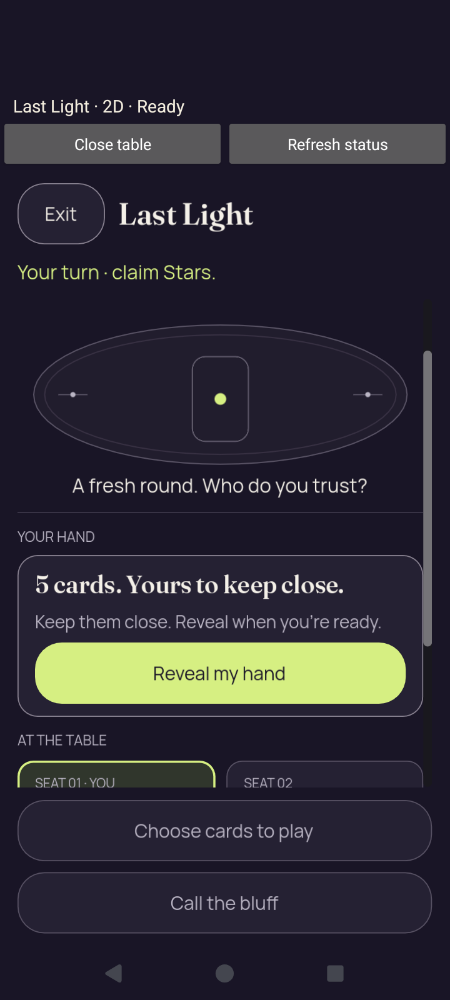</a> | **Same native presentation resumes concealed — 1× text** Android API 35 emulator, actual native 2D comparison host, debug APK Original: [07-resumed-concealed.png](2d-font-1.0-debug/2d/match/07-resumed-concealed.png) 720 × 1600 px; text 1× SHA-256: <code>6d63d5540bbfb34ac5cd37f6b2c3773aa2a8805aa94584c4a0535623b5aa9036</code> [Original UI dump](2d-font-1.0-debug/2d/match/07-resumed-concealed.xml) [Original measurements](2d-font-1.0-debug/2d/match/07-resumed-concealed.json) Paired diagnostics record zero private faces, private labels and selection. The same engine PID and presentation identity are retained. Reveal has its complete label and border in this resumed frame. |
|  | **Round-1 result after Moxie catches Ari’s Star bluff — 1× text** Android API 35 emulator, actual native 2D comparison host, debug APK Original: [08-after-play.png](2d-font-1.0-debug/2d/match/08-after-play.png) 720 × 1600 px; text 1× SHA-256: <code>a6c656b104f4c6fab8277a540aff606c3e28fdb7efb7007c49b22dd8e2b3b706</code> [Original UI dump](2d-font-1.0-debug/2d/match/08-after-play.xml) [Original measurements](2d-font-1.0-debug/2d/match/08-after-play.json) Moxie challenges Ari’s Star claim; the public Moon catches the bluff. Ari uses light 1 and stays in. Repeated stage pixels remain separate source records. |
|  | **Separate original of the public round-1 outcome — 1× text** Android API 35 emulator, actual native 2D comparison host, debug APK Original: [09-public-outcome.png](2d-font-1.0-debug/2d/match/09-public-outcome.png) 720 × 1600 px; text 1× SHA-256: <code>a6c656b104f4c6fab8277a540aff606c3e28fdb7efb7007c49b22dd8e2b3b706</code> [Original UI dump](2d-font-1.0-debug/2d/match/09-public-outcome.xml) [Original measurements](2d-font-1.0-debug/2d/match/09-public-outcome.json) Moxie challenges Ari’s Star claim; the public Moon catches the bluff. Ari uses light 1 and stays in. Repeated stage pixels remain separate source records. |
|  | **Round-2 result after the accepted first advance — 1× text** Android API 35 emulator, actual native 2D comparison host, debug APK Original: [10-next-round.png](2d-font-1.0-debug/2d/match/10-next-round.png) 720 × 1600 px; text 1× SHA-256: <code>03a7db1235529cd56a39d5acc3bb8fcb246d67caa6e2ed026b750b958a9cb17d</code> [Original UI dump](2d-font-1.0-debug/2d/match/10-next-round.xml) [Original measurements](2d-font-1.0-debug/2d/match/10-next-round.json) After the accepted advance, autonomous turns have already settled round 2: Pip catches Moxie’s Crown claim with Moon; Moxie uses light 1 and stays in. |
|  | **Round-4 result after Ari challenges Orbit — 1× text** Android API 35 emulator, actual native 2D comparison host, debug APK Original: [11-after-challenge.png](2d-font-1.0-debug/2d/match/11-after-challenge.png) 720 × 1600 px; text 1× SHA-256: <code>37a96b415688cbdb8d9c1028fa9bb96cd386e51ecb584dd9d5f7eb0147e374e9</code> [Original UI dump](2d-font-1.0-debug/2d/match/11-after-challenge.xml) [Original measurements](2d-font-1.0-debug/2d/match/11-after-challenge.json) Authority round 4/revision 11: Ari catches Orbit’s Crown claim with Moon. Orbit uses light 1 and stays in. |
|  | **Round-14 winner: Orbit wins after Moxie burns out — 1× text** Android API 35 emulator, actual native 2D comparison host, debug APK Original: [12-winner.png](2d-font-1.0-debug/2d/match/12-winner.png) 720 × 1600 px; text 1× SHA-256: <code>e74cbb701eb5150fdbb59b4f6bfca6434ada79fcb0c912432413159180faa867</code> [Original UI dump](2d-font-1.0-debug/2d/match/12-winner.xml) [Original measurements](2d-font-1.0-debug/2d/match/12-winner.json) Authority round 14/revision 41: Orbit catches Moxie’s Crown claim with Moon; Moxie uses light 4 and burns out. The complete Return to lobby action is visible and is subsequently accepted. |
|  | **Chooser restored after match — 1× text** Android API 35 emulator, actual native 2D comparison host, debug APK Original: [14-chooser-after-exit.png](2d-font-1.0-debug/2d/match/14-chooser-after-exit.png) 720 × 1600 px; text 1× SHA-256: <code>243a2b9d3883ffb77eabe7bbbfe11a381a075f5a1a7c1a5e2307929003879f45</code> [Original receipt](2d-font-1.0-debug/2d/match/teardown.json) [Original UI dump](2d-font-1.0-debug/2d/match/14-chooser-after-exit.xml) Both presentation launch buttons are enabled and Ready to compare is visible. The original teardown receipt records native destruction, absent old/engine processes and the surviving chooser; all three entry records remain distinct even when pixels match. |
|  | **Fresh 2D presentation before native-exit — 1× text** Android API 35 emulator, actual native 2D comparison host, debug APK Original: [01-fresh-concealed.png](2d-font-1.0-debug/2d/native-exit/01-fresh-concealed.png) 720 × 1600 px; text 1× SHA-256: <code>52d8b06c0cb7a51e4b0dc0e87f31ed75bd4922491925ac792b6dcf57b218db3b</code> [Original UI dump](2d-font-1.0-debug/2d/native-exit/01-fresh-concealed.xml) [Original measurements](2d-font-1.0-debug/2d/native-exit/01-fresh-concealed.json) This is a new engine process and presentation after the preceding process was destroyed. It starts at round 1 with five concealed cards; its corresponding close and chooser restoration pass. Reveal has a readable label but its lower border is clipped by four logical units/seven pixels. Rect [32,512,339,56] ends at 568; clip [16,118,379,446] ends at 564. Later scrolling/tapping succeeds. |
|  | **Chooser restored after native-exit — 1× text** Android API 35 emulator, actual native 2D comparison host, debug APK Original: [14-chooser-after-exit.png](2d-font-1.0-debug/2d/native-exit/14-chooser-after-exit.png) 720 × 1600 px; text 1× SHA-256: <code>243a2b9d3883ffb77eabe7bbbfe11a381a075f5a1a7c1a5e2307929003879f45</code> [Original receipt](2d-font-1.0-debug/2d/native-exit/teardown.json) [Original UI dump](2d-font-1.0-debug/2d/native-exit/14-chooser-after-exit.xml) Both presentation launch buttons are enabled and Ready to compare is visible. The original teardown receipt records native destruction, absent old/engine processes and the surviving chooser; all three entry records remain distinct even when pixels match. |
|  | **Fresh 2D presentation before scene-exit — 1× text** Android API 35 emulator, actual native 2D comparison host, debug APK Original: [01-fresh-concealed.png](2d-font-1.0-debug/2d/scene-exit/01-fresh-concealed.png) 720 × 1600 px; text 1× SHA-256: <code>52d8b06c0cb7a51e4b0dc0e87f31ed75bd4922491925ac792b6dcf57b218db3b</code> [Original UI dump](2d-font-1.0-debug/2d/scene-exit/01-fresh-concealed.xml) [Original measurements](2d-font-1.0-debug/2d/scene-exit/01-fresh-concealed.json) This is a new engine process and presentation after the preceding process was destroyed. It starts at round 1 with five concealed cards; its corresponding close and chooser restoration pass. Reveal has a readable label but its lower border is clipped by four logical units/seven pixels. Rect [32,512,339,56] ends at 568; clip [16,118,379,446] ends at 564. Later scrolling/tapping succeeds. |
|  | **Chooser restored after scene-exit — 1× text** Android API 35 emulator, actual native 2D comparison host, debug APK Original: [14-chooser-after-exit.png](2d-font-1.0-debug/2d/scene-exit/14-chooser-after-exit.png) 720 × 1600 px; text 1× SHA-256: <code>243a2b9d3883ffb77eabe7bbbfe11a381a075f5a1a7c1a5e2307929003879f45</code> [Original receipt](2d-font-1.0-debug/2d/scene-exit/teardown.json) [Original UI dump](2d-font-1.0-debug/2d/scene-exit/14-chooser-after-exit.xml) Both presentation launch buttons are enabled and Ready to compare is visible. The original teardown receipt records native destruction, absent old/engine processes and the surviving chooser; all three entry records remain distinct even when pixels match. |
|  | **Native chooser before 2D launch — 1× text** Android API 35 emulator, actual native 2D comparison host, debug APK Original: [chooser.png](2d-font-1.0-debug/chooser.png) 720 × 1600 px; text 1× SHA-256: <code>243a2b9d3883ffb77eabe7bbbfe11a381a075f5a1a7c1a5e2307929003879f45</code> [Original UI dump](2d-font-1.0-debug/chooser.xml) Both launch options are visible. Reduced motion and the seed-2 reference match are enabled; sound is disabled. |
|  | **Final chooser after all three 2D entries and teardown paths — 1× text** Android API 35 emulator, actual native 2D comparison host, debug APK Original: [final-screen.png](2d-font-1.0-debug/final-screen.png) 720 × 1600 px; text 1× SHA-256: <code>243a2b9d3883ffb77eabe7bbbfe11a381a075f5a1a7c1a5e2307929003879f45</code> [Original UI dump](2d-font-1.0-debug/last-ui.xml) The full reference match, fresh renderer Exit and fresh native Close all complete in three separate engine processes. The chooser remains available; this final capture is after native Close. |

## 2d-font-2.0-debug

| Original image | Scenario and provenance |
| --- | --- |
| <a href="2d-font-2.0-debug/2d/match/01-concealed.png">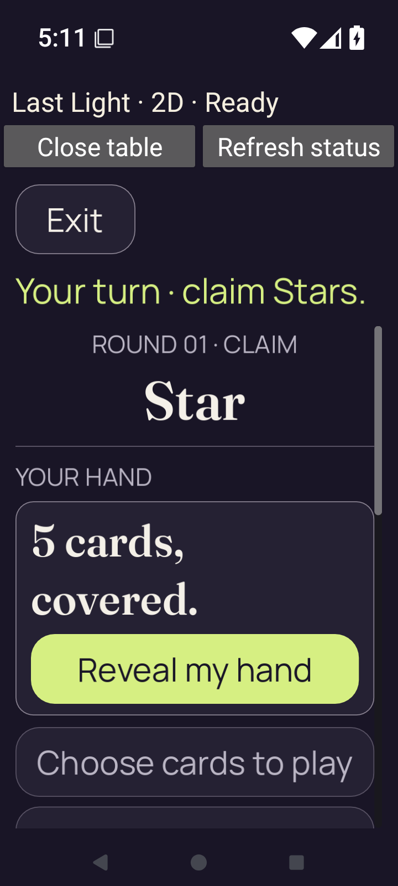</a> | **Native 2D reference match begins concealed — 2× text** Android API 35 emulator, actual native 2D comparison host, debug APK Original: [01-concealed.png](2d-font-2.0-debug/2d/match/01-concealed.png) 720 × 1600 px; text 2× SHA-256: <code>39609078e8bca7a4b851d8a8b96f331e418822739679f56fa39d50dd4bf67a4a</code> [Original UI dump](2d-font-2.0-debug/2d/match/01-concealed.xml) [Original measurements](2d-font-2.0-debug/2d/match/01-concealed.json) The complete initial Reveal action fits at 200%; the later action content continues below the scroll viewport. |
| <a href="2d-font-2.0-debug/2d/match/02-revealed.png">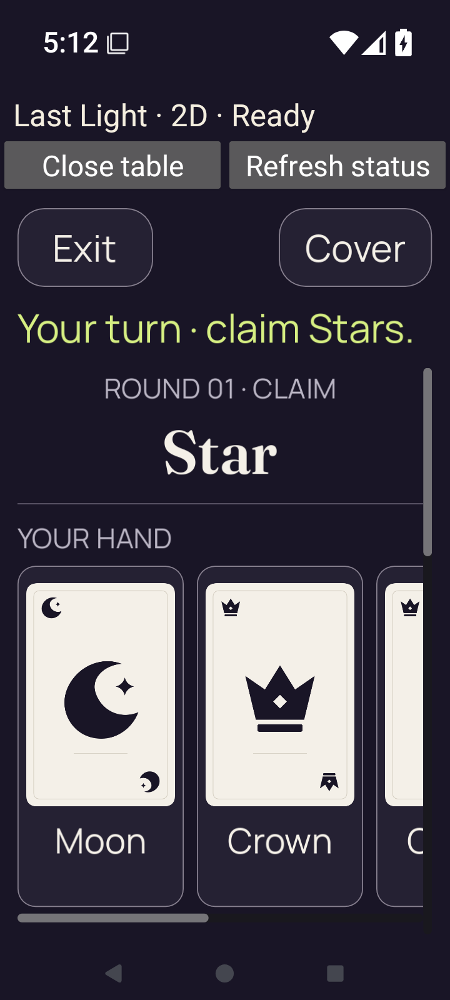</a> | **Native 2D hand revealed through actual touch — 2× text** Android API 35 emulator, actual native 2D comparison host, debug APK Original: [02-revealed.png](2d-font-2.0-debug/2d/match/02-revealed.png) 720 × 1600 px; text 2× SHA-256: <code>c9d1293568fb845fcd0cc15e9f97fbfa3322ce200d1db0afe917b314beadb99d</code> [Original UI dump](2d-font-2.0-debug/2d/match/02-revealed.xml) [Original measurements](2d-font-2.0-debug/2d/match/02-revealed.json) |
| <a href="2d-font-2.0-debug/2d/match/03-selected.png">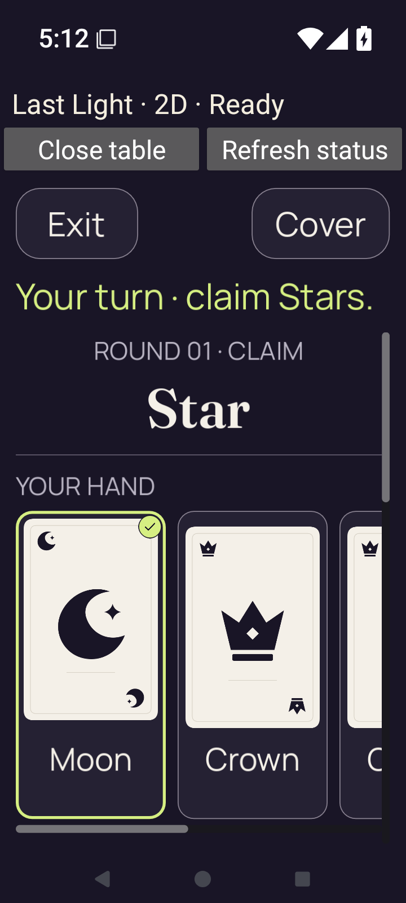</a> | **Native 2D Moon selected for a one-Star claim — 2× text** Android API 35 emulator, actual native 2D comparison host, debug APK Original: [03-selected.png](2d-font-2.0-debug/2d/match/03-selected.png) 720 × 1600 px; text 2× SHA-256: <code>e0e25038e0ac2175ec84ad2bb22a2e20215e955a30558acc8cf4ad98b6f71bbb</code> [Original UI dump](2d-font-2.0-debug/2d/match/03-selected.xml) [Original measurements](2d-font-2.0-debug/2d/match/03-selected.json) |
|  | **Native 2D hand covered and selection cleared — 2× text** Android API 35 emulator, actual native 2D comparison host, debug APK Original: [04-covered.png](2d-font-2.0-debug/2d/match/04-covered.png) 720 × 1600 px; text 2× SHA-256: <code>8412cab81d47334d4c09d0cc8c0a1ecfcfce84658f6e211fe1eeb1aca3c8e9fe</code> [Original UI dump](2d-font-2.0-debug/2d/match/04-covered.xml) [Original measurements](2d-font-2.0-debug/2d/match/04-covered.json) Paired diagnostics record zero private faces, private labels and selection. |
| <a href="2d-font-2.0-debug/2d/match/05-background-home.png">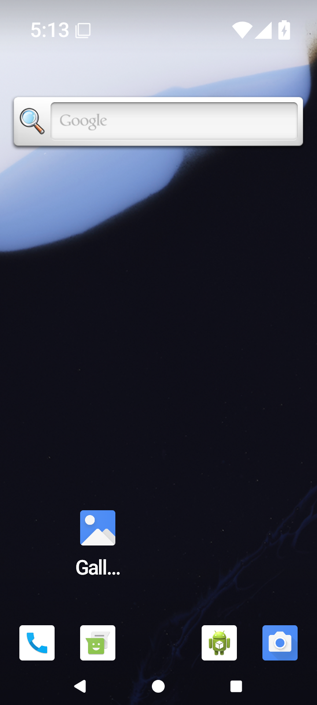</a> | **Android Home during the revealed match lifecycle — 2× text** Android API 35 emulator, actual native 2D comparison host, debug APK Original: [05-background-home.png](2d-font-2.0-debug/2d/match/05-background-home.png) 720 × 1600 px; text 2× SHA-256: <code>ef28d671179af24ad743fc03f03663f5685258afb6803a37c0533fcefb78871f</code> [Original UI dump](2d-font-2.0-debug/2d/match/05-background-home.xml) This Home original belongs to the exercised reveal/select/background sequence; it is lifecycle evidence, distinct from pre-install preparation images. |
|  | **Android Recents with opaque task preview — 2× text** Android API 35 emulator, actual native 2D comparison host, debug APK Original: [06-recents-privacy.png](2d-font-2.0-debug/2d/match/06-recents-privacy.png) 720 × 1600 px; text 2× SHA-256: <code>55734181476c9fcf88ca732987c401d7b2d3417f2d6eeaf48bc5020020d018e4</code> [Original UI dump](2d-font-2.0-debug/2d/match/06-recents-privacy.xml) The original task preview is opaque gray, without private card faces, labels or selected state. The retained host policy is recents_disabled. |
|  | **Same native presentation resumes concealed — 2× text** Android API 35 emulator, actual native 2D comparison host, debug APK Original: [07-resumed-concealed.png](2d-font-2.0-debug/2d/match/07-resumed-concealed.png) 720 × 1600 px; text 2× SHA-256: <code>4747d8cadf9031e17f74cc7db5c7ce051c5fe0bbc3706f8a1954f38c8a025c0f</code> [Original UI dump](2d-font-2.0-debug/2d/match/07-resumed-concealed.xml) [Original measurements](2d-font-2.0-debug/2d/match/07-resumed-concealed.json) Paired diagnostics record zero private faces, private labels and selection. The same engine PID and presentation identity are retained. Reveal has its complete label and border in this resumed frame. |
| <a href="2d-font-2.0-debug/2d/match/08-after-play.png">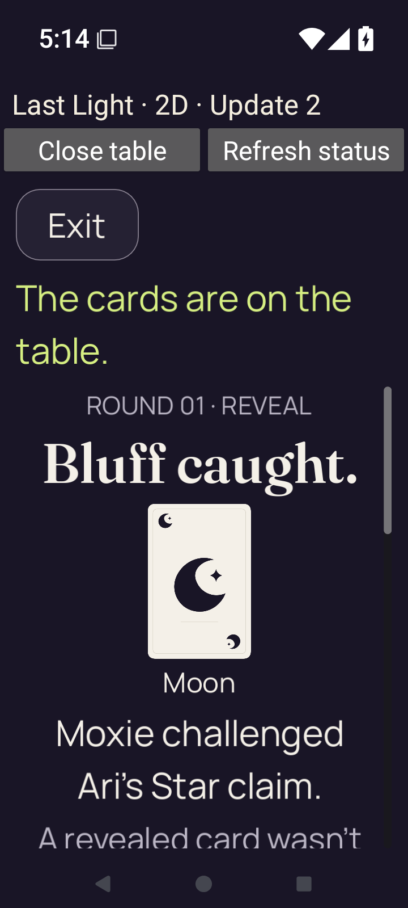</a> | **Round-1 result after Moxie catches Ari’s Star bluff — 2× text** Android API 35 emulator, actual native 2D comparison host, debug APK Original: [08-after-play.png](2d-font-2.0-debug/2d/match/08-after-play.png) 720 × 1600 px; text 2× SHA-256: <code>fd3e56d74518598a4106cbd880bb0a09d46f4478960ae7b3a4be8443238655af</code> [Original UI dump](2d-font-2.0-debug/2d/match/08-after-play.xml) [Original measurements](2d-font-2.0-debug/2d/match/08-after-play.json) Moxie challenges Ari’s Star claim; the public Moon catches the bluff. Ari uses light 1 and stays in. Repeated stage pixels remain separate source records. The rest of the enlarged explanation and the next/return action lie below this captured viewport. Later recorded scrolling exposes the complete action and the authority accepts the tap. |
|  | **Separate original of the public round-1 outcome — 2× text** Android API 35 emulator, actual native 2D comparison host, debug APK Original: [09-public-outcome.png](2d-font-2.0-debug/2d/match/09-public-outcome.png) 720 × 1600 px; text 2× SHA-256: <code>fd3e56d74518598a4106cbd880bb0a09d46f4478960ae7b3a4be8443238655af</code> [Original UI dump](2d-font-2.0-debug/2d/match/09-public-outcome.xml) [Original measurements](2d-font-2.0-debug/2d/match/09-public-outcome.json) Moxie challenges Ari’s Star claim; the public Moon catches the bluff. Ari uses light 1 and stays in. Repeated stage pixels remain separate source records. The rest of the enlarged explanation and the next/return action lie below this captured viewport. Later recorded scrolling exposes the complete action and the authority accepts the tap. |
| <a href="2d-font-2.0-debug/2d/match/10-next-round.png">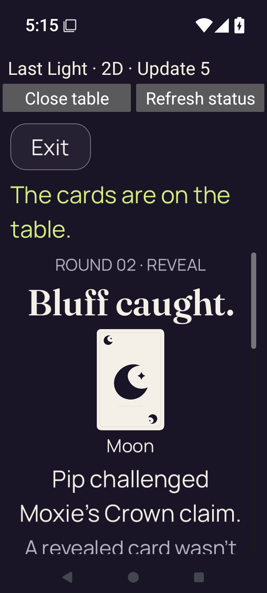</a> | **Round-2 result after the accepted first advance — 2× text** Android API 35 emulator, actual native 2D comparison host, debug APK Original: [10-next-round.png](2d-font-2.0-debug/2d/match/10-next-round.png) 720 × 1600 px; text 2× SHA-256: <code>e7c559b4836feeb443fdfec4c38603e6e35dddea2370ed89751cda9a24df3ab4</code> [Original UI dump](2d-font-2.0-debug/2d/match/10-next-round.xml) [Original measurements](2d-font-2.0-debug/2d/match/10-next-round.json) After the accepted advance, autonomous turns have already settled round 2: Pip catches Moxie’s Crown claim with Moon; Moxie uses light 1 and stays in. The rest of the enlarged explanation and the next/return action lie below this captured viewport. Later recorded scrolling exposes the complete action and the authority accepts the tap. |
| <a href="2d-font-2.0-debug/2d/match/11-after-challenge.png">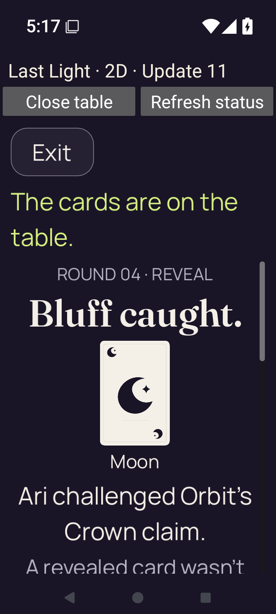</a> | **Round-4 result after Ari challenges Orbit — 2× text** Android API 35 emulator, actual native 2D comparison host, debug APK Original: [11-after-challenge.png](2d-font-2.0-debug/2d/match/11-after-challenge.png) 720 × 1600 px; text 2× SHA-256: <code>b48cab5bb549c3e61e6e818005d868bb6972f36aaa23f772e03b3adc5f3d1ad1</code> [Original UI dump](2d-font-2.0-debug/2d/match/11-after-challenge.xml) [Original measurements](2d-font-2.0-debug/2d/match/11-after-challenge.json) Authority round 4/revision 11: Ari catches Orbit’s Crown claim with Moon. Orbit uses light 1 and stays in. The rest of the enlarged explanation and the next/return action lie below this captured viewport. Later recorded scrolling exposes the complete action and the authority accepts the tap. |
| <a href="2d-font-2.0-debug/2d/match/12-winner.png">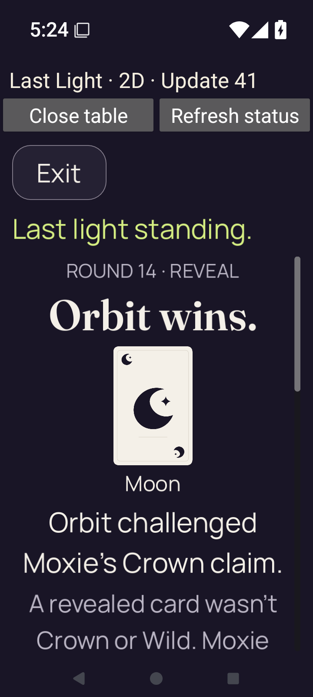</a> | **Round-14 winner: Orbit wins after Moxie burns out — 2× text** Android API 35 emulator, actual native 2D comparison host, debug APK Original: [12-winner.png](2d-font-2.0-debug/2d/match/12-winner.png) 720 × 1600 px; text 2× SHA-256: <code>17422e945e993ddfd46e26243bc42ebf77b4b07ba11a530b64fc2a9413cecb72</code> [Original UI dump](2d-font-2.0-debug/2d/match/12-winner.xml) [Original measurements](2d-font-2.0-debug/2d/match/12-winner.json) Authority round 14/revision 41: Orbit catches Moxie’s Crown claim with Moon; Moxie uses light 4 and burns out. The rest of the enlarged explanation and the next/return action lie below this captured viewport. Later recorded scrolling exposes the complete action and the authority accepts the tap. |
|  | **Chooser restored after match — 2× text** Android API 35 emulator, actual native 2D comparison host, debug APK Original: [14-chooser-after-exit.png](2d-font-2.0-debug/2d/match/14-chooser-after-exit.png) 720 × 1600 px; text 2× SHA-256: <code>98468bc6dfef3e57146654fc99dd42c89040148423769e60819e219eb79f8511</code> [Original receipt](2d-font-2.0-debug/2d/match/teardown.json) [Original UI dump](2d-font-2.0-debug/2d/match/14-chooser-after-exit.xml) Both presentation launch buttons are enabled and Ready to compare is visible. The original teardown receipt records native destruction, absent old/engine processes and the surviving chooser; all three entry records remain distinct even when pixels match. |
|  | **Fresh 2D presentation before native-exit — 2× text** Android API 35 emulator, actual native 2D comparison host, debug APK Original: [01-fresh-concealed.png](2d-font-2.0-debug/2d/native-exit/01-fresh-concealed.png) 720 × 1600 px; text 2× SHA-256: <code>43408bdcbaa5648094a211e0177b0f60927c6b3320208a4f86b26e40757d171b</code> [Original UI dump](2d-font-2.0-debug/2d/native-exit/01-fresh-concealed.xml) [Original measurements](2d-font-2.0-debug/2d/native-exit/01-fresh-concealed.json) This is a new engine process and presentation after the preceding process was destroyed. It starts at round 1 with five concealed cards; its corresponding close and chooser restoration pass. The complete initial Reveal action fits at 200%; the later action content continues below the scroll viewport. |
|  | **Chooser restored after native-exit — 2× text** Android API 35 emulator, actual native 2D comparison host, debug APK Original: [14-chooser-after-exit.png](2d-font-2.0-debug/2d/native-exit/14-chooser-after-exit.png) 720 × 1600 px; text 2× SHA-256: <code>74d2a1969f9701fe036bc07a768c42cc57debffdee75e366a25669f436f89ee3</code> [Original receipt](2d-font-2.0-debug/2d/native-exit/teardown.json) [Original UI dump](2d-font-2.0-debug/2d/native-exit/14-chooser-after-exit.xml) Both presentation launch buttons are enabled and Ready to compare is visible. The original teardown receipt records native destruction, absent old/engine processes and the surviving chooser; all three entry records remain distinct even when pixels match. |
| <a href="2d-font-2.0-debug/2d/scene-exit/01-fresh-concealed.png">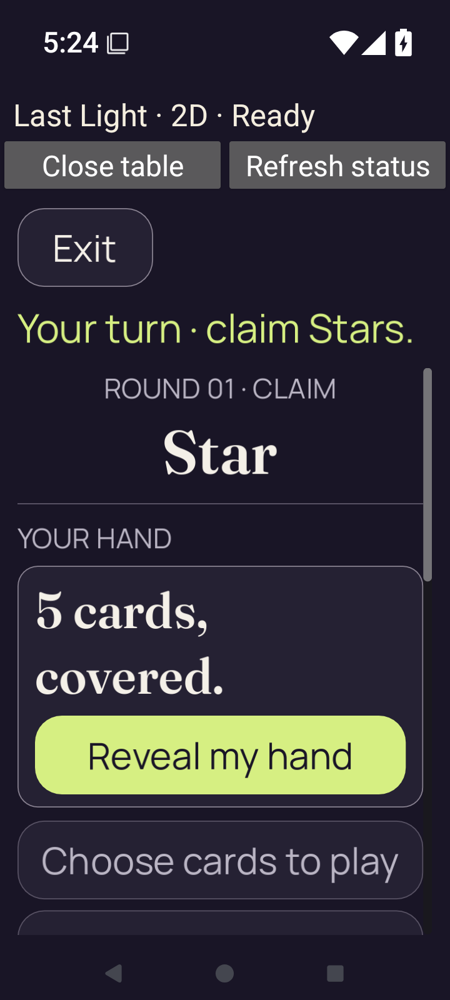</a> | **Fresh 2D presentation before scene-exit — 2× text** Android API 35 emulator, actual native 2D comparison host, debug APK Original: [01-fresh-concealed.png](2d-font-2.0-debug/2d/scene-exit/01-fresh-concealed.png) 720 × 1600 px; text 2× SHA-256: <code>9a58f238bf03c17de0645a5baf6d79847db27a22bdc44488598148312131b272</code> [Original UI dump](2d-font-2.0-debug/2d/scene-exit/01-fresh-concealed.xml) [Original measurements](2d-font-2.0-debug/2d/scene-exit/01-fresh-concealed.json) This is a new engine process and presentation after the preceding process was destroyed. It starts at round 1 with five concealed cards; its corresponding close and chooser restoration pass. The complete initial Reveal action fits at 200%; the later action content continues below the scroll viewport. |
|  | **Chooser restored after scene-exit — 2× text** Android API 35 emulator, actual native 2D comparison host, debug APK Original: [14-chooser-after-exit.png](2d-font-2.0-debug/2d/scene-exit/14-chooser-after-exit.png) 720 × 1600 px; text 2× SHA-256: <code>f02ed3957d76b596e042b77ca35627c390d0861b96adc3f721180b3aca5cb14b</code> [Original receipt](2d-font-2.0-debug/2d/scene-exit/teardown.json) [Original UI dump](2d-font-2.0-debug/2d/scene-exit/14-chooser-after-exit.xml) Both presentation launch buttons are enabled and Ready to compare is visible. The original teardown receipt records native destruction, absent old/engine processes and the surviving chooser; all three entry records remain distinct even when pixels match. |
|  | **Native chooser before 2D launch — 2× text** Android API 35 emulator, actual native 2D comparison host, debug APK Original: [chooser.png](2d-font-2.0-debug/chooser.png) 720 × 1600 px; text 2× SHA-256: <code>6fe6e548d899d58dadabbfbf397691941dd32377f3116e804abafd2784c47b74</code> [Original UI dump](2d-font-2.0-debug/chooser.xml) Both launch options are visible. Reduced motion and the seed-2 reference match are enabled; sound is disabled. Open source notices is below the initial viewport at 200% text. |
| <a href="2d-font-2.0-debug/final-screen.png">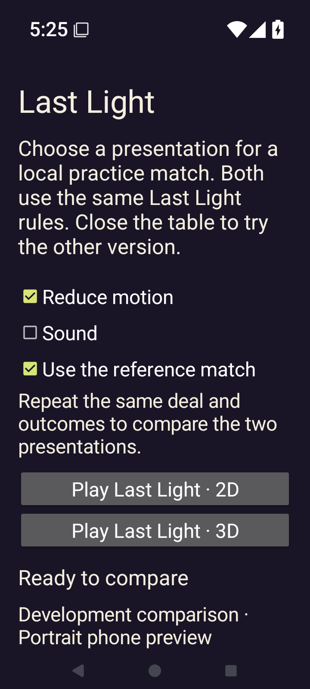</a> | **Final chooser after all three 2D entries and teardown paths — 2× text** Android API 35 emulator, actual native 2D comparison host, debug APK Original: [final-screen.png](2d-font-2.0-debug/final-screen.png) 720 × 1600 px; text 2× SHA-256: <code>74d2a1969f9701fe036bc07a768c42cc57debffdee75e366a25669f436f89ee3</code> [Original UI dump](2d-font-2.0-debug/last-ui.xml) The full reference match, fresh renderer Exit and fresh native Close all complete in three separate engine processes. The chooser remains available; this final capture is after native Close. |

## 3d-font-1.0-debug

| Original image | Scenario and provenance |
| --- | --- |
|  | **Native chooser before 3D launch — 1× text** Android API 35 emulator, actual native 3D comparison host, debug APK Original: [chooser.png](3d-font-1.0-debug/chooser.png) 720 × 1600 px; text 1× SHA-256: <code>243a2b9d3883ffb77eabe7bbbfe11a381a075f5a1a7c1a5e2307929003879f45</code> [Original UI dump](3d-font-1.0-debug/chooser.xml) Both launch options are visible. Reduced motion and the seed-2 reference match are enabled; sound is disabled. |
|  | **3D Ready scene after initial diagnostics time out — 100% text** Android API 35 emulator, actual native 3D comparison host, debug APK Original: [final-screen.png](3d-font-1.0-debug/final-screen.png) 720 × 1600 px; text 1× SHA-256: <code>65057e0353a02e5e2bd19b44f3bcd0ff2d42c9e76b00c4e065ef9a8a403627d3</code> [Original UI dump](3d-font-1.0-debug/last-ui.xml) The Star table, five concealed cards and complete Show hand action render. Ready and a foreground frame are recorded, but diagnostic request 2 times out; response 1 retains unlaid-out initial rectangles. No gameplay intent is executed. |

## 3d-font-2.0-debug

| Original image | Scenario and provenance |
| --- | --- |
| <a href="3d-font-2.0-debug/3d/match/01-concealed.png">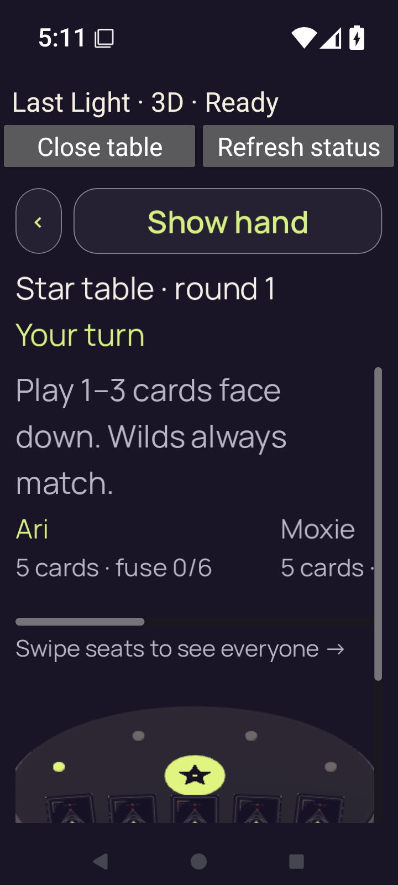</a> | **Native 3D reference match begins concealed — 2× text** Android API 35 emulator, actual native 3D comparison host, debug APK Original: [01-concealed.png](3d-font-2.0-debug/3d/match/01-concealed.png) 720 × 1600 px; text 2× SHA-256: <code>41097049225ebc04f2a6376f47f1530dbf6993ffcea2d22a5255e94a4fec30cb</code> [Original UI dump](3d-font-2.0-debug/3d/match/01-concealed.xml) [Original measurements](3d-font-2.0-debug/3d/match/01-concealed.json) |
| <a href="3d-font-2.0-debug/3d/match/02-revealed.png">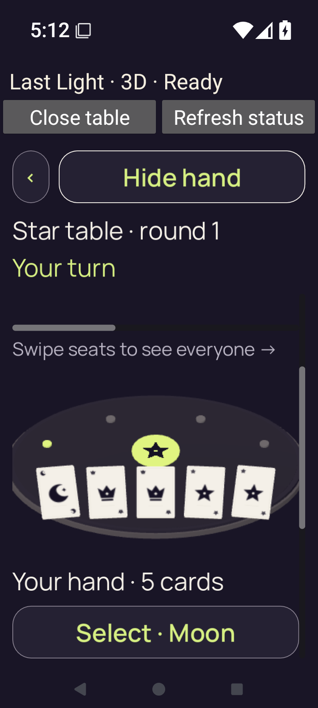</a> | **Native 3D hand revealed through actual touch — 2× text** Android API 35 emulator, actual native 3D comparison host, debug APK Original: [02-revealed.png](3d-font-2.0-debug/3d/match/02-revealed.png) 720 × 1600 px; text 2× SHA-256: <code>98cac9506d90f7fb0a98fa196c2fc90b245a5bd9c56aa24c7c05e3c49e0a008f</code> [Original UI dump](3d-font-2.0-debug/3d/match/02-revealed.xml) [Original measurements](3d-font-2.0-debug/3d/match/02-revealed.json) |
| <a href="3d-font-2.0-debug/3d/match/03-selected.png">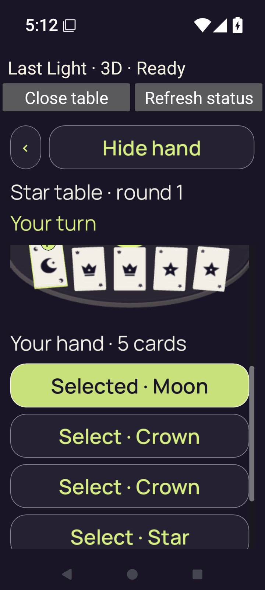</a> | **Native 3D Moon selected for a one-Star claim — 2× text** Android API 35 emulator, actual native 3D comparison host, debug APK Original: [03-selected.png](3d-font-2.0-debug/3d/match/03-selected.png) 720 × 1600 px; text 2× SHA-256: <code>75e76a954b3e13703bd01f4bdbedb2b4ce63e9e9ce3409e8c19990814c47c712</code> [Original UI dump](3d-font-2.0-debug/3d/match/03-selected.xml) [Original measurements](3d-font-2.0-debug/3d/match/03-selected.json) |
| <a href="3d-font-2.0-debug/3d/match/04-covered.png">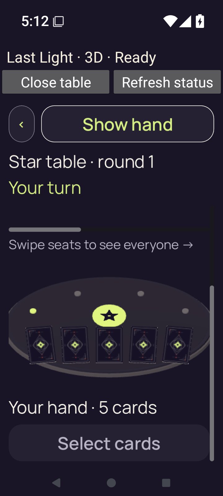</a> | **Native 3D hand covered and selection cleared — 2× text** Android API 35 emulator, actual native 3D comparison host, debug APK Original: [04-covered.png](3d-font-2.0-debug/3d/match/04-covered.png) 720 × 1600 px; text 2× SHA-256: <code>c03eea8b0b2eb2ea915de7978eebd229b7afe5dc826dd21537ed5c2bcf32afec</code> [Original UI dump](3d-font-2.0-debug/3d/match/04-covered.xml) [Original measurements](3d-font-2.0-debug/3d/match/04-covered.json) Paired diagnostics record zero private faces, private labels and selection. |
|  | **Android Home during the revealed match lifecycle — 2× text** Android API 35 emulator, actual native 3D comparison host, debug APK Original: [05-background-home.png](3d-font-2.0-debug/3d/match/05-background-home.png) 720 × 1600 px; text 2× SHA-256: <code>ef28d671179af24ad743fc03f03663f5685258afb6803a37c0533fcefb78871f</code> [Original UI dump](3d-font-2.0-debug/3d/match/05-background-home.xml) This Home original belongs to the exercised reveal/select/background sequence; it is lifecycle evidence, distinct from pre-install preparation images. |
| <a href="3d-font-2.0-debug/3d/match/06-recents-privacy.png">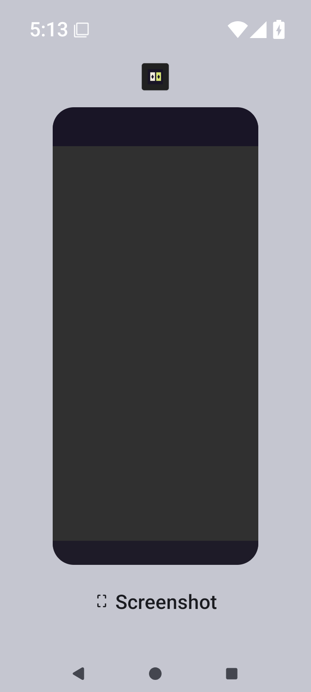</a> | **Android Recents with opaque task preview — 2× text** Android API 35 emulator, actual native 3D comparison host, debug APK Original: [06-recents-privacy.png](3d-font-2.0-debug/3d/match/06-recents-privacy.png) 720 × 1600 px; text 2× SHA-256: <code>55734181476c9fcf88ca732987c401d7b2d3417f2d6eeaf48bc5020020d018e4</code> [Original UI dump](3d-font-2.0-debug/3d/match/06-recents-privacy.xml) The original task preview is opaque gray, without private card faces, labels or selected state. The retained host policy is recents_disabled. The following resume attempt crashes. This preview does not establish a successful 3D resume or completed lifecycle script. |
|  | **Native chooser before 3D launch — 2× text** Android API 35 emulator, actual native 3D comparison host, debug APK Original: [chooser.png](3d-font-2.0-debug/chooser.png) 720 × 1600 px; text 2× SHA-256: <code>6fe6e548d899d58dadabbfbf397691941dd32377f3116e804abafd2784c47b74</code> [Original UI dump](3d-font-2.0-debug/chooser.xml) Both launch options are visible. Reduced motion and the seed-2 reference match are enabled; sound is disabled. Open source notices is below the initial viewport at 200% text. |
| <a href="3d-font-2.0-debug/final-screen.png">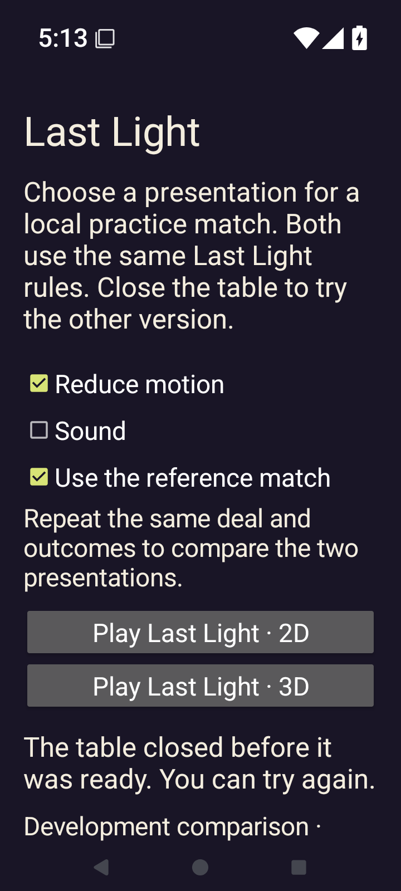</a> | **Chooser after the actual 3D resume crash — 200% text** Android API 35 emulator, actual native 3D comparison host, debug APK Original: [final-screen.png](3d-font-2.0-debug/final-screen.png) 720 × 1600 px; text 2× SHA-256: <code>25f36c1aeca763eaae03c35442c0938d56af65d4a4fd7b8755aeacf7a3439869</code> [Original UI dump](3d-font-2.0-debug/last-ui.xml) The chooser says the table closed before it was ready, although the earlier run did reach Ready. The existing Godot process crashes with SIGSEGV during resume after Home/Recents. No completed resume, play or teardown sequence is established. |
