# Godot Android — four completed matches, two final Back failures

[All screenshot collections](../README.md) · [CI run 34446327045](https://github.com/Apdelrahman1911/PartyDeck/actions/runs/34446327045) · [Companion desktop originals](../godot-desktop-34446327045/README.md)

**Evidence status:** All four native reference matches finish, and all four Home/Recents/same-process concealed resumes, match returns and fresh scene Exits complete. Both complete 2D scripts pass. Both 3D scripts fail at their final **native Back** route. This collection preserves **74 runtime originals**; the frozen 78-image native inventory also includes four pre-install Launcher PNGs excluded under the gallery's established preparation-image policy.

| Case | Original runtime PNGs | Complete case result | Completed requested exit routes |
| --- | ---: | --- | ---: |
| 2D / 100% | 19 | Pass: full match, match return, fresh scene Exit and fresh native Close | 3 / 3 |
| 2D / 200% | 19 | Pass: the same full script at enlarged text | 3 / 3 |
| 3D / 100% | 18 | Fail at `3d native_back native teardown`: observed `renderer_exit` | 2 / 3 |
| 3D / 200% | 18 | Fail at the same final Back route | 2 / 3 |

Exact CI revision `b7f2f4f2c2d03b8e599d4b0fc73bf2d35f6640eb`. API 35 x86_64 debug emulator, 720 × 1600 pixels, 280 dpi / density 1.75, reduced motion enabled, sound disabled and seed 2. APK SHA-256: `8f6cbccbb1313ff2f0d17da5879275ebfc0f25b5d8592ce884d02bc3f91d9a76`. PCK SHA-256: `0ed324c19016f28987d6294f915c107f62234670b149f73bab585af93e29ae6d`. Installed-package receipts, embedded pack bytes, immutable Git source and original image hashes were independently checked. Package binaries stay outside the gallery; their identities remain in the original receipts and [frozen audit](provenance/audit-frozen.json).

All four matches reach **round 14 / revision 41** with Orbit's win, two viewer plays, two challenges and thirteen advances. Original host-observation transitions independently agree with those counts; each later `return_to_lobby` adds the eighteenth accepted intent. Normal result/winner frames show the public Moon and named challenge/burnout explanation with complete next/return controls. At 200%, some actions and explanation content lie below the capture viewport; subsequent recorded geometry, scrolling and accepted input establish reachability.

The twelve entries have separate fresh engine PIDs and presentation IDs within each case. Ten requested exit routes have their dedicated teardown receipts, enabled chooser controls, original destruction logs and actual process-death evidence. **Both final 3D Back routes remain failed:** `Native host did not finish the expected close route.` The host records `closeReason=renderer_exit` and one additional renderer exit event instead of the expected native Back route. Destruction markers, OS `am_proc_died`, empty final failure PID observations and same-chooser resume all occur, but they do not make the requested route pass. Neither failed Back entry has `14-chooser-after-exit.png` or a dedicated successful teardown receipt; its root `final-screen.png` shows the chooser after failure.

No separate raw shell process-list attachment is present. Process absence is supported by the executed checker receipts, [exact checker source](source/godot/android-checks/run.py), OS process-death events, destruction logs and subsequent fresh PIDs. The original logs remain attached: all **twelve** retain the EGL `removeVertexArrayObject` **ERROR**, and **ten** also retain the known shader-cache warning text pair at error priority. No clean-driver-log claim is made.

All four Home/Recents paths execute after reveal and selection. Their Home images and opaque Recents previews contain no private faces or labels. Original host records show native cover and `recents_disabled`; same-process resumes clear private faces, labels and selected bindings. These lifecycle images are app evidence, distinct from the four excluded pre-install preparation screenshots.

Normal 2D initial Reveal still clips on all three fresh entries: rect `[32,512,339,56]` extends four logical units/seven pixels beyond clip `[16,118,379,446]`. Later covered/resumed frames fit after scrolling. The [later source-only Reveal correction](../godot-2d-initial-reveal-20260910/README.md) is **absent from this pack**. At 200%, initial Reveal fits. In 3D/200%, Show/Hide and Star table/round/actor stay pinned while hand and result content scroll; the screenshots do not show every card or action at once. Final choosers are restored at both scales; notices are below the initial 200% viewport.

The independent archive audit verifies **48 scene RGB crop hashes**, paired host JSONs, **156 scene-input geometries** against retained diagnostics, and **354 native input records**. All 74 runtime PNGs were inspected in internal contact sheets; those derived sheets are not gallery images. Across this 150-image batch, 106 new originals were reviewed in sheets and 44 desktop originals were byte-matched to previously reviewed pixels. [Gallery source audit](review/partydeck-gallery-1279-source-audit.json) · [Visual-review record](review/partydeck-gallery-1279-visual-review.json) · [Original inventory](provenance/original-image-inventory.json).

The [producer receipt](provenance/producer-evidence-summary.json) was written while the workflow was active and keeps its original null conclusion. The completed [workflow status](provenance/last-run-status.json) and [later evidence summary](provenance/evidence-summary.json) record **failure**. Both originals remain unchanged. Original runtime JSON/XML/logs, package-input receipts, [pack receipt](provenance/partydeck-last-light.receipt.json), build/check reports, job logs and frozen reviewer evidence are retained. The source/archive review did not execute new builds or tests.

This API 35 debug local-practice comparison does not qualify production KMP factories, optimized native behavior, physical devices, screen-reader traversal, audio dormancy or the full native matrix. Source: `/tmp/partydeck-engine-ci/34446327045`. Each thumbnail opens its unchanged original PNG; every 3D capture keeps its whole-case failure status.

## 2D — 100% text

[Original result](2d-font-1.0-debug/result.json) · [Package inputs](2d-font-1.0-debug/package-inputs.json) · [Native input records](2d-font-1.0-debug/input-geometry.log) · [OS events](2d-font-1.0-debug/events.log)

| Original image | Scenario and provenance |
| --- | --- |
|  | **Native 2D reference match begins concealed — 1× text** Android API 35 emulator, actual native 2D comparison host, debug APK Original: [01-concealed.png](2d-font-1.0-debug/2d/match/01-concealed.png) 720 × 1600 px; text 1× SHA-256: <code>52d8b06c0cb7a51e4b0dc0e87f31ed75bd4922491925ac792b6dcf57b218db3b</code> [Original UI dump](2d-font-1.0-debug/2d/match/01-concealed.xml) [Original measurements](2d-font-1.0-debug/2d/match/01-concealed.json) [Original result](2d-font-1.0-debug/result.json) Initial Reveal still clips by four logical units/seven physical pixels: rect [32,512,339,56] ends at 568, while clip [16,118,379,446] ends at 564. The later source-only height correction is absent from this pack. |
| <a href="2d-font-1.0-debug/2d/match/02-revealed.png">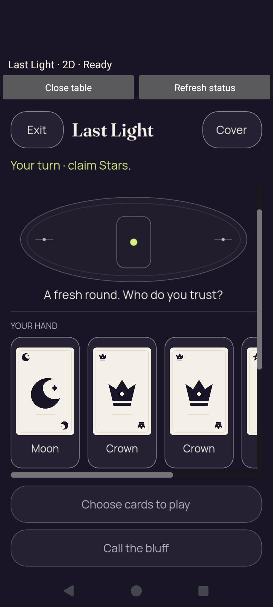</a> | **Native 2D hand revealed through actual touch — 1× text** Android API 35 emulator, actual native 2D comparison host, debug APK Original: [02-revealed.png](2d-font-1.0-debug/2d/match/02-revealed.png) 720 × 1600 px; text 1× SHA-256: <code>d9027000b2ef8bdfa1064ec6571ff92bda8f4611a88a3b34324c1c3470d7efe2</code> [Original UI dump](2d-font-1.0-debug/2d/match/02-revealed.xml) [Original measurements](2d-font-1.0-debug/2d/match/02-revealed.json) [Original result](2d-font-1.0-debug/result.json) |
| <a href="2d-font-1.0-debug/2d/match/03-selected.png">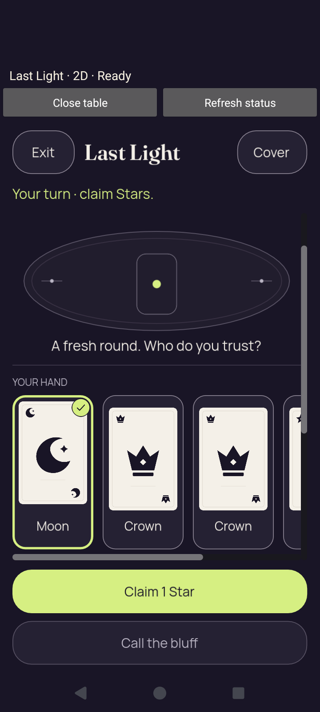</a> | **Native 2D Moon selected for a one-Star claim — 1× text** Android API 35 emulator, actual native 2D comparison host, debug APK Original: [03-selected.png](2d-font-1.0-debug/2d/match/03-selected.png) 720 × 1600 px; text 1× SHA-256: <code>9adaccf3cb43cb39e4d1c85c30f0d8bd61a8694f2a0fd620f7972e2bdbea9b77</code> [Original UI dump](2d-font-1.0-debug/2d/match/03-selected.xml) [Original measurements](2d-font-1.0-debug/2d/match/03-selected.json) [Original result](2d-font-1.0-debug/result.json) |
|  | **Native 2D hand covered and selection cleared — 1× text** Android API 35 emulator, actual native 2D comparison host, debug APK Original: [04-covered.png](2d-font-1.0-debug/2d/match/04-covered.png) 720 × 1600 px; text 1× SHA-256: <code>6d63d5540bbfb34ac5cd37f6b2c3773aa2a8805aa94584c4a0535623b5aa9036</code> [Original UI dump](2d-font-1.0-debug/2d/match/04-covered.xml) [Original measurements](2d-font-1.0-debug/2d/match/04-covered.json) [Original result](2d-font-1.0-debug/result.json) Paired diagnostics record zero private faces, rank labels and selection. |
|  | **Android Home during the revealed match lifecycle — 1× text** Android API 35 emulator, actual native 2D comparison host, debug APK Original: [05-background-home.png](2d-font-1.0-debug/2d/match/05-background-home.png) 720 × 1600 px; text 1× SHA-256: <code>5c310a5cc252feca19c8c8183330d1d154d093ba80e701c9b9696982568eb576</code> [Original UI dump](2d-font-1.0-debug/2d/match/05-background-home.xml) [Original result](2d-font-1.0-debug/result.json) This Home original belongs to the exercised reveal/select/background sequence, after app installation. No private game face or label is visible. |
| <a href="2d-font-1.0-debug/2d/match/06-recents-privacy.png">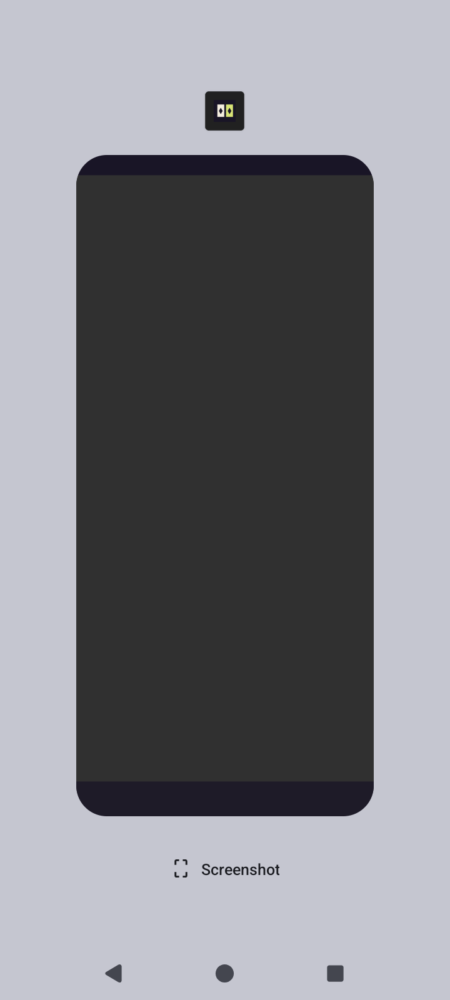</a> | **Android Recents with opaque task preview — 1× text** Android API 35 emulator, actual native 2D comparison host, debug APK Original: [06-recents-privacy.png](2d-font-1.0-debug/2d/match/06-recents-privacy.png) 720 × 1600 px; text 1× SHA-256: <code>fa26e159dc1b7dffe2e8b174b8c4148a69735bd739ee68a02279c6e5138d3d47</code> [Original UI dump](2d-font-1.0-debug/2d/match/06-recents-privacy.xml) [Original result](2d-font-1.0-debug/result.json) The opaque gray task preview contains no private faces, labels or selected state. The retained capture policy is recents_disabled; the following same-process concealed resume completes. |
|  | **Same native presentation resumes concealed — 1× text** Android API 35 emulator, actual native 2D comparison host, debug APK Original: [07-resumed-concealed.png](2d-font-1.0-debug/2d/match/07-resumed-concealed.png) 720 × 1600 px; text 1× SHA-256: <code>6d63d5540bbfb34ac5cd37f6b2c3773aa2a8805aa94584c4a0535623b5aa9036</code> [Original UI dump](2d-font-1.0-debug/2d/match/07-resumed-concealed.xml) [Original measurements](2d-font-1.0-debug/2d/match/07-resumed-concealed.json) [Original result](2d-font-1.0-debug/result.json) Paired diagnostics record zero private faces, rank labels and selection. The same engine PID and presentation resume. The native Home/Recents/resume sequence completes in this match entry. Reveal fits in the resumed, previously scrolled frame; this does not correct the clipped fresh-entry layout. |
| <a href="2d-font-1.0-debug/2d/match/08-after-play.png">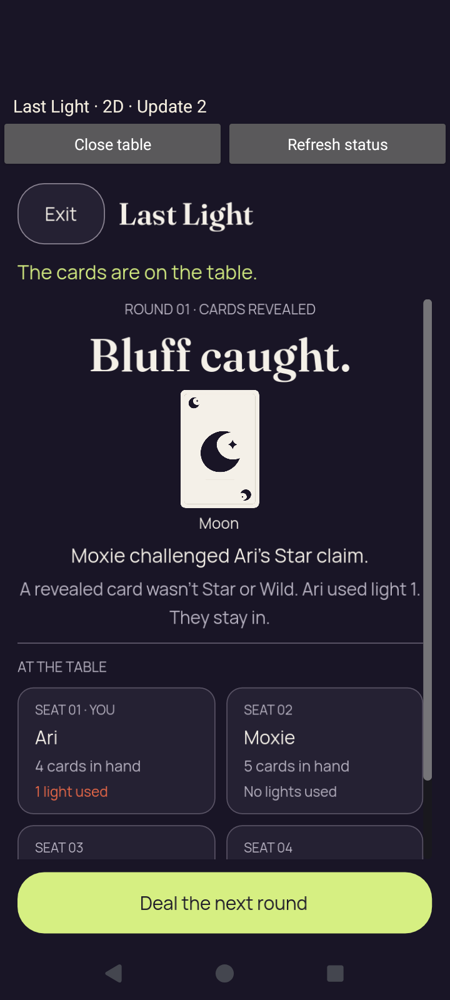</a> | **Round-1 result after Moxie catches Ari’s Star bluff — 1× text** Android API 35 emulator, actual native 2D comparison host, debug APK Original: [08-after-play.png](2d-font-1.0-debug/2d/match/08-after-play.png) 720 × 1600 px; text 1× SHA-256: <code>a6c656b104f4c6fab8277a540aff606c3e28fdb7efb7007c49b22dd8e2b3b706</code> [Original UI dump](2d-font-1.0-debug/2d/match/08-after-play.xml) [Original measurements](2d-font-1.0-debug/2d/match/08-after-play.json) [Original result](2d-font-1.0-debug/result.json) Moxie challenges Ari’s Star claim; the public Moon catches the bluff. Ari uses light 1 and stays in. Matching stage pixels remain separate captures. |
|  | **Separate original of the public round-1 outcome — 1× text** Android API 35 emulator, actual native 2D comparison host, debug APK Original: [09-public-outcome.png](2d-font-1.0-debug/2d/match/09-public-outcome.png) 720 × 1600 px; text 1× SHA-256: <code>a6c656b104f4c6fab8277a540aff606c3e28fdb7efb7007c49b22dd8e2b3b706</code> [Original UI dump](2d-font-1.0-debug/2d/match/09-public-outcome.xml) [Original measurements](2d-font-1.0-debug/2d/match/09-public-outcome.json) [Original result](2d-font-1.0-debug/result.json) Moxie challenges Ari’s Star claim; the public Moon catches the bluff. Ari uses light 1 and stays in. Matching stage pixels remain separate captures. |
|  | **Round-2 result after the accepted first advance — 1× text** Android API 35 emulator, actual native 2D comparison host, debug APK Original: [10-next-round.png](2d-font-1.0-debug/2d/match/10-next-round.png) 720 × 1600 px; text 1× SHA-256: <code>03a7db1235529cd56a39d5acc3bb8fcb246d67caa6e2ed026b750b958a9cb17d</code> [Original UI dump](2d-font-1.0-debug/2d/match/10-next-round.xml) [Original measurements](2d-font-1.0-debug/2d/match/10-next-round.json) [Original result](2d-font-1.0-debug/result.json) Autonomous turns have settled round 2 after the accepted advance: Pip catches Moxie’s Crown claim with Moon; Moxie uses light 1 and stays in. |
| <a href="2d-font-1.0-debug/2d/match/11-after-challenge.png">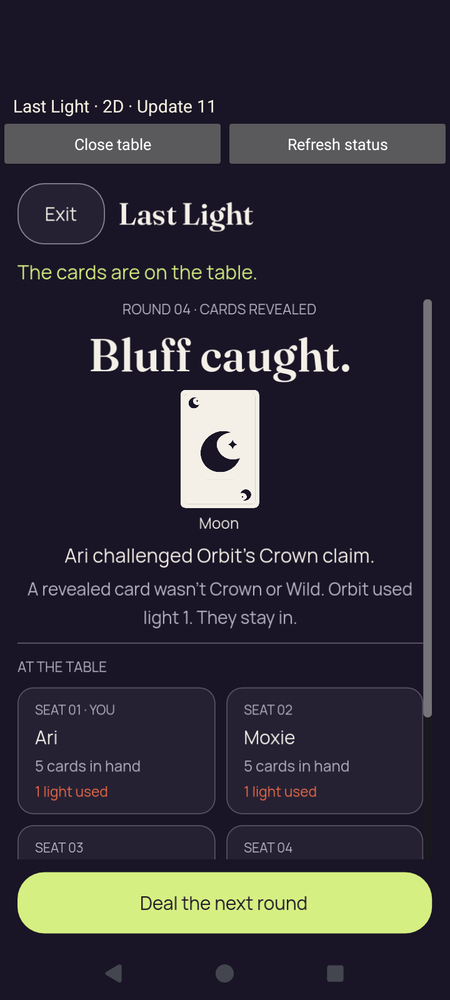</a> | **Round-4 result after Ari challenges Orbit — 1× text** Android API 35 emulator, actual native 2D comparison host, debug APK Original: [11-after-challenge.png](2d-font-1.0-debug/2d/match/11-after-challenge.png) 720 × 1600 px; text 1× SHA-256: <code>37a96b415688cbdb8d9c1028fa9bb96cd386e51ecb584dd9d5f7eb0147e374e9</code> [Original UI dump](2d-font-1.0-debug/2d/match/11-after-challenge.xml) [Original measurements](2d-font-1.0-debug/2d/match/11-after-challenge.json) [Original result](2d-font-1.0-debug/result.json) Authority round 4/revision 11: Ari catches Orbit’s Crown claim with Moon. Orbit uses light 1 and stays in. |
|  | **Round-14 winner: Orbit wins after Moxie burns out — 1× text** Android API 35 emulator, actual native 2D comparison host, debug APK Original: [12-winner.png](2d-font-1.0-debug/2d/match/12-winner.png) 720 × 1600 px; text 1× SHA-256: <code>e74cbb701eb5150fdbb59b4f6bfca6434ada79fcb0c912432413159180faa867</code> [Original UI dump](2d-font-1.0-debug/2d/match/12-winner.xml) [Original measurements](2d-font-1.0-debug/2d/match/12-winner.json) [Original result](2d-font-1.0-debug/result.json) Authority round 14/revision 41: Orbit catches Moxie’s Crown claim with Moon; Moxie uses light 4 and burns out. The complete Return to lobby action is visible and the later lobby intent is accepted. |
|  | **Chooser restored after match — 1× text** Android API 35 emulator, actual native 2D comparison host, debug APK Original: [14-chooser-after-exit.png](2d-font-1.0-debug/2d/match/14-chooser-after-exit.png) 720 × 1600 px; text 1× SHA-256: <code>243a2b9d3883ffb77eabe7bbbfe11a381a075f5a1a7c1a5e2307929003879f45</code> [Original receipt](2d-font-1.0-debug/2d/match/teardown.json) [Original UI dump](2d-font-1.0-debug/2d/match/14-chooser-after-exit.xml) [Original result](2d-font-1.0-debug/result.json) The original teardown receipt records native destruction, actual old/engine-process absence, enabled launch buttons and the surviving chooser. Each entry retains a distinct capture record. |
| <a href="2d-font-1.0-debug/2d/native-exit/01-fresh-concealed.png">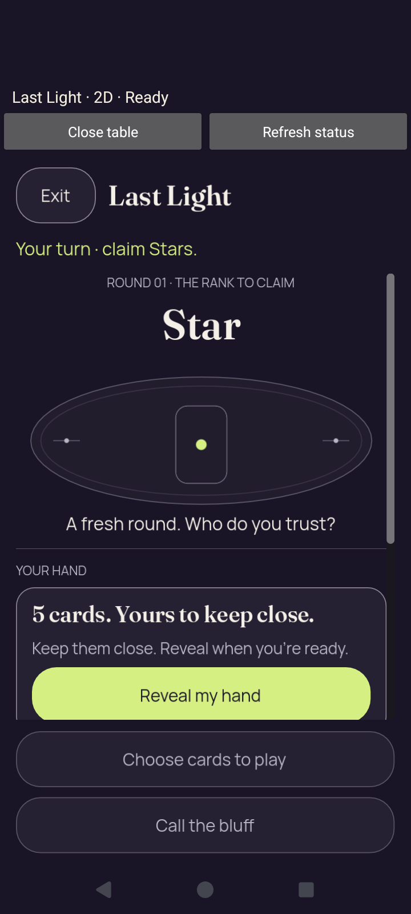</a> | **Fresh 2D presentation before native-exit — 1× text** Android API 35 emulator, actual native 2D comparison host, debug APK Original: [01-fresh-concealed.png](2d-font-1.0-debug/2d/native-exit/01-fresh-concealed.png) 720 × 1600 px; text 1× SHA-256: <code>52d8b06c0cb7a51e4b0dc0e87f31ed75bd4922491925ac792b6dcf57b218db3b</code> [Original UI dump](2d-font-1.0-debug/2d/native-exit/01-fresh-concealed.xml) [Original measurements](2d-font-1.0-debug/2d/native-exit/01-fresh-concealed.json) [Original result](2d-font-1.0-debug/result.json) A separate fresh engine PID and presentation start round 1 with five concealed cards after the preceding entry was destroyed. Initial Reveal still clips by four logical units/seven physical pixels: rect [32,512,339,56] ends at 568, while clip [16,118,379,446] ends at 564. The later source-only height correction is absent from this pack. |
|  | **Chooser restored after native-exit — 1× text** Android API 35 emulator, actual native 2D comparison host, debug APK Original: [14-chooser-after-exit.png](2d-font-1.0-debug/2d/native-exit/14-chooser-after-exit.png) 720 × 1600 px; text 1× SHA-256: <code>243a2b9d3883ffb77eabe7bbbfe11a381a075f5a1a7c1a5e2307929003879f45</code> [Original receipt](2d-font-1.0-debug/2d/native-exit/teardown.json) [Original UI dump](2d-font-1.0-debug/2d/native-exit/14-chooser-after-exit.xml) [Original result](2d-font-1.0-debug/result.json) The original teardown receipt records native destruction, actual old/engine-process absence, enabled launch buttons and the surviving chooser. Each entry retains a distinct capture record. |
|  | **Fresh 2D presentation before scene-exit — 1× text** Android API 35 emulator, actual native 2D comparison host, debug APK Original: [01-fresh-concealed.png](2d-font-1.0-debug/2d/scene-exit/01-fresh-concealed.png) 720 × 1600 px; text 1× SHA-256: <code>52d8b06c0cb7a51e4b0dc0e87f31ed75bd4922491925ac792b6dcf57b218db3b</code> [Original UI dump](2d-font-1.0-debug/2d/scene-exit/01-fresh-concealed.xml) [Original measurements](2d-font-1.0-debug/2d/scene-exit/01-fresh-concealed.json) [Original result](2d-font-1.0-debug/result.json) A separate fresh engine PID and presentation start round 1 with five concealed cards after the preceding entry was destroyed. Initial Reveal still clips by four logical units/seven physical pixels: rect [32,512,339,56] ends at 568, while clip [16,118,379,446] ends at 564. The later source-only height correction is absent from this pack. |
|  | **Chooser restored after scene-exit — 1× text** Android API 35 emulator, actual native 2D comparison host, debug APK Original: [14-chooser-after-exit.png](2d-font-1.0-debug/2d/scene-exit/14-chooser-after-exit.png) 720 × 1600 px; text 1× SHA-256: <code>243a2b9d3883ffb77eabe7bbbfe11a381a075f5a1a7c1a5e2307929003879f45</code> [Original receipt](2d-font-1.0-debug/2d/scene-exit/teardown.json) [Original UI dump](2d-font-1.0-debug/2d/scene-exit/14-chooser-after-exit.xml) [Original result](2d-font-1.0-debug/result.json) The original teardown receipt records native destruction, actual old/engine-process absence, enabled launch buttons and the surviving chooser. Each entry retains a distinct capture record. |
|  | **Native chooser before 2D launch — 1× text** Android API 35 emulator, actual native 2D comparison host, debug APK Original: [chooser.png](2d-font-1.0-debug/chooser.png) 720 × 1600 px; text 1× SHA-256: <code>243a2b9d3883ffb77eabe7bbbfe11a381a075f5a1a7c1a5e2307929003879f45</code> [Original UI dump](2d-font-1.0-debug/chooser.xml) [Original result](2d-font-1.0-debug/result.json) Both launch options are visible. Reduced motion and the seed-2 reference match are enabled; sound is disabled. |
|  | **Final chooser after all three 2D entries and teardown paths — 1× text** Android API 35 emulator, actual native 2D comparison host, debug APK Original: [final-screen.png](2d-font-1.0-debug/final-screen.png) 720 × 1600 px; text 1× SHA-256: <code>243a2b9d3883ffb77eabe7bbbfe11a381a075f5a1a7c1a5e2307929003879f45</code> [Original UI dump](2d-font-1.0-debug/last-ui.xml) [Original result](2d-font-1.0-debug/result.json) The full match, fresh renderer Exit and fresh native Close complete in separate engine processes. This final capture follows the successful native Close. |

## 2D — 200% text

[Original result](2d-font-2.0-debug/result.json) · [Package inputs](2d-font-2.0-debug/package-inputs.json) · [Native input records](2d-font-2.0-debug/input-geometry.log) · [OS events](2d-font-2.0-debug/events.log)

| Original image | Scenario and provenance |
| --- | --- |
| <a href="2d-font-2.0-debug/2d/match/01-concealed.png">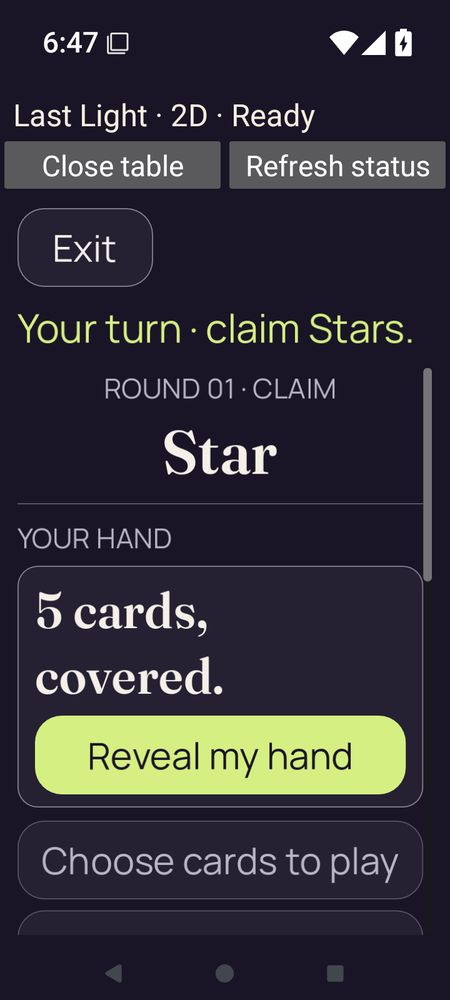</a> | **Native 2D reference match begins concealed — 2× text** Android API 35 emulator, actual native 2D comparison host, debug APK Original: [01-concealed.png](2d-font-2.0-debug/2d/match/01-concealed.png) 720 × 1600 px; text 2× SHA-256: <code>043f2a82c5f3ff9873f06ff9515e5f6356dc7f56a52036048d9cfb51d249c257</code> [Original UI dump](2d-font-2.0-debug/2d/match/01-concealed.xml) [Original measurements](2d-font-2.0-debug/2d/match/01-concealed.json) [Original result](2d-font-2.0-debug/result.json) Initial Reveal fits at 200%; later gameplay content continues below the scroll viewport. |
| <a href="2d-font-2.0-debug/2d/match/02-revealed.png">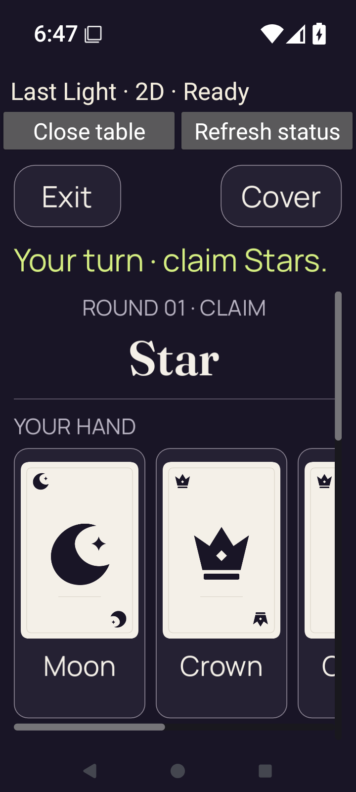</a> | **Native 2D hand revealed through actual touch — 2× text** Android API 35 emulator, actual native 2D comparison host, debug APK Original: [02-revealed.png](2d-font-2.0-debug/2d/match/02-revealed.png) 720 × 1600 px; text 2× SHA-256: <code>a30cfd8bebb732bd1aea115cf1a0a331589d1b504aad629e73abbbe6ebc8250d</code> [Original UI dump](2d-font-2.0-debug/2d/match/02-revealed.xml) [Original measurements](2d-font-2.0-debug/2d/match/02-revealed.json) [Original result](2d-font-2.0-debug/result.json) |
| <a href="2d-font-2.0-debug/2d/match/03-selected.png">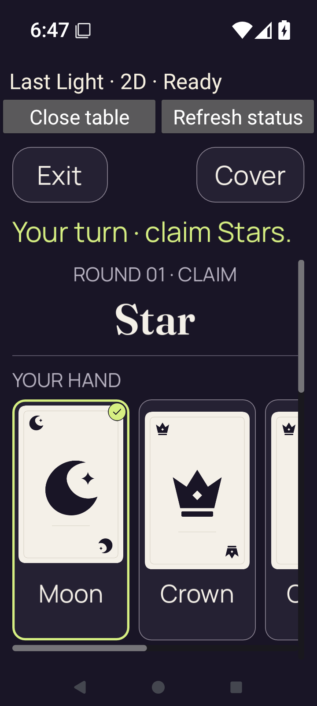</a> | **Native 2D Moon selected for a one-Star claim — 2× text** Android API 35 emulator, actual native 2D comparison host, debug APK Original: [03-selected.png](2d-font-2.0-debug/2d/match/03-selected.png) 720 × 1600 px; text 2× SHA-256: <code>f945f8b38dbe72bd6ce79830b6fe46ddac5ed0c8581d8aae325059b62fe7b728</code> [Original UI dump](2d-font-2.0-debug/2d/match/03-selected.xml) [Original measurements](2d-font-2.0-debug/2d/match/03-selected.json) [Original result](2d-font-2.0-debug/result.json) |
|  | **Native 2D hand covered and selection cleared — 2× text** Android API 35 emulator, actual native 2D comparison host, debug APK Original: [04-covered.png](2d-font-2.0-debug/2d/match/04-covered.png) 720 × 1600 px; text 2× SHA-256: <code>999b240c906168d1de5c8f536f1b2a1e6cb4b69120db088e853bd01be91a7178</code> [Original UI dump](2d-font-2.0-debug/2d/match/04-covered.xml) [Original measurements](2d-font-2.0-debug/2d/match/04-covered.json) [Original result](2d-font-2.0-debug/result.json) Paired diagnostics record zero private faces, rank labels and selection. |
|  | **Android Home during the revealed match lifecycle — 2× text** Android API 35 emulator, actual native 2D comparison host, debug APK Original: [05-background-home.png](2d-font-2.0-debug/2d/match/05-background-home.png) 720 × 1600 px; text 2× SHA-256: <code>1dcf65c1710a3f5df1b8cb2ae41f148756887371401105ff7d8534801ad04a7e</code> [Original UI dump](2d-font-2.0-debug/2d/match/05-background-home.xml) [Original result](2d-font-2.0-debug/result.json) This Home original belongs to the exercised reveal/select/background sequence, after app installation. No private game face or label is visible. |
| <a href="2d-font-2.0-debug/2d/match/06-recents-privacy.png">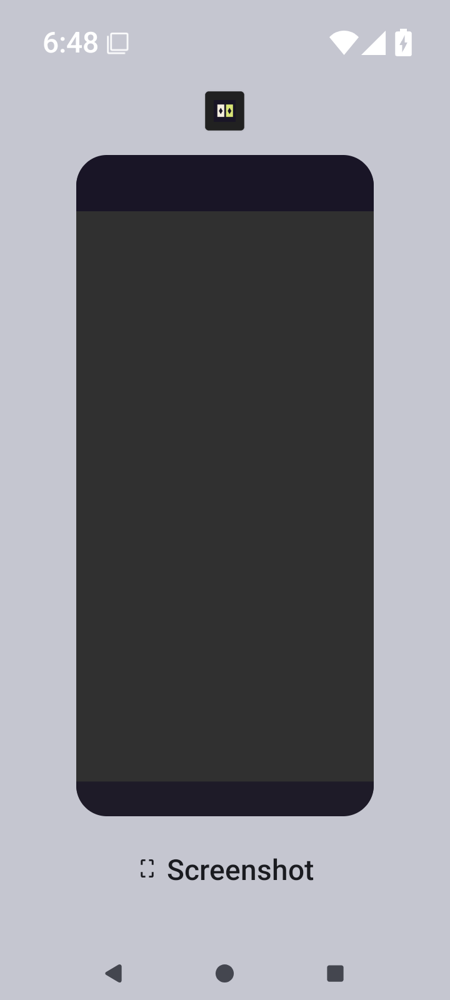</a> | **Android Recents with opaque task preview — 2× text** Android API 35 emulator, actual native 2D comparison host, debug APK Original: [06-recents-privacy.png](2d-font-2.0-debug/2d/match/06-recents-privacy.png) 720 × 1600 px; text 2× SHA-256: <code>6c6d51672faae8ab0afe3f689576dd7d745e453800fcaca1435405c4613dbd53</code> [Original UI dump](2d-font-2.0-debug/2d/match/06-recents-privacy.xml) [Original result](2d-font-2.0-debug/result.json) The opaque gray task preview contains no private faces, labels or selected state. The retained capture policy is recents_disabled; the following same-process concealed resume completes. |
|  | **Same native presentation resumes concealed — 2× text** Android API 35 emulator, actual native 2D comparison host, debug APK Original: [07-resumed-concealed.png](2d-font-2.0-debug/2d/match/07-resumed-concealed.png) 720 × 1600 px; text 2× SHA-256: <code>fc04d282049cd27ac984e1d110dc74fca46fd11687408e14e25686c8e87038ed</code> [Original UI dump](2d-font-2.0-debug/2d/match/07-resumed-concealed.xml) [Original measurements](2d-font-2.0-debug/2d/match/07-resumed-concealed.json) [Original result](2d-font-2.0-debug/result.json) Paired diagnostics record zero private faces, rank labels and selection. The same engine PID and presentation resume. The native Home/Recents/resume sequence completes in this match entry. |
|  | **Round-1 result after Moxie catches Ari’s Star bluff — 2× text** Android API 35 emulator, actual native 2D comparison host, debug APK Original: [08-after-play.png](2d-font-2.0-debug/2d/match/08-after-play.png) 720 × 1600 px; text 2× SHA-256: <code>81e392fcdc401b33919c403dde706183f43320714ea1a96adddf97e183b92f6d</code> [Original UI dump](2d-font-2.0-debug/2d/match/08-after-play.xml) [Original measurements](2d-font-2.0-debug/2d/match/08-after-play.json) [Original result](2d-font-2.0-debug/result.json) Moxie challenges Ari’s Star claim; the public Moon catches the bluff. Ari uses light 1 and stays in. Matching stage pixels remain separate captures. The next/return action lies partly or entirely below this capture viewport. Later retained input geometry and authority progression establish that the action is reached and accepted. |
| <a href="2d-font-2.0-debug/2d/match/09-public-outcome.png">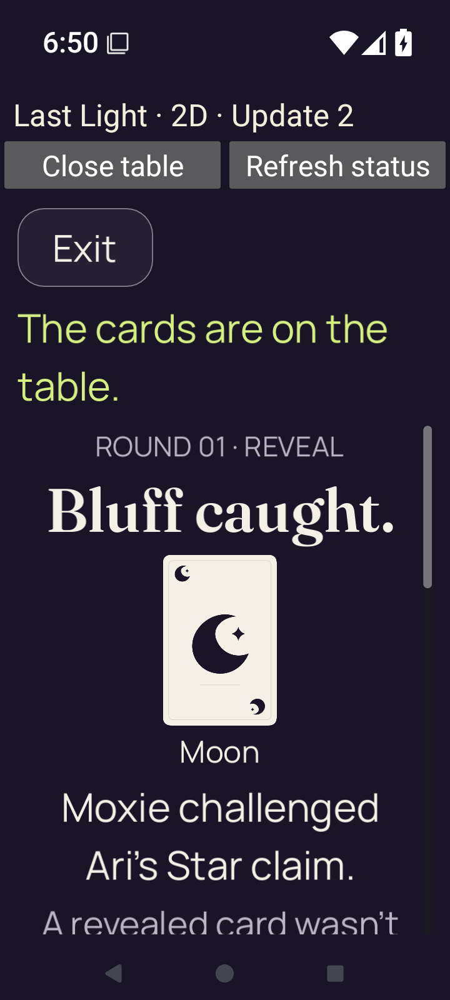</a> | **Separate original of the public round-1 outcome — 2× text** Android API 35 emulator, actual native 2D comparison host, debug APK Original: [09-public-outcome.png](2d-font-2.0-debug/2d/match/09-public-outcome.png) 720 × 1600 px; text 2× SHA-256: <code>81e392fcdc401b33919c403dde706183f43320714ea1a96adddf97e183b92f6d</code> [Original UI dump](2d-font-2.0-debug/2d/match/09-public-outcome.xml) [Original measurements](2d-font-2.0-debug/2d/match/09-public-outcome.json) [Original result](2d-font-2.0-debug/result.json) Moxie challenges Ari’s Star claim; the public Moon catches the bluff. Ari uses light 1 and stays in. Matching stage pixels remain separate captures. The next/return action lies partly or entirely below this capture viewport. Later retained input geometry and authority progression establish that the action is reached and accepted. |
| <a href="2d-font-2.0-debug/2d/match/10-next-round.png">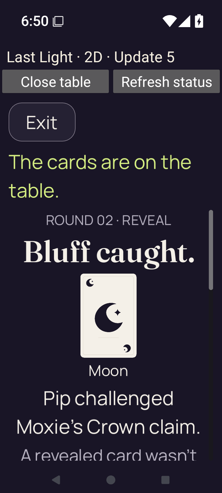</a> | **Round-2 result after the accepted first advance — 2× text** Android API 35 emulator, actual native 2D comparison host, debug APK Original: [10-next-round.png](2d-font-2.0-debug/2d/match/10-next-round.png) 720 × 1600 px; text 2× SHA-256: <code>934396f362306359cef82689acba559c9d25a406cebe10abea1fdefc8380108c</code> [Original UI dump](2d-font-2.0-debug/2d/match/10-next-round.xml) [Original measurements](2d-font-2.0-debug/2d/match/10-next-round.json) [Original result](2d-font-2.0-debug/result.json) Autonomous turns have settled round 2 after the accepted advance: Pip catches Moxie’s Crown claim with Moon; Moxie uses light 1 and stays in. The next/return action lies partly or entirely below this capture viewport. Later retained input geometry and authority progression establish that the action is reached and accepted. |
| <a href="2d-font-2.0-debug/2d/match/11-after-challenge.png">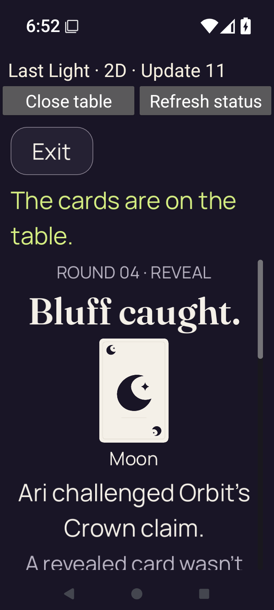</a> | **Round-4 result after Ari challenges Orbit — 2× text** Android API 35 emulator, actual native 2D comparison host, debug APK Original: [11-after-challenge.png](2d-font-2.0-debug/2d/match/11-after-challenge.png) 720 × 1600 px; text 2× SHA-256: <code>91685c5b9fe2e4633d2862b339207658d63739448701932660f76ec864b9ccff</code> [Original UI dump](2d-font-2.0-debug/2d/match/11-after-challenge.xml) [Original measurements](2d-font-2.0-debug/2d/match/11-after-challenge.json) [Original result](2d-font-2.0-debug/result.json) Authority round 4/revision 11: Ari catches Orbit’s Crown claim with Moon. Orbit uses light 1 and stays in. The next/return action lies partly or entirely below this capture viewport. Later retained input geometry and authority progression establish that the action is reached and accepted. |
| <a href="2d-font-2.0-debug/2d/match/12-winner.png">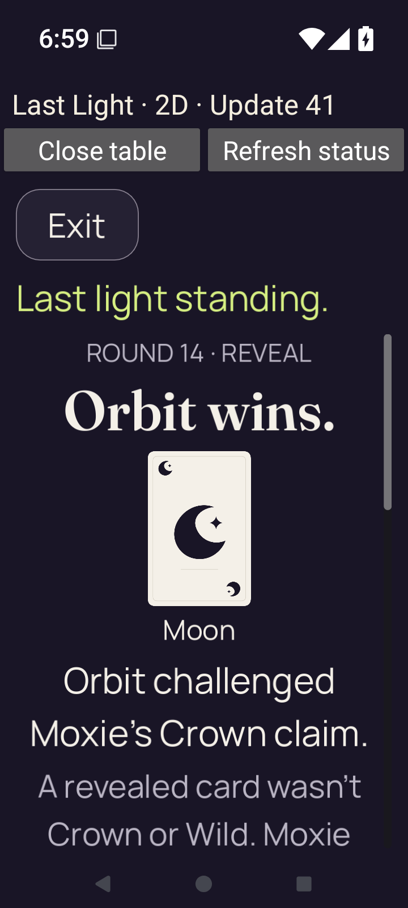</a> | **Round-14 winner: Orbit wins after Moxie burns out — 2× text** Android API 35 emulator, actual native 2D comparison host, debug APK Original: [12-winner.png](2d-font-2.0-debug/2d/match/12-winner.png) 720 × 1600 px; text 2× SHA-256: <code>60c8a1a025261ebc4b10df4a3d0617c494d893b31da4e9617d4fe238460590d9</code> [Original UI dump](2d-font-2.0-debug/2d/match/12-winner.xml) [Original measurements](2d-font-2.0-debug/2d/match/12-winner.json) [Original result](2d-font-2.0-debug/result.json) Authority round 14/revision 41: Orbit catches Moxie’s Crown claim with Moon; Moxie uses light 4 and burns out. The next/return action lies partly or entirely below this capture viewport. Later retained input geometry and authority progression establish that the action is reached and accepted. |
|  | **Chooser restored after match — 2× text** Android API 35 emulator, actual native 2D comparison host, debug APK Original: [14-chooser-after-exit.png](2d-font-2.0-debug/2d/match/14-chooser-after-exit.png) 720 × 1600 px; text 2× SHA-256: <code>08ca18b0af5abd4c59b7a25033425c2d76139e9375a73d89ed5d0d571a13cf23</code> [Original receipt](2d-font-2.0-debug/2d/match/teardown.json) [Original UI dump](2d-font-2.0-debug/2d/match/14-chooser-after-exit.xml) [Original result](2d-font-2.0-debug/result.json) The original teardown receipt records native destruction, actual old/engine-process absence, enabled launch buttons and the surviving chooser. Each entry retains a distinct capture record. Open source notices is below the initial chooser viewport at 200% text. |
|  | **Fresh 2D presentation before native-exit — 2× text** Android API 35 emulator, actual native 2D comparison host, debug APK Original: [01-fresh-concealed.png](2d-font-2.0-debug/2d/native-exit/01-fresh-concealed.png) 720 × 1600 px; text 2× SHA-256: <code>b7e8f073be9b5352c44e7943b5e29f76bd7c060e1004431a4787c315232a52b4</code> [Original UI dump](2d-font-2.0-debug/2d/native-exit/01-fresh-concealed.xml) [Original measurements](2d-font-2.0-debug/2d/native-exit/01-fresh-concealed.json) [Original result](2d-font-2.0-debug/result.json) A separate fresh engine PID and presentation start round 1 with five concealed cards after the preceding entry was destroyed. Initial Reveal fits at 200%; later gameplay content continues below the scroll viewport. |
|  | **Chooser restored after native-exit — 2× text** Android API 35 emulator, actual native 2D comparison host, debug APK Original: [14-chooser-after-exit.png](2d-font-2.0-debug/2d/native-exit/14-chooser-after-exit.png) 720 × 1600 px; text 2× SHA-256: <code>0982331678ac05ef7420fa3d3428b4d0cba16519b5e34b0c1a3f9687f4ff1db3</code> [Original receipt](2d-font-2.0-debug/2d/native-exit/teardown.json) [Original UI dump](2d-font-2.0-debug/2d/native-exit/14-chooser-after-exit.xml) [Original result](2d-font-2.0-debug/result.json) The original teardown receipt records native destruction, actual old/engine-process absence, enabled launch buttons and the surviving chooser. Each entry retains a distinct capture record. Open source notices is below the initial chooser viewport at 200% text. |
| <a href="2d-font-2.0-debug/2d/scene-exit/01-fresh-concealed.png">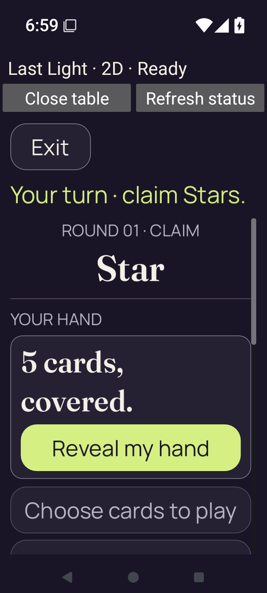</a> | **Fresh 2D presentation before scene-exit — 2× text** Android API 35 emulator, actual native 2D comparison host, debug APK Original: [01-fresh-concealed.png](2d-font-2.0-debug/2d/scene-exit/01-fresh-concealed.png) 720 × 1600 px; text 2× SHA-256: <code>f5336b2b67a311541123cbea94c12556767d6c5e36ca876509a6a800ed5c4268</code> [Original UI dump](2d-font-2.0-debug/2d/scene-exit/01-fresh-concealed.xml) [Original measurements](2d-font-2.0-debug/2d/scene-exit/01-fresh-concealed.json) [Original result](2d-font-2.0-debug/result.json) A separate fresh engine PID and presentation start round 1 with five concealed cards after the preceding entry was destroyed. Initial Reveal fits at 200%; later gameplay content continues below the scroll viewport. |
|  | **Chooser restored after scene-exit — 2× text** Android API 35 emulator, actual native 2D comparison host, debug APK Original: [14-chooser-after-exit.png](2d-font-2.0-debug/2d/scene-exit/14-chooser-after-exit.png) 720 × 1600 px; text 2× SHA-256: <code>a4566a48631b2f7493278aebaa7178155e99775ad0a58ff7785ad826faf0418b</code> [Original receipt](2d-font-2.0-debug/2d/scene-exit/teardown.json) [Original UI dump](2d-font-2.0-debug/2d/scene-exit/14-chooser-after-exit.xml) [Original result](2d-font-2.0-debug/result.json) The original teardown receipt records native destruction, actual old/engine-process absence, enabled launch buttons and the surviving chooser. Each entry retains a distinct capture record. Open source notices is below the initial chooser viewport at 200% text. |
|  | **Native chooser before 2D launch — 2× text** Android API 35 emulator, actual native 2D comparison host, debug APK Original: [chooser.png](2d-font-2.0-debug/chooser.png) 720 × 1600 px; text 2× SHA-256: <code>46c1f65688cab9f3fb667ff60f341550d8545cb01cd4121e97fdd3e3b59265cf</code> [Original UI dump](2d-font-2.0-debug/chooser.xml) [Original result](2d-font-2.0-debug/result.json) Both launch options are visible. Reduced motion and the seed-2 reference match are enabled; sound is disabled. Open source notices is below the initial chooser viewport at 200% text. |
|  | **Final chooser after all three 2D entries and teardown paths — 2× text** Android API 35 emulator, actual native 2D comparison host, debug APK Original: [final-screen.png](2d-font-2.0-debug/final-screen.png) 720 × 1600 px; text 2× SHA-256: <code>0982331678ac05ef7420fa3d3428b4d0cba16519b5e34b0c1a3f9687f4ff1db3</code> [Original UI dump](2d-font-2.0-debug/last-ui.xml) [Original result](2d-font-2.0-debug/result.json) The full match, fresh renderer Exit and fresh native Close complete in separate engine processes. This final capture follows the successful native Close. Open source notices is below the initial chooser viewport at 200% text. |

## 3D — 100% text

[Original result](3d-font-1.0-debug/result.json) · [Package inputs](3d-font-1.0-debug/package-inputs.json) · [Native input records](3d-font-1.0-debug/input-geometry.log) · [OS events](3d-font-1.0-debug/events.log)

| Original image | Scenario and provenance |
| --- | --- |
|  | **Native 3D reference match begins concealed — 1× text** Android API 35 emulator, actual native 3D comparison host, debug APK Original: [01-concealed.png](3d-font-1.0-debug/3d/match/01-concealed.png) 720 × 1600 px; text 1× SHA-256: <code>65057e0353a02e5e2bd19b44f3bcd0ff2d42c9e76b00c4e065ef9a8a403627d3</code> [Original UI dump](3d-font-1.0-debug/3d/match/01-concealed.xml) [Original measurements](3d-font-1.0-debug/3d/match/01-concealed.json) [Original result](3d-font-1.0-debug/result.json) The whole 3D case remains failed at its final native Back route despite the earlier completed match and scene Exit. |
|  | **Native 3D hand revealed through actual touch — 1× text** Android API 35 emulator, actual native 3D comparison host, debug APK Original: [02-revealed.png](3d-font-1.0-debug/3d/match/02-revealed.png) 720 × 1600 px; text 1× SHA-256: <code>a1d671fab132750072bef87181bee125ccc35de0b819edc95182cbab7a1dd3b8</code> [Original UI dump](3d-font-1.0-debug/3d/match/02-revealed.xml) [Original measurements](3d-font-1.0-debug/3d/match/02-revealed.json) [Original result](3d-font-1.0-debug/result.json) The whole 3D case remains failed at its final native Back route despite the earlier completed match and scene Exit. |
| <a href="3d-font-1.0-debug/3d/match/03-selected.png">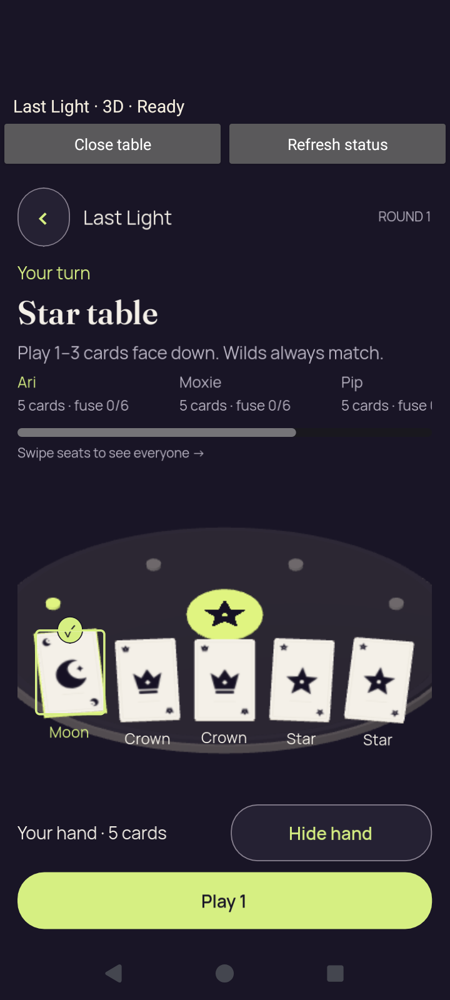</a> | **Native 3D Moon selected for a one-Star claim — 1× text** Android API 35 emulator, actual native 3D comparison host, debug APK Original: [03-selected.png](3d-font-1.0-debug/3d/match/03-selected.png) 720 × 1600 px; text 1× SHA-256: <code>b24d50483d6a4d39302fd0b402b91c0768300515bf4edc24e4257b790b26b7a0</code> [Original UI dump](3d-font-1.0-debug/3d/match/03-selected.xml) [Original measurements](3d-font-1.0-debug/3d/match/03-selected.json) [Original result](3d-font-1.0-debug/result.json) The whole 3D case remains failed at its final native Back route despite the earlier completed match and scene Exit. |
| <a href="3d-font-1.0-debug/3d/match/04-covered.png">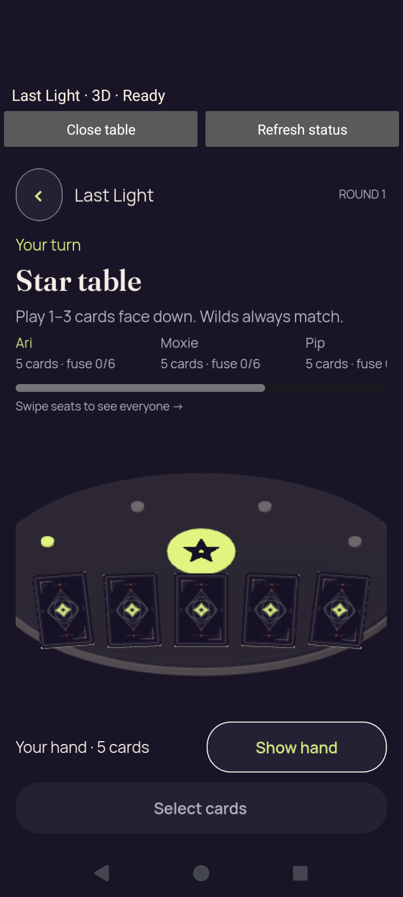</a> | **Native 3D hand covered and selection cleared — 1× text** Android API 35 emulator, actual native 3D comparison host, debug APK Original: [04-covered.png](3d-font-1.0-debug/3d/match/04-covered.png) 720 × 1600 px; text 1× SHA-256: <code>28da282a1b591f62ae4009d0d0f33ccfee47d5cb3c5a745f9e5947e41da37985</code> [Original UI dump](3d-font-1.0-debug/3d/match/04-covered.xml) [Original measurements](3d-font-1.0-debug/3d/match/04-covered.json) [Original result](3d-font-1.0-debug/result.json) Paired diagnostics record zero private faces, rank labels and selection. The whole 3D case remains failed at its final native Back route despite the earlier completed match and scene Exit. |
|  | **Android Home during the revealed match lifecycle — 1× text** Android API 35 emulator, actual native 3D comparison host, debug APK Original: [05-background-home.png](3d-font-1.0-debug/3d/match/05-background-home.png) 720 × 1600 px; text 1× SHA-256: <code>5c310a5cc252feca19c8c8183330d1d154d093ba80e701c9b9696982568eb576</code> [Original UI dump](3d-font-1.0-debug/3d/match/05-background-home.xml) [Original result](3d-font-1.0-debug/result.json) This Home original belongs to the exercised reveal/select/background sequence, after app installation. No private game face or label is visible. The whole 3D case remains failed at its final native Back route despite the earlier completed match and scene Exit. |
|  | **Android Recents with opaque task preview — 1× text** Android API 35 emulator, actual native 3D comparison host, debug APK Original: [06-recents-privacy.png](3d-font-1.0-debug/3d/match/06-recents-privacy.png) 720 × 1600 px; text 1× SHA-256: <code>fa26e159dc1b7dffe2e8b174b8c4148a69735bd739ee68a02279c6e5138d3d47</code> [Original UI dump](3d-font-1.0-debug/3d/match/06-recents-privacy.xml) [Original result](3d-font-1.0-debug/result.json) The opaque gray task preview contains no private faces, labels or selected state. The retained capture policy is recents_disabled; the following same-process concealed resume completes. The whole 3D case remains failed at its final native Back route despite the earlier completed match and scene Exit. |
|  | **Same native presentation resumes concealed — 1× text** Android API 35 emulator, actual native 3D comparison host, debug APK Original: [07-resumed-concealed.png](3d-font-1.0-debug/3d/match/07-resumed-concealed.png) 720 × 1600 px; text 1× SHA-256: <code>65057e0353a02e5e2bd19b44f3bcd0ff2d42c9e76b00c4e065ef9a8a403627d3</code> [Original UI dump](3d-font-1.0-debug/3d/match/07-resumed-concealed.xml) [Original measurements](3d-font-1.0-debug/3d/match/07-resumed-concealed.json) [Original result](3d-font-1.0-debug/result.json) Paired diagnostics record zero private faces, rank labels and selection. The same engine PID and presentation resume. The native Home/Recents/resume sequence completes in this match entry. The whole 3D case remains failed at its final native Back route despite the earlier completed match and scene Exit. |
| <a href="3d-font-1.0-debug/3d/match/08-after-play.png">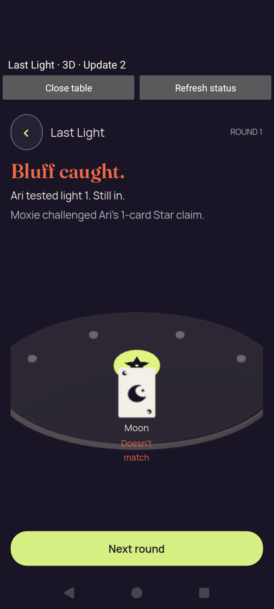</a> | **Round-1 result after Moxie catches Ari’s Star bluff — 1× text** Android API 35 emulator, actual native 3D comparison host, debug APK Original: [08-after-play.png](3d-font-1.0-debug/3d/match/08-after-play.png) 720 × 1600 px; text 1× SHA-256: <code>180d4554715dd249147fe41ce9607d6d6f10c2dda5a5fbd59b2995de65a58951</code> [Original UI dump](3d-font-1.0-debug/3d/match/08-after-play.xml) [Original measurements](3d-font-1.0-debug/3d/match/08-after-play.json) [Original result](3d-font-1.0-debug/result.json) Moxie challenges Ari’s Star claim; the public Moon catches the bluff. Ari uses light 1 and stays in. Matching stage pixels remain separate captures. The whole 3D case remains failed at its final native Back route despite the earlier completed match and scene Exit. |
|  | **Separate original of the public round-1 outcome — 1× text** Android API 35 emulator, actual native 3D comparison host, debug APK Original: [09-public-outcome.png](3d-font-1.0-debug/3d/match/09-public-outcome.png) 720 × 1600 px; text 1× SHA-256: <code>180d4554715dd249147fe41ce9607d6d6f10c2dda5a5fbd59b2995de65a58951</code> [Original UI dump](3d-font-1.0-debug/3d/match/09-public-outcome.xml) [Original measurements](3d-font-1.0-debug/3d/match/09-public-outcome.json) [Original result](3d-font-1.0-debug/result.json) Moxie challenges Ari’s Star claim; the public Moon catches the bluff. Ari uses light 1 and stays in. Matching stage pixels remain separate captures. The whole 3D case remains failed at its final native Back route despite the earlier completed match and scene Exit. |
|  | **Round-2 result after the accepted first advance — 1× text** Android API 35 emulator, actual native 3D comparison host, debug APK Original: [10-next-round.png](3d-font-1.0-debug/3d/match/10-next-round.png) 720 × 1600 px; text 1× SHA-256: <code>cdb8095d9aca7024308999c8c532e396a7b1ffde89301d6f7f867682f1621368</code> [Original UI dump](3d-font-1.0-debug/3d/match/10-next-round.xml) [Original measurements](3d-font-1.0-debug/3d/match/10-next-round.json) [Original result](3d-font-1.0-debug/result.json) Autonomous turns have settled round 2 after the accepted advance: Pip catches Moxie’s Crown claim with Moon; Moxie uses light 1 and stays in. The whole 3D case remains failed at its final native Back route despite the earlier completed match and scene Exit. |
|  | **Round-4 result after Ari challenges Orbit — 1× text** Android API 35 emulator, actual native 3D comparison host, debug APK Original: [11-after-challenge.png](3d-font-1.0-debug/3d/match/11-after-challenge.png) 720 × 1600 px; text 1× SHA-256: <code>238768d46b77de987df2a31d6618f58fb7d877fe3b5a10879f357316277a8c1c</code> [Original UI dump](3d-font-1.0-debug/3d/match/11-after-challenge.xml) [Original measurements](3d-font-1.0-debug/3d/match/11-after-challenge.json) [Original result](3d-font-1.0-debug/result.json) Authority round 4/revision 11: Ari catches Orbit’s Crown claim with Moon. Orbit uses light 1 and stays in. The whole 3D case remains failed at its final native Back route despite the earlier completed match and scene Exit. |
|  | **Round-14 winner: Orbit wins after Moxie burns out — 1× text** Android API 35 emulator, actual native 3D comparison host, debug APK Original: [12-winner.png](3d-font-1.0-debug/3d/match/12-winner.png) 720 × 1600 px; text 1× SHA-256: <code>bc5f8c106fa37ee4bddb3dc2c225c9a5adf376ffe61b52072f88ce0c4070175d</code> [Original UI dump](3d-font-1.0-debug/3d/match/12-winner.xml) [Original measurements](3d-font-1.0-debug/3d/match/12-winner.json) [Original result](3d-font-1.0-debug/result.json) Authority round 14/revision 41: Orbit catches Moxie’s Crown claim with Moon; Moxie uses light 4 and burns out. The complete Back to room action is visible and the later lobby intent is accepted. The whole 3D case remains failed at its final native Back route despite the earlier completed match and scene Exit. |
|  | **Chooser restored after match — 1× text** Android API 35 emulator, actual native 3D comparison host, debug APK Original: [14-chooser-after-exit.png](3d-font-1.0-debug/3d/match/14-chooser-after-exit.png) 720 × 1600 px; text 1× SHA-256: <code>243a2b9d3883ffb77eabe7bbbfe11a381a075f5a1a7c1a5e2307929003879f45</code> [Original receipt](3d-font-1.0-debug/3d/match/teardown.json) [Original UI dump](3d-font-1.0-debug/3d/match/14-chooser-after-exit.xml) [Original result](3d-font-1.0-debug/result.json) The original teardown receipt records native destruction, actual old/engine-process absence, enabled launch buttons and the surviving chooser. Each entry retains a distinct capture record. The whole 3D case remains failed at its final native Back route despite the earlier completed match and scene Exit. |
|  | **Fresh 3D presentation before native-exit — 1× text** Android API 35 emulator, actual native 3D comparison host, debug APK Original: [01-fresh-concealed.png](3d-font-1.0-debug/3d/native-exit/01-fresh-concealed.png) 720 × 1600 px; text 1× SHA-256: <code>65057e0353a02e5e2bd19b44f3bcd0ff2d42c9e76b00c4e065ef9a8a403627d3</code> [Original UI dump](3d-font-1.0-debug/3d/native-exit/01-fresh-concealed.xml) [Original measurements](3d-font-1.0-debug/3d/native-exit/01-fresh-concealed.json) [Original result](3d-font-1.0-debug/result.json) A separate fresh engine PID and presentation start round 1 with five concealed cards after the preceding entry was destroyed. This entry later fails the requested native Back route; there is no success-specific chooser capture or teardown receipt for it. The whole 3D case remains failed at its final native Back route despite the earlier completed match and scene Exit. |
|  | **Fresh 3D presentation before scene-exit — 1× text** Android API 35 emulator, actual native 3D comparison host, debug APK Original: [01-fresh-concealed.png](3d-font-1.0-debug/3d/scene-exit/01-fresh-concealed.png) 720 × 1600 px; text 1× SHA-256: <code>65057e0353a02e5e2bd19b44f3bcd0ff2d42c9e76b00c4e065ef9a8a403627d3</code> [Original UI dump](3d-font-1.0-debug/3d/scene-exit/01-fresh-concealed.xml) [Original measurements](3d-font-1.0-debug/3d/scene-exit/01-fresh-concealed.json) [Original result](3d-font-1.0-debug/result.json) A separate fresh engine PID and presentation start round 1 with five concealed cards after the preceding entry was destroyed. The whole 3D case remains failed at its final native Back route despite the earlier completed match and scene Exit. |
|  | **Chooser restored after scene-exit — 1× text** Android API 35 emulator, actual native 3D comparison host, debug APK Original: [14-chooser-after-exit.png](3d-font-1.0-debug/3d/scene-exit/14-chooser-after-exit.png) 720 × 1600 px; text 1× SHA-256: <code>243a2b9d3883ffb77eabe7bbbfe11a381a075f5a1a7c1a5e2307929003879f45</code> [Original receipt](3d-font-1.0-debug/3d/scene-exit/teardown.json) [Original UI dump](3d-font-1.0-debug/3d/scene-exit/14-chooser-after-exit.xml) [Original result](3d-font-1.0-debug/result.json) The original teardown receipt records native destruction, actual old/engine-process absence, enabled launch buttons and the surviving chooser. Each entry retains a distinct capture record. The whole 3D case remains failed at its final native Back route despite the earlier completed match and scene Exit. |
|  | **Native chooser before 3D launch — 1× text** Android API 35 emulator, actual native 3D comparison host, debug APK Original: [chooser.png](3d-font-1.0-debug/chooser.png) 720 × 1600 px; text 1× SHA-256: <code>243a2b9d3883ffb77eabe7bbbfe11a381a075f5a1a7c1a5e2307929003879f45</code> [Original UI dump](3d-font-1.0-debug/chooser.xml) [Original result](3d-font-1.0-debug/result.json) Both launch options are visible. Reduced motion and the seed-2 reference match are enabled; sound is disabled. The whole 3D case remains failed at its final native Back route despite the earlier completed match and scene Exit. |
|  | **Final chooser after the failed 3D native Back route — 1× text** Android API 35 emulator, actual native 3D comparison host, debug APK Original: [final-screen.png](3d-font-1.0-debug/final-screen.png) 720 × 1600 px; text 1× SHA-256: <code>243a2b9d3883ffb77eabe7bbbfe11a381a075f5a1a7c1a5e2307929003879f45</code> [Original UI dump](3d-font-1.0-debug/last-ui.xml) [Original result](3d-font-1.0-debug/result.json) Native Back was requested, but the host reports renderer_exit and one additional renderer exit event. Actual child death and restored chooser are recorded; the requested Back route remains failed. The whole 3D case remains failed at its final native Back route despite the earlier completed match and scene Exit. |

## 3D — 200% text

[Original result](3d-font-2.0-debug/result.json) · [Package inputs](3d-font-2.0-debug/package-inputs.json) · [Native input records](3d-font-2.0-debug/input-geometry.log) · [OS events](3d-font-2.0-debug/events.log)

| Original image | Scenario and provenance |
| --- | --- |
| <a href="3d-font-2.0-debug/3d/match/01-concealed.png">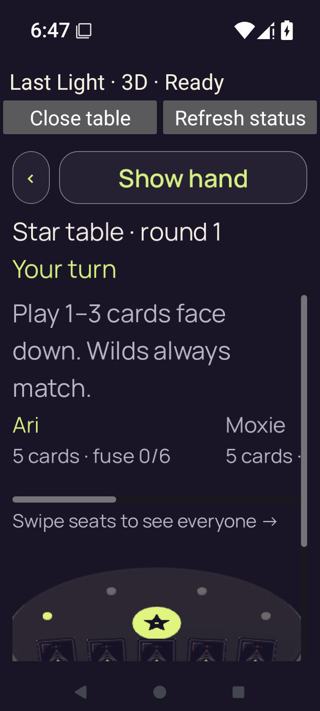</a> | **Native 3D reference match begins concealed — 2× text** Android API 35 emulator, actual native 3D comparison host, debug APK Original: [01-concealed.png](3d-font-2.0-debug/3d/match/01-concealed.png) 720 × 1600 px; text 2× SHA-256: <code>5157e4be968aa3fa64ec8cc8287488da67c65eabb41fd34e7a53935a1c188f53</code> [Original UI dump](3d-font-2.0-debug/3d/match/01-concealed.xml) [Original measurements](3d-font-2.0-debug/3d/match/01-concealed.json) [Original result](3d-font-2.0-debug/result.json) Show/Hide and Star table, round and actor remain pinned. Some cards or rank actions lie outside the current scroll viewport; no simultaneous full-hand visibility claim. The whole 3D case remains failed at its final native Back route despite the earlier completed match and scene Exit. |
| <a href="3d-font-2.0-debug/3d/match/02-revealed.png">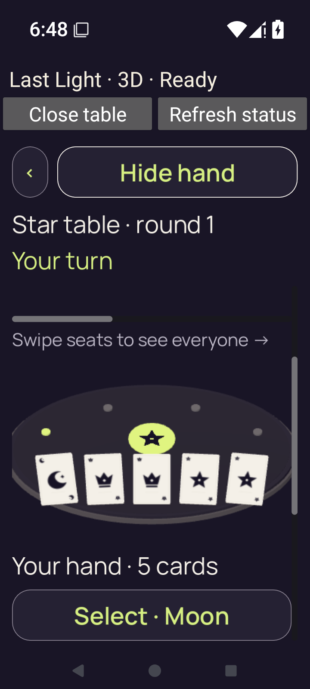</a> | **Native 3D hand revealed through actual touch — 2× text** Android API 35 emulator, actual native 3D comparison host, debug APK Original: [02-revealed.png](3d-font-2.0-debug/3d/match/02-revealed.png) 720 × 1600 px; text 2× SHA-256: <code>707179ee66ac627c0bdc1c9b31b977041346135af8c90262c9c17a7f4185af69</code> [Original UI dump](3d-font-2.0-debug/3d/match/02-revealed.xml) [Original measurements](3d-font-2.0-debug/3d/match/02-revealed.json) [Original result](3d-font-2.0-debug/result.json) Show/Hide and Star table, round and actor remain pinned. Some cards or rank actions lie outside the current scroll viewport; no simultaneous full-hand visibility claim. The whole 3D case remains failed at its final native Back route despite the earlier completed match and scene Exit. |
| <a href="3d-font-2.0-debug/3d/match/03-selected.png">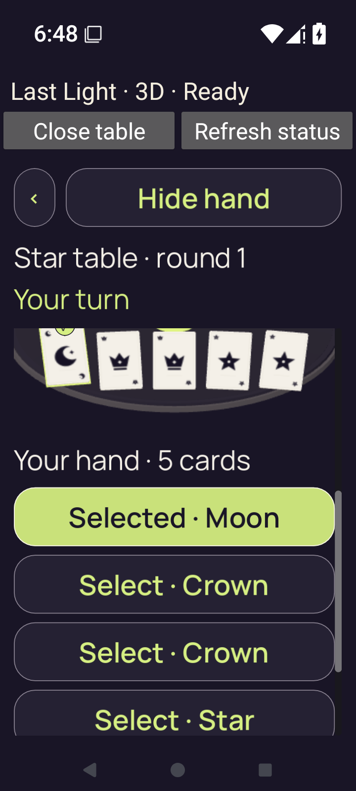</a> | **Native 3D Moon selected for a one-Star claim — 2× text** Android API 35 emulator, actual native 3D comparison host, debug APK Original: [03-selected.png](3d-font-2.0-debug/3d/match/03-selected.png) 720 × 1600 px; text 2× SHA-256: <code>1ef9986706f0709987e3f6c637091a5f37c2917ea62457e9f309c9cb12be9c96</code> [Original UI dump](3d-font-2.0-debug/3d/match/03-selected.xml) [Original measurements](3d-font-2.0-debug/3d/match/03-selected.json) [Original result](3d-font-2.0-debug/result.json) Show/Hide and Star table, round and actor remain pinned. Some cards or rank actions lie outside the current scroll viewport; no simultaneous full-hand visibility claim. The whole 3D case remains failed at its final native Back route despite the earlier completed match and scene Exit. |
| <a href="3d-font-2.0-debug/3d/match/04-covered.png">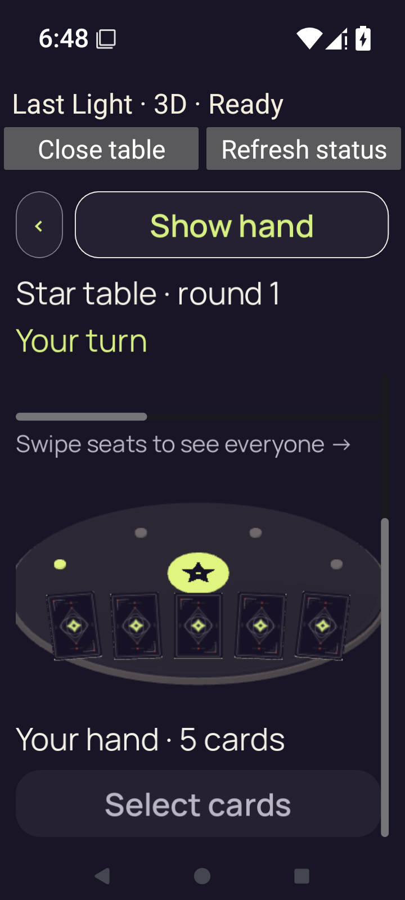</a> | **Native 3D hand covered and selection cleared — 2× text** Android API 35 emulator, actual native 3D comparison host, debug APK Original: [04-covered.png](3d-font-2.0-debug/3d/match/04-covered.png) 720 × 1600 px; text 2× SHA-256: <code>03464ca18f457f4f153f6614e9c09f436865159bfc04d0b897f4236aa80a6a3b</code> [Original UI dump](3d-font-2.0-debug/3d/match/04-covered.xml) [Original measurements](3d-font-2.0-debug/3d/match/04-covered.json) [Original result](3d-font-2.0-debug/result.json) Paired diagnostics record zero private faces, rank labels and selection. Show/Hide and Star table, round and actor remain pinned. Some cards or rank actions lie outside the current scroll viewport; no simultaneous full-hand visibility claim. The whole 3D case remains failed at its final native Back route despite the earlier completed match and scene Exit. |
| <a href="3d-font-2.0-debug/3d/match/05-background-home.png">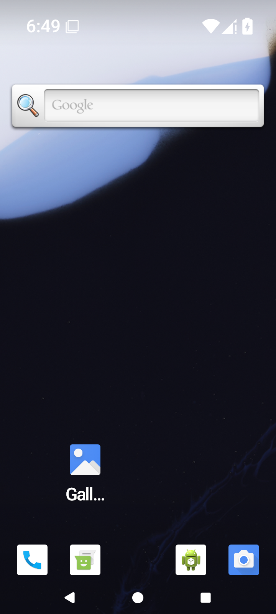</a> | **Android Home during the revealed match lifecycle — 2× text** Android API 35 emulator, actual native 3D comparison host, debug APK Original: [05-background-home.png](3d-font-2.0-debug/3d/match/05-background-home.png) 720 × 1600 px; text 2× SHA-256: <code>b55130ce80d07cec7e557ddfab4a2f6c0b79c95e42f7eeb0ad689437a4eefdc7</code> [Original UI dump](3d-font-2.0-debug/3d/match/05-background-home.xml) [Original result](3d-font-2.0-debug/result.json) This Home original belongs to the exercised reveal/select/background sequence, after app installation. No private game face or label is visible. The whole 3D case remains failed at its final native Back route despite the earlier completed match and scene Exit. |
| <a href="3d-font-2.0-debug/3d/match/06-recents-privacy.png">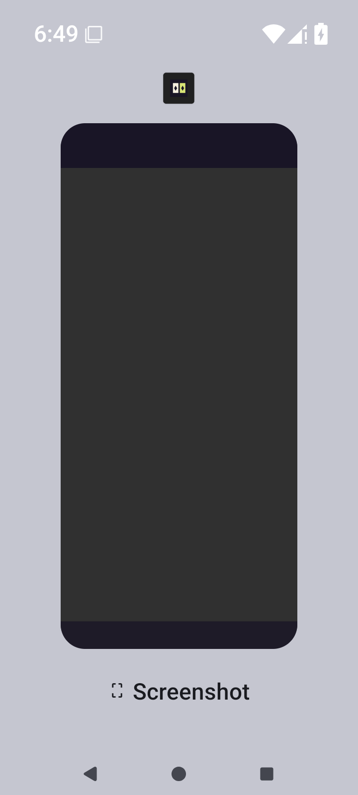</a> | **Android Recents with opaque task preview — 2× text** Android API 35 emulator, actual native 3D comparison host, debug APK Original: [06-recents-privacy.png](3d-font-2.0-debug/3d/match/06-recents-privacy.png) 720 × 1600 px; text 2× SHA-256: <code>fde11ab1d0f4a0e861b90fc0961812d673f53355a800f1f924ff297e3819ad26</code> [Original UI dump](3d-font-2.0-debug/3d/match/06-recents-privacy.xml) [Original result](3d-font-2.0-debug/result.json) The opaque gray task preview contains no private faces, labels or selected state. The retained capture policy is recents_disabled; the following same-process concealed resume completes. The whole 3D case remains failed at its final native Back route despite the earlier completed match and scene Exit. |
|  | **Same native presentation resumes concealed — 2× text** Android API 35 emulator, actual native 3D comparison host, debug APK Original: [07-resumed-concealed.png](3d-font-2.0-debug/3d/match/07-resumed-concealed.png) 720 × 1600 px; text 2× SHA-256: <code>84dcba3e3d01f7be38ed841cec37bedfa0cfa50b7ca14bf4888c5fbfdcfa51aa</code> [Original UI dump](3d-font-2.0-debug/3d/match/07-resumed-concealed.xml) [Original measurements](3d-font-2.0-debug/3d/match/07-resumed-concealed.json) [Original result](3d-font-2.0-debug/result.json) Paired diagnostics record zero private faces, rank labels and selection. The same engine PID and presentation resume. The native Home/Recents/resume sequence completes in this match entry. Show/Hide and Star table, round and actor remain pinned. Some cards or rank actions lie outside the current scroll viewport; no simultaneous full-hand visibility claim. The whole 3D case remains failed at its final native Back route despite the earlier completed match and scene Exit. |
|  | **Round-1 result after Moxie catches Ari’s Star bluff — 2× text** Android API 35 emulator, actual native 3D comparison host, debug APK Original: [08-after-play.png](3d-font-2.0-debug/3d/match/08-after-play.png) 720 × 1600 px; text 2× SHA-256: <code>a3356fbe9945c72fa9c133f122f4bdf2b1907b3a430a6d7752967b9e482901da</code> [Original UI dump](3d-font-2.0-debug/3d/match/08-after-play.xml) [Original measurements](3d-font-2.0-debug/3d/match/08-after-play.json) [Original result](3d-font-2.0-debug/result.json) Moxie challenges Ari’s Star claim; the public Moon catches the bluff. Ari uses light 1 and stays in. Matching stage pixels remain separate captures. The next/return action lies partly or entirely below this capture viewport. Later retained input geometry and authority progression establish that the action is reached and accepted. The whole 3D case remains failed at its final native Back route despite the earlier completed match and scene Exit. |
| <a href="3d-font-2.0-debug/3d/match/09-public-outcome.png">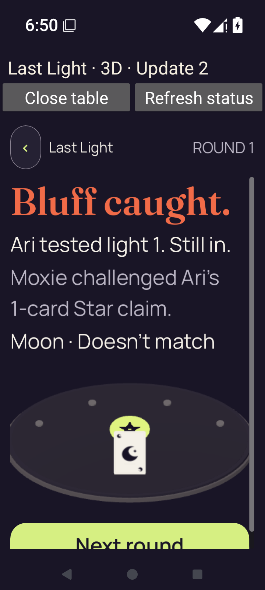</a> | **Separate original of the public round-1 outcome — 2× text** Android API 35 emulator, actual native 3D comparison host, debug APK Original: [09-public-outcome.png](3d-font-2.0-debug/3d/match/09-public-outcome.png) 720 × 1600 px; text 2× SHA-256: <code>a3356fbe9945c72fa9c133f122f4bdf2b1907b3a430a6d7752967b9e482901da</code> [Original UI dump](3d-font-2.0-debug/3d/match/09-public-outcome.xml) [Original measurements](3d-font-2.0-debug/3d/match/09-public-outcome.json) [Original result](3d-font-2.0-debug/result.json) Moxie challenges Ari’s Star claim; the public Moon catches the bluff. Ari uses light 1 and stays in. Matching stage pixels remain separate captures. The next/return action lies partly or entirely below this capture viewport. Later retained input geometry and authority progression establish that the action is reached and accepted. The whole 3D case remains failed at its final native Back route despite the earlier completed match and scene Exit. |
| <a href="3d-font-2.0-debug/3d/match/10-next-round.png">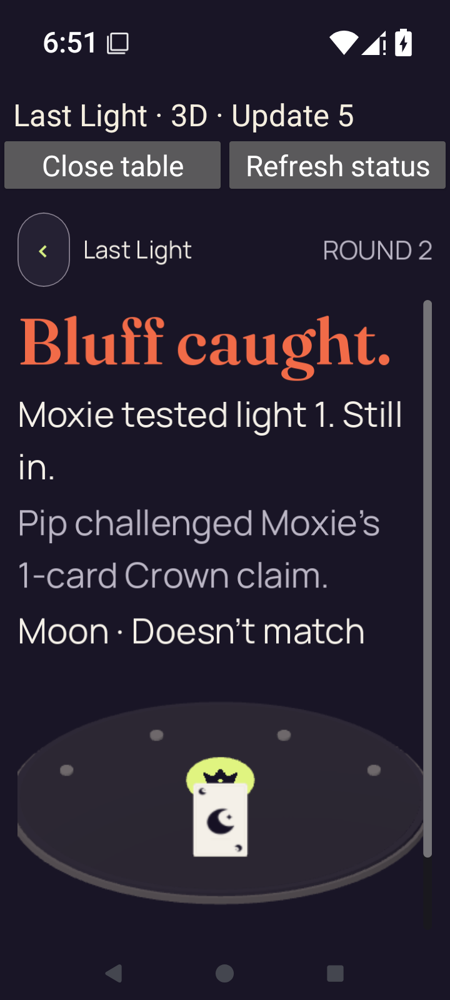</a> | **Round-2 result after the accepted first advance — 2× text** Android API 35 emulator, actual native 3D comparison host, debug APK Original: [10-next-round.png](3d-font-2.0-debug/3d/match/10-next-round.png) 720 × 1600 px; text 2× SHA-256: <code>c8d914a7970e251e580baac0264120ca5b555167dba9a4283938c49ca4a025fb</code> [Original UI dump](3d-font-2.0-debug/3d/match/10-next-round.xml) [Original measurements](3d-font-2.0-debug/3d/match/10-next-round.json) [Original result](3d-font-2.0-debug/result.json) Autonomous turns have settled round 2 after the accepted advance: Pip catches Moxie’s Crown claim with Moon; Moxie uses light 1 and stays in. The next/return action lies partly or entirely below this capture viewport. Later retained input geometry and authority progression establish that the action is reached and accepted. The whole 3D case remains failed at its final native Back route despite the earlier completed match and scene Exit. |
| <a href="3d-font-2.0-debug/3d/match/11-after-challenge.png">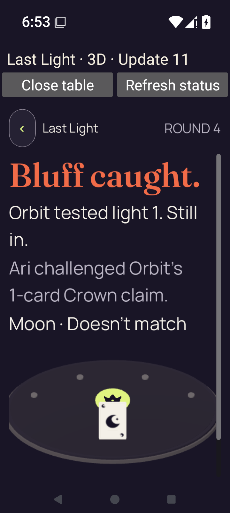</a> | **Round-4 result after Ari challenges Orbit — 2× text** Android API 35 emulator, actual native 3D comparison host, debug APK Original: [11-after-challenge.png](3d-font-2.0-debug/3d/match/11-after-challenge.png) 720 × 1600 px; text 2× SHA-256: <code>d98698275bc9ee737d9b5ba06f898a6ea7c2c93fd52f36db904621c15e23337a</code> [Original UI dump](3d-font-2.0-debug/3d/match/11-after-challenge.xml) [Original measurements](3d-font-2.0-debug/3d/match/11-after-challenge.json) [Original result](3d-font-2.0-debug/result.json) Authority round 4/revision 11: Ari catches Orbit’s Crown claim with Moon. Orbit uses light 1 and stays in. The next/return action lies partly or entirely below this capture viewport. Later retained input geometry and authority progression establish that the action is reached and accepted. The whole 3D case remains failed at its final native Back route despite the earlier completed match and scene Exit. |
| <a href="3d-font-2.0-debug/3d/match/12-winner.png">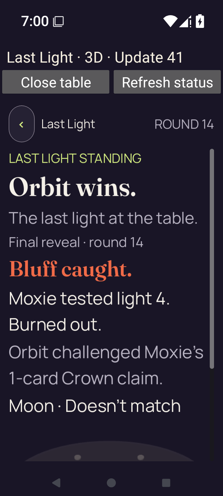</a> | **Round-14 winner: Orbit wins after Moxie burns out — 2× text** Android API 35 emulator, actual native 3D comparison host, debug APK Original: [12-winner.png](3d-font-2.0-debug/3d/match/12-winner.png) 720 × 1600 px; text 2× SHA-256: <code>ed0778f1951caa5fdc5ae3c2e69efdf2e759e192304525125506a26cb58e664a</code> [Original UI dump](3d-font-2.0-debug/3d/match/12-winner.xml) [Original measurements](3d-font-2.0-debug/3d/match/12-winner.json) [Original result](3d-font-2.0-debug/result.json) Authority round 14/revision 41: Orbit catches Moxie’s Crown claim with Moon; Moxie uses light 4 and burns out. The next/return action lies partly or entirely below this capture viewport. Later retained input geometry and authority progression establish that the action is reached and accepted. The whole 3D case remains failed at its final native Back route despite the earlier completed match and scene Exit. |
| <a href="3d-font-2.0-debug/3d/match/14-chooser-after-exit.png">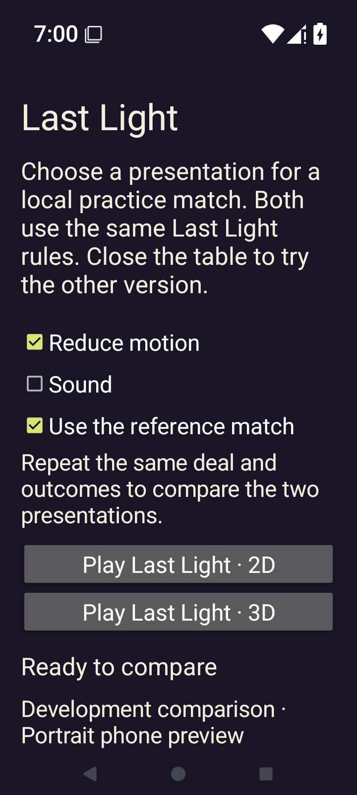</a> | **Chooser restored after match — 2× text** Android API 35 emulator, actual native 3D comparison host, debug APK Original: [14-chooser-after-exit.png](3d-font-2.0-debug/3d/match/14-chooser-after-exit.png) 720 × 1600 px; text 2× SHA-256: <code>66429febbbdd8c0338428484d86afeb038f33c53de86611d62ce3a1a93834cc1</code> [Original receipt](3d-font-2.0-debug/3d/match/teardown.json) [Original UI dump](3d-font-2.0-debug/3d/match/14-chooser-after-exit.xml) [Original result](3d-font-2.0-debug/result.json) The original teardown receipt records native destruction, actual old/engine-process absence, enabled launch buttons and the surviving chooser. Each entry retains a distinct capture record. Open source notices is below the initial chooser viewport at 200% text. The whole 3D case remains failed at its final native Back route despite the earlier completed match and scene Exit. |
|  | **Fresh 3D presentation before native-exit — 2× text** Android API 35 emulator, actual native 3D comparison host, debug APK Original: [01-fresh-concealed.png](3d-font-2.0-debug/3d/native-exit/01-fresh-concealed.png) 720 × 1600 px; text 2× SHA-256: <code>ee4e8084fc507dd4a67360a1e6caac039e6a0dc49fc61838cf0216d2c83dc2b2</code> [Original UI dump](3d-font-2.0-debug/3d/native-exit/01-fresh-concealed.xml) [Original measurements](3d-font-2.0-debug/3d/native-exit/01-fresh-concealed.json) [Original result](3d-font-2.0-debug/result.json) A separate fresh engine PID and presentation start round 1 with five concealed cards after the preceding entry was destroyed. This entry later fails the requested native Back route; there is no success-specific chooser capture or teardown receipt for it. Show/Hide and Star table, round and actor remain pinned. Some cards or rank actions lie outside the current scroll viewport; no simultaneous full-hand visibility claim. The whole 3D case remains failed at its final native Back route despite the earlier completed match and scene Exit. |
|  | **Fresh 3D presentation before scene-exit — 2× text** Android API 35 emulator, actual native 3D comparison host, debug APK Original: [01-fresh-concealed.png](3d-font-2.0-debug/3d/scene-exit/01-fresh-concealed.png) 720 × 1600 px; text 2× SHA-256: <code>1aeb551ca17f44ee31a1e668ff4b4a4b975d6b46dd7cd87c4f5046eb189b04ff</code> [Original UI dump](3d-font-2.0-debug/3d/scene-exit/01-fresh-concealed.xml) [Original measurements](3d-font-2.0-debug/3d/scene-exit/01-fresh-concealed.json) [Original result](3d-font-2.0-debug/result.json) A separate fresh engine PID and presentation start round 1 with five concealed cards after the preceding entry was destroyed. Show/Hide and Star table, round and actor remain pinned. Some cards or rank actions lie outside the current scroll viewport; no simultaneous full-hand visibility claim. The whole 3D case remains failed at its final native Back route despite the earlier completed match and scene Exit. |
|  | **Chooser restored after scene-exit — 2× text** Android API 35 emulator, actual native 3D comparison host, debug APK Original: [14-chooser-after-exit.png](3d-font-2.0-debug/3d/scene-exit/14-chooser-after-exit.png) 720 × 1600 px; text 2× SHA-256: <code>bf8026a15d6dfdad34629ec836bd270bf75c9ad37996c05b6eb754e659b11919</code> [Original receipt](3d-font-2.0-debug/3d/scene-exit/teardown.json) [Original UI dump](3d-font-2.0-debug/3d/scene-exit/14-chooser-after-exit.xml) [Original result](3d-font-2.0-debug/result.json) The original teardown receipt records native destruction, actual old/engine-process absence, enabled launch buttons and the surviving chooser. Each entry retains a distinct capture record. Open source notices is below the initial chooser viewport at 200% text. The whole 3D case remains failed at its final native Back route despite the earlier completed match and scene Exit. |
|  | **Native chooser before 3D launch — 2× text** Android API 35 emulator, actual native 3D comparison host, debug APK Original: [chooser.png](3d-font-2.0-debug/chooser.png) 720 × 1600 px; text 2× SHA-256: <code>a65780176a8a06ce7e01b276366a089b5759a6dfd7de679631febb995f875410</code> [Original UI dump](3d-font-2.0-debug/chooser.xml) [Original result](3d-font-2.0-debug/result.json) Both launch options are visible. Reduced motion and the seed-2 reference match are enabled; sound is disabled. Open source notices is below the initial chooser viewport at 200% text. The whole 3D case remains failed at its final native Back route despite the earlier completed match and scene Exit. |
|  | **Final chooser after the failed 3D native Back route — 2× text** Android API 35 emulator, actual native 3D comparison host, debug APK Original: [final-screen.png](3d-font-2.0-debug/final-screen.png) 720 × 1600 px; text 2× SHA-256: <code>366613d0845dca1d4cd9d1b3870f0e407645f09bf733f7aa6f0ee2d99a237839</code> [Original UI dump](3d-font-2.0-debug/last-ui.xml) [Original result](3d-font-2.0-debug/result.json) Native Back was requested, but the host reports renderer_exit and one additional renderer exit event. Actual child death and restored chooser are recorded; the requested Back route remains failed. Open source notices is below the initial chooser viewport at 200% text. The whole 3D case remains failed at its final native Back route despite the earlier completed match and scene Exit. |
