# Godot Android — both 2D cases pass, both 3D Close acknowledgments fail

[All screenshot collections](../README.md) · [CI run 34456443339](https://github.com/Apdelrahman1911/PartyDeck/actions/runs/34456443339) · [Companion desktop originals](../godot-desktop-34456443339/README.md)

**Evidence status:** Both 2D cases pass their complete scripts. Both 3D cases finish the match and accept the lobby intent, then fail the required Close acknowledgment during match return. All four matches and Home/Recents/same-process concealed resumes complete. This collection preserves **66 runtime originals**. The frozen 70-image native inventory also includes four pre-install Launcher PNGs excluded under the gallery's preparation-image policy. Four input-target crops are derivatives of already-counted originals and remain outside the gallery.

| Case | Original runtime PNGs | Complete case result | Entries / completed requested exits |
| --- | ---: | --- | ---: |
| 2D / 100% | 19 | Pass: full match, match return, fresh scene Exit and fresh native Close | 3 / 3 |
| 2D / 200% | 19 | Pass: the same full script at enlarged text | 3 / 3 |
| 3D / 100% | 14 | Fail at match return: missing `closeSignalAcknowledged`; fresh scene Exit and native Back never attempted | 1 / 0 |
| 3D / 200% | 14 | Fail at match return: the same missing acknowledgment; fresh scene Exit and native Back never attempted | 1 / 0 |

Exact clean CI revision `dad1c11741bd4322bb8b2afb9f18f3db5f50c919`. API 35 x86_64 debug emulator, 720 × 1600 pixels, 280 dpi / density 1.75, reduced motion enabled, sound disabled and seed 2. APK SHA-256: `e1b9126c6d91996b2cdf3877d7a9150199b75276aea8c2028bda72787c9311c3`. PCK SHA-256: `8f24944d61b0430cfec4a32bb1d03d2c7da9f55918264e9cfcded1c675d21539`; 1,546,376 bytes. All three package identities and their embedded pack, all 136 PCK members, and 145 requested source files against the immutable source tarball were independently checked. Binaries and the source tarball stay outside the gallery; identities remain in the [pack receipt](provenance/partydeck-last-light.receipt.json), [source archive receipt](provenance/source-archive.json) and [frozen audit](provenance/audit-frozen.json).

All four matches reach **round 14 / revision 41** with Orbit's win, two viewer plays, two challenges and thirteen advances. Original host transitions agree; each later `return_to_lobby` takes accepted intents from 17 to 18. Normal result/winner frames show the public Moon, named challenge, light/burnout explanation and complete next/return controls. At 200%, some hand and next/return actions continue below the captured viewport; the 2D explanation also continues below. Retained geometry, scrolling and accepted inputs establish reachability.

**Both 3D cases remain failed.** The [100% result](3d-font-1.0-debug/result.json) and [200% result](3d-font-2.0-debug/result.json) record stage `3d return_to_chooser native teardown` and error `Missing actual native teardown marker: closeSignalAcknowledged`. Each final host records `closeReason=return_to_chooser`, **`closeSignalAcknowledged=false`**, `acceptedIntents=receivedIntents="18"` and `receivedEvents="19"` at revision 41. Each accepted lobby intent is followed by native destruction, actual OS child death and chooser restoration. The [100% failure observations](3d-font-1.0-debug/3d/match/failure-host-observations.log) and [200% failure observations](3d-font-2.0-debug/3d/match/failure-host-observations.log) each contain two observations with empty engine PID lists. These preserve the missing acknowledgment failure. Neither case has a successful `teardown.json` or `14-chooser-after-exit.png`; **neither attempts fresh scene Exit or native Back**. The root [100% final-screen](3d-font-1.0-debug/final-screen.png) and [200% final-screen](3d-font-2.0-debug/final-screen.png) show the chooser after failure. All **28** 3D image records retain the failed whole-case result. No native Back route executes in this run.

**Close delivery is recorded separately from the main callback.** All six completed 2D exits log requested → dispatch started → native barrier → main callback. Both 3D exits log requested → fallback only, with no recorded dispatch, native barrier or main callback. The source configures a **250 ms fallback**; recorded elapsed deltas are 250 ms at 100% and 251 ms at 200%. **The scheduling cause is not established.** The [source/Close correlation](provenance/source-close-barrier-correlation.json), unchanged logs and [gallery audit](review/partydeck-gallery-1460-source-audit.json) retain each timestamp and source identity.

The exact [host](source/godot/android-host/src/main/kotlin/dev/partydeck/godot/compare/GodotGameActivity.kt), [bridge plugin](source/godot/android-renderer/src/main/kotlin/dev/partydeck/godot/android/PartyDeckBridgePlugin.kt), [native signal barrier](source/godot/android-renderer/src/main/kotlin/dev/partydeck/godot/android/NativeSignalDispatch.kt) and [barrier test source](source/godot/android-renderer/src/test/kotlin/dev/partydeck/godot/android/NativeSignalDispatchTest.kt) are byte-matched to the source archive. The retained [original barrier JUnit report](build-evidence/modules/androidRenderer/test-results/testDebugUnitTest/TEST-dev.partydeck.godot.android.NativeSignalDispatchTest.xml) contains eight passing actual test cases. That suite does not qualify the failed native cases. The checker, workflow, emulator script and bounded queue remain byte-identical to their previously archived source copies.

There are **eight process entries and six completed requested exit routes**. Passing routes retain dedicated teardown receipts, enabled chooser controls, destruction logs and actual process-death evidence. All eight engine children die, including both failed 3D entries. No separate raw shell process-list attachment is present; absence is supported by executed receipts, [exact checker source](source/godot/android-checks/run.py), OS `am_proc_died` events, destruction logs and subsequent fresh PIDs. All **eight** process logs retain the EGL `removeVertexArrayObject` **ERROR**. Six logs retain **six shader-cache warning pairs at error priority**.

The pack retains the [compact initial Reveal correction](../godot-2d-initial-reveal-20260910/README.md). The exact [2D table source](source/godot/renderer/presentations/two_d/table.gd) has SHA-256 `8d8650c8b6b6c5c5052b798e540d0b618dc2d916d7fdda0c95011eac6412f993`. **All three fresh native 2D entries at each scale show complete initial Reveal and concealed-panel borders.** The separate source probe's numeric margin is not transferred to these native frames. Normal 2D scrolling partly hides the large Star heading while pinned turn/claim context remains; hands scroll horizontally. At 3D/200%, Show/Hide and Star table/round/turn stay pinned while roster, hand and result content scroll. Final choosers show both launch options; notices are below the initial 200% viewport. The 3D final choosers remain post-failure observations.

All four Home/Recents paths execute after reveal and selection. Home images and opaque Recents previews contain no private faces or labels. Original host records show native cover and `recents_disabled`; same-process resumes clear private faces, rank labels and selection. These are exercised app lifecycle captures, distinct from the four excluded preparation screenshots.

The independent archive audit verifies **44 scene RGB crop hashes**, paired host JSONs, **151 scene-input geometries** and **345 native input records**. **66 native originals visually reviewed in 24 internal sheets; 22 desktop originals byte-matched to previously reviewed originals.** The [original review](provenance/original-visual-review.json) preserves its independent inspection of 24 named originals unchanged; the [later gallery visual review](review/partydeck-gallery-1460-visual-review.json) covers all 66 native originals. [Gallery audit](review/partydeck-gallery-1460-source-audit.json) · [Audit script](review/partydeck-gallery-1460-source-audit.py) · [Original inventory](provenance/original-image-inventory.json).

The four [input-target crop receipts](provenance/input-target-crop-receipt.json) and [original crop review](provenance/input-target-crop-visual-review.json) are retained unchanged. Their derived PNGs remain outside the gallery. Each crop comes from an already-counted `02-revealed.png`; its frame precedes the associated input by one diagnostic refresh, with matching target geometry and state. These are **not separate per-input screenshots**. The first [local helper attempt](provenance/input-crop-derivation.log) failed importing optional Pillow before output; the [second helper](provenance/input-crop-derivation-02.log) completed using standard-library PNG encoding. These are local review attempts, not CI/native failures.

The frozen [producer receipt](provenance/producer-evidence-summary.json), [completed workflow status](provenance/last-run-status.json) and [later evidence summary](provenance/evidence-summary.json) all record **failure**. The producer conclusion is preserved unchanged. This run has no collector-interruption receipt.

Original runtime JSON/XML/logs, package-input receipts, build/check reports, job logs, immutable source copies and frozen reviewer evidence are retained. This gallery review executed no new application runs, builds, runtime tests or Git commands. This API 35 debug comparison does not qualify the full native matrix, optimized runtime behavior, production KMP factories, screen-reader traversal, audio dormancy or physical-device acceptance.

Source: `/tmp/partydeck-engine-ci/34456443339`. Every thumbnail displays and opens its unchanged original PNG.

## 2D — 100% text

[Original result](2d-font-1.0-debug/result.json) · [Package inputs](2d-font-1.0-debug/package-inputs.json) · [Native input records](2d-font-1.0-debug/input-geometry.log) · [OS events](2d-font-1.0-debug/events.log)

| Original image | Scenario and provenance |
| --- | --- |
|  | **Native 2D reference match begins concealed — 1× text** Android API 35 emulator, actual native 2D comparison host, debug APK Original: [01-concealed.png](2d-font-1.0-debug/2d/match/01-concealed.png) 720 × 1600 px; text 1× SHA-256: <code>9c15c1b559307ce8ef31d7e3ed8115380b8fe4eea38f6800015096df352f369d</code> [Original UI dump](2d-font-1.0-debug/2d/match/01-concealed.xml) [Original measurements](2d-font-1.0-debug/2d/match/01-concealed.json) [Original result](2d-font-1.0-debug/result.json) The complete initial Reveal action and concealed-panel borders are visible. This exact pack includes the guarded decorative-height correction; the prior native initial clipping claim does not apply. |
| <a href="2d-font-1.0-debug/2d/match/02-revealed.png">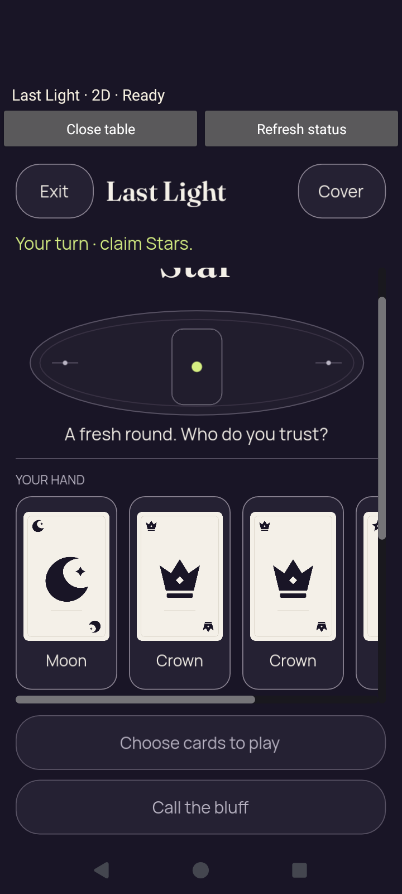</a> | **Native 2D hand revealed through actual touch — 1× text** Android API 35 emulator, actual native 2D comparison host, debug APK Original: [02-revealed.png](2d-font-1.0-debug/2d/match/02-revealed.png) 720 × 1600 px; text 1× SHA-256: <code>a2c886ec63149594df537b0d767fdf17f71347ab557abcaece1a6310fa1fc0ad</code> [Original UI dump](2d-font-1.0-debug/2d/match/02-revealed.xml) [Original measurements](2d-font-1.0-debug/2d/match/02-revealed.json) [Original result](2d-font-1.0-debug/result.json) The hand uses horizontal scrolling, so not every card is visible together. The scrolled large Star heading is partly above the clip; the pinned Your turn / claim Stars context remains visible. |
| <a href="2d-font-1.0-debug/2d/match/03-selected.png">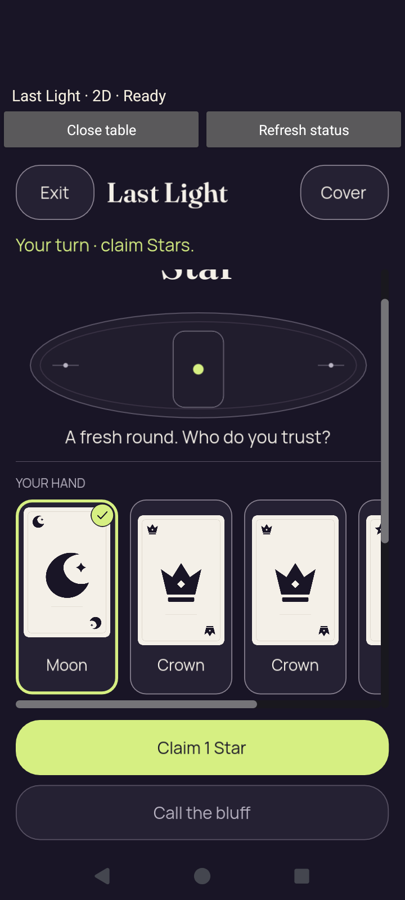</a> | **Native 2D Moon selected for a one-Star claim — 1× text** Android API 35 emulator, actual native 2D comparison host, debug APK Original: [03-selected.png](2d-font-1.0-debug/2d/match/03-selected.png) 720 × 1600 px; text 1× SHA-256: <code>02e04d9ac7635bd364ce0bec1d0c34a4fa2819b17a2dcec03fd6bdfabfce94fd</code> [Original UI dump](2d-font-1.0-debug/2d/match/03-selected.xml) [Original measurements](2d-font-1.0-debug/2d/match/03-selected.json) [Original result](2d-font-1.0-debug/result.json) The hand uses horizontal scrolling, so not every card is visible together. The scrolled large Star heading is partly above the clip; the pinned Your turn / claim Stars context remains visible. |
| <a href="2d-font-1.0-debug/2d/match/04-covered.png">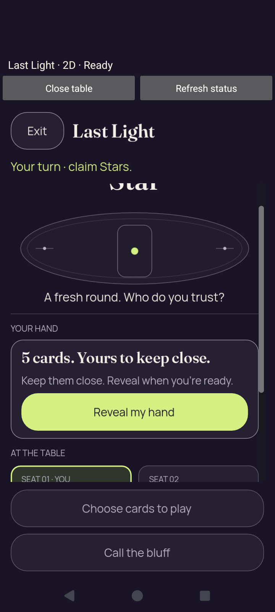</a> | **Native 2D hand covered and selection cleared — 1× text** Android API 35 emulator, actual native 2D comparison host, debug APK Original: [04-covered.png](2d-font-1.0-debug/2d/match/04-covered.png) 720 × 1600 px; text 1× SHA-256: <code>62fb75400de40fb0bf7184019682edad224b59fa4f8214859bd9c61041ac22e6</code> [Original UI dump](2d-font-1.0-debug/2d/match/04-covered.xml) [Original measurements](2d-font-1.0-debug/2d/match/04-covered.json) [Original result](2d-font-1.0-debug/result.json) The scrolled large Star heading is partly above the clip; the pinned Your turn / claim Stars context remains visible. Paired diagnostics and inspected pixels show concealed cards with zero private faces, rank labels and selection. |
|  | **Android Home during the revealed match lifecycle — 1× text** Android API 35 emulator, actual native 2D comparison host, debug APK Original: [05-background-home.png](2d-font-1.0-debug/2d/match/05-background-home.png) 720 × 1600 px; text 1× SHA-256: <code>5c310a5cc252feca19c8c8183330d1d154d093ba80e701c9b9696982568eb576</code> [Original UI dump](2d-font-1.0-debug/2d/match/05-background-home.xml) [Original result](2d-font-1.0-debug/result.json) This Home original belongs to the exercised reveal/select/background sequence, after app installation. No private game face or label is visible. |
|  | **Android Recents with opaque task preview — 1× text** Android API 35 emulator, actual native 2D comparison host, debug APK Original: [06-recents-privacy.png](2d-font-1.0-debug/2d/match/06-recents-privacy.png) 720 × 1600 px; text 1× SHA-256: <code>fa26e159dc1b7dffe2e8b174b8c4148a69735bd739ee68a02279c6e5138d3d47</code> [Original UI dump](2d-font-1.0-debug/2d/match/06-recents-privacy.xml) [Original result](2d-font-1.0-debug/result.json) The opaque gray task preview contains no private faces, labels or selected state. The retained capture policy is recents_disabled; the following same-process concealed resume completes. |
|  | **Same native presentation resumes concealed — 1× text** Android API 35 emulator, actual native 2D comparison host, debug APK Original: [07-resumed-concealed.png](2d-font-1.0-debug/2d/match/07-resumed-concealed.png) 720 × 1600 px; text 1× SHA-256: <code>62fb75400de40fb0bf7184019682edad224b59fa4f8214859bd9c61041ac22e6</code> [Original UI dump](2d-font-1.0-debug/2d/match/07-resumed-concealed.xml) [Original measurements](2d-font-1.0-debug/2d/match/07-resumed-concealed.json) [Original result](2d-font-1.0-debug/result.json) The scrolled large Star heading is partly above the clip; the pinned Your turn / claim Stars context remains visible. Paired diagnostics and inspected pixels show concealed cards with zero private faces, rank labels and selection. The same engine PID and presentation resume. The native Home/Recents/resume sequence completes in this match entry. |
|  | **Round-1 result after Moxie catches Ari’s Star bluff — 1× text** Android API 35 emulator, actual native 2D comparison host, debug APK Original: [08-after-play.png](2d-font-1.0-debug/2d/match/08-after-play.png) 720 × 1600 px; text 1× SHA-256: <code>a6c656b104f4c6fab8277a540aff606c3e28fdb7efb7007c49b22dd8e2b3b706</code> [Original UI dump](2d-font-1.0-debug/2d/match/08-after-play.xml) [Original measurements](2d-font-1.0-debug/2d/match/08-after-play.json) [Original result](2d-font-1.0-debug/result.json) Moxie challenges Ari’s Star claim; the public Moon catches the bluff. Ari uses light 1 and stays in. Matching stage pixels remain separate captures. The public Moon, named challenge, light/burnout explanation and next/return action are visible. |
|  | **Separate original of the public round-1 outcome — 1× text** Android API 35 emulator, actual native 2D comparison host, debug APK Original: [09-public-outcome.png](2d-font-1.0-debug/2d/match/09-public-outcome.png) 720 × 1600 px; text 1× SHA-256: <code>a6c656b104f4c6fab8277a540aff606c3e28fdb7efb7007c49b22dd8e2b3b706</code> [Original UI dump](2d-font-1.0-debug/2d/match/09-public-outcome.xml) [Original measurements](2d-font-1.0-debug/2d/match/09-public-outcome.json) [Original result](2d-font-1.0-debug/result.json) Moxie challenges Ari’s Star claim; the public Moon catches the bluff. Ari uses light 1 and stays in. Matching stage pixels remain separate captures. The public Moon, named challenge, light/burnout explanation and next/return action are visible. |
|  | **Round-2 result after the accepted first advance — 1× text** Android API 35 emulator, actual native 2D comparison host, debug APK Original: [10-next-round.png](2d-font-1.0-debug/2d/match/10-next-round.png) 720 × 1600 px; text 1× SHA-256: <code>03a7db1235529cd56a39d5acc3bb8fcb246d67caa6e2ed026b750b958a9cb17d</code> [Original UI dump](2d-font-1.0-debug/2d/match/10-next-round.xml) [Original measurements](2d-font-1.0-debug/2d/match/10-next-round.json) [Original result](2d-font-1.0-debug/result.json) Autonomous turns have settled round 2 after the accepted advance: Pip catches Moxie’s Crown claim with Moon; Moxie uses light 1 and stays in. The public Moon, named challenge, light/burnout explanation and next/return action are visible. |
|  | **Round-4 result after Ari challenges Orbit — 1× text** Android API 35 emulator, actual native 2D comparison host, debug APK Original: [11-after-challenge.png](2d-font-1.0-debug/2d/match/11-after-challenge.png) 720 × 1600 px; text 1× SHA-256: <code>37a96b415688cbdb8d9c1028fa9bb96cd386e51ecb584dd9d5f7eb0147e374e9</code> [Original UI dump](2d-font-1.0-debug/2d/match/11-after-challenge.xml) [Original measurements](2d-font-1.0-debug/2d/match/11-after-challenge.json) [Original result](2d-font-1.0-debug/result.json) Authority round 4/revision 11: Ari catches Orbit’s Crown claim with Moon. Orbit uses light 1 and stays in. The public Moon, named challenge, light/burnout explanation and next/return action are visible. |
|  | **Round-14 winner: Orbit wins after Moxie burns out — 1× text** Android API 35 emulator, actual native 2D comparison host, debug APK Original: [12-winner.png](2d-font-1.0-debug/2d/match/12-winner.png) 720 × 1600 px; text 1× SHA-256: <code>e74cbb701eb5150fdbb59b4f6bfca6434ada79fcb0c912432413159180faa867</code> [Original UI dump](2d-font-1.0-debug/2d/match/12-winner.xml) [Original measurements](2d-font-1.0-debug/2d/match/12-winner.json) [Original result](2d-font-1.0-debug/result.json) Authority round 14/revision 41: Orbit catches Moxie’s Crown claim with Moon; Moxie uses light 4 and burns out. The complete Return to lobby action is visible and the later lobby intent is accepted. The public Moon, named challenge, light/burnout explanation and next/return action are visible. |
| <a href="2d-font-1.0-debug/2d/match/14-chooser-after-exit.png">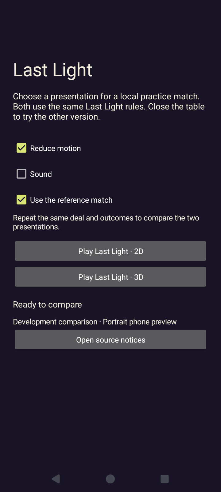</a> | **Chooser restored after match return — 1× text** Android API 35 emulator, actual native 2D comparison host, debug APK Original: [14-chooser-after-exit.png](2d-font-1.0-debug/2d/match/14-chooser-after-exit.png) 720 × 1600 px; text 1× SHA-256: <code>243a2b9d3883ffb77eabe7bbbfe11a381a075f5a1a7c1a5e2307929003879f45</code> [Original receipt](2d-font-1.0-debug/2d/match/teardown.json) [Original UI dump](2d-font-1.0-debug/2d/match/14-chooser-after-exit.xml) [Original result](2d-font-1.0-debug/result.json) The original teardown receipt records acknowledged close, native destruction, actual old/engine-process absence, enabled launch buttons and the surviving chooser. Each entry retains a distinct capture record. Both launch options and the complete Open source notices action are visible. |
|  | **Fresh 2D presentation before native Close — 1× text** Android API 35 emulator, actual native 2D comparison host, debug APK Original: [01-fresh-concealed.png](2d-font-1.0-debug/2d/native-exit/01-fresh-concealed.png) 720 × 1600 px; text 1× SHA-256: <code>9c15c1b559307ce8ef31d7e3ed8115380b8fe4eea38f6800015096df352f369d</code> [Original UI dump](2d-font-1.0-debug/2d/native-exit/01-fresh-concealed.xml) [Original measurements](2d-font-1.0-debug/2d/native-exit/01-fresh-concealed.json) [Original result](2d-font-1.0-debug/result.json) A separate fresh engine PID and presentation start round 1 with five concealed cards after the preceding entry was destroyed. The complete initial Reveal action and concealed-panel borders are visible. This exact pack includes the guarded decorative-height correction; the prior native initial clipping claim does not apply. |
|  | **Chooser restored after native Close — 1× text** Android API 35 emulator, actual native 2D comparison host, debug APK Original: [14-chooser-after-exit.png](2d-font-1.0-debug/2d/native-exit/14-chooser-after-exit.png) 720 × 1600 px; text 1× SHA-256: <code>243a2b9d3883ffb77eabe7bbbfe11a381a075f5a1a7c1a5e2307929003879f45</code> [Original receipt](2d-font-1.0-debug/2d/native-exit/teardown.json) [Original UI dump](2d-font-1.0-debug/2d/native-exit/14-chooser-after-exit.xml) [Original result](2d-font-1.0-debug/result.json) The original teardown receipt records acknowledged close, native destruction, actual old/engine-process absence, enabled launch buttons and the surviving chooser. Each entry retains a distinct capture record. Both launch options and the complete Open source notices action are visible. |
|  | **Fresh 2D presentation before scene Exit — 1× text** Android API 35 emulator, actual native 2D comparison host, debug APK Original: [01-fresh-concealed.png](2d-font-1.0-debug/2d/scene-exit/01-fresh-concealed.png) 720 × 1600 px; text 1× SHA-256: <code>9c15c1b559307ce8ef31d7e3ed8115380b8fe4eea38f6800015096df352f369d</code> [Original UI dump](2d-font-1.0-debug/2d/scene-exit/01-fresh-concealed.xml) [Original measurements](2d-font-1.0-debug/2d/scene-exit/01-fresh-concealed.json) [Original result](2d-font-1.0-debug/result.json) A separate fresh engine PID and presentation start round 1 with five concealed cards after the preceding entry was destroyed. The complete initial Reveal action and concealed-panel borders are visible. This exact pack includes the guarded decorative-height correction; the prior native initial clipping claim does not apply. |
|  | **Chooser restored after scene Exit — 1× text** Android API 35 emulator, actual native 2D comparison host, debug APK Original: [14-chooser-after-exit.png](2d-font-1.0-debug/2d/scene-exit/14-chooser-after-exit.png) 720 × 1600 px; text 1× SHA-256: <code>243a2b9d3883ffb77eabe7bbbfe11a381a075f5a1a7c1a5e2307929003879f45</code> [Original receipt](2d-font-1.0-debug/2d/scene-exit/teardown.json) [Original UI dump](2d-font-1.0-debug/2d/scene-exit/14-chooser-after-exit.xml) [Original result](2d-font-1.0-debug/result.json) The original teardown receipt records acknowledged close, native destruction, actual old/engine-process absence, enabled launch buttons and the surviving chooser. Each entry retains a distinct capture record. Both launch options and the complete Open source notices action are visible. |
|  | **Native chooser before 2D launch — 1× text** Android API 35 emulator, actual native 2D comparison host, debug APK Original: [chooser.png](2d-font-1.0-debug/chooser.png) 720 × 1600 px; text 1× SHA-256: <code>243a2b9d3883ffb77eabe7bbbfe11a381a075f5a1a7c1a5e2307929003879f45</code> [Original UI dump](2d-font-1.0-debug/chooser.xml) [Original result](2d-font-1.0-debug/result.json) Both launch options are visible. Reduced motion and the seed-2 reference match are enabled; sound is disabled. Both launch options and the complete Open source notices action are visible. |
|  | **Final chooser after all three 2D entries and teardown paths — 1× text** Android API 35 emulator, actual native 2D comparison host, debug APK Original: [final-screen.png](2d-font-1.0-debug/final-screen.png) 720 × 1600 px; text 1× SHA-256: <code>243a2b9d3883ffb77eabe7bbbfe11a381a075f5a1a7c1a5e2307929003879f45</code> [Original UI dump](2d-font-1.0-debug/last-ui.xml) [Original result](2d-font-1.0-debug/result.json) The full match, fresh renderer Exit and fresh native Close complete in separate engine processes. This final capture follows the successful native Close. Both launch options and the complete Open source notices action are visible. |

## 2D — 200% text

[Original result](2d-font-2.0-debug/result.json) · [Package inputs](2d-font-2.0-debug/package-inputs.json) · [Native input records](2d-font-2.0-debug/input-geometry.log) · [OS events](2d-font-2.0-debug/events.log)

| Original image | Scenario and provenance |
| --- | --- |
| <a href="2d-font-2.0-debug/2d/match/01-concealed.png">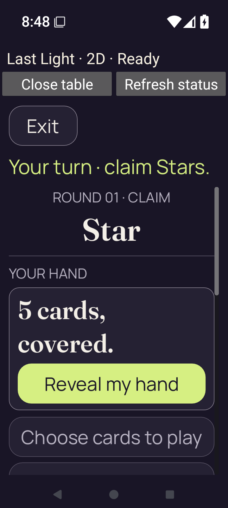</a> | **Native 2D reference match begins concealed — 2× text** Android API 35 emulator, actual native 2D comparison host, debug APK Original: [01-concealed.png](2d-font-2.0-debug/2d/match/01-concealed.png) 720 × 1600 px; text 2× SHA-256: <code>ebafb578eee9a89b866ed56a1af35d3ce2eee612cc7b7567d027263ceadec0ae</code> [Original UI dump](2d-font-2.0-debug/2d/match/01-concealed.xml) [Original measurements](2d-font-2.0-debug/2d/match/01-concealed.json) [Original result](2d-font-2.0-debug/result.json) The complete initial Reveal action and concealed-panel borders are visible. This exact pack includes the guarded decorative-height correction; the prior native initial clipping claim does not apply. |
| <a href="2d-font-2.0-debug/2d/match/02-revealed.png">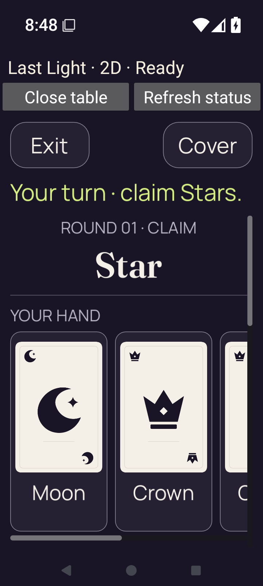</a> | **Native 2D hand revealed through actual touch — 2× text** Android API 35 emulator, actual native 2D comparison host, debug APK Original: [02-revealed.png](2d-font-2.0-debug/2d/match/02-revealed.png) 720 × 1600 px; text 2× SHA-256: <code>2d89776ba32729d8bd984fc5e603eccbadb24f5bd8abc52cc9b4ff5744472985</code> [Original UI dump](2d-font-2.0-debug/2d/match/02-revealed.xml) [Original measurements](2d-font-2.0-debug/2d/match/02-revealed.json) [Original result](2d-font-2.0-debug/result.json) The hand uses horizontal scrolling, so not every card is visible together. Later gameplay controls continue below this capture viewport; subsequent recorded input establishes reachability. |
| <a href="2d-font-2.0-debug/2d/match/03-selected.png">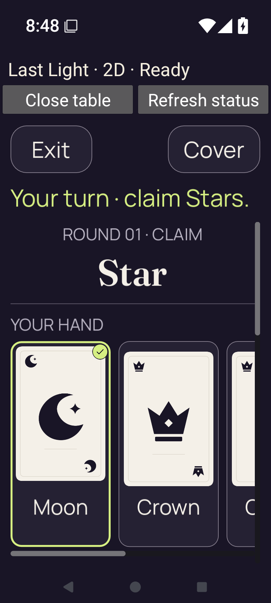</a> | **Native 2D Moon selected for a one-Star claim — 2× text** Android API 35 emulator, actual native 2D comparison host, debug APK Original: [03-selected.png](2d-font-2.0-debug/2d/match/03-selected.png) 720 × 1600 px; text 2× SHA-256: <code>dbd360ecdb1fa1c7abcd6d3d341df12407b0eb5e93342e6b3233b51d689c86c5</code> [Original UI dump](2d-font-2.0-debug/2d/match/03-selected.xml) [Original measurements](2d-font-2.0-debug/2d/match/03-selected.json) [Original result](2d-font-2.0-debug/result.json) The hand uses horizontal scrolling, so not every card is visible together. Later gameplay controls continue below this capture viewport; subsequent recorded input establishes reachability. |
|  | **Native 2D hand covered and selection cleared — 2× text** Android API 35 emulator, actual native 2D comparison host, debug APK Original: [04-covered.png](2d-font-2.0-debug/2d/match/04-covered.png) 720 × 1600 px; text 2× SHA-256: <code>aa6bd162125938f33f283f9312358a6daf77a94f8dccad320f968d0281eb281f</code> [Original UI dump](2d-font-2.0-debug/2d/match/04-covered.xml) [Original measurements](2d-font-2.0-debug/2d/match/04-covered.json) [Original result](2d-font-2.0-debug/result.json) Paired diagnostics and inspected pixels show concealed cards with zero private faces, rank labels and selection. |
| <a href="2d-font-2.0-debug/2d/match/05-background-home.png">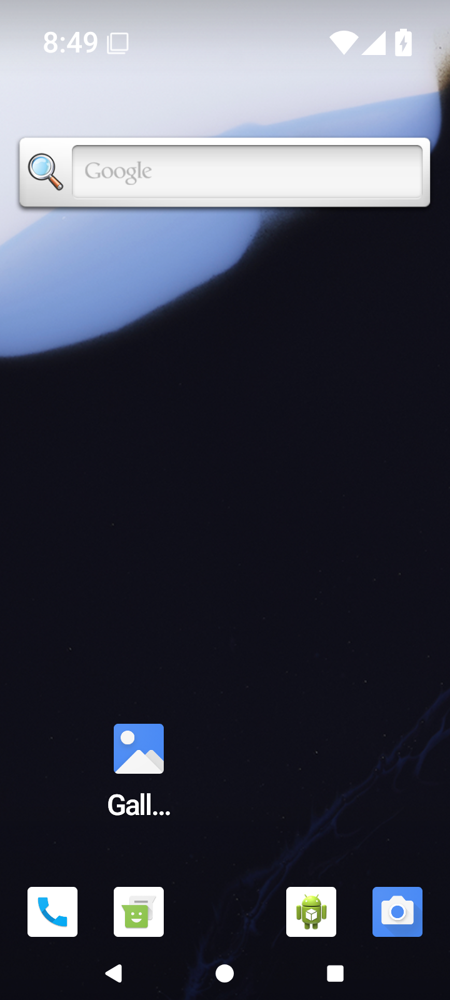</a> | **Android Home during the revealed match lifecycle — 2× text** Android API 35 emulator, actual native 2D comparison host, debug APK Original: [05-background-home.png](2d-font-2.0-debug/2d/match/05-background-home.png) 720 × 1600 px; text 2× SHA-256: <code>3c0cb3940116c95f08ad10f013f799e4b79dbcf4c26d7adb83eff27c10dc4c0f</code> [Original UI dump](2d-font-2.0-debug/2d/match/05-background-home.xml) [Original result](2d-font-2.0-debug/result.json) This Home original belongs to the exercised reveal/select/background sequence, after app installation. No private game face or label is visible. |
| <a href="2d-font-2.0-debug/2d/match/06-recents-privacy.png">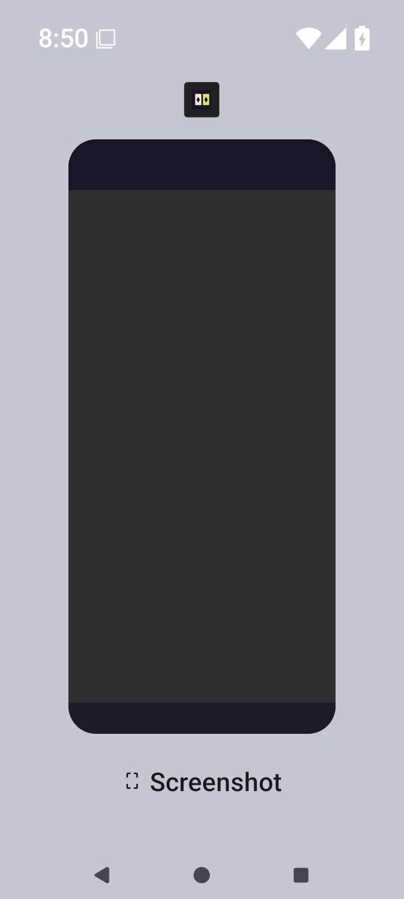</a> | **Android Recents with opaque task preview — 2× text** Android API 35 emulator, actual native 2D comparison host, debug APK Original: [06-recents-privacy.png](2d-font-2.0-debug/2d/match/06-recents-privacy.png) 720 × 1600 px; text 2× SHA-256: <code>38d2a88d6620efa7e06a5fa069f94e40ac88825421ccebe052b91a00ddaaaf90</code> [Original UI dump](2d-font-2.0-debug/2d/match/06-recents-privacy.xml) [Original result](2d-font-2.0-debug/result.json) The opaque gray task preview contains no private faces, labels or selected state. The retained capture policy is recents_disabled; the following same-process concealed resume completes. |
|  | **Same native presentation resumes concealed — 2× text** Android API 35 emulator, actual native 2D comparison host, debug APK Original: [07-resumed-concealed.png](2d-font-2.0-debug/2d/match/07-resumed-concealed.png) 720 × 1600 px; text 2× SHA-256: <code>06b2ba27a51eda575780167d6ffc3bcf4170b3ecd525e1a891d3aad25099aaaf</code> [Original UI dump](2d-font-2.0-debug/2d/match/07-resumed-concealed.xml) [Original measurements](2d-font-2.0-debug/2d/match/07-resumed-concealed.json) [Original result](2d-font-2.0-debug/result.json) Paired diagnostics and inspected pixels show concealed cards with zero private faces, rank labels and selection. The same engine PID and presentation resume. The native Home/Recents/resume sequence completes in this match entry. |
| <a href="2d-font-2.0-debug/2d/match/08-after-play.png">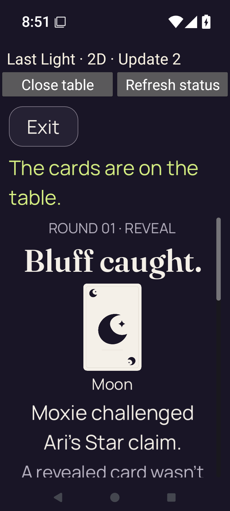</a> | **Round-1 result after Moxie catches Ari’s Star bluff — 2× text** Android API 35 emulator, actual native 2D comparison host, debug APK Original: [08-after-play.png](2d-font-2.0-debug/2d/match/08-after-play.png) 720 × 1600 px; text 2× SHA-256: <code>5b3e02327df1c03818969984b39e511dfc61fb3ccfaac015c800cfbfb0f4aa9c</code> [Original UI dump](2d-font-2.0-debug/2d/match/08-after-play.xml) [Original measurements](2d-font-2.0-debug/2d/match/08-after-play.json) [Original result](2d-font-2.0-debug/result.json) Moxie challenges Ari’s Star claim; the public Moon catches the bluff. Ari uses light 1 and stays in. Matching stage pixels remain separate captures. The public Moon and named challenge are readable; light/burnout details and next/return actions continue below this capture viewport. Later retained geometry and accepted inputs establish reachability. |
|  | **Separate original of the public round-1 outcome — 2× text** Android API 35 emulator, actual native 2D comparison host, debug APK Original: [09-public-outcome.png](2d-font-2.0-debug/2d/match/09-public-outcome.png) 720 × 1600 px; text 2× SHA-256: <code>5b3e02327df1c03818969984b39e511dfc61fb3ccfaac015c800cfbfb0f4aa9c</code> [Original UI dump](2d-font-2.0-debug/2d/match/09-public-outcome.xml) [Original measurements](2d-font-2.0-debug/2d/match/09-public-outcome.json) [Original result](2d-font-2.0-debug/result.json) Moxie challenges Ari’s Star claim; the public Moon catches the bluff. Ari uses light 1 and stays in. Matching stage pixels remain separate captures. The public Moon and named challenge are readable; light/burnout details and next/return actions continue below this capture viewport. Later retained geometry and accepted inputs establish reachability. |
| <a href="2d-font-2.0-debug/2d/match/10-next-round.png">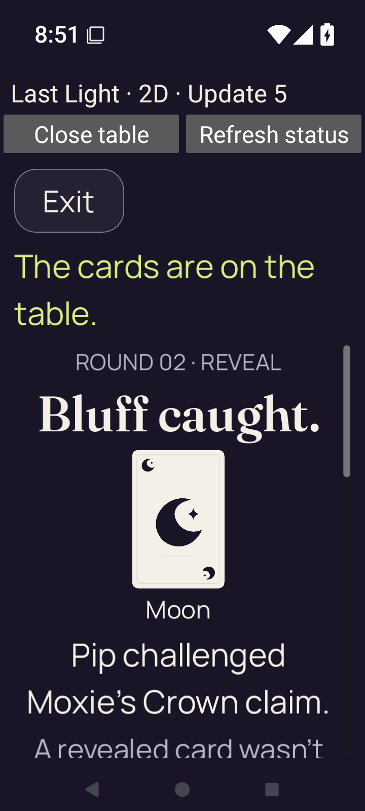</a> | **Round-2 result after the accepted first advance — 2× text** Android API 35 emulator, actual native 2D comparison host, debug APK Original: [10-next-round.png](2d-font-2.0-debug/2d/match/10-next-round.png) 720 × 1600 px; text 2× SHA-256: <code>e0d10ba4657f762c567401b8cb5fd27efe2772db56204e8391daad6338ecef72</code> [Original UI dump](2d-font-2.0-debug/2d/match/10-next-round.xml) [Original measurements](2d-font-2.0-debug/2d/match/10-next-round.json) [Original result](2d-font-2.0-debug/result.json) Autonomous turns have settled round 2 after the accepted advance: Pip catches Moxie’s Crown claim with Moon; Moxie uses light 1 and stays in. The public Moon and named challenge are readable; light/burnout details and next/return actions continue below this capture viewport. Later retained geometry and accepted inputs establish reachability. |
| <a href="2d-font-2.0-debug/2d/match/11-after-challenge.png">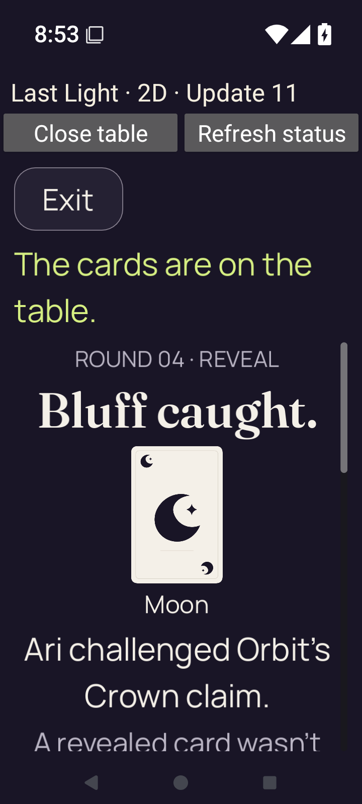</a> | **Round-4 result after Ari challenges Orbit — 2× text** Android API 35 emulator, actual native 2D comparison host, debug APK Original: [11-after-challenge.png](2d-font-2.0-debug/2d/match/11-after-challenge.png) 720 × 1600 px; text 2× SHA-256: <code>24bf7543a94ce03a59b2fae025040c75c88a6f04a7fda5a2e32b826174f3b187</code> [Original UI dump](2d-font-2.0-debug/2d/match/11-after-challenge.xml) [Original measurements](2d-font-2.0-debug/2d/match/11-after-challenge.json) [Original result](2d-font-2.0-debug/result.json) Authority round 4/revision 11: Ari catches Orbit’s Crown claim with Moon. Orbit uses light 1 and stays in. The public Moon and named challenge are readable; light/burnout details and next/return actions continue below this capture viewport. Later retained geometry and accepted inputs establish reachability. |
| <a href="2d-font-2.0-debug/2d/match/12-winner.png">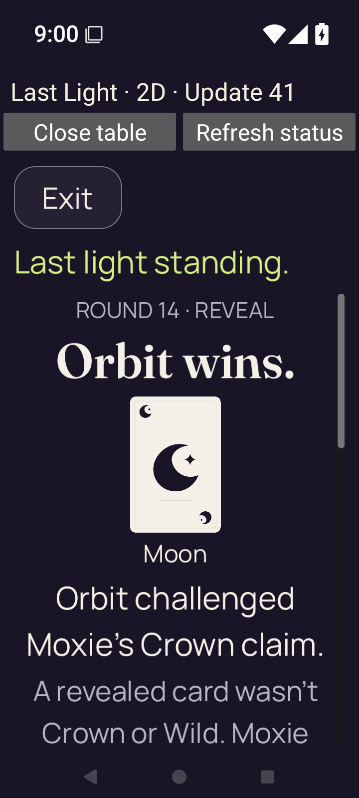</a> | **Round-14 winner: Orbit wins after Moxie burns out — 2× text** Android API 35 emulator, actual native 2D comparison host, debug APK Original: [12-winner.png](2d-font-2.0-debug/2d/match/12-winner.png) 720 × 1600 px; text 2× SHA-256: <code>ae61c16d548567f312da9a3b3be960b381ddc6167a56ec75ac0f2307bfd3f2d1</code> [Original UI dump](2d-font-2.0-debug/2d/match/12-winner.xml) [Original measurements](2d-font-2.0-debug/2d/match/12-winner.json) [Original result](2d-font-2.0-debug/result.json) Authority round 14/revision 41: Orbit catches Moxie’s Crown claim with Moon; Moxie uses light 4 and burns out. The public Moon and named challenge are readable; light/burnout details and next/return actions continue below this capture viewport. Later retained geometry and accepted inputs establish reachability. |
|  | **Chooser restored after match return — 2× text** Android API 35 emulator, actual native 2D comparison host, debug APK Original: [14-chooser-after-exit.png](2d-font-2.0-debug/2d/match/14-chooser-after-exit.png) 720 × 1600 px; text 2× SHA-256: <code>c1b74b71e51043690e4e145f8bb5d25807b86b50ced3f78a8c88421e299828e0</code> [Original receipt](2d-font-2.0-debug/2d/match/teardown.json) [Original UI dump](2d-font-2.0-debug/2d/match/14-chooser-after-exit.xml) [Original result](2d-font-2.0-debug/result.json) The original teardown receipt records acknowledged close, native destruction, actual old/engine-process absence, enabled launch buttons and the surviving chooser. Each entry retains a distinct capture record. Open source notices is below the initial chooser viewport at 200% text. |
|  | **Fresh 2D presentation before native Close — 2× text** Android API 35 emulator, actual native 2D comparison host, debug APK Original: [01-fresh-concealed.png](2d-font-2.0-debug/2d/native-exit/01-fresh-concealed.png) 720 × 1600 px; text 2× SHA-256: <code>f285a93f461ede447df84c3f55605be8050d9e7bc254c5e8030b9f67aefb4e75</code> [Original UI dump](2d-font-2.0-debug/2d/native-exit/01-fresh-concealed.xml) [Original measurements](2d-font-2.0-debug/2d/native-exit/01-fresh-concealed.json) [Original result](2d-font-2.0-debug/result.json) A separate fresh engine PID and presentation start round 1 with five concealed cards after the preceding entry was destroyed. The complete initial Reveal action and concealed-panel borders are visible. This exact pack includes the guarded decorative-height correction; the prior native initial clipping claim does not apply. |
|  | **Chooser restored after native Close — 2× text** Android API 35 emulator, actual native 2D comparison host, debug APK Original: [14-chooser-after-exit.png](2d-font-2.0-debug/2d/native-exit/14-chooser-after-exit.png) 720 × 1600 px; text 2× SHA-256: <code>afe38b76c04432083cea8074a9ecc3e14d1e4b12d38a812fafd0674d56bc4eea</code> [Original receipt](2d-font-2.0-debug/2d/native-exit/teardown.json) [Original UI dump](2d-font-2.0-debug/2d/native-exit/14-chooser-after-exit.xml) [Original result](2d-font-2.0-debug/result.json) The original teardown receipt records acknowledged close, native destruction, actual old/engine-process absence, enabled launch buttons and the surviving chooser. Each entry retains a distinct capture record. Open source notices is below the initial chooser viewport at 200% text. |
| <a href="2d-font-2.0-debug/2d/scene-exit/01-fresh-concealed.png">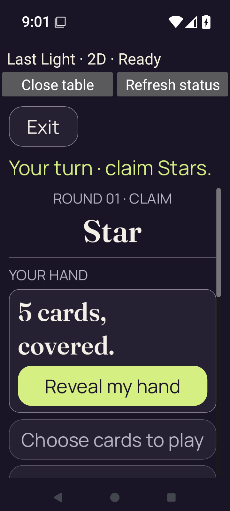</a> | **Fresh 2D presentation before scene Exit — 2× text** Android API 35 emulator, actual native 2D comparison host, debug APK Original: [01-fresh-concealed.png](2d-font-2.0-debug/2d/scene-exit/01-fresh-concealed.png) 720 × 1600 px; text 2× SHA-256: <code>94341b4ff12ff910d798a1b2cd2e554a4666f83dc817c68ff66992699b489cf8</code> [Original UI dump](2d-font-2.0-debug/2d/scene-exit/01-fresh-concealed.xml) [Original measurements](2d-font-2.0-debug/2d/scene-exit/01-fresh-concealed.json) [Original result](2d-font-2.0-debug/result.json) A separate fresh engine PID and presentation start round 1 with five concealed cards after the preceding entry was destroyed. The complete initial Reveal action and concealed-panel borders are visible. This exact pack includes the guarded decorative-height correction; the prior native initial clipping claim does not apply. |
| <a href="2d-font-2.0-debug/2d/scene-exit/14-chooser-after-exit.png">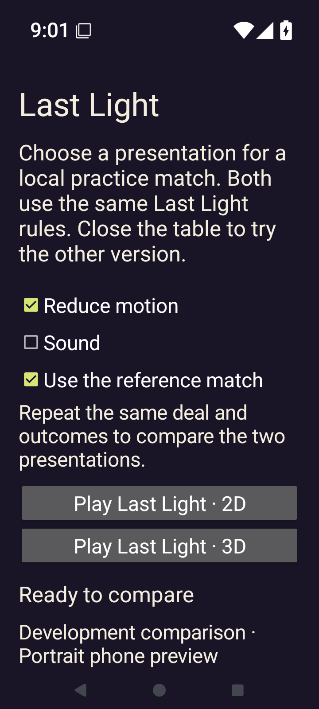</a> | **Chooser restored after scene Exit — 2× text** Android API 35 emulator, actual native 2D comparison host, debug APK Original: [14-chooser-after-exit.png](2d-font-2.0-debug/2d/scene-exit/14-chooser-after-exit.png) 720 × 1600 px; text 2× SHA-256: <code>9863e2195920a19ddb1217b06798a4fc70e9a3e03861cd68dce986b661fef4d8</code> [Original receipt](2d-font-2.0-debug/2d/scene-exit/teardown.json) [Original UI dump](2d-font-2.0-debug/2d/scene-exit/14-chooser-after-exit.xml) [Original result](2d-font-2.0-debug/result.json) The original teardown receipt records acknowledged close, native destruction, actual old/engine-process absence, enabled launch buttons and the surviving chooser. Each entry retains a distinct capture record. Open source notices is below the initial chooser viewport at 200% text. |
|  | **Native chooser before 2D launch — 2× text** Android API 35 emulator, actual native 2D comparison host, debug APK Original: [chooser.png](2d-font-2.0-debug/chooser.png) 720 × 1600 px; text 2× SHA-256: <code>92ec9b8aa5995f44a3bc62d1399aef157d9b00f6fa079f2ff88b7a9deaa896d7</code> [Original UI dump](2d-font-2.0-debug/chooser.xml) [Original result](2d-font-2.0-debug/result.json) Both launch options are visible. Reduced motion and the seed-2 reference match are enabled; sound is disabled. Open source notices is below the initial chooser viewport at 200% text. |
|  | **Final chooser after all three 2D entries and teardown paths — 2× text** Android API 35 emulator, actual native 2D comparison host, debug APK Original: [final-screen.png](2d-font-2.0-debug/final-screen.png) 720 × 1600 px; text 2× SHA-256: <code>afe38b76c04432083cea8074a9ecc3e14d1e4b12d38a812fafd0674d56bc4eea</code> [Original UI dump](2d-font-2.0-debug/last-ui.xml) [Original result](2d-font-2.0-debug/result.json) The full match, fresh renderer Exit and fresh native Close complete in separate engine processes. This final capture follows the successful native Close. Open source notices is below the initial chooser viewport at 200% text. |

## 3D — 100% text

[Original result](3d-font-1.0-debug/result.json) · [Package inputs](3d-font-1.0-debug/package-inputs.json) · [Native input records](3d-font-1.0-debug/input-geometry.log) · [OS events](3d-font-1.0-debug/events.log)

| Original image | Scenario and provenance |
| --- | --- |
|  | **Native 3D reference match begins concealed — 1× text** Android API 35 emulator, actual native 3D comparison host, debug APK Original: [01-concealed.png](3d-font-1.0-debug/3d/match/01-concealed.png) 720 × 1600 px; text 1× SHA-256: <code>65057e0353a02e5e2bd19b44f3bcd0ff2d42c9e76b00c4e065ef9a8a403627d3</code> [Original UI dump](3d-font-1.0-debug/3d/match/01-concealed.xml) [Original measurements](3d-font-1.0-debug/3d/match/01-concealed.json) [Original result](3d-font-1.0-debug/result.json) The full hand area and Show/Hide control are visible. The roster scrolls horizontally, with trailing seat content clipped beside the swipe hint. The whole 3D case at this text scale remains failed at match-return close acknowledgment. The earlier completed gameplay, actual child death and restored chooser do not qualify that missing acknowledgment; fresh scene Exit and native Back were not attempted. |
|  | **Native 3D hand revealed through actual touch — 1× text** Android API 35 emulator, actual native 3D comparison host, debug APK Original: [02-revealed.png](3d-font-1.0-debug/3d/match/02-revealed.png) 720 × 1600 px; text 1× SHA-256: <code>a1d671fab132750072bef87181bee125ccc35de0b819edc95182cbab7a1dd3b8</code> [Original UI dump](3d-font-1.0-debug/3d/match/02-revealed.xml) [Original measurements](3d-font-1.0-debug/3d/match/02-revealed.json) [Original result](3d-font-1.0-debug/result.json) The full hand area and Show/Hide control are visible. The roster scrolls horizontally, with trailing seat content clipped beside the swipe hint. The whole 3D case at this text scale remains failed at match-return close acknowledgment. The earlier completed gameplay, actual child death and restored chooser do not qualify that missing acknowledgment; fresh scene Exit and native Back were not attempted. |
|  | **Native 3D Moon selected for a one-Star claim — 1× text** Android API 35 emulator, actual native 3D comparison host, debug APK Original: [03-selected.png](3d-font-1.0-debug/3d/match/03-selected.png) 720 × 1600 px; text 1× SHA-256: <code>b24d50483d6a4d39302fd0b402b91c0768300515bf4edc24e4257b790b26b7a0</code> [Original UI dump](3d-font-1.0-debug/3d/match/03-selected.xml) [Original measurements](3d-font-1.0-debug/3d/match/03-selected.json) [Original result](3d-font-1.0-debug/result.json) The full hand area and Show/Hide control are visible. The roster scrolls horizontally, with trailing seat content clipped beside the swipe hint. The whole 3D case at this text scale remains failed at match-return close acknowledgment. The earlier completed gameplay, actual child death and restored chooser do not qualify that missing acknowledgment; fresh scene Exit and native Back were not attempted. |
|  | **Native 3D hand covered and selection cleared — 1× text** Android API 35 emulator, actual native 3D comparison host, debug APK Original: [04-covered.png](3d-font-1.0-debug/3d/match/04-covered.png) 720 × 1600 px; text 1× SHA-256: <code>28da282a1b591f62ae4009d0d0f33ccfee47d5cb3c5a745f9e5947e41da37985</code> [Original UI dump](3d-font-1.0-debug/3d/match/04-covered.xml) [Original measurements](3d-font-1.0-debug/3d/match/04-covered.json) [Original result](3d-font-1.0-debug/result.json) Paired diagnostics and inspected pixels show concealed cards with zero private faces, rank labels and selection. The full hand area and Show/Hide control are visible. The roster scrolls horizontally, with trailing seat content clipped beside the swipe hint. The whole 3D case at this text scale remains failed at match-return close acknowledgment. The earlier completed gameplay, actual child death and restored chooser do not qualify that missing acknowledgment; fresh scene Exit and native Back were not attempted. |
|  | **Android Home during the revealed match lifecycle — 1× text** Android API 35 emulator, actual native 3D comparison host, debug APK Original: [05-background-home.png](3d-font-1.0-debug/3d/match/05-background-home.png) 720 × 1600 px; text 1× SHA-256: <code>5c310a5cc252feca19c8c8183330d1d154d093ba80e701c9b9696982568eb576</code> [Original UI dump](3d-font-1.0-debug/3d/match/05-background-home.xml) [Original result](3d-font-1.0-debug/result.json) This Home original belongs to the exercised reveal/select/background sequence, after app installation. No private game face or label is visible. The whole 3D case at this text scale remains failed at match-return close acknowledgment. The earlier completed gameplay, actual child death and restored chooser do not qualify that missing acknowledgment; fresh scene Exit and native Back were not attempted. |
|  | **Android Recents with opaque task preview — 1× text** Android API 35 emulator, actual native 3D comparison host, debug APK Original: [06-recents-privacy.png](3d-font-1.0-debug/3d/match/06-recents-privacy.png) 720 × 1600 px; text 1× SHA-256: <code>fa26e159dc1b7dffe2e8b174b8c4148a69735bd739ee68a02279c6e5138d3d47</code> [Original UI dump](3d-font-1.0-debug/3d/match/06-recents-privacy.xml) [Original result](3d-font-1.0-debug/result.json) The opaque gray task preview contains no private faces, labels or selected state. The retained capture policy is recents_disabled; the following same-process concealed resume completes. The whole 3D case at this text scale remains failed at match-return close acknowledgment. The earlier completed gameplay, actual child death and restored chooser do not qualify that missing acknowledgment; fresh scene Exit and native Back were not attempted. |
|  | **Same native presentation resumes concealed — 1× text** Android API 35 emulator, actual native 3D comparison host, debug APK Original: [07-resumed-concealed.png](3d-font-1.0-debug/3d/match/07-resumed-concealed.png) 720 × 1600 px; text 1× SHA-256: <code>65057e0353a02e5e2bd19b44f3bcd0ff2d42c9e76b00c4e065ef9a8a403627d3</code> [Original UI dump](3d-font-1.0-debug/3d/match/07-resumed-concealed.xml) [Original measurements](3d-font-1.0-debug/3d/match/07-resumed-concealed.json) [Original result](3d-font-1.0-debug/result.json) Paired diagnostics and inspected pixels show concealed cards with zero private faces, rank labels and selection. The same engine PID and presentation resume. The native Home/Recents/resume sequence completes in this match entry. The full hand area and Show/Hide control are visible. The roster scrolls horizontally, with trailing seat content clipped beside the swipe hint. The whole 3D case at this text scale remains failed at match-return close acknowledgment. The earlier completed gameplay, actual child death and restored chooser do not qualify that missing acknowledgment; fresh scene Exit and native Back were not attempted. |
|  | **Round-1 result after Moxie catches Ari’s Star bluff — 1× text** Android API 35 emulator, actual native 3D comparison host, debug APK Original: [08-after-play.png](3d-font-1.0-debug/3d/match/08-after-play.png) 720 × 1600 px; text 1× SHA-256: <code>180d4554715dd249147fe41ce9607d6d6f10c2dda5a5fbd59b2995de65a58951</code> [Original UI dump](3d-font-1.0-debug/3d/match/08-after-play.xml) [Original measurements](3d-font-1.0-debug/3d/match/08-after-play.json) [Original result](3d-font-1.0-debug/result.json) Moxie challenges Ari’s Star claim; the public Moon catches the bluff. Ari uses light 1 and stays in. Matching stage pixels remain separate captures. The public Moon, named challenge, light/burnout explanation and next/return action are visible. The whole 3D case at this text scale remains failed at match-return close acknowledgment. The earlier completed gameplay, actual child death and restored chooser do not qualify that missing acknowledgment; fresh scene Exit and native Back were not attempted. |
|  | **Separate original of the public round-1 outcome — 1× text** Android API 35 emulator, actual native 3D comparison host, debug APK Original: [09-public-outcome.png](3d-font-1.0-debug/3d/match/09-public-outcome.png) 720 × 1600 px; text 1× SHA-256: <code>180d4554715dd249147fe41ce9607d6d6f10c2dda5a5fbd59b2995de65a58951</code> [Original UI dump](3d-font-1.0-debug/3d/match/09-public-outcome.xml) [Original measurements](3d-font-1.0-debug/3d/match/09-public-outcome.json) [Original result](3d-font-1.0-debug/result.json) Moxie challenges Ari’s Star claim; the public Moon catches the bluff. Ari uses light 1 and stays in. Matching stage pixels remain separate captures. The public Moon, named challenge, light/burnout explanation and next/return action are visible. The whole 3D case at this text scale remains failed at match-return close acknowledgment. The earlier completed gameplay, actual child death and restored chooser do not qualify that missing acknowledgment; fresh scene Exit and native Back were not attempted. |
|  | **Round-2 result after the accepted first advance — 1× text** Android API 35 emulator, actual native 3D comparison host, debug APK Original: [10-next-round.png](3d-font-1.0-debug/3d/match/10-next-round.png) 720 × 1600 px; text 1× SHA-256: <code>cdb8095d9aca7024308999c8c532e396a7b1ffde89301d6f7f867682f1621368</code> [Original UI dump](3d-font-1.0-debug/3d/match/10-next-round.xml) [Original measurements](3d-font-1.0-debug/3d/match/10-next-round.json) [Original result](3d-font-1.0-debug/result.json) Autonomous turns have settled round 2 after the accepted advance: Pip catches Moxie’s Crown claim with Moon; Moxie uses light 1 and stays in. The public Moon, named challenge, light/burnout explanation and next/return action are visible. The whole 3D case at this text scale remains failed at match-return close acknowledgment. The earlier completed gameplay, actual child death and restored chooser do not qualify that missing acknowledgment; fresh scene Exit and native Back were not attempted. |
|  | **Round-4 result after Ari challenges Orbit — 1× text** Android API 35 emulator, actual native 3D comparison host, debug APK Original: [11-after-challenge.png](3d-font-1.0-debug/3d/match/11-after-challenge.png) 720 × 1600 px; text 1× SHA-256: <code>238768d46b77de987df2a31d6618f58fb7d877fe3b5a10879f357316277a8c1c</code> [Original UI dump](3d-font-1.0-debug/3d/match/11-after-challenge.xml) [Original measurements](3d-font-1.0-debug/3d/match/11-after-challenge.json) [Original result](3d-font-1.0-debug/result.json) Authority round 4/revision 11: Ari catches Orbit’s Crown claim with Moon. Orbit uses light 1 and stays in. The public Moon, named challenge, light/burnout explanation and next/return action are visible. The whole 3D case at this text scale remains failed at match-return close acknowledgment. The earlier completed gameplay, actual child death and restored chooser do not qualify that missing acknowledgment; fresh scene Exit and native Back were not attempted. |
|  | **Round-14 winner: Orbit wins after Moxie burns out — 1× text** Android API 35 emulator, actual native 3D comparison host, debug APK Original: [12-winner.png](3d-font-1.0-debug/3d/match/12-winner.png) 720 × 1600 px; text 1× SHA-256: <code>bc5f8c106fa37ee4bddb3dc2c225c9a5adf376ffe61b52072f88ce0c4070175d</code> [Original UI dump](3d-font-1.0-debug/3d/match/12-winner.xml) [Original measurements](3d-font-1.0-debug/3d/match/12-winner.json) [Original result](3d-font-1.0-debug/result.json) Authority round 14/revision 41: Orbit catches Moxie’s Crown claim with Moon; Moxie uses light 4 and burns out. The complete Back to room action is visible and the later lobby intent is accepted. The public Moon, named challenge, light/burnout explanation and next/return action are visible. The whole 3D case at this text scale remains failed at match-return close acknowledgment. The earlier completed gameplay, actual child death and restored chooser do not qualify that missing acknowledgment; fresh scene Exit and native Back were not attempted. |
|  | **Native chooser before 3D launch — 1× text** Android API 35 emulator, actual native 3D comparison host, debug APK Original: [chooser.png](3d-font-1.0-debug/chooser.png) 720 × 1600 px; text 1× SHA-256: <code>243a2b9d3883ffb77eabe7bbbfe11a381a075f5a1a7c1a5e2307929003879f45</code> [Original UI dump](3d-font-1.0-debug/chooser.xml) [Original result](3d-font-1.0-debug/result.json) Both launch options are visible. Reduced motion and the seed-2 reference match are enabled; sound is disabled. Both launch options and the complete Open source notices action are visible. The whole 3D case at this text scale remains failed at match-return close acknowledgment. The earlier completed gameplay, actual child death and restored chooser do not qualify that missing acknowledgment; fresh scene Exit and native Back were not attempted. |
|  | **Final chooser after failed 3D match-return close acknowledgment — 1× text** Android API 35 emulator, actual native 3D comparison host, debug APK Original: [final-screen.png](3d-font-1.0-debug/final-screen.png) 720 × 1600 px; text 1× SHA-256: <code>243a2b9d3883ffb77eabe7bbbfe11a381a075f5a1a7c1a5e2307929003879f45</code> [Original UI dump](3d-font-1.0-debug/last-ui.xml) [Original result](3d-font-1.0-debug/result.json) The match-return lobby intent is accepted and closeReason is return_to_chooser, but closeSignalAcknowledged is false. Actual child death and the restored chooser are recorded; the requested match-return route remains failed. Fresh scene Exit and native Back were never attempted in this case. This is the final-screen capture after failure, not a successful teardown checkpoint. Both launch options and the complete Open source notices action are visible. The whole 3D case at this text scale remains failed at match-return close acknowledgment. The earlier completed gameplay, actual child death and restored chooser do not qualify that missing acknowledgment; fresh scene Exit and native Back were not attempted. |

## 3D — 200% text

[Original result](3d-font-2.0-debug/result.json) · [Package inputs](3d-font-2.0-debug/package-inputs.json) · [Native input records](3d-font-2.0-debug/input-geometry.log) · [OS events](3d-font-2.0-debug/events.log)

| Original image | Scenario and provenance |
| --- | --- |
|  | **Native 3D reference match begins concealed — 2× text** Android API 35 emulator, actual native 3D comparison host, debug APK Original: [01-concealed.png](3d-font-2.0-debug/3d/match/01-concealed.png) 720 × 1600 px; text 2× SHA-256: <code>f221d1c83f48addaa5d5f1de36a4c32a6b8a67397cbbdab844cb3fb095cb39de</code> [Original UI dump](3d-font-2.0-debug/3d/match/01-concealed.xml) [Original measurements](3d-font-2.0-debug/3d/match/01-concealed.json) [Original result](3d-font-2.0-debug/result.json) Show/Hide and Star table, round and actor remain pinned. The roster and hand use scrolling; some cards or enlarged rank actions lie outside the current viewport. The whole 3D case at this text scale remains failed at match-return close acknowledgment. The earlier completed gameplay, actual child death and restored chooser do not qualify that missing acknowledgment; fresh scene Exit and native Back were not attempted. |
| <a href="3d-font-2.0-debug/3d/match/02-revealed.png">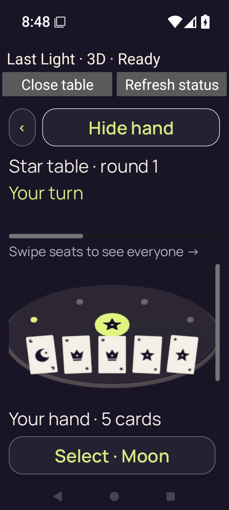</a> | **Native 3D hand revealed through actual touch — 2× text** Android API 35 emulator, actual native 3D comparison host, debug APK Original: [02-revealed.png](3d-font-2.0-debug/3d/match/02-revealed.png) 720 × 1600 px; text 2× SHA-256: <code>8ec075f550e8aee6dd5ef9542db7f29e113cfca983ec33f0e6004e70c7f342d1</code> [Original UI dump](3d-font-2.0-debug/3d/match/02-revealed.xml) [Original measurements](3d-font-2.0-debug/3d/match/02-revealed.json) [Original result](3d-font-2.0-debug/result.json) Show/Hide and Star table, round and actor remain pinned. The roster and hand use scrolling; some cards or enlarged rank actions lie outside the current viewport. The whole 3D case at this text scale remains failed at match-return close acknowledgment. The earlier completed gameplay, actual child death and restored chooser do not qualify that missing acknowledgment; fresh scene Exit and native Back were not attempted. |
| <a href="3d-font-2.0-debug/3d/match/03-selected.png">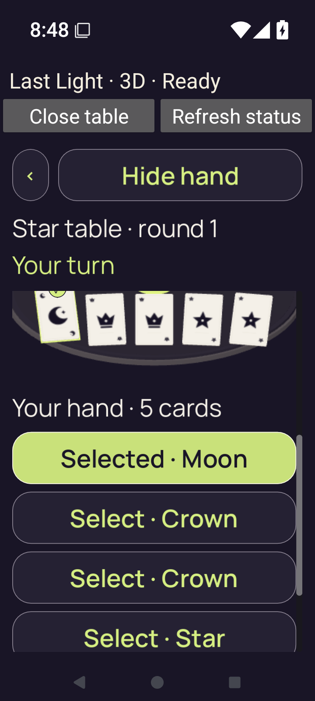</a> | **Native 3D Moon selected for a one-Star claim — 2× text** Android API 35 emulator, actual native 3D comparison host, debug APK Original: [03-selected.png](3d-font-2.0-debug/3d/match/03-selected.png) 720 × 1600 px; text 2× SHA-256: <code>e448e76d0c3f36367176678096b3bc7b949dfd3a624d9758815bb76925ee6c10</code> [Original UI dump](3d-font-2.0-debug/3d/match/03-selected.xml) [Original measurements](3d-font-2.0-debug/3d/match/03-selected.json) [Original result](3d-font-2.0-debug/result.json) Show/Hide and Star table, round and actor remain pinned. The roster and hand use scrolling; some cards or enlarged rank actions lie outside the current viewport. The whole 3D case at this text scale remains failed at match-return close acknowledgment. The earlier completed gameplay, actual child death and restored chooser do not qualify that missing acknowledgment; fresh scene Exit and native Back were not attempted. |
| <a href="3d-font-2.0-debug/3d/match/04-covered.png">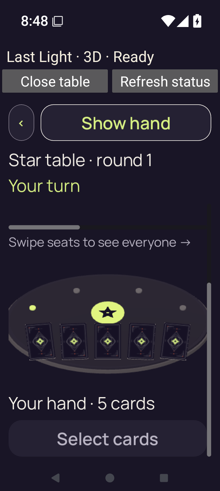</a> | **Native 3D hand covered and selection cleared — 2× text** Android API 35 emulator, actual native 3D comparison host, debug APK Original: [04-covered.png](3d-font-2.0-debug/3d/match/04-covered.png) 720 × 1600 px; text 2× SHA-256: <code>b76fb2476ceac635219cf31db538e04a9f40c14395cffd679b89f5f66cc69e88</code> [Original UI dump](3d-font-2.0-debug/3d/match/04-covered.xml) [Original measurements](3d-font-2.0-debug/3d/match/04-covered.json) [Original result](3d-font-2.0-debug/result.json) Paired diagnostics and inspected pixels show concealed cards with zero private faces, rank labels and selection. Show/Hide and Star table, round and actor remain pinned. The roster and hand use scrolling; some cards or enlarged rank actions lie outside the current viewport. The whole 3D case at this text scale remains failed at match-return close acknowledgment. The earlier completed gameplay, actual child death and restored chooser do not qualify that missing acknowledgment; fresh scene Exit and native Back were not attempted. |
|  | **Android Home during the revealed match lifecycle — 2× text** Android API 35 emulator, actual native 3D comparison host, debug APK Original: [05-background-home.png](3d-font-2.0-debug/3d/match/05-background-home.png) 720 × 1600 px; text 2× SHA-256: <code>3c0cb3940116c95f08ad10f013f799e4b79dbcf4c26d7adb83eff27c10dc4c0f</code> [Original UI dump](3d-font-2.0-debug/3d/match/05-background-home.xml) [Original result](3d-font-2.0-debug/result.json) This Home original belongs to the exercised reveal/select/background sequence, after app installation. No private game face or label is visible. The whole 3D case at this text scale remains failed at match-return close acknowledgment. The earlier completed gameplay, actual child death and restored chooser do not qualify that missing acknowledgment; fresh scene Exit and native Back were not attempted. |
|  | **Android Recents with opaque task preview — 2× text** Android API 35 emulator, actual native 3D comparison host, debug APK Original: [06-recents-privacy.png](3d-font-2.0-debug/3d/match/06-recents-privacy.png) 720 × 1600 px; text 2× SHA-256: <code>abe637128a048eb5d4780c1d26938e5bffaa55f5d90d4dd94c99dcfa14b3ea47</code> [Original UI dump](3d-font-2.0-debug/3d/match/06-recents-privacy.xml) [Original result](3d-font-2.0-debug/result.json) The opaque gray task preview contains no private faces, labels or selected state. The retained capture policy is recents_disabled; the following same-process concealed resume completes. The whole 3D case at this text scale remains failed at match-return close acknowledgment. The earlier completed gameplay, actual child death and restored chooser do not qualify that missing acknowledgment; fresh scene Exit and native Back were not attempted. |
| <a href="3d-font-2.0-debug/3d/match/07-resumed-concealed.png">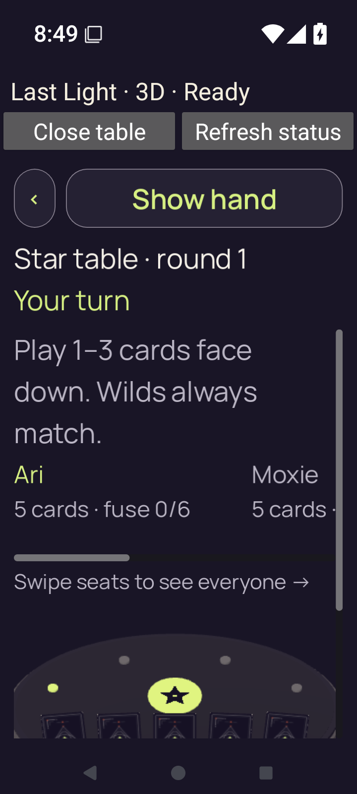</a> | **Same native presentation resumes concealed — 2× text** Android API 35 emulator, actual native 3D comparison host, debug APK Original: [07-resumed-concealed.png](3d-font-2.0-debug/3d/match/07-resumed-concealed.png) 720 × 1600 px; text 2× SHA-256: <code>2b83e0cb8f8417a4fa3a782556bf41ad2e07a0f819b1754a712596e5cfb7a572</code> [Original UI dump](3d-font-2.0-debug/3d/match/07-resumed-concealed.xml) [Original measurements](3d-font-2.0-debug/3d/match/07-resumed-concealed.json) [Original result](3d-font-2.0-debug/result.json) Paired diagnostics and inspected pixels show concealed cards with zero private faces, rank labels and selection. The same engine PID and presentation resume. The native Home/Recents/resume sequence completes in this match entry. Show/Hide and Star table, round and actor remain pinned. The roster and hand use scrolling; some cards or enlarged rank actions lie outside the current viewport. The whole 3D case at this text scale remains failed at match-return close acknowledgment. The earlier completed gameplay, actual child death and restored chooser do not qualify that missing acknowledgment; fresh scene Exit and native Back were not attempted. |
|  | **Round-1 result after Moxie catches Ari’s Star bluff — 2× text** Android API 35 emulator, actual native 3D comparison host, debug APK Original: [08-after-play.png](3d-font-2.0-debug/3d/match/08-after-play.png) 720 × 1600 px; text 2× SHA-256: <code>c563d5f3598ff81546eeaa584e2f1a6b1311b3d5a2b4fd1cf4798e6a287535c6</code> [Original UI dump](3d-font-2.0-debug/3d/match/08-after-play.xml) [Original measurements](3d-font-2.0-debug/3d/match/08-after-play.json) [Original result](3d-font-2.0-debug/result.json) Moxie challenges Ari’s Star claim; the public Moon catches the bluff. Ari uses light 1 and stays in. Matching stage pixels remain separate captures. The public Moon text, named challenge and light/burnout explanation are readable. The next/return action lies partly or entirely below the viewport; later retained geometry and accepted inputs establish reachability. The whole 3D case at this text scale remains failed at match-return close acknowledgment. The earlier completed gameplay, actual child death and restored chooser do not qualify that missing acknowledgment; fresh scene Exit and native Back were not attempted. |
| <a href="3d-font-2.0-debug/3d/match/09-public-outcome.png">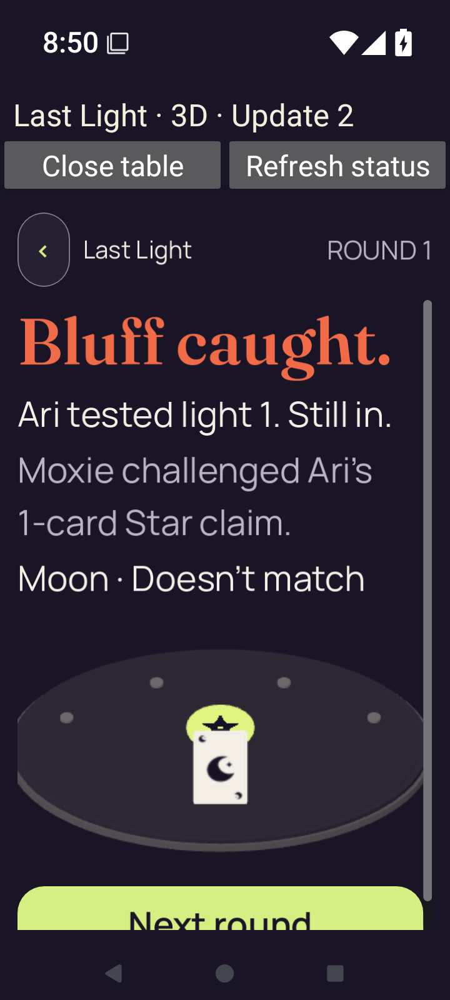</a> | **Separate original of the public round-1 outcome — 2× text** Android API 35 emulator, actual native 3D comparison host, debug APK Original: [09-public-outcome.png](3d-font-2.0-debug/3d/match/09-public-outcome.png) 720 × 1600 px; text 2× SHA-256: <code>c563d5f3598ff81546eeaa584e2f1a6b1311b3d5a2b4fd1cf4798e6a287535c6</code> [Original UI dump](3d-font-2.0-debug/3d/match/09-public-outcome.xml) [Original measurements](3d-font-2.0-debug/3d/match/09-public-outcome.json) [Original result](3d-font-2.0-debug/result.json) Moxie challenges Ari’s Star claim; the public Moon catches the bluff. Ari uses light 1 and stays in. Matching stage pixels remain separate captures. The public Moon text, named challenge and light/burnout explanation are readable. The next/return action lies partly or entirely below the viewport; later retained geometry and accepted inputs establish reachability. The whole 3D case at this text scale remains failed at match-return close acknowledgment. The earlier completed gameplay, actual child death and restored chooser do not qualify that missing acknowledgment; fresh scene Exit and native Back were not attempted. |
| <a href="3d-font-2.0-debug/3d/match/10-next-round.png">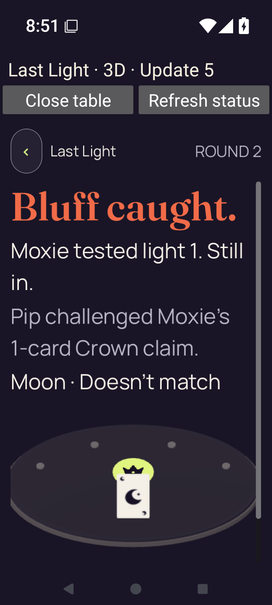</a> | **Round-2 result after the accepted first advance — 2× text** Android API 35 emulator, actual native 3D comparison host, debug APK Original: [10-next-round.png](3d-font-2.0-debug/3d/match/10-next-round.png) 720 × 1600 px; text 2× SHA-256: <code>ecbe70c2f10cd6ca76806f56ba48d541967a1915517e057852fe27865fd76e85</code> [Original UI dump](3d-font-2.0-debug/3d/match/10-next-round.xml) [Original measurements](3d-font-2.0-debug/3d/match/10-next-round.json) [Original result](3d-font-2.0-debug/result.json) Autonomous turns have settled round 2 after the accepted advance: Pip catches Moxie’s Crown claim with Moon; Moxie uses light 1 and stays in. The public Moon text, named challenge and light/burnout explanation are readable. The next/return action lies partly or entirely below the viewport; later retained geometry and accepted inputs establish reachability. The whole 3D case at this text scale remains failed at match-return close acknowledgment. The earlier completed gameplay, actual child death and restored chooser do not qualify that missing acknowledgment; fresh scene Exit and native Back were not attempted. |
| <a href="3d-font-2.0-debug/3d/match/11-after-challenge.png">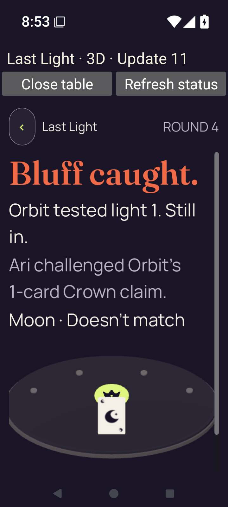</a> | **Round-4 result after Ari challenges Orbit — 2× text** Android API 35 emulator, actual native 3D comparison host, debug APK Original: [11-after-challenge.png](3d-font-2.0-debug/3d/match/11-after-challenge.png) 720 × 1600 px; text 2× SHA-256: <code>39beb29e477d92045995693cdaa62154084fcfc1aa0f0626372a23900233cc17</code> [Original UI dump](3d-font-2.0-debug/3d/match/11-after-challenge.xml) [Original measurements](3d-font-2.0-debug/3d/match/11-after-challenge.json) [Original result](3d-font-2.0-debug/result.json) Authority round 4/revision 11: Ari catches Orbit’s Crown claim with Moon. Orbit uses light 1 and stays in. The public Moon text, named challenge and light/burnout explanation are readable. The next/return action lies partly or entirely below the viewport; later retained geometry and accepted inputs establish reachability. The whole 3D case at this text scale remains failed at match-return close acknowledgment. The earlier completed gameplay, actual child death and restored chooser do not qualify that missing acknowledgment; fresh scene Exit and native Back were not attempted. |
| <a href="3d-font-2.0-debug/3d/match/12-winner.png">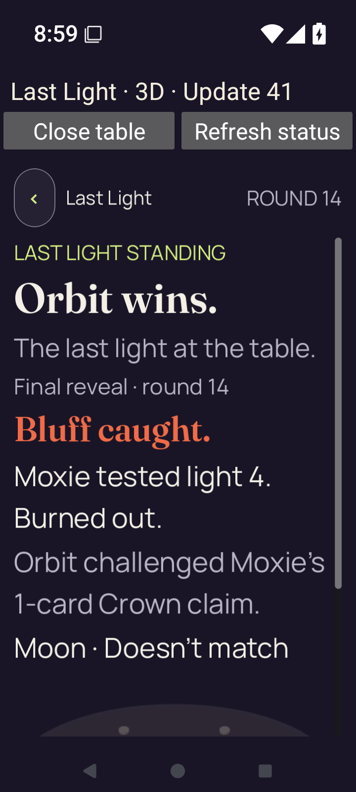</a> | **Round-14 winner: Orbit wins after Moxie burns out — 2× text** Android API 35 emulator, actual native 3D comparison host, debug APK Original: [12-winner.png](3d-font-2.0-debug/3d/match/12-winner.png) 720 × 1600 px; text 2× SHA-256: <code>fd5f74e00a4c8702344e02eadf0fe983076d39e9e847738ec653545baf613733</code> [Original UI dump](3d-font-2.0-debug/3d/match/12-winner.xml) [Original measurements](3d-font-2.0-debug/3d/match/12-winner.json) [Original result](3d-font-2.0-debug/result.json) Authority round 14/revision 41: Orbit catches Moxie’s Crown claim with Moon; Moxie uses light 4 and burns out. The public Moon text, named challenge and light/burnout explanation are readable. The next/return action lies partly or entirely below the viewport; later retained geometry and accepted inputs establish reachability. The public card art also continues below this winner capture viewport. The whole 3D case at this text scale remains failed at match-return close acknowledgment. The earlier completed gameplay, actual child death and restored chooser do not qualify that missing acknowledgment; fresh scene Exit and native Back were not attempted. |
|  | **Native chooser before 3D launch — 2× text** Android API 35 emulator, actual native 3D comparison host, debug APK Original: [chooser.png](3d-font-2.0-debug/chooser.png) 720 × 1600 px; text 2× SHA-256: <code>34929227c968a6545616239034e3dc6cea88c4028d4132bd44d51c48f497238f</code> [Original UI dump](3d-font-2.0-debug/chooser.xml) [Original result](3d-font-2.0-debug/result.json) Both launch options are visible. Reduced motion and the seed-2 reference match are enabled; sound is disabled. Open source notices is below the initial chooser viewport at 200% text. The whole 3D case at this text scale remains failed at match-return close acknowledgment. The earlier completed gameplay, actual child death and restored chooser do not qualify that missing acknowledgment; fresh scene Exit and native Back were not attempted. |
|  | **Final chooser after failed 3D match-return close acknowledgment — 2× text** Android API 35 emulator, actual native 3D comparison host, debug APK Original: [final-screen.png](3d-font-2.0-debug/final-screen.png) 720 × 1600 px; text 2× SHA-256: <code>45dabd2804b588aed1bf6d84a1ce24ba7d910d56c89d00f468b3dae39f22b9c8</code> [Original UI dump](3d-font-2.0-debug/last-ui.xml) [Original result](3d-font-2.0-debug/result.json) The match-return lobby intent is accepted and closeReason is return_to_chooser, but closeSignalAcknowledged is false. Actual child death and the restored chooser are recorded; the requested match-return route remains failed. Fresh scene Exit and native Back were never attempted in this case. This is the final-screen capture after failure, not a successful teardown checkpoint. Open source notices is below the initial chooser viewport at 200% text. The whole 3D case at this text scale remains failed at match-return close acknowledgment. The earlier completed gameplay, actual child death and restored chooser do not qualify that missing acknowledgment; fresh scene Exit and native Back were not attempted. |
