# Godot Android — all four comparison cases and twelve exits pass

[All screenshot collections](../README.md) · [CI run 34463877910](https://github.com/Apdelrahman1911/PartyDeck/actions/runs/34463877910) · [Companion desktop originals](../godot-desktop-34463877910/README.md) · [Earlier Close failures](../godot-android-34456443339/README.md)

**Evidence status:** All four complete API 35 debug comparison scripts pass. Each seed-2 match finishes at round 14/revision 41, with two accepted viewer plays, two challenges, thirteen advances and an accepted lobby return. Actual Home, opaque Recents and same-process concealed resume complete in all four cases. This collection retains **76 runtime originals**; four separate pre-install Launcher images remain excluded infrastructure evidence.

| Case | Original PNGs | Complete recorded script | Entries / acknowledged exits |
| --- | ---: | --- | ---: |
| 2D / 100% | 19 | Full match, match return, fresh scene Exit and fresh native Close pass | 3 / 3 |
| 2D / 200% | 19 | The same complete script passes at enlarged text | 3 / 3 |
| 3D / 100% | 19 | Full match, match return, fresh scene Exit and fresh native Back pass | 3 / 3 |
| 3D / 200% | 19 | The same complete script passes at enlarged text | 3 / 3 |

Exact clean CI source is `bbfde024d95f5e4d62a26b57495a6a90447d6033`. The runtime APK SHA-256 is `7aa1a9296e759729869f0a7542ea477d19bf0a5d16eb3a8953ce2ee56ec08d06`; the PCK SHA-256 is `a47392b4ca50e0433e1f42043b9473b08e9641d24117e251a4ab88e11027e3db` (1,547,096 bytes). Original [pack receipts](build-evidence/godot-comparison-builds/godot/qualification/build/renderer/partydeck-last-light.receipt.json), build reports, native inputs and all source identities are retained. All six original ZIPs, their extracted members, three APK/AAB package identities, embedded pack and recorded pack inputs were independently verified. APK, AAB, PCK and ZIP binaries stay outside the gallery.

The four recorded runs use the Android API 35 x86_64 emulator at 720 × 1600 pixels, 280 dpi, 100%/200% text, reduced motion on and sound off. They qualify this comparison host and these scripts. API 36, optimized native execution, production KMP factories, physical devices, LAN, screen-reader traversal, audio dormancy and store acceptance remain outside this evidence.

All twelve entries have a separate acknowledged teardown and actual OS process death. Match return records `return_to_chooser`; fresh scene Exit records `renderer_exit`; final 2D Close records `native_close`; final 3D system Back records `native_back` with zero renderer-event delta. Twelve native barrier/main callbacks and **zero fallbacks** are logged. The 250 ms fallback and 1500 ms renderer wait remain unchanged; this run does not establish an isolated scheduling cause for the earlier failures.

The complete initial 2D Reveal button and concealed-panel borders fit at both text scales. At 200%, portions of the hand, result explanation and Next/Return actions continue below captured viewports. The screenshots preserve that clipping; later native geometry and accepted inputs establish reachability. The 3D enlarged controls retain pinned Show/Hide and turn/rank/round context while content scrolls. Covered and resumed frames conceal private ranks, faces and selection, and actual Recents previews are opaque.

All twelve original process logs retain the EGL `removeVertexArrayObject` error. Ten shader-cache warning pairs remain at error priority, with their original classification and lines preserved. The original [producer receipt](provenance/producer-evidence-summary.json) has a null conclusion; the later [workflow status](provenance/last-run-status.json) is success. Neither original is rewritten. Both failed 3D Close acknowledgments in CI 34456443339 retain their earlier failed status.

[Independent source audit](review/partydeck-gallery-1717-android-source-audit.json) · [Later completed visual review](review/partydeck-gallery-1717-android-visual-review.json) · [Original native owner audit](provenance/native-evidence-automated.json) · [Collection freeze](provenance/collection-frozen.json). The audit reconciles 48 scene RGB crops, 152 scene-input geometries and 350 native inputs. All 76 runtime originals and the four excluded preparation images were inspected in 28 internal sheets. Those derivatives stay outside the gallery. The source audit's then-pending visual-review field remains unchanged; the later review record supplies completion.

Source alias: `/tmp/partydeck-engine-ci/34463877910`; original storage: `/root/projects/PartyDeck/artifacts/evidence-storage/34463877910`. Every thumbnail displays and opens its unchanged original PNG, with source paths and exact revision retained in the manifest.

## 2D / 100% text

| Original image | Scenario and provenance |
| --- | --- |
|  | **Native 2D reference match begins concealed — 1× text** Android API 35 emulator, actual native 2D comparison host, debug APK Original: [01-concealed.png](2d-font-1.0-debug/2d/match/01-concealed.png) 720 × 1600 px; text 1× SHA-256: <code>9c15c1b559307ce8ef31d7e3ed8115380b8fe4eea38f6800015096df352f369d</code> [Original UI dump](2d-font-1.0-debug/2d/match/01-concealed.xml) [Original measurements](2d-font-1.0-debug/2d/match/01-concealed.json) [Original result](2d-font-1.0-debug/result.json) The complete Reveal action and concealed-panel borders are visible. |
|  | **Native 2D own hand revealed — 1× text** Android API 35 emulator, actual native 2D comparison host, debug APK Original: [02-revealed.png](2d-font-1.0-debug/2d/match/02-revealed.png) 720 × 1600 px; text 1× SHA-256: <code>a2c886ec63149594df537b0d767fdf17f71347ab557abcaece1a6310fa1fc0ad</code> [Original UI dump](2d-font-1.0-debug/2d/match/02-revealed.xml) [Original measurements](2d-font-1.0-debug/2d/match/02-revealed.json) [Original result](2d-font-1.0-debug/result.json) The hand scrolls horizontally; this frame does not show every card in full. Three full cards and a clipped next card are visible; the large Star heading clips after scrolling while the turn/claim context stays visible. |
|  | **Native 2D Moon selected for a Star claim — 1× text** Android API 35 emulator, actual native 2D comparison host, debug APK Original: [03-selected.png](2d-font-1.0-debug/2d/match/03-selected.png) 720 × 1600 px; text 1× SHA-256: <code>02e04d9ac7635bd364ce0bec1d0c34a4fa2819b17a2dcec03fd6bdfabfce94fd</code> [Original UI dump](2d-font-1.0-debug/2d/match/03-selected.xml) [Original measurements](2d-font-1.0-debug/2d/match/03-selected.json) [Original result](2d-font-1.0-debug/result.json) The hand scrolls horizontally; this frame does not show every card in full. Three full cards and a clipped next card are visible; the large Star heading clips after scrolling while the turn/claim context stays visible. Moon is visibly selected with a check/outline or explicit Selected · Moon control. |
|  | **Native 2D private hand covered and selection cleared — 1× text** Android API 35 emulator, actual native 2D comparison host, debug APK Original: [04-covered.png](2d-font-1.0-debug/2d/match/04-covered.png) 720 × 1600 px; text 1× SHA-256: <code>62fb75400de40fb0bf7184019682edad224b59fa4f8214859bd9c61041ac22e6</code> [Original UI dump](2d-font-1.0-debug/2d/match/04-covered.xml) [Original measurements](2d-font-1.0-debug/2d/match/04-covered.json) [Original result](2d-font-1.0-debug/result.json) Private faces, per-card rank labels and selection are absent after concealment. |
|  | **Native 2D actual Home during privacy exercise — 1× text** Android API 35 emulator, actual native 2D comparison host, debug APK Original: [05-background-home.png](2d-font-1.0-debug/2d/match/05-background-home.png) 720 × 1600 px; text 1× SHA-256: <code>5c310a5cc252feca19c8c8183330d1d154d093ba80e701c9b9696982568eb576</code> [Original UI dump](2d-font-1.0-debug/2d/match/05-background-home.xml) [Original result](2d-font-1.0-debug/result.json) Actual Android Home during the privacy exercise; distinct from the excluded pre-install Launcher image. |
|  | **Native 2D opaque Recents preview — 1× text** Android API 35 emulator, actual native 2D comparison host, debug APK Original: [06-recents-privacy.png](2d-font-1.0-debug/2d/match/06-recents-privacy.png) 720 × 1600 px; text 1× SHA-256: <code>fa26e159dc1b7dffe2e8b174b8c4148a69735bd739ee68a02279c6e5138d3d47</code> [Original UI dump](2d-font-1.0-debug/2d/match/06-recents-privacy.xml) [Original result](2d-font-1.0-debug/result.json) The actual Recents preview is opaque and contains no private game content. |
|  | **Native 2D same-process resume with concealed hand — 1× text** Android API 35 emulator, actual native 2D comparison host, debug APK Original: [07-resumed-concealed.png](2d-font-1.0-debug/2d/match/07-resumed-concealed.png) 720 × 1600 px; text 1× SHA-256: <code>62fb75400de40fb0bf7184019682edad224b59fa4f8214859bd9c61041ac22e6</code> [Original UI dump](2d-font-1.0-debug/2d/match/07-resumed-concealed.xml) [Original measurements](2d-font-1.0-debug/2d/match/07-resumed-concealed.json) [Original result](2d-font-1.0-debug/result.json) Private faces, per-card rank labels and selection are absent after concealment. Original process and presentation receipts establish the exercised same-process concealed resume. |
|  | **Native 2D public result after actual viewer play — 1× text** Android API 35 emulator, actual native 2D comparison host, debug APK Original: [08-after-play.png](2d-font-1.0-debug/2d/match/08-after-play.png) 720 × 1600 px; text 1× SHA-256: <code>a6c656b104f4c6fab8277a540aff606c3e28fdb7efb7007c49b22dd8e2b3b706</code> [Original UI dump](2d-font-1.0-debug/2d/match/08-after-play.xml) [Original measurements](2d-font-1.0-debug/2d/match/08-after-play.json) [Original result](2d-font-1.0-debug/result.json) Round-1 public result: Moxie challenges Ari’s Star claim, public Moon does not match, and Ari tests light 1 and stays in. The complete named consequence and Next action are visible. |
|  | **Native 2D round-1 public outcome — 1× text** Android API 35 emulator, actual native 2D comparison host, debug APK Original: [09-public-outcome.png](2d-font-1.0-debug/2d/match/09-public-outcome.png) 720 × 1600 px; text 1× SHA-256: <code>a6c656b104f4c6fab8277a540aff606c3e28fdb7efb7007c49b22dd8e2b3b706</code> [Original UI dump](2d-font-1.0-debug/2d/match/09-public-outcome.xml) [Original measurements](2d-font-1.0-debug/2d/match/09-public-outcome.json) [Original result](2d-font-1.0-debug/result.json) Round-1 public result: Moxie challenges Ari’s Star claim, public Moon does not match, and Ari tests light 1 and stays in. The complete named consequence and Next action are visible. |
| <a href="2d-font-1.0-debug/2d/match/10-next-round.png">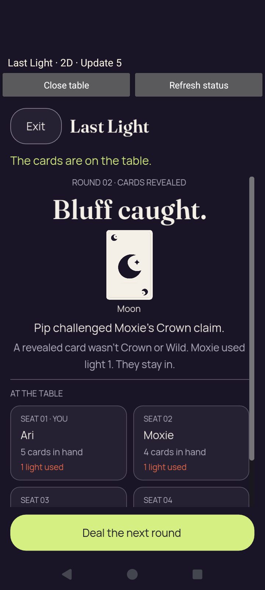</a> | **Native 2D round-2 public result after Next — 1× text** Android API 35 emulator, actual native 2D comparison host, debug APK Original: [10-next-round.png](2d-font-1.0-debug/2d/match/10-next-round.png) 720 × 1600 px; text 1× SHA-256: <code>03a7db1235529cd56a39d5acc3bb8fcb246d67caa6e2ed026b750b958a9cb17d</code> [Original UI dump](2d-font-1.0-debug/2d/match/10-next-round.xml) [Original measurements](2d-font-1.0-debug/2d/match/10-next-round.json) [Original result](2d-font-1.0-debug/result.json) This capture is already the round-2 public result, with Pip challenging Moxie’s Crown claim. The complete named consequence and Next action are visible. |
|  | **Native 2D round-4 public result after actual challenge — 1× text** Android API 35 emulator, actual native 2D comparison host, debug APK Original: [11-after-challenge.png](2d-font-1.0-debug/2d/match/11-after-challenge.png) 720 × 1600 px; text 1× SHA-256: <code>37a96b415688cbdb8d9c1028fa9bb96cd386e51ecb584dd9d5f7eb0147e374e9</code> [Original UI dump](2d-font-1.0-debug/2d/match/11-after-challenge.xml) [Original measurements](2d-font-1.0-debug/2d/match/11-after-challenge.json) [Original result](2d-font-1.0-debug/result.json) This capture is the round-4 public result, with Ari challenging Orbit’s Crown claim. The complete named consequence and Next action are visible. |
|  | **Native 2D Orbit wins at round 14 — 1× text** Android API 35 emulator, actual native 2D comparison host, debug APK Original: [12-winner.png](2d-font-1.0-debug/2d/match/12-winner.png) 720 × 1600 px; text 1× SHA-256: <code>e74cbb701eb5150fdbb59b4f6bfca6434ada79fcb0c912432413159180faa867</code> [Original UI dump](2d-font-1.0-debug/2d/match/12-winner.xml) [Original measurements](2d-font-1.0-debug/2d/match/12-winner.json) [Original result](2d-font-1.0-debug/result.json) Orbit wins at round 14/revision 41 after the public Moon disproves Moxie’s Crown claim and Moxie burns out on light 4. The complete named consequence and Return to lobby action are visible. |
|  | **Native 2D chooser restored after match return — 1× text** Android API 35 emulator, actual native 2D comparison host, debug APK Original: [14-chooser-after-exit.png](2d-font-1.0-debug/2d/match/14-chooser-after-exit.png) 720 × 1600 px; text 1× SHA-256: <code>243a2b9d3883ffb77eabe7bbbfe11a381a075f5a1a7c1a5e2307929003879f45</code> [Original UI dump](2d-font-1.0-debug/2d/match/14-chooser-after-exit.xml) [Original result](2d-font-1.0-debug/result.json) The accepted match return restores the chooser with both presentation actions; the original teardown records acknowledgment and actual child-process death. |
|  | **Native 2D fresh concealed entry before native Close — 1× text** Android API 35 emulator, actual native 2D comparison host, debug APK Original: [01-fresh-concealed.png](2d-font-1.0-debug/2d/native-exit/01-fresh-concealed.png) 720 × 1600 px; text 1× SHA-256: <code>9c15c1b559307ce8ef31d7e3ed8115380b8fe4eea38f6800015096df352f369d</code> [Original UI dump](2d-font-1.0-debug/2d/native-exit/01-fresh-concealed.xml) [Original measurements](2d-font-1.0-debug/2d/native-exit/01-fresh-concealed.json) [Original result](2d-font-1.0-debug/result.json) The complete Reveal action and concealed-panel borders are visible. |
|  | **Native 2D chooser restored after fresh native Close — 1× text** Android API 35 emulator, actual native 2D comparison host, debug APK Original: [14-chooser-after-exit.png](2d-font-1.0-debug/2d/native-exit/14-chooser-after-exit.png) 720 × 1600 px; text 1× SHA-256: <code>243a2b9d3883ffb77eabe7bbbfe11a381a075f5a1a7c1a5e2307929003879f45</code> [Original UI dump](2d-font-1.0-debug/2d/native-exit/14-chooser-after-exit.xml) [Original result](2d-font-1.0-debug/result.json) The fresh native Close restores the chooser with both presentation actions; the original teardown records acknowledgment and actual child-process death. |
|  | **Native 2D fresh concealed entry before scene Exit — 1× text** Android API 35 emulator, actual native 2D comparison host, debug APK Original: [01-fresh-concealed.png](2d-font-1.0-debug/2d/scene-exit/01-fresh-concealed.png) 720 × 1600 px; text 1× SHA-256: <code>9c15c1b559307ce8ef31d7e3ed8115380b8fe4eea38f6800015096df352f369d</code> [Original UI dump](2d-font-1.0-debug/2d/scene-exit/01-fresh-concealed.xml) [Original measurements](2d-font-1.0-debug/2d/scene-exit/01-fresh-concealed.json) [Original result](2d-font-1.0-debug/result.json) The complete Reveal action and concealed-panel borders are visible. |
|  | **Native 2D chooser restored after fresh scene Exit — 1× text** Android API 35 emulator, actual native 2D comparison host, debug APK Original: [14-chooser-after-exit.png](2d-font-1.0-debug/2d/scene-exit/14-chooser-after-exit.png) 720 × 1600 px; text 1× SHA-256: <code>243a2b9d3883ffb77eabe7bbbfe11a381a075f5a1a7c1a5e2307929003879f45</code> [Original UI dump](2d-font-1.0-debug/2d/scene-exit/14-chooser-after-exit.xml) [Original result](2d-font-1.0-debug/result.json) The fresh renderer Exit restores the chooser with both presentation actions; the original teardown records acknowledgment and actual child-process death. |
|  | **Native 2D initial native chooser — 1× text** Android API 35 emulator, actual native 2D comparison host, debug APK Original: [chooser.png](2d-font-1.0-debug/chooser.png) 720 × 1600 px; text 1× SHA-256: <code>243a2b9d3883ffb77eabe7bbbfe11a381a075f5a1a7c1a5e2307929003879f45</code> [Original UI dump](2d-font-1.0-debug/chooser.xml) [Original result](2d-font-1.0-debug/result.json) The chooser shows both presentation actions. This distinct original keeps its own source and hash even when pixels match another chooser. |
|  | **Native 2D final native chooser diagnostic — 1× text** Android API 35 emulator, actual native 2D comparison host, debug APK Original: [final-screen.png](2d-font-1.0-debug/final-screen.png) 720 × 1600 px; text 1× SHA-256: <code>243a2b9d3883ffb77eabe7bbbfe11a381a075f5a1a7c1a5e2307929003879f45</code> [Original result](2d-font-1.0-debug/result.json) The chooser shows both presentation actions. This distinct original keeps its own source and hash even when pixels match another chooser. |

## 2D / 200% text

| Original image | Scenario and provenance |
| --- | --- |
|  | **Native 2D reference match begins concealed — 2× text** Android API 35 emulator, actual native 2D comparison host, debug APK Original: [01-concealed.png](2d-font-2.0-debug/2d/match/01-concealed.png) 720 × 1600 px; text 2× SHA-256: <code>40ebbad17add95fc861cac61cac82afe73c450bdc171c401bc5343cc73106405</code> [Original UI dump](2d-font-2.0-debug/2d/match/01-concealed.xml) [Original measurements](2d-font-2.0-debug/2d/match/01-concealed.json) [Original result](2d-font-2.0-debug/result.json) The complete Reveal action and concealed-panel borders are visible. Lower actions continue below this initial viewport. |
| <a href="2d-font-2.0-debug/2d/match/02-revealed.png">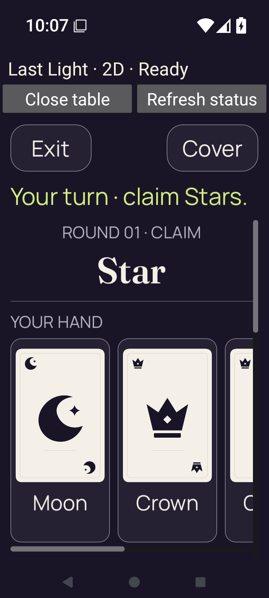</a> | **Native 2D own hand revealed — 2× text** Android API 35 emulator, actual native 2D comparison host, debug APK Original: [02-revealed.png](2d-font-2.0-debug/2d/match/02-revealed.png) 720 × 1600 px; text 2× SHA-256: <code>fb3f26286530e2c73a50ff28c9ca9c4919a78e644626d07267561e0d5d8dbea7</code> [Original UI dump](2d-font-2.0-debug/2d/match/02-revealed.xml) [Original measurements](2d-font-2.0-debug/2d/match/02-revealed.json) [Original result](2d-font-2.0-debug/result.json) The hand scrolls horizontally; this frame does not show every card in full. Two enlarged cards fit with a clipped third; Play and Challenge are below the hand-focused viewport. |
| <a href="2d-font-2.0-debug/2d/match/03-selected.png">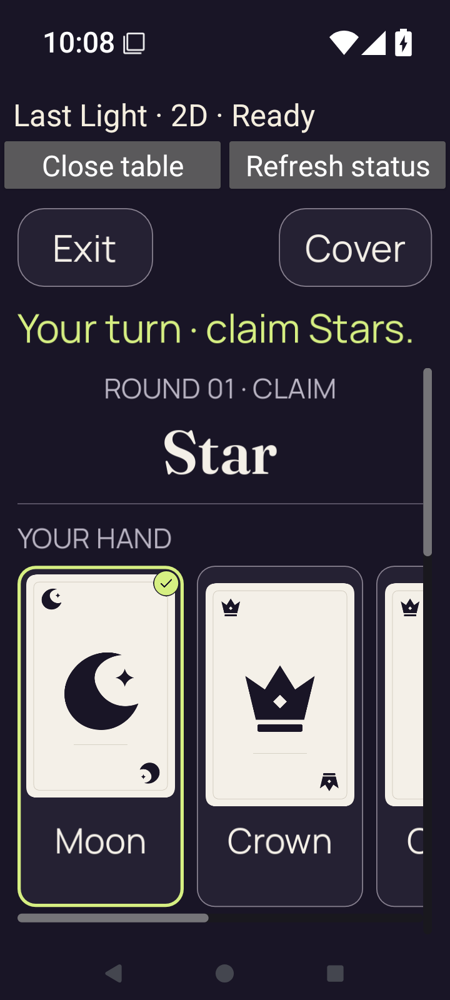</a> | **Native 2D Moon selected for a Star claim — 2× text** Android API 35 emulator, actual native 2D comparison host, debug APK Original: [03-selected.png](2d-font-2.0-debug/2d/match/03-selected.png) 720 × 1600 px; text 2× SHA-256: <code>33b0b6d1b69da8d6c1fe234248ed06f6ad957e02853c2527589606ddafd04ad3</code> [Original UI dump](2d-font-2.0-debug/2d/match/03-selected.xml) [Original measurements](2d-font-2.0-debug/2d/match/03-selected.json) [Original result](2d-font-2.0-debug/result.json) The hand scrolls horizontally; this frame does not show every card in full. Two enlarged cards fit with a clipped third; Play and Challenge are below the hand-focused viewport. Moon is visibly selected with a check/outline or explicit Selected · Moon control. |
|  | **Native 2D private hand covered and selection cleared — 2× text** Android API 35 emulator, actual native 2D comparison host, debug APK Original: [04-covered.png](2d-font-2.0-debug/2d/match/04-covered.png) 720 × 1600 px; text 2× SHA-256: <code>f5207cf63d43e6fb9f5ba1efb724a4f19332e65d3c26f56b626606c50e862d93</code> [Original UI dump](2d-font-2.0-debug/2d/match/04-covered.xml) [Original measurements](2d-font-2.0-debug/2d/match/04-covered.json) [Original result](2d-font-2.0-debug/result.json) Private faces, per-card rank labels and selection are absent after concealment. |
| <a href="2d-font-2.0-debug/2d/match/05-background-home.png">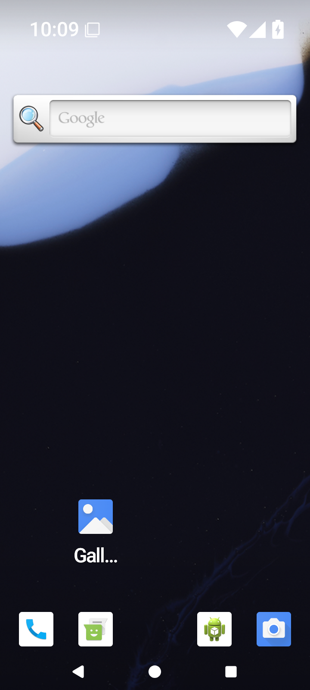</a> | **Native 2D actual Home during privacy exercise — 2× text** Android API 35 emulator, actual native 2D comparison host, debug APK Original: [05-background-home.png](2d-font-2.0-debug/2d/match/05-background-home.png) 720 × 1600 px; text 2× SHA-256: <code>8b9e3bc50a69577c15e21366423bb4e3dd78f436ed05bfff7068975cc09a62a7</code> [Original UI dump](2d-font-2.0-debug/2d/match/05-background-home.xml) [Original result](2d-font-2.0-debug/result.json) Actual Android Home during the privacy exercise; distinct from the excluded pre-install Launcher image. |
|  | **Native 2D opaque Recents preview — 2× text** Android API 35 emulator, actual native 2D comparison host, debug APK Original: [06-recents-privacy.png](2d-font-2.0-debug/2d/match/06-recents-privacy.png) 720 × 1600 px; text 2× SHA-256: <code>3a8ba51c96d0a0bd691a1b7df9c49238900f3cf6edacd66b17a708deebea4289</code> [Original UI dump](2d-font-2.0-debug/2d/match/06-recents-privacy.xml) [Original result](2d-font-2.0-debug/result.json) The actual Recents preview is opaque and contains no private game content. |
| <a href="2d-font-2.0-debug/2d/match/07-resumed-concealed.png">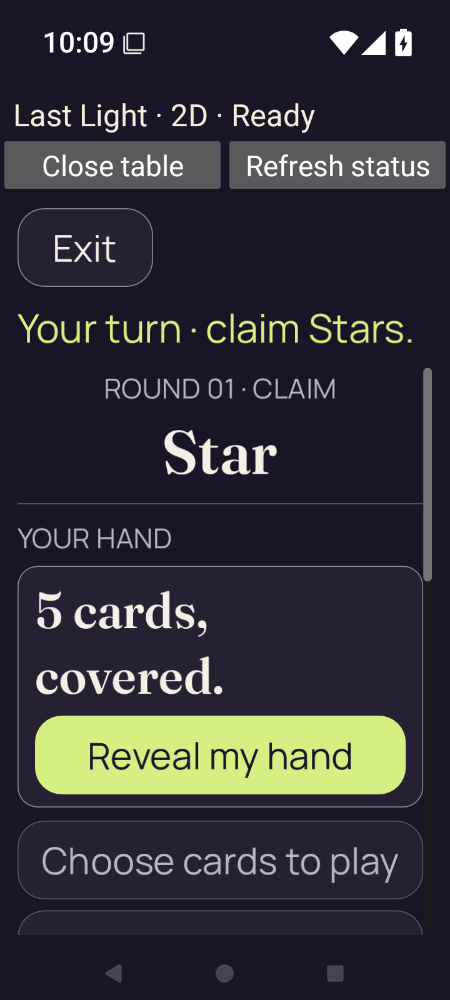</a> | **Native 2D same-process resume with concealed hand — 2× text** Android API 35 emulator, actual native 2D comparison host, debug APK Original: [07-resumed-concealed.png](2d-font-2.0-debug/2d/match/07-resumed-concealed.png) 720 × 1600 px; text 2× SHA-256: <code>802de8740eb73e1acb0e4f46b8fd44db57d696b3cd2162842650a8c80efa2cbf</code> [Original UI dump](2d-font-2.0-debug/2d/match/07-resumed-concealed.xml) [Original measurements](2d-font-2.0-debug/2d/match/07-resumed-concealed.json) [Original result](2d-font-2.0-debug/result.json) Private faces, per-card rank labels and selection are absent after concealment. Original process and presentation receipts establish the exercised same-process concealed resume. |
|  | **Native 2D public result after actual viewer play — 2× text** Android API 35 emulator, actual native 2D comparison host, debug APK Original: [08-after-play.png](2d-font-2.0-debug/2d/match/08-after-play.png) 720 × 1600 px; text 2× SHA-256: <code>edbaeaf7f98172357062dba6ec9c326b8d1fdd461f4601f9f4ff37771b036259</code> [Original UI dump](2d-font-2.0-debug/2d/match/08-after-play.xml) [Original measurements](2d-font-2.0-debug/2d/match/08-after-play.json) [Original result](2d-font-2.0-debug/result.json) Round-1 public result: Moxie challenges Ari’s Star claim, public Moon does not match, and Ari tests light 1 and stays in. Only the upper explanation fits. The rest of the consequence and Next action continue below this screenshot; later accepted input is separate evidence. |
| <a href="2d-font-2.0-debug/2d/match/09-public-outcome.png">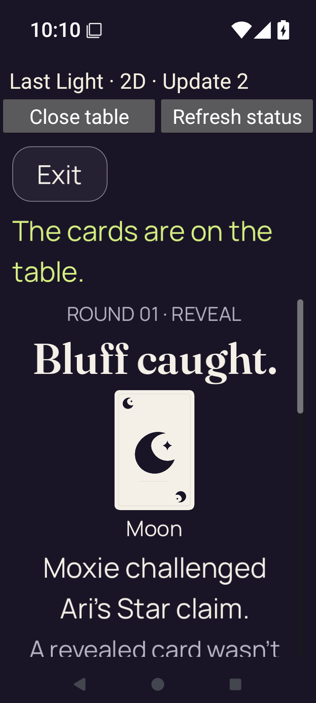</a> | **Native 2D round-1 public outcome — 2× text** Android API 35 emulator, actual native 2D comparison host, debug APK Original: [09-public-outcome.png](2d-font-2.0-debug/2d/match/09-public-outcome.png) 720 × 1600 px; text 2× SHA-256: <code>edbaeaf7f98172357062dba6ec9c326b8d1fdd461f4601f9f4ff37771b036259</code> [Original UI dump](2d-font-2.0-debug/2d/match/09-public-outcome.xml) [Original measurements](2d-font-2.0-debug/2d/match/09-public-outcome.json) [Original result](2d-font-2.0-debug/result.json) Round-1 public result: Moxie challenges Ari’s Star claim, public Moon does not match, and Ari tests light 1 and stays in. Only the upper explanation fits. The rest of the consequence and Next action continue below this screenshot; later accepted input is separate evidence. |
| <a href="2d-font-2.0-debug/2d/match/10-next-round.png">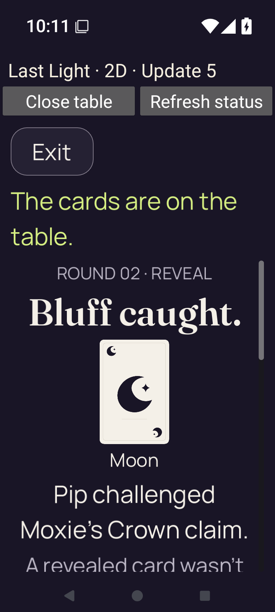</a> | **Native 2D round-2 public result after Next — 2× text** Android API 35 emulator, actual native 2D comparison host, debug APK Original: [10-next-round.png](2d-font-2.0-debug/2d/match/10-next-round.png) 720 × 1600 px; text 2× SHA-256: <code>0e45025b7424349b4a0c90fd6af62b851863f97fdd885ba6deceb2e9be75847a</code> [Original UI dump](2d-font-2.0-debug/2d/match/10-next-round.xml) [Original measurements](2d-font-2.0-debug/2d/match/10-next-round.json) [Original result](2d-font-2.0-debug/result.json) This capture is already the round-2 public result, with Pip challenging Moxie’s Crown claim. Only the upper explanation fits. The rest of the consequence and Next action continue below this screenshot; later accepted input is separate evidence. |
| <a href="2d-font-2.0-debug/2d/match/11-after-challenge.png">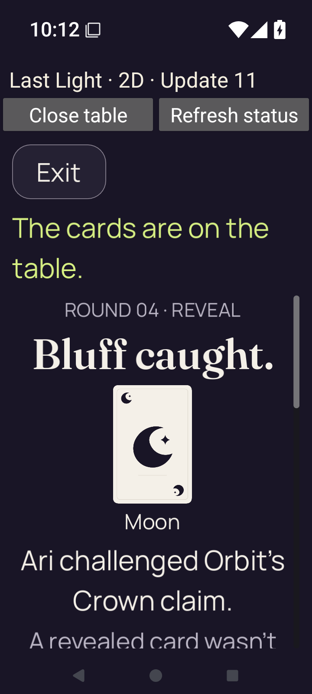</a> | **Native 2D round-4 public result after actual challenge — 2× text** Android API 35 emulator, actual native 2D comparison host, debug APK Original: [11-after-challenge.png](2d-font-2.0-debug/2d/match/11-after-challenge.png) 720 × 1600 px; text 2× SHA-256: <code>9d98e95e0f0e36dec5bf37fe455dd5baf734e799a3624f3cfae0960b5135946a</code> [Original UI dump](2d-font-2.0-debug/2d/match/11-after-challenge.xml) [Original measurements](2d-font-2.0-debug/2d/match/11-after-challenge.json) [Original result](2d-font-2.0-debug/result.json) This capture is the round-4 public result, with Ari challenging Orbit’s Crown claim. Only the upper explanation fits. The rest of the consequence and Next action continue below this screenshot; later accepted input is separate evidence. |
| <a href="2d-font-2.0-debug/2d/match/12-winner.png">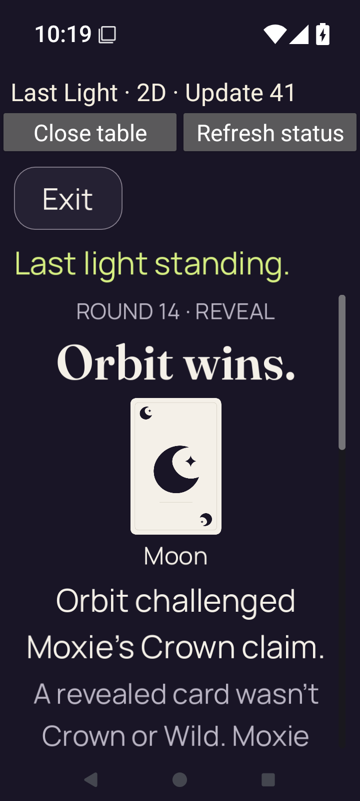</a> | **Native 2D Orbit wins at round 14 — 2× text** Android API 35 emulator, actual native 2D comparison host, debug APK Original: [12-winner.png](2d-font-2.0-debug/2d/match/12-winner.png) 720 × 1600 px; text 2× SHA-256: <code>381bed532b44a5b285c5d2febc03b979c735472850c2fbf8d9f5a3fec3089f02</code> [Original UI dump](2d-font-2.0-debug/2d/match/12-winner.xml) [Original measurements](2d-font-2.0-debug/2d/match/12-winner.json) [Original result](2d-font-2.0-debug/result.json) Orbit wins at round 14/revision 41 after the public Moon disproves Moxie’s Crown claim and Moxie burns out on light 4. The final consequence and Return to lobby continue below this viewport; the accepted return is retained in the input and teardown receipts. |
|  | **Native 2D chooser restored after match return — 2× text** Android API 35 emulator, actual native 2D comparison host, debug APK Original: [14-chooser-after-exit.png](2d-font-2.0-debug/2d/match/14-chooser-after-exit.png) 720 × 1600 px; text 2× SHA-256: <code>5de28aa6e3ca7354b38552da93c4949769a534e155c6dc9e552305c2504eebf2</code> [Original UI dump](2d-font-2.0-debug/2d/match/14-chooser-after-exit.xml) [Original result](2d-font-2.0-debug/result.json) The accepted match return restores the chooser with both presentation actions; the original teardown records acknowledgment and actual child-process death. |
| <a href="2d-font-2.0-debug/2d/native-exit/01-fresh-concealed.png">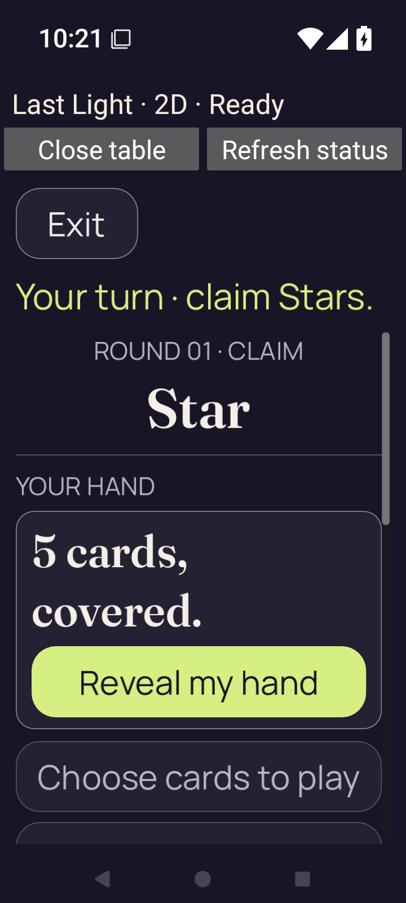</a> | **Native 2D fresh concealed entry before native Close — 2× text** Android API 35 emulator, actual native 2D comparison host, debug APK Original: [01-fresh-concealed.png](2d-font-2.0-debug/2d/native-exit/01-fresh-concealed.png) 720 × 1600 px; text 2× SHA-256: <code>388be28d0f9aaf2dfb384f453d832ebed9c0b3c19731ef56e19f183d97c01774</code> [Original UI dump](2d-font-2.0-debug/2d/native-exit/01-fresh-concealed.xml) [Original measurements](2d-font-2.0-debug/2d/native-exit/01-fresh-concealed.json) [Original result](2d-font-2.0-debug/result.json) The complete Reveal action and concealed-panel borders are visible. Lower actions continue below this initial viewport. |
|  | **Native 2D chooser restored after fresh native Close — 2× text** Android API 35 emulator, actual native 2D comparison host, debug APK Original: [14-chooser-after-exit.png](2d-font-2.0-debug/2d/native-exit/14-chooser-after-exit.png) 720 × 1600 px; text 2× SHA-256: <code>0d093cc0144b5477e2a85ccbef590351917ea9c144856b8ae6ef7af78cf325a2</code> [Original UI dump](2d-font-2.0-debug/2d/native-exit/14-chooser-after-exit.xml) [Original result](2d-font-2.0-debug/result.json) The fresh native Close restores the chooser with both presentation actions; the original teardown records acknowledgment and actual child-process death. |
|  | **Native 2D fresh concealed entry before scene Exit — 2× text** Android API 35 emulator, actual native 2D comparison host, debug APK Original: [01-fresh-concealed.png](2d-font-2.0-debug/2d/scene-exit/01-fresh-concealed.png) 720 × 1600 px; text 2× SHA-256: <code>fefee1f2f93aaab71fd1d96865942ba8e77da9ec6c56ab470e111f69c38b80ea</code> [Original UI dump](2d-font-2.0-debug/2d/scene-exit/01-fresh-concealed.xml) [Original measurements](2d-font-2.0-debug/2d/scene-exit/01-fresh-concealed.json) [Original result](2d-font-2.0-debug/result.json) The complete Reveal action and concealed-panel borders are visible. Lower actions continue below this initial viewport. |
|  | **Native 2D chooser restored after fresh scene Exit — 2× text** Android API 35 emulator, actual native 2D comparison host, debug APK Original: [14-chooser-after-exit.png](2d-font-2.0-debug/2d/scene-exit/14-chooser-after-exit.png) 720 × 1600 px; text 2× SHA-256: <code>224d53d21be41841eb0150d3b13c43eef216f6eac68c4a7dada36b12b3328cb5</code> [Original UI dump](2d-font-2.0-debug/2d/scene-exit/14-chooser-after-exit.xml) [Original result](2d-font-2.0-debug/result.json) The fresh renderer Exit restores the chooser with both presentation actions; the original teardown records acknowledgment and actual child-process death. |
|  | **Native 2D initial native chooser — 2× text** Android API 35 emulator, actual native 2D comparison host, debug APK Original: [chooser.png](2d-font-2.0-debug/chooser.png) 720 × 1600 px; text 2× SHA-256: <code>974db6c031ca2363dc2118b452bc4761f72c613c435ffabcade5f96112883f86</code> [Original UI dump](2d-font-2.0-debug/chooser.xml) [Original result](2d-font-2.0-debug/result.json) The chooser shows both presentation actions. This distinct original keeps its own source and hash even when pixels match another chooser. |
|  | **Native 2D final native chooser diagnostic — 2× text** Android API 35 emulator, actual native 2D comparison host, debug APK Original: [final-screen.png](2d-font-2.0-debug/final-screen.png) 720 × 1600 px; text 2× SHA-256: <code>0d093cc0144b5477e2a85ccbef590351917ea9c144856b8ae6ef7af78cf325a2</code> [Original result](2d-font-2.0-debug/result.json) The chooser shows both presentation actions. This distinct original keeps its own source and hash even when pixels match another chooser. |

## 3D / 100% text

| Original image | Scenario and provenance |
| --- | --- |
|  | **Native 3D reference match begins concealed — 1× text** Android API 35 emulator, actual native 3D comparison host, debug APK Original: [01-concealed.png](3d-font-1.0-debug/3d/match/01-concealed.png) 720 × 1600 px; text 1× SHA-256: <code>65057e0353a02e5e2bd19b44f3bcd0ff2d42c9e76b00c4e065ef9a8a403627d3</code> [Original UI dump](3d-font-1.0-debug/3d/match/01-concealed.xml) [Original measurements](3d-font-1.0-debug/3d/match/01-concealed.json) [Original result](3d-font-1.0-debug/result.json) Private faces, rank labels and selection are concealed; Show hand is complete. |
|  | **Native 3D own hand revealed — 1× text** Android API 35 emulator, actual native 3D comparison host, debug APK Original: [02-revealed.png](3d-font-1.0-debug/3d/match/02-revealed.png) 720 × 1600 px; text 1× SHA-256: <code>a1d671fab132750072bef87181bee125ccc35de0b819edc95182cbab7a1dd3b8</code> [Original UI dump](3d-font-1.0-debug/3d/match/02-revealed.xml) [Original measurements](3d-font-1.0-debug/3d/match/02-revealed.json) [Original result](3d-font-1.0-debug/result.json) All five normal-size cards and rank words fit. The seat roster scrolls horizontally. |
|  | **Native 3D Moon selected for a Star claim — 1× text** Android API 35 emulator, actual native 3D comparison host, debug APK Original: [03-selected.png](3d-font-1.0-debug/3d/match/03-selected.png) 720 × 1600 px; text 1× SHA-256: <code>b24d50483d6a4d39302fd0b402b91c0768300515bf4edc24e4257b790b26b7a0</code> [Original UI dump](3d-font-1.0-debug/3d/match/03-selected.xml) [Original measurements](3d-font-1.0-debug/3d/match/03-selected.json) [Original result](3d-font-1.0-debug/result.json) All five normal-size cards and rank words fit. The seat roster scrolls horizontally. Moon is visibly selected with a check/outline or explicit Selected · Moon control. |
|  | **Native 3D private hand covered and selection cleared — 1× text** Android API 35 emulator, actual native 3D comparison host, debug APK Original: [04-covered.png](3d-font-1.0-debug/3d/match/04-covered.png) 720 × 1600 px; text 1× SHA-256: <code>28da282a1b591f62ae4009d0d0f33ccfee47d5cb3c5a745f9e5947e41da37985</code> [Original UI dump](3d-font-1.0-debug/3d/match/04-covered.xml) [Original measurements](3d-font-1.0-debug/3d/match/04-covered.json) [Original result](3d-font-1.0-debug/result.json) Private faces, per-card rank labels and selection are absent after concealment. |
|  | **Native 3D actual Home during privacy exercise — 1× text** Android API 35 emulator, actual native 3D comparison host, debug APK Original: [05-background-home.png](3d-font-1.0-debug/3d/match/05-background-home.png) 720 × 1600 px; text 1× SHA-256: <code>5c310a5cc252feca19c8c8183330d1d154d093ba80e701c9b9696982568eb576</code> [Original UI dump](3d-font-1.0-debug/3d/match/05-background-home.xml) [Original result](3d-font-1.0-debug/result.json) Actual Android Home during the privacy exercise; distinct from the excluded pre-install Launcher image. |
|  | **Native 3D opaque Recents preview — 1× text** Android API 35 emulator, actual native 3D comparison host, debug APK Original: [06-recents-privacy.png](3d-font-1.0-debug/3d/match/06-recents-privacy.png) 720 × 1600 px; text 1× SHA-256: <code>fa26e159dc1b7dffe2e8b174b8c4148a69735bd739ee68a02279c6e5138d3d47</code> [Original UI dump](3d-font-1.0-debug/3d/match/06-recents-privacy.xml) [Original result](3d-font-1.0-debug/result.json) The actual Recents preview is opaque and contains no private game content. |
|  | **Native 3D same-process resume with concealed hand — 1× text** Android API 35 emulator, actual native 3D comparison host, debug APK Original: [07-resumed-concealed.png](3d-font-1.0-debug/3d/match/07-resumed-concealed.png) 720 × 1600 px; text 1× SHA-256: <code>65057e0353a02e5e2bd19b44f3bcd0ff2d42c9e76b00c4e065ef9a8a403627d3</code> [Original UI dump](3d-font-1.0-debug/3d/match/07-resumed-concealed.xml) [Original measurements](3d-font-1.0-debug/3d/match/07-resumed-concealed.json) [Original result](3d-font-1.0-debug/result.json) Private faces, per-card rank labels and selection are absent after concealment. Original process and presentation receipts establish the exercised same-process concealed resume. |
|  | **Native 3D public result after actual viewer play — 1× text** Android API 35 emulator, actual native 3D comparison host, debug APK Original: [08-after-play.png](3d-font-1.0-debug/3d/match/08-after-play.png) 720 × 1600 px; text 1× SHA-256: <code>180d4554715dd249147fe41ce9607d6d6f10c2dda5a5fbd59b2995de65a58951</code> [Original UI dump](3d-font-1.0-debug/3d/match/08-after-play.xml) [Original measurements](3d-font-1.0-debug/3d/match/08-after-play.json) [Original result](3d-font-1.0-debug/result.json) Round-1 public result: Moxie challenges Ari’s Star claim, public Moon does not match, and Ari tests light 1 and stays in. The complete named consequence and Next action are visible. |
|  | **Native 3D round-1 public outcome — 1× text** Android API 35 emulator, actual native 3D comparison host, debug APK Original: [09-public-outcome.png](3d-font-1.0-debug/3d/match/09-public-outcome.png) 720 × 1600 px; text 1× SHA-256: <code>180d4554715dd249147fe41ce9607d6d6f10c2dda5a5fbd59b2995de65a58951</code> [Original UI dump](3d-font-1.0-debug/3d/match/09-public-outcome.xml) [Original measurements](3d-font-1.0-debug/3d/match/09-public-outcome.json) [Original result](3d-font-1.0-debug/result.json) Round-1 public result: Moxie challenges Ari’s Star claim, public Moon does not match, and Ari tests light 1 and stays in. The complete named consequence and Next action are visible. |
| <a href="3d-font-1.0-debug/3d/match/10-next-round.png">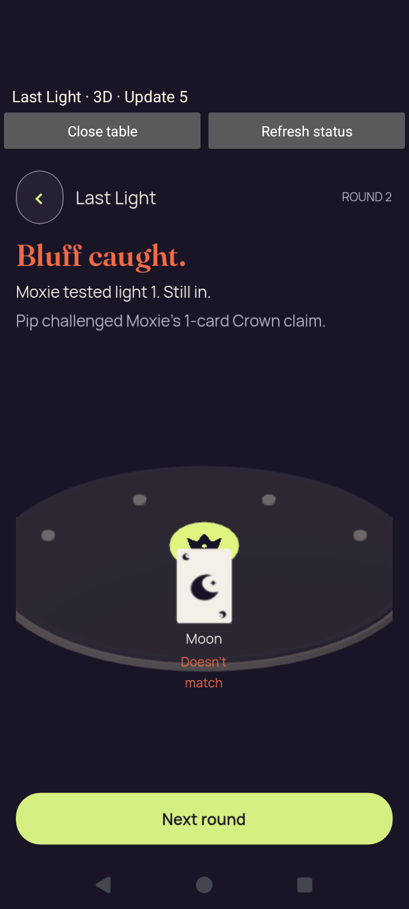</a> | **Native 3D round-2 public result after Next — 1× text** Android API 35 emulator, actual native 3D comparison host, debug APK Original: [10-next-round.png](3d-font-1.0-debug/3d/match/10-next-round.png) 720 × 1600 px; text 1× SHA-256: <code>cdb8095d9aca7024308999c8c532e396a7b1ffde89301d6f7f867682f1621368</code> [Original UI dump](3d-font-1.0-debug/3d/match/10-next-round.xml) [Original measurements](3d-font-1.0-debug/3d/match/10-next-round.json) [Original result](3d-font-1.0-debug/result.json) This capture is already the round-2 public result, with Pip challenging Moxie’s Crown claim. The complete named consequence and Next action are visible. |
|  | **Native 3D round-4 public result after actual challenge — 1× text** Android API 35 emulator, actual native 3D comparison host, debug APK Original: [11-after-challenge.png](3d-font-1.0-debug/3d/match/11-after-challenge.png) 720 × 1600 px; text 1× SHA-256: <code>238768d46b77de987df2a31d6618f58fb7d877fe3b5a10879f357316277a8c1c</code> [Original UI dump](3d-font-1.0-debug/3d/match/11-after-challenge.xml) [Original measurements](3d-font-1.0-debug/3d/match/11-after-challenge.json) [Original result](3d-font-1.0-debug/result.json) This capture is the round-4 public result, with Ari challenging Orbit’s Crown claim. The complete named consequence and Next action are visible. |
|  | **Native 3D Orbit wins at round 14 — 1× text** Android API 35 emulator, actual native 3D comparison host, debug APK Original: [12-winner.png](3d-font-1.0-debug/3d/match/12-winner.png) 720 × 1600 px; text 1× SHA-256: <code>bc5f8c106fa37ee4bddb3dc2c225c9a5adf376ffe61b52072f88ce0c4070175d</code> [Original UI dump](3d-font-1.0-debug/3d/match/12-winner.xml) [Original measurements](3d-font-1.0-debug/3d/match/12-winner.json) [Original result](3d-font-1.0-debug/result.json) Orbit wins at round 14/revision 41 after the public Moon disproves Moxie’s Crown claim and Moxie burns out on light 4. The correct Crown emblem, complete named consequence and Back to room action are visible. |
|  | **Native 3D chooser restored after match return — 1× text** Android API 35 emulator, actual native 3D comparison host, debug APK Original: [14-chooser-after-exit.png](3d-font-1.0-debug/3d/match/14-chooser-after-exit.png) 720 × 1600 px; text 1× SHA-256: <code>243a2b9d3883ffb77eabe7bbbfe11a381a075f5a1a7c1a5e2307929003879f45</code> [Original UI dump](3d-font-1.0-debug/3d/match/14-chooser-after-exit.xml) [Original result](3d-font-1.0-debug/result.json) The accepted match return restores the chooser with both presentation actions; the original teardown records acknowledgment and actual child-process death. |
| <a href="3d-font-1.0-debug/3d/native-exit/01-fresh-concealed.png">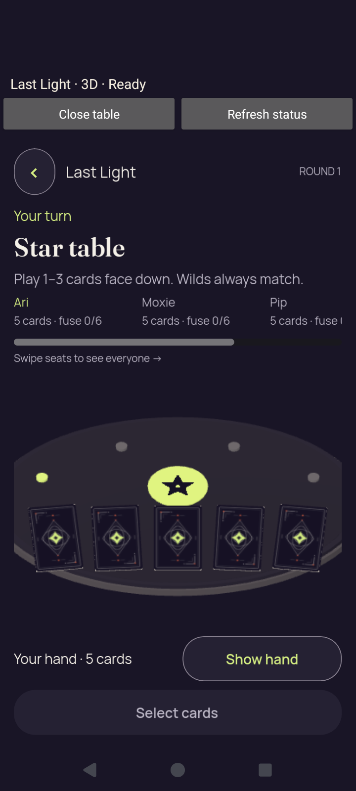</a> | **Native 3D fresh concealed entry before native Back — 1× text** Android API 35 emulator, actual native 3D comparison host, debug APK Original: [01-fresh-concealed.png](3d-font-1.0-debug/3d/native-exit/01-fresh-concealed.png) 720 × 1600 px; text 1× SHA-256: <code>65057e0353a02e5e2bd19b44f3bcd0ff2d42c9e76b00c4e065ef9a8a403627d3</code> [Original UI dump](3d-font-1.0-debug/3d/native-exit/01-fresh-concealed.xml) [Original measurements](3d-font-1.0-debug/3d/native-exit/01-fresh-concealed.json) [Original result](3d-font-1.0-debug/result.json) Private faces, rank labels and selection are concealed; Show hand is complete. |
|  | **Native 3D chooser restored after fresh native Back — 1× text** Android API 35 emulator, actual native 3D comparison host, debug APK Original: [14-chooser-after-exit.png](3d-font-1.0-debug/3d/native-exit/14-chooser-after-exit.png) 720 × 1600 px; text 1× SHA-256: <code>243a2b9d3883ffb77eabe7bbbfe11a381a075f5a1a7c1a5e2307929003879f45</code> [Original UI dump](3d-font-1.0-debug/3d/native-exit/14-chooser-after-exit.xml) [Original result](3d-font-1.0-debug/result.json) The fresh native Back restores the chooser with both presentation actions; the original teardown records acknowledgment and actual child-process death. |
|  | **Native 3D fresh concealed entry before scene Exit — 1× text** Android API 35 emulator, actual native 3D comparison host, debug APK Original: [01-fresh-concealed.png](3d-font-1.0-debug/3d/scene-exit/01-fresh-concealed.png) 720 × 1600 px; text 1× SHA-256: <code>65057e0353a02e5e2bd19b44f3bcd0ff2d42c9e76b00c4e065ef9a8a403627d3</code> [Original UI dump](3d-font-1.0-debug/3d/scene-exit/01-fresh-concealed.xml) [Original measurements](3d-font-1.0-debug/3d/scene-exit/01-fresh-concealed.json) [Original result](3d-font-1.0-debug/result.json) Private faces, rank labels and selection are concealed; Show hand is complete. |
|  | **Native 3D chooser restored after fresh scene Exit — 1× text** Android API 35 emulator, actual native 3D comparison host, debug APK Original: [14-chooser-after-exit.png](3d-font-1.0-debug/3d/scene-exit/14-chooser-after-exit.png) 720 × 1600 px; text 1× SHA-256: <code>243a2b9d3883ffb77eabe7bbbfe11a381a075f5a1a7c1a5e2307929003879f45</code> [Original UI dump](3d-font-1.0-debug/3d/scene-exit/14-chooser-after-exit.xml) [Original result](3d-font-1.0-debug/result.json) The fresh renderer Exit restores the chooser with both presentation actions; the original teardown records acknowledgment and actual child-process death. |
|  | **Native 3D initial native chooser — 1× text** Android API 35 emulator, actual native 3D comparison host, debug APK Original: [chooser.png](3d-font-1.0-debug/chooser.png) 720 × 1600 px; text 1× SHA-256: <code>243a2b9d3883ffb77eabe7bbbfe11a381a075f5a1a7c1a5e2307929003879f45</code> [Original UI dump](3d-font-1.0-debug/chooser.xml) [Original result](3d-font-1.0-debug/result.json) The chooser shows both presentation actions. This distinct original keeps its own source and hash even when pixels match another chooser. |
|  | **Native 3D final native chooser diagnostic — 1× text** Android API 35 emulator, actual native 3D comparison host, debug APK Original: [final-screen.png](3d-font-1.0-debug/final-screen.png) 720 × 1600 px; text 1× SHA-256: <code>243a2b9d3883ffb77eabe7bbbfe11a381a075f5a1a7c1a5e2307929003879f45</code> [Original result](3d-font-1.0-debug/result.json) The chooser shows both presentation actions. This distinct original keeps its own source and hash even when pixels match another chooser. |

## 3D / 200% text

| Original image | Scenario and provenance |
| --- | --- |
| <a href="3d-font-2.0-debug/3d/match/01-concealed.png">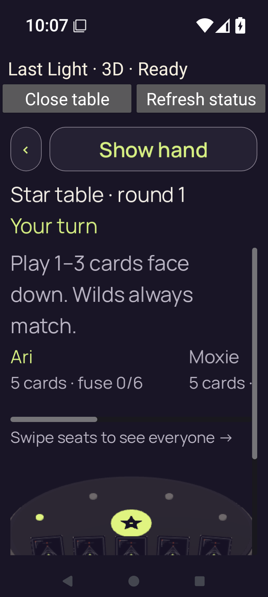</a> | **Native 3D reference match begins concealed — 2× text** Android API 35 emulator, actual native 3D comparison host, debug APK Original: [01-concealed.png](3d-font-2.0-debug/3d/match/01-concealed.png) 720 × 1600 px; text 2× SHA-256: <code>fe84d75cc26844dbfd473ff2b1a7161b3d9194e401960a2ea640945b9de627cc</code> [Original UI dump](3d-font-2.0-debug/3d/match/01-concealed.xml) [Original measurements](3d-font-2.0-debug/3d/match/01-concealed.json) [Original result](3d-font-2.0-debug/result.json) Private faces, rank labels and selection are concealed; Show hand is complete. Turn, rank and round remain pinned; the lower table/hand continues below the viewport. |
| <a href="3d-font-2.0-debug/3d/match/02-revealed.png">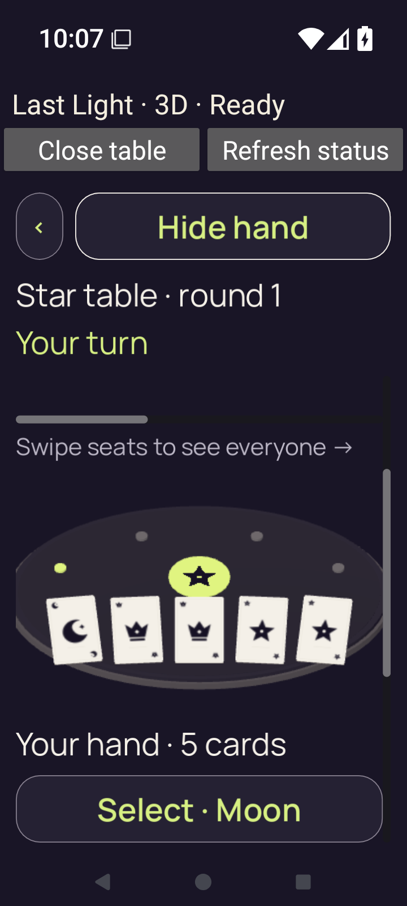</a> | **Native 3D own hand revealed — 2× text** Android API 35 emulator, actual native 3D comparison host, debug APK Original: [02-revealed.png](3d-font-2.0-debug/3d/match/02-revealed.png) 720 × 1600 px; text 2× SHA-256: <code>45ccdc05a60f7bd6501e0e9a7de164bec74f83f08702701bf2f1ef0be01aafa3</code> [Original UI dump](3d-font-2.0-debug/3d/match/02-revealed.xml) [Original measurements](3d-font-2.0-debug/3d/match/02-revealed.json) [Original result](3d-font-2.0-debug/result.json) Pinned Show/Hide and turn/rank/round context remain visible. Enlarged card controls scroll; lower controls and Play are not all visible together. |
| <a href="3d-font-2.0-debug/3d/match/03-selected.png">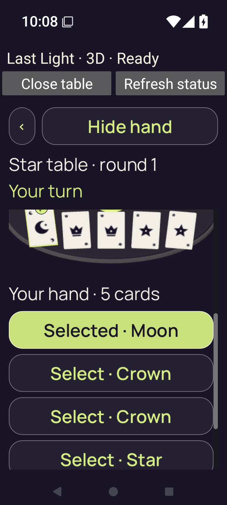</a> | **Native 3D Moon selected for a Star claim — 2× text** Android API 35 emulator, actual native 3D comparison host, debug APK Original: [03-selected.png](3d-font-2.0-debug/3d/match/03-selected.png) 720 × 1600 px; text 2× SHA-256: <code>0ec1aab39a0cc67c6b1bce70b676dd9f27fcc0457e6071b22c15d3c876faead4</code> [Original UI dump](3d-font-2.0-debug/3d/match/03-selected.xml) [Original measurements](3d-font-2.0-debug/3d/match/03-selected.json) [Original result](3d-font-2.0-debug/result.json) Pinned Show/Hide and turn/rank/round context remain visible. Enlarged card controls scroll; lower controls and Play are not all visible together. Moon is visibly selected with a check/outline or explicit Selected · Moon control. |
| <a href="3d-font-2.0-debug/3d/match/04-covered.png">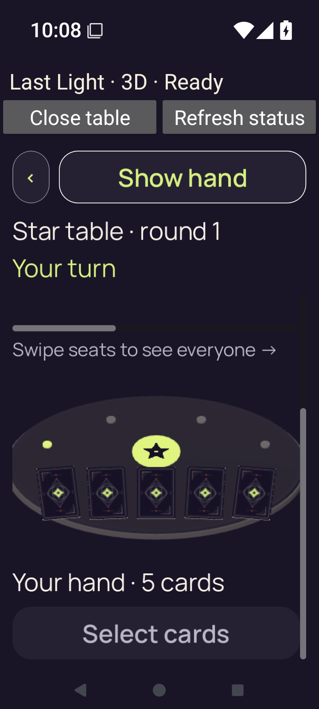</a> | **Native 3D private hand covered and selection cleared — 2× text** Android API 35 emulator, actual native 3D comparison host, debug APK Original: [04-covered.png](3d-font-2.0-debug/3d/match/04-covered.png) 720 × 1600 px; text 2× SHA-256: <code>4108f9eb00cdd4e5572ebea6697b0ccd4a32b1e0b1a172dc166e8338ffde0730</code> [Original UI dump](3d-font-2.0-debug/3d/match/04-covered.xml) [Original measurements](3d-font-2.0-debug/3d/match/04-covered.json) [Original result](3d-font-2.0-debug/result.json) Private faces, per-card rank labels and selection are absent after concealment. |
|  | **Native 3D actual Home during privacy exercise — 2× text** Android API 35 emulator, actual native 3D comparison host, debug APK Original: [05-background-home.png](3d-font-2.0-debug/3d/match/05-background-home.png) 720 × 1600 px; text 2× SHA-256: <code>8b9e3bc50a69577c15e21366423bb4e3dd78f436ed05bfff7068975cc09a62a7</code> [Original UI dump](3d-font-2.0-debug/3d/match/05-background-home.xml) [Original result](3d-font-2.0-debug/result.json) Actual Android Home during the privacy exercise; distinct from the excluded pre-install Launcher image. |
| <a href="3d-font-2.0-debug/3d/match/06-recents-privacy.png">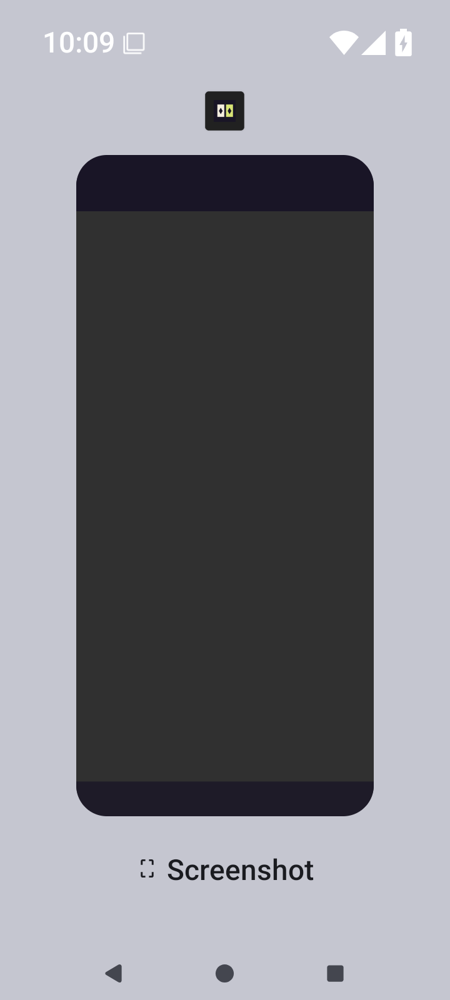</a> | **Native 3D opaque Recents preview — 2× text** Android API 35 emulator, actual native 3D comparison host, debug APK Original: [06-recents-privacy.png](3d-font-2.0-debug/3d/match/06-recents-privacy.png) 720 × 1600 px; text 2× SHA-256: <code>3a8ba51c96d0a0bd691a1b7df9c49238900f3cf6edacd66b17a708deebea4289</code> [Original UI dump](3d-font-2.0-debug/3d/match/06-recents-privacy.xml) [Original result](3d-font-2.0-debug/result.json) The actual Recents preview is opaque and contains no private game content. |
|  | **Native 3D same-process resume with concealed hand — 2× text** Android API 35 emulator, actual native 3D comparison host, debug APK Original: [07-resumed-concealed.png](3d-font-2.0-debug/3d/match/07-resumed-concealed.png) 720 × 1600 px; text 2× SHA-256: <code>915931f080f04642f839342bbc0ff8e51e11c64a87a9646778f88f0ab27e02e7</code> [Original UI dump](3d-font-2.0-debug/3d/match/07-resumed-concealed.xml) [Original measurements](3d-font-2.0-debug/3d/match/07-resumed-concealed.json) [Original result](3d-font-2.0-debug/result.json) Private faces, per-card rank labels and selection are absent after concealment. Original process and presentation receipts establish the exercised same-process concealed resume. |
|  | **Native 3D public result after actual viewer play — 2× text** Android API 35 emulator, actual native 3D comparison host, debug APK Original: [08-after-play.png](3d-font-2.0-debug/3d/match/08-after-play.png) 720 × 1600 px; text 2× SHA-256: <code>e32628487d1334a39127f3b82da55e6947820c70d6fa93e6dc101ddbb16ceb05</code> [Original UI dump](3d-font-2.0-debug/3d/match/08-after-play.xml) [Original measurements](3d-font-2.0-debug/3d/match/08-after-play.json) [Original result](3d-font-2.0-debug/result.json) Round-1 public result: Moxie challenges Ari’s Star claim, public Moon does not match, and Ari tests light 1 and stays in. The named consequence and public mismatch text fit; Next is clipped or below this viewport. Later accepted input establishes reachability. |
| <a href="3d-font-2.0-debug/3d/match/09-public-outcome.png">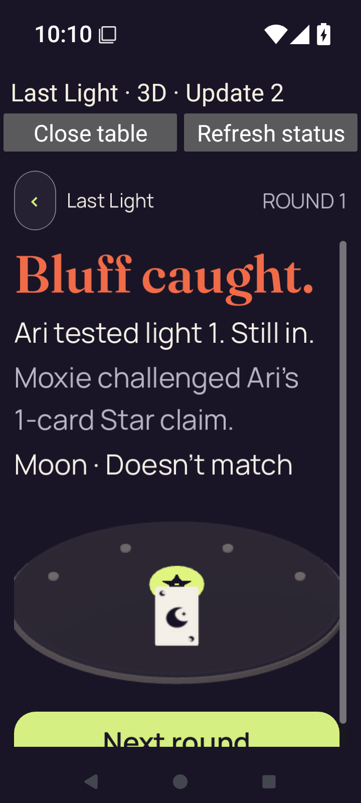</a> | **Native 3D round-1 public outcome — 2× text** Android API 35 emulator, actual native 3D comparison host, debug APK Original: [09-public-outcome.png](3d-font-2.0-debug/3d/match/09-public-outcome.png) 720 × 1600 px; text 2× SHA-256: <code>e32628487d1334a39127f3b82da55e6947820c70d6fa93e6dc101ddbb16ceb05</code> [Original UI dump](3d-font-2.0-debug/3d/match/09-public-outcome.xml) [Original measurements](3d-font-2.0-debug/3d/match/09-public-outcome.json) [Original result](3d-font-2.0-debug/result.json) Round-1 public result: Moxie challenges Ari’s Star claim, public Moon does not match, and Ari tests light 1 and stays in. The named consequence and public mismatch text fit; Next is clipped or below this viewport. Later accepted input establishes reachability. |
| <a href="3d-font-2.0-debug/3d/match/10-next-round.png">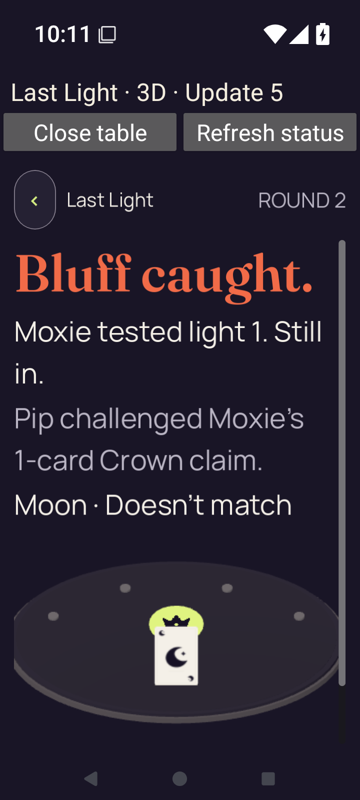</a> | **Native 3D round-2 public result after Next — 2× text** Android API 35 emulator, actual native 3D comparison host, debug APK Original: [10-next-round.png](3d-font-2.0-debug/3d/match/10-next-round.png) 720 × 1600 px; text 2× SHA-256: <code>a75527ca056c39f5954477a94d71f4b5ac8b05b08b60d5b27d02ca5872ec45d4</code> [Original UI dump](3d-font-2.0-debug/3d/match/10-next-round.xml) [Original measurements](3d-font-2.0-debug/3d/match/10-next-round.json) [Original result](3d-font-2.0-debug/result.json) This capture is already the round-2 public result, with Pip challenging Moxie’s Crown claim. The named consequence and public mismatch text fit; Next is clipped or below this viewport. Later accepted input establishes reachability. |
| <a href="3d-font-2.0-debug/3d/match/11-after-challenge.png">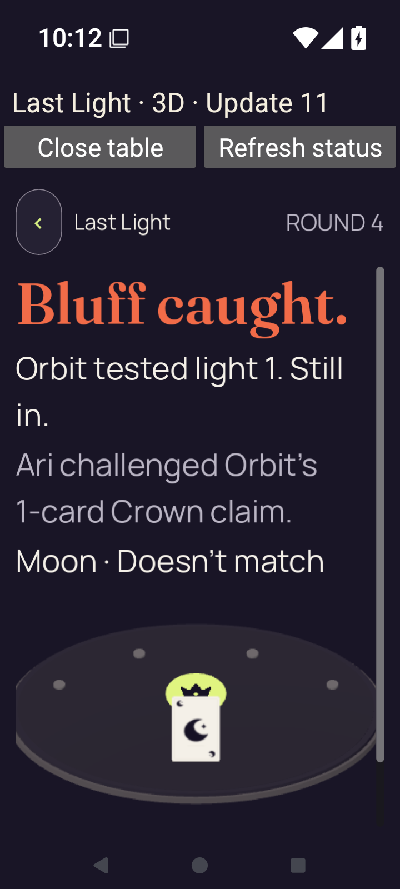</a> | **Native 3D round-4 public result after actual challenge — 2× text** Android API 35 emulator, actual native 3D comparison host, debug APK Original: [11-after-challenge.png](3d-font-2.0-debug/3d/match/11-after-challenge.png) 720 × 1600 px; text 2× SHA-256: <code>d019e4b73f3aa02c9bcc25f591c59cd0a9bd9cc669bbd796c9f87e331fad5428</code> [Original UI dump](3d-font-2.0-debug/3d/match/11-after-challenge.xml) [Original measurements](3d-font-2.0-debug/3d/match/11-after-challenge.json) [Original result](3d-font-2.0-debug/result.json) This capture is the round-4 public result, with Ari challenging Orbit’s Crown claim. The named consequence and public mismatch text fit; Next is clipped or below this viewport. Later accepted input establishes reachability. |
| <a href="3d-font-2.0-debug/3d/match/12-winner.png">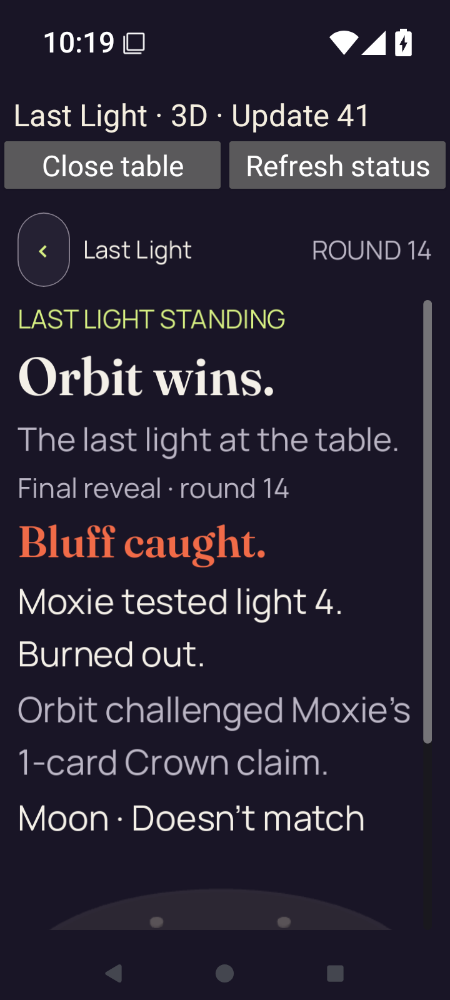</a> | **Native 3D Orbit wins at round 14 — 2× text** Android API 35 emulator, actual native 3D comparison host, debug APK Original: [12-winner.png](3d-font-2.0-debug/3d/match/12-winner.png) 720 × 1600 px; text 2× SHA-256: <code>b456779406b3d04d2568022164400e70beb7fdc44cf4934019fe00e3edf6bfc9</code> [Original UI dump](3d-font-2.0-debug/3d/match/12-winner.xml) [Original measurements](3d-font-2.0-debug/3d/match/12-winner.json) [Original result](3d-font-2.0-debug/result.json) Orbit wins at round 14/revision 41 after the public Moon disproves Moxie’s Crown claim and Moxie burns out on light 4. The named final consequence fits in text. The table and Back to room action continue below this viewport. |
|  | **Native 3D chooser restored after match return — 2× text** Android API 35 emulator, actual native 3D comparison host, debug APK Original: [14-chooser-after-exit.png](3d-font-2.0-debug/3d/match/14-chooser-after-exit.png) 720 × 1600 px; text 2× SHA-256: <code>5de28aa6e3ca7354b38552da93c4949769a534e155c6dc9e552305c2504eebf2</code> [Original UI dump](3d-font-2.0-debug/3d/match/14-chooser-after-exit.xml) [Original result](3d-font-2.0-debug/result.json) The accepted match return restores the chooser with both presentation actions; the original teardown records acknowledgment and actual child-process death. |
|  | **Native 3D fresh concealed entry before native Back — 2× text** Android API 35 emulator, actual native 3D comparison host, debug APK Original: [01-fresh-concealed.png](3d-font-2.0-debug/3d/native-exit/01-fresh-concealed.png) 720 × 1600 px; text 2× SHA-256: <code>869519490647f88cafcc3a8b55e8377031d0bff3658bc72ff6633f26ae1de43f</code> [Original UI dump](3d-font-2.0-debug/3d/native-exit/01-fresh-concealed.xml) [Original measurements](3d-font-2.0-debug/3d/native-exit/01-fresh-concealed.json) [Original result](3d-font-2.0-debug/result.json) Private faces, rank labels and selection are concealed; Show hand is complete. Turn, rank and round remain pinned; the lower table/hand continues below the viewport. |
|  | **Native 3D chooser restored after fresh native Back — 2× text** Android API 35 emulator, actual native 3D comparison host, debug APK Original: [14-chooser-after-exit.png](3d-font-2.0-debug/3d/native-exit/14-chooser-after-exit.png) 720 × 1600 px; text 2× SHA-256: <code>0d093cc0144b5477e2a85ccbef590351917ea9c144856b8ae6ef7af78cf325a2</code> [Original UI dump](3d-font-2.0-debug/3d/native-exit/14-chooser-after-exit.xml) [Original result](3d-font-2.0-debug/result.json) The fresh native Back restores the chooser with both presentation actions; the original teardown records acknowledgment and actual child-process death. |
| <a href="3d-font-2.0-debug/3d/scene-exit/01-fresh-concealed.png">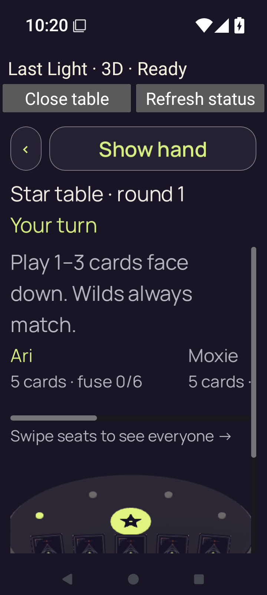</a> | **Native 3D fresh concealed entry before scene Exit — 2× text** Android API 35 emulator, actual native 3D comparison host, debug APK Original: [01-fresh-concealed.png](3d-font-2.0-debug/3d/scene-exit/01-fresh-concealed.png) 720 × 1600 px; text 2× SHA-256: <code>f903494b562445671623456e3dbab38afaee7d1fdd3c6b5e91852804ccac3cd3</code> [Original UI dump](3d-font-2.0-debug/3d/scene-exit/01-fresh-concealed.xml) [Original measurements](3d-font-2.0-debug/3d/scene-exit/01-fresh-concealed.json) [Original result](3d-font-2.0-debug/result.json) Private faces, rank labels and selection are concealed; Show hand is complete. Turn, rank and round remain pinned; the lower table/hand continues below the viewport. |
| <a href="3d-font-2.0-debug/3d/scene-exit/14-chooser-after-exit.png">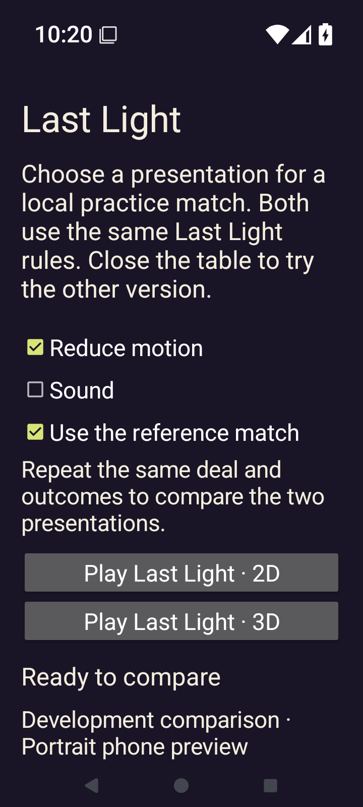</a> | **Native 3D chooser restored after fresh scene Exit — 2× text** Android API 35 emulator, actual native 3D comparison host, debug APK Original: [14-chooser-after-exit.png](3d-font-2.0-debug/3d/scene-exit/14-chooser-after-exit.png) 720 × 1600 px; text 2× SHA-256: <code>224d53d21be41841eb0150d3b13c43eef216f6eac68c4a7dada36b12b3328cb5</code> [Original UI dump](3d-font-2.0-debug/3d/scene-exit/14-chooser-after-exit.xml) [Original result](3d-font-2.0-debug/result.json) The fresh renderer Exit restores the chooser with both presentation actions; the original teardown records acknowledgment and actual child-process death. |
| <a href="3d-font-2.0-debug/chooser.png">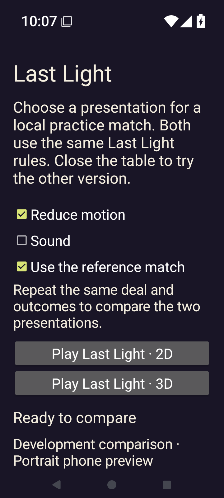</a> | **Native 3D initial native chooser — 2× text** Android API 35 emulator, actual native 3D comparison host, debug APK Original: [chooser.png](3d-font-2.0-debug/chooser.png) 720 × 1600 px; text 2× SHA-256: <code>974db6c031ca2363dc2118b452bc4761f72c613c435ffabcade5f96112883f86</code> [Original UI dump](3d-font-2.0-debug/chooser.xml) [Original result](3d-font-2.0-debug/result.json) The chooser shows both presentation actions. This distinct original keeps its own source and hash even when pixels match another chooser. |
|  | **Native 3D final native chooser diagnostic — 2× text** Android API 35 emulator, actual native 3D comparison host, debug APK Original: [final-screen.png](3d-font-2.0-debug/final-screen.png) 720 × 1600 px; text 2× SHA-256: <code>0d093cc0144b5477e2a85ccbef590351917ea9c144856b8ae6ef7af78cf325a2</code> [Original result](3d-font-2.0-debug/result.json) The chooser shows both presentation actions. This distinct original keeps its own source and hash even when pixels match another chooser. |
