# Android API 36 adaptive — four initial landscape failures

[All collections](../README.md) · [Original CI run](https://github.com/Apdelrahman1911/PartyDeck/actions/runs/34485033488)

All four installations pass; all four first initial-landscape checks fail. No native transition is qualified.

16 original PNG/XML pairs. Normal text stops in Standard preparation; 200% text stops waiting for the Godot Activity after the logged picker action. No video; 92 named scopes unexecuted.

Exact source: `fc431ee775990943dfe152f4f20fb9365db4e72d`. Original PNG/XML/JSON bytes and the recorded failure limits are preserved.

## Publication review

The 16 original stills were visually inspected through the four existing frozen review sheets. The original PNGs were separately decoded and matched to their recorded hashes and dimensions. Capture identities remain separate when pixels match. The review describes the captured viewport; it adds no native execution or assistive-technology result.

[Completed visual review](provenance/publication-review/partydeck-gallery-next2-adaptive-visual-review.json) · [Publication copy audit](provenance/publication-review/partydeck-gallery-next2-ready-source-audit.json) · [Frozen queue](provenance/publication-queue-v1/queue-freeze.json) · [Original copy mapping](provenance/publication-queue-v1/copy-paths.tsv) · [Original queue page](provenance/publication-queue-v1/payload/docs/screenshots/godot-android-adaptive-34485033488/README.md). The archived queue page retains its original text and relative paths as provenance.

| Original capture | Scenario and retained limits |
| --- | --- |
|  | **Cold Compose Home — installation passed** Android API 36 x86_64 emulator, production Compose shell, debug APK; text 1.0× [home-cold.png](android-adaptive-api36-debug-font-1.0-34485033488-1/godot-adaptive/runtime/captures/home-cold.png); 720 × 1600 px SHA-256: <code>e96d4777eadaa3ea3e8ec2e29024f70b095714b5965d580ae272d86456c15a94</code> [Original XML](android-adaptive-api36-debug-font-1.0-34485033488-1/godot-adaptive/runtime/captures/home-cold.xml) · [Original capture receipt](android-adaptive-api36-debug-font-1.0-34485033488-1/godot-adaptive/runtime/captures/home-cold.json) · [Original result](android-adaptive-api36-debug-font-1.0-34485033488-1/godot-adaptive/runtime/godot-adaptive-result.json) The original check failed during Standard preparation with a UI dump timeout. Only the initial Compose-shell landscape setup was entered. Native rotation, held touch, reentry, leave, split-screen and 3D remain unqualified. **Publication review — viewed through an existing frozen sheet:** The cold Home original shows the complete hero and Host, Join, Practice and How to play actions. [Reviewed sheet](../supplemental/android-adaptive-34485033488-review-sheets/debug-font-1.0-original-stills-overview.png). |
| <a href="android-adaptive-api36-debug-font-1.0-34485033488-1/godot-adaptive/runtime/captures/final-diagnostic.png">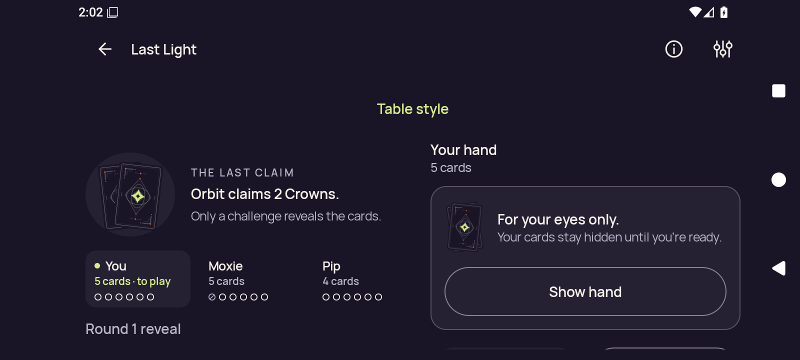</a> | **Failed initial landscape check — final Standard table diagnostic** Android API 36 x86_64 emulator, production Compose shell, debug APK; text 1.0× [final-diagnostic.png](android-adaptive-api36-debug-font-1.0-34485033488-1/godot-adaptive/runtime/captures/final-diagnostic.png); 1600 × 720 px SHA-256: <code>99fe820df23a68da7923aca0da355b050541f9dceb2723c4620b9e7521060d64</code> [Original XML](android-adaptive-api36-debug-font-1.0-34485033488-1/godot-adaptive/runtime/captures/final-diagnostic.xml) · [Original capture receipt](android-adaptive-api36-debug-font-1.0-34485033488-1/godot-adaptive/runtime/captures/final-diagnostic.json) · [Original result](android-adaptive-api36-debug-font-1.0-34485033488-1/godot-adaptive/runtime/godot-adaptive-result.json) The original check failed during Standard preparation with a UI dump timeout. Only the initial Compose-shell landscape setup was entered. Native rotation, held touch, reentry, leave, split-screen and 3D remain unqualified. The original wide Standard layout retains clipped lower gameplay controls. **Publication review — viewed through an existing frozen sheet:** The final landscape Standard table shows Orbit claims 2 Crowns, a concealed hand and a complete Show hand control. Lower gameplay actions extend below the captured viewport. [Reviewed sheet](../supplemental/android-adaptive-34485033488-review-sheets/debug-font-1.0-original-stills-overview.png). |
| <a href="android-adaptive-api36-debug-font-2.0-34485033488-1/godot-adaptive/runtime/captures/home-cold.png">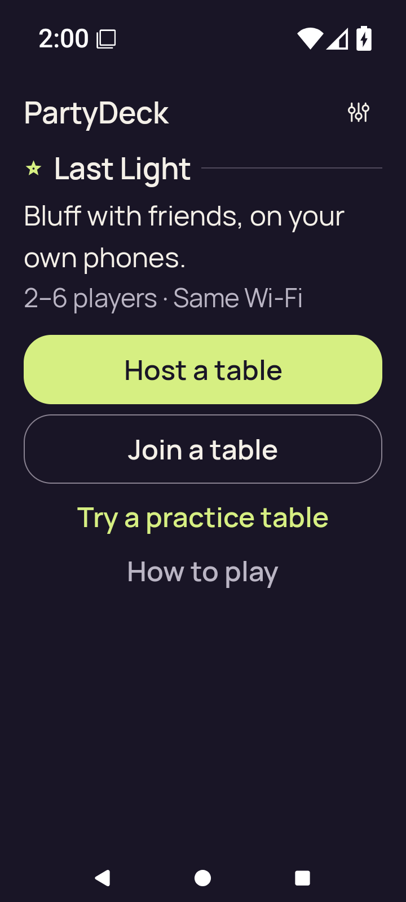</a> | **Cold Compose Home — installation passed** Android API 36 x86_64 emulator, production Compose shell, debug APK; text 2.0× [home-cold.png](android-adaptive-api36-debug-font-2.0-34485033488-1/godot-adaptive/runtime/captures/home-cold.png); 720 × 1600 px SHA-256: <code>0da9e750c8651e8aab8bd720cd2381dbe9b90373ee234bc893967b2499f3f053</code> [Original XML](android-adaptive-api36-debug-font-2.0-34485033488-1/godot-adaptive/runtime/captures/home-cold.xml) · [Original capture receipt](android-adaptive-api36-debug-font-2.0-34485033488-1/godot-adaptive/runtime/captures/home-cold.json) · [Original result](android-adaptive-api36-debug-font-2.0-34485033488-1/godot-adaptive/runtime/godot-adaptive-result.json) The original check failed after a logged 2D choice action and a 45-second wait for the Godot Activity; no renderer process was sampled. Only the initial Compose-shell landscape setup was entered. Native rotation, held touch, reentry, leave, split-screen and 3D remain unqualified. **Publication review — viewed through an existing frozen sheet:** At 200% text, all four Home actions are complete and readable. [Reviewed sheet](../supplemental/android-adaptive-34485033488-review-sheets/debug-font-2.0-original-stills-overview.png). |
| <a href="android-adaptive-api36-debug-font-2.0-34485033488-1/godot-adaptive/runtime/captures/2d-landscape-baseline-public.png">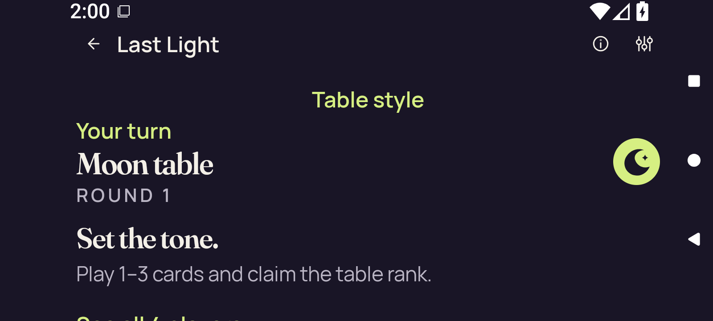</a> | **Standard table public baseline before the failed 2D entry** Android API 36 x86_64 emulator, production Compose shell, debug APK; text 2.0× [2d-landscape-baseline-public.png](android-adaptive-api36-debug-font-2.0-34485033488-1/godot-adaptive/runtime/captures/2d-landscape-baseline-public.png); 1600 × 720 px SHA-256: <code>f46db3fc43ebb7c0d608b5f4d375b46ba0f143260ae88f3497ff0582fa79e5f9</code> [Original XML](android-adaptive-api36-debug-font-2.0-34485033488-1/godot-adaptive/runtime/captures/2d-landscape-baseline-public.xml) · [Original capture receipt](android-adaptive-api36-debug-font-2.0-34485033488-1/godot-adaptive/runtime/captures/2d-landscape-baseline-public.json) · [Original result](android-adaptive-api36-debug-font-2.0-34485033488-1/godot-adaptive/runtime/godot-adaptive-result.json) The original check failed after a logged 2D choice action and a 45-second wait for the Godot Activity; no renderer process was sampled. Only the initial Compose-shell landscape setup was entered. Native rotation, held touch, reentry, leave, split-screen and 3D remain unqualified. **Publication review — viewed through an existing frozen sheet:** The landscape public baseline shows Your turn, Moon table, round and opening instructions. Lower content is clipped at the captured viewport edge or lies below it. [Reviewed sheet](../supplemental/android-adaptive-34485033488-review-sheets/debug-font-2.0-original-stills-overview.png). |
| <a href="android-adaptive-api36-debug-font-2.0-34485033488-1/godot-adaptive/runtime/captures/2d-landscape-baseline-first-card.png">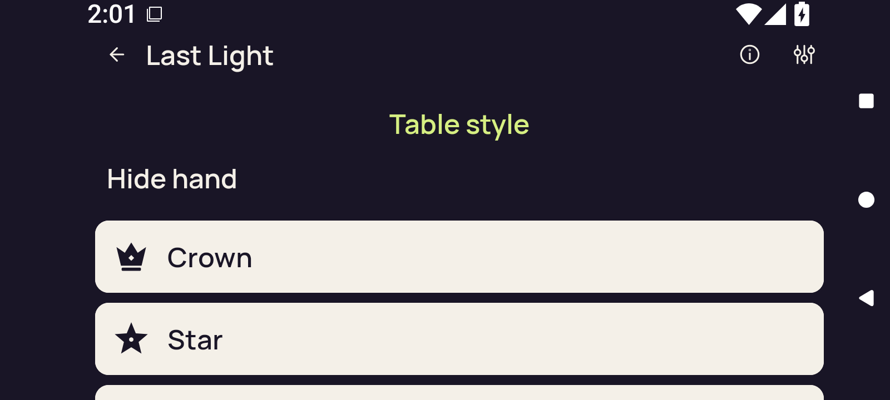</a> | **Standard table first-card baseline before the failed 2D entry** Android API 36 x86_64 emulator, production Compose shell, debug APK; text 2.0× [2d-landscape-baseline-first-card.png](android-adaptive-api36-debug-font-2.0-34485033488-1/godot-adaptive/runtime/captures/2d-landscape-baseline-first-card.png); 1600 × 720 px SHA-256: <code>01105e933d7f912a9d6b3262f345549016d669f88a7b74f8261784c72cb87395</code> [Original XML](android-adaptive-api36-debug-font-2.0-34485033488-1/godot-adaptive/runtime/captures/2d-landscape-baseline-first-card.xml) · [Original capture receipt](android-adaptive-api36-debug-font-2.0-34485033488-1/godot-adaptive/runtime/captures/2d-landscape-baseline-first-card.json) · [Original result](android-adaptive-api36-debug-font-2.0-34485033488-1/godot-adaptive/runtime/godot-adaptive-result.json) The original check failed after a logged 2D choice action and a 45-second wait for the Godot Activity; no renderer process was sampled. Only the initial Compose-shell landscape setup was entered. Native rotation, held touch, reentry, leave, split-screen and 3D remain unqualified. **Publication review — viewed through an existing frozen sheet:** The scrolled hand baseline shows Hide hand and readable Crown and Star rows; further rows are below the viewport. Turn and rank are no longer visible at this scroll position. [Reviewed sheet](../supplemental/android-adaptive-34485033488-review-sheets/debug-font-2.0-original-stills-overview.png). |
| <a href="android-adaptive-api36-debug-font-2.0-34485033488-1/godot-adaptive/runtime/captures/2d-landscape-baseline-selected.png">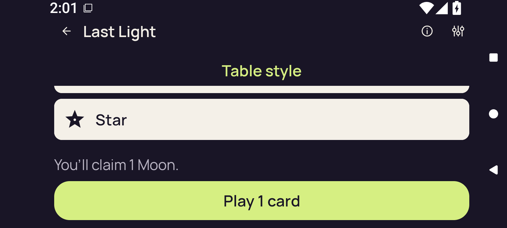</a> | **Standard table selection before the failed 2D entry** Android API 36 x86_64 emulator, production Compose shell, debug APK; text 2.0× [2d-landscape-baseline-selected.png](android-adaptive-api36-debug-font-2.0-34485033488-1/godot-adaptive/runtime/captures/2d-landscape-baseline-selected.png); 1600 × 720 px SHA-256: <code>6da4cea7d32f65131ef2fd73d79b7fa153fa98c29a2cca3456de993450b84540</code> [Original XML](android-adaptive-api36-debug-font-2.0-34485033488-1/godot-adaptive/runtime/captures/2d-landscape-baseline-selected.xml) · [Original capture receipt](android-adaptive-api36-debug-font-2.0-34485033488-1/godot-adaptive/runtime/captures/2d-landscape-baseline-selected.json) · [Original result](android-adaptive-api36-debug-font-2.0-34485033488-1/godot-adaptive/runtime/godot-adaptive-result.json) The original check failed after a logged 2D choice action and a 45-second wait for the Godot Activity; no renderer process was sampled. Only the initial Compose-shell landscape setup was entered. Native rotation, held touch, reentry, leave, split-screen and 3D remain unqualified. **Publication review — viewed through an existing frozen sheet:** The selected baseline shows the full claim of 1 Moon and complete Play 1 card action. The selected card itself is above the captured viewport; its selection marker is not shown here. [Reviewed sheet](../supplemental/android-adaptive-34485033488-review-sheets/debug-font-2.0-original-stills-overview.png). |
| <a href="android-adaptive-api36-debug-font-2.0-34485033488-1/godot-adaptive/runtime/captures/2d-landscape-initial-selector.png">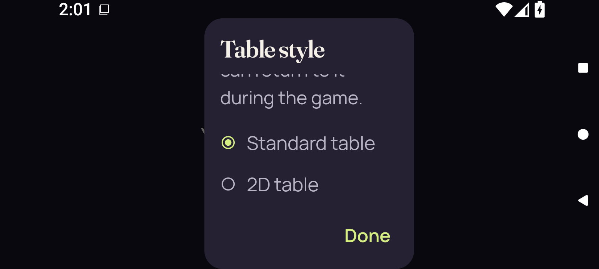</a> | **Table style dialog before the recorded 2D choice action** Android API 36 x86_64 emulator, production Compose shell, debug APK; text 2.0× [2d-landscape-initial-selector.png](android-adaptive-api36-debug-font-2.0-34485033488-1/godot-adaptive/runtime/captures/2d-landscape-initial-selector.png); 1600 × 720 px SHA-256: <code>64a44fe164e063f0bd0caa676856190cd2a1d8b196b8ce2eb40b0b7033bbdb31</code> [Original XML](android-adaptive-api36-debug-font-2.0-34485033488-1/godot-adaptive/runtime/captures/2d-landscape-initial-selector.xml) · [Original capture receipt](android-adaptive-api36-debug-font-2.0-34485033488-1/godot-adaptive/runtime/captures/2d-landscape-initial-selector.json) · [Original result](android-adaptive-api36-debug-font-2.0-34485033488-1/godot-adaptive/runtime/godot-adaptive-result.json) The original check failed after a logged 2D choice action and a 45-second wait for the Godot Activity; no renderer process was sampled. Only the initial Compose-shell landscape setup was entered. Native rotation, held touch, reentry, leave, split-screen and 3D remain unqualified. Pre-action original. A logged action label does not independently establish delivered coordinates or callback outcome. **Publication review — viewed through an existing frozen sheet:** The Table style picker shows Standard selected, the 2D choice and a complete Done action. Introductory text clips beneath the title and lower choices require scrolling. [Reviewed sheet](../supplemental/android-adaptive-34485033488-review-sheets/debug-font-2.0-original-stills-overview.png). |
| <a href="android-adaptive-api36-debug-font-2.0-34485033488-1/godot-adaptive/runtime/captures/final-diagnostic.png">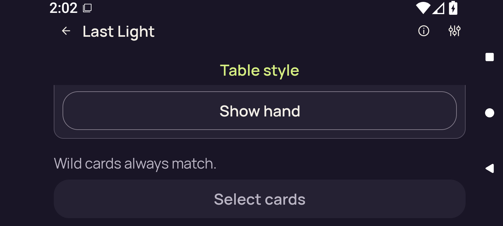</a> | **Failed initial landscape check — final Standard table diagnostic** Android API 36 x86_64 emulator, production Compose shell, debug APK; text 2.0× [final-diagnostic.png](android-adaptive-api36-debug-font-2.0-34485033488-1/godot-adaptive/runtime/captures/final-diagnostic.png); 1600 × 720 px SHA-256: <code>527cd627c92519167b0f16ed5d051d8e8bf6f11375dc6e2da1775133fffae240</code> [Original XML](android-adaptive-api36-debug-font-2.0-34485033488-1/godot-adaptive/runtime/captures/final-diagnostic.xml) · [Original capture receipt](android-adaptive-api36-debug-font-2.0-34485033488-1/godot-adaptive/runtime/captures/final-diagnostic.json) · [Original result](android-adaptive-api36-debug-font-2.0-34485033488-1/godot-adaptive/runtime/godot-adaptive-result.json) The original check failed after a logged 2D choice action and a 45-second wait for the Godot Activity; no renderer process was sampled. Only the initial Compose-shell landscape setup was entered. Native rotation, held touch, reentry, leave, split-screen and 3D remain unqualified. The final original shows the Standard table with the hand concealed; the picker dialog is no longer visible. **Publication review — viewed through an existing frozen sheet:** The picker is gone in the final landscape original, leaving the concealed Standard hand. Full Show hand, Wild guidance and disabled Select cards are visible. [Reviewed sheet](../supplemental/android-adaptive-34485033488-review-sheets/debug-font-2.0-original-stills-overview.png). |
| <a href="android-adaptive-api36-optimized-test-signed-font-1.0-34485033488-1/godot-adaptive/runtime/captures/home-cold.png">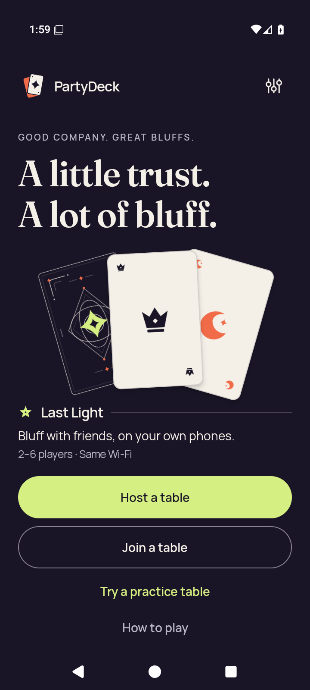</a> | **Cold Compose Home — installation passed** Android API 36 x86_64 emulator, production Compose shell, optimized-test-signed APK; text 1.0× [home-cold.png](android-adaptive-api36-optimized-test-signed-font-1.0-34485033488-1/godot-adaptive/runtime/captures/home-cold.png); 720 × 1600 px SHA-256: <code>4fa53194cd8b5dea3f6144fe7e5d4a48b7a461c0f0f0477d671af7bdf6828dcf</code> [Original XML](android-adaptive-api36-optimized-test-signed-font-1.0-34485033488-1/godot-adaptive/runtime/captures/home-cold.xml) · [Original capture receipt](android-adaptive-api36-optimized-test-signed-font-1.0-34485033488-1/godot-adaptive/runtime/captures/home-cold.json) · [Original result](android-adaptive-api36-optimized-test-signed-font-1.0-34485033488-1/godot-adaptive/runtime/godot-adaptive-result.json) The original check failed during Standard preparation with a UI dump timeout. Only the initial Compose-shell landscape setup was entered. Native rotation, held touch, reentry, leave, split-screen and 3D remain unqualified. **Publication review — viewed through an existing frozen sheet:** The cold Home original shows the complete hero and all four Home actions. [Reviewed sheet](../supplemental/android-adaptive-34485033488-review-sheets/optimized-test-signed-font-1.0-original-stills-overview.png). |
| <a href="android-adaptive-api36-optimized-test-signed-font-1.0-34485033488-1/godot-adaptive/runtime/captures/final-diagnostic.png">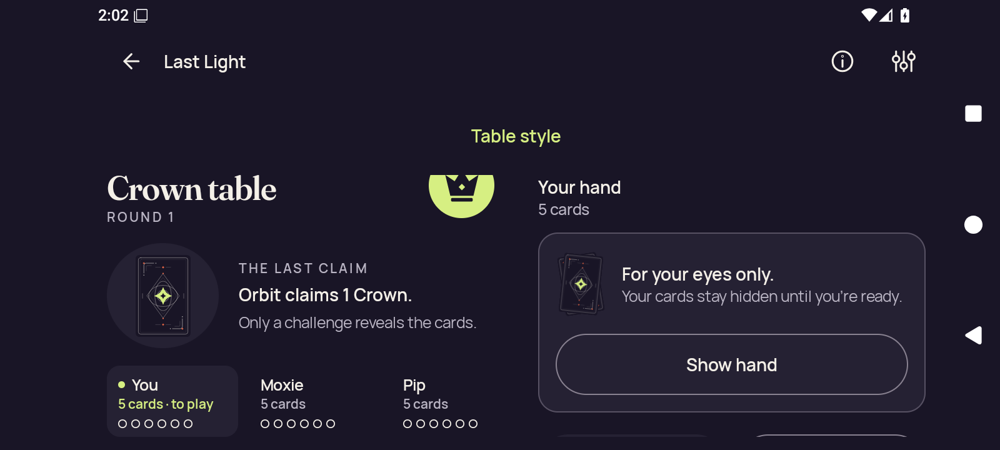</a> | **Failed initial landscape check — final Standard table diagnostic** Android API 36 x86_64 emulator, production Compose shell, optimized-test-signed APK; text 1.0× [final-diagnostic.png](android-adaptive-api36-optimized-test-signed-font-1.0-34485033488-1/godot-adaptive/runtime/captures/final-diagnostic.png); 1600 × 720 px SHA-256: <code>c87b6b8459bf27ac6a29b30b7801711db9a1934cc3fcf9d5971b1eea60424b21</code> [Original XML](android-adaptive-api36-optimized-test-signed-font-1.0-34485033488-1/godot-adaptive/runtime/captures/final-diagnostic.xml) · [Original capture receipt](android-adaptive-api36-optimized-test-signed-font-1.0-34485033488-1/godot-adaptive/runtime/captures/final-diagnostic.json) · [Original result](android-adaptive-api36-optimized-test-signed-font-1.0-34485033488-1/godot-adaptive/runtime/godot-adaptive-result.json) The original check failed during Standard preparation with a UI dump timeout. Only the initial Compose-shell landscape setup was entered. Native rotation, held touch, reentry, leave, split-screen and 3D remain unqualified. The original wide Standard layout retains clipped lower gameplay controls. **Publication review — viewed through an existing frozen sheet:** The final landscape Standard table shows Crown table and Orbit claims 1 Crown. The Crown emblem clips at the upper content edge. The concealed hand and Show hand fit; lower gameplay actions are outside this viewport. [Reviewed sheet](../supplemental/android-adaptive-34485033488-review-sheets/optimized-test-signed-font-1.0-original-stills-overview.png). |
|  | **Cold Compose Home — installation passed** Android API 36 x86_64 emulator, production Compose shell, optimized-test-signed APK; text 2.0× [home-cold.png](android-adaptive-api36-optimized-test-signed-font-2.0-34485033488-1/godot-adaptive/runtime/captures/home-cold.png); 720 × 1600 px SHA-256: <code>0da9e750c8651e8aab8bd720cd2381dbe9b90373ee234bc893967b2499f3f053</code> [Original XML](android-adaptive-api36-optimized-test-signed-font-2.0-34485033488-1/godot-adaptive/runtime/captures/home-cold.xml) · [Original capture receipt](android-adaptive-api36-optimized-test-signed-font-2.0-34485033488-1/godot-adaptive/runtime/captures/home-cold.json) · [Original result](android-adaptive-api36-optimized-test-signed-font-2.0-34485033488-1/godot-adaptive/runtime/godot-adaptive-result.json) The original check failed after a logged 2D choice action and a 45-second wait for the Godot Activity; no renderer process was sampled. Only the initial Compose-shell landscape setup was entered. Native rotation, held touch, reentry, leave, split-screen and 3D remain unqualified. **Publication review — viewed through an existing frozen sheet:** At 200% text, all four Home actions are complete and readable. [Reviewed sheet](../supplemental/android-adaptive-34485033488-review-sheets/optimized-test-signed-font-2.0-original-stills-overview.png). |
| <a href="android-adaptive-api36-optimized-test-signed-font-2.0-34485033488-1/godot-adaptive/runtime/captures/2d-landscape-baseline-public.png">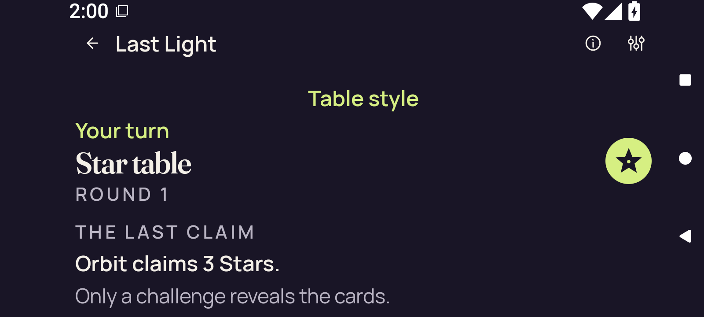</a> | **Standard table public baseline before the failed 2D entry** Android API 36 x86_64 emulator, production Compose shell, optimized-test-signed APK; text 2.0× [2d-landscape-baseline-public.png](android-adaptive-api36-optimized-test-signed-font-2.0-34485033488-1/godot-adaptive/runtime/captures/2d-landscape-baseline-public.png); 1600 × 720 px SHA-256: <code>1e7c5b0ccc4640a82b0f85e3c96aa80d29f30badcb751f138aae4c2ebef9e0b5</code> [Original XML](android-adaptive-api36-optimized-test-signed-font-2.0-34485033488-1/godot-adaptive/runtime/captures/2d-landscape-baseline-public.xml) · [Original capture receipt](android-adaptive-api36-optimized-test-signed-font-2.0-34485033488-1/godot-adaptive/runtime/captures/2d-landscape-baseline-public.json) · [Original result](android-adaptive-api36-optimized-test-signed-font-2.0-34485033488-1/godot-adaptive/runtime/godot-adaptive-result.json) The original check failed after a logged 2D choice action and a 45-second wait for the Godot Activity; no renderer process was sampled. Only the initial Compose-shell landscape setup was entered. Native rotation, held touch, reentry, leave, split-screen and 3D remain unqualified. **Publication review — viewed through an existing frozen sheet:** The landscape public baseline shows Your turn, Star table and Orbit claims 3 Stars. The hand and lower actions lie below the captured viewport. [Reviewed sheet](../supplemental/android-adaptive-34485033488-review-sheets/optimized-test-signed-font-2.0-original-stills-overview.png). |
| <a href="android-adaptive-api36-optimized-test-signed-font-2.0-34485033488-1/godot-adaptive/runtime/captures/2d-landscape-baseline-first-card.png">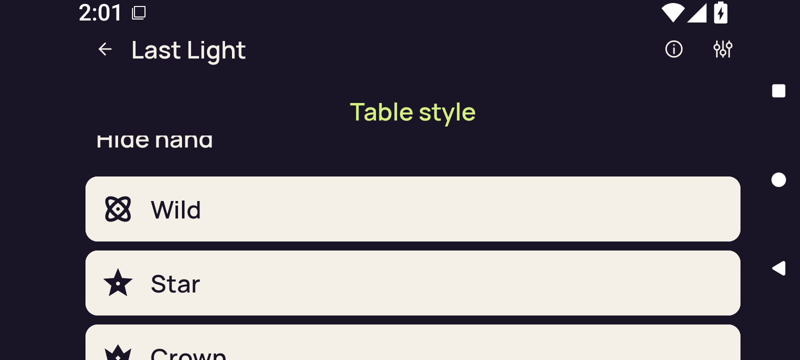</a> | **Standard table first-card baseline before the failed 2D entry** Android API 36 x86_64 emulator, production Compose shell, optimized-test-signed APK; text 2.0× [2d-landscape-baseline-first-card.png](android-adaptive-api36-optimized-test-signed-font-2.0-34485033488-1/godot-adaptive/runtime/captures/2d-landscape-baseline-first-card.png); 1600 × 720 px SHA-256: <code>65caf50dba5e429e9febe2f14aa50194c7343deecf49ef0ec691cf5e4dd098b6</code> [Original XML](android-adaptive-api36-optimized-test-signed-font-2.0-34485033488-1/godot-adaptive/runtime/captures/2d-landscape-baseline-first-card.xml) · [Original capture receipt](android-adaptive-api36-optimized-test-signed-font-2.0-34485033488-1/godot-adaptive/runtime/captures/2d-landscape-baseline-first-card.json) · [Original result](android-adaptive-api36-optimized-test-signed-font-2.0-34485033488-1/godot-adaptive/runtime/godot-adaptive-result.json) The original check failed after a logged 2D choice action and a 45-second wait for the Godot Activity; no renderer process was sampled. Only the initial Compose-shell landscape setup was entered. Native rotation, held touch, reentry, leave, split-screen and 3D remain unqualified. **Publication review — viewed through an existing frozen sheet:** The scrolled hand baseline shows complete Wild and Star rows, with the Crown row partly below the viewport. Hide hand clips at the upper edge; turn and rank are offscreen. [Reviewed sheet](../supplemental/android-adaptive-34485033488-review-sheets/optimized-test-signed-font-2.0-original-stills-overview.png). |
| <a href="android-adaptive-api36-optimized-test-signed-font-2.0-34485033488-1/godot-adaptive/runtime/captures/2d-landscape-baseline-selected.png">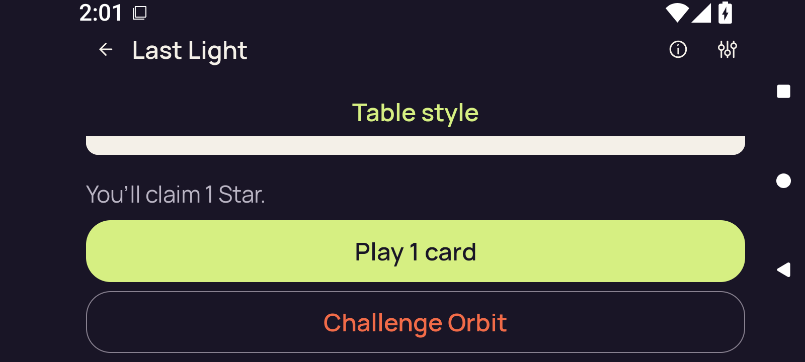</a> | **Standard table selection before the failed 2D entry** Android API 36 x86_64 emulator, production Compose shell, optimized-test-signed APK; text 2.0× [2d-landscape-baseline-selected.png](android-adaptive-api36-optimized-test-signed-font-2.0-34485033488-1/godot-adaptive/runtime/captures/2d-landscape-baseline-selected.png); 1600 × 720 px SHA-256: <code>8cd453e1c1a2f956fe926d5d342be1ffc0d72b5ea57d224fbb2b2ec263223edc</code> [Original XML](android-adaptive-api36-optimized-test-signed-font-2.0-34485033488-1/godot-adaptive/runtime/captures/2d-landscape-baseline-selected.xml) · [Original capture receipt](android-adaptive-api36-optimized-test-signed-font-2.0-34485033488-1/godot-adaptive/runtime/captures/2d-landscape-baseline-selected.json) · [Original result](android-adaptive-api36-optimized-test-signed-font-2.0-34485033488-1/godot-adaptive/runtime/godot-adaptive-result.json) The original check failed after a logged 2D choice action and a 45-second wait for the Godot Activity; no renderer process was sampled. Only the initial Compose-shell landscape setup was entered. Native rotation, held touch, reentry, leave, split-screen and 3D remain unqualified. **Publication review — viewed through an existing frozen sheet:** The selected baseline shows the claim of 1 Star, complete Play 1 card and Challenge Orbit. The selected card itself lies above the viewport, so this image does not show its selection marker. [Reviewed sheet](../supplemental/android-adaptive-34485033488-review-sheets/optimized-test-signed-font-2.0-original-stills-overview.png). |
| <a href="android-adaptive-api36-optimized-test-signed-font-2.0-34485033488-1/godot-adaptive/runtime/captures/2d-landscape-initial-selector.png">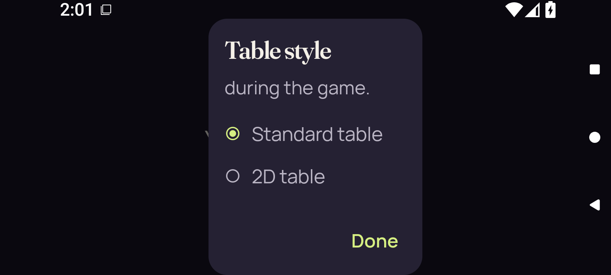</a> | **Table style dialog before the recorded 2D choice action** Android API 36 x86_64 emulator, production Compose shell, optimized-test-signed APK; text 2.0× [2d-landscape-initial-selector.png](android-adaptive-api36-optimized-test-signed-font-2.0-34485033488-1/godot-adaptive/runtime/captures/2d-landscape-initial-selector.png); 1600 × 720 px SHA-256: <code>cad3b6bad696d5175a06ba4c66f26938c0d5ee1ab9d86f4e1cf669ce149d559a</code> [Original XML](android-adaptive-api36-optimized-test-signed-font-2.0-34485033488-1/godot-adaptive/runtime/captures/2d-landscape-initial-selector.xml) · [Original capture receipt](android-adaptive-api36-optimized-test-signed-font-2.0-34485033488-1/godot-adaptive/runtime/captures/2d-landscape-initial-selector.json) · [Original result](android-adaptive-api36-optimized-test-signed-font-2.0-34485033488-1/godot-adaptive/runtime/godot-adaptive-result.json) The original check failed after a logged 2D choice action and a 45-second wait for the Godot Activity; no renderer process was sampled. Only the initial Compose-shell landscape setup was entered. Native rotation, held touch, reentry, leave, split-screen and 3D remain unqualified. Pre-action original. A logged action label does not independently establish delivered coordinates or callback outcome. **Publication review — viewed through an existing frozen sheet:** The Table style picker has clipped introductory text; Standard is selected, and 2D and Done are visible. Lower choices need scrolling. [Reviewed sheet](../supplemental/android-adaptive-34485033488-review-sheets/optimized-test-signed-font-2.0-original-stills-overview.png). |
| <a href="android-adaptive-api36-optimized-test-signed-font-2.0-34485033488-1/godot-adaptive/runtime/captures/final-diagnostic.png">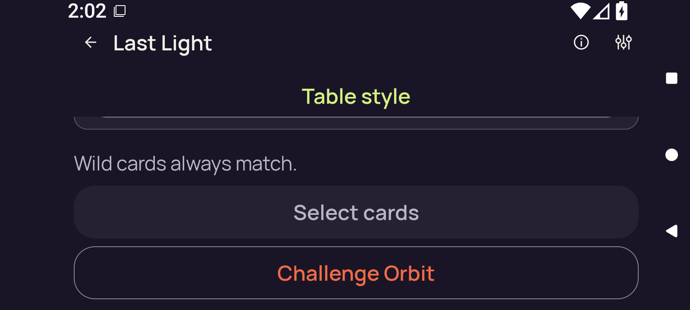</a> | **Failed initial landscape check — final Standard table diagnostic** Android API 36 x86_64 emulator, production Compose shell, optimized-test-signed APK; text 2.0× [final-diagnostic.png](android-adaptive-api36-optimized-test-signed-font-2.0-34485033488-1/godot-adaptive/runtime/captures/final-diagnostic.png); 1600 × 720 px SHA-256: <code>c5aa40065f54454ef7ae730f136613b3dbfa5a0e75d12c971f73c1d9697632a8</code> [Original XML](android-adaptive-api36-optimized-test-signed-font-2.0-34485033488-1/godot-adaptive/runtime/captures/final-diagnostic.xml) · [Original capture receipt](android-adaptive-api36-optimized-test-signed-font-2.0-34485033488-1/godot-adaptive/runtime/captures/final-diagnostic.json) · [Original result](android-adaptive-api36-optimized-test-signed-font-2.0-34485033488-1/godot-adaptive/runtime/godot-adaptive-result.json) The original check failed after a logged 2D choice action and a 45-second wait for the Godot Activity; no renderer process was sampled. Only the initial Compose-shell landscape setup was entered. Native rotation, held touch, reentry, leave, split-screen and 3D remain unqualified. The final original shows the Standard table with the hand concealed; the picker dialog is no longer visible. **Publication review — viewed through an existing frozen sheet:** The picker is gone and the final landscape original shows a concealed Standard table. Show hand lies above the viewport, with only the lower container edge visible. Wild guidance, disabled Select cards and Challenge Orbit fit. [Reviewed sheet](../supplemental/android-adaptive-34485033488-review-sheets/optimized-test-signed-font-2.0-original-stills-overview.png). |
