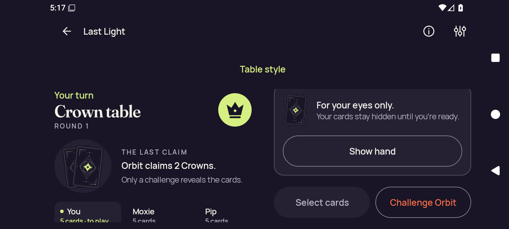
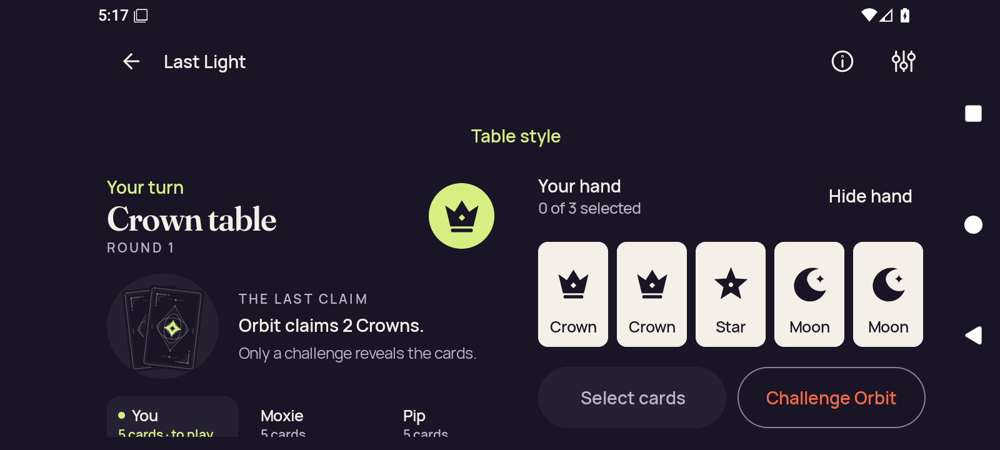
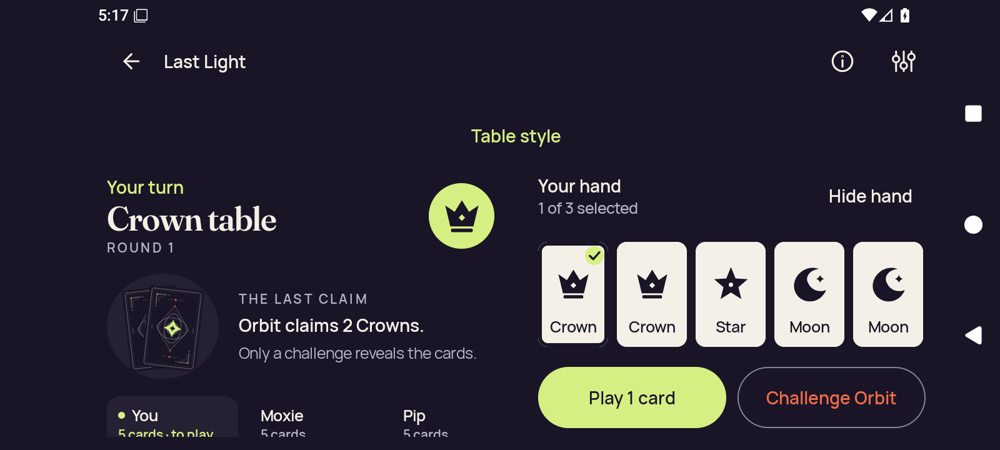
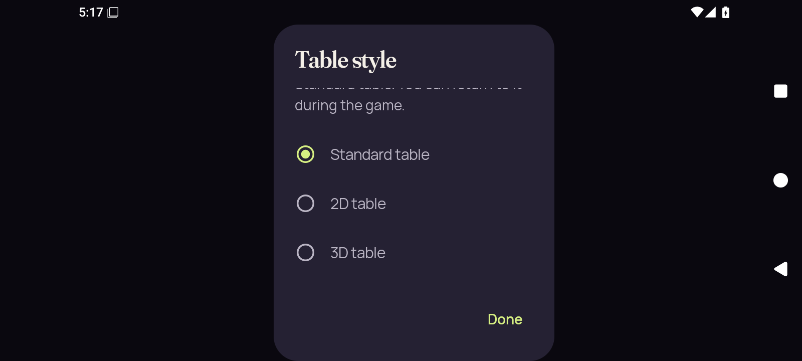
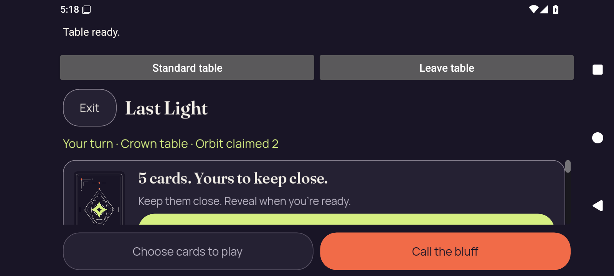
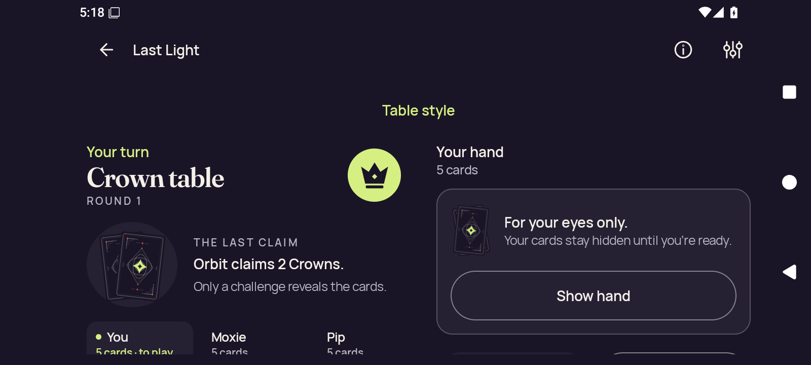
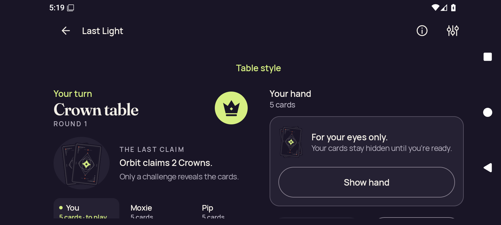

# API 36 debug, font 1.0

[All collections](../../../README.md) · [Preserved evidence index](../../evidence-index.md) · [Copy/review binding](../../../android-34503251315/provenance/publication-review/partydeck-gallery-2815-publication-binding-v1.json) · [Completed visual review](../../provenance/publication-review/partydeck-gallery-after-2355-api36-visual-review-v1.json) · [Unchanged source mapping](../../provenance/source-map/capture-publication-inventory.json)

**Original overall case outcome: failed. Named scopes: {"not-reached": 22, "passed": 1, "unsupported": 1}. No continuous-privacy acceptance.**

Capture-stage names identify checkpoints. The source result and named-scope outcomes remain unchanged.

All 125 original PNG/XML/JSON capture identities are retained. Across 96 named scopes, 15 pass, one fails, eight are unsupported and 72 are unreached. Optimized 200% reaches both 2D and 3D. Debug and optimized normal-text recovery cases remain failed; an overall recovery failure does not relabel its named unsupported check.

The original stills show readable public/hand controls at the recorded scroll positions, alongside lower Standard landscape clipping, clipped Table style explanatory/3D option content, and native initial 2D cover controls below the viewport. At 200%, some card/seat/action content is outside the captured scroll area. Explicitly revealed/selected hands stay distinct from concealed checkpoints.

Six MP4 originals retain startup-unavailable-original-retained status and growth-not-observed condition. The debug 200% MP4 retains captured-review-required after its held check failed; its recorded validation describes 214,574 bytes, 37.032189 seconds, 77 frames and 1600×720. No movie was viewed or decoded for this publication. No held/transition/continuous-privacy acceptance follows from these stills or preserved movies.

Source revision: `d06f83aa8f6905be515faf0f58690634714e5a2d`. CI run: [34506161751](https://github.com/Apdelrahman1911/PartyDeck/actions/runs/34506161751). 8 original PNG identities. Review methods: 1 exact published-byte match, 7 attributed peer direct view.

Every thumbnail opens the unchanged original PNG. Original filenames, dimensions, source paths and outcomes remain separate even when pixels match. No derivative image was created. Frozen provenance pages retain their original text and source references.

| Original capture | Original identity and evidence | Visual observation |
| --- | --- | --- |
|  <code>home-cold.png</code> home-cold — emulator readiness | 720 × 1600 px · 129,669 bytes · text 1.0 SHA-256: <code>e96d4777eadaa3ea3e8ec2e29024f70b095714b5965d580ae272d86456c15a94</code> Source: <code>/root/projects/PartyDeck/artifacts/evidence-storage/34506161751/android-adaptive-api36-debug-font-1.0-34506161751-1/godot-adaptive/runtime/captures/home-cold.png</code> Original case outcome: **failed** [UI XML](runtime/captures/home-cold.xml) · [Capture/result JSON](runtime/captures/home-cold.json) · [Original result](runtime/godot-adaptive-result.json) | **Exact published-byte match**. Exact bytes match separately retained original android-34457458638/debug/home.png. Only the existing pixel observation is reused; source/case/capture identity and outcomes remain separate. [Reviewed matching original](../../../android-34457458638/debug/home.png); original capture identity remains separate. |
|  <code>2d-landscape-baseline-public.png</code> 2d-landscape-baseline-public — 2d-landscape.initial-landscape | 1600 × 720 px · 117,483 bytes · text 1.0 SHA-256: <code>6267633f8d4bcc8fac90d8df48991c4a84aa55768d455a735df71dff8b2c8577</code> Source: <code>/root/projects/PartyDeck/artifacts/evidence-storage/34506161751/android-adaptive-api36-debug-font-1.0-34506161751-1/godot-adaptive/runtime/captures/2d-landscape-baseline-public.png</code> Original case outcome: **failed** [UI XML](runtime/captures/2d-landscape-baseline-public.xml) · [Capture/result JSON](runtime/captures/2d-landscape-baseline-public.json) · [Original result](runtime/godot-adaptive-result.json) | **Attributed peer direct view** by <code>/root/assets</code>. Standard Crown table, round 1; public Orbit claim and concealed hand cover with Show hand. Select cards is disabled; Challenge Orbit is visible. Seat-card/status details are cut by the bottom viewport edge. Main public, cover and action labels remain legible. Only card backs/cover artwork are visible; no private card faces or private rank labels appear in this still. |
|  <code>2d-landscape-baseline-first-card.png</code> 2d-landscape-baseline-first-card — 2d-landscape.initial-landscape | 1600 × 720 px · 109,724 bytes · text 1.0 SHA-256: <code>0dd8d082ad21c2464b991c3b703522d62bf0f0d4e5d8c13ad824131bd3ee90cf</code> Source: <code>/root/projects/PartyDeck/artifacts/evidence-storage/34506161751/android-adaptive-api36-debug-font-1.0-34506161751-1/godot-adaptive/runtime/captures/2d-landscape-baseline-first-card.png</code> Original case outcome: **failed** [UI XML](runtime/captures/2d-landscape-baseline-first-card.xml) · [Capture/result JSON](runtime/captures/2d-landscape-baseline-first-card.json) · [Original result](runtime/godot-adaptive-result.json) | **Attributed peer direct view** by <code>/root/assets</code>. Standard Crown table; revealed hand shows Crown, Crown, Star, Moon, Moon with 0 of 3 selected and Hide hand. Seat details are cut at the bottom. All five face symbols/rank labels and both action labels are legible. Five private hand faces are visibly revealed. This alone does not indicate an unintended reveal or establish transition privacy. |
|  <code>2d-landscape-baseline-selected.png</code> 2d-landscape-baseline-selected — 2d-landscape.initial-landscape | 1600 × 720 px · 110,670 bytes · text 1.0 SHA-256: <code>f931a70ff268a44191d55a65ff012cdea69b091f8de7ffacb913a506ebf47912</code> Source: <code>/root/projects/PartyDeck/artifacts/evidence-storage/34506161751/android-adaptive-api36-debug-font-1.0-34506161751-1/godot-adaptive/runtime/captures/2d-landscape-baseline-selected.png</code> Original case outcome: **failed** [UI XML](runtime/captures/2d-landscape-baseline-selected.xml) · [Capture/result JSON](runtime/captures/2d-landscape-baseline-selected.json) · [Original result](runtime/godot-adaptive-result.json) | **Attributed peer direct view** by <code>/root/assets</code>. Standard table with first Crown checked, 1 of 3 selected, and enabled Play 1 card; remaining four face cards and Challenge Orbit visible. Seat details are cut at the bottom; rank labels, check mark and action text are readable. The private hand is visibly revealed in the selected state; no transition or concealment timing inference. |
|  <code>2d-landscape-initial-selector.png</code> 2d-landscape-initial-selector — 2d-landscape.initial-landscape | 1600 × 720 px · 40,493 bytes · text 1.0 SHA-256: <code>d6c1ab2d5856842a39fed3e78e25a72be1c2858a7b05bbb83910fd3b6a3a3110</code> Source: <code>/root/projects/PartyDeck/artifacts/evidence-storage/34506161751/android-adaptive-api36-debug-font-1.0-34506161751-1/godot-adaptive/runtime/captures/2d-landscape-initial-selector.png</code> Original case outcome: **failed** [UI XML](runtime/captures/2d-landscape-initial-selector.xml) · [Capture/result JSON](runtime/captures/2d-landscape-initial-selector.json) · [Original result](runtime/godot-adaptive-result.json) | **Attributed peer direct view** by <code>/root/assets</code>. Table style dialog over a darkened background; Standard table selected, 2D table and 3D table choices and Done visible. The explanatory paragraph is clipped at its upper edge below the title. Radio labels and Done remain legible. No underlying private card faces are visible through the modal/background in this still. |
|  <code>2d-landscape-initial-native-ready.png</code> 2d-landscape-initial-native-ready — 2d-landscape.initial-landscape | 1600 × 720 px · 109,277 bytes · text 1.0 SHA-256: <code>7a5301d891a72ef2cb9ac146251ffa47cc9879bc0444e6401c4bb40a6572f580</code> Source: <code>/root/projects/PartyDeck/artifacts/evidence-storage/34506161751/android-adaptive-api36-debug-font-1.0-34506161751-1/godot-adaptive/runtime/captures/2d-landscape-initial-native-ready.png</code> Original case outcome: **failed** [UI XML](runtime/captures/2d-landscape-initial-native-ready.xml) · [Capture/result JSON](runtime/captures/2d-landscape-initial-native-ready.json) · [Original result](runtime/godot-adaptive-result.json) | **Attributed peer direct view** by <code>/root/assets</code>. Native 2D host shows Table ready, Standard table and Leave table controls, Last Light, public Crown/Orbit context and concealed-hand card-back panel. The lower conceal/reveal panel continues below the body scroll viewport; only the upper portion of its bright button is visible above the fixed action footer. Footer labels remain readable. Card-back cover is visible; no private rank face or rank label appears in the visible viewport. |
|  <code>2d-landscape-unsupported-return-concealed.png</code> 2d-landscape-unsupported-return-concealed — 2d-landscape.held-rotation | 1600 × 720 px · 110,819 bytes · text 1.0 SHA-256: <code>0beeaf151406fb47c082ffd5f6974a87dc84ab8f9ea88f1484cdbcadb903128c</code> Source: <code>/root/projects/PartyDeck/artifacts/evidence-storage/34506161751/android-adaptive-api36-debug-font-1.0-34506161751-1/godot-adaptive/runtime/captures/2d-landscape-unsupported-return-concealed.png</code> Original case outcome: **failed** [UI XML](runtime/captures/2d-landscape-unsupported-return-concealed.xml) · [Capture/result JSON](runtime/captures/2d-landscape-unsupported-return-concealed.json) · [Original result](runtime/godot-adaptive-result.json) | **Attributed peer direct view** by <code>/root/android_platform</code>. Original landscape Standard table shows concealed-hand panel and Show hand action in right pane; only upper button edges are visible at its lower edge. No transition or transient pixel-privacy qualification. |
|  <code>final-diagnostic.png</code> final-diagnostic — 2d-landscape.held-rotation | 1600 × 720 px · 110,947 bytes · text 1.0 SHA-256: <code>4a58c22a8ca5ebdef074f887ed8ed63b90c981b4858d3ae33d902bbfc3d475be</code> Source: <code>/root/projects/PartyDeck/artifacts/evidence-storage/34506161751/android-adaptive-api36-debug-font-1.0-34506161751-1/godot-adaptive/runtime/captures/final-diagnostic.png</code> Original case outcome: **failed** [UI XML](runtime/captures/final-diagnostic.xml) · [Capture/result JSON](runtime/captures/final-diagnostic.json) · [Original result](runtime/godot-adaptive-result.json) | **Attributed peer direct view** by <code>/root/assets</code>. Final diagnostic shows Standard Crown table and Your hand, 5 cards, covered with Show hand after the retained recovery failure. Seat details and lower action buttons extend beyond the bottom viewport; cover text and Show hand are readable. The hand is covered in this final still. It does not prove a timely concealed return or successful held-input rotation. |
