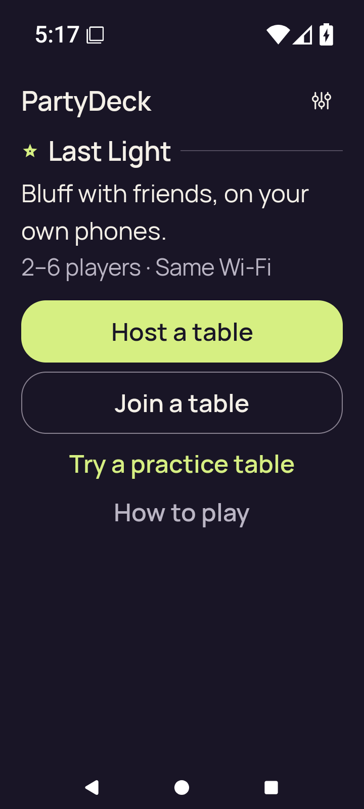
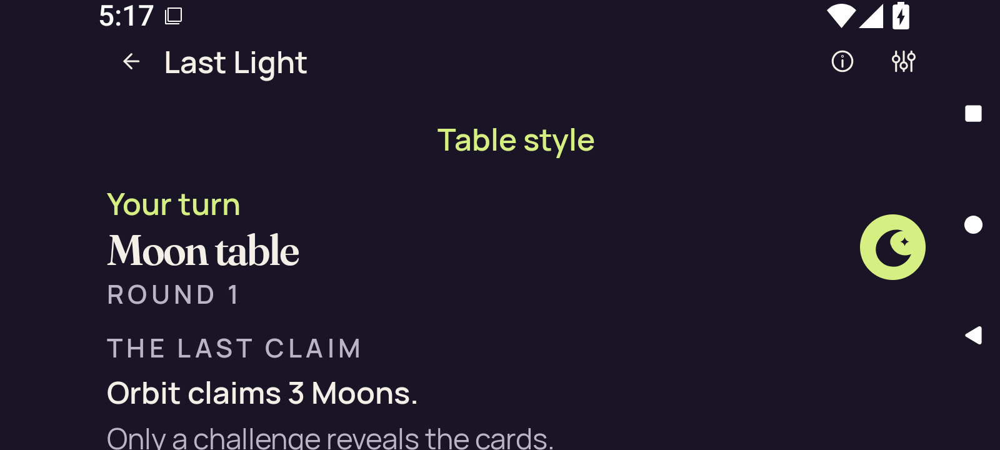
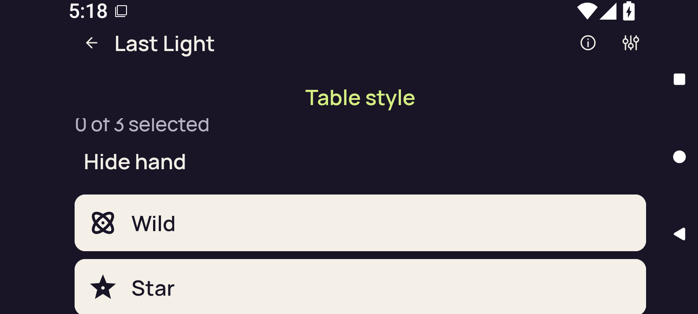
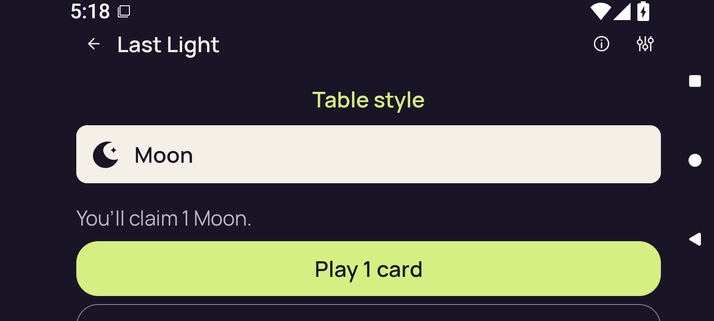
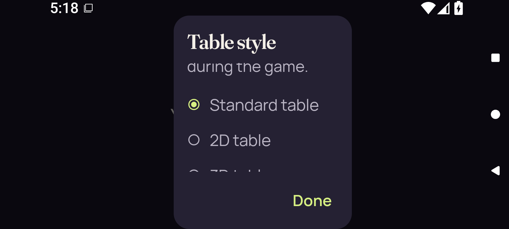
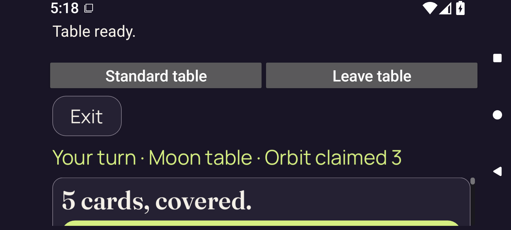
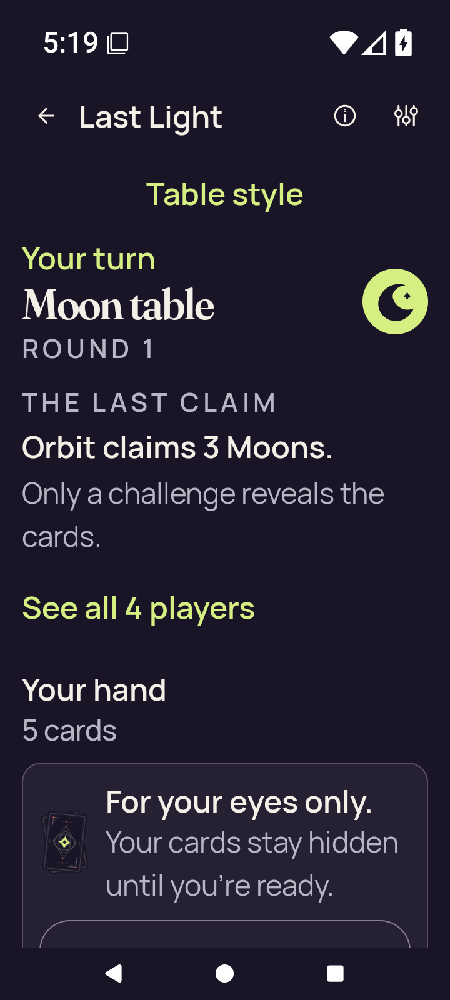

# API 36 debug, font 2.0

[All collections](../../../README.md) · [Preserved evidence index](../../evidence-index.md) · [Copy/review binding](../../../android-34503251315/provenance/publication-review/partydeck-gallery-2815-publication-binding-v1.json) · [Completed visual review](../../provenance/publication-review/partydeck-gallery-after-2355-api36-visual-review-v1.json) · [Unchanged source mapping](../../provenance/source-map/capture-publication-inventory.json)

**Original overall case outcome: failed. Named scopes: {"failed": 1, "not-reached": 22, "passed": 1}. No continuous-privacy acceptance.**

Capture-stage names identify checkpoints. The source result and named-scope outcomes remain unchanged.

All 125 original PNG/XML/JSON capture identities are retained. Across 96 named scopes, 15 pass, one fails, eight are unsupported and 72 are unreached. Optimized 200% reaches both 2D and 3D. Debug and optimized normal-text recovery cases remain failed; an overall recovery failure does not relabel its named unsupported check.

The original stills show readable public/hand controls at the recorded scroll positions, alongside lower Standard landscape clipping, clipped Table style explanatory/3D option content, and native initial 2D cover controls below the viewport. At 200%, some card/seat/action content is outside the captured scroll area. Explicitly revealed/selected hands stay distinct from concealed checkpoints.

Six MP4 originals retain startup-unavailable-original-retained status and growth-not-observed condition. The debug 200% MP4 retains captured-review-required after its held check failed; its recorded validation describes 214,574 bytes, 37.032189 seconds, 77 frames and 1600×720. No movie was viewed or decoded for this publication. No held/transition/continuous-privacy acceptance follows from these stills or preserved movies.

Source revision: `d06f83aa8f6905be515faf0f58690634714e5a2d`. CI run: [34506161751](https://github.com/Apdelrahman1911/PartyDeck/actions/runs/34506161751). 7 original PNG identities. Review methods: 7 attributed peer direct view.

Every thumbnail opens the unchanged original PNG. Original filenames, dimensions, source paths and outcomes remain separate even when pixels match. No derivative image was created. Frozen provenance pages retain their original text and source references.

| Original capture | Original identity and evidence | Visual observation |
| --- | --- | --- |
|  <code>home-cold.png</code> home-cold — emulator readiness | 720 × 1600 px · 79,919 bytes · text 2.0 SHA-256: <code>9819c018108fbf27c377d2028ed9cd8080b8e1659dcd671955090e6a33a213fa</code> Source: <code>/root/projects/PartyDeck/artifacts/evidence-storage/34506161751/android-adaptive-api36-debug-font-2.0-34506161751-1/godot-adaptive/runtime/captures/home-cold.png</code> Original case outcome: **failed** [UI XML](runtime/captures/home-cold.xml) · [Capture/result JSON](runtime/captures/home-cold.json) · [Original result](runtime/godot-adaptive-result.json) | **Attributed peer direct view** by <code>/root/assets</code>. PartyDeck home at 2× text with Last Light description, player/Wi-Fi line, Host a table, Join a table, practice and How to play. All displayed home labels and actions fit and are legible, with clear heading/action hierarchy. No in-game hand or private card information is displayed. |
|  <code>2d-landscape-baseline-public.png</code> 2d-landscape-baseline-public — 2d-landscape.initial-landscape | 1600 × 720 px · 75,804 bytes · text 2.0 SHA-256: <code>ac6a891eac5990841b3e4ba92085bc660374f888bc67544b6041666ef5ffd67d</code> Source: <code>/root/projects/PartyDeck/artifacts/evidence-storage/34506161751/android-adaptive-api36-debug-font-2.0-34506161751-1/godot-adaptive/runtime/captures/2d-landscape-baseline-public.png</code> Original case outcome: **failed** [UI XML](runtime/captures/2d-landscape-baseline-public.xml) · [Capture/result JSON](runtime/captures/2d-landscape-baseline-public.json) · [Original result](runtime/godot-adaptive-result.json) | **Attributed peer direct view** by <code>/root/assets</code>. Standard Moon table, round 1, with Your turn and public Orbit claims 3 Moons at 2× landscape text. The explanatory claim line meets the bottom edge and is partly cut; hand and action sections are outside this viewport. No private face or private rank label is visible; the off-screen hand&#x27;s cover state cannot be established from this image. |
|  <code>2d-landscape-baseline-first-card.png</code> 2d-landscape-baseline-first-card — 2d-landscape.initial-landscape | 1600 × 720 px · 50,575 bytes · text 2.0 SHA-256: <code>6e98450e2516bb43fc270e82ba8797e181b67fb23921534579e6bb43e007746b</code> Source: <code>/root/projects/PartyDeck/artifacts/evidence-storage/34506161751/android-adaptive-api36-debug-font-2.0-34506161751-1/godot-adaptive/runtime/captures/2d-landscape-baseline-first-card.png</code> Original case outcome: **failed** [UI XML](runtime/captures/2d-landscape-baseline-first-card.xml) · [Capture/result JSON](runtime/captures/2d-landscape-baseline-first-card.json) · [Original result](runtime/godot-adaptive-result.json) | **Attributed peer direct view** by <code>/root/assets</code>. Revealed Standard hand list at 2× landscape text; Wild and Star rank rows and Hide hand are visible. The 0 of 3 selected line is clipped at the top of the content region; the Star row continues past the bottom. Visible rank labels remain legible. Private Wild and Star labels/symbols are visible in the revealed-hand state. Other hand rows are outside the viewport. |
|  <code>2d-landscape-baseline-selected.png</code> 2d-landscape-baseline-selected — 2d-landscape.initial-landscape | 1600 × 720 px · 48,188 bytes · text 2.0 SHA-256: <code>cc5db6d25d48b5886c572d8045f1d20710bd7e16871667fdc987b9e5222d4fd5</code> Source: <code>/root/projects/PartyDeck/artifacts/evidence-storage/34506161751/android-adaptive-api36-debug-font-2.0-34506161751-1/godot-adaptive/runtime/captures/2d-landscape-baseline-selected.png</code> Original case outcome: **failed** [UI XML](runtime/captures/2d-landscape-baseline-selected.xml) · [Capture/result JSON](runtime/captures/2d-landscape-baseline-selected.json) · [Original result](runtime/godot-adaptive-result.json) | **Attributed peer direct view** by <code>/root/assets</code>. Lower Standard hand area shows a Moon row, You&#x27;ll claim 1 Moon, and enabled Play 1 card. Earlier card rows and the selection indicator are above the viewport; the following outlined action is only a top fragment at the bottom. Visible Moon/claim/Play labels are legible. A private Moon row is visible. The selected card identity cannot be inferred from this lower scroll position or the public claim preview. |
|  <code>2d-landscape-initial-selector.png</code> 2d-landscape-initial-selector — 2d-landscape.initial-landscape | 1600 × 720 px · 49,247 bytes · text 2.0 SHA-256: <code>22b94d21ee503fe6cdcd704c0120b278c0b55c5f17574f9b164830b4e23214cb</code> Source: <code>/root/projects/PartyDeck/artifacts/evidence-storage/34506161751/android-adaptive-api36-debug-font-2.0-34506161751-1/godot-adaptive/runtime/captures/2d-landscape-initial-selector.png</code> Original case outcome: **failed** [UI XML](runtime/captures/2d-landscape-initial-selector.xml) · [Capture/result JSON](runtime/captures/2d-landscape-initial-selector.json) · [Original result](runtime/godot-adaptive-result.json) | **Attributed peer direct view** by <code>/root/assets</code>. 2× Table style modal with Standard table selected, 2D table, and Done visible. Only the ending explanatory text is visible below the title. The 3D table radio/label is almost entirely clipped at the bottom of the dialog&#x27;s content region; Standard, 2D and Done remain readable. This still does not establish whether scrolling can reach 3D. No legible private card face or private rank is visible behind the modal. |
|  <code>2d-landscape-initial-native-ready.png</code> 2d-landscape-initial-native-ready — 2d-landscape.initial-landscape | 1600 × 720 px · 87,219 bytes · text 2.0 SHA-256: <code>2ee19fe153a65e0371cb064e1070db2920ed581bc4a4f73ed04ecd9f4155a813</code> Source: <code>/root/projects/PartyDeck/artifacts/evidence-storage/34506161751/android-adaptive-api36-debug-font-2.0-34506161751-1/godot-adaptive/runtime/captures/2d-landscape-initial-native-ready.png</code> Original case outcome: **failed** [UI XML](runtime/captures/2d-landscape-initial-native-ready.xml) · [Capture/result JSON](runtime/captures/2d-landscape-initial-native-ready.json) · [Original result](runtime/godot-adaptive-result.json) | **Attributed peer direct view** by <code>/root/assets</code>. Native 2D host at 2× landscape text shows Table ready, Standard table, Leave table, Exit, public Moon/Orbit context and 5 cards, covered. The cover panel&#x27;s bright button continues beyond the bottom viewport and its label is not visible. Upper host controls and public context are legible. The cover status is visible and no private card faces/rank labels appear in the viewport; no timed-concealment inference. |
|  <code>final-diagnostic.png</code> final-diagnostic — 2d-landscape.held-rotation | 720 × 1600 px · 122,720 bytes · text 2.0 SHA-256: <code>24aa6a188966c0f164b37b5803d6f7e8a0e2b94c0629b16175a8bcdd2e7bbd6b</code> Source: <code>/root/projects/PartyDeck/artifacts/evidence-storage/34506161751/android-adaptive-api36-debug-font-2.0-34506161751-1/godot-adaptive/runtime/captures/final-diagnostic.png</code> Original case outcome: **failed** [UI XML](runtime/captures/final-diagnostic.xml) · [Capture/result JSON](runtime/captures/final-diagnostic.json) · [Original result](runtime/godot-adaptive-result.json) | **Attributed peer direct view** by <code>/root/assets</code>. Portrait Standard Moon table with public Orbit claims 3 Moons, See all 4 players, Your hand 5 cards and concealed-hand cover in the final diagnostic. Public and cover copy wrap clearly. The Show hand button&#x27;s label and lower actions lie below the bottom viewport; only its upper outline is visible. Card-back cover and concealment copy are visible; no private rank faces appear. This late still does not repair the recorded held-input failure or prove concealment timing. |
