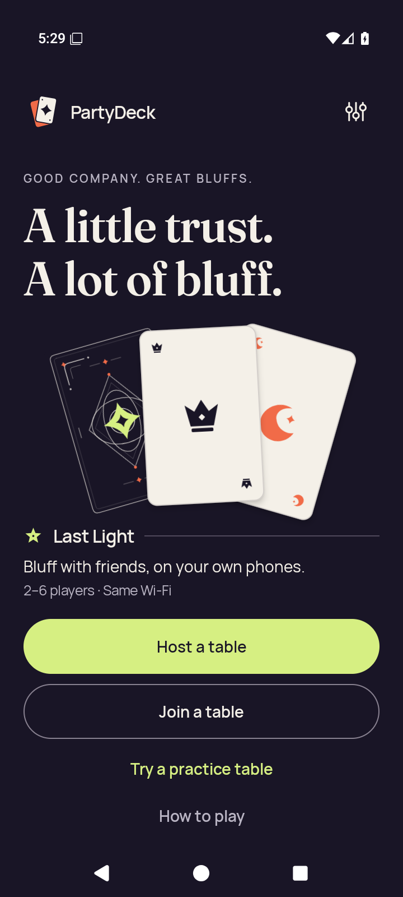
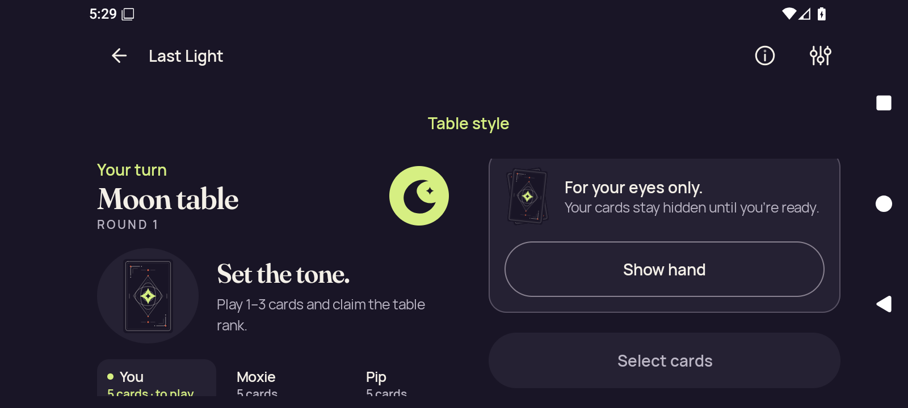
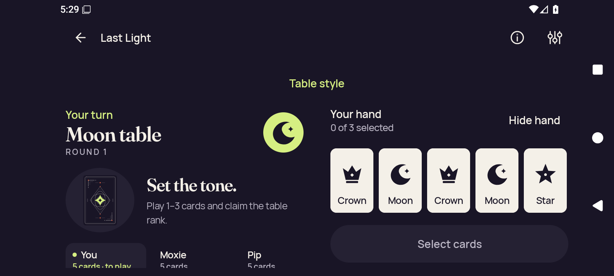
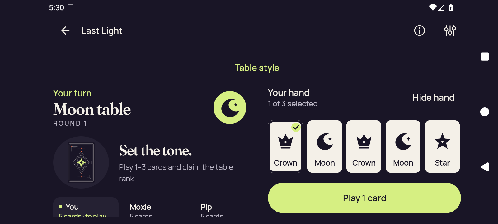
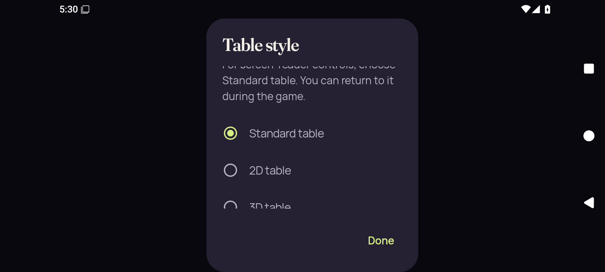
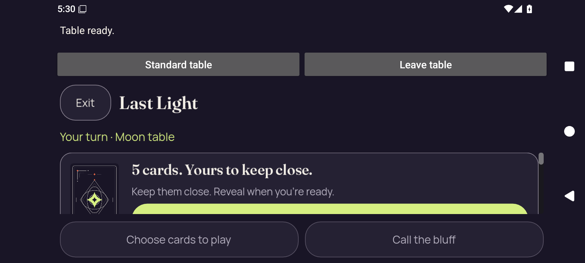
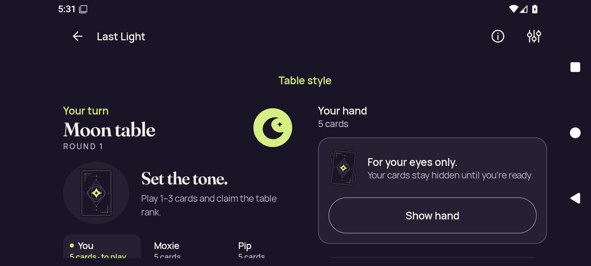

# API 36 optimized-test-signed, font 1.0

[All collections](../../../README.md) · [Preserved evidence index](../../evidence-index.md) · [Copy/review binding](../../../android-34503251315/provenance/publication-review/partydeck-gallery-2815-publication-binding-v1.json) · [Completed visual review](../../provenance/publication-review/partydeck-gallery-after-2355-api36-visual-review-v1.json) · [Unchanged source mapping](../../provenance/source-map/capture-publication-inventory.json)

**Original overall case outcome: failed. Named scopes: {"not-reached": 22, "passed": 1, "unsupported": 1}. No continuous-privacy acceptance.**

Capture-stage names identify checkpoints. The source result and named-scope outcomes remain unchanged.

All 125 original PNG/XML/JSON capture identities are retained. Across 96 named scopes, 15 pass, one fails, eight are unsupported and 72 are unreached. Optimized 200% reaches both 2D and 3D. Debug and optimized normal-text recovery cases remain failed; an overall recovery failure does not relabel its named unsupported check.

The original stills show readable public/hand controls at the recorded scroll positions, alongside lower Standard landscape clipping, clipped Table style explanatory/3D option content, and native initial 2D cover controls below the viewport. At 200%, some card/seat/action content is outside the captured scroll area. Explicitly revealed/selected hands stay distinct from concealed checkpoints.

Six MP4 originals retain startup-unavailable-original-retained status and growth-not-observed condition. The debug 200% MP4 retains captured-review-required after its held check failed; its recorded validation describes 214,574 bytes, 37.032189 seconds, 77 frames and 1600×720. No movie was viewed or decoded for this publication. No held/transition/continuous-privacy acceptance follows from these stills or preserved movies.

Source revision: `d06f83aa8f6905be515faf0f58690634714e5a2d`. CI run: [34506161751](https://github.com/Apdelrahman1911/PartyDeck/actions/runs/34506161751). 8 original PNG identities. Review methods: 8 attributed peer direct view.

Every thumbnail opens the unchanged original PNG. Original filenames, dimensions, source paths and outcomes remain separate even when pixels match. No derivative image was created. Frozen provenance pages retain their original text and source references.

| Original capture | Original identity and evidence | Visual observation |
| --- | --- | --- |
|  <code>home-cold.png</code> home-cold — emulator readiness | 720 × 1600 px · 132,377 bytes · text 1.0 SHA-256: <code>309dab75e290f08f992b2bac760b7df14c657da76b348ccd0026810180017446</code> Source: <code>/root/projects/PartyDeck/artifacts/evidence-storage/34506161751/android-adaptive-api36-optimized-test-signed-font-1.0-34506161751-1/godot-adaptive/runtime/captures/home-cold.png</code> Original case outcome: **failed** [UI XML](runtime/captures/home-cold.xml) · [Capture/result JSON](runtime/captures/home-cold.json) · [Original result](runtime/godot-adaptive-result.json) | **Attributed peer direct view** by <code>/root/assets</code>. Normal-text home with PartyDeck branding, illustrated marketing cards, Last Light description and Host/Join/practice/How to play actions. Displayed labels/actions fit and remain legible. Hero illustration and headline occupy the upper hierarchy without covering controls. Visible card faces belong to home-page artwork; no game hand or private state is shown. |
|  <code>2d-landscape-baseline-public.png</code> 2d-landscape-baseline-public — 2d-landscape.initial-landscape | 1600 × 720 px · 97,753 bytes · text 1.0 SHA-256: <code>0e15ef2ce5a2d97306090ae9d5bde6e000d001d2183274bfac8f4af1f3e1156f</code> Source: <code>/root/projects/PartyDeck/artifacts/evidence-storage/34506161751/android-adaptive-api36-optimized-test-signed-font-1.0-34506161751-1/godot-adaptive/runtime/captures/2d-landscape-baseline-public.png</code> Original case outcome: **failed** [UI XML](runtime/captures/2d-landscape-baseline-public.xml) · [Capture/result JSON](runtime/captures/2d-landscape-baseline-public.json) · [Original result](runtime/godot-adaptive-result.json) | **Attributed peer direct view** by <code>/root/assets</code>. Standard Moon table, round 1, Set the tone public guidance, concealed hand cover and disabled Select cards. Lower seat details are cut at the viewport bottom; main heading, guidance, cover and Show hand are readable. Only card-back cover artwork is visible; no private face/rank label appears. |
|  <code>2d-landscape-baseline-first-card.png</code> 2d-landscape-baseline-first-card — 2d-landscape.initial-landscape | 1600 × 720 px · 90,034 bytes · text 1.0 SHA-256: <code>79a181d29ba0243b2bdac7c1534e11b843d5490692dbcd7f180dab41609ad731</code> Source: <code>/root/projects/PartyDeck/artifacts/evidence-storage/34506161751/android-adaptive-api36-optimized-test-signed-font-1.0-34506161751-1/godot-adaptive/runtime/captures/2d-landscape-baseline-first-card.png</code> Original case outcome: **failed** [UI XML](runtime/captures/2d-landscape-baseline-first-card.xml) · [Capture/result JSON](runtime/captures/2d-landscape-baseline-first-card.json) · [Original result](runtime/godot-adaptive-result.json) | **Attributed peer direct view** by <code>/root/assets</code>. Standard Moon table with five revealed cards Crown, Moon, Crown, Moon, Star and 0 of 3 selected. Lower seat details are cut at the bottom. All five face symbols/rank labels, Hide hand and disabled Select cards are readable. Five private hand faces are visible in the revealed-hand state; no transition privacy conclusion. |
|  <code>2d-landscape-baseline-selected.png</code> 2d-landscape-baseline-selected — 2d-landscape.initial-landscape | 1600 × 720 px · 90,789 bytes · text 1.0 SHA-256: <code>d8dcd736ab9951056bb74f00c64c1e0c7158185fdc954753a99efe1baeb3dd54</code> Source: <code>/root/projects/PartyDeck/artifacts/evidence-storage/34506161751/android-adaptive-api36-optimized-test-signed-font-1.0-34506161751-1/godot-adaptive/runtime/captures/2d-landscape-baseline-selected.png</code> Original case outcome: **failed** [UI XML](runtime/captures/2d-landscape-baseline-selected.xml) · [Capture/result JSON](runtime/captures/2d-landscape-baseline-selected.json) · [Original result](runtime/godot-adaptive-result.json) | **Attributed peer direct view** by <code>/root/assets</code>. Standard Moon table with first Crown checked, 1 of 3 selected and Play 1 card enabled. Seat details remain cut at the lower boundary; card ranks, selection check and Play label remain legible. The five-card private hand remains visibly revealed in the selected state. |
|  <code>2d-landscape-initial-selector.png</code> 2d-landscape-initial-selector — 2d-landscape.initial-landscape | 1600 × 720 px · 45,303 bytes · text 1.0 SHA-256: <code>94607db792d3f98d7cda7e77359cc6ce350f44eeacdd5eea67dac13b667432a3</code> Source: <code>/root/projects/PartyDeck/artifacts/evidence-storage/34506161751/android-adaptive-api36-optimized-test-signed-font-1.0-34506161751-1/godot-adaptive/runtime/captures/2d-landscape-initial-selector.png</code> Original case outcome: **failed** [UI XML](runtime/captures/2d-landscape-initial-selector.xml) · [Capture/result JSON](runtime/captures/2d-landscape-initial-selector.json) · [Original result](runtime/godot-adaptive-result.json) | **Attributed peer direct view** by <code>/root/assets</code>. Normal-text Table style modal, Standard selected, 2D choice and Done visible. The explanatory text starts mid-line beneath the title. The 3D radio/label is clipped along its lower part at the content boundary. Standard, 2D and Done are legible; reachability is not established by this still. No underlying private hand face or rank label is visible through the dim modal background. |
|  <code>2d-landscape-initial-native-ready.png</code> 2d-landscape-initial-native-ready — 2d-landscape.initial-landscape | 1600 × 720 px · 102,848 bytes · text 1.0 SHA-256: <code>8b84c4a71402695de4c1b69121212a78e9396a3f4d4e1bf274d86dd9bb924b93</code> Source: <code>/root/projects/PartyDeck/artifacts/evidence-storage/34506161751/android-adaptive-api36-optimized-test-signed-font-1.0-34506161751-1/godot-adaptive/runtime/captures/2d-landscape-initial-native-ready.png</code> Original case outcome: **failed** [UI XML](runtime/captures/2d-landscape-initial-native-ready.xml) · [Capture/result JSON](runtime/captures/2d-landscape-initial-native-ready.json) · [Original result](runtime/godot-adaptive-result.json) | **Attributed peer direct view** by <code>/root/assets</code>. Normal-text native 2D host shows Table ready, Standard table, Leave table, Exit/Last Light, public Moon context and a covered five-card panel. Body cover/reveal panel is cropped by the fixed footer; the bright reveal control&#x27;s label is not visible. Disabled Choose cards to play and Call the bluff footer labels are readable. Only card-back artwork and cover copy appear; no private faces/rank labels are visible. |
|  <code>2d-landscape-unsupported-return-concealed.png</code> 2d-landscape-unsupported-return-concealed — 2d-landscape.held-rotation | 1600 × 720 px · 97,872 bytes · text 1.0 SHA-256: <code>5c1c78cf9fbf6cc829b744a2599e172ce719791511da44cd8bcb760517691716</code> Source: <code>/root/projects/PartyDeck/artifacts/evidence-storage/34506161751/android-adaptive-api36-optimized-test-signed-font-1.0-34506161751-1/godot-adaptive/runtime/captures/2d-landscape-unsupported-return-concealed.png</code> Original case outcome: **failed** [UI XML](runtime/captures/2d-landscape-unsupported-return-concealed.xml) · [Capture/result JSON](runtime/captures/2d-landscape-unsupported-return-concealed.json) · [Original result](runtime/godot-adaptive-result.json) | **Attributed peer direct view** by <code>/root/assets</code>. Standard Moon table return with Set the tone guidance, Your hand 5 cards, cover artwork and Show hand. Seat details and lower action region are below the bottom boundary. Public and cover text remain legible. The hand cover is visible in this retained unsupported-return still. It does not establish successful held rotation or the later failed recovery. |
|  <code>final-diagnostic.png</code> final-diagnostic — 2d-landscape.held-rotation | 1600 × 720 px · 97,671 bytes · text 1.0 SHA-256: <code>d455259a9f22555ee91db94df8f764e8150909fd80e5954a07896788f3734ffb</code> Source: <code>/root/projects/PartyDeck/artifacts/evidence-storage/34506161751/android-adaptive-api36-optimized-test-signed-font-1.0-34506161751-1/godot-adaptive/runtime/captures/final-diagnostic.png</code> Original case outcome: **failed** [UI XML](runtime/captures/final-diagnostic.xml) · [Capture/result JSON](runtime/captures/final-diagnostic.json) · [Original result](runtime/godot-adaptive-result.json) | **Attributed peer direct view** by <code>/root/assets</code>. Final diagnostic retains Standard Moon table with five-card cover and Show hand; public Set the tone guidance remains visible. Seat details and lower action control are clipped at the viewport bottom; main public and cover labels are legible. No private card face/rank appears in this final still. The named unsupported check and subsequent recovery failure remain separate. |
