# API 36 optimized-test-signed, font 2.0

[All collections](../../../README.md) · [Preserved evidence index](../../evidence-index.md) · [Copy/review binding](../../../android-34503251315/provenance/publication-review/partydeck-gallery-2815-publication-binding-v1.json) · [Completed visual review](../../provenance/publication-review/partydeck-gallery-after-2355-api36-visual-review-v1.json) · [Unchanged source mapping](../../provenance/source-map/capture-publication-inventory.json)

**Original overall case outcome: unsupported. Named scopes: {"not-reached": 6, "passed": 12, "unsupported": 6}. No continuous-privacy acceptance.**

Capture-stage names identify checkpoints. The source result and named-scope outcomes remain unchanged.

All 125 original PNG/XML/JSON capture identities are retained. Across 96 named scopes, 15 pass, one fails, eight are unsupported and 72 are unreached. Optimized 200% reaches both 2D and 3D. Debug and optimized normal-text recovery cases remain failed; an overall recovery failure does not relabel its named unsupported check.

The original stills show readable public/hand controls at the recorded scroll positions, alongside lower Standard landscape clipping, clipped Table style explanatory/3D option content, and native initial 2D cover controls below the viewport. At 200%, some card/seat/action content is outside the captured scroll area. Explicitly revealed/selected hands stay distinct from concealed checkpoints.

Six MP4 originals retain startup-unavailable-original-retained status and growth-not-observed condition. The debug 200% MP4 retains captured-review-required after its held check failed; its recorded validation describes 214,574 bytes, 37.032189 seconds, 77 frames and 1600×720. No movie was viewed or decoded for this publication. No held/transition/continuous-privacy acceptance follows from these stills or preserved movies.

Source revision: `d06f83aa8f6905be515faf0f58690634714e5a2d`. CI run: [34506161751](https://github.com/Apdelrahman1911/PartyDeck/actions/runs/34506161751). 102 original PNG identities. Review methods: 10 exact same-batch match, 92 attributed peer direct view.

Every thumbnail opens the unchanged original PNG. Original filenames, dimensions, source paths and outcomes remain separate even when pixels match. No derivative image was created. Frozen provenance pages retain their original text and source references.

| Original capture | Original identity and evidence | Visual observation |
| --- | --- | --- |
|  <code>home-cold.png</code> home-cold — emulator readiness | 720 × 1600 px · 79,919 bytes · text 2.0 SHA-256: <code>9819c018108fbf27c377d2028ed9cd8080b8e1659dcd671955090e6a33a213fa</code> Source: <code>/root/projects/PartyDeck/artifacts/evidence-storage/34506161751/android-adaptive-api36-optimized-test-signed-font-2.0-34506161751-1/godot-adaptive/runtime/captures/home-cold.png</code> Original case outcome: **unsupported** [UI XML](runtime/captures/home-cold.xml) · [Capture/result JSON](runtime/captures/home-cold.json) · [Original result](runtime/godot-adaptive-result.json) | **Exact same-batch match**. Exact bytes match the separately retained peer-viewed original at plan index 8. Reused pixel observation: PartyDeck home at 2× text with Last Light description, player/Wi-Fi line, Host a table, Join a table, practice and How to play. All displayed home labels and actions fit and are legible, with clear heading/action hierarchy. No in-game hand or private card information is displayed. [Reviewed matching original](../../debug/font-2.0/runtime/captures/home-cold.png); original capture identity remains separate. |
| <a href="runtime/captures/2d-landscape-baseline-public.png">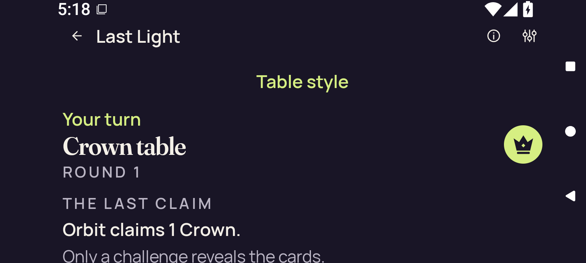</a> <code>2d-landscape-baseline-public.png</code> 2d-landscape-baseline-public — 2d-landscape.initial-landscape | 1600 × 720 px · 76,826 bytes · text 2.0 SHA-256: <code>833ce9572d665d9c519e82a8fa96260383f385b13511615f1134e4133da5231e</code> Source: <code>/root/projects/PartyDeck/artifacts/evidence-storage/34506161751/android-adaptive-api36-optimized-test-signed-font-2.0-34506161751-1/godot-adaptive/runtime/captures/2d-landscape-baseline-public.png</code> Original case outcome: **unsupported** [UI XML](runtime/captures/2d-landscape-baseline-public.xml) · [Capture/result JSON](runtime/captures/2d-landscape-baseline-public.json) · [Original result](runtime/godot-adaptive-result.json) | **Attributed peer direct view** by <code>/root/assets</code>. 2× landscape Standard Crown table, round 1, Your turn and public Orbit claims 1 Crown. The Only a challenge reveals the cards line is cut along the bottom. Hand and action sections are outside the viewport. No private face/rank is visible; the off-screen hand cannot be classified as covered or revealed from this image. |
| <a href="runtime/captures/2d-landscape-baseline-first-card.png">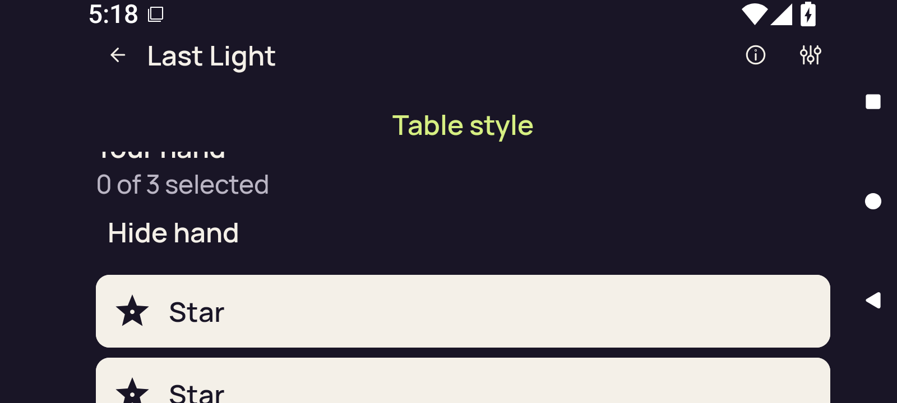</a> <code>2d-landscape-baseline-first-card.png</code> 2d-landscape-baseline-first-card — 2d-landscape.initial-landscape | 1600 × 720 px · 50,149 bytes · text 2.0 SHA-256: <code>6c00f796231b101b5c3f7c28d22a3900080b8b5ec58fc89767aaa4c662f89d98</code> Source: <code>/root/projects/PartyDeck/artifacts/evidence-storage/34506161751/android-adaptive-api36-optimized-test-signed-font-2.0-34506161751-1/godot-adaptive/runtime/captures/2d-landscape-baseline-first-card.png</code> Original case outcome: **unsupported** [UI XML](runtime/captures/2d-landscape-baseline-first-card.xml) · [Capture/result JSON](runtime/captures/2d-landscape-baseline-first-card.json) · [Original result](runtime/godot-adaptive-result.json) | **Attributed peer direct view** by <code>/root/assets</code>. Revealed Standard hand at 2× landscape text with 0 of 3 selected, Hide hand and a full Star row followed by another Star row. Your hand heading is clipped at the top of the content region. The second Star row is partly cut at the bottom; the first rank and selection/Hide labels are readable. Private Star rows are visible in the revealed-hand state; no continuous privacy or transition claim. |
| <a href="runtime/captures/2d-landscape-baseline-selected.png">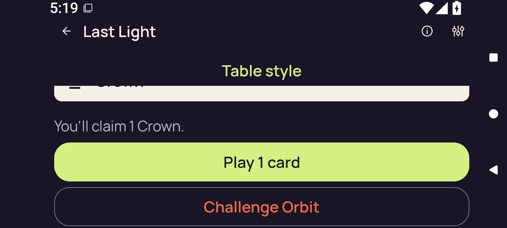</a> <code>2d-landscape-baseline-selected.png</code> 2d-landscape-baseline-selected — 2d-landscape.initial-landscape | 1600 × 720 px · 54,590 bytes · text 2.0 SHA-256: <code>b97a5baaa3818e7da6586297a6c728efa160f0f20e68783fc1aa84f14674e1d8</code> Source: <code>/root/projects/PartyDeck/artifacts/evidence-storage/34506161751/android-adaptive-api36-optimized-test-signed-font-2.0-34506161751-1/godot-adaptive/runtime/captures/2d-landscape-baseline-selected.png</code> Original case outcome: **unsupported** [UI XML](runtime/captures/2d-landscape-baseline-selected.xml) · [Capture/result JSON](runtime/captures/2d-landscape-baseline-selected.json) · [Original result](runtime/godot-adaptive-result.json) | **Attributed peer direct view** by <code>/root/assets</code>. Lower Standard hand/action region with You&#x27;ll claim 1 Crown, enabled Play 1 card and Challenge Orbit. Only the bottom fragment of a cream card row remains at the top; its face/label is not fully visible. Claim and both action labels fit and are legible. A revealed-hand row fragment is visible. The public Crown claim preview does not identify the selected private card. |
| <a href="runtime/captures/2d-landscape-initial-selector.png">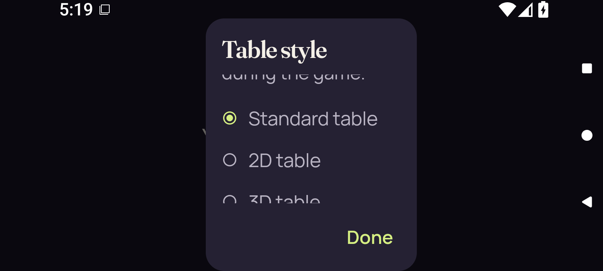</a> <code>2d-landscape-initial-selector.png</code> 2d-landscape-initial-selector — 2d-landscape.initial-landscape | 1600 × 720 px · 48,958 bytes · text 2.0 SHA-256: <code>c64f25220d0af13efc0402c757835faff0d63b5ea308f3ef3542245e76b95a4c</code> Source: <code>/root/projects/PartyDeck/artifacts/evidence-storage/34506161751/android-adaptive-api36-optimized-test-signed-font-2.0-34506161751-1/godot-adaptive/runtime/captures/2d-landscape-initial-selector.png</code> Original case outcome: **unsupported** [UI XML](runtime/captures/2d-landscape-initial-selector.xml) · [Capture/result JSON](runtime/captures/2d-landscape-initial-selector.json) · [Original result](runtime/godot-adaptive-result.json) | **Attributed peer direct view** by <code>/root/assets</code>. 2× landscape Table style modal with Standard selected, 2D choice and Done. The ending explanatory sentence is clipped at the upper content edge; the 3D option is clipped across its lower portion. Standard, 2D and Done are readable. No scrolling/reachability conclusion. No legible private hand rank or face is visible behind the modal. |
| <a href="runtime/captures/2d-landscape-initial-native-ready.png">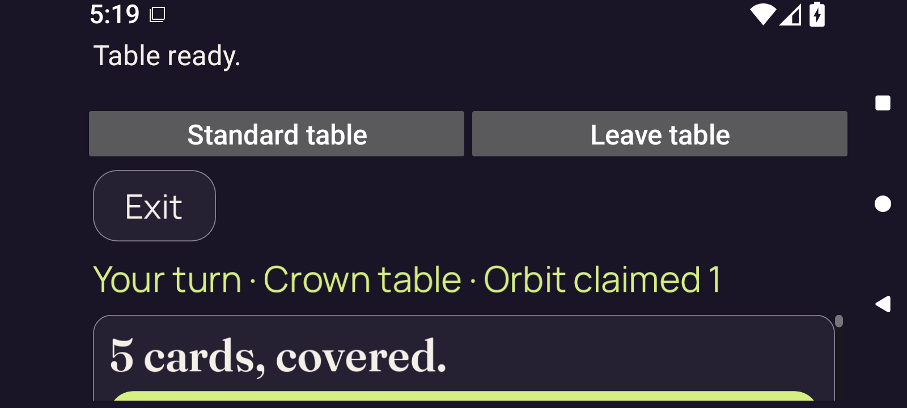</a> <code>2d-landscape-initial-native-ready.png</code> 2d-landscape-initial-native-ready — 2d-landscape.initial-landscape | 1600 × 720 px · 87,651 bytes · text 2.0 SHA-256: <code>36c4715d2985f4e15b31a94841b601a328771b3d9461e127fdd41776d853a392</code> Source: <code>/root/projects/PartyDeck/artifacts/evidence-storage/34506161751/android-adaptive-api36-optimized-test-signed-font-2.0-34506161751-1/godot-adaptive/runtime/captures/2d-landscape-initial-native-ready.png</code> Original case outcome: **unsupported** [UI XML](runtime/captures/2d-landscape-initial-native-ready.xml) · [Capture/result JSON](runtime/captures/2d-landscape-initial-native-ready.json) · [Original result](runtime/godot-adaptive-result.json) | **Attributed peer direct view** by <code>/root/assets</code>. Native 2D ready view at 2× text with Standard table/Leave table, Exit, public Crown/Orbit context and 5 cards, covered. The bright control beneath the covered-card heading is almost entirely below the viewport, with no readable button label. Upper native controls/public summary are readable. Covered-hand status is visible; no private face/rank label is shown in the viewport. |
| <a href="runtime/captures/2d-landscape-unsupported-return-concealed.png">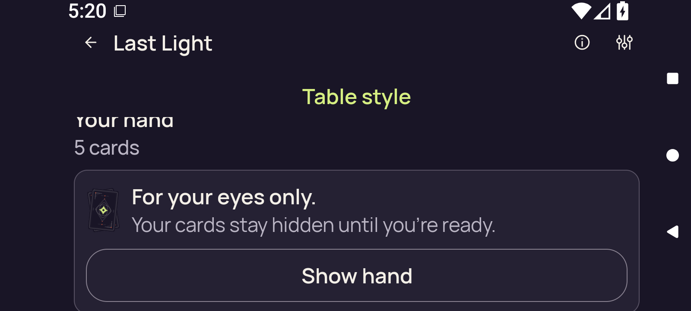</a> <code>2d-landscape-unsupported-return-concealed.png</code> 2d-landscape-unsupported-return-concealed — 2d-landscape.held-rotation | 1600 × 720 px · 74,008 bytes · text 2.0 SHA-256: <code>6d254bc29d1c40a83bc4a71335698eb5facb1aed32bd5e981bf4bfdd894382e9</code> Source: <code>/root/projects/PartyDeck/artifacts/evidence-storage/34506161751/android-adaptive-api36-optimized-test-signed-font-2.0-34506161751-1/godot-adaptive/runtime/captures/2d-landscape-unsupported-return-concealed.png</code> Original case outcome: **unsupported** [UI XML](runtime/captures/2d-landscape-unsupported-return-concealed.xml) · [Capture/result JSON](runtime/captures/2d-landscape-unsupported-return-concealed.json) · [Original result](runtime/godot-adaptive-result.json) | **Attributed peer direct view** by <code>/root/assets</code>. Standard hand return at 2× landscape text: 5 cards, concealment panel, back artwork and Show hand. Your hand heading is cropped at the top under Table style. Cover copy and Show hand remain legible; lower action area is outside the viewport. Only cover/back artwork is visible. The named held-rotation scope remains unsupported; this still does not prove the transition was protected. |
| <a href="runtime/captures/2d-landscape-unsupported-return-selection-cleared.png">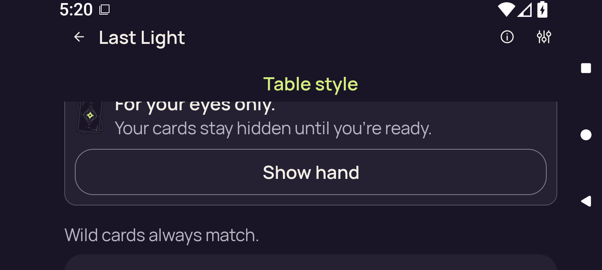</a> <code>2d-landscape-unsupported-return-selection-cleared.png</code> 2d-landscape-unsupported-return-selection-cleared — 2d-landscape.held-rotation | 1600 × 720 px · 73,090 bytes · text 2.0 SHA-256: <code>2b838258ba695ffda83fd4aa22481b32281e0420eadb49807a18776d919aa4c8</code> Source: <code>/root/projects/PartyDeck/artifacts/evidence-storage/34506161751/android-adaptive-api36-optimized-test-signed-font-2.0-34506161751-1/godot-adaptive/runtime/captures/2d-landscape-unsupported-return-selection-cleared.png</code> Original case outcome: **unsupported** [UI XML](runtime/captures/2d-landscape-unsupported-return-selection-cleared.xml) · [Capture/result JSON](runtime/captures/2d-landscape-unsupported-return-selection-cleared.json) · [Original result](runtime/godot-adaptive-result.json) | **Attributed peer direct view** by <code>/root/assets</code>. Lower portion of the Standard cover panel with Show hand and the public rule Wild cards always match. The cover title/artwork are cut at the upper body edge; the following bottom action is only partly visible. Show hand and the rule text are clear. No private face/rank row appears. Wild cards always match is public rule copy, not a revealed private-card identity. The screenshot alone does not demonstrate selection-clearing timing. |
|  <code>2d-landscape-unsupported-return-public.png</code> 2d-landscape-unsupported-return-public — 2d-landscape.held-rotation | 1600 × 720 px · 77,156 bytes · text 2.0 SHA-256: <code>0e8e39d616d9bbd8a65d7e36e5a5eff615f035430a3837d9e075c5074da0c38d</code> Source: <code>/root/projects/PartyDeck/artifacts/evidence-storage/34506161751/android-adaptive-api36-optimized-test-signed-font-2.0-34506161751-1/godot-adaptive/runtime/captures/2d-landscape-unsupported-return-public.png</code> Original case outcome: **unsupported** [UI XML](runtime/captures/2d-landscape-unsupported-return-public.xml) · [Capture/result JSON](runtime/captures/2d-landscape-unsupported-return-public.json) · [Original result](runtime/godot-adaptive-result.json) | **Attributed peer direct view** by <code>/root/assets</code>. Standard Crown table public view with Your turn, round 1 and Orbit claims 1 Crown. Only a challenge reveals the cards is clipped at the lower viewport edge. Hand/control sections are off-screen. No private hand face/rank appears; the off-screen hand state cannot be determined from this public view. |
| <a href="runtime/captures/2d-landscape-unsupported-return-first-card.png">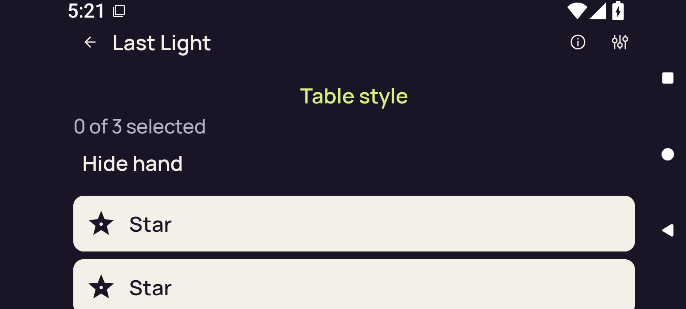</a> <code>2d-landscape-unsupported-return-first-card.png</code> 2d-landscape-unsupported-return-first-card — 2d-landscape.held-rotation | 1600 × 720 px · 49,085 bytes · text 2.0 SHA-256: <code>7578956a0871572ba75d777c0cede833a4f226509d516f467e3e4c2250096e3e</code> Source: <code>/root/projects/PartyDeck/artifacts/evidence-storage/34506161751/android-adaptive-api36-optimized-test-signed-font-2.0-34506161751-1/godot-adaptive/runtime/captures/2d-landscape-unsupported-return-first-card.png</code> Original case outcome: **unsupported** [UI XML](runtime/captures/2d-landscape-unsupported-return-first-card.xml) · [Capture/result JSON](runtime/captures/2d-landscape-unsupported-return-first-card.json) · [Original result](runtime/godot-adaptive-result.json) | **Attributed peer direct view** by <code>/root/assets</code>. Revealed Standard hand list at 2× landscape text with 0 of 3 selected, Hide hand and two Star rows. Second Star row&#x27;s lower container is cut by the bottom edge, though both visible Star labels/symbols remain readable. Further hand/actions are outside the viewport. Private Star ranks are visible in this explicit revealed-hand capture; no transition or continuous-concealment inference. |
| <a href="runtime/captures/2d-landscape-unsupported-portrait-return-concealed.png">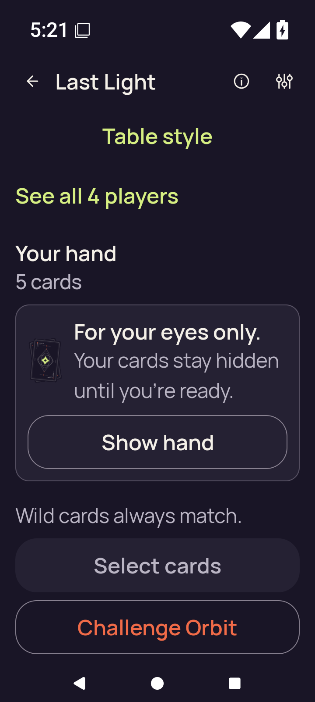</a> <code>2d-landscape-unsupported-portrait-return-concealed.png</code> 2d-landscape-unsupported-portrait-return-concealed — 2d-landscape.held-rotation | 720 × 1600 px · 113,687 bytes · text 2.0 SHA-256: <code>ee9147f0ae1a293cb19795c0d51bb5bbdea2ea2f71d8139a000651e2581d0b47</code> Source: <code>/root/projects/PartyDeck/artifacts/evidence-storage/34506161751/android-adaptive-api36-optimized-test-signed-font-2.0-34506161751-1/godot-adaptive/runtime/captures/2d-landscape-unsupported-portrait-return-concealed.png</code> Original case outcome: **unsupported** [UI XML](runtime/captures/2d-landscape-unsupported-portrait-return-concealed.xml) · [Capture/result JSON](runtime/captures/2d-landscape-unsupported-portrait-return-concealed.json) · [Original result](runtime/godot-adaptive-result.json) | **Attributed peer direct view** by <code>/root/assets</code>. 2× portrait Standard hand return with See all 4 players, five-card cover, Show hand, public Wild-card rule, disabled Select cards and Challenge Orbit. The full cover panel and both lower action labels fit at this scroll position. Public table/claim details are above the viewport. Back/cover artwork only; no private face/rank row is visible. This still does not change the unsupported held-rotation result. |
|  <code>2d-landscape-unsupported-portrait-return-selection-cleared.png</code> 2d-landscape-unsupported-portrait-return-selection-cleared — 2d-landscape.held-rotation | 720 × 1600 px · 113,687 bytes · text 2.0 SHA-256: <code>ee9147f0ae1a293cb19795c0d51bb5bbdea2ea2f71d8139a000651e2581d0b47</code> Source: <code>/root/projects/PartyDeck/artifacts/evidence-storage/34506161751/android-adaptive-api36-optimized-test-signed-font-2.0-34506161751-1/godot-adaptive/runtime/captures/2d-landscape-unsupported-portrait-return-selection-cleared.png</code> Original case outcome: **unsupported** [UI XML](runtime/captures/2d-landscape-unsupported-portrait-return-selection-cleared.xml) · [Capture/result JSON](runtime/captures/2d-landscape-unsupported-portrait-return-selection-cleared.json) · [Original result](runtime/godot-adaptive-result.json) | **Exact same-batch match**. Exact bytes match the separately retained peer-viewed original at plan index 33. Reused pixel observation: 2× portrait Standard hand return with See all 4 players, five-card cover, Show hand, public Wild-card rule, disabled Select cards and Challenge Orbit. The full cover panel and both lower action labels fit at this scroll position. Public table/claim details are above the viewport. Back/cover artwork only; no private face/rank row is visible. This still does not change the unsupported held-rotation result. [Reviewed matching original](runtime/captures/2d-landscape-unsupported-portrait-return-concealed.png); original capture identity remains separate. |
|  <code>2d-landscape-unsupported-portrait-return-public.png</code> 2d-landscape-unsupported-portrait-return-public — 2d-landscape.held-rotation | 720 × 1600 px · 123,942 bytes · text 2.0 SHA-256: <code>b85c5795f43d41738d5cedfb8ed52ecbed7e383eb45a16cc5382e2a45510e3a7</code> Source: <code>/root/projects/PartyDeck/artifacts/evidence-storage/34506161751/android-adaptive-api36-optimized-test-signed-font-2.0-34506161751-1/godot-adaptive/runtime/captures/2d-landscape-unsupported-portrait-return-public.png</code> Original case outcome: **unsupported** [UI XML](runtime/captures/2d-landscape-unsupported-portrait-return-public.xml) · [Capture/result JSON](runtime/captures/2d-landscape-unsupported-portrait-return-public.json) · [Original result](runtime/godot-adaptive-result.json) | **Attributed peer direct view** by <code>/root/assets</code>. 2× portrait Standard Crown table, public Orbit claims 1 Crown, See all 4 players and upper five-card cover. Public/cover text wraps legibly. The bottom Show hand control is cut, with its label below the viewport. Visible hand region shows back artwork and concealment copy; no private card face/rank appears. |
| <a href="runtime/captures/2d-landscape-unsupported-portrait-return-first-card.png">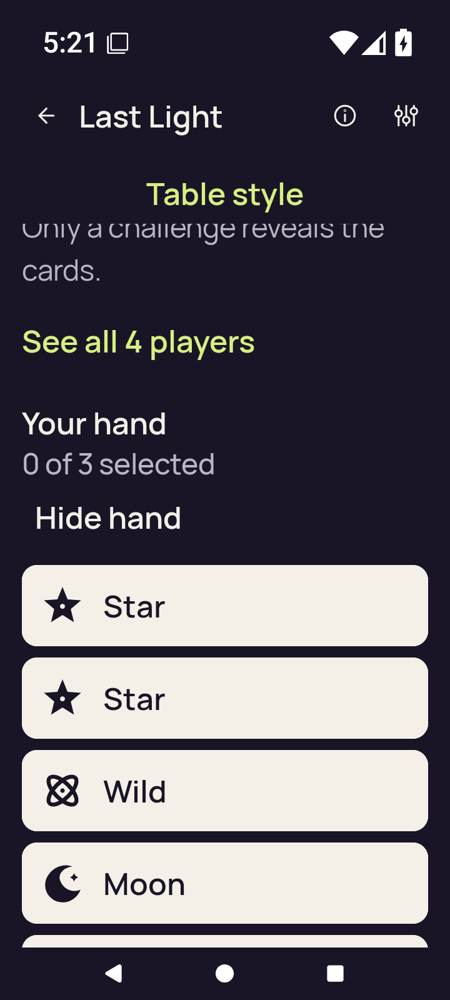</a> <code>2d-landscape-unsupported-portrait-return-first-card.png</code> 2d-landscape-unsupported-portrait-return-first-card — 2d-landscape.held-rotation | 720 × 1600 px · 85,673 bytes · text 2.0 SHA-256: <code>7b9a87b454c7c81b61d70143db08e71dcfecda780c2534cb9e49d700d8dd78ce</code> Source: <code>/root/projects/PartyDeck/artifacts/evidence-storage/34506161751/android-adaptive-api36-optimized-test-signed-font-2.0-34506161751-1/godot-adaptive/runtime/captures/2d-landscape-unsupported-portrait-return-first-card.png</code> Original case outcome: **unsupported** [UI XML](runtime/captures/2d-landscape-unsupported-portrait-return-first-card.xml) · [Capture/result JSON](runtime/captures/2d-landscape-unsupported-portrait-return-first-card.json) · [Original result](runtime/godot-adaptive-result.json) | **Attributed peer direct view** by <code>/root/assets</code>. 2× portrait revealed Standard hand with 0 of 3 selected, Hide hand, and readable Star, Star, Wild and Moon rows. The public explanatory text is clipped at the top under Table style. A fifth card row is only a top sliver at the bottom and its rank is not readable. Four private hand ranks are visible in a revealed-hand capture; the fifth rank is not established by this image. |
|  <code>2d-landscape-reentry-selected.png</code> 2d-landscape-reentry-selected — 2d-landscape.portrait-reentry-standard | 720 × 1600 px · 85,311 bytes · text 2.0 SHA-256: <code>e84023523489e8f960c7e882f6714f794cb0b9c61d75432fa4612098d6537555</code> Source: <code>/root/projects/PartyDeck/artifacts/evidence-storage/34506161751/android-adaptive-api36-optimized-test-signed-font-2.0-34506161751-1/godot-adaptive/runtime/captures/2d-landscape-reentry-selected.png</code> Original case outcome: **unsupported** [UI XML](runtime/captures/2d-landscape-reentry-selected.xml) · [Capture/result JSON](runtime/captures/2d-landscape-reentry-selected.json) · [Original result](runtime/godot-adaptive-result.json) | **Attributed peer direct view** by <code>/root/assets</code>. 2× portrait Standard hand with Star, Star, Wild, Moon, Crown; the first Star has a check. Claim preview, Play 1 card and Challenge Orbit are visible. All five rank rows and both lower action labels fit and are legible at this scroll position. The hand heading/Hide control is above the viewport. The five private ranks are visibly revealed, with one selection check. This is not evidence of continuous privacy through reentry. |
|  <code>2d-landscape-portrait-selector.png</code> 2d-landscape-portrait-selector — 2d-landscape.portrait-reentry-standard | 720 × 1600 px · 97,489 bytes · text 2.0 SHA-256: <code>09757b60052df699f13e109182115d603e26030ea2253aa8021644ac78787656</code> Source: <code>/root/projects/PartyDeck/artifacts/evidence-storage/34506161751/android-adaptive-api36-optimized-test-signed-font-2.0-34506161751-1/godot-adaptive/runtime/captures/2d-landscape-portrait-selector.png</code> Original case outcome: **unsupported** [UI XML](runtime/captures/2d-landscape-portrait-selector.xml) · [Capture/result JSON](runtime/captures/2d-landscape-portrait-selector.json) · [Original result](runtime/godot-adaptive-result.json) | **Attributed peer direct view** by <code>/root/assets</code>. 2× portrait Table style dialog with the full explanatory copy, Standard selected, 2D and 3D options, and Done. All explanatory text, all three options and Done fit and remain legible in this portrait capture. No underlying private hand face or rank label is visible in the modal background. |
| <a href="runtime/captures/2d-landscape-portrait-native-ready.png">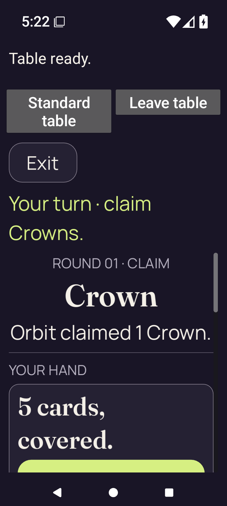</a> <code>2d-landscape-portrait-native-ready.png</code> 2d-landscape-portrait-native-ready — 2d-landscape.portrait-reentry-standard | 720 × 1600 px · 126,523 bytes · text 2.0 SHA-256: <code>4dedeec5873a3fb942d9bc3728be402ef9a722cf392f631feacd1b2944a72048</code> Source: <code>/root/projects/PartyDeck/artifacts/evidence-storage/34506161751/android-adaptive-api36-optimized-test-signed-font-2.0-34506161751-1/godot-adaptive/runtime/captures/2d-landscape-portrait-native-ready.png</code> Original case outcome: **unsupported** [UI XML](runtime/captures/2d-landscape-portrait-native-ready.xml) · [Capture/result JSON](runtime/captures/2d-landscape-portrait-native-ready.json) · [Original result](runtime/godot-adaptive-result.json) | **Attributed peer direct view** by <code>/root/assets</code>. 2× portrait native 2D host: Table ready, wrapped Standard table, Leave table, Exit, public Crown/Orbit claim and 5 cards, covered. Host/public labels wrap and remain legible. The bright control below the cover heading is cut at the bottom, with its label outside the viewport. The Crown text is a public table/claim label. The visible hand area is covered with no private rank face or private label displayed. |
|  <code>2d-landscape-standard-return-concealed.png</code> 2d-landscape-standard-return-concealed — 2d-landscape.portrait-reentry-standard | 720 × 1600 px · 113,661 bytes · text 2.0 SHA-256: <code>f52b04786c565e6f7eaa787d8bc890ba094bb9218b646fdf3f5f214bd5c96417</code> Source: <code>/root/projects/PartyDeck/artifacts/evidence-storage/34506161751/android-adaptive-api36-optimized-test-signed-font-2.0-34506161751-1/godot-adaptive/runtime/captures/2d-landscape-standard-return-concealed.png</code> Original case outcome: **unsupported** [UI XML](runtime/captures/2d-landscape-standard-return-concealed.xml) · [Capture/result JSON](runtime/captures/2d-landscape-standard-return-concealed.json) · [Original result](runtime/godot-adaptive-result.json) | **Attributed peer direct view** by <code>/root/assets</code>. Standard portrait return with See all 4 players, five-card concealment panel, Show hand, public Wild-card rule, disabled Select cards and Challenge Orbit. The cover and action labels fit and are readable at this scroll position. Public table/claim section is above the viewport. No private face/rank is visible in the covered hand; this capture does not establish privacy between frames. |
|  <code>2d-landscape-standard-return-selection-cleared.png</code> 2d-landscape-standard-return-selection-cleared — 2d-landscape.portrait-reentry-standard | 720 × 1600 px · 113,661 bytes · text 2.0 SHA-256: <code>f52b04786c565e6f7eaa787d8bc890ba094bb9218b646fdf3f5f214bd5c96417</code> Source: <code>/root/projects/PartyDeck/artifacts/evidence-storage/34506161751/android-adaptive-api36-optimized-test-signed-font-2.0-34506161751-1/godot-adaptive/runtime/captures/2d-landscape-standard-return-selection-cleared.png</code> Original case outcome: **unsupported** [UI XML](runtime/captures/2d-landscape-standard-return-selection-cleared.xml) · [Capture/result JSON](runtime/captures/2d-landscape-standard-return-selection-cleared.json) · [Original result](runtime/godot-adaptive-result.json) | **Exact same-batch match**. Exact bytes match the separately retained peer-viewed original at plan index 40. Reused pixel observation: Standard portrait return with See all 4 players, five-card concealment panel, Show hand, public Wild-card rule, disabled Select cards and Challenge Orbit. The cover and action labels fit and are readable at this scroll position. Public table/claim section is above the viewport. No private face/rank is visible in the covered hand; this capture does not establish privacy between frames. [Reviewed matching original](runtime/captures/2d-landscape-standard-return-concealed.png); original capture identity remains separate. |
| <a href="runtime/captures/2d-landscape-standard-return-public.png">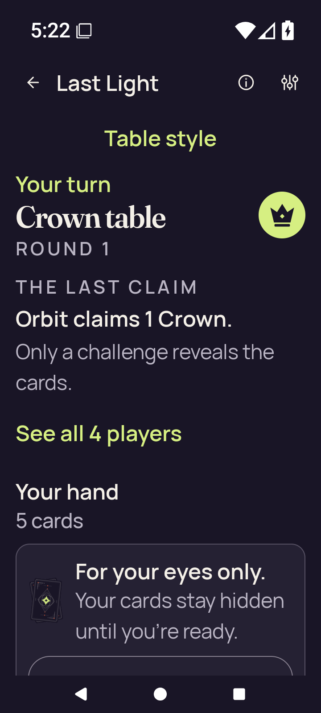</a> <code>2d-landscape-standard-return-public.png</code> 2d-landscape-standard-return-public — 2d-landscape.portrait-reentry-standard | 720 × 1600 px · 123,819 bytes · text 2.0 SHA-256: <code>19217eab7be8aadf2b8af2f7a69fbbfc1778d0fa22e8903aaf29eee913f83407</code> Source: <code>/root/projects/PartyDeck/artifacts/evidence-storage/34506161751/android-adaptive-api36-optimized-test-signed-font-2.0-34506161751-1/godot-adaptive/runtime/captures/2d-landscape-standard-return-public.png</code> Original case outcome: **unsupported** [UI XML](runtime/captures/2d-landscape-standard-return-public.xml) · [Capture/result JSON](runtime/captures/2d-landscape-standard-return-public.json) · [Original result](runtime/godot-adaptive-result.json) | **Attributed peer direct view** by <code>/root/assets</code>. Portrait Standard public Crown table with Orbit claims 1 Crown, player link, hand count and concealment panel. Public and cover text wrap clearly; the Show hand button extends below the viewport and its label is not visible. The visible hand portion contains back artwork and concealment copy only. |
| <a href="runtime/captures/2d-landscape-standard-return-first-card.png">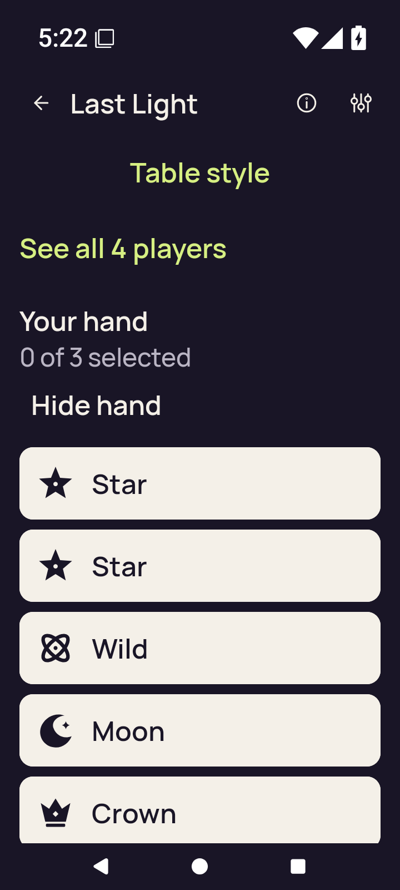</a> <code>2d-landscape-standard-return-first-card.png</code> 2d-landscape-standard-return-first-card — 2d-landscape.portrait-reentry-standard | 720 × 1600 px · 79,879 bytes · text 2.0 SHA-256: <code>9fbc68ba63e1a32cdd3fe5cf611a98730be1cc3b11e06dc58ece175725ee3e42</code> Source: <code>/root/projects/PartyDeck/artifacts/evidence-storage/34506161751/android-adaptive-api36-optimized-test-signed-font-2.0-34506161751-1/godot-adaptive/runtime/captures/2d-landscape-standard-return-first-card.png</code> Original case outcome: **unsupported** [UI XML](runtime/captures/2d-landscape-standard-return-first-card.xml) · [Capture/result JSON](runtime/captures/2d-landscape-standard-return-first-card.json) · [Original result](runtime/godot-adaptive-result.json) | **Attributed peer direct view** by <code>/root/assets</code>. Portrait Standard revealed hand with 0 of 3 selected, Hide hand and Star, Star, Wild, Moon, Crown rows. All five rank labels/symbols are readable. The bottom of the final Crown row is clipped at the lower content boundary; play/challenge controls are outside the viewport. All five private hand ranks are visibly revealed in this first-card capture. |
| <a href="runtime/captures/2d-landscape-leave-selected.png">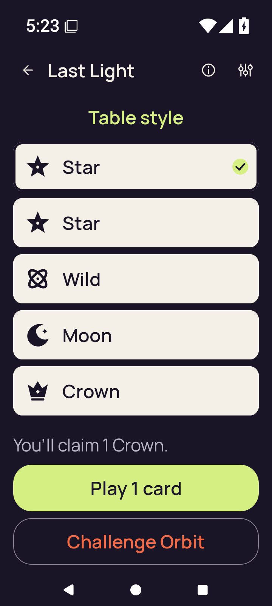</a> <code>2d-landscape-leave-selected.png</code> 2d-landscape-leave-selected — 2d-landscape.native-leave-home | 720 × 1600 px · 86,015 bytes · text 2.0 SHA-256: <code>58aeb090010395e27ceddfd9b88f230dca43da25f61c9281e30e2f7fb7842169</code> Source: <code>/root/projects/PartyDeck/artifacts/evidence-storage/34506161751/android-adaptive-api36-optimized-test-signed-font-2.0-34506161751-1/godot-adaptive/runtime/captures/2d-landscape-leave-selected.png</code> Original case outcome: **unsupported** [UI XML](runtime/captures/2d-landscape-leave-selected.xml) · [Capture/result JSON](runtime/captures/2d-landscape-leave-selected.json) · [Original result](runtime/godot-adaptive-result.json) | **Attributed peer direct view** by <code>/root/assets</code>. Pre-leave Standard hand with first Star checked, followed by Star, Wild, Moon and Crown; claim preview, Play 1 card and Challenge Orbit visible. All five rank rows, the check mark and action labels fit and are readable at this scroll position; hand header/Hide control are above the viewport. Five private ranks are visibly revealed before the leave flow; no inference about the later native/leave transition. |
| <a href="runtime/captures/2d-landscape-leave-selector.png">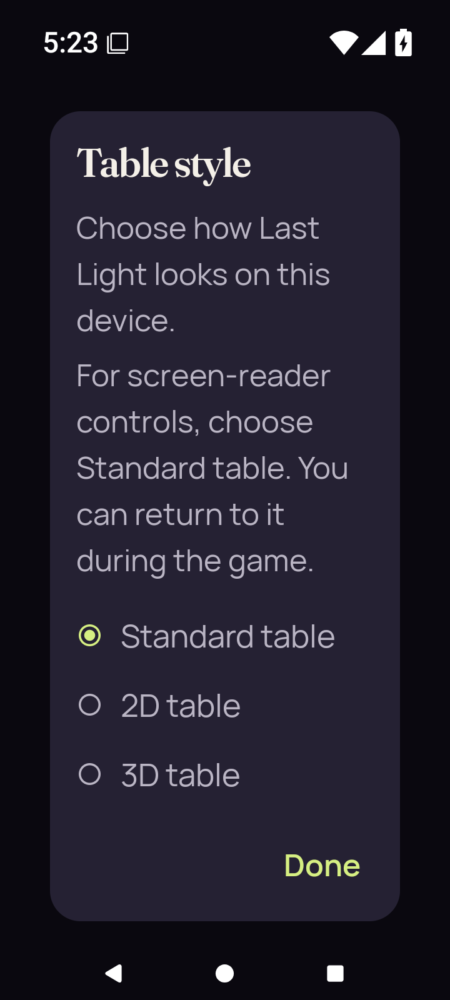</a> <code>2d-landscape-leave-selector.png</code> 2d-landscape-leave-selector — 2d-landscape.native-leave-home | 720 × 1600 px · 98,327 bytes · text 2.0 SHA-256: <code>c18a84e11e94fe221f67bcdafdba2a80d67c04846dc0cfaa707cd159d8ca48fd</code> Source: <code>/root/projects/PartyDeck/artifacts/evidence-storage/34506161751/android-adaptive-api36-optimized-test-signed-font-2.0-34506161751-1/godot-adaptive/runtime/captures/2d-landscape-leave-selector.png</code> Original case outcome: **unsupported** [UI XML](runtime/captures/2d-landscape-leave-selector.xml) · [Capture/result JSON](runtime/captures/2d-landscape-leave-selector.json) · [Original result](runtime/godot-adaptive-result.json) | **Attributed peer direct view** by <code>/root/assets</code>. Portrait Table style dialog with complete explanatory copy, Standard selected, 2D and 3D choices and Done. No displayed explanatory/option/action label is clipped; clear title-to-options hierarchy. No private card face or rank is visible behind the darkened modal. |
| <a href="runtime/captures/2d-landscape-leave-native-ready.png">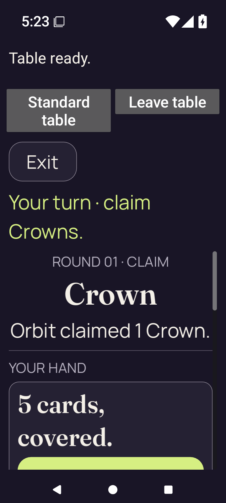</a> <code>2d-landscape-leave-native-ready.png</code> 2d-landscape-leave-native-ready — 2d-landscape.native-leave-home | 720 × 1600 px · 127,190 bytes · text 2.0 SHA-256: <code>3a9d445e86717df4925b757f76c55b74b8927c935e578efa7356fd999f4a17b3</code> Source: <code>/root/projects/PartyDeck/artifacts/evidence-storage/34506161751/android-adaptive-api36-optimized-test-signed-font-2.0-34506161751-1/godot-adaptive/runtime/captures/2d-landscape-leave-native-ready.png</code> Original case outcome: **unsupported** [UI XML](runtime/captures/2d-landscape-leave-native-ready.xml) · [Capture/result JSON](runtime/captures/2d-landscape-leave-native-ready.json) · [Original result](runtime/godot-adaptive-result.json) | **Attributed peer direct view** by <code>/root/assets</code>. Native 2D pre-leave ready view at 2× portrait text: host return/leave controls, Exit, public Crown/Orbit claim and five-card cover. Standard table wraps to two readable lines. Lower cover/reveal control extends below the body viewport, leaving its label hidden. The hand cover is visible and no private rank face/label appears. Public Crown text is not a private-hand identity. |
|  <code>2d-landscape-leave-confirmation.png</code> 2d-landscape-leave-confirmation — 2d-landscape.native-leave-home | 720 × 1600 px · 62,710 bytes · text 2.0 SHA-256: <code>3bce615cd4c80a5959e437098298fbd1bb8f8ac59bc86ee73a7c04b09072a66d</code> Source: <code>/root/projects/PartyDeck/artifacts/evidence-storage/34506161751/android-adaptive-api36-optimized-test-signed-font-2.0-34506161751-1/godot-adaptive/runtime/captures/2d-landscape-leave-confirmation.png</code> Original case outcome: **unsupported** [UI XML](runtime/captures/2d-landscape-leave-confirmation.xml) · [Capture/result JSON](runtime/captures/2d-landscape-leave-confirmation.json) · [Original result](runtime/godot-adaptive-result.json) | **Attributed peer direct view** by <code>/root/assets</code>. Portrait Leave the table? confirmation with practice-match explanation, orange Leave table and Stay at the table. Title, wrapped explanation and both actions fit and are legible. Destructive and stay actions are visually distinct. No private hand face/rank is visible in the darkened background; the still does not establish cover order during exit. |
| <a href="runtime/captures/2d-landscape-home.png">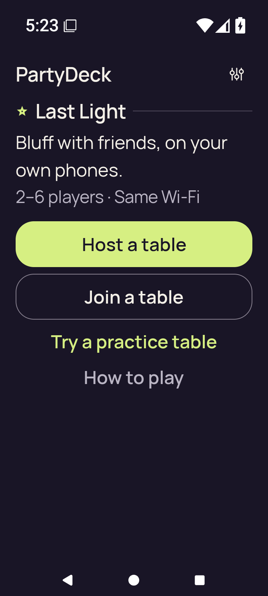</a> <code>2d-landscape-home.png</code> 2d-landscape-home — 2d-landscape.native-leave-home | 720 × 1600 px · 81,147 bytes · text 2.0 SHA-256: <code>b2311d266ccb0bdcf413cc0944a060d92eb96c34ed50068874e2ce37fb4ab1b2</code> Source: <code>/root/projects/PartyDeck/artifacts/evidence-storage/34506161751/android-adaptive-api36-optimized-test-signed-font-2.0-34506161751-1/godot-adaptive/runtime/captures/2d-landscape-home.png</code> Original case outcome: **unsupported** [UI XML](runtime/captures/2d-landscape-home.xml) · [Capture/result JSON](runtime/captures/2d-landscape-home.json) · [Original result](runtime/godot-adaptive-result.json) | **Attributed peer direct view** by <code>/root/assets</code>. Returned PartyDeck home at 2× text with Last Light description and Host/Join/practice/How to play actions. All displayed copy and action labels fit and remain readable. No game hand/private-card information is present on this home still. |
| <a href="runtime/captures/2d-seascape-baseline-public.png">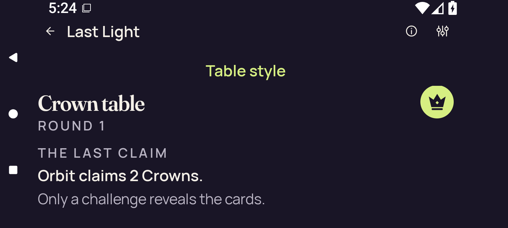</a> <code>2d-seascape-baseline-public.png</code> 2d-seascape-baseline-public — 2d-seascape.initial-landscape | 1600 × 720 px · 75,259 bytes · text 2.0 SHA-256: <code>bbd6d09545e7789ef9f38a949d31fce54699e1d0f1ee2756029a748a2ead4151</code> Source: <code>/root/projects/PartyDeck/artifacts/evidence-storage/34506161751/android-adaptive-api36-optimized-test-signed-font-2.0-34506161751-1/godot-adaptive/runtime/captures/2d-seascape-baseline-public.png</code> Original case outcome: **unsupported** [UI XML](runtime/captures/2d-seascape-baseline-public.xml) · [Capture/result JSON](runtime/captures/2d-seascape-baseline-public.json) · [Original result](runtime/godot-adaptive-result.json) | **Attributed peer direct view** by <code>/root/assets</code>. Reverse-landscape Standard Crown table, round 1, with public Orbit claims 2 Crowns and explanatory rule. Upper part of the public rank badge is clipped at the body&#x27;s top boundary; turn/header content is above that region. Visible title/claim/rule text is readable. Hand/actions are outside the viewport. Only public table/claim information is visible; no private hand face/rank is shown and off-screen hand state is not determined. |
| <a href="runtime/captures/2d-seascape-baseline-first-card.png">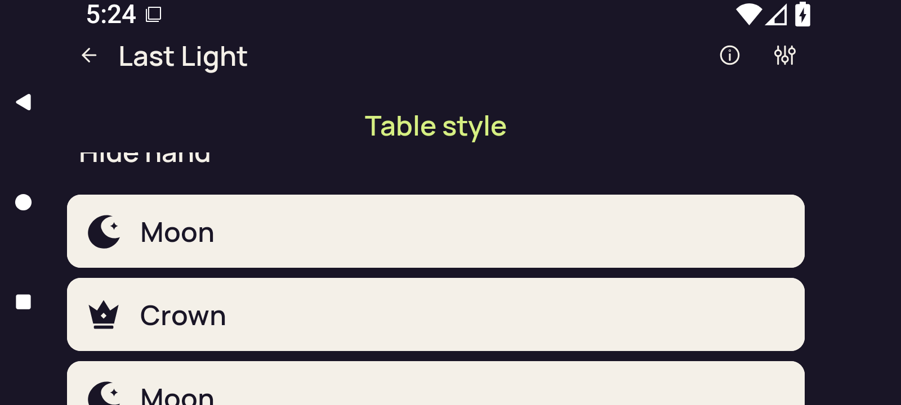</a> <code>2d-seascape-baseline-first-card.png</code> 2d-seascape-baseline-first-card — 2d-seascape.initial-landscape | 1600 × 720 px · 45,727 bytes · text 2.0 SHA-256: <code>da52d8b4085f8437aeb68de0263de85212a4db8458fed0aa1076cfc8e891de47</code> Source: <code>/root/projects/PartyDeck/artifacts/evidence-storage/34506161751/android-adaptive-api36-optimized-test-signed-font-2.0-34506161751-1/godot-adaptive/runtime/captures/2d-seascape-baseline-first-card.png</code> Original case outcome: **unsupported** [UI XML](runtime/captures/2d-seascape-baseline-first-card.xml) · [Capture/result JSON](runtime/captures/2d-seascape-baseline-first-card.json) · [Original result](runtime/godot-adaptive-result.json) | **Attributed peer direct view** by <code>/root/assets</code>. Reverse-landscape revealed Standard hand with full Moon and Crown rows, followed by a partly visible Moon row. Hide hand text is clipped at the upper content edge. The third row continues below the bottom; the two full rank rows are legible. Private Moon and Crown ranks are visibly revealed; other hand details are outside the viewport. |
| <a href="runtime/captures/2d-seascape-baseline-selected.png">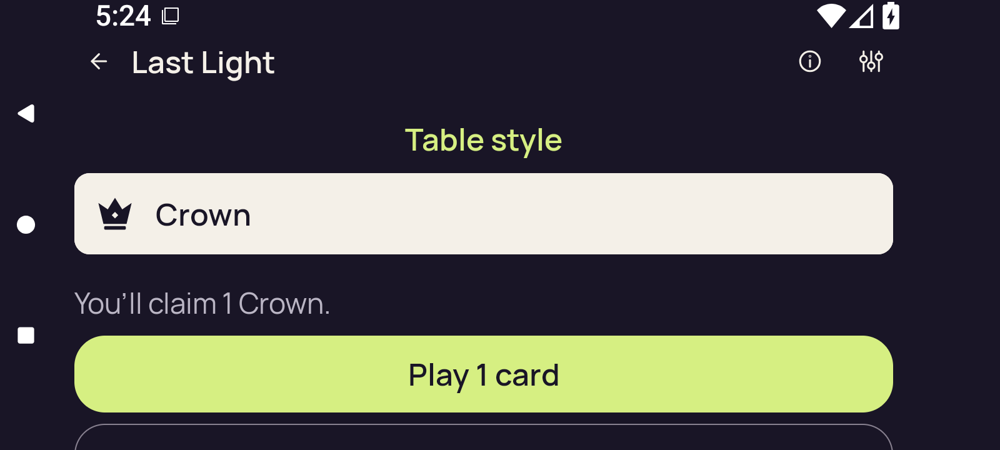</a> <code>2d-seascape-baseline-selected.png</code> 2d-seascape-baseline-selected — 2d-seascape.initial-landscape | 1600 × 720 px · 51,210 bytes · text 2.0 SHA-256: <code>3673fcbe03706c8f709cd4711cdb212b4ff72a146917216ad9bbf5b71f068735</code> Source: <code>/root/projects/PartyDeck/artifacts/evidence-storage/34506161751/android-adaptive-api36-optimized-test-signed-font-2.0-34506161751-1/godot-adaptive/runtime/captures/2d-seascape-baseline-selected.png</code> Original case outcome: **unsupported** [UI XML](runtime/captures/2d-seascape-baseline-selected.xml) · [Capture/result JSON](runtime/captures/2d-seascape-baseline-selected.json) · [Original result](runtime/godot-adaptive-result.json) | **Attributed peer direct view** by <code>/root/assets</code>. Lower reverse-landscape Standard hand shows a Crown row, You&#x27;ll claim 1 Crown and enabled Play 1 card. Visible Crown/claim/Play labels fit. Earlier rows/selection check are above the viewport; only the upper outline of the following action is visible below. A private Crown row is visible. The selected card&#x27;s identity is not established by the public claim preview or this scroll position. |
| <a href="runtime/captures/2d-seascape-initial-selector.png">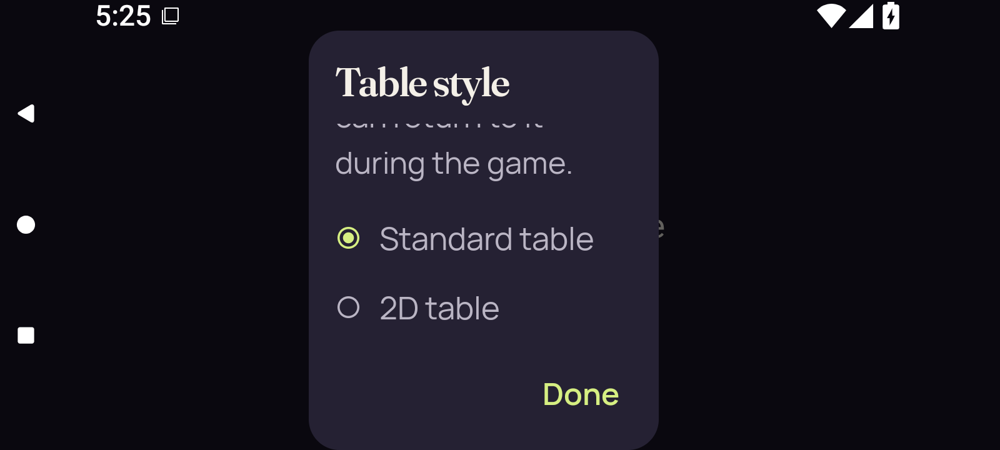</a> <code>2d-seascape-initial-selector.png</code> 2d-seascape-initial-selector — 2d-seascape.initial-landscape | 1600 × 720 px · 50,370 bytes · text 2.0 SHA-256: <code>c6ab240f6fcce6a68e6776b99dd209e9cc35d12288f0770f44c4615cba9609a7</code> Source: <code>/root/projects/PartyDeck/artifacts/evidence-storage/34506161751/android-adaptive-api36-optimized-test-signed-font-2.0-34506161751-1/godot-adaptive/runtime/captures/2d-seascape-initial-selector.png</code> Original case outcome: **unsupported** [UI XML](runtime/captures/2d-seascape-initial-selector.xml) · [Capture/result JSON](runtime/captures/2d-seascape-initial-selector.json) · [Original result](runtime/godot-adaptive-result.json) | **Attributed peer direct view** by <code>/root/assets</code>. Reverse-landscape 2× Table style modal, Standard selected, 2D table and Done visible. Explanatory copy is cut at the upper content edge. The 3D option is not visible in this captured content area; no claim that it is absent or unreachable. Standard/2D/Done labels are clear. No legible private hand face or rank is visible behind the modal. |
| <a href="runtime/captures/2d-seascape-initial-native-ready.png">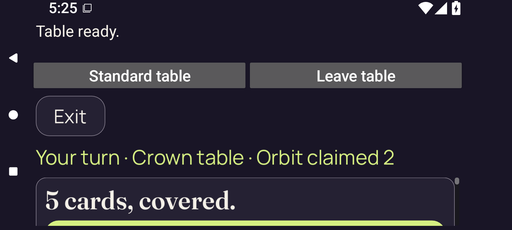</a> <code>2d-seascape-initial-native-ready.png</code> 2d-seascape-initial-native-ready — 2d-seascape.initial-landscape | 1600 × 720 px · 88,391 bytes · text 2.0 SHA-256: <code>7e5c390c899a3d6f7e6c1722610455a0ce89a6b43eb8e66cdbeaf96d667d3e99</code> Source: <code>/root/projects/PartyDeck/artifacts/evidence-storage/34506161751/android-adaptive-api36-optimized-test-signed-font-2.0-34506161751-1/godot-adaptive/runtime/captures/2d-seascape-initial-native-ready.png</code> Original case outcome: **unsupported** [UI XML](runtime/captures/2d-seascape-initial-native-ready.xml) · [Capture/result JSON](runtime/captures/2d-seascape-initial-native-ready.json) · [Original result](runtime/godot-adaptive-result.json) | **Attributed peer direct view** by <code>/root/assets</code>. Reverse-landscape native 2D ready view with Standard table/Leave table, Exit, public Crown/Orbit claimed 2 context and 5 cards, covered. Upper native controls and public/cover labels are legible. The bright control under the cover heading extends below the bottom viewport and its text is not visible. Covered-hand status only; no private card face or rank label appears in the viewport. |
| <a href="runtime/captures/2d-seascape-unsupported-return-concealed.png">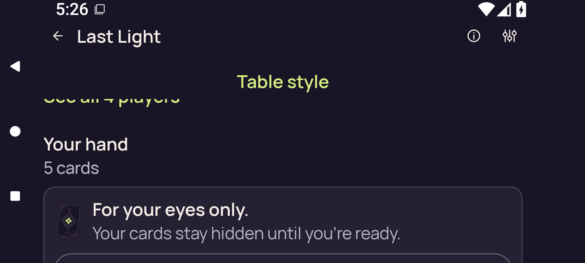</a> <code>2d-seascape-unsupported-return-concealed.png</code> 2d-seascape-unsupported-return-concealed — 2d-seascape.held-rotation | 1600 × 720 px · 68,871 bytes · text 2.0 SHA-256: <code>989fcab974d739527a8bcd63237e7482103ab4cc3a1b58d5eb45c4f22e23de75</code> Source: <code>/root/projects/PartyDeck/artifacts/evidence-storage/34506161751/android-adaptive-api36-optimized-test-signed-font-2.0-34506161751-1/godot-adaptive/runtime/captures/2d-seascape-unsupported-return-concealed.png</code> Original case outcome: **unsupported** [UI XML](runtime/captures/2d-seascape-unsupported-return-concealed.xml) · [Capture/result JSON](runtime/captures/2d-seascape-unsupported-return-concealed.json) · [Original result](runtime/godot-adaptive-result.json) | **Attributed peer direct view** by <code>/root/assets</code>. Reverse-landscape Standard return shows Your hand 5 cards and the upper concealment panel with card-back artwork and privacy copy. See all 4 players is cut across the upper content boundary; the lower Show hand control is only an outline fragment at the bottom, without visible label. Visible cover/back artwork contains no private face/rank. This partial still does not establish the unsupported held-rotation behavior. |
| <a href="runtime/captures/2d-seascape-unsupported-return-selection-cleared.png">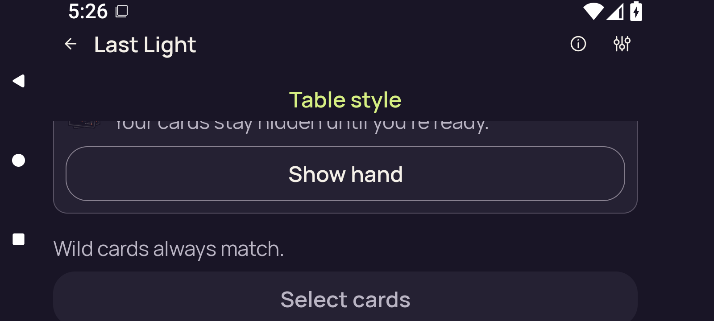</a> <code>2d-seascape-unsupported-return-selection-cleared.png</code> 2d-seascape-unsupported-return-selection-cleared — 2d-seascape.held-rotation | 1600 × 720 px · 65,397 bytes · text 2.0 SHA-256: <code>c3881d9ae78a319b91ba07f900c244fbd31282a3c1d2f91aa45d73a9c0a5103f</code> Source: <code>/root/projects/PartyDeck/artifacts/evidence-storage/34506161751/android-adaptive-api36-optimized-test-signed-font-2.0-34506161751-1/godot-adaptive/runtime/captures/2d-seascape-unsupported-return-selection-cleared.png</code> Original case outcome: **unsupported** [UI XML](runtime/captures/2d-seascape-unsupported-return-selection-cleared.xml) · [Capture/result JSON](runtime/captures/2d-seascape-unsupported-return-selection-cleared.json) · [Original result](runtime/godot-adaptive-result.json) | **Attributed peer direct view** by <code>/root/assets</code>. Lower reverse-landscape Standard cover with Show hand, public Wild cards always match rule and gray Select cards action. Concealment copy/artwork are clipped at the top. Select cards container continues below the bottom but its label is readable. Show hand and rule text are clear. No private rank row/face appears; Wild-card wording is public guidance. This image does not establish when selection was cleared. |
| <a href="runtime/captures/2d-seascape-unsupported-return-public.png">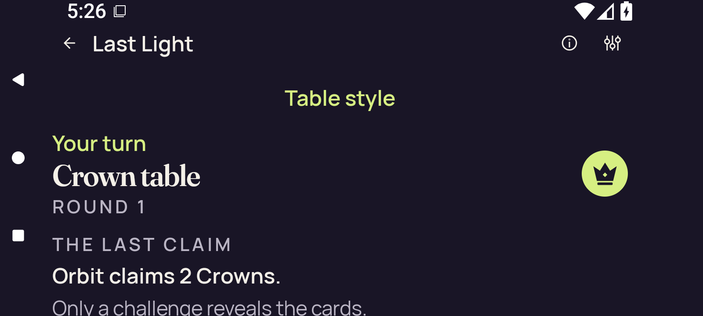</a> <code>2d-seascape-unsupported-return-public.png</code> 2d-seascape-unsupported-return-public — 2d-seascape.held-rotation | 1600 × 720 px · 78,694 bytes · text 2.0 SHA-256: <code>25761715315cd17cc49ca3b16f958cfbb24e7cc74788cd5ae33063f6f244f594</code> Source: <code>/root/projects/PartyDeck/artifacts/evidence-storage/34506161751/android-adaptive-api36-optimized-test-signed-font-2.0-34506161751-1/godot-adaptive/runtime/captures/2d-seascape-unsupported-return-public.png</code> Original case outcome: **unsupported** [UI XML](runtime/captures/2d-seascape-unsupported-return-public.xml) · [Capture/result JSON](runtime/captures/2d-seascape-unsupported-return-public.json) · [Original result](runtime/godot-adaptive-result.json) | **Attributed peer direct view** by <code>/root/assets</code>. Reverse-landscape Standard Crown public table, Your turn, round 1 and Orbit claims 2 Crowns. The public explanatory line reaches and is cut at the lower boundary. Hand/actions are outside this viewport; visible table/claim labels remain clear. No private hand information is visible; off-screen hand state cannot be determined. |
| <a href="runtime/captures/2d-seascape-unsupported-return-first-card.png">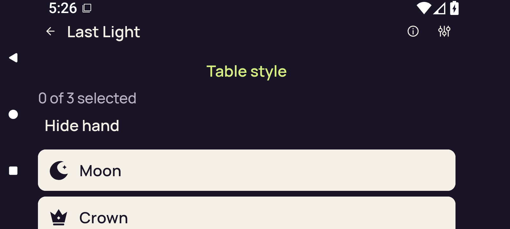</a> <code>2d-seascape-unsupported-return-first-card.png</code> 2d-seascape-unsupported-return-first-card — 2d-seascape.held-rotation | 1600 × 720 px · 50,411 bytes · text 2.0 SHA-256: <code>9610dc4f8deced16d09d80d8912096a51b579a0d75537f10d1518313b8ed6294</code> Source: <code>/root/projects/PartyDeck/artifacts/evidence-storage/34506161751/android-adaptive-api36-optimized-test-signed-font-2.0-34506161751-1/godot-adaptive/runtime/captures/2d-seascape-unsupported-return-first-card.png</code> Original case outcome: **unsupported** [UI XML](runtime/captures/2d-seascape-unsupported-return-first-card.xml) · [Capture/result JSON](runtime/captures/2d-seascape-unsupported-return-first-card.json) · [Original result](runtime/godot-adaptive-result.json) | **Attributed peer direct view** by <code>/root/assets</code>. Reverse-landscape revealed Standard hand with 0 of 3 selected, Hide hand, full Moon row and partial Crown row. Crown row extends past the lower boundary while its label/symbol remain readable. Later hand and action rows are not visible. Private Moon and Crown ranks are visibly revealed in this first-card capture. |
|  <code>2d-seascape-unsupported-portrait-return-concealed.png</code> 2d-seascape-unsupported-portrait-return-concealed — 2d-seascape.held-rotation | 720 × 1600 px · 114,112 bytes · text 2.0 SHA-256: <code>6c4f7e19a2703ecbed7598f5bfb39abad7a06de044afd60cbc9ccaf40c181111</code> Source: <code>/root/projects/PartyDeck/artifacts/evidence-storage/34506161751/android-adaptive-api36-optimized-test-signed-font-2.0-34506161751-1/godot-adaptive/runtime/captures/2d-seascape-unsupported-portrait-return-concealed.png</code> Original case outcome: **unsupported** [UI XML](runtime/captures/2d-seascape-unsupported-portrait-return-concealed.xml) · [Capture/result JSON](runtime/captures/2d-seascape-unsupported-portrait-return-concealed.json) · [Original result](runtime/godot-adaptive-result.json) | **Attributed peer direct view** by <code>/root/assets</code>. Portrait Standard return shows player link, Your hand 5 cards, full concealment panel, Show hand, public Wild-card rule, Select cards and Challenge Orbit. Cover, guidance and both action labels fit and are legible at this scroll position; table/claim section is above the viewport. Only card-back/cover artwork is visible; no private face/rank is shown. Unsupported held rotation is not promoted by this still. |
|  <code>2d-seascape-unsupported-portrait-return-selection-cleared.png</code> 2d-seascape-unsupported-portrait-return-selection-cleared — 2d-seascape.held-rotation | 720 × 1600 px · 114,112 bytes · text 2.0 SHA-256: <code>6c4f7e19a2703ecbed7598f5bfb39abad7a06de044afd60cbc9ccaf40c181111</code> Source: <code>/root/projects/PartyDeck/artifacts/evidence-storage/34506161751/android-adaptive-api36-optimized-test-signed-font-2.0-34506161751-1/godot-adaptive/runtime/captures/2d-seascape-unsupported-portrait-return-selection-cleared.png</code> Original case outcome: **unsupported** [UI XML](runtime/captures/2d-seascape-unsupported-portrait-return-selection-cleared.xml) · [Capture/result JSON](runtime/captures/2d-seascape-unsupported-portrait-return-selection-cleared.json) · [Original result](runtime/godot-adaptive-result.json) | **Exact same-batch match**. Exact bytes match the separately retained peer-viewed original at plan index 58. Reused pixel observation: Portrait Standard return shows player link, Your hand 5 cards, full concealment panel, Show hand, public Wild-card rule, Select cards and Challenge Orbit. Cover, guidance and both action labels fit and are legible at this scroll position; table/claim section is above the viewport. Only card-back/cover artwork is visible; no private face/rank is shown. Unsupported held rotation is not promoted by this still. [Reviewed matching original](runtime/captures/2d-seascape-unsupported-portrait-return-concealed.png); original capture identity remains separate. |
| <a href="runtime/captures/2d-seascape-unsupported-portrait-return-public.png">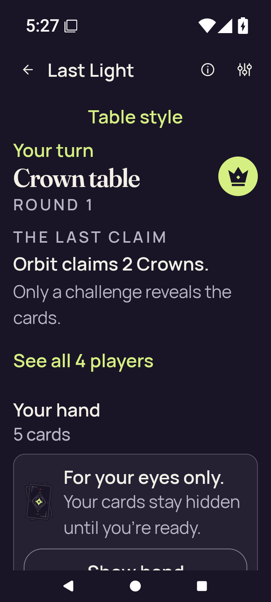</a> <code>2d-seascape-unsupported-portrait-return-public.png</code> 2d-seascape-unsupported-portrait-return-public — 2d-seascape.held-rotation | 720 × 1600 px · 126,553 bytes · text 2.0 SHA-256: <code>e9edf5d746733209ac4cb89b873f5f2a90cc9f82e5e495bf175d565af2128bbc</code> Source: <code>/root/projects/PartyDeck/artifacts/evidence-storage/34506161751/android-adaptive-api36-optimized-test-signed-font-2.0-34506161751-1/godot-adaptive/runtime/captures/2d-seascape-unsupported-portrait-return-public.png</code> Original case outcome: **unsupported** [UI XML](runtime/captures/2d-seascape-unsupported-portrait-return-public.xml) · [Capture/result JSON](runtime/captures/2d-seascape-unsupported-portrait-return-public.json) · [Original result](runtime/godot-adaptive-result.json) | **Attributed peer direct view** by <code>/root/assets</code>. Portrait Standard Crown table with Your turn, round 1, public Orbit claims 2 Crowns, player link and upper five-card cover. Public and cover text are legible and wrapped. The Show hand button is clipped at the lower boundary, with only part of its label visible. Visible hand area contains concealment copy/back artwork only; no private face/rank appears. |
| <a href="runtime/captures/2d-seascape-unsupported-portrait-return-first-card.png">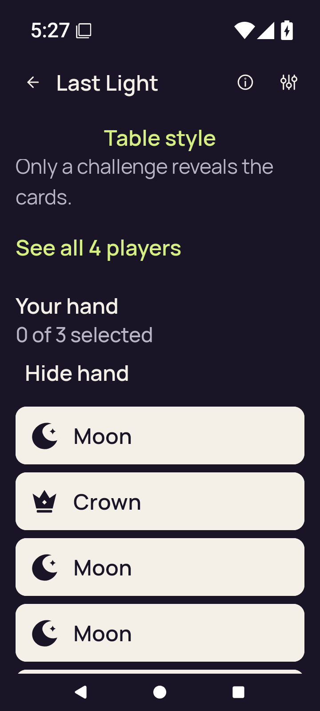</a> <code>2d-seascape-unsupported-portrait-return-first-card.png</code> 2d-seascape-unsupported-portrait-return-first-card — 2d-seascape.held-rotation | 720 × 1600 px · 86,540 bytes · text 2.0 SHA-256: <code>142ffe8214f9dd8a5f869d39f757ab6d322e55468db596ad2d9370731dd8bb62</code> Source: <code>/root/projects/PartyDeck/artifacts/evidence-storage/34506161751/android-adaptive-api36-optimized-test-signed-font-2.0-34506161751-1/godot-adaptive/runtime/captures/2d-seascape-unsupported-portrait-return-first-card.png</code> Original case outcome: **unsupported** [UI XML](runtime/captures/2d-seascape-unsupported-portrait-return-first-card.xml) · [Capture/result JSON](runtime/captures/2d-seascape-unsupported-portrait-return-first-card.json) · [Original result](runtime/godot-adaptive-result.json) | **Attributed peer direct view** by <code>/root/assets</code>. Portrait revealed Standard hand with 0 of 3 selected, Hide hand and Moon, Crown, Moon, Moon rows. Four full rank rows are readable. A fifth row is only a top strip at the bottom, with no readable rank. Public claim explanation begins at the upper content boundary. Four private hand ranks are visible in a revealed capture; the fifth rank is not established by this image. |
| <a href="runtime/captures/2d-seascape-reentry-selected.png">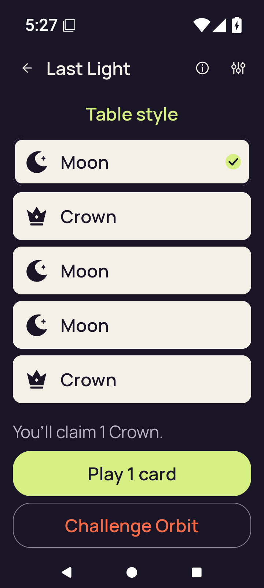</a> <code>2d-seascape-reentry-selected.png</code> 2d-seascape-reentry-selected — 2d-seascape.portrait-reentry-standard | 720 × 1600 px · 84,559 bytes · text 2.0 SHA-256: <code>74b3af2734d59213c92a115b7c82096030b5ae64176ad54859e388e6d6d99e26</code> Source: <code>/root/projects/PartyDeck/artifacts/evidence-storage/34506161751/android-adaptive-api36-optimized-test-signed-font-2.0-34506161751-1/godot-adaptive/runtime/captures/2d-seascape-reentry-selected.png</code> Original case outcome: **unsupported** [UI XML](runtime/captures/2d-seascape-reentry-selected.xml) · [Capture/result JSON](runtime/captures/2d-seascape-reentry-selected.json) · [Original result](runtime/godot-adaptive-result.json) | **Attributed peer direct view** by <code>/root/assets</code>. Portrait Standard hand with Moon, Crown, Moon, Moon, Crown; the first Moon is checked. Claim preview, Play 1 card and Challenge Orbit are visible. All five rank rows, the check and action labels fit and are readable at this scroll position; hand heading/Hide control are above the viewport. Five private ranks are visibly revealed with the first Moon selected. No transition or continuous-privacy inference. |
|  <code>2d-seascape-portrait-selector.png</code> 2d-seascape-portrait-selector — 2d-seascape.portrait-reentry-standard | 720 × 1600 px · 97,824 bytes · text 2.0 SHA-256: <code>7f1f81d5e406b860b00e4cc0a636d2f09f4d8cfca2fabf06546de6017bec49dc</code> Source: <code>/root/projects/PartyDeck/artifacts/evidence-storage/34506161751/android-adaptive-api36-optimized-test-signed-font-2.0-34506161751-1/godot-adaptive/runtime/captures/2d-seascape-portrait-selector.png</code> Original case outcome: **unsupported** [UI XML](runtime/captures/2d-seascape-portrait-selector.xml) · [Capture/result JSON](runtime/captures/2d-seascape-portrait-selector.json) · [Original result](runtime/godot-adaptive-result.json) | **Attributed peer direct view** by <code>/root/ui_game</code>. Portrait Table style dialog; Standard table is selected, with 2D table, 3D table and Done visible. Heading, explanatory text, radio rows and Done fit within the modal; no visible text truncation or overlap. Modal contains style choices and accessibility guidance; no card faces or invitation material visible. |
| <a href="runtime/captures/2d-seascape-portrait-native-ready.png">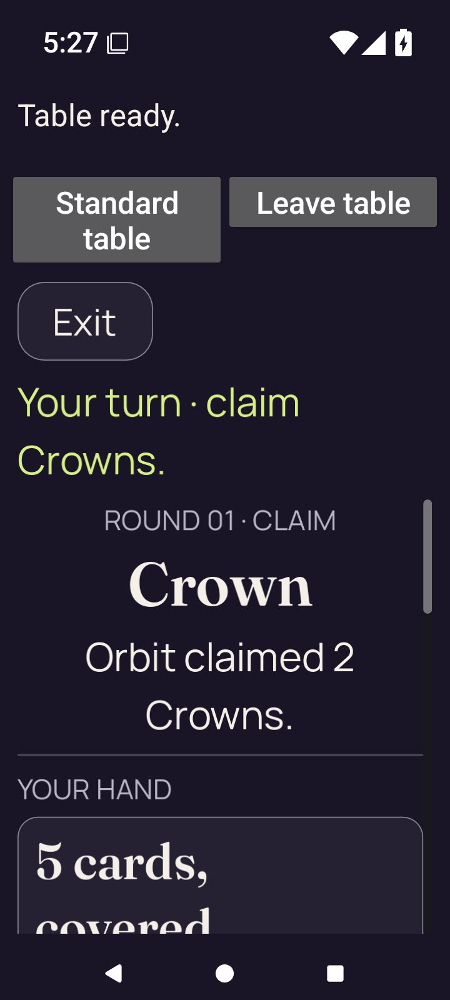</a> <code>2d-seascape-portrait-native-ready.png</code> 2d-seascape-portrait-native-ready — 2d-seascape.portrait-reentry-standard | 720 × 1600 px · 125,479 bytes · text 2.0 SHA-256: <code>26e3b63e9f8caba029c5448ce278e07096866581c68e37bf67820f33db7a36a7</code> Source: <code>/root/projects/PartyDeck/artifacts/evidence-storage/34506161751/android-adaptive-api36-optimized-test-signed-font-2.0-34506161751-1/godot-adaptive/runtime/captures/2d-seascape-portrait-native-ready.png</code> Original case outcome: **unsupported** [UI XML](runtime/captures/2d-seascape-portrait-native-ready.xml) · [Capture/result JSON](runtime/captures/2d-seascape-portrait-native-ready.json) · [Original result](runtime/godot-adaptive-result.json) | **Attributed peer direct view** by <code>/root/ui_game</code>. Table ready header, Standard table and Leave table controls, Exit, Crown round/claim and the beginning of a covered five-card hand. Standard table wraps across two lines. Header actions fit. The scrollable content continues below the viewport; the covered-hand label/panel is cut by the lower viewport edge. Visible hand area is covered; no individual card face or rank visible. This still does not establish cover timing. |
|  <code>2d-seascape-standard-return-concealed.png</code> 2d-seascape-standard-return-concealed — 2d-seascape.portrait-reentry-standard | 720 × 1600 px · 114,699 bytes · text 2.0 SHA-256: <code>b3ff72d317dc91c200615f4d9ea79133da41a6a9c960bbb8971762398efb4cbf</code> Source: <code>/root/projects/PartyDeck/artifacts/evidence-storage/34506161751/android-adaptive-api36-optimized-test-signed-font-2.0-34506161751-1/godot-adaptive/runtime/captures/2d-seascape-standard-return-concealed.png</code> Original case outcome: **unsupported** [UI XML](runtime/captures/2d-seascape-standard-return-concealed.xml) · [Capture/result JSON](runtime/captures/2d-seascape-standard-return-concealed.json) · [Original result](runtime/godot-adaptive-result.json) | **Attributed peer direct view** by <code>/root/ui_game</code>. Portrait standard table scrolled to Your hand: five cards, For your eyes only, Show hand, disabled Select cards and Challenge Orbit. The concealment panel and both bottom actions are fully visible with clear hierarchy; no visible overlap or truncation. No card faces/ranks are visible in the concealed hand. Snapshot only; no transition privacy claim. |
|  <code>2d-seascape-standard-return-selection-cleared.png</code> 2d-seascape-standard-return-selection-cleared — 2d-seascape.portrait-reentry-standard | 720 × 1600 px · 114,699 bytes · text 2.0 SHA-256: <code>b3ff72d317dc91c200615f4d9ea79133da41a6a9c960bbb8971762398efb4cbf</code> Source: <code>/root/projects/PartyDeck/artifacts/evidence-storage/34506161751/android-adaptive-api36-optimized-test-signed-font-2.0-34506161751-1/godot-adaptive/runtime/captures/2d-seascape-standard-return-selection-cleared.png</code> Original case outcome: **unsupported** [UI XML](runtime/captures/2d-seascape-standard-return-selection-cleared.xml) · [Capture/result JSON](runtime/captures/2d-seascape-standard-return-selection-cleared.json) · [Original result](runtime/godot-adaptive-result.json) | **Exact same-batch match**. Exact bytes match the separately retained peer-viewed original at plan index 65. Reused pixel observation: Portrait standard table scrolled to Your hand: five cards, For your eyes only, Show hand, disabled Select cards and Challenge Orbit. The concealment panel and both bottom actions are fully visible with clear hierarchy; no visible overlap or truncation. No card faces/ranks are visible in the concealed hand. Snapshot only; no transition privacy claim. [Reviewed matching original](runtime/captures/2d-seascape-standard-return-concealed.png); original capture identity remains separate. |
|  <code>2d-seascape-standard-return-public.png</code> 2d-seascape-standard-return-public — 2d-seascape.portrait-reentry-standard | 720 × 1600 px · 125,724 bytes · text 2.0 SHA-256: <code>9d6bce5d2902c9291423cb6ea895b20245c4a6a20a63787d111f5583fcc358e1</code> Source: <code>/root/projects/PartyDeck/artifacts/evidence-storage/34506161751/android-adaptive-api36-optimized-test-signed-font-2.0-34506161751-1/godot-adaptive/runtime/captures/2d-seascape-standard-return-public.png</code> Original case outcome: **unsupported** [UI XML](runtime/captures/2d-seascape-standard-return-public.xml) · [Capture/result JSON](runtime/captures/2d-seascape-standard-return-public.json) · [Original result](runtime/godot-adaptive-result.json) | **Attributed peer direct view** by <code>/root/ui_game</code>. Portrait standard table showing Your turn, Crown table, round 1, Orbit claims 2 Crowns, player link and covered-hand panel. Main public labels are readable. The hand panel continues below the viewport, with its Show hand action mostly below the bottom edge in this scroll position. Public claim and hand count are visible; individual cards remain concealed in the visible panel. |
| <a href="runtime/captures/2d-seascape-standard-return-first-card.png">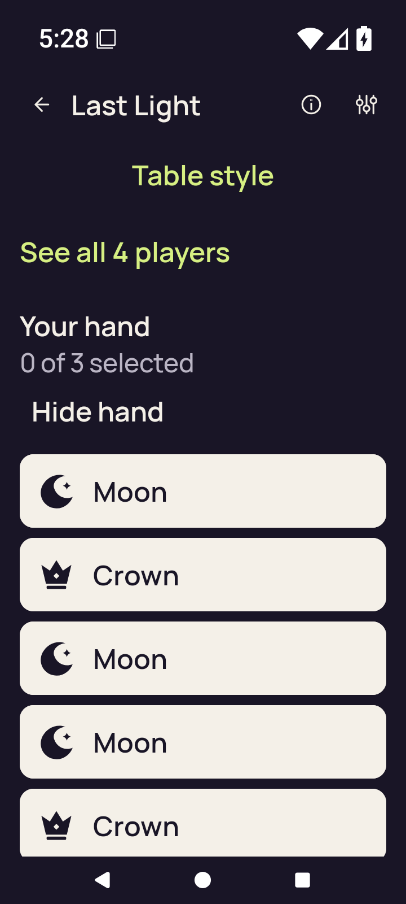</a> <code>2d-seascape-standard-return-first-card.png</code> 2d-seascape-standard-return-first-card — 2d-seascape.portrait-reentry-standard | 720 × 1600 px · 80,150 bytes · text 2.0 SHA-256: <code>4277544729fff96a9890f66ff9c27bc0907e3e26e547bf70efe2d0fe5bd40156</code> Source: <code>/root/projects/PartyDeck/artifacts/evidence-storage/34506161751/android-adaptive-api36-optimized-test-signed-font-2.0-34506161751-1/godot-adaptive/runtime/captures/2d-seascape-standard-return-first-card.png</code> Original case outcome: **unsupported** [UI XML](runtime/captures/2d-seascape-standard-return-first-card.xml) · [Capture/result JSON](runtime/captures/2d-seascape-standard-return-first-card.json) · [Original result](runtime/godot-adaptive-result.json) | **Attributed peer direct view** by <code>/root/ui_game</code>. Portrait standard table with Hide hand, zero selected, and five revealed card rows. Readable large card icons and labels; the last card&#x27;s lower edge reaches below the viewport. No overlapping card labels. This is a revealed-hand capture: five card identities are visible. Do not describe it as concealed or as transition-privacy evidence. |
| <a href="runtime/captures/2d-seascape-leave-selected.png">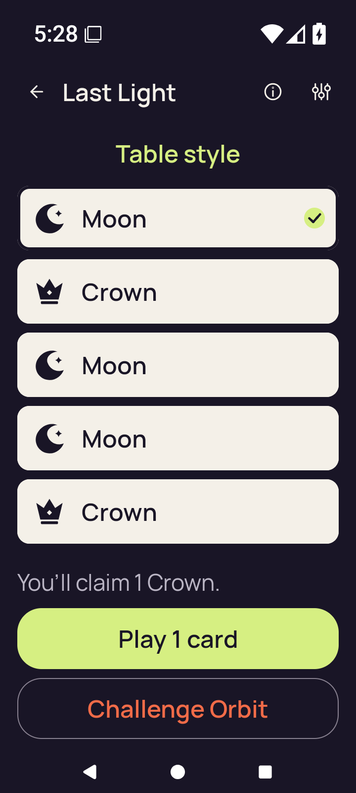</a> <code>2d-seascape-leave-selected.png</code> 2d-seascape-leave-selected — 2d-seascape.native-leave-home | 720 × 1600 px · 85,308 bytes · text 2.0 SHA-256: <code>d778dd1ac207bf9f453ef5c14aabda45c53c38af86b50bb22679d6a8ad3f2532</code> Source: <code>/root/projects/PartyDeck/artifacts/evidence-storage/34506161751/android-adaptive-api36-optimized-test-signed-font-2.0-34506161751-1/godot-adaptive/runtime/captures/2d-seascape-leave-selected.png</code> Original case outcome: **unsupported** [UI XML](runtime/captures/2d-seascape-leave-selected.xml) · [Capture/result JSON](runtime/captures/2d-seascape-leave-selected.json) · [Original result](runtime/godot-adaptive-result.json) | **Attributed peer direct view** by <code>/root/ui_game</code>. Portrait standard table with first card selected, five revealed rows, You&#x27;ll claim 1 Crown, Play 1 card and Challenge Orbit. Selection checkmark, all card labels and both actions are visible. The action hierarchy is clear and there is no visible overlap. Five revealed card identities and the selected card are visible; this is not a concealed-state capture. |
| <a href="runtime/captures/2d-seascape-leave-selector.png">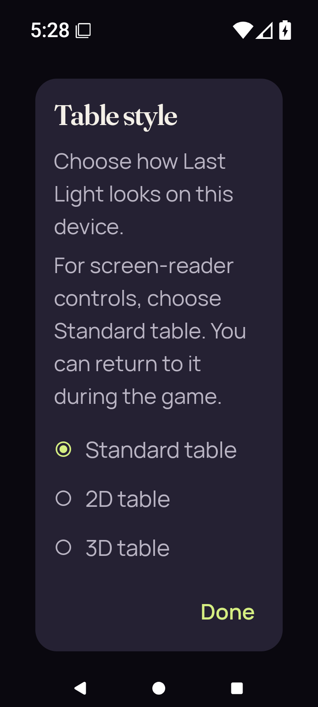</a> <code>2d-seascape-leave-selector.png</code> 2d-seascape-leave-selector — 2d-seascape.native-leave-home | 720 × 1600 px · 98,543 bytes · text 2.0 SHA-256: <code>b1225abdbdcc0775cb813a1972876ac071365e07d37c5d63e89fb4fbd8e3fe8b</code> Source: <code>/root/projects/PartyDeck/artifacts/evidence-storage/34506161751/android-adaptive-api36-optimized-test-signed-font-2.0-34506161751-1/godot-adaptive/runtime/captures/2d-seascape-leave-selector.png</code> Original case outcome: **unsupported** [UI XML](runtime/captures/2d-seascape-leave-selector.xml) · [Capture/result JSON](runtime/captures/2d-seascape-leave-selector.json) · [Original result](runtime/godot-adaptive-result.json) | **Attributed peer direct view** by <code>/root/ui_game</code>. Portrait Table style dialog with Standard table selected and 2D/3D choices plus Done. Complete modal content is readable; no visible truncation or overlap. No individual cards or invitation material visible in the modal. |
|  <code>2d-seascape-leave-native-ready.png</code> 2d-seascape-leave-native-ready — 2d-seascape.native-leave-home | 720 × 1600 px · 126,057 bytes · text 2.0 SHA-256: <code>06027fe36ea5c8a025471a1b8fa22cf6f0409151e3468bf83afe56f00a563795</code> Source: <code>/root/projects/PartyDeck/artifacts/evidence-storage/34506161751/android-adaptive-api36-optimized-test-signed-font-2.0-34506161751-1/godot-adaptive/runtime/captures/2d-seascape-leave-native-ready.png</code> Original case outcome: **unsupported** [UI XML](runtime/captures/2d-seascape-leave-native-ready.xml) · [Capture/result JSON](runtime/captures/2d-seascape-leave-native-ready.json) · [Original result](runtime/godot-adaptive-result.json) | **Attributed peer direct view** by <code>/root/ui_game</code>. Table ready, Standard table, Leave table, Exit, Crown round/claim and upper portion of covered five-card hand. Top controls fit; Standard table wraps. The scrollable covered-hand panel continues below the viewport and its lower text is cut at that edge. Visible hand portion is covered with no card face/rank exposed. Snapshot does not establish transition timing. |
| <a href="runtime/captures/2d-seascape-leave-confirmation.png">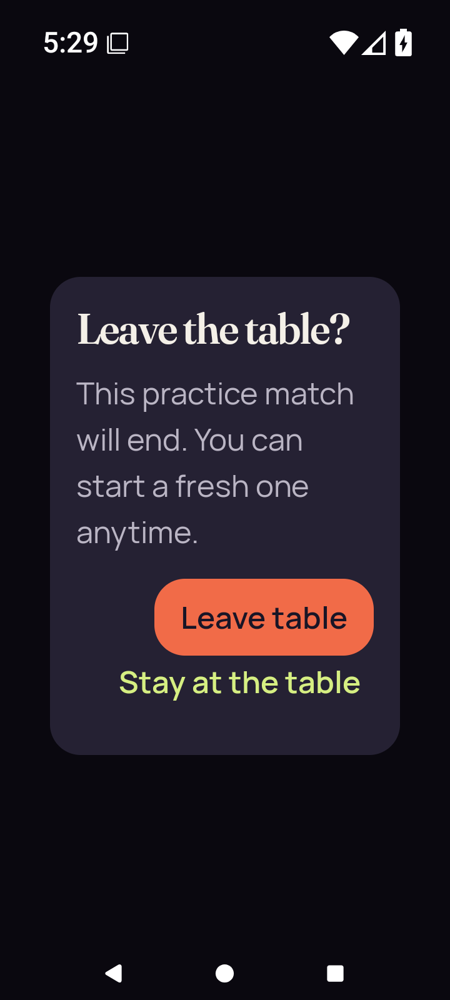</a> <code>2d-seascape-leave-confirmation.png</code> 2d-seascape-leave-confirmation — 2d-seascape.native-leave-home | 720 × 1600 px · 62,742 bytes · text 2.0 SHA-256: <code>a48590c45e25c0e83cc3ef7c4627ef095db29ceac1ca0b9a096072eff2c74a2f</code> Source: <code>/root/projects/PartyDeck/artifacts/evidence-storage/34506161751/android-adaptive-api36-optimized-test-signed-font-2.0-34506161751-1/godot-adaptive/runtime/captures/2d-seascape-leave-confirmation.png</code> Original case outcome: **unsupported** [UI XML](runtime/captures/2d-seascape-leave-confirmation.xml) · [Capture/result JSON](runtime/captures/2d-seascape-leave-confirmation.json) · [Original result](runtime/godot-adaptive-result.json) | **Attributed peer direct view** by <code>/root/ui_game</code>. Portrait Leave the table? confirmation with explanation, orange Leave table and green Stay at the table. Title, wrapped explanation and both choices are fully inside the modal; distinct destructive and stay actions, no visible truncation. No hand identities or invitation material visible. |
|  <code>2d-seascape-home.png</code> 2d-seascape-home — 2d-seascape.native-leave-home | 720 × 1600 px · 81,009 bytes · text 2.0 SHA-256: <code>5920f21ef95725042ad6f50d6d10caaca38e11e7273dbf25c7800d630fa372e7</code> Source: <code>/root/projects/PartyDeck/artifacts/evidence-storage/34506161751/android-adaptive-api36-optimized-test-signed-font-2.0-34506161751-1/godot-adaptive/runtime/captures/2d-seascape-home.png</code> Original case outcome: **unsupported** [UI XML](runtime/captures/2d-seascape-home.xml) · [Capture/result JSON](runtime/captures/2d-seascape-home.json) · [Original result](runtime/godot-adaptive-result.json) | **Attributed peer direct view** by <code>/root/ui_game</code>. Portrait PartyDeck home: Last Light description, player/Wi-Fi note, Host, Join, practice and How to play. All shown home actions and copy fit with ample lower space; clear primary/secondary hierarchy and no visible clipping. Home contains no hand or invitation secrets. |
|  <code>3d-landscape-baseline-public.png</code> 3d-landscape-baseline-public — 3d-landscape.initial-landscape | 1600 × 720 px · 73,711 bytes · text 2.0 SHA-256: <code>9160ee72b7e7d9583bc8ceca594aca9f59e0c0a5dd96216a206b73d3881fb674</code> Source: <code>/root/projects/PartyDeck/artifacts/evidence-storage/34506161751/android-adaptive-api36-optimized-test-signed-font-2.0-34506161751-1/godot-adaptive/runtime/captures/3d-landscape-baseline-public.png</code> Original case outcome: **unsupported** [UI XML](runtime/captures/3d-landscape-baseline-public.xml) · [Capture/result JSON](runtime/captures/3d-landscape-baseline-public.json) · [Original result](runtime/godot-adaptive-result.json) | **Attributed peer direct view** by <code>/root/ui_game</code>. Landscape standard table with Your turn, Star table, round 1 and Orbit claims 1 Star. Large-font single-column content fills the landscape height. The explanation after the last claim is cut at the bottom viewport; hand/actions are not visible here. Only public turn/claim information is visible; no private hand shown. |
| <a href="runtime/captures/3d-landscape-baseline-first-card.png">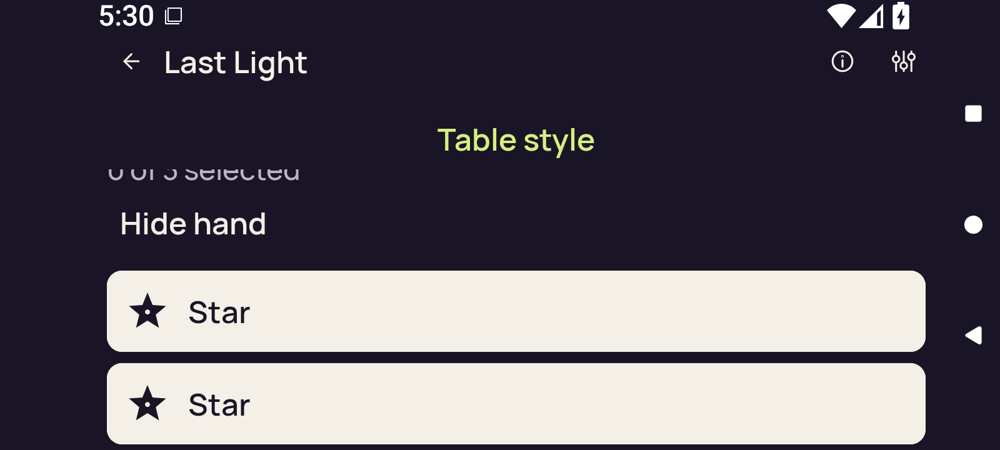</a> <code>3d-landscape-baseline-first-card.png</code> 3d-landscape-baseline-first-card — 3d-landscape.initial-landscape | 1600 × 720 px · 47,725 bytes · text 2.0 SHA-256: <code>4bfa43c0263e83b7a6850f775d29f9779873da6eda010d2f2262f09a1867e2b7</code> Source: <code>/root/projects/PartyDeck/artifacts/evidence-storage/34506161751/android-adaptive-api36-optimized-test-signed-font-2.0-34506161751-1/godot-adaptive/runtime/captures/3d-landscape-baseline-first-card.png</code> Original case outcome: **unsupported** [UI XML](runtime/captures/3d-landscape-baseline-first-card.xml) · [Capture/result JSON](runtime/captures/3d-landscape-baseline-first-card.json) · [Original result](runtime/godot-adaptive-result.json) | **Attributed peer direct view** by <code>/root/ui_game</code>. Landscape revealed-hand scroll position: Hide hand and two readable Star card rows. The zero-selected count is clipped at the upper content boundary beneath Table style. Two card rows fit; the remaining hand and play actions are outside this viewport. Individual card identities are exposed in this revealed-hand capture; it must not be labeled concealed. |
| <a href="runtime/captures/3d-landscape-baseline-selected.png">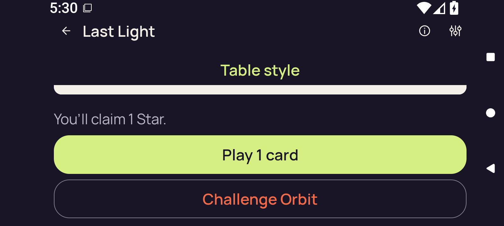</a> <code>3d-landscape-baseline-selected.png</code> 3d-landscape-baseline-selected — 3d-landscape.initial-landscape | 1600 × 720 px · 53,511 bytes · text 2.0 SHA-256: <code>f7cc5a22ea14ed38c800f6b08fee93670c65dfa9f6a915172b41c5f4c4ce3d43</code> Source: <code>/root/projects/PartyDeck/artifacts/evidence-storage/34506161751/android-adaptive-api36-optimized-test-signed-font-2.0-34506161751-1/godot-adaptive/runtime/captures/3d-landscape-baseline-selected.png</code> Original case outcome: **unsupported** [UI XML](runtime/captures/3d-landscape-baseline-selected.xml) · [Capture/result JSON](runtime/captures/3d-landscape-baseline-selected.json) · [Original result](runtime/godot-adaptive-result.json) | **Attributed peer direct view** by <code>/root/ui_game</code>. Landscape standard table scrolled to You&#x27;ll claim 1 Star, enabled Play 1 card and Challenge Orbit. Both actions and claim text fit; only a thin bottom strip of the preceding card row is visible at the upper content boundary. Selection/card identity is outside this viewport. No individual card identity is readable in this viewport, although this is the source&#x27;s selected-hand state. |
| <a href="runtime/captures/3d-landscape-initial-selector.png">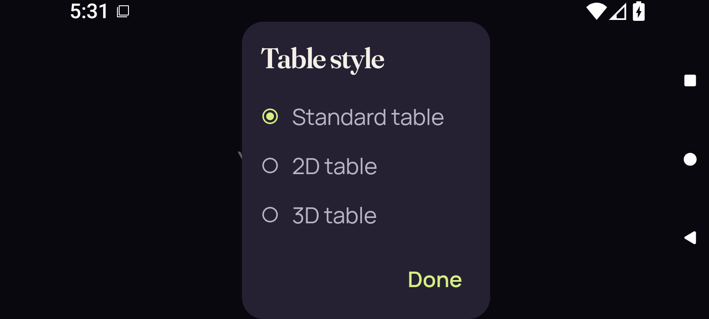</a> <code>3d-landscape-initial-selector.png</code> 3d-landscape-initial-selector — 3d-landscape.initial-landscape | 1600 × 720 px · 48,967 bytes · text 2.0 SHA-256: <code>57dfc132445ef4c98b25827a7864bdff706d077589cdec69826a78fa0d8f1ff7</code> Source: <code>/root/projects/PartyDeck/artifacts/evidence-storage/34506161751/android-adaptive-api36-optimized-test-signed-font-2.0-34506161751-1/godot-adaptive/runtime/captures/3d-landscape-initial-selector.png</code> Original case outcome: **unsupported** [UI XML](runtime/captures/3d-landscape-initial-selector.xml) · [Capture/result JSON](runtime/captures/3d-landscape-initial-selector.json) · [Original result](runtime/godot-adaptive-result.json) | **Attributed peer direct view** by <code>/root/ui_game</code>. Landscape Table style modal with Standard table selected, 2D/3D radio choices and Done. Title, choices and Done are readable; explanatory guidance is not in view. Modal occupies nearly the full landscape height without clipping its shown controls. Only presentation choices and dimmed underlying UI are visible; no card identity is readable. |
| <a href="runtime/captures/3d-landscape-initial-native-ready.png">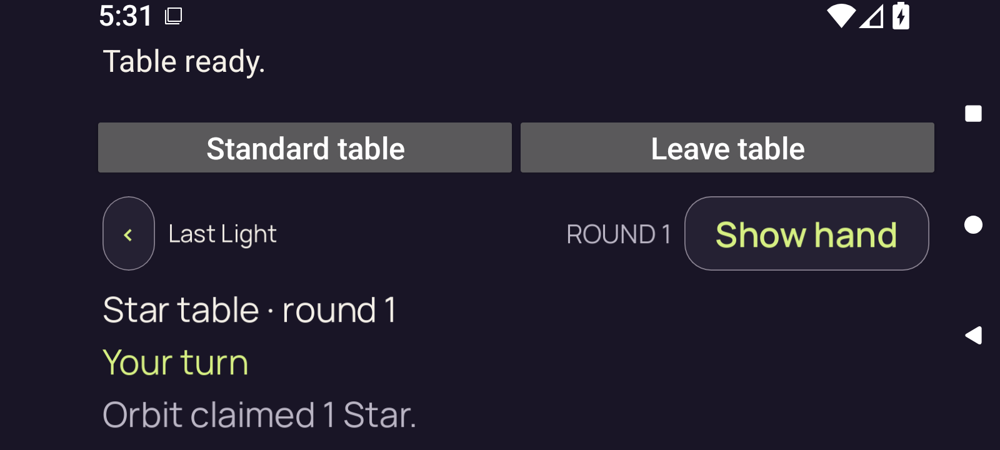</a> <code>3d-landscape-initial-native-ready.png</code> 3d-landscape-initial-native-ready — 3d-landscape.initial-landscape | 1600 × 720 px · 88,045 bytes · text 2.0 SHA-256: <code>6ed4e0c1ed7633fd1ebcc192b671851088c83f52094a19a6d1377658b6f823bd</code> Source: <code>/root/projects/PartyDeck/artifacts/evidence-storage/34506161751/android-adaptive-api36-optimized-test-signed-font-2.0-34506161751-1/godot-adaptive/runtime/captures/3d-landscape-initial-native-ready.png</code> Original case outcome: **unsupported** [UI XML](runtime/captures/3d-landscape-initial-native-ready.xml) · [Capture/result JSON](runtime/captures/3d-landscape-initial-native-ready.json) · [Original result](runtime/godot-adaptive-result.json) | **Attributed peer direct view** by <code>/root/ui_game</code>. Landscape Table ready screen with Standard table/Leave table controls, Last Light, round 1, Show hand, Star table, Your turn and Orbit claimed 1 Star. Top controls and claim labels fit. The large-text header/public information consumes the visible height; the 3D table surface and hand are not visible in this still. Show hand is offered and no individual card identities are visible. Readiness text does not establish engine gameplay or transition privacy. |
| <a href="runtime/captures/3d-landscape-unsupported-return-concealed.png">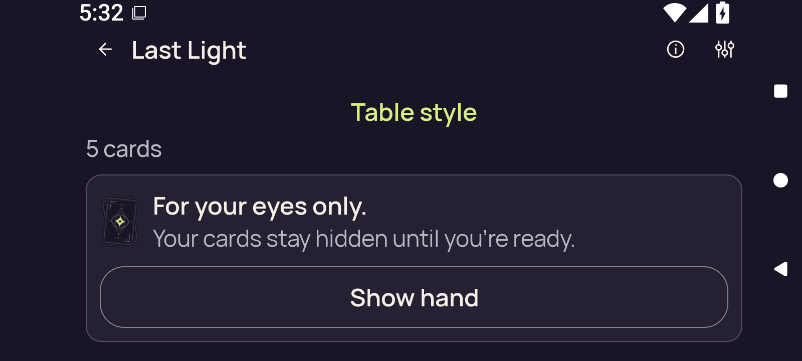</a> <code>3d-landscape-unsupported-return-concealed.png</code> 3d-landscape-unsupported-return-concealed — 3d-landscape.held-rotation | 1600 × 720 px · 70,763 bytes · text 2.0 SHA-256: <code>9a708fac56156093334ae14872044cdc9924dd2ecbd2831eaab5a76e70cad71e</code> Source: <code>/root/projects/PartyDeck/artifacts/evidence-storage/34506161751/android-adaptive-api36-optimized-test-signed-font-2.0-34506161751-1/godot-adaptive/runtime/captures/3d-landscape-unsupported-return-concealed.png</code> Original case outcome: **unsupported** [UI XML](runtime/captures/3d-landscape-unsupported-return-concealed.xml) · [Capture/result JSON](runtime/captures/3d-landscape-unsupported-return-concealed.json) · [Original result](runtime/godot-adaptive-result.json) | **Attributed peer direct view** by <code>/root/ui_game</code>. Landscape standard table scrolled to five-card concealment panel with For your eyes only and Show hand. The full concealment panel and Show hand control fit; preceding hand heading and following play controls are outside the viewport. No individual card face/rank is visible in the concealed-hand snapshot. The held-rotation scope remains unsupported. |
| <a href="runtime/captures/3d-landscape-unsupported-return-selection-cleared.png">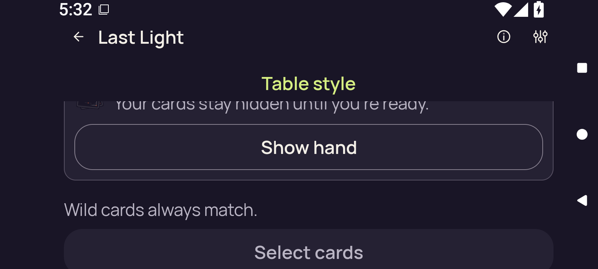</a> <code>3d-landscape-unsupported-return-selection-cleared.png</code> 3d-landscape-unsupported-return-selection-cleared — 3d-landscape.held-rotation | 1600 × 720 px · 67,088 bytes · text 2.0 SHA-256: <code>fe3f0a42e9a18fce89ba702492ed7dfcd11b1807daf2dce19c3c310bd25c3cb1</code> Source: <code>/root/projects/PartyDeck/artifacts/evidence-storage/34506161751/android-adaptive-api36-optimized-test-signed-font-2.0-34506161751-1/godot-adaptive/runtime/captures/3d-landscape-unsupported-return-selection-cleared.png</code> Original case outcome: **unsupported** [UI XML](runtime/captures/3d-landscape-unsupported-return-selection-cleared.xml) · [Capture/result JSON](runtime/captures/3d-landscape-unsupported-return-selection-cleared.json) · [Original result](runtime/godot-adaptive-result.json) | **Attributed peer direct view** by <code>/root/ui_game</code>. Landscape standard table after selection clearing: Show hand, Wild cards always match, disabled Select cards. Upper concealment copy is clipped at the content top; Show hand is complete. The disabled Select cards button extends below the lower edge and challenge is outside the viewport. No card identities are visible. The offered reveal action and disabled selection fit a concealed snapshot, not a held-transition proof. |
| <a href="runtime/captures/3d-landscape-unsupported-return-public.png">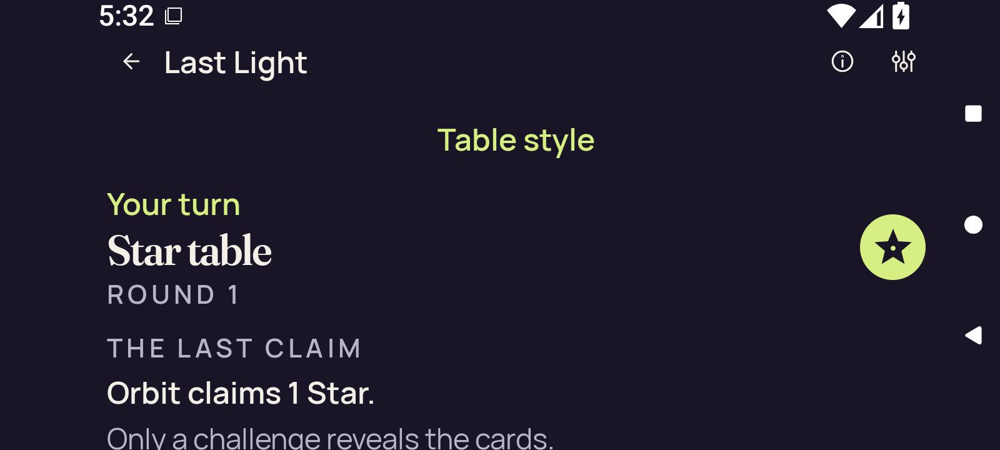</a> <code>3d-landscape-unsupported-return-public.png</code> 3d-landscape-unsupported-return-public — 3d-landscape.held-rotation | 1600 × 720 px · 73,710 bytes · text 2.0 SHA-256: <code>8e66eadf10fc0e6202df3802cdbacb2a1daf4d163282db219cf2a253d59cc39d</code> Source: <code>/root/projects/PartyDeck/artifacts/evidence-storage/34506161751/android-adaptive-api36-optimized-test-signed-font-2.0-34506161751-1/godot-adaptive/runtime/captures/3d-landscape-unsupported-return-public.png</code> Original case outcome: **unsupported** [UI XML](runtime/captures/3d-landscape-unsupported-return-public.xml) · [Capture/result JSON](runtime/captures/3d-landscape-unsupported-return-public.json) · [Original result](runtime/godot-adaptive-result.json) | **Attributed peer direct view** by <code>/root/ui_game</code>. Landscape public Star table, round 1, Your turn and Orbit claims 1 Star. Main title/claim readable. The explanatory sentence is clipped at the lower viewport; hand and actions are not shown in this scroll position. Public information only; no private card identities visible. |
| <a href="runtime/captures/3d-landscape-unsupported-return-first-card.png">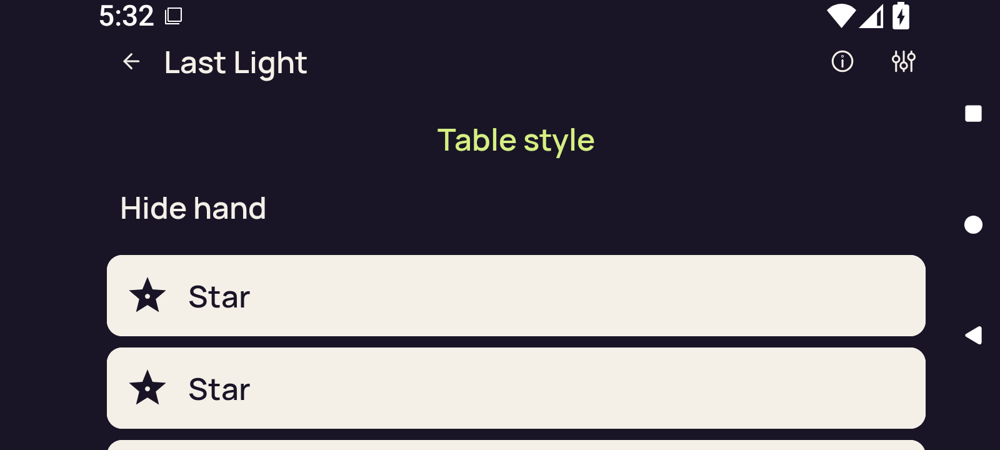</a> <code>3d-landscape-unsupported-return-first-card.png</code> 3d-landscape-unsupported-return-first-card — 3d-landscape.held-rotation | 1600 × 720 px · 44,085 bytes · text 2.0 SHA-256: <code>6b42c3842f81b756aca34046de4e56cc765f9b0735e957b7d9335b31ef0b5741</code> Source: <code>/root/projects/PartyDeck/artifacts/evidence-storage/34506161751/android-adaptive-api36-optimized-test-signed-font-2.0-34506161751-1/godot-adaptive/runtime/captures/3d-landscape-unsupported-return-first-card.png</code> Original case outcome: **unsupported** [UI XML](runtime/captures/3d-landscape-unsupported-return-first-card.xml) · [Capture/result JSON](runtime/captures/3d-landscape-unsupported-return-first-card.json) · [Original result](runtime/godot-adaptive-result.json) | **Attributed peer direct view** by <code>/root/ui_game</code>. Landscape revealed hand with Hide hand, two complete Star card rows and an edge of the next row. First two card icons/labels are readable without overlap. Remaining hand and controls continue below the viewport; upper hand heading/count is outside view. Visible card identities belong to the explicitly revealed first-card capture; not a concealed-state image. |
| <a href="runtime/captures/3d-landscape-unsupported-portrait-return-concealed.png">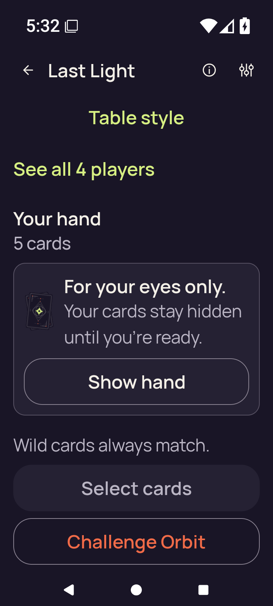</a> <code>3d-landscape-unsupported-portrait-return-concealed.png</code> 3d-landscape-unsupported-portrait-return-concealed — 3d-landscape.held-rotation | 720 × 1600 px · 114,547 bytes · text 2.0 SHA-256: <code>b313466d13d42e99b85fed40f15d9e7a6b553b7a3113a766c1f8329cc57aebcd</code> Source: <code>/root/projects/PartyDeck/artifacts/evidence-storage/34506161751/android-adaptive-api36-optimized-test-signed-font-2.0-34506161751-1/godot-adaptive/runtime/captures/3d-landscape-unsupported-portrait-return-concealed.png</code> Original case outcome: **unsupported** [UI XML](runtime/captures/3d-landscape-unsupported-portrait-return-concealed.xml) · [Capture/result JSON](runtime/captures/3d-landscape-unsupported-portrait-return-concealed.json) · [Original result](runtime/godot-adaptive-result.json) | **Attributed peer direct view** by <code>/root/ui_game</code>. Portrait concealed five-card hand with Show hand, disabled Select cards and Challenge Orbit. Concealment copy and all three shown controls are fully readable with no overlap or truncation. No individual card identities visible. Source held-rotation remains unsupported; no timing claim. |
|  <code>3d-landscape-unsupported-portrait-return-selection-cleared.png</code> 3d-landscape-unsupported-portrait-return-selection-cleared — 3d-landscape.held-rotation | 720 × 1600 px · 114,547 bytes · text 2.0 SHA-256: <code>b313466d13d42e99b85fed40f15d9e7a6b553b7a3113a766c1f8329cc57aebcd</code> Source: <code>/root/projects/PartyDeck/artifacts/evidence-storage/34506161751/android-adaptive-api36-optimized-test-signed-font-2.0-34506161751-1/godot-adaptive/runtime/captures/3d-landscape-unsupported-portrait-return-selection-cleared.png</code> Original case outcome: **unsupported** [UI XML](runtime/captures/3d-landscape-unsupported-portrait-return-selection-cleared.xml) · [Capture/result JSON](runtime/captures/3d-landscape-unsupported-portrait-return-selection-cleared.json) · [Original result](runtime/godot-adaptive-result.json) | **Exact same-batch match**. Exact bytes match the separately retained peer-viewed original at plan index 83. Reused pixel observation: Portrait concealed five-card hand with Show hand, disabled Select cards and Challenge Orbit. Concealment copy and all three shown controls are fully readable with no overlap or truncation. No individual card identities visible. Source held-rotation remains unsupported; no timing claim. [Reviewed matching original](runtime/captures/3d-landscape-unsupported-portrait-return-concealed.png); original capture identity remains separate. |
| <a href="runtime/captures/3d-landscape-unsupported-portrait-return-public.png">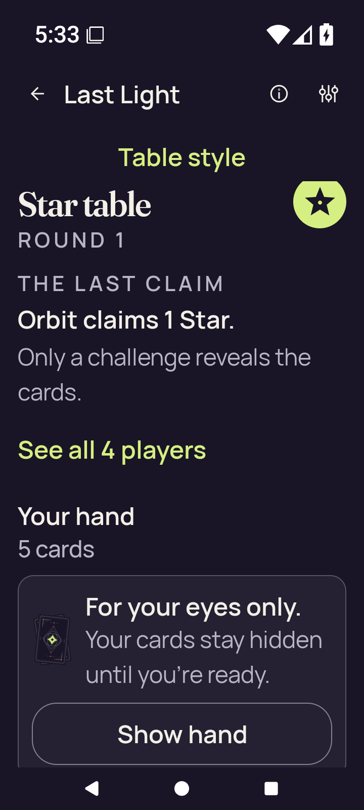</a> <code>3d-landscape-unsupported-portrait-return-public.png</code> 3d-landscape-unsupported-portrait-return-public — 3d-landscape.held-rotation | 720 × 1600 px · 124,248 bytes · text 2.0 SHA-256: <code>f50e4ff6f4d4c55ca2cc3976f717b62ec7095333bb11a3d19ca21e8908accedf</code> Source: <code>/root/projects/PartyDeck/artifacts/evidence-storage/34506161751/android-adaptive-api36-optimized-test-signed-font-2.0-34506161751-1/godot-adaptive/runtime/captures/3d-landscape-unsupported-portrait-return-public.png</code> Original case outcome: **unsupported** [UI XML](runtime/captures/3d-landscape-unsupported-portrait-return-public.xml) · [Capture/result JSON](runtime/captures/3d-landscape-unsupported-portrait-return-public.json) · [Original result](runtime/godot-adaptive-result.json) | **Attributed peer direct view** by <code>/root/ui_game</code>. Portrait public Star table/round 1, Orbit claims 1 Star, player link and five-card concealment panel with Show hand. The circular star badge is cut flat at the top content boundary beneath Table style; Your turn is outside view. Main claim, cover copy and Show hand are readable; panel bottom reaches the viewport edge. Visible hand is concealed, with no individual card identities. This recovery capture does not prove a held return. |
| <a href="runtime/captures/3d-landscape-unsupported-portrait-return-first-card.png">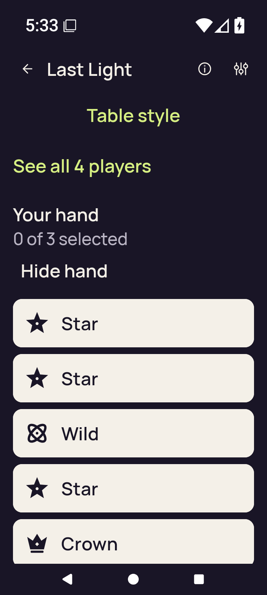</a> <code>3d-landscape-unsupported-portrait-return-first-card.png</code> 3d-landscape-unsupported-portrait-return-first-card — 3d-landscape.held-rotation | 720 × 1600 px · 80,660 bytes · text 2.0 SHA-256: <code>32b10cc3541beae38dbd6d00b168a2e9070f3a157a45728b562826d9a25667b8</code> Source: <code>/root/projects/PartyDeck/artifacts/evidence-storage/34506161751/android-adaptive-api36-optimized-test-signed-font-2.0-34506161751-1/godot-adaptive/runtime/captures/3d-landscape-unsupported-portrait-return-first-card.png</code> Original case outcome: **unsupported** [UI XML](runtime/captures/3d-landscape-unsupported-portrait-return-first-card.xml) · [Capture/result JSON](runtime/captures/3d-landscape-unsupported-portrait-return-first-card.json) · [Original result](runtime/godot-adaptive-result.json) | **Attributed peer direct view** by <code>/root/ui_game</code>. Portrait revealed hand, zero selected, Hide hand and five card labels including Star, Wild and Crown. Card labels/icons are readable; the last row&#x27;s lower edge falls below the viewport. No visible card-label overlap. Five hand identities are exposed by the explicitly revealed first-card state; not a concealed capture. |
| <a href="runtime/captures/3d-landscape-reentry-selected.png">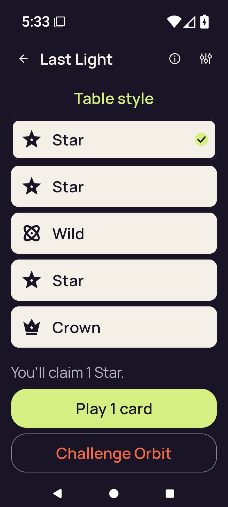</a> <code>3d-landscape-reentry-selected.png</code> 3d-landscape-reentry-selected — 3d-landscape.portrait-reentry-standard | 720 × 1600 px · 84,807 bytes · text 2.0 SHA-256: <code>e9693c8320afd9b04c1bed9019964a9e5fd6c369563dc7dd8e6973158e979e9c</code> Source: <code>/root/projects/PartyDeck/artifacts/evidence-storage/34506161751/android-adaptive-api36-optimized-test-signed-font-2.0-34506161751-1/godot-adaptive/runtime/captures/3d-landscape-reentry-selected.png</code> Original case outcome: **unsupported** [UI XML](runtime/captures/3d-landscape-reentry-selected.xml) · [Capture/result JSON](runtime/captures/3d-landscape-reentry-selected.json) · [Original result](runtime/godot-adaptive-result.json) | **Attributed peer direct view** by <code>/root/ui_game</code>. Portrait first card selected with checkmark, five revealed cards, You&#x27;ll claim 1 Star, Play 1 card and Challenge Orbit. All card labels, selection mark and both action controls are visible and readable without overlap. The source selected-hand state exposes card identities. It is not concealment evidence. |
|  <code>3d-landscape-portrait-selector.png</code> 3d-landscape-portrait-selector — 3d-landscape.portrait-reentry-standard | 720 × 1600 px · 97,652 bytes · text 2.0 SHA-256: <code>ba1f6791e19ee73429c5aea19c246df52291e1dab7df74849fe844e0509cfbba</code> Source: <code>/root/projects/PartyDeck/artifacts/evidence-storage/34506161751/android-adaptive-api36-optimized-test-signed-font-2.0-34506161751-1/godot-adaptive/runtime/captures/3d-landscape-portrait-selector.png</code> Original case outcome: **unsupported** [UI XML](runtime/captures/3d-landscape-portrait-selector.xml) · [Capture/result JSON](runtime/captures/3d-landscape-portrait-selector.json) · [Original result](runtime/godot-adaptive-result.json) | **Attributed peer direct view** by <code>/root/ui_game</code>. Portrait Table style dialog, Standard table selected, 2D and 3D options plus Done. Title, explanatory guidance, choices and Done fit inside the modal without visible truncation. No individual cards or invitation material visible. |
| <a href="runtime/captures/3d-landscape-portrait-native-ready.png">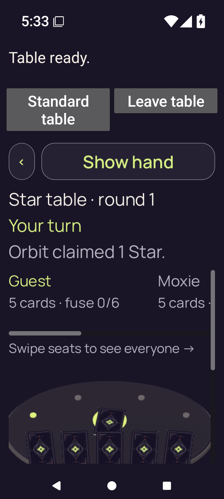</a> <code>3d-landscape-portrait-native-ready.png</code> 3d-landscape-portrait-native-ready — 3d-landscape.portrait-reentry-standard | 720 × 1600 px · 199,347 bytes · text 2.0 SHA-256: <code>6f2a281eda0447ac18ae34565abdeb5676fdf9b0df43e7ce52ab46514ab01b7e</code> Source: <code>/root/projects/PartyDeck/artifacts/evidence-storage/34506161751/android-adaptive-api36-optimized-test-signed-font-2.0-34506161751-1/godot-adaptive/runtime/captures/3d-landscape-portrait-native-ready.png</code> Original case outcome: **unsupported** [UI XML](runtime/captures/3d-landscape-portrait-native-ready.xml) · [Capture/result JSON](runtime/captures/3d-landscape-portrait-native-ready.json) · [Original result](runtime/godot-adaptive-result.json) | **Attributed peer direct view** by <code>/root/ui_game</code>. Portrait Table ready with Standard/Leave controls, Show hand, Star round/claim, horizontally scrollable seats and part of a 3D table with card backs. Header/claim/Show hand fit. A neighboring seat&#x27;s metadata is clipped at the horizontal viewport with an explicit Swipe seats cue. The 3D table and card backs are cut at the lower viewport; vertical scrollbar is visible. The table and hand show card backs; no individual rank/face is exposed in the visible native surface. |
| <a href="runtime/captures/3d-landscape-standard-return-concealed.png">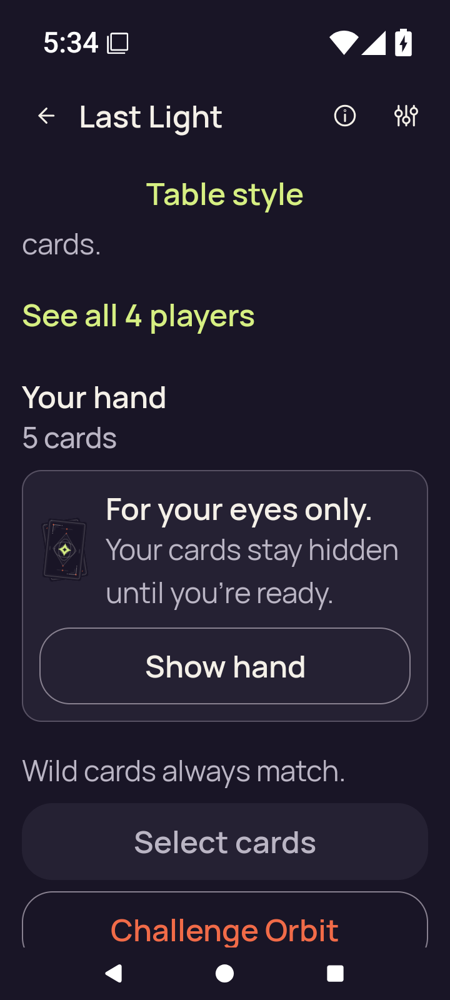</a> <code>3d-landscape-standard-return-concealed.png</code> 3d-landscape-standard-return-concealed — 3d-landscape.portrait-reentry-standard | 720 × 1600 px · 116,464 bytes · text 2.0 SHA-256: <code>106e9fe4ec739829b1b9665d53746c196490ac0dd2a24841dbce6da13a2a9764</code> Source: <code>/root/projects/PartyDeck/artifacts/evidence-storage/34506161751/android-adaptive-api36-optimized-test-signed-font-2.0-34506161751-1/godot-adaptive/runtime/captures/3d-landscape-standard-return-concealed.png</code> Original case outcome: **unsupported** [UI XML](runtime/captures/3d-landscape-standard-return-concealed.xml) · [Capture/result JSON](runtime/captures/3d-landscape-standard-return-concealed.json) · [Original result](runtime/godot-adaptive-result.json) | **Attributed peer direct view** by <code>/root/ui_game</code>. Portrait standard concealment panel with five cards, Show hand, disabled Select cards and Challenge Orbit. Covered-hand copy, Show hand and Select cards fit. A trailing word from preceding content sits at the top; the lower portion of Challenge Orbit control extends below the viewport. No card identities visible in the covered-hand panel; static concealment only. |
|  <code>3d-landscape-standard-return-selection-cleared.png</code> 3d-landscape-standard-return-selection-cleared — 3d-landscape.portrait-reentry-standard | 720 × 1600 px · 116,464 bytes · text 2.0 SHA-256: <code>106e9fe4ec739829b1b9665d53746c196490ac0dd2a24841dbce6da13a2a9764</code> Source: <code>/root/projects/PartyDeck/artifacts/evidence-storage/34506161751/android-adaptive-api36-optimized-test-signed-font-2.0-34506161751-1/godot-adaptive/runtime/captures/3d-landscape-standard-return-selection-cleared.png</code> Original case outcome: **unsupported** [UI XML](runtime/captures/3d-landscape-standard-return-selection-cleared.xml) · [Capture/result JSON](runtime/captures/3d-landscape-standard-return-selection-cleared.json) · [Original result](runtime/godot-adaptive-result.json) | **Exact same-batch match**. Exact bytes match the separately retained peer-viewed original at plan index 90. Reused pixel observation: Portrait standard concealment panel with five cards, Show hand, disabled Select cards and Challenge Orbit. Covered-hand copy, Show hand and Select cards fit. A trailing word from preceding content sits at the top; the lower portion of Challenge Orbit control extends below the viewport. No card identities visible in the covered-hand panel; static concealment only. [Reviewed matching original](runtime/captures/3d-landscape-standard-return-concealed.png); original capture identity remains separate. |
| <a href="runtime/captures/3d-landscape-standard-return-public.png">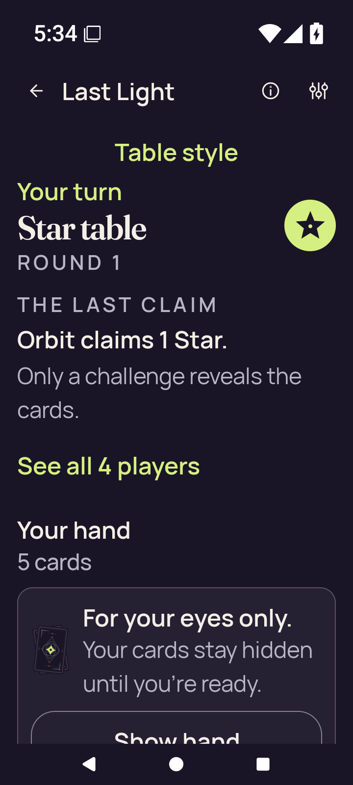</a> <code>3d-landscape-standard-return-public.png</code> 3d-landscape-standard-return-public — 3d-landscape.portrait-reentry-standard | 720 × 1600 px · 123,764 bytes · text 2.0 SHA-256: <code>bdeeb8d6f20a0e0398c010496b4b13fafa09d8699891ad339e6f1b2c04582c4d</code> Source: <code>/root/projects/PartyDeck/artifacts/evidence-storage/34506161751/android-adaptive-api36-optimized-test-signed-font-2.0-34506161751-1/godot-adaptive/runtime/captures/3d-landscape-standard-return-public.png</code> Original case outcome: **unsupported** [UI XML](runtime/captures/3d-landscape-standard-return-public.xml) · [Capture/result JSON](runtime/captures/3d-landscape-standard-return-public.json) · [Original result](runtime/godot-adaptive-result.json) | **Attributed peer direct view** by <code>/root/ui_game</code>. Portrait public Star table/round 1, Your turn, Orbit claim, player link and covered five-card hand. Public labels/claim and cover copy are readable. Show hand is clipped at the lower viewport with the panel continuing below it. Individual hand identities remain concealed in the visible panel. |
| <a href="runtime/captures/3d-landscape-standard-return-first-card.png">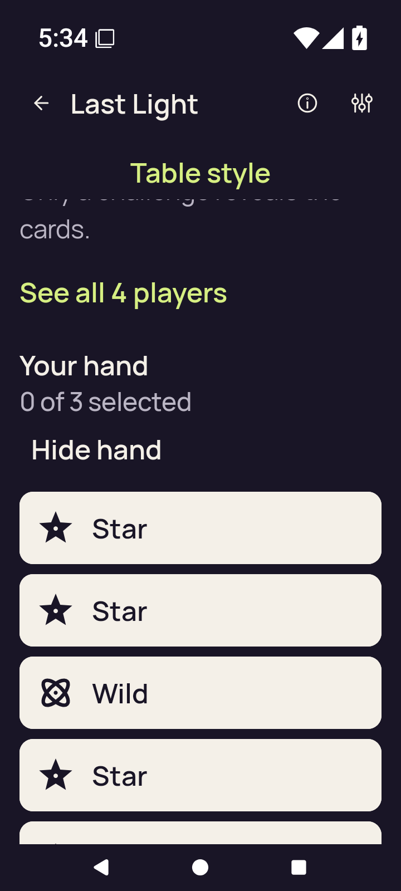</a> <code>3d-landscape-standard-return-first-card.png</code> 3d-landscape-standard-return-first-card — 3d-landscape.portrait-reentry-standard | 720 × 1600 px · 84,408 bytes · text 2.0 SHA-256: <code>967b8911d302ee817d90d314b86a904ee2769d465c9869a6905920e0928a64f3</code> Source: <code>/root/projects/PartyDeck/artifacts/evidence-storage/34506161751/android-adaptive-api36-optimized-test-signed-font-2.0-34506161751-1/godot-adaptive/runtime/captures/3d-landscape-standard-return-first-card.png</code> Original case outcome: **unsupported** [UI XML](runtime/captures/3d-landscape-standard-return-first-card.xml) · [Capture/result JSON](runtime/captures/3d-landscape-standard-return-first-card.json) · [Original result](runtime/godot-adaptive-result.json) | **Attributed peer direct view** by <code>/root/ui_game</code>. Portrait revealed hand with zero selected, Hide hand, four readable card rows and the top edge of a fifth. The preceding public explanation is cut beneath the fixed Table style header. Four card labels fit; the fifth card and action controls continue below the viewport. Four card identities are readable in this explicit reveal capture. Not concealment evidence. |
| <a href="runtime/captures/3d-landscape-leave-selected.png">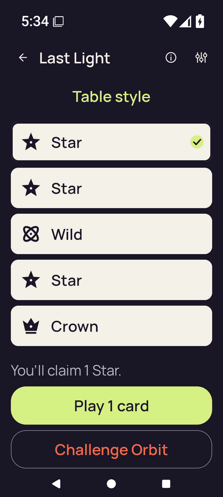</a> <code>3d-landscape-leave-selected.png</code> 3d-landscape-leave-selected — 3d-landscape.native-leave-home | 720 × 1600 px · 85,148 bytes · text 2.0 SHA-256: <code>f08a5d9b1de34186f20c5235fff636c680fa7fd77aa3de294f35c340a6410a82</code> Source: <code>/root/projects/PartyDeck/artifacts/evidence-storage/34506161751/android-adaptive-api36-optimized-test-signed-font-2.0-34506161751-1/godot-adaptive/runtime/captures/3d-landscape-leave-selected.png</code> Original case outcome: **unsupported** [UI XML](runtime/captures/3d-landscape-leave-selected.xml) · [Capture/result JSON](runtime/captures/3d-landscape-leave-selected.json) · [Original result](runtime/godot-adaptive-result.json) | **Attributed peer direct view** by <code>/root/ui_game</code>. Portrait selected Star card with checkmark, five revealed card rows, one-Star claim, Play 1 card and Challenge Orbit. Every displayed card label and both actions fit in the viewport; clear selected/play hierarchy with no visible overlap. Hand identities are visible in the deliberate selected-hand state. Not a concealed capture. |
|  <code>3d-landscape-leave-selector.png</code> 3d-landscape-leave-selector — 3d-landscape.native-leave-home | 720 × 1600 px · 98,077 bytes · text 2.0 SHA-256: <code>fe949834623b2e148109027f36143d7af92f3981bd7ab5cb638e558886ba861c</code> Source: <code>/root/projects/PartyDeck/artifacts/evidence-storage/34506161751/android-adaptive-api36-optimized-test-signed-font-2.0-34506161751-1/godot-adaptive/runtime/captures/3d-landscape-leave-selector.png</code> Original case outcome: **unsupported** [UI XML](runtime/captures/3d-landscape-leave-selector.xml) · [Capture/result JSON](runtime/captures/3d-landscape-leave-selector.json) · [Original result](runtime/godot-adaptive-result.json) | **Attributed peer direct view** by <code>/root/ui_game</code>. Portrait Table style dialog with Standard table selected, explanatory copy, 2D/3D options and Done. The complete modal fits and all labels remain readable without overlap or truncation. No card identities or invitation material visible. |
| <a href="runtime/captures/3d-landscape-leave-native-ready.png">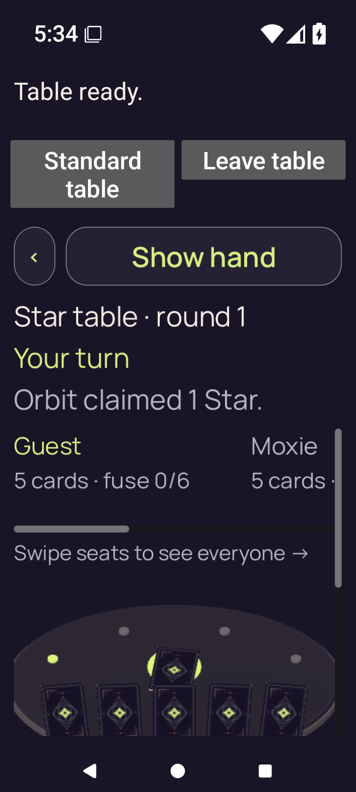</a> <code>3d-landscape-leave-native-ready.png</code> 3d-landscape-leave-native-ready — 3d-landscape.native-leave-home | 720 × 1600 px · 200,028 bytes · text 2.0 SHA-256: <code>0fc3d5434fc2bdaa9bc163f8497cf78e316428cacfdba11b3cfb6628a16e60ca</code> Source: <code>/root/projects/PartyDeck/artifacts/evidence-storage/34506161751/android-adaptive-api36-optimized-test-signed-font-2.0-34506161751-1/godot-adaptive/runtime/captures/3d-landscape-leave-native-ready.png</code> Original case outcome: **unsupported** [UI XML](runtime/captures/3d-landscape-leave-native-ready.xml) · [Capture/result JSON](runtime/captures/3d-landscape-leave-native-ready.json) · [Original result](runtime/godot-adaptive-result.json) | **Attributed peer direct view** by <code>/root/ui_game</code>. Portrait Table ready, Standard/Leave controls, Show hand, Star turn/claim, seats and part of the 3D table with card backs. Primary header/Show hand labels fit. Neighboring seat details are partially outside the horizontal viewport, with a Swipe seats cue. Lower card backs/table are clipped by the vertical viewport. All visible native cards show backs; no individual card face/rank exposed in this still. |
|  <code>3d-landscape-leave-confirmation.png</code> 3d-landscape-leave-confirmation — 3d-landscape.native-leave-home | 720 × 1600 px · 62,041 bytes · text 2.0 SHA-256: <code>f0a819c9190624495cc3411b3ed9eaf1717084539dff61a03f5a662d644469e9</code> Source: <code>/root/projects/PartyDeck/artifacts/evidence-storage/34506161751/android-adaptive-api36-optimized-test-signed-font-2.0-34506161751-1/godot-adaptive/runtime/captures/3d-landscape-leave-confirmation.png</code> Original case outcome: **unsupported** [UI XML](runtime/captures/3d-landscape-leave-confirmation.xml) · [Capture/result JSON](runtime/captures/3d-landscape-leave-confirmation.json) · [Original result](runtime/godot-adaptive-result.json) | **Attributed peer direct view** by <code>/root/ui_game</code>. Portrait Leave the table? confirmation; orange Leave table and green Stay at the table. The title, complete explanation and both choices fit with clear separation and no visible clipping. No hand or invitation details visible. |
|  <code>3d-landscape-home.png</code> 3d-landscape-home — 3d-landscape.native-leave-home | 720 × 1600 px · 80,418 bytes · text 2.0 SHA-256: <code>bf42afa677a18e8f45fb30d50574a90568e67a961dd8f6e1ebe78b0b6f464baa</code> Source: <code>/root/projects/PartyDeck/artifacts/evidence-storage/34506161751/android-adaptive-api36-optimized-test-signed-font-2.0-34506161751-1/godot-adaptive/runtime/captures/3d-landscape-home.png</code> Original case outcome: **unsupported** [UI XML](runtime/captures/3d-landscape-home.xml) · [Capture/result JSON](runtime/captures/3d-landscape-home.json) · [Original result](runtime/godot-adaptive-result.json) | **Attributed peer direct view** by <code>/root/ui_game</code>. Portrait PartyDeck home with Last Light description, Host, Join, practice and How to play. All main home text/actions fit and are legible; clear primary action and no visible clipping. No hand identities or invitation material visible. |
| <a href="runtime/captures/3d-seascape-baseline-public.png">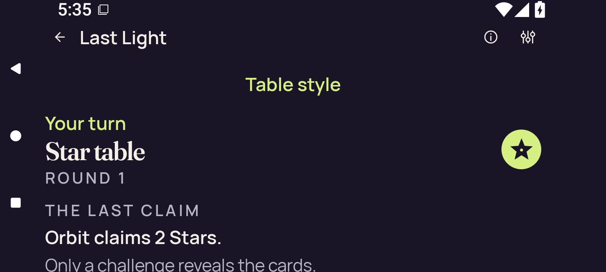</a> <code>3d-seascape-baseline-public.png</code> 3d-seascape-baseline-public — 3d-seascape.initial-landscape | 1600 × 720 px · 74,268 bytes · text 2.0 SHA-256: <code>a3e2ef4dbb6d8b48676e351d0faa39ff0fa1ad9adadd32a6655ccfb628faad0d</code> Source: <code>/root/projects/PartyDeck/artifacts/evidence-storage/34506161751/android-adaptive-api36-optimized-test-signed-font-2.0-34506161751-1/godot-adaptive/runtime/captures/3d-seascape-baseline-public.png</code> Original case outcome: **unsupported** [UI XML](runtime/captures/3d-seascape-baseline-public.xml) · [Capture/result JSON](runtime/captures/3d-seascape-baseline-public.json) · [Original result](runtime/godot-adaptive-result.json) | **Attributed peer direct view** by <code>/root/ui_game</code>. Seascape standard public Star table, Your turn, round 1 and Orbit claims 2 Stars; system navigation is at the left. Public title/claim fit. The explanation beneath the claim is cut at the lower viewport; hand/actions are outside this scroll position. Public claim only; no individual card identities visible. |
| <a href="runtime/captures/3d-seascape-baseline-first-card.png">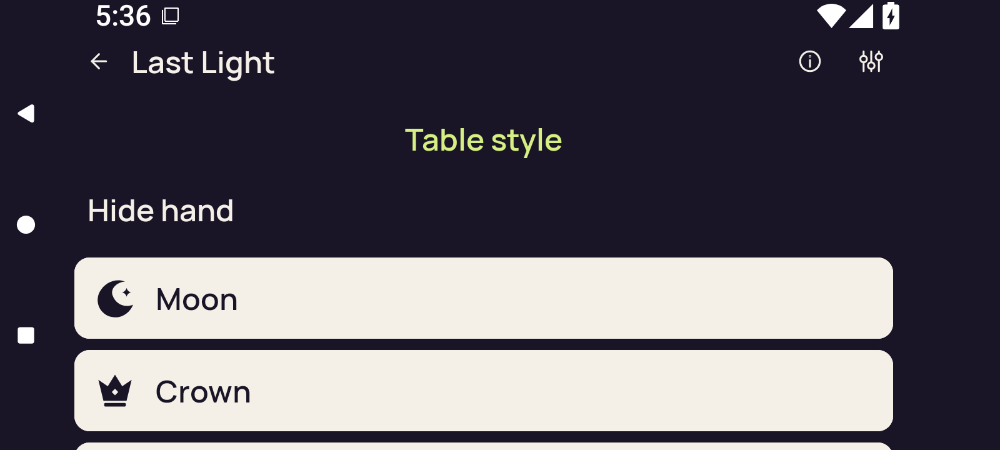</a> <code>3d-seascape-baseline-first-card.png</code> 3d-seascape-baseline-first-card — 3d-seascape.initial-landscape | 1600 × 720 px · 44,591 bytes · text 2.0 SHA-256: <code>76c006732f995925544d80becfc9793a1c5642bea8bb9110354716f901cd0929</code> Source: <code>/root/projects/PartyDeck/artifacts/evidence-storage/34506161751/android-adaptive-api36-optimized-test-signed-font-2.0-34506161751-1/godot-adaptive/runtime/captures/3d-seascape-baseline-first-card.png</code> Original case outcome: **unsupported** [UI XML](runtime/captures/3d-seascape-baseline-first-card.xml) · [Capture/result JSON](runtime/captures/3d-seascape-baseline-first-card.json) · [Original result](runtime/godot-adaptive-result.json) | **Attributed peer direct view** by <code>/root/ui_game</code>. Seascape revealed-hand view with Hide hand, Moon and Crown card rows, and a sliver of the next row. The two full card labels/icons are readable; the remaining hand and play actions extend below the viewport. Visible card identities come from an explicit revealed-hand capture. Not a concealed state. |
| <a href="runtime/captures/3d-seascape-baseline-selected.png">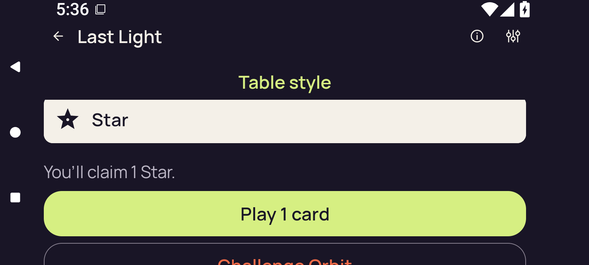</a> <code>3d-seascape-baseline-selected.png</code> 3d-seascape-baseline-selected — 3d-seascape.initial-landscape | 1600 × 720 px · 52,532 bytes · text 2.0 SHA-256: <code>ad0340f0cc941c832807d761bb9d909d9b1a8aece0bb407ce999f83ffc02834a</code> Source: <code>/root/projects/PartyDeck/artifacts/evidence-storage/34506161751/android-adaptive-api36-optimized-test-signed-font-2.0-34506161751-1/godot-adaptive/runtime/captures/3d-seascape-baseline-selected.png</code> Original case outcome: **unsupported** [UI XML](runtime/captures/3d-seascape-baseline-selected.xml) · [Capture/result JSON](runtime/captures/3d-seascape-baseline-selected.json) · [Original result](runtime/godot-adaptive-result.json) | **Attributed peer direct view** by <code>/root/ui_game</code>. Seascape selected-hand action view with a Star row, You&#x27;ll claim 1 Star and Play 1 card. The top card row is cropped at its upper edge but its label is readable. Play 1 card is complete; Challenge Orbit extends below the lower edge and its text is clipped. A Star card identity is visible in the source&#x27;s revealed/selected state; selected first card is outside this viewport. |
| <a href="runtime/captures/3d-seascape-initial-selector.png">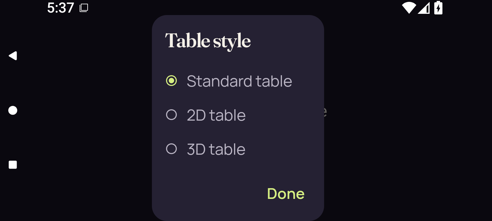</a> <code>3d-seascape-initial-selector.png</code> 3d-seascape-initial-selector — 3d-seascape.initial-landscape | 1600 × 720 px · 49,531 bytes · text 2.0 SHA-256: <code>00e2c72c8bad0415a4df592364950d2380a3d0eeb52fedcc6ec32f90bb3e24fa</code> Source: <code>/root/projects/PartyDeck/artifacts/evidence-storage/34506161751/android-adaptive-api36-optimized-test-signed-font-2.0-34506161751-1/godot-adaptive/runtime/captures/3d-seascape-initial-selector.png</code> Original case outcome: **unsupported** [UI XML](runtime/captures/3d-seascape-initial-selector.xml) · [Capture/result JSON](runtime/captures/3d-seascape-initial-selector.json) · [Original result](runtime/godot-adaptive-result.json) | **Attributed peer direct view** by <code>/root/ui_game</code>. Seascape Table style dialog with Standard table selected, 2D/3D choices and Done. Shown title/radios/Done fit and are readable. Explanatory guidance is not in view; the modal occupies nearly the full short dimension. No individual card identities or invitation material readable. |
| <a href="runtime/captures/3d-seascape-initial-native-ready.png">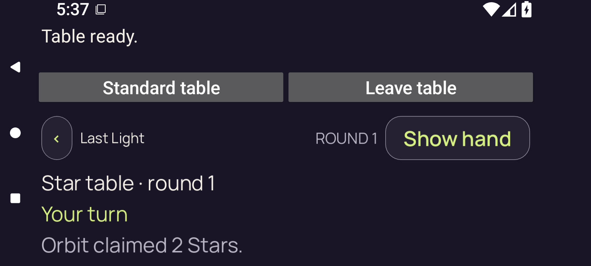</a> <code>3d-seascape-initial-native-ready.png</code> 3d-seascape-initial-native-ready — 3d-seascape.initial-landscape | 1600 × 720 px · 92,822 bytes · text 2.0 SHA-256: <code>090037fe0232b9404243834968d0637cf541f0cea51c5b9433a7f690f39c3da6</code> Source: <code>/root/projects/PartyDeck/artifacts/evidence-storage/34506161751/android-adaptive-api36-optimized-test-signed-font-2.0-34506161751-1/godot-adaptive/runtime/captures/3d-seascape-initial-native-ready.png</code> Original case outcome: **unsupported** [UI XML](runtime/captures/3d-seascape-initial-native-ready.xml) · [Capture/result JSON](runtime/captures/3d-seascape-initial-native-ready.json) · [Original result](runtime/godot-adaptive-result.json) | **Attributed peer direct view** by <code>/root/ui_game</code>. Seascape Table ready with Standard table/Leave table, Show hand, Star round 1, Your turn and Orbit claimed 2 Stars. Header controls and public claim fit; they occupy the captured height, with the native table/hand surface outside the visible viewport. No individual card identities are visible. Readiness chrome is not gameplay or transition-privacy proof. |
| <a href="runtime/captures/3d-seascape-unsupported-return-concealed.png">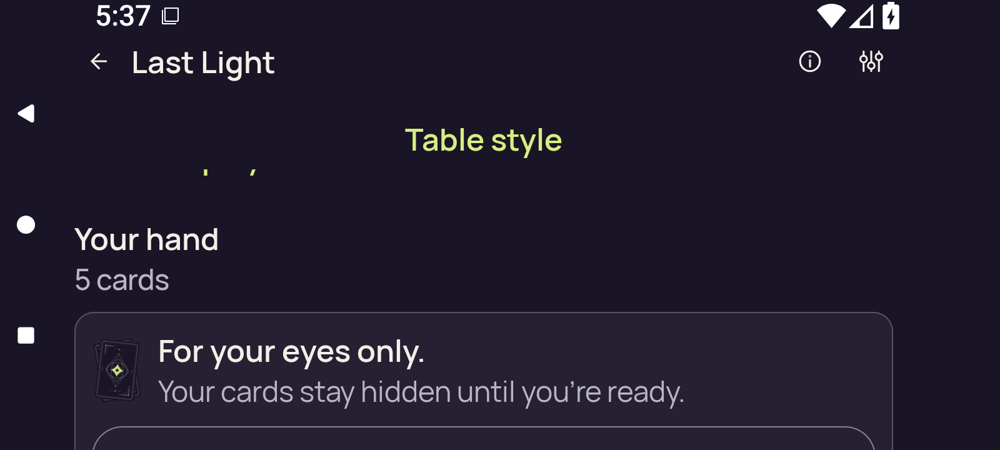</a> <code>3d-seascape-unsupported-return-concealed.png</code> 3d-seascape-unsupported-return-concealed — 3d-seascape.held-rotation | 1600 × 720 px · 66,606 bytes · text 2.0 SHA-256: <code>489ec7952de0f63b07081a58c3402c6434f7a198c44e6fc0f96447fa0067a13e</code> Source: <code>/root/projects/PartyDeck/artifacts/evidence-storage/34506161751/android-adaptive-api36-optimized-test-signed-font-2.0-34506161751-1/godot-adaptive/runtime/captures/3d-seascape-unsupported-return-concealed.png</code> Original case outcome: **unsupported** [UI XML](runtime/captures/3d-seascape-unsupported-return-concealed.xml) · [Capture/result JSON](runtime/captures/3d-seascape-unsupported-return-concealed.json) · [Original result](runtime/godot-adaptive-result.json) | **Attributed peer direct view** by <code>/root/ui_game</code>. Seascape standard return showing Your hand, five cards and For your eyes only cover copy. An earlier green text fragment is cut beneath Table style. The cover panel continues below the lower edge; only the upper outline of Show hand is visible, with its label outside the image. Cover copy/card-back illustration are visible without individual card identities. Source held-rotation remains unsupported. |
| <a href="runtime/captures/3d-seascape-unsupported-return-selection-cleared.png">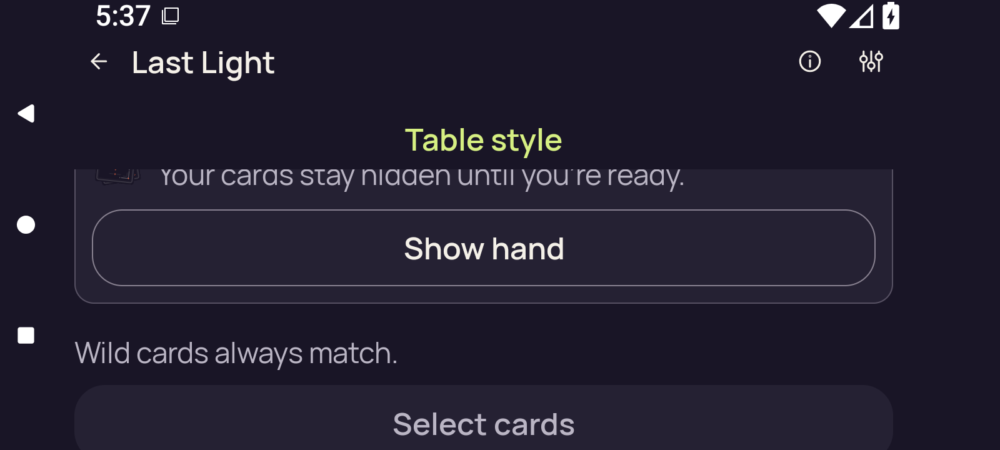</a> <code>3d-seascape-unsupported-return-selection-cleared.png</code> 3d-seascape-unsupported-return-selection-cleared — 3d-seascape.held-rotation | 1600 × 720 px · 68,211 bytes · text 2.0 SHA-256: <code>46d7dc11acab759fe701cb39e3745c5d8681940f2a9d6bb2a7bbe6e982f53fb4</code> Source: <code>/root/projects/PartyDeck/artifacts/evidence-storage/34506161751/android-adaptive-api36-optimized-test-signed-font-2.0-34506161751-1/godot-adaptive/runtime/captures/3d-seascape-unsupported-return-selection-cleared.png</code> Original case outcome: **unsupported** [UI XML](runtime/captures/3d-seascape-unsupported-return-selection-cleared.xml) · [Capture/result JSON](runtime/captures/3d-seascape-unsupported-return-selection-cleared.json) · [Original result](runtime/godot-adaptive-result.json) | **Attributed peer direct view** by <code>/root/ui_game</code>. Seascape selection-cleared standard view with Show hand, Wild cards always match and disabled Select cards. The concealment copy is clipped at the upper content boundary. Show hand is fully visible; the bottom part of Select cards is below the viewport. No individual card face/rank visible; a static concealed-hand view only. |
| <a href="runtime/captures/3d-seascape-unsupported-return-public.png">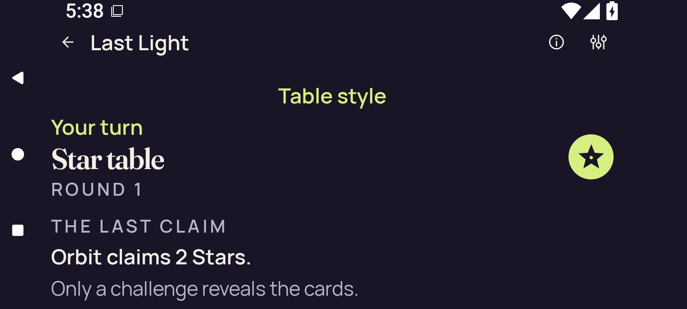</a> <code>3d-seascape-unsupported-return-public.png</code> 3d-seascape-unsupported-return-public — 3d-seascape.held-rotation | 1600 × 720 px · 75,923 bytes · text 2.0 SHA-256: <code>307ac82564231dd953c47eb702cf26d5d54cdcd706e2e9bbc915ba6fea41550d</code> Source: <code>/root/projects/PartyDeck/artifacts/evidence-storage/34506161751/android-adaptive-api36-optimized-test-signed-font-2.0-34506161751-1/godot-adaptive/runtime/captures/3d-seascape-unsupported-return-public.png</code> Original case outcome: **unsupported** [UI XML](runtime/captures/3d-seascape-unsupported-return-public.xml) · [Capture/result JSON](runtime/captures/3d-seascape-unsupported-return-public.json) · [Original result](runtime/godot-adaptive-result.json) | **Attributed peer direct view** by <code>/root/ui_game</code>. Seascape public Star table/round 1, Your turn, Orbit claims 2 Stars and complete challenge explanation. All shown public text and rank icon fit. Hand and controls are outside the current viewport; no visible truncation of the shown explanation. Only public claim/rank information visible; no individual hand cards. |
| <a href="runtime/captures/3d-seascape-unsupported-return-first-card.png">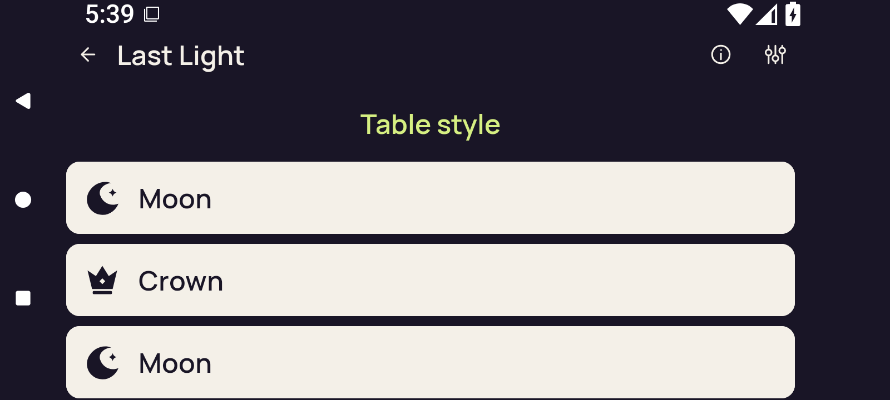</a> <code>3d-seascape-unsupported-return-first-card.png</code> 3d-seascape-unsupported-return-first-card — 3d-seascape.held-rotation | 1600 × 720 px · 46,188 bytes · text 2.0 SHA-256: <code>2623718943fd8a545d9897b023688533603136be9ed61de759226897097efba6</code> Source: <code>/root/projects/PartyDeck/artifacts/evidence-storage/34506161751/android-adaptive-api36-optimized-test-signed-font-2.0-34506161751-1/godot-adaptive/runtime/captures/3d-seascape-unsupported-return-first-card.png</code> Original case outcome: **unsupported** [UI XML](runtime/captures/3d-seascape-unsupported-return-first-card.xml) · [Capture/result JSON](runtime/captures/3d-seascape-unsupported-return-first-card.json) · [Original result](runtime/godot-adaptive-result.json) | **Attributed peer direct view** by <code>/root/ui_game</code>. Seascape revealed-hand scroll position with three readable rows: Moon, Crown and Moon. The three displayed card rows fit with readable icons/labels; remaining cards and hand/action headers are outside the viewport. Three card identities are visible after the source&#x27;s explicit reveal. This is not concealment evidence. |
|  <code>3d-seascape-unsupported-portrait-return-concealed.png</code> 3d-seascape-unsupported-portrait-return-concealed — 3d-seascape.held-rotation | 720 × 1600 px · 114,744 bytes · text 2.0 SHA-256: <code>aa45186195a75c988555efc5d6df5cb856dfd19eed9059f248c5e211fff639ad</code> Source: <code>/root/projects/PartyDeck/artifacts/evidence-storage/34506161751/android-adaptive-api36-optimized-test-signed-font-2.0-34506161751-1/godot-adaptive/runtime/captures/3d-seascape-unsupported-portrait-return-concealed.png</code> Original case outcome: **unsupported** [UI XML](runtime/captures/3d-seascape-unsupported-portrait-return-concealed.xml) · [Capture/result JSON](runtime/captures/3d-seascape-unsupported-portrait-return-concealed.json) · [Original result](runtime/godot-adaptive-result.json) | **Attributed peer direct view** by <code>/root/ui_game</code>. Portrait five-card concealment panel, Show hand, disabled Select cards and Challenge Orbit. Concealment copy, all visible controls and player link fit without text overlap or truncation. No individual card identities visible; unsupported held-rotation outcome is unchanged. |
|  <code>3d-seascape-unsupported-portrait-return-selection-cleared.png</code> 3d-seascape-unsupported-portrait-return-selection-cleared — 3d-seascape.held-rotation | 720 × 1600 px · 114,744 bytes · text 2.0 SHA-256: <code>aa45186195a75c988555efc5d6df5cb856dfd19eed9059f248c5e211fff639ad</code> Source: <code>/root/projects/PartyDeck/artifacts/evidence-storage/34506161751/android-adaptive-api36-optimized-test-signed-font-2.0-34506161751-1/godot-adaptive/runtime/captures/3d-seascape-unsupported-portrait-return-selection-cleared.png</code> Original case outcome: **unsupported** [UI XML](runtime/captures/3d-seascape-unsupported-portrait-return-selection-cleared.xml) · [Capture/result JSON](runtime/captures/3d-seascape-unsupported-portrait-return-selection-cleared.json) · [Original result](runtime/godot-adaptive-result.json) | **Exact same-batch match**. Exact bytes match the separately retained peer-viewed original at plan index 108. Reused pixel observation: Portrait five-card concealment panel, Show hand, disabled Select cards and Challenge Orbit. Concealment copy, all visible controls and player link fit without text overlap or truncation. No individual card identities visible; unsupported held-rotation outcome is unchanged. [Reviewed matching original](runtime/captures/3d-seascape-unsupported-portrait-return-concealed.png); original capture identity remains separate. |
| <a href="runtime/captures/3d-seascape-unsupported-portrait-return-public.png">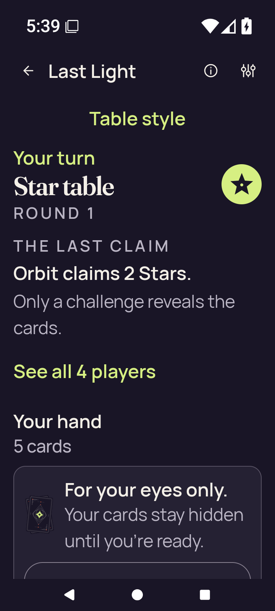</a> <code>3d-seascape-unsupported-portrait-return-public.png</code> 3d-seascape-unsupported-portrait-return-public — 3d-seascape.held-rotation | 720 × 1600 px · 121,529 bytes · text 2.0 SHA-256: <code>674efee93e9a597e6dbd6a5a78911b98bd095faac3c6dabc14d9047ebebe113a</code> Source: <code>/root/projects/PartyDeck/artifacts/evidence-storage/34506161751/android-adaptive-api36-optimized-test-signed-font-2.0-34506161751-1/godot-adaptive/runtime/captures/3d-seascape-unsupported-portrait-return-public.png</code> Original case outcome: **unsupported** [UI XML](runtime/captures/3d-seascape-unsupported-portrait-return-public.xml) · [Capture/result JSON](runtime/captures/3d-seascape-unsupported-portrait-return-public.json) · [Original result](runtime/godot-adaptive-result.json) | **Attributed peer direct view** by <code>/root/ui_game</code>. Portrait public Star table/round 1, Your turn, Orbit claims 2 Stars, player link and covered-hand panel. Public labels/claim and cover copy are readable. The Show hand action is below the viewport apart from its upper outline. The visible hand remains covered; no individual card ranks/faces exposed. |
| <a href="runtime/captures/3d-seascape-unsupported-portrait-return-first-card.png">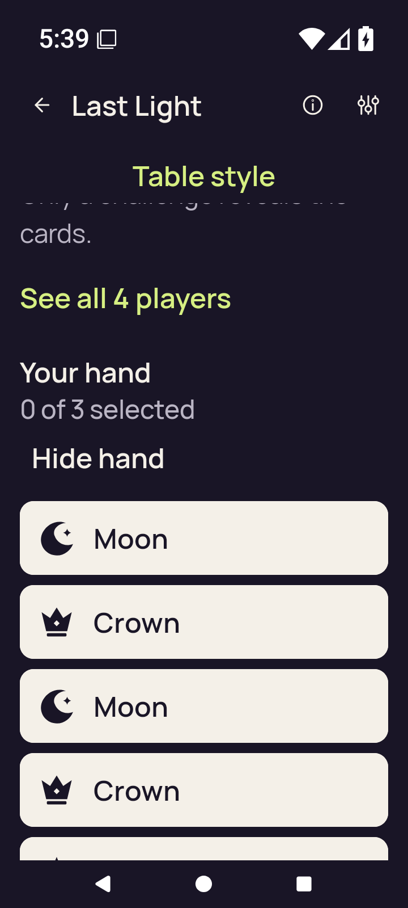</a> <code>3d-seascape-unsupported-portrait-return-first-card.png</code> 3d-seascape-unsupported-portrait-return-first-card — 3d-seascape.held-rotation | 720 × 1600 px · 85,069 bytes · text 2.0 SHA-256: <code>e1191ef9aacd779aa9b4c656af35b77a388c6cd4e3b97aaef5697f5e92776c96</code> Source: <code>/root/projects/PartyDeck/artifacts/evidence-storage/34506161751/android-adaptive-api36-optimized-test-signed-font-2.0-34506161751-1/godot-adaptive/runtime/captures/3d-seascape-unsupported-portrait-return-first-card.png</code> Original case outcome: **unsupported** [UI XML](runtime/captures/3d-seascape-unsupported-portrait-return-first-card.xml) · [Capture/result JSON](runtime/captures/3d-seascape-unsupported-portrait-return-first-card.json) · [Original result](runtime/godot-adaptive-result.json) | **Attributed peer direct view** by <code>/root/ui_game</code>. Portrait revealed hand, zero selected, Hide hand, four readable Moon/Crown rows and the upper edge of a fifth card. The preceding public explanation is cut at the top content boundary. Four card labels fit; the fifth and action controls continue below the viewport. Four card identities are readable after explicit reveal; not a concealed-hand image. |
| <a href="runtime/captures/3d-seascape-reentry-selected.png">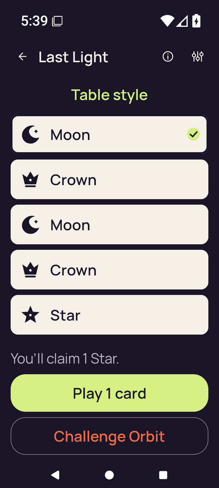</a> <code>3d-seascape-reentry-selected.png</code> 3d-seascape-reentry-selected — 3d-seascape.portrait-reentry-standard | 720 × 1600 px · 84,738 bytes · text 2.0 SHA-256: <code>feb78d7e9b028a7ca32a521bb186babc8d036c55dd9b93965c2be6e90bab2f13</code> Source: <code>/root/projects/PartyDeck/artifacts/evidence-storage/34506161751/android-adaptive-api36-optimized-test-signed-font-2.0-34506161751-1/godot-adaptive/runtime/captures/3d-seascape-reentry-selected.png</code> Original case outcome: **unsupported** [UI XML](runtime/captures/3d-seascape-reentry-selected.xml) · [Capture/result JSON](runtime/captures/3d-seascape-reentry-selected.json) · [Original result](runtime/godot-adaptive-result.json) | **Attributed peer direct view** by <code>/root/ui_game</code>. Portrait first Moon card selected, five revealed card rows, You&#x27;ll claim 1 Star, Play 1 card and Challenge Orbit. Selection checkmark, all card labels and both main actions fit without visible overlap or text truncation. Five card identities are visible in the deliberate selected-hand state. |
|  <code>3d-seascape-portrait-selector.png</code> 3d-seascape-portrait-selector — 3d-seascape.portrait-reentry-standard | 720 × 1600 px · 98,577 bytes · text 2.0 SHA-256: <code>bccb30f73f428e3996fee91b5fc3dca671024dd34078e4b15b82e4121c07876a</code> Source: <code>/root/projects/PartyDeck/artifacts/evidence-storage/34506161751/android-adaptive-api36-optimized-test-signed-font-2.0-34506161751-1/godot-adaptive/runtime/captures/3d-seascape-portrait-selector.png</code> Original case outcome: **unsupported** [UI XML](runtime/captures/3d-seascape-portrait-selector.xml) · [Capture/result JSON](runtime/captures/3d-seascape-portrait-selector.json) · [Original result](runtime/godot-adaptive-result.json) | **Attributed peer direct view** by <code>/root/ui_game</code>. Portrait Table style dialog showing explanatory guidance, Standard selected, 2D/3D options and Done. Complete dialog content fits with readable wrapped text and no visible clipping. No hand identities or invitation details visible. |
| <a href="runtime/captures/3d-seascape-portrait-native-ready.png">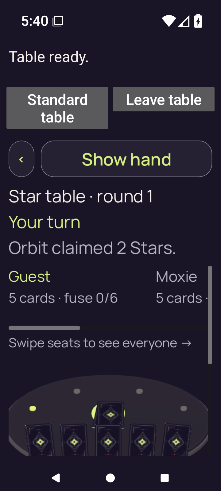</a> <code>3d-seascape-portrait-native-ready.png</code> 3d-seascape-portrait-native-ready — 3d-seascape.portrait-reentry-standard | 720 × 1600 px · 203,385 bytes · text 2.0 SHA-256: <code>f2c94e063bfc548d983fb018b73b8b8cc42596a6289a0f11252520e504e99e5d</code> Source: <code>/root/projects/PartyDeck/artifacts/evidence-storage/34506161751/android-adaptive-api36-optimized-test-signed-font-2.0-34506161751-1/godot-adaptive/runtime/captures/3d-seascape-portrait-native-ready.png</code> Original case outcome: **unsupported** [UI XML](runtime/captures/3d-seascape-portrait-native-ready.xml) · [Capture/result JSON](runtime/captures/3d-seascape-portrait-native-ready.json) · [Original result](runtime/godot-adaptive-result.json) | **Attributed peer direct view** by <code>/root/ui_game</code>. Portrait Table ready, Standard/Leave actions, Show hand, Star/round/claim, seat strip and partial 3D table with card backs. Main controls fit. Right-hand seat metadata is cut within a horizontal scroll region with a Swipe seats cue; table/card backs extend below the vertical viewport. Visible cards all show backs. No individual card face/rank is exposed in the native still. |
|  <code>3d-seascape-standard-return-concealed.png</code> 3d-seascape-standard-return-concealed — 3d-seascape.portrait-reentry-standard | 720 × 1600 px · 114,057 bytes · text 2.0 SHA-256: <code>3777fcdc603b0691258325f3965a879b82954129acfe94ffe68732f857c2f50f</code> Source: <code>/root/projects/PartyDeck/artifacts/evidence-storage/34506161751/android-adaptive-api36-optimized-test-signed-font-2.0-34506161751-1/godot-adaptive/runtime/captures/3d-seascape-standard-return-concealed.png</code> Original case outcome: **unsupported** [UI XML](runtime/captures/3d-seascape-standard-return-concealed.xml) · [Capture/result JSON](runtime/captures/3d-seascape-standard-return-concealed.json) · [Original result](runtime/godot-adaptive-result.json) | **Attributed peer direct view** by <code>/root/ui_game</code>. Portrait standard concealed hand with five cards, For your eyes only, Show hand, disabled Select cards and Challenge Orbit. Full concealment panel and controls fit; clear hierarchy and no visible text truncation. No individual hand card identities visible in this still. |
| <a href="runtime/captures/3d-seascape-standard-return-selection-cleared.png">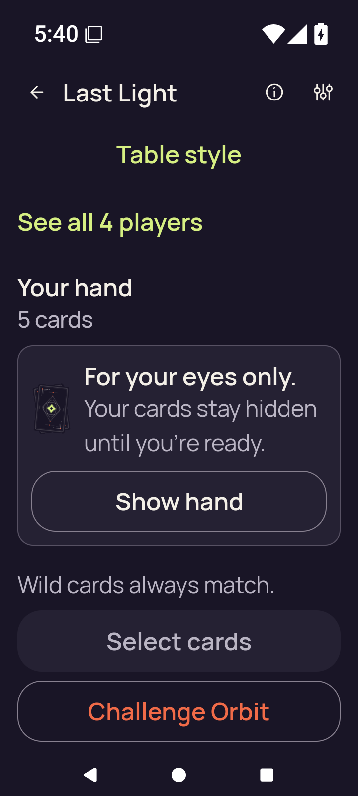</a> <code>3d-seascape-standard-return-selection-cleared.png</code> 3d-seascape-standard-return-selection-cleared — 3d-seascape.portrait-reentry-standard | 720 × 1600 px · 114,057 bytes · text 2.0 SHA-256: <code>3777fcdc603b0691258325f3965a879b82954129acfe94ffe68732f857c2f50f</code> Source: <code>/root/projects/PartyDeck/artifacts/evidence-storage/34506161751/android-adaptive-api36-optimized-test-signed-font-2.0-34506161751-1/godot-adaptive/runtime/captures/3d-seascape-standard-return-selection-cleared.png</code> Original case outcome: **unsupported** [UI XML](runtime/captures/3d-seascape-standard-return-selection-cleared.xml) · [Capture/result JSON](runtime/captures/3d-seascape-standard-return-selection-cleared.json) · [Original result](runtime/godot-adaptive-result.json) | **Exact same-batch match**. Exact bytes match the separately retained peer-viewed original at plan index 115. Reused pixel observation: Portrait standard concealed hand with five cards, For your eyes only, Show hand, disabled Select cards and Challenge Orbit. Full concealment panel and controls fit; clear hierarchy and no visible text truncation. No individual hand card identities visible in this still. [Reviewed matching original](runtime/captures/3d-seascape-standard-return-concealed.png); original capture identity remains separate. |
| <a href="runtime/captures/3d-seascape-standard-return-public.png">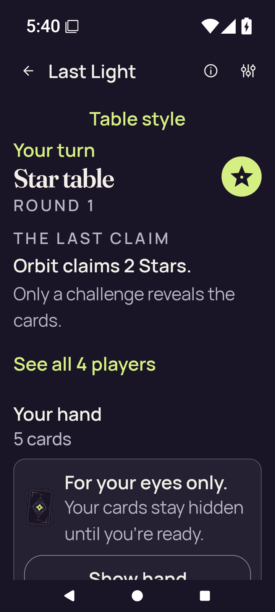</a> <code>3d-seascape-standard-return-public.png</code> 3d-seascape-standard-return-public — 3d-seascape.portrait-reentry-standard | 720 × 1600 px · 124,019 bytes · text 2.0 SHA-256: <code>a471c95fd127deed967584258026ea4aff06128081b4e0f85c05a50a5c6481ab</code> Source: <code>/root/projects/PartyDeck/artifacts/evidence-storage/34506161751/android-adaptive-api36-optimized-test-signed-font-2.0-34506161751-1/godot-adaptive/runtime/captures/3d-seascape-standard-return-public.png</code> Original case outcome: **unsupported** [UI XML](runtime/captures/3d-seascape-standard-return-public.xml) · [Capture/result JSON](runtime/captures/3d-seascape-standard-return-public.json) · [Original result](runtime/godot-adaptive-result.json) | **Attributed peer direct view** by <code>/root/ui_game</code>. Portrait Star table public claim and covered-hand panel with Your turn and player link. Public claim and cover copy fit; Show hand is clipped at the lower viewport with only the upper portion of its label visible. No individual card faces/ranks exposed in the visible covered-hand panel. |
| <a href="runtime/captures/3d-seascape-standard-return-first-card.png">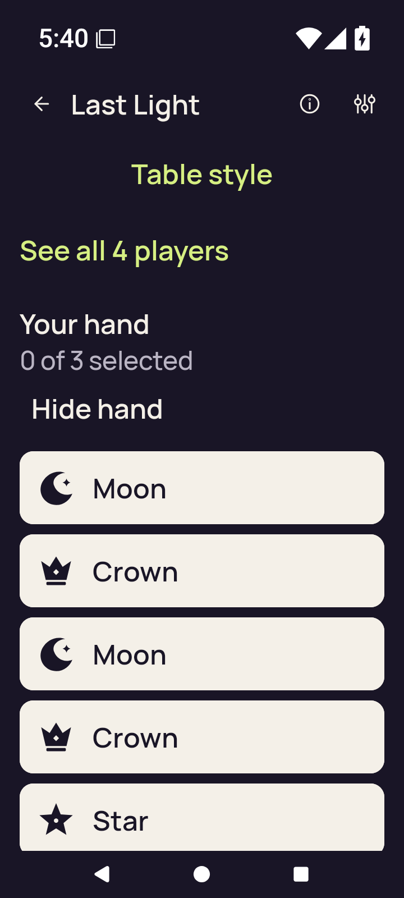</a> <code>3d-seascape-standard-return-first-card.png</code> 3d-seascape-standard-return-first-card — 3d-seascape.portrait-reentry-standard | 720 × 1600 px · 79,898 bytes · text 2.0 SHA-256: <code>3a9e548d6e7b931dd01463059416519b4c1a6c9f5c83d4b9ebdfb8e7b8d26879</code> Source: <code>/root/projects/PartyDeck/artifacts/evidence-storage/34506161751/android-adaptive-api36-optimized-test-signed-font-2.0-34506161751-1/godot-adaptive/runtime/captures/3d-seascape-standard-return-first-card.png</code> Original case outcome: **unsupported** [UI XML](runtime/captures/3d-seascape-standard-return-first-card.xml) · [Capture/result JSON](runtime/captures/3d-seascape-standard-return-first-card.json) · [Original result](runtime/godot-adaptive-result.json) | **Attributed peer direct view** by <code>/root/ui_game</code>. Portrait revealed hand with zero selected, Hide hand and five readable Moon/Crown/Star rows. All five card labels fit; the last card&#x27;s bottom edge is cut at the viewport, and play controls are below view. Five individual card identities are visible after the explicit reveal action; not a concealed-state capture. |
| <a href="runtime/captures/3d-seascape-leave-selected.png">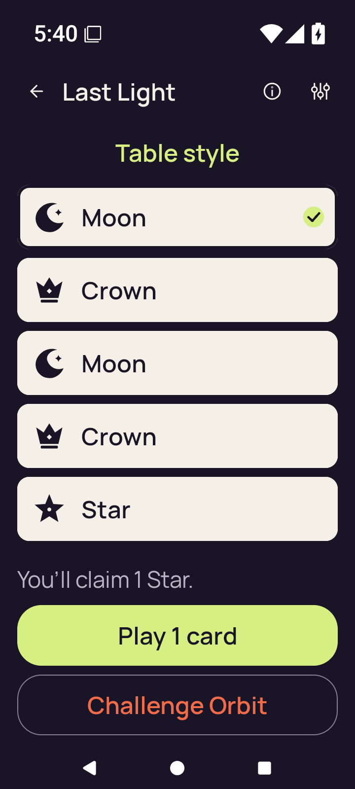</a> <code>3d-seascape-leave-selected.png</code> 3d-seascape-leave-selected — 3d-seascape.native-leave-home | 720 × 1600 px · 83,994 bytes · text 2.0 SHA-256: <code>5301e78bc60935a2435ef37077c51ee55a3c4b35c1ee0c98e7e1fbf47eb92ae0</code> Source: <code>/root/projects/PartyDeck/artifacts/evidence-storage/34506161751/android-adaptive-api36-optimized-test-signed-font-2.0-34506161751-1/godot-adaptive/runtime/captures/3d-seascape-leave-selected.png</code> Original case outcome: **unsupported** [UI XML](runtime/captures/3d-seascape-leave-selected.xml) · [Capture/result JSON](runtime/captures/3d-seascape-leave-selected.json) · [Original result](runtime/godot-adaptive-result.json) | **Attributed peer direct view** by <code>/root/ui_game</code>. Portrait first Moon card selected, five revealed card rows, one-Star claim, Play 1 card and Challenge Orbit. Selection mark, card labels and both actions fit with no visible overlap or text truncation. The deliberate selected-hand state exposes card identities. No concealment or transition claim. |
|  <code>3d-seascape-leave-selector.png</code> 3d-seascape-leave-selector — 3d-seascape.native-leave-home | 720 × 1600 px · 97,218 bytes · text 2.0 SHA-256: <code>d3862a27cf40e80e66014fd683fbc5c0824626bda13ff72b351ea54494626a14</code> Source: <code>/root/projects/PartyDeck/artifacts/evidence-storage/34506161751/android-adaptive-api36-optimized-test-signed-font-2.0-34506161751-1/godot-adaptive/runtime/captures/3d-seascape-leave-selector.png</code> Original case outcome: **unsupported** [UI XML](runtime/captures/3d-seascape-leave-selector.xml) · [Capture/result JSON](runtime/captures/3d-seascape-leave-selector.json) · [Original result](runtime/godot-adaptive-result.json) | **Attributed peer direct view** by <code>/root/ui_game</code>. Portrait Table style dialog with Standard table selected and 2D table, 3D table and Done visible. Guidance explains choosing a presentation and using Standard table with a screen reader. Complete guidance and all shown choices fit with clear separation; no visible clipping, overlap or text truncation. No individual hand card identities or invitation material visible. |
| <a href="runtime/captures/3d-seascape-leave-native-ready.png">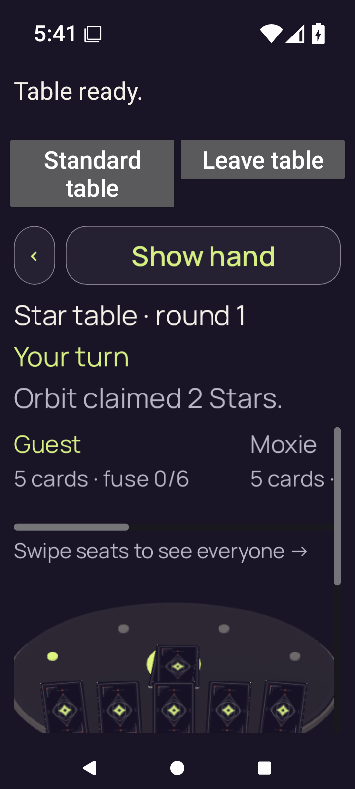</a> <code>3d-seascape-leave-native-ready.png</code> 3d-seascape-leave-native-ready — 3d-seascape.native-leave-home | 720 × 1600 px · 202,554 bytes · text 2.0 SHA-256: <code>b45805a4e6d1ea1f6c534a0d356aa85f7654dda69c291678dbcb3e5fa187dd09</code> Source: <code>/root/projects/PartyDeck/artifacts/evidence-storage/34506161751/android-adaptive-api36-optimized-test-signed-font-2.0-34506161751-1/godot-adaptive/runtime/captures/3d-seascape-leave-native-ready.png</code> Original case outcome: **unsupported** [UI XML](runtime/captures/3d-seascape-leave-native-ready.xml) · [Capture/result JSON](runtime/captures/3d-seascape-leave-native-ready.json) · [Original result](runtime/godot-adaptive-result.json) | **Attributed peer direct view** by <code>/root/ui_game</code>. Portrait Table ready with Standard table and Leave table controls, back arrow, Show hand, Star table · round 1, Your turn and Orbit claimed 2 Stars. Guest and partial Moxie seat metadata sit above a partial 3D table with five card backs and a central card back. Main controls and public claim are readable; Standard table wraps to two lines. Right seat details are partly outside the horizontal viewport, with a scrollbar and Swipe seats to see everyone cue. A vertical scrollbar is visible, and the bottom of the native table/cards lies below the viewport. Every visible card shows its back; no individual card face or rank is exposed in this still. |
|  <code>3d-seascape-leave-confirmation.png</code> 3d-seascape-leave-confirmation — 3d-seascape.native-leave-home | 720 × 1600 px · 61,478 bytes · text 2.0 SHA-256: <code>541fd0abc40a1b61b86f77f833d8b92bcc376040fd9865a1057bfc363b3264de</code> Source: <code>/root/projects/PartyDeck/artifacts/evidence-storage/34506161751/android-adaptive-api36-optimized-test-signed-font-2.0-34506161751-1/godot-adaptive/runtime/captures/3d-seascape-leave-confirmation.png</code> Original case outcome: **unsupported** [UI XML](runtime/captures/3d-seascape-leave-confirmation.xml) · [Capture/result JSON](runtime/captures/3d-seascape-leave-confirmation.json) · [Original result](runtime/godot-adaptive-result.json) | **Attributed peer direct view** by <code>/root/ui_game</code>. Portrait Leave the table? confirmation explains that the practice match will end and a fresh one can be started, with orange Leave table and green Stay at the table choices. Complete title, explanation and both choices fit with clear separation and no visible clipping. No individual hand card identities or invitation material visible. |
|  <code>3d-seascape-home.png</code> 3d-seascape-home — 3d-seascape.native-leave-home | 720 × 1600 px · 79,843 bytes · text 2.0 SHA-256: <code>59aa97a002fca6cee9f499233cc3282ba32161f06b1aa393a6a620505423dc4b</code> Source: <code>/root/projects/PartyDeck/artifacts/evidence-storage/34506161751/android-adaptive-api36-optimized-test-signed-font-2.0-34506161751-1/godot-adaptive/runtime/captures/3d-seascape-home.png</code> Original case outcome: **unsupported** [UI XML](runtime/captures/3d-seascape-home.xml) · [Capture/result JSON](runtime/captures/3d-seascape-home.json) · [Original result](runtime/godot-adaptive-result.json) | **Attributed peer direct view** by <code>/root/ui_game</code>. Portrait PartyDeck home with Last Light description, 2–6 players · Same Wi-Fi, Host a table, Join a table, Try a practice table and How to play. All shown content fits with clear primary and secondary hierarchy and ample lower space; no visible clipping. No individual hand card identities or invitation material visible. |
| <a href="runtime/captures/final-diagnostic.png">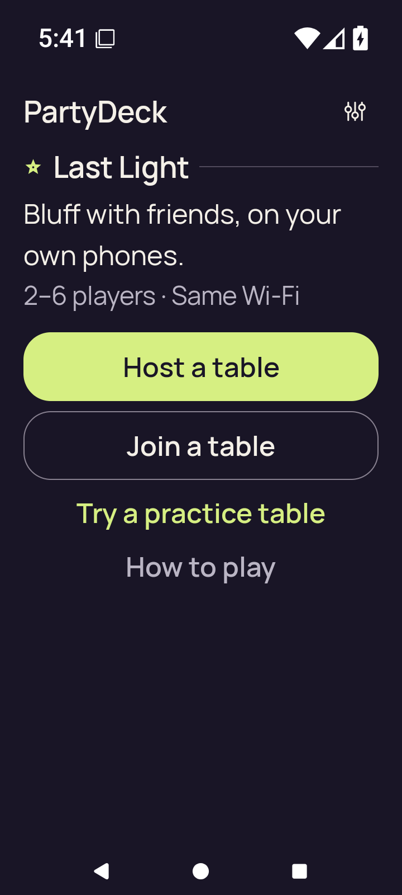</a> <code>final-diagnostic.png</code> final-diagnostic — 3d-split.support | 720 × 1600 px · 79,843 bytes · text 2.0 SHA-256: <code>59aa97a002fca6cee9f499233cc3282ba32161f06b1aa393a6a620505423dc4b</code> Source: <code>/root/projects/PartyDeck/artifacts/evidence-storage/34506161751/android-adaptive-api36-optimized-test-signed-font-2.0-34506161751-1/godot-adaptive/runtime/captures/final-diagnostic.png</code> Original case outcome: **unsupported** [UI XML](runtime/captures/final-diagnostic.xml) · [Capture/result JSON](runtime/captures/final-diagnostic.json) · [Original result](runtime/godot-adaptive-result.json) | **Exact same-batch match**. Exact bytes match the separately retained peer-viewed original at plan index 123. Reused pixel observation: Portrait PartyDeck home with Last Light description, 2–6 players · Same Wi-Fi, Host a table, Join a table, Try a practice table and How to play. All shown content fits with clear primary and secondary hierarchy and ample lower space; no visible clipping. No individual hand card identities or invitation material visible. [Reviewed matching original](runtime/captures/3d-seascape-home.png); original capture identity remains separate. |
