# API 36 debug, font 1.0

[All collections](../../../README.md) · [Preserved evidence index](../../evidence-index.md) · [Copy/review binding](../../../android-34515669045/provenance/publication-review/partydeck-gallery-3433-publication-binding-v1.json) · [Completed focused review](../../provenance/publication-review/partydeck-gallery-after-2815-adaptive34514544296-visual-review-v1.json) · [Source mapping](../../provenance/source-collection/triage/capture-publication-inventory.json)

**Original case failed at 3d-landscape.initial-landscape preparation. Named scopes: {"failed": 1, "not-reached": 13, "passed": 7, "unsupported": 3}.**

Capture-stage names, source results and recording statuses are preserved. Direct reviews are limited to named 2D checkpoints.

All 228 original capture identities remain separate. Four installations pass. Across 96 named scopes, 28 pass, four fail, 12 are unsupported and 52 are unreached. Each case fails while preparing 3d-landscape.initial-landscape after unsupported split-entry recording. No split-entry request occurred; this does not establish native 3D launch failure. Engine gameplay assertions were not invoked.

The 32 directly reviewed stills show the compact cover, full Reveal, first two complete numbered seats and fixed lower actions in normal-text portrait native-ready/leave-native-ready frames. Normal landscape shows only the upper green edge of Reveal at the body clip. At 200% in either orientation, Reveal and lower game actions remain outside the viewport. No private faces are visible in those reviewed stills. These views add no margin, zero-scroll, gameplay-completion or continuous-privacy claim.

Twelve original MP4s retain startup-unavailable-original-retained / growth-not-observed and remain unviewed and undecoded. The exact source is derived; 1,124 omitted historical gallery blobs have only remote-tree identity in the source reconstruction. The actual producer pack is `557b2297bed133a433acc25efa4837462465dd4e06da659ae5a4cbd792f77fe0` (1,549,560 bytes).

Source revision: `286b7ff11b2441daad044b57fad6fc8b6be995d0`. CI run: [34514544296](https://github.com/Apdelrahman1911/PartyDeck/actions/runs/34514544296). 57 original PNG identities. Review methods: 1 exact published-byte match, 48 unviewed original — no visual acceptance, 8 direct original view.

Every thumbnail opens the unchanged original PNG. **UNVIEWED** means no direct pixel review or visual acceptance is asserted. Matching bytes reuse only earlier pixel observations. Each source, scenario and original outcome remains separate. Frozen review plans retain their historical pending flags; the completed focused-review receipt records the final status. No new derivative image or video decoding was performed.

| Original capture | Original identity and evidence | Review status and observation |
| --- | --- | --- |
|  <code>home-cold.png</code> home-cold — emulator readiness | 720 × 1600 px · 129,669 bytes · text 1.0 SHA-256: <code>e96d4777eadaa3ea3e8ec2e29024f70b095714b5965d580ae272d86456c15a94</code> Source: <code>/root/projects/PartyDeck/artifacts/evidence-storage/34514544296/android-adaptive-api36-debug-font-1.0-34514544296-1/godot-adaptive/runtime/captures/home-cold.png</code> Original case outcome: **failed** Capture: 2026-09-10T18:38:02.142+00:00 → 2026-09-10T18:38:04.638+00:00 [UI XML](runtime/captures/home-cold.xml) · [Capture JSON](runtime/captures/home-cold.json) · [Original result](runtime/godot-adaptive-result.json) | **Exact published-byte match**. Exact original bytes match the separately published capture godot-android-adaptive-34506161751/debug/font-1.0/runtime/captures/home-cold.png. Only the existing pixel observation is reused; this capture retains its own source and failed-case outcome. [Separately published matching capture](../../../godot-android-adaptive-34506161751/debug/font-1.0/runtime/captures/home-cold.png); this capture was not directly reopened. |
|  <code>2d-landscape-baseline-public.png</code> 2d-landscape-baseline-public — 2d-landscape.initial-landscape | 1600 × 720 px · 97,918 bytes · text 1.0 SHA-256: <code>8373afa8d6a79cb074d4821a253705604de5dc3772a59284831d2ddfe771550f</code> Source: <code>/root/projects/PartyDeck/artifacts/evidence-storage/34514544296/android-adaptive-api36-debug-font-1.0-34514544296-1/godot-adaptive/runtime/captures/2d-landscape-baseline-public.png</code> Original case outcome: **failed** Capture: 2026-09-10T18:38:19.619+00:00 → 2026-09-10T18:38:22.121+00:00 [UI XML](runtime/captures/2d-landscape-baseline-public.xml) · [Capture JSON](runtime/captures/2d-landscape-baseline-public.json) · [Original result](runtime/godot-adaptive-result.json) | **UNVIEWED original — no visual acceptance**. Preserved original capture; not visually reviewed. Stage and outcome labels come from the frozen collector mapping. No pixel observation or visual acceptance is claimed. |
| <a href="runtime/captures/2d-landscape-baseline-first-card.png">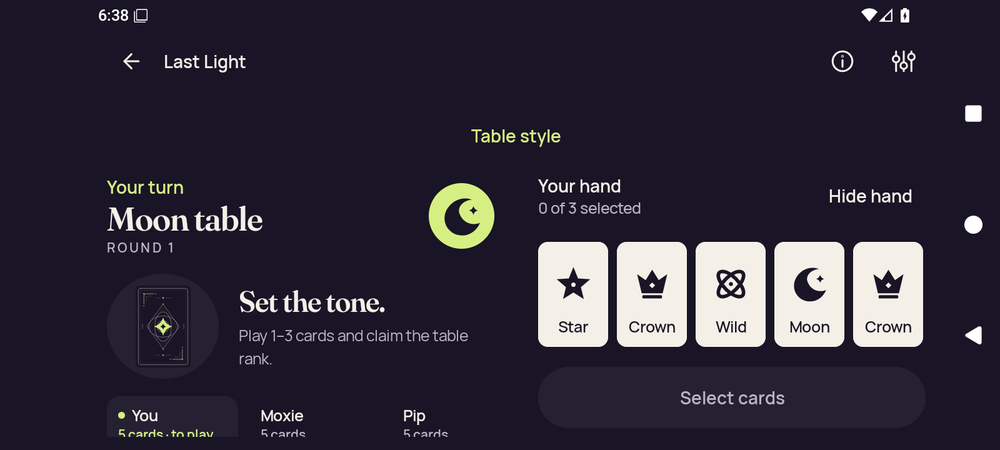</a> <code>2d-landscape-baseline-first-card.png</code> 2d-landscape-baseline-first-card — 2d-landscape.initial-landscape | 1600 × 720 px · 93,884 bytes · text 1.0 SHA-256: <code>794097d5a904c3e222325d2ece6a1d5862f027e3e5bbc2c19b9e6edd114b189b</code> Source: <code>/root/projects/PartyDeck/artifacts/evidence-storage/34514544296/android-adaptive-api36-debug-font-1.0-34514544296-1/godot-adaptive/runtime/captures/2d-landscape-baseline-first-card.png</code> Original case outcome: **failed** Capture: 2026-09-10T18:38:26.409+00:00 → 2026-09-10T18:38:28.892+00:00 [UI XML](runtime/captures/2d-landscape-baseline-first-card.xml) · [Capture JSON](runtime/captures/2d-landscape-baseline-first-card.json) · [Original result](runtime/godot-adaptive-result.json) | **UNVIEWED original — no visual acceptance**. Preserved original capture; not visually reviewed. Stage and outcome labels come from the frozen collector mapping. No pixel observation or visual acceptance is claimed. |
| <a href="runtime/captures/2d-landscape-baseline-selected.png">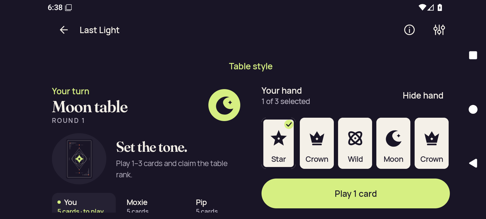</a> <code>2d-landscape-baseline-selected.png</code> 2d-landscape-baseline-selected — 2d-landscape.initial-landscape | 1600 × 720 px · 94,584 bytes · text 1.0 SHA-256: <code>cbd4050631af8002f698bbe08c5ae7c671a5e6f08ff9d82b907beff5048db158</code> Source: <code>/root/projects/PartyDeck/artifacts/evidence-storage/34514544296/android-adaptive-api36-debug-font-1.0-34514544296-1/godot-adaptive/runtime/captures/2d-landscape-baseline-selected.png</code> Original case outcome: **failed** Capture: 2026-09-10T18:38:35.382+00:00 → 2026-09-10T18:38:37.890+00:00 [UI XML](runtime/captures/2d-landscape-baseline-selected.xml) · [Capture JSON](runtime/captures/2d-landscape-baseline-selected.json) · [Original result](runtime/godot-adaptive-result.json) | **UNVIEWED original — no visual acceptance**. Preserved original capture; not visually reviewed. Stage and outcome labels come from the frozen collector mapping. No pixel observation or visual acceptance is claimed. |
|  <code>2d-landscape-initial-selector.png</code> 2d-landscape-initial-selector — 2d-landscape.initial-landscape | 1600 × 720 px · 45,276 bytes · text 1.0 SHA-256: <code>bebb8278106e12cae4f52e2092bdf94b69afca477515e1bea586674a84400f70</code> Source: <code>/root/projects/PartyDeck/artifacts/evidence-storage/34514544296/android-adaptive-api36-debug-font-1.0-34514544296-1/godot-adaptive/runtime/captures/2d-landscape-initial-selector.png</code> Original case outcome: **failed** Capture: 2026-09-10T18:38:47.586+00:00 → 2026-09-10T18:38:50.053+00:00 [UI XML](runtime/captures/2d-landscape-initial-selector.xml) · [Capture JSON](runtime/captures/2d-landscape-initial-selector.json) · [Original result](runtime/godot-adaptive-result.json) | **UNVIEWED original — no visual acceptance**. Preserved original capture; not visually reviewed. Stage and outcome labels come from the frozen collector mapping. No pixel observation or visual acceptance is claimed. |
|  <code>2d-landscape-initial-native-ready.png</code> 2d-landscape-initial-native-ready — 2d-landscape.initial-landscape | 1600 × 720 px · 102,967 bytes · text 1.0 SHA-256: <code>8801926fe7bf07c6e25ccb506bef4d0b56068baf88903ad5fa6ea6dd70923f7d</code> Source: <code>/root/projects/PartyDeck/artifacts/evidence-storage/34514544296/android-adaptive-api36-debug-font-1.0-34514544296-1/godot-adaptive/runtime/captures/2d-landscape-initial-native-ready.png</code> Original case outcome: **failed** Capture: 2026-09-10T18:38:58.606+00:00 → 2026-09-10T18:39:01.079+00:00 [UI XML](runtime/captures/2d-landscape-initial-native-ready.xml) · [Capture JSON](runtime/captures/2d-landscape-initial-native-ready.json) · [Original result](runtime/godot-adaptive-result.json) | **Direct original view**. Your turn · Moon table is visible and both lower actions appear disabled. Android navigation is on the right. In this normal-text landscape native-ready still, Table ready, Standard table/Leave table, Exit/Last Light and the single-line public turn context fit. The covered-hand panel shows card-back artwork, the five-card headline and explanatory copy. Only the upper green edge of Reveal appears above the body clip; its label and the rest of the cover are hidden. Both fixed lower actions fit. No private card face is visible; the still does not prove gameplay or continuous privacy. |
| <a href="runtime/captures/2d-landscape-unsupported-return-concealed.png">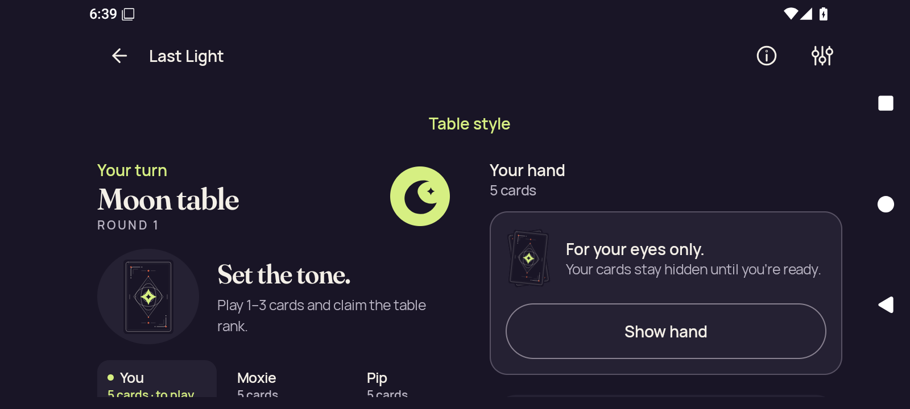</a> <code>2d-landscape-unsupported-return-concealed.png</code> 2d-landscape-unsupported-return-concealed — 2d-landscape.held-rotation | 1600 × 720 px · 97,999 bytes · text 1.0 SHA-256: <code>b1413c9d9b8ca20780fb033cdea926234e139d57e9ac32c736b51807807ccb57</code> Source: <code>/root/projects/PartyDeck/artifacts/evidence-storage/34514544296/android-adaptive-api36-debug-font-1.0-34514544296-1/godot-adaptive/runtime/captures/2d-landscape-unsupported-return-concealed.png</code> Original case outcome: **failed** Capture: 2026-09-10T18:39:21.639+00:00 → 2026-09-10T18:39:24.137+00:00 [UI XML](runtime/captures/2d-landscape-unsupported-return-concealed.xml) · [Capture JSON](runtime/captures/2d-landscape-unsupported-return-concealed.json) · [Original result](runtime/godot-adaptive-result.json) | **UNVIEWED original — no visual acceptance**. Preserved original capture; not visually reviewed. Stage and outcome labels come from the frozen collector mapping. No pixel observation or visual acceptance is claimed. |
|  <code>2d-landscape-unsupported-return-selection-cleared.png</code> 2d-landscape-unsupported-return-selection-cleared — 2d-landscape.held-rotation | 1600 × 720 px · 97,722 bytes · text 1.0 SHA-256: <code>a6713a3bf89972fb2515c3415e0e83c1f2879d7fa09e822f724b299d6238096a</code> Source: <code>/root/projects/PartyDeck/artifacts/evidence-storage/34514544296/android-adaptive-api36-debug-font-1.0-34514544296-1/godot-adaptive/runtime/captures/2d-landscape-unsupported-return-selection-cleared.png</code> Original case outcome: **failed** Capture: 2026-09-10T18:39:29.093+00:00 → 2026-09-10T18:39:31.582+00:00 [UI XML](runtime/captures/2d-landscape-unsupported-return-selection-cleared.xml) · [Capture JSON](runtime/captures/2d-landscape-unsupported-return-selection-cleared.json) · [Original result](runtime/godot-adaptive-result.json) | **UNVIEWED original — no visual acceptance**. Preserved original capture; not visually reviewed. Stage and outcome labels come from the frozen collector mapping. No pixel observation or visual acceptance is claimed. |
| <a href="runtime/captures/2d-landscape-unsupported-return-public.png">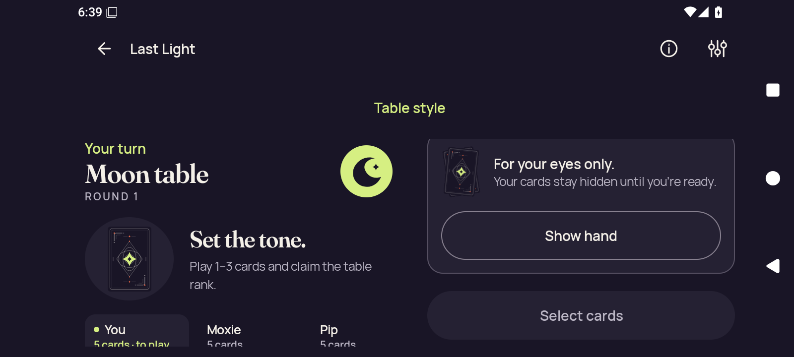</a> <code>2d-landscape-unsupported-return-public.png</code> 2d-landscape-unsupported-return-public — 2d-landscape.held-rotation | 1600 × 720 px · 97,722 bytes · text 1.0 SHA-256: <code>a6713a3bf89972fb2515c3415e0e83c1f2879d7fa09e822f724b299d6238096a</code> Source: <code>/root/projects/PartyDeck/artifacts/evidence-storage/34514544296/android-adaptive-api36-debug-font-1.0-34514544296-1/godot-adaptive/runtime/captures/2d-landscape-unsupported-return-public.png</code> Original case outcome: **failed** Capture: 2026-09-10T18:39:33.683+00:00 → 2026-09-10T18:39:36.211+00:00 [UI XML](runtime/captures/2d-landscape-unsupported-return-public.xml) · [Capture JSON](runtime/captures/2d-landscape-unsupported-return-public.json) · [Original result](runtime/godot-adaptive-result.json) | **UNVIEWED original — no visual acceptance**. Preserved original capture; not visually reviewed. Stage and outcome labels come from the frozen collector mapping. No pixel observation or visual acceptance is claimed. |
|  <code>2d-landscape-unsupported-return-first-card.png</code> 2d-landscape-unsupported-return-first-card — 2d-landscape.held-rotation | 1600 × 720 px · 93,672 bytes · text 1.0 SHA-256: <code>7043d38e0bcfac0ece2bc9696250cba6aba688554679623abd4f00e21e19626d</code> Source: <code>/root/projects/PartyDeck/artifacts/evidence-storage/34514544296/android-adaptive-api36-debug-font-1.0-34514544296-1/godot-adaptive/runtime/captures/2d-landscape-unsupported-return-first-card.png</code> Original case outcome: **failed** Capture: 2026-09-10T18:39:40.466+00:00 → 2026-09-10T18:39:42.950+00:00 [UI XML](runtime/captures/2d-landscape-unsupported-return-first-card.xml) · [Capture JSON](runtime/captures/2d-landscape-unsupported-return-first-card.json) · [Original result](runtime/godot-adaptive-result.json) | **UNVIEWED original — no visual acceptance**. Preserved original capture; not visually reviewed. Stage and outcome labels come from the frozen collector mapping. No pixel observation or visual acceptance is claimed. |
|  <code>2d-landscape-unsupported-portrait-return-concealed.png</code> 2d-landscape-unsupported-portrait-return-concealed — 2d-landscape.held-rotation | 720 × 1600 px · 110,056 bytes · text 1.0 SHA-256: <code>06b2ba6b97cdc4d91007e22b93282412078806ca67aca05bae7493980f832e17</code> Source: <code>/root/projects/PartyDeck/artifacts/evidence-storage/34514544296/android-adaptive-api36-debug-font-1.0-34514544296-1/godot-adaptive/runtime/captures/2d-landscape-unsupported-portrait-return-concealed.png</code> Original case outcome: **failed** Capture: 2026-09-10T18:39:48.519+00:00 → 2026-09-10T18:39:51.006+00:00 [UI XML](runtime/captures/2d-landscape-unsupported-portrait-return-concealed.xml) · [Capture JSON](runtime/captures/2d-landscape-unsupported-portrait-return-concealed.json) · [Original result](runtime/godot-adaptive-result.json) | **UNVIEWED original — no visual acceptance**. Preserved original capture; not visually reviewed. Stage and outcome labels come from the frozen collector mapping. No pixel observation or visual acceptance is claimed. |
|  <code>2d-landscape-unsupported-portrait-return-selection-cleared.png</code> 2d-landscape-unsupported-portrait-return-selection-cleared — 2d-landscape.held-rotation | 720 × 1600 px · 110,056 bytes · text 1.0 SHA-256: <code>06b2ba6b97cdc4d91007e22b93282412078806ca67aca05bae7493980f832e17</code> Source: <code>/root/projects/PartyDeck/artifacts/evidence-storage/34514544296/android-adaptive-api36-debug-font-1.0-34514544296-1/godot-adaptive/runtime/captures/2d-landscape-unsupported-portrait-return-selection-cleared.png</code> Original case outcome: **failed** Capture: 2026-09-10T18:39:53.084+00:00 → 2026-09-10T18:39:55.591+00:00 [UI XML](runtime/captures/2d-landscape-unsupported-portrait-return-selection-cleared.xml) · [Capture JSON](runtime/captures/2d-landscape-unsupported-portrait-return-selection-cleared.json) · [Original result](runtime/godot-adaptive-result.json) | **UNVIEWED original — no visual acceptance**. Preserved original capture; not visually reviewed. Stage and outcome labels come from the frozen collector mapping. No pixel observation or visual acceptance is claimed. |
|  <code>2d-landscape-unsupported-portrait-return-public.png</code> 2d-landscape-unsupported-portrait-return-public — 2d-landscape.held-rotation | 720 × 1600 px · 110,056 bytes · text 1.0 SHA-256: <code>06b2ba6b97cdc4d91007e22b93282412078806ca67aca05bae7493980f832e17</code> Source: <code>/root/projects/PartyDeck/artifacts/evidence-storage/34514544296/android-adaptive-api36-debug-font-1.0-34514544296-1/godot-adaptive/runtime/captures/2d-landscape-unsupported-portrait-return-public.png</code> Original case outcome: **failed** Capture: 2026-09-10T18:39:57.693+00:00 → 2026-09-10T18:40:00.194+00:00 [UI XML](runtime/captures/2d-landscape-unsupported-portrait-return-public.xml) · [Capture JSON](runtime/captures/2d-landscape-unsupported-portrait-return-public.json) · [Original result](runtime/godot-adaptive-result.json) | **UNVIEWED original — no visual acceptance**. Preserved original capture; not visually reviewed. Stage and outcome labels come from the frozen collector mapping. No pixel observation or visual acceptance is claimed. |
| <a href="runtime/captures/2d-landscape-unsupported-portrait-return-first-card.png">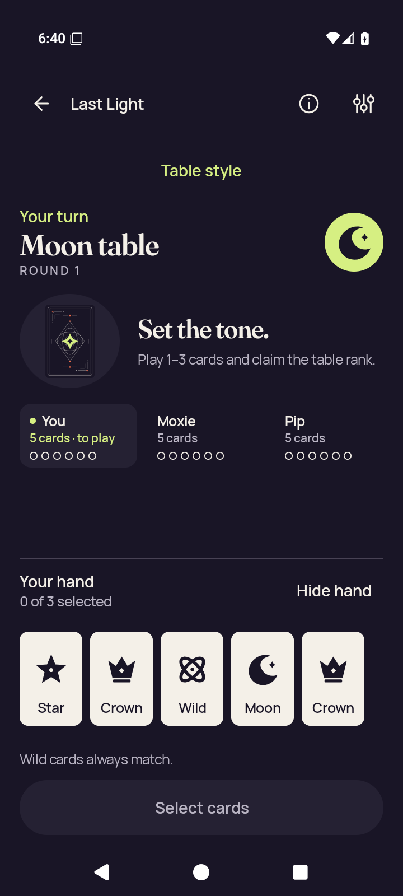</a> <code>2d-landscape-unsupported-portrait-return-first-card.png</code> 2d-landscape-unsupported-portrait-return-first-card — 2d-landscape.held-rotation | 720 × 1600 px · 107,949 bytes · text 1.0 SHA-256: <code>1adae0fe037e81b94f93127ded29ac43fdb47c4be22ee7c5d084d9ad4cc32dbf</code> Source: <code>/root/projects/PartyDeck/artifacts/evidence-storage/34514544296/android-adaptive-api36-debug-font-1.0-34514544296-1/godot-adaptive/runtime/captures/2d-landscape-unsupported-portrait-return-first-card.png</code> Original case outcome: **failed** Capture: 2026-09-10T18:40:04.448+00:00 → 2026-09-10T18:40:06.971+00:00 [UI XML](runtime/captures/2d-landscape-unsupported-portrait-return-first-card.xml) · [Capture JSON](runtime/captures/2d-landscape-unsupported-portrait-return-first-card.json) · [Original result](runtime/godot-adaptive-result.json) | **UNVIEWED original — no visual acceptance**. Preserved original capture; not visually reviewed. Stage and outcome labels come from the frozen collector mapping. No pixel observation or visual acceptance is claimed. |
| <a href="runtime/captures/2d-landscape-reentry-selected.png">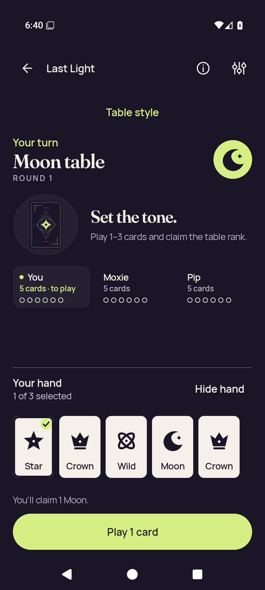</a> <code>2d-landscape-reentry-selected.png</code> 2d-landscape-reentry-selected — 2d-landscape.portrait-reentry-standard | 720 × 1600 px · 107,166 bytes · text 1.0 SHA-256: <code>7ba204f2159acb620ddf3911a400534770a47635ea501e1cb83b8a141017a421</code> Source: <code>/root/projects/PartyDeck/artifacts/evidence-storage/34514544296/android-adaptive-api36-debug-font-1.0-34514544296-1/godot-adaptive/runtime/captures/2d-landscape-reentry-selected.png</code> Original case outcome: **failed** Capture: 2026-09-10T18:40:13.476+00:00 → 2026-09-10T18:40:15.990+00:00 [UI XML](runtime/captures/2d-landscape-reentry-selected.xml) · [Capture JSON](runtime/captures/2d-landscape-reentry-selected.json) · [Original result](runtime/godot-adaptive-result.json) | **UNVIEWED original — no visual acceptance**. Preserved original capture; not visually reviewed. Stage and outcome labels come from the frozen collector mapping. No pixel observation or visual acceptance is claimed. |
|  <code>2d-landscape-portrait-selector.png</code> 2d-landscape-portrait-selector — 2d-landscape.portrait-reentry-standard | 720 × 1600 px · 58,494 bytes · text 1.0 SHA-256: <code>7063d33ad2fa6ab5ec495d56fd80504b9a72998adc0f9b323e69ab2c2043f894</code> Source: <code>/root/projects/PartyDeck/artifacts/evidence-storage/34514544296/android-adaptive-api36-debug-font-1.0-34514544296-1/godot-adaptive/runtime/captures/2d-landscape-portrait-selector.png</code> Original case outcome: **failed** Capture: 2026-09-10T18:40:22.784+00:00 → 2026-09-10T18:40:25.292+00:00 [UI XML](runtime/captures/2d-landscape-portrait-selector.xml) · [Capture JSON](runtime/captures/2d-landscape-portrait-selector.json) · [Original result](runtime/godot-adaptive-result.json) | **UNVIEWED original — no visual acceptance**. Preserved original capture; not visually reviewed. Stage and outcome labels come from the frozen collector mapping. No pixel observation or visual acceptance is claimed. |
| <a href="runtime/captures/2d-landscape-portrait-native-ready.png">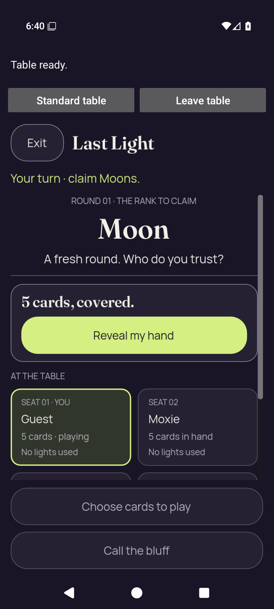</a> <code>2d-landscape-portrait-native-ready.png</code> 2d-landscape-portrait-native-ready — 2d-landscape.portrait-reentry-standard | 720 × 1600 px · 152,739 bytes · text 1.0 SHA-256: <code>1e74d0b4408b576dc91697ed5c41d5ff9219ae386640ded4045faf37514f9e6e</code> Source: <code>/root/projects/PartyDeck/artifacts/evidence-storage/34514544296/android-adaptive-api36-debug-font-1.0-34514544296-1/godot-adaptive/runtime/captures/2d-landscape-portrait-native-ready.png</code> Original case outcome: **failed** Capture: 2026-09-10T18:40:33.899+00:00 → 2026-09-10T18:40:36.410+00:00 [UI XML](runtime/captures/2d-landscape-portrait-native-ready.xml) · [Capture JSON](runtime/captures/2d-landscape-portrait-native-ready.json) · [Original result](runtime/godot-adaptive-result.json) | **Direct original view**. Round 01, Moon, Your turn · claim Moons. and A fresh round. Who do you trust? are visible. Both lower actions appear disabled. Full Table ready, Standard table and Leave table chrome, Exit/Last Light, and turn/rank/public context are visible. The complete compact cover and full Reveal my hand button fit with separation before the first two complete numbered seats, Guest and Moxie; the next seat-row upper edges meet the lower body clip. Full fixed lower game actions are visible. No private card face is visible. This normal-text 720×1600 native-ready still does not measure native margins, initial scroll position, gameplay completion or continuous privacy. |
|  <code>2d-landscape-standard-return-concealed.png</code> 2d-landscape-standard-return-concealed — 2d-landscape.portrait-reentry-standard | 720 × 1600 px · 109,789 bytes · text 1.0 SHA-256: <code>554541c02d3268f1c6d88e9434744324a1dfc1577b5fabbd96633561cd566a77</code> Source: <code>/root/projects/PartyDeck/artifacts/evidence-storage/34514544296/android-adaptive-api36-debug-font-1.0-34514544296-1/godot-adaptive/runtime/captures/2d-landscape-standard-return-concealed.png</code> Original case outcome: **failed** Capture: 2026-09-10T18:40:44.049+00:00 → 2026-09-10T18:40:46.579+00:00 [UI XML](runtime/captures/2d-landscape-standard-return-concealed.xml) · [Capture JSON](runtime/captures/2d-landscape-standard-return-concealed.json) · [Original result](runtime/godot-adaptive-result.json) | **UNVIEWED original — no visual acceptance**. Preserved original capture; not visually reviewed. Stage and outcome labels come from the frozen collector mapping. No pixel observation or visual acceptance is claimed. |
| <a href="runtime/captures/2d-landscape-standard-return-selection-cleared.png">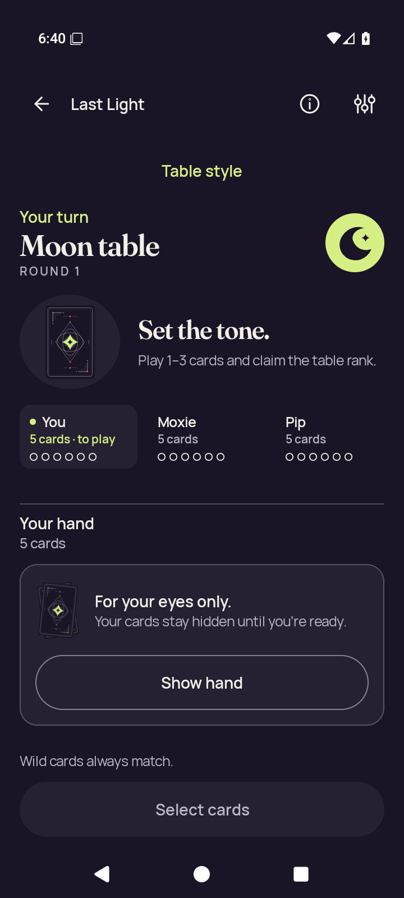</a> <code>2d-landscape-standard-return-selection-cleared.png</code> 2d-landscape-standard-return-selection-cleared — 2d-landscape.portrait-reentry-standard | 720 × 1600 px · 109,789 bytes · text 1.0 SHA-256: <code>554541c02d3268f1c6d88e9434744324a1dfc1577b5fabbd96633561cd566a77</code> Source: <code>/root/projects/PartyDeck/artifacts/evidence-storage/34514544296/android-adaptive-api36-debug-font-1.0-34514544296-1/godot-adaptive/runtime/captures/2d-landscape-standard-return-selection-cleared.png</code> Original case outcome: **failed** Capture: 2026-09-10T18:40:48.658+00:00 → 2026-09-10T18:40:51.147+00:00 [UI XML](runtime/captures/2d-landscape-standard-return-selection-cleared.xml) · [Capture JSON](runtime/captures/2d-landscape-standard-return-selection-cleared.json) · [Original result](runtime/godot-adaptive-result.json) | **UNVIEWED original — no visual acceptance**. Preserved original capture; not visually reviewed. Stage and outcome labels come from the frozen collector mapping. No pixel observation or visual acceptance is claimed. |
|  <code>2d-landscape-standard-return-public.png</code> 2d-landscape-standard-return-public — 2d-landscape.portrait-reentry-standard | 720 × 1600 px · 109,789 bytes · text 1.0 SHA-256: <code>554541c02d3268f1c6d88e9434744324a1dfc1577b5fabbd96633561cd566a77</code> Source: <code>/root/projects/PartyDeck/artifacts/evidence-storage/34514544296/android-adaptive-api36-debug-font-1.0-34514544296-1/godot-adaptive/runtime/captures/2d-landscape-standard-return-public.png</code> Original case outcome: **failed** Capture: 2026-09-10T18:40:53.224+00:00 → 2026-09-10T18:40:55.705+00:00 [UI XML](runtime/captures/2d-landscape-standard-return-public.xml) · [Capture JSON](runtime/captures/2d-landscape-standard-return-public.json) · [Original result](runtime/godot-adaptive-result.json) | **UNVIEWED original — no visual acceptance**. Preserved original capture; not visually reviewed. Stage and outcome labels come from the frozen collector mapping. No pixel observation or visual acceptance is claimed. |
|  <code>2d-landscape-standard-return-first-card.png</code> 2d-landscape-standard-return-first-card — 2d-landscape.portrait-reentry-standard | 720 × 1600 px · 107,595 bytes · text 1.0 SHA-256: <code>87de334fe32fcbb397a0a5e1b46693e27ce5642858f08c26130b96a58875ce0d</code> Source: <code>/root/projects/PartyDeck/artifacts/evidence-storage/34514544296/android-adaptive-api36-debug-font-1.0-34514544296-1/godot-adaptive/runtime/captures/2d-landscape-standard-return-first-card.png</code> Original case outcome: **failed** Capture: 2026-09-10T18:40:59.950+00:00 → 2026-09-10T18:41:02.486+00:00 [UI XML](runtime/captures/2d-landscape-standard-return-first-card.xml) · [Capture JSON](runtime/captures/2d-landscape-standard-return-first-card.json) · [Original result](runtime/godot-adaptive-result.json) | **UNVIEWED original — no visual acceptance**. Preserved original capture; not visually reviewed. Stage and outcome labels come from the frozen collector mapping. No pixel observation or visual acceptance is claimed. |
|  <code>2d-landscape-leave-selected.png</code> 2d-landscape-leave-selected — 2d-landscape.native-leave-home | 720 × 1600 px · 106,696 bytes · text 1.0 SHA-256: <code>0d2d596234755d6561fea2051534f512e9c267c31a4cb0e85d45657430f99aab</code> Source: <code>/root/projects/PartyDeck/artifacts/evidence-storage/34514544296/android-adaptive-api36-debug-font-1.0-34514544296-1/godot-adaptive/runtime/captures/2d-landscape-leave-selected.png</code> Original case outcome: **failed** Capture: 2026-09-10T18:41:08.933+00:00 → 2026-09-10T18:41:11.428+00:00 [UI XML](runtime/captures/2d-landscape-leave-selected.xml) · [Capture JSON](runtime/captures/2d-landscape-leave-selected.json) · [Original result](runtime/godot-adaptive-result.json) | **UNVIEWED original — no visual acceptance**. Preserved original capture; not visually reviewed. Stage and outcome labels come from the frozen collector mapping. No pixel observation or visual acceptance is claimed. |
| <a href="runtime/captures/2d-landscape-leave-selector.png">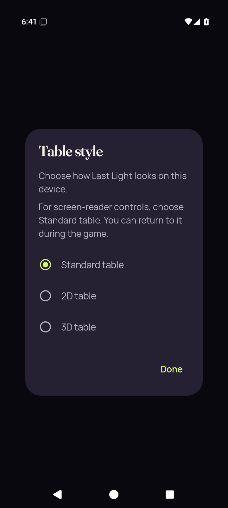</a> <code>2d-landscape-leave-selector.png</code> 2d-landscape-leave-selector — 2d-landscape.native-leave-home | 720 × 1600 px · 57,973 bytes · text 1.0 SHA-256: <code>c4e1a44ab05f3795e42e745201db916280e22dc5e821ea6c6cb9ea04017e4290</code> Source: <code>/root/projects/PartyDeck/artifacts/evidence-storage/34514544296/android-adaptive-api36-debug-font-1.0-34514544296-1/godot-adaptive/runtime/captures/2d-landscape-leave-selector.png</code> Original case outcome: **failed** Capture: 2026-09-10T18:41:18.167+00:00 → 2026-09-10T18:41:20.650+00:00 [UI XML](runtime/captures/2d-landscape-leave-selector.xml) · [Capture JSON](runtime/captures/2d-landscape-leave-selector.json) · [Original result](runtime/godot-adaptive-result.json) | **UNVIEWED original — no visual acceptance**. Preserved original capture; not visually reviewed. Stage and outcome labels come from the frozen collector mapping. No pixel observation or visual acceptance is claimed. |
|  <code>2d-landscape-leave-native-ready.png</code> 2d-landscape-leave-native-ready — 2d-landscape.native-leave-home | 720 × 1600 px · 152,137 bytes · text 1.0 SHA-256: <code>c2448fb712a41b6a99f512f6b5fcd14124e24c1d8cdec507406d96344113c8bc</code> Source: <code>/root/projects/PartyDeck/artifacts/evidence-storage/34514544296/android-adaptive-api36-debug-font-1.0-34514544296-1/godot-adaptive/runtime/captures/2d-landscape-leave-native-ready.png</code> Original case outcome: **failed** Capture: 2026-09-10T18:41:29.257+00:00 → 2026-09-10T18:41:31.747+00:00 [UI XML](runtime/captures/2d-landscape-leave-native-ready.xml) · [Capture JSON](runtime/captures/2d-landscape-leave-native-ready.json) · [Original result](runtime/godot-adaptive-result.json) | **Direct original view**. Round 01, Moon and A fresh round. Who do you trust? are visible. Both lower game actions appear disabled. Full Table ready, Standard table and Leave table chrome, Exit/Last Light and turn context fit. The compact five-card cover and complete Reveal my hand button are visible above two complete Guest/Moxie seat panels; upper edges of the next seat row meet the body clip. Fixed lower actions fit. No private card face is visible. This portrait leave-native-ready still preserves its source identity and does not establish later leaving, initial scroll position or continuous privacy. |
|  <code>2d-landscape-leave-confirmation.png</code> 2d-landscape-leave-confirmation — 2d-landscape.native-leave-home | 720 × 1600 px · 40,657 bytes · text 1.0 SHA-256: <code>976b0ba14218fac7092f3a258d4ae4cb8bc037d2366763bf9c2707e8207d9f72</code> Source: <code>/root/projects/PartyDeck/artifacts/evidence-storage/34514544296/android-adaptive-api36-debug-font-1.0-34514544296-1/godot-adaptive/runtime/captures/2d-landscape-leave-confirmation.png</code> Original case outcome: **failed** Capture: 2026-09-10T18:41:39.210+00:00 → 2026-09-10T18:41:41.685+00:00 [UI XML](runtime/captures/2d-landscape-leave-confirmation.xml) · [Capture JSON](runtime/captures/2d-landscape-leave-confirmation.json) · [Original result](runtime/godot-adaptive-result.json) | **UNVIEWED original — no visual acceptance**. Preserved original capture; not visually reviewed. Stage and outcome labels come from the frozen collector mapping. No pixel observation or visual acceptance is claimed. |
|  <code>2d-landscape-home.png</code> 2d-landscape-home — 2d-landscape.native-leave-home | 720 × 1600 px · 131,706 bytes · text 1.0 SHA-256: <code>e24e26c938b33e8ef12010c6db08737939af5da6791c4b8965603b10d6382770</code> Source: <code>/root/projects/PartyDeck/artifacts/evidence-storage/34514544296/android-adaptive-api36-debug-font-1.0-34514544296-1/godot-adaptive/runtime/captures/2d-landscape-home.png</code> Original case outcome: **failed** Capture: 2026-09-10T18:41:46.279+00:00 → 2026-09-10T18:41:48.780+00:00 [UI XML](runtime/captures/2d-landscape-home.xml) · [Capture JSON](runtime/captures/2d-landscape-home.json) · [Original result](runtime/godot-adaptive-result.json) | **UNVIEWED original — no visual acceptance**. Preserved original capture; not visually reviewed. Stage and outcome labels come from the frozen collector mapping. No pixel observation or visual acceptance is claimed. |
|  <code>2d-seascape-baseline-public.png</code> 2d-seascape-baseline-public — 2d-seascape.initial-landscape | 1600 × 720 px · 116,633 bytes · text 1.0 SHA-256: <code>7e7079fe7945cd4bce493c38774ec27cc5085e79dcac55da3badfc22d77d0d4b</code> Source: <code>/root/projects/PartyDeck/artifacts/evidence-storage/34514544296/android-adaptive-api36-debug-font-1.0-34514544296-1/godot-adaptive/runtime/captures/2d-seascape-baseline-public.png</code> Original case outcome: **failed** Capture: 2026-09-10T18:42:19.545+00:00 → 2026-09-10T18:42:22.033+00:00 [UI XML](runtime/captures/2d-seascape-baseline-public.xml) · [Capture JSON](runtime/captures/2d-seascape-baseline-public.json) · [Original result](runtime/godot-adaptive-result.json) | **UNVIEWED original — no visual acceptance**. Preserved original capture; not visually reviewed. Stage and outcome labels come from the frozen collector mapping. No pixel observation or visual acceptance is claimed. |
|  <code>2d-seascape-baseline-first-card.png</code> 2d-seascape-baseline-first-card — 2d-seascape.initial-landscape | 1600 × 720 px · 110,240 bytes · text 1.0 SHA-256: <code>ef3c68db102d6250cf24ee246ef2a6af0f04c856fe3f5a1aacec713764d28796</code> Source: <code>/root/projects/PartyDeck/artifacts/evidence-storage/34514544296/android-adaptive-api36-debug-font-1.0-34514544296-1/godot-adaptive/runtime/captures/2d-seascape-baseline-first-card.png</code> Original case outcome: **failed** Capture: 2026-09-10T18:42:26.270+00:00 → 2026-09-10T18:42:28.767+00:00 [UI XML](runtime/captures/2d-seascape-baseline-first-card.xml) · [Capture JSON](runtime/captures/2d-seascape-baseline-first-card.json) · [Original result](runtime/godot-adaptive-result.json) | **UNVIEWED original — no visual acceptance**. Preserved original capture; not visually reviewed. Stage and outcome labels come from the frozen collector mapping. No pixel observation or visual acceptance is claimed. |
| <a href="runtime/captures/2d-seascape-baseline-selected.png">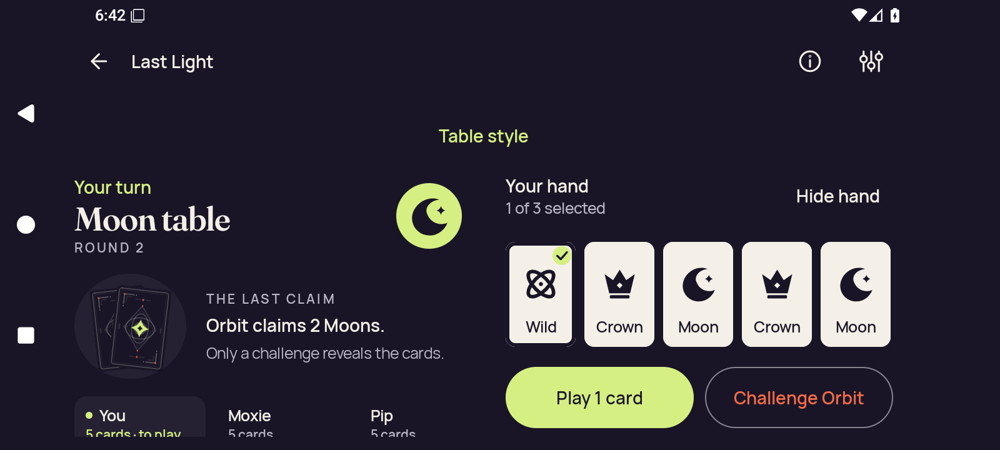</a> <code>2d-seascape-baseline-selected.png</code> 2d-seascape-baseline-selected — 2d-seascape.initial-landscape | 1600 × 720 px · 111,202 bytes · text 1.0 SHA-256: <code>8150ad6396d58920981665106e9f9ed90b41329e2f71f0685c0452fe7e7ea5f1</code> Source: <code>/root/projects/PartyDeck/artifacts/evidence-storage/34514544296/android-adaptive-api36-debug-font-1.0-34514544296-1/godot-adaptive/runtime/captures/2d-seascape-baseline-selected.png</code> Original case outcome: **failed** Capture: 2026-09-10T18:42:35.191+00:00 → 2026-09-10T18:42:37.667+00:00 [UI XML](runtime/captures/2d-seascape-baseline-selected.xml) · [Capture JSON](runtime/captures/2d-seascape-baseline-selected.json) · [Original result](runtime/godot-adaptive-result.json) | **UNVIEWED original — no visual acceptance**. Preserved original capture; not visually reviewed. Stage and outcome labels come from the frozen collector mapping. No pixel observation or visual acceptance is claimed. |
| <a href="runtime/captures/2d-seascape-initial-selector.png">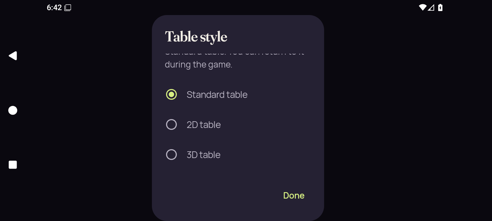</a> <code>2d-seascape-initial-selector.png</code> 2d-seascape-initial-selector — 2d-seascape.initial-landscape | 1600 × 720 px · 40,937 bytes · text 1.0 SHA-256: <code>c49d3c20ff07fd53e2c5774de42ed32b1585a9bce8034a22e31e6e5e58164f81</code> Source: <code>/root/projects/PartyDeck/artifacts/evidence-storage/34514544296/android-adaptive-api36-debug-font-1.0-34514544296-1/godot-adaptive/runtime/captures/2d-seascape-initial-selector.png</code> Original case outcome: **failed** Capture: 2026-09-10T18:42:47.433+00:00 → 2026-09-10T18:42:49.902+00:00 [UI XML](runtime/captures/2d-seascape-initial-selector.xml) · [Capture JSON](runtime/captures/2d-seascape-initial-selector.json) · [Original result](runtime/godot-adaptive-result.json) | **UNVIEWED original — no visual acceptance**. Preserved original capture; not visually reviewed. Stage and outcome labels come from the frozen collector mapping. No pixel observation or visual acceptance is claimed. |
| <a href="runtime/captures/2d-seascape-initial-native-ready.png">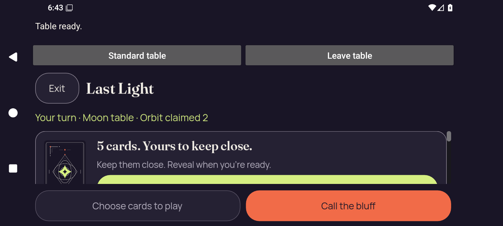</a> <code>2d-seascape-initial-native-ready.png</code> 2d-seascape-initial-native-ready — 2d-seascape.initial-landscape | 1600 × 720 px · 109,183 bytes · text 1.0 SHA-256: <code>2c8b1fe9a15b370bc4caf5b126df2b5cad30a566a3642775dd9786e2ab97b2ab</code> Source: <code>/root/projects/PartyDeck/artifacts/evidence-storage/34514544296/android-adaptive-api36-debug-font-1.0-34514544296-1/godot-adaptive/runtime/captures/2d-seascape-initial-native-ready.png</code> Original case outcome: **failed** Capture: 2026-09-10T18:42:58.972+00:00 → 2026-09-10T18:43:01.465+00:00 [UI XML](runtime/captures/2d-seascape-initial-native-ready.xml) · [Capture JSON](runtime/captures/2d-seascape-initial-native-ready.json) · [Original result](runtime/godot-adaptive-result.json) | **Direct original view**. Your turn · Moon table · Orbit claimed 2 is visible. Choose cards appears disabled; Call the bluff is orange. Android navigation is on the left in the seascape capture. In this normal-text landscape native-ready still, Table ready, Standard table/Leave table, Exit/Last Light and the single-line public turn context fit. The covered-hand panel shows card-back artwork, the five-card headline and explanatory copy. Only the upper green edge of Reveal appears above the body clip; its label and the rest of the cover are hidden. Both fixed lower actions fit. No private card face is visible; the still does not prove gameplay or continuous privacy. |
| <a href="runtime/captures/2d-seascape-unsupported-return-concealed.png">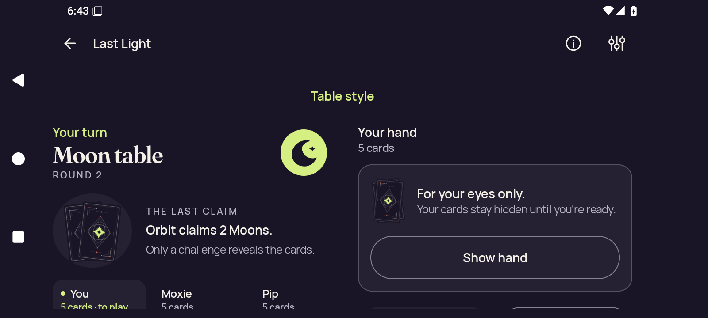</a> <code>2d-seascape-unsupported-return-concealed.png</code> 2d-seascape-unsupported-return-concealed — 2d-seascape.held-rotation | 1600 × 720 px · 109,944 bytes · text 1.0 SHA-256: <code>cd045eea8789165385ade5499ebbbc9589cf1a888f3e637f74dc8d0e79d604d6</code> Source: <code>/root/projects/PartyDeck/artifacts/evidence-storage/34514544296/android-adaptive-api36-debug-font-1.0-34514544296-1/godot-adaptive/runtime/captures/2d-seascape-unsupported-return-concealed.png</code> Original case outcome: **failed** Capture: 2026-09-10T18:43:21.743+00:00 → 2026-09-10T18:43:24.228+00:00 [UI XML](runtime/captures/2d-seascape-unsupported-return-concealed.xml) · [Capture JSON](runtime/captures/2d-seascape-unsupported-return-concealed.json) · [Original result](runtime/godot-adaptive-result.json) | **UNVIEWED original — no visual acceptance**. Preserved original capture; not visually reviewed. Stage and outcome labels come from the frozen collector mapping. No pixel observation or visual acceptance is claimed. |
| <a href="runtime/captures/2d-seascape-unsupported-return-selection-cleared.png">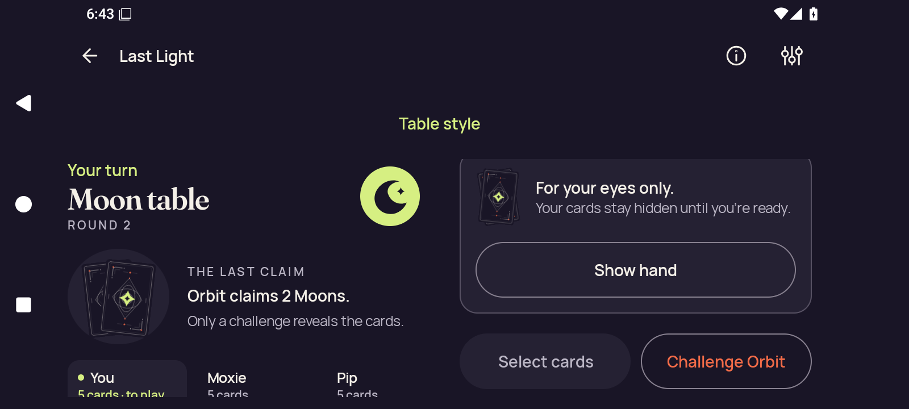</a> <code>2d-seascape-unsupported-return-selection-cleared.png</code> 2d-seascape-unsupported-return-selection-cleared — 2d-seascape.held-rotation | 1600 × 720 px · 116,615 bytes · text 1.0 SHA-256: <code>010f6185ffd950bd9ef6fcdb72bb0b48c6b45e807fe174ae1473403bc991318b</code> Source: <code>/root/projects/PartyDeck/artifacts/evidence-storage/34514544296/android-adaptive-api36-debug-font-1.0-34514544296-1/godot-adaptive/runtime/captures/2d-seascape-unsupported-return-selection-cleared.png</code> Original case outcome: **failed** Capture: 2026-09-10T18:43:29.116+00:00 → 2026-09-10T18:43:31.610+00:00 [UI XML](runtime/captures/2d-seascape-unsupported-return-selection-cleared.xml) · [Capture JSON](runtime/captures/2d-seascape-unsupported-return-selection-cleared.json) · [Original result](runtime/godot-adaptive-result.json) | **UNVIEWED original — no visual acceptance**. Preserved original capture; not visually reviewed. Stage and outcome labels come from the frozen collector mapping. No pixel observation or visual acceptance is claimed. |
|  <code>2d-seascape-unsupported-return-public.png</code> 2d-seascape-unsupported-return-public — 2d-seascape.held-rotation | 1600 × 720 px · 116,615 bytes · text 1.0 SHA-256: <code>010f6185ffd950bd9ef6fcdb72bb0b48c6b45e807fe174ae1473403bc991318b</code> Source: <code>/root/projects/PartyDeck/artifacts/evidence-storage/34514544296/android-adaptive-api36-debug-font-1.0-34514544296-1/godot-adaptive/runtime/captures/2d-seascape-unsupported-return-public.png</code> Original case outcome: **failed** Capture: 2026-09-10T18:43:33.686+00:00 → 2026-09-10T18:43:36.174+00:00 [UI XML](runtime/captures/2d-seascape-unsupported-return-public.xml) · [Capture JSON](runtime/captures/2d-seascape-unsupported-return-public.json) · [Original result](runtime/godot-adaptive-result.json) | **UNVIEWED original — no visual acceptance**. Preserved original capture; not visually reviewed. Stage and outcome labels come from the frozen collector mapping. No pixel observation or visual acceptance is claimed. |
| <a href="runtime/captures/2d-seascape-unsupported-return-first-card.png">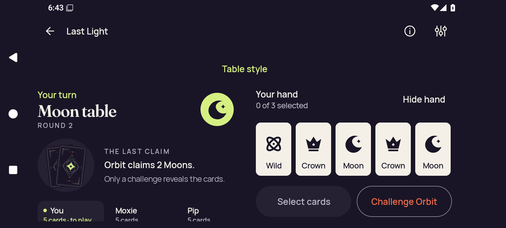</a> <code>2d-seascape-unsupported-return-first-card.png</code> 2d-seascape-unsupported-return-first-card — 2d-seascape.held-rotation | 1600 × 720 px · 110,219 bytes · text 1.0 SHA-256: <code>88380dd5cbddfd3475cbb84ccff89bac440909c0f55f2fd0463e0938d698dbd5</code> Source: <code>/root/projects/PartyDeck/artifacts/evidence-storage/34514544296/android-adaptive-api36-debug-font-1.0-34514544296-1/godot-adaptive/runtime/captures/2d-seascape-unsupported-return-first-card.png</code> Original case outcome: **failed** Capture: 2026-09-10T18:43:40.404+00:00 → 2026-09-10T18:43:42.949+00:00 [UI XML](runtime/captures/2d-seascape-unsupported-return-first-card.xml) · [Capture JSON](runtime/captures/2d-seascape-unsupported-return-first-card.json) · [Original result](runtime/godot-adaptive-result.json) | **UNVIEWED original — no visual acceptance**. Preserved original capture; not visually reviewed. Stage and outcome labels come from the frozen collector mapping. No pixel observation or visual acceptance is claimed. |
|  <code>2d-seascape-unsupported-portrait-return-concealed.png</code> 2d-seascape-unsupported-portrait-return-concealed — 2d-seascape.held-rotation | 720 × 1600 px · 131,421 bytes · text 1.0 SHA-256: <code>65ebc67b340ccd1700bcef06da6bac59373bd5b7939149a7eff461a326420b61</code> Source: <code>/root/projects/PartyDeck/artifacts/evidence-storage/34514544296/android-adaptive-api36-debug-font-1.0-34514544296-1/godot-adaptive/runtime/captures/2d-seascape-unsupported-portrait-return-concealed.png</code> Original case outcome: **failed** Capture: 2026-09-10T18:43:48.598+00:00 → 2026-09-10T18:43:51.096+00:00 [UI XML](runtime/captures/2d-seascape-unsupported-portrait-return-concealed.xml) · [Capture JSON](runtime/captures/2d-seascape-unsupported-portrait-return-concealed.json) · [Original result](runtime/godot-adaptive-result.json) | **UNVIEWED original — no visual acceptance**. Preserved original capture; not visually reviewed. Stage and outcome labels come from the frozen collector mapping. No pixel observation or visual acceptance is claimed. |
| <a href="runtime/captures/2d-seascape-unsupported-portrait-return-selection-cleared.png">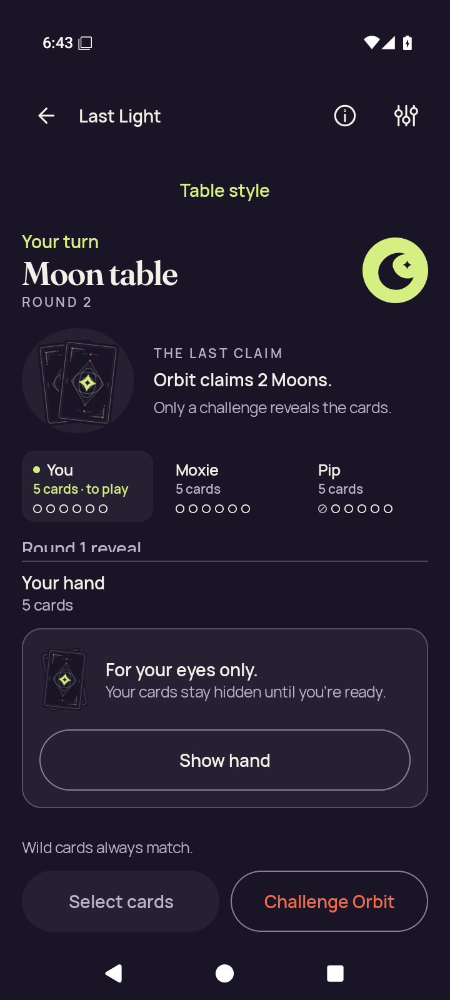</a> <code>2d-seascape-unsupported-portrait-return-selection-cleared.png</code> 2d-seascape-unsupported-portrait-return-selection-cleared — 2d-seascape.held-rotation | 720 × 1600 px · 131,421 bytes · text 1.0 SHA-256: <code>65ebc67b340ccd1700bcef06da6bac59373bd5b7939149a7eff461a326420b61</code> Source: <code>/root/projects/PartyDeck/artifacts/evidence-storage/34514544296/android-adaptive-api36-debug-font-1.0-34514544296-1/godot-adaptive/runtime/captures/2d-seascape-unsupported-portrait-return-selection-cleared.png</code> Original case outcome: **failed** Capture: 2026-09-10T18:43:53.172+00:00 → 2026-09-10T18:43:55.677+00:00 [UI XML](runtime/captures/2d-seascape-unsupported-portrait-return-selection-cleared.xml) · [Capture JSON](runtime/captures/2d-seascape-unsupported-portrait-return-selection-cleared.json) · [Original result](runtime/godot-adaptive-result.json) | **UNVIEWED original — no visual acceptance**. Preserved original capture; not visually reviewed. Stage and outcome labels come from the frozen collector mapping. No pixel observation or visual acceptance is claimed. |
|  <code>2d-seascape-unsupported-portrait-return-public.png</code> 2d-seascape-unsupported-portrait-return-public — 2d-seascape.held-rotation | 720 × 1600 px · 131,421 bytes · text 1.0 SHA-256: <code>65ebc67b340ccd1700bcef06da6bac59373bd5b7939149a7eff461a326420b61</code> Source: <code>/root/projects/PartyDeck/artifacts/evidence-storage/34514544296/android-adaptive-api36-debug-font-1.0-34514544296-1/godot-adaptive/runtime/captures/2d-seascape-unsupported-portrait-return-public.png</code> Original case outcome: **failed** Capture: 2026-09-10T18:43:57.754+00:00 → 2026-09-10T18:44:00.264+00:00 [UI XML](runtime/captures/2d-seascape-unsupported-portrait-return-public.xml) · [Capture JSON](runtime/captures/2d-seascape-unsupported-portrait-return-public.json) · [Original result](runtime/godot-adaptive-result.json) | **UNVIEWED original — no visual acceptance**. Preserved original capture; not visually reviewed. Stage and outcome labels come from the frozen collector mapping. No pixel observation or visual acceptance is claimed. |
| <a href="runtime/captures/2d-seascape-unsupported-portrait-return-first-card.png">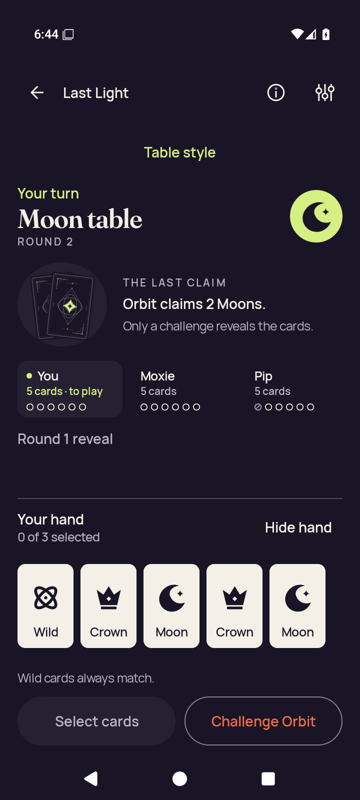</a> <code>2d-seascape-unsupported-portrait-return-first-card.png</code> 2d-seascape-unsupported-portrait-return-first-card — 2d-seascape.held-rotation | 720 × 1600 px · 128,502 bytes · text 1.0 SHA-256: <code>a07ba1756c09758b9a9dda8f1b9262ae6c59c317641d63ef588019c520b05db4</code> Source: <code>/root/projects/PartyDeck/artifacts/evidence-storage/34514544296/android-adaptive-api36-debug-font-1.0-34514544296-1/godot-adaptive/runtime/captures/2d-seascape-unsupported-portrait-return-first-card.png</code> Original case outcome: **failed** Capture: 2026-09-10T18:44:04.550+00:00 → 2026-09-10T18:44:07.083+00:00 [UI XML](runtime/captures/2d-seascape-unsupported-portrait-return-first-card.xml) · [Capture JSON](runtime/captures/2d-seascape-unsupported-portrait-return-first-card.json) · [Original result](runtime/godot-adaptive-result.json) | **UNVIEWED original — no visual acceptance**. Preserved original capture; not visually reviewed. Stage and outcome labels come from the frozen collector mapping. No pixel observation or visual acceptance is claimed. |
| <a href="runtime/captures/2d-seascape-reentry-selected.png">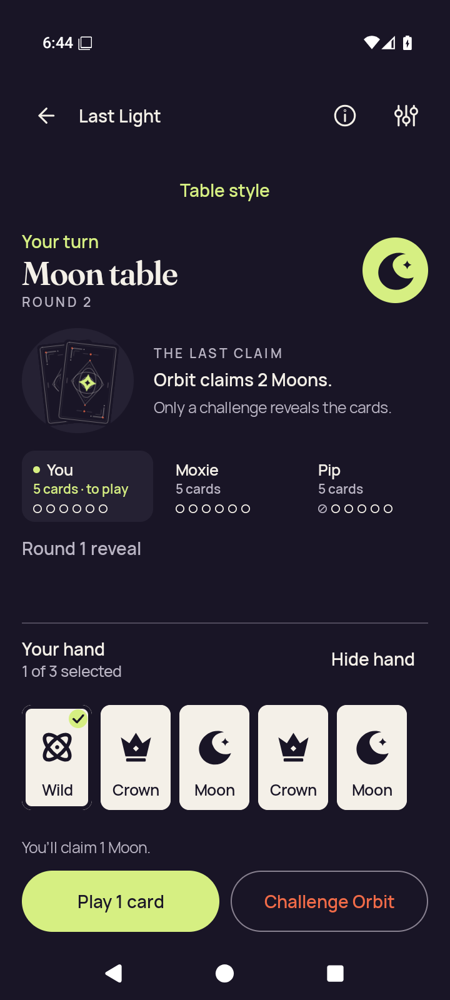</a> <code>2d-seascape-reentry-selected.png</code> 2d-seascape-reentry-selected — 2d-seascape.portrait-reentry-standard | 720 × 1600 px · 127,968 bytes · text 1.0 SHA-256: <code>5c89d976b6ed5e0e2da3ad82642308014f18bf0d650b9aa07256b8798c1618d0</code> Source: <code>/root/projects/PartyDeck/artifacts/evidence-storage/34514544296/android-adaptive-api36-debug-font-1.0-34514544296-1/godot-adaptive/runtime/captures/2d-seascape-reentry-selected.png</code> Original case outcome: **failed** Capture: 2026-09-10T18:44:13.584+00:00 → 2026-09-10T18:44:16.135+00:00 [UI XML](runtime/captures/2d-seascape-reentry-selected.xml) · [Capture JSON](runtime/captures/2d-seascape-reentry-selected.json) · [Original result](runtime/godot-adaptive-result.json) | **UNVIEWED original — no visual acceptance**. Preserved original capture; not visually reviewed. Stage and outcome labels come from the frozen collector mapping. No pixel observation or visual acceptance is claimed. |
|  <code>2d-seascape-portrait-selector.png</code> 2d-seascape-portrait-selector — 2d-seascape.portrait-reentry-standard | 720 × 1600 px · 58,027 bytes · text 1.0 SHA-256: <code>fa0e6ca10dc235560384eed1f8d3200028a1b5bdd33b71a950cdd45bbf6f47ac</code> Source: <code>/root/projects/PartyDeck/artifacts/evidence-storage/34514544296/android-adaptive-api36-debug-font-1.0-34514544296-1/godot-adaptive/runtime/captures/2d-seascape-portrait-selector.png</code> Original case outcome: **failed** Capture: 2026-09-10T18:44:22.939+00:00 → 2026-09-10T18:44:25.452+00:00 [UI XML](runtime/captures/2d-seascape-portrait-selector.xml) · [Capture JSON](runtime/captures/2d-seascape-portrait-selector.json) · [Original result](runtime/godot-adaptive-result.json) | **UNVIEWED original — no visual acceptance**. Preserved original capture; not visually reviewed. Stage and outcome labels come from the frozen collector mapping. No pixel observation or visual acceptance is claimed. |
|  <code>2d-seascape-portrait-native-ready.png</code> 2d-seascape-portrait-native-ready — 2d-seascape.portrait-reentry-standard | 720 × 1600 px · 147,930 bytes · text 1.0 SHA-256: <code>967ae2231997d7970cb69a972ab5f92950645ec0f2550fe5edabdfee773a13dc</code> Source: <code>/root/projects/PartyDeck/artifacts/evidence-storage/34514544296/android-adaptive-api36-debug-font-1.0-34514544296-1/godot-adaptive/runtime/captures/2d-seascape-portrait-native-ready.png</code> Original case outcome: **failed** Capture: 2026-09-10T18:44:34.393+00:00 → 2026-09-10T18:44:36.880+00:00 [UI XML](runtime/captures/2d-seascape-portrait-native-ready.xml) · [Capture JSON](runtime/captures/2d-seascape-portrait-native-ready.json) · [Original result](runtime/godot-adaptive-result.json) | **Direct original view**. Round 02, Moon and Orbit claimed 2 Moons. are visible. Choose cards appears disabled and Call the bluff is orange. Full Table ready, Standard table and Leave table chrome, Exit/Last Light, and turn/rank/public context are visible. The complete compact cover and full Reveal my hand button fit with separation before the first two complete numbered seats, Guest and Moxie; the next seat-row upper edges meet the lower body clip. Full fixed lower game actions are visible. No private card face is visible. This normal-text 720×1600 native-ready still does not measure native margins, initial scroll position, gameplay completion or continuous privacy. |
|  <code>2d-seascape-standard-return-concealed.png</code> 2d-seascape-standard-return-concealed — 2d-seascape.portrait-reentry-standard | 720 × 1600 px · 131,026 bytes · text 1.0 SHA-256: <code>0a396c7f2063a6f8a1152ecfcf21670c1d0701e44041a3fae609450dffd0c2c4</code> Source: <code>/root/projects/PartyDeck/artifacts/evidence-storage/34514544296/android-adaptive-api36-debug-font-1.0-34514544296-1/godot-adaptive/runtime/captures/2d-seascape-standard-return-concealed.png</code> Original case outcome: **failed** Capture: 2026-09-10T18:44:44.542+00:00 → 2026-09-10T18:44:47.057+00:00 [UI XML](runtime/captures/2d-seascape-standard-return-concealed.xml) · [Capture JSON](runtime/captures/2d-seascape-standard-return-concealed.json) · [Original result](runtime/godot-adaptive-result.json) | **UNVIEWED original — no visual acceptance**. Preserved original capture; not visually reviewed. Stage and outcome labels come from the frozen collector mapping. No pixel observation or visual acceptance is claimed. |
|  <code>2d-seascape-standard-return-selection-cleared.png</code> 2d-seascape-standard-return-selection-cleared — 2d-seascape.portrait-reentry-standard | 720 × 1600 px · 131,026 bytes · text 1.0 SHA-256: <code>0a396c7f2063a6f8a1152ecfcf21670c1d0701e44041a3fae609450dffd0c2c4</code> Source: <code>/root/projects/PartyDeck/artifacts/evidence-storage/34514544296/android-adaptive-api36-debug-font-1.0-34514544296-1/godot-adaptive/runtime/captures/2d-seascape-standard-return-selection-cleared.png</code> Original case outcome: **failed** Capture: 2026-09-10T18:44:49.132+00:00 → 2026-09-10T18:44:51.629+00:00 [UI XML](runtime/captures/2d-seascape-standard-return-selection-cleared.xml) · [Capture JSON](runtime/captures/2d-seascape-standard-return-selection-cleared.json) · [Original result](runtime/godot-adaptive-result.json) | **UNVIEWED original — no visual acceptance**. Preserved original capture; not visually reviewed. Stage and outcome labels come from the frozen collector mapping. No pixel observation or visual acceptance is claimed. |
|  <code>2d-seascape-standard-return-public.png</code> 2d-seascape-standard-return-public — 2d-seascape.portrait-reentry-standard | 720 × 1600 px · 131,044 bytes · text 1.0 SHA-256: <code>0ddf074bb9fcb1622ed06c8143187751e8330dc059f9b9cbb0a868f1cdf754d8</code> Source: <code>/root/projects/PartyDeck/artifacts/evidence-storage/34514544296/android-adaptive-api36-debug-font-1.0-34514544296-1/godot-adaptive/runtime/captures/2d-seascape-standard-return-public.png</code> Original case outcome: **failed** Capture: 2026-09-10T18:44:53.717+00:00 → 2026-09-10T18:44:56.221+00:00 [UI XML](runtime/captures/2d-seascape-standard-return-public.xml) · [Capture JSON](runtime/captures/2d-seascape-standard-return-public.json) · [Original result](runtime/godot-adaptive-result.json) | **UNVIEWED original — no visual acceptance**. Preserved original capture; not visually reviewed. Stage and outcome labels come from the frozen collector mapping. No pixel observation or visual acceptance is claimed. |
|  <code>2d-seascape-standard-return-first-card.png</code> 2d-seascape-standard-return-first-card — 2d-seascape.portrait-reentry-standard | 720 × 1600 px · 128,937 bytes · text 1.0 SHA-256: <code>fdb7789bc503faf2a0209c590a8ecc9e91006b858745da6e67ef022ad610e2c9</code> Source: <code>/root/projects/PartyDeck/artifacts/evidence-storage/34514544296/android-adaptive-api36-debug-font-1.0-34514544296-1/godot-adaptive/runtime/captures/2d-seascape-standard-return-first-card.png</code> Original case outcome: **failed** Capture: 2026-09-10T18:45:00.476+00:00 → 2026-09-10T18:45:02.994+00:00 [UI XML](runtime/captures/2d-seascape-standard-return-first-card.xml) · [Capture JSON](runtime/captures/2d-seascape-standard-return-first-card.json) · [Original result](runtime/godot-adaptive-result.json) | **UNVIEWED original — no visual acceptance**. Preserved original capture; not visually reviewed. Stage and outcome labels come from the frozen collector mapping. No pixel observation or visual acceptance is claimed. |
|  <code>2d-seascape-leave-selected.png</code> 2d-seascape-leave-selected — 2d-seascape.native-leave-home | 720 × 1600 px · 128,466 bytes · text 1.0 SHA-256: <code>f17b32cc84a39eb37336a77349a2488d7e73bdb52fdf0766a59e3b434128e331</code> Source: <code>/root/projects/PartyDeck/artifacts/evidence-storage/34514544296/android-adaptive-api36-debug-font-1.0-34514544296-1/godot-adaptive/runtime/captures/2d-seascape-leave-selected.png</code> Original case outcome: **failed** Capture: 2026-09-10T18:45:09.489+00:00 → 2026-09-10T18:45:12.003+00:00 [UI XML](runtime/captures/2d-seascape-leave-selected.xml) · [Capture JSON](runtime/captures/2d-seascape-leave-selected.json) · [Original result](runtime/godot-adaptive-result.json) | **UNVIEWED original — no visual acceptance**. Preserved original capture; not visually reviewed. Stage and outcome labels come from the frozen collector mapping. No pixel observation or visual acceptance is claimed. |
| <a href="runtime/captures/2d-seascape-leave-selector.png">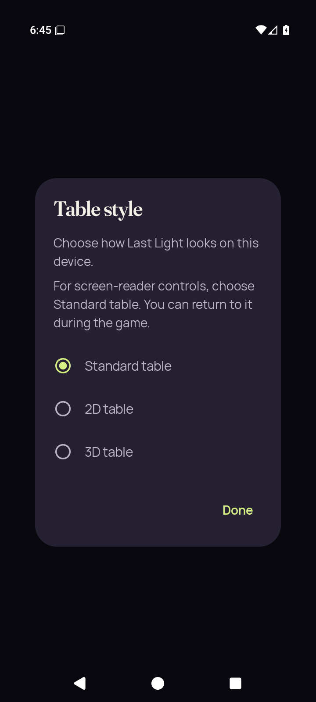</a> <code>2d-seascape-leave-selector.png</code> 2d-seascape-leave-selector — 2d-seascape.native-leave-home | 720 × 1600 px · 58,514 bytes · text 1.0 SHA-256: <code>fc5efa5054e828c788aca6aa885b42f4eaf386ff54056e3a338188c498708f75</code> Source: <code>/root/projects/PartyDeck/artifacts/evidence-storage/34514544296/android-adaptive-api36-debug-font-1.0-34514544296-1/godot-adaptive/runtime/captures/2d-seascape-leave-selector.png</code> Original case outcome: **failed** Capture: 2026-09-10T18:45:18.878+00:00 → 2026-09-10T18:45:21.394+00:00 [UI XML](runtime/captures/2d-seascape-leave-selector.xml) · [Capture JSON](runtime/captures/2d-seascape-leave-selector.json) · [Original result](runtime/godot-adaptive-result.json) | **UNVIEWED original — no visual acceptance**. Preserved original capture; not visually reviewed. Stage and outcome labels come from the frozen collector mapping. No pixel observation or visual acceptance is claimed. |
| <a href="runtime/captures/2d-seascape-leave-native-ready.png">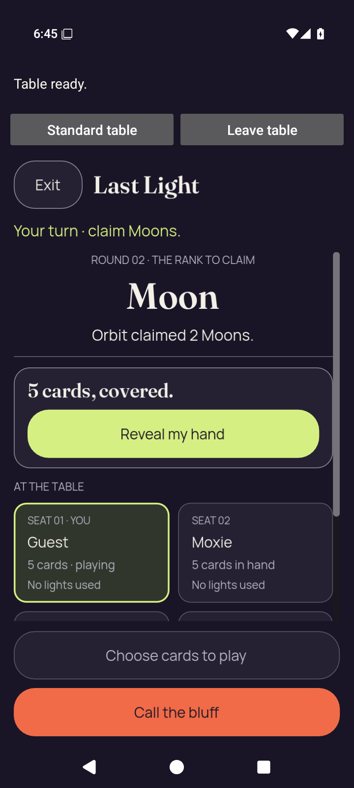</a> <code>2d-seascape-leave-native-ready.png</code> 2d-seascape-leave-native-ready — 2d-seascape.native-leave-home | 720 × 1600 px · 148,273 bytes · text 1.0 SHA-256: <code>57dc3b92055585defe488697796848e6ce4eb85a08df0f10ccd9d6bbd77e6a0f</code> Source: <code>/root/projects/PartyDeck/artifacts/evidence-storage/34514544296/android-adaptive-api36-debug-font-1.0-34514544296-1/godot-adaptive/runtime/captures/2d-seascape-leave-native-ready.png</code> Original case outcome: **failed** Capture: 2026-09-10T18:45:30.301+00:00 → 2026-09-10T18:45:32.819+00:00 [UI XML](runtime/captures/2d-seascape-leave-native-ready.xml) · [Capture JSON](runtime/captures/2d-seascape-leave-native-ready.json) · [Original result](runtime/godot-adaptive-result.json) | **Direct original view**. Round 02, Moon and Orbit claimed 2 Moons. are visible. Choose cards appears disabled and Call the bluff is orange. Full Table ready, Standard table and Leave table chrome, Exit/Last Light and turn context fit. The compact five-card cover and complete Reveal my hand button are visible above two complete Guest/Moxie seat panels; upper edges of the next seat row meet the body clip. Fixed lower actions fit. No private card face is visible. This portrait leave-native-ready still preserves its source identity and does not establish later leaving, initial scroll position or continuous privacy. |
| <a href="runtime/captures/2d-seascape-leave-confirmation.png">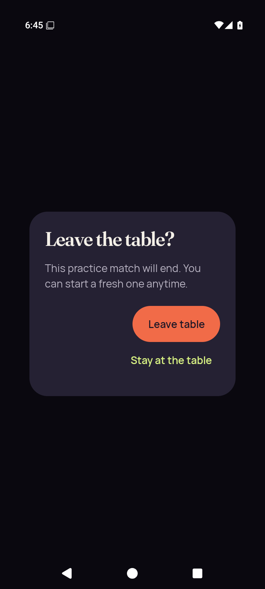</a> <code>2d-seascape-leave-confirmation.png</code> 2d-seascape-leave-confirmation — 2d-seascape.native-leave-home | 720 × 1600 px · 41,042 bytes · text 1.0 SHA-256: <code>4549cd3411687ade878d0a1d11deb36ecf72f08f41f95cd07a4a3c9710017b2e</code> Source: <code>/root/projects/PartyDeck/artifacts/evidence-storage/34514544296/android-adaptive-api36-debug-font-1.0-34514544296-1/godot-adaptive/runtime/captures/2d-seascape-leave-confirmation.png</code> Original case outcome: **failed** Capture: 2026-09-10T18:45:40.350+00:00 → 2026-09-10T18:45:42.848+00:00 [UI XML](runtime/captures/2d-seascape-leave-confirmation.xml) · [Capture JSON](runtime/captures/2d-seascape-leave-confirmation.json) · [Original result](runtime/godot-adaptive-result.json) | **UNVIEWED original — no visual acceptance**. Preserved original capture; not visually reviewed. Stage and outcome labels come from the frozen collector mapping. No pixel observation or visual acceptance is claimed. |
| <a href="runtime/captures/2d-seascape-home.png">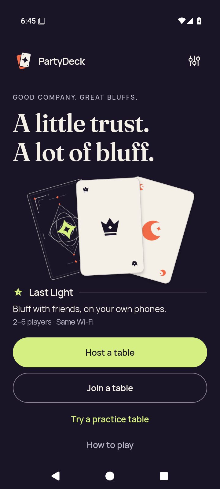</a> <code>2d-seascape-home.png</code> 2d-seascape-home — 2d-seascape.native-leave-home | 720 × 1600 px · 132,051 bytes · text 1.0 SHA-256: <code>712dbd895898fe85e56079d0117e9847bba957138284b23e584fd1db516688bb</code> Source: <code>/root/projects/PartyDeck/artifacts/evidence-storage/34514544296/android-adaptive-api36-debug-font-1.0-34514544296-1/godot-adaptive/runtime/captures/2d-seascape-home.png</code> Original case outcome: **failed** Capture: 2026-09-10T18:45:47.341+00:00 → 2026-09-10T18:45:49.838+00:00 [UI XML](runtime/captures/2d-seascape-home.xml) · [Capture JSON](runtime/captures/2d-seascape-home.json) · [Original result](runtime/godot-adaptive-result.json) | **UNVIEWED original — no visual acceptance**. Preserved original capture; not visually reviewed. Stage and outcome labels come from the frozen collector mapping. No pixel observation or visual acceptance is claimed. |
|  <code>2d-split-baseline-public.png</code> 2d-split-baseline-public — 2d-split.entry-after-ready | 1600 × 720 px · 95,747 bytes · text 1.0 SHA-256: <code>e7e3a4f52f11232e8f0a359c47469f03943267d2ff633bde8d0f2d91551266d4</code> Source: <code>/root/projects/PartyDeck/artifacts/evidence-storage/34514544296/android-adaptive-api36-debug-font-1.0-34514544296-1/godot-adaptive/runtime/captures/2d-split-baseline-public.png</code> Original case outcome: **failed** Capture: 2026-09-10T18:46:06.385+00:00 → 2026-09-10T18:46:08.891+00:00 [UI XML](runtime/captures/2d-split-baseline-public.xml) · [Capture JSON](runtime/captures/2d-split-baseline-public.json) · [Original result](runtime/godot-adaptive-result.json) | **UNVIEWED original — no visual acceptance**. Preserved original capture; not visually reviewed. Stage and outcome labels come from the frozen collector mapping. No pixel observation or visual acceptance is claimed. |
| <a href="runtime/captures/2d-split-baseline-first-card.png">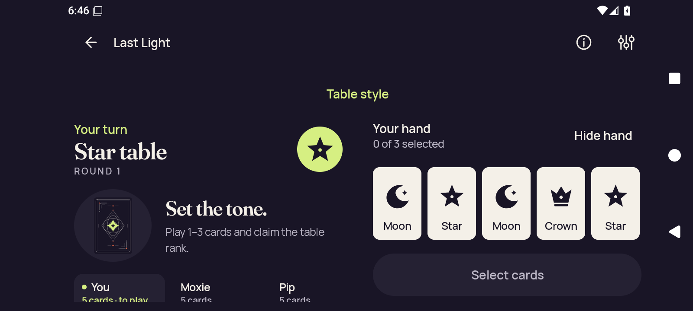</a> <code>2d-split-baseline-first-card.png</code> 2d-split-baseline-first-card — 2d-split.entry-after-ready | 1600 × 720 px · 87,960 bytes · text 1.0 SHA-256: <code>61ffe407f056b150565cc64e05c014b014e9dc074bac8ae0ef3a1ca328d361d2</code> Source: <code>/root/projects/PartyDeck/artifacts/evidence-storage/34514544296/android-adaptive-api36-debug-font-1.0-34514544296-1/godot-adaptive/runtime/captures/2d-split-baseline-first-card.png</code> Original case outcome: **failed** Capture: 2026-09-10T18:46:13.103+00:00 → 2026-09-10T18:46:15.632+00:00 [UI XML](runtime/captures/2d-split-baseline-first-card.xml) · [Capture JSON](runtime/captures/2d-split-baseline-first-card.json) · [Original result](runtime/godot-adaptive-result.json) | **UNVIEWED original — no visual acceptance**. Preserved original capture; not visually reviewed. Stage and outcome labels come from the frozen collector mapping. No pixel observation or visual acceptance is claimed. |
| <a href="runtime/captures/2d-split-baseline-selected.png">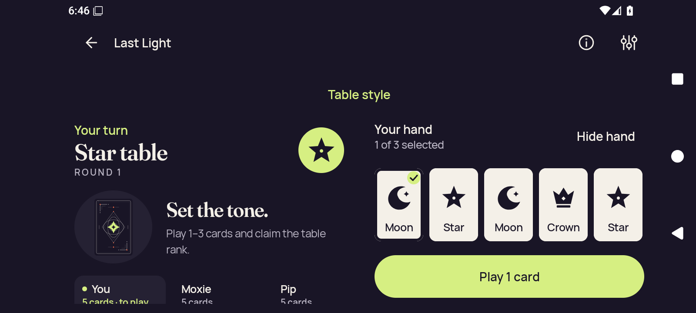</a> <code>2d-split-baseline-selected.png</code> 2d-split-baseline-selected — 2d-split.entry-after-ready | 1600 × 720 px · 88,747 bytes · text 1.0 SHA-256: <code>bab749f9ca30e9372a7b8e4a3fa862d7697fee979421abef40a17c170bae6424</code> Source: <code>/root/projects/PartyDeck/artifacts/evidence-storage/34514544296/android-adaptive-api36-debug-font-1.0-34514544296-1/godot-adaptive/runtime/captures/2d-split-baseline-selected.png</code> Original case outcome: **failed** Capture: 2026-09-10T18:46:22.106+00:00 → 2026-09-10T18:46:24.600+00:00 [UI XML](runtime/captures/2d-split-baseline-selected.xml) · [Capture JSON](runtime/captures/2d-split-baseline-selected.json) · [Original result](runtime/godot-adaptive-result.json) | **UNVIEWED original — no visual acceptance**. Preserved original capture; not visually reviewed. Stage and outcome labels come from the frozen collector mapping. No pixel observation or visual acceptance is claimed. |
| <a href="runtime/captures/2d-split-full-selector.png">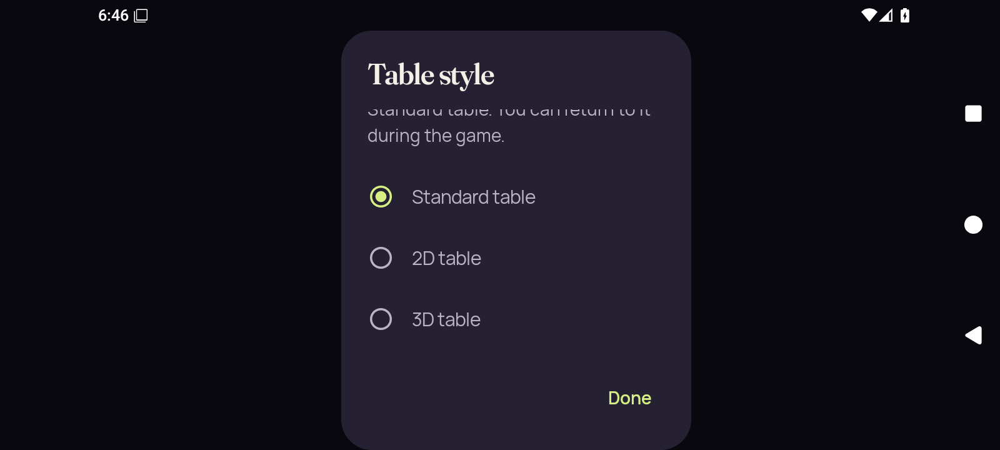</a> <code>2d-split-full-selector.png</code> 2d-split-full-selector — 2d-split.entry-after-ready | 1600 × 720 px · 41,951 bytes · text 1.0 SHA-256: <code>71ee90590992fcd6cf9de638fcd883f309d80a65d016831dc2fe7423e294d062</code> Source: <code>/root/projects/PartyDeck/artifacts/evidence-storage/34514544296/android-adaptive-api36-debug-font-1.0-34514544296-1/godot-adaptive/runtime/captures/2d-split-full-selector.png</code> Original case outcome: **failed** Capture: 2026-09-10T18:46:34.328+00:00 → 2026-09-10T18:46:36.789+00:00 [UI XML](runtime/captures/2d-split-full-selector.xml) · [Capture JSON](runtime/captures/2d-split-full-selector.json) · [Original result](runtime/godot-adaptive-result.json) | **UNVIEWED original — no visual acceptance**. Preserved original capture; not visually reviewed. Stage and outcome labels come from the frozen collector mapping. No pixel observation or visual acceptance is claimed. |
|  <code>2d-split-full-native-ready.png</code> 2d-split-full-native-ready — 2d-split.entry-after-ready | 1600 × 720 px · 101,921 bytes · text 1.0 SHA-256: <code>b5fe352b38d643758270878abc68025e117d7326ab41d763ec3c3f2d29dd3e1a</code> Source: <code>/root/projects/PartyDeck/artifacts/evidence-storage/34514544296/android-adaptive-api36-debug-font-1.0-34514544296-1/godot-adaptive/runtime/captures/2d-split-full-native-ready.png</code> Original case outcome: **failed** Capture: 2026-09-10T18:46:44.143+00:00 → 2026-09-10T18:46:46.600+00:00 [UI XML](runtime/captures/2d-split-full-native-ready.xml) · [Capture JSON](runtime/captures/2d-split-full-native-ready.json) · [Original result](runtime/godot-adaptive-result.json) | **Direct original view**. At normal text, this fullscreen landscape capture shows Table ready, Standard table/Leave table, Exit/Last Light and Your turn · Star table. The card-back cover, five-card headline and explanatory copy fit, but Reveal is reduced to its upper green edge at the body clip. Both fixed lower actions fit and appear disabled. The source name marks fullscreen readiness before the attempted split scope; no split-entry request occurred in this run. No private card face is visible, and this still cannot establish the unobserved split transition, gameplay or continuous privacy. |
| <a href="runtime/captures/final-diagnostic.png">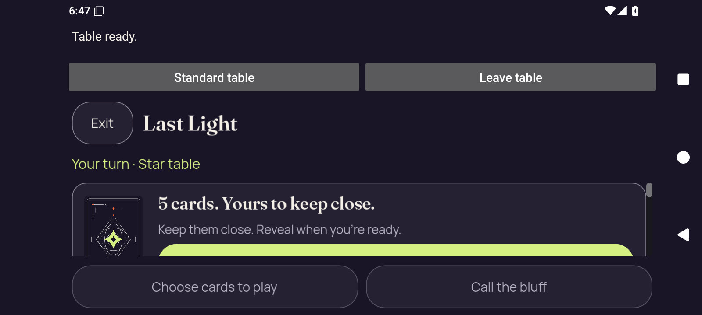</a> <code>final-diagnostic.png</code> final-diagnostic — 3d-landscape.initial-landscape | 1600 × 720 px · 102,093 bytes · text 1.0 SHA-256: <code>61db3549b2f2a5a1379222742864e38bdd774f442b9b2050907339ca9855a7cc</code> Source: <code>/root/projects/PartyDeck/artifacts/evidence-storage/34514544296/android-adaptive-api36-debug-font-1.0-34514544296-1/godot-adaptive/runtime/captures/final-diagnostic.png</code> Original case outcome: **failed** Capture: 2026-09-10T18:47:33.055+00:00 → 2026-09-10T18:47:35.538+00:00 [UI XML](runtime/captures/final-diagnostic.xml) · [Capture JSON](runtime/captures/final-diagnostic.json) · [Original result](runtime/godot-adaptive-result.json) | **Direct original view**. The normal-text final diagnostic shows Table ready, full Standard table and Leave table controls, Exit/Last Light, and Your turn · Star table. The five-card cover and explanatory copy are readable, but only the upper green edge of Reveal is visible above the body clip; its label is below the viewport. Both fixed lower actions fit and appear disabled. No private card face appears. This remains the original failed preparation diagnostic. |
