# API 36 debug, font 2.0

[All collections](../../../README.md) · [Preserved evidence index](../../evidence-index.md) · [Copy/review binding](../../../android-34515669045/provenance/publication-review/partydeck-gallery-3433-publication-binding-v1.json) · [Completed focused review](../../provenance/publication-review/partydeck-gallery-after-2815-adaptive34514544296-visual-review-v1.json) · [Source mapping](../../provenance/source-collection/triage/capture-publication-inventory.json)

**Original case failed at 3d-landscape.initial-landscape preparation. Named scopes: {"failed": 1, "not-reached": 13, "passed": 7, "unsupported": 3}.**

Capture-stage names, source results and recording statuses are preserved. Direct reviews are limited to named 2D checkpoints.

All 228 original capture identities remain separate. Four installations pass. Across 96 named scopes, 28 pass, four fail, 12 are unsupported and 52 are unreached. Each case fails while preparing 3d-landscape.initial-landscape after unsupported split-entry recording. No split-entry request occurred; this does not establish native 3D launch failure. Engine gameplay assertions were not invoked.

The 32 directly reviewed stills show the compact cover, full Reveal, first two complete numbered seats and fixed lower actions in normal-text portrait native-ready/leave-native-ready frames. Normal landscape shows only the upper green edge of Reveal at the body clip. At 200% in either orientation, Reveal and lower game actions remain outside the viewport. No private faces are visible in those reviewed stills. These views add no margin, zero-scroll, gameplay-completion or continuous-privacy claim.

Twelve original MP4s retain startup-unavailable-original-retained / growth-not-observed and remain unviewed and undecoded. The exact source is derived; 1,124 omitted historical gallery blobs have only remote-tree identity in the source reconstruction. The actual producer pack is `557b2297bed133a433acc25efa4837462465dd4e06da659ae5a4cbd792f77fe0` (1,549,560 bytes).

Source revision: `286b7ff11b2441daad044b57fad6fc8b6be995d0`. CI run: [34514544296](https://github.com/Apdelrahman1911/PartyDeck/actions/runs/34514544296). 57 original PNG identities. Review methods: 49 unviewed original — no visual acceptance, 8 direct original view.

Every thumbnail opens the unchanged original PNG. **UNVIEWED** means no direct pixel review or visual acceptance is asserted. Matching bytes reuse only earlier pixel observations. Each source, scenario and original outcome remains separate. Frozen review plans retain their historical pending flags; the completed focused-review receipt records the final status. No new derivative image or video decoding was performed.

| Original capture | Original identity and evidence | Review status and observation |
| --- | --- | --- |
|  <code>home-cold.png</code> home-cold — emulator readiness | 720 × 1600 px · 81,040 bytes · text 2.0 SHA-256: <code>9c591dd1102f47f697796bb9e7e3ba4afabeb519dca122256c2508adb1294ecf</code> Source: <code>/root/projects/PartyDeck/artifacts/evidence-storage/34514544296/android-adaptive-api36-debug-font-2.0-34514544296-1/godot-adaptive/runtime/captures/home-cold.png</code> Original case outcome: **failed** Capture: 2026-09-10T18:37:40.514+00:00 → 2026-09-10T18:37:42.917+00:00 [UI XML](runtime/captures/home-cold.xml) · [Capture JSON](runtime/captures/home-cold.json) · [Original result](runtime/godot-adaptive-result.json) | **UNVIEWED original — no visual acceptance**. Preserved original capture; not visually reviewed. Stage and outcome labels come from the frozen collector mapping. No pixel observation or visual acceptance is claimed. |
| <a href="runtime/captures/2d-landscape-baseline-public.png">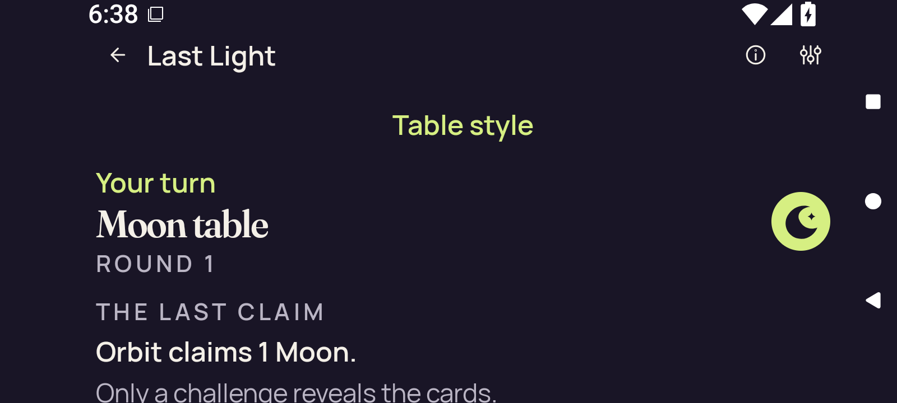</a> <code>2d-landscape-baseline-public.png</code> 2d-landscape-baseline-public — 2d-landscape.initial-landscape | 1600 × 720 px · 76,156 bytes · text 2.0 SHA-256: <code>63160ba089ea604a4b1cfa3ea9908856d44af3cc9efc99af465ce58d21116541</code> Source: <code>/root/projects/PartyDeck/artifacts/evidence-storage/34514544296/android-adaptive-api36-debug-font-2.0-34514544296-1/godot-adaptive/runtime/captures/2d-landscape-baseline-public.png</code> Original case outcome: **failed** Capture: 2026-09-10T18:38:25.250+00:00 → 2026-09-10T18:38:27.668+00:00 [UI XML](runtime/captures/2d-landscape-baseline-public.xml) · [Capture JSON](runtime/captures/2d-landscape-baseline-public.json) · [Original result](runtime/godot-adaptive-result.json) | **UNVIEWED original — no visual acceptance**. Preserved original capture; not visually reviewed. Stage and outcome labels come from the frozen collector mapping. No pixel observation or visual acceptance is claimed. |
| <a href="runtime/captures/2d-landscape-baseline-first-card.png">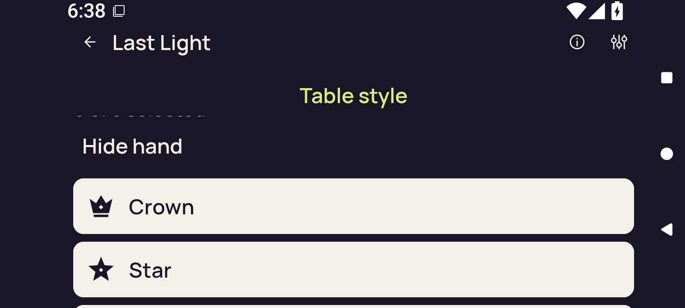</a> <code>2d-landscape-baseline-first-card.png</code> 2d-landscape-baseline-first-card — 2d-landscape.initial-landscape | 1600 × 720 px · 45,861 bytes · text 2.0 SHA-256: <code>58886a0de89db2327245d201973ca0cc67c83c0600e607782696a9ab66f2914b</code> Source: <code>/root/projects/PartyDeck/artifacts/evidence-storage/34514544296/android-adaptive-api36-debug-font-2.0-34514544296-1/godot-adaptive/runtime/captures/2d-landscape-baseline-first-card.png</code> Original case outcome: **failed** Capture: 2026-09-10T18:38:43.027+00:00 → 2026-09-10T18:38:45.460+00:00 [UI XML](runtime/captures/2d-landscape-baseline-first-card.xml) · [Capture JSON](runtime/captures/2d-landscape-baseline-first-card.json) · [Original result](runtime/godot-adaptive-result.json) | **UNVIEWED original — no visual acceptance**. Preserved original capture; not visually reviewed. Stage and outcome labels come from the frozen collector mapping. No pixel observation or visual acceptance is claimed. |
| <a href="runtime/captures/2d-landscape-baseline-selected.png">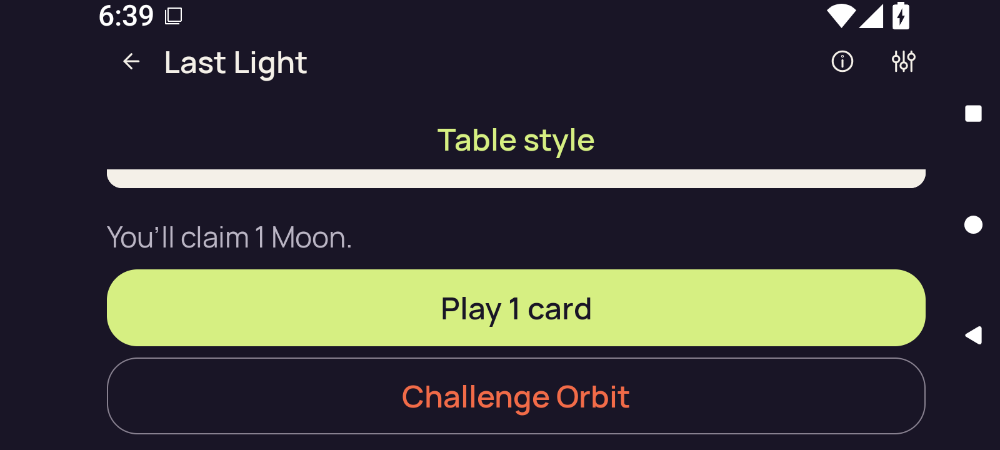</a> <code>2d-landscape-baseline-selected.png</code> 2d-landscape-baseline-selected — 2d-landscape.initial-landscape | 1600 × 720 px · 53,405 bytes · text 2.0 SHA-256: <code>7a092e07d5f23e7d3a5c5a9c4994cbe9bbbe5fd36906cad90c6693a681ff3c33</code> Source: <code>/root/projects/PartyDeck/artifacts/evidence-storage/34514544296/android-adaptive-api36-debug-font-2.0-34514544296-1/godot-adaptive/runtime/captures/2d-landscape-baseline-selected.png</code> Original case outcome: **failed** Capture: 2026-09-10T18:39:05.832+00:00 → 2026-09-10T18:39:08.238+00:00 [UI XML](runtime/captures/2d-landscape-baseline-selected.xml) · [Capture JSON](runtime/captures/2d-landscape-baseline-selected.json) · [Original result](runtime/godot-adaptive-result.json) | **UNVIEWED original — no visual acceptance**. Preserved original capture; not visually reviewed. Stage and outcome labels come from the frozen collector mapping. No pixel observation or visual acceptance is claimed. |
| <a href="runtime/captures/2d-landscape-initial-selector.png">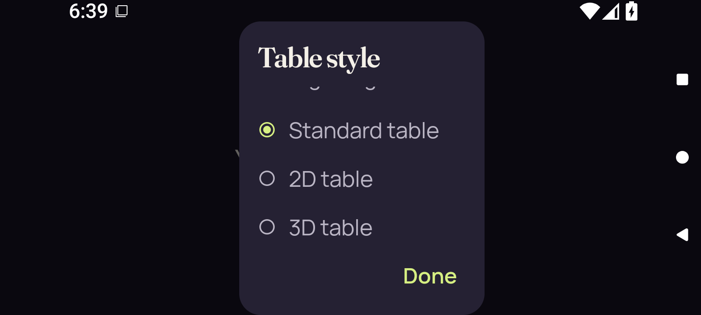</a> <code>2d-landscape-initial-selector.png</code> 2d-landscape-initial-selector — 2d-landscape.initial-landscape | 1600 × 720 px · 50,527 bytes · text 2.0 SHA-256: <code>75da30a01e6647435934af6002c3a9e9625f99bc0d88a409da803d4c5e7270de</code> Source: <code>/root/projects/PartyDeck/artifacts/evidence-storage/34514544296/android-adaptive-api36-debug-font-2.0-34514544296-1/godot-adaptive/runtime/captures/2d-landscape-initial-selector.png</code> Original case outcome: **failed** Capture: 2026-09-10T18:39:29.106+00:00 → 2026-09-10T18:39:31.520+00:00 [UI XML](runtime/captures/2d-landscape-initial-selector.xml) · [Capture JSON](runtime/captures/2d-landscape-initial-selector.json) · [Original result](runtime/godot-adaptive-result.json) | **UNVIEWED original — no visual acceptance**. Preserved original capture; not visually reviewed. Stage and outcome labels come from the frozen collector mapping. No pixel observation or visual acceptance is claimed. |
| <a href="runtime/captures/2d-landscape-initial-native-ready.png">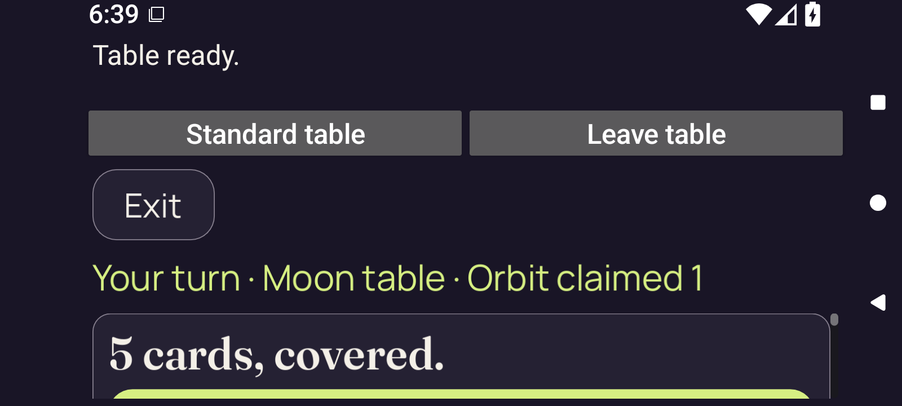</a> <code>2d-landscape-initial-native-ready.png</code> 2d-landscape-initial-native-ready — 2d-landscape.initial-landscape | 1600 × 720 px · 86,617 bytes · text 2.0 SHA-256: <code>e20964b9db562973e31b63f164d8ca3ead6069ec5f1a39ea22157d45e6929c24</code> Source: <code>/root/projects/PartyDeck/artifacts/evidence-storage/34514544296/android-adaptive-api36-debug-font-2.0-34514544296-1/godot-adaptive/runtime/captures/2d-landscape-initial-native-ready.png</code> Original case outcome: **failed** Capture: 2026-09-10T18:39:40.482+00:00 → 2026-09-10T18:39:42.894+00:00 [UI XML](runtime/captures/2d-landscape-initial-native-ready.xml) · [Capture JSON](runtime/captures/2d-landscape-initial-native-ready.json) · [Original result](runtime/godot-adaptive-result.json) | **Direct original view**. Your turn · Moon table · Orbit claimed 1 is visible with Android navigation on the right. At 200% text in landscape, Table ready, Standard table/Leave table and Exit fit; Last Light is absent. The single-line public context is readable. The five-card cover count fits, but only the upper green edge of Reveal is visible at the bottom clip. The Reveal label and lower game actions are outside the viewport. No private card face appears. The native-ready still does not establish transition completion, scrolling or continuous privacy. |
| <a href="runtime/captures/2d-landscape-unsupported-return-concealed.png">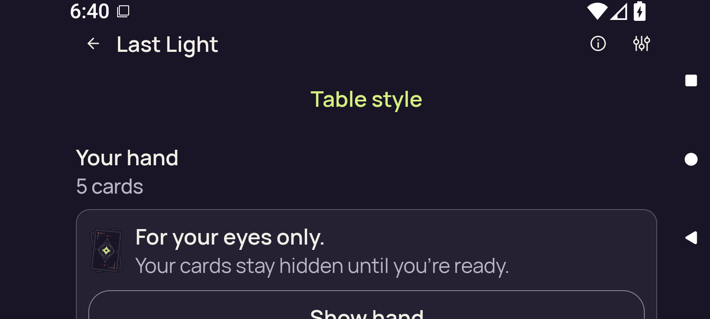</a> <code>2d-landscape-unsupported-return-concealed.png</code> 2d-landscape-unsupported-return-concealed — 2d-landscape.held-rotation | 1600 × 720 px · 69,712 bytes · text 2.0 SHA-256: <code>8ab0869925fa3b575b654159091e23f308671324907ac66d1b2b0ed7006ae838</code> Source: <code>/root/projects/PartyDeck/artifacts/evidence-storage/34514544296/android-adaptive-api36-debug-font-2.0-34514544296-1/godot-adaptive/runtime/captures/2d-landscape-unsupported-return-concealed.png</code> Original case outcome: **failed** Capture: 2026-09-10T18:40:17.102+00:00 → 2026-09-10T18:40:19.525+00:00 [UI XML](runtime/captures/2d-landscape-unsupported-return-concealed.xml) · [Capture JSON](runtime/captures/2d-landscape-unsupported-return-concealed.json) · [Original result](runtime/godot-adaptive-result.json) | **UNVIEWED original — no visual acceptance**. Preserved original capture; not visually reviewed. Stage and outcome labels come from the frozen collector mapping. No pixel observation or visual acceptance is claimed. |
| <a href="runtime/captures/2d-landscape-unsupported-return-selection-cleared.png">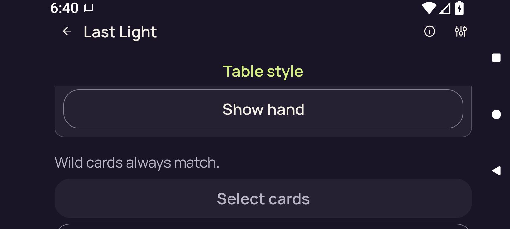</a> <code>2d-landscape-unsupported-return-selection-cleared.png</code> 2d-landscape-unsupported-return-selection-cleared — 2d-landscape.held-rotation | 1600 × 720 px · 57,936 bytes · text 2.0 SHA-256: <code>ad6380ab485e4a399ae2346478a6d12abd98e2d1db075a774889cb7762eb104c</code> Source: <code>/root/projects/PartyDeck/artifacts/evidence-storage/34514544296/android-adaptive-api36-debug-font-2.0-34514544296-1/godot-adaptive/runtime/captures/2d-landscape-unsupported-return-selection-cleared.png</code> Original case outcome: **failed** Capture: 2026-09-10T18:40:27.108+00:00 → 2026-09-10T18:40:29.525+00:00 [UI XML](runtime/captures/2d-landscape-unsupported-return-selection-cleared.xml) · [Capture JSON](runtime/captures/2d-landscape-unsupported-return-selection-cleared.json) · [Original result](runtime/godot-adaptive-result.json) | **UNVIEWED original — no visual acceptance**. Preserved original capture; not visually reviewed. Stage and outcome labels come from the frozen collector mapping. No pixel observation or visual acceptance is claimed. |
| <a href="runtime/captures/2d-landscape-unsupported-return-public.png">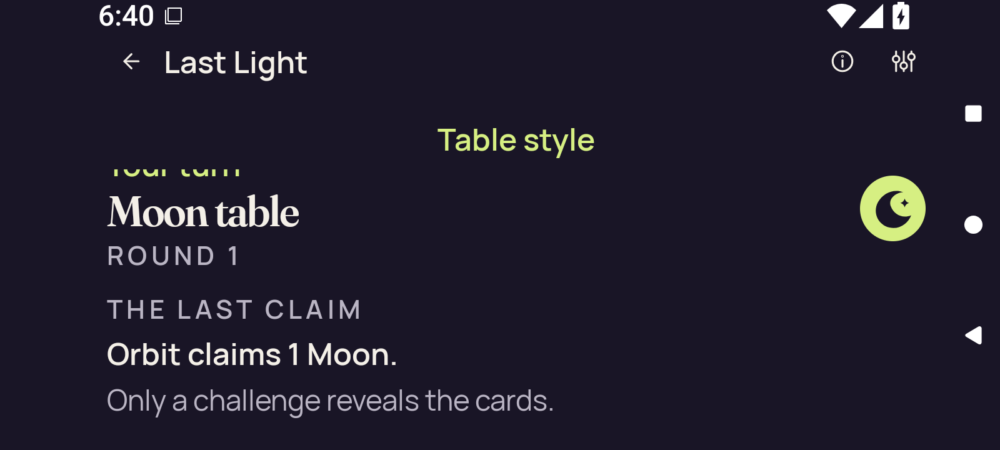</a> <code>2d-landscape-unsupported-return-public.png</code> 2d-landscape-unsupported-return-public — 2d-landscape.held-rotation | 1600 × 720 px · 73,675 bytes · text 2.0 SHA-256: <code>611a82a1b5bb0b096537e4ed4191a14efafbd70742f5be1d274f6f90bb6a220f</code> Source: <code>/root/projects/PartyDeck/artifacts/evidence-storage/34514544296/android-adaptive-api36-debug-font-2.0-34514544296-1/godot-adaptive/runtime/captures/2d-landscape-unsupported-return-public.png</code> Original case outcome: **failed** Capture: 2026-09-10T18:40:45.517+00:00 → 2026-09-10T18:40:47.925+00:00 [UI XML](runtime/captures/2d-landscape-unsupported-return-public.xml) · [Capture JSON](runtime/captures/2d-landscape-unsupported-return-public.json) · [Original result](runtime/godot-adaptive-result.json) | **UNVIEWED original — no visual acceptance**. Preserved original capture; not visually reviewed. Stage and outcome labels come from the frozen collector mapping. No pixel observation or visual acceptance is claimed. |
| <a href="runtime/captures/2d-landscape-unsupported-return-first-card.png">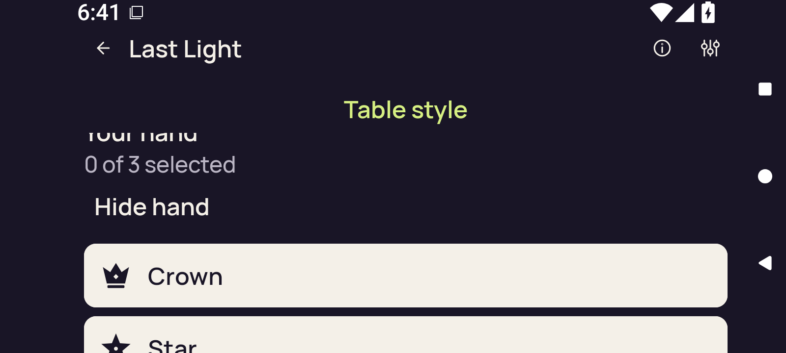</a> <code>2d-landscape-unsupported-return-first-card.png</code> 2d-landscape-unsupported-return-first-card — 2d-landscape.held-rotation | 1600 × 720 px · 50,326 bytes · text 2.0 SHA-256: <code>2d48a1505c48752a59d50a1f065bc509c9c6a5fe31b8f96cd3f8d06aa13fabd2</code> Source: <code>/root/projects/PartyDeck/artifacts/evidence-storage/34514544296/android-adaptive-api36-debug-font-2.0-34514544296-1/godot-adaptive/runtime/captures/2d-landscape-unsupported-return-first-card.png</code> Original case outcome: **failed** Capture: 2026-09-10T18:41:00.467+00:00 → 2026-09-10T18:41:02.911+00:00 [UI XML](runtime/captures/2d-landscape-unsupported-return-first-card.xml) · [Capture JSON](runtime/captures/2d-landscape-unsupported-return-first-card.json) · [Original result](runtime/godot-adaptive-result.json) | **UNVIEWED original — no visual acceptance**. Preserved original capture; not visually reviewed. Stage and outcome labels come from the frozen collector mapping. No pixel observation or visual acceptance is claimed. |
|  <code>2d-landscape-unsupported-portrait-return-concealed.png</code> 2d-landscape-unsupported-portrait-return-concealed — 2d-landscape.held-rotation | 720 × 1600 px · 113,514 bytes · text 2.0 SHA-256: <code>0500693538eb836970ba2b0ada27d192bc6f815b832699f529a8fb25746ec374</code> Source: <code>/root/projects/PartyDeck/artifacts/evidence-storage/34514544296/android-adaptive-api36-debug-font-2.0-34514544296-1/godot-adaptive/runtime/captures/2d-landscape-unsupported-portrait-return-concealed.png</code> Original case outcome: **failed** Capture: 2026-09-10T18:41:08.491+00:00 → 2026-09-10T18:41:10.911+00:00 [UI XML](runtime/captures/2d-landscape-unsupported-portrait-return-concealed.xml) · [Capture JSON](runtime/captures/2d-landscape-unsupported-portrait-return-concealed.json) · [Original result](runtime/godot-adaptive-result.json) | **UNVIEWED original — no visual acceptance**. Preserved original capture; not visually reviewed. Stage and outcome labels come from the frozen collector mapping. No pixel observation or visual acceptance is claimed. |
| <a href="runtime/captures/2d-landscape-unsupported-portrait-return-selection-cleared.png">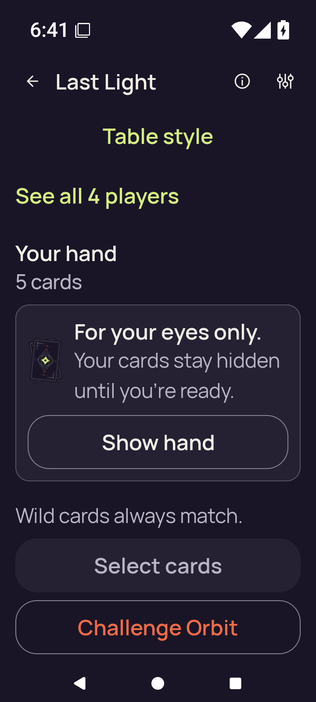</a> <code>2d-landscape-unsupported-portrait-return-selection-cleared.png</code> 2d-landscape-unsupported-portrait-return-selection-cleared — 2d-landscape.held-rotation | 720 × 1600 px · 113,514 bytes · text 2.0 SHA-256: <code>0500693538eb836970ba2b0ada27d192bc6f815b832699f529a8fb25746ec374</code> Source: <code>/root/projects/PartyDeck/artifacts/evidence-storage/34514544296/android-adaptive-api36-debug-font-2.0-34514544296-1/godot-adaptive/runtime/captures/2d-landscape-unsupported-portrait-return-selection-cleared.png</code> Original case outcome: **failed** Capture: 2026-09-10T18:41:12.965+00:00 → 2026-09-10T18:41:15.381+00:00 [UI XML](runtime/captures/2d-landscape-unsupported-portrait-return-selection-cleared.xml) · [Capture JSON](runtime/captures/2d-landscape-unsupported-portrait-return-selection-cleared.json) · [Original result](runtime/godot-adaptive-result.json) | **UNVIEWED original — no visual acceptance**. Preserved original capture; not visually reviewed. Stage and outcome labels come from the frozen collector mapping. No pixel observation or visual acceptance is claimed. |
| <a href="runtime/captures/2d-landscape-unsupported-portrait-return-public.png">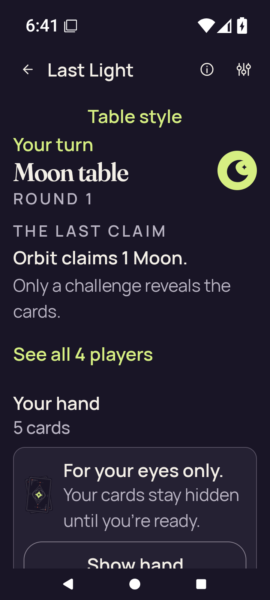</a> <code>2d-landscape-unsupported-portrait-return-public.png</code> 2d-landscape-unsupported-portrait-return-public — 2d-landscape.held-rotation | 720 × 1600 px · 125,766 bytes · text 2.0 SHA-256: <code>2d4857be2d27c64e2908fc687c6fbef8b6bccfa76fa27818280131effa0fadaf</code> Source: <code>/root/projects/PartyDeck/artifacts/evidence-storage/34514544296/android-adaptive-api36-debug-font-2.0-34514544296-1/godot-adaptive/runtime/captures/2d-landscape-unsupported-portrait-return-public.png</code> Original case outcome: **failed** Capture: 2026-09-10T18:41:20.199+00:00 → 2026-09-10T18:41:22.615+00:00 [UI XML](runtime/captures/2d-landscape-unsupported-portrait-return-public.xml) · [Capture JSON](runtime/captures/2d-landscape-unsupported-portrait-return-public.json) · [Original result](runtime/godot-adaptive-result.json) | **UNVIEWED original — no visual acceptance**. Preserved original capture; not visually reviewed. Stage and outcome labels come from the frozen collector mapping. No pixel observation or visual acceptance is claimed. |
| <a href="runtime/captures/2d-landscape-unsupported-portrait-return-first-card.png">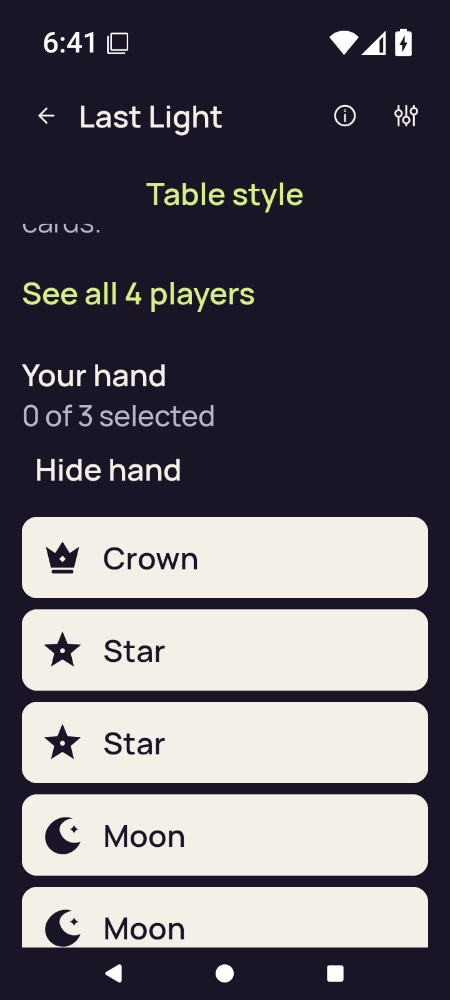</a> <code>2d-landscape-unsupported-portrait-return-first-card.png</code> 2d-landscape-unsupported-portrait-return-first-card — 2d-landscape.held-rotation | 720 × 1600 px · 80,571 bytes · text 2.0 SHA-256: <code>276052a404d3dd0185b367323a497426e078343407955e348975f8d378e4455b</code> Source: <code>/root/projects/PartyDeck/artifacts/evidence-storage/34514544296/android-adaptive-api36-debug-font-2.0-34514544296-1/godot-adaptive/runtime/captures/2d-landscape-unsupported-portrait-return-first-card.png</code> Original case outcome: **failed** Capture: 2026-09-10T18:41:29.531+00:00 → 2026-09-10T18:41:31.965+00:00 [UI XML](runtime/captures/2d-landscape-unsupported-portrait-return-first-card.xml) · [Capture JSON](runtime/captures/2d-landscape-unsupported-portrait-return-first-card.json) · [Original result](runtime/godot-adaptive-result.json) | **UNVIEWED original — no visual acceptance**. Preserved original capture; not visually reviewed. Stage and outcome labels come from the frozen collector mapping. No pixel observation or visual acceptance is claimed. |
| <a href="runtime/captures/2d-landscape-reentry-selected.png">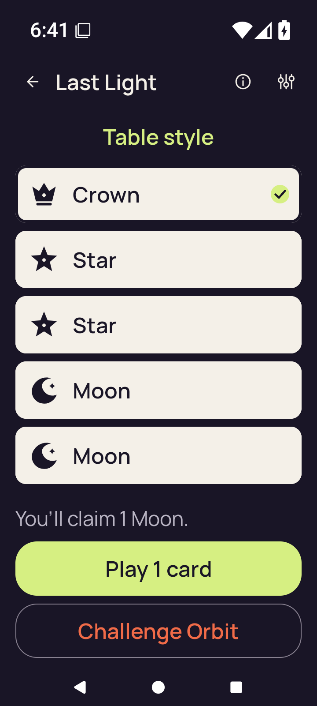</a> <code>2d-landscape-reentry-selected.png</code> 2d-landscape-reentry-selected — 2d-landscape.portrait-reentry-standard | 720 × 1600 px · 82,361 bytes · text 2.0 SHA-256: <code>23e96cc1a15baf0c20f97630eacd0e665804442457e0448d3c0156d5fdbc07f5</code> Source: <code>/root/projects/PartyDeck/artifacts/evidence-storage/34514544296/android-adaptive-api36-debug-font-2.0-34514544296-1/godot-adaptive/runtime/captures/2d-landscape-reentry-selected.png</code> Original case outcome: **failed** Capture: 2026-09-10T18:41:41.069+00:00 → 2026-09-10T18:41:43.470+00:00 [UI XML](runtime/captures/2d-landscape-reentry-selected.xml) · [Capture JSON](runtime/captures/2d-landscape-reentry-selected.json) · [Original result](runtime/godot-adaptive-result.json) | **UNVIEWED original — no visual acceptance**. Preserved original capture; not visually reviewed. Stage and outcome labels come from the frozen collector mapping. No pixel observation or visual acceptance is claimed. |
| <a href="runtime/captures/2d-landscape-portrait-selector.png">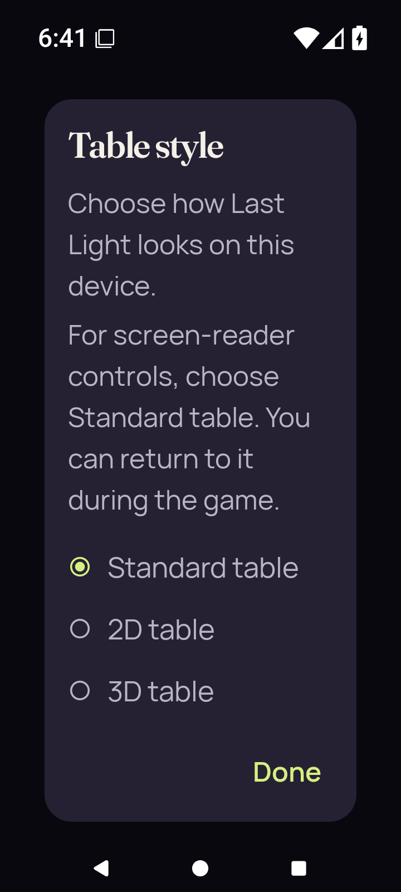</a> <code>2d-landscape-portrait-selector.png</code> 2d-landscape-portrait-selector — 2d-landscape.portrait-reentry-standard | 720 × 1600 px · 97,403 bytes · text 2.0 SHA-256: <code>f072e7e953600c6fc380243f5b231e3b721dfeb9326bbda3042238094281a7ec</code> Source: <code>/root/projects/PartyDeck/artifacts/evidence-storage/34514544296/android-adaptive-api36-debug-font-2.0-34514544296-1/godot-adaptive/runtime/captures/2d-landscape-portrait-selector.png</code> Original case outcome: **failed** Capture: 2026-09-10T18:41:50.381+00:00 → 2026-09-10T18:41:52.813+00:00 [UI XML](runtime/captures/2d-landscape-portrait-selector.xml) · [Capture JSON](runtime/captures/2d-landscape-portrait-selector.json) · [Original result](runtime/godot-adaptive-result.json) | **UNVIEWED original — no visual acceptance**. Preserved original capture; not visually reviewed. Stage and outcome labels come from the frozen collector mapping. No pixel observation or visual acceptance is claimed. |
| <a href="runtime/captures/2d-landscape-portrait-native-ready.png">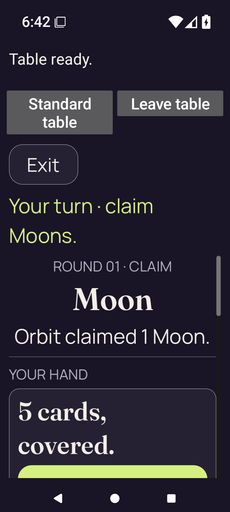</a> <code>2d-landscape-portrait-native-ready.png</code> 2d-landscape-portrait-native-ready — 2d-landscape.portrait-reentry-standard | 720 × 1600 px · 123,981 bytes · text 2.0 SHA-256: <code>437e8d11bd8eefd54b15b238ef4e8a417caff7ae6698de44e207265bce00e253</code> Source: <code>/root/projects/PartyDeck/artifacts/evidence-storage/34514544296/android-adaptive-api36-debug-font-2.0-34514544296-1/godot-adaptive/runtime/captures/2d-landscape-portrait-native-ready.png</code> Original case outcome: **failed** Capture: 2026-09-10T18:42:01.376+00:00 → 2026-09-10T18:42:03.768+00:00 [UI XML](runtime/captures/2d-landscape-portrait-native-ready.xml) · [Capture JSON](runtime/captures/2d-landscape-portrait-native-ready.json) · [Original result](runtime/godot-adaptive-result.json) | **Direct original view**. Round 01, Moon and Orbit claimed 1 Moon. are visible. At 200% text in portrait, Table ready, the wrapped Standard table control, Leave table and Exit fit. The turn prompt wraps across two complete lines; the Last Light title is absent. Round/rank/public context and YOUR HAND are readable. The cover shows 5 cards, covered across two lines, with only the upper green edge of Reveal visible at the bottom clip; its label, seats and lower game actions are outside the captured viewport. No private card face is visible. The native-ready still does not establish scrolling, gameplay completion or continuous privacy. |
|  <code>2d-landscape-standard-return-concealed.png</code> 2d-landscape-standard-return-concealed — 2d-landscape.portrait-reentry-standard | 720 × 1600 px · 114,199 bytes · text 2.0 SHA-256: <code>3ffff4bcf12696bf72ad0e0c0be7171c691209bd5c743b9cf1a2fe6b152f9fe6</code> Source: <code>/root/projects/PartyDeck/artifacts/evidence-storage/34514544296/android-adaptive-api36-debug-font-2.0-34514544296-1/godot-adaptive/runtime/captures/2d-landscape-standard-return-concealed.png</code> Original case outcome: **failed** Capture: 2026-09-10T18:42:19.725+00:00 → 2026-09-10T18:42:22.167+00:00 [UI XML](runtime/captures/2d-landscape-standard-return-concealed.xml) · [Capture JSON](runtime/captures/2d-landscape-standard-return-concealed.json) · [Original result](runtime/godot-adaptive-result.json) | **UNVIEWED original — no visual acceptance**. Preserved original capture; not visually reviewed. Stage and outcome labels come from the frozen collector mapping. No pixel observation or visual acceptance is claimed. |
| <a href="runtime/captures/2d-landscape-standard-return-selection-cleared.png">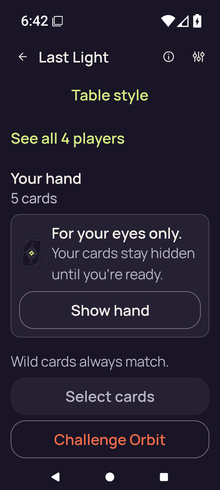</a> <code>2d-landscape-standard-return-selection-cleared.png</code> 2d-landscape-standard-return-selection-cleared — 2d-landscape.portrait-reentry-standard | 720 × 1600 px · 114,199 bytes · text 2.0 SHA-256: <code>3ffff4bcf12696bf72ad0e0c0be7171c691209bd5c743b9cf1a2fe6b152f9fe6</code> Source: <code>/root/projects/PartyDeck/artifacts/evidence-storage/34514544296/android-adaptive-api36-debug-font-2.0-34514544296-1/godot-adaptive/runtime/captures/2d-landscape-standard-return-selection-cleared.png</code> Original case outcome: **failed** Capture: 2026-09-10T18:42:24.218+00:00 → 2026-09-10T18:42:26.654+00:00 [UI XML](runtime/captures/2d-landscape-standard-return-selection-cleared.xml) · [Capture JSON](runtime/captures/2d-landscape-standard-return-selection-cleared.json) · [Original result](runtime/godot-adaptive-result.json) | **UNVIEWED original — no visual acceptance**. Preserved original capture; not visually reviewed. Stage and outcome labels come from the frozen collector mapping. No pixel observation or visual acceptance is claimed. |
| <a href="runtime/captures/2d-landscape-standard-return-public.png">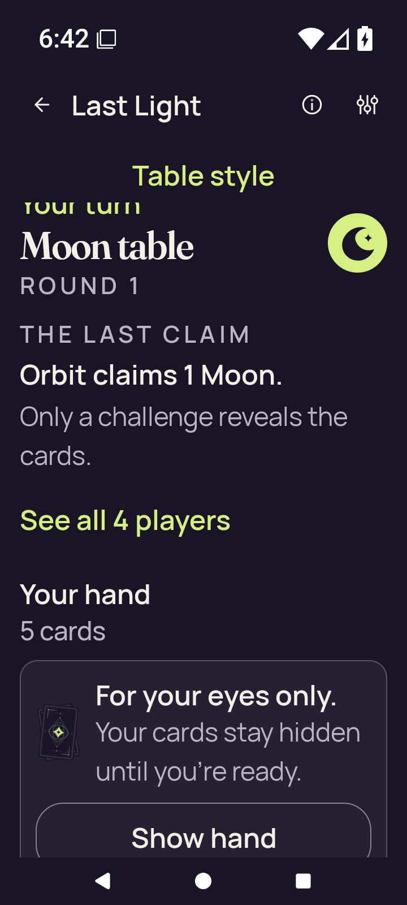</a> <code>2d-landscape-standard-return-public.png</code> 2d-landscape-standard-return-public — 2d-landscape.portrait-reentry-standard | 720 × 1600 px · 127,233 bytes · text 2.0 SHA-256: <code>2375635a755d48adb80b4eabe992ce85e65a62cc287ffd78c2c5787bdba3c2f3</code> Source: <code>/root/projects/PartyDeck/artifacts/evidence-storage/34514544296/android-adaptive-api36-debug-font-2.0-34514544296-1/godot-adaptive/runtime/captures/2d-landscape-standard-return-public.png</code> Original case outcome: **failed** Capture: 2026-09-10T18:42:31.521+00:00 → 2026-09-10T18:42:33.933+00:00 [UI XML](runtime/captures/2d-landscape-standard-return-public.xml) · [Capture JSON](runtime/captures/2d-landscape-standard-return-public.json) · [Original result](runtime/godot-adaptive-result.json) | **UNVIEWED original — no visual acceptance**. Preserved original capture; not visually reviewed. Stage and outcome labels come from the frozen collector mapping. No pixel observation or visual acceptance is claimed. |
| <a href="runtime/captures/2d-landscape-standard-return-first-card.png">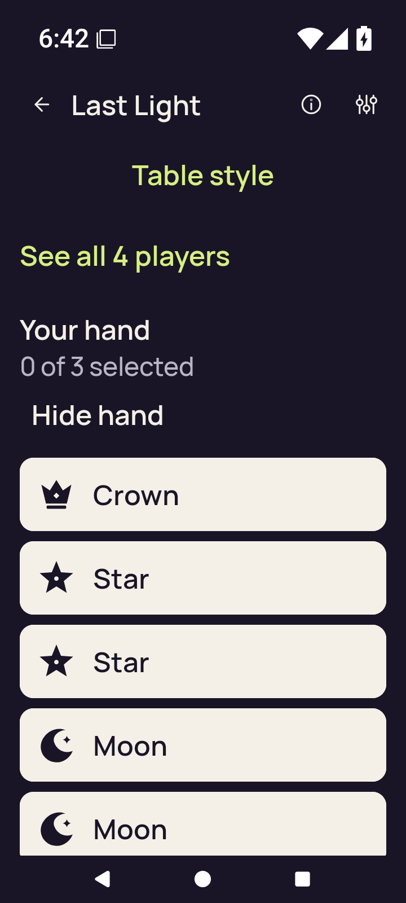</a> <code>2d-landscape-standard-return-first-card.png</code> 2d-landscape-standard-return-first-card — 2d-landscape.portrait-reentry-standard | 720 × 1600 px · 79,101 bytes · text 2.0 SHA-256: <code>b962a8b8a836bef6b5809778dd4afaf4b3e08de95a8974d294f8637518fdcc2d</code> Source: <code>/root/projects/PartyDeck/artifacts/evidence-storage/34514544296/android-adaptive-api36-debug-font-2.0-34514544296-1/godot-adaptive/runtime/captures/2d-landscape-standard-return-first-card.png</code> Original case outcome: **failed** Capture: 2026-09-10T18:42:40.875+00:00 → 2026-09-10T18:42:43.308+00:00 [UI XML](runtime/captures/2d-landscape-standard-return-first-card.xml) · [Capture JSON](runtime/captures/2d-landscape-standard-return-first-card.json) · [Original result](runtime/godot-adaptive-result.json) | **UNVIEWED original — no visual acceptance**. Preserved original capture; not visually reviewed. Stage and outcome labels come from the frozen collector mapping. No pixel observation or visual acceptance is claimed. |
| <a href="runtime/captures/2d-landscape-leave-selected.png">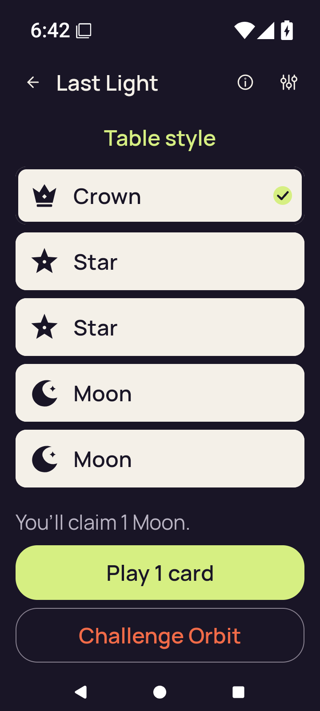</a> <code>2d-landscape-leave-selected.png</code> 2d-landscape-leave-selected — 2d-landscape.native-leave-home | 720 × 1600 px · 82,890 bytes · text 2.0 SHA-256: <code>fd234cf1f37613d6984950d67dfdba19e9bff523727682eb5669a1e353426056</code> Source: <code>/root/projects/PartyDeck/artifacts/evidence-storage/34514544296/android-adaptive-api36-debug-font-2.0-34514544296-1/godot-adaptive/runtime/captures/2d-landscape-leave-selected.png</code> Original case outcome: **failed** Capture: 2026-09-10T18:42:52.434+00:00 → 2026-09-10T18:42:54.878+00:00 [UI XML](runtime/captures/2d-landscape-leave-selected.xml) · [Capture JSON](runtime/captures/2d-landscape-leave-selected.json) · [Original result](runtime/godot-adaptive-result.json) | **UNVIEWED original — no visual acceptance**. Preserved original capture; not visually reviewed. Stage and outcome labels come from the frozen collector mapping. No pixel observation or visual acceptance is claimed. |
|  <code>2d-landscape-leave-selector.png</code> 2d-landscape-leave-selector — 2d-landscape.native-leave-home | 720 × 1600 px · 98,166 bytes · text 2.0 SHA-256: <code>1c5d3cd510849f9ae2ee41767bd5d82672d4b10eecf97ef7dda88f3a184e2fb7</code> Source: <code>/root/projects/PartyDeck/artifacts/evidence-storage/34514544296/android-adaptive-api36-debug-font-2.0-34514544296-1/godot-adaptive/runtime/captures/2d-landscape-leave-selector.png</code> Original case outcome: **failed** Capture: 2026-09-10T18:43:01.819+00:00 → 2026-09-10T18:43:04.252+00:00 [UI XML](runtime/captures/2d-landscape-leave-selector.xml) · [Capture JSON](runtime/captures/2d-landscape-leave-selector.json) · [Original result](runtime/godot-adaptive-result.json) | **UNVIEWED original — no visual acceptance**. Preserved original capture; not visually reviewed. Stage and outcome labels come from the frozen collector mapping. No pixel observation or visual acceptance is claimed. |
| <a href="runtime/captures/2d-landscape-leave-native-ready.png">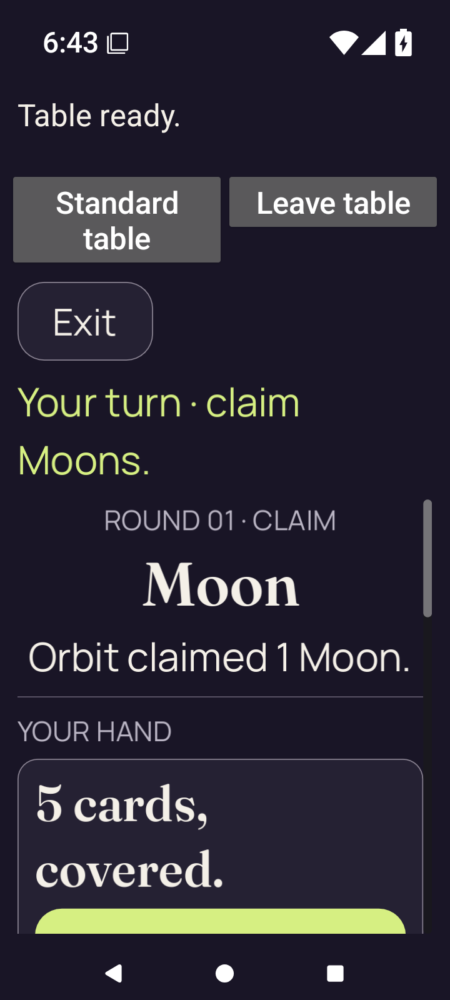</a> <code>2d-landscape-leave-native-ready.png</code> 2d-landscape-leave-native-ready — 2d-landscape.native-leave-home | 720 × 1600 px · 124,136 bytes · text 2.0 SHA-256: <code>a3dada521cc5221e4c046e8985111ef37d075500c9568b369de47759f4989307</code> Source: <code>/root/projects/PartyDeck/artifacts/evidence-storage/34514544296/android-adaptive-api36-debug-font-2.0-34514544296-1/godot-adaptive/runtime/captures/2d-landscape-leave-native-ready.png</code> Original case outcome: **failed** Capture: 2026-09-10T18:43:12.909+00:00 → 2026-09-10T18:43:15.342+00:00 [UI XML](runtime/captures/2d-landscape-leave-native-ready.xml) · [Capture JSON](runtime/captures/2d-landscape-leave-native-ready.json) · [Original result](runtime/godot-adaptive-result.json) | **Direct original view**. Round 01, Moon and Orbit claimed 1 Moon. are visible. At 200% text in portrait, Table ready, wrapped Standard table, Leave table and Exit fit. The turn prompt wraps across two complete lines; Last Light is absent. Round/rank/public context and YOUR HAND fit. The cover count wraps across two lines and only the upper green edge of Reveal is visible at the bottom clip. Its label, seats and lower game actions are outside the viewport. No private card face appears. This leave-native-ready capture preserves a separate source identity and does not establish the following leave transition or continuous privacy. |
|  <code>2d-landscape-leave-confirmation.png</code> 2d-landscape-leave-confirmation — 2d-landscape.native-leave-home | 720 × 1600 px · 62,518 bytes · text 2.0 SHA-256: <code>83dc2c5f9057034b63ca4cbd76b15f5a431e51fb84335b9f025f8173c4195904</code> Source: <code>/root/projects/PartyDeck/artifacts/evidence-storage/34514544296/android-adaptive-api36-debug-font-2.0-34514544296-1/godot-adaptive/runtime/captures/2d-landscape-leave-confirmation.png</code> Original case outcome: **failed** Capture: 2026-09-10T18:43:22.666+00:00 → 2026-09-10T18:43:25.095+00:00 [UI XML](runtime/captures/2d-landscape-leave-confirmation.xml) · [Capture JSON](runtime/captures/2d-landscape-leave-confirmation.json) · [Original result](runtime/godot-adaptive-result.json) | **UNVIEWED original — no visual acceptance**. Preserved original capture; not visually reviewed. Stage and outcome labels come from the frozen collector mapping. No pixel observation or visual acceptance is claimed. |
| <a href="runtime/captures/2d-landscape-home.png">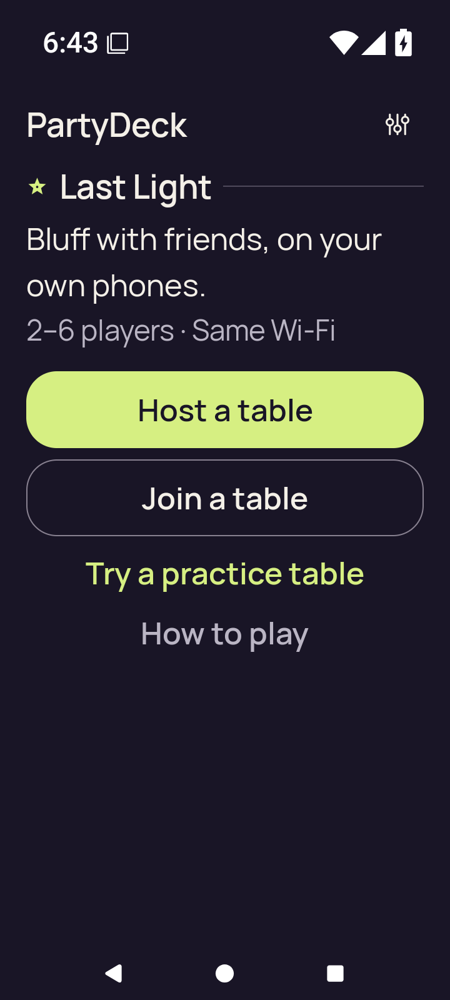</a> <code>2d-landscape-home.png</code> 2d-landscape-home — 2d-landscape.native-leave-home | 720 × 1600 px · 80,926 bytes · text 2.0 SHA-256: <code>9d2feb072fc7cee0b751d6b4f039c900bf51331de60402cd574effcb7a66862f</code> Source: <code>/root/projects/PartyDeck/artifacts/evidence-storage/34514544296/android-adaptive-api36-debug-font-2.0-34514544296-1/godot-adaptive/runtime/captures/2d-landscape-home.png</code> Original case outcome: **failed** Capture: 2026-09-10T18:43:29.528+00:00 → 2026-09-10T18:43:31.933+00:00 [UI XML](runtime/captures/2d-landscape-home.xml) · [Capture JSON](runtime/captures/2d-landscape-home.json) · [Original result](runtime/godot-adaptive-result.json) | **UNVIEWED original — no visual acceptance**. Preserved original capture; not visually reviewed. Stage and outcome labels come from the frozen collector mapping. No pixel observation or visual acceptance is claimed. |
| <a href="runtime/captures/2d-seascape-baseline-public.png">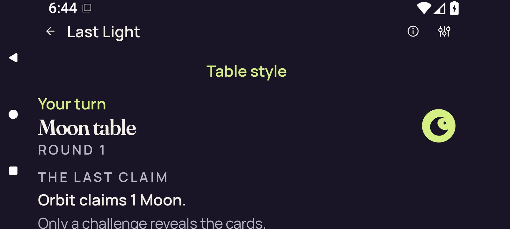</a> <code>2d-seascape-baseline-public.png</code> 2d-seascape-baseline-public — 2d-seascape.initial-landscape | 1600 × 720 px · 74,708 bytes · text 2.0 SHA-256: <code>7c4c21de6fbdc2d8d2b2136b58cd95495d08305c151e2abdd9c902ee2f11e79a</code> Source: <code>/root/projects/PartyDeck/artifacts/evidence-storage/34514544296/android-adaptive-api36-debug-font-2.0-34514544296-1/godot-adaptive/runtime/captures/2d-seascape-baseline-public.png</code> Original case outcome: **failed** Capture: 2026-09-10T18:44:10.997+00:00 → 2026-09-10T18:44:13.431+00:00 [UI XML](runtime/captures/2d-seascape-baseline-public.xml) · [Capture JSON](runtime/captures/2d-seascape-baseline-public.json) · [Original result](runtime/godot-adaptive-result.json) | **UNVIEWED original — no visual acceptance**. Preserved original capture; not visually reviewed. Stage and outcome labels come from the frozen collector mapping. No pixel observation or visual acceptance is claimed. |
| <a href="runtime/captures/2d-seascape-baseline-first-card.png">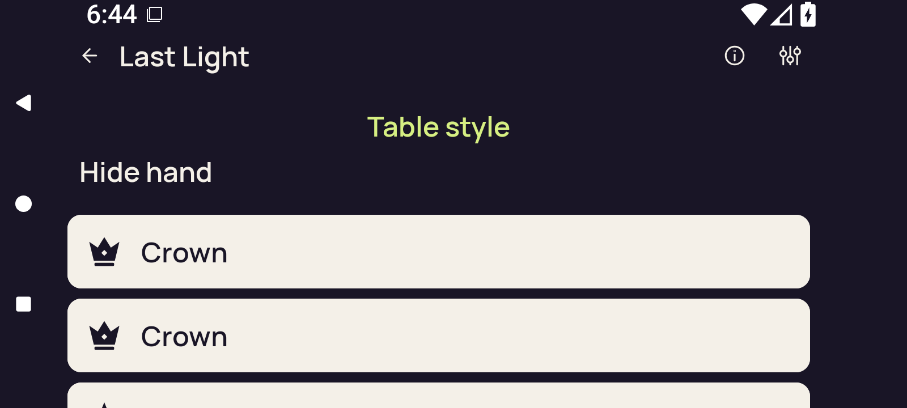</a> <code>2d-seascape-baseline-first-card.png</code> 2d-seascape-baseline-first-card — 2d-seascape.initial-landscape | 1600 × 720 px · 46,610 bytes · text 2.0 SHA-256: <code>607424266beba0ebf92563a617564ebe1050cfcb3662952c819ba308ebc7c0b9</code> Source: <code>/root/projects/PartyDeck/artifacts/evidence-storage/34514544296/android-adaptive-api36-debug-font-2.0-34514544296-1/godot-adaptive/runtime/captures/2d-seascape-baseline-first-card.png</code> Original case outcome: **failed** Capture: 2026-09-10T18:44:28.694+00:00 → 2026-09-10T18:44:31.114+00:00 [UI XML](runtime/captures/2d-seascape-baseline-first-card.xml) · [Capture JSON](runtime/captures/2d-seascape-baseline-first-card.json) · [Original result](runtime/godot-adaptive-result.json) | **UNVIEWED original — no visual acceptance**. Preserved original capture; not visually reviewed. Stage and outcome labels come from the frozen collector mapping. No pixel observation or visual acceptance is claimed. |
| <a href="runtime/captures/2d-seascape-baseline-selected.png">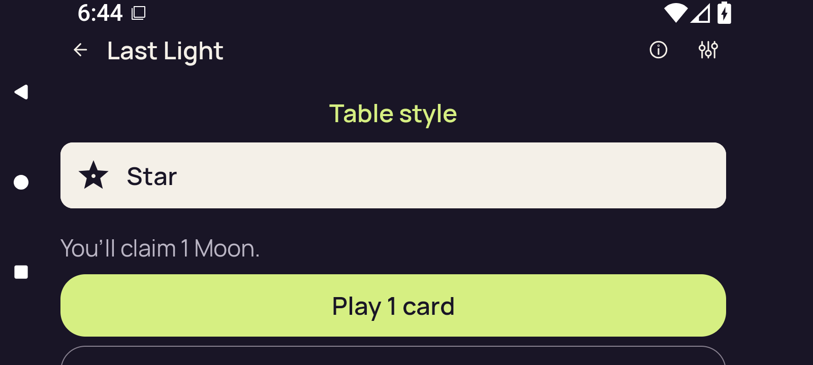</a> <code>2d-seascape-baseline-selected.png</code> 2d-seascape-baseline-selected — 2d-seascape.initial-landscape | 1600 × 720 px · 48,080 bytes · text 2.0 SHA-256: <code>1b1aa8824cae3ddb1149a5612c60a947affb7f961ae419caaad8f0582d229590</code> Source: <code>/root/projects/PartyDeck/artifacts/evidence-storage/34514544296/android-adaptive-api36-debug-font-2.0-34514544296-1/godot-adaptive/runtime/captures/2d-seascape-baseline-selected.png</code> Original case outcome: **failed** Capture: 2026-09-10T18:44:48.519+00:00 → 2026-09-10T18:44:50.942+00:00 [UI XML](runtime/captures/2d-seascape-baseline-selected.xml) · [Capture JSON](runtime/captures/2d-seascape-baseline-selected.json) · [Original result](runtime/godot-adaptive-result.json) | **UNVIEWED original — no visual acceptance**. Preserved original capture; not visually reviewed. Stage and outcome labels come from the frozen collector mapping. No pixel observation or visual acceptance is claimed. |
| <a href="runtime/captures/2d-seascape-initial-selector.png">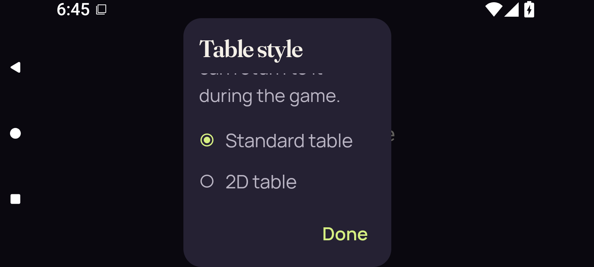</a> <code>2d-seascape-initial-selector.png</code> 2d-seascape-initial-selector — 2d-seascape.initial-landscape | 1600 × 720 px · 49,810 bytes · text 2.0 SHA-256: <code>3e2ecbdf0b720f562032069be9703052dc7c1f356f95b4852445eb629ba3a613</code> Source: <code>/root/projects/PartyDeck/artifacts/evidence-storage/34514544296/android-adaptive-api36-debug-font-2.0-34514544296-1/godot-adaptive/runtime/captures/2d-seascape-initial-selector.png</code> Original case outcome: **failed** Capture: 2026-09-10T18:45:09.238+00:00 → 2026-09-10T18:45:11.647+00:00 [UI XML](runtime/captures/2d-seascape-initial-selector.xml) · [Capture JSON](runtime/captures/2d-seascape-initial-selector.json) · [Original result](runtime/godot-adaptive-result.json) | **UNVIEWED original — no visual acceptance**. Preserved original capture; not visually reviewed. Stage and outcome labels come from the frozen collector mapping. No pixel observation or visual acceptance is claimed. |
| <a href="runtime/captures/2d-seascape-initial-native-ready.png">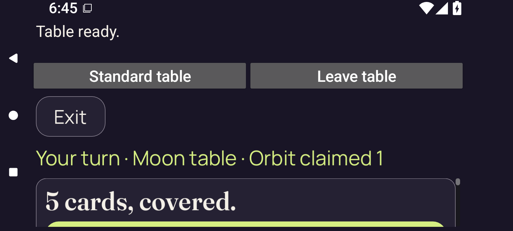</a> <code>2d-seascape-initial-native-ready.png</code> 2d-seascape-initial-native-ready — 2d-seascape.initial-landscape | 1600 × 720 px · 85,650 bytes · text 2.0 SHA-256: <code>a81b4a16f1b244635b1c8d78751a70e81f6a9c89b03ef224c337e3d3b32f4ea5</code> Source: <code>/root/projects/PartyDeck/artifacts/evidence-storage/34514544296/android-adaptive-api36-debug-font-2.0-34514544296-1/godot-adaptive/runtime/captures/2d-seascape-initial-native-ready.png</code> Original case outcome: **failed** Capture: 2026-09-10T18:45:20.214+00:00 → 2026-09-10T18:45:22.608+00:00 [UI XML](runtime/captures/2d-seascape-initial-native-ready.xml) · [Capture JSON](runtime/captures/2d-seascape-initial-native-ready.json) · [Original result](runtime/godot-adaptive-result.json) | **Direct original view**. Your turn · Moon table · Orbit claimed 1 is visible with Android navigation on the left in this separate seascape capture. At 200% text in landscape, Table ready, Standard table/Leave table and Exit fit; Last Light is absent. The single-line public context is readable. The five-card cover count fits, but only the upper green edge of Reveal is visible at the bottom clip. The Reveal label and lower game actions are outside the viewport. No private card face appears. The native-ready still does not establish transition completion, scrolling or continuous privacy. |
| <a href="runtime/captures/2d-seascape-unsupported-return-concealed.png">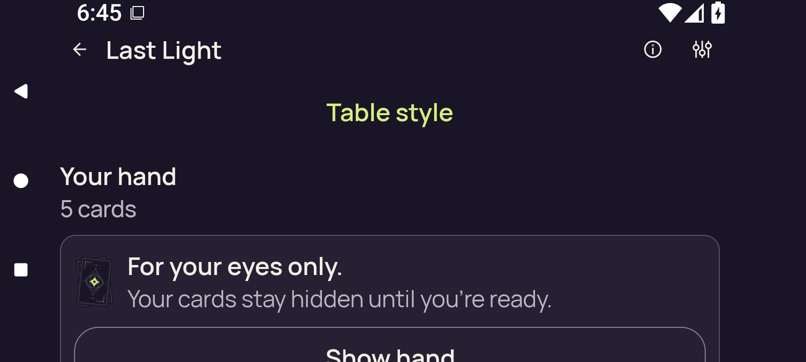</a> <code>2d-seascape-unsupported-return-concealed.png</code> 2d-seascape-unsupported-return-concealed — 2d-seascape.held-rotation | 1600 × 720 px · 70,563 bytes · text 2.0 SHA-256: <code>5533592bd73d077ee9436c594f924f020507dc7ce590d561851adf04bdd7f1ce</code> Source: <code>/root/projects/PartyDeck/artifacts/evidence-storage/34514544296/android-adaptive-api36-debug-font-2.0-34514544296-1/godot-adaptive/runtime/captures/2d-seascape-unsupported-return-concealed.png</code> Original case outcome: **failed** Capture: 2026-09-10T18:45:56.446+00:00 → 2026-09-10T18:45:58.867+00:00 [UI XML](runtime/captures/2d-seascape-unsupported-return-concealed.xml) · [Capture JSON](runtime/captures/2d-seascape-unsupported-return-concealed.json) · [Original result](runtime/godot-adaptive-result.json) | **UNVIEWED original — no visual acceptance**. Preserved original capture; not visually reviewed. Stage and outcome labels come from the frozen collector mapping. No pixel observation or visual acceptance is claimed. |
| <a href="runtime/captures/2d-seascape-unsupported-return-selection-cleared.png">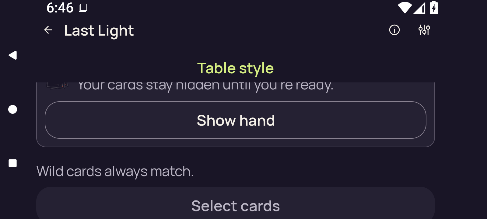</a> <code>2d-seascape-unsupported-return-selection-cleared.png</code> 2d-seascape-unsupported-return-selection-cleared — 2d-seascape.held-rotation | 1600 × 720 px · 66,563 bytes · text 2.0 SHA-256: <code>2ed85df56ffc3c694f00529391e022f0b4c2418d347c69fd02d96644e5aad34a</code> Source: <code>/root/projects/PartyDeck/artifacts/evidence-storage/34514544296/android-adaptive-api36-debug-font-2.0-34514544296-1/godot-adaptive/runtime/captures/2d-seascape-unsupported-return-selection-cleared.png</code> Original case outcome: **failed** Capture: 2026-09-10T18:46:06.368+00:00 → 2026-09-10T18:46:08.757+00:00 [UI XML](runtime/captures/2d-seascape-unsupported-return-selection-cleared.xml) · [Capture JSON](runtime/captures/2d-seascape-unsupported-return-selection-cleared.json) · [Original result](runtime/godot-adaptive-result.json) | **UNVIEWED original — no visual acceptance**. Preserved original capture; not visually reviewed. Stage and outcome labels come from the frozen collector mapping. No pixel observation or visual acceptance is claimed. |
|  <code>2d-seascape-unsupported-return-public.png</code> 2d-seascape-unsupported-return-public — 2d-seascape.held-rotation | 1600 × 720 px · 74,784 bytes · text 2.0 SHA-256: <code>85fd0fc36fe331f7db498fb662a482f44d0d1c990494b59f07a034f363aa9f1f</code> Source: <code>/root/projects/PartyDeck/artifacts/evidence-storage/34514544296/android-adaptive-api36-debug-font-2.0-34514544296-1/godot-adaptive/runtime/captures/2d-seascape-unsupported-return-public.png</code> Original case outcome: **failed** Capture: 2026-09-10T18:46:21.892+00:00 → 2026-09-10T18:46:24.268+00:00 [UI XML](runtime/captures/2d-seascape-unsupported-return-public.xml) · [Capture JSON](runtime/captures/2d-seascape-unsupported-return-public.json) · [Original result](runtime/godot-adaptive-result.json) | **UNVIEWED original — no visual acceptance**. Preserved original capture; not visually reviewed. Stage and outcome labels come from the frozen collector mapping. No pixel observation or visual acceptance is claimed. |
| <a href="runtime/captures/2d-seascape-unsupported-return-first-card.png">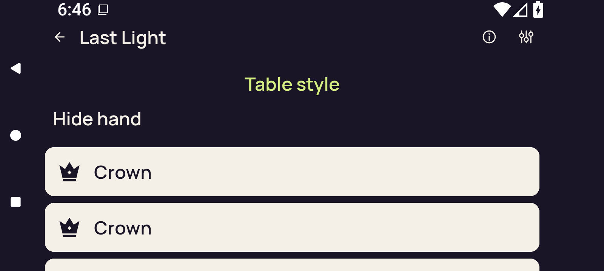</a> <code>2d-seascape-unsupported-return-first-card.png</code> 2d-seascape-unsupported-return-first-card — 2d-seascape.held-rotation | 1600 × 720 px · 46,399 bytes · text 2.0 SHA-256: <code>9384b789a6e6b7dad71b469a1d780f1c1f2f676f52c6bb8bcbb3cba682f0b6dc</code> Source: <code>/root/projects/PartyDeck/artifacts/evidence-storage/34514544296/android-adaptive-api36-debug-font-2.0-34514544296-1/godot-adaptive/runtime/captures/2d-seascape-unsupported-return-first-card.png</code> Original case outcome: **failed** Capture: 2026-09-10T18:46:39.546+00:00 → 2026-09-10T18:46:41.927+00:00 [UI XML](runtime/captures/2d-seascape-unsupported-return-first-card.xml) · [Capture JSON](runtime/captures/2d-seascape-unsupported-return-first-card.json) · [Original result](runtime/godot-adaptive-result.json) | **UNVIEWED original — no visual acceptance**. Preserved original capture; not visually reviewed. Stage and outcome labels come from the frozen collector mapping. No pixel observation or visual acceptance is claimed. |
| <a href="runtime/captures/2d-seascape-unsupported-portrait-return-concealed.png">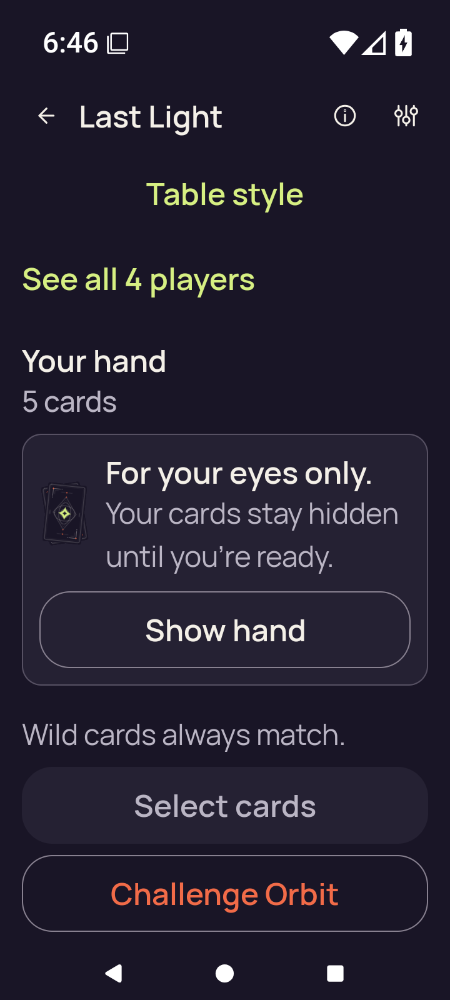</a> <code>2d-seascape-unsupported-portrait-return-concealed.png</code> 2d-seascape-unsupported-portrait-return-concealed — 2d-seascape.held-rotation | 720 × 1600 px · 113,542 bytes · text 2.0 SHA-256: <code>f0a9d7b1daf225964da00f60c4a591a3f9e7085926a78c8d46f124a778f7661f</code> Source: <code>/root/projects/PartyDeck/artifacts/evidence-storage/34514544296/android-adaptive-api36-debug-font-2.0-34514544296-1/godot-adaptive/runtime/captures/2d-seascape-unsupported-portrait-return-concealed.png</code> Original case outcome: **failed** Capture: 2026-09-10T18:46:47.313+00:00 → 2026-09-10T18:46:49.706+00:00 [UI XML](runtime/captures/2d-seascape-unsupported-portrait-return-concealed.xml) · [Capture JSON](runtime/captures/2d-seascape-unsupported-portrait-return-concealed.json) · [Original result](runtime/godot-adaptive-result.json) | **UNVIEWED original — no visual acceptance**. Preserved original capture; not visually reviewed. Stage and outcome labels come from the frozen collector mapping. No pixel observation or visual acceptance is claimed. |
|  <code>2d-seascape-unsupported-portrait-return-selection-cleared.png</code> 2d-seascape-unsupported-portrait-return-selection-cleared — 2d-seascape.held-rotation | 720 × 1600 px · 113,542 bytes · text 2.0 SHA-256: <code>f0a9d7b1daf225964da00f60c4a591a3f9e7085926a78c8d46f124a778f7661f</code> Source: <code>/root/projects/PartyDeck/artifacts/evidence-storage/34514544296/android-adaptive-api36-debug-font-2.0-34514544296-1/godot-adaptive/runtime/captures/2d-seascape-unsupported-portrait-return-selection-cleared.png</code> Original case outcome: **failed** Capture: 2026-09-10T18:46:51.732+00:00 → 2026-09-10T18:46:54.132+00:00 [UI XML](runtime/captures/2d-seascape-unsupported-portrait-return-selection-cleared.xml) · [Capture JSON](runtime/captures/2d-seascape-unsupported-portrait-return-selection-cleared.json) · [Original result](runtime/godot-adaptive-result.json) | **UNVIEWED original — no visual acceptance**. Preserved original capture; not visually reviewed. Stage and outcome labels come from the frozen collector mapping. No pixel observation or visual acceptance is claimed. |
| <a href="runtime/captures/2d-seascape-unsupported-portrait-return-public.png">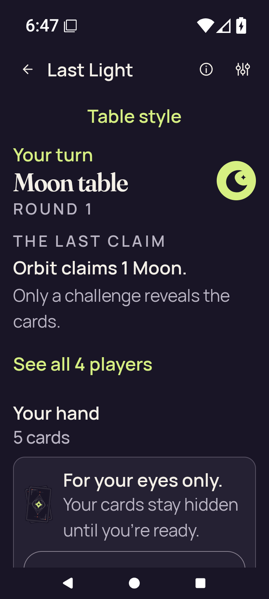</a> <code>2d-seascape-unsupported-portrait-return-public.png</code> 2d-seascape-unsupported-portrait-return-public — 2d-seascape.held-rotation | 720 × 1600 px · 121,834 bytes · text 2.0 SHA-256: <code>70bf548a7b584198208cd2ff34521bc426d261ac2b34809f2f10b9a71e1e109c</code> Source: <code>/root/projects/PartyDeck/artifacts/evidence-storage/34514544296/android-adaptive-api36-debug-font-2.0-34514544296-1/godot-adaptive/runtime/captures/2d-seascape-unsupported-portrait-return-public.png</code> Original case outcome: **failed** Capture: 2026-09-10T18:46:58.946+00:00 → 2026-09-10T18:47:01.318+00:00 [UI XML](runtime/captures/2d-seascape-unsupported-portrait-return-public.xml) · [Capture JSON](runtime/captures/2d-seascape-unsupported-portrait-return-public.json) · [Original result](runtime/godot-adaptive-result.json) | **UNVIEWED original — no visual acceptance**. Preserved original capture; not visually reviewed. Stage and outcome labels come from the frozen collector mapping. No pixel observation or visual acceptance is claimed. |
| <a href="runtime/captures/2d-seascape-unsupported-portrait-return-first-card.png">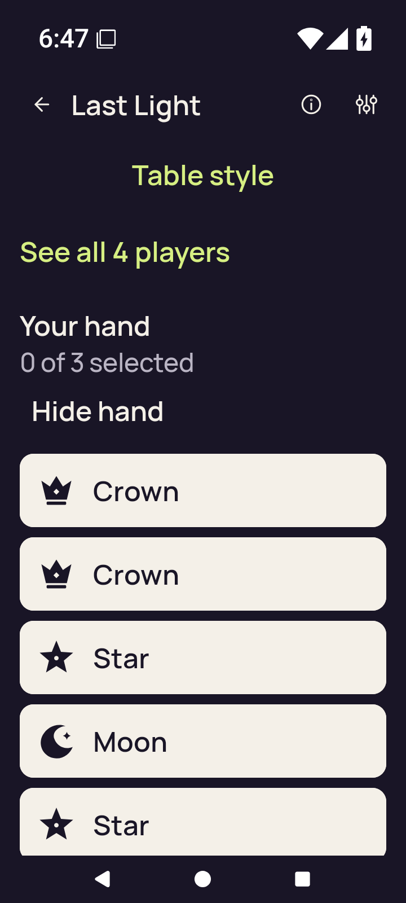</a> <code>2d-seascape-unsupported-portrait-return-first-card.png</code> 2d-seascape-unsupported-portrait-return-first-card — 2d-seascape.held-rotation | 720 × 1600 px · 80,121 bytes · text 2.0 SHA-256: <code>332aeefbfae7686ec800b26fd08948bc6fbb2f1b6e9bb6bc3e02625f8522a87e</code> Source: <code>/root/projects/PartyDeck/artifacts/evidence-storage/34514544296/android-adaptive-api36-debug-font-2.0-34514544296-1/godot-adaptive/runtime/captures/2d-seascape-unsupported-portrait-return-first-card.png</code> Original case outcome: **failed** Capture: 2026-09-10T18:47:08.208+00:00 → 2026-09-10T18:47:10.603+00:00 [UI XML](runtime/captures/2d-seascape-unsupported-portrait-return-first-card.xml) · [Capture JSON](runtime/captures/2d-seascape-unsupported-portrait-return-first-card.json) · [Original result](runtime/godot-adaptive-result.json) | **UNVIEWED original — no visual acceptance**. Preserved original capture; not visually reviewed. Stage and outcome labels come from the frozen collector mapping. No pixel observation or visual acceptance is claimed. |
| <a href="runtime/captures/2d-seascape-reentry-selected.png">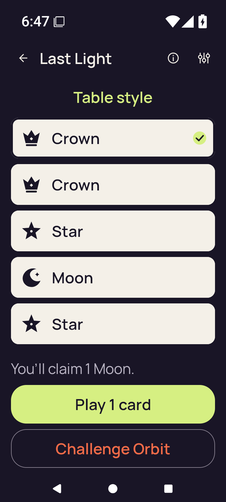</a> <code>2d-seascape-reentry-selected.png</code> 2d-seascape-reentry-selected — 2d-seascape.portrait-reentry-standard | 720 × 1600 px · 83,748 bytes · text 2.0 SHA-256: <code>78c6ca6239b47c9969ee2bdab7ab548d410b3a0e3f9143c75f0c7990a75f73ad</code> Source: <code>/root/projects/PartyDeck/artifacts/evidence-storage/34514544296/android-adaptive-api36-debug-font-2.0-34514544296-1/godot-adaptive/runtime/captures/2d-seascape-reentry-selected.png</code> Original case outcome: **failed** Capture: 2026-09-10T18:47:19.628+00:00 → 2026-09-10T18:47:22.023+00:00 [UI XML](runtime/captures/2d-seascape-reentry-selected.xml) · [Capture JSON](runtime/captures/2d-seascape-reentry-selected.json) · [Original result](runtime/godot-adaptive-result.json) | **UNVIEWED original — no visual acceptance**. Preserved original capture; not visually reviewed. Stage and outcome labels come from the frozen collector mapping. No pixel observation or visual acceptance is claimed. |
|  <code>2d-seascape-portrait-selector.png</code> 2d-seascape-portrait-selector — 2d-seascape.portrait-reentry-standard | 720 × 1600 px · 97,649 bytes · text 2.0 SHA-256: <code>df2b85a28556c2df2440cf05385e4771271783de161b3b793a4fa3347793f043</code> Source: <code>/root/projects/PartyDeck/artifacts/evidence-storage/34514544296/android-adaptive-api36-debug-font-2.0-34514544296-1/godot-adaptive/runtime/captures/2d-seascape-portrait-selector.png</code> Original case outcome: **failed** Capture: 2026-09-10T18:47:28.603+00:00 → 2026-09-10T18:47:31.011+00:00 [UI XML](runtime/captures/2d-seascape-portrait-selector.xml) · [Capture JSON](runtime/captures/2d-seascape-portrait-selector.json) · [Original result](runtime/godot-adaptive-result.json) | **UNVIEWED original — no visual acceptance**. Preserved original capture; not visually reviewed. Stage and outcome labels come from the frozen collector mapping. No pixel observation or visual acceptance is claimed. |
|  <code>2d-seascape-portrait-native-ready.png</code> 2d-seascape-portrait-native-ready — 2d-seascape.portrait-reentry-standard | 720 × 1600 px · 123,557 bytes · text 2.0 SHA-256: <code>dc68e42605b769439b574d26f3b619ac42ccff09e533923e96557c1cdd42e422</code> Source: <code>/root/projects/PartyDeck/artifacts/evidence-storage/34514544296/android-adaptive-api36-debug-font-2.0-34514544296-1/godot-adaptive/runtime/captures/2d-seascape-portrait-native-ready.png</code> Original case outcome: **failed** Capture: 2026-09-10T18:47:39.740+00:00 → 2026-09-10T18:47:42.142+00:00 [UI XML](runtime/captures/2d-seascape-portrait-native-ready.xml) · [Capture JSON](runtime/captures/2d-seascape-portrait-native-ready.json) · [Original result](runtime/godot-adaptive-result.json) | **Direct original view**. Round 01, Moon and Orbit claimed 1 Moon. are visible in this separate seascape portrait capture. At 200% text in portrait, Table ready, the wrapped Standard table control, Leave table and Exit fit. The turn prompt wraps across two complete lines; the Last Light title is absent. Round/rank/public context and YOUR HAND are readable. The cover shows 5 cards, covered across two lines, with only the upper green edge of Reveal visible at the bottom clip; its label, seats and lower game actions are outside the captured viewport. No private card face is visible. The native-ready still does not establish scrolling, gameplay completion or continuous privacy. |
| <a href="runtime/captures/2d-seascape-standard-return-concealed.png">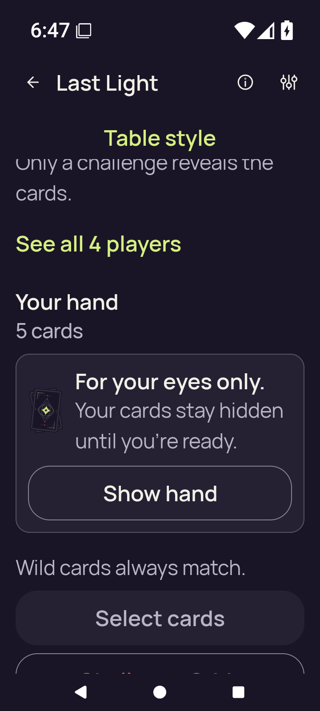</a> <code>2d-seascape-standard-return-concealed.png</code> 2d-seascape-standard-return-concealed — 2d-seascape.portrait-reentry-standard | 720 × 1600 px · 117,320 bytes · text 2.0 SHA-256: <code>5e3a612536e3e2fe0332a5b71869391db708fb150984760a34104f0daf2c02e9</code> Source: <code>/root/projects/PartyDeck/artifacts/evidence-storage/34514544296/android-adaptive-api36-debug-font-2.0-34514544296-1/godot-adaptive/runtime/captures/2d-seascape-standard-return-concealed.png</code> Original case outcome: **failed** Capture: 2026-09-10T18:47:57.782+00:00 → 2026-09-10T18:48:00.168+00:00 [UI XML](runtime/captures/2d-seascape-standard-return-concealed.xml) · [Capture JSON](runtime/captures/2d-seascape-standard-return-concealed.json) · [Original result](runtime/godot-adaptive-result.json) | **UNVIEWED original — no visual acceptance**. Preserved original capture; not visually reviewed. Stage and outcome labels come from the frozen collector mapping. No pixel observation or visual acceptance is claimed. |
|  <code>2d-seascape-standard-return-selection-cleared.png</code> 2d-seascape-standard-return-selection-cleared — 2d-seascape.portrait-reentry-standard | 720 × 1600 px · 118,045 bytes · text 2.0 SHA-256: <code>d9f6f60feef426bfc233abc0ff08aeea0835dcf0589d3447510c3a12b7ac126b</code> Source: <code>/root/projects/PartyDeck/artifacts/evidence-storage/34514544296/android-adaptive-api36-debug-font-2.0-34514544296-1/godot-adaptive/runtime/captures/2d-seascape-standard-return-selection-cleared.png</code> Original case outcome: **failed** Capture: 2026-09-10T18:48:02.194+00:00 → 2026-09-10T18:48:04.573+00:00 [UI XML](runtime/captures/2d-seascape-standard-return-selection-cleared.xml) · [Capture JSON](runtime/captures/2d-seascape-standard-return-selection-cleared.json) · [Original result](runtime/godot-adaptive-result.json) | **UNVIEWED original — no visual acceptance**. Preserved original capture; not visually reviewed. Stage and outcome labels come from the frozen collector mapping. No pixel observation or visual acceptance is claimed. |
|  <code>2d-seascape-standard-return-public.png</code> 2d-seascape-standard-return-public — 2d-seascape.portrait-reentry-standard | 720 × 1600 px · 122,505 bytes · text 2.0 SHA-256: <code>71b4e4ebca58c2bad0ec2a8e0049f55a6ffe23e71cec91ca3a2c3fa3f7dd6fe9</code> Source: <code>/root/projects/PartyDeck/artifacts/evidence-storage/34514544296/android-adaptive-api36-debug-font-2.0-34514544296-1/godot-adaptive/runtime/captures/2d-seascape-standard-return-public.png</code> Original case outcome: **failed** Capture: 2026-09-10T18:48:09.317+00:00 → 2026-09-10T18:48:11.705+00:00 [UI XML](runtime/captures/2d-seascape-standard-return-public.xml) · [Capture JSON](runtime/captures/2d-seascape-standard-return-public.json) · [Original result](runtime/godot-adaptive-result.json) | **UNVIEWED original — no visual acceptance**. Preserved original capture; not visually reviewed. Stage and outcome labels come from the frozen collector mapping. No pixel observation or visual acceptance is claimed. |
| <a href="runtime/captures/2d-seascape-standard-return-first-card.png">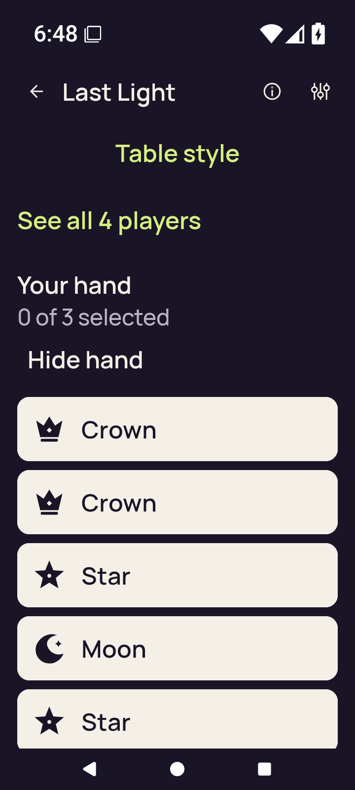</a> <code>2d-seascape-standard-return-first-card.png</code> 2d-seascape-standard-return-first-card — 2d-seascape.portrait-reentry-standard | 720 × 1600 px · 80,906 bytes · text 2.0 SHA-256: <code>64c69501c2537e7c409d84d6bd809a7cb6de73ac0182229a963851eb300a07a0</code> Source: <code>/root/projects/PartyDeck/artifacts/evidence-storage/34514544296/android-adaptive-api36-debug-font-2.0-34514544296-1/godot-adaptive/runtime/captures/2d-seascape-standard-return-first-card.png</code> Original case outcome: **failed** Capture: 2026-09-10T18:48:18.585+00:00 → 2026-09-10T18:48:20.970+00:00 [UI XML](runtime/captures/2d-seascape-standard-return-first-card.xml) · [Capture JSON](runtime/captures/2d-seascape-standard-return-first-card.json) · [Original result](runtime/godot-adaptive-result.json) | **UNVIEWED original — no visual acceptance**. Preserved original capture; not visually reviewed. Stage and outcome labels come from the frozen collector mapping. No pixel observation or visual acceptance is claimed. |
| <a href="runtime/captures/2d-seascape-leave-selected.png">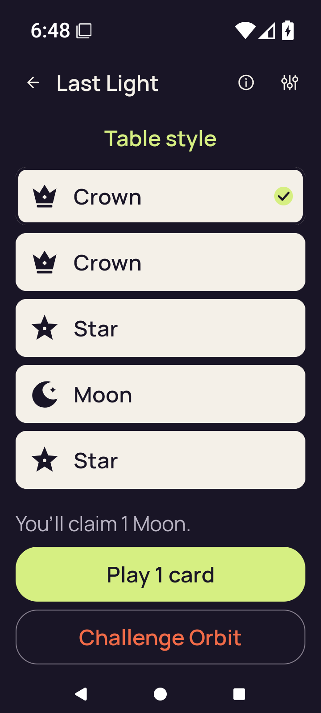</a> <code>2d-seascape-leave-selected.png</code> 2d-seascape-leave-selected — 2d-seascape.native-leave-home | 720 × 1600 px · 84,503 bytes · text 2.0 SHA-256: <code>fd8b86508e8f60f1b652f97949b6ba31c4f030020cb5011166aa2194538a92dc</code> Source: <code>/root/projects/PartyDeck/artifacts/evidence-storage/34514544296/android-adaptive-api36-debug-font-2.0-34514544296-1/godot-adaptive/runtime/captures/2d-seascape-leave-selected.png</code> Original case outcome: **failed** Capture: 2026-09-10T18:48:30.095+00:00 → 2026-09-10T18:48:32.491+00:00 [UI XML](runtime/captures/2d-seascape-leave-selected.xml) · [Capture JSON](runtime/captures/2d-seascape-leave-selected.json) · [Original result](runtime/godot-adaptive-result.json) | **UNVIEWED original — no visual acceptance**. Preserved original capture; not visually reviewed. Stage and outcome labels come from the frozen collector mapping. No pixel observation or visual acceptance is claimed. |
|  <code>2d-seascape-leave-selector.png</code> 2d-seascape-leave-selector — 2d-seascape.native-leave-home | 720 × 1600 px · 98,382 bytes · text 2.0 SHA-256: <code>51791dacddd99579d1ae1024005ee15eb592e0a140f67cbe595929c0a8389a02</code> Source: <code>/root/projects/PartyDeck/artifacts/evidence-storage/34514544296/android-adaptive-api36-debug-font-2.0-34514544296-1/godot-adaptive/runtime/captures/2d-seascape-leave-selector.png</code> Original case outcome: **failed** Capture: 2026-09-10T18:48:39.424+00:00 → 2026-09-10T18:48:41.817+00:00 [UI XML](runtime/captures/2d-seascape-leave-selector.xml) · [Capture JSON](runtime/captures/2d-seascape-leave-selector.json) · [Original result](runtime/godot-adaptive-result.json) | **UNVIEWED original — no visual acceptance**. Preserved original capture; not visually reviewed. Stage and outcome labels come from the frozen collector mapping. No pixel observation or visual acceptance is claimed. |
| <a href="runtime/captures/2d-seascape-leave-native-ready.png">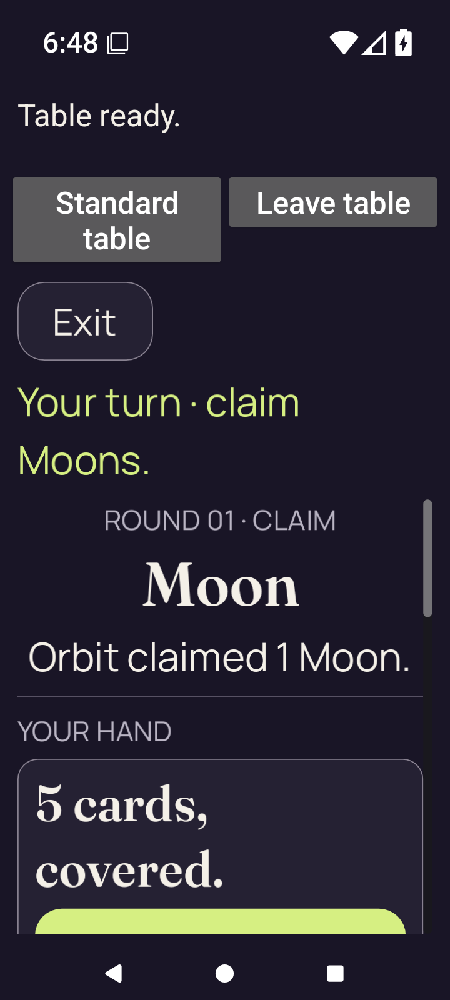</a> <code>2d-seascape-leave-native-ready.png</code> 2d-seascape-leave-native-ready — 2d-seascape.native-leave-home | 720 × 1600 px · 124,363 bytes · text 2.0 SHA-256: <code>3949e113dca6bcaf2a10727ba579e68f836d99455f37a0da2f979fd53c9bfa06</code> Source: <code>/root/projects/PartyDeck/artifacts/evidence-storage/34514544296/android-adaptive-api36-debug-font-2.0-34514544296-1/godot-adaptive/runtime/captures/2d-seascape-leave-native-ready.png</code> Original case outcome: **failed** Capture: 2026-09-10T18:48:50.240+00:00 → 2026-09-10T18:48:52.627+00:00 [UI XML](runtime/captures/2d-seascape-leave-native-ready.xml) · [Capture JSON](runtime/captures/2d-seascape-leave-native-ready.json) · [Original result](runtime/godot-adaptive-result.json) | **Direct original view**. Round 01, Moon and Orbit claimed 1 Moon. are visible in this separate seascape leave capture. At 200% text in portrait, Table ready, wrapped Standard table, Leave table and Exit fit. The turn prompt wraps across two complete lines; Last Light is absent. Round/rank/public context and YOUR HAND fit. The cover count wraps across two lines and only the upper green edge of Reveal is visible at the bottom clip. Its label, seats and lower game actions are outside the viewport. No private card face appears. This leave-native-ready capture preserves a separate source identity and does not establish the following leave transition or continuous privacy. |
| <a href="runtime/captures/2d-seascape-leave-confirmation.png">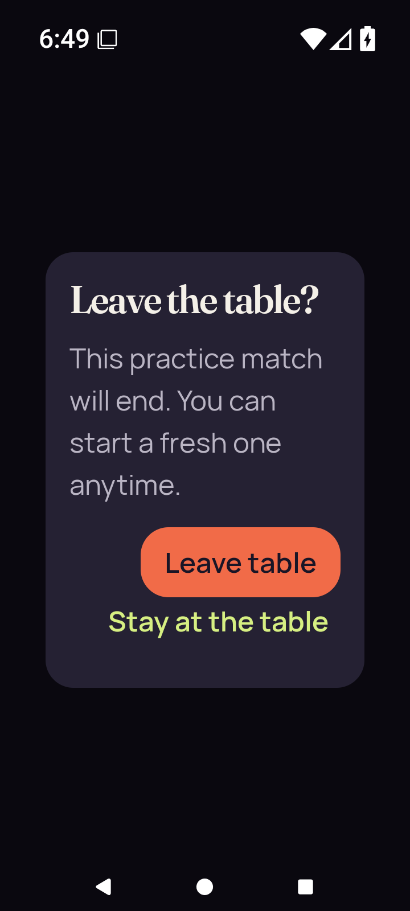</a> <code>2d-seascape-leave-confirmation.png</code> 2d-seascape-leave-confirmation — 2d-seascape.native-leave-home | 720 × 1600 px · 62,529 bytes · text 2.0 SHA-256: <code>31b60c4ae8df409c143dbf5f5444b0af429daa94d6b85300f4ed3137662a8020</code> Source: <code>/root/projects/PartyDeck/artifacts/evidence-storage/34514544296/android-adaptive-api36-debug-font-2.0-34514544296-1/godot-adaptive/runtime/captures/2d-seascape-leave-confirmation.png</code> Original case outcome: **failed** Capture: 2026-09-10T18:48:59.827+00:00 → 2026-09-10T18:49:02.210+00:00 [UI XML](runtime/captures/2d-seascape-leave-confirmation.xml) · [Capture JSON](runtime/captures/2d-seascape-leave-confirmation.json) · [Original result](runtime/godot-adaptive-result.json) | **UNVIEWED original — no visual acceptance**. Preserved original capture; not visually reviewed. Stage and outcome labels come from the frozen collector mapping. No pixel observation or visual acceptance is claimed. |
| <a href="runtime/captures/2d-seascape-home.png">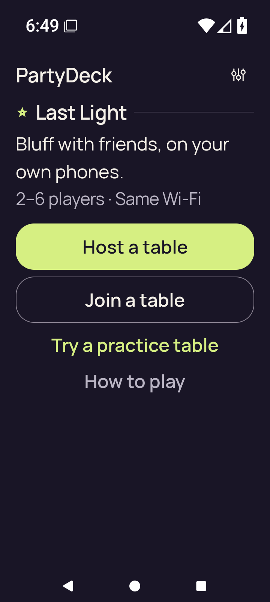</a> <code>2d-seascape-home.png</code> 2d-seascape-home — 2d-seascape.native-leave-home | 720 × 1600 px · 80,935 bytes · text 2.0 SHA-256: <code>67da958fdf361f4403d18992dc7f7b45c882cca646fea4588e14c4e05719805f</code> Source: <code>/root/projects/PartyDeck/artifacts/evidence-storage/34514544296/android-adaptive-api36-debug-font-2.0-34514544296-1/godot-adaptive/runtime/captures/2d-seascape-home.png</code> Original case outcome: **failed** Capture: 2026-09-10T18:49:06.494+00:00 → 2026-09-10T18:49:08.876+00:00 [UI XML](runtime/captures/2d-seascape-home.xml) · [Capture JSON](runtime/captures/2d-seascape-home.json) · [Original result](runtime/godot-adaptive-result.json) | **UNVIEWED original — no visual acceptance**. Preserved original capture; not visually reviewed. Stage and outcome labels come from the frozen collector mapping. No pixel observation or visual acceptance is claimed. |
| <a href="runtime/captures/2d-split-baseline-public.png">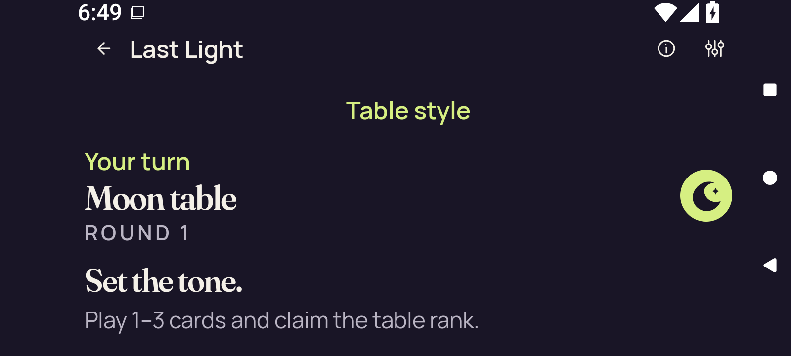</a> <code>2d-split-baseline-public.png</code> 2d-split-baseline-public — 2d-split.entry-after-ready | 1600 × 720 px · 69,345 bytes · text 2.0 SHA-256: <code>3f4712993ad2fe87f35cc11f7434b69aa6f807a247f738442da5b84f35ce5b7d</code> Source: <code>/root/projects/PartyDeck/artifacts/evidence-storage/34514544296/android-adaptive-api36-debug-font-2.0-34514544296-1/godot-adaptive/runtime/captures/2d-split-baseline-public.png</code> Original case outcome: **failed** Capture: 2026-09-10T18:49:49.992+00:00 → 2026-09-10T18:49:52.361+00:00 [UI XML](runtime/captures/2d-split-baseline-public.xml) · [Capture JSON](runtime/captures/2d-split-baseline-public.json) · [Original result](runtime/godot-adaptive-result.json) | **UNVIEWED original — no visual acceptance**. Preserved original capture; not visually reviewed. Stage and outcome labels come from the frozen collector mapping. No pixel observation or visual acceptance is claimed. |
| <a href="runtime/captures/2d-split-baseline-first-card.png">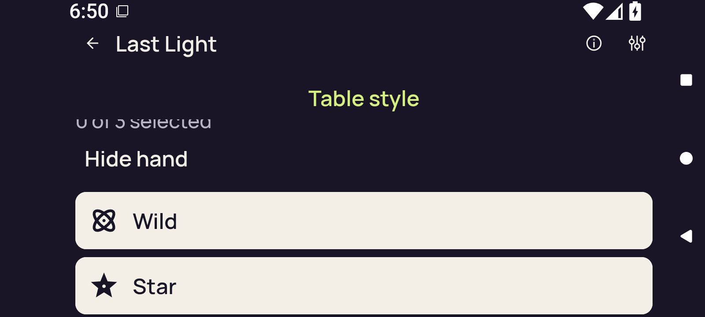</a> <code>2d-split-baseline-first-card.png</code> 2d-split-baseline-first-card — 2d-split.entry-after-ready | 1600 × 720 px · 49,402 bytes · text 2.0 SHA-256: <code>887059d759f38ec186ad3814e8b9854b886e4b587dceced5efaca7be37464d51</code> Source: <code>/root/projects/PartyDeck/artifacts/evidence-storage/34514544296/android-adaptive-api36-debug-font-2.0-34514544296-1/godot-adaptive/runtime/captures/2d-split-baseline-first-card.png</code> Original case outcome: **failed** Capture: 2026-09-10T18:50:04.808+00:00 → 2026-09-10T18:50:07.183+00:00 [UI XML](runtime/captures/2d-split-baseline-first-card.xml) · [Capture JSON](runtime/captures/2d-split-baseline-first-card.json) · [Original result](runtime/godot-adaptive-result.json) | **UNVIEWED original — no visual acceptance**. Preserved original capture; not visually reviewed. Stage and outcome labels come from the frozen collector mapping. No pixel observation or visual acceptance is claimed. |
| <a href="runtime/captures/2d-split-baseline-selected.png">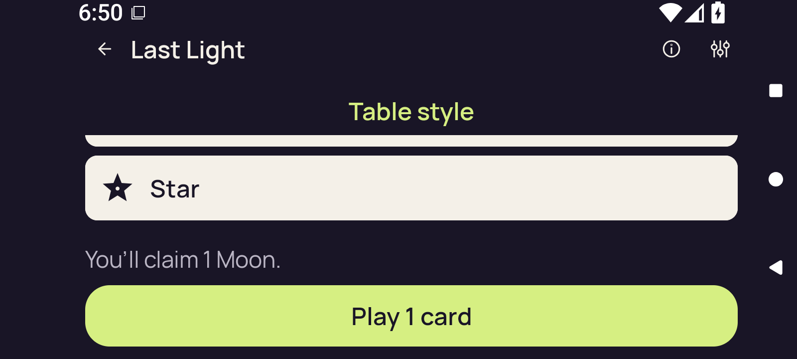</a> <code>2d-split-baseline-selected.png</code> 2d-split-baseline-selected — 2d-split.entry-after-ready | 1600 × 720 px · 48,140 bytes · text 2.0 SHA-256: <code>a4d74cb77b4c468dd76ceab1394f275924dd3544f9fc2ee4f09dda457f9d2f34</code> Source: <code>/root/projects/PartyDeck/artifacts/evidence-storage/34514544296/android-adaptive-api36-debug-font-2.0-34514544296-1/godot-adaptive/runtime/captures/2d-split-baseline-selected.png</code> Original case outcome: **failed** Capture: 2026-09-10T18:50:24.500+00:00 → 2026-09-10T18:50:26.873+00:00 [UI XML](runtime/captures/2d-split-baseline-selected.xml) · [Capture JSON](runtime/captures/2d-split-baseline-selected.json) · [Original result](runtime/godot-adaptive-result.json) | **UNVIEWED original — no visual acceptance**. Preserved original capture; not visually reviewed. Stage and outcome labels come from the frozen collector mapping. No pixel observation or visual acceptance is claimed. |
| <a href="runtime/captures/2d-split-full-selector.png">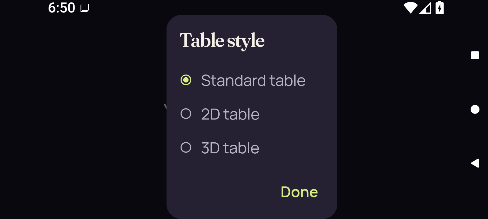</a> <code>2d-split-full-selector.png</code> 2d-split-full-selector — 2d-split.entry-after-ready | 1600 × 720 px · 49,678 bytes · text 2.0 SHA-256: <code>f3e805d3853de404de38fed854cfa050b65ee8ea4ed486b71b7592fd9f0dfd33</code> Source: <code>/root/projects/PartyDeck/artifacts/evidence-storage/34514544296/android-adaptive-api36-debug-font-2.0-34514544296-1/godot-adaptive/runtime/captures/2d-split-full-selector.png</code> Original case outcome: **failed** Capture: 2026-09-10T18:50:47.537+00:00 → 2026-09-10T18:50:49.913+00:00 [UI XML](runtime/captures/2d-split-full-selector.xml) · [Capture JSON](runtime/captures/2d-split-full-selector.json) · [Original result](runtime/godot-adaptive-result.json) | **UNVIEWED original — no visual acceptance**. Preserved original capture; not visually reviewed. Stage and outcome labels come from the frozen collector mapping. No pixel observation or visual acceptance is claimed. |
| <a href="runtime/captures/2d-split-full-native-ready.png">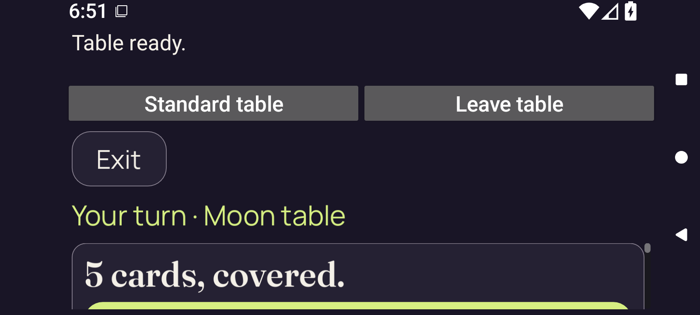</a> <code>2d-split-full-native-ready.png</code> 2d-split-full-native-ready — 2d-split.entry-after-ready | 1600 × 720 px · 75,489 bytes · text 2.0 SHA-256: <code>25e1e7de6e2b48000e456bf5e90a6b0f4c5846c999ae8a60e9d3186cbfd8a94a</code> Source: <code>/root/projects/PartyDeck/artifacts/evidence-storage/34514544296/android-adaptive-api36-debug-font-2.0-34514544296-1/godot-adaptive/runtime/captures/2d-split-full-native-ready.png</code> Original case outcome: **failed** Capture: 2026-09-10T18:50:58.430+00:00 → 2026-09-10T18:51:00.812+00:00 [UI XML](runtime/captures/2d-split-full-native-ready.xml) · [Capture JSON](runtime/captures/2d-split-full-native-ready.json) · [Original result](runtime/godot-adaptive-result.json) | **Direct original view**. At 200% text, this fullscreen landscape capture shows Table ready, Standard table/Leave table, Exit, Your turn · Moon table and 5 cards, covered. Last Light is absent. Only the top green edge of Reveal is visible; its label and lower game actions are outside the viewport. The source name marks fullscreen readiness before the attempted split scope; no split-entry request occurred in this run. No private card face is visible, and this still cannot establish the unobserved split transition, gameplay or continuous privacy. |
| <a href="runtime/captures/final-diagnostic.png">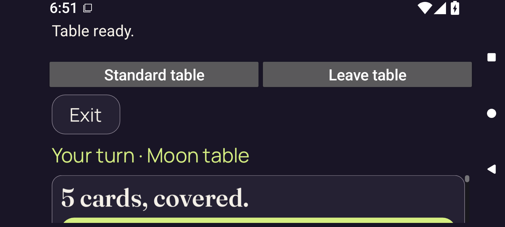</a> <code>final-diagnostic.png</code> final-diagnostic — 3d-landscape.initial-landscape | 1600 × 720 px · 75,408 bytes · text 2.0 SHA-256: <code>3940149f758da071044a729414f5feb483c99cdb3009469c5e5537b08ea65bc7</code> Source: <code>/root/projects/PartyDeck/artifacts/evidence-storage/34514544296/android-adaptive-api36-debug-font-2.0-34514544296-1/godot-adaptive/runtime/captures/final-diagnostic.png</code> Original case outcome: **failed** Capture: 2026-09-10T18:51:47.624+00:00 → 2026-09-10T18:51:50.018+00:00 [UI XML](runtime/captures/final-diagnostic.xml) · [Capture JSON](runtime/captures/final-diagnostic.json) · [Original result](runtime/godot-adaptive-result.json) | **Direct original view**. At 200%, the final diagnostic shows Table ready, full Standard table/Leave table controls, Exit, Your turn · Moon table and 5 cards, covered. The cover extends beyond the lower image; only the top green edge of its action is visible, with the label and lower game actions outside the captured viewport. No private face is visible. The source failure remains preparation for the named 3D landscape scope. |
