# API 36 optimized-test-signed, font 1.0

[All collections](../../../README.md) · [Preserved evidence index](../../evidence-index.md) · [Copy/review binding](../../../android-34515669045/provenance/publication-review/partydeck-gallery-3433-publication-binding-v1.json) · [Completed focused review](../../provenance/publication-review/partydeck-gallery-after-2815-adaptive34514544296-visual-review-v1.json) · [Source mapping](../../provenance/source-collection/triage/capture-publication-inventory.json)

**Original case failed at 3d-landscape.initial-landscape preparation. Named scopes: {"failed": 1, "not-reached": 13, "passed": 7, "unsupported": 3}.**

Capture-stage names, source results and recording statuses are preserved. Direct reviews are limited to named 2D checkpoints.

All 228 original capture identities remain separate. Four installations pass. Across 96 named scopes, 28 pass, four fail, 12 are unsupported and 52 are unreached. Each case fails while preparing 3d-landscape.initial-landscape after unsupported split-entry recording. No split-entry request occurred; this does not establish native 3D launch failure. Engine gameplay assertions were not invoked.

The 32 directly reviewed stills show the compact cover, full Reveal, first two complete numbered seats and fixed lower actions in normal-text portrait native-ready/leave-native-ready frames. Normal landscape shows only the upper green edge of Reveal at the body clip. At 200% in either orientation, Reveal and lower game actions remain outside the viewport. No private faces are visible in those reviewed stills. These views add no margin, zero-scroll, gameplay-completion or continuous-privacy claim.

Twelve original MP4s retain startup-unavailable-original-retained / growth-not-observed and remain unviewed and undecoded. The exact source is derived; 1,124 omitted historical gallery blobs have only remote-tree identity in the source reconstruction. The actual producer pack is `557b2297bed133a433acc25efa4837462465dd4e06da659ae5a4cbd792f77fe0` (1,549,560 bytes).

Source revision: `286b7ff11b2441daad044b57fad6fc8b6be995d0`. CI run: [34514544296](https://github.com/Apdelrahman1911/PartyDeck/actions/runs/34514544296). 57 original PNG identities. Review methods: 1 exact published-byte match, 48 unviewed original — no visual acceptance, 8 direct original view.

Every thumbnail opens the unchanged original PNG. **UNVIEWED** means no direct pixel review or visual acceptance is asserted. Matching bytes reuse only earlier pixel observations. Each source, scenario and original outcome remains separate. Frozen review plans retain their historical pending flags; the completed focused-review receipt records the final status. No new derivative image or video decoding was performed.

| Original capture | Original identity and evidence | Review status and observation |
| --- | --- | --- |
|  <code>home-cold.png</code> home-cold — emulator readiness | 720 × 1600 px · 129,669 bytes · text 1.0 SHA-256: <code>e96d4777eadaa3ea3e8ec2e29024f70b095714b5965d580ae272d86456c15a94</code> Source: <code>/root/projects/PartyDeck/artifacts/evidence-storage/34514544296/android-adaptive-api36-optimized-test-signed-font-1.0-34514544296-1/godot-adaptive/runtime/captures/home-cold.png</code> Original case outcome: **failed** Capture: 2026-09-10T18:37:19.840+00:00 → 2026-09-10T18:37:22.245+00:00 [UI XML](runtime/captures/home-cold.xml) · [Capture JSON](runtime/captures/home-cold.json) · [Original result](runtime/godot-adaptive-result.json) | **Exact published-byte match**. Exact original bytes match the separately published capture godot-android-adaptive-34506161751/debug/font-1.0/runtime/captures/home-cold.png. Only the existing pixel observation is reused; this capture retains its own source and failed-case outcome. [Separately published matching capture](../../../godot-android-adaptive-34506161751/debug/font-1.0/runtime/captures/home-cold.png); this capture was not directly reopened. |
| <a href="runtime/captures/2d-landscape-baseline-public.png">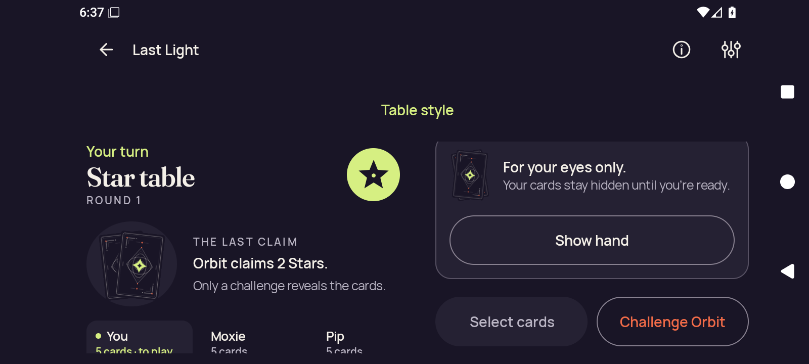</a> <code>2d-landscape-baseline-public.png</code> 2d-landscape-baseline-public — 2d-landscape.initial-landscape | 1600 × 720 px · 114,877 bytes · text 1.0 SHA-256: <code>b943c35d295f6e0175f6e96629259cfc31b530469fc6b260a119b0e3134796e9</code> Source: <code>/root/projects/PartyDeck/artifacts/evidence-storage/34514544296/android-adaptive-api36-optimized-test-signed-font-1.0-34514544296-1/godot-adaptive/runtime/captures/2d-landscape-baseline-public.png</code> Original case outcome: **failed** Capture: 2026-09-10T18:37:36.542+00:00 → 2026-09-10T18:37:38.957+00:00 [UI XML](runtime/captures/2d-landscape-baseline-public.xml) · [Capture JSON](runtime/captures/2d-landscape-baseline-public.json) · [Original result](runtime/godot-adaptive-result.json) | **UNVIEWED original — no visual acceptance**. Preserved original capture; not visually reviewed. Stage and outcome labels come from the frozen collector mapping. No pixel observation or visual acceptance is claimed. |
| <a href="runtime/captures/2d-landscape-baseline-first-card.png">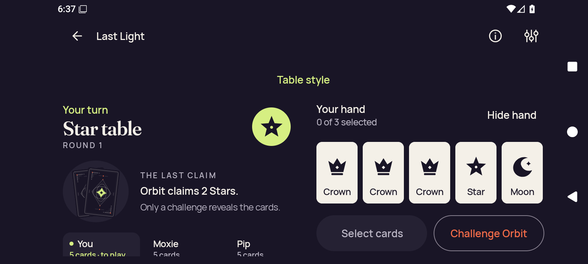</a> <code>2d-landscape-baseline-first-card.png</code> 2d-landscape-baseline-first-card — 2d-landscape.initial-landscape | 1600 × 720 px · 107,191 bytes · text 1.0 SHA-256: <code>a87a8f1ca34039bac923a77bd8c7e933a4ed96d5b2344e73959242daabe89dcc</code> Source: <code>/root/projects/PartyDeck/artifacts/evidence-storage/34514544296/android-adaptive-api36-optimized-test-signed-font-1.0-34514544296-1/godot-adaptive/runtime/captures/2d-landscape-baseline-first-card.png</code> Original case outcome: **failed** Capture: 2026-09-10T18:37:43.126+00:00 → 2026-09-10T18:37:45.794+00:00 [UI XML](runtime/captures/2d-landscape-baseline-first-card.xml) · [Capture JSON](runtime/captures/2d-landscape-baseline-first-card.json) · [Original result](runtime/godot-adaptive-result.json) | **UNVIEWED original — no visual acceptance**. Preserved original capture; not visually reviewed. Stage and outcome labels come from the frozen collector mapping. No pixel observation or visual acceptance is claimed. |
| <a href="runtime/captures/2d-landscape-baseline-selected.png">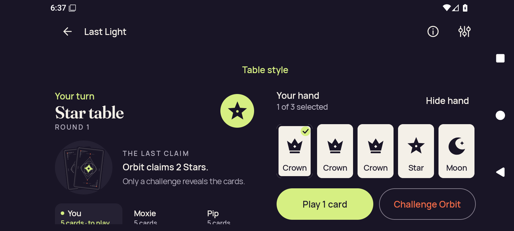</a> <code>2d-landscape-baseline-selected.png</code> 2d-landscape-baseline-selected — 2d-landscape.initial-landscape | 1600 × 720 px · 108,121 bytes · text 1.0 SHA-256: <code>667433abbf283dab3ed930cc0ad03fded6f25cadecf1c4a7d649cd9eb3b7c207</code> Source: <code>/root/projects/PartyDeck/artifacts/evidence-storage/34514544296/android-adaptive-api36-optimized-test-signed-font-1.0-34514544296-1/godot-adaptive/runtime/captures/2d-landscape-baseline-selected.png</code> Original case outcome: **failed** Capture: 2026-09-10T18:37:52.071+00:00 → 2026-09-10T18:37:54.470+00:00 [UI XML](runtime/captures/2d-landscape-baseline-selected.xml) · [Capture JSON](runtime/captures/2d-landscape-baseline-selected.json) · [Original result](runtime/godot-adaptive-result.json) | **UNVIEWED original — no visual acceptance**. Preserved original capture; not visually reviewed. Stage and outcome labels come from the frozen collector mapping. No pixel observation or visual acceptance is claimed. |
| <a href="runtime/captures/2d-landscape-initial-selector.png">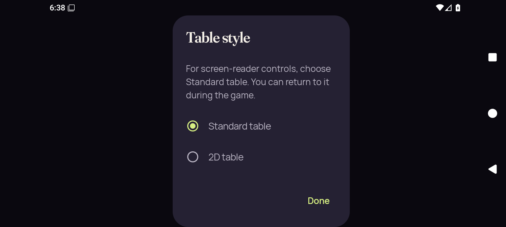</a> <code>2d-landscape-initial-selector.png</code> 2d-landscape-initial-selector — 2d-landscape.initial-landscape | 1600 × 720 px · 46,173 bytes · text 1.0 SHA-256: <code>90f56d15798a74c213a1bbc58a1a8d04a7e447415175036ff96f38c4b98648b4</code> Source: <code>/root/projects/PartyDeck/artifacts/evidence-storage/34514544296/android-adaptive-api36-optimized-test-signed-font-1.0-34514544296-1/godot-adaptive/runtime/captures/2d-landscape-initial-selector.png</code> Original case outcome: **failed** Capture: 2026-09-10T18:38:03.956+00:00 → 2026-09-10T18:38:06.358+00:00 [UI XML](runtime/captures/2d-landscape-initial-selector.xml) · [Capture JSON](runtime/captures/2d-landscape-initial-selector.json) · [Original result](runtime/godot-adaptive-result.json) | **UNVIEWED original — no visual acceptance**. Preserved original capture; not visually reviewed. Stage and outcome labels come from the frozen collector mapping. No pixel observation or visual acceptance is claimed. |
|  <code>2d-landscape-initial-native-ready.png</code> 2d-landscape-initial-native-ready — 2d-landscape.initial-landscape | 1600 × 720 px · 108,916 bytes · text 1.0 SHA-256: <code>ea897c0ed0d8c185618e2d1edcc7d5f74ec68385b5fda5e4b8e2c2aa6bf7787c</code> Source: <code>/root/projects/PartyDeck/artifacts/evidence-storage/34514544296/android-adaptive-api36-optimized-test-signed-font-1.0-34514544296-1/godot-adaptive/runtime/captures/2d-landscape-initial-native-ready.png</code> Original case outcome: **failed** Capture: 2026-09-10T18:38:14.541+00:00 → 2026-09-10T18:38:16.951+00:00 [UI XML](runtime/captures/2d-landscape-initial-native-ready.xml) · [Capture JSON](runtime/captures/2d-landscape-initial-native-ready.json) · [Original result](runtime/godot-adaptive-result.json) | **Direct original view**. Your turn · Star table · Orbit claimed 2 is visible. Choose cards appears disabled; Call the bluff is orange. Android navigation is on the right. In this normal-text landscape native-ready still, Table ready, Standard table/Leave table, Exit/Last Light and the single-line public turn context fit. The covered-hand panel shows card-back artwork, the five-card headline and explanatory copy. Only the upper green edge of Reveal appears above the body clip; its label and the rest of the cover are hidden. Both fixed lower actions fit. No private card face is visible; the still does not prove gameplay or continuous privacy. |
| <a href="runtime/captures/2d-landscape-unsupported-return-concealed.png">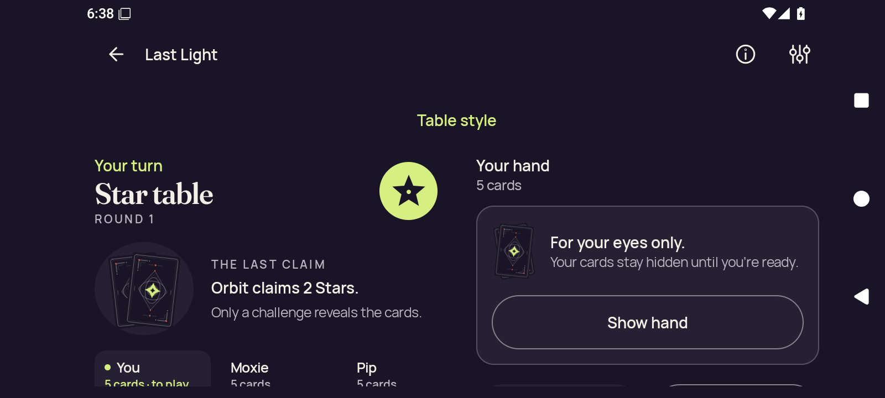</a> <code>2d-landscape-unsupported-return-concealed.png</code> 2d-landscape-unsupported-return-concealed — 2d-landscape.held-rotation | 1600 × 720 px · 108,280 bytes · text 1.0 SHA-256: <code>8986e116b63f8a98ea6107f5ff9b684c44c17f6a83ad6c8f2e23ae5448fcd1c6</code> Source: <code>/root/projects/PartyDeck/artifacts/evidence-storage/34514544296/android-adaptive-api36-optimized-test-signed-font-1.0-34514544296-1/godot-adaptive/runtime/captures/2d-landscape-unsupported-return-concealed.png</code> Original case outcome: **failed** Capture: 2026-09-10T18:38:36.942+00:00 → 2026-09-10T18:38:39.341+00:00 [UI XML](runtime/captures/2d-landscape-unsupported-return-concealed.xml) · [Capture JSON](runtime/captures/2d-landscape-unsupported-return-concealed.json) · [Original result](runtime/godot-adaptive-result.json) | **UNVIEWED original — no visual acceptance**. Preserved original capture; not visually reviewed. Stage and outcome labels come from the frozen collector mapping. No pixel observation or visual acceptance is claimed. |
|  <code>2d-landscape-unsupported-return-selection-cleared.png</code> 2d-landscape-unsupported-return-selection-cleared — 2d-landscape.held-rotation | 1600 × 720 px · 115,013 bytes · text 1.0 SHA-256: <code>e2b90cc4c2bc56392e259c6adc66e15a3f5a26db7850883cc25dcce7c781b3c2</code> Source: <code>/root/projects/PartyDeck/artifacts/evidence-storage/34514544296/android-adaptive-api36-optimized-test-signed-font-1.0-34514544296-1/godot-adaptive/runtime/captures/2d-landscape-unsupported-return-selection-cleared.png</code> Original case outcome: **failed** Capture: 2026-09-10T18:38:44.126+00:00 → 2026-09-10T18:38:46.518+00:00 [UI XML](runtime/captures/2d-landscape-unsupported-return-selection-cleared.xml) · [Capture JSON](runtime/captures/2d-landscape-unsupported-return-selection-cleared.json) · [Original result](runtime/godot-adaptive-result.json) | **UNVIEWED original — no visual acceptance**. Preserved original capture; not visually reviewed. Stage and outcome labels come from the frozen collector mapping. No pixel observation or visual acceptance is claimed. |
|  <code>2d-landscape-unsupported-return-public.png</code> 2d-landscape-unsupported-return-public — 2d-landscape.held-rotation | 1600 × 720 px · 115,013 bytes · text 1.0 SHA-256: <code>e2b90cc4c2bc56392e259c6adc66e15a3f5a26db7850883cc25dcce7c781b3c2</code> Source: <code>/root/projects/PartyDeck/artifacts/evidence-storage/34514544296/android-adaptive-api36-optimized-test-signed-font-1.0-34514544296-1/godot-adaptive/runtime/captures/2d-landscape-unsupported-return-public.png</code> Original case outcome: **failed** Capture: 2026-09-10T18:38:48.554+00:00 → 2026-09-10T18:38:50.954+00:00 [UI XML](runtime/captures/2d-landscape-unsupported-return-public.xml) · [Capture JSON](runtime/captures/2d-landscape-unsupported-return-public.json) · [Original result](runtime/godot-adaptive-result.json) | **UNVIEWED original — no visual acceptance**. Preserved original capture; not visually reviewed. Stage and outcome labels come from the frozen collector mapping. No pixel observation or visual acceptance is claimed. |
| <a href="runtime/captures/2d-landscape-unsupported-return-first-card.png">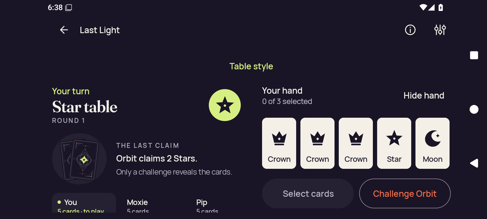</a> <code>2d-landscape-unsupported-return-first-card.png</code> 2d-landscape-unsupported-return-first-card — 2d-landscape.held-rotation | 1600 × 720 px · 107,315 bytes · text 1.0 SHA-256: <code>8db8ce7894656e01ca19c6cb52537e92b91f2731900422eed14bd0b269a41fa5</code> Source: <code>/root/projects/PartyDeck/artifacts/evidence-storage/34514544296/android-adaptive-api36-optimized-test-signed-font-1.0-34514544296-1/godot-adaptive/runtime/captures/2d-landscape-unsupported-return-first-card.png</code> Original case outcome: **failed** Capture: 2026-09-10T18:38:55.064+00:00 → 2026-09-10T18:38:57.469+00:00 [UI XML](runtime/captures/2d-landscape-unsupported-return-first-card.xml) · [Capture JSON](runtime/captures/2d-landscape-unsupported-return-first-card.json) · [Original result](runtime/godot-adaptive-result.json) | **UNVIEWED original — no visual acceptance**. Preserved original capture; not visually reviewed. Stage and outcome labels come from the frozen collector mapping. No pixel observation or visual acceptance is claimed. |
|  <code>2d-landscape-unsupported-portrait-return-concealed.png</code> 2d-landscape-unsupported-portrait-return-concealed — 2d-landscape.held-rotation | 720 × 1600 px · 127,096 bytes · text 1.0 SHA-256: <code>88a0f9e3c8c12f09ce9dfba8c8659d4c57082c209c2e681bf2ac91bf83e13a07</code> Source: <code>/root/projects/PartyDeck/artifacts/evidence-storage/34514544296/android-adaptive-api36-optimized-test-signed-font-1.0-34514544296-1/godot-adaptive/runtime/captures/2d-landscape-unsupported-portrait-return-concealed.png</code> Original case outcome: **failed** Capture: 2026-09-10T18:39:02.944+00:00 → 2026-09-10T18:39:05.364+00:00 [UI XML](runtime/captures/2d-landscape-unsupported-portrait-return-concealed.xml) · [Capture JSON](runtime/captures/2d-landscape-unsupported-portrait-return-concealed.json) · [Original result](runtime/godot-adaptive-result.json) | **UNVIEWED original — no visual acceptance**. Preserved original capture; not visually reviewed. Stage and outcome labels come from the frozen collector mapping. No pixel observation or visual acceptance is claimed. |
|  <code>2d-landscape-unsupported-portrait-return-selection-cleared.png</code> 2d-landscape-unsupported-portrait-return-selection-cleared — 2d-landscape.held-rotation | 720 × 1600 px · 127,096 bytes · text 1.0 SHA-256: <code>88a0f9e3c8c12f09ce9dfba8c8659d4c57082c209c2e681bf2ac91bf83e13a07</code> Source: <code>/root/projects/PartyDeck/artifacts/evidence-storage/34514544296/android-adaptive-api36-optimized-test-signed-font-1.0-34514544296-1/godot-adaptive/runtime/captures/2d-landscape-unsupported-portrait-return-selection-cleared.png</code> Original case outcome: **failed** Capture: 2026-09-10T18:39:07.397+00:00 → 2026-09-10T18:39:09.780+00:00 [UI XML](runtime/captures/2d-landscape-unsupported-portrait-return-selection-cleared.xml) · [Capture JSON](runtime/captures/2d-landscape-unsupported-portrait-return-selection-cleared.json) · [Original result](runtime/godot-adaptive-result.json) | **UNVIEWED original — no visual acceptance**. Preserved original capture; not visually reviewed. Stage and outcome labels come from the frozen collector mapping. No pixel observation or visual acceptance is claimed. |
|  <code>2d-landscape-unsupported-portrait-return-public.png</code> 2d-landscape-unsupported-portrait-return-public — 2d-landscape.held-rotation | 720 × 1600 px · 127,096 bytes · text 1.0 SHA-256: <code>88a0f9e3c8c12f09ce9dfba8c8659d4c57082c209c2e681bf2ac91bf83e13a07</code> Source: <code>/root/projects/PartyDeck/artifacts/evidence-storage/34514544296/android-adaptive-api36-optimized-test-signed-font-1.0-34514544296-1/godot-adaptive/runtime/captures/2d-landscape-unsupported-portrait-return-public.png</code> Original case outcome: **failed** Capture: 2026-09-10T18:39:11.806+00:00 → 2026-09-10T18:39:14.201+00:00 [UI XML](runtime/captures/2d-landscape-unsupported-portrait-return-public.xml) · [Capture JSON](runtime/captures/2d-landscape-unsupported-portrait-return-public.json) · [Original result](runtime/godot-adaptive-result.json) | **UNVIEWED original — no visual acceptance**. Preserved original capture; not visually reviewed. Stage and outcome labels come from the frozen collector mapping. No pixel observation or visual acceptance is claimed. |
| <a href="runtime/captures/2d-landscape-unsupported-portrait-return-first-card.png">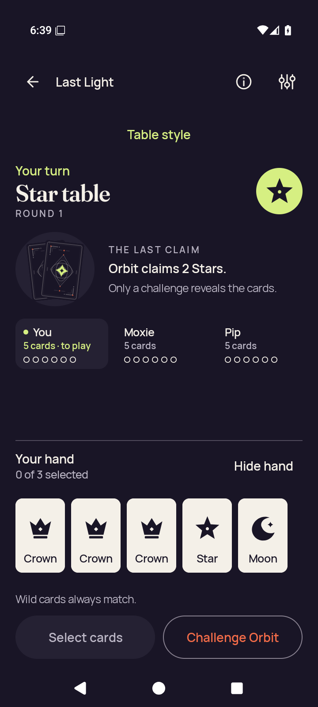</a> <code>2d-landscape-unsupported-portrait-return-first-card.png</code> 2d-landscape-unsupported-portrait-return-first-card — 2d-landscape.held-rotation | 720 × 1600 px · 122,104 bytes · text 1.0 SHA-256: <code>34d1d33ea16d79c10966dc4b6a77301244cde89266a6b53f00d87f5636611603</code> Source: <code>/root/projects/PartyDeck/artifacts/evidence-storage/34514544296/android-adaptive-api36-optimized-test-signed-font-1.0-34514544296-1/godot-adaptive/runtime/captures/2d-landscape-unsupported-portrait-return-first-card.png</code> Original case outcome: **failed** Capture: 2026-09-10T18:39:18.306+00:00 → 2026-09-10T18:39:20.704+00:00 [UI XML](runtime/captures/2d-landscape-unsupported-portrait-return-first-card.xml) · [Capture JSON](runtime/captures/2d-landscape-unsupported-portrait-return-first-card.json) · [Original result](runtime/godot-adaptive-result.json) | **UNVIEWED original — no visual acceptance**. Preserved original capture; not visually reviewed. Stage and outcome labels come from the frozen collector mapping. No pixel observation or visual acceptance is claimed. |
| <a href="runtime/captures/2d-landscape-reentry-selected.png">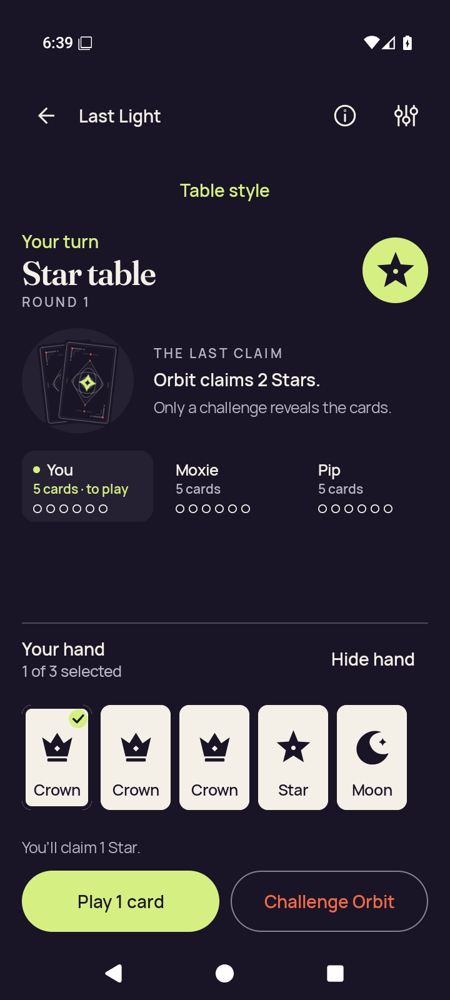</a> <code>2d-landscape-reentry-selected.png</code> 2d-landscape-reentry-selected — 2d-landscape.portrait-reentry-standard | 720 × 1600 px · 121,735 bytes · text 1.0 SHA-256: <code>82ed3277338568f879d0eaee63f9056a228ae7662f900b236912ac74a22fd9b5</code> Source: <code>/root/projects/PartyDeck/artifacts/evidence-storage/34514544296/android-adaptive-api36-optimized-test-signed-font-1.0-34514544296-1/godot-adaptive/runtime/captures/2d-landscape-reentry-selected.png</code> Original case outcome: **failed** Capture: 2026-09-10T18:39:26.978+00:00 → 2026-09-10T18:39:29.384+00:00 [UI XML](runtime/captures/2d-landscape-reentry-selected.xml) · [Capture JSON](runtime/captures/2d-landscape-reentry-selected.json) · [Original result](runtime/godot-adaptive-result.json) | **UNVIEWED original — no visual acceptance**. Preserved original capture; not visually reviewed. Stage and outcome labels come from the frozen collector mapping. No pixel observation or visual acceptance is claimed. |
| <a href="runtime/captures/2d-landscape-portrait-selector.png">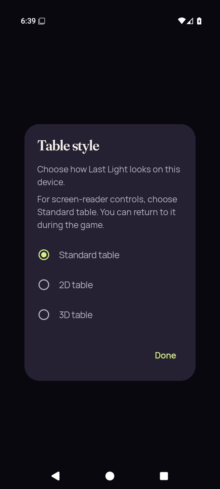</a> <code>2d-landscape-portrait-selector.png</code> 2d-landscape-portrait-selector — 2d-landscape.portrait-reentry-standard | 720 × 1600 px · 58,849 bytes · text 1.0 SHA-256: <code>18e62d733fba487aa6db07deda7da8808fa6e14bed49ced422a45558c32c7754</code> Source: <code>/root/projects/PartyDeck/artifacts/evidence-storage/34514544296/android-adaptive-api36-optimized-test-signed-font-1.0-34514544296-1/godot-adaptive/runtime/captures/2d-landscape-portrait-selector.png</code> Original case outcome: **failed** Capture: 2026-09-10T18:39:36.025+00:00 → 2026-09-10T18:39:38.416+00:00 [UI XML](runtime/captures/2d-landscape-portrait-selector.xml) · [Capture JSON](runtime/captures/2d-landscape-portrait-selector.json) · [Original result](runtime/godot-adaptive-result.json) | **UNVIEWED original — no visual acceptance**. Preserved original capture; not visually reviewed. Stage and outcome labels come from the frozen collector mapping. No pixel observation or visual acceptance is claimed. |
| <a href="runtime/captures/2d-landscape-portrait-native-ready.png">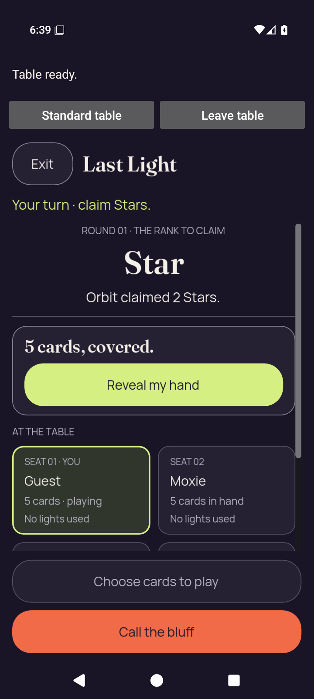</a> <code>2d-landscape-portrait-native-ready.png</code> 2d-landscape-portrait-native-ready — 2d-landscape.portrait-reentry-standard | 720 × 1600 px · 146,768 bytes · text 1.0 SHA-256: <code>a9d85ba94a86c9b784223077f140a080d19bd76908dba3ace639b95f52a5ce67</code> Source: <code>/root/projects/PartyDeck/artifacts/evidence-storage/34514544296/android-adaptive-api36-optimized-test-signed-font-1.0-34514544296-1/godot-adaptive/runtime/captures/2d-landscape-portrait-native-ready.png</code> Original case outcome: **failed** Capture: 2026-09-10T18:39:45.462+00:00 → 2026-09-10T18:39:47.871+00:00 [UI XML](runtime/captures/2d-landscape-portrait-native-ready.xml) · [Capture JSON](runtime/captures/2d-landscape-portrait-native-ready.json) · [Original result](runtime/godot-adaptive-result.json) | **Direct original view**. Round 01, Star and Orbit claimed 2 Stars. are visible. Choose cards appears disabled and Call the bluff is orange. Full Table ready, Standard table and Leave table chrome, Exit/Last Light, and turn/rank/public context are visible. The complete compact cover and full Reveal my hand button fit with separation before the first two complete numbered seats, Guest and Moxie; the next seat-row upper edges meet the lower body clip. Full fixed lower game actions are visible. No private card face is visible. This normal-text 720×1600 native-ready still does not measure native margins, initial scroll position, gameplay completion or continuous privacy. |
|  <code>2d-landscape-standard-return-concealed.png</code> 2d-landscape-standard-return-concealed — 2d-landscape.portrait-reentry-standard | 720 × 1600 px · 127,118 bytes · text 1.0 SHA-256: <code>15286dd53f12f7cb92a753cd9ccd5556ca242cbbf66ad519bc3c40909c67bf76</code> Source: <code>/root/projects/PartyDeck/artifacts/evidence-storage/34514544296/android-adaptive-api36-optimized-test-signed-font-1.0-34514544296-1/godot-adaptive/runtime/captures/2d-landscape-standard-return-concealed.png</code> Original case outcome: **failed** Capture: 2026-09-10T18:39:55.240+00:00 → 2026-09-10T18:39:57.633+00:00 [UI XML](runtime/captures/2d-landscape-standard-return-concealed.xml) · [Capture JSON](runtime/captures/2d-landscape-standard-return-concealed.json) · [Original result](runtime/godot-adaptive-result.json) | **UNVIEWED original — no visual acceptance**. Preserved original capture; not visually reviewed. Stage and outcome labels come from the frozen collector mapping. No pixel observation or visual acceptance is claimed. |
|  <code>2d-landscape-standard-return-selection-cleared.png</code> 2d-landscape-standard-return-selection-cleared — 2d-landscape.portrait-reentry-standard | 720 × 1600 px · 126,924 bytes · text 1.0 SHA-256: <code>de2bdcc21a6266e463e26bae777cdf92903b3f8675b16a4b7978dbfd44ecf6e4</code> Source: <code>/root/projects/PartyDeck/artifacts/evidence-storage/34514544296/android-adaptive-api36-optimized-test-signed-font-1.0-34514544296-1/godot-adaptive/runtime/captures/2d-landscape-standard-return-selection-cleared.png</code> Original case outcome: **failed** Capture: 2026-09-10T18:39:59.678+00:00 → 2026-09-10T18:40:02.082+00:00 [UI XML](runtime/captures/2d-landscape-standard-return-selection-cleared.xml) · [Capture JSON](runtime/captures/2d-landscape-standard-return-selection-cleared.json) · [Original result](runtime/godot-adaptive-result.json) | **UNVIEWED original — no visual acceptance**. Preserved original capture; not visually reviewed. Stage and outcome labels come from the frozen collector mapping. No pixel observation or visual acceptance is claimed. |
|  <code>2d-landscape-standard-return-public.png</code> 2d-landscape-standard-return-public — 2d-landscape.portrait-reentry-standard | 720 × 1600 px · 126,924 bytes · text 1.0 SHA-256: <code>de2bdcc21a6266e463e26bae777cdf92903b3f8675b16a4b7978dbfd44ecf6e4</code> Source: <code>/root/projects/PartyDeck/artifacts/evidence-storage/34514544296/android-adaptive-api36-optimized-test-signed-font-1.0-34514544296-1/godot-adaptive/runtime/captures/2d-landscape-standard-return-public.png</code> Original case outcome: **failed** Capture: 2026-09-10T18:40:04.116+00:00 → 2026-09-10T18:40:06.507+00:00 [UI XML](runtime/captures/2d-landscape-standard-return-public.xml) · [Capture JSON](runtime/captures/2d-landscape-standard-return-public.json) · [Original result](runtime/godot-adaptive-result.json) | **UNVIEWED original — no visual acceptance**. Preserved original capture; not visually reviewed. Stage and outcome labels come from the frozen collector mapping. No pixel observation or visual acceptance is claimed. |
|  <code>2d-landscape-standard-return-first-card.png</code> 2d-landscape-standard-return-first-card — 2d-landscape.portrait-reentry-standard | 720 × 1600 px · 121,808 bytes · text 1.0 SHA-256: <code>9273b3bb67db0f49c315aa2dd27c288e97e6490b6c312283ecd9e76fb8f2644f</code> Source: <code>/root/projects/PartyDeck/artifacts/evidence-storage/34514544296/android-adaptive-api36-optimized-test-signed-font-1.0-34514544296-1/godot-adaptive/runtime/captures/2d-landscape-standard-return-first-card.png</code> Original case outcome: **failed** Capture: 2026-09-10T18:40:10.646+00:00 → 2026-09-10T18:40:13.053+00:00 [UI XML](runtime/captures/2d-landscape-standard-return-first-card.xml) · [Capture JSON](runtime/captures/2d-landscape-standard-return-first-card.json) · [Original result](runtime/godot-adaptive-result.json) | **UNVIEWED original — no visual acceptance**. Preserved original capture; not visually reviewed. Stage and outcome labels come from the frozen collector mapping. No pixel observation or visual acceptance is claimed. |
|  <code>2d-landscape-leave-selected.png</code> 2d-landscape-leave-selected — 2d-landscape.native-leave-home | 720 × 1600 px · 121,288 bytes · text 1.0 SHA-256: <code>89435e2819e5f54cb68edf9f20aca2237def2809ba667b892d045e84724df3da</code> Source: <code>/root/projects/PartyDeck/artifacts/evidence-storage/34514544296/android-adaptive-api36-optimized-test-signed-font-1.0-34514544296-1/godot-adaptive/runtime/captures/2d-landscape-leave-selected.png</code> Original case outcome: **failed** Capture: 2026-09-10T18:40:19.345+00:00 → 2026-09-10T18:40:21.752+00:00 [UI XML](runtime/captures/2d-landscape-leave-selected.xml) · [Capture JSON](runtime/captures/2d-landscape-leave-selected.json) · [Original result](runtime/godot-adaptive-result.json) | **UNVIEWED original — no visual acceptance**. Preserved original capture; not visually reviewed. Stage and outcome labels come from the frozen collector mapping. No pixel observation or visual acceptance is claimed. |
|  <code>2d-landscape-leave-selector.png</code> 2d-landscape-leave-selector — 2d-landscape.native-leave-home | 720 × 1600 px · 58,346 bytes · text 1.0 SHA-256: <code>ca14bb924073419a119c8b004d4f1d13a808226a9180c44787371ae83d86e760</code> Source: <code>/root/projects/PartyDeck/artifacts/evidence-storage/34514544296/android-adaptive-api36-optimized-test-signed-font-1.0-34514544296-1/godot-adaptive/runtime/captures/2d-landscape-leave-selector.png</code> Original case outcome: **failed** Capture: 2026-09-10T18:40:28.221+00:00 → 2026-09-10T18:40:30.616+00:00 [UI XML](runtime/captures/2d-landscape-leave-selector.xml) · [Capture JSON](runtime/captures/2d-landscape-leave-selector.json) · [Original result](runtime/godot-adaptive-result.json) | **UNVIEWED original — no visual acceptance**. Preserved original capture; not visually reviewed. Stage and outcome labels come from the frozen collector mapping. No pixel observation or visual acceptance is claimed. |
|  <code>2d-landscape-leave-native-ready.png</code> 2d-landscape-leave-native-ready — 2d-landscape.native-leave-home | 720 × 1600 px · 146,296 bytes · text 1.0 SHA-256: <code>1f42dcbddf56a6e344ccfca8434d6e5f43078734e697f7d5ce048ebd9926b3c8</code> Source: <code>/root/projects/PartyDeck/artifacts/evidence-storage/34514544296/android-adaptive-api36-optimized-test-signed-font-1.0-34514544296-1/godot-adaptive/runtime/captures/2d-landscape-leave-native-ready.png</code> Original case outcome: **failed** Capture: 2026-09-10T18:40:38.594+00:00 → 2026-09-10T18:40:41.007+00:00 [UI XML](runtime/captures/2d-landscape-leave-native-ready.xml) · [Capture JSON](runtime/captures/2d-landscape-leave-native-ready.json) · [Original result](runtime/godot-adaptive-result.json) | **Direct original view**. Round 01, Star and Orbit claimed 2 Stars. are visible. Choose cards appears disabled and Call the bluff is orange. Full Table ready, Standard table and Leave table chrome, Exit/Last Light and turn context fit. The compact five-card cover and complete Reveal my hand button are visible above two complete Guest/Moxie seat panels; upper edges of the next seat row meet the body clip. Fixed lower actions fit. No private card face is visible. This portrait leave-native-ready still preserves its source identity and does not establish later leaving, initial scroll position or continuous privacy. |
| <a href="runtime/captures/2d-landscape-leave-confirmation.png">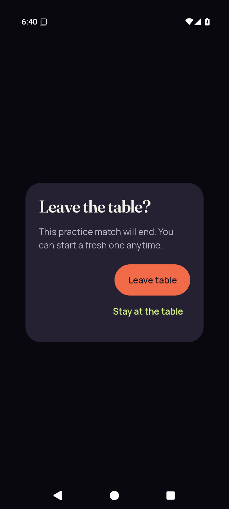</a> <code>2d-landscape-leave-confirmation.png</code> 2d-landscape-leave-confirmation — 2d-landscape.native-leave-home | 720 × 1600 px · 41,051 bytes · text 1.0 SHA-256: <code>03674d485fc31fdccfd77eab4f95531f3c5e82c0049e8e2cb0ffbce4bc6a4995</code> Source: <code>/root/projects/PartyDeck/artifacts/evidence-storage/34514544296/android-adaptive-api36-optimized-test-signed-font-1.0-34514544296-1/godot-adaptive/runtime/captures/2d-landscape-leave-confirmation.png</code> Original case outcome: **failed** Capture: 2026-09-10T18:40:48.340+00:00 → 2026-09-10T18:40:50.727+00:00 [UI XML](runtime/captures/2d-landscape-leave-confirmation.xml) · [Capture JSON](runtime/captures/2d-landscape-leave-confirmation.json) · [Original result](runtime/godot-adaptive-result.json) | **UNVIEWED original — no visual acceptance**. Preserved original capture; not visually reviewed. Stage and outcome labels come from the frozen collector mapping. No pixel observation or visual acceptance is claimed. |
| <a href="runtime/captures/2d-landscape-home.png">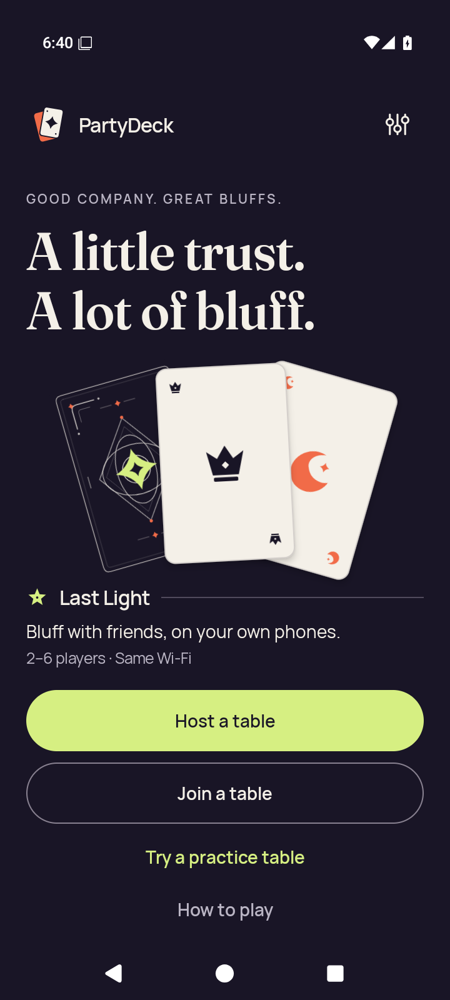</a> <code>2d-landscape-home.png</code> 2d-landscape-home — 2d-landscape.native-leave-home | 720 × 1600 px · 132,008 bytes · text 1.0 SHA-256: <code>e7723534191f439bf75b26c3047a31a650cdea480b95716da8828b1da96b71f6</code> Source: <code>/root/projects/PartyDeck/artifacts/evidence-storage/34514544296/android-adaptive-api36-optimized-test-signed-font-1.0-34514544296-1/godot-adaptive/runtime/captures/2d-landscape-home.png</code> Original case outcome: **failed** Capture: 2026-09-10T18:40:55.138+00:00 → 2026-09-10T18:40:57.542+00:00 [UI XML](runtime/captures/2d-landscape-home.xml) · [Capture JSON](runtime/captures/2d-landscape-home.json) · [Original result](runtime/godot-adaptive-result.json) | **UNVIEWED original — no visual acceptance**. Preserved original capture; not visually reviewed. Stage and outcome labels come from the frozen collector mapping. No pixel observation or visual acceptance is claimed. |
|  <code>2d-seascape-baseline-public.png</code> 2d-seascape-baseline-public — 2d-seascape.initial-landscape | 1600 × 720 px · 104,449 bytes · text 1.0 SHA-256: <code>6c81be55cec18603eb9a1f63f3e283d2c43ea0628066582406e7eb2b1765e108</code> Source: <code>/root/projects/PartyDeck/artifacts/evidence-storage/34514544296/android-adaptive-api36-optimized-test-signed-font-1.0-34514544296-1/godot-adaptive/runtime/captures/2d-seascape-baseline-public.png</code> Original case outcome: **failed** Capture: 2026-09-10T18:41:11.538+00:00 → 2026-09-10T18:41:13.931+00:00 [UI XML](runtime/captures/2d-seascape-baseline-public.xml) · [Capture JSON](runtime/captures/2d-seascape-baseline-public.json) · [Original result](runtime/godot-adaptive-result.json) | **UNVIEWED original — no visual acceptance**. Preserved original capture; not visually reviewed. Stage and outcome labels come from the frozen collector mapping. No pixel observation or visual acceptance is claimed. |
|  <code>2d-seascape-baseline-first-card.png</code> 2d-seascape-baseline-first-card — 2d-seascape.initial-landscape | 1600 × 720 px · 100,202 bytes · text 1.0 SHA-256: <code>09fb5c632bb3427b3bea81f47e7a96d2020bec57e96462113a86f5b122fc9c13</code> Source: <code>/root/projects/PartyDeck/artifacts/evidence-storage/34514544296/android-adaptive-api36-optimized-test-signed-font-1.0-34514544296-1/godot-adaptive/runtime/captures/2d-seascape-baseline-first-card.png</code> Original case outcome: **failed** Capture: 2026-09-10T18:41:18.078+00:00 → 2026-09-10T18:41:20.504+00:00 [UI XML](runtime/captures/2d-seascape-baseline-first-card.xml) · [Capture JSON](runtime/captures/2d-seascape-baseline-first-card.json) · [Original result](runtime/godot-adaptive-result.json) | **UNVIEWED original — no visual acceptance**. Preserved original capture; not visually reviewed. Stage and outcome labels come from the frozen collector mapping. No pixel observation or visual acceptance is claimed. |
| <a href="runtime/captures/2d-seascape-baseline-selected.png">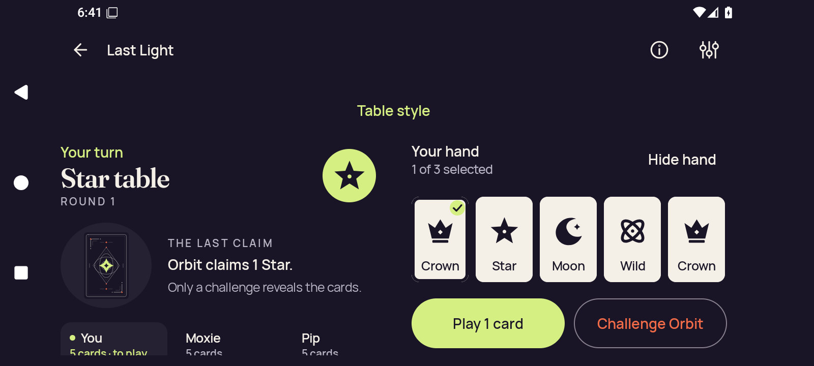</a> <code>2d-seascape-baseline-selected.png</code> 2d-seascape-baseline-selected — 2d-seascape.initial-landscape | 1600 × 720 px · 101,114 bytes · text 1.0 SHA-256: <code>782bac9f009ea6a10200470b2281f34b7edf194711e7ce7b37fa9df76fdf4fc4</code> Source: <code>/root/projects/PartyDeck/artifacts/evidence-storage/34514544296/android-adaptive-api36-optimized-test-signed-font-1.0-34514544296-1/godot-adaptive/runtime/captures/2d-seascape-baseline-selected.png</code> Original case outcome: **failed** Capture: 2026-09-10T18:41:26.759+00:00 → 2026-09-10T18:41:29.144+00:00 [UI XML](runtime/captures/2d-seascape-baseline-selected.xml) · [Capture JSON](runtime/captures/2d-seascape-baseline-selected.json) · [Original result](runtime/godot-adaptive-result.json) | **UNVIEWED original — no visual acceptance**. Preserved original capture; not visually reviewed. Stage and outcome labels come from the frozen collector mapping. No pixel observation or visual acceptance is claimed. |
| <a href="runtime/captures/2d-seascape-initial-selector.png">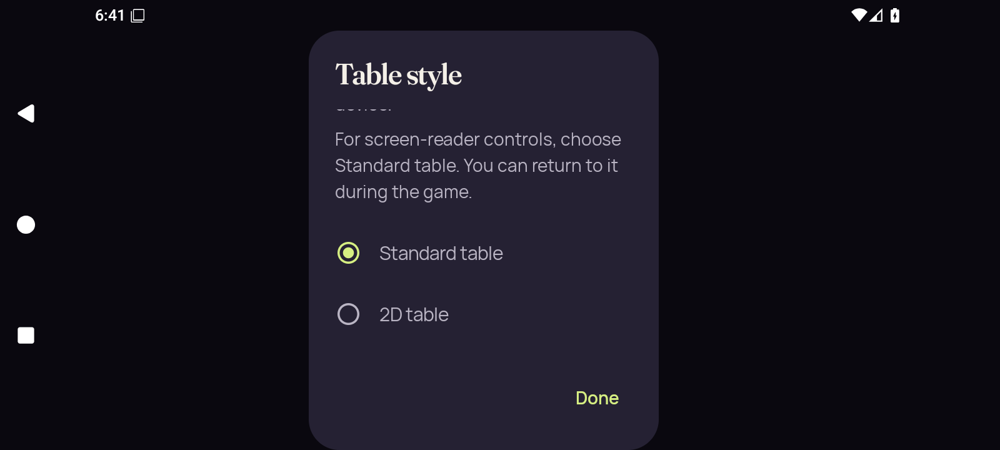</a> <code>2d-seascape-initial-selector.png</code> 2d-seascape-initial-selector — 2d-seascape.initial-landscape | 1600 × 720 px · 45,775 bytes · text 1.0 SHA-256: <code>0f439a5279c61cf93c5f6ed436cab654bb12efd1ffb464ad24acc47facdafec1</code> Source: <code>/root/projects/PartyDeck/artifacts/evidence-storage/34514544296/android-adaptive-api36-optimized-test-signed-font-1.0-34514544296-1/godot-adaptive/runtime/captures/2d-seascape-initial-selector.png</code> Original case outcome: **failed** Capture: 2026-09-10T18:41:38.528+00:00 → 2026-09-10T18:41:40.962+00:00 [UI XML](runtime/captures/2d-seascape-initial-selector.xml) · [Capture JSON](runtime/captures/2d-seascape-initial-selector.json) · [Original result](runtime/godot-adaptive-result.json) | **UNVIEWED original — no visual acceptance**. Preserved original capture; not visually reviewed. Stage and outcome labels come from the frozen collector mapping. No pixel observation or visual acceptance is claimed. |
| <a href="runtime/captures/2d-seascape-initial-native-ready.png">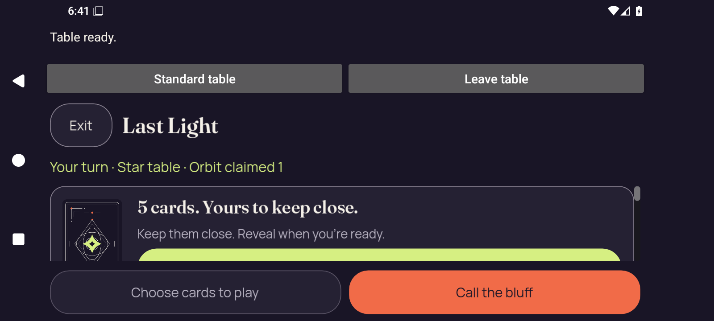</a> <code>2d-seascape-initial-native-ready.png</code> 2d-seascape-initial-native-ready — 2d-seascape.initial-landscape | 1600 × 720 px · 107,684 bytes · text 1.0 SHA-256: <code>39adcedd524b5ef70ed4c3e0a8561dc6b5c8057f2ea308027b8541daffa69377</code> Source: <code>/root/projects/PartyDeck/artifacts/evidence-storage/34514544296/android-adaptive-api36-optimized-test-signed-font-1.0-34514544296-1/godot-adaptive/runtime/captures/2d-seascape-initial-native-ready.png</code> Original case outcome: **failed** Capture: 2026-09-10T18:41:47.766+00:00 → 2026-09-10T18:41:50.186+00:00 [UI XML](runtime/captures/2d-seascape-initial-native-ready.xml) · [Capture JSON](runtime/captures/2d-seascape-initial-native-ready.json) · [Original result](runtime/godot-adaptive-result.json) | **Direct original view**. Your turn · Star table · Orbit claimed 1 is visible. Choose cards appears disabled; Call the bluff is orange. Android navigation is on the left in the seascape capture. In this normal-text landscape native-ready still, Table ready, Standard table/Leave table, Exit/Last Light and the single-line public turn context fit. The covered-hand panel shows card-back artwork, the five-card headline and explanatory copy. Only the upper green edge of Reveal appears above the body clip; its label and the rest of the cover are hidden. Both fixed lower actions fit. No private card face is visible; the still does not prove gameplay or continuous privacy. |
| <a href="runtime/captures/2d-seascape-unsupported-return-concealed.png">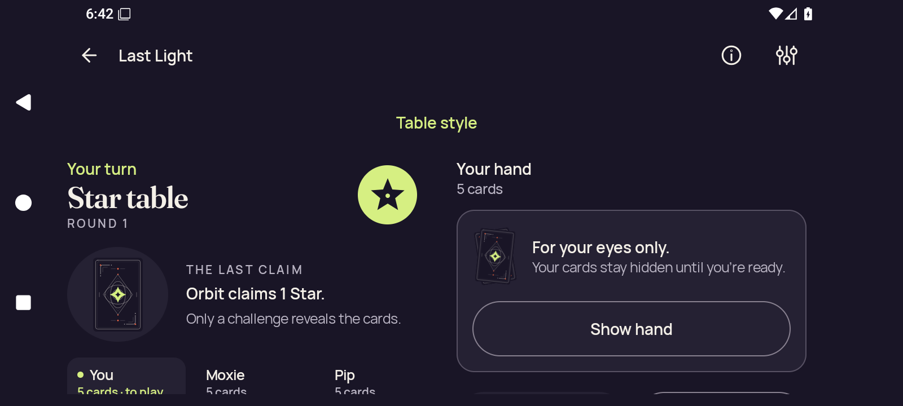</a> <code>2d-seascape-unsupported-return-concealed.png</code> 2d-seascape-unsupported-return-concealed — 2d-seascape.held-rotation | 1600 × 720 px · 97,961 bytes · text 1.0 SHA-256: <code>ced0271720a0616cdc5f9cca0a3f928432f0932f19e481d5e83f5d41b9a47727</code> Source: <code>/root/projects/PartyDeck/artifacts/evidence-storage/34514544296/android-adaptive-api36-optimized-test-signed-font-1.0-34514544296-1/godot-adaptive/runtime/captures/2d-seascape-unsupported-return-concealed.png</code> Original case outcome: **failed** Capture: 2026-09-10T18:42:10.462+00:00 → 2026-09-10T18:42:12.896+00:00 [UI XML](runtime/captures/2d-seascape-unsupported-return-concealed.xml) · [Capture JSON](runtime/captures/2d-seascape-unsupported-return-concealed.json) · [Original result](runtime/godot-adaptive-result.json) | **UNVIEWED original — no visual acceptance**. Preserved original capture; not visually reviewed. Stage and outcome labels come from the frozen collector mapping. No pixel observation or visual acceptance is claimed. |
| <a href="runtime/captures/2d-seascape-unsupported-return-selection-cleared.png">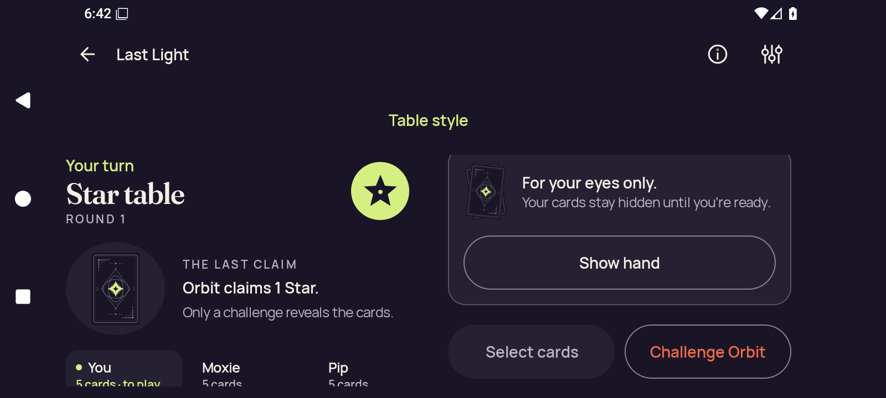</a> <code>2d-seascape-unsupported-return-selection-cleared.png</code> 2d-seascape-unsupported-return-selection-cleared — 2d-seascape.held-rotation | 1600 × 720 px · 104,824 bytes · text 1.0 SHA-256: <code>bb804e8027b786aa18919c6023895957136e4ccc5047768b923fa87e2f724627</code> Source: <code>/root/projects/PartyDeck/artifacts/evidence-storage/34514544296/android-adaptive-api36-optimized-test-signed-font-1.0-34514544296-1/godot-adaptive/runtime/captures/2d-seascape-unsupported-return-selection-cleared.png</code> Original case outcome: **failed** Capture: 2026-09-10T18:42:17.692+00:00 → 2026-09-10T18:42:20.096+00:00 [UI XML](runtime/captures/2d-seascape-unsupported-return-selection-cleared.xml) · [Capture JSON](runtime/captures/2d-seascape-unsupported-return-selection-cleared.json) · [Original result](runtime/godot-adaptive-result.json) | **UNVIEWED original — no visual acceptance**. Preserved original capture; not visually reviewed. Stage and outcome labels come from the frozen collector mapping. No pixel observation or visual acceptance is claimed. |
|  <code>2d-seascape-unsupported-return-public.png</code> 2d-seascape-unsupported-return-public — 2d-seascape.held-rotation | 1600 × 720 px · 104,824 bytes · text 1.0 SHA-256: <code>bb804e8027b786aa18919c6023895957136e4ccc5047768b923fa87e2f724627</code> Source: <code>/root/projects/PartyDeck/artifacts/evidence-storage/34514544296/android-adaptive-api36-optimized-test-signed-font-1.0-34514544296-1/godot-adaptive/runtime/captures/2d-seascape-unsupported-return-public.png</code> Original case outcome: **failed** Capture: 2026-09-10T18:42:22.122+00:00 → 2026-09-10T18:42:24.502+00:00 [UI XML](runtime/captures/2d-seascape-unsupported-return-public.xml) · [Capture JSON](runtime/captures/2d-seascape-unsupported-return-public.json) · [Original result](runtime/godot-adaptive-result.json) | **UNVIEWED original — no visual acceptance**. Preserved original capture; not visually reviewed. Stage and outcome labels come from the frozen collector mapping. No pixel observation or visual acceptance is claimed. |
| <a href="runtime/captures/2d-seascape-unsupported-return-first-card.png">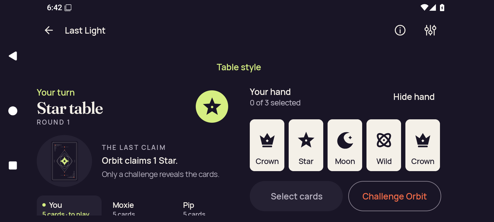</a> <code>2d-seascape-unsupported-return-first-card.png</code> 2d-seascape-unsupported-return-first-card — 2d-seascape.held-rotation | 1600 × 720 px · 100,417 bytes · text 1.0 SHA-256: <code>8b1688669c1b3bd9aa95506272027fe97c394bebc5c2b0253b007909dc1c3b96</code> Source: <code>/root/projects/PartyDeck/artifacts/evidence-storage/34514544296/android-adaptive-api36-optimized-test-signed-font-1.0-34514544296-1/godot-adaptive/runtime/captures/2d-seascape-unsupported-return-first-card.png</code> Original case outcome: **failed** Capture: 2026-09-10T18:42:28.618+00:00 → 2026-09-10T18:42:31.043+00:00 [UI XML](runtime/captures/2d-seascape-unsupported-return-first-card.xml) · [Capture JSON](runtime/captures/2d-seascape-unsupported-return-first-card.json) · [Original result](runtime/godot-adaptive-result.json) | **UNVIEWED original — no visual acceptance**. Preserved original capture; not visually reviewed. Stage and outcome labels come from the frozen collector mapping. No pixel observation or visual acceptance is claimed. |
| <a href="runtime/captures/2d-seascape-unsupported-portrait-return-concealed.png">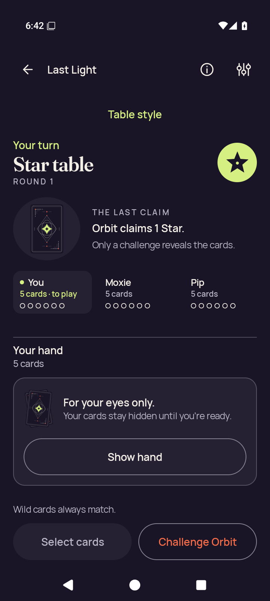</a> <code>2d-seascape-unsupported-portrait-return-concealed.png</code> 2d-seascape-unsupported-portrait-return-concealed — 2d-seascape.held-rotation | 720 × 1600 px · 117,300 bytes · text 1.0 SHA-256: <code>c32e25ca8fe6dbc527dd85744befdd27ee57726df13089a69d4f3979362e0ecc</code> Source: <code>/root/projects/PartyDeck/artifacts/evidence-storage/34514544296/android-adaptive-api36-optimized-test-signed-font-1.0-34514544296-1/godot-adaptive/runtime/captures/2d-seascape-unsupported-portrait-return-concealed.png</code> Original case outcome: **failed** Capture: 2026-09-10T18:42:36.640+00:00 → 2026-09-10T18:42:39.036+00:00 [UI XML](runtime/captures/2d-seascape-unsupported-portrait-return-concealed.xml) · [Capture JSON](runtime/captures/2d-seascape-unsupported-portrait-return-concealed.json) · [Original result](runtime/godot-adaptive-result.json) | **UNVIEWED original — no visual acceptance**. Preserved original capture; not visually reviewed. Stage and outcome labels come from the frozen collector mapping. No pixel observation or visual acceptance is claimed. |
|  <code>2d-seascape-unsupported-portrait-return-selection-cleared.png</code> 2d-seascape-unsupported-portrait-return-selection-cleared — 2d-seascape.held-rotation | 720 × 1600 px · 117,300 bytes · text 1.0 SHA-256: <code>c32e25ca8fe6dbc527dd85744befdd27ee57726df13089a69d4f3979362e0ecc</code> Source: <code>/root/projects/PartyDeck/artifacts/evidence-storage/34514544296/android-adaptive-api36-optimized-test-signed-font-1.0-34514544296-1/godot-adaptive/runtime/captures/2d-seascape-unsupported-portrait-return-selection-cleared.png</code> Original case outcome: **failed** Capture: 2026-09-10T18:42:41.055+00:00 → 2026-09-10T18:42:43.437+00:00 [UI XML](runtime/captures/2d-seascape-unsupported-portrait-return-selection-cleared.xml) · [Capture JSON](runtime/captures/2d-seascape-unsupported-portrait-return-selection-cleared.json) · [Original result](runtime/godot-adaptive-result.json) | **UNVIEWED original — no visual acceptance**. Preserved original capture; not visually reviewed. Stage and outcome labels come from the frozen collector mapping. No pixel observation or visual acceptance is claimed. |
|  <code>2d-seascape-unsupported-portrait-return-public.png</code> 2d-seascape-unsupported-portrait-return-public — 2d-seascape.held-rotation | 720 × 1600 px · 117,300 bytes · text 1.0 SHA-256: <code>c32e25ca8fe6dbc527dd85744befdd27ee57726df13089a69d4f3979362e0ecc</code> Source: <code>/root/projects/PartyDeck/artifacts/evidence-storage/34514544296/android-adaptive-api36-optimized-test-signed-font-1.0-34514544296-1/godot-adaptive/runtime/captures/2d-seascape-unsupported-portrait-return-public.png</code> Original case outcome: **failed** Capture: 2026-09-10T18:42:45.464+00:00 → 2026-09-10T18:42:47.860+00:00 [UI XML](runtime/captures/2d-seascape-unsupported-portrait-return-public.xml) · [Capture JSON](runtime/captures/2d-seascape-unsupported-portrait-return-public.json) · [Original result](runtime/godot-adaptive-result.json) | **UNVIEWED original — no visual acceptance**. Preserved original capture; not visually reviewed. Stage and outcome labels come from the frozen collector mapping. No pixel observation or visual acceptance is claimed. |
|  <code>2d-seascape-unsupported-portrait-return-first-card.png</code> 2d-seascape-unsupported-portrait-return-first-card — 2d-seascape.held-rotation | 720 × 1600 px · 115,866 bytes · text 1.0 SHA-256: <code>58ca553f124c81fe62060433a6cf5f1cda636145a088e46abd66471b5a295ee8</code> Source: <code>/root/projects/PartyDeck/artifacts/evidence-storage/34514544296/android-adaptive-api36-optimized-test-signed-font-1.0-34514544296-1/godot-adaptive/runtime/captures/2d-seascape-unsupported-portrait-return-first-card.png</code> Original case outcome: **failed** Capture: 2026-09-10T18:42:51.979+00:00 → 2026-09-10T18:42:54.390+00:00 [UI XML](runtime/captures/2d-seascape-unsupported-portrait-return-first-card.xml) · [Capture JSON](runtime/captures/2d-seascape-unsupported-portrait-return-first-card.json) · [Original result](runtime/godot-adaptive-result.json) | **UNVIEWED original — no visual acceptance**. Preserved original capture; not visually reviewed. Stage and outcome labels come from the frozen collector mapping. No pixel observation or visual acceptance is claimed. |
|  <code>2d-seascape-reentry-selected.png</code> 2d-seascape-reentry-selected — 2d-seascape.portrait-reentry-standard | 720 × 1600 px · 115,613 bytes · text 1.0 SHA-256: <code>6a2f555d6d5ab4d3b45a1a8239e0328c7c851031d9b71f9859d69660777835a1</code> Source: <code>/root/projects/PartyDeck/artifacts/evidence-storage/34514544296/android-adaptive-api36-optimized-test-signed-font-1.0-34514544296-1/godot-adaptive/runtime/captures/2d-seascape-reentry-selected.png</code> Original case outcome: **failed** Capture: 2026-09-10T18:43:00.673+00:00 → 2026-09-10T18:43:03.101+00:00 [UI XML](runtime/captures/2d-seascape-reentry-selected.xml) · [Capture JSON](runtime/captures/2d-seascape-reentry-selected.json) · [Original result](runtime/godot-adaptive-result.json) | **UNVIEWED original — no visual acceptance**. Preserved original capture; not visually reviewed. Stage and outcome labels come from the frozen collector mapping. No pixel observation or visual acceptance is claimed. |
|  <code>2d-seascape-portrait-selector.png</code> 2d-seascape-portrait-selector — 2d-seascape.portrait-reentry-standard | 720 × 1600 px · 58,441 bytes · text 1.0 SHA-256: <code>dc838acc34f44c86ee80f438429504753568963bb67173aa365b057a96d08b05</code> Source: <code>/root/projects/PartyDeck/artifacts/evidence-storage/34514544296/android-adaptive-api36-optimized-test-signed-font-1.0-34514544296-1/godot-adaptive/runtime/captures/2d-seascape-portrait-selector.png</code> Original case outcome: **failed** Capture: 2026-09-10T18:43:09.612+00:00 → 2026-09-10T18:43:12.006+00:00 [UI XML](runtime/captures/2d-seascape-portrait-selector.xml) · [Capture JSON](runtime/captures/2d-seascape-portrait-selector.json) · [Original result](runtime/godot-adaptive-result.json) | **UNVIEWED original — no visual acceptance**. Preserved original capture; not visually reviewed. Stage and outcome labels come from the frozen collector mapping. No pixel observation or visual acceptance is claimed. |
|  <code>2d-seascape-portrait-native-ready.png</code> 2d-seascape-portrait-native-ready — 2d-seascape.portrait-reentry-standard | 720 × 1600 px · 145,087 bytes · text 1.0 SHA-256: <code>4669aa63d413fd36014cbb4b39d3135fb52d62a38c76354408929e3ff4ebbd4e</code> Source: <code>/root/projects/PartyDeck/artifacts/evidence-storage/34514544296/android-adaptive-api36-optimized-test-signed-font-1.0-34514544296-1/godot-adaptive/runtime/captures/2d-seascape-portrait-native-ready.png</code> Original case outcome: **failed** Capture: 2026-09-10T18:43:20.216+00:00 → 2026-09-10T18:43:22.635+00:00 [UI XML](runtime/captures/2d-seascape-portrait-native-ready.xml) · [Capture JSON](runtime/captures/2d-seascape-portrait-native-ready.json) · [Original result](runtime/godot-adaptive-result.json) | **Direct original view**. Round 01, Star and Orbit claimed 1 Star. are visible. Choose cards appears disabled and Call the bluff is orange. Full Table ready, Standard table and Leave table chrome, Exit/Last Light, and turn/rank/public context are visible. The complete compact cover and full Reveal my hand button fit with separation before the first two complete numbered seats, Guest and Moxie; the next seat-row upper edges meet the lower body clip. Full fixed lower game actions are visible. No private card face is visible. This normal-text 720×1600 native-ready still does not measure native margins, initial scroll position, gameplay completion or continuous privacy. |
|  <code>2d-seascape-standard-return-concealed.png</code> 2d-seascape-standard-return-concealed — 2d-seascape.portrait-reentry-standard | 720 × 1600 px · 117,505 bytes · text 1.0 SHA-256: <code>e3bf74835ce97b874def3b0627821fa6098b2aeb20a5fbe28b8bd75a152ffc40</code> Source: <code>/root/projects/PartyDeck/artifacts/evidence-storage/34514544296/android-adaptive-api36-optimized-test-signed-font-1.0-34514544296-1/godot-adaptive/runtime/captures/2d-seascape-standard-return-concealed.png</code> Original case outcome: **failed** Capture: 2026-09-10T18:43:29.897+00:00 → 2026-09-10T18:43:32.307+00:00 [UI XML](runtime/captures/2d-seascape-standard-return-concealed.xml) · [Capture JSON](runtime/captures/2d-seascape-standard-return-concealed.json) · [Original result](runtime/godot-adaptive-result.json) | **UNVIEWED original — no visual acceptance**. Preserved original capture; not visually reviewed. Stage and outcome labels come from the frozen collector mapping. No pixel observation or visual acceptance is claimed. |
|  <code>2d-seascape-standard-return-selection-cleared.png</code> 2d-seascape-standard-return-selection-cleared — 2d-seascape.portrait-reentry-standard | 720 × 1600 px · 117,505 bytes · text 1.0 SHA-256: <code>e3bf74835ce97b874def3b0627821fa6098b2aeb20a5fbe28b8bd75a152ffc40</code> Source: <code>/root/projects/PartyDeck/artifacts/evidence-storage/34514544296/android-adaptive-api36-optimized-test-signed-font-1.0-34514544296-1/godot-adaptive/runtime/captures/2d-seascape-standard-return-selection-cleared.png</code> Original case outcome: **failed** Capture: 2026-09-10T18:43:34.337+00:00 → 2026-09-10T18:43:36.733+00:00 [UI XML](runtime/captures/2d-seascape-standard-return-selection-cleared.xml) · [Capture JSON](runtime/captures/2d-seascape-standard-return-selection-cleared.json) · [Original result](runtime/godot-adaptive-result.json) | **UNVIEWED original — no visual acceptance**. Preserved original capture; not visually reviewed. Stage and outcome labels come from the frozen collector mapping. No pixel observation or visual acceptance is claimed. |
|  <code>2d-seascape-standard-return-public.png</code> 2d-seascape-standard-return-public — 2d-seascape.portrait-reentry-standard | 720 × 1600 px · 117,505 bytes · text 1.0 SHA-256: <code>e3bf74835ce97b874def3b0627821fa6098b2aeb20a5fbe28b8bd75a152ffc40</code> Source: <code>/root/projects/PartyDeck/artifacts/evidence-storage/34514544296/android-adaptive-api36-optimized-test-signed-font-1.0-34514544296-1/godot-adaptive/runtime/captures/2d-seascape-standard-return-public.png</code> Original case outcome: **failed** Capture: 2026-09-10T18:43:38.764+00:00 → 2026-09-10T18:43:41.156+00:00 [UI XML](runtime/captures/2d-seascape-standard-return-public.xml) · [Capture JSON](runtime/captures/2d-seascape-standard-return-public.json) · [Original result](runtime/godot-adaptive-result.json) | **UNVIEWED original — no visual acceptance**. Preserved original capture; not visually reviewed. Stage and outcome labels come from the frozen collector mapping. No pixel observation or visual acceptance is claimed. |
| <a href="runtime/captures/2d-seascape-standard-return-first-card.png">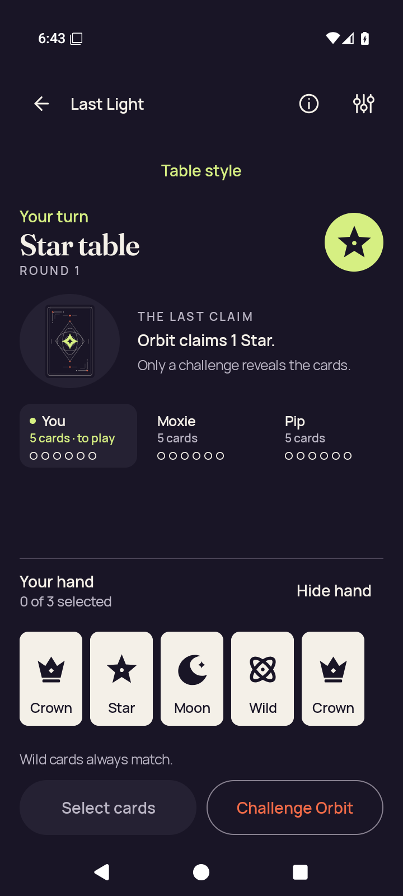</a> <code>2d-seascape-standard-return-first-card.png</code> 2d-seascape-standard-return-first-card — 2d-seascape.portrait-reentry-standard | 720 × 1600 px · 116,048 bytes · text 1.0 SHA-256: <code>6c8a82b05035652cea396a92c268dc120b3fee39568a7822f59c7d4fa8736035</code> Source: <code>/root/projects/PartyDeck/artifacts/evidence-storage/34514544296/android-adaptive-api36-optimized-test-signed-font-1.0-34514544296-1/godot-adaptive/runtime/captures/2d-seascape-standard-return-first-card.png</code> Original case outcome: **failed** Capture: 2026-09-10T18:43:45.282+00:00 → 2026-09-10T18:43:47.690+00:00 [UI XML](runtime/captures/2d-seascape-standard-return-first-card.xml) · [Capture JSON](runtime/captures/2d-seascape-standard-return-first-card.json) · [Original result](runtime/godot-adaptive-result.json) | **UNVIEWED original — no visual acceptance**. Preserved original capture; not visually reviewed. Stage and outcome labels come from the frozen collector mapping. No pixel observation or visual acceptance is claimed. |
|  <code>2d-seascape-leave-selected.png</code> 2d-seascape-leave-selected — 2d-seascape.native-leave-home | 720 × 1600 px · 115,713 bytes · text 1.0 SHA-256: <code>9ce6f493d166b696c373b51e827dffd55d5b9016d2d96ab3c3c1e410c99d65d1</code> Source: <code>/root/projects/PartyDeck/artifacts/evidence-storage/34514544296/android-adaptive-api36-optimized-test-signed-font-1.0-34514544296-1/godot-adaptive/runtime/captures/2d-seascape-leave-selected.png</code> Original case outcome: **failed** Capture: 2026-09-10T18:43:53.961+00:00 → 2026-09-10T18:43:56.373+00:00 [UI XML](runtime/captures/2d-seascape-leave-selected.xml) · [Capture JSON](runtime/captures/2d-seascape-leave-selected.json) · [Original result](runtime/godot-adaptive-result.json) | **UNVIEWED original — no visual acceptance**. Preserved original capture; not visually reviewed. Stage and outcome labels come from the frozen collector mapping. No pixel observation or visual acceptance is claimed. |
|  <code>2d-seascape-leave-selector.png</code> 2d-seascape-leave-selector — 2d-seascape.native-leave-home | 720 × 1600 px · 58,038 bytes · text 1.0 SHA-256: <code>cff0867d6e1046a004f248697b61a45bb7d3bb615eca174c27121f1761d02e21</code> Source: <code>/root/projects/PartyDeck/artifacts/evidence-storage/34514544296/android-adaptive-api36-optimized-test-signed-font-1.0-34514544296-1/godot-adaptive/runtime/captures/2d-seascape-leave-selector.png</code> Original case outcome: **failed** Capture: 2026-09-10T18:44:02.878+00:00 → 2026-09-10T18:44:05.272+00:00 [UI XML](runtime/captures/2d-seascape-leave-selector.xml) · [Capture JSON](runtime/captures/2d-seascape-leave-selector.json) · [Original result](runtime/godot-adaptive-result.json) | **UNVIEWED original — no visual acceptance**. Preserved original capture; not visually reviewed. Stage and outcome labels come from the frozen collector mapping. No pixel observation or visual acceptance is claimed. |
|  <code>2d-seascape-leave-native-ready.png</code> 2d-seascape-leave-native-ready — 2d-seascape.native-leave-home | 720 × 1600 px · 144,596 bytes · text 1.0 SHA-256: <code>f81c14c0ac5edc4a397d56b4004f118c5522676d8366df361e563da7ce1cf507</code> Source: <code>/root/projects/PartyDeck/artifacts/evidence-storage/34514544296/android-adaptive-api36-optimized-test-signed-font-1.0-34514544296-1/godot-adaptive/runtime/captures/2d-seascape-leave-native-ready.png</code> Original case outcome: **failed** Capture: 2026-09-10T18:44:12.678+00:00 → 2026-09-10T18:44:15.117+00:00 [UI XML](runtime/captures/2d-seascape-leave-native-ready.xml) · [Capture JSON](runtime/captures/2d-seascape-leave-native-ready.json) · [Original result](runtime/godot-adaptive-result.json) | **Direct original view**. Round 01, Star and Orbit claimed 1 Star. are visible. Choose cards appears disabled and Call the bluff is orange. Full Table ready, Standard table and Leave table chrome, Exit/Last Light and turn context fit. The compact five-card cover and complete Reveal my hand button are visible above two complete Guest/Moxie seat panels; upper edges of the next seat row meet the body clip. Fixed lower actions fit. No private card face is visible. This portrait leave-native-ready still preserves its source identity and does not establish later leaving, initial scroll position or continuous privacy. |
|  <code>2d-seascape-leave-confirmation.png</code> 2d-seascape-leave-confirmation — 2d-seascape.native-leave-home | 720 × 1600 px · 40,737 bytes · text 1.0 SHA-256: <code>f2482378bac68f6ac6a99aefe16a9feb1718234f3769d3ca9874bee4a8cfbb9e</code> Source: <code>/root/projects/PartyDeck/artifacts/evidence-storage/34514544296/android-adaptive-api36-optimized-test-signed-font-1.0-34514544296-1/godot-adaptive/runtime/captures/2d-seascape-leave-confirmation.png</code> Original case outcome: **failed** Capture: 2026-09-10T18:44:22.453+00:00 → 2026-09-10T18:44:24.834+00:00 [UI XML](runtime/captures/2d-seascape-leave-confirmation.xml) · [Capture JSON](runtime/captures/2d-seascape-leave-confirmation.json) · [Original result](runtime/godot-adaptive-result.json) | **UNVIEWED original — no visual acceptance**. Preserved original capture; not visually reviewed. Stage and outcome labels come from the frozen collector mapping. No pixel observation or visual acceptance is claimed. |
| <a href="runtime/captures/2d-seascape-home.png">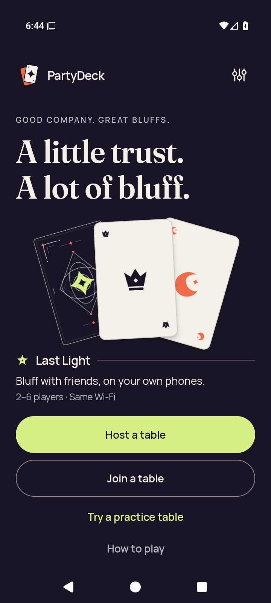</a> <code>2d-seascape-home.png</code> 2d-seascape-home — 2d-seascape.native-leave-home | 720 × 1600 px · 131,778 bytes · text 1.0 SHA-256: <code>4e351d7ddc83fae77b0d16c74d08823be95304bbacb17a1d53c6d15adb7fbc6c</code> Source: <code>/root/projects/PartyDeck/artifacts/evidence-storage/34514544296/android-adaptive-api36-optimized-test-signed-font-1.0-34514544296-1/godot-adaptive/runtime/captures/2d-seascape-home.png</code> Original case outcome: **failed** Capture: 2026-09-10T18:44:29.235+00:00 → 2026-09-10T18:44:31.638+00:00 [UI XML](runtime/captures/2d-seascape-home.xml) · [Capture JSON](runtime/captures/2d-seascape-home.json) · [Original result](runtime/godot-adaptive-result.json) | **UNVIEWED original — no visual acceptance**. Preserved original capture; not visually reviewed. Stage and outcome labels come from the frozen collector mapping. No pixel observation or visual acceptance is claimed. |
| <a href="runtime/captures/2d-split-baseline-public.png">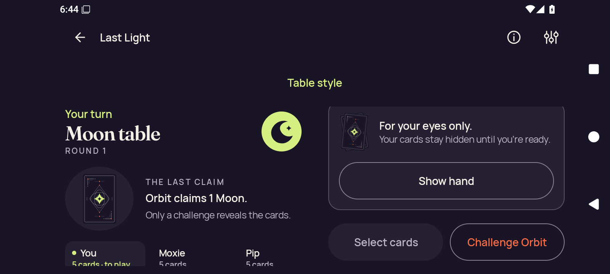</a> <code>2d-split-baseline-public.png</code> 2d-split-baseline-public — 2d-split.entry-after-ready | 1600 × 720 px · 105,676 bytes · text 1.0 SHA-256: <code>263d228fc5f5edf0b707b46a38926f55422bc5356dd8656058c52b36210db87e</code> Source: <code>/root/projects/PartyDeck/artifacts/evidence-storage/34514544296/android-adaptive-api36-optimized-test-signed-font-1.0-34514544296-1/godot-adaptive/runtime/captures/2d-split-baseline-public.png</code> Original case outcome: **failed** Capture: 2026-09-10T18:44:47.956+00:00 → 2026-09-10T18:44:50.387+00:00 [UI XML](runtime/captures/2d-split-baseline-public.xml) · [Capture JSON](runtime/captures/2d-split-baseline-public.json) · [Original result](runtime/godot-adaptive-result.json) | **UNVIEWED original — no visual acceptance**. Preserved original capture; not visually reviewed. Stage and outcome labels come from the frozen collector mapping. No pixel observation or visual acceptance is claimed. |
| <a href="runtime/captures/2d-split-baseline-first-card.png">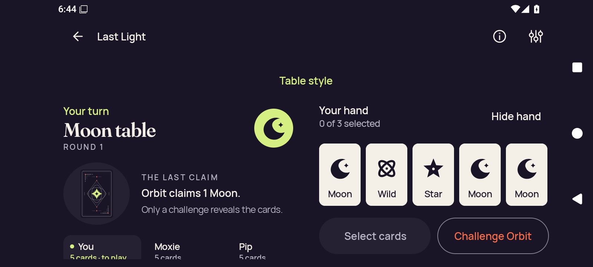</a> <code>2d-split-baseline-first-card.png</code> 2d-split-baseline-first-card — 2d-split.entry-after-ready | 1600 × 720 px · 99,253 bytes · text 1.0 SHA-256: <code>a8ce94ea359c2b7cab0967325aa7ef06e579d27f72b215ffde51dd1edab9c6f5</code> Source: <code>/root/projects/PartyDeck/artifacts/evidence-storage/34514544296/android-adaptive-api36-optimized-test-signed-font-1.0-34514544296-1/godot-adaptive/runtime/captures/2d-split-baseline-first-card.png</code> Original case outcome: **failed** Capture: 2026-09-10T18:44:54.515+00:00 → 2026-09-10T18:44:56.945+00:00 [UI XML](runtime/captures/2d-split-baseline-first-card.xml) · [Capture JSON](runtime/captures/2d-split-baseline-first-card.json) · [Original result](runtime/godot-adaptive-result.json) | **UNVIEWED original — no visual acceptance**. Preserved original capture; not visually reviewed. Stage and outcome labels come from the frozen collector mapping. No pixel observation or visual acceptance is claimed. |
|  <code>2d-split-baseline-selected.png</code> 2d-split-baseline-selected — 2d-split.entry-after-ready | 1600 × 720 px · 100,657 bytes · text 1.0 SHA-256: <code>a791cd9099d8bf3e72d5208332e12cc2474340ec544794277082779f328d91b9</code> Source: <code>/root/projects/PartyDeck/artifacts/evidence-storage/34514544296/android-adaptive-api36-optimized-test-signed-font-1.0-34514544296-1/godot-adaptive/runtime/captures/2d-split-baseline-selected.png</code> Original case outcome: **failed** Capture: 2026-09-10T18:45:03.191+00:00 → 2026-09-10T18:45:05.604+00:00 [UI XML](runtime/captures/2d-split-baseline-selected.xml) · [Capture JSON](runtime/captures/2d-split-baseline-selected.json) · [Original result](runtime/godot-adaptive-result.json) | **UNVIEWED original — no visual acceptance**. Preserved original capture; not visually reviewed. Stage and outcome labels come from the frozen collector mapping. No pixel observation or visual acceptance is claimed. |
| <a href="runtime/captures/2d-split-full-selector.png">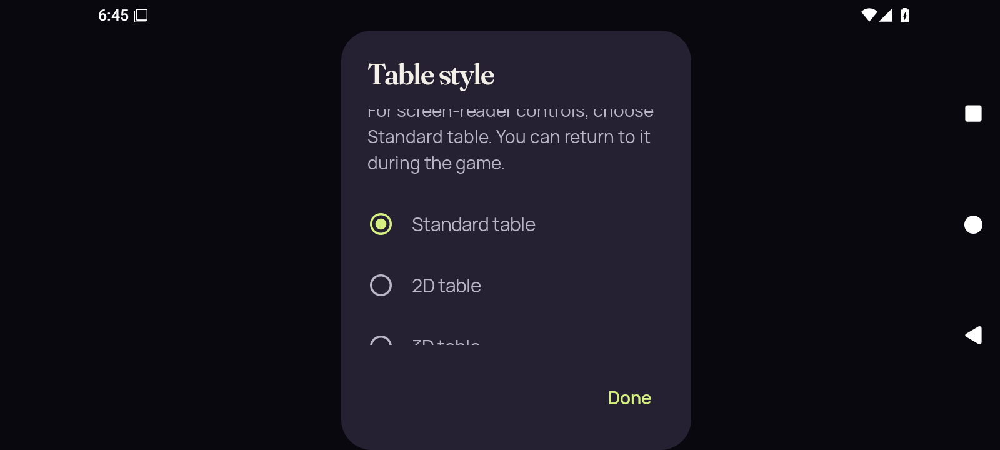</a> <code>2d-split-full-selector.png</code> 2d-split-full-selector — 2d-split.entry-after-ready | 1600 × 720 px · 45,359 bytes · text 1.0 SHA-256: <code>ea48b337b1d54ff72db12b08436a60f9ef7c80e35fc93d788a75e95765492a9a</code> Source: <code>/root/projects/PartyDeck/artifacts/evidence-storage/34514544296/android-adaptive-api36-optimized-test-signed-font-1.0-34514544296-1/godot-adaptive/runtime/captures/2d-split-full-selector.png</code> Original case outcome: **failed** Capture: 2026-09-10T18:45:14.856+00:00 → 2026-09-10T18:45:17.272+00:00 [UI XML](runtime/captures/2d-split-full-selector.xml) · [Capture JSON](runtime/captures/2d-split-full-selector.json) · [Original result](runtime/godot-adaptive-result.json) | **UNVIEWED original — no visual acceptance**. Preserved original capture; not visually reviewed. Stage and outcome labels come from the frozen collector mapping. No pixel observation or visual acceptance is claimed. |
| <a href="runtime/captures/2d-split-full-native-ready.png">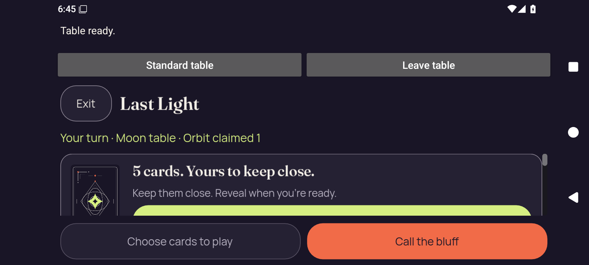</a> <code>2d-split-full-native-ready.png</code> 2d-split-full-native-ready — 2d-split.entry-after-ready | 1600 × 720 px · 108,206 bytes · text 1.0 SHA-256: <code>ea8d32d070b6fd3a82055e13d77617f0fc3e73395a6d2ca11b99ffffeb43e352</code> Source: <code>/root/projects/PartyDeck/artifacts/evidence-storage/34514544296/android-adaptive-api36-optimized-test-signed-font-1.0-34514544296-1/godot-adaptive/runtime/captures/2d-split-full-native-ready.png</code> Original case outcome: **failed** Capture: 2026-09-10T18:45:24.004+00:00 → 2026-09-10T18:45:26.420+00:00 [UI XML](runtime/captures/2d-split-full-native-ready.xml) · [Capture JSON](runtime/captures/2d-split-full-native-ready.json) · [Original result](runtime/godot-adaptive-result.json) | **Direct original view**. At normal text, this fullscreen landscape capture shows Table ready, Standard table/Leave table, Exit/Last Light and Your turn · Moon table · Orbit claimed 1. The card-back cover, five-card headline and explanatory copy fit, but only the upper green edge of Reveal is visible at the body clip. Fixed Choose cards to play and orange Call the bluff fit. The source name marks fullscreen readiness before the attempted split scope; no split-entry request occurred in this run. No private card face is visible, and this still cannot establish the unobserved split transition, gameplay or continuous privacy. |
|  <code>final-diagnostic.png</code> final-diagnostic — 3d-landscape.initial-landscape | 1600 × 720 px · 107,820 bytes · text 1.0 SHA-256: <code>94fd3021b9f430abc30fd93a2ecf0dfd38494d9fb0bcc404ca51f0630e526930</code> Source: <code>/root/projects/PartyDeck/artifacts/evidence-storage/34514544296/android-adaptive-api36-optimized-test-signed-font-1.0-34514544296-1/godot-adaptive/runtime/captures/final-diagnostic.png</code> Original case outcome: **failed** Capture: 2026-09-10T18:46:12.663+00:00 → 2026-09-10T18:46:15.092+00:00 [UI XML](runtime/captures/final-diagnostic.xml) · [Capture JSON](runtime/captures/final-diagnostic.json) · [Original result](runtime/godot-adaptive-result.json) | **Direct original view**. The normal-text final diagnostic shows Table ready, Standard table/Leave table, Exit/Last Light and Your turn · Moon table · Orbit claimed 1. The five-card cover and explanatory copy fit horizontally, but the reveal control is reduced to its upper green edge at the body clip. Fixed Choose cards to play and orange Call the bluff fit below it. Public claim context differs from the debug final state; no private face appears. The original preparation failure is unchanged. |
