# API 36 optimized-test-signed, font 2.0

[All collections](../../../README.md) · [Preserved evidence index](../../evidence-index.md) · [Copy/review binding](../../../android-34515669045/provenance/publication-review/partydeck-gallery-3433-publication-binding-v1.json) · [Completed focused review](../../provenance/publication-review/partydeck-gallery-after-2815-adaptive34514544296-visual-review-v1.json) · [Source mapping](../../provenance/source-collection/triage/capture-publication-inventory.json)

**Original case failed at 3d-landscape.initial-landscape preparation. Named scopes: {"failed": 1, "not-reached": 13, "passed": 7, "unsupported": 3}.**

Capture-stage names, source results and recording statuses are preserved. Direct reviews are limited to named 2D checkpoints.

All 228 original capture identities remain separate. Four installations pass. Across 96 named scopes, 28 pass, four fail, 12 are unsupported and 52 are unreached. Each case fails while preparing 3d-landscape.initial-landscape after unsupported split-entry recording. No split-entry request occurred; this does not establish native 3D launch failure. Engine gameplay assertions were not invoked.

The 32 directly reviewed stills show the compact cover, full Reveal, first two complete numbered seats and fixed lower actions in normal-text portrait native-ready/leave-native-ready frames. Normal landscape shows only the upper green edge of Reveal at the body clip. At 200% in either orientation, Reveal and lower game actions remain outside the viewport. No private faces are visible in those reviewed stills. These views add no margin, zero-scroll, gameplay-completion or continuous-privacy claim.

Twelve original MP4s retain startup-unavailable-original-retained / growth-not-observed and remain unviewed and undecoded. The exact source is derived; 1,124 omitted historical gallery blobs have only remote-tree identity in the source reconstruction. The actual producer pack is `557b2297bed133a433acc25efa4837462465dd4e06da659ae5a4cbd792f77fe0` (1,549,560 bytes).

Source revision: `286b7ff11b2441daad044b57fad6fc8b6be995d0`. CI run: [34514544296](https://github.com/Apdelrahman1911/PartyDeck/actions/runs/34514544296). 57 original PNG identities. Review methods: 49 unviewed original — no visual acceptance, 8 direct original view.

Every thumbnail opens the unchanged original PNG. **UNVIEWED** means no direct pixel review or visual acceptance is asserted. Matching bytes reuse only earlier pixel observations. Each source, scenario and original outcome remains separate. Frozen review plans retain their historical pending flags; the completed focused-review receipt records the final status. No new derivative image or video decoding was performed.

| Original capture | Original identity and evidence | Review status and observation |
| --- | --- | --- |
| <a href="runtime/captures/home-cold.png">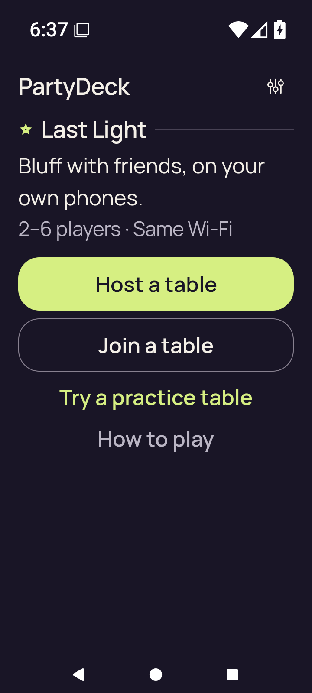</a> <code>home-cold.png</code> home-cold — emulator readiness | 720 × 1600 px · 81,040 bytes · text 2.0 SHA-256: <code>9c591dd1102f47f697796bb9e7e3ba4afabeb519dca122256c2508adb1294ecf</code> Source: <code>/root/projects/PartyDeck/artifacts/evidence-storage/34514544296/android-adaptive-api36-optimized-test-signed-font-2.0-34514544296-1/godot-adaptive/runtime/captures/home-cold.png</code> Original case outcome: **failed** Capture: 2026-09-10T18:37:38.438+00:00 → 2026-09-10T18:37:40.843+00:00 [UI XML](runtime/captures/home-cold.xml) · [Capture JSON](runtime/captures/home-cold.json) · [Original result](runtime/godot-adaptive-result.json) | **UNVIEWED original — no visual acceptance**. Preserved original capture; not visually reviewed. Stage and outcome labels come from the frozen collector mapping. No pixel observation or visual acceptance is claimed. |
| <a href="runtime/captures/2d-landscape-baseline-public.png">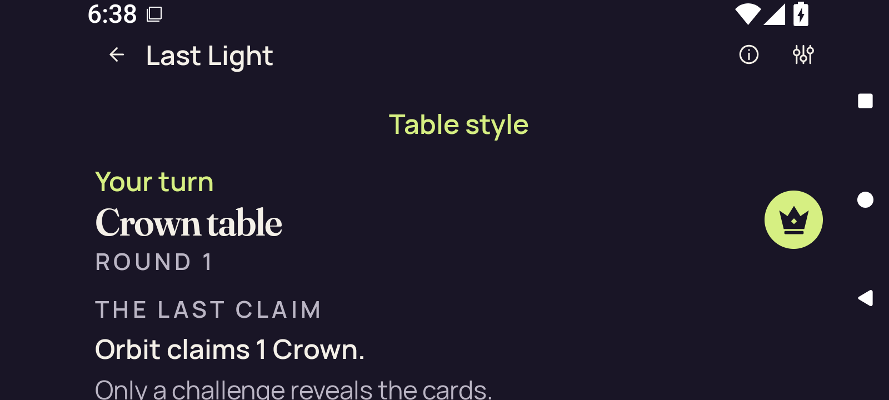</a> <code>2d-landscape-baseline-public.png</code> 2d-landscape-baseline-public — 2d-landscape.initial-landscape | 1600 × 720 px · 77,803 bytes · text 2.0 SHA-256: <code>15d3613df7701c685bb27919384e7c617cfe921438ec79a16adbb8e548136e89</code> Source: <code>/root/projects/PartyDeck/artifacts/evidence-storage/34514544296/android-adaptive-api36-optimized-test-signed-font-2.0-34514544296-1/godot-adaptive/runtime/captures/2d-landscape-baseline-public.png</code> Original case outcome: **failed** Capture: 2026-09-10T18:38:22.374+00:00 → 2026-09-10T18:38:24.771+00:00 [UI XML](runtime/captures/2d-landscape-baseline-public.xml) · [Capture JSON](runtime/captures/2d-landscape-baseline-public.json) · [Original result](runtime/godot-adaptive-result.json) | **UNVIEWED original — no visual acceptance**. Preserved original capture; not visually reviewed. Stage and outcome labels come from the frozen collector mapping. No pixel observation or visual acceptance is claimed. |
| <a href="runtime/captures/2d-landscape-baseline-first-card.png">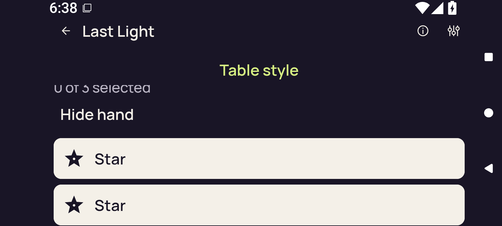</a> <code>2d-landscape-baseline-first-card.png</code> 2d-landscape-baseline-first-card — 2d-landscape.initial-landscape | 1600 × 720 px · 49,748 bytes · text 2.0 SHA-256: <code>34bbda5f0e31dee7fe322e09017b18728211e94412cd29924aa35ac5384c0d80</code> Source: <code>/root/projects/PartyDeck/artifacts/evidence-storage/34514544296/android-adaptive-api36-optimized-test-signed-font-2.0-34514544296-1/godot-adaptive/runtime/captures/2d-landscape-baseline-first-card.png</code> Original case outcome: **failed** Capture: 2026-09-10T18:38:39.962+00:00 → 2026-09-10T18:38:42.346+00:00 [UI XML](runtime/captures/2d-landscape-baseline-first-card.xml) · [Capture JSON](runtime/captures/2d-landscape-baseline-first-card.json) · [Original result](runtime/godot-adaptive-result.json) | **UNVIEWED original — no visual acceptance**. Preserved original capture; not visually reviewed. Stage and outcome labels come from the frozen collector mapping. No pixel observation or visual acceptance is claimed. |
| <a href="runtime/captures/2d-landscape-baseline-selected.png">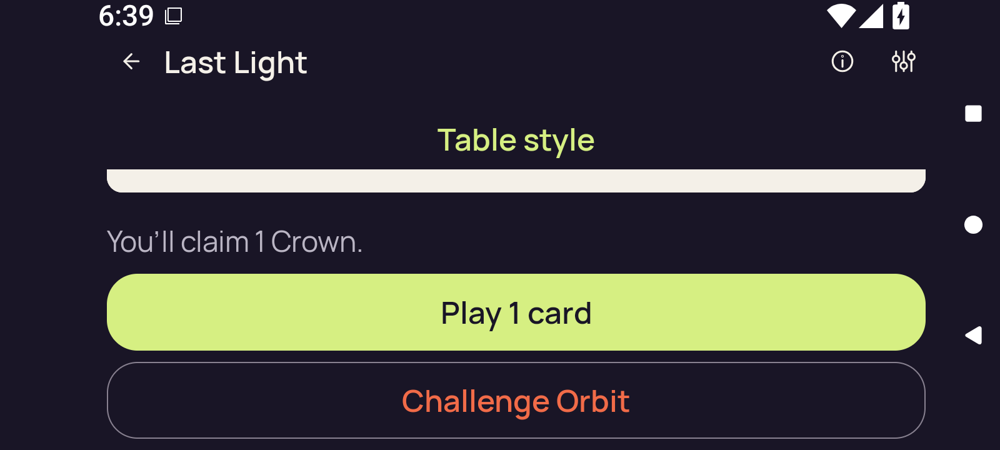</a> <code>2d-landscape-baseline-selected.png</code> 2d-landscape-baseline-selected — 2d-landscape.initial-landscape | 1600 × 720 px · 54,941 bytes · text 2.0 SHA-256: <code>c09b7f555cc24e323247d61889fa0745a2046931766a5fc88bb85e22d2a8b252</code> Source: <code>/root/projects/PartyDeck/artifacts/evidence-storage/34514544296/android-adaptive-api36-optimized-test-signed-font-2.0-34514544296-1/godot-adaptive/runtime/captures/2d-landscape-baseline-selected.png</code> Original case outcome: **failed** Capture: 2026-09-10T18:39:02.297+00:00 → 2026-09-10T18:39:04.682+00:00 [UI XML](runtime/captures/2d-landscape-baseline-selected.xml) · [Capture JSON](runtime/captures/2d-landscape-baseline-selected.json) · [Original result](runtime/godot-adaptive-result.json) | **UNVIEWED original — no visual acceptance**. Preserved original capture; not visually reviewed. Stage and outcome labels come from the frozen collector mapping. No pixel observation or visual acceptance is claimed. |
| <a href="runtime/captures/2d-landscape-initial-selector.png">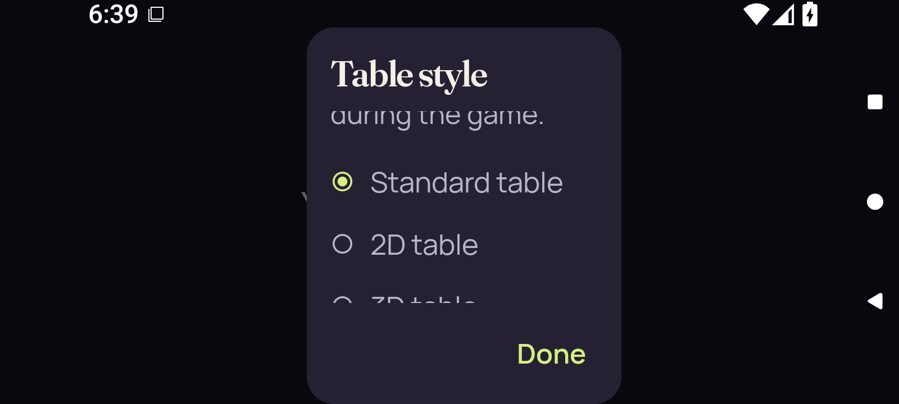</a> <code>2d-landscape-initial-selector.png</code> 2d-landscape-initial-selector — 2d-landscape.initial-landscape | 1600 × 720 px · 50,024 bytes · text 2.0 SHA-256: <code>ae13b39b69d3e43546be94d128f638fdff656a6127a883e6ad9e4fc74f415f2d</code> Source: <code>/root/projects/PartyDeck/artifacts/evidence-storage/34514544296/android-adaptive-api36-optimized-test-signed-font-2.0-34514544296-1/godot-adaptive/runtime/captures/2d-landscape-initial-selector.png</code> Original case outcome: **failed** Capture: 2026-09-10T18:39:25.161+00:00 → 2026-09-10T18:39:27.546+00:00 [UI XML](runtime/captures/2d-landscape-initial-selector.xml) · [Capture JSON](runtime/captures/2d-landscape-initial-selector.json) · [Original result](runtime/godot-adaptive-result.json) | **UNVIEWED original — no visual acceptance**. Preserved original capture; not visually reviewed. Stage and outcome labels come from the frozen collector mapping. No pixel observation or visual acceptance is claimed. |
| <a href="runtime/captures/2d-landscape-initial-native-ready.png">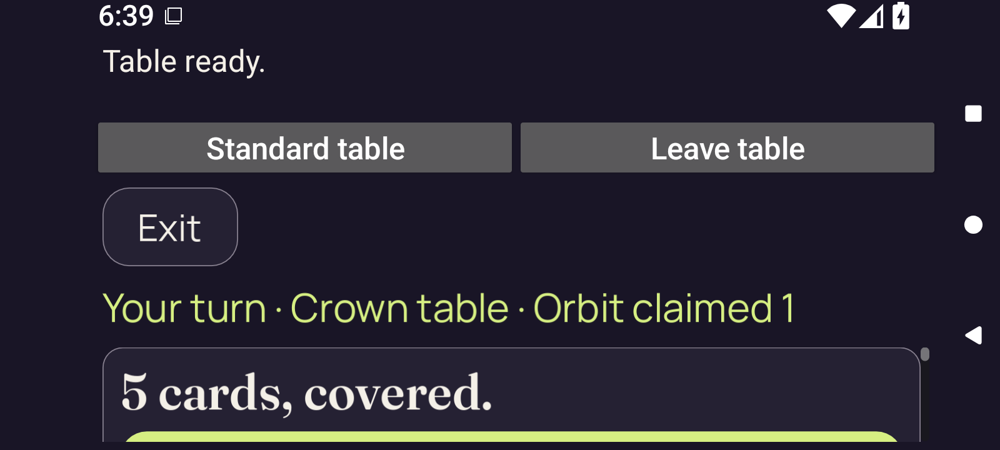</a> <code>2d-landscape-initial-native-ready.png</code> 2d-landscape-initial-native-ready — 2d-landscape.initial-landscape | 1600 × 720 px · 88,660 bytes · text 2.0 SHA-256: <code>5bdecbaf8cf3c7ffe150a01653db68b7873211dbf3591744c03828cbe0dcb145</code> Source: <code>/root/projects/PartyDeck/artifacts/evidence-storage/34514544296/android-adaptive-api36-optimized-test-signed-font-2.0-34514544296-1/godot-adaptive/runtime/captures/2d-landscape-initial-native-ready.png</code> Original case outcome: **failed** Capture: 2026-09-10T18:39:34.628+00:00 → 2026-09-10T18:39:37.029+00:00 [UI XML](runtime/captures/2d-landscape-initial-native-ready.xml) · [Capture JSON](runtime/captures/2d-landscape-initial-native-ready.json) · [Original result](runtime/godot-adaptive-result.json) | **Direct original view**. Your turn · Crown table · Orbit claimed 1 is visible with Android navigation on the right. At 200% text in landscape, Table ready, Standard table/Leave table and Exit fit; Last Light is absent. The single-line public context is readable. The five-card cover count fits, but only the upper green edge of Reveal is visible at the bottom clip. The Reveal label and lower game actions are outside the viewport. No private card face appears. The native-ready still does not establish transition completion, scrolling or continuous privacy. |
| <a href="runtime/captures/2d-landscape-unsupported-return-concealed.png">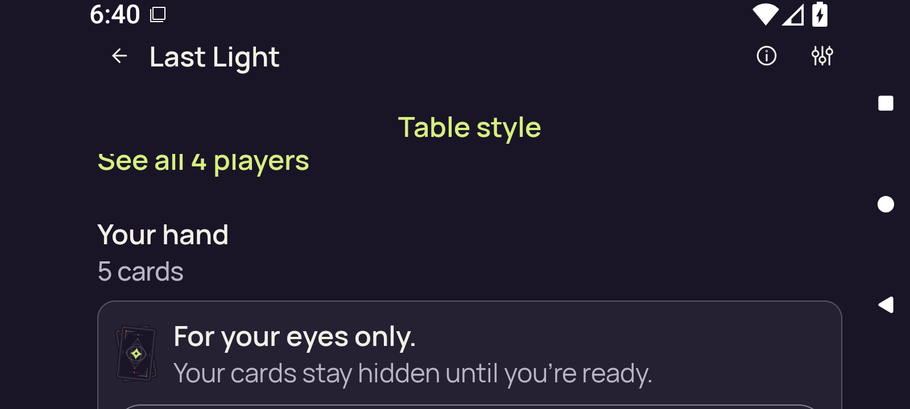</a> <code>2d-landscape-unsupported-return-concealed.png</code> 2d-landscape-unsupported-return-concealed — 2d-landscape.held-rotation | 1600 × 720 px · 71,890 bytes · text 2.0 SHA-256: <code>2c2df7ebcd89c7dea99bcdc0108ae4fdd8d4b745f7a1c746c54e96d1bbf15b8a</code> Source: <code>/root/projects/PartyDeck/artifacts/evidence-storage/34514544296/android-adaptive-api36-optimized-test-signed-font-2.0-34514544296-1/godot-adaptive/runtime/captures/2d-landscape-unsupported-return-concealed.png</code> Original case outcome: **failed** Capture: 2026-09-10T18:40:10.658+00:00 → 2026-09-10T18:40:13.051+00:00 [UI XML](runtime/captures/2d-landscape-unsupported-return-concealed.xml) · [Capture JSON](runtime/captures/2d-landscape-unsupported-return-concealed.json) · [Original result](runtime/godot-adaptive-result.json) | **UNVIEWED original — no visual acceptance**. Preserved original capture; not visually reviewed. Stage and outcome labels come from the frozen collector mapping. No pixel observation or visual acceptance is claimed. |
| <a href="runtime/captures/2d-landscape-unsupported-return-selection-cleared.png">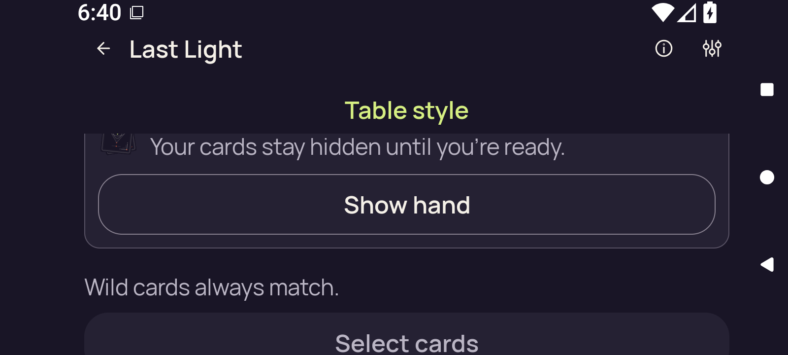</a> <code>2d-landscape-unsupported-return-selection-cleared.png</code> 2d-landscape-unsupported-return-selection-cleared — 2d-landscape.held-rotation | 1600 × 720 px · 70,275 bytes · text 2.0 SHA-256: <code>d82e0b4835a12a08f39784cf34092d5d3ae837ee796dca0a284dd06e9f9baf1f</code> Source: <code>/root/projects/PartyDeck/artifacts/evidence-storage/34514544296/android-adaptive-api36-optimized-test-signed-font-2.0-34514544296-1/godot-adaptive/runtime/captures/2d-landscape-unsupported-return-selection-cleared.png</code> Original case outcome: **failed** Capture: 2026-09-10T18:40:20.580+00:00 → 2026-09-10T18:40:22.960+00:00 [UI XML](runtime/captures/2d-landscape-unsupported-return-selection-cleared.xml) · [Capture JSON](runtime/captures/2d-landscape-unsupported-return-selection-cleared.json) · [Original result](runtime/godot-adaptive-result.json) | **UNVIEWED original — no visual acceptance**. Preserved original capture; not visually reviewed. Stage and outcome labels come from the frozen collector mapping. No pixel observation or visual acceptance is claimed. |
| <a href="runtime/captures/2d-landscape-unsupported-return-public.png">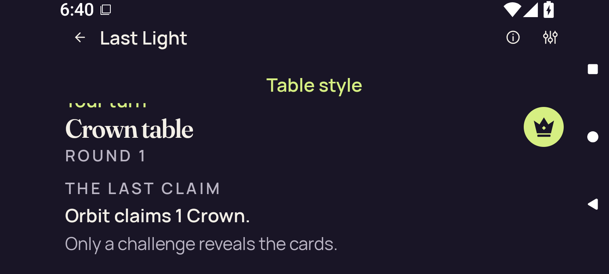</a> <code>2d-landscape-unsupported-return-public.png</code> 2d-landscape-unsupported-return-public — 2d-landscape.held-rotation | 1600 × 720 px · 75,427 bytes · text 2.0 SHA-256: <code>c44edeaaf3b5360a3e75909ea88e77d9b1754b32f1acc7b2aa7256f7181a4a6b</code> Source: <code>/root/projects/PartyDeck/artifacts/evidence-storage/34514544296/android-adaptive-api36-optimized-test-signed-font-2.0-34514544296-1/godot-adaptive/runtime/captures/2d-landscape-unsupported-return-public.png</code> Original case outcome: **failed** Capture: 2026-09-10T18:40:36.093+00:00 → 2026-09-10T18:40:38.539+00:00 [UI XML](runtime/captures/2d-landscape-unsupported-return-public.xml) · [Capture JSON](runtime/captures/2d-landscape-unsupported-return-public.json) · [Original result](runtime/godot-adaptive-result.json) | **UNVIEWED original — no visual acceptance**. Preserved original capture; not visually reviewed. Stage and outcome labels come from the frozen collector mapping. No pixel observation or visual acceptance is claimed. |
| <a href="runtime/captures/2d-landscape-unsupported-return-first-card.png">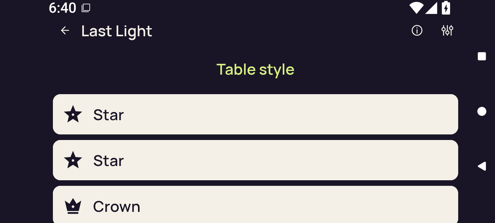</a> <code>2d-landscape-unsupported-return-first-card.png</code> 2d-landscape-unsupported-return-first-card — 2d-landscape.held-rotation | 1600 × 720 px · 46,163 bytes · text 2.0 SHA-256: <code>b06e3fc8171ca772329fb31ca97cb0466b890bede6414d8f3ca310942414ef9b</code> Source: <code>/root/projects/PartyDeck/artifacts/evidence-storage/34514544296/android-adaptive-api36-optimized-test-signed-font-2.0-34514544296-1/godot-adaptive/runtime/captures/2d-landscape-unsupported-return-first-card.png</code> Original case outcome: **failed** Capture: 2026-09-10T18:40:53.823+00:00 → 2026-09-10T18:40:56.215+00:00 [UI XML](runtime/captures/2d-landscape-unsupported-return-first-card.xml) · [Capture JSON](runtime/captures/2d-landscape-unsupported-return-first-card.json) · [Original result](runtime/godot-adaptive-result.json) | **UNVIEWED original — no visual acceptance**. Preserved original capture; not visually reviewed. Stage and outcome labels come from the frozen collector mapping. No pixel observation or visual acceptance is claimed. |
|  <code>2d-landscape-unsupported-portrait-return-concealed.png</code> 2d-landscape-unsupported-portrait-return-concealed — 2d-landscape.held-rotation | 720 × 1600 px · 113,514 bytes · text 2.0 SHA-256: <code>0500693538eb836970ba2b0ada27d192bc6f815b832699f529a8fb25746ec374</code> Source: <code>/root/projects/PartyDeck/artifacts/evidence-storage/34514544296/android-adaptive-api36-optimized-test-signed-font-2.0-34514544296-1/godot-adaptive/runtime/captures/2d-landscape-unsupported-portrait-return-concealed.png</code> Original case outcome: **failed** Capture: 2026-09-10T18:41:01.490+00:00 → 2026-09-10T18:41:03.893+00:00 [UI XML](runtime/captures/2d-landscape-unsupported-portrait-return-concealed.xml) · [Capture JSON](runtime/captures/2d-landscape-unsupported-portrait-return-concealed.json) · [Original result](runtime/godot-adaptive-result.json) | **UNVIEWED original — no visual acceptance**. Preserved original capture; not visually reviewed. Stage and outcome labels come from the frozen collector mapping. No pixel observation or visual acceptance is claimed. |
|  <code>2d-landscape-unsupported-portrait-return-selection-cleared.png</code> 2d-landscape-unsupported-portrait-return-selection-cleared — 2d-landscape.held-rotation | 720 × 1600 px · 113,514 bytes · text 2.0 SHA-256: <code>0500693538eb836970ba2b0ada27d192bc6f815b832699f529a8fb25746ec374</code> Source: <code>/root/projects/PartyDeck/artifacts/evidence-storage/34514544296/android-adaptive-api36-optimized-test-signed-font-2.0-34514544296-1/godot-adaptive/runtime/captures/2d-landscape-unsupported-portrait-return-selection-cleared.png</code> Original case outcome: **failed** Capture: 2026-09-10T18:41:05.911+00:00 → 2026-09-10T18:41:08.300+00:00 [UI XML](runtime/captures/2d-landscape-unsupported-portrait-return-selection-cleared.xml) · [Capture JSON](runtime/captures/2d-landscape-unsupported-portrait-return-selection-cleared.json) · [Original result](runtime/godot-adaptive-result.json) | **UNVIEWED original — no visual acceptance**. Preserved original capture; not visually reviewed. Stage and outcome labels come from the frozen collector mapping. No pixel observation or visual acceptance is claimed. |
| <a href="runtime/captures/2d-landscape-unsupported-portrait-return-public.png">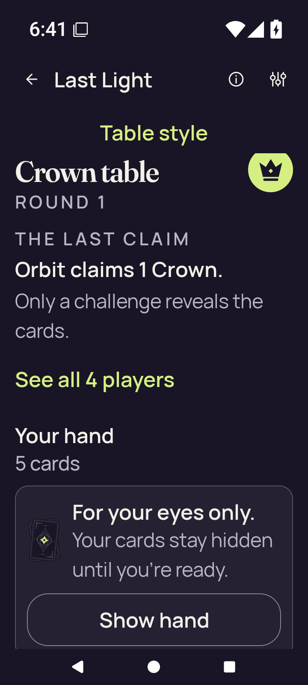</a> <code>2d-landscape-unsupported-portrait-return-public.png</code> 2d-landscape-unsupported-portrait-return-public — 2d-landscape.held-rotation | 720 × 1600 px · 127,962 bytes · text 2.0 SHA-256: <code>062510893832227b3673a3dec8943c2e4875ed3c8136d719063d5f8385643254</code> Source: <code>/root/projects/PartyDeck/artifacts/evidence-storage/34514544296/android-adaptive-api36-optimized-test-signed-font-2.0-34514544296-1/godot-adaptive/runtime/captures/2d-landscape-unsupported-portrait-return-public.png</code> Original case outcome: **failed** Capture: 2026-09-10T18:41:13.059+00:00 → 2026-09-10T18:41:15.455+00:00 [UI XML](runtime/captures/2d-landscape-unsupported-portrait-return-public.xml) · [Capture JSON](runtime/captures/2d-landscape-unsupported-portrait-return-public.json) · [Original result](runtime/godot-adaptive-result.json) | **UNVIEWED original — no visual acceptance**. Preserved original capture; not visually reviewed. Stage and outcome labels come from the frozen collector mapping. No pixel observation or visual acceptance is claimed. |
| <a href="runtime/captures/2d-landscape-unsupported-portrait-return-first-card.png">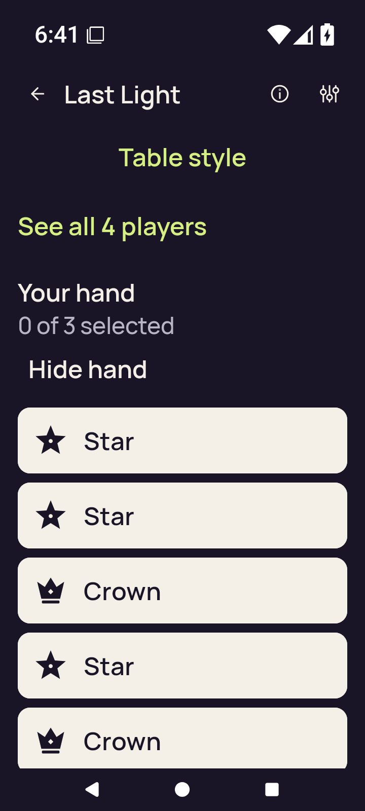</a> <code>2d-landscape-unsupported-portrait-return-first-card.png</code> 2d-landscape-unsupported-portrait-return-first-card — 2d-landscape.held-rotation | 720 × 1600 px · 80,308 bytes · text 2.0 SHA-256: <code>c844c259481e7d070491237d484095b70ab7f19850dbad5677d8dad09c3964ae</code> Source: <code>/root/projects/PartyDeck/artifacts/evidence-storage/34514544296/android-adaptive-api36-optimized-test-signed-font-2.0-34514544296-1/godot-adaptive/runtime/captures/2d-landscape-unsupported-portrait-return-first-card.png</code> Original case outcome: **failed** Capture: 2026-09-10T18:41:22.316+00:00 → 2026-09-10T18:41:24.699+00:00 [UI XML](runtime/captures/2d-landscape-unsupported-portrait-return-first-card.xml) · [Capture JSON](runtime/captures/2d-landscape-unsupported-portrait-return-first-card.json) · [Original result](runtime/godot-adaptive-result.json) | **UNVIEWED original — no visual acceptance**. Preserved original capture; not visually reviewed. Stage and outcome labels come from the frozen collector mapping. No pixel observation or visual acceptance is claimed. |
| <a href="runtime/captures/2d-landscape-reentry-selected.png">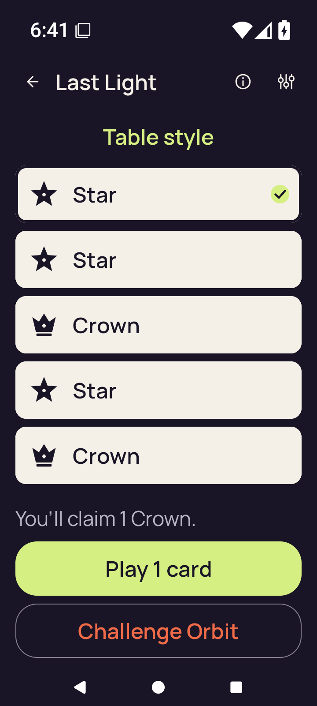</a> <code>2d-landscape-reentry-selected.png</code> 2d-landscape-reentry-selected — 2d-landscape.portrait-reentry-standard | 720 × 1600 px · 85,490 bytes · text 2.0 SHA-256: <code>82dc606949ad1ebc3e2a0639845eec5b4d69002133f29c99c50b9247ade6fe85</code> Source: <code>/root/projects/PartyDeck/artifacts/evidence-storage/34514544296/android-adaptive-api36-optimized-test-signed-font-2.0-34514544296-1/godot-adaptive/runtime/captures/2d-landscape-reentry-selected.png</code> Original case outcome: **failed** Capture: 2026-09-10T18:41:33.673+00:00 → 2026-09-10T18:41:36.066+00:00 [UI XML](runtime/captures/2d-landscape-reentry-selected.xml) · [Capture JSON](runtime/captures/2d-landscape-reentry-selected.json) · [Original result](runtime/godot-adaptive-result.json) | **UNVIEWED original — no visual acceptance**. Preserved original capture; not visually reviewed. Stage and outcome labels come from the frozen collector mapping. No pixel observation or visual acceptance is claimed. |
|  <code>2d-landscape-portrait-selector.png</code> 2d-landscape-portrait-selector — 2d-landscape.portrait-reentry-standard | 720 × 1600 px · 97,397 bytes · text 2.0 SHA-256: <code>808b473423d3e6dee19407f3c7d8a69f74cf1d62933da718013fc4c9d94a1e11</code> Source: <code>/root/projects/PartyDeck/artifacts/evidence-storage/34514544296/android-adaptive-api36-optimized-test-signed-font-2.0-34514544296-1/godot-adaptive/runtime/captures/2d-landscape-portrait-selector.png</code> Original case outcome: **failed** Capture: 2026-09-10T18:41:42.706+00:00 → 2026-09-10T18:41:45.096+00:00 [UI XML](runtime/captures/2d-landscape-portrait-selector.xml) · [Capture JSON](runtime/captures/2d-landscape-portrait-selector.json) · [Original result](runtime/godot-adaptive-result.json) | **UNVIEWED original — no visual acceptance**. Preserved original capture; not visually reviewed. Stage and outcome labels come from the frozen collector mapping. No pixel observation or visual acceptance is claimed. |
| <a href="runtime/captures/2d-landscape-portrait-native-ready.png">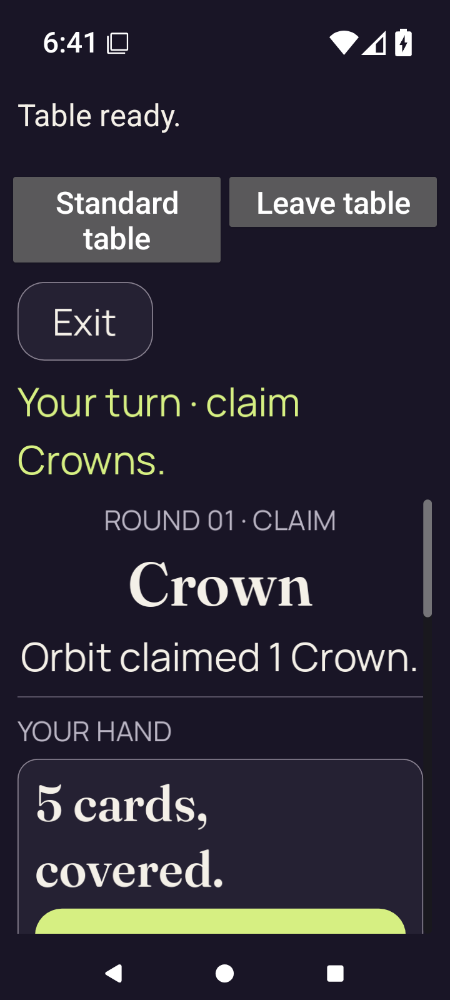</a> <code>2d-landscape-portrait-native-ready.png</code> 2d-landscape-portrait-native-ready — 2d-landscape.portrait-reentry-standard | 720 × 1600 px · 126,459 bytes · text 2.0 SHA-256: <code>430d434323209cdf813eb3b52e483ea8002166d2a43dc020f54be10e5ca535bd</code> Source: <code>/root/projects/PartyDeck/artifacts/evidence-storage/34514544296/android-adaptive-api36-optimized-test-signed-font-2.0-34514544296-1/godot-adaptive/runtime/captures/2d-landscape-portrait-native-ready.png</code> Original case outcome: **failed** Capture: 2026-09-10T18:41:51.706+00:00 → 2026-09-10T18:41:54.172+00:00 [UI XML](runtime/captures/2d-landscape-portrait-native-ready.xml) · [Capture JSON](runtime/captures/2d-landscape-portrait-native-ready.json) · [Original result](runtime/godot-adaptive-result.json) | **Direct original view**. Round 01, Crown and Orbit claimed 1 Crown. are visible. At 200% text in portrait, Table ready, the wrapped Standard table control, Leave table and Exit fit. The turn prompt wraps across two complete lines; the Last Light title is absent. Round/rank/public context and YOUR HAND are readable. The cover shows 5 cards, covered across two lines, with only the upper green edge of Reveal visible at the bottom clip; its label, seats and lower game actions are outside the captured viewport. No private card face is visible. The native-ready still does not establish scrolling, gameplay completion or continuous privacy. |
|  <code>2d-landscape-standard-return-concealed.png</code> 2d-landscape-standard-return-concealed — 2d-landscape.portrait-reentry-standard | 720 × 1600 px · 114,208 bytes · text 2.0 SHA-256: <code>ac707a8b4954f0da58442baa765b06aec24b66aec0e2c3fc566567908a31bf9c</code> Source: <code>/root/projects/PartyDeck/artifacts/evidence-storage/34514544296/android-adaptive-api36-optimized-test-signed-font-2.0-34514544296-1/godot-adaptive/runtime/captures/2d-landscape-standard-return-concealed.png</code> Original case outcome: **failed** Capture: 2026-09-10T18:42:09.826+00:00 → 2026-09-10T18:42:12.207+00:00 [UI XML](runtime/captures/2d-landscape-standard-return-concealed.xml) · [Capture JSON](runtime/captures/2d-landscape-standard-return-concealed.json) · [Original result](runtime/godot-adaptive-result.json) | **UNVIEWED original — no visual acceptance**. Preserved original capture; not visually reviewed. Stage and outcome labels come from the frozen collector mapping. No pixel observation or visual acceptance is claimed. |
| <a href="runtime/captures/2d-landscape-standard-return-selection-cleared.png">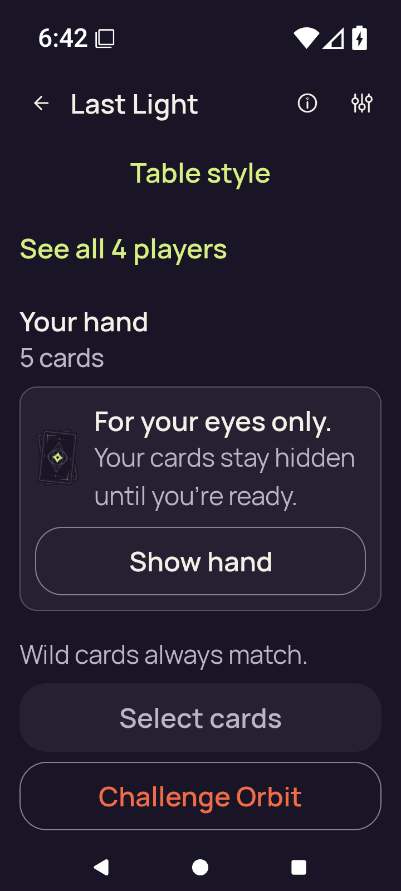</a> <code>2d-landscape-standard-return-selection-cleared.png</code> 2d-landscape-standard-return-selection-cleared — 2d-landscape.portrait-reentry-standard | 720 × 1600 px · 114,202 bytes · text 2.0 SHA-256: <code>3c024b297e4a7a6af10598bad1a3e8daf3859e88b5e0fc6f4084c83b0a7d55aa</code> Source: <code>/root/projects/PartyDeck/artifacts/evidence-storage/34514544296/android-adaptive-api36-optimized-test-signed-font-2.0-34514544296-1/godot-adaptive/runtime/captures/2d-landscape-standard-return-selection-cleared.png</code> Original case outcome: **failed** Capture: 2026-09-10T18:42:14.228+00:00 → 2026-09-10T18:42:16.615+00:00 [UI XML](runtime/captures/2d-landscape-standard-return-selection-cleared.xml) · [Capture JSON](runtime/captures/2d-landscape-standard-return-selection-cleared.json) · [Original result](runtime/godot-adaptive-result.json) | **UNVIEWED original — no visual acceptance**. Preserved original capture; not visually reviewed. Stage and outcome labels come from the frozen collector mapping. No pixel observation or visual acceptance is claimed. |
| <a href="runtime/captures/2d-landscape-standard-return-public.png">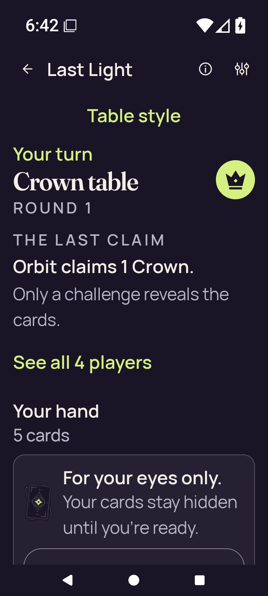</a> <code>2d-landscape-standard-return-public.png</code> 2d-landscape-standard-return-public — 2d-landscape.portrait-reentry-standard | 720 × 1600 px · 124,402 bytes · text 2.0 SHA-256: <code>a3d9d4099a3c4f6f41f89745249a09d1d78010744663d7c228347dea2910e85b</code> Source: <code>/root/projects/PartyDeck/artifacts/evidence-storage/34514544296/android-adaptive-api36-optimized-test-signed-font-2.0-34514544296-1/godot-adaptive/runtime/captures/2d-landscape-standard-return-public.png</code> Original case outcome: **failed** Capture: 2026-09-10T18:42:21.442+00:00 → 2026-09-10T18:42:23.840+00:00 [UI XML](runtime/captures/2d-landscape-standard-return-public.xml) · [Capture JSON](runtime/captures/2d-landscape-standard-return-public.json) · [Original result](runtime/godot-adaptive-result.json) | **UNVIEWED original — no visual acceptance**. Preserved original capture; not visually reviewed. Stage and outcome labels come from the frozen collector mapping. No pixel observation or visual acceptance is claimed. |
| <a href="runtime/captures/2d-landscape-standard-return-first-card.png">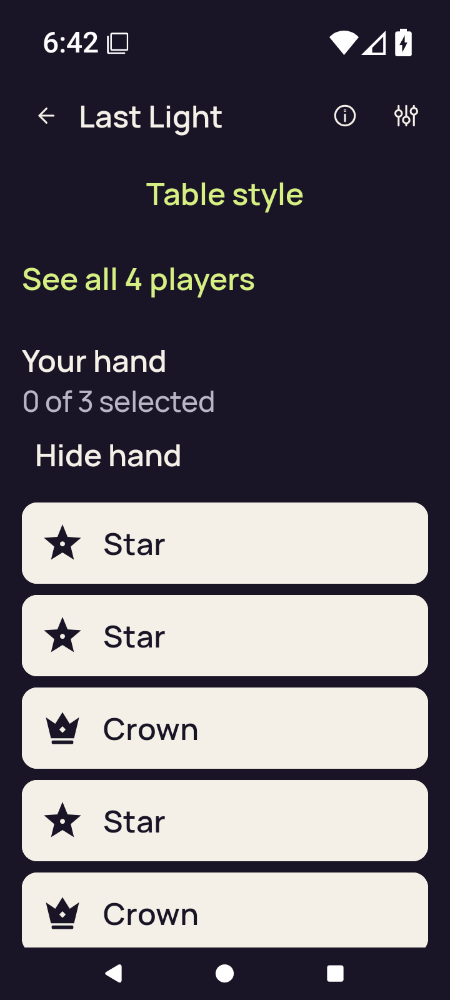</a> <code>2d-landscape-standard-return-first-card.png</code> 2d-landscape-standard-return-first-card — 2d-landscape.portrait-reentry-standard | 720 × 1600 px · 80,950 bytes · text 2.0 SHA-256: <code>34702a1dc3ca3e8c602259f04895896e8b669466c8dd161b185c3cd5a6a14c10</code> Source: <code>/root/projects/PartyDeck/artifacts/evidence-storage/34514544296/android-adaptive-api36-optimized-test-signed-font-2.0-34514544296-1/godot-adaptive/runtime/captures/2d-landscape-standard-return-first-card.png</code> Original case outcome: **failed** Capture: 2026-09-10T18:42:30.757+00:00 → 2026-09-10T18:42:33.138+00:00 [UI XML](runtime/captures/2d-landscape-standard-return-first-card.xml) · [Capture JSON](runtime/captures/2d-landscape-standard-return-first-card.json) · [Original result](runtime/godot-adaptive-result.json) | **UNVIEWED original — no visual acceptance**. Preserved original capture; not visually reviewed. Stage and outcome labels come from the frozen collector mapping. No pixel observation or visual acceptance is claimed. |
| <a href="runtime/captures/2d-landscape-leave-selected.png">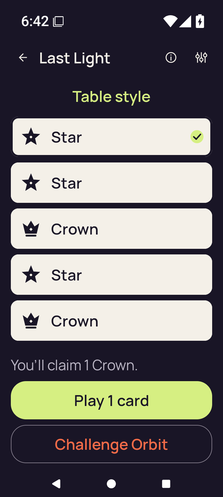</a> <code>2d-landscape-leave-selected.png</code> 2d-landscape-leave-selected — 2d-landscape.native-leave-home | 720 × 1600 px · 86,025 bytes · text 2.0 SHA-256: <code>39b0c669115d5328918766983041945a58413fdeffe3a12491add5ae77375b76</code> Source: <code>/root/projects/PartyDeck/artifacts/evidence-storage/34514544296/android-adaptive-api36-optimized-test-signed-font-2.0-34514544296-1/godot-adaptive/runtime/captures/2d-landscape-leave-selected.png</code> Original case outcome: **failed** Capture: 2026-09-10T18:42:42.098+00:00 → 2026-09-10T18:42:44.480+00:00 [UI XML](runtime/captures/2d-landscape-leave-selected.xml) · [Capture JSON](runtime/captures/2d-landscape-leave-selected.json) · [Original result](runtime/godot-adaptive-result.json) | **UNVIEWED original — no visual acceptance**. Preserved original capture; not visually reviewed. Stage and outcome labels come from the frozen collector mapping. No pixel observation or visual acceptance is claimed. |
|  <code>2d-landscape-leave-selector.png</code> 2d-landscape-leave-selector — 2d-landscape.native-leave-home | 720 × 1600 px · 97,930 bytes · text 2.0 SHA-256: <code>513555d45da6ff2d42f4063d581aa82715fa137080376f1dda7725c782c0325d</code> Source: <code>/root/projects/PartyDeck/artifacts/evidence-storage/34514544296/android-adaptive-api36-optimized-test-signed-font-2.0-34514544296-1/godot-adaptive/runtime/captures/2d-landscape-leave-selector.png</code> Original case outcome: **failed** Capture: 2026-09-10T18:42:51.272+00:00 → 2026-09-10T18:42:53.680+00:00 [UI XML](runtime/captures/2d-landscape-leave-selector.xml) · [Capture JSON](runtime/captures/2d-landscape-leave-selector.json) · [Original result](runtime/godot-adaptive-result.json) | **UNVIEWED original — no visual acceptance**. Preserved original capture; not visually reviewed. Stage and outcome labels come from the frozen collector mapping. No pixel observation or visual acceptance is claimed. |
|  <code>2d-landscape-leave-native-ready.png</code> 2d-landscape-leave-native-ready — 2d-landscape.native-leave-home | 720 × 1600 px · 127,125 bytes · text 2.0 SHA-256: <code>f13447ac4cc39f9c0cc3ecb0c34c76af11b320a0c9461749005e1e731dad14f0</code> Source: <code>/root/projects/PartyDeck/artifacts/evidence-storage/34514544296/android-adaptive-api36-optimized-test-signed-font-2.0-34514544296-1/godot-adaptive/runtime/captures/2d-landscape-leave-native-ready.png</code> Original case outcome: **failed** Capture: 2026-09-10T18:43:00.363+00:00 → 2026-09-10T18:43:02.755+00:00 [UI XML](runtime/captures/2d-landscape-leave-native-ready.xml) · [Capture JSON](runtime/captures/2d-landscape-leave-native-ready.json) · [Original result](runtime/godot-adaptive-result.json) | **Direct original view**. Round 01, Crown and Orbit claimed 1 Crown. are visible. At 200% text in portrait, Table ready, wrapped Standard table, Leave table and Exit fit. The turn prompt wraps across two complete lines; Last Light is absent. Round/rank/public context and YOUR HAND fit. The cover count wraps across two lines and only the upper green edge of Reveal is visible at the bottom clip. Its label, seats and lower game actions are outside the viewport. No private card face appears. This leave-native-ready capture preserves a separate source identity and does not establish the following leave transition or continuous privacy. |
|  <code>2d-landscape-leave-confirmation.png</code> 2d-landscape-leave-confirmation — 2d-landscape.native-leave-home | 720 × 1600 px · 62,518 bytes · text 2.0 SHA-256: <code>83dc2c5f9057034b63ca4cbd76b15f5a431e51fb84335b9f025f8173c4195904</code> Source: <code>/root/projects/PartyDeck/artifacts/evidence-storage/34514544296/android-adaptive-api36-optimized-test-signed-font-2.0-34514544296-1/godot-adaptive/runtime/captures/2d-landscape-leave-confirmation.png</code> Original case outcome: **failed** Capture: 2026-09-10T18:43:10.006+00:00 → 2026-09-10T18:43:12.393+00:00 [UI XML](runtime/captures/2d-landscape-leave-confirmation.xml) · [Capture JSON](runtime/captures/2d-landscape-leave-confirmation.json) · [Original result](runtime/godot-adaptive-result.json) | **UNVIEWED original — no visual acceptance**. Preserved original capture; not visually reviewed. Stage and outcome labels come from the frozen collector mapping. No pixel observation or visual acceptance is claimed. |
|  <code>2d-landscape-home.png</code> 2d-landscape-home — 2d-landscape.native-leave-home | 720 × 1600 px · 80,926 bytes · text 2.0 SHA-256: <code>9d2feb072fc7cee0b751d6b4f039c900bf51331de60402cd574effcb7a66862f</code> Source: <code>/root/projects/PartyDeck/artifacts/evidence-storage/34514544296/android-adaptive-api36-optimized-test-signed-font-2.0-34514544296-1/godot-adaptive/runtime/captures/2d-landscape-home.png</code> Original case outcome: **failed** Capture: 2026-09-10T18:43:16.726+00:00 → 2026-09-10T18:43:19.114+00:00 [UI XML](runtime/captures/2d-landscape-home.xml) · [Capture JSON](runtime/captures/2d-landscape-home.json) · [Original result](runtime/godot-adaptive-result.json) | **UNVIEWED original — no visual acceptance**. Preserved original capture; not visually reviewed. Stage and outcome labels come from the frozen collector mapping. No pixel observation or visual acceptance is claimed. |
| <a href="runtime/captures/2d-seascape-baseline-public.png">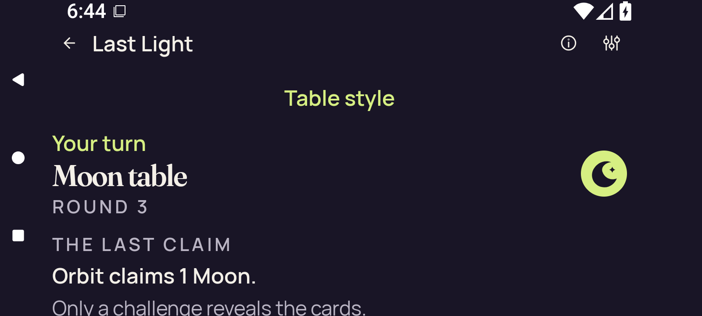</a> <code>2d-seascape-baseline-public.png</code> 2d-seascape-baseline-public — 2d-seascape.initial-landscape | 1600 × 720 px · 75,429 bytes · text 2.0 SHA-256: <code>df92b6a092df5cd9cf54d5d30baf92b267fb768df0f031533079e3dbafccb18d</code> Source: <code>/root/projects/PartyDeck/artifacts/evidence-storage/34514544296/android-adaptive-api36-optimized-test-signed-font-2.0-34514544296-1/godot-adaptive/runtime/captures/2d-seascape-baseline-public.png</code> Original case outcome: **failed** Capture: 2026-09-10T18:44:47.406+00:00 → 2026-09-10T18:44:49.782+00:00 [UI XML](runtime/captures/2d-seascape-baseline-public.xml) · [Capture JSON](runtime/captures/2d-seascape-baseline-public.json) · [Original result](runtime/godot-adaptive-result.json) | **UNVIEWED original — no visual acceptance**. Preserved original capture; not visually reviewed. Stage and outcome labels come from the frozen collector mapping. No pixel observation or visual acceptance is claimed. |
| <a href="runtime/captures/2d-seascape-baseline-first-card.png">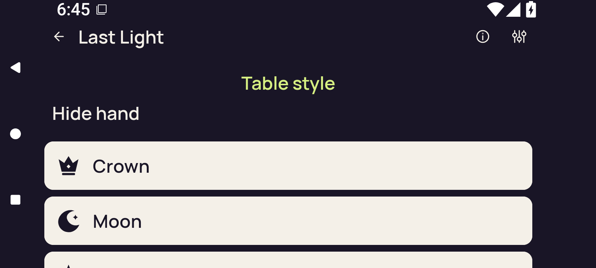</a> <code>2d-seascape-baseline-first-card.png</code> 2d-seascape-baseline-first-card — 2d-seascape.initial-landscape | 1600 × 720 px · 46,329 bytes · text 2.0 SHA-256: <code>3a384c486f7593b3668326b52ec4bb670bbb8b1d31e733e9cba0b158397cecad</code> Source: <code>/root/projects/PartyDeck/artifacts/evidence-storage/34514544296/android-adaptive-api36-optimized-test-signed-font-2.0-34514544296-1/godot-adaptive/runtime/captures/2d-seascape-baseline-first-card.png</code> Original case outcome: **failed** Capture: 2026-09-10T18:45:07.724+00:00 → 2026-09-10T18:45:10.122+00:00 [UI XML](runtime/captures/2d-seascape-baseline-first-card.xml) · [Capture JSON](runtime/captures/2d-seascape-baseline-first-card.json) · [Original result](runtime/godot-adaptive-result.json) | **UNVIEWED original — no visual acceptance**. Preserved original capture; not visually reviewed. Stage and outcome labels come from the frozen collector mapping. No pixel observation or visual acceptance is claimed. |
| <a href="runtime/captures/2d-seascape-baseline-selected.png">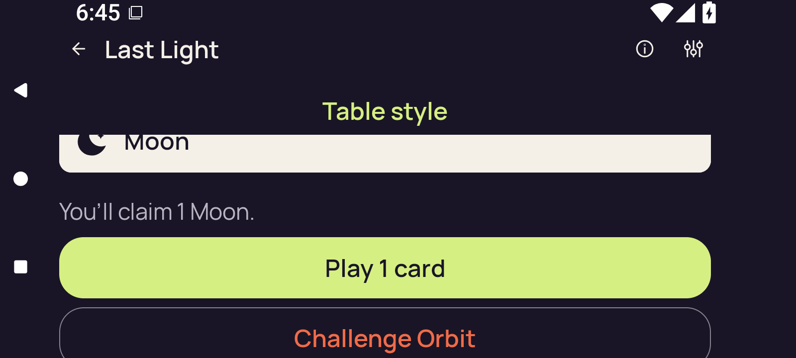</a> <code>2d-seascape-baseline-selected.png</code> 2d-seascape-baseline-selected — 2d-seascape.initial-landscape | 1600 × 720 px · 55,176 bytes · text 2.0 SHA-256: <code>263f80c33f378f20dd5e32ad7aed93ed4c56c4ccb2711db1eca90249c9f6e5a4</code> Source: <code>/root/projects/PartyDeck/artifacts/evidence-storage/34514544296/android-adaptive-api36-optimized-test-signed-font-2.0-34514544296-1/godot-adaptive/runtime/captures/2d-seascape-baseline-selected.png</code> Original case outcome: **failed** Capture: 2026-09-10T18:45:27.392+00:00 → 2026-09-10T18:45:29.777+00:00 [UI XML](runtime/captures/2d-seascape-baseline-selected.xml) · [Capture JSON](runtime/captures/2d-seascape-baseline-selected.json) · [Original result](runtime/godot-adaptive-result.json) | **UNVIEWED original — no visual acceptance**. Preserved original capture; not visually reviewed. Stage and outcome labels come from the frozen collector mapping. No pixel observation or visual acceptance is claimed. |
| <a href="runtime/captures/2d-seascape-initial-selector.png">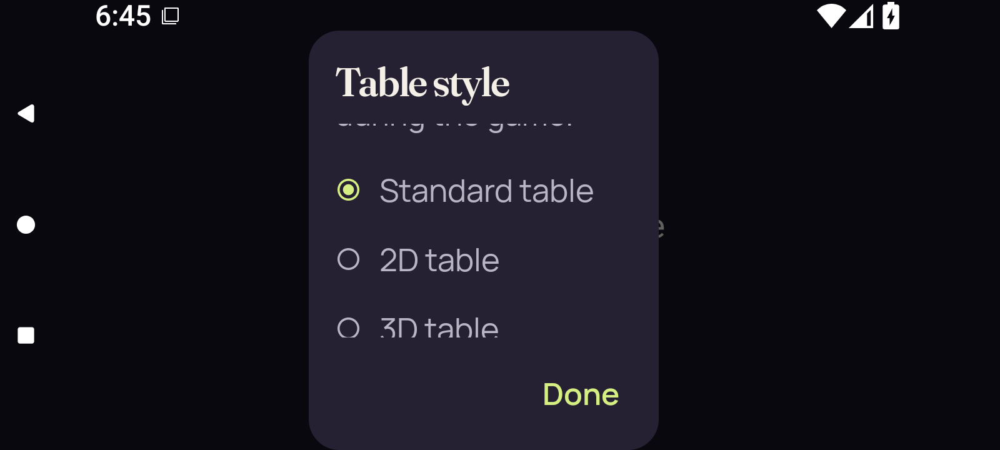</a> <code>2d-seascape-initial-selector.png</code> 2d-seascape-initial-selector — 2d-seascape.initial-landscape | 1600 × 720 px · 49,451 bytes · text 2.0 SHA-256: <code>03f3c39e5801d91f5a39ead8255d166a79a1665b211519fe0c2b197acaece326</code> Source: <code>/root/projects/PartyDeck/artifacts/evidence-storage/34514544296/android-adaptive-api36-optimized-test-signed-font-2.0-34514544296-1/godot-adaptive/runtime/captures/2d-seascape-initial-selector.png</code> Original case outcome: **failed** Capture: 2026-09-10T18:45:50.227+00:00 → 2026-09-10T18:45:52.618+00:00 [UI XML](runtime/captures/2d-seascape-initial-selector.xml) · [Capture JSON](runtime/captures/2d-seascape-initial-selector.json) · [Original result](runtime/godot-adaptive-result.json) | **UNVIEWED original — no visual acceptance**. Preserved original capture; not visually reviewed. Stage and outcome labels come from the frozen collector mapping. No pixel observation or visual acceptance is claimed. |
| <a href="runtime/captures/2d-seascape-initial-native-ready.png">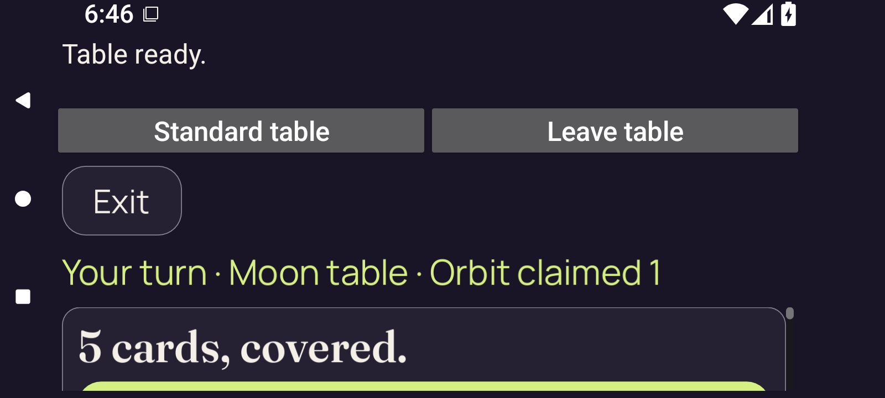</a> <code>2d-seascape-initial-native-ready.png</code> 2d-seascape-initial-native-ready — 2d-seascape.initial-landscape | 1600 × 720 px · 85,026 bytes · text 2.0 SHA-256: <code>5cbb0701b1f34967bc7a6e374f3bb36f0988c4fb60f0805086051072b043b70e</code> Source: <code>/root/projects/PartyDeck/artifacts/evidence-storage/34514544296/android-adaptive-api36-optimized-test-signed-font-2.0-34514544296-1/godot-adaptive/runtime/captures/2d-seascape-initial-native-ready.png</code> Original case outcome: **failed** Capture: 2026-09-10T18:45:59.069+00:00 → 2026-09-10T18:46:01.460+00:00 [UI XML](runtime/captures/2d-seascape-initial-native-ready.xml) · [Capture JSON](runtime/captures/2d-seascape-initial-native-ready.json) · [Original result](runtime/godot-adaptive-result.json) | **Direct original view**. Your turn · Moon table · Orbit claimed 1 is visible with Android navigation on the left in this separate seascape capture. At 200% text in landscape, Table ready, Standard table/Leave table and Exit fit; Last Light is absent. The single-line public context is readable. The five-card cover count fits, but only the upper green edge of Reveal is visible at the bottom clip. The Reveal label and lower game actions are outside the viewport. No private card face appears. The native-ready still does not establish transition completion, scrolling or continuous privacy. |
| <a href="runtime/captures/2d-seascape-unsupported-return-concealed.png">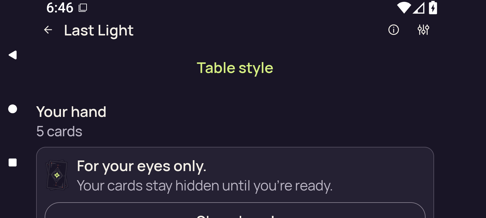</a> <code>2d-seascape-unsupported-return-concealed.png</code> 2d-seascape-unsupported-return-concealed — 2d-seascape.held-rotation | 1600 × 720 px · 66,171 bytes · text 2.0 SHA-256: <code>120190db8fd113807fba539d33d7a45a4ff0102a180c43e00ffe0c883444bd11</code> Source: <code>/root/projects/PartyDeck/artifacts/evidence-storage/34514544296/android-adaptive-api36-optimized-test-signed-font-2.0-34514544296-1/godot-adaptive/runtime/captures/2d-seascape-unsupported-return-concealed.png</code> Original case outcome: **failed** Capture: 2026-09-10T18:46:37.975+00:00 → 2026-09-10T18:46:40.381+00:00 [UI XML](runtime/captures/2d-seascape-unsupported-return-concealed.xml) · [Capture JSON](runtime/captures/2d-seascape-unsupported-return-concealed.json) · [Original result](runtime/godot-adaptive-result.json) | **UNVIEWED original — no visual acceptance**. Preserved original capture; not visually reviewed. Stage and outcome labels come from the frozen collector mapping. No pixel observation or visual acceptance is claimed. |
| <a href="runtime/captures/2d-seascape-unsupported-return-selection-cleared.png">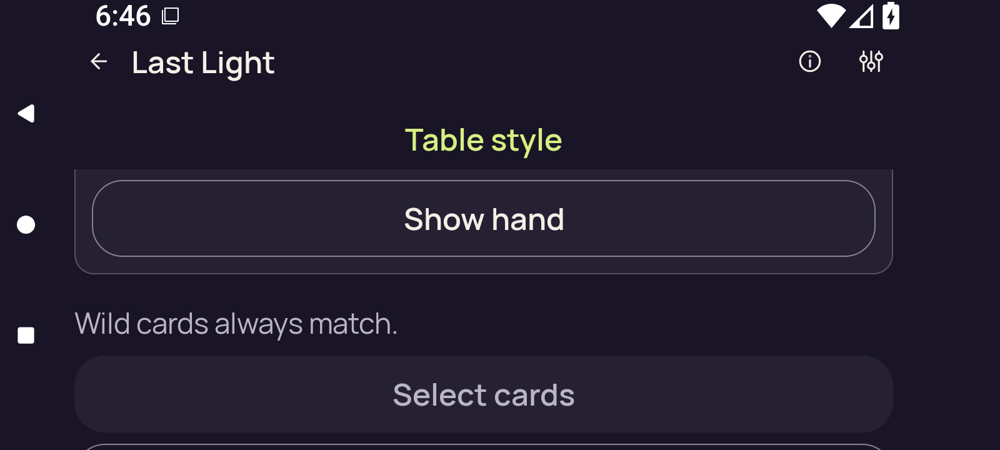</a> <code>2d-seascape-unsupported-return-selection-cleared.png</code> 2d-seascape-unsupported-return-selection-cleared — 2d-seascape.held-rotation | 1600 × 720 px · 56,930 bytes · text 2.0 SHA-256: <code>c19762684eea17e65b9166105a01cfdc3193486092f61a00f7e91ff756572269</code> Source: <code>/root/projects/PartyDeck/artifacts/evidence-storage/34514544296/android-adaptive-api36-optimized-test-signed-font-2.0-34514544296-1/godot-adaptive/runtime/captures/2d-seascape-unsupported-return-selection-cleared.png</code> Original case outcome: **failed** Capture: 2026-09-10T18:46:47.954+00:00 → 2026-09-10T18:46:50.328+00:00 [UI XML](runtime/captures/2d-seascape-unsupported-return-selection-cleared.xml) · [Capture JSON](runtime/captures/2d-seascape-unsupported-return-selection-cleared.json) · [Original result](runtime/godot-adaptive-result.json) | **UNVIEWED original — no visual acceptance**. Preserved original capture; not visually reviewed. Stage and outcome labels come from the frozen collector mapping. No pixel observation or visual acceptance is claimed. |
| <a href="runtime/captures/2d-seascape-unsupported-return-public.png">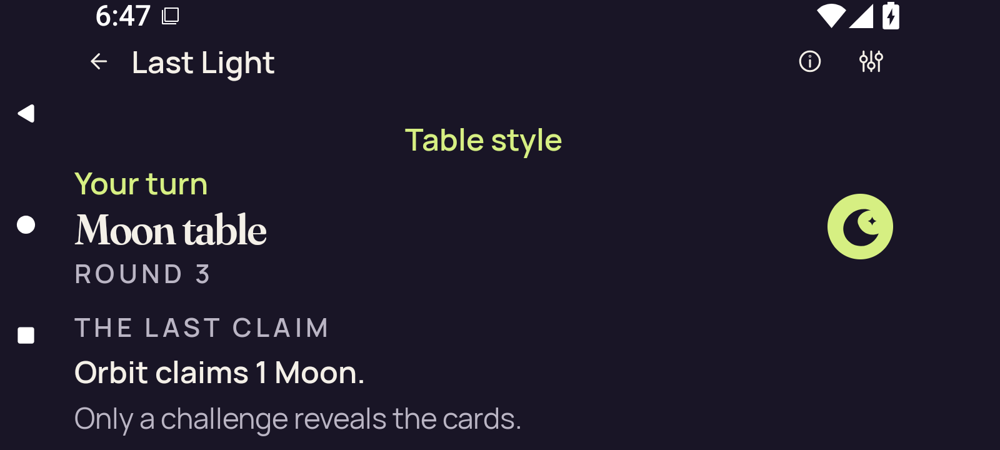</a> <code>2d-seascape-unsupported-return-public.png</code> 2d-seascape-unsupported-return-public — 2d-seascape.held-rotation | 1600 × 720 px · 76,664 bytes · text 2.0 SHA-256: <code>b44b690dd362b75db994ee27cb609f043fed7a267408400f07f964c1ae61ce79</code> Source: <code>/root/projects/PartyDeck/artifacts/evidence-storage/34514544296/android-adaptive-api36-optimized-test-signed-font-2.0-34514544296-1/godot-adaptive/runtime/captures/2d-seascape-unsupported-return-public.png</code> Original case outcome: **failed** Capture: 2026-09-10T18:47:06.125+00:00 → 2026-09-10T18:47:08.527+00:00 [UI XML](runtime/captures/2d-seascape-unsupported-return-public.xml) · [Capture JSON](runtime/captures/2d-seascape-unsupported-return-public.json) · [Original result](runtime/godot-adaptive-result.json) | **UNVIEWED original — no visual acceptance**. Preserved original capture; not visually reviewed. Stage and outcome labels come from the frozen collector mapping. No pixel observation or visual acceptance is claimed. |
| <a href="runtime/captures/2d-seascape-unsupported-return-first-card.png">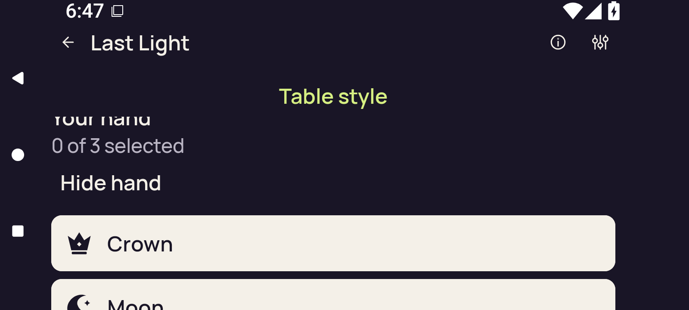</a> <code>2d-seascape-unsupported-return-first-card.png</code> 2d-seascape-unsupported-return-first-card — 2d-seascape.held-rotation | 1600 × 720 px · 50,709 bytes · text 2.0 SHA-256: <code>d9e51cf7926319881d01d9b973fd1018554e0f763abdfc91966707ee4f9a2fd3</code> Source: <code>/root/projects/PartyDeck/artifacts/evidence-storage/34514544296/android-adaptive-api36-optimized-test-signed-font-2.0-34514544296-1/godot-adaptive/runtime/captures/2d-seascape-unsupported-return-first-card.png</code> Original case outcome: **failed** Capture: 2026-09-10T18:47:23.698+00:00 → 2026-09-10T18:47:26.075+00:00 [UI XML](runtime/captures/2d-seascape-unsupported-return-first-card.xml) · [Capture JSON](runtime/captures/2d-seascape-unsupported-return-first-card.json) · [Original result](runtime/godot-adaptive-result.json) | **UNVIEWED original — no visual acceptance**. Preserved original capture; not visually reviewed. Stage and outcome labels come from the frozen collector mapping. No pixel observation or visual acceptance is claimed. |
| <a href="runtime/captures/2d-seascape-unsupported-portrait-return-concealed.png">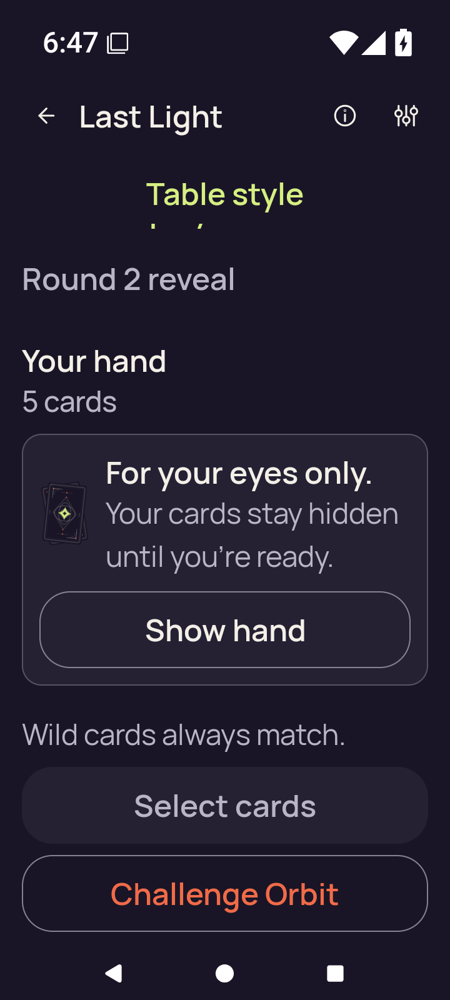</a> <code>2d-seascape-unsupported-portrait-return-concealed.png</code> 2d-seascape-unsupported-portrait-return-concealed — 2d-seascape.held-rotation | 720 × 1600 px · 113,826 bytes · text 2.0 SHA-256: <code>ebb97e18c392e388849fcb4de94175939087b34d1ccd76026764919c9c1518fa</code> Source: <code>/root/projects/PartyDeck/artifacts/evidence-storage/34514544296/android-adaptive-api36-optimized-test-signed-font-2.0-34514544296-1/godot-adaptive/runtime/captures/2d-seascape-unsupported-portrait-return-concealed.png</code> Original case outcome: **failed** Capture: 2026-09-10T18:47:31.325+00:00 → 2026-09-10T18:47:33.715+00:00 [UI XML](runtime/captures/2d-seascape-unsupported-portrait-return-concealed.xml) · [Capture JSON](runtime/captures/2d-seascape-unsupported-portrait-return-concealed.json) · [Original result](runtime/godot-adaptive-result.json) | **UNVIEWED original — no visual acceptance**. Preserved original capture; not visually reviewed. Stage and outcome labels come from the frozen collector mapping. No pixel observation or visual acceptance is claimed. |
|  <code>2d-seascape-unsupported-portrait-return-selection-cleared.png</code> 2d-seascape-unsupported-portrait-return-selection-cleared — 2d-seascape.held-rotation | 720 × 1600 px · 113,826 bytes · text 2.0 SHA-256: <code>ebb97e18c392e388849fcb4de94175939087b34d1ccd76026764919c9c1518fa</code> Source: <code>/root/projects/PartyDeck/artifacts/evidence-storage/34514544296/android-adaptive-api36-optimized-test-signed-font-2.0-34514544296-1/godot-adaptive/runtime/captures/2d-seascape-unsupported-portrait-return-selection-cleared.png</code> Original case outcome: **failed** Capture: 2026-09-10T18:47:35.737+00:00 → 2026-09-10T18:47:38.119+00:00 [UI XML](runtime/captures/2d-seascape-unsupported-portrait-return-selection-cleared.xml) · [Capture JSON](runtime/captures/2d-seascape-unsupported-portrait-return-selection-cleared.json) · [Original result](runtime/godot-adaptive-result.json) | **UNVIEWED original — no visual acceptance**. Preserved original capture; not visually reviewed. Stage and outcome labels come from the frozen collector mapping. No pixel observation or visual acceptance is claimed. |
| <a href="runtime/captures/2d-seascape-unsupported-portrait-return-public.png">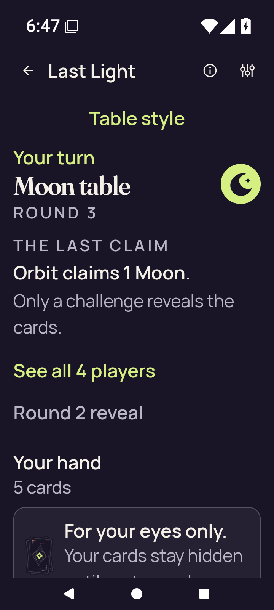</a> <code>2d-seascape-unsupported-portrait-return-public.png</code> 2d-seascape-unsupported-portrait-return-public — 2d-seascape.held-rotation | 720 × 1600 px · 121,757 bytes · text 2.0 SHA-256: <code>35c71647df05dbd533bfeabc4d1fa16223f83d1aa1817eaf866879332d837d87</code> Source: <code>/root/projects/PartyDeck/artifacts/evidence-storage/34514544296/android-adaptive-api36-optimized-test-signed-font-2.0-34514544296-1/godot-adaptive/runtime/captures/2d-seascape-unsupported-portrait-return-public.png</code> Original case outcome: **failed** Capture: 2026-09-10T18:47:45.656+00:00 → 2026-09-10T18:47:48.057+00:00 [UI XML](runtime/captures/2d-seascape-unsupported-portrait-return-public.xml) · [Capture JSON](runtime/captures/2d-seascape-unsupported-portrait-return-public.json) · [Original result](runtime/godot-adaptive-result.json) | **UNVIEWED original — no visual acceptance**. Preserved original capture; not visually reviewed. Stage and outcome labels come from the frozen collector mapping. No pixel observation or visual acceptance is claimed. |
| <a href="runtime/captures/2d-seascape-unsupported-portrait-return-first-card.png">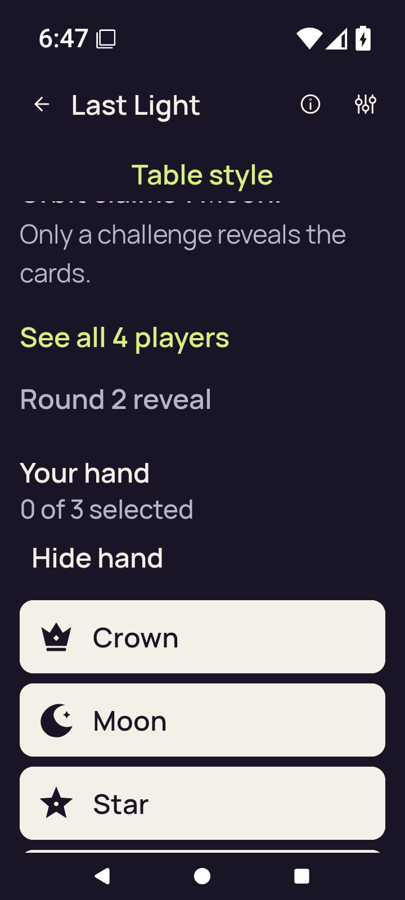</a> <code>2d-seascape-unsupported-portrait-return-first-card.png</code> 2d-seascape-unsupported-portrait-return-first-card — 2d-seascape.held-rotation | 720 × 1600 px · 89,552 bytes · text 2.0 SHA-256: <code>f732b0719d86287233699274b78ece69b524f6e7c5722e32f39b43b3e7e3335c</code> Source: <code>/root/projects/PartyDeck/artifacts/evidence-storage/34514544296/android-adaptive-api36-optimized-test-signed-font-2.0-34514544296-1/godot-adaptive/runtime/captures/2d-seascape-unsupported-portrait-return-first-card.png</code> Original case outcome: **failed** Capture: 2026-09-10T18:47:54.920+00:00 → 2026-09-10T18:47:57.320+00:00 [UI XML](runtime/captures/2d-seascape-unsupported-portrait-return-first-card.xml) · [Capture JSON](runtime/captures/2d-seascape-unsupported-portrait-return-first-card.json) · [Original result](runtime/godot-adaptive-result.json) | **UNVIEWED original — no visual acceptance**. Preserved original capture; not visually reviewed. Stage and outcome labels come from the frozen collector mapping. No pixel observation or visual acceptance is claimed. |
| <a href="runtime/captures/2d-seascape-reentry-selected.png">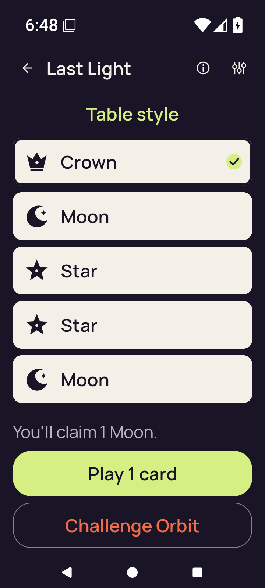</a> <code>2d-seascape-reentry-selected.png</code> 2d-seascape-reentry-selected — 2d-seascape.portrait-reentry-standard | 720 × 1600 px · 83,397 bytes · text 2.0 SHA-256: <code>e81df401c7412f352dec3900179714b01762e9e0865376e060f12606cafd9d1c</code> Source: <code>/root/projects/PartyDeck/artifacts/evidence-storage/34514544296/android-adaptive-api36-optimized-test-signed-font-2.0-34514544296-1/godot-adaptive/runtime/captures/2d-seascape-reentry-selected.png</code> Original case outcome: **failed** Capture: 2026-09-10T18:48:09.061+00:00 → 2026-09-10T18:48:11.455+00:00 [UI XML](runtime/captures/2d-seascape-reentry-selected.xml) · [Capture JSON](runtime/captures/2d-seascape-reentry-selected.json) · [Original result](runtime/godot-adaptive-result.json) | **UNVIEWED original — no visual acceptance**. Preserved original capture; not visually reviewed. Stage and outcome labels come from the frozen collector mapping. No pixel observation or visual acceptance is claimed. |
| <a href="runtime/captures/2d-seascape-portrait-selector.png">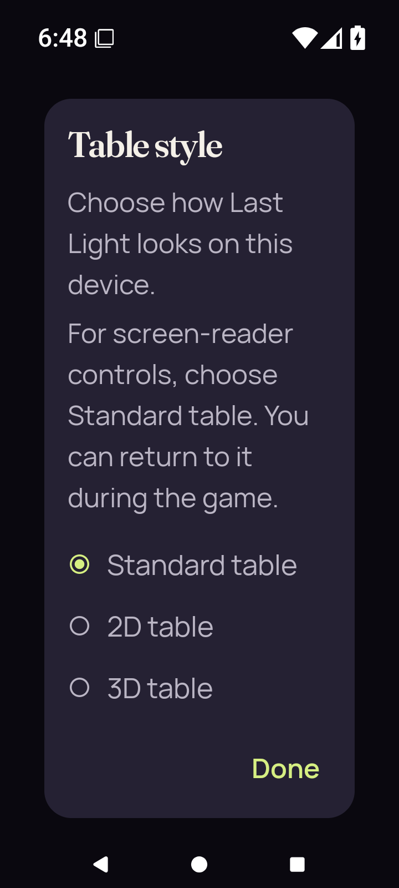</a> <code>2d-seascape-portrait-selector.png</code> 2d-seascape-portrait-selector — 2d-seascape.portrait-reentry-standard | 720 × 1600 px · 98,374 bytes · text 2.0 SHA-256: <code>740a2bcba2ee284a7059a29937870d255acb5767c592c89f94c5f4a7f6b34e1a</code> Source: <code>/root/projects/PartyDeck/artifacts/evidence-storage/34514544296/android-adaptive-api36-optimized-test-signed-font-2.0-34514544296-1/godot-adaptive/runtime/captures/2d-seascape-portrait-selector.png</code> Original case outcome: **failed** Capture: 2026-09-10T18:48:18.057+00:00 → 2026-09-10T18:48:20.460+00:00 [UI XML](runtime/captures/2d-seascape-portrait-selector.xml) · [Capture JSON](runtime/captures/2d-seascape-portrait-selector.json) · [Original result](runtime/godot-adaptive-result.json) | **UNVIEWED original — no visual acceptance**. Preserved original capture; not visually reviewed. Stage and outcome labels come from the frozen collector mapping. No pixel observation or visual acceptance is claimed. |
| <a href="runtime/captures/2d-seascape-portrait-native-ready.png">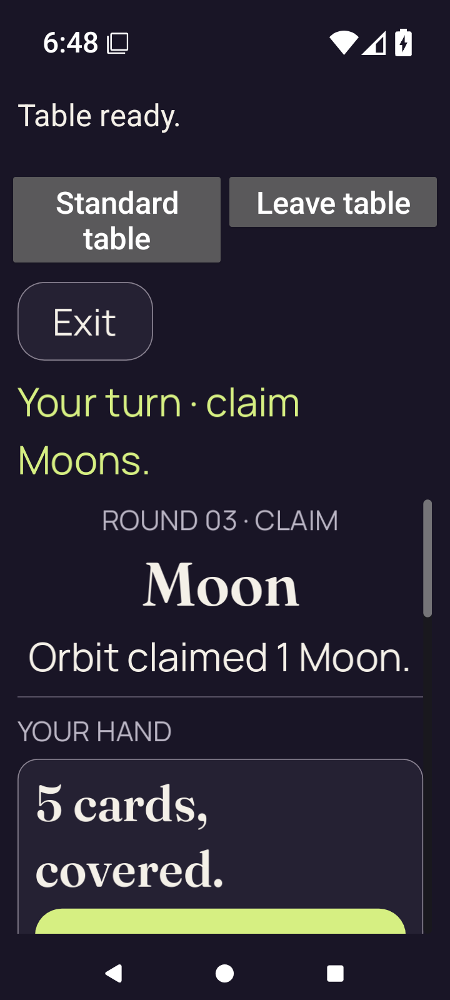</a> <code>2d-seascape-portrait-native-ready.png</code> 2d-seascape-portrait-native-ready — 2d-seascape.portrait-reentry-standard | 720 × 1600 px · 125,439 bytes · text 2.0 SHA-256: <code>64bd93cd8b15160600577d2f2b3ed1d92d4d83fc263750a7c622a5f99ca5010c</code> Source: <code>/root/projects/PartyDeck/artifacts/evidence-storage/34514544296/android-adaptive-api36-optimized-test-signed-font-2.0-34514544296-1/godot-adaptive/runtime/captures/2d-seascape-portrait-native-ready.png</code> Original case outcome: **failed** Capture: 2026-09-10T18:48:27.285+00:00 → 2026-09-10T18:48:29.671+00:00 [UI XML](runtime/captures/2d-seascape-portrait-native-ready.xml) · [Capture JSON](runtime/captures/2d-seascape-portrait-native-ready.json) · [Original result](runtime/godot-adaptive-result.json) | **Direct original view**. Round 03, Moon and Orbit claimed 1 Moon. are visible. At 200% text in portrait, Table ready, the wrapped Standard table control, Leave table and Exit fit. The turn prompt wraps across two complete lines; the Last Light title is absent. Round/rank/public context and YOUR HAND are readable. The cover shows 5 cards, covered across two lines, with only the upper green edge of Reveal visible at the bottom clip; its label, seats and lower game actions are outside the captured viewport. No private card face is visible. The native-ready still does not establish scrolling, gameplay completion or continuous privacy. |
|  <code>2d-seascape-standard-return-concealed.png</code> 2d-seascape-standard-return-concealed — 2d-seascape.portrait-reentry-standard | 720 × 1600 px · 113,149 bytes · text 2.0 SHA-256: <code>6e786379c92a60e49eef55d6a3508a94249ab1935e3673484e81e6256c371563</code> Source: <code>/root/projects/PartyDeck/artifacts/evidence-storage/34514544296/android-adaptive-api36-optimized-test-signed-font-2.0-34514544296-1/godot-adaptive/runtime/captures/2d-seascape-standard-return-concealed.png</code> Original case outcome: **failed** Capture: 2026-09-10T18:48:45.322+00:00 → 2026-09-10T18:48:47.711+00:00 [UI XML](runtime/captures/2d-seascape-standard-return-concealed.xml) · [Capture JSON](runtime/captures/2d-seascape-standard-return-concealed.json) · [Original result](runtime/godot-adaptive-result.json) | **UNVIEWED original — no visual acceptance**. Preserved original capture; not visually reviewed. Stage and outcome labels come from the frozen collector mapping. No pixel observation or visual acceptance is claimed. |
| <a href="runtime/captures/2d-seascape-standard-return-selection-cleared.png">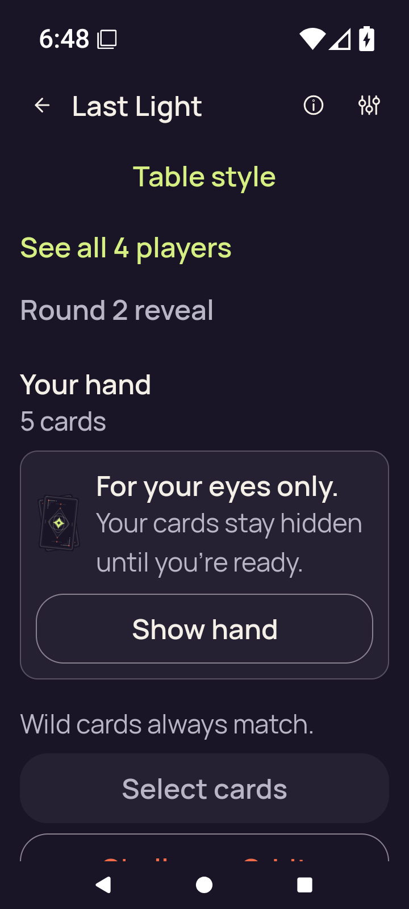</a> <code>2d-seascape-standard-return-selection-cleared.png</code> 2d-seascape-standard-return-selection-cleared — 2d-seascape.portrait-reentry-standard | 720 × 1600 px · 113,149 bytes · text 2.0 SHA-256: <code>6e786379c92a60e49eef55d6a3508a94249ab1935e3673484e81e6256c371563</code> Source: <code>/root/projects/PartyDeck/artifacts/evidence-storage/34514544296/android-adaptive-api36-optimized-test-signed-font-2.0-34514544296-1/godot-adaptive/runtime/captures/2d-seascape-standard-return-selection-cleared.png</code> Original case outcome: **failed** Capture: 2026-09-10T18:48:49.738+00:00 → 2026-09-10T18:48:52.122+00:00 [UI XML](runtime/captures/2d-seascape-standard-return-selection-cleared.xml) · [Capture JSON](runtime/captures/2d-seascape-standard-return-selection-cleared.json) · [Original result](runtime/godot-adaptive-result.json) | **UNVIEWED original — no visual acceptance**. Preserved original capture; not visually reviewed. Stage and outcome labels come from the frozen collector mapping. No pixel observation or visual acceptance is claimed. |
| <a href="runtime/captures/2d-seascape-standard-return-public.png">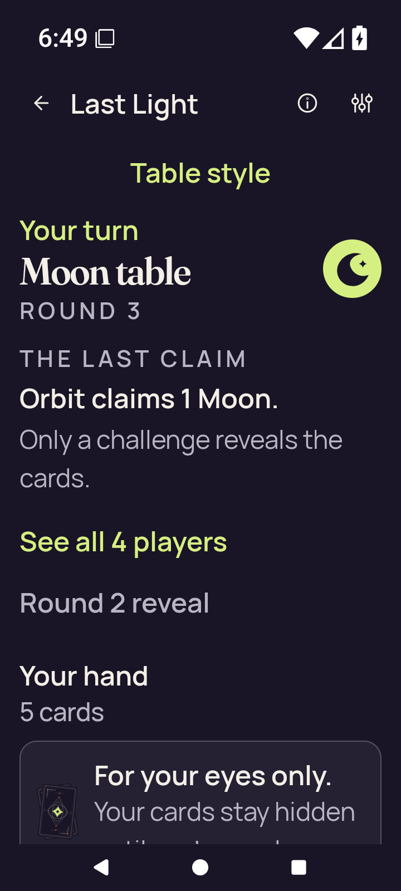</a> <code>2d-seascape-standard-return-public.png</code> 2d-seascape-standard-return-public — 2d-seascape.portrait-reentry-standard | 720 × 1600 px · 122,304 bytes · text 2.0 SHA-256: <code>f08d0f135fc6126cc6755829d78dd1d4363d764e5dbfd4dfacfd73ada9b9ce7e</code> Source: <code>/root/projects/PartyDeck/artifacts/evidence-storage/34514544296/android-adaptive-api36-optimized-test-signed-font-2.0-34514544296-1/godot-adaptive/runtime/captures/2d-seascape-standard-return-public.png</code> Original case outcome: **failed** Capture: 2026-09-10T18:48:59.658+00:00 → 2026-09-10T18:49:02.050+00:00 [UI XML](runtime/captures/2d-seascape-standard-return-public.xml) · [Capture JSON](runtime/captures/2d-seascape-standard-return-public.json) · [Original result](runtime/godot-adaptive-result.json) | **UNVIEWED original — no visual acceptance**. Preserved original capture; not visually reviewed. Stage and outcome labels come from the frozen collector mapping. No pixel observation or visual acceptance is claimed. |
| <a href="runtime/captures/2d-seascape-standard-return-first-card.png">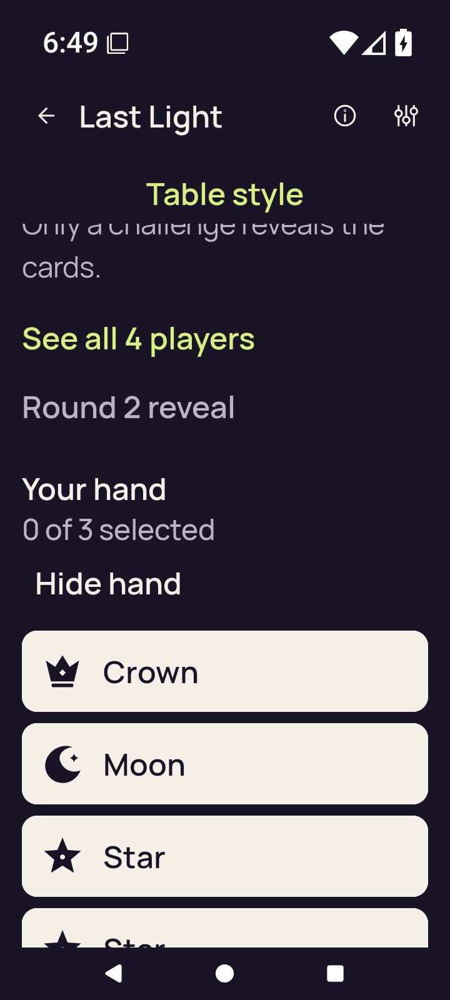</a> <code>2d-seascape-standard-return-first-card.png</code> 2d-seascape-standard-return-first-card — 2d-seascape.portrait-reentry-standard | 720 × 1600 px · 87,652 bytes · text 2.0 SHA-256: <code>7b91b23583da3c5ad14286cd125d90b203806d3db4b15789f6e49a823dd067f4</code> Source: <code>/root/projects/PartyDeck/artifacts/evidence-storage/34514544296/android-adaptive-api36-optimized-test-signed-font-2.0-34514544296-1/godot-adaptive/runtime/captures/2d-seascape-standard-return-first-card.png</code> Original case outcome: **failed** Capture: 2026-09-10T18:49:08.914+00:00 → 2026-09-10T18:49:11.299+00:00 [UI XML](runtime/captures/2d-seascape-standard-return-first-card.xml) · [Capture JSON](runtime/captures/2d-seascape-standard-return-first-card.json) · [Original result](runtime/godot-adaptive-result.json) | **UNVIEWED original — no visual acceptance**. Preserved original capture; not visually reviewed. Stage and outcome labels come from the frozen collector mapping. No pixel observation or visual acceptance is claimed. |
| <a href="runtime/captures/2d-seascape-leave-selected.png">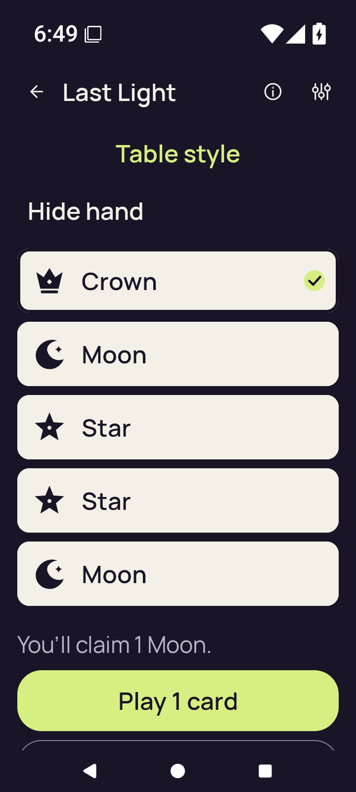</a> <code>2d-seascape-leave-selected.png</code> 2d-seascape-leave-selected — 2d-seascape.native-leave-home | 720 × 1600 px · 77,287 bytes · text 2.0 SHA-256: <code>37f2c9433eb3a521e3541493b9651ed5dcc3ef69b67ed098459ea1c51e9b444d</code> Source: <code>/root/projects/PartyDeck/artifacts/evidence-storage/34514544296/android-adaptive-api36-optimized-test-signed-font-2.0-34514544296-1/godot-adaptive/runtime/captures/2d-seascape-leave-selected.png</code> Original case outcome: **failed** Capture: 2026-09-10T18:49:20.325+00:00 → 2026-09-10T18:49:22.721+00:00 [UI XML](runtime/captures/2d-seascape-leave-selected.xml) · [Capture JSON](runtime/captures/2d-seascape-leave-selected.json) · [Original result](runtime/godot-adaptive-result.json) | **UNVIEWED original — no visual acceptance**. Preserved original capture; not visually reviewed. Stage and outcome labels come from the frozen collector mapping. No pixel observation or visual acceptance is claimed. |
|  <code>2d-seascape-leave-selector.png</code> 2d-seascape-leave-selector — 2d-seascape.native-leave-home | 720 × 1600 px · 98,100 bytes · text 2.0 SHA-256: <code>6da2f24d53bdaeabc844dca8cf66b95ba6f40f48bf280a6abcf8bbf3354af8ce</code> Source: <code>/root/projects/PartyDeck/artifacts/evidence-storage/34514544296/android-adaptive-api36-optimized-test-signed-font-2.0-34514544296-1/godot-adaptive/runtime/captures/2d-seascape-leave-selector.png</code> Original case outcome: **failed** Capture: 2026-09-10T18:49:29.245+00:00 → 2026-09-10T18:49:31.643+00:00 [UI XML](runtime/captures/2d-seascape-leave-selector.xml) · [Capture JSON](runtime/captures/2d-seascape-leave-selector.json) · [Original result](runtime/godot-adaptive-result.json) | **UNVIEWED original — no visual acceptance**. Preserved original capture; not visually reviewed. Stage and outcome labels come from the frozen collector mapping. No pixel observation or visual acceptance is claimed. |
| <a href="runtime/captures/2d-seascape-leave-native-ready.png">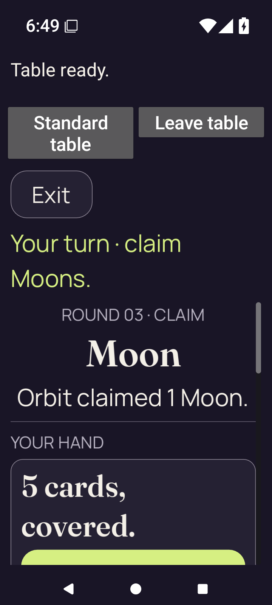</a> <code>2d-seascape-leave-native-ready.png</code> 2d-seascape-leave-native-ready — 2d-seascape.native-leave-home | 720 × 1600 px · 125,196 bytes · text 2.0 SHA-256: <code>0e04cf0d76c7ebf3610663e8b836cfa2e3e9431840181a469e7bc2643c02eddb</code> Source: <code>/root/projects/PartyDeck/artifacts/evidence-storage/34514544296/android-adaptive-api36-optimized-test-signed-font-2.0-34514544296-1/godot-adaptive/runtime/captures/2d-seascape-leave-native-ready.png</code> Original case outcome: **failed** Capture: 2026-09-10T18:49:38.430+00:00 → 2026-09-10T18:49:40.821+00:00 [UI XML](runtime/captures/2d-seascape-leave-native-ready.xml) · [Capture JSON](runtime/captures/2d-seascape-leave-native-ready.json) · [Original result](runtime/godot-adaptive-result.json) | **Direct original view**. Round 03, Moon and Orbit claimed 1 Moon. are visible. At 200% text in portrait, Table ready, wrapped Standard table, Leave table and Exit fit. The turn prompt wraps across two complete lines; Last Light is absent. Round/rank/public context and YOUR HAND fit. The cover count wraps across two lines and only the upper green edge of Reveal is visible at the bottom clip. Its label, seats and lower game actions are outside the viewport. No private card face appears. This leave-native-ready capture preserves a separate source identity and does not establish the following leave transition or continuous privacy. |
| <a href="runtime/captures/2d-seascape-leave-confirmation.png">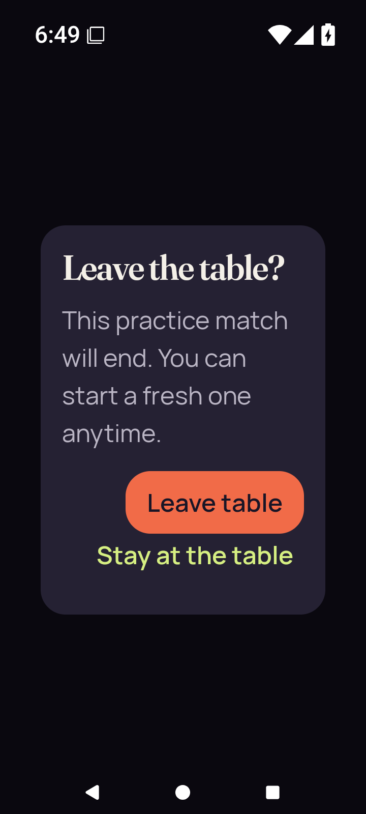</a> <code>2d-seascape-leave-confirmation.png</code> 2d-seascape-leave-confirmation — 2d-seascape.native-leave-home | 720 × 1600 px · 62,443 bytes · text 2.0 SHA-256: <code>3d459cffccc30be18223dcfe18af88b622483a2243e24b4896d6d2c003a90590</code> Source: <code>/root/projects/PartyDeck/artifacts/evidence-storage/34514544296/android-adaptive-api36-optimized-test-signed-font-2.0-34514544296-1/godot-adaptive/runtime/captures/2d-seascape-leave-confirmation.png</code> Original case outcome: **failed** Capture: 2026-09-10T18:49:48.178+00:00 → 2026-09-10T18:49:50.571+00:00 [UI XML](runtime/captures/2d-seascape-leave-confirmation.xml) · [Capture JSON](runtime/captures/2d-seascape-leave-confirmation.json) · [Original result](runtime/godot-adaptive-result.json) | **UNVIEWED original — no visual acceptance**. Preserved original capture; not visually reviewed. Stage and outcome labels come from the frozen collector mapping. No pixel observation or visual acceptance is claimed. |
|  <code>2d-seascape-home.png</code> 2d-seascape-home — 2d-seascape.native-leave-home | 720 × 1600 px · 80,839 bytes · text 2.0 SHA-256: <code>bdee2a090f840bb12e8962baf78cdc0c86b58582c1995b27cb380a3471c1765d</code> Source: <code>/root/projects/PartyDeck/artifacts/evidence-storage/34514544296/android-adaptive-api36-optimized-test-signed-font-2.0-34514544296-1/godot-adaptive/runtime/captures/2d-seascape-home.png</code> Original case outcome: **failed** Capture: 2026-09-10T18:49:54.950+00:00 → 2026-09-10T18:49:57.336+00:00 [UI XML](runtime/captures/2d-seascape-home.xml) · [Capture JSON](runtime/captures/2d-seascape-home.json) · [Original result](runtime/godot-adaptive-result.json) | **UNVIEWED original — no visual acceptance**. Preserved original capture; not visually reviewed. Stage and outcome labels come from the frozen collector mapping. No pixel observation or visual acceptance is claimed. |
| <a href="runtime/captures/2d-split-baseline-public.png">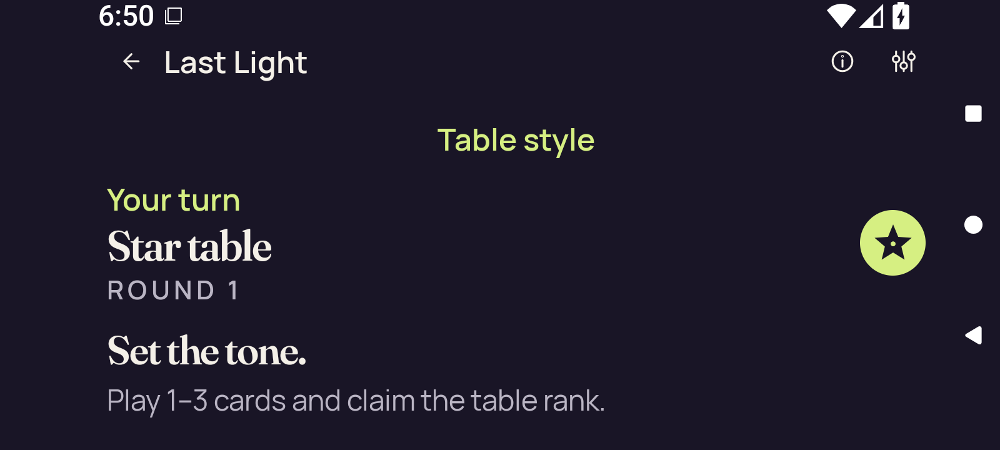</a> <code>2d-split-baseline-public.png</code> 2d-split-baseline-public — 2d-split.entry-after-ready | 1600 × 720 px · 68,324 bytes · text 2.0 SHA-256: <code>34c4676d1d7b8425782ab9bcb8b3230eb6c243bcf13006203a610b351a2c23c1</code> Source: <code>/root/projects/PartyDeck/artifacts/evidence-storage/34514544296/android-adaptive-api36-optimized-test-signed-font-2.0-34514544296-1/godot-adaptive/runtime/captures/2d-split-baseline-public.png</code> Original case outcome: **failed** Capture: 2026-09-10T18:50:35.161+00:00 → 2026-09-10T18:50:37.566+00:00 [UI XML](runtime/captures/2d-split-baseline-public.xml) · [Capture JSON](runtime/captures/2d-split-baseline-public.json) · [Original result](runtime/godot-adaptive-result.json) | **UNVIEWED original — no visual acceptance**. Preserved original capture; not visually reviewed. Stage and outcome labels come from the frozen collector mapping. No pixel observation or visual acceptance is claimed. |
| <a href="runtime/captures/2d-split-baseline-first-card.png">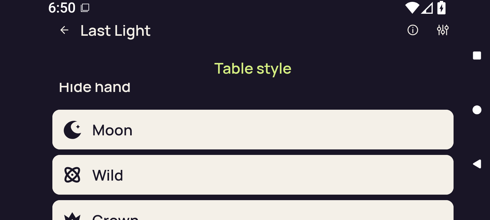</a> <code>2d-split-baseline-first-card.png</code> 2d-split-baseline-first-card — 2d-split.entry-after-ready | 1600 × 720 px · 47,495 bytes · text 2.0 SHA-256: <code>9f951c8d41d6f138d4383b26844aaa124e7cb94a1f0a61b9fb0455eab645016e</code> Source: <code>/root/projects/PartyDeck/artifacts/evidence-storage/34514544296/android-adaptive-api36-optimized-test-signed-font-2.0-34514544296-1/godot-adaptive/runtime/captures/2d-split-baseline-first-card.png</code> Original case outcome: **failed** Capture: 2026-09-10T18:50:52.792+00:00 → 2026-09-10T18:50:55.187+00:00 [UI XML](runtime/captures/2d-split-baseline-first-card.xml) · [Capture JSON](runtime/captures/2d-split-baseline-first-card.json) · [Original result](runtime/godot-adaptive-result.json) | **UNVIEWED original — no visual acceptance**. Preserved original capture; not visually reviewed. Stage and outcome labels come from the frozen collector mapping. No pixel observation or visual acceptance is claimed. |
| <a href="runtime/captures/2d-split-baseline-selected.png">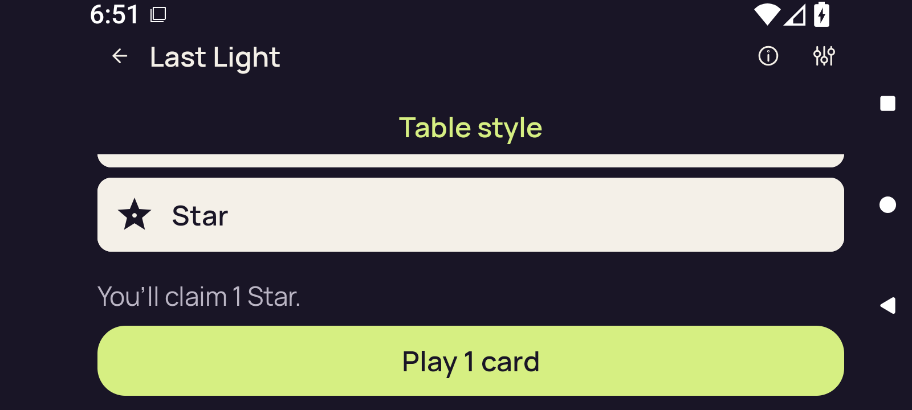</a> <code>2d-split-baseline-selected.png</code> 2d-split-baseline-selected — 2d-split.entry-after-ready | 1600 × 720 px · 47,945 bytes · text 2.0 SHA-256: <code>9abd126a135c31da181f2d920ba230b0134655ee8d9bdf7ff0139afa548a94d4</code> Source: <code>/root/projects/PartyDeck/artifacts/evidence-storage/34514544296/android-adaptive-api36-optimized-test-signed-font-2.0-34514544296-1/godot-adaptive/runtime/captures/2d-split-baseline-selected.png</code> Original case outcome: **failed** Capture: 2026-09-10T18:51:12.405+00:00 → 2026-09-10T18:51:14.808+00:00 [UI XML](runtime/captures/2d-split-baseline-selected.xml) · [Capture JSON](runtime/captures/2d-split-baseline-selected.json) · [Original result](runtime/godot-adaptive-result.json) | **UNVIEWED original — no visual acceptance**. Preserved original capture; not visually reviewed. Stage and outcome labels come from the frozen collector mapping. No pixel observation or visual acceptance is claimed. |
| <a href="runtime/captures/2d-split-full-selector.png">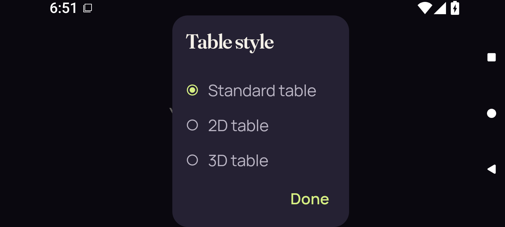</a> <code>2d-split-full-selector.png</code> 2d-split-full-selector — 2d-split.entry-after-ready | 1600 × 720 px · 48,758 bytes · text 2.0 SHA-256: <code>fdbbf3c6a677ebb24cf4e5ad6447ec73dcde57e0af1fac4ad6df22940a83b9d6</code> Source: <code>/root/projects/PartyDeck/artifacts/evidence-storage/34514544296/android-adaptive-api36-optimized-test-signed-font-2.0-34514544296-1/godot-adaptive/runtime/captures/2d-split-full-selector.png</code> Original case outcome: **failed** Capture: 2026-09-10T18:51:35.238+00:00 → 2026-09-10T18:51:37.657+00:00 [UI XML](runtime/captures/2d-split-full-selector.xml) · [Capture JSON](runtime/captures/2d-split-full-selector.json) · [Original result](runtime/godot-adaptive-result.json) | **UNVIEWED original — no visual acceptance**. Preserved original capture; not visually reviewed. Stage and outcome labels come from the frozen collector mapping. No pixel observation or visual acceptance is claimed. |
| <a href="runtime/captures/2d-split-full-native-ready.png">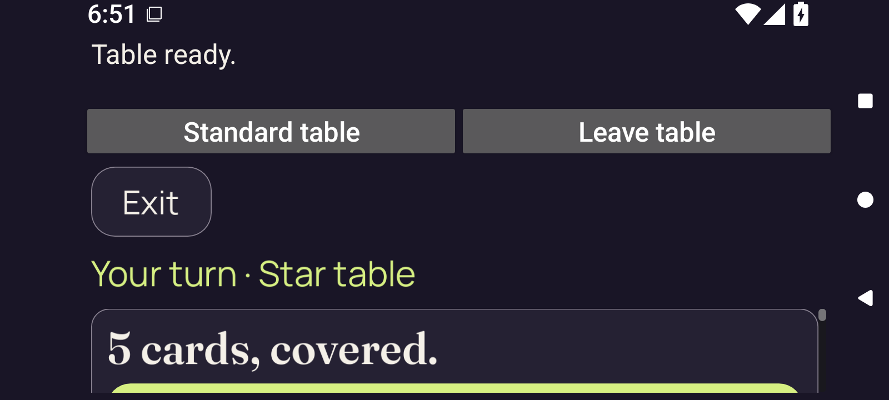</a> <code>2d-split-full-native-ready.png</code> 2d-split-full-native-ready — 2d-split.entry-after-ready | 1600 × 720 px · 75,911 bytes · text 2.0 SHA-256: <code>b2b578cad9ec3e19e804a312bed9f367c2114d9af812c335d2dadb8efdb6d144</code> Source: <code>/root/projects/PartyDeck/artifacts/evidence-storage/34514544296/android-adaptive-api36-optimized-test-signed-font-2.0-34514544296-1/godot-adaptive/runtime/captures/2d-split-full-native-ready.png</code> Original case outcome: **failed** Capture: 2026-09-10T18:51:44.099+00:00 → 2026-09-10T18:51:46.499+00:00 [UI XML](runtime/captures/2d-split-full-native-ready.xml) · [Capture JSON](runtime/captures/2d-split-full-native-ready.json) · [Original result](runtime/godot-adaptive-result.json) | **Direct original view**. At 200% text, this fullscreen landscape capture shows Table ready, Standard table/Leave table, Exit, Your turn · Star table and 5 cards, covered. Last Light is absent. Only the top green edge of Reveal is visible; its label and lower game actions are outside the viewport. The source name marks fullscreen readiness before the attempted split scope; no split-entry request occurred in this run. No private card face is visible, and this still cannot establish the unobserved split transition, gameplay or continuous privacy. |
|  <code>final-diagnostic.png</code> final-diagnostic — 3d-landscape.initial-landscape | 1600 × 720 px · 76,639 bytes · text 2.0 SHA-256: <code>a4cf5a6fe022ace2f1151a9bd140f83d273d5ab2d14e6c1c2277f4ca60bd6e2b</code> Source: <code>/root/projects/PartyDeck/artifacts/evidence-storage/34514544296/android-adaptive-api36-optimized-test-signed-font-2.0-34514544296-1/godot-adaptive/runtime/captures/final-diagnostic.png</code> Original case outcome: **failed** Capture: 2026-09-10T18:52:32.829+00:00 → 2026-09-10T18:52:35.223+00:00 [UI XML](runtime/captures/final-diagnostic.xml) · [Capture JSON](runtime/captures/final-diagnostic.json) · [Original result](runtime/godot-adaptive-result.json) | **Direct original view**. At 200%, the final diagnostic shows Table ready, full Standard table/Leave table controls, Exit, Your turn · Star table and 5 cards, covered. The cover continues below the image, with only the upper green edge of the action visible and its label/lower game actions outside the captured viewport. No private card face appears. This is the failed preparation diagnostic, not a newly observed 3D launch. |
