# Adaptive Android debug, font 1.0 — CI 34540229407

Original consumer checks passed. Independent nonvisual review verified 100 scopes, 16 held proofs, 13 rejected diagnostics, 32 recorder receipts and 77 raw-state replays across all four groups. Those checks are not pixel evidence. Adaptive decoded frames and their pixel review will be published separately.

Exact source: `4ee4563def1c9a1b5060572efa2c3959c7d7677e`. Platform: Android API 36 emulator.

**137 images**: 1 reviewed byte match; this identity was not reopened; 136 preserved image; unviewed.

[Gallery index](../../../README.md) · [Batch scope and review counts](../../../provenance/20260911-4586/review-summary.json) · [Exact source paths, hashes and timestamps](../../../provenance/20260911-4586/source-map.json).

Independent network_transport admission verifies standalone PCK and four APK member identities. Embedded PCK, SDK/JNI and build verification remain pending; expected/reported 541ded4c is not promoted to a completed embedded-package audit.

These original PNGs have no new direct pixel views in this batch. Two cold-Home identities match a previously reviewed original; all other images retain their explicit unviewed status. The independent predicate review and original recordings do not substitute for frame review. Concurrent decoded-frame reviews will be published separately.

### home-cold

`home-cold.png` · 720 × 1600 · 129,669 bytes.

SHA-256: `e96d4777eadaa3ea3e8ec2e29024f70b095714b5965d580ae272d86456c15a94`.

**[Reviewed byte match; this identity was not reopened](../../../godot-android-adaptive-34485033488/provenance/publication-review/partydeck-gallery-next2-adaptive-visual-review.json).** The cold Home original shows the complete hero and Host, Join, Practice and How to play actions.

Reviewed representative: [home-cold.png](../../../godot-android-adaptive-34485033488/android-adaptive-api36-debug-font-1.0-34485033488-1/godot-adaptive/runtime/captures/home-cold.png).

### final-screen

`final-screen.png` · 720 × 1600 · 752,397 bytes.

SHA-256: `7caa5260ada185574c598f5240d46f617a0ec62d1b376f3165b1538c1d3ccb0c`.

**Preserved image; unviewed.** Original adaptive screenshot preserved without a direct pixel view or an independently established reviewed-byte representative in this bounded still publication. Runtime predicates do not supply a pixel verdict.

### 2d-landscape-after-up

`2d-landscape-after-up.png` · 720 × 1600 · 126,171 bytes.

SHA-256: `3e6683df8ca86c1ef1334e1305dd42be258b49401c2d2ddd7b31249b6eeb2811`.

**Preserved image; unviewed.** Original adaptive screenshot preserved without a direct pixel view or an independently established reviewed-byte representative in this bounded still publication. Runtime predicates do not supply a pixel verdict.

### 2d-landscape-baseline-first-card

<a href="runtime/captures/2d-landscape-baseline-first-card.png">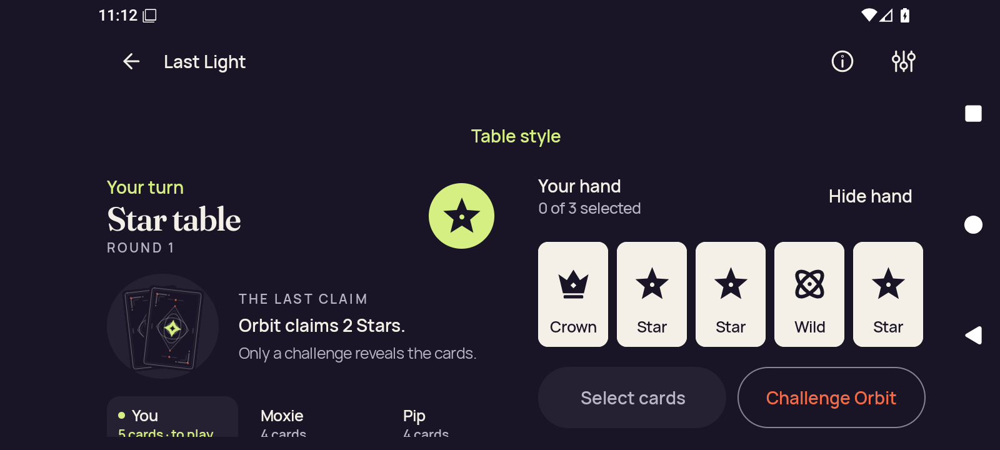</a>

`2d-landscape-baseline-first-card.png` · 1600 × 720 · 108,212 bytes.

SHA-256: `3df7a87ae3c0b23bbf581bf98937904962fd3f8139239d0eced24189feb41046`.

**Preserved image; unviewed.** Original adaptive screenshot preserved without a direct pixel view or an independently established reviewed-byte representative in this bounded still publication. Runtime predicates do not supply a pixel verdict.

### 2d-landscape-baseline-public

<a href="runtime/captures/2d-landscape-baseline-public.png">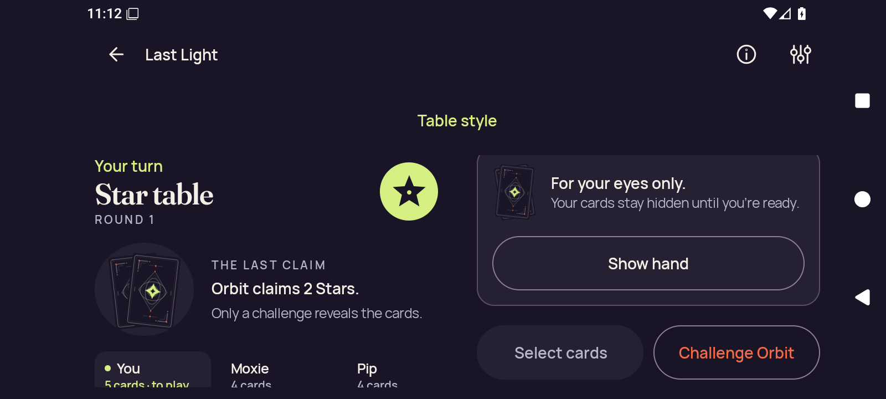</a>

`2d-landscape-baseline-public.png` · 1600 × 720 · 113,899 bytes.

SHA-256: `b27f76cb32bac39dd27cea72d82faeada4bd515164857f414fd46200756e1009`.

**Preserved image; unviewed.** Original adaptive screenshot preserved without a direct pixel view or an independently established reviewed-byte representative in this bounded still publication. Runtime predicates do not supply a pixel verdict.

### 2d-landscape-baseline-selected

`2d-landscape-baseline-selected.png` · 1600 × 720 · 109,149 bytes.

SHA-256: `ffb5ab87a5beae2e0ce0b3792fb9b73346967279685167ff8789d96c5563221b`.

**Preserved image; unviewed.** Original adaptive screenshot preserved without a direct pixel view or an independently established reviewed-byte representative in this bounded still publication. Runtime predicates do not supply a pixel verdict.

### 2d-landscape-home

`2d-landscape-home.png` · 720 × 1600 · 131,584 bytes.

SHA-256: `88ddfaa7739ae05302698b46fea4c1a5fd2abf1f4364ff1b8f2e1584745854a1`.

**Preserved image; unviewed.** Original adaptive screenshot preserved without a direct pixel view or an independently established reviewed-byte representative in this bounded still publication. Runtime predicates do not supply a pixel verdict.

### 2d-landscape-initial-native-ready

<a href="runtime/captures/2d-landscape-initial-native-ready.png">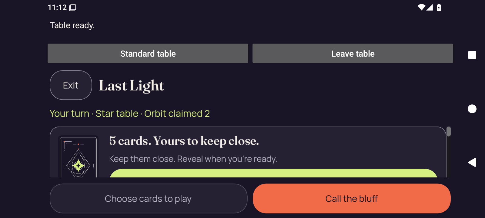</a>

`2d-landscape-initial-native-ready.png` · 1600 × 720 · 107,683 bytes.

SHA-256: `83ee194f9be21b1fe4cce5cdf3b9ca9f4d8ef193f5c9b02d66b19c2c95493778`.

**Preserved image; unviewed.** Original adaptive screenshot preserved without a direct pixel view or an independently established reviewed-byte representative in this bounded still publication. Runtime predicates do not supply a pixel verdict.

### 2d-landscape-initial-selector

`2d-landscape-initial-selector.png` · 1600 × 720 · 43,671 bytes.

SHA-256: `e99ed87e9c9ccb7ad63e42da3b4e530ce6dafe49be59219abd089fb7e7409d55`.

**Preserved image; unviewed.** Original adaptive screenshot preserved without a direct pixel view or an independently established reviewed-byte representative in this bounded still publication. Runtime predicates do not supply a pixel verdict.

### 2d-landscape-leave-confirmation

`2d-landscape-leave-confirmation.png` · 720 × 1600 · 40,297 bytes.

SHA-256: `4877f86826afdb75e8919d898a29381bc54295034b9e662517aaab3e0f185481`.

**Preserved image; unviewed.** Original adaptive screenshot preserved without a direct pixel view or an independently established reviewed-byte representative in this bounded still publication. Runtime predicates do not supply a pixel verdict.

### 2d-landscape-leave-native-ready

`2d-landscape-leave-native-ready.png` · 720 × 1600 · 145,521 bytes.

SHA-256: `39a9425c9ab57d1cc514dde4e7e42e9c383192a0eb2e9263f81d8494f3b32c5b`.

**Preserved image; unviewed.** Original adaptive screenshot preserved without a direct pixel view or an independently established reviewed-byte representative in this bounded still publication. Runtime predicates do not supply a pixel verdict.

### 2d-landscape-leave-selected

`2d-landscape-leave-selected.png` · 720 × 1600 · 122,009 bytes.

SHA-256: `ce2ec0d6ba123de2ab978bbdbedcc35e45777fa19f30d86f9b1ecab2ae0a33ce`.

**Preserved image; unviewed.** Original adaptive screenshot preserved without a direct pixel view or an independently established reviewed-byte representative in this bounded still publication. Runtime predicates do not supply a pixel verdict.

### 2d-landscape-leave-selector

`2d-landscape-leave-selector.png` · 720 × 1600 · 57,473 bytes.

SHA-256: `438b11d05d92eafe262448cb78cd6b1bce4458289fd1c8e6353fa25e91d8be8c`.

**Preserved image; unviewed.** Original adaptive screenshot preserved without a direct pixel view or an independently established reviewed-byte representative in this bounded still publication. Runtime predicates do not supply a pixel verdict.

### 2d-landscape-portrait-native-ready

`2d-landscape-portrait-native-ready.png` · 720 × 1600 · 145,471 bytes.

SHA-256: `368ec8795495fc84da5b85d372fd9a82afb06053b1c3805a2081ead4f60cc6ee`.

**Preserved image; unviewed.** Original adaptive screenshot preserved without a direct pixel view or an independently established reviewed-byte representative in this bounded still publication. Runtime predicates do not supply a pixel verdict.

### 2d-landscape-portrait-selector

<a href="runtime/captures/2d-landscape-portrait-selector.png">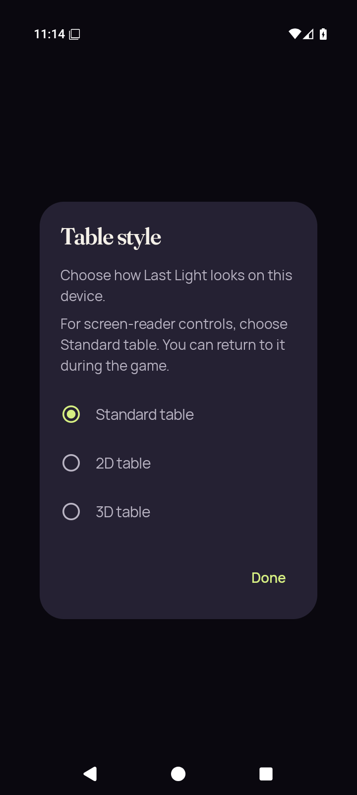</a>

`2d-landscape-portrait-selector.png` · 720 × 1600 · 57,625 bytes.

SHA-256: `0b8c1af40320e8f5ec0b081f12d2617daff739c90630596bcbe803042b7cf81a`.

**Preserved image; unviewed.** Original adaptive screenshot preserved without a direct pixel view or an independently established reviewed-byte representative in this bounded still publication. Runtime predicates do not supply a pixel verdict.

### 2d-landscape-reentry-selected

`2d-landscape-reentry-selected.png` · 720 × 1600 · 122,369 bytes.

SHA-256: `75cbd6ecea30ce9421f0f48ab091db87eddc52f9323f2bbc088f848c0248d6ac`.

**Preserved image; unviewed.** Original adaptive screenshot preserved without a direct pixel view or an independently established reviewed-byte representative in this bounded still publication. Runtime predicates do not supply a pixel verdict.

### 2d-landscape-rotation-return-concealed

`2d-landscape-rotation-return-concealed.png` · 720 × 1600 · 126,171 bytes.

SHA-256: `3e6683df8ca86c1ef1334e1305dd42be258b49401c2d2ddd7b31249b6eeb2811`.

**Preserved image; unviewed.** Original adaptive screenshot preserved without a direct pixel view or an independently established reviewed-byte representative in this bounded still publication. Runtime predicates do not supply a pixel verdict.

### 2d-landscape-rotation-return-first-card

`2d-landscape-rotation-return-first-card.png` · 720 × 1600 · 122,732 bytes.

SHA-256: `2813ebef937fa90e598225f80eae311d23aced6b535a48198c0e438706955b8b`.

**Preserved image; unviewed.** Original adaptive screenshot preserved without a direct pixel view or an independently established reviewed-byte representative in this bounded still publication. Runtime predicates do not supply a pixel verdict.

### 2d-landscape-rotation-return-public

`2d-landscape-rotation-return-public.png` · 720 × 1600 · 126,171 bytes.

SHA-256: `3e6683df8ca86c1ef1334e1305dd42be258b49401c2d2ddd7b31249b6eeb2811`.

**Preserved image; unviewed.** Original adaptive screenshot preserved without a direct pixel view or an independently established reviewed-byte representative in this bounded still publication. Runtime predicates do not supply a pixel verdict.

### 2d-landscape-rotation-return-selection-cleared

`2d-landscape-rotation-return-selection-cleared.png` · 720 × 1600 · 126,171 bytes.

SHA-256: `3e6683df8ca86c1ef1334e1305dd42be258b49401c2d2ddd7b31249b6eeb2811`.

**Preserved image; unviewed.** Original adaptive screenshot preserved without a direct pixel view or an independently established reviewed-byte representative in this bounded still publication. Runtime predicates do not supply a pixel verdict.

### 2d-landscape-standard-return-concealed

`2d-landscape-standard-return-concealed.png` · 720 × 1600 · 125,932 bytes.

SHA-256: `2723871aeb662aa09d23ac892cd848d6fdeee8f837c2adbd9216b642e5db607a`.

**Preserved image; unviewed.** Original adaptive screenshot preserved without a direct pixel view or an independently established reviewed-byte representative in this bounded still publication. Runtime predicates do not supply a pixel verdict.

### 2d-landscape-standard-return-first-card

`2d-landscape-standard-return-first-card.png` · 720 × 1600 · 122,378 bytes.

SHA-256: `1683a4c41cad9bdb309fa1cf8446fcd53e1e86b4362a883cca467d70669f00e2`.

**Preserved image; unviewed.** Original adaptive screenshot preserved without a direct pixel view or an independently established reviewed-byte representative in this bounded still publication. Runtime predicates do not supply a pixel verdict.

### 2d-landscape-standard-return-public

`2d-landscape-standard-return-public.png` · 720 × 1600 · 125,932 bytes.

SHA-256: `2723871aeb662aa09d23ac892cd848d6fdeee8f837c2adbd9216b642e5db607a`.

**Preserved image; unviewed.** Original adaptive screenshot preserved without a direct pixel view or an independently established reviewed-byte representative in this bounded still publication. Runtime predicates do not supply a pixel verdict.

### 2d-landscape-standard-return-selection-cleared

`2d-landscape-standard-return-selection-cleared.png` · 720 × 1600 · 125,932 bytes.

SHA-256: `2723871aeb662aa09d23ac892cd848d6fdeee8f837c2adbd9216b642e5db607a`.

**Preserved image; unviewed.** Original adaptive screenshot preserved without a direct pixel view or an independently established reviewed-byte representative in this bounded still publication. Runtime predicates do not supply a pixel verdict.

### 2d-seascape-after-up

`2d-seascape-after-up.png` · 720 × 1600 · 119,401 bytes.

SHA-256: `b7ca5070512b53a511a319a176d6fabcb3d1cd3449131278b29f561d65cbf444`.

**Preserved image; unviewed.** Original adaptive screenshot preserved without a direct pixel view or an independently established reviewed-byte representative in this bounded still publication. Runtime predicates do not supply a pixel verdict.

### 2d-seascape-baseline-first-card

`2d-seascape-baseline-first-card.png` · 1600 × 720 · 99,257 bytes.

SHA-256: `1f898b7dfc2982f92b469936a65825ae23974440240d78cbcd7ecfe2918a8c41`.

**Preserved image; unviewed.** Original adaptive screenshot preserved without a direct pixel view or an independently established reviewed-byte representative in this bounded still publication. Runtime predicates do not supply a pixel verdict.

### 2d-seascape-baseline-public

`2d-seascape-baseline-public.png` · 1600 × 720 · 107,229 bytes.

SHA-256: `07553ad841259d6c557550d8b5f6bd1530bab4ec7f4dfc4dfc47c9d23e7c40e2`.

**Preserved image; unviewed.** Original adaptive screenshot preserved without a direct pixel view or an independently established reviewed-byte representative in this bounded still publication. Runtime predicates do not supply a pixel verdict.

### 2d-seascape-baseline-selected

<a href="runtime/captures/2d-seascape-baseline-selected.png">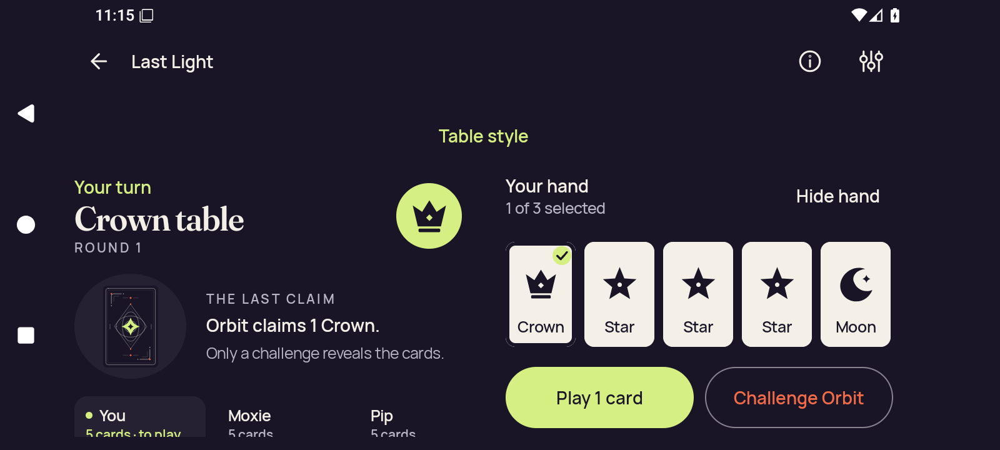</a>

`2d-seascape-baseline-selected.png` · 1600 × 720 · 100,144 bytes.

SHA-256: `0e3a26de26c684d650311e50b7087ae9cc11d4d8b6623ffa320acab04c10dfdf`.

**Preserved image; unviewed.** Original adaptive screenshot preserved without a direct pixel view or an independently established reviewed-byte representative in this bounded still publication. Runtime predicates do not supply a pixel verdict.

### 2d-seascape-home

`2d-seascape-home.png` · 720 × 1600 · 131,496 bytes.

SHA-256: `bef7e17fd6b28828723911b5451fbd90a7d19a0c4a489457c200de2fe5d83ad1`.

**Preserved image; unviewed.** Original adaptive screenshot preserved without a direct pixel view or an independently established reviewed-byte representative in this bounded still publication. Runtime predicates do not supply a pixel verdict.

### 2d-seascape-initial-native-ready

`2d-seascape-initial-native-ready.png` · 1600 × 720 · 108,359 bytes.

SHA-256: `1a6a5154b6e9f43d7dd4968be6b4117c57ca7e78c2bc70b856efede1c160f89e`.

**Preserved image; unviewed.** Original adaptive screenshot preserved without a direct pixel view or an independently established reviewed-byte representative in this bounded still publication. Runtime predicates do not supply a pixel verdict.

### 2d-seascape-initial-selector

`2d-seascape-initial-selector.png` · 1600 × 720 · 41,939 bytes.

SHA-256: `57051ae00f7ba818c5d970e2763511fb96ee99d65652dfedea9685ca0eb25749`.

**Preserved image; unviewed.** Original adaptive screenshot preserved without a direct pixel view or an independently established reviewed-byte representative in this bounded still publication. Runtime predicates do not supply a pixel verdict.

### 2d-seascape-leave-confirmation

`2d-seascape-leave-confirmation.png` · 720 × 1600 · 40,401 bytes.

SHA-256: `93b07606eb4833012f6b5ac9e9037959b530a847edaa216c7de0a65d12e2625e`.

**Preserved image; unviewed.** Original adaptive screenshot preserved without a direct pixel view or an independently established reviewed-byte representative in this bounded still publication. Runtime predicates do not supply a pixel verdict.

### 2d-seascape-leave-native-ready

`2d-seascape-leave-native-ready.png` · 720 × 1600 · 148,865 bytes.

SHA-256: `8495e3f955bdc031c2797d61b1d5af02fd4ce831293f1079495889bc65664c4c`.

**Preserved image; unviewed.** Original adaptive screenshot preserved without a direct pixel view or an independently established reviewed-byte representative in this bounded still publication. Runtime predicates do not supply a pixel verdict.

### 2d-seascape-leave-selected

`2d-seascape-leave-selected.png` · 720 × 1600 · 114,493 bytes.

SHA-256: `412b69f98f768d3243f83660b753bb752afe121f5d694025c9ff9a43e2ec5ae4`.

**Preserved image; unviewed.** Original adaptive screenshot preserved without a direct pixel view or an independently established reviewed-byte representative in this bounded still publication. Runtime predicates do not supply a pixel verdict.

### 2d-seascape-leave-selector

`2d-seascape-leave-selector.png` · 720 × 1600 · 57,891 bytes.

SHA-256: `66f1403ac1f181c5d76000ca6f364bc0ea39a979b533a01281fdc742c3813710`.

**Preserved image; unviewed.** Original adaptive screenshot preserved without a direct pixel view or an independently established reviewed-byte representative in this bounded still publication. Runtime predicates do not supply a pixel verdict.

### 2d-seascape-portrait-native-ready

`2d-seascape-portrait-native-ready.png` · 720 × 1600 · 148,597 bytes.

SHA-256: `3d0638adf1dd2a8c0a9b7a4e8d871a46cac17ee46800fbefc9f667156a1d8210`.

**Preserved image; unviewed.** Original adaptive screenshot preserved without a direct pixel view or an independently established reviewed-byte representative in this bounded still publication. Runtime predicates do not supply a pixel verdict.

### 2d-seascape-portrait-selector

<a href="runtime/captures/2d-seascape-portrait-selector.png">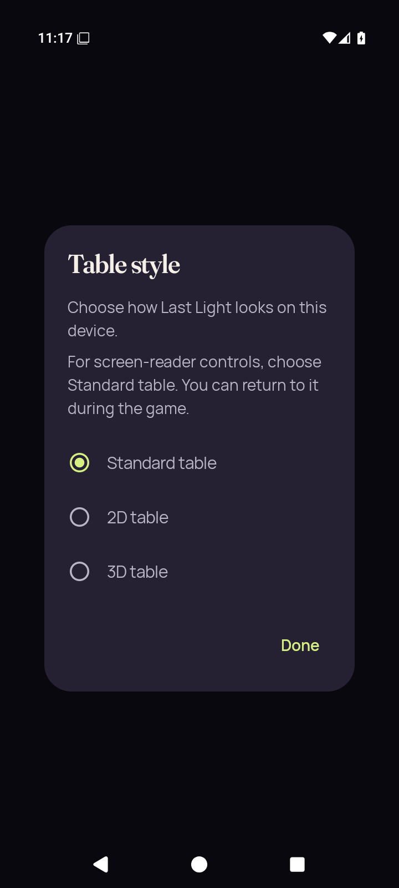</a>

`2d-seascape-portrait-selector.png` · 720 × 1600 · 57,639 bytes.

SHA-256: `ac6b616f917055161207d5dc91b82b35ceaf303030cc3fc1f38b3eb659034f5c`.

**Preserved image; unviewed.** Original adaptive screenshot preserved without a direct pixel view or an independently established reviewed-byte representative in this bounded still publication. Runtime predicates do not supply a pixel verdict.

### 2d-seascape-reentry-selected

`2d-seascape-reentry-selected.png` · 720 × 1600 · 114,056 bytes.

SHA-256: `20804c12a66fcbc8dd69b0c2bebdd4e9bf0c12041798ffeed47cac1674927824`.

**Preserved image; unviewed.** Original adaptive screenshot preserved without a direct pixel view or an independently established reviewed-byte representative in this bounded still publication. Runtime predicates do not supply a pixel verdict.

### 2d-seascape-rotation-return-concealed

`2d-seascape-rotation-return-concealed.png` · 720 × 1600 · 119,155 bytes.

SHA-256: `c5e1e74be50ef5a7c0aa17994c6d833aac6dd7d446dd2504d91ccfaf98fa6f0f`.

**Preserved image; unviewed.** Original adaptive screenshot preserved without a direct pixel view or an independently established reviewed-byte representative in this bounded still publication. Runtime predicates do not supply a pixel verdict.

### 2d-seascape-rotation-return-first-card

`2d-seascape-rotation-return-first-card.png` · 720 × 1600 · 113,828 bytes.

SHA-256: `8bc84e4e59ed0731e31523c193271270ba027d73613f7a7f9cc07218640f9f50`.

**Preserved image; unviewed.** Original adaptive screenshot preserved without a direct pixel view or an independently established reviewed-byte representative in this bounded still publication. Runtime predicates do not supply a pixel verdict.

### 2d-seascape-rotation-return-public

`2d-seascape-rotation-return-public.png` · 720 × 1600 · 119,155 bytes.

SHA-256: `c5e1e74be50ef5a7c0aa17994c6d833aac6dd7d446dd2504d91ccfaf98fa6f0f`.

**Preserved image; unviewed.** Original adaptive screenshot preserved without a direct pixel view or an independently established reviewed-byte representative in this bounded still publication. Runtime predicates do not supply a pixel verdict.

### 2d-seascape-rotation-return-selection-cleared

`2d-seascape-rotation-return-selection-cleared.png` · 720 × 1600 · 119,155 bytes.

SHA-256: `c5e1e74be50ef5a7c0aa17994c6d833aac6dd7d446dd2504d91ccfaf98fa6f0f`.

**Preserved image; unviewed.** Original adaptive screenshot preserved without a direct pixel view or an independently established reviewed-byte representative in this bounded still publication. Runtime predicates do not supply a pixel verdict.

### 2d-seascape-standard-return-concealed

`2d-seascape-standard-return-concealed.png` · 720 × 1600 · 119,627 bytes.

SHA-256: `9b7b637b56024845036c48fa448d4babcb5c990d8773d3be2888c6d73cf141ab`.

**Preserved image; unviewed.** Original adaptive screenshot preserved without a direct pixel view or an independently established reviewed-byte representative in this bounded still publication. Runtime predicates do not supply a pixel verdict.

### 2d-seascape-standard-return-first-card

`2d-seascape-standard-return-first-card.png` · 720 × 1600 · 114,239 bytes.

SHA-256: `80522f697c71268108c2dd45b267b1208fe30c55d1415735de3f0c7e7f7ff5b7`.

**Preserved image; unviewed.** Original adaptive screenshot preserved without a direct pixel view or an independently established reviewed-byte representative in this bounded still publication. Runtime predicates do not supply a pixel verdict.

### 2d-seascape-standard-return-public

`2d-seascape-standard-return-public.png` · 720 × 1600 · 119,638 bytes.

SHA-256: `49bfe2b70e5ae6a9cdd9d3962dbe45c47b5cc3464a49e93d1896a77b1af78d3c`.

**Preserved image; unviewed.** Original adaptive screenshot preserved without a direct pixel view or an independently established reviewed-byte representative in this bounded still publication. Runtime predicates do not supply a pixel verdict.

### 2d-seascape-standard-return-selection-cleared

`2d-seascape-standard-return-selection-cleared.png` · 720 × 1600 · 119,638 bytes.

SHA-256: `49bfe2b70e5ae6a9cdd9d3962dbe45c47b5cc3464a49e93d1896a77b1af78d3c`.

**Preserved image; unviewed.** Original adaptive screenshot preserved without a direct pixel view or an independently established reviewed-byte representative in this bounded still publication. Runtime predicates do not supply a pixel verdict.

### 2d-split-baseline-first-card

<a href="runtime/captures/2d-split-baseline-first-card.png">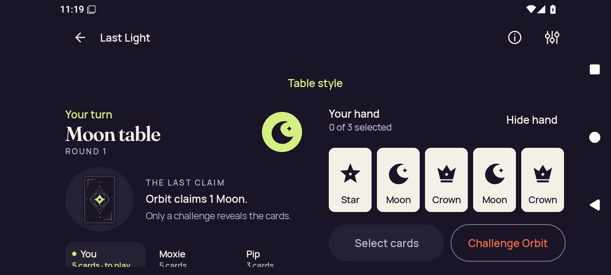</a>

`2d-split-baseline-first-card.png` · 1600 × 720 · 97,684 bytes.

SHA-256: `347bdc67206a34d2371885f12e94d22246802db250ed4cc4d87707f9026fbd35`.

**Preserved image; unviewed.** Original adaptive screenshot preserved without a direct pixel view or an independently established reviewed-byte representative in this bounded still publication. Runtime predicates do not supply a pixel verdict.

### 2d-split-baseline-public

<a href="runtime/captures/2d-split-baseline-public.png">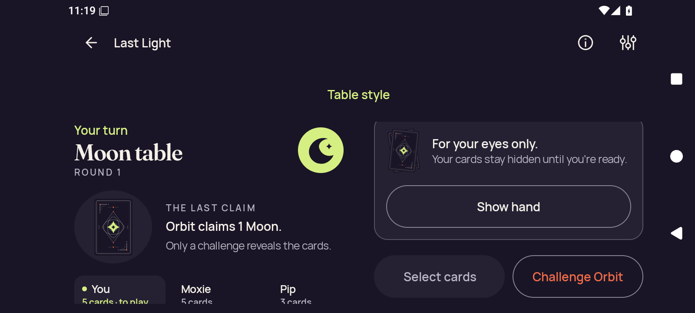</a>

`2d-split-baseline-public.png` · 1600 × 720 · 105,684 bytes.

SHA-256: `c392bfb83f48a9dfff080b7ced32409fe4d6516bc6d1a24680b766d6d50b7845`.

**Preserved image; unviewed.** Original adaptive screenshot preserved without a direct pixel view or an independently established reviewed-byte representative in this bounded still publication. Runtime predicates do not supply a pixel verdict.

### 2d-split-baseline-selected

`2d-split-baseline-selected.png` · 1600 × 720 · 98,567 bytes.

SHA-256: `1543dce297a0827eade17334bb6ac7c4a5858ba4a98099051e03b9575dc93aa3`.

**Preserved image; unviewed.** Original adaptive screenshot preserved without a direct pixel view or an independently established reviewed-byte representative in this bounded still publication. Runtime predicates do not supply a pixel verdict.

### 2d-split-entry-concealed

<a href="runtime/captures/2d-split-entry-concealed.png">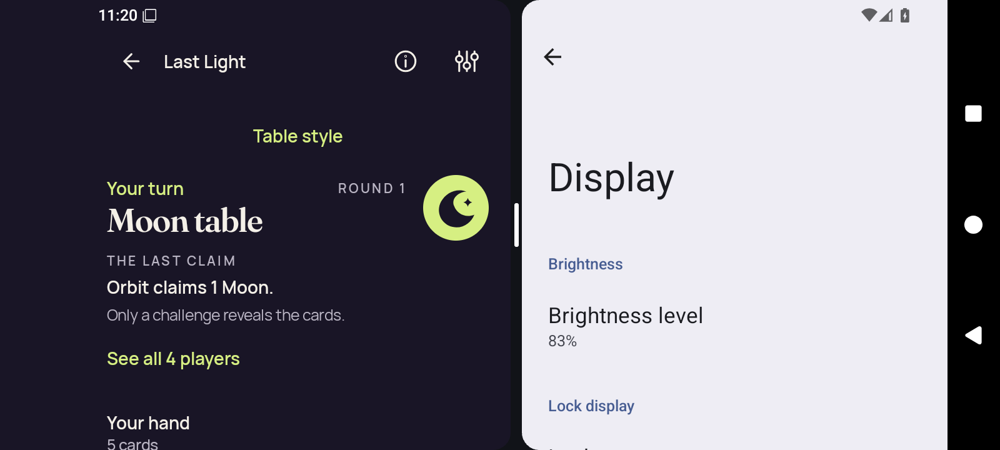</a>

`2d-split-entry-concealed.png` · 1600 × 720 · 78,785 bytes.

SHA-256: `59c9dfcef09bdf07aa081c0083a0031443ae9d54f8cc16020fc4d72cf8d39889`.

**Preserved image; unviewed.** Original adaptive screenshot preserved without a direct pixel view or an independently established reviewed-byte representative in this bounded still publication. Runtime predicates do not supply a pixel verdict.

### 2d-split-entry-return-concealed

`2d-split-entry-return-concealed.png` · 1600 × 720 · 76,474 bytes.

SHA-256: `9924ff26236cdc35f188f9ffba8dc38429ac4f5b673468a6248b969b95bd7b74`.

**Preserved image; unviewed.** Original adaptive screenshot preserved without a direct pixel view or an independently established reviewed-byte representative in this bounded still publication. Runtime predicates do not supply a pixel verdict.

### 2d-split-entry-return-first-card

<a href="runtime/captures/2d-split-entry-return-first-card.png">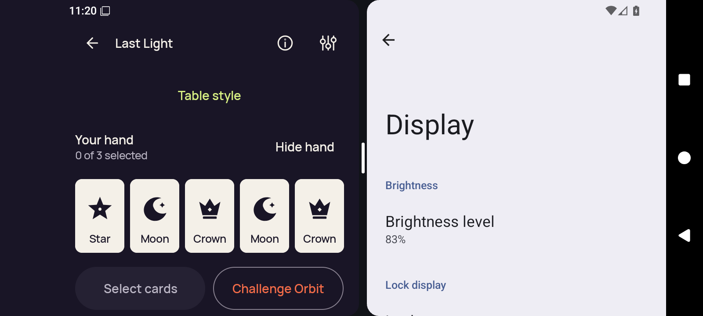</a>

`2d-split-entry-return-first-card.png` · 1600 × 720 · 74,208 bytes.

SHA-256: `deda7d46a4340c3c46982378675c49a7d274f43ecfe670a82a4f7f10794f42dc`.

**Preserved image; unviewed.** Original adaptive screenshot preserved without a direct pixel view or an independently established reviewed-byte representative in this bounded still publication. Runtime predicates do not supply a pixel verdict.

### 2d-split-entry-return-public

<a href="runtime/captures/2d-split-entry-return-public.png">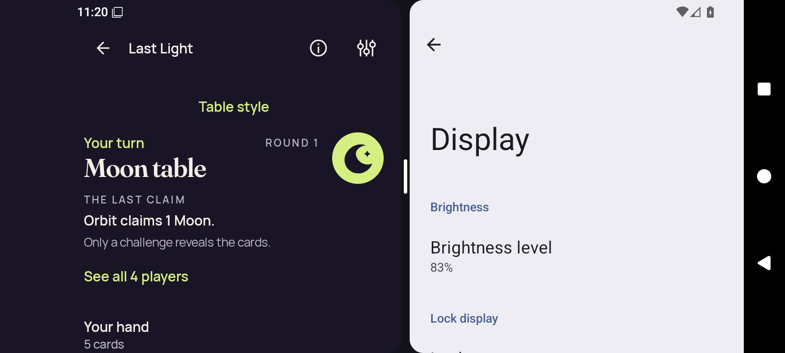</a>

`2d-split-entry-return-public.png` · 1600 × 720 · 78,900 bytes.

SHA-256: `e0d8bf975c3254d3cdecfb1359d2b8a5b9143bdc65c12bed37ded8af61f00be4`.

**Preserved image; unviewed.** Original adaptive screenshot preserved without a direct pixel view or an independently established reviewed-byte representative in this bounded still publication. Runtime predicates do not supply a pixel verdict.

### 2d-split-entry-return-selection-cleared

<a href="runtime/captures/2d-split-entry-return-selection-cleared.png">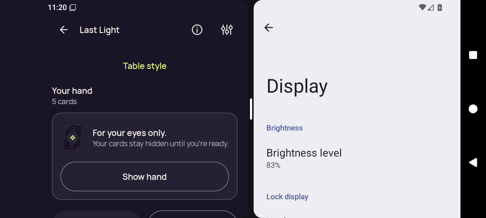</a>

`2d-split-entry-return-selection-cleared.png` · 1600 × 720 · 76,489 bytes.

SHA-256: `fd0491139347e84c95104eb97ae22e7e433759b982c37a7aa507d4fe450a8df3`.

**Preserved image; unviewed.** Original adaptive screenshot preserved without a direct pixel view or an independently established reviewed-byte representative in this bounded still publication. Runtime predicates do not supply a pixel verdict.

### 2d-split-exit-concealed

`2d-split-exit-concealed.png` · 1600 × 720 · 98,758 bytes.

SHA-256: `625d548aedb8bb5e6a16e27d875c15e4d3965d0bb23bf2803b9755ea8e748e60`.

**Preserved image; unviewed.** Original adaptive screenshot preserved without a direct pixel view or an independently established reviewed-byte representative in this bounded still publication. Runtime predicates do not supply a pixel verdict.

### 2d-split-exit-return-concealed

`2d-split-exit-return-concealed.png` · 1600 × 720 · 98,758 bytes.

SHA-256: `625d548aedb8bb5e6a16e27d875c15e4d3965d0bb23bf2803b9755ea8e748e60`.

**Preserved image; unviewed.** Original adaptive screenshot preserved without a direct pixel view or an independently established reviewed-byte representative in this bounded still publication. Runtime predicates do not supply a pixel verdict.

### 2d-split-exit-return-first-card

`2d-split-exit-return-first-card.png` · 1600 × 720 · 97,742 bytes.

SHA-256: `3fc935a38e1fff17c5fa7c3d3c5b6744d3b628cd7c6fd1a56c920ad0f301c2dc`.

**Preserved image; unviewed.** Original adaptive screenshot preserved without a direct pixel view or an independently established reviewed-byte representative in this bounded still publication. Runtime predicates do not supply a pixel verdict.

### 2d-split-exit-return-public

`2d-split-exit-return-public.png` · 1600 × 720 · 105,732 bytes.

SHA-256: `a9cd506ec638ba43d0e7d118ef8ac164ddef86a1750bc4561053880e31f37155`.

**Preserved image; unviewed.** Original adaptive screenshot preserved without a direct pixel view or an independently established reviewed-byte representative in this bounded still publication. Runtime predicates do not supply a pixel verdict.

### 2d-split-exit-return-selection-cleared

`2d-split-exit-return-selection-cleared.png` · 1600 × 720 · 105,563 bytes.

SHA-256: `8203e29e3876c292a59572642d8417c087fe6ac85578368ef462f5d07d94f044`.

**Preserved image; unviewed.** Original adaptive screenshot preserved without a direct pixel view or an independently established reviewed-byte representative in this bounded still publication. Runtime predicates do not supply a pixel verdict.

### 2d-split-full-native-ready

`2d-split-full-native-ready.png` · 1600 × 720 · 108,015 bytes.

SHA-256: `c9d23348974fcce024a7a993e2b940b1561d88393fdd39a2dff180e752eaf336`.

**Preserved image; unviewed.** Original adaptive screenshot preserved without a direct pixel view or an independently established reviewed-byte representative in this bounded still publication. Runtime predicates do not supply a pixel verdict.

### 2d-split-full-selector

`2d-split-full-selector.png` · 1600 × 720 · 45,485 bytes.

SHA-256: `064e9c2b733e23006914c0acc104b9514788604f13d5b85dc732784f76e97f52`.

**Preserved image; unviewed.** Original adaptive screenshot preserved without a direct pixel view or an independently established reviewed-byte representative in this bounded still publication. Runtime predicates do not supply a pixel verdict.

### 2d-split-home

`2d-split-home.png` · 1600 × 720 · 135,480 bytes.

SHA-256: `f72722287ea47a4e22017e96c0d2d879283e8d64221fb675658ab5ef8b6a1005`.

**Preserved image; unviewed.** Original adaptive screenshot preserved without a direct pixel view or an independently established reviewed-byte representative in this bounded still publication. Runtime predicates do not supply a pixel verdict.

### 2d-split-leave-confirmation

`2d-split-leave-confirmation.png` · 1600 × 720 · 39,726 bytes.

SHA-256: `323feb07cf720fca3aa3fa28727c11aa5f2d402d20f49f4a1cded1c5899d018c`.

**Preserved image; unviewed.** Original adaptive screenshot preserved without a direct pixel view or an independently established reviewed-byte representative in this bounded still publication. Runtime predicates do not supply a pixel verdict.

### 2d-split-leave-native-ready

`2d-split-leave-native-ready.png` · 1600 × 720 · 107,562 bytes.

SHA-256: `40f42a57de2ec27a826ef370ef04e732d0c3a2b899d5875dbceaff8d0bd184b2`.

**Preserved image; unviewed.** Original adaptive screenshot preserved without a direct pixel view or an independently established reviewed-byte representative in this bounded still publication. Runtime predicates do not supply a pixel verdict.

### 2d-split-leave-selected

<a href="runtime/captures/2d-split-leave-selected.png">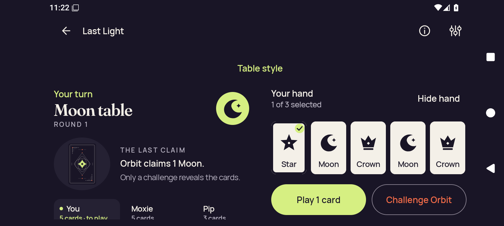</a>

`2d-split-leave-selected.png` · 1600 × 720 · 98,629 bytes.

SHA-256: `2d354f15eb5e797c8dbe55cdce102fe321135465f12bb3c1ceec694346fbb484`.

**Preserved image; unviewed.** Original adaptive screenshot preserved without a direct pixel view or an independently established reviewed-byte representative in this bounded still publication. Runtime predicates do not supply a pixel verdict.

### 2d-split-leave-selector

`2d-split-leave-selector.png` · 1600 × 720 · 44,299 bytes.

SHA-256: `4465da6762e8516031b789fc23fc77e39d059198db00dc67da5cb9f2312b5bd6`.

**Preserved image; unviewed.** Original adaptive screenshot preserved without a direct pixel view or an independently established reviewed-byte representative in this bounded still publication. Runtime predicates do not supply a pixel verdict.

### 2d-split-pane-native-ready

<a href="runtime/captures/2d-split-pane-native-ready.png">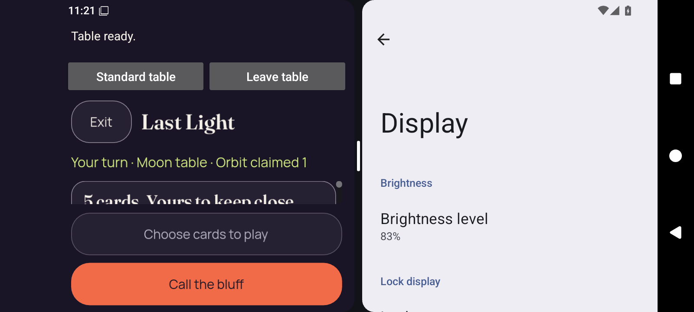</a>

`2d-split-pane-native-ready.png` · 1600 × 720 · 98,165 bytes.

SHA-256: `e8471028e7b8749fdd2fd6745d64929b453dfc2790c05e6792bcdab01e243e2d`.

**Preserved image; unviewed.** Original adaptive screenshot preserved without a direct pixel view or an independently established reviewed-byte representative in this bounded still publication. Runtime predicates do not supply a pixel verdict.

### 2d-split-pane-selector

<a href="runtime/captures/2d-split-pane-selector.png">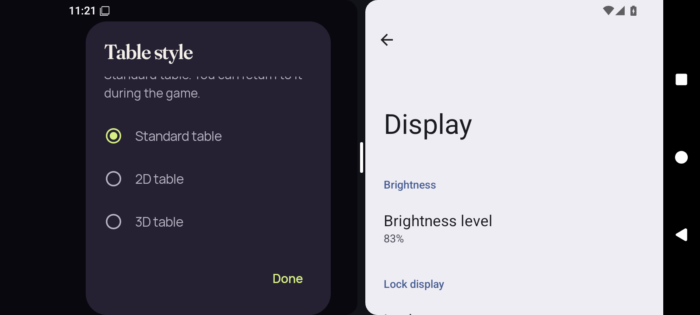</a>

`2d-split-pane-selector.png` · 1600 × 720 · 61,248 bytes.

SHA-256: `10be7bdb9c512d57cea184acc00c497e051a39a031ec999e5173f355ca9ba38b`.

**Preserved image; unviewed.** Original adaptive screenshot preserved without a direct pixel view or an independently established reviewed-byte representative in this bounded still publication. Runtime predicates do not supply a pixel verdict.

### 2d-split-reentry-selected

<a href="runtime/captures/2d-split-reentry-selected.png">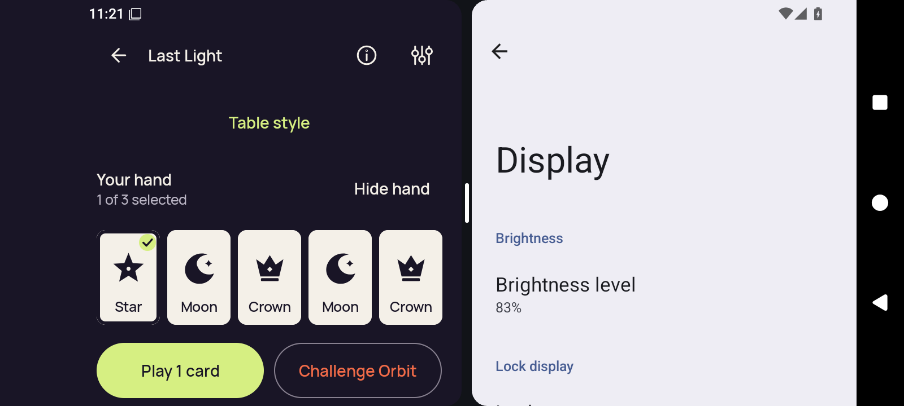</a>

`2d-split-reentry-selected.png` · 1600 × 720 · 74,297 bytes.

SHA-256: `084b8bdab6e965948871b2e4cfa560cfcf660e4bec9315b9882edcaffd48cdc7`.

**Preserved image; unviewed.** Original adaptive screenshot preserved without a direct pixel view or an independently established reviewed-byte representative in this bounded still publication. Runtime predicates do not supply a pixel verdict.

### 3d-landscape-after-up

`3d-landscape-after-up.png` · 720 × 1600 · 118,371 bytes.

SHA-256: `d4ff4d30e789371379ca9f86bf3794cd04ce7f2fd9928c8874a9afa3152b4acf`.

**Preserved image; unviewed.** Original adaptive screenshot preserved without a direct pixel view or an independently established reviewed-byte representative in this bounded still publication. Runtime predicates do not supply a pixel verdict.

### 3d-landscape-baseline-first-card

`3d-landscape-baseline-first-card.png` · 1600 × 720 · 98,146 bytes.

SHA-256: `cfa6c4ec2393ad2f5cbcec31758da40f7712d3bfa5dabb2be04f0aec3de7b8db`.

**Preserved image; unviewed.** Original adaptive screenshot preserved without a direct pixel view or an independently established reviewed-byte representative in this bounded still publication. Runtime predicates do not supply a pixel verdict.

### 3d-landscape-baseline-public

<a href="runtime/captures/3d-landscape-baseline-public.png">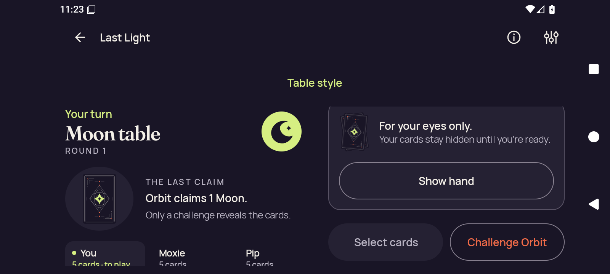</a>

`3d-landscape-baseline-public.png` · 1600 × 720 · 106,090 bytes.

SHA-256: `9e5877b0ff4e518ecddfb0b899397c6794455e21e42759652da480c0a55a2bdc`.

**Preserved image; unviewed.** Original adaptive screenshot preserved without a direct pixel view or an independently established reviewed-byte representative in this bounded still publication. Runtime predicates do not supply a pixel verdict.

### 3d-landscape-baseline-selected

`3d-landscape-baseline-selected.png` · 1600 × 720 · 98,859 bytes.

SHA-256: `f528a3e318d13ecdb3f92431cc260c8712077300b45d60fa76f9c64d3b77583c`.

**Preserved image; unviewed.** Original adaptive screenshot preserved without a direct pixel view or an independently established reviewed-byte representative in this bounded still publication. Runtime predicates do not supply a pixel verdict.

### 3d-landscape-home

`3d-landscape-home.png` · 720 × 1600 · 131,966 bytes.

SHA-256: `0b474651b84253ff2995c842b8132a7faa1b0e92be8c64dce86f5b30f2c1428b`.

**Preserved image; unviewed.** Original adaptive screenshot preserved without a direct pixel view or an independently established reviewed-byte representative in this bounded still publication. Runtime predicates do not supply a pixel verdict.

### 3d-landscape-initial-native-ready

<a href="runtime/captures/3d-landscape-initial-native-ready.png">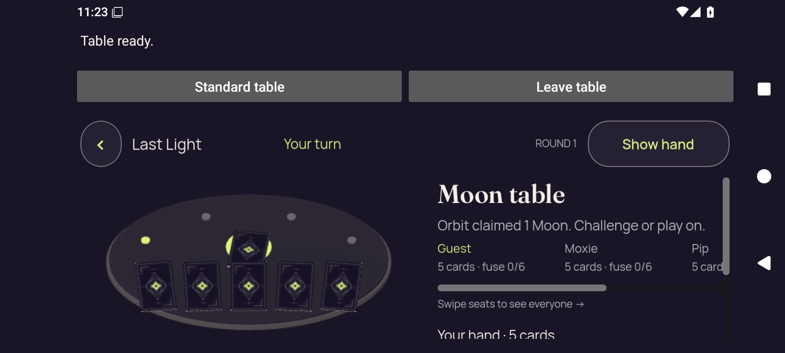</a>

`3d-landscape-initial-native-ready.png` · 1600 × 720 · 167,260 bytes.

SHA-256: `e5d3801e1037505e93d8c6dc664bfd3d84f6d21e7e2bca12f86c831c83948e6b`.

**Preserved image; unviewed.** Original adaptive screenshot preserved without a direct pixel view or an independently established reviewed-byte representative in this bounded still publication. Runtime predicates do not supply a pixel verdict.

### 3d-landscape-initial-selector

`3d-landscape-initial-selector.png` · 1600 × 720 · 40,661 bytes.

SHA-256: `d5d1010d94bd8f1893f1deba4977837107ee1e2679fda4259805118a349e647c`.

**Preserved image; unviewed.** Original adaptive screenshot preserved without a direct pixel view or an independently established reviewed-byte representative in this bounded still publication. Runtime predicates do not supply a pixel verdict.

### 3d-landscape-leave-confirmation

`3d-landscape-leave-confirmation.png` · 720 × 1600 · 40,985 bytes.

SHA-256: `d315fa34f46a66c615f2720a27d13c84dd83e670ba7dce274f5c5464858c69cd`.

**Preserved image; unviewed.** Original adaptive screenshot preserved without a direct pixel view or an independently established reviewed-byte representative in this bounded still publication. Runtime predicates do not supply a pixel verdict.

### 3d-landscape-leave-native-ready

<a href="runtime/captures/3d-landscape-leave-native-ready.png">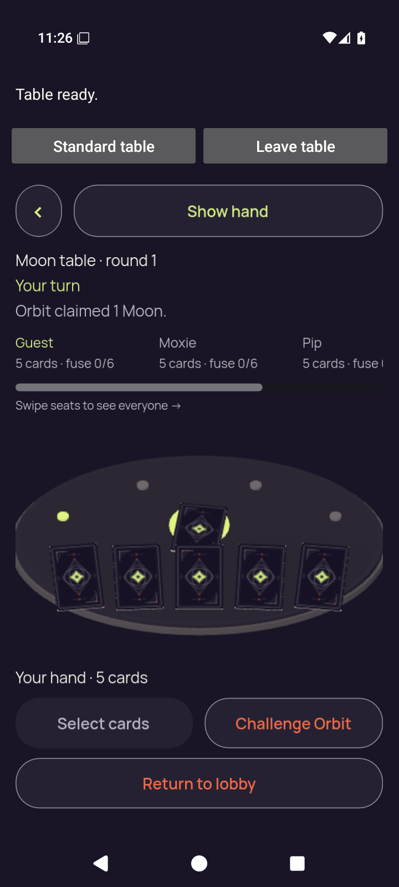</a>

`3d-landscape-leave-native-ready.png` · 720 × 1600 · 188,211 bytes.

SHA-256: `48ec638438118f61988e743358ec99c6e7b50c050c00c2dc40496ab2b66af4bd`.

**Preserved image; unviewed.** Original adaptive screenshot preserved without a direct pixel view or an independently established reviewed-byte representative in this bounded still publication. Runtime predicates do not supply a pixel verdict.

### 3d-landscape-leave-selected

`3d-landscape-leave-selected.png` · 720 × 1600 · 113,077 bytes.

SHA-256: `d2465142f9e4d1b1f54dbfd4559e9beb3e4007378748610f80e6645663421ccf`.

**Preserved image; unviewed.** Original adaptive screenshot preserved without a direct pixel view or an independently established reviewed-byte representative in this bounded still publication. Runtime predicates do not supply a pixel verdict.

### 3d-landscape-leave-selector

<a href="runtime/captures/3d-landscape-leave-selector.png">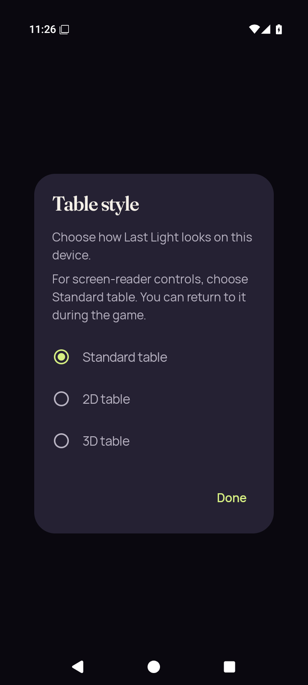</a>

`3d-landscape-leave-selector.png` · 720 × 1600 · 58,129 bytes.

SHA-256: `3968755afa1fa39b47a2967464cfe23120bbb988aa2207ebd56206081a94ac51`.

**Preserved image; unviewed.** Original adaptive screenshot preserved without a direct pixel view or an independently established reviewed-byte representative in this bounded still publication. Runtime predicates do not supply a pixel verdict.

### 3d-landscape-portrait-native-ready

<a href="runtime/captures/3d-landscape-portrait-native-ready.png">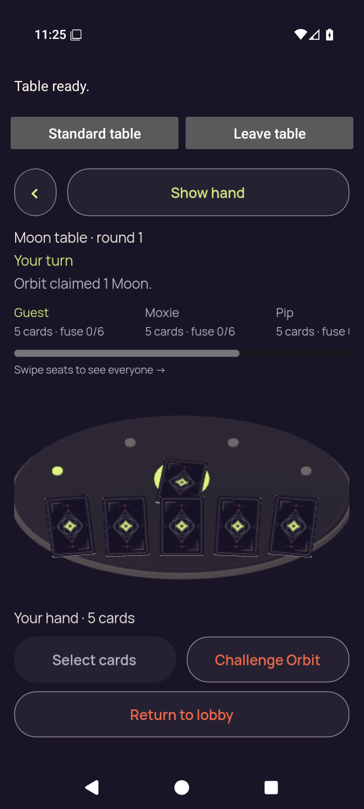</a>

`3d-landscape-portrait-native-ready.png` · 720 × 1600 · 188,227 bytes.

SHA-256: `70b5a523d846afa44f10dcf321b899ec986f6b0ed3ae26ca03b02c751268e37b`.

**Preserved image; unviewed.** Original adaptive screenshot preserved without a direct pixel view or an independently established reviewed-byte representative in this bounded still publication. Runtime predicates do not supply a pixel verdict.

### 3d-landscape-portrait-selector

`3d-landscape-portrait-selector.png` · 720 × 1600 · 58,255 bytes.

SHA-256: `292e15569d4cb34ec25b5d75845ff00f063c95a79b1219f34879e63af31740d0`.

**Preserved image; unviewed.** Original adaptive screenshot preserved without a direct pixel view or an independently established reviewed-byte representative in this bounded still publication. Runtime predicates do not supply a pixel verdict.

### 3d-landscape-reentry-selected

`3d-landscape-reentry-selected.png` · 720 × 1600 · 113,023 bytes.

SHA-256: `d142c6c753af31bf965ffad32d1a488266714279f808beb445251f1e3aec7cac`.

**Preserved image; unviewed.** Original adaptive screenshot preserved without a direct pixel view or an independently established reviewed-byte representative in this bounded still publication. Runtime predicates do not supply a pixel verdict.

### 3d-landscape-rotation-return-concealed

`3d-landscape-rotation-return-concealed.png` · 720 × 1600 · 118,372 bytes.

SHA-256: `db5f72206bf39de1646351903fb2f3355e2d4ccc1e5fbc61d66eed739940818c`.

**Preserved image; unviewed.** Original adaptive screenshot preserved without a direct pixel view or an independently established reviewed-byte representative in this bounded still publication. Runtime predicates do not supply a pixel verdict.

### 3d-landscape-rotation-return-first-card

`3d-landscape-rotation-return-first-card.png` · 720 × 1600 · 113,572 bytes.

SHA-256: `80b8d42e65091187fdbb6bb0345b084367144f9eeadcade7286368ab376aa2d7`.

**Preserved image; unviewed.** Original adaptive screenshot preserved without a direct pixel view or an independently established reviewed-byte representative in this bounded still publication. Runtime predicates do not supply a pixel verdict.

### 3d-landscape-rotation-return-public

`3d-landscape-rotation-return-public.png` · 720 × 1600 · 118,372 bytes.

SHA-256: `db5f72206bf39de1646351903fb2f3355e2d4ccc1e5fbc61d66eed739940818c`.

**Preserved image; unviewed.** Original adaptive screenshot preserved without a direct pixel view or an independently established reviewed-byte representative in this bounded still publication. Runtime predicates do not supply a pixel verdict.

### 3d-landscape-rotation-return-selection-cleared

`3d-landscape-rotation-return-selection-cleared.png` · 720 × 1600 · 118,372 bytes.

SHA-256: `db5f72206bf39de1646351903fb2f3355e2d4ccc1e5fbc61d66eed739940818c`.

**Preserved image; unviewed.** Original adaptive screenshot preserved without a direct pixel view or an independently established reviewed-byte representative in this bounded still publication. Runtime predicates do not supply a pixel verdict.

### 3d-landscape-standard-return-concealed

`3d-landscape-standard-return-concealed.png` · 720 × 1600 · 118,440 bytes.

SHA-256: `3344ba10a6a8de2fa4ff0bd796c58009c4d80cbc31533f17ec34972312a89ebe`.

**Preserved image; unviewed.** Original adaptive screenshot preserved without a direct pixel view or an independently established reviewed-byte representative in this bounded still publication. Runtime predicates do not supply a pixel verdict.

### 3d-landscape-standard-return-first-card

`3d-landscape-standard-return-first-card.png` · 720 × 1600 · 113,633 bytes.

SHA-256: `c8931d2079e448ada8b0f185e217e9205c5304825452cccae227c58211c66967`.

**Preserved image; unviewed.** Original adaptive screenshot preserved without a direct pixel view or an independently established reviewed-byte representative in this bounded still publication. Runtime predicates do not supply a pixel verdict.

### 3d-landscape-standard-return-public

`3d-landscape-standard-return-public.png` · 720 × 1600 · 118,440 bytes.

SHA-256: `3344ba10a6a8de2fa4ff0bd796c58009c4d80cbc31533f17ec34972312a89ebe`.

**Preserved image; unviewed.** Original adaptive screenshot preserved without a direct pixel view or an independently established reviewed-byte representative in this bounded still publication. Runtime predicates do not supply a pixel verdict.

### 3d-landscape-standard-return-selection-cleared

`3d-landscape-standard-return-selection-cleared.png` · 720 × 1600 · 118,440 bytes.

SHA-256: `3344ba10a6a8de2fa4ff0bd796c58009c4d80cbc31533f17ec34972312a89ebe`.

**Preserved image; unviewed.** Original adaptive screenshot preserved without a direct pixel view or an independently established reviewed-byte representative in this bounded still publication. Runtime predicates do not supply a pixel verdict.

### 3d-seascape-after-up

`3d-seascape-after-up.png` · 720 × 1600 · 120,174 bytes.

SHA-256: `8bb882afea7a8e151157a63483474ad91ce316a29e6a55ccd3d1e66fb6552015`.

**Preserved image; unviewed.** Original adaptive screenshot preserved without a direct pixel view or an independently established reviewed-byte representative in this bounded still publication. Runtime predicates do not supply a pixel verdict.

### 3d-seascape-baseline-first-card

<a href="runtime/captures/3d-seascape-baseline-first-card.png">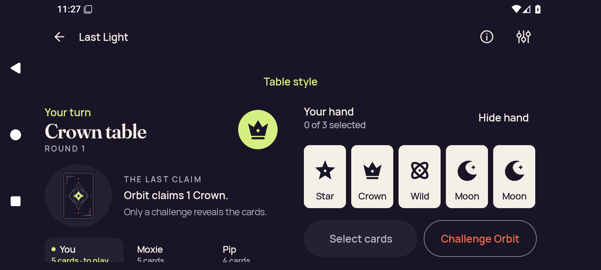</a>

`3d-seascape-baseline-first-card.png` · 1600 × 720 · 103,492 bytes.

SHA-256: `6901fa289ff0bdbf1487ee63fa94fcd7e9018da25e26b38cd1b01af1c40527da`.

**Preserved image; unviewed.** Original adaptive screenshot preserved without a direct pixel view or an independently established reviewed-byte representative in this bounded still publication. Runtime predicates do not supply a pixel verdict.

### 3d-seascape-baseline-public

`3d-seascape-baseline-public.png` · 1600 × 720 · 107,915 bytes.

SHA-256: `5ae629cf923b84fd659a50a2ec83aac3a0a5ebafa5579f7dd0e8928ddc7e6229`.

**Preserved image; unviewed.** Original adaptive screenshot preserved without a direct pixel view or an independently established reviewed-byte representative in this bounded still publication. Runtime predicates do not supply a pixel verdict.

### 3d-seascape-baseline-selected

`3d-seascape-baseline-selected.png` · 1600 × 720 · 104,281 bytes.

SHA-256: `69206e91da4b70baf0e509a7ecc6add97bc993f7ef01be18c4fb49832689f753`.

**Preserved image; unviewed.** Original adaptive screenshot preserved without a direct pixel view or an independently established reviewed-byte representative in this bounded still publication. Runtime predicates do not supply a pixel verdict.

### 3d-seascape-home

`3d-seascape-home.png` · 720 × 1600 · 131,872 bytes.

SHA-256: `18dbc82185e623efd6c1ac88803cd88a6cd7e996374f2738224fd2730e3a56aa`.

**Preserved image; unviewed.** Original adaptive screenshot preserved without a direct pixel view or an independently established reviewed-byte representative in this bounded still publication. Runtime predicates do not supply a pixel verdict.

### 3d-seascape-initial-native-ready

<a href="runtime/captures/3d-seascape-initial-native-ready.png">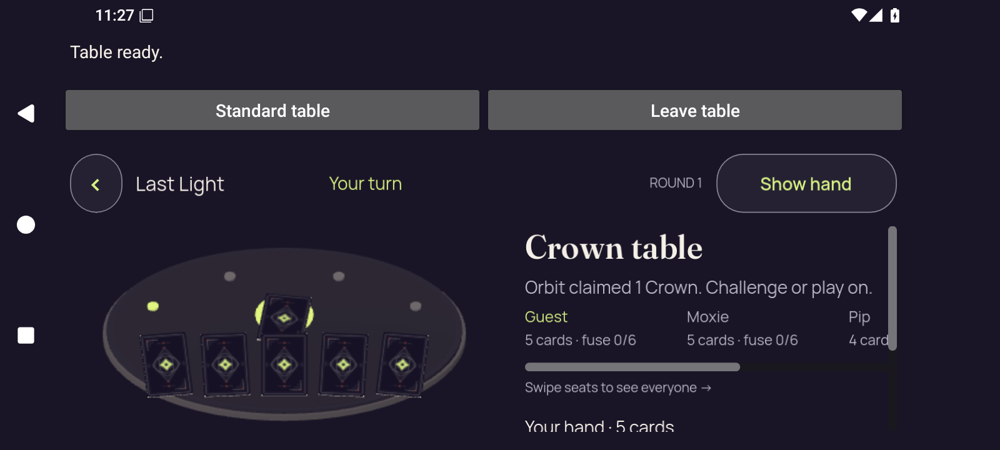</a>

`3d-seascape-initial-native-ready.png` · 1600 × 720 · 170,316 bytes.

SHA-256: `71f214a7e95ce5ee138a7b90a7c11382cc58668cbc2d6555e3f85e87114da3d4`.

**Preserved image; unviewed.** Original adaptive screenshot preserved without a direct pixel view or an independently established reviewed-byte representative in this bounded still publication. Runtime predicates do not supply a pixel verdict.

### 3d-seascape-initial-selector

<a href="runtime/captures/3d-seascape-initial-selector.png">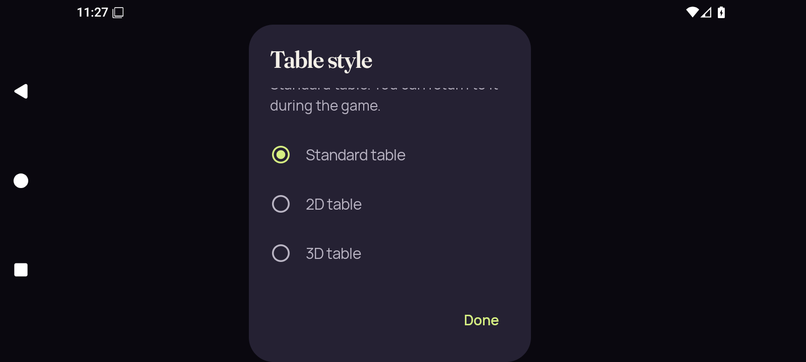</a>

`3d-seascape-initial-selector.png` · 1600 × 720 · 40,578 bytes.

SHA-256: `97ca864c337de59b9cf7d42453b4595ec8933f723aac6300445c64ab416218b5`.

**Preserved image; unviewed.** Original adaptive screenshot preserved without a direct pixel view or an independently established reviewed-byte representative in this bounded still publication. Runtime predicates do not supply a pixel verdict.

### 3d-seascape-leave-confirmation

`3d-seascape-leave-confirmation.png` · 720 × 1600 · 40,876 bytes.

SHA-256: `74b9ad366112355bbcdb00cc27c4f91b7b5021e26ca5679f6b9bc45ddd6317a6`.

**Preserved image; unviewed.** Original adaptive screenshot preserved without a direct pixel view or an independently established reviewed-byte representative in this bounded still publication. Runtime predicates do not supply a pixel verdict.

### 3d-seascape-leave-native-ready

`3d-seascape-leave-native-ready.png` · 720 × 1600 · 192,707 bytes.

SHA-256: `ddd0e677f0890846d5e7dc9b139f1dcf469ce1192eb6249db295b45fe19b048d`.

**Preserved image; unviewed.** Original adaptive screenshot preserved without a direct pixel view or an independently established reviewed-byte representative in this bounded still publication. Runtime predicates do not supply a pixel verdict.

### 3d-seascape-leave-selected

`3d-seascape-leave-selected.png` · 720 × 1600 · 118,233 bytes.

SHA-256: `62b32de4716a0e135d67b0303c232b4d7e60281e1c3bf84adf4f0cf2caf0cbab`.

**Preserved image; unviewed.** Original adaptive screenshot preserved without a direct pixel view or an independently established reviewed-byte representative in this bounded still publication. Runtime predicates do not supply a pixel verdict.

### 3d-seascape-leave-selector

`3d-seascape-leave-selector.png` · 720 × 1600 · 58,119 bytes.

SHA-256: `6c80b2b4eccd0075c2667e612b5abecf3ff3ccc6e0c3dc349cb28b152117b593`.

**Preserved image; unviewed.** Original adaptive screenshot preserved without a direct pixel view or an independently established reviewed-byte representative in this bounded still publication. Runtime predicates do not supply a pixel verdict.

### 3d-seascape-portrait-native-ready

`3d-seascape-portrait-native-ready.png` · 720 × 1600 · 192,826 bytes.

SHA-256: `d40ddf0119d3f5170ed1a0f460a1a964e8ce93be8a50a24bed04d75396c5df84`.

**Preserved image; unviewed.** Original adaptive screenshot preserved without a direct pixel view or an independently established reviewed-byte representative in this bounded still publication. Runtime predicates do not supply a pixel verdict.

### 3d-seascape-portrait-selector

<a href="runtime/captures/3d-seascape-portrait-selector.png">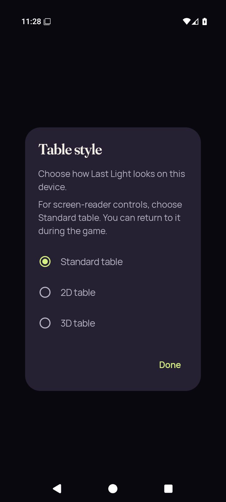</a>

`3d-seascape-portrait-selector.png` · 720 × 1600 · 58,342 bytes.

SHA-256: `48a0019942c732941da5eec38be53ad7086e84583ed452fa5d7c13596e3cd0fe`.

**Preserved image; unviewed.** Original adaptive screenshot preserved without a direct pixel view or an independently established reviewed-byte representative in this bounded still publication. Runtime predicates do not supply a pixel verdict.

### 3d-seascape-reentry-selected

`3d-seascape-reentry-selected.png` · 720 × 1600 · 118,252 bytes.

SHA-256: `5c55d55960996d30ab72bbff57e7970a1e1aa414c9a8336c40b9ee90d8893f11`.

**Preserved image; unviewed.** Original adaptive screenshot preserved without a direct pixel view or an independently established reviewed-byte representative in this bounded still publication. Runtime predicates do not supply a pixel verdict.

### 3d-seascape-rotation-return-concealed

`3d-seascape-rotation-return-concealed.png` · 720 × 1600 · 120,174 bytes.

SHA-256: `8bb882afea7a8e151157a63483474ad91ce316a29e6a55ccd3d1e66fb6552015`.

**Preserved image; unviewed.** Original adaptive screenshot preserved without a direct pixel view or an independently established reviewed-byte representative in this bounded still publication. Runtime predicates do not supply a pixel verdict.

### 3d-seascape-rotation-return-first-card

`3d-seascape-rotation-return-first-card.png` · 720 × 1600 · 118,030 bytes.

SHA-256: `24b54838e60dcb3b10f1e06c2c143080189b06348e46796f0608c28e40dabc6a`.

**Preserved image; unviewed.** Original adaptive screenshot preserved without a direct pixel view or an independently established reviewed-byte representative in this bounded still publication. Runtime predicates do not supply a pixel verdict.

### 3d-seascape-rotation-return-public

`3d-seascape-rotation-return-public.png` · 720 × 1600 · 120,323 bytes.

SHA-256: `767f24f4e01b49fbd5aea7c1eb5f153d29a0503d44e18a8ee5bf46fc6e9abb8a`.

**Preserved image; unviewed.** Original adaptive screenshot preserved without a direct pixel view or an independently established reviewed-byte representative in this bounded still publication. Runtime predicates do not supply a pixel verdict.

### 3d-seascape-rotation-return-selection-cleared

`3d-seascape-rotation-return-selection-cleared.png` · 720 × 1600 · 120,323 bytes.

SHA-256: `767f24f4e01b49fbd5aea7c1eb5f153d29a0503d44e18a8ee5bf46fc6e9abb8a`.

**Preserved image; unviewed.** Original adaptive screenshot preserved without a direct pixel view or an independently established reviewed-byte representative in this bounded still publication. Runtime predicates do not supply a pixel verdict.

### 3d-seascape-standard-return-concealed

`3d-seascape-standard-return-concealed.png` · 720 × 1600 · 120,303 bytes.

SHA-256: `c239b5d0e1f7215c7f2b17a557bd3091fd9303a3a0389bacd620ccb0597af53c`.

**Preserved image; unviewed.** Original adaptive screenshot preserved without a direct pixel view or an independently established reviewed-byte representative in this bounded still publication. Runtime predicates do not supply a pixel verdict.

### 3d-seascape-standard-return-first-card

`3d-seascape-standard-return-first-card.png` · 720 × 1600 · 118,012 bytes.

SHA-256: `cb9311777fe26ff9d2cef98446979b9fd5200af1bb731929576d54280e31352f`.

**Preserved image; unviewed.** Original adaptive screenshot preserved without a direct pixel view or an independently established reviewed-byte representative in this bounded still publication. Runtime predicates do not supply a pixel verdict.

### 3d-seascape-standard-return-public

`3d-seascape-standard-return-public.png` · 720 × 1600 · 120,303 bytes.

SHA-256: `c239b5d0e1f7215c7f2b17a557bd3091fd9303a3a0389bacd620ccb0597af53c`.

**Preserved image; unviewed.** Original adaptive screenshot preserved without a direct pixel view or an independently established reviewed-byte representative in this bounded still publication. Runtime predicates do not supply a pixel verdict.

### 3d-seascape-standard-return-selection-cleared

`3d-seascape-standard-return-selection-cleared.png` · 720 × 1600 · 120,303 bytes.

SHA-256: `c239b5d0e1f7215c7f2b17a557bd3091fd9303a3a0389bacd620ccb0597af53c`.

**Preserved image; unviewed.** Original adaptive screenshot preserved without a direct pixel view or an independently established reviewed-byte representative in this bounded still publication. Runtime predicates do not supply a pixel verdict.

### 3d-split-baseline-first-card

`3d-split-baseline-first-card.png` · 1600 × 720 · 88,236 bytes.

SHA-256: `7997c1b786b748a7908184cf4d2afb68c451d079009c300603b0f1fde031fdbc`.

**Preserved image; unviewed.** Original adaptive screenshot preserved without a direct pixel view or an independently established reviewed-byte representative in this bounded still publication. Runtime predicates do not supply a pixel verdict.

### 3d-split-baseline-public

`3d-split-baseline-public.png` · 1600 × 720 · 98,269 bytes.

SHA-256: `100014f65d8c46fb75c5a5256b32467017f145d2008b81d28a921a4ca76df591`.

**Preserved image; unviewed.** Original adaptive screenshot preserved without a direct pixel view or an independently established reviewed-byte representative in this bounded still publication. Runtime predicates do not supply a pixel verdict.

### 3d-split-baseline-selected

`3d-split-baseline-selected.png` · 1600 × 720 · 89,027 bytes.

SHA-256: `0326d924936747a01229072bc390caf50cff8475f14f5521043cc10a60f13c24`.

**Preserved image; unviewed.** Original adaptive screenshot preserved without a direct pixel view or an independently established reviewed-byte representative in this bounded still publication. Runtime predicates do not supply a pixel verdict.

### 3d-split-entry-concealed

<a href="runtime/captures/3d-split-entry-concealed.png">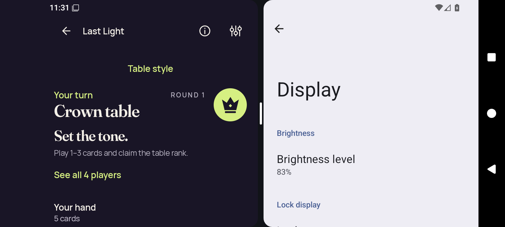</a>

`3d-split-entry-concealed.png` · 1600 × 720 · 77,358 bytes.

SHA-256: `10c1311e2e41270f920426bde1ff126db5f1be7a855f3f3b0c576747d4fd49b0`.

**Preserved image; unviewed.** Original adaptive screenshot preserved without a direct pixel view or an independently established reviewed-byte representative in this bounded still publication. Runtime predicates do not supply a pixel verdict.

### 3d-split-entry-return-concealed

`3d-split-entry-return-concealed.png` · 1600 × 720 · 74,769 bytes.

SHA-256: `533eaff136d18c7bf7879f2a59a1133171c06fdb94c2f37a448eff6877b8f617`.

**Preserved image; unviewed.** Original adaptive screenshot preserved without a direct pixel view or an independently established reviewed-byte representative in this bounded still publication. Runtime predicates do not supply a pixel verdict.

### 3d-split-entry-return-first-card

<a href="runtime/captures/3d-split-entry-return-first-card.png">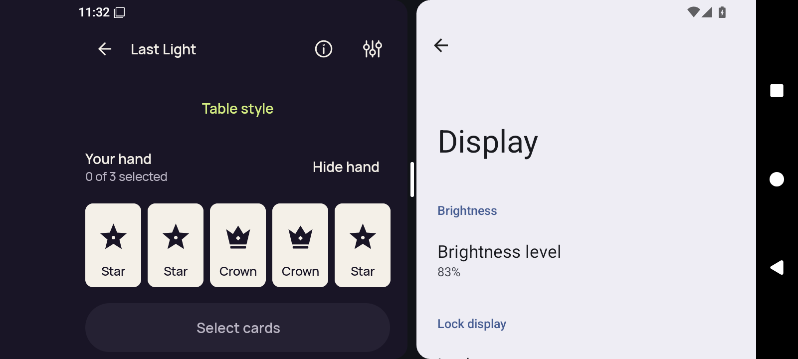</a>

`3d-split-entry-return-first-card.png` · 1600 × 720 · 64,687 bytes.

SHA-256: `30b95b2c6f8347751f761c2d35b7b608cb6510be41f66d812ced90189c4f4682`.

**Preserved image; unviewed.** Original adaptive screenshot preserved without a direct pixel view or an independently established reviewed-byte representative in this bounded still publication. Runtime predicates do not supply a pixel verdict.

### 3d-split-entry-return-public

<a href="runtime/captures/3d-split-entry-return-public.png">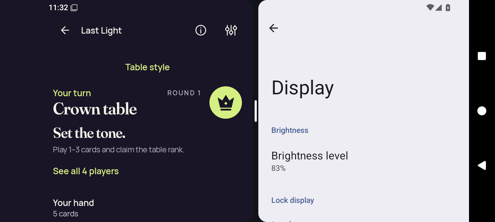</a>

`3d-split-entry-return-public.png` · 1600 × 720 · 77,660 bytes.

SHA-256: `bedef563129cc1f1d827925e19f3896abb0a7155bb4908c55e0b42674873467b`.

**Preserved image; unviewed.** Original adaptive screenshot preserved without a direct pixel view or an independently established reviewed-byte representative in this bounded still publication. Runtime predicates do not supply a pixel verdict.

### 3d-split-entry-return-selection-cleared

<a href="runtime/captures/3d-split-entry-return-selection-cleared.png">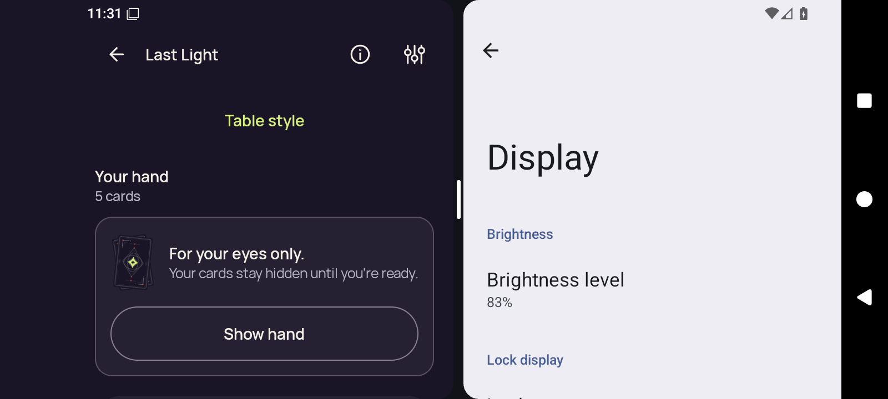</a>

`3d-split-entry-return-selection-cleared.png` · 1600 × 720 · 74,769 bytes.

SHA-256: `533eaff136d18c7bf7879f2a59a1133171c06fdb94c2f37a448eff6877b8f617`.

**Preserved image; unviewed.** Original adaptive screenshot preserved without a direct pixel view or an independently established reviewed-byte representative in this bounded still publication. Runtime predicates do not supply a pixel verdict.

### 3d-split-exit-concealed

`3d-split-exit-concealed.png` · 1600 × 720 · 98,541 bytes.

SHA-256: `68c4ab69fa139798927faeff189983cbf7d0a8f47a125575f8151e03f1616999`.

**Preserved image; unviewed.** Original adaptive screenshot preserved without a direct pixel view or an independently established reviewed-byte representative in this bounded still publication. Runtime predicates do not supply a pixel verdict.

### 3d-split-exit-return-concealed

`3d-split-exit-return-concealed.png` · 1600 × 720 · 98,042 bytes.

SHA-256: `d3e6256cdcbc73035252674e1ef64c8bc908b53edbd9ba26b172cf2db8d94732`.

**Preserved image; unviewed.** Original adaptive screenshot preserved without a direct pixel view or an independently established reviewed-byte representative in this bounded still publication. Runtime predicates do not supply a pixel verdict.

### 3d-split-exit-return-first-card

`3d-split-exit-return-first-card.png` · 1600 × 720 · 87,756 bytes.

SHA-256: `1fb8f82917c7f7c90fd23ffe16101aecacab0d2ec9b493fe8017ac4f126b8e12`.

**Preserved image; unviewed.** Original adaptive screenshot preserved without a direct pixel view or an independently established reviewed-byte representative in this bounded still publication. Runtime predicates do not supply a pixel verdict.

### 3d-split-exit-return-public

`3d-split-exit-return-public.png` · 1600 × 720 · 97,809 bytes.

SHA-256: `56e24ec46791c94eda45add66be6decd2e293c9849ae5f0a6a7d213fcc24b26c`.

**Preserved image; unviewed.** Original adaptive screenshot preserved without a direct pixel view or an independently established reviewed-byte representative in this bounded still publication. Runtime predicates do not supply a pixel verdict.

### 3d-split-exit-return-selection-cleared

`3d-split-exit-return-selection-cleared.png` · 1600 × 720 · 97,804 bytes.

SHA-256: `5ded80324f1c703e787ba246836f2dacf06a53519e3a533e243593f083e7b957`.

**Preserved image; unviewed.** Original adaptive screenshot preserved without a direct pixel view or an independently established reviewed-byte representative in this bounded still publication. Runtime predicates do not supply a pixel verdict.

### 3d-split-full-native-ready

`3d-split-full-native-ready.png` · 1600 × 720 · 160,536 bytes.

SHA-256: `a48190e2adcc96ca162864218e34b3853b4d5ac4213b13cc9a90cca634c6747b`.

**Preserved image; unviewed.** Original adaptive screenshot preserved without a direct pixel view or an independently established reviewed-byte representative in this bounded still publication. Runtime predicates do not supply a pixel verdict.

### 3d-split-full-selector

`3d-split-full-selector.png` · 1600 × 720 · 41,433 bytes.

SHA-256: `7ad870183e9802aeaa558a4904d3e98a21898b2b4d2c042a7e8c6fae0abfde59`.

**Preserved image; unviewed.** Original adaptive screenshot preserved without a direct pixel view or an independently established reviewed-byte representative in this bounded still publication. Runtime predicates do not supply a pixel verdict.

### 3d-split-home

`3d-split-home.png` · 1600 × 720 · 135,668 bytes.

SHA-256: `d82bdd0e1228fd21b9b2bc6c1b87d0f74ab8dc531cc14c648eeae8a29fbdff5e`.

**Preserved image; unviewed.** Original adaptive screenshot preserved without a direct pixel view or an independently established reviewed-byte representative in this bounded still publication. Runtime predicates do not supply a pixel verdict.

### 3d-split-leave-confirmation

`3d-split-leave-confirmation.png` · 1600 × 720 · 39,931 bytes.

SHA-256: `e4bca32238104b5eba0c2b97bcf0cae63726190b14445c69dee1b695d20657fa`.

**Preserved image; unviewed.** Original adaptive screenshot preserved without a direct pixel view or an independently established reviewed-byte representative in this bounded still publication. Runtime predicates do not supply a pixel verdict.

### 3d-split-leave-native-ready

<a href="runtime/captures/3d-split-leave-native-ready.png">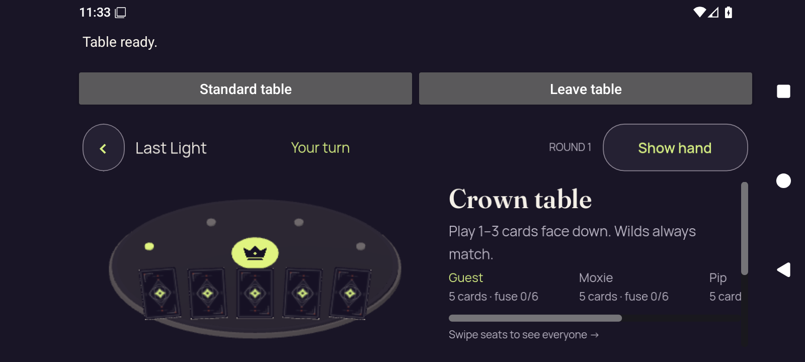</a>

`3d-split-leave-native-ready.png` · 1600 × 720 · 160,580 bytes.

SHA-256: `f1b1f055b37e83896d30b2ab02aad5d134f43159c1ff05d72baaff13407b0941`.

**Preserved image; unviewed.** Original adaptive screenshot preserved without a direct pixel view or an independently established reviewed-byte representative in this bounded still publication. Runtime predicates do not supply a pixel verdict.

### 3d-split-leave-selected

`3d-split-leave-selected.png` · 1600 × 720 · 88,545 bytes.

SHA-256: `2ef735e7fc345dce17e0b260a3016b7f6394ce993c61fe241f6d1ff31ebe3687`.

**Preserved image; unviewed.** Original adaptive screenshot preserved without a direct pixel view or an independently established reviewed-byte representative in this bounded still publication. Runtime predicates do not supply a pixel verdict.

### 3d-split-leave-selector

<a href="runtime/captures/3d-split-leave-selector.png">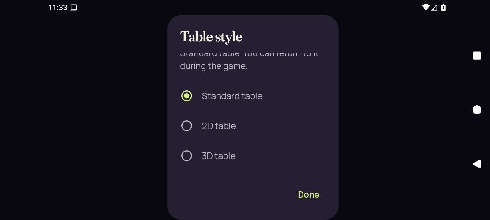</a>

`3d-split-leave-selector.png` · 1600 × 720 · 41,626 bytes.

SHA-256: `fa9f144019f5df59157bc0d194ff807e230a3667501170853e91548caf225823`.

**Preserved image; unviewed.** Original adaptive screenshot preserved without a direct pixel view or an independently established reviewed-byte representative in this bounded still publication. Runtime predicates do not supply a pixel verdict.

### 3d-split-pane-native-ready

<a href="runtime/captures/3d-split-pane-native-ready.png">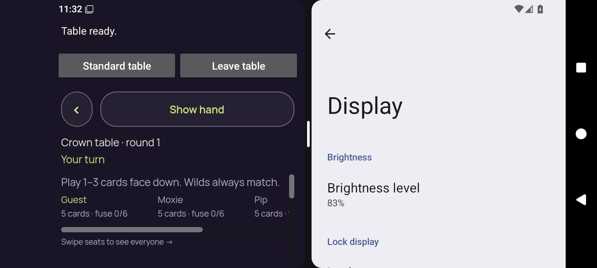</a>

`3d-split-pane-native-ready.png` · 1600 × 720 · 100,611 bytes.

SHA-256: `bc2daac5747a79f0af2ee2d29fdb2258eba7576afc81b069f1e22f1b3e9d0555`.

**Preserved image; unviewed.** Original adaptive screenshot preserved without a direct pixel view or an independently established reviewed-byte representative in this bounded still publication. Runtime predicates do not supply a pixel verdict.

### 3d-split-pane-selector

<a href="runtime/captures/3d-split-pane-selector.png">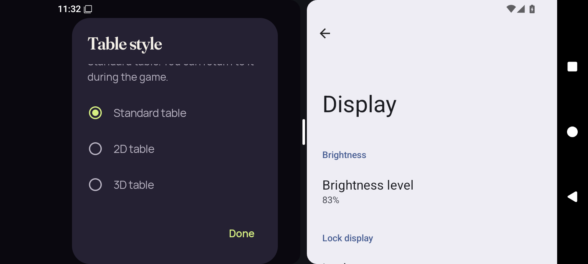</a>

`3d-split-pane-selector.png` · 1600 × 720 · 61,283 bytes.

SHA-256: `e374089b6a00f471bc7ea233f4e18f676b91c40bb5433e8e34c98fb9a09a6b37`.

**Preserved image; unviewed.** Original adaptive screenshot preserved without a direct pixel view or an independently established reviewed-byte representative in this bounded still publication. Runtime predicates do not supply a pixel verdict.

### 3d-split-reentry-selected

<a href="runtime/captures/3d-split-reentry-selected.png">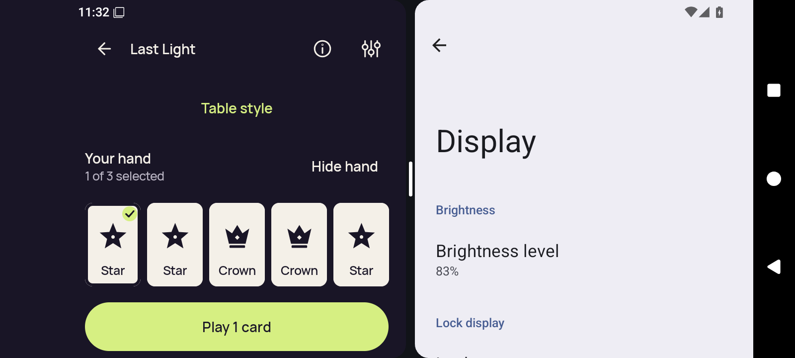</a>

`3d-split-reentry-selected.png` · 1600 × 720 · 65,291 bytes.

SHA-256: `02ba22719e1d3d355f2443e54ec4fdcad4063a101281a3cae2a0895b035261f4`.

**Preserved image; unviewed.** Original adaptive screenshot preserved without a direct pixel view or an independently established reviewed-byte representative in this bounded still publication. Runtime predicates do not supply a pixel verdict.

### final-diagnostic

`final-diagnostic.png` · 1600 × 720 · 135,668 bytes.

SHA-256: `d82bdd0e1228fd21b9b2bc6c1b87d0f74ab8dc531cc14c648eeae8a29fbdff5e`.

**Preserved image; unviewed.** Original adaptive screenshot preserved without a direct pixel view or an independently established reviewed-byte representative in this bounded still publication. Runtime predicates do not supply a pixel verdict.

Original media companions and review receipts

| Preserved file | Bytes | SHA-256 |
| --- | ---: | --- |
| [debug/font-1.0/runtime/captures/2d-landscape-after-up.json](runtime/captures/2d-landscape-after-up.json) | 9,453 | `cd95340cc65a006520b445ad54ecd41620ece1de7d040fd6b497dd9c24c2cdff` |
| [debug/font-1.0/runtime/captures/2d-landscape-after-up.xml](runtime/captures/2d-landscape-after-up.xml) | 18,287 | `2e043fd625e7ad62b2686fc78e904fc792ccfda8a29237bc429c56fff13b077d` |
| [debug/font-1.0/runtime/captures/2d-landscape-baseline-first-card.json](runtime/captures/2d-landscape-baseline-first-card.json) | 9,490 | `41165ac6769d2a3c11428c26c921b957f736cc0d5482d87de6b0bacb85a94f1b` |
| [debug/font-1.0/runtime/captures/2d-landscape-baseline-first-card.xml](runtime/captures/2d-landscape-baseline-first-card.xml) | 23,907 | `fbc298de626dcff2d849cb7a8d4a6fdf9323d15c6086245b90b65034426d67e9` |
| [debug/font-1.0/runtime/captures/2d-landscape-baseline-public.json](runtime/captures/2d-landscape-baseline-public.json) | 9,478 | `669e7ed2515d3d5d890ee46bd743b092b565463e72a4f194025f694cd1d7aa1f` |
| [debug/font-1.0/runtime/captures/2d-landscape-baseline-public.xml](runtime/captures/2d-landscape-baseline-public.xml) | 17,577 | `f9b4b8a98d8848e2c2906e0a053e63da47318cc54776000b5d3ce45c74dc0d3f` |
| [debug/font-1.0/runtime/captures/2d-landscape-baseline-selected.json](runtime/captures/2d-landscape-baseline-selected.json) | 9,484 | `83e5d2163cc0bbb403b23b04b5f29148c76c9e46c9eb4f02b85995c1a5a662c6` |
| [debug/font-1.0/runtime/captures/2d-landscape-baseline-selected.xml](runtime/captures/2d-landscape-baseline-selected.xml) | 23,903 | `f121281887df6be4f00f55e89778e9544df542c3d301a882a77f76fcda810232` |
| [debug/font-1.0/runtime/captures/2d-landscape-home.json](runtime/captures/2d-landscape-home.json) | 9,445 | `2316908750a50a9250846ea640eb310cda66d96a69b5b3bf895d09e13503defe` |
| [debug/font-1.0/runtime/captures/2d-landscape-home.xml](runtime/captures/2d-landscape-home.xml) | 13,571 | `51ccf336b9506663d15597c9f0a1a6af3e9e66ef82b3063e77d00c111a9019dc` |
| [debug/font-1.0/runtime/captures/2d-landscape-initial-native-ready.json](runtime/captures/2d-landscape-initial-native-ready.json) | 11,771 | `d8d554b67661332d8383fd09a62cb33744a5aacb9d179746d2a788006905130d` |
| [debug/font-1.0/runtime/captures/2d-landscape-initial-native-ready.xml](runtime/captures/2d-landscape-initial-native-ready.xml) | 5,221 | `754b86f5cbebbc4c6c99e1fa9e8396fc2e130ca625e5aa955b3603944b61eb83` |
| [debug/font-1.0/runtime/captures/2d-landscape-initial-selector.json](runtime/captures/2d-landscape-initial-selector.json) | 9,481 | `d78e4e837b7d237d3d4bf923797876be46421b353e9363fc27ed432f8130b737` |
| [debug/font-1.0/runtime/captures/2d-landscape-initial-selector.xml](runtime/captures/2d-landscape-initial-selector.xml) | 8,627 | `966aca8c4f533a208ce1ba682c1ece5a5107750b08a15c37059c78eae1a96a7e` |
| [debug/font-1.0/runtime/captures/2d-landscape-leave-confirmation.json](runtime/captures/2d-landscape-leave-confirmation.json) | 9,479 | `34cd47c21080f1927312fb4d23bedbed59def60e063a04cefa279c543477a72f` |
| [debug/font-1.0/runtime/captures/2d-landscape-leave-confirmation.xml](runtime/captures/2d-landscape-leave-confirmation.xml) | 5,802 | `3979bafd154da469678fa69d82589043866471582a5d3f82c0108d000235530b` |
| [debug/font-1.0/runtime/captures/2d-landscape-leave-native-ready.json](runtime/captures/2d-landscape-leave-native-ready.json) | 11,765 | `eb346046d13b451df72f5661c5992327d9b252164b9cd7464cfd23df954e5b06` |
| [debug/font-1.0/runtime/captures/2d-landscape-leave-native-ready.xml](runtime/captures/2d-landscape-leave-native-ready.xml) | 5,203 | `f0f94a7bd1e71d110a6bdee9781bee1aafb9ddcb7099a51749306186a6bc94d5` |
| [debug/font-1.0/runtime/captures/2d-landscape-leave-selected.json](runtime/captures/2d-landscape-leave-selected.json) | 9,475 | `59b649070c5799033eb14ab536f0b17fb76cea2c814bb8c3f06170a3b2ad7ce9` |
| [debug/font-1.0/runtime/captures/2d-landscape-leave-selected.xml](runtime/captures/2d-landscape-leave-selected.xml) | 23,906 | `ec2f3f95d0d31730858f086b3935c20f2f81fc1c9f147325a069edea284dbb45` |
| [debug/font-1.0/runtime/captures/2d-landscape-leave-selector.json](runtime/captures/2d-landscape-leave-selector.json) | 9,475 | `02082308d4879549ffac5db33f2be96e2fa9e1736c78133c8cec8c8c9479df88` |
| [debug/font-1.0/runtime/captures/2d-landscape-leave-selector.xml](runtime/captures/2d-landscape-leave-selector.xml) | 9,020 | `e26fdbe9fa5fb5cf4eefc26fe358d86cdc60af2dcae1433b3bd82ba04119c189` |
| [debug/font-1.0/runtime/captures/2d-landscape-portrait-native-ready.json](runtime/captures/2d-landscape-portrait-native-ready.json) | 11,782 | `973eb8b917c279b9853488dd415754d195d4c684e1cb9efdf32df09c57ba778e` |
| [debug/font-1.0/runtime/captures/2d-landscape-portrait-native-ready.xml](runtime/captures/2d-landscape-portrait-native-ready.xml) | 5,203 | `f0f94a7bd1e71d110a6bdee9781bee1aafb9ddcb7099a51749306186a6bc94d5` |
| [debug/font-1.0/runtime/captures/2d-landscape-portrait-selector.json](runtime/captures/2d-landscape-portrait-selector.json) | 9,492 | `f70e4fe0cd95b8b2756a7866fecd91ab696712587762e7652a14c2f63f6d9295` |
| [debug/font-1.0/runtime/captures/2d-landscape-portrait-selector.xml](runtime/captures/2d-landscape-portrait-selector.xml) | 9,020 | `e26fdbe9fa5fb5cf4eefc26fe358d86cdc60af2dcae1433b3bd82ba04119c189` |
| [debug/font-1.0/runtime/captures/2d-landscape-reentry-selected.json](runtime/captures/2d-landscape-reentry-selected.json) | 9,489 | `3db6ebec9813fac79ee7febf2d787ceab67d49e8aba8fc0b9271476ed265d103` |
| [debug/font-1.0/runtime/captures/2d-landscape-reentry-selected.xml](runtime/captures/2d-landscape-reentry-selected.xml) | 23,906 | `ec2f3f95d0d31730858f086b3935c20f2f81fc1c9f147325a069edea284dbb45` |
| [debug/font-1.0/runtime/captures/2d-landscape-rotation-return-concealed.json](runtime/captures/2d-landscape-rotation-return-concealed.json) | 9,504 | `bc895ec6ae7542296d983e97d35d892f32911ad94fa6892a27c76c754c0f16d9` |
| [debug/font-1.0/runtime/captures/2d-landscape-rotation-return-concealed.xml](runtime/captures/2d-landscape-rotation-return-concealed.xml) | 18,287 | `2e043fd625e7ad62b2686fc78e904fc792ccfda8a29237bc429c56fff13b077d` |
| [debug/font-1.0/runtime/captures/2d-landscape-rotation-return-first-card.json](runtime/captures/2d-landscape-rotation-return-first-card.json) | 9,507 | `831ee67bb9d4a766256aa2b157013d1c0b7d9c3a2497e33bcb74a6b9b3103f43` |
| [debug/font-1.0/runtime/captures/2d-landscape-rotation-return-first-card.xml](runtime/captures/2d-landscape-rotation-return-first-card.xml) | 23,912 | `dd31780b036bdfbb1dd38d674117bdac86377e2825691dfc51e3f95152398acf` |
| [debug/font-1.0/runtime/captures/2d-landscape-rotation-return-public.json](runtime/captures/2d-landscape-rotation-return-public.json) | 9,495 | `ecb480b6819f7f3ead79d41bd67e65c64d3e5f9bfd01602e928fb149feae6bb0` |
| [debug/font-1.0/runtime/captures/2d-landscape-rotation-return-public.xml](runtime/captures/2d-landscape-rotation-return-public.xml) | 18,287 | `2e043fd625e7ad62b2686fc78e904fc792ccfda8a29237bc429c56fff13b077d` |
| [debug/font-1.0/runtime/captures/2d-landscape-rotation-return-selection-cleared.json](runtime/captures/2d-landscape-rotation-return-selection-cleared.json) | 9,528 | `8af7b786f440e07b4760127f50c5f6630d1da52d6393590174fcd9fe48f652f1` |
| [debug/font-1.0/runtime/captures/2d-landscape-rotation-return-selection-cleared.xml](runtime/captures/2d-landscape-rotation-return-selection-cleared.xml) | 18,287 | `2e043fd625e7ad62b2686fc78e904fc792ccfda8a29237bc429c56fff13b077d` |
| [debug/font-1.0/runtime/captures/2d-landscape-standard-return-concealed.json](runtime/captures/2d-landscape-standard-return-concealed.json) | 9,516 | `131a59944bf95a25c294ce778382cb38ba2ce4ee63b3f2e8398adae4f4f6d399` |
| [debug/font-1.0/runtime/captures/2d-landscape-standard-return-concealed.xml](runtime/captures/2d-landscape-standard-return-concealed.xml) | 18,287 | `2e043fd625e7ad62b2686fc78e904fc792ccfda8a29237bc429c56fff13b077d` |
| [debug/font-1.0/runtime/captures/2d-landscape-standard-return-first-card.json](runtime/captures/2d-landscape-standard-return-first-card.json) | 9,519 | `c502e301d4246368b5e1a3edbb02022d40937910901245e276b3798314bb5443` |
| [debug/font-1.0/runtime/captures/2d-landscape-standard-return-first-card.xml](runtime/captures/2d-landscape-standard-return-first-card.xml) | 23,912 | `dd31780b036bdfbb1dd38d674117bdac86377e2825691dfc51e3f95152398acf` |
| [debug/font-1.0/runtime/captures/2d-landscape-standard-return-public.json](runtime/captures/2d-landscape-standard-return-public.json) | 9,507 | `fd6f165b9490028138dd937492ec584ba7c99a7a9461d2f8f63f3378e409e798` |
| [debug/font-1.0/runtime/captures/2d-landscape-standard-return-public.xml](runtime/captures/2d-landscape-standard-return-public.xml) | 18,287 | `2e043fd625e7ad62b2686fc78e904fc792ccfda8a29237bc429c56fff13b077d` |
| [debug/font-1.0/runtime/captures/2d-landscape-standard-return-selection-cleared.json](runtime/captures/2d-landscape-standard-return-selection-cleared.json) | 9,540 | `66acf821fc8e03a0fd8d926f8c866abedaf7b7ffc2c38428a2c290fb492a4dd3` |
| [debug/font-1.0/runtime/captures/2d-landscape-standard-return-selection-cleared.xml](runtime/captures/2d-landscape-standard-return-selection-cleared.xml) | 18,287 | `2e043fd625e7ad62b2686fc78e904fc792ccfda8a29237bc429c56fff13b077d` |
| [debug/font-1.0/runtime/captures/2d-seascape-after-up.json](runtime/captures/2d-seascape-after-up.json) | 9,450 | `ad16d323dbfc0895b4c3b9d0c94c2e729182652628b324baee5691da1123fab8` |
| [debug/font-1.0/runtime/captures/2d-seascape-after-up.xml](runtime/captures/2d-seascape-after-up.xml) | 18,288 | `27e369e72ae86eeb4eaa9f11b597c17d66228d02ca7b062f8a5ab70617179c8f` |
| [debug/font-1.0/runtime/captures/2d-seascape-baseline-first-card.json](runtime/captures/2d-seascape-baseline-first-card.json) | 9,486 | `f81ae26bc044d8d31366aca673c4be73af539e691b768dee9d87a5935f2c95bb` |
| [debug/font-1.0/runtime/captures/2d-seascape-baseline-first-card.xml](runtime/captures/2d-seascape-baseline-first-card.xml) | 23,904 | `908fedfa4c48e8f033e7ac94a00af0765fa729b8559775dfc39224df45479d9d` |
| [debug/font-1.0/runtime/captures/2d-seascape-baseline-public.json](runtime/captures/2d-seascape-baseline-public.json) | 9,474 | `454a0beccd794b3f4ccaadf4907e3f9bc9c5230a89cda89a02089d113dfcad9d` |
| [debug/font-1.0/runtime/captures/2d-seascape-baseline-public.xml](runtime/captures/2d-seascape-baseline-public.xml) | 17,575 | `53e615bc39c597f3c45559bcc0c5927fcc3532a9706ffcdb488b0340abe70ddb` |
| [debug/font-1.0/runtime/captures/2d-seascape-baseline-selected.json](runtime/captures/2d-seascape-baseline-selected.json) | 9,481 | `e1c4e15ddc72138659a233d7c57680d67716eb5bc4b71e06a3294cd5dcde5f42` |
| [debug/font-1.0/runtime/captures/2d-seascape-baseline-selected.xml](runtime/captures/2d-seascape-baseline-selected.xml) | 23,900 | `dab31f3fe15e025a315dc8f402a79b225c226a8e8640140cf501bc708eb2712c` |
| [debug/font-1.0/runtime/captures/2d-seascape-home.json](runtime/captures/2d-seascape-home.json) | 9,442 | `e9a0cbc46732d967f2848e3f74908379decba69ca905789b74485f89baabf848` |
| [debug/font-1.0/runtime/captures/2d-seascape-home.xml](runtime/captures/2d-seascape-home.xml) | 13,571 | `51ccf336b9506663d15597c9f0a1a6af3e9e66ef82b3063e77d00c111a9019dc` |
| [debug/font-1.0/runtime/captures/2d-seascape-initial-native-ready.json](runtime/captures/2d-seascape-initial-native-ready.json) | 11,760 | `3eeda02fcc379e1d2458efbc4fe48d41e1a12f65d3da017b1ea55c8edf993d23` |
| [debug/font-1.0/runtime/captures/2d-seascape-initial-native-ready.xml](runtime/captures/2d-seascape-initial-native-ready.xml) | 5,208 | `3d1f009e9155e261a42e26075c789d2729c5ce821a27a34a0014f22d816f323a` |
| [debug/font-1.0/runtime/captures/2d-seascape-initial-selector.json](runtime/captures/2d-seascape-initial-selector.json) | 9,478 | `a33268b09aac5a0bbec90e0c034786a3e657a2b9c29618a46967278fbf65fc42` |
| [debug/font-1.0/runtime/captures/2d-seascape-initial-selector.xml](runtime/captures/2d-seascape-initial-selector.xml) | 8,626 | `2425b3d8bd9b0743d273ad045f0de30de3fcf48e789963bd1ddadecb56bc0215` |
| [debug/font-1.0/runtime/captures/2d-seascape-leave-confirmation.json](runtime/captures/2d-seascape-leave-confirmation.json) | 9,484 | `de129d4966fb8732985a5dcc7cd6979a08ee8605bee50c0a2a0b0719d346dd99` |
| [debug/font-1.0/runtime/captures/2d-seascape-leave-confirmation.xml](runtime/captures/2d-seascape-leave-confirmation.xml) | 5,802 | `3979bafd154da469678fa69d82589043866471582a5d3f82c0108d000235530b` |
| [debug/font-1.0/runtime/captures/2d-seascape-leave-native-ready.json](runtime/captures/2d-seascape-leave-native-ready.json) | 11,754 | `5a4037e7efb729b736ca544aeef56def80f5a53ab75dba63eca01ae05cb2839f` |
| [debug/font-1.0/runtime/captures/2d-seascape-leave-native-ready.xml](runtime/captures/2d-seascape-leave-native-ready.xml) | 5,203 | `f0f94a7bd1e71d110a6bdee9781bee1aafb9ddcb7099a51749306186a6bc94d5` |
| [debug/font-1.0/runtime/captures/2d-seascape-leave-selected.json](runtime/captures/2d-seascape-leave-selected.json) | 9,472 | `0af27fac52c10d3d329ac0d9b576c4bf34ad453f2621074dd07129900240d880` |
| [debug/font-1.0/runtime/captures/2d-seascape-leave-selected.xml](runtime/captures/2d-seascape-leave-selected.xml) | 23,908 | `6823d69bc05a6cc0cc2d86146af43c07e87428ce59e66ab805e2e63aa145863e` |
| [debug/font-1.0/runtime/captures/2d-seascape-leave-selector.json](runtime/captures/2d-seascape-leave-selector.json) | 9,472 | `3895685df6156d133945fb881d5d98306f138b1ca4051a32afb4a891e60fc855` |
| [debug/font-1.0/runtime/captures/2d-seascape-leave-selector.xml](runtime/captures/2d-seascape-leave-selector.xml) | 9,020 | `e26fdbe9fa5fb5cf4eefc26fe358d86cdc60af2dcae1433b3bd82ba04119c189` |
| [debug/font-1.0/runtime/captures/2d-seascape-portrait-native-ready.json](runtime/captures/2d-seascape-portrait-native-ready.json) | 11,771 | `2299f6d8a02ba5ab573d0d1f33fd43a7b8a44cc67a0884abec1df1adfb1d060a` |
| [debug/font-1.0/runtime/captures/2d-seascape-portrait-native-ready.xml](runtime/captures/2d-seascape-portrait-native-ready.xml) | 5,203 | `f0f94a7bd1e71d110a6bdee9781bee1aafb9ddcb7099a51749306186a6bc94d5` |
| [debug/font-1.0/runtime/captures/2d-seascape-portrait-selector.json](runtime/captures/2d-seascape-portrait-selector.json) | 9,489 | `367532a1e4cd1499c1e36ee7a63c3b92082070c9eea4d5a57d16224805d084db` |
| [debug/font-1.0/runtime/captures/2d-seascape-portrait-selector.xml](runtime/captures/2d-seascape-portrait-selector.xml) | 9,020 | `e26fdbe9fa5fb5cf4eefc26fe358d86cdc60af2dcae1433b3bd82ba04119c189` |
| [debug/font-1.0/runtime/captures/2d-seascape-reentry-selected.json](runtime/captures/2d-seascape-reentry-selected.json) | 9,486 | `c1551ef4482367cd9c99b231488b84150a1e72a9bd840f3222f09a80eff864d9` |
| [debug/font-1.0/runtime/captures/2d-seascape-reentry-selected.xml](runtime/captures/2d-seascape-reentry-selected.xml) | 23,908 | `6823d69bc05a6cc0cc2d86146af43c07e87428ce59e66ab805e2e63aa145863e` |
| [debug/font-1.0/runtime/captures/2d-seascape-rotation-return-concealed.json](runtime/captures/2d-seascape-rotation-return-concealed.json) | 9,501 | `8b4381f668a66d70a4677ade5554c43a18d7e56ecce5381d6dcbbaddc4dfc656` |
| [debug/font-1.0/runtime/captures/2d-seascape-rotation-return-concealed.xml](runtime/captures/2d-seascape-rotation-return-concealed.xml) | 18,288 | `27e369e72ae86eeb4eaa9f11b597c17d66228d02ca7b062f8a5ab70617179c8f` |
| [debug/font-1.0/runtime/captures/2d-seascape-rotation-return-first-card.json](runtime/captures/2d-seascape-rotation-return-first-card.json) | 9,504 | `2dca1b454b9db482cdb39ed7a2342f0acafffbe32b46213941c56a659659330c` |
| [debug/font-1.0/runtime/captures/2d-seascape-rotation-return-first-card.xml](runtime/captures/2d-seascape-rotation-return-first-card.xml) | 23,913 | `c59bce745e78c885bed02be357657029925bfc5bb3a90c0ce02a85b9f73fb31e` |
| [debug/font-1.0/runtime/captures/2d-seascape-rotation-return-public.json](runtime/captures/2d-seascape-rotation-return-public.json) | 9,492 | `61fcaf3bc2becaabdf3df193a2a72b37809ddb3e3c45b74726fd629bc9809468` |
| [debug/font-1.0/runtime/captures/2d-seascape-rotation-return-public.xml](runtime/captures/2d-seascape-rotation-return-public.xml) | 18,288 | `27e369e72ae86eeb4eaa9f11b597c17d66228d02ca7b062f8a5ab70617179c8f` |
| [debug/font-1.0/runtime/captures/2d-seascape-rotation-return-selection-cleared.json](runtime/captures/2d-seascape-rotation-return-selection-cleared.json) | 9,525 | `b6572d643be8df82b93b6131df0ac74bca4b5e879ce5562bd1999b4f159b6fc0` |
| [debug/font-1.0/runtime/captures/2d-seascape-rotation-return-selection-cleared.xml](runtime/captures/2d-seascape-rotation-return-selection-cleared.xml) | 18,288 | `27e369e72ae86eeb4eaa9f11b597c17d66228d02ca7b062f8a5ab70617179c8f` |
| [debug/font-1.0/runtime/captures/2d-seascape-standard-return-concealed.json](runtime/captures/2d-seascape-standard-return-concealed.json) | 9,513 | `a23f763ac01f2ad54ec23e2b567a61fb4beac6b03938fb272acf88e8872330fd` |
| [debug/font-1.0/runtime/captures/2d-seascape-standard-return-concealed.xml](runtime/captures/2d-seascape-standard-return-concealed.xml) | 18,288 | `27e369e72ae86eeb4eaa9f11b597c17d66228d02ca7b062f8a5ab70617179c8f` |
| [debug/font-1.0/runtime/captures/2d-seascape-standard-return-first-card.json](runtime/captures/2d-seascape-standard-return-first-card.json) | 9,516 | `d7784e3e1f26872a6f0a9609cc5865f88520cadffa2b611692a9990f06956f0d` |
| [debug/font-1.0/runtime/captures/2d-seascape-standard-return-first-card.xml](runtime/captures/2d-seascape-standard-return-first-card.xml) | 23,913 | `c59bce745e78c885bed02be357657029925bfc5bb3a90c0ce02a85b9f73fb31e` |
| [debug/font-1.0/runtime/captures/2d-seascape-standard-return-public.json](runtime/captures/2d-seascape-standard-return-public.json) | 9,504 | `63be1eef3833d0cfaeea000ba4c1a611baa4f5eda6d182965973d58c93ddc8ee` |
| [debug/font-1.0/runtime/captures/2d-seascape-standard-return-public.xml](runtime/captures/2d-seascape-standard-return-public.xml) | 18,288 | `27e369e72ae86eeb4eaa9f11b597c17d66228d02ca7b062f8a5ab70617179c8f` |
| [debug/font-1.0/runtime/captures/2d-seascape-standard-return-selection-cleared.json](runtime/captures/2d-seascape-standard-return-selection-cleared.json) | 9,537 | `86fba2f49ad65a4cebce0f819563d23e570388ab62caf23e714b9e3425b17ddd` |
| [debug/font-1.0/runtime/captures/2d-seascape-standard-return-selection-cleared.xml](runtime/captures/2d-seascape-standard-return-selection-cleared.xml) | 18,288 | `27e369e72ae86eeb4eaa9f11b597c17d66228d02ca7b062f8a5ab70617179c8f` |
| [debug/font-1.0/runtime/captures/2d-split-baseline-first-card.json](runtime/captures/2d-split-baseline-first-card.json) | 11,263 | `62287be26e9f56b45faebe21734b93574e9b100bfabc3cd027f0bfdaff570f7e` |
| [debug/font-1.0/runtime/captures/2d-split-baseline-first-card.xml](runtime/captures/2d-split-baseline-first-card.xml) | 23,907 | `c0b1b7d528835299efa2f05367f4785492b75a6607a663cae50a0f5bdaa58a0b` |
| [debug/font-1.0/runtime/captures/2d-split-baseline-public.json](runtime/captures/2d-split-baseline-public.json) | 11,251 | `6ac3915baec6851d470a78be8527fb098741790770ff06fd8704860c68b19614` |
| [debug/font-1.0/runtime/captures/2d-split-baseline-public.xml](runtime/captures/2d-split-baseline-public.xml) | 17,576 | `bc6b59ee261588b7945de0c62f47937bd9627fd08eec408557ee7800df66dc90` |
| [debug/font-1.0/runtime/captures/2d-split-baseline-selected.json](runtime/captures/2d-split-baseline-selected.json) | 11,257 | `f122a080c36eb6d3f04f7645494d0c4a57ac602455b2403e8276c02099eac414` |
| [debug/font-1.0/runtime/captures/2d-split-baseline-selected.xml](runtime/captures/2d-split-baseline-selected.xml) | 23,903 | `b88938278563ddd08159aacfb4d251b63a5d9ea76d04cd229b074e28032ea805` |
| [debug/font-1.0/runtime/captures/2d-split-entry-concealed.json](runtime/captures/2d-split-entry-concealed.json) | 11,251 | `2d2caa6243aa5c9efcbd0891cc0909560504a0b84ca8bfad8cb55eb8ed1eed05` |
| [debug/font-1.0/runtime/captures/2d-split-entry-concealed.xml](runtime/captures/2d-split-entry-concealed.xml) | 12,132 | `20f07dc86c6c993869c3092ee37a65f2dfa483287f129e50d3467ba2e27ed5a3` |
| [debug/font-1.0/runtime/captures/2d-split-entry-return-concealed.json](runtime/captures/2d-split-entry-return-concealed.json) | 11,272 | `e660824826b9e6729d2e6a271b6b7bd2c19882148e53071d02b6480044dcd143` |
| [debug/font-1.0/runtime/captures/2d-split-entry-return-concealed.xml](runtime/captures/2d-split-entry-return-concealed.xml) | 12,812 | `fdf90a2d477c28f5fcf86ec3ebbcad7ecbba94ac6a6fc1bb0b7a40c2129577ae` |
| [debug/font-1.0/runtime/captures/2d-split-entry-return-first-card.json](runtime/captures/2d-split-entry-return-first-card.json) | 11,275 | `1442c9d593310d5d9bbaa80a1a9d1f9c25615b98e83fb267baaa94ddd8ef80e3` |
| [debug/font-1.0/runtime/captures/2d-split-entry-return-first-card.xml](runtime/captures/2d-split-entry-return-first-card.xml) | 19,124 | `799136add7e3ae329d9fffdb4d41a5b07d260231c5f07ead54fba0c73adbe93d` |
| [debug/font-1.0/runtime/captures/2d-split-entry-return-public.json](runtime/captures/2d-split-entry-return-public.json) | 11,263 | `60f1bce4815267d42f3db4591e67c9a0df6ee08370a22d4fce24671fa63c1155` |
| [debug/font-1.0/runtime/captures/2d-split-entry-return-public.xml](runtime/captures/2d-split-entry-return-public.xml) | 12,132 | `e6ece42b40dd120f8755108bff37f3c90c3fba24d62387034800876b0252061f` |
| [debug/font-1.0/runtime/captures/2d-split-entry-return-selection-cleared.json](runtime/captures/2d-split-entry-return-selection-cleared.json) | 11,296 | `96f0528882b36a1318aff818226e96bffa6b0a140db9b4570cae61e10c7cdada` |
| [debug/font-1.0/runtime/captures/2d-split-entry-return-selection-cleared.xml](runtime/captures/2d-split-entry-return-selection-cleared.xml) | 12,812 | `fdf90a2d477c28f5fcf86ec3ebbcad7ecbba94ac6a6fc1bb0b7a40c2129577ae` |
| [debug/font-1.0/runtime/captures/2d-split-exit-concealed.json](runtime/captures/2d-split-exit-concealed.json) | 11,255 | `795c18e7b5e7bd3d596734bc6d8656c0860777b39fa7fe54086fed102c4a30c6` |
| [debug/font-1.0/runtime/captures/2d-split-exit-concealed.xml](runtime/captures/2d-split-exit-concealed.xml) | 17,562 | `b0ea0a1b72c53862aec783f79e11e2af95e71cd292897d66877f43d8047a6013` |
| [debug/font-1.0/runtime/captures/2d-split-exit-return-concealed.json](runtime/captures/2d-split-exit-return-concealed.json) | 11,276 | `2529f35d1612bec2e5efeaa8d6c705852f5643044d876011046a8a65d30c4360` |
| [debug/font-1.0/runtime/captures/2d-split-exit-return-concealed.xml](runtime/captures/2d-split-exit-return-concealed.xml) | 17,562 | `b0ea0a1b72c53862aec783f79e11e2af95e71cd292897d66877f43d8047a6013` |
| [debug/font-1.0/runtime/captures/2d-split-exit-return-first-card.json](runtime/captures/2d-split-exit-return-first-card.json) | 11,279 | `9e9fb54e1b217bf105519212b1a69a954c7310fa27f00ac49f237dfb7e50e263` |
| [debug/font-1.0/runtime/captures/2d-split-exit-return-first-card.xml](runtime/captures/2d-split-exit-return-first-card.xml) | 23,907 | `c0b1b7d528835299efa2f05367f4785492b75a6607a663cae50a0f5bdaa58a0b` |
| [debug/font-1.0/runtime/captures/2d-split-exit-return-public.json](runtime/captures/2d-split-exit-return-public.json) | 11,267 | `6441389333fe6b75c53782fd0742d08f51d05dbab4751733291835efeaad6dd1` |
| [debug/font-1.0/runtime/captures/2d-split-exit-return-public.xml](runtime/captures/2d-split-exit-return-public.xml) | 17,576 | `bc6b59ee261588b7945de0c62f47937bd9627fd08eec408557ee7800df66dc90` |
| [debug/font-1.0/runtime/captures/2d-split-exit-return-selection-cleared.json](runtime/captures/2d-split-exit-return-selection-cleared.json) | 11,300 | `143f7b087eff8edd3a8d172ecbfbec3b883836de8a8d804a66ada43e7b1d6eef` |
| [debug/font-1.0/runtime/captures/2d-split-exit-return-selection-cleared.xml](runtime/captures/2d-split-exit-return-selection-cleared.xml) | 17,576 | `bc6b59ee261588b7945de0c62f47937bd9627fd08eec408557ee7800df66dc90` |
| [debug/font-1.0/runtime/captures/2d-split-full-native-ready.json](runtime/captures/2d-split-full-native-ready.json) | 13,543 | `5b2efa11367833328c0b56637f8d34c1f901255fdc77f768846e3b1b2b99fb5b` |
| [debug/font-1.0/runtime/captures/2d-split-full-native-ready.xml](runtime/captures/2d-split-full-native-ready.xml) | 5,221 | `754b86f5cbebbc4c6c99e1fa9e8396fc2e130ca625e5aa955b3603944b61eb83` |
| [debug/font-1.0/runtime/captures/2d-split-full-selector.json](runtime/captures/2d-split-full-selector.json) | 11,245 | `daf455399b7f3eb0cbbe752b575e261f0a6e63e49f4d8fb79fc758478c01ef2a` |
| [debug/font-1.0/runtime/captures/2d-split-full-selector.xml](runtime/captures/2d-split-full-selector.xml) | 8,627 | `eaac4a9f14b9670407e71918eb8151f4496e655564599a4493c2ab5c14ebbb93` |
| [debug/font-1.0/runtime/captures/2d-split-home.json](runtime/captures/2d-split-home.json) | 11,230 | `94aac3ea0dabb93226947efc9a421d719d128880e5cd7bde39b415ea9791b8b4` |
| [debug/font-1.0/runtime/captures/2d-split-home.xml](runtime/captures/2d-split-home.xml) | 12,818 | `c05bb783c34ee201306aa7971faf66a33baa9a8f5cb8da93773bacc34b0a1e2d` |
| [debug/font-1.0/runtime/captures/2d-split-leave-confirmation.json](runtime/captures/2d-split-leave-confirmation.json) | 11,272 | `9d49c16e1eab3fe279ad5a1ec51e3e8e8ad0a4347d34f6103c7a98bd8a7e0e1a` |
| [debug/font-1.0/runtime/captures/2d-split-leave-confirmation.xml](runtime/captures/2d-split-leave-confirmation.xml) | 5,815 | `ef38d91109886057cd3220e98f78533a60e5a5095e9dd257bf67531136021e0d` |
| [debug/font-1.0/runtime/captures/2d-split-leave-native-ready.json](runtime/captures/2d-split-leave-native-ready.json) | 13,542 | `c75044c10eec3fa3e3623855f8cae8963829a872f12841b1fec90e538326f976` |
| [debug/font-1.0/runtime/captures/2d-split-leave-native-ready.xml](runtime/captures/2d-split-leave-native-ready.xml) | 5,221 | `754b86f5cbebbc4c6c99e1fa9e8396fc2e130ca625e5aa955b3603944b61eb83` |
| [debug/font-1.0/runtime/captures/2d-split-leave-selected.json](runtime/captures/2d-split-leave-selected.json) | 11,260 | `71c645dc7f5a9bd4d3b08112279de47a32689d481c780a63121533182972e749` |
| [debug/font-1.0/runtime/captures/2d-split-leave-selected.xml](runtime/captures/2d-split-leave-selected.xml) | 23,903 | `b88938278563ddd08159aacfb4d251b63a5d9ea76d04cd229b074e28032ea805` |
| [debug/font-1.0/runtime/captures/2d-split-leave-selector.json](runtime/captures/2d-split-leave-selector.json) | 11,260 | `f06535a68b33398237b0297c994d99b713f621c00c441afb4b567432233e494c` |
| [debug/font-1.0/runtime/captures/2d-split-leave-selector.xml](runtime/captures/2d-split-leave-selector.xml) | 8,627 | `8f52c43078156dafee4daf55e627f477fffceb687c49a104e282aa3869944ea1` |
| [debug/font-1.0/runtime/captures/2d-split-pane-native-ready.json](runtime/captures/2d-split-pane-native-ready.json) | 13,550 | `515e50f215c9554e4f0e65fbab8551b2a0c5be46d25d070db5c0f030f218ab43` |
| [debug/font-1.0/runtime/captures/2d-split-pane-native-ready.xml](runtime/captures/2d-split-pane-native-ready.xml) | 4,833 | `0473d0e383c20fede3fbb678c0a8663dc31176097c8d8e5b777d1f2e7d1c0364` |
| [debug/font-1.0/runtime/captures/2d-split-pane-selector.json](runtime/captures/2d-split-pane-selector.json) | 11,252 | `d54289b82d1448a48999b86c4d9ee2434707dc3b1239f41cba279caad2995da9` |
| [debug/font-1.0/runtime/captures/2d-split-pane-selector.xml](runtime/captures/2d-split-pane-selector.xml) | 8,607 | `d5d2e042db2931ea6c2da86f70acf363f60c5f94d15f4192e3d9312e1ed73b0a` |
| [debug/font-1.0/runtime/captures/2d-split-reentry-selected.json](runtime/captures/2d-split-reentry-selected.json) | 11,261 | `8d7d65e6dcc5ffc8bcd178abef0cca715acfb5193348b163d8bef3bfb0e2d794` |
| [debug/font-1.0/runtime/captures/2d-split-reentry-selected.xml](runtime/captures/2d-split-reentry-selected.xml) | 19,120 | `9da14e73decc30c8d3c66bcb694ddee777631232ae78cdb6914954e149f242aa` |
| [debug/font-1.0/runtime/captures/3d-landscape-after-up.json](runtime/captures/3d-landscape-after-up.json) | 11,242 | `33581a540cf235402ff4bf3d4a88caed9be1724cc173fa9e15343109a2f0602d` |
| [debug/font-1.0/runtime/captures/3d-landscape-after-up.xml](runtime/captures/3d-landscape-after-up.xml) | 18,286 | `9362ece876c9c270f0537bc248cf2eaed394f7691adb71ada638c89c2a3d71f3` |
| [debug/font-1.0/runtime/captures/3d-landscape-baseline-first-card.json](runtime/captures/3d-landscape-baseline-first-card.json) | 11,279 | `33f0ac148da520b95b280ab27be6b307d776745d0651c327e329be1b1e939d31` |
| [debug/font-1.0/runtime/captures/3d-landscape-baseline-first-card.xml](runtime/captures/3d-landscape-baseline-first-card.xml) | 23,907 | `4bf7835252c49c2955b02af98c303990df76aa3286566927dfba7c22c621f03b` |
| [debug/font-1.0/runtime/captures/3d-landscape-baseline-public.json](runtime/captures/3d-landscape-baseline-public.json) | 11,267 | `89e49badc9c4eae3c3d012bc89d5cb2ea9305ae19d2beaf37ace20f78b45d66b` |
| [debug/font-1.0/runtime/captures/3d-landscape-baseline-public.xml](runtime/captures/3d-landscape-baseline-public.xml) | 17,576 | `ad670c013a456eff2ce96ccd7f22ebc953d254e90f46121f3f03db523f4ec9b6` |
| [debug/font-1.0/runtime/captures/3d-landscape-baseline-selected.json](runtime/captures/3d-landscape-baseline-selected.json) | 11,273 | `c905dd5ffcce1db9ab1fa4b0905e5e64ced206ffa6305e5487aa7d25404d6c1b` |
| [debug/font-1.0/runtime/captures/3d-landscape-baseline-selected.xml](runtime/captures/3d-landscape-baseline-selected.xml) | 23,903 | `ed904897ef85db4e1d3ca5735b7b7b3ad7285d178339c955226f1d79e58af7e9` |
| [debug/font-1.0/runtime/captures/3d-landscape-home.json](runtime/captures/3d-landscape-home.json) | 11,234 | `745a04a9d23ba69b8b104072e0e72163bd1f3f917f7f5603cdb5761722bc7935` |
| [debug/font-1.0/runtime/captures/3d-landscape-home.xml](runtime/captures/3d-landscape-home.xml) | 13,571 | `51ccf336b9506663d15597c9f0a1a6af3e9e66ef82b3063e77d00c111a9019dc` |
| [debug/font-1.0/runtime/captures/3d-landscape-initial-native-ready.json](runtime/captures/3d-landscape-initial-native-ready.json) | 13,560 | `1a724d120ef24c812c2d59db6c57def36c46bc61b291dda17ab22fd983be2f18` |
| [debug/font-1.0/runtime/captures/3d-landscape-initial-native-ready.xml](runtime/captures/3d-landscape-initial-native-ready.xml) | 5,221 | `754b86f5cbebbc4c6c99e1fa9e8396fc2e130ca625e5aa955b3603944b61eb83` |
| [debug/font-1.0/runtime/captures/3d-landscape-initial-selector.json](runtime/captures/3d-landscape-initial-selector.json) | 11,270 | `bf36937ac60715bb8959a61cae20f4eada323318de834fc6de0d2b4627e9f00d` |
| [debug/font-1.0/runtime/captures/3d-landscape-initial-selector.xml](runtime/captures/3d-landscape-initial-selector.xml) | 8,627 | `4994870601f0dccf05892fa571241151ecf6058f0c0364a40129d217802bcb37` |
| [debug/font-1.0/runtime/captures/3d-landscape-leave-confirmation.json](runtime/captures/3d-landscape-leave-confirmation.json) | 11,276 | `66ec8e28e0d5d5dc7591b5af2c1412760d0415e011529835f270162437c073e5` |
| [debug/font-1.0/runtime/captures/3d-landscape-leave-confirmation.xml](runtime/captures/3d-landscape-leave-confirmation.xml) | 5,802 | `3979bafd154da469678fa69d82589043866471582a5d3f82c0108d000235530b` |
| [debug/font-1.0/runtime/captures/3d-landscape-leave-native-ready.json](runtime/captures/3d-landscape-leave-native-ready.json) | 13,562 | `fbb7de1a4cb5e21aafc12d10e55faf370e7884957f963ed21fd3c7168562229e` |
| [debug/font-1.0/runtime/captures/3d-landscape-leave-native-ready.xml](runtime/captures/3d-landscape-leave-native-ready.xml) | 5,203 | `f0f94a7bd1e71d110a6bdee9781bee1aafb9ddcb7099a51749306186a6bc94d5` |
| [debug/font-1.0/runtime/captures/3d-landscape-leave-selected.json](runtime/captures/3d-landscape-leave-selected.json) | 11,264 | `475df45314dfce7a48eac3466488133e040404b6ed3527929d2654c4e69a3669` |
| [debug/font-1.0/runtime/captures/3d-landscape-leave-selected.xml](runtime/captures/3d-landscape-leave-selected.xml) | 23,906 | `09b0d5cfd3a697b0ace148132af1d262c7e53cbdbff14b34f982a91facaeca8c` |
| [debug/font-1.0/runtime/captures/3d-landscape-leave-selector.json](runtime/captures/3d-landscape-leave-selector.json) | 11,264 | `8e787b06bc3d069bde08add60c7f5ecb3f97d5cc703718dc3544985437056b05` |
| [debug/font-1.0/runtime/captures/3d-landscape-leave-selector.xml](runtime/captures/3d-landscape-leave-selector.xml) | 9,020 | `e26fdbe9fa5fb5cf4eefc26fe358d86cdc60af2dcae1433b3bd82ba04119c189` |
| [debug/font-1.0/runtime/captures/3d-landscape-portrait-native-ready.json](runtime/captures/3d-landscape-portrait-native-ready.json) | 13,571 | `904f374f65d362f0cb9fe6bc5ff720587182999cb29cea33a14124de81250cc6` |
| [debug/font-1.0/runtime/captures/3d-landscape-portrait-native-ready.xml](runtime/captures/3d-landscape-portrait-native-ready.xml) | 5,203 | `f0f94a7bd1e71d110a6bdee9781bee1aafb9ddcb7099a51749306186a6bc94d5` |
| [debug/font-1.0/runtime/captures/3d-landscape-portrait-selector.json](runtime/captures/3d-landscape-portrait-selector.json) | 11,281 | `600ec2f35538096116d1a45718773f24c1ebe9e266d15ac344e8a073ed92f1a1` |
| [debug/font-1.0/runtime/captures/3d-landscape-portrait-selector.xml](runtime/captures/3d-landscape-portrait-selector.xml) | 9,020 | `e26fdbe9fa5fb5cf4eefc26fe358d86cdc60af2dcae1433b3bd82ba04119c189` |
| [debug/font-1.0/runtime/captures/3d-landscape-reentry-selected.json](runtime/captures/3d-landscape-reentry-selected.json) | 11,278 | `c5b3e327461116697f86616e90c1e3b7481374fb2e7542e7f58e887b4ce1616d` |
| [debug/font-1.0/runtime/captures/3d-landscape-reentry-selected.xml](runtime/captures/3d-landscape-reentry-selected.xml) | 23,906 | `09b0d5cfd3a697b0ace148132af1d262c7e53cbdbff14b34f982a91facaeca8c` |
| [debug/font-1.0/runtime/captures/3d-landscape-rotation-return-concealed.json](runtime/captures/3d-landscape-rotation-return-concealed.json) | 11,293 | `468f4ef9de6d30903f1fddb0647218ee7313f4d791436a2ad4e3cfe43d7f04fd` |
| [debug/font-1.0/runtime/captures/3d-landscape-rotation-return-concealed.xml](runtime/captures/3d-landscape-rotation-return-concealed.xml) | 18,286 | `9362ece876c9c270f0537bc248cf2eaed394f7691adb71ada638c89c2a3d71f3` |
| [debug/font-1.0/runtime/captures/3d-landscape-rotation-return-first-card.json](runtime/captures/3d-landscape-rotation-return-first-card.json) | 11,296 | `5491d7a071721ea288fb01c40f0e49fbc4a60ffe7ca0bc44b923f6d57d985dbe` |
| [debug/font-1.0/runtime/captures/3d-landscape-rotation-return-first-card.xml](runtime/captures/3d-landscape-rotation-return-first-card.xml) | 23,912 | `708a7f3b1921a86ced945a646180260511ea24afbead27024a37572d591363c7` |
| [debug/font-1.0/runtime/captures/3d-landscape-rotation-return-public.json](runtime/captures/3d-landscape-rotation-return-public.json) | 11,284 | `f4f22f5a070cacf1b6a6367d1b6cd386880d52dd60902d5f6c2676e5905248da` |
| [debug/font-1.0/runtime/captures/3d-landscape-rotation-return-public.xml](runtime/captures/3d-landscape-rotation-return-public.xml) | 18,286 | `9362ece876c9c270f0537bc248cf2eaed394f7691adb71ada638c89c2a3d71f3` |
| [debug/font-1.0/runtime/captures/3d-landscape-rotation-return-selection-cleared.json](runtime/captures/3d-landscape-rotation-return-selection-cleared.json) | 11,317 | `097e509bc726d3fa917e00b2bbd9fef9aa67b1286eed4b8956d9344d7c00a89b` |
| [debug/font-1.0/runtime/captures/3d-landscape-rotation-return-selection-cleared.xml](runtime/captures/3d-landscape-rotation-return-selection-cleared.xml) | 18,286 | `9362ece876c9c270f0537bc248cf2eaed394f7691adb71ada638c89c2a3d71f3` |
| [debug/font-1.0/runtime/captures/3d-landscape-standard-return-concealed.json](runtime/captures/3d-landscape-standard-return-concealed.json) | 11,305 | `fd567fced32bb834361b35aea24f2b4cbdaf3688f5a6080f9f3d84ad5908ad69` |
| [debug/font-1.0/runtime/captures/3d-landscape-standard-return-concealed.xml](runtime/captures/3d-landscape-standard-return-concealed.xml) | 18,286 | `9362ece876c9c270f0537bc248cf2eaed394f7691adb71ada638c89c2a3d71f3` |
| [debug/font-1.0/runtime/captures/3d-landscape-standard-return-first-card.json](runtime/captures/3d-landscape-standard-return-first-card.json) | 11,308 | `729d2dae7143562a22d082b589bd9e72e676207ebce53fdcad7caba71ab6c2b3` |
| [debug/font-1.0/runtime/captures/3d-landscape-standard-return-first-card.xml](runtime/captures/3d-landscape-standard-return-first-card.xml) | 23,912 | `708a7f3b1921a86ced945a646180260511ea24afbead27024a37572d591363c7` |
| [debug/font-1.0/runtime/captures/3d-landscape-standard-return-public.json](runtime/captures/3d-landscape-standard-return-public.json) | 11,296 | `ac810ce9827f5770558cd29b815de9c293dc240a880112683b4c4c009966abb6` |
| [debug/font-1.0/runtime/captures/3d-landscape-standard-return-public.xml](runtime/captures/3d-landscape-standard-return-public.xml) | 18,286 | `9362ece876c9c270f0537bc248cf2eaed394f7691adb71ada638c89c2a3d71f3` |
| [debug/font-1.0/runtime/captures/3d-landscape-standard-return-selection-cleared.json](runtime/captures/3d-landscape-standard-return-selection-cleared.json) | 11,329 | `ef16bde96241f836fffbe538a3a5b4981d0e93f3f0b366389b160298b5371430` |
| [debug/font-1.0/runtime/captures/3d-landscape-standard-return-selection-cleared.xml](runtime/captures/3d-landscape-standard-return-selection-cleared.xml) | 18,286 | `9362ece876c9c270f0537bc248cf2eaed394f7691adb71ada638c89c2a3d71f3` |
| [debug/font-1.0/runtime/captures/3d-seascape-after-up.json](runtime/captures/3d-seascape-after-up.json) | 11,238 | `5b23aac3a02bee6140f586b3b0b9146426e7fc94fe60bd8e5d602d0b42b2622a` |
| [debug/font-1.0/runtime/captures/3d-seascape-after-up.xml](runtime/captures/3d-seascape-after-up.xml) | 18,288 | `7958e99969c1c75ebbc064aba389f55831572bea518cbf89d454c6f469060f4f` |
| [debug/font-1.0/runtime/captures/3d-seascape-baseline-first-card.json](runtime/captures/3d-seascape-baseline-first-card.json) | 11,275 | `031eb4c32b469ca5e751f1fe71d7504720cda37dc365f5c6a1f6fa87dce7d99b` |
| [debug/font-1.0/runtime/captures/3d-seascape-baseline-first-card.xml](runtime/captures/3d-seascape-baseline-first-card.xml) | 23,904 | `1ed9f6ca8f9cb1858bc026d55afee1f68bf697a08027cf36467ad3251c244a8a` |
| [debug/font-1.0/runtime/captures/3d-seascape-baseline-public.json](runtime/captures/3d-seascape-baseline-public.json) | 11,263 | `94d557859d3cf1f710ede7818a8aaf3e1ddbb75ce6be53e04d0189ece49d6312` |
| [debug/font-1.0/runtime/captures/3d-seascape-baseline-public.xml](runtime/captures/3d-seascape-baseline-public.xml) | 17,575 | `94c18241b272814b6c8721fe9292e67edc1d14aace985237c6f4ac950ed1e20c` |
| [debug/font-1.0/runtime/captures/3d-seascape-baseline-selected.json](runtime/captures/3d-seascape-baseline-selected.json) | 11,269 | `09f274336027e79a83193f2be71cee3332edb106b00a6f64e1c1949dda4d0b13` |
| [debug/font-1.0/runtime/captures/3d-seascape-baseline-selected.xml](runtime/captures/3d-seascape-baseline-selected.xml) | 23,900 | `6ab92521a2f1228f7a6593051f8ebd8e120896bc37ea57411adbd8b4a8dd3e5a` |
| [debug/font-1.0/runtime/captures/3d-seascape-home.json](runtime/captures/3d-seascape-home.json) | 11,230 | `414d252516848a5655e5653906cdf336b16c339d7534b54e5faba3dec4b966db` |
| [debug/font-1.0/runtime/captures/3d-seascape-home.xml](runtime/captures/3d-seascape-home.xml) | 13,571 | `51ccf336b9506663d15597c9f0a1a6af3e9e66ef82b3063e77d00c111a9019dc` |
| [debug/font-1.0/runtime/captures/3d-seascape-initial-native-ready.json](runtime/captures/3d-seascape-initial-native-ready.json) | 13,564 | `c64b5db9d3071a1ed22ae06b9037330086de5e69e70663efefae583eceded325` |
| [debug/font-1.0/runtime/captures/3d-seascape-initial-native-ready.xml](runtime/captures/3d-seascape-initial-native-ready.xml) | 5,208 | `3d1f009e9155e261a42e26075c789d2729c5ce821a27a34a0014f22d816f323a` |
| [debug/font-1.0/runtime/captures/3d-seascape-initial-selector.json](runtime/captures/3d-seascape-initial-selector.json) | 11,266 | `bdbb824eb0e0edf213d8cf6536fa8e2f589e41f83d6742b73222c3dd0302a5df` |
| [debug/font-1.0/runtime/captures/3d-seascape-initial-selector.xml](runtime/captures/3d-seascape-initial-selector.xml) | 8,626 | `a52f8e349d92171867b46fbbb1a260e1bc9fbacf21da003b835b2b4277352d30` |
| [debug/font-1.0/runtime/captures/3d-seascape-leave-confirmation.json](runtime/captures/3d-seascape-leave-confirmation.json) | 11,272 | `89b58f3611b3efe05760aefe12806af334ce036f1506b57bff3c6800916db257` |
| [debug/font-1.0/runtime/captures/3d-seascape-leave-confirmation.xml](runtime/captures/3d-seascape-leave-confirmation.xml) | 5,802 | `3979bafd154da469678fa69d82589043866471582a5d3f82c0108d000235530b` |
| [debug/font-1.0/runtime/captures/3d-seascape-leave-native-ready.json](runtime/captures/3d-seascape-leave-native-ready.json) | 13,550 | `787e4d9e44403dc6fd0c6f19b6ab9fab2697be2b68353e501824f3c547026325` |
| [debug/font-1.0/runtime/captures/3d-seascape-leave-native-ready.xml](runtime/captures/3d-seascape-leave-native-ready.xml) | 5,203 | `f0f94a7bd1e71d110a6bdee9781bee1aafb9ddcb7099a51749306186a6bc94d5` |
| [debug/font-1.0/runtime/captures/3d-seascape-leave-selected.json](runtime/captures/3d-seascape-leave-selected.json) | 11,260 | `4b8abb3dc4c8c9bbcee87c9572e472380d89f1af707779579532228da6b83936` |
| [debug/font-1.0/runtime/captures/3d-seascape-leave-selected.xml](runtime/captures/3d-seascape-leave-selected.xml) | 23,908 | `7178e6a972a0fbe29bd28863729f71274cb238c88de0945786c2cee70f7d0d84` |
| [debug/font-1.0/runtime/captures/3d-seascape-leave-selector.json](runtime/captures/3d-seascape-leave-selector.json) | 11,260 | `fe63e4d50d87da09583ed7609aa604c83c0b7c66496896a483fdad5bf469585a` |
| [debug/font-1.0/runtime/captures/3d-seascape-leave-selector.xml](runtime/captures/3d-seascape-leave-selector.xml) | 9,020 | `e26fdbe9fa5fb5cf4eefc26fe358d86cdc60af2dcae1433b3bd82ba04119c189` |
| [debug/font-1.0/runtime/captures/3d-seascape-portrait-native-ready.json](runtime/captures/3d-seascape-portrait-native-ready.json) | 13,575 | `767babd2341baa4593dbc5b3b86d6228f0a1429573b8bb4a12602b66bea1fe99` |
| [debug/font-1.0/runtime/captures/3d-seascape-portrait-native-ready.xml](runtime/captures/3d-seascape-portrait-native-ready.xml) | 5,203 | `f0f94a7bd1e71d110a6bdee9781bee1aafb9ddcb7099a51749306186a6bc94d5` |
| [debug/font-1.0/runtime/captures/3d-seascape-portrait-selector.json](runtime/captures/3d-seascape-portrait-selector.json) | 11,277 | `47daa91374f15da4cb9c9b1639c3c684a841eb36a6cae769bf7a42ddbb8a245b` |
| [debug/font-1.0/runtime/captures/3d-seascape-portrait-selector.xml](runtime/captures/3d-seascape-portrait-selector.xml) | 9,020 | `e26fdbe9fa5fb5cf4eefc26fe358d86cdc60af2dcae1433b3bd82ba04119c189` |
| [debug/font-1.0/runtime/captures/3d-seascape-reentry-selected.json](runtime/captures/3d-seascape-reentry-selected.json) | 11,274 | `541a0e4e0d754fc172d4c911744c6139b301da8552de9acf296dc915375165a7` |
| [debug/font-1.0/runtime/captures/3d-seascape-reentry-selected.xml](runtime/captures/3d-seascape-reentry-selected.xml) | 23,908 | `7178e6a972a0fbe29bd28863729f71274cb238c88de0945786c2cee70f7d0d84` |
| [debug/font-1.0/runtime/captures/3d-seascape-rotation-return-concealed.json](runtime/captures/3d-seascape-rotation-return-concealed.json) | 11,289 | `9cb7e76fe495eccec685916d0495d639ff2f82673b59240f5d85e079e6446403` |
| [debug/font-1.0/runtime/captures/3d-seascape-rotation-return-concealed.xml](runtime/captures/3d-seascape-rotation-return-concealed.xml) | 18,288 | `7958e99969c1c75ebbc064aba389f55831572bea518cbf89d454c6f469060f4f` |
| [debug/font-1.0/runtime/captures/3d-seascape-rotation-return-first-card.json](runtime/captures/3d-seascape-rotation-return-first-card.json) | 11,292 | `428b196d46bdcab8941499dadd9aafd13eabc75b728cb7d57b11b2cf9f93fdf2` |
| [debug/font-1.0/runtime/captures/3d-seascape-rotation-return-first-card.xml](runtime/captures/3d-seascape-rotation-return-first-card.xml) | 23,913 | `45dcb811a9ef10d583a46521d4ae6d69ca352ebc2ffbfed299e9fe9f800ecf52` |
| [debug/font-1.0/runtime/captures/3d-seascape-rotation-return-public.json](runtime/captures/3d-seascape-rotation-return-public.json) | 11,280 | `15a16589e70cfb2e930b5e2fa78fd67b32dd1d877fe547e247d7fe4819125e86` |
| [debug/font-1.0/runtime/captures/3d-seascape-rotation-return-public.xml](runtime/captures/3d-seascape-rotation-return-public.xml) | 18,288 | `7958e99969c1c75ebbc064aba389f55831572bea518cbf89d454c6f469060f4f` |
| [debug/font-1.0/runtime/captures/3d-seascape-rotation-return-selection-cleared.json](runtime/captures/3d-seascape-rotation-return-selection-cleared.json) | 11,313 | `6bd202cf397f8fe87d3bb349ebaf071b29f7d54460b74abda1d10841b42d176f` |
| [debug/font-1.0/runtime/captures/3d-seascape-rotation-return-selection-cleared.xml](runtime/captures/3d-seascape-rotation-return-selection-cleared.xml) | 18,288 | `7958e99969c1c75ebbc064aba389f55831572bea518cbf89d454c6f469060f4f` |
| [debug/font-1.0/runtime/captures/3d-seascape-standard-return-concealed.json](runtime/captures/3d-seascape-standard-return-concealed.json) | 11,301 | `699559f6382116e00bed67712eb406027ade0bdf784c7ba74de181bfaedc74d6` |
| [debug/font-1.0/runtime/captures/3d-seascape-standard-return-concealed.xml](runtime/captures/3d-seascape-standard-return-concealed.xml) | 18,288 | `7958e99969c1c75ebbc064aba389f55831572bea518cbf89d454c6f469060f4f` |
| [debug/font-1.0/runtime/captures/3d-seascape-standard-return-first-card.json](runtime/captures/3d-seascape-standard-return-first-card.json) | 11,304 | `4846571b9c67633bffbdc928c092a2af1aaf6c3ed5d0d5f28bb9cac10677ab1c` |
| [debug/font-1.0/runtime/captures/3d-seascape-standard-return-first-card.xml](runtime/captures/3d-seascape-standard-return-first-card.xml) | 23,913 | `45dcb811a9ef10d583a46521d4ae6d69ca352ebc2ffbfed299e9fe9f800ecf52` |
| [debug/font-1.0/runtime/captures/3d-seascape-standard-return-public.json](runtime/captures/3d-seascape-standard-return-public.json) | 11,292 | `8490ad35eaed2bdabd22eef8f6adbecbded5f907175ac564d58ad54610af0d2c` |
| [debug/font-1.0/runtime/captures/3d-seascape-standard-return-public.xml](runtime/captures/3d-seascape-standard-return-public.xml) | 18,288 | `7958e99969c1c75ebbc064aba389f55831572bea518cbf89d454c6f469060f4f` |
| [debug/font-1.0/runtime/captures/3d-seascape-standard-return-selection-cleared.json](runtime/captures/3d-seascape-standard-return-selection-cleared.json) | 11,325 | `e0f77d6f5f4fc8a31fd06ab648d1be5d94a601887dfb2e56f6c414425fdfb2a1` |
| [debug/font-1.0/runtime/captures/3d-seascape-standard-return-selection-cleared.xml](runtime/captures/3d-seascape-standard-return-selection-cleared.xml) | 18,288 | `7958e99969c1c75ebbc064aba389f55831572bea518cbf89d454c6f469060f4f` |
| [debug/font-1.0/runtime/captures/3d-split-baseline-first-card.json](runtime/captures/3d-split-baseline-first-card.json) | 11,263 | `f0bd911d282b131ccf98377a84275cac07f642f8383dd4af43327d8b0db8ce07` |
| [debug/font-1.0/runtime/captures/3d-split-baseline-first-card.xml](runtime/captures/3d-split-baseline-first-card.xml) | 22,473 | `10daa970228abe7c0e1b33a4c457b453d2938380e9d59312ed41a4059103aa46` |
| [debug/font-1.0/runtime/captures/3d-split-baseline-public.json](runtime/captures/3d-split-baseline-public.json) | 11,251 | `a54476232b04655d92cba277f9aa1edcce508811870257a82ef2688e410106b3` |
| [debug/font-1.0/runtime/captures/3d-split-baseline-public.xml](runtime/captures/3d-split-baseline-public.xml) | 16,142 | `705f72994fb7d9ec775d21d334f789ad4201f693d8e823d210561c74375ed2e7` |
| [debug/font-1.0/runtime/captures/3d-split-baseline-selected.json](runtime/captures/3d-split-baseline-selected.json) | 11,257 | `66981fe18c126db47a7aaeafd539698923be95069870bf62dbd057feeddf2886` |
| [debug/font-1.0/runtime/captures/3d-split-baseline-selected.xml](runtime/captures/3d-split-baseline-selected.xml) | 22,469 | `83b6360a492c1054e5345c0bbe263fb5567769a2bdd81adbdd31a49438c57ee6` |
| [debug/font-1.0/runtime/captures/3d-split-entry-concealed.json](runtime/captures/3d-split-entry-concealed.json) | 11,251 | `e3905c9bfe8e6f508643db912addc9b1cfaf6d2ac2689578283c360a6bc566a3` |
| [debug/font-1.0/runtime/captures/3d-split-entry-concealed.xml](runtime/captures/3d-split-entry-concealed.xml) | 11,771 | `64c8e75030201d930efd6d4bc0e407d9c7ab401e9ff897ae7dfac5595cd14894` |
| [debug/font-1.0/runtime/captures/3d-split-entry-return-concealed.json](runtime/captures/3d-split-entry-return-concealed.json) | 11,272 | `ba1b1880f1a1a13eceedf05aa85da86cbed0abd614506a57594f1e1a3b696acc` |
| [debug/font-1.0/runtime/captures/3d-split-entry-return-concealed.xml](runtime/captures/3d-split-entry-return-concealed.xml) | 12,107 | `6f3ee7e2cf7bb80294e100919eeef274539cb7aeeff0931675910ce6f2b0110e` |
| [debug/font-1.0/runtime/captures/3d-split-entry-return-first-card.json](runtime/captures/3d-split-entry-return-first-card.json) | 11,275 | `50b7c8b143a6e6f991c974db173c8f26dc8ea61bf3baa4aa939674456b9b7e3a` |
| [debug/font-1.0/runtime/captures/3d-split-entry-return-first-card.xml](runtime/captures/3d-split-entry-return-first-card.xml) | 18,056 | `a5fedf3d4e4643f11435ed92b850d45b1eb465a7ab9bcc20f2c21b9930f1a541` |
| [debug/font-1.0/runtime/captures/3d-split-entry-return-public.json](runtime/captures/3d-split-entry-return-public.json) | 11,263 | `feff694a9e41fea640ee9df98e0cf20c88ddc99224ed7c90044dd71af6d3bb66` |
| [debug/font-1.0/runtime/captures/3d-split-entry-return-public.xml](runtime/captures/3d-split-entry-return-public.xml) | 11,771 | `64c8e75030201d930efd6d4bc0e407d9c7ab401e9ff897ae7dfac5595cd14894` |
| [debug/font-1.0/runtime/captures/3d-split-entry-return-selection-cleared.json](runtime/captures/3d-split-entry-return-selection-cleared.json) | 11,296 | `e4c865d110e16c9ac8db6bee42e2121b7235bbf99986aab6795ce37ba3397728` |
| [debug/font-1.0/runtime/captures/3d-split-entry-return-selection-cleared.xml](runtime/captures/3d-split-entry-return-selection-cleared.xml) | 12,107 | `6f3ee7e2cf7bb80294e100919eeef274539cb7aeeff0931675910ce6f2b0110e` |
| [debug/font-1.0/runtime/captures/3d-split-exit-concealed.json](runtime/captures/3d-split-exit-concealed.json) | 11,255 | `d2b49b52ecd327df83d3e81fe48dc3ae1b426cefb621144f69293a634ab9296e` |
| [debug/font-1.0/runtime/captures/3d-split-exit-concealed.xml](runtime/captures/3d-split-exit-concealed.xml) | 16,492 | `6d64cdf52cc5dbebf67a68293261d1a3bcd37301196edc88aa62f1467ae844b5` |
| [debug/font-1.0/runtime/captures/3d-split-exit-return-concealed.json](runtime/captures/3d-split-exit-return-concealed.json) | 11,276 | `9ee0c688147f4719af8c7d559197e35b205658f89bbd6ffba2d0f03e7b2beae4` |
| [debug/font-1.0/runtime/captures/3d-split-exit-return-concealed.xml](runtime/captures/3d-split-exit-return-concealed.xml) | 16,492 | `6d64cdf52cc5dbebf67a68293261d1a3bcd37301196edc88aa62f1467ae844b5` |
| [debug/font-1.0/runtime/captures/3d-split-exit-return-first-card.json](runtime/captures/3d-split-exit-return-first-card.json) | 11,279 | `0a87186d3466404ba680c34140e044bee4ccd0b3fbb8cafc355b9b482fbc82ed` |
| [debug/font-1.0/runtime/captures/3d-split-exit-return-first-card.xml](runtime/captures/3d-split-exit-return-first-card.xml) | 22,473 | `10daa970228abe7c0e1b33a4c457b453d2938380e9d59312ed41a4059103aa46` |
| [debug/font-1.0/runtime/captures/3d-split-exit-return-public.json](runtime/captures/3d-split-exit-return-public.json) | 11,267 | `9211e737a55c454ae55e2b10306c1c8bc9f94a4a75df1c5d1f587964cc684965` |
| [debug/font-1.0/runtime/captures/3d-split-exit-return-public.xml](runtime/captures/3d-split-exit-return-public.xml) | 16,142 | `705f72994fb7d9ec775d21d334f789ad4201f693d8e823d210561c74375ed2e7` |
| [debug/font-1.0/runtime/captures/3d-split-exit-return-selection-cleared.json](runtime/captures/3d-split-exit-return-selection-cleared.json) | 11,300 | `750feffb45c538c33e4a50beaaadcfbdc95cc7d03cf1307fc1558b5430e7e7eb` |
| [debug/font-1.0/runtime/captures/3d-split-exit-return-selection-cleared.xml](runtime/captures/3d-split-exit-return-selection-cleared.xml) | 16,142 | `705f72994fb7d9ec775d21d334f789ad4201f693d8e823d210561c74375ed2e7` |
| [debug/font-1.0/runtime/captures/3d-split-full-native-ready.json](runtime/captures/3d-split-full-native-ready.json) | 13,535 | `f3fb0ab8dd39abd8090fd2bb2939fd83db66ee38aa272765c3a22df58c9cde62` |
| [debug/font-1.0/runtime/captures/3d-split-full-native-ready.xml](runtime/captures/3d-split-full-native-ready.xml) | 5,221 | `754b86f5cbebbc4c6c99e1fa9e8396fc2e130ca625e5aa955b3603944b61eb83` |
| [debug/font-1.0/runtime/captures/3d-split-full-selector.json](runtime/captures/3d-split-full-selector.json) | 11,245 | `3260473aa05ddf3939b2d40fe534fc240611d19d297c5d23081bac86e9c8f7fb` |
| [debug/font-1.0/runtime/captures/3d-split-full-selector.xml](runtime/captures/3d-split-full-selector.xml) | 8,627 | `8eee04899001071b30932cd4bf049a792725cfc35f6b38ae8f74fce66864ece9` |
| [debug/font-1.0/runtime/captures/3d-split-home.json](runtime/captures/3d-split-home.json) | 11,230 | `b5b501bffe3389ae499c1ad9869d6a5a94338e8bd1085441226d73ce401e747f` |
| [debug/font-1.0/runtime/captures/3d-split-home.xml](runtime/captures/3d-split-home.xml) | 12,818 | `c05bb783c34ee201306aa7971faf66a33baa9a8f5cb8da93773bacc34b0a1e2d` |
| [debug/font-1.0/runtime/captures/3d-split-leave-confirmation.json](runtime/captures/3d-split-leave-confirmation.json) | 11,272 | `1be3a41a342e7b0a668a25e60eb84f33c634c2e069f2c4bd9546894cdc504555` |
| [debug/font-1.0/runtime/captures/3d-split-leave-confirmation.xml](runtime/captures/3d-split-leave-confirmation.xml) | 5,815 | `ef38d91109886057cd3220e98f78533a60e5a5095e9dd257bf67531136021e0d` |
| [debug/font-1.0/runtime/captures/3d-split-leave-native-ready.json](runtime/captures/3d-split-leave-native-ready.json) | 13,558 | `06c957b2e4bd2e589d6a5da0070c76663db929b0070a0ff1cc66cbdad609d382` |
| [debug/font-1.0/runtime/captures/3d-split-leave-native-ready.xml](runtime/captures/3d-split-leave-native-ready.xml) | 5,221 | `754b86f5cbebbc4c6c99e1fa9e8396fc2e130ca625e5aa955b3603944b61eb83` |
| [debug/font-1.0/runtime/captures/3d-split-leave-selected.json](runtime/captures/3d-split-leave-selected.json) | 11,260 | `d102fb9b9d75b367c50336a6fc5b53c1e27797eb53b42c5e95220f6118ca99b1` |
| [debug/font-1.0/runtime/captures/3d-split-leave-selected.xml](runtime/captures/3d-split-leave-selected.xml) | 22,469 | `83b6360a492c1054e5345c0bbe263fb5567769a2bdd81adbdd31a49438c57ee6` |
| [debug/font-1.0/runtime/captures/3d-split-leave-selector.json](runtime/captures/3d-split-leave-selector.json) | 11,260 | `2fccc37f653ebbd409ddfb5635eee6473d490693aff4bb20298058cff0893ace` |
| [debug/font-1.0/runtime/captures/3d-split-leave-selector.xml](runtime/captures/3d-split-leave-selector.xml) | 8,627 | `2182400f91e9de59e21c4dedb6971f11fb6c8fded6b0491a63c1f9329c04876d` |
| [debug/font-1.0/runtime/captures/3d-split-pane-native-ready.json](runtime/captures/3d-split-pane-native-ready.json) | 13,550 | `f9949bd08f8fe176e8c2d9013cd607186bdc15710a85b29c1c24fb35de5225b5` |
| [debug/font-1.0/runtime/captures/3d-split-pane-native-ready.xml](runtime/captures/3d-split-pane-native-ready.xml) | 4,833 | `0473d0e383c20fede3fbb678c0a8663dc31176097c8d8e5b777d1f2e7d1c0364` |
| [debug/font-1.0/runtime/captures/3d-split-pane-selector.json](runtime/captures/3d-split-pane-selector.json) | 11,252 | `9d1b631eecb363b32db87f9fa6b73399c46d2da040ce482913d4d9b6ce1ffe87` |
| [debug/font-1.0/runtime/captures/3d-split-pane-selector.xml](runtime/captures/3d-split-pane-selector.xml) | 8,607 | `3dd7662e3798843ad068d96402ef48556d7b3ffb5d6077e205d430583f53e682` |
| [debug/font-1.0/runtime/captures/3d-split-reentry-selected.json](runtime/captures/3d-split-reentry-selected.json) | 11,261 | `3cc1441e4efb16ce89f7608a6795165309634004b0d4b3bb1db8ad0a1d116bbb` |
| [debug/font-1.0/runtime/captures/3d-split-reentry-selected.xml](runtime/captures/3d-split-reentry-selected.xml) | 18,052 | `e2426079823a3526f2cc406eb2d7d7d6b7face5986a6bf50f4f8feff92634f13` |
| [debug/font-1.0/runtime/captures/final-diagnostic.json](runtime/captures/final-diagnostic.json) | 11,239 | `5c08e1c3a83ac16068d500421990ddc9aef6f50f2127c6f52661baf1d327ccbf` |
| [debug/font-1.0/runtime/captures/final-diagnostic.xml](runtime/captures/final-diagnostic.xml) | 12,818 | `c05bb783c34ee201306aa7971faf66a33baa9a8f5cb8da93773bacc34b0a1e2d` |
| [debug/font-1.0/runtime/captures/home-cold.json](runtime/captures/home-cold.json) | 9,408 | `150b3e801ba34af59110f609d7df0cbd7175672f5bcf62fb43ef218014e98f7d` |
| [debug/font-1.0/runtime/captures/home-cold.xml](runtime/captures/home-cold.xml) | 13,571 | `51ccf336b9506663d15597c9f0a1a6af3e9e66ef82b3063e77d00c111a9019dc` |
| [debug/font-1.0/runtime/godot-adaptive-result.json](runtime/godot-adaptive-result.json) | 2,766,086 | `11f7f6f68cfcf3e90681f52ebcb61b257f43e51e7156e8272586f004a8d6c4ac` |
| [debug/font-1.0/runtime/videos/2d-landscape-rotation.mp4](runtime/videos/2d-landscape-rotation.mp4) | 233,828 | `c1f6b84d4759ae46ce7e9cd3cf1800fc82d54ed54551e083ec90df457900f519` |
| [debug/font-1.0/runtime/videos/2d-seascape-rotation.mp4](runtime/videos/2d-seascape-rotation.mp4) | 226,106 | `4eba05286e8b30e74e198974019a0d57ee1c91d052d6cf97a32837251149f9f9` |
| [debug/font-1.0/runtime/videos/2d-split-entry.mp4](runtime/videos/2d-split-entry.mp4) | 256,383 | `1c35913b79733a210634e24906edceb9bce27777f00c99c5e725e6bfc37d5464` |
| [debug/font-1.0/runtime/videos/2d-split-exit.mp4](runtime/videos/2d-split-exit.mp4) | 261,793 | `ad1beb74de67df7578e822baf5ee4c7151eb177e7a821103de2ddc60d9b60b48` |
| [debug/font-1.0/runtime/videos/3d-landscape-rotation.mp4](runtime/videos/3d-landscape-rotation.mp4) | 231,765 | `a199fd6b4170e69b8db1894fa85eb138633bc738187eaf6d71f53e996fc31c3b` |
| [debug/font-1.0/runtime/videos/3d-seascape-rotation.mp4](runtime/videos/3d-seascape-rotation.mp4) | 215,469 | `e02c1292accf41a32d21ea7264b90e586a144a067f7713a7a2cd9453e50c907a` |
| [debug/font-1.0/runtime/videos/3d-split-entry.mp4](runtime/videos/3d-split-entry.mp4) | 258,565 | `3ab1d3eead314be02ad28a1d4e9d6e48237a2e9b5cd8c57c464d487ca443b2f5` |
| [debug/font-1.0/runtime/videos/3d-split-exit.mp4](runtime/videos/3d-split-exit.mp4) | 263,967 | `ee833725b562f5a20db39fb7b9a041a34c2e386d646ff244ef148d2b80eff682` |

