# Adaptive Android debug, font 2.0 — CI 34540229407

Original consumer checks passed. Independent nonvisual review verified 100 scopes, 16 held proofs, 13 rejected diagnostics, 32 recorder receipts and 77 raw-state replays across all four groups. Those checks are not pixel evidence. Adaptive decoded frames and their pixel review will be published separately.

Exact source: `4ee4563def1c9a1b5060572efa2c3959c7d7677e`. Platform: Android API 36 emulator.

**137 images**: 137 preserved image; unviewed.

[Gallery index](../../../README.md) · [Batch scope and review counts](../../../provenance/20260911-4586/review-summary.json) · [Exact source paths, hashes and timestamps](../../../provenance/20260911-4586/source-map.json).

Independent network_transport admission verifies standalone PCK and four APK member identities. Embedded PCK, SDK/JNI and build verification remain pending; expected/reported 541ded4c is not promoted to a completed embedded-package audit.

These original PNGs have no new direct pixel views in this batch. Two cold-Home identities match a previously reviewed original; all other images retain their explicit unviewed status. The independent predicate review and original recordings do not substitute for frame review. Concurrent decoded-frame reviews will be published separately.

### final-screen

`final-screen.png` · 720 × 1600 · 752,397 bytes.

SHA-256: `7caa5260ada185574c598f5240d46f617a0ec62d1b376f3165b1538c1d3ccb0c`.

**Preserved image; unviewed.** Original adaptive screenshot preserved without a direct pixel view or an independently established reviewed-byte representative in this bounded still publication. Runtime predicates do not supply a pixel verdict.

### 2d-landscape-after-up

`2d-landscape-after-up.png` · 720 × 1600 · 130,238 bytes.

SHA-256: `f38860165bc9dfe9f7c5c892b2f2dc6b2d48a2a0e35c5d31c9b071a091d039a5`.

**Preserved image; unviewed.** Original adaptive screenshot preserved without a direct pixel view or an independently established reviewed-byte representative in this bounded still publication. Runtime predicates do not supply a pixel verdict.

### 2d-landscape-baseline-first-card

`2d-landscape-baseline-first-card.png` · 1600 × 720 · 54,616 bytes.

SHA-256: `d92ef9114c2ebba90b83d101dcf52f8f16edbcdc011e569255b1b5ff11353a05`.

**Preserved image; unviewed.** Original adaptive screenshot preserved without a direct pixel view or an independently established reviewed-byte representative in this bounded still publication. Runtime predicates do not supply a pixel verdict.

### 2d-landscape-baseline-public

`2d-landscape-baseline-public.png` · 1600 × 720 · 69,248 bytes.

SHA-256: `bf97225c864e9c16e130fe60a529e67b96ec21b75b6d5a852a4dfdf678ad1987`.

**Preserved image; unviewed.** Original adaptive screenshot preserved without a direct pixel view or an independently established reviewed-byte representative in this bounded still publication. Runtime predicates do not supply a pixel verdict.

### 2d-landscape-baseline-selected

`2d-landscape-baseline-selected.png` · 1600 × 720 · 47,686 bytes.

SHA-256: `e5bf15983aa5516df216db1b1051f1da18d1ad45b744ef590a93db8741954f9f`.

**Preserved image; unviewed.** Original adaptive screenshot preserved without a direct pixel view or an independently established reviewed-byte representative in this bounded still publication. Runtime predicates do not supply a pixel verdict.

### 2d-landscape-home

`2d-landscape-home.png` · 720 × 1600 · 79,030 bytes.

SHA-256: `a5733437c1a5cf1f2a819f8906b408f8724d96401e0385fe4081711eaf9c235d`.

**Preserved image; unviewed.** Original adaptive screenshot preserved without a direct pixel view or an independently established reviewed-byte representative in this bounded still publication. Runtime predicates do not supply a pixel verdict.

### 2d-landscape-initial-native-ready

`2d-landscape-initial-native-ready.png` · 1600 × 720 · 76,681 bytes.

SHA-256: `82ed96389a6aaa4c6dafe4b84a49132cf0ad94f04417bca52d7ef60a92de2316`.

**Preserved image; unviewed.** Original adaptive screenshot preserved without a direct pixel view or an independently established reviewed-byte representative in this bounded still publication. Runtime predicates do not supply a pixel verdict.

### 2d-landscape-initial-selector

`2d-landscape-initial-selector.png` · 1600 × 720 · 48,152 bytes.

SHA-256: `860a7343274317185b1f003a24ba9c120c64ff0fcf06d6f0eb9b17fc4ff0b779`.

**Preserved image; unviewed.** Original adaptive screenshot preserved without a direct pixel view or an independently established reviewed-byte representative in this bounded still publication. Runtime predicates do not supply a pixel verdict.

### 2d-landscape-leave-confirmation

`2d-landscape-leave-confirmation.png` · 720 × 1600 · 61,081 bytes.

SHA-256: `3bab75851b834169fb6e26fb1b34654bee3acb153d34d0d42dc802f99c181b74`.

**Preserved image; unviewed.** Original adaptive screenshot preserved without a direct pixel view or an independently established reviewed-byte representative in this bounded still publication. Runtime predicates do not supply a pixel verdict.

### 2d-landscape-leave-native-ready

`2d-landscape-leave-native-ready.png` · 720 × 1600 · 125,632 bytes.

SHA-256: `6366ec008036b225abef4ef4dadf50930828793ce060442948a3c0f3e760bbb8`.

**Preserved image; unviewed.** Original adaptive screenshot preserved without a direct pixel view or an independently established reviewed-byte representative in this bounded still publication. Runtime predicates do not supply a pixel verdict.

### 2d-landscape-leave-selected

`2d-landscape-leave-selected.png` · 720 × 1600 · 79,273 bytes.

SHA-256: `d83b83123f9a8142513401fcdf5962576dc93304a59ab8098beb9716d8f4792f`.

**Preserved image; unviewed.** Original adaptive screenshot preserved without a direct pixel view or an independently established reviewed-byte representative in this bounded still publication. Runtime predicates do not supply a pixel verdict.

### 2d-landscape-leave-selector

`2d-landscape-leave-selector.png` · 720 × 1600 · 96,992 bytes.

SHA-256: `f08c48f4d7fd3a49a532265ec4e23ba8de35b307b3a378aa2e161f6774b4430f`.

**Preserved image; unviewed.** Original adaptive screenshot preserved without a direct pixel view or an independently established reviewed-byte representative in this bounded still publication. Runtime predicates do not supply a pixel verdict.

### 2d-landscape-portrait-native-ready

`2d-landscape-portrait-native-ready.png` · 720 × 1600 · 125,581 bytes.

SHA-256: `47eed03273ac58a13cc5b7bbe92734823bbe766c4aa95484a55463cfc595e718`.

**Preserved image; unviewed.** Original adaptive screenshot preserved without a direct pixel view or an independently established reviewed-byte representative in this bounded still publication. Runtime predicates do not supply a pixel verdict.

### 2d-landscape-portrait-selector

`2d-landscape-portrait-selector.png` · 720 × 1600 · 96,815 bytes.

SHA-256: `5598435da905c7e579ff53d3499add2ca370e0749c5aa995eff4e6e1dcac0f51`.

**Preserved image; unviewed.** Original adaptive screenshot preserved without a direct pixel view or an independently established reviewed-byte representative in this bounded still publication. Runtime predicates do not supply a pixel verdict.

### 2d-landscape-reentry-selected

`2d-landscape-reentry-selected.png` · 720 × 1600 · 79,108 bytes.

SHA-256: `c69d45f24d898165f973bec4ee024dcc70612f7744f363a4081fcffdf2128a8d`.

**Preserved image; unviewed.** Original adaptive screenshot preserved without a direct pixel view or an independently established reviewed-byte representative in this bounded still publication. Runtime predicates do not supply a pixel verdict.

### 2d-landscape-rotation-return-concealed

`2d-landscape-rotation-return-concealed.png` · 720 × 1600 · 130,238 bytes.

SHA-256: `f38860165bc9dfe9f7c5c892b2f2dc6b2d48a2a0e35c5d31c9b071a091d039a5`.

**Preserved image; unviewed.** Original adaptive screenshot preserved without a direct pixel view or an independently established reviewed-byte representative in this bounded still publication. Runtime predicates do not supply a pixel verdict.

### 2d-landscape-rotation-return-first-card

`2d-landscape-rotation-return-first-card.png` · 720 × 1600 · 97,441 bytes.

SHA-256: `80cc7c686a148ad4729cb6479e90865614bbf4bd09ca87ebd72c464874fb278d`.

**Preserved image; unviewed.** Original adaptive screenshot preserved without a direct pixel view or an independently established reviewed-byte representative in this bounded still publication. Runtime predicates do not supply a pixel verdict.

### 2d-landscape-rotation-return-public

`2d-landscape-rotation-return-public.png` · 720 × 1600 · 130,668 bytes.

SHA-256: `8c9c661bf9a3452011dcea1e4a1125a73cbbc9b177c32f180249e8213a265305`.

**Preserved image; unviewed.** Original adaptive screenshot preserved without a direct pixel view or an independently established reviewed-byte representative in this bounded still publication. Runtime predicates do not supply a pixel verdict.

### 2d-landscape-rotation-return-selection-cleared

`2d-landscape-rotation-return-selection-cleared.png` · 720 × 1600 · 112,503 bytes.

SHA-256: `e3189a544c5984f2beb0522355e795cd8c4e61823a9d67b025cdde40eafcd45c`.

**Preserved image; unviewed.** Original adaptive screenshot preserved without a direct pixel view or an independently established reviewed-byte representative in this bounded still publication. Runtime predicates do not supply a pixel verdict.

### 2d-landscape-standard-return-concealed

`2d-landscape-standard-return-concealed.png` · 720 × 1600 · 130,782 bytes.

SHA-256: `d05489d2e060ba3a477b6372e36edc931a44778ce368435f4fd99cb854be6ad4`.

**Preserved image; unviewed.** Original adaptive screenshot preserved without a direct pixel view or an independently established reviewed-byte representative in this bounded still publication. Runtime predicates do not supply a pixel verdict.

### 2d-landscape-standard-return-first-card

`2d-landscape-standard-return-first-card.png` · 720 × 1600 · 97,702 bytes.

SHA-256: `2a40338fbd12896fdddf03096c5fdc92a032b6d3d4a339aea26cd083042dbe46`.

**Preserved image; unviewed.** Original adaptive screenshot preserved without a direct pixel view or an independently established reviewed-byte representative in this bounded still publication. Runtime predicates do not supply a pixel verdict.

### 2d-landscape-standard-return-public

`2d-landscape-standard-return-public.png` · 720 × 1600 · 130,926 bytes.

SHA-256: `2cb7c8bba28ab054a826f7b02fa9c194da0ad1ceda4a4b5f296cfc3adec372a9`.

**Preserved image; unviewed.** Original adaptive screenshot preserved without a direct pixel view or an independently established reviewed-byte representative in this bounded still publication. Runtime predicates do not supply a pixel verdict.

### 2d-landscape-standard-return-selection-cleared

`2d-landscape-standard-return-selection-cleared.png` · 720 × 1600 · 113,152 bytes.

SHA-256: `366114669fd279c0ddf28fd365d3c808b217784988dec295156bd27cd511ba0c`.

**Preserved image; unviewed.** Original adaptive screenshot preserved without a direct pixel view or an independently established reviewed-byte representative in this bounded still publication. Runtime predicates do not supply a pixel verdict.

### 2d-seascape-after-up

`2d-seascape-after-up.png` · 720 × 1600 · 129,307 bytes.

SHA-256: `55b9ed3f8af362aad1abe8b84086fa9d08c3d637417c416900772f3af9f3d5e1`.

**Preserved image; unviewed.** Original adaptive screenshot preserved without a direct pixel view or an independently established reviewed-byte representative in this bounded still publication. Runtime predicates do not supply a pixel verdict.

### 2d-seascape-baseline-first-card

<a href="runtime/captures/2d-seascape-baseline-first-card.png">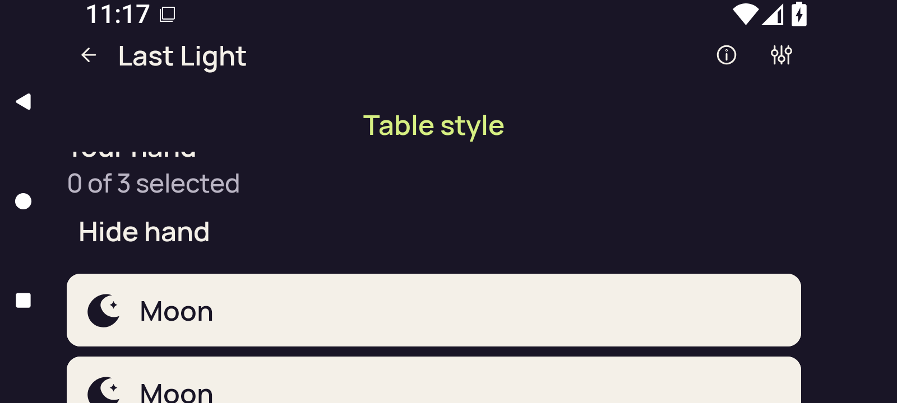</a>

`2d-seascape-baseline-first-card.png` · 1600 × 720 · 48,074 bytes.

SHA-256: `48360d3aa86641f585201bcd7e66e2c2a2258b8407e9072350018f80d857a808`.

**Preserved image; unviewed.** Original adaptive screenshot preserved without a direct pixel view or an independently established reviewed-byte representative in this bounded still publication. Runtime predicates do not supply a pixel verdict.

### 2d-seascape-baseline-public

`2d-seascape-baseline-public.png` · 1600 × 720 · 67,864 bytes.

SHA-256: `9e83b3fb2407356cbb4c3fcb735565036f60cfd3cb397c689b45f06c58d72046`.

**Preserved image; unviewed.** Original adaptive screenshot preserved without a direct pixel view or an independently established reviewed-byte representative in this bounded still publication. Runtime predicates do not supply a pixel verdict.

### 2d-seascape-baseline-selected

`2d-seascape-baseline-selected.png` · 1600 × 720 · 46,466 bytes.

SHA-256: `9ec24802509cb93e9e9638b544dd6d25069e6a07e76957bb207c37c21cc1d5f0`.

**Preserved image; unviewed.** Original adaptive screenshot preserved without a direct pixel view or an independently established reviewed-byte representative in this bounded still publication. Runtime predicates do not supply a pixel verdict.

### 2d-seascape-home

`2d-seascape-home.png` · 720 × 1600 · 79,391 bytes.

SHA-256: `dc60652ecc56c03a7644a822d2db1e5ef7eb2ce10ba9b9d2fd85670d9a4326c0`.

**Preserved image; unviewed.** Original adaptive screenshot preserved without a direct pixel view or an independently established reviewed-byte representative in this bounded still publication. Runtime predicates do not supply a pixel verdict.

### 2d-seascape-initial-native-ready

`2d-seascape-initial-native-ready.png` · 1600 × 720 · 74,822 bytes.

SHA-256: `14fa4486753ce6782308744620e2c67f3f10b204b737718770dd1d4d68e6872a`.

**Preserved image; unviewed.** Original adaptive screenshot preserved without a direct pixel view or an independently established reviewed-byte representative in this bounded still publication. Runtime predicates do not supply a pixel verdict.

### 2d-seascape-initial-selector

`2d-seascape-initial-selector.png` · 1600 × 720 · 48,569 bytes.

SHA-256: `d496a32baa1df9aeea6c97504ceeef9b3b5c0f9e377b25c80aabff064493b514`.

**Preserved image; unviewed.** Original adaptive screenshot preserved without a direct pixel view or an independently established reviewed-byte representative in this bounded still publication. Runtime predicates do not supply a pixel verdict.

### 2d-seascape-leave-confirmation

`2d-seascape-leave-confirmation.png` · 720 × 1600 · 60,842 bytes.

SHA-256: `8b031169c3c974584950b30fe066b6e47eb814836be60cb831c1855757643d6c`.

**Preserved image; unviewed.** Original adaptive screenshot preserved without a direct pixel view or an independently established reviewed-byte representative in this bounded still publication. Runtime predicates do not supply a pixel verdict.

### 2d-seascape-leave-native-ready

`2d-seascape-leave-native-ready.png` · 720 × 1600 · 122,385 bytes.

SHA-256: `653bdc46ad9cf7a0b4c32bc3dcb3f99d4419f3690d4af016dee369de17bca549`.

**Preserved image; unviewed.** Original adaptive screenshot preserved without a direct pixel view or an independently established reviewed-byte representative in this bounded still publication. Runtime predicates do not supply a pixel verdict.

### 2d-seascape-leave-selected

`2d-seascape-leave-selected.png` · 720 × 1600 · 78,328 bytes.

SHA-256: `c734fc5e91577683949910e5c5efb246eab98386245bdd831ec9c9232ece81ca`.

**Preserved image; unviewed.** Original adaptive screenshot preserved without a direct pixel view or an independently established reviewed-byte representative in this bounded still publication. Runtime predicates do not supply a pixel verdict.

### 2d-seascape-leave-selector

`2d-seascape-leave-selector.png` · 720 × 1600 · 96,689 bytes.

SHA-256: `64d119aaa73de7a6f566430c9b3d46306ec2f1ea297a212daa91dc32a3716ce3`.

**Preserved image; unviewed.** Original adaptive screenshot preserved without a direct pixel view or an independently established reviewed-byte representative in this bounded still publication. Runtime predicates do not supply a pixel verdict.

### 2d-seascape-portrait-native-ready

`2d-seascape-portrait-native-ready.png` · 720 × 1600 · 123,379 bytes.

SHA-256: `23e957f003819c1e57c0a9510611fab23a637ee3901c6c72f389ef26e910e354`.

**Preserved image; unviewed.** Original adaptive screenshot preserved without a direct pixel view or an independently established reviewed-byte representative in this bounded still publication. Runtime predicates do not supply a pixel verdict.

### 2d-seascape-portrait-selector

`2d-seascape-portrait-selector.png` · 720 × 1600 · 97,621 bytes.

SHA-256: `271fe8af4c71e6d4294ae97c34f64b85059e2b9000dc39f9bc2bf9139dbe5ed0`.

**Preserved image; unviewed.** Original adaptive screenshot preserved without a direct pixel view or an independently established reviewed-byte representative in this bounded still publication. Runtime predicates do not supply a pixel verdict.

### 2d-seascape-reentry-selected

`2d-seascape-reentry-selected.png` · 720 × 1600 · 79,273 bytes.

SHA-256: `3d348de6c425809daa0ca59ff3fc581d4001103177c5b4ce3d1e5eac8fbe1489`.

**Preserved image; unviewed.** Original adaptive screenshot preserved without a direct pixel view or an independently established reviewed-byte representative in this bounded still publication. Runtime predicates do not supply a pixel verdict.

### 2d-seascape-rotation-return-concealed

`2d-seascape-rotation-return-concealed.png` · 720 × 1600 · 129,307 bytes.

SHA-256: `55b9ed3f8af362aad1abe8b84086fa9d08c3d637417c416900772f3af9f3d5e1`.

**Preserved image; unviewed.** Original adaptive screenshot preserved without a direct pixel view or an independently established reviewed-byte representative in this bounded still publication. Runtime predicates do not supply a pixel verdict.

### 2d-seascape-rotation-return-first-card

`2d-seascape-rotation-return-first-card.png` · 720 × 1600 · 96,836 bytes.

SHA-256: `003e9da79d329935c66f7fef874172c02958d44aed3e18373a6d9c4f8912e8f6`.

**Preserved image; unviewed.** Original adaptive screenshot preserved without a direct pixel view or an independently established reviewed-byte representative in this bounded still publication. Runtime predicates do not supply a pixel verdict.

### 2d-seascape-rotation-return-public

`2d-seascape-rotation-return-public.png` · 720 × 1600 · 129,404 bytes.

SHA-256: `975e7de1a99cf763c3208c3d28935845887be6ce813f89351643257931aa7153`.

**Preserved image; unviewed.** Original adaptive screenshot preserved without a direct pixel view or an independently established reviewed-byte representative in this bounded still publication. Runtime predicates do not supply a pixel verdict.

### 2d-seascape-rotation-return-selection-cleared

`2d-seascape-rotation-return-selection-cleared.png` · 720 × 1600 · 116,069 bytes.

SHA-256: `ae082c1d1b729164bf5e708f59e12812b353e9942296615e2807c0f8a56ad248`.

**Preserved image; unviewed.** Original adaptive screenshot preserved without a direct pixel view or an independently established reviewed-byte representative in this bounded still publication. Runtime predicates do not supply a pixel verdict.

### 2d-seascape-standard-return-concealed

`2d-seascape-standard-return-concealed.png` · 720 × 1600 · 130,069 bytes.

SHA-256: `013f811bf97ab9f67549a2926573c067c7a4bc667e23cbaa65a8a6832a03f4ec`.

**Preserved image; unviewed.** Original adaptive screenshot preserved without a direct pixel view or an independently established reviewed-byte representative in this bounded still publication. Runtime predicates do not supply a pixel verdict.

### 2d-seascape-standard-return-first-card

`2d-seascape-standard-return-first-card.png` · 720 × 1600 · 96,559 bytes.

SHA-256: `21498de6c9949f0baf41fed1e1f67dce93ae01fbeb606de04226d65c2903e5c9`.

**Preserved image; unviewed.** Original adaptive screenshot preserved without a direct pixel view or an independently established reviewed-byte representative in this bounded still publication. Runtime predicates do not supply a pixel verdict.

### 2d-seascape-standard-return-public

`2d-seascape-standard-return-public.png` · 720 × 1600 · 130,069 bytes.

SHA-256: `013f811bf97ab9f67549a2926573c067c7a4bc667e23cbaa65a8a6832a03f4ec`.

**Preserved image; unviewed.** Original adaptive screenshot preserved without a direct pixel view or an independently established reviewed-byte representative in this bounded still publication. Runtime predicates do not supply a pixel verdict.

### 2d-seascape-standard-return-selection-cleared

`2d-seascape-standard-return-selection-cleared.png` · 720 × 1600 · 116,747 bytes.

SHA-256: `7fb7c02d57976cf30c5f41be73e8c2beac7f0a7d539298fbe352deb1aa0abf35`.

**Preserved image; unviewed.** Original adaptive screenshot preserved without a direct pixel view or an independently established reviewed-byte representative in this bounded still publication. Runtime predicates do not supply a pixel verdict.

### 2d-split-baseline-first-card

<a href="runtime/captures/2d-split-baseline-first-card.png">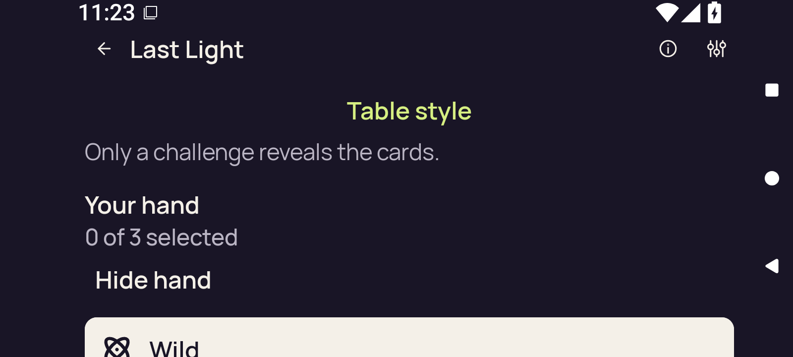</a>

`2d-split-baseline-first-card.png` · 1600 × 720 · 58,524 bytes.

SHA-256: `789436d5cb7f72d0f09d55b3a67faa0f173a3a3d92a81567c7d57630e50b142e`.

**Preserved image; unviewed.** Original adaptive screenshot preserved without a direct pixel view or an independently established reviewed-byte representative in this bounded still publication. Runtime predicates do not supply a pixel verdict.

### 2d-split-baseline-public

`2d-split-baseline-public.png` · 1600 × 720 · 74,566 bytes.

SHA-256: `7c386d62cc00e51a1ef9b87670d2904ed4036c41c59b83302009010d5716e47c`.

**Preserved image; unviewed.** Original adaptive screenshot preserved without a direct pixel view or an independently established reviewed-byte representative in this bounded still publication. Runtime predicates do not supply a pixel verdict.

### 2d-split-baseline-selected

`2d-split-baseline-selected.png` · 1600 × 720 · 48,427 bytes.

SHA-256: `6452f7bcb711409fdb5be6ab13cd947e3ddd06e048fd20003cedbd882fd3d9f2`.

**Preserved image; unviewed.** Original adaptive screenshot preserved without a direct pixel view or an independently established reviewed-byte representative in this bounded still publication. Runtime predicates do not supply a pixel verdict.

### 2d-split-entry-concealed

<a href="runtime/captures/2d-split-entry-concealed.png">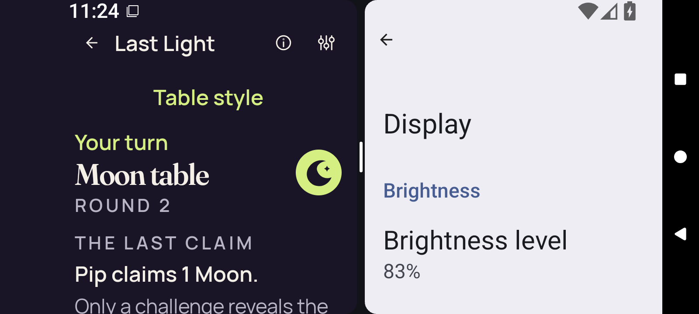</a>

`2d-split-entry-concealed.png` · 1600 × 720 · 97,327 bytes.

SHA-256: `8d3770c9586bdb496622a06a5d014ceaddca4e059c117c41659ded24c3d60ed5`.

**Preserved image; unviewed.** Original adaptive screenshot preserved without a direct pixel view or an independently established reviewed-byte representative in this bounded still publication. Runtime predicates do not supply a pixel verdict.

### 2d-split-entry-return-concealed

<a href="runtime/captures/2d-split-entry-return-concealed.png">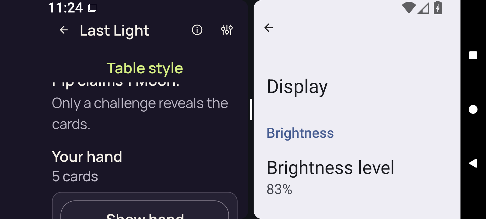</a>

`2d-split-entry-return-concealed.png` · 1600 × 720 · 81,735 bytes.

SHA-256: `5f078fec1ff3314f512306f15abaf9a941e7244dad7a1cac247226c36de572ce`.

**Preserved image; unviewed.** Original adaptive screenshot preserved without a direct pixel view or an independently established reviewed-byte representative in this bounded still publication. Runtime predicates do not supply a pixel verdict.

### 2d-split-entry-return-first-card

<a href="runtime/captures/2d-split-entry-return-first-card.png">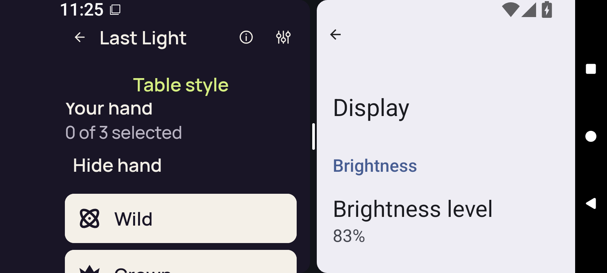</a>

`2d-split-entry-return-first-card.png` · 1600 × 720 · 75,441 bytes.

SHA-256: `44abc7e2e0db474884f5e4d9371d7f96a64cd9bd7c467bce187c12d63f66f69b`.

**Preserved image; unviewed.** Original adaptive screenshot preserved without a direct pixel view or an independently established reviewed-byte representative in this bounded still publication. Runtime predicates do not supply a pixel verdict.

### 2d-split-entry-return-public

<a href="runtime/captures/2d-split-entry-return-public.png">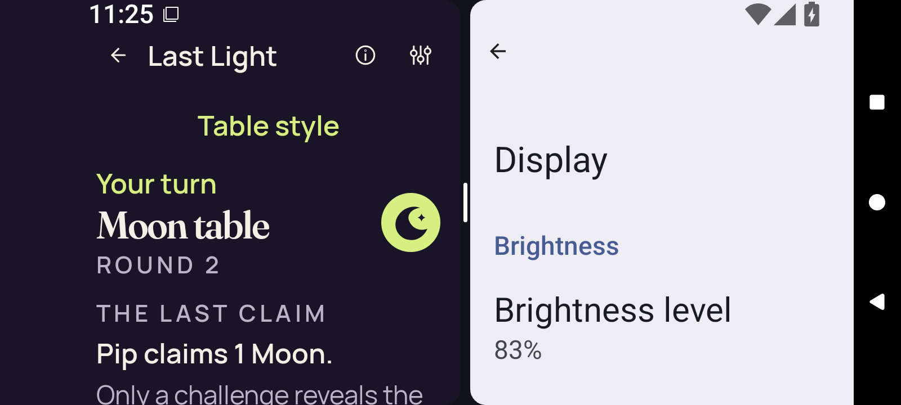</a>

`2d-split-entry-return-public.png` · 1600 × 720 · 97,677 bytes.

SHA-256: `79e2163b1b1500edfbae403fb905af7525c983f71e7950b367b624c6eee45378`.

**Preserved image; unviewed.** Original adaptive screenshot preserved without a direct pixel view or an independently established reviewed-byte representative in this bounded still publication. Runtime predicates do not supply a pixel verdict.

### 2d-split-entry-return-selection-cleared

<a href="runtime/captures/2d-split-entry-return-selection-cleared.png">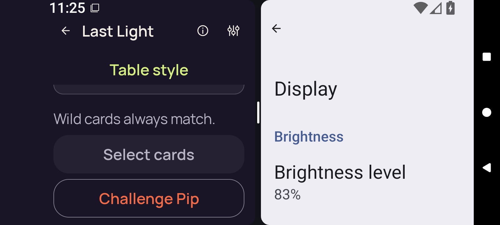</a>

`2d-split-entry-return-selection-cleared.png` · 1600 × 720 · 79,859 bytes.

SHA-256: `118e215bc8f2bf0a910a17946b48b23e276ec31f2c346a8a54424635efe33483`.

**Preserved image; unviewed.** Original adaptive screenshot preserved without a direct pixel view or an independently established reviewed-byte representative in this bounded still publication. Runtime predicates do not supply a pixel verdict.

### 2d-split-exit-concealed

`2d-split-exit-concealed.png` · 1600 × 720 · 74,559 bytes.

SHA-256: `b5a2f40b586279191c3537d1ec2bd536f02f0994dd367584aa96ab6a5bc2e5cb`.

**Preserved image; unviewed.** Original adaptive screenshot preserved without a direct pixel view or an independently established reviewed-byte representative in this bounded still publication. Runtime predicates do not supply a pixel verdict.

### 2d-split-exit-return-concealed

`2d-split-exit-return-concealed.png` · 1600 × 720 · 64,060 bytes.

SHA-256: `5da513246eb3748f1f42a58b9a67701e51ca63b0cb24de83bd8f54e3a81aa05b`.

**Preserved image; unviewed.** Original adaptive screenshot preserved without a direct pixel view or an independently established reviewed-byte representative in this bounded still publication. Runtime predicates do not supply a pixel verdict.

### 2d-split-exit-return-first-card

<a href="runtime/captures/2d-split-exit-return-first-card.png">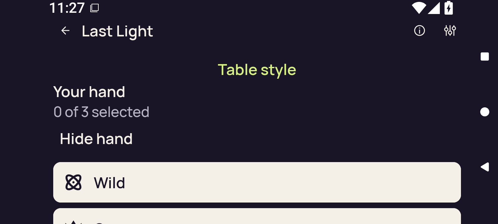</a>

`2d-split-exit-return-first-card.png` · 1600 × 720 · 50,036 bytes.

SHA-256: `4de428f22a379fe089c429eb8f0b1a61cb390bf27528d34e166c20504d0663cf`.

**Preserved image; unviewed.** Original adaptive screenshot preserved without a direct pixel view or an independently established reviewed-byte representative in this bounded still publication. Runtime predicates do not supply a pixel verdict.

### 2d-split-exit-return-public

`2d-split-exit-return-public.png` · 1600 × 720 · 74,071 bytes.

SHA-256: `3c7d782dd0603d52afa8663daaee6b8dd9a9808b280593bac1d6832b8f2e91bf`.

**Preserved image; unviewed.** Original adaptive screenshot preserved without a direct pixel view or an independently established reviewed-byte representative in this bounded still publication. Runtime predicates do not supply a pixel verdict.

### 2d-split-exit-return-selection-cleared

`2d-split-exit-return-selection-cleared.png` · 1600 × 720 · 72,987 bytes.

SHA-256: `99e9fb6d0380b51bf9bea6c40fada8c3754a4d65f73c71950c5bffc62f112e8b`.

**Preserved image; unviewed.** Original adaptive screenshot preserved without a direct pixel view or an independently established reviewed-byte representative in this bounded still publication. Runtime predicates do not supply a pixel verdict.

### 2d-split-full-native-ready

`2d-split-full-native-ready.png` · 1600 × 720 · 84,611 bytes.

SHA-256: `21730e6d047c5504c5ff6f63b3eaf96cf90578755b6227611e3f22b02ee35d22`.

**Preserved image; unviewed.** Original adaptive screenshot preserved without a direct pixel view or an independently established reviewed-byte representative in this bounded still publication. Runtime predicates do not supply a pixel verdict.

### 2d-split-full-selector

<a href="runtime/captures/2d-split-full-selector.png">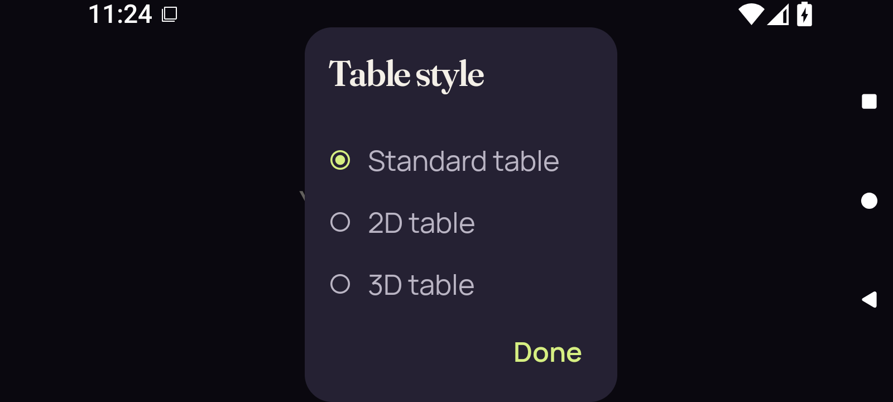</a>

`2d-split-full-selector.png` · 1600 × 720 · 48,370 bytes.

SHA-256: `8d191b4d998343217680671210e031c7939f0fe71b6aa2a325b364f7761af02f`.

**Preserved image; unviewed.** Original adaptive screenshot preserved without a direct pixel view or an independently established reviewed-byte representative in this bounded still publication. Runtime predicates do not supply a pixel verdict.

### 2d-split-home

`2d-split-home.png` · 1600 × 720 · 57,465 bytes.

SHA-256: `d6a813ed4506e8ba549ec5baccf5bd97e8fa45b261ff9ecfe6c602b0334652d4`.

**Preserved image; unviewed.** Original adaptive screenshot preserved without a direct pixel view or an independently established reviewed-byte representative in this bounded still publication. Runtime predicates do not supply a pixel verdict.

### 2d-split-leave-confirmation

`2d-split-leave-confirmation.png` · 1600 × 720 · 56,488 bytes.

SHA-256: `6df78f1349d88d6cf1623239c3656a34451b9634cfe2e8f4bd855093990ae57f`.

**Preserved image; unviewed.** Original adaptive screenshot preserved without a direct pixel view or an independently established reviewed-byte representative in this bounded still publication. Runtime predicates do not supply a pixel verdict.

### 2d-split-leave-native-ready

`2d-split-leave-native-ready.png` · 1600 × 720 · 85,374 bytes.

SHA-256: `32df928f59483023bb185ceba36a8ecc4c41adff4f34993d5a11aa5bec74c5ac`.

**Preserved image; unviewed.** Original adaptive screenshot preserved without a direct pixel view or an independently established reviewed-byte representative in this bounded still publication. Runtime predicates do not supply a pixel verdict.

### 2d-split-leave-selected

`2d-split-leave-selected.png` · 1600 × 720 · 51,825 bytes.

SHA-256: `41acb501121eac750bc80d1ab248052dd7a772e8302321ca38da1f47f9c52d10`.

**Preserved image; unviewed.** Original adaptive screenshot preserved without a direct pixel view or an independently established reviewed-byte representative in this bounded still publication. Runtime predicates do not supply a pixel verdict.

### 2d-split-leave-selector

`2d-split-leave-selector.png` · 1600 × 720 · 48,469 bytes.

SHA-256: `1af3f4e97d59ac93d00b864e11622fbf844dbf6f4ddb25d79dbfefc8f7cef0d9`.

**Preserved image; unviewed.** Original adaptive screenshot preserved without a direct pixel view or an independently established reviewed-byte representative in this bounded still publication. Runtime predicates do not supply a pixel verdict.

### 2d-split-pane-native-ready

<a href="runtime/captures/2d-split-pane-native-ready.png">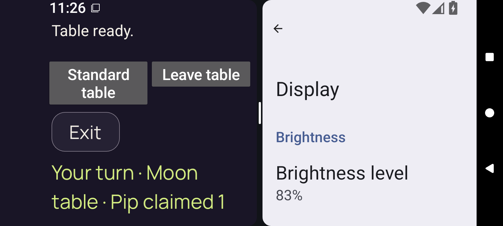</a>

`2d-split-pane-native-ready.png` · 1600 × 720 · 85,869 bytes.

SHA-256: `96073ac3ae4169a78a7ae41e5ba92db780a3afe2cc4b66e824f122a622488d07`.

**Preserved image; unviewed.** Original adaptive screenshot preserved without a direct pixel view or an independently established reviewed-byte representative in this bounded still publication. Runtime predicates do not supply a pixel verdict.

### 2d-split-pane-selector

`2d-split-pane-selector.png` · 1600 × 720 · 74,338 bytes.

SHA-256: `512ac88f22bf142110514774ed247645f87eb6616d7a08bdb5ac6b631d6c9262`.

**Preserved image; unviewed.** Original adaptive screenshot preserved without a direct pixel view or an independently established reviewed-byte representative in this bounded still publication. Runtime predicates do not supply a pixel verdict.

### 2d-split-reentry-selected

<a href="runtime/captures/2d-split-reentry-selected.png">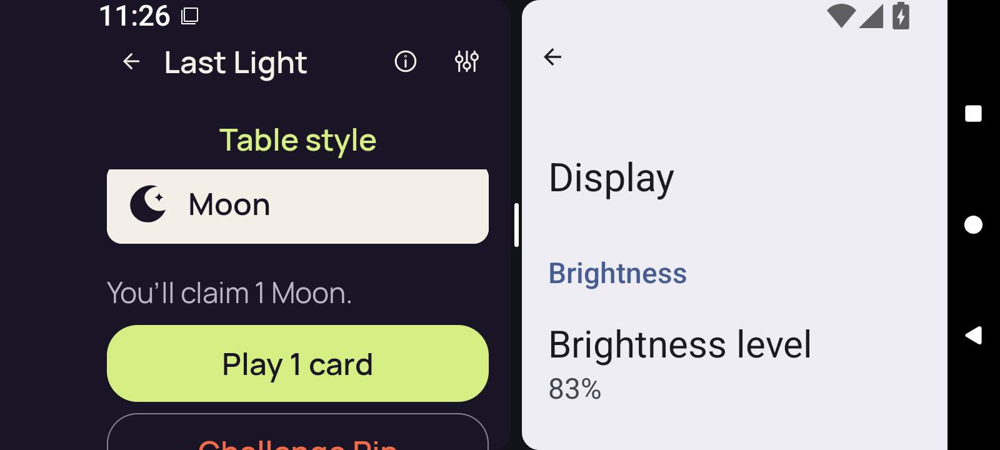</a>

`2d-split-reentry-selected.png` · 1600 × 720 · 73,824 bytes.

SHA-256: `79853d406413609e6443d3e5154edea505911ca05e5b543df1c88d0e758af4a9`.

**Preserved image; unviewed.** Original adaptive screenshot preserved without a direct pixel view or an independently established reviewed-byte representative in this bounded still publication. Runtime predicates do not supply a pixel verdict.

### 3d-landscape-after-up

`3d-landscape-after-up.png` · 720 × 1600 · 128,588 bytes.

SHA-256: `11f6f0a0029031b25a1ede102976fab8719d6851fa64819d3ed58359ea5aefd3`.

**Preserved image; unviewed.** Original adaptive screenshot preserved without a direct pixel view or an independently established reviewed-byte representative in this bounded still publication. Runtime predicates do not supply a pixel verdict.

### 3d-landscape-baseline-first-card

`3d-landscape-baseline-first-card.png` · 1600 × 720 · 57,567 bytes.

SHA-256: `4083a48e42fc68db3acfffd89a8ff0d96dbf27e37e16b2be2ea3174f33eae951`.

**Preserved image; unviewed.** Original adaptive screenshot preserved without a direct pixel view or an independently established reviewed-byte representative in this bounded still publication. Runtime predicates do not supply a pixel verdict.

### 3d-landscape-baseline-public

`3d-landscape-baseline-public.png` · 1600 × 720 · 74,798 bytes.

SHA-256: `a587081593302823961eb881a005ff1e8f5141e402919899541fd35a82d95591`.

**Preserved image; unviewed.** Original adaptive screenshot preserved without a direct pixel view or an independently established reviewed-byte representative in this bounded still publication. Runtime predicates do not supply a pixel verdict.

### 3d-landscape-baseline-selected

`3d-landscape-baseline-selected.png` · 1600 × 720 · 53,913 bytes.

SHA-256: `1fb09d01a4aebef47f8b3788ecb2c37e14adb6735b5204c53a59068fb99c8899`.

**Preserved image; unviewed.** Original adaptive screenshot preserved without a direct pixel view or an independently established reviewed-byte representative in this bounded still publication. Runtime predicates do not supply a pixel verdict.

### 3d-landscape-home

`3d-landscape-home.png` · 720 × 1600 · 79,964 bytes.

SHA-256: `f89e9eff2808e0da541bde6fad60196a11838299fdb2ac46317774ad34b506fb`.

**Preserved image; unviewed.** Original adaptive screenshot preserved without a direct pixel view or an independently established reviewed-byte representative in this bounded still publication. Runtime predicates do not supply a pixel verdict.

### 3d-landscape-initial-native-ready

`3d-landscape-initial-native-ready.png` · 1600 × 720 · 91,549 bytes.

SHA-256: `22dfd35c94caa11f440d35f460bbd0c9bedd1a818c01ffac1b9ff7ca1d30cd9a`.

**Preserved image; unviewed.** Original adaptive screenshot preserved without a direct pixel view or an independently established reviewed-byte representative in this bounded still publication. Runtime predicates do not supply a pixel verdict.

### 3d-landscape-initial-selector

`3d-landscape-initial-selector.png` · 1600 × 720 · 48,891 bytes.

SHA-256: `7810171baf71787cba07dd07dbceef95760366f1d223cb567df57b04ee4e2fc4`.

**Preserved image; unviewed.** Original adaptive screenshot preserved without a direct pixel view or an independently established reviewed-byte representative in this bounded still publication. Runtime predicates do not supply a pixel verdict.

### 3d-landscape-leave-confirmation

`3d-landscape-leave-confirmation.png` · 720 × 1600 · 61,617 bytes.

SHA-256: `8011bf3eaed8e441ce22136b6fdbed32c8df2902dd843cd9a65cd79f8faf3cd1`.

**Preserved image; unviewed.** Original adaptive screenshot preserved without a direct pixel view or an independently established reviewed-byte representative in this bounded still publication. Runtime predicates do not supply a pixel verdict.

### 3d-landscape-leave-native-ready

`3d-landscape-leave-native-ready.png` · 720 × 1600 · 205,618 bytes.

SHA-256: `f78d530037205aa2f67bf417f4c706f317e7ba6a32e6e917026bd88ebcfcc738`.

**Preserved image; unviewed.** Original adaptive screenshot preserved without a direct pixel view or an independently established reviewed-byte representative in this bounded still publication. Runtime predicates do not supply a pixel verdict.

### 3d-landscape-leave-selected

`3d-landscape-leave-selected.png` · 720 × 1600 · 82,770 bytes.

SHA-256: `3b6c1917a3bafed247ddfb03ca1a668223e6a28d5d21d935ce1a172860656234`.

**Preserved image; unviewed.** Original adaptive screenshot preserved without a direct pixel view or an independently established reviewed-byte representative in this bounded still publication. Runtime predicates do not supply a pixel verdict.

### 3d-landscape-leave-selector

`3d-landscape-leave-selector.png` · 720 × 1600 · 97,016 bytes.

SHA-256: `be7c67f81bc1bdecdf6f829d5cc830f1bf66b960cc83ab9bed7108bfe405db67`.

**Preserved image; unviewed.** Original adaptive screenshot preserved without a direct pixel view or an independently established reviewed-byte representative in this bounded still publication. Runtime predicates do not supply a pixel verdict.

### 3d-landscape-portrait-native-ready

`3d-landscape-portrait-native-ready.png` · 720 × 1600 · 206,447 bytes.

SHA-256: `5bc045dcfcafee5713ae3b9acabaa9e2fcecff522ccc1985937a3fee57a29e37`.

**Preserved image; unviewed.** Original adaptive screenshot preserved without a direct pixel view or an independently established reviewed-byte representative in this bounded still publication. Runtime predicates do not supply a pixel verdict.

### 3d-landscape-portrait-selector

`3d-landscape-portrait-selector.png` · 720 × 1600 · 97,677 bytes.

SHA-256: `bfcfc69678ca53ebb028696e1733817c94c71deddd1e345351a375844bc1ec73`.

**Preserved image; unviewed.** Original adaptive screenshot preserved without a direct pixel view or an independently established reviewed-byte representative in this bounded still publication. Runtime predicates do not supply a pixel verdict.

### 3d-landscape-reentry-selected

`3d-landscape-reentry-selected.png` · 720 × 1600 · 83,397 bytes.

SHA-256: `c57ccb62d18d592bc3fedd801132c4d5535331d053c5141a8f055e8cc4134c14`.

**Preserved image; unviewed.** Original adaptive screenshot preserved without a direct pixel view or an independently established reviewed-byte representative in this bounded still publication. Runtime predicates do not supply a pixel verdict.

### 3d-landscape-rotation-return-concealed

`3d-landscape-rotation-return-concealed.png` · 720 × 1600 · 128,588 bytes.

SHA-256: `11f6f0a0029031b25a1ede102976fab8719d6851fa64819d3ed58359ea5aefd3`.

**Preserved image; unviewed.** Original adaptive screenshot preserved without a direct pixel view or an independently established reviewed-byte representative in this bounded still publication. Runtime predicates do not supply a pixel verdict.

### 3d-landscape-rotation-return-first-card

`3d-landscape-rotation-return-first-card.png` · 720 × 1600 · 98,220 bytes.

SHA-256: `2f0bd965c98e1ef49a93b3637719d1db45abf953fdf252f042ec861a052ee17a`.

**Preserved image; unviewed.** Original adaptive screenshot preserved without a direct pixel view or an independently established reviewed-byte representative in this bounded still publication. Runtime predicates do not supply a pixel verdict.

### 3d-landscape-rotation-return-public

`3d-landscape-rotation-return-public.png` · 720 × 1600 · 129,247 bytes.

SHA-256: `68a8f9824c0fd237f57f97e0fae8af178dc41a86da4912392f1b49689d92acd9`.

**Preserved image; unviewed.** Original adaptive screenshot preserved without a direct pixel view or an independently established reviewed-byte representative in this bounded still publication. Runtime predicates do not supply a pixel verdict.

### 3d-landscape-rotation-return-selection-cleared

`3d-landscape-rotation-return-selection-cleared.png` · 720 × 1600 · 111,901 bytes.

SHA-256: `9c5aebab0fccabbfa67292c3593c3482753cd17a59db272844250afc619f11a2`.

**Preserved image; unviewed.** Original adaptive screenshot preserved without a direct pixel view or an independently established reviewed-byte representative in this bounded still publication. Runtime predicates do not supply a pixel verdict.

### 3d-landscape-standard-return-concealed

`3d-landscape-standard-return-concealed.png` · 720 × 1600 · 129,350 bytes.

SHA-256: `a7e96360d588bba2807ff53452522834bfd51cef7b6b5094afd25c6f1db91009`.

**Preserved image; unviewed.** Original adaptive screenshot preserved without a direct pixel view or an independently established reviewed-byte representative in this bounded still publication. Runtime predicates do not supply a pixel verdict.

### 3d-landscape-standard-return-first-card

`3d-landscape-standard-return-first-card.png` · 720 × 1600 · 97,600 bytes.

SHA-256: `d2c2d3e03dd1d1dc3a5efa08c73da5b956316039c2fa17ff4b21a979f425ada5`.

**Preserved image; unviewed.** Original adaptive screenshot preserved without a direct pixel view or an independently established reviewed-byte representative in this bounded still publication. Runtime predicates do not supply a pixel verdict.

### 3d-landscape-standard-return-public

`3d-landscape-standard-return-public.png` · 720 × 1600 · 128,606 bytes.

SHA-256: `17c40226bc88e9d34019a8333d052f35ada9fe6f0d1636a5f6becc0b14aad3f7`.

**Preserved image; unviewed.** Original adaptive screenshot preserved without a direct pixel view or an independently established reviewed-byte representative in this bounded still publication. Runtime predicates do not supply a pixel verdict.

### 3d-landscape-standard-return-selection-cleared

`3d-landscape-standard-return-selection-cleared.png` · 720 × 1600 · 113,139 bytes.

SHA-256: `d00a5c04fc6b579969c3acec853b0a13679bfeb31af6dec249adc2c2e7cbf5d0`.

**Preserved image; unviewed.** Original adaptive screenshot preserved without a direct pixel view or an independently established reviewed-byte representative in this bounded still publication. Runtime predicates do not supply a pixel verdict.

### 3d-seascape-after-up

`3d-seascape-after-up.png` · 720 × 1600 · 128,445 bytes.

SHA-256: `2e64feae30aed68cb3ffe4cb519210f900fef4bfd5d8e8331b63f61c0f432aaf`.

**Preserved image; unviewed.** Original adaptive screenshot preserved without a direct pixel view or an independently established reviewed-byte representative in this bounded still publication. Runtime predicates do not supply a pixel verdict.

### 3d-seascape-baseline-first-card

`3d-seascape-baseline-first-card.png` · 1600 × 720 · 48,445 bytes.

SHA-256: `f562d85e2ecbe02b3bf699eee39f21120ad5a3b7842263993e2069a240c2844d`.

**Preserved image; unviewed.** Original adaptive screenshot preserved without a direct pixel view or an independently established reviewed-byte representative in this bounded still publication. Runtime predicates do not supply a pixel verdict.

### 3d-seascape-baseline-public

`3d-seascape-baseline-public.png` · 1600 × 720 · 67,098 bytes.

SHA-256: `0414974e86cbc1a59d9dea1cb996e0e8bba7885050470acc249e6e3f2658a0c7`.

**Preserved image; unviewed.** Original adaptive screenshot preserved without a direct pixel view or an independently established reviewed-byte representative in this bounded still publication. Runtime predicates do not supply a pixel verdict.

### 3d-seascape-baseline-selected

`3d-seascape-baseline-selected.png` · 1600 × 720 · 47,439 bytes.

SHA-256: `7a53ea491c985576303848bb96b0602ab40e3335ab6a03289f38008d01edae3d`.

**Preserved image; unviewed.** Original adaptive screenshot preserved without a direct pixel view or an independently established reviewed-byte representative in this bounded still publication. Runtime predicates do not supply a pixel verdict.

### 3d-seascape-home

`3d-seascape-home.png` · 720 × 1600 · 80,560 bytes.

SHA-256: `2eb5f319ff73f0c015e3dd15379544725b04dfef9ccc1a0c6d246fb88d24a317`.

**Preserved image; unviewed.** Original adaptive screenshot preserved without a direct pixel view or an independently established reviewed-byte representative in this bounded still publication. Runtime predicates do not supply a pixel verdict.

### 3d-seascape-initial-native-ready

`3d-seascape-initial-native-ready.png` · 1600 × 720 · 94,041 bytes.

SHA-256: `64a99a8e306fd58c36c54ca252bbfee86d7f68d5a8a419bb4835d06ef9660d30`.

**Preserved image; unviewed.** Original adaptive screenshot preserved without a direct pixel view or an independently established reviewed-byte representative in this bounded still publication. Runtime predicates do not supply a pixel verdict.

### 3d-seascape-initial-selector

`3d-seascape-initial-selector.png` · 1600 × 720 · 49,156 bytes.

SHA-256: `a068181ac417ff1330bfd6c40ec01fa34da65a8783ce6712c65699b129e26987`.

**Preserved image; unviewed.** Original adaptive screenshot preserved without a direct pixel view or an independently established reviewed-byte representative in this bounded still publication. Runtime predicates do not supply a pixel verdict.

### 3d-seascape-leave-confirmation

`3d-seascape-leave-confirmation.png` · 720 × 1600 · 62,374 bytes.

SHA-256: `a02cce138f955bb7bdc1ed4260904f77fb1c1d3b09601b8ba8d7522dc0966e0c`.

**Preserved image; unviewed.** Original adaptive screenshot preserved without a direct pixel view or an independently established reviewed-byte representative in this bounded still publication. Runtime predicates do not supply a pixel verdict.

### 3d-seascape-leave-native-ready

`3d-seascape-leave-native-ready.png` · 720 × 1600 · 148,709 bytes.

SHA-256: `d4c3e97e9ce9565df77c590e7ca5b51bbf0fe5c659e0246cffa49507e680be97`.

**Preserved image; unviewed.** Original adaptive screenshot preserved without a direct pixel view or an independently established reviewed-byte representative in this bounded still publication. Runtime predicates do not supply a pixel verdict.

### 3d-seascape-leave-selected

`3d-seascape-leave-selected.png` · 720 × 1600 · 80,048 bytes.

SHA-256: `6c9785ba5e4521dc4fbd2ec0fe846fb22361927953709af3f935988531a89dae`.

**Preserved image; unviewed.** Original adaptive screenshot preserved without a direct pixel view or an independently established reviewed-byte representative in this bounded still publication. Runtime predicates do not supply a pixel verdict.

### 3d-seascape-leave-selector

`3d-seascape-leave-selector.png` · 720 × 1600 · 98,031 bytes.

SHA-256: `82d2f73e6b7bbf444ad9bf36a741cd7f3a98d105bf83babbd098c846e077bfb8`.

**Preserved image; unviewed.** Original adaptive screenshot preserved without a direct pixel view or an independently established reviewed-byte representative in this bounded still publication. Runtime predicates do not supply a pixel verdict.

### 3d-seascape-portrait-native-ready

`3d-seascape-portrait-native-ready.png` · 720 × 1600 · 148,206 bytes.

SHA-256: `5cd0d5893bda1f4af0f0b5388d0d3a63cdd2017c02cb0380d7df79dc74228364`.

**Preserved image; unviewed.** Original adaptive screenshot preserved without a direct pixel view or an independently established reviewed-byte representative in this bounded still publication. Runtime predicates do not supply a pixel verdict.

### 3d-seascape-portrait-selector

`3d-seascape-portrait-selector.png` · 720 × 1600 · 97,487 bytes.

SHA-256: `f1740e058c6a46c4a9751980ed7bed4293f698f992eb6341c5cecb7a3c51ef01`.

**Preserved image; unviewed.** Original adaptive screenshot preserved without a direct pixel view or an independently established reviewed-byte representative in this bounded still publication. Runtime predicates do not supply a pixel verdict.

### 3d-seascape-reentry-selected

`3d-seascape-reentry-selected.png` · 720 × 1600 · 79,521 bytes.

SHA-256: `c1cd5d3819f7b691d1530650b09aaefef753d57eca47af10f0f7a76566d72d73`.

**Preserved image; unviewed.** Original adaptive screenshot preserved without a direct pixel view or an independently established reviewed-byte representative in this bounded still publication. Runtime predicates do not supply a pixel verdict.

### 3d-seascape-rotation-return-concealed

`3d-seascape-rotation-return-concealed.png` · 720 × 1600 · 128,445 bytes.

SHA-256: `2e64feae30aed68cb3ffe4cb519210f900fef4bfd5d8e8331b63f61c0f432aaf`.

**Preserved image; unviewed.** Original adaptive screenshot preserved without a direct pixel view or an independently established reviewed-byte representative in this bounded still publication. Runtime predicates do not supply a pixel verdict.

### 3d-seascape-rotation-return-first-card

`3d-seascape-rotation-return-first-card.png` · 720 × 1600 · 95,920 bytes.

SHA-256: `8b47f0153d7e59bbd41e717e43e9fcf19accc883a384322465fd72f7a6620127`.

**Preserved image; unviewed.** Original adaptive screenshot preserved without a direct pixel view or an independently established reviewed-byte representative in this bounded still publication. Runtime predicates do not supply a pixel verdict.

### 3d-seascape-rotation-return-public

`3d-seascape-rotation-return-public.png` · 720 × 1600 · 128,445 bytes.

SHA-256: `2e64feae30aed68cb3ffe4cb519210f900fef4bfd5d8e8331b63f61c0f432aaf`.

**Preserved image; unviewed.** Original adaptive screenshot preserved without a direct pixel view or an independently established reviewed-byte representative in this bounded still publication. Runtime predicates do not supply a pixel verdict.

### 3d-seascape-rotation-return-selection-cleared

`3d-seascape-rotation-return-selection-cleared.png` · 720 × 1600 · 117,054 bytes.

SHA-256: `baee9d0969eaee51046e95f0ef7856434eca769e28cb785d70811f74602eb896`.

**Preserved image; unviewed.** Original adaptive screenshot preserved without a direct pixel view or an independently established reviewed-byte representative in this bounded still publication. Runtime predicates do not supply a pixel verdict.

### 3d-seascape-standard-return-concealed

`3d-seascape-standard-return-concealed.png` · 720 × 1600 · 128,041 bytes.

SHA-256: `5c9d929f857361bf71fbcb24722882b504a909c2996fc42471e0b34db3c5ebea`.

**Preserved image; unviewed.** Original adaptive screenshot preserved without a direct pixel view or an independently established reviewed-byte representative in this bounded still publication. Runtime predicates do not supply a pixel verdict.

### 3d-seascape-standard-return-first-card

`3d-seascape-standard-return-first-card.png` · 720 × 1600 · 96,565 bytes.

SHA-256: `c3c552aeeaf27db26bc20b1cf02ad42e677b63e8e08b1916a457dba0501d6ae8`.

**Preserved image; unviewed.** Original adaptive screenshot preserved without a direct pixel view or an independently established reviewed-byte representative in this bounded still publication. Runtime predicates do not supply a pixel verdict.

### 3d-seascape-standard-return-public

`3d-seascape-standard-return-public.png` · 720 × 1600 · 128,642 bytes.

SHA-256: `5cc67e3d04f51dffd46cac05c26576cd8245c0981ef2b24d43f85f40ee9ea8ab`.

**Preserved image; unviewed.** Original adaptive screenshot preserved without a direct pixel view or an independently established reviewed-byte representative in this bounded still publication. Runtime predicates do not supply a pixel verdict.

### 3d-seascape-standard-return-selection-cleared

`3d-seascape-standard-return-selection-cleared.png` · 720 × 1600 · 116,595 bytes.

SHA-256: `f260deef203d708c9c7f2ee2cff8ee28bcf1fb8a9b01270556983e6a686b8f30`.

**Preserved image; unviewed.** Original adaptive screenshot preserved without a direct pixel view or an independently established reviewed-byte representative in this bounded still publication. Runtime predicates do not supply a pixel verdict.

### 3d-split-baseline-first-card

<a href="runtime/captures/3d-split-baseline-first-card.png">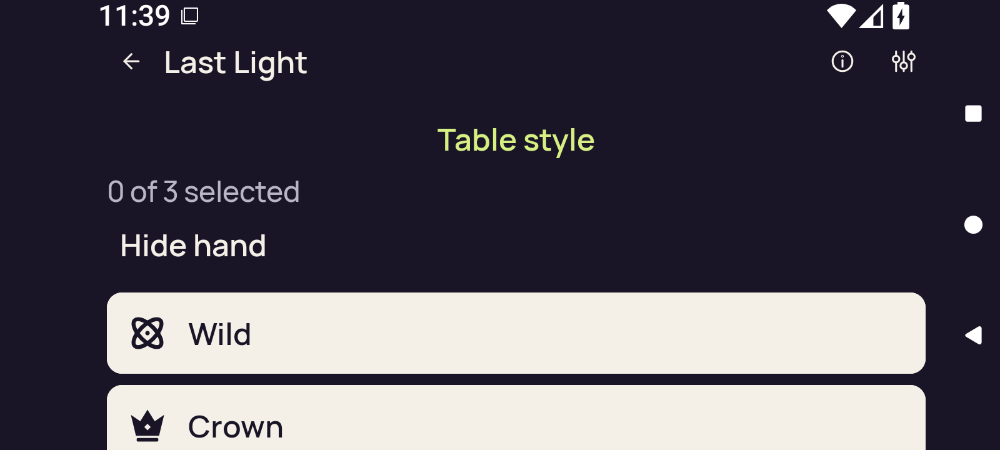</a>

`3d-split-baseline-first-card.png` · 1600 × 720 · 51,464 bytes.

SHA-256: `0f68eaf39012e7d6ccaeaf3c7e86f599924f30370a5a8f681dbd8ca8c0df1453`.

**Preserved image; unviewed.** Original adaptive screenshot preserved without a direct pixel view or an independently established reviewed-byte representative in this bounded still publication. Runtime predicates do not supply a pixel verdict.

### 3d-split-baseline-public

`3d-split-baseline-public.png` · 1600 × 720 · 74,375 bytes.

SHA-256: `424bc459c79b35b5ec89202873c5a912388e343e7d89ebbe651c4980c25a476c`.

**Preserved image; unviewed.** Original adaptive screenshot preserved without a direct pixel view or an independently established reviewed-byte representative in this bounded still publication. Runtime predicates do not supply a pixel verdict.

### 3d-split-baseline-selected

`3d-split-baseline-selected.png` · 1600 × 720 · 50,932 bytes.

SHA-256: `f14a3e199cae8b17a537b81bac3c0ccb46895442a5f8c763ba2521580f111c4d`.

**Preserved image; unviewed.** Original adaptive screenshot preserved without a direct pixel view or an independently established reviewed-byte representative in this bounded still publication. Runtime predicates do not supply a pixel verdict.

### 3d-split-entry-concealed

<a href="runtime/captures/3d-split-entry-concealed.png">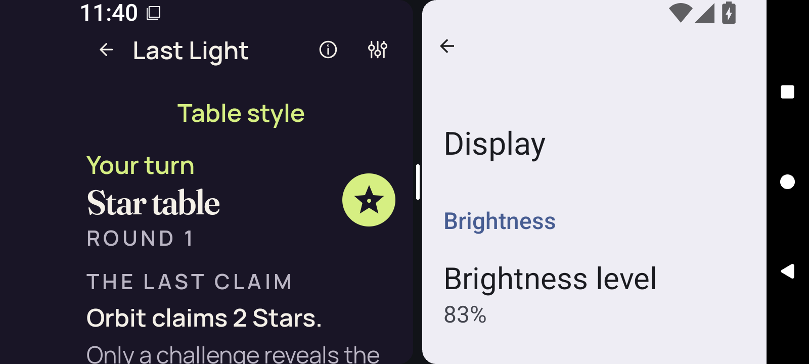</a>

`3d-split-entry-concealed.png` · 1600 × 720 · 97,483 bytes.

SHA-256: `199787fa8dfb275f8b8ff16e7e8d1024dcbdb236c37212e32a03299e1eaccd47`.

**Preserved image; unviewed.** Original adaptive screenshot preserved without a direct pixel view or an independently established reviewed-byte representative in this bounded still publication. Runtime predicates do not supply a pixel verdict.

### 3d-split-entry-return-concealed

<a href="runtime/captures/3d-split-entry-return-concealed.png">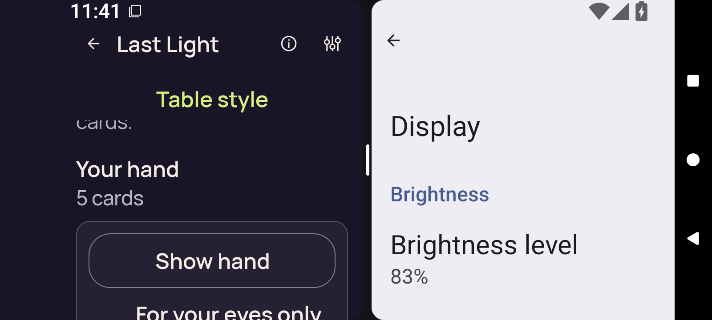</a>

`3d-split-entry-return-concealed.png` · 1600 × 720 · 77,396 bytes.

SHA-256: `919fb1cbb580f534d933487623bbb0eb03d74ce393f8db7ef7b803f0a5a17512`.

**Preserved image; unviewed.** Original adaptive screenshot preserved without a direct pixel view or an independently established reviewed-byte representative in this bounded still publication. Runtime predicates do not supply a pixel verdict.

### 3d-split-entry-return-first-card

<a href="runtime/captures/3d-split-entry-return-first-card.png">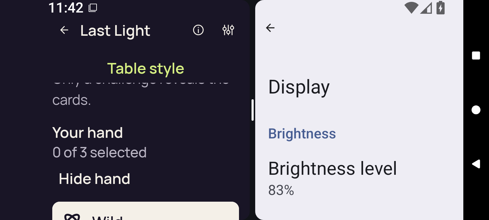</a>

`3d-split-entry-return-first-card.png` · 1600 × 720 · 74,573 bytes.

SHA-256: `c3e18ee4b5d6e78b6a90a9a0c39d89c63493719820a8a30541b1d0c5b35f275c`.

**Preserved image; unviewed.** Original adaptive screenshot preserved without a direct pixel view or an independently established reviewed-byte representative in this bounded still publication. Runtime predicates do not supply a pixel verdict.

### 3d-split-entry-return-public

<a href="runtime/captures/3d-split-entry-return-public.png">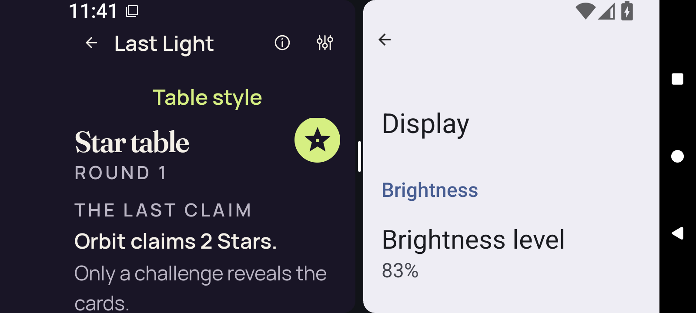</a>

`3d-split-entry-return-public.png` · 1600 × 720 · 97,412 bytes.

SHA-256: `bc20a76b40b6c76a1a7f566114c07fc0f98e56638f1d8ec95ac6a64190863b0e`.

**Preserved image; unviewed.** Original adaptive screenshot preserved without a direct pixel view or an independently established reviewed-byte representative in this bounded still publication. Runtime predicates do not supply a pixel verdict.

### 3d-split-entry-return-selection-cleared

<a href="runtime/captures/3d-split-entry-return-selection-cleared.png">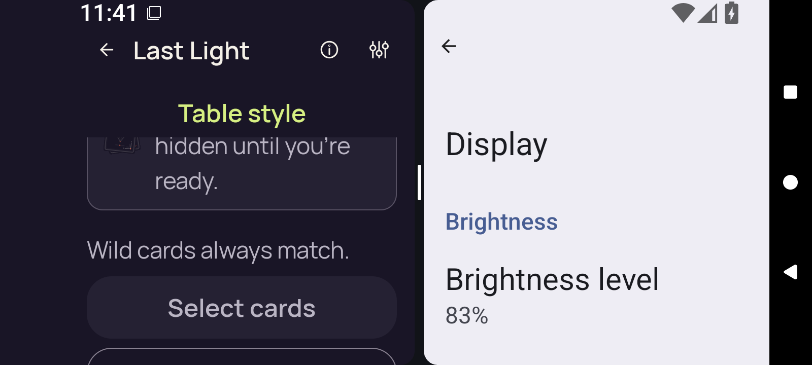</a>

`3d-split-entry-return-selection-cleared.png` · 1600 × 720 · 82,340 bytes.

SHA-256: `3259db0d68c9933fda5f26e2f68675beb5d1749a3db36878738aadf357af971e`.

**Preserved image; unviewed.** Original adaptive screenshot preserved without a direct pixel view or an independently established reviewed-byte representative in this bounded still publication. Runtime predicates do not supply a pixel verdict.

### 3d-split-exit-concealed

`3d-split-exit-concealed.png` · 1600 × 720 · 73,695 bytes.

SHA-256: `18c32ac2ed8c1c1f7e3baa600f33a748b221ec44374bae7d2b47c3a62d575e1d`.

**Preserved image; unviewed.** Original adaptive screenshot preserved without a direct pixel view or an independently established reviewed-byte representative in this bounded still publication. Runtime predicates do not supply a pixel verdict.

### 3d-split-exit-return-concealed

`3d-split-exit-return-concealed.png` · 1600 × 720 · 58,412 bytes.

SHA-256: `d2fa91058359e6d478baab018d3dd1640c16f4a2b6215d2c4b764069c251946e`.

**Preserved image; unviewed.** Original adaptive screenshot preserved without a direct pixel view or an independently established reviewed-byte representative in this bounded still publication. Runtime predicates do not supply a pixel verdict.

### 3d-split-exit-return-first-card

<a href="runtime/captures/3d-split-exit-return-first-card.png">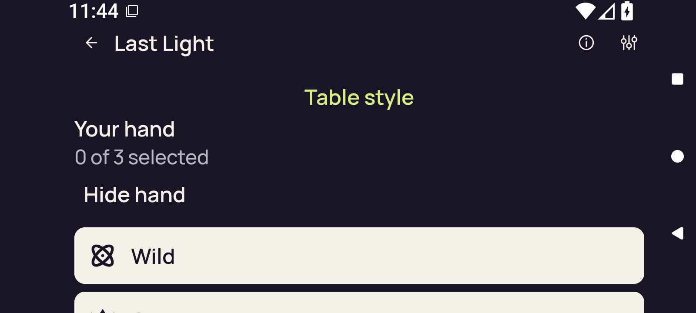</a>

`3d-split-exit-return-first-card.png` · 1600 × 720 · 48,930 bytes.

SHA-256: `c2ea759d9bb5476728b787ee73b6fedddba77ba5fbd5e3dd51fdacb95cae88dc`.

**Preserved image; unviewed.** Original adaptive screenshot preserved without a direct pixel view or an independently established reviewed-byte representative in this bounded still publication. Runtime predicates do not supply a pixel verdict.

### 3d-split-exit-return-public

`3d-split-exit-return-public.png` · 1600 × 720 · 72,666 bytes.

SHA-256: `088f185eef3eee47834825367461571e4b8b8dd58e07caae3d5da6d42eee73ce`.

**Preserved image; unviewed.** Original adaptive screenshot preserved without a direct pixel view or an independently established reviewed-byte representative in this bounded still publication. Runtime predicates do not supply a pixel verdict.

### 3d-split-exit-return-selection-cleared

`3d-split-exit-return-selection-cleared.png` · 1600 × 720 · 73,216 bytes.

SHA-256: `6b76ccbb89f5aab278d8206bf86ab0d7a2ad5843adfd73673a9548a5dfda5084`.

**Preserved image; unviewed.** Original adaptive screenshot preserved without a direct pixel view or an independently established reviewed-byte representative in this bounded still publication. Runtime predicates do not supply a pixel verdict.

### 3d-split-full-native-ready

<a href="runtime/captures/3d-split-full-native-ready.png">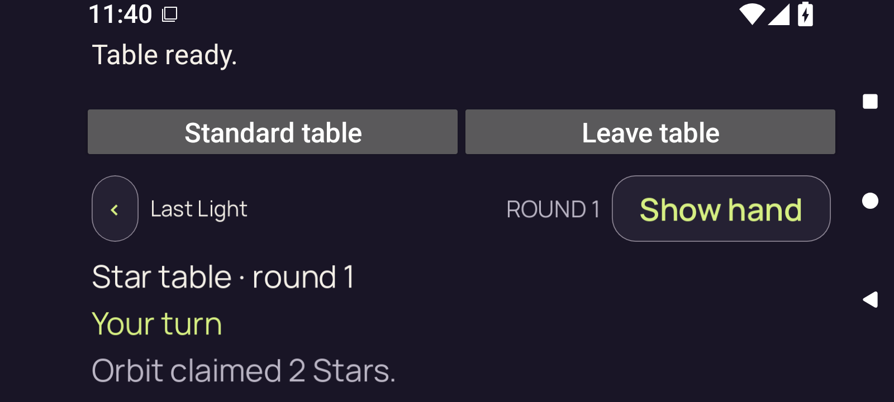</a>

`3d-split-full-native-ready.png` · 1600 × 720 · 91,970 bytes.

SHA-256: `0210576e43a53ad0d3e8dfbb6ea884260df338481384940a4666bc1eb09de792`.

**Preserved image; unviewed.** Original adaptive screenshot preserved without a direct pixel view or an independently established reviewed-byte representative in this bounded still publication. Runtime predicates do not supply a pixel verdict.

### 3d-split-full-selector

`3d-split-full-selector.png` · 1600 × 720 · 48,334 bytes.

SHA-256: `ce154bfdc386e9550261e58ca3acd6753f2e105f0e1571b8b369b014fbc06c74`.

**Preserved image; unviewed.** Original adaptive screenshot preserved without a direct pixel view or an independently established reviewed-byte representative in this bounded still publication. Runtime predicates do not supply a pixel verdict.

### 3d-split-home

`3d-split-home.png` · 1600 × 720 · 56,808 bytes.

SHA-256: `a7f82fdb367e6609f1c6e10f371858fb24ab5e7235bb001abbadd3bafc99e899`.

**Preserved image; unviewed.** Original adaptive screenshot preserved without a direct pixel view or an independently established reviewed-byte representative in this bounded still publication. Runtime predicates do not supply a pixel verdict.

### 3d-split-leave-confirmation

`3d-split-leave-confirmation.png` · 1600 × 720 · 55,688 bytes.

SHA-256: `0daa86d652c8147af5f9134a36a745c9e6df573bef505d34bbdba5da4b2665e1`.

**Preserved image; unviewed.** Original adaptive screenshot preserved without a direct pixel view or an independently established reviewed-byte representative in this bounded still publication. Runtime predicates do not supply a pixel verdict.

### 3d-split-leave-native-ready

`3d-split-leave-native-ready.png` · 1600 × 720 · 91,917 bytes.

SHA-256: `2e5cba062c0d1369373120c244b3d878219cf63d61b898e92d8f51f050af766f`.

**Preserved image; unviewed.** Original adaptive screenshot preserved without a direct pixel view or an independently established reviewed-byte representative in this bounded still publication. Runtime predicates do not supply a pixel verdict.

### 3d-split-leave-selected

`3d-split-leave-selected.png` · 1600 × 720 · 51,431 bytes.

SHA-256: `b01246561c6fb208c8e6bed1b4d6df39f316dc2bc088acbab5900bc8e4beacbf`.

**Preserved image; unviewed.** Original adaptive screenshot preserved without a direct pixel view or an independently established reviewed-byte representative in this bounded still publication. Runtime predicates do not supply a pixel verdict.

### 3d-split-leave-selector

`3d-split-leave-selector.png` · 1600 × 720 · 48,318 bytes.

SHA-256: `50fd161e5584361a120bb56b13b97abe6dd56bc6bff8871a2ef4867648635a1c`.

**Preserved image; unviewed.** Original adaptive screenshot preserved without a direct pixel view or an independently established reviewed-byte representative in this bounded still publication. Runtime predicates do not supply a pixel verdict.

### 3d-split-pane-native-ready

<a href="runtime/captures/3d-split-pane-native-ready.png">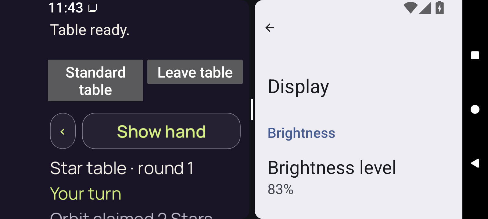</a>

`3d-split-pane-native-ready.png` · 1600 × 720 · 98,956 bytes.

SHA-256: `c73c9574e3d4d1e3be5d93a88ba23dd2c3cc24de87270962b1bc0179c050a519`.

**Preserved image; unviewed.** Original adaptive screenshot preserved without a direct pixel view or an independently established reviewed-byte representative in this bounded still publication. Runtime predicates do not supply a pixel verdict.

### 3d-split-pane-selector

<a href="runtime/captures/3d-split-pane-selector.png">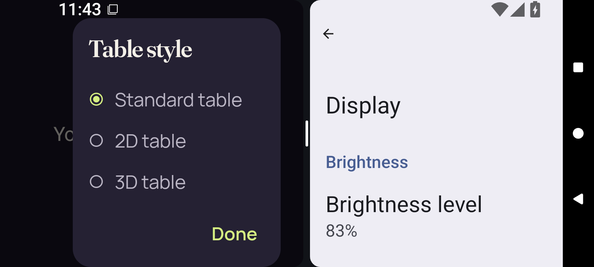</a>

`3d-split-pane-selector.png` · 1600 × 720 · 73,887 bytes.

SHA-256: `9e41478f6f10df84f0c16d4b531c3886954124d088f684e6b5b2fe3c5e32ddc6`.

**Preserved image; unviewed.** Original adaptive screenshot preserved without a direct pixel view or an independently established reviewed-byte representative in this bounded still publication. Runtime predicates do not supply a pixel verdict.

### 3d-split-reentry-selected

<a href="runtime/captures/3d-split-reentry-selected.png">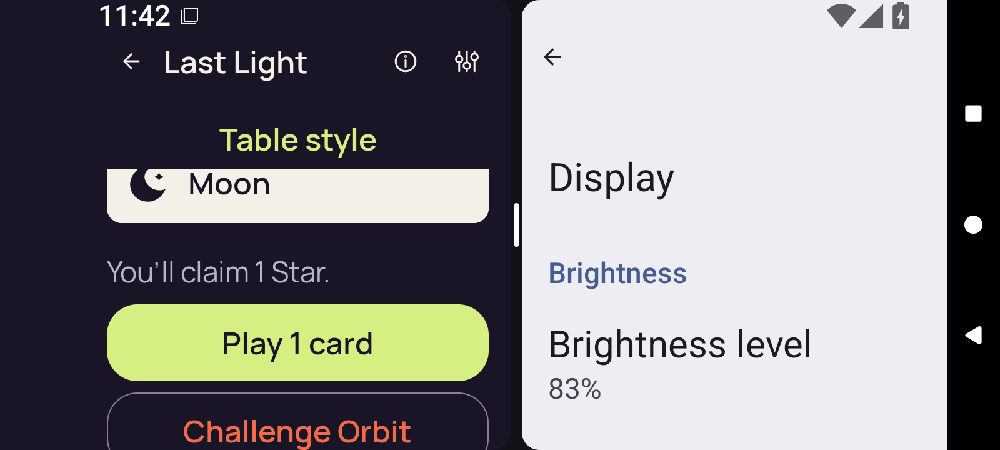</a>

`3d-split-reentry-selected.png` · 1600 × 720 · 78,659 bytes.

SHA-256: `ee0fe8aaf8716016296bbda78502fa9f7e643f450d9c41caf8833e16ac782376`.

**Preserved image; unviewed.** Original adaptive screenshot preserved without a direct pixel view or an independently established reviewed-byte representative in this bounded still publication. Runtime predicates do not supply a pixel verdict.

### final-diagnostic

`final-diagnostic.png` · 1600 × 720 · 56,808 bytes.

SHA-256: `a7f82fdb367e6609f1c6e10f371858fb24ab5e7235bb001abbadd3bafc99e899`.

**Preserved image; unviewed.** Original adaptive screenshot preserved without a direct pixel view or an independently established reviewed-byte representative in this bounded still publication. Runtime predicates do not supply a pixel verdict.

### home-cold

`home-cold.png` · 720 × 1600 · 78,688 bytes.

SHA-256: `d691f854e2f09f2421040d242a76ddb7e17e4114565fb97a19e0523bbb1012cf`.

**Preserved image; unviewed.** Original adaptive screenshot preserved without a direct pixel view or an independently established reviewed-byte representative in this bounded still publication. Runtime predicates do not supply a pixel verdict.

Original media companions and review receipts

| Preserved file | Bytes | SHA-256 |
| --- | ---: | --- |
| [debug/font-2.0/runtime/captures/2d-landscape-after-up.json](runtime/captures/2d-landscape-after-up.json) | 9,455 | `d58d136d1e3233faff34959917c56cb7dd022c2dbf15b8a8eebf14b19352c71e` |
| [debug/font-2.0/runtime/captures/2d-landscape-after-up.xml](runtime/captures/2d-landscape-after-up.xml) | 13,954 | `58f5b0b1d513cff70e4d7bb3bea77beb02081769108944606b58e8a197bda0c4` |
| [debug/font-2.0/runtime/captures/2d-landscape-baseline-first-card.json](runtime/captures/2d-landscape-baseline-first-card.json) | 9,492 | `8a198bd486fc9aef4cd7fe0316396eb93828fcc1dfd5e34b4ab09a2072abb0c1` |
| [debug/font-2.0/runtime/captures/2d-landscape-baseline-first-card.xml](runtime/captures/2d-landscape-baseline-first-card.xml) | 11,805 | `763020a3246c7f92689f67586e7a13899bbcc19fde10b9f2780136acc64b7260` |
| [debug/font-2.0/runtime/captures/2d-landscape-baseline-public.json](runtime/captures/2d-landscape-baseline-public.json) | 9,480 | `004f10289ef9c210533633688a7e97e2b0c38effa29deb437c6081bd430d38c9` |
| [debug/font-2.0/runtime/captures/2d-landscape-baseline-public.xml](runtime/captures/2d-landscape-baseline-public.xml) | 9,673 | `a4d940e790c905daafc1f3460d51d1dd5eb1e706f903c9fe53d4e3417343475f` |
| [debug/font-2.0/runtime/captures/2d-landscape-baseline-selected.json](runtime/captures/2d-landscape-baseline-selected.json) | 9,486 | `6eb1f5adc067a837a6f47ed5b31cd48e6c922bd9623b4b55ccf265d2ea2964be` |
| [debug/font-2.0/runtime/captures/2d-landscape-baseline-selected.xml](runtime/captures/2d-landscape-baseline-selected.xml) | 11,770 | `5f6b8232ad377cdd9519c56ae73280d7ebede5824bf46cd5fd02c70206c70bbb` |
| [debug/font-2.0/runtime/captures/2d-landscape-home.json](runtime/captures/2d-landscape-home.json) | 9,448 | `1d0651c9c542344273cbb0f028a8d626643d396a03c3b92eceddafaaa76523ac` |
| [debug/font-2.0/runtime/captures/2d-landscape-home.xml](runtime/captures/2d-landscape-home.xml) | 9,353 | `cbce6867a6c4d1e8bf8a685137f8aad7afd3db387bbf1c1beaf9e4d20fe1f661` |
| [debug/font-2.0/runtime/captures/2d-landscape-initial-native-ready.json](runtime/captures/2d-landscape-initial-native-ready.json) | 11,767 | `14e2e1c98dcdbe661344841b1f4a733b1fb421b4dab67f4b158bfb033f61edb0` |
| [debug/font-2.0/runtime/captures/2d-landscape-initial-native-ready.xml](runtime/captures/2d-landscape-initial-native-ready.xml) | 5,221 | `714c8130e1b1ede502c44e0c43dee6a88a13a6877b43e9d42be3981d26c4001b` |
| [debug/font-2.0/runtime/captures/2d-landscape-initial-selector.json](runtime/captures/2d-landscape-initial-selector.json) | 9,491 | `1b4e5bbe4dee82efaf5e148f09c92d418b06b2e669183bcd3c41d074826f80c3` |
| [debug/font-2.0/runtime/captures/2d-landscape-initial-selector.xml](runtime/captures/2d-landscape-initial-selector.xml) | 8,191 | `4a1a05efbdb351cac8fdd88c33705f64b4e9028fc44f0ed48c935826f212fc1f` |
| [debug/font-2.0/runtime/captures/2d-landscape-leave-confirmation.json](runtime/captures/2d-landscape-leave-confirmation.json) | 9,498 | `e77454ef4f6c1b3874ecf3b51dba83eea180a3e0625b1ba39754d55ce2c7dcb7` |
| [debug/font-2.0/runtime/captures/2d-landscape-leave-confirmation.xml](runtime/captures/2d-landscape-leave-confirmation.xml) | 5,809 | `b89c5d49046f101b527baa80099050a56ec58680bf1fe109d8e0fb52eaf98830` |
| [debug/font-2.0/runtime/captures/2d-landscape-leave-native-ready.json](runtime/captures/2d-landscape-leave-native-ready.json) | 11,770 | `c0b11db30c216db3a31fdc509956416bfed91498e59b31d90a80ad9a18833623` |
| [debug/font-2.0/runtime/captures/2d-landscape-leave-native-ready.xml](runtime/captures/2d-landscape-leave-native-ready.xml) | 5,203 | `661158f4c2e4ca1a1d6b19d63707d4429674b4f0caebfae3f089f57ca61f5369` |
| [debug/font-2.0/runtime/captures/2d-landscape-leave-selected.json](runtime/captures/2d-landscape-leave-selected.json) | 9,478 | `205ecf174fef65c8bdf0dfefc95ed3dcdcfa852c50eefe27364f1b0dd76da519` |
| [debug/font-2.0/runtime/captures/2d-landscape-leave-selected.xml](runtime/captures/2d-landscape-leave-selected.xml) | 18,400 | `742043a5991454dc1b8e6ec770fd9689d82a47c38229db652bb11c733495a602` |
| [debug/font-2.0/runtime/captures/2d-landscape-leave-selector.json](runtime/captures/2d-landscape-leave-selector.json) | 9,486 | `76c286e14fcfdf6800de7fec4f86ad55e02d74eab096a48485361e40a64c722f` |
| [debug/font-2.0/runtime/captures/2d-landscape-leave-selector.xml](runtime/captures/2d-landscape-leave-selector.xml) | 9,031 | `27a32e747c77d2e646d457301e1b087d6a338f5323c7641dc7907d885b94d94b` |
| [debug/font-2.0/runtime/captures/2d-landscape-portrait-native-ready.json](runtime/captures/2d-landscape-portrait-native-ready.json) | 11,786 | `b975619145fd8b2131a66951059f6708af3b4cb67a16481448c319acc1796bb5` |
| [debug/font-2.0/runtime/captures/2d-landscape-portrait-native-ready.xml](runtime/captures/2d-landscape-portrait-native-ready.xml) | 5,203 | `661158f4c2e4ca1a1d6b19d63707d4429674b4f0caebfae3f089f57ca61f5369` |
| [debug/font-2.0/runtime/captures/2d-landscape-portrait-selector.json](runtime/captures/2d-landscape-portrait-selector.json) | 9,502 | `16c66b1e3087e7fec6a2a000dded5222bee2275205e29e26ff76bf8897b9d7bb` |
| [debug/font-2.0/runtime/captures/2d-landscape-portrait-selector.xml](runtime/captures/2d-landscape-portrait-selector.xml) | 9,031 | `27a32e747c77d2e646d457301e1b087d6a338f5323c7641dc7907d885b94d94b` |
| [debug/font-2.0/runtime/captures/2d-landscape-reentry-selected.json](runtime/captures/2d-landscape-reentry-selected.json) | 9,491 | `092b51ac57c984c8ad8138f30f43e9a94b24fee7c54a534dc110a53e0bb5e9ef` |
| [debug/font-2.0/runtime/captures/2d-landscape-reentry-selected.xml](runtime/captures/2d-landscape-reentry-selected.xml) | 18,400 | `742043a5991454dc1b8e6ec770fd9689d82a47c38229db652bb11c733495a602` |
| [debug/font-2.0/runtime/captures/2d-landscape-rotation-return-concealed.json](runtime/captures/2d-landscape-rotation-return-concealed.json) | 9,506 | `0cd8b8e54c504b6246e86ab5400978b78b1a19858c3275b6cc1bad1193603a7a` |
| [debug/font-2.0/runtime/captures/2d-landscape-rotation-return-concealed.xml](runtime/captures/2d-landscape-rotation-return-concealed.xml) | 13,954 | `58f5b0b1d513cff70e4d7bb3bea77beb02081769108944606b58e8a197bda0c4` |
| [debug/font-2.0/runtime/captures/2d-landscape-rotation-return-first-card.json](runtime/captures/2d-landscape-rotation-return-first-card.json) | 9,509 | `fa92efbc21813d5477ff2427639a06ac33fa6439b7bcbd003e4904e7d13723a6` |
| [debug/font-2.0/runtime/captures/2d-landscape-rotation-return-first-card.xml](runtime/captures/2d-landscape-rotation-return-first-card.xml) | 16,016 | `9bf4785bf640ec25db7b2d0965677ae1e8549cf53b6a111ff113fa27eac9dfe7` |
| [debug/font-2.0/runtime/captures/2d-landscape-rotation-return-public.json](runtime/captures/2d-landscape-rotation-return-public.json) | 9,497 | `8a18ef71ff21bc35970d322ffd7651caa037a2c3844e25e8ef8c0ea3f10b80a1` |
| [debug/font-2.0/runtime/captures/2d-landscape-rotation-return-public.xml](runtime/captures/2d-landscape-rotation-return-public.xml) | 13,954 | `58f5b0b1d513cff70e4d7bb3bea77beb02081769108944606b58e8a197bda0c4` |
| [debug/font-2.0/runtime/captures/2d-landscape-rotation-return-selection-cleared.json](runtime/captures/2d-landscape-rotation-return-selection-cleared.json) | 9,530 | `f37d176c09a939eadbbd99554b4666e08f0afc2c4830d3c9b866d8f7474fa77e` |
| [debug/font-2.0/runtime/captures/2d-landscape-rotation-return-selection-cleared.xml](runtime/captures/2d-landscape-rotation-return-selection-cleared.xml) | 15,349 | `6350745d650fcf14654f8ea48fa031e96567e4353551913a4b5aca967af051c5` |
| [debug/font-2.0/runtime/captures/2d-landscape-standard-return-concealed.json](runtime/captures/2d-landscape-standard-return-concealed.json) | 9,518 | `9f1e74507ec449ed2c2f735e183dd251ed93cbfb91eb3e1f7d3df2e1b3fed20b` |
| [debug/font-2.0/runtime/captures/2d-landscape-standard-return-concealed.xml](runtime/captures/2d-landscape-standard-return-concealed.xml) | 13,954 | `58f5b0b1d513cff70e4d7bb3bea77beb02081769108944606b58e8a197bda0c4` |
| [debug/font-2.0/runtime/captures/2d-landscape-standard-return-first-card.json](runtime/captures/2d-landscape-standard-return-first-card.json) | 9,522 | `286895f85c760e6e3ab39e439b4b5432d9f209a517ca9c95b22a2bf373669317` |
| [debug/font-2.0/runtime/captures/2d-landscape-standard-return-first-card.xml](runtime/captures/2d-landscape-standard-return-first-card.xml) | 16,016 | `9bf4785bf640ec25db7b2d0965677ae1e8549cf53b6a111ff113fa27eac9dfe7` |
| [debug/font-2.0/runtime/captures/2d-landscape-standard-return-public.json](runtime/captures/2d-landscape-standard-return-public.json) | 9,510 | `d80f288ce6ad067c4e5bad86df9f5e6a03281b2f510c29e7da9bd1ce6bbfbcee` |
| [debug/font-2.0/runtime/captures/2d-landscape-standard-return-public.xml](runtime/captures/2d-landscape-standard-return-public.xml) | 13,954 | `58f5b0b1d513cff70e4d7bb3bea77beb02081769108944606b58e8a197bda0c4` |
| [debug/font-2.0/runtime/captures/2d-landscape-standard-return-selection-cleared.json](runtime/captures/2d-landscape-standard-return-selection-cleared.json) | 9,542 | `5ee612225eda5f2e3190e2b0046fc292268d03ddb66a910d9e14e95265167ca2` |
| [debug/font-2.0/runtime/captures/2d-landscape-standard-return-selection-cleared.xml](runtime/captures/2d-landscape-standard-return-selection-cleared.xml) | 15,349 | `752cccc25a6bb47a93eeffde7292a2225c5501c7138e9528df0e8d89fd1098b0` |
| [debug/font-2.0/runtime/captures/2d-seascape-after-up.json](runtime/captures/2d-seascape-after-up.json) | 9,460 | `12a36ee5916c106d1e328747b11988ab9b517ff3d0eb54e40e059bdf53f2fca7` |
| [debug/font-2.0/runtime/captures/2d-seascape-after-up.xml](runtime/captures/2d-seascape-after-up.xml) | 13,953 | `387756484541a1eac8dde9796394d75fffca212ef99f30f6fee9d3e214bb1d5d` |
| [debug/font-2.0/runtime/captures/2d-seascape-baseline-first-card.json](runtime/captures/2d-seascape-baseline-first-card.json) | 9,497 | `172f4718f0d4ddbafa87779a2da8b3e6001a519c74424fe355aa9f4ee482207a` |
| [debug/font-2.0/runtime/captures/2d-seascape-baseline-first-card.xml](runtime/captures/2d-seascape-baseline-first-card.xml) | 12,460 | `bfa7fd5c079d7ec7742c2cc57af7c39169d36f36a6474ec83a0d0af877375c03` |
| [debug/font-2.0/runtime/captures/2d-seascape-baseline-public.json](runtime/captures/2d-seascape-baseline-public.json) | 9,485 | `86f0432f04589ea528efd40749e654cd1642510a30e728a4fc457045587271d3` |
| [debug/font-2.0/runtime/captures/2d-seascape-baseline-public.xml](runtime/captures/2d-seascape-baseline-public.xml) | 9,670 | `35a5ccabdf3365bba4cc0d8a7f841512686734dc6cc1d00636afd89bc9d3e365` |
| [debug/font-2.0/runtime/captures/2d-seascape-baseline-selected.json](runtime/captures/2d-seascape-baseline-selected.json) | 9,491 | `1038a6851a5575cd247a5d7364495417be3137b09702934aeadd24f5d1dda968` |
| [debug/font-2.0/runtime/captures/2d-seascape-baseline-selected.xml](runtime/captures/2d-seascape-baseline-selected.xml) | 11,756 | `8d965fc3cd5c4051df34e379ce567ef9ad1c79b16f8a6b229997de9cd8836227` |
| [debug/font-2.0/runtime/captures/2d-seascape-home.json](runtime/captures/2d-seascape-home.json) | 9,452 | `03809b6177d230f76c577a31abd8622c76ba641e67f1f883479c1299d67c1994` |
| [debug/font-2.0/runtime/captures/2d-seascape-home.xml](runtime/captures/2d-seascape-home.xml) | 9,353 | `cbce6867a6c4d1e8bf8a685137f8aad7afd3db387bbf1c1beaf9e4d20fe1f661` |
| [debug/font-2.0/runtime/captures/2d-seascape-initial-native-ready.json](runtime/captures/2d-seascape-initial-native-ready.json) | 11,764 | `ce0a3c09d77977ea6628b124d622e74596f626e4172c483bda08d87ff9571c3c` |
| [debug/font-2.0/runtime/captures/2d-seascape-initial-native-ready.xml](runtime/captures/2d-seascape-initial-native-ready.xml) | 5,208 | `2746bff12d6c1197a90d096f9fc696c8dacc9181799507a9d36af5949025406c` |
| [debug/font-2.0/runtime/captures/2d-seascape-initial-selector.json](runtime/captures/2d-seascape-initial-selector.json) | 9,488 | `36687e0c2d54abe20b17fbb8c0a4e16408aa969bf63633f1cfc070dba8fdfa4e` |
| [debug/font-2.0/runtime/captures/2d-seascape-initial-selector.xml](runtime/captures/2d-seascape-initial-selector.xml) | 8,626 | `886377ac0bd9e661759259d7b1c162475d5fb8fc1d4213ec19e441e3720a8ca3` |
| [debug/font-2.0/runtime/captures/2d-seascape-leave-confirmation.json](runtime/captures/2d-seascape-leave-confirmation.json) | 9,494 | `5fdac5337c86e5b329e4228a8801d99f9ae65783add9a2a6070779b389dc614d` |
| [debug/font-2.0/runtime/captures/2d-seascape-leave-confirmation.xml](runtime/captures/2d-seascape-leave-confirmation.xml) | 5,809 | `b89c5d49046f101b527baa80099050a56ec58680bf1fe109d8e0fb52eaf98830` |
| [debug/font-2.0/runtime/captures/2d-seascape-leave-native-ready.json](runtime/captures/2d-seascape-leave-native-ready.json) | 11,766 | `480fb406d313eff2513c6050f0a0c1356f9795b96a3ee78cb77b0bbafe1e5d4a` |
| [debug/font-2.0/runtime/captures/2d-seascape-leave-native-ready.xml](runtime/captures/2d-seascape-leave-native-ready.xml) | 5,203 | `661158f4c2e4ca1a1d6b19d63707d4429674b4f0caebfae3f089f57ca61f5369` |
| [debug/font-2.0/runtime/captures/2d-seascape-leave-selected.json](runtime/captures/2d-seascape-leave-selected.json) | 9,482 | `209bb5a28e05b88b38c1ce65c89074c8a05ef81b626ed85deac517f362e468d8` |
| [debug/font-2.0/runtime/captures/2d-seascape-leave-selected.xml](runtime/captures/2d-seascape-leave-selected.xml) | 17,348 | `01b370efa139ba1c6bc8bdf280558a3687592f7d1a84b02285c47590fc31fbcc` |
| [debug/font-2.0/runtime/captures/2d-seascape-leave-selector.json](runtime/captures/2d-seascape-leave-selector.json) | 9,482 | `ffea9ffb40f73dadace6c3724d877fa50968fdcd0d0ff33e0dfb5959db19735e` |
| [debug/font-2.0/runtime/captures/2d-seascape-leave-selector.xml](runtime/captures/2d-seascape-leave-selector.xml) | 9,031 | `27a32e747c77d2e646d457301e1b087d6a338f5323c7641dc7907d885b94d94b` |
| [debug/font-2.0/runtime/captures/2d-seascape-portrait-native-ready.json](runtime/captures/2d-seascape-portrait-native-ready.json) | 11,783 | `cc16ca5910179698c208444d687e70b37a6781f9d539076614e87f0a3d6b4ea6` |
| [debug/font-2.0/runtime/captures/2d-seascape-portrait-native-ready.xml](runtime/captures/2d-seascape-portrait-native-ready.xml) | 5,203 | `661158f4c2e4ca1a1d6b19d63707d4429674b4f0caebfae3f089f57ca61f5369` |
| [debug/font-2.0/runtime/captures/2d-seascape-portrait-selector.json](runtime/captures/2d-seascape-portrait-selector.json) | 9,499 | `909475418b762ff2d757bec1c7754890989088f0166f6c0480fe1c28bcebfe7c` |
| [debug/font-2.0/runtime/captures/2d-seascape-portrait-selector.xml](runtime/captures/2d-seascape-portrait-selector.xml) | 9,031 | `27a32e747c77d2e646d457301e1b087d6a338f5323c7641dc7907d885b94d94b` |
| [debug/font-2.0/runtime/captures/2d-seascape-reentry-selected.json](runtime/captures/2d-seascape-reentry-selected.json) | 9,496 | `36c023f2c033fca38677b12171e0050b74eafddc314f634430d98668499117d3` |
| [debug/font-2.0/runtime/captures/2d-seascape-reentry-selected.xml](runtime/captures/2d-seascape-reentry-selected.xml) | 17,348 | `01b370efa139ba1c6bc8bdf280558a3687592f7d1a84b02285c47590fc31fbcc` |
| [debug/font-2.0/runtime/captures/2d-seascape-rotation-return-concealed.json](runtime/captures/2d-seascape-rotation-return-concealed.json) | 9,511 | `2603996ad45bff188c4f21560d82a588a0f01ed0edff5010ff29aeca257ac6b8` |
| [debug/font-2.0/runtime/captures/2d-seascape-rotation-return-concealed.xml](runtime/captures/2d-seascape-rotation-return-concealed.xml) | 13,953 | `387756484541a1eac8dde9796394d75fffca212ef99f30f6fee9d3e214bb1d5d` |
| [debug/font-2.0/runtime/captures/2d-seascape-rotation-return-first-card.json](runtime/captures/2d-seascape-rotation-return-first-card.json) | 9,514 | `88e6b19f2d51eb48ea59e1ffe594df5d47b4717e6a9a9a0e51b54cecd5c797cf` |
| [debug/font-2.0/runtime/captures/2d-seascape-rotation-return-first-card.xml](runtime/captures/2d-seascape-rotation-return-first-card.xml) | 16,016 | `e540af7e49d4c96a5843b2bcb3c6000a55c4cac33feb7b2dc42434676293d1b9` |
| [debug/font-2.0/runtime/captures/2d-seascape-rotation-return-public.json](runtime/captures/2d-seascape-rotation-return-public.json) | 9,502 | `04e5ff9280e965e833525544a4e2285e7b256dbadd0063673081a700f8927499` |
| [debug/font-2.0/runtime/captures/2d-seascape-rotation-return-public.xml](runtime/captures/2d-seascape-rotation-return-public.xml) | 13,953 | `387756484541a1eac8dde9796394d75fffca212ef99f30f6fee9d3e214bb1d5d` |
| [debug/font-2.0/runtime/captures/2d-seascape-rotation-return-selection-cleared.json](runtime/captures/2d-seascape-rotation-return-selection-cleared.json) | 9,535 | `50a1d8a36a80b3d4a844c0cd7cb789b981be650e0bdb8bbde3dd374a1eeaac3c` |
| [debug/font-2.0/runtime/captures/2d-seascape-rotation-return-selection-cleared.xml](runtime/captures/2d-seascape-rotation-return-selection-cleared.xml) | 14,656 | `be9ffa65b10afb6839faaf56857e52ff7292a10784fea8e3d326cfd3ea1774ae` |
| [debug/font-2.0/runtime/captures/2d-seascape-standard-return-concealed.json](runtime/captures/2d-seascape-standard-return-concealed.json) | 9,523 | `1af876a1f1042c7d1952b750674383ec72a59e39de54df8de0bc9949052f3540` |
| [debug/font-2.0/runtime/captures/2d-seascape-standard-return-concealed.xml](runtime/captures/2d-seascape-standard-return-concealed.xml) | 13,953 | `387756484541a1eac8dde9796394d75fffca212ef99f30f6fee9d3e214bb1d5d` |
| [debug/font-2.0/runtime/captures/2d-seascape-standard-return-first-card.json](runtime/captures/2d-seascape-standard-return-first-card.json) | 9,526 | `b12f26c99b43fde24f730f7ae1d3d193ca1593cb073bccc1bd5b8780cf280152` |
| [debug/font-2.0/runtime/captures/2d-seascape-standard-return-first-card.xml](runtime/captures/2d-seascape-standard-return-first-card.xml) | 16,016 | `e540af7e49d4c96a5843b2bcb3c6000a55c4cac33feb7b2dc42434676293d1b9` |
| [debug/font-2.0/runtime/captures/2d-seascape-standard-return-public.json](runtime/captures/2d-seascape-standard-return-public.json) | 9,514 | `cef98f0257752e098cd44377089496dc6251f21876d1729ba040dc30f780f0c1` |
| [debug/font-2.0/runtime/captures/2d-seascape-standard-return-public.xml](runtime/captures/2d-seascape-standard-return-public.xml) | 13,953 | `387756484541a1eac8dde9796394d75fffca212ef99f30f6fee9d3e214bb1d5d` |
| [debug/font-2.0/runtime/captures/2d-seascape-standard-return-selection-cleared.json](runtime/captures/2d-seascape-standard-return-selection-cleared.json) | 9,547 | `20f4a0477a2cc26e4940da62873afdd6dd6c28750024f2bf4d187cecc439e8c2` |
| [debug/font-2.0/runtime/captures/2d-seascape-standard-return-selection-cleared.xml](runtime/captures/2d-seascape-standard-return-selection-cleared.xml) | 14,656 | `be9ffa65b10afb6839faaf56857e52ff7292a10784fea8e3d326cfd3ea1774ae` |
| [debug/font-2.0/runtime/captures/2d-split-baseline-first-card.json](runtime/captures/2d-split-baseline-first-card.json) | 11,275 | `9e98d273cd61829fedcf92ac984199ae075da9d68847526616511a9dfc24e9e9` |
| [debug/font-2.0/runtime/captures/2d-split-baseline-first-card.xml](runtime/captures/2d-split-baseline-first-card.xml) | 11,437 | `60db4b8449ccc7c3bbfc238c15b87fe01b4336172910acbe94a634374e2a2401` |
| [debug/font-2.0/runtime/captures/2d-split-baseline-public.json](runtime/captures/2d-split-baseline-public.json) | 11,263 | `e3859cc093580dc7e1379e775e8a9441f8b3bdf9c3f3c532bef65af5d266e84b` |
| [debug/font-2.0/runtime/captures/2d-split-baseline-public.xml](runtime/captures/2d-split-baseline-public.xml) | 10,032 | `095457ddfb9d16355cd6e78d3321f1fe0fa2e8ebc9e67b3b70fa39a3fec0eb13` |
| [debug/font-2.0/runtime/captures/2d-split-baseline-selected.json](runtime/captures/2d-split-baseline-selected.json) | 11,269 | `6e675be3fa06523421fbc56f99cc95b3e56364063553636714adec13ad6e1173` |
| [debug/font-2.0/runtime/captures/2d-split-baseline-selected.xml](runtime/captures/2d-split-baseline-selected.xml) | 11,771 | `6ded57440ff6e03821b2d181d27d45d81daa5d8527be194fd45101567684504b` |
| [debug/font-2.0/runtime/captures/2d-split-entry-concealed.json](runtime/captures/2d-split-entry-concealed.json) | 11,263 | `32956a81e9424b3877cb3b16bfe45446a8d3437f95d6f4154d5edb02ff7c2c8d` |
| [debug/font-2.0/runtime/captures/2d-split-entry-concealed.xml](runtime/captures/2d-split-entry-concealed.xml) | 10,006 | `c5e52692064c7fab6499bc41253b9c22a84fb60de2cd7b726b151dcdaaaa5cc0` |
| [debug/font-2.0/runtime/captures/2d-split-entry-return-concealed.json](runtime/captures/2d-split-entry-return-concealed.json) | 11,284 | `e90faf6cb2507af0ee95af32a0b6625b330848293249e1a5f4f3b7a4475058be` |
| [debug/font-2.0/runtime/captures/2d-split-entry-return-concealed.xml](runtime/captures/2d-split-entry-return-concealed.xml) | 10,711 | `f3bdeecf2b06aa6d96f1ffcd81bd585393871f72d76f2172ebfe7209e46ef5d7` |
| [debug/font-2.0/runtime/captures/2d-split-entry-return-first-card.json](runtime/captures/2d-split-entry-return-first-card.json) | 11,287 | `4c4568a68dcff72e898678ef2306f790210f901536b33310355d69792870efc7` |
| [debug/font-2.0/runtime/captures/2d-split-entry-return-first-card.xml](runtime/captures/2d-split-entry-return-first-card.xml) | 12,432 | `ccc9f29834e0bea3022a90202ccf589ee408152569fdee609d95f0d93a4a845c` |
| [debug/font-2.0/runtime/captures/2d-split-entry-return-public.json](runtime/captures/2d-split-entry-return-public.json) | 11,275 | `556600ea49acb6d3cdbb75cd824c525d248f623ffdb4b0f5d45723e9c402790e` |
| [debug/font-2.0/runtime/captures/2d-split-entry-return-public.xml](runtime/captures/2d-split-entry-return-public.xml) | 10,006 | `c5e52692064c7fab6499bc41253b9c22a84fb60de2cd7b726b151dcdaaaa5cc0` |
| [debug/font-2.0/runtime/captures/2d-split-entry-return-selection-cleared.json](runtime/captures/2d-split-entry-return-selection-cleared.json) | 11,308 | `5733a68c4a3aac937086851c8c87623572aafe3414bf9f8646f97ebccccd2e82` |
| [debug/font-2.0/runtime/captures/2d-split-entry-return-selection-cleared.xml](runtime/captures/2d-split-entry-return-selection-cleared.xml) | 11,078 | `591b3d188b14fe24bbb131120b2e5b7b71a9e8da530fa5208d6f89e5639c9f3d` |
| [debug/font-2.0/runtime/captures/2d-split-exit-concealed.json](runtime/captures/2d-split-exit-concealed.json) | 11,267 | `8b7983a8f5482d24edd6f22669b6243c350343348dab5ad2bdf60c9b66bfe7f9` |
| [debug/font-2.0/runtime/captures/2d-split-exit-concealed.xml](runtime/captures/2d-split-exit-concealed.xml) | 10,032 | `095457ddfb9d16355cd6e78d3321f1fe0fa2e8ebc9e67b3b70fa39a3fec0eb13` |
| [debug/font-2.0/runtime/captures/2d-split-exit-return-concealed.json](runtime/captures/2d-split-exit-return-concealed.json) | 11,288 | `3861463b0b5d772e01c96c76278d852cb31c6df2d469184148d53ba102bbf305` |
| [debug/font-2.0/runtime/captures/2d-split-exit-return-concealed.xml](runtime/captures/2d-split-exit-return-concealed.xml) | 11,423 | `a70b17b77014e93a8746b34cfe128140ea085b700ec39be9277f3b5a9a83d580` |
| [debug/font-2.0/runtime/captures/2d-split-exit-return-first-card.json](runtime/captures/2d-split-exit-return-first-card.json) | 11,291 | `dca8242e4ecfa798f8ff23ddec47810a37ec381023d00f265a615af1751c97c8` |
| [debug/font-2.0/runtime/captures/2d-split-exit-return-first-card.xml](runtime/captures/2d-split-exit-return-first-card.xml) | 12,464 | `84c0cc57fd1d7674fc3df0ee3201c595df7ab4b87211c63edeca15a8938ba642` |
| [debug/font-2.0/runtime/captures/2d-split-exit-return-public.json](runtime/captures/2d-split-exit-return-public.json) | 11,279 | `69bd8602600830bd041583934738f1d7244964bffebdb5144f3ebaa8c2942763` |
| [debug/font-2.0/runtime/captures/2d-split-exit-return-public.xml](runtime/captures/2d-split-exit-return-public.xml) | 10,032 | `095457ddfb9d16355cd6e78d3321f1fe0fa2e8ebc9e67b3b70fa39a3fec0eb13` |
| [debug/font-2.0/runtime/captures/2d-split-exit-return-selection-cleared.json](runtime/captures/2d-split-exit-return-selection-cleared.json) | 11,312 | `57917cab57689bb92d5db3a8005b618827c7c224d7d16ccb2795fc71635ae3b4` |
| [debug/font-2.0/runtime/captures/2d-split-exit-return-selection-cleared.xml](runtime/captures/2d-split-exit-return-selection-cleared.xml) | 12,157 | `edb1fcb6a5b0880d7572d9a70605e2212bf6c253f09847b309c3dee269dd9270` |
| [debug/font-2.0/runtime/captures/2d-split-full-native-ready.json](runtime/captures/2d-split-full-native-ready.json) | 13,541 | `3825a275607cee75dd79c3173b817958fe31046e42e0227aa0132bffe5e98d3e` |
| [debug/font-2.0/runtime/captures/2d-split-full-native-ready.xml](runtime/captures/2d-split-full-native-ready.xml) | 5,221 | `714c8130e1b1ede502c44e0c43dee6a88a13a6877b43e9d42be3981d26c4001b` |
| [debug/font-2.0/runtime/captures/2d-split-full-selector.json](runtime/captures/2d-split-full-selector.json) | 11,257 | `e917d8dab179461dff946d29d00df8fb4e98710ba8692617b55429881d2efe28` |
| [debug/font-2.0/runtime/captures/2d-split-full-selector.xml](runtime/captures/2d-split-full-selector.xml) | 8,628 | `dbdeb910cfd15df414d7609ea3f8f8fec9bdd0aee96d8b50ab05040162bf472a` |
| [debug/font-2.0/runtime/captures/2d-split-home.json](runtime/captures/2d-split-home.json) | 11,242 | `528016d00a680c70b8ecc14d4eab436513adad36100a0fafc7b05586d28ced4e` |
| [debug/font-2.0/runtime/captures/2d-split-home.xml](runtime/captures/2d-split-home.xml) | 7,602 | `c8c00f6289c6d6800e423fc1d69b27dfb0f18967a759361ea8433d1939b9cfad` |
| [debug/font-2.0/runtime/captures/2d-split-leave-confirmation.json](runtime/captures/2d-split-leave-confirmation.json) | 11,284 | `6abfc6c80ace0754a0a0483e7ecef568ea6c8709a61cbc9e9e004194a2ee07dd` |
| [debug/font-2.0/runtime/captures/2d-split-leave-confirmation.xml](runtime/captures/2d-split-leave-confirmation.xml) | 5,807 | `43c3079c1b71c787c9b029ec1eeb1d6bf27c5e1fc49695be542ce1e3a27a1d2c` |
| [debug/font-2.0/runtime/captures/2d-split-leave-native-ready.json](runtime/captures/2d-split-leave-native-ready.json) | 13,564 | `f59a331619ddcea60d30b5a577aa11411b13b39b903521e21cca96a402a88839` |
| [debug/font-2.0/runtime/captures/2d-split-leave-native-ready.xml](runtime/captures/2d-split-leave-native-ready.xml) | 5,221 | `714c8130e1b1ede502c44e0c43dee6a88a13a6877b43e9d42be3981d26c4001b` |
| [debug/font-2.0/runtime/captures/2d-split-leave-selected.json](runtime/captures/2d-split-leave-selected.json) | 11,272 | `c2c10c08be2eaef8c2c220e37a18bccac20b09aff5cb1d6b0ce0cc3a32d77fe9` |
| [debug/font-2.0/runtime/captures/2d-split-leave-selected.xml](runtime/captures/2d-split-leave-selected.xml) | 11,771 | `eb537e214974759a484a6d1e2986dfa2cb284236d21e036c1cbb1c5c6f46621a` |
| [debug/font-2.0/runtime/captures/2d-split-leave-selector.json](runtime/captures/2d-split-leave-selector.json) | 11,272 | `9aa0c3baa63e6afae6e2cf69e102720be5788d27c0160cf7777cc4124a184f34` |
| [debug/font-2.0/runtime/captures/2d-split-leave-selector.xml](runtime/captures/2d-split-leave-selector.xml) | 8,628 | `660c152c7e0428ec9cebbc15b809a589af04f0a80d81ed270d77f1fd73aadaa6` |
| [debug/font-2.0/runtime/captures/2d-split-pane-native-ready.json](runtime/captures/2d-split-pane-native-ready.json) | 13,556 | `d930b57d5f67825c0fb9c0f874fb62a48f3eebc605e8e27aa96952f9aad768ec` |
| [debug/font-2.0/runtime/captures/2d-split-pane-native-ready.xml](runtime/captures/2d-split-pane-native-ready.xml) | 4,833 | `98da51a825b9d8cdeaec410149e0dd45452be9a27b6e65bb5817e6deb10ee070` |
| [debug/font-2.0/runtime/captures/2d-split-pane-selector.json](runtime/captures/2d-split-pane-selector.json) | 11,264 | `9009fa33d1153e443777521be84f2b4df7c1f34bfdbc69378f6ebc2dee43015b` |
| [debug/font-2.0/runtime/captures/2d-split-pane-selector.xml](runtime/captures/2d-split-pane-selector.xml) | 8,171 | `0e37e7b461d7106e42d5b0365e01a97127dae9c714b87b29e4cd6cfc82fbfc87` |
| [debug/font-2.0/runtime/captures/2d-split-reentry-selected.json](runtime/captures/2d-split-reentry-selected.json) | 11,273 | `004a5b4c7186dbc7979788201052309116256d07f3405d23b3cf3fcc08bbe16b` |
| [debug/font-2.0/runtime/captures/2d-split-reentry-selected.xml](runtime/captures/2d-split-reentry-selected.xml) | 11,739 | `ce11ab94069619455ad4443444b248838fa78f72e4ff4b19bf33efef511bb4e1` |
| [debug/font-2.0/runtime/captures/3d-landscape-after-up.json](runtime/captures/3d-landscape-after-up.json) | 11,254 | `2cde68ec5f332f783cba96a5dbea11ad52d3520d881ff4b1e2885c6cf6fc506c` |
| [debug/font-2.0/runtime/captures/3d-landscape-after-up.xml](runtime/captures/3d-landscape-after-up.xml) | 13,942 | `305a110c2f58a53362dacbdf61aa30eec1233603dd4359ad12f126487e77c443` |
| [debug/font-2.0/runtime/captures/3d-landscape-baseline-first-card.json](runtime/captures/3d-landscape-baseline-first-card.json) | 11,291 | `88c1cc8bbf2797c9a4e222c1737104048a37744f0603da4375cdfc14d275dcca` |
| [debug/font-2.0/runtime/captures/3d-landscape-baseline-first-card.xml](runtime/captures/3d-landscape-baseline-first-card.xml) | 11,437 | `9d6312368f5ae4c261dc209d483e1a08c487aba6cee7d9f06b6ef0d79f854a0f` |
| [debug/font-2.0/runtime/captures/3d-landscape-baseline-public.json](runtime/captures/3d-landscape-baseline-public.json) | 11,279 | `f622f53126217a8844b260a6956733b6b7f3f23319d58bb92b22832648b2631b` |
| [debug/font-2.0/runtime/captures/3d-landscape-baseline-public.xml](runtime/captures/3d-landscape-baseline-public.xml) | 10,035 | `cfc471a47743169587c4b40aeed064719b5aae60afb9c26f7820f1e5564219b7` |
| [debug/font-2.0/runtime/captures/3d-landscape-baseline-selected.json](runtime/captures/3d-landscape-baseline-selected.json) | 11,285 | `32e5f929517f8473efcd27dfb940ead2e0e1f1968a726ed54e7d88f980c66d30` |
| [debug/font-2.0/runtime/captures/3d-landscape-baseline-selected.xml](runtime/captures/3d-landscape-baseline-selected.xml) | 11,775 | `34a51299d604dbc83573a4f46d8018bcc9d5bd72ceb52dc06c8f0c2211c3246c` |
| [debug/font-2.0/runtime/captures/3d-landscape-home.json](runtime/captures/3d-landscape-home.json) | 11,246 | `fda3fe1d4f8423f340db15d1c84aca5c73b5463592caf5da8e556b1871ac8ede` |
| [debug/font-2.0/runtime/captures/3d-landscape-home.xml](runtime/captures/3d-landscape-home.xml) | 9,353 | `cbce6867a6c4d1e8bf8a685137f8aad7afd3db387bbf1c1beaf9e4d20fe1f661` |
| [debug/font-2.0/runtime/captures/3d-landscape-initial-native-ready.json](runtime/captures/3d-landscape-initial-native-ready.json) | 13,574 | `a2ebf1e741ba5e7262b6edf791670d019629469d04ae57326a8c574e14aed567` |
| [debug/font-2.0/runtime/captures/3d-landscape-initial-native-ready.xml](runtime/captures/3d-landscape-initial-native-ready.xml) | 5,221 | `714c8130e1b1ede502c44e0c43dee6a88a13a6877b43e9d42be3981d26c4001b` |
| [debug/font-2.0/runtime/captures/3d-landscape-initial-selector.json](runtime/captures/3d-landscape-initial-selector.json) | 11,282 | `ea4ec60e1c9da3e50c40057d7ca9edb677f7e255087f491907754ca215913ea7` |
| [debug/font-2.0/runtime/captures/3d-landscape-initial-selector.xml](runtime/captures/3d-landscape-initial-selector.xml) | 8,191 | `4a1a05efbdb351cac8fdd88c33705f64b4e9028fc44f0ed48c935826f212fc1f` |
| [debug/font-2.0/runtime/captures/3d-landscape-leave-confirmation.json](runtime/captures/3d-landscape-leave-confirmation.json) | 11,288 | `f15c22cbb0a9a20bf6fc17a9637ee6db3d104b360df01e62b2f9faf41decd273` |
| [debug/font-2.0/runtime/captures/3d-landscape-leave-confirmation.xml](runtime/captures/3d-landscape-leave-confirmation.xml) | 5,809 | `b89c5d49046f101b527baa80099050a56ec58680bf1fe109d8e0fb52eaf98830` |
| [debug/font-2.0/runtime/captures/3d-landscape-leave-native-ready.json](runtime/captures/3d-landscape-leave-native-ready.json) | 13,568 | `5b1dcdc0ceadc238759cdafaec4b7eb3d71fcd19d7cd682395512467e8e65cb2` |
| [debug/font-2.0/runtime/captures/3d-landscape-leave-native-ready.xml](runtime/captures/3d-landscape-leave-native-ready.xml) | 5,203 | `661158f4c2e4ca1a1d6b19d63707d4429674b4f0caebfae3f089f57ca61f5369` |
| [debug/font-2.0/runtime/captures/3d-landscape-leave-selected.json](runtime/captures/3d-landscape-leave-selected.json) | 11,276 | `cf1dc4e29e2bd9f4a4c836d1f74c6b02ecfab975abe65f62d8006e77a2bcde36` |
| [debug/font-2.0/runtime/captures/3d-landscape-leave-selected.xml](runtime/captures/3d-landscape-leave-selected.xml) | 18,074 | `9e2ed9f7aeb2152869ee14d5fd366ba534c09747857b26b8e54b88c7616614d5` |
| [debug/font-2.0/runtime/captures/3d-landscape-leave-selector.json](runtime/captures/3d-landscape-leave-selector.json) | 11,276 | `f07f0fa50e60c2c8325a1becbb41b0eada43f0b6617a0943e52f66bc653e8d10` |
| [debug/font-2.0/runtime/captures/3d-landscape-leave-selector.xml](runtime/captures/3d-landscape-leave-selector.xml) | 9,031 | `27a32e747c77d2e646d457301e1b087d6a338f5323c7641dc7907d885b94d94b` |
| [debug/font-2.0/runtime/captures/3d-landscape-portrait-native-ready.json](runtime/captures/3d-landscape-portrait-native-ready.json) | 13,585 | `5ce03df8bbeb3315575df7282c78bb630cfebbbaf8f9169d7215d8019418e446` |
| [debug/font-2.0/runtime/captures/3d-landscape-portrait-native-ready.xml](runtime/captures/3d-landscape-portrait-native-ready.xml) | 5,203 | `661158f4c2e4ca1a1d6b19d63707d4429674b4f0caebfae3f089f57ca61f5369` |
| [debug/font-2.0/runtime/captures/3d-landscape-portrait-selector.json](runtime/captures/3d-landscape-portrait-selector.json) | 11,293 | `71fb053e46c93f0372f4bfe17e47eef7cd63deb301d90f70d3b0ac6fed105694` |
| [debug/font-2.0/runtime/captures/3d-landscape-portrait-selector.xml](runtime/captures/3d-landscape-portrait-selector.xml) | 9,031 | `27a32e747c77d2e646d457301e1b087d6a338f5323c7641dc7907d885b94d94b` |
| [debug/font-2.0/runtime/captures/3d-landscape-reentry-selected.json](runtime/captures/3d-landscape-reentry-selected.json) | 11,290 | `8f518249e580a73df86c9643e872075b9fd7cf9d0fcd5b81ddef949f595d3e6e` |
| [debug/font-2.0/runtime/captures/3d-landscape-reentry-selected.xml](runtime/captures/3d-landscape-reentry-selected.xml) | 18,074 | `9e2ed9f7aeb2152869ee14d5fd366ba534c09747857b26b8e54b88c7616614d5` |
| [debug/font-2.0/runtime/captures/3d-landscape-rotation-return-concealed.json](runtime/captures/3d-landscape-rotation-return-concealed.json) | 11,305 | `3c9689046dc7b754b8b04f95aa6236d25dfd9f1301b2885dea6fec98d6cd197d` |
| [debug/font-2.0/runtime/captures/3d-landscape-rotation-return-concealed.xml](runtime/captures/3d-landscape-rotation-return-concealed.xml) | 13,942 | `305a110c2f58a53362dacbdf61aa30eec1233603dd4359ad12f126487e77c443` |
| [debug/font-2.0/runtime/captures/3d-landscape-rotation-return-first-card.json](runtime/captures/3d-landscape-rotation-return-first-card.json) | 11,308 | `508640c59f9a938bb2c2eba2406c2013ec0fa1ea0b08e73a2c6a647560898c9d` |
| [debug/font-2.0/runtime/captures/3d-landscape-rotation-return-first-card.xml](runtime/captures/3d-landscape-rotation-return-first-card.xml) | 16,034 | `1085384adc8e2952f8b73ee6e390d6b5c6ab28fd88e48e7b42784123200a715b` |
| [debug/font-2.0/runtime/captures/3d-landscape-rotation-return-public.json](runtime/captures/3d-landscape-rotation-return-public.json) | 11,296 | `2216f16fc4e806d390ac51b3091cb98a840ef059de237faeee6ac424df3bc1a2` |
| [debug/font-2.0/runtime/captures/3d-landscape-rotation-return-public.xml](runtime/captures/3d-landscape-rotation-return-public.xml) | 13,942 | `305a110c2f58a53362dacbdf61aa30eec1233603dd4359ad12f126487e77c443` |
| [debug/font-2.0/runtime/captures/3d-landscape-rotation-return-selection-cleared.json](runtime/captures/3d-landscape-rotation-return-selection-cleared.json) | 11,329 | `df8a07b9f3854c379e6aa972122664610e12c66dc9cf0ff631d57cb1871a2822` |
| [debug/font-2.0/runtime/captures/3d-landscape-rotation-return-selection-cleared.xml](runtime/captures/3d-landscape-rotation-return-selection-cleared.xml) | 15,358 | `1927af1bcec0731291607bbef3d1a182e954f0c773f4b30850251c2477c65d21` |
| [debug/font-2.0/runtime/captures/3d-landscape-standard-return-concealed.json](runtime/captures/3d-landscape-standard-return-concealed.json) | 11,317 | `bc48118a8d4d76d174c2c7d91f45e8bc0d8d1679a2a7c24f52de3c357903e674` |
| [debug/font-2.0/runtime/captures/3d-landscape-standard-return-concealed.xml](runtime/captures/3d-landscape-standard-return-concealed.xml) | 13,942 | `305a110c2f58a53362dacbdf61aa30eec1233603dd4359ad12f126487e77c443` |
| [debug/font-2.0/runtime/captures/3d-landscape-standard-return-first-card.json](runtime/captures/3d-landscape-standard-return-first-card.json) | 11,320 | `8a47b94aee704040da6d41e9a8ae43de77feaa6a5b2499ed48d0f215381a5eeb` |
| [debug/font-2.0/runtime/captures/3d-landscape-standard-return-first-card.xml](runtime/captures/3d-landscape-standard-return-first-card.xml) | 16,034 | `1085384adc8e2952f8b73ee6e390d6b5c6ab28fd88e48e7b42784123200a715b` |
| [debug/font-2.0/runtime/captures/3d-landscape-standard-return-public.json](runtime/captures/3d-landscape-standard-return-public.json) | 11,308 | `aa691c49b6a017bb109f4ec46be9a32c691e4fc816c2b3d2fbec430058fbba98` |
| [debug/font-2.0/runtime/captures/3d-landscape-standard-return-public.xml](runtime/captures/3d-landscape-standard-return-public.xml) | 13,942 | `305a110c2f58a53362dacbdf61aa30eec1233603dd4359ad12f126487e77c443` |
| [debug/font-2.0/runtime/captures/3d-landscape-standard-return-selection-cleared.json](runtime/captures/3d-landscape-standard-return-selection-cleared.json) | 11,341 | `3c1cc65e33f2bd937cf777cb0cbd85452a34c7f432ab2a178f1435844aa47e7e` |
| [debug/font-2.0/runtime/captures/3d-landscape-standard-return-selection-cleared.xml](runtime/captures/3d-landscape-standard-return-selection-cleared.xml) | 15,356 | `dc25bcfac5b3f5a65bccce9c0fc4c728629adc608b09bff7522b567994dc4ae3` |
| [debug/font-2.0/runtime/captures/3d-seascape-after-up.json](runtime/captures/3d-seascape-after-up.json) | 11,250 | `283ab58306378710211ac35162aa5a238d8c203b9f3e276d5e718e1d78eee7b6` |
| [debug/font-2.0/runtime/captures/3d-seascape-after-up.xml](runtime/captures/3d-seascape-after-up.xml) | 13,953 | `9dd882cf6d28a04183e8087962e1518943ce941f61073b635ef407c83725bdcd` |
| [debug/font-2.0/runtime/captures/3d-seascape-baseline-first-card.json](runtime/captures/3d-seascape-baseline-first-card.json) | 11,287 | `382c84455ae7b91d2fa98c38841281e3d1258079b41576ef2fd6955fd231cb74` |
| [debug/font-2.0/runtime/captures/3d-seascape-baseline-first-card.xml](runtime/captures/3d-seascape-baseline-first-card.xml) | 11,441 | `ad6a66f96191c73708802543cf75fc8b9db25f58b092f763b00fe4c4cae437c9` |
| [debug/font-2.0/runtime/captures/3d-seascape-baseline-public.json](runtime/captures/3d-seascape-baseline-public.json) | 11,275 | `66806ba9cb3e89d0283c6ecfd2862f5274f12a95f6e45c9ba058940cc5af9ffe` |
| [debug/font-2.0/runtime/captures/3d-seascape-baseline-public.xml](runtime/captures/3d-seascape-baseline-public.xml) | 9,670 | `5825c3e00a9c67d0cab24bdfc29e26ddd916374050fe0a3987ec5ac960ba65d3` |
| [debug/font-2.0/runtime/captures/3d-seascape-baseline-selected.json](runtime/captures/3d-seascape-baseline-selected.json) | 11,281 | `b3910028b4481250079a5d8e57e357db4864766bc1a86a661d736101e3a029ea` |
| [debug/font-2.0/runtime/captures/3d-seascape-baseline-selected.xml](runtime/captures/3d-seascape-baseline-selected.xml) | 10,700 | `ed85438b3d0ff6559808d7c380488e22dbfe898447c3befb458d70c4eb4d1e6c` |
| [debug/font-2.0/runtime/captures/3d-seascape-home.json](runtime/captures/3d-seascape-home.json) | 11,242 | `af30668457b9dbe027060fce29be59b01b251f5c4f998f0bda00bb8f61fb63b6` |
| [debug/font-2.0/runtime/captures/3d-seascape-home.xml](runtime/captures/3d-seascape-home.xml) | 9,353 | `cbce6867a6c4d1e8bf8a685137f8aad7afd3db387bbf1c1beaf9e4d20fe1f661` |
| [debug/font-2.0/runtime/captures/3d-seascape-initial-native-ready.json](runtime/captures/3d-seascape-initial-native-ready.json) | 13,562 | `bf46b154791520a064a31a09fb4af5db2a1e5dfa303ea8df4ebdf60ad03fe32d` |
| [debug/font-2.0/runtime/captures/3d-seascape-initial-native-ready.xml](runtime/captures/3d-seascape-initial-native-ready.xml) | 5,208 | `2746bff12d6c1197a90d096f9fc696c8dacc9181799507a9d36af5949025406c` |
| [debug/font-2.0/runtime/captures/3d-seascape-initial-selector.json](runtime/captures/3d-seascape-initial-selector.json) | 11,278 | `63058e155c5ea46a212301fe11979fa66f4bea36031753c2cfa342fd001e40c9` |
| [debug/font-2.0/runtime/captures/3d-seascape-initial-selector.xml](runtime/captures/3d-seascape-initial-selector.xml) | 8,189 | `e85f77961eb8b4ba46cd28a6948dac0f0150240ac1ce66e076f5b6b9909d9ddf` |
| [debug/font-2.0/runtime/captures/3d-seascape-leave-confirmation.json](runtime/captures/3d-seascape-leave-confirmation.json) | 11,284 | `62cd44ea54284cdb07e3ba1fe3651af4d24df77865783ef9b6b0ac21a17bc698` |
| [debug/font-2.0/runtime/captures/3d-seascape-leave-confirmation.xml](runtime/captures/3d-seascape-leave-confirmation.xml) | 5,809 | `b89c5d49046f101b527baa80099050a56ec58680bf1fe109d8e0fb52eaf98830` |
| [debug/font-2.0/runtime/captures/3d-seascape-leave-native-ready.json](runtime/captures/3d-seascape-leave-native-ready.json) | 13,564 | `04e013f358dab6d08d7995f863a5c51f3302564c897b3dcdeeba1636b5083460` |
| [debug/font-2.0/runtime/captures/3d-seascape-leave-native-ready.xml](runtime/captures/3d-seascape-leave-native-ready.xml) | 5,203 | `661158f4c2e4ca1a1d6b19d63707d4429674b4f0caebfae3f089f57ca61f5369` |
| [debug/font-2.0/runtime/captures/3d-seascape-leave-selected.json](runtime/captures/3d-seascape-leave-selected.json) | 11,272 | `73fe9692833aafd58396d03ae7c4577d02f0b3c080f923965fb9188599a54d09` |
| [debug/font-2.0/runtime/captures/3d-seascape-leave-selected.xml](runtime/captures/3d-seascape-leave-selected.xml) | 17,348 | `878d0e651c58d7b34055944725963a69422c03149aabba8ddc12acd3b444b87a` |
| [debug/font-2.0/runtime/captures/3d-seascape-leave-selector.json](runtime/captures/3d-seascape-leave-selector.json) | 11,272 | `a9be6d78997731f0b5ae101c6dde73fdebaf0c29cf3eafbbc3c5f71d831abe3f` |
| [debug/font-2.0/runtime/captures/3d-seascape-leave-selector.xml](runtime/captures/3d-seascape-leave-selector.xml) | 9,031 | `27a32e747c77d2e646d457301e1b087d6a338f5323c7641dc7907d885b94d94b` |
| [debug/font-2.0/runtime/captures/3d-seascape-portrait-native-ready.json](runtime/captures/3d-seascape-portrait-native-ready.json) | 13,581 | `8e2fa0eadeeeb1ccbc1dc5a217981469b9295e74adf78bffdd04b0dc25a30294` |
| [debug/font-2.0/runtime/captures/3d-seascape-portrait-native-ready.xml](runtime/captures/3d-seascape-portrait-native-ready.xml) | 5,203 | `661158f4c2e4ca1a1d6b19d63707d4429674b4f0caebfae3f089f57ca61f5369` |
| [debug/font-2.0/runtime/captures/3d-seascape-portrait-selector.json](runtime/captures/3d-seascape-portrait-selector.json) | 11,289 | `cf8e3f2b5a2e0b606d3ba22a3dc5ae1d2cd18fb2117e36872d56000490dc226e` |
| [debug/font-2.0/runtime/captures/3d-seascape-portrait-selector.xml](runtime/captures/3d-seascape-portrait-selector.xml) | 9,031 | `27a32e747c77d2e646d457301e1b087d6a338f5323c7641dc7907d885b94d94b` |
| [debug/font-2.0/runtime/captures/3d-seascape-reentry-selected.json](runtime/captures/3d-seascape-reentry-selected.json) | 11,286 | `4ea736b7541d61a5fd8abf9172462ce1a7f84e5b3bfd7b8b2e40437d09628077` |
| [debug/font-2.0/runtime/captures/3d-seascape-reentry-selected.xml](runtime/captures/3d-seascape-reentry-selected.xml) | 17,348 | `878d0e651c58d7b34055944725963a69422c03149aabba8ddc12acd3b444b87a` |
| [debug/font-2.0/runtime/captures/3d-seascape-rotation-return-concealed.json](runtime/captures/3d-seascape-rotation-return-concealed.json) | 11,301 | `1d27cc934215e1549947e4b83cb773ca955df40f7abeb28c80e62a8c40106081` |
| [debug/font-2.0/runtime/captures/3d-seascape-rotation-return-concealed.xml](runtime/captures/3d-seascape-rotation-return-concealed.xml) | 13,953 | `9dd882cf6d28a04183e8087962e1518943ce941f61073b635ef407c83725bdcd` |
| [debug/font-2.0/runtime/captures/3d-seascape-rotation-return-first-card.json](runtime/captures/3d-seascape-rotation-return-first-card.json) | 11,304 | `fe4d9527e4a09e09bb713182f69b10d7fe25baa532bd40aeb5d3c47b0a0e452f` |
| [debug/font-2.0/runtime/captures/3d-seascape-rotation-return-first-card.xml](runtime/captures/3d-seascape-rotation-return-first-card.xml) | 16,016 | `6a7ef7e3226b3b59e630ea11ac59d2d4695491014fa0f47bd9517137b72c6c0e` |
| [debug/font-2.0/runtime/captures/3d-seascape-rotation-return-public.json](runtime/captures/3d-seascape-rotation-return-public.json) | 11,292 | `c0cd67203d43a08836e3b3fc11c864dc12b7964d091078b74351e81b36312cf8` |
| [debug/font-2.0/runtime/captures/3d-seascape-rotation-return-public.xml](runtime/captures/3d-seascape-rotation-return-public.xml) | 13,953 | `9dd882cf6d28a04183e8087962e1518943ce941f61073b635ef407c83725bdcd` |
| [debug/font-2.0/runtime/captures/3d-seascape-rotation-return-selection-cleared.json](runtime/captures/3d-seascape-rotation-return-selection-cleared.json) | 11,325 | `ee5e488c5ffe46fd1778fa3a97365ad8f8758acc1b2aa0b965251c49cc67d042` |
| [debug/font-2.0/runtime/captures/3d-seascape-rotation-return-selection-cleared.xml](runtime/captures/3d-seascape-rotation-return-selection-cleared.xml) | 14,656 | `be9ffa65b10afb6839faaf56857e52ff7292a10784fea8e3d326cfd3ea1774ae` |
| [debug/font-2.0/runtime/captures/3d-seascape-standard-return-concealed.json](runtime/captures/3d-seascape-standard-return-concealed.json) | 11,313 | `0d4098d38406e1882a5c9a4a1c75856b48d7ed3bfee647324d92844de989b08d` |
| [debug/font-2.0/runtime/captures/3d-seascape-standard-return-concealed.xml](runtime/captures/3d-seascape-standard-return-concealed.xml) | 13,953 | `9dd882cf6d28a04183e8087962e1518943ce941f61073b635ef407c83725bdcd` |
| [debug/font-2.0/runtime/captures/3d-seascape-standard-return-first-card.json](runtime/captures/3d-seascape-standard-return-first-card.json) | 11,316 | `ddb99c57b8a5e77394ca6fe70dc9b84e482b60b5307d5f3a35fdac9bcb4147d5` |
| [debug/font-2.0/runtime/captures/3d-seascape-standard-return-first-card.xml](runtime/captures/3d-seascape-standard-return-first-card.xml) | 16,016 | `6a7ef7e3226b3b59e630ea11ac59d2d4695491014fa0f47bd9517137b72c6c0e` |
| [debug/font-2.0/runtime/captures/3d-seascape-standard-return-public.json](runtime/captures/3d-seascape-standard-return-public.json) | 11,304 | `1fabf74bfc50cae382b98129fb9ba1ffa73f27052716166612760aecb0f13d0d` |
| [debug/font-2.0/runtime/captures/3d-seascape-standard-return-public.xml](runtime/captures/3d-seascape-standard-return-public.xml) | 13,953 | `9dd882cf6d28a04183e8087962e1518943ce941f61073b635ef407c83725bdcd` |
| [debug/font-2.0/runtime/captures/3d-seascape-standard-return-selection-cleared.json](runtime/captures/3d-seascape-standard-return-selection-cleared.json) | 11,337 | `06e14f2469aa4422bbf59e6c763e44ca5cc9f572962b1b15ac042c9409c7d661` |
| [debug/font-2.0/runtime/captures/3d-seascape-standard-return-selection-cleared.xml](runtime/captures/3d-seascape-standard-return-selection-cleared.xml) | 14,656 | `be9ffa65b10afb6839faaf56857e52ff7292a10784fea8e3d326cfd3ea1774ae` |
| [debug/font-2.0/runtime/captures/3d-split-baseline-first-card.json](runtime/captures/3d-split-baseline-first-card.json) | 11,267 | `175681358e3a8110bad61da69060fb88b63fb517348ddea348e8c09e8a19a0cb` |
| [debug/font-2.0/runtime/captures/3d-split-baseline-first-card.xml](runtime/captures/3d-split-baseline-first-card.xml) | 12,464 | `07186a1e1473852721cecde5491ef2208941aa84aa082ae1b685a45e65662ab4` |
| [debug/font-2.0/runtime/captures/3d-split-baseline-public.json](runtime/captures/3d-split-baseline-public.json) | 11,255 | `026379442f4f7697faa64eee7b325ce69bb68e3f643e952ad96981e184b17b84` |
| [debug/font-2.0/runtime/captures/3d-split-baseline-public.xml](runtime/captures/3d-split-baseline-public.xml) | 10,035 | `fa7408db43adbe1cfb9e39372f78caaab0ec245b89aac6e6b4873a79fa5953b8` |
| [debug/font-2.0/runtime/captures/3d-split-baseline-selected.json](runtime/captures/3d-split-baseline-selected.json) | 11,261 | `d0e3e54e86d97253e76520414917ac29c66d3d2daf6dc08d3e47957a5cfe31eb` |
| [debug/font-2.0/runtime/captures/3d-split-baseline-selected.xml](runtime/captures/3d-split-baseline-selected.xml) | 11,774 | `d85906bfe3b083cc334074145f74b74a1c69783f24846e980aa625c24364aa31` |
| [debug/font-2.0/runtime/captures/3d-split-entry-concealed.json](runtime/captures/3d-split-entry-concealed.json) | 11,255 | `5762bc63e38ed7f589bb7cfe5805897f5b1f6fcec6338d8d141ca35602144d54` |
| [debug/font-2.0/runtime/captures/3d-split-entry-concealed.xml](runtime/captures/3d-split-entry-concealed.xml) | 10,009 | `131340485cab537099c88a816793ff4d06e66495a84591bc9c6206b56d8227ab` |
| [debug/font-2.0/runtime/captures/3d-split-entry-return-concealed.json](runtime/captures/3d-split-entry-return-concealed.json) | 11,276 | `8e058344c7ebbd536104b52b474a86def066928d1defd98e72d41ea41950d7cc` |
| [debug/font-2.0/runtime/captures/3d-split-entry-return-concealed.xml](runtime/captures/3d-split-entry-return-concealed.xml) | 10,712 | `4b05648eda76a7e77a0811e8dca13f44b5b6a82d3a3465abbe957ab2bb182a83` |
| [debug/font-2.0/runtime/captures/3d-split-entry-return-first-card.json](runtime/captures/3d-split-entry-return-first-card.json) | 11,279 | `b030ca6f6fd7d58f31b75fbce5f93d798485019046d26c34d7d99db6e6665e78` |
| [debug/font-2.0/runtime/captures/3d-split-entry-return-first-card.xml](runtime/captures/3d-split-entry-return-first-card.xml) | 11,409 | `b24b61b4e60e9547e559c146c4c6148fce1d78fa81ea830aff6c8a81d8ceda31` |
| [debug/font-2.0/runtime/captures/3d-split-entry-return-public.json](runtime/captures/3d-split-entry-return-public.json) | 11,267 | `9bd57e437aef552cbb79d63541f7b7af6defce9499d931ecc2825690f75a50ca` |
| [debug/font-2.0/runtime/captures/3d-split-entry-return-public.xml](runtime/captures/3d-split-entry-return-public.xml) | 10,009 | `a5a117efa2c4afee0aa8110bb4bdc3901fbc5a69da01ecef4fe01af7049eacc6` |
| [debug/font-2.0/runtime/captures/3d-split-entry-return-selection-cleared.json](runtime/captures/3d-split-entry-return-selection-cleared.json) | 11,300 | `2967b500e4942daca1e5a631e79d9697d30ffe70195826ab6721ce404faf1483` |
| [debug/font-2.0/runtime/captures/3d-split-entry-return-selection-cleared.xml](runtime/captures/3d-split-entry-return-selection-cleared.xml) | 11,764 | `7ad1c3be16b2a7306327fbf6bdefd84f2bc2f996b585d708f51b6074bfb0d9a6` |
| [debug/font-2.0/runtime/captures/3d-split-exit-concealed.json](runtime/captures/3d-split-exit-concealed.json) | 11,259 | `6f9deb50aacaecdc9aa2d29ff18caa6f04f73bfeb8b105d2410d898ad045de1d` |
| [debug/font-2.0/runtime/captures/3d-split-exit-concealed.xml](runtime/captures/3d-split-exit-concealed.xml) | 10,035 | `fa7408db43adbe1cfb9e39372f78caaab0ec245b89aac6e6b4873a79fa5953b8` |
| [debug/font-2.0/runtime/captures/3d-split-exit-return-concealed.json](runtime/captures/3d-split-exit-return-concealed.json) | 11,280 | `380ae5fd647f441fe945611541c8d852024f22e45982ef085b3307c70ebbe495` |
| [debug/font-2.0/runtime/captures/3d-split-exit-return-concealed.xml](runtime/captures/3d-split-exit-return-concealed.xml) | 10,739 | `3f73b068979201d8977f06492b5b889e35532845aa854ca9a3ea0dd79e1613ca` |
| [debug/font-2.0/runtime/captures/3d-split-exit-return-first-card.json](runtime/captures/3d-split-exit-return-first-card.json) | 11,283 | `5178c0f47e9372acd34291ed45c095193ccf94dffaa228de054e708678926679` |
| [debug/font-2.0/runtime/captures/3d-split-exit-return-first-card.xml](runtime/captures/3d-split-exit-return-first-card.xml) | 12,464 | `34b44e68db6337bac7181939e14edded909204e01ccb0a5a5127b3041a7b71d7` |
| [debug/font-2.0/runtime/captures/3d-split-exit-return-public.json](runtime/captures/3d-split-exit-return-public.json) | 11,271 | `0b50091dbc6c8fbfe0f14db8a049bbd06bce07b3420e463a1416a9ff69f27017` |
| [debug/font-2.0/runtime/captures/3d-split-exit-return-public.xml](runtime/captures/3d-split-exit-return-public.xml) | 10,035 | `fa7408db43adbe1cfb9e39372f78caaab0ec245b89aac6e6b4873a79fa5953b8` |
| [debug/font-2.0/runtime/captures/3d-split-exit-return-selection-cleared.json](runtime/captures/3d-split-exit-return-selection-cleared.json) | 11,304 | `9efe701574de9cf4463eec106f98e5e4627880a9dd735d7e7a46b7956fe55adf` |
| [debug/font-2.0/runtime/captures/3d-split-exit-return-selection-cleared.xml](runtime/captures/3d-split-exit-return-selection-cleared.xml) | 12,157 | `c7950b4e74bd5a71b57c6f8b2a7ffbaf76b242c59086f645fa850cf631684f31` |
| [debug/font-2.0/runtime/captures/3d-split-full-native-ready.json](runtime/captures/3d-split-full-native-ready.json) | 13,541 | `666cd2aca1b451d02dcbe2eed71d4c4827456497c36879119e32a9f1030397e3` |
| [debug/font-2.0/runtime/captures/3d-split-full-native-ready.xml](runtime/captures/3d-split-full-native-ready.xml) | 5,221 | `714c8130e1b1ede502c44e0c43dee6a88a13a6877b43e9d42be3981d26c4001b` |
| [debug/font-2.0/runtime/captures/3d-split-full-selector.json](runtime/captures/3d-split-full-selector.json) | 11,257 | `3020f7fecc7146d0c4eb4c16499a77c920a68669e398dbb38ff1b6d155e2c450` |
| [debug/font-2.0/runtime/captures/3d-split-full-selector.xml](runtime/captures/3d-split-full-selector.xml) | 8,191 | `4a1a05efbdb351cac8fdd88c33705f64b4e9028fc44f0ed48c935826f212fc1f` |
| [debug/font-2.0/runtime/captures/3d-split-home.json](runtime/captures/3d-split-home.json) | 11,234 | `fabb48623d98c40f272db4b26356daeb6eca02eb4ed90156a58a2ce95c565c3c` |
| [debug/font-2.0/runtime/captures/3d-split-home.xml](runtime/captures/3d-split-home.xml) | 7,602 | `c8c00f6289c6d6800e423fc1d69b27dfb0f18967a759361ea8433d1939b9cfad` |
| [debug/font-2.0/runtime/captures/3d-split-leave-confirmation.json](runtime/captures/3d-split-leave-confirmation.json) | 11,284 | `015bd2a6af1db7c218993fd75d7b64a6dac631a65255bb23893788f2617f15d8` |
| [debug/font-2.0/runtime/captures/3d-split-leave-confirmation.xml](runtime/captures/3d-split-leave-confirmation.xml) | 5,807 | `43c3079c1b71c787c9b029ec1eeb1d6bf27c5e1fc49695be542ce1e3a27a1d2c` |
| [debug/font-2.0/runtime/captures/3d-split-leave-native-ready.json](runtime/captures/3d-split-leave-native-ready.json) | 13,556 | `232c4c2ceb07015efcec631771289f4c034e1e5be53b6dcbaac1bc3273388720` |
| [debug/font-2.0/runtime/captures/3d-split-leave-native-ready.xml](runtime/captures/3d-split-leave-native-ready.xml) | 5,221 | `714c8130e1b1ede502c44e0c43dee6a88a13a6877b43e9d42be3981d26c4001b` |
| [debug/font-2.0/runtime/captures/3d-split-leave-selected.json](runtime/captures/3d-split-leave-selected.json) | 11,264 | `d4a4665355ff72def088b1f3265bb6c5b83df1e3a12f89cd4077f9b373778158` |
| [debug/font-2.0/runtime/captures/3d-split-leave-selected.xml](runtime/captures/3d-split-leave-selected.xml) | 11,774 | `cac718318e4c4d6ad5eb738505345304257a9e50cfed22b09d38998241e1f6dc` |
| [debug/font-2.0/runtime/captures/3d-split-leave-selector.json](runtime/captures/3d-split-leave-selector.json) | 11,272 | `762b79115e7c544cbcf7155d0b76ae358d6fa2930b7ae0ce19320cdfa20fb4ff` |
| [debug/font-2.0/runtime/captures/3d-split-leave-selector.xml](runtime/captures/3d-split-leave-selector.xml) | 8,191 | `4a1a05efbdb351cac8fdd88c33705f64b4e9028fc44f0ed48c935826f212fc1f` |
| [debug/font-2.0/runtime/captures/3d-split-pane-native-ready.json](runtime/captures/3d-split-pane-native-ready.json) | 13,548 | `a86ab3c1d2b514ef61d10523f220c9495b119d046c515930291bd4dd1ec763a0` |
| [debug/font-2.0/runtime/captures/3d-split-pane-native-ready.xml](runtime/captures/3d-split-pane-native-ready.xml) | 4,833 | `98da51a825b9d8cdeaec410149e0dd45452be9a27b6e65bb5817e6deb10ee070` |
| [debug/font-2.0/runtime/captures/3d-split-pane-selector.json](runtime/captures/3d-split-pane-selector.json) | 11,264 | `26d2c59505683443fc5f7c642b4285d5956849e5baf0cce551483efbbafc341a` |
| [debug/font-2.0/runtime/captures/3d-split-pane-selector.xml](runtime/captures/3d-split-pane-selector.xml) | 8,171 | `da360a31a2e72d747eee4d1f12197be60c61615eee214f184f250bf9e804905f` |
| [debug/font-2.0/runtime/captures/3d-split-reentry-selected.json](runtime/captures/3d-split-reentry-selected.json) | 11,265 | `ef0f7a9644b5b5ce30066d01c2dfe9dbe42dfa9f8cb4c805f06abe4b1dce092c` |
| [debug/font-2.0/runtime/captures/3d-split-reentry-selected.xml](runtime/captures/3d-split-reentry-selected.xml) | 11,741 | `3c75f865547505ce59f79731df75f11568424c512c620af2240fa16a29bce360` |
| [debug/font-2.0/runtime/captures/final-diagnostic.json](runtime/captures/final-diagnostic.json) | 11,243 | `00bf458656b87ec6b38c62f10c1ec43129d4879317db72410b3bb39bcb45b2c0` |
| [debug/font-2.0/runtime/captures/final-diagnostic.xml](runtime/captures/final-diagnostic.xml) | 7,602 | `c8c00f6289c6d6800e423fc1d69b27dfb0f18967a759361ea8433d1939b9cfad` |
| [debug/font-2.0/runtime/captures/home-cold.json](runtime/captures/home-cold.json) | 9,418 | `937e4f1518277896dd49d20004f1433d4871ccd3849ac1f64b3c86296cbb9014` |
| [debug/font-2.0/runtime/captures/home-cold.xml](runtime/captures/home-cold.xml) | 9,353 | `cbce6867a6c4d1e8bf8a685137f8aad7afd3db387bbf1c1beaf9e4d20fe1f661` |
| [debug/font-2.0/runtime/godot-adaptive-result.json](runtime/godot-adaptive-result.json) | 2,774,764 | `a51dea04113eeaf6e1311f31f29b77487ecb72e6b8d8c03ecbcd125845043985` |
| [debug/font-2.0/runtime/videos/2d-landscape-rotation.mp4](runtime/videos/2d-landscape-rotation.mp4) | 268,673 | `5288c3f2ef8e0a138951d7a44ac068eaedda9be3879e3e20ba22307836f8555f` |
| [debug/font-2.0/runtime/videos/2d-seascape-rotation.mp4](runtime/videos/2d-seascape-rotation.mp4) | 263,686 | `89a1b1ce37f475e5f3fba756f6631a7a9b67149cf87fb39cea57baaefb19de5c` |
| [debug/font-2.0/runtime/videos/2d-split-entry.mp4](runtime/videos/2d-split-entry.mp4) | 314,863 | `0e2626cf2437e75b8e5fa4af0317fd2c7ddc98dc7f09cf8ab324bdf170d40c8b` |
| [debug/font-2.0/runtime/videos/2d-split-exit.mp4](runtime/videos/2d-split-exit.mp4) | 303,015 | `cae243e7ac1f373374b4a31e53d9303efded623a97dda648d5ee4cdaf6739ccc` |
| [debug/font-2.0/runtime/videos/3d-landscape-rotation.mp4](runtime/videos/3d-landscape-rotation.mp4) | 261,295 | `4024388655393e23ccae7457b2cb8bebd8bbe095e358fcf2a07cef437cf3be9c` |
| [debug/font-2.0/runtime/videos/3d-seascape-rotation.mp4](runtime/videos/3d-seascape-rotation.mp4) | 269,370 | `03f248434ac8dcf2a1ce84454f13294bed4c5f2f6c30c4b216b52d3c9a82d643` |
| [debug/font-2.0/runtime/videos/3d-split-entry.mp4](runtime/videos/3d-split-entry.mp4) | 302,658 | `b75ff2844f14ec7172649791d7477293445b4c73d752897a4b8be269e8463eae` |
| [debug/font-2.0/runtime/videos/3d-split-exit.mp4](runtime/videos/3d-split-exit.mp4) | 309,210 | `622a3e3e68c0cbcf5d0040de7d690274435d7bcbeeb919b37d17a019d2436329` |

