# Adaptive Android optimized, font 1.0 — CI 34540229407

Original consumer checks passed. Independent nonvisual review verified 100 scopes, 16 held proofs, 13 rejected diagnostics, 32 recorder receipts and 77 raw-state replays across all four groups. Those checks are not pixel evidence. Adaptive decoded frames and their pixel review will be published separately.

Exact source: `4ee4563def1c9a1b5060572efa2c3959c7d7677e`. Platform: Android API 36 emulator.

**137 images**: 1 reviewed byte match; this identity was not reopened; 136 preserved image; unviewed.

[Gallery index](../../../README.md) · [Batch scope and review counts](../../../provenance/20260911-4586/review-summary.json) · [Exact source paths, hashes and timestamps](../../../provenance/20260911-4586/source-map.json).

Independent network_transport admission verifies standalone PCK and four APK member identities. Embedded PCK, SDK/JNI and build verification remain pending; expected/reported 541ded4c is not promoted to a completed embedded-package audit.

These original PNGs have no new direct pixel views in this batch. Two cold-Home identities match a previously reviewed original; all other images retain their explicit unviewed status. The independent predicate review and original recordings do not substitute for frame review. Concurrent decoded-frame reviews will be published separately.

### home-cold

`home-cold.png` · 720 × 1600 · 129,669 bytes.

SHA-256: `e96d4777eadaa3ea3e8ec2e29024f70b095714b5965d580ae272d86456c15a94`.

**[Reviewed byte match; this identity was not reopened](../../../godot-android-adaptive-34485033488/provenance/publication-review/partydeck-gallery-next2-adaptive-visual-review.json).** The cold Home original shows the complete hero and Host, Join, Practice and How to play actions.

Reviewed representative: [home-cold.png](../../../godot-android-adaptive-34485033488/android-adaptive-api36-debug-font-1.0-34485033488-1/godot-adaptive/runtime/captures/home-cold.png).

### final-screen

`final-screen.png` · 720 × 1600 · 752,397 bytes.

SHA-256: `7caa5260ada185574c598f5240d46f617a0ec62d1b376f3165b1538c1d3ccb0c`.

**Preserved image; unviewed.** Original adaptive screenshot preserved without a direct pixel view or an independently established reviewed-byte representative in this bounded still publication. Runtime predicates do not supply a pixel verdict.

### 2d-landscape-after-up

`2d-landscape-after-up.png` · 720 × 1600 · 108,107 bytes.

SHA-256: `f3c471899e710ff3eb959ec2af71501c8542820c5c2ab414e094ae519267643f`.

**Preserved image; unviewed.** Original adaptive screenshot preserved without a direct pixel view or an independently established reviewed-byte representative in this bounded still publication. Runtime predicates do not supply a pixel verdict.

### 2d-landscape-baseline-first-card

`2d-landscape-baseline-first-card.png` · 1600 × 720 · 85,073 bytes.

SHA-256: `e8ee3d14857367748ee00b1dd8096352843e382b317c43b197b83c4075cc3851`.

**Preserved image; unviewed.** Original adaptive screenshot preserved without a direct pixel view or an independently established reviewed-byte representative in this bounded still publication. Runtime predicates do not supply a pixel verdict.

### 2d-landscape-baseline-public

`2d-landscape-baseline-public.png` · 1600 × 720 · 95,073 bytes.

SHA-256: `01ac98830e9678e9c768fa742f452d55ca8a21153cdeb003f25cc344e110f0b2`.

**Preserved image; unviewed.** Original adaptive screenshot preserved without a direct pixel view or an independently established reviewed-byte representative in this bounded still publication. Runtime predicates do not supply a pixel verdict.

### 2d-landscape-baseline-selected

`2d-landscape-baseline-selected.png` · 1600 × 720 · 85,840 bytes.

SHA-256: `e96223f189ad9105efdab7fab7cd6980f02290da72921556800cc7fda9cebd43`.

**Preserved image; unviewed.** Original adaptive screenshot preserved without a direct pixel view or an independently established reviewed-byte representative in this bounded still publication. Runtime predicates do not supply a pixel verdict.

### 2d-landscape-home

`2d-landscape-home.png` · 720 × 1600 · 131,481 bytes.

SHA-256: `df2555b0cceb560cfd031061c7237aae194b490e1b39fbf8ef1f80d45f70f034`.

**Preserved image; unviewed.** Original adaptive screenshot preserved without a direct pixel view or an independently established reviewed-byte representative in this bounded still publication. Runtime predicates do not supply a pixel verdict.

### 2d-landscape-initial-native-ready

<a href="runtime/captures/2d-landscape-initial-native-ready.png">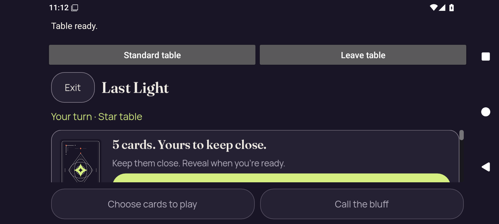</a>

`2d-landscape-initial-native-ready.png` · 1600 × 720 · 101,512 bytes.

SHA-256: `6cc06cdf1acdc4ab2116335ee388253f8719d1a7154f5898e0edc5595799ffb3`.

**Preserved image; unviewed.** Original adaptive screenshot preserved without a direct pixel view or an independently established reviewed-byte representative in this bounded still publication. Runtime predicates do not supply a pixel verdict.

### 2d-landscape-initial-selector

`2d-landscape-initial-selector.png` · 1600 × 720 · 44,772 bytes.

SHA-256: `08c9860c776fe0aa61fc1948119ef6686a8fbde4e7468fafc97dced559b2a4a1`.

**Preserved image; unviewed.** Original adaptive screenshot preserved without a direct pixel view or an independently established reviewed-byte representative in this bounded still publication. Runtime predicates do not supply a pixel verdict.

### 2d-landscape-leave-confirmation

`2d-landscape-leave-confirmation.png` · 720 × 1600 · 40,297 bytes.

SHA-256: `4877f86826afdb75e8919d898a29381bc54295034b9e662517aaab3e0f185481`.

**Preserved image; unviewed.** Original adaptive screenshot preserved without a direct pixel view or an independently established reviewed-byte representative in this bounded still publication. Runtime predicates do not supply a pixel verdict.

### 2d-landscape-leave-native-ready

`2d-landscape-leave-native-ready.png` · 720 × 1600 · 150,211 bytes.

SHA-256: `6851317f1551b94b7286c3741f29e165789dfdf648c4434408dce7f9556b6a06`.

**Preserved image; unviewed.** Original adaptive screenshot preserved without a direct pixel view or an independently established reviewed-byte representative in this bounded still publication. Runtime predicates do not supply a pixel verdict.

### 2d-landscape-leave-selected

`2d-landscape-leave-selected.png` · 720 × 1600 · 99,832 bytes.

SHA-256: `d2beb6ce8e8581a0ebaae088f9387fcf22372300f3aab72b63e94d36577d3f34`.

**Preserved image; unviewed.** Original adaptive screenshot preserved without a direct pixel view or an independently established reviewed-byte representative in this bounded still publication. Runtime predicates do not supply a pixel verdict.

### 2d-landscape-leave-selector

<a href="runtime/captures/2d-landscape-leave-selector.png">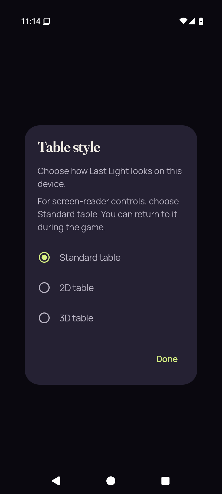</a>

`2d-landscape-leave-selector.png` · 720 × 1600 · 57,473 bytes.

SHA-256: `438b11d05d92eafe262448cb78cd6b1bce4458289fd1c8e6353fa25e91d8be8c`.

**Preserved image; unviewed.** Original adaptive screenshot preserved without a direct pixel view or an independently established reviewed-byte representative in this bounded still publication. Runtime predicates do not supply a pixel verdict.

### 2d-landscape-portrait-native-ready

`2d-landscape-portrait-native-ready.png` · 720 × 1600 · 150,384 bytes.

SHA-256: `6c865fb3f629e254141c8fac49872e3509e4850b85a7f27ec8be418d2748b273`.

**Preserved image; unviewed.** Original adaptive screenshot preserved without a direct pixel view or an independently established reviewed-byte representative in this bounded still publication. Runtime predicates do not supply a pixel verdict.

### 2d-landscape-portrait-selector

<a href="runtime/captures/2d-landscape-portrait-selector.png">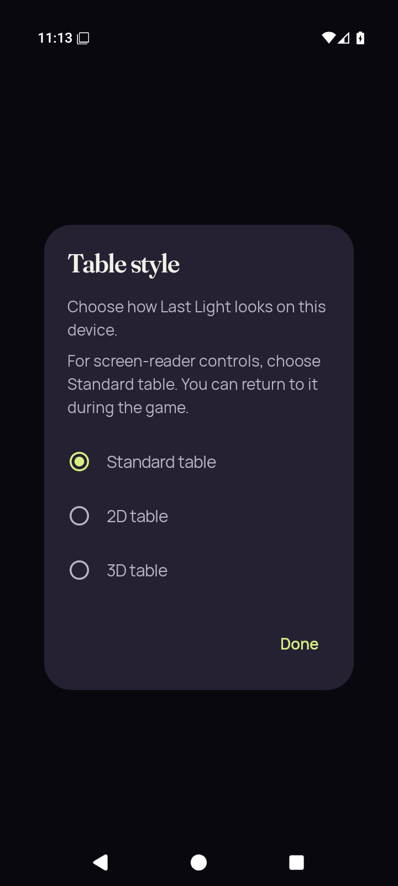</a>

`2d-landscape-portrait-selector.png` · 720 × 1600 · 57,837 bytes.

SHA-256: `0464a9fe7954f345496d405b821d9fc818953396e1da6ef66d412552e5ef108b`.

**Preserved image; unviewed.** Original adaptive screenshot preserved without a direct pixel view or an independently established reviewed-byte representative in this bounded still publication. Runtime predicates do not supply a pixel verdict.

### 2d-landscape-reentry-selected

`2d-landscape-reentry-selected.png` · 720 × 1600 · 100,226 bytes.

SHA-256: `593637af759f80f132146b68d0f3ffcd749ed94e887aa80323321d40624a2fb3`.

**Preserved image; unviewed.** Original adaptive screenshot preserved without a direct pixel view or an independently established reviewed-byte representative in this bounded still publication. Runtime predicates do not supply a pixel verdict.

### 2d-landscape-rotation-return-concealed

`2d-landscape-rotation-return-concealed.png` · 720 × 1600 · 108,107 bytes.

SHA-256: `f3c471899e710ff3eb959ec2af71501c8542820c5c2ab414e094ae519267643f`.

**Preserved image; unviewed.** Original adaptive screenshot preserved without a direct pixel view or an independently established reviewed-byte representative in this bounded still publication. Runtime predicates do not supply a pixel verdict.

### 2d-landscape-rotation-return-first-card

`2d-landscape-rotation-return-first-card.png` · 720 × 1600 · 100,777 bytes.

SHA-256: `90ad243da4ffdfb84e2cf0d10bedc2baddb129b9457c5b4c92548830cdccbe37`.

**Preserved image; unviewed.** Original adaptive screenshot preserved without a direct pixel view or an independently established reviewed-byte representative in this bounded still publication. Runtime predicates do not supply a pixel verdict.

### 2d-landscape-rotation-return-public

`2d-landscape-rotation-return-public.png` · 720 × 1600 · 108,107 bytes.

SHA-256: `f3c471899e710ff3eb959ec2af71501c8542820c5c2ab414e094ae519267643f`.

**Preserved image; unviewed.** Original adaptive screenshot preserved without a direct pixel view or an independently established reviewed-byte representative in this bounded still publication. Runtime predicates do not supply a pixel verdict.

### 2d-landscape-rotation-return-selection-cleared

`2d-landscape-rotation-return-selection-cleared.png` · 720 × 1600 · 108,107 bytes.

SHA-256: `f3c471899e710ff3eb959ec2af71501c8542820c5c2ab414e094ae519267643f`.

**Preserved image; unviewed.** Original adaptive screenshot preserved without a direct pixel view or an independently established reviewed-byte representative in this bounded still publication. Runtime predicates do not supply a pixel verdict.

### 2d-landscape-standard-return-concealed

`2d-landscape-standard-return-concealed.png` · 720 × 1600 · 107,869 bytes.

SHA-256: `2841ddf2c75e772c8fa09420024730c02b00e9064cde098b4df43b23d5f9b661`.

**Preserved image; unviewed.** Original adaptive screenshot preserved without a direct pixel view or an independently established reviewed-byte representative in this bounded still publication. Runtime predicates do not supply a pixel verdict.

### 2d-landscape-standard-return-first-card

`2d-landscape-standard-return-first-card.png` · 720 × 1600 · 100,551 bytes.

SHA-256: `75dc17901aa58978b6dcb5872fc9015e817e7358601b7b064dca8926d56f18e6`.

**Preserved image; unviewed.** Original adaptive screenshot preserved without a direct pixel view or an independently established reviewed-byte representative in this bounded still publication. Runtime predicates do not supply a pixel verdict.

### 2d-landscape-standard-return-public

`2d-landscape-standard-return-public.png` · 720 × 1600 · 107,869 bytes.

SHA-256: `2841ddf2c75e772c8fa09420024730c02b00e9064cde098b4df43b23d5f9b661`.

**Preserved image; unviewed.** Original adaptive screenshot preserved without a direct pixel view or an independently established reviewed-byte representative in this bounded still publication. Runtime predicates do not supply a pixel verdict.

### 2d-landscape-standard-return-selection-cleared

`2d-landscape-standard-return-selection-cleared.png` · 720 × 1600 · 107,869 bytes.

SHA-256: `2841ddf2c75e772c8fa09420024730c02b00e9064cde098b4df43b23d5f9b661`.

**Preserved image; unviewed.** Original adaptive screenshot preserved without a direct pixel view or an independently established reviewed-byte representative in this bounded still publication. Runtime predicates do not supply a pixel verdict.

### 2d-seascape-after-up

`2d-seascape-after-up.png` · 720 × 1600 · 119,401 bytes.

SHA-256: `b7ca5070512b53a511a319a176d6fabcb3d1cd3449131278b29f561d65cbf444`.

**Preserved image; unviewed.** Original adaptive screenshot preserved without a direct pixel view or an independently established reviewed-byte representative in this bounded still publication. Runtime predicates do not supply a pixel verdict.

### 2d-seascape-baseline-first-card

`2d-seascape-baseline-first-card.png` · 1600 × 720 · 102,865 bytes.

SHA-256: `649c78884624dc85c4e494730778e9a969f45bb2861dfaff420cc8c066358419`.

**Preserved image; unviewed.** Original adaptive screenshot preserved without a direct pixel view or an independently established reviewed-byte representative in this bounded still publication. Runtime predicates do not supply a pixel verdict.

### 2d-seascape-baseline-public

`2d-seascape-baseline-public.png` · 1600 × 720 · 107,229 bytes.

SHA-256: `07553ad841259d6c557550d8b5f6bd1530bab4ec7f4dfc4dfc47c9d23e7c40e2`.

**Preserved image; unviewed.** Original adaptive screenshot preserved without a direct pixel view or an independently established reviewed-byte representative in this bounded still publication. Runtime predicates do not supply a pixel verdict.

### 2d-seascape-baseline-selected

`2d-seascape-baseline-selected.png` · 1600 × 720 · 103,801 bytes.

SHA-256: `2e20a2c27be86b1433be9aedf3b015f6c8674b08b656ae65d9d44c56d44d4494`.

**Preserved image; unviewed.** Original adaptive screenshot preserved without a direct pixel view or an independently established reviewed-byte representative in this bounded still publication. Runtime predicates do not supply a pixel verdict.

### 2d-seascape-home

`2d-seascape-home.png` · 720 × 1600 · 131,655 bytes.

SHA-256: `6596a8b0a07dfa0660d82ce215e752bab2a561a81f4a70689d4d2bddfe99598b`.

**Preserved image; unviewed.** Original adaptive screenshot preserved without a direct pixel view or an independently established reviewed-byte representative in this bounded still publication. Runtime predicates do not supply a pixel verdict.

### 2d-seascape-initial-native-ready

`2d-seascape-initial-native-ready.png` · 1600 × 720 · 108,339 bytes.

SHA-256: `274cb03bb3a1ec5d7b7ffbb83289a2238021c353755d6d81d06f959ba06c5906`.

**Preserved image; unviewed.** Original adaptive screenshot preserved without a direct pixel view or an independently established reviewed-byte representative in this bounded still publication. Runtime predicates do not supply a pixel verdict.

### 2d-seascape-initial-selector

`2d-seascape-initial-selector.png` · 1600 × 720 · 40,322 bytes.

SHA-256: `880925f697fd695fc4cd6dd6b17e41ed0bca5347280d5c09ec8a760257bddd33`.

**Preserved image; unviewed.** Original adaptive screenshot preserved without a direct pixel view or an independently established reviewed-byte representative in this bounded still publication. Runtime predicates do not supply a pixel verdict.

### 2d-seascape-leave-confirmation

`2d-seascape-leave-confirmation.png` · 720 × 1600 · 40,570 bytes.

SHA-256: `342cd7afef069f23691fae1d4ed0edef3643d0ce479a8e2ab604998e716bceba`.

**Preserved image; unviewed.** Original adaptive screenshot preserved without a direct pixel view or an independently established reviewed-byte representative in this bounded still publication. Runtime predicates do not supply a pixel verdict.

### 2d-seascape-leave-native-ready

`2d-seascape-leave-native-ready.png` · 720 × 1600 · 148,865 bytes.

SHA-256: `8495e3f955bdc031c2797d61b1d5af02fd4ce831293f1079495889bc65664c4c`.

**Preserved image; unviewed.** Original adaptive screenshot preserved without a direct pixel view or an independently established reviewed-byte representative in this bounded still publication. Runtime predicates do not supply a pixel verdict.

### 2d-seascape-leave-selected

`2d-seascape-leave-selected.png` · 720 × 1600 · 118,138 bytes.

SHA-256: `df7e1777d8cec332bb221d5a0543a8b3298a44da154ea9aae0ee91c977ec7fe6`.

**Preserved image; unviewed.** Original adaptive screenshot preserved without a direct pixel view or an independently established reviewed-byte representative in this bounded still publication. Runtime predicates do not supply a pixel verdict.

### 2d-seascape-leave-selector

`2d-seascape-leave-selector.png` · 720 × 1600 · 57,880 bytes.

SHA-256: `210d37b2494aa74a7952d045a61f824ac78f75fa3d32f61c9d0b4bb0e1f07f00`.

**Preserved image; unviewed.** Original adaptive screenshot preserved without a direct pixel view or an independently established reviewed-byte representative in this bounded still publication. Runtime predicates do not supply a pixel verdict.

### 2d-seascape-portrait-native-ready

`2d-seascape-portrait-native-ready.png` · 720 × 1600 · 148,597 bytes.

SHA-256: `3d0638adf1dd2a8c0a9b7a4e8d871a46cac17ee46800fbefc9f667156a1d8210`.

**Preserved image; unviewed.** Original adaptive screenshot preserved without a direct pixel view or an independently established reviewed-byte representative in this bounded still publication. Runtime predicates do not supply a pixel verdict.

### 2d-seascape-portrait-selector

`2d-seascape-portrait-selector.png` · 720 × 1600 · 57,502 bytes.

SHA-256: `194c56d359ef4f86283ce83f7bda41d944cde2a373e7b5b501dd609b417c1634`.

**Preserved image; unviewed.** Original adaptive screenshot preserved without a direct pixel view or an independently established reviewed-byte representative in this bounded still publication. Runtime predicates do not supply a pixel verdict.

### 2d-seascape-reentry-selected

`2d-seascape-reentry-selected.png` · 720 × 1600 · 117,731 bytes.

SHA-256: `dc6639bcbf51be8748516f8e67bdf1268a79fa10432774a54e43faeb01f74b9c`.

**Preserved image; unviewed.** Original adaptive screenshot preserved without a direct pixel view or an independently established reviewed-byte representative in this bounded still publication. Runtime predicates do not supply a pixel verdict.

### 2d-seascape-rotation-return-concealed

`2d-seascape-rotation-return-concealed.png` · 720 × 1600 · 119,401 bytes.

SHA-256: `b7ca5070512b53a511a319a176d6fabcb3d1cd3449131278b29f561d65cbf444`.

**Preserved image; unviewed.** Original adaptive screenshot preserved without a direct pixel view or an independently established reviewed-byte representative in this bounded still publication. Runtime predicates do not supply a pixel verdict.

### 2d-seascape-rotation-return-first-card

`2d-seascape-rotation-return-first-card.png` · 720 × 1600 · 117,513 bytes.

SHA-256: `c419ec1e9925decd982428e70d1d3562931ffdc192ab47ee33307b2acff44375`.

**Preserved image; unviewed.** Original adaptive screenshot preserved without a direct pixel view or an independently established reviewed-byte representative in this bounded still publication. Runtime predicates do not supply a pixel verdict.

### 2d-seascape-rotation-return-public

`2d-seascape-rotation-return-public.png` · 720 × 1600 · 119,155 bytes.

SHA-256: `c5e1e74be50ef5a7c0aa17994c6d833aac6dd7d446dd2504d91ccfaf98fa6f0f`.

**Preserved image; unviewed.** Original adaptive screenshot preserved without a direct pixel view or an independently established reviewed-byte representative in this bounded still publication. Runtime predicates do not supply a pixel verdict.

### 2d-seascape-rotation-return-selection-cleared

`2d-seascape-rotation-return-selection-cleared.png` · 720 × 1600 · 119,401 bytes.

SHA-256: `b7ca5070512b53a511a319a176d6fabcb3d1cd3449131278b29f561d65cbf444`.

**Preserved image; unviewed.** Original adaptive screenshot preserved without a direct pixel view or an independently established reviewed-byte representative in this bounded still publication. Runtime predicates do not supply a pixel verdict.

### 2d-seascape-standard-return-concealed

`2d-seascape-standard-return-concealed.png` · 720 × 1600 · 119,302 bytes.

SHA-256: `5d9718a994a9ba6dca05adc6b11831b15e4cbf4b1a0f5c3f90c3076c20ab6e3b`.

**Preserved image; unviewed.** Original adaptive screenshot preserved without a direct pixel view or an independently established reviewed-byte representative in this bounded still publication. Runtime predicates do not supply a pixel verdict.

### 2d-seascape-standard-return-first-card

`2d-seascape-standard-return-first-card.png` · 720 × 1600 · 117,924 bytes.

SHA-256: `dc8937408d330ce9e7eab0843e38f79ba987460e37798e816c13686c31753ac4`.

**Preserved image; unviewed.** Original adaptive screenshot preserved without a direct pixel view or an independently established reviewed-byte representative in this bounded still publication. Runtime predicates do not supply a pixel verdict.

### 2d-seascape-standard-return-public

`2d-seascape-standard-return-public.png` · 720 × 1600 · 119,302 bytes.

SHA-256: `5d9718a994a9ba6dca05adc6b11831b15e4cbf4b1a0f5c3f90c3076c20ab6e3b`.

**Preserved image; unviewed.** Original adaptive screenshot preserved without a direct pixel view or an independently established reviewed-byte representative in this bounded still publication. Runtime predicates do not supply a pixel verdict.

### 2d-seascape-standard-return-selection-cleared

`2d-seascape-standard-return-selection-cleared.png` · 720 × 1600 · 119,302 bytes.

SHA-256: `5d9718a994a9ba6dca05adc6b11831b15e4cbf4b1a0f5c3f90c3076c20ab6e3b`.

**Preserved image; unviewed.** Original adaptive screenshot preserved without a direct pixel view or an independently established reviewed-byte representative in this bounded still publication. Runtime predicates do not supply a pixel verdict.

### 2d-split-baseline-first-card

<a href="runtime/captures/2d-split-baseline-first-card.png">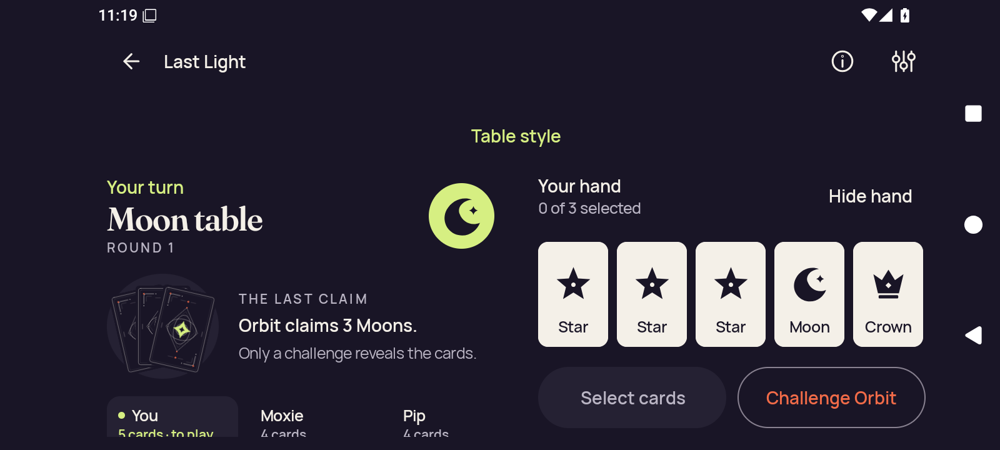</a>

`2d-split-baseline-first-card.png` · 1600 × 720 · 109,830 bytes.

SHA-256: `309a91ebec4111737f910c87387e3d9473534fd8a72ad8c25c792830bdec6ac5`.

**Preserved image; unviewed.** Original adaptive screenshot preserved without a direct pixel view or an independently established reviewed-byte representative in this bounded still publication. Runtime predicates do not supply a pixel verdict.

### 2d-split-baseline-public

`2d-split-baseline-public.png` · 1600 × 720 · 117,201 bytes.

SHA-256: `bb6727127246f7e27fe652db2377eaef185024afdc4ad83196c58de621ccbda6`.

**Preserved image; unviewed.** Original adaptive screenshot preserved without a direct pixel view or an independently established reviewed-byte representative in this bounded still publication. Runtime predicates do not supply a pixel verdict.

### 2d-split-baseline-selected

<a href="runtime/captures/2d-split-baseline-selected.png">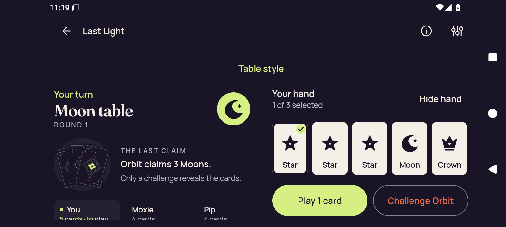</a>

`2d-split-baseline-selected.png` · 1600 × 720 · 110,727 bytes.

SHA-256: `8b99a3028ace66897bb9229c1493de9dd336a1cc84a05436f8a7340bb888aa5d`.

**Preserved image; unviewed.** Original adaptive screenshot preserved without a direct pixel view or an independently established reviewed-byte representative in this bounded still publication. Runtime predicates do not supply a pixel verdict.

### 2d-split-entry-concealed

<a href="runtime/captures/2d-split-entry-concealed.png">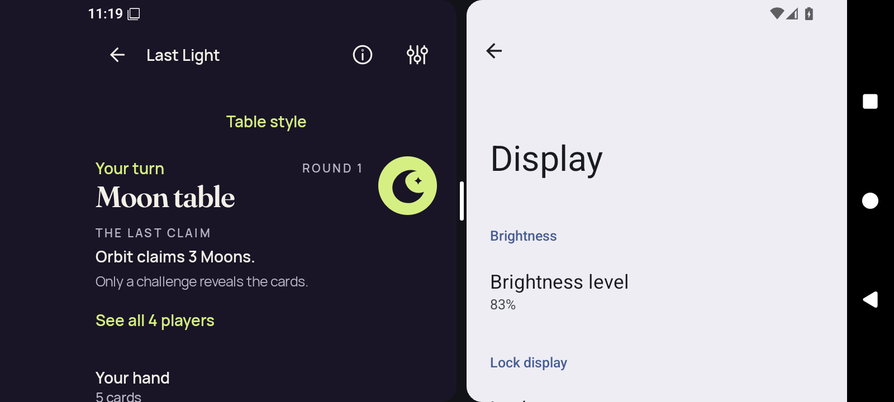</a>

`2d-split-entry-concealed.png` · 1600 × 720 · 78,861 bytes.

SHA-256: `2cde90b28e3eb335975ab06a5584ef320a53bd1ef99bc1addfddc4617c8dba3f`.

**Preserved image; unviewed.** Original adaptive screenshot preserved without a direct pixel view or an independently established reviewed-byte representative in this bounded still publication. Runtime predicates do not supply a pixel verdict.

### 2d-split-entry-return-concealed

<a href="runtime/captures/2d-split-entry-return-concealed.png">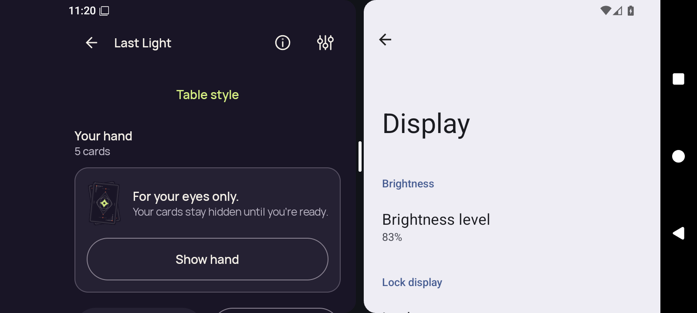</a>

`2d-split-entry-return-concealed.png` · 1600 × 720 · 75,886 bytes.

SHA-256: `f30321ca2dc3d5f1747b856718d22d8e9623532befe5476f42059abe71e415df`.

**Preserved image; unviewed.** Original adaptive screenshot preserved without a direct pixel view or an independently established reviewed-byte representative in this bounded still publication. Runtime predicates do not supply a pixel verdict.

### 2d-split-entry-return-first-card

<a href="runtime/captures/2d-split-entry-return-first-card.png">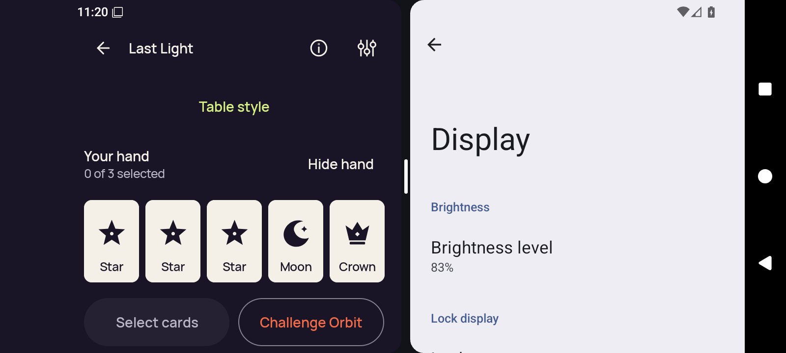</a>

`2d-split-entry-return-first-card.png` · 1600 × 720 · 74,227 bytes.

SHA-256: `a7fbb4310e87acc91e9a5272c73c9a526914ebda2dcbcfe4607de9265f6a43ab`.

**Preserved image; unviewed.** Original adaptive screenshot preserved without a direct pixel view or an independently established reviewed-byte representative in this bounded still publication. Runtime predicates do not supply a pixel verdict.

### 2d-split-entry-return-public

<a href="runtime/captures/2d-split-entry-return-public.png">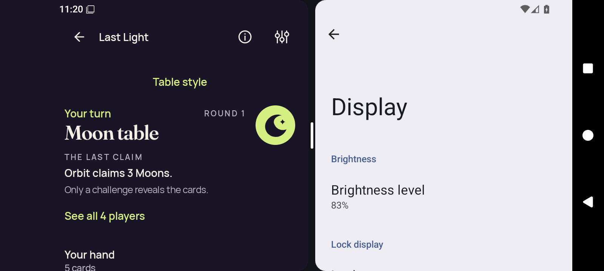</a>

`2d-split-entry-return-public.png` · 1600 × 720 · 79,264 bytes.

SHA-256: `4305f4d32252f9fe027e15b9293b6b4c1020275504500b45f973a5d02b7fda8b`.

**Preserved image; unviewed.** Original adaptive screenshot preserved without a direct pixel view or an independently established reviewed-byte representative in this bounded still publication. Runtime predicates do not supply a pixel verdict.

### 2d-split-entry-return-selection-cleared

`2d-split-entry-return-selection-cleared.png` · 1600 × 720 · 75,886 bytes.

SHA-256: `f30321ca2dc3d5f1747b856718d22d8e9623532befe5476f42059abe71e415df`.

**Preserved image; unviewed.** Original adaptive screenshot preserved without a direct pixel view or an independently established reviewed-byte representative in this bounded still publication. Runtime predicates do not supply a pixel verdict.

### 2d-split-exit-concealed

`2d-split-exit-concealed.png` · 1600 × 720 · 110,400 bytes.

SHA-256: `77ea6cd857516a0064f2961501e88f9a3457791b333ec73df866ce04d05dc05e`.

**Preserved image; unviewed.** Original adaptive screenshot preserved without a direct pixel view or an independently established reviewed-byte representative in this bounded still publication. Runtime predicates do not supply a pixel verdict.

### 2d-split-exit-return-concealed

`2d-split-exit-return-concealed.png` · 1600 × 720 · 110,400 bytes.

SHA-256: `77ea6cd857516a0064f2961501e88f9a3457791b333ec73df866ce04d05dc05e`.

**Preserved image; unviewed.** Original adaptive screenshot preserved without a direct pixel view or an independently established reviewed-byte representative in this bounded still publication. Runtime predicates do not supply a pixel verdict.

### 2d-split-exit-return-first-card

`2d-split-exit-return-first-card.png` · 1600 × 720 · 109,714 bytes.

SHA-256: `91d1042d0745c1e7cbffdb9069e168d8116e45524ecc3778a3f2abac3e69c1da`.

**Preserved image; unviewed.** Original adaptive screenshot preserved without a direct pixel view or an independently established reviewed-byte representative in this bounded still publication. Runtime predicates do not supply a pixel verdict.

### 2d-split-exit-return-public

`2d-split-exit-return-public.png` · 1600 × 720 · 117,103 bytes.

SHA-256: `9996155659e6883d3ff2c3d56fa3ff00201982f655160652c63f2fce83b15344`.

**Preserved image; unviewed.** Original adaptive screenshot preserved without a direct pixel view or an independently established reviewed-byte representative in this bounded still publication. Runtime predicates do not supply a pixel verdict.

### 2d-split-exit-return-selection-cleared

`2d-split-exit-return-selection-cleared.png` · 1600 × 720 · 117,103 bytes.

SHA-256: `9996155659e6883d3ff2c3d56fa3ff00201982f655160652c63f2fce83b15344`.

**Preserved image; unviewed.** Original adaptive screenshot preserved without a direct pixel view or an independently established reviewed-byte representative in this bounded still publication. Runtime predicates do not supply a pixel verdict.

### 2d-split-full-native-ready

`2d-split-full-native-ready.png` · 1600 × 720 · 108,211 bytes.

SHA-256: `027d8d596bd7f984c6b271c6d1ab6d23646bf81201f727ed2c8dea0dc54e5347`.

**Preserved image; unviewed.** Original adaptive screenshot preserved without a direct pixel view or an independently established reviewed-byte representative in this bounded still publication. Runtime predicates do not supply a pixel verdict.

### 2d-split-full-selector

`2d-split-full-selector.png` · 1600 × 720 · 45,066 bytes.

SHA-256: `3e678a8c759b7830c014f4037c32453aa75ff53081c7c88c2cbea99b586597c8`.

**Preserved image; unviewed.** Original adaptive screenshot preserved without a direct pixel view or an independently established reviewed-byte representative in this bounded still publication. Runtime predicates do not supply a pixel verdict.

### 2d-split-home

`2d-split-home.png` · 1600 × 720 · 135,461 bytes.

SHA-256: `08a0aaf3b9844c3fe802e215cb688c6798c554163dd4a410c0b5922983e14488`.

**Preserved image; unviewed.** Original adaptive screenshot preserved without a direct pixel view or an independently established reviewed-byte representative in this bounded still publication. Runtime predicates do not supply a pixel verdict.

### 2d-split-leave-confirmation

`2d-split-leave-confirmation.png` · 1600 × 720 · 39,726 bytes.

SHA-256: `323feb07cf720fca3aa3fa28727c11aa5f2d402d20f49f4a1cded1c5899d018c`.

**Preserved image; unviewed.** Original adaptive screenshot preserved without a direct pixel view or an independently established reviewed-byte representative in this bounded still publication. Runtime predicates do not supply a pixel verdict.

### 2d-split-leave-native-ready

`2d-split-leave-native-ready.png` · 1600 × 720 · 108,128 bytes.

SHA-256: `0009b161dae55caf64ba679acd5de0317b2ec914e4304b3967a45dcfb2cdbcbb`.

**Preserved image; unviewed.** Original adaptive screenshot preserved without a direct pixel view or an independently established reviewed-byte representative in this bounded still publication. Runtime predicates do not supply a pixel verdict.

### 2d-split-leave-selected

`2d-split-leave-selected.png` · 1600 × 720 · 110,762 bytes.

SHA-256: `1a0c0bc9e07d438a4e271ed7fc613fcfdae004dba8f73b7c76bd2cd160784dbb`.

**Preserved image; unviewed.** Original adaptive screenshot preserved without a direct pixel view or an independently established reviewed-byte representative in this bounded still publication. Runtime predicates do not supply a pixel verdict.

### 2d-split-leave-selector

`2d-split-leave-selector.png` · 1600 × 720 · 42,351 bytes.

SHA-256: `b4f94a4768441d16e2d525e55132c86046147b8b5de4675bf1bef34d01c12578`.

**Preserved image; unviewed.** Original adaptive screenshot preserved without a direct pixel view or an independently established reviewed-byte representative in this bounded still publication. Runtime predicates do not supply a pixel verdict.

### 2d-split-pane-native-ready

<a href="runtime/captures/2d-split-pane-native-ready.png">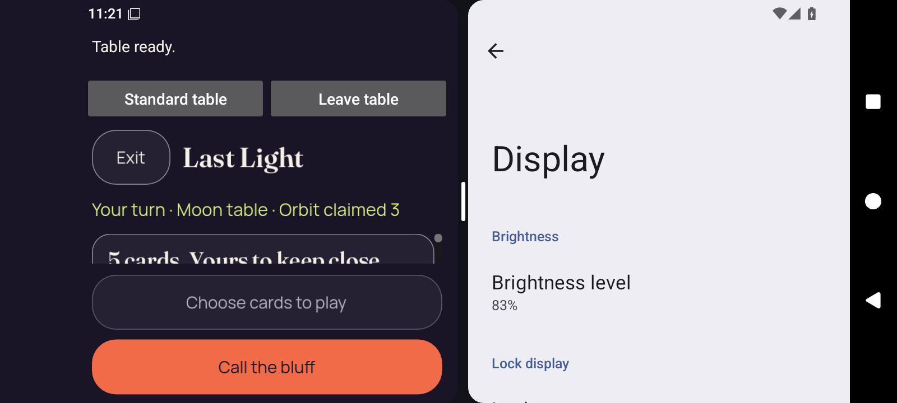</a>

`2d-split-pane-native-ready.png` · 1600 × 720 · 98,717 bytes.

SHA-256: `0900a73ab35d23354c96ace7d848d69902b050d6a2fa65e8048adf52f1bc5eb5`.

**Preserved image; unviewed.** Original adaptive screenshot preserved without a direct pixel view or an independently established reviewed-byte representative in this bounded still publication. Runtime predicates do not supply a pixel verdict.

### 2d-split-pane-selector

<a href="runtime/captures/2d-split-pane-selector.png">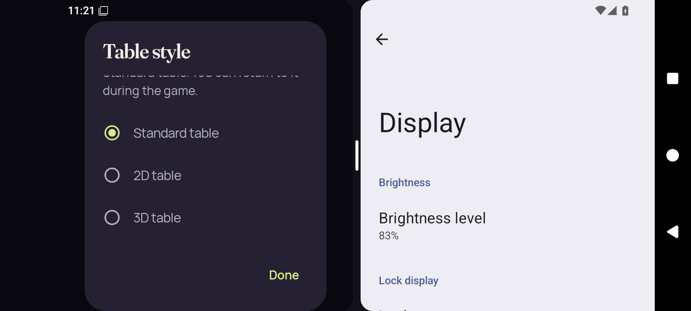</a>

`2d-split-pane-selector.png` · 1600 × 720 · 60,694 bytes.

SHA-256: `16e0c183ef5575aaf93c33f1546df12ee8189436ee2df9e3793c7295ad1f4175`.

**Preserved image; unviewed.** Original adaptive screenshot preserved without a direct pixel view or an independently established reviewed-byte representative in this bounded still publication. Runtime predicates do not supply a pixel verdict.

### 2d-split-reentry-selected

`2d-split-reentry-selected.png` · 1600 × 720 · 74,912 bytes.

SHA-256: `fda5c794c688eb76ed903dc74e8cb0de949978674119e4a9db167579f475dae6`.

**Preserved image; unviewed.** Original adaptive screenshot preserved without a direct pixel view or an independently established reviewed-byte representative in this bounded still publication. Runtime predicates do not supply a pixel verdict.

### 3d-landscape-after-up

`3d-landscape-after-up.png` · 720 × 1600 · 129,181 bytes.

SHA-256: `90f1e1def23889f00d787ca97c0e9847195d3d4d48ea67fc8adfc6489288b086`.

**Preserved image; unviewed.** Original adaptive screenshot preserved without a direct pixel view or an independently established reviewed-byte representative in this bounded still publication. Runtime predicates do not supply a pixel verdict.

### 3d-landscape-baseline-first-card

<a href="runtime/captures/3d-landscape-baseline-first-card.png">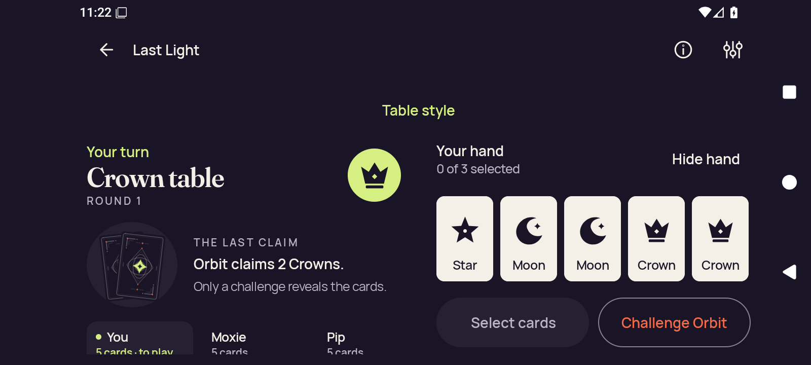</a>

`3d-landscape-baseline-first-card.png` · 1600 × 720 · 109,306 bytes.

SHA-256: `ff481a7920c2d39c5eab91378ec2cdf3e49032ff96880b6aaae70b66826f1b66`.

**Preserved image; unviewed.** Original adaptive screenshot preserved without a direct pixel view or an independently established reviewed-byte representative in this bounded still publication. Runtime predicates do not supply a pixel verdict.

### 3d-landscape-baseline-public

<a href="runtime/captures/3d-landscape-baseline-public.png">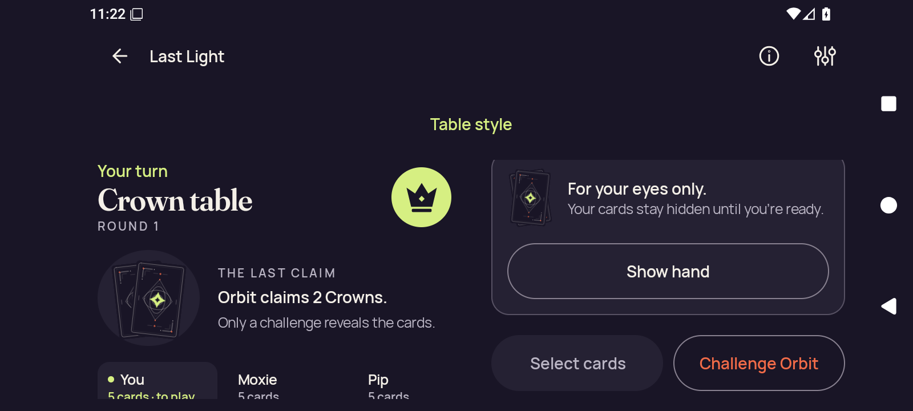</a>

`3d-landscape-baseline-public.png` · 1600 × 720 · 117,094 bytes.

SHA-256: `5e7cff3e5653caaca072691f370c764cd3bf4847095b2babcde7a30c7ee3a7a0`.

**Preserved image; unviewed.** Original adaptive screenshot preserved without a direct pixel view or an independently established reviewed-byte representative in this bounded still publication. Runtime predicates do not supply a pixel verdict.

### 3d-landscape-baseline-selected

`3d-landscape-baseline-selected.png` · 1600 × 720 · 110,858 bytes.

SHA-256: `0c525bc329b766771efc852e404df987b36d00179900a4bb35b4bfee0c290526`.

**Preserved image; unviewed.** Original adaptive screenshot preserved without a direct pixel view or an independently established reviewed-byte representative in this bounded still publication. Runtime predicates do not supply a pixel verdict.

### 3d-landscape-home

`3d-landscape-home.png` · 720 × 1600 · 131,966 bytes.

SHA-256: `0b474651b84253ff2995c842b8132a7faa1b0e92be8c64dce86f5b30f2c1428b`.

**Preserved image; unviewed.** Original adaptive screenshot preserved without a direct pixel view or an independently established reviewed-byte representative in this bounded still publication. Runtime predicates do not supply a pixel verdict.

### 3d-landscape-initial-native-ready

<a href="runtime/captures/3d-landscape-initial-native-ready.png">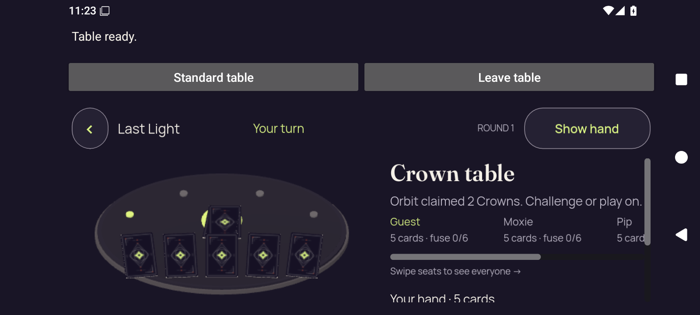</a>

`3d-landscape-initial-native-ready.png` · 1600 × 720 · 167,513 bytes.

SHA-256: `2901600cf27fc4d76b91ef097a65e0fa0cbd7677fda088cbe769462cf068d065`.

**Preserved image; unviewed.** Original adaptive screenshot preserved without a direct pixel view or an independently established reviewed-byte representative in this bounded still publication. Runtime predicates do not supply a pixel verdict.

### 3d-landscape-initial-selector

`3d-landscape-initial-selector.png` · 1600 × 720 · 40,661 bytes.

SHA-256: `d5d1010d94bd8f1893f1deba4977837107ee1e2679fda4259805118a349e647c`.

**Preserved image; unviewed.** Original adaptive screenshot preserved without a direct pixel view or an independently established reviewed-byte representative in this bounded still publication. Runtime predicates do not supply a pixel verdict.

### 3d-landscape-leave-confirmation

`3d-landscape-leave-confirmation.png` · 720 × 1600 · 40,829 bytes.

SHA-256: `c6582866ad405b7c51e546b71c28a9a2ebb9f61575e5706da626dc5437d25258`.

**Preserved image; unviewed.** Original adaptive screenshot preserved without a direct pixel view or an independently established reviewed-byte representative in this bounded still publication. Runtime predicates do not supply a pixel verdict.

### 3d-landscape-leave-native-ready

<a href="runtime/captures/3d-landscape-leave-native-ready.png">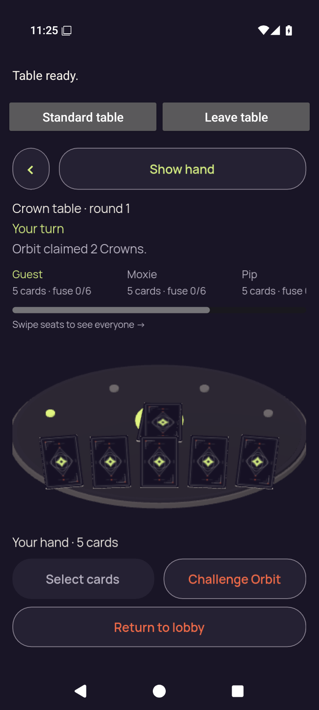</a>

`3d-landscape-leave-native-ready.png` · 720 × 1600 · 188,817 bytes.

SHA-256: `15474a9927d3ee1086ccc774e0856974bda8b2a1a1d6c953c3bc661c952d87e8`.

**Preserved image; unviewed.** Original adaptive screenshot preserved without a direct pixel view or an independently established reviewed-byte representative in this bounded still publication. Runtime predicates do not supply a pixel verdict.

### 3d-landscape-leave-selected

`3d-landscape-leave-selected.png` · 720 × 1600 · 124,389 bytes.

SHA-256: `d4901a2f90342068b9d24587972bb7e2c04d7020eba95b9c42b7bc62618a4eda`.

**Preserved image; unviewed.** Original adaptive screenshot preserved without a direct pixel view or an independently established reviewed-byte representative in this bounded still publication. Runtime predicates do not supply a pixel verdict.

### 3d-landscape-leave-selector

`3d-landscape-leave-selector.png` · 720 × 1600 · 58,080 bytes.

SHA-256: `c259a88d2773d97aeb9ce3cdf97ac6d6f64a5f5a452b9cd44a1ff4c62ea3996f`.

**Preserved image; unviewed.** Original adaptive screenshot preserved without a direct pixel view or an independently established reviewed-byte representative in this bounded still publication. Runtime predicates do not supply a pixel verdict.

### 3d-landscape-portrait-native-ready

<a href="runtime/captures/3d-landscape-portrait-native-ready.png">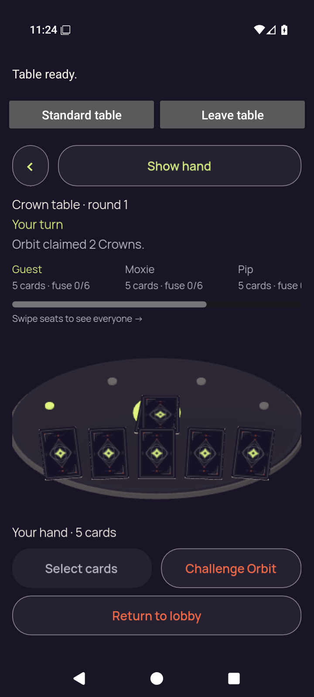</a>

`3d-landscape-portrait-native-ready.png` · 720 × 1600 · 188,783 bytes.

SHA-256: `dc5ff6423e1ee6b703449981709f85929a41bc6f12aa55963f1d905a6b353141`.

**Preserved image; unviewed.** Original adaptive screenshot preserved without a direct pixel view or an independently established reviewed-byte representative in this bounded still publication. Runtime predicates do not supply a pixel verdict.

### 3d-landscape-portrait-selector

`3d-landscape-portrait-selector.png` · 720 × 1600 · 58,017 bytes.

SHA-256: `2e0737b3b2dd7b5d78809625d36b66a9f4e949fa3282f70eaaa89de043f7a80a`.

**Preserved image; unviewed.** Original adaptive screenshot preserved without a direct pixel view or an independently established reviewed-byte representative in this bounded still publication. Runtime predicates do not supply a pixel verdict.

### 3d-landscape-reentry-selected

`3d-landscape-reentry-selected.png` · 720 × 1600 · 124,325 bytes.

SHA-256: `9a4718f3131233182069daa920e64589d2bebbccd6e3492f4a5468508fd5da21`.

**Preserved image; unviewed.** Original adaptive screenshot preserved without a direct pixel view or an independently established reviewed-byte representative in this bounded still publication. Runtime predicates do not supply a pixel verdict.

### 3d-landscape-rotation-return-concealed

`3d-landscape-rotation-return-concealed.png` · 720 × 1600 · 129,181 bytes.

SHA-256: `90f1e1def23889f00d787ca97c0e9847195d3d4d48ea67fc8adfc6489288b086`.

**Preserved image; unviewed.** Original adaptive screenshot preserved without a direct pixel view or an independently established reviewed-byte representative in this bounded still publication. Runtime predicates do not supply a pixel verdict.

### 3d-landscape-rotation-return-first-card

`3d-landscape-rotation-return-first-card.png` · 720 × 1600 · 124,098 bytes.

SHA-256: `b4be97c1ae828d789f8a0aa8445b5703eb2fb22239756322875d9dc47b65591f`.

**Preserved image; unviewed.** Original adaptive screenshot preserved without a direct pixel view or an independently established reviewed-byte representative in this bounded still publication. Runtime predicates do not supply a pixel verdict.

### 3d-landscape-rotation-return-public

`3d-landscape-rotation-return-public.png` · 720 × 1600 · 129,181 bytes.

SHA-256: `90f1e1def23889f00d787ca97c0e9847195d3d4d48ea67fc8adfc6489288b086`.

**Preserved image; unviewed.** Original adaptive screenshot preserved without a direct pixel view or an independently established reviewed-byte representative in this bounded still publication. Runtime predicates do not supply a pixel verdict.

### 3d-landscape-rotation-return-selection-cleared

`3d-landscape-rotation-return-selection-cleared.png` · 720 × 1600 · 129,181 bytes.

SHA-256: `90f1e1def23889f00d787ca97c0e9847195d3d4d48ea67fc8adfc6489288b086`.

**Preserved image; unviewed.** Original adaptive screenshot preserved without a direct pixel view or an independently established reviewed-byte representative in this bounded still publication. Runtime predicates do not supply a pixel verdict.

### 3d-landscape-standard-return-concealed

`3d-landscape-standard-return-concealed.png` · 720 × 1600 · 129,414 bytes.

SHA-256: `699fa70e355fce87eb48e61b30fc97c2dcfe3f19bd09c04298eb9e796c7dd52d`.

**Preserved image; unviewed.** Original adaptive screenshot preserved without a direct pixel view or an independently established reviewed-byte representative in this bounded still publication. Runtime predicates do not supply a pixel verdict.

### 3d-landscape-standard-return-first-card

`3d-landscape-standard-return-first-card.png` · 720 × 1600 · 124,186 bytes.

SHA-256: `bec816d9e9bcae9fd26a42c143453e6f858dc2e136f7d36ae4b23db169cae740`.

**Preserved image; unviewed.** Original adaptive screenshot preserved without a direct pixel view or an independently established reviewed-byte representative in this bounded still publication. Runtime predicates do not supply a pixel verdict.

### 3d-landscape-standard-return-public

`3d-landscape-standard-return-public.png` · 720 × 1600 · 129,414 bytes.

SHA-256: `699fa70e355fce87eb48e61b30fc97c2dcfe3f19bd09c04298eb9e796c7dd52d`.

**Preserved image; unviewed.** Original adaptive screenshot preserved without a direct pixel view or an independently established reviewed-byte representative in this bounded still publication. Runtime predicates do not supply a pixel verdict.

### 3d-landscape-standard-return-selection-cleared

`3d-landscape-standard-return-selection-cleared.png` · 720 × 1600 · 129,414 bytes.

SHA-256: `699fa70e355fce87eb48e61b30fc97c2dcfe3f19bd09c04298eb9e796c7dd52d`.

**Preserved image; unviewed.** Original adaptive screenshot preserved without a direct pixel view or an independently established reviewed-byte representative in this bounded still publication. Runtime predicates do not supply a pixel verdict.

### 3d-seascape-after-up

`3d-seascape-after-up.png` · 720 × 1600 · 117,112 bytes.

SHA-256: `3793c893cccdb6e99ba09d2a9e2d0767017825b0588e075e7b43aaab54e95399`.

**Preserved image; unviewed.** Original adaptive screenshot preserved without a direct pixel view or an independently established reviewed-byte representative in this bounded still publication. Runtime predicates do not supply a pixel verdict.

### 3d-seascape-baseline-first-card

<a href="runtime/captures/3d-seascape-baseline-first-card.png">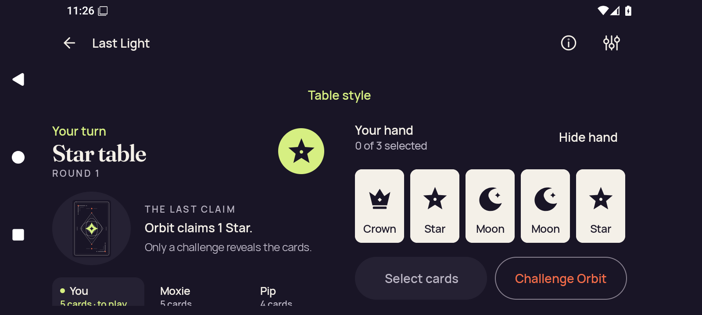</a>

`3d-seascape-baseline-first-card.png` · 1600 × 720 · 96,916 bytes.

SHA-256: `334ee8253c289178dc6ad0eaf18afd24793aef0f44486e056dbed97852245253`.

**Preserved image; unviewed.** Original adaptive screenshot preserved without a direct pixel view or an independently established reviewed-byte representative in this bounded still publication. Runtime predicates do not supply a pixel verdict.

### 3d-seascape-baseline-public

`3d-seascape-baseline-public.png` · 1600 × 720 · 104,844 bytes.

SHA-256: `52b1ea4d59a086a10f80c24dd6afb9d3176437e20f001aa7960e0d100efcf07c`.

**Preserved image; unviewed.** Original adaptive screenshot preserved without a direct pixel view or an independently established reviewed-byte representative in this bounded still publication. Runtime predicates do not supply a pixel verdict.

### 3d-seascape-baseline-selected

<a href="runtime/captures/3d-seascape-baseline-selected.png">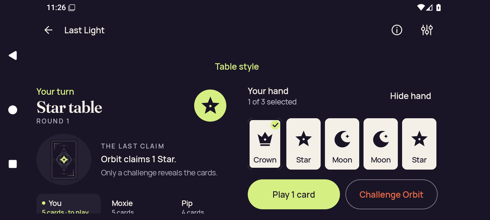</a>

`3d-seascape-baseline-selected.png` · 1600 × 720 · 97,790 bytes.

SHA-256: `b4efd1e1c86c9d4ffd6bde56db42dc31394630332c225aea02d3af6170cb4d7f`.

**Preserved image; unviewed.** Original adaptive screenshot preserved without a direct pixel view or an independently established reviewed-byte representative in this bounded still publication. Runtime predicates do not supply a pixel verdict.

### 3d-seascape-home

`3d-seascape-home.png` · 720 × 1600 · 131,851 bytes.

SHA-256: `c5fd9d88fdcea33c0a707c96ca26ed60498b31207ca28acbbf856e2a3d4faafe`.

**Preserved image; unviewed.** Original adaptive screenshot preserved without a direct pixel view or an independently established reviewed-byte representative in this bounded still publication. Runtime predicates do not supply a pixel verdict.

### 3d-seascape-initial-native-ready

<a href="runtime/captures/3d-seascape-initial-native-ready.png">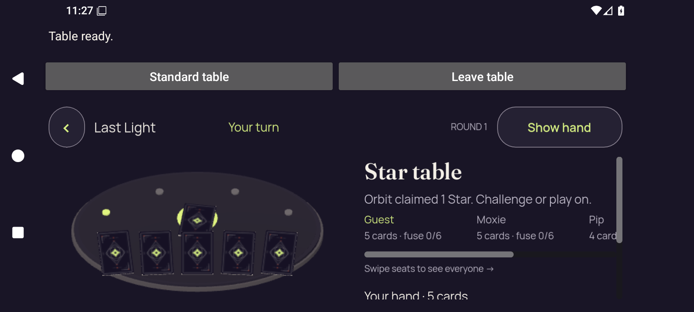</a>

`3d-seascape-initial-native-ready.png` · 1600 × 720 · 166,808 bytes.

SHA-256: `f2b81aae885147baf5cb1ce42414c0adf47e821083a9f502b70c5b029891897a`.

**Preserved image; unviewed.** Original adaptive screenshot preserved without a direct pixel view or an independently established reviewed-byte representative in this bounded still publication. Runtime predicates do not supply a pixel verdict.

### 3d-seascape-initial-selector

`3d-seascape-initial-selector.png` · 1600 × 720 · 44,324 bytes.

SHA-256: `d8eb7a970e43273bec4b5009cf154ad65c395405be31fea87ac75533b3b9a617`.

**Preserved image; unviewed.** Original adaptive screenshot preserved without a direct pixel view or an independently established reviewed-byte representative in this bounded still publication. Runtime predicates do not supply a pixel verdict.

### 3d-seascape-leave-confirmation

`3d-seascape-leave-confirmation.png` · 720 × 1600 · 40,819 bytes.

SHA-256: `e68775a49cc1bb3dd1fdc90ff5bb6f1cfa1dc035ec3cd0e09b4ae0a1d38b5bc0`.

**Preserved image; unviewed.** Original adaptive screenshot preserved without a direct pixel view or an independently established reviewed-byte representative in this bounded still publication. Runtime predicates do not supply a pixel verdict.

### 3d-seascape-leave-native-ready

<a href="runtime/captures/3d-seascape-leave-native-ready.png">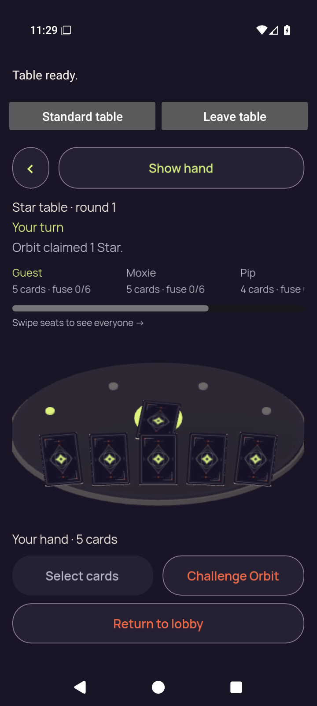</a>

`3d-seascape-leave-native-ready.png` · 720 × 1600 · 191,257 bytes.

SHA-256: `d6083540e66c3d1f872a9e4ac9bc302a9190ef9604fdc57ff6cf44f312f796fe`.

**Preserved image; unviewed.** Original adaptive screenshot preserved without a direct pixel view or an independently established reviewed-byte representative in this bounded still publication. Runtime predicates do not supply a pixel verdict.

### 3d-seascape-leave-selected

`3d-seascape-leave-selected.png` · 720 × 1600 · 112,307 bytes.

SHA-256: `fbd919d72b4e03178f370ab962ebe9ffb19ba8d5418c8a89c9b3102cab275a4f`.

**Preserved image; unviewed.** Original adaptive screenshot preserved without a direct pixel view or an independently established reviewed-byte representative in this bounded still publication. Runtime predicates do not supply a pixel verdict.

### 3d-seascape-leave-selector

<a href="runtime/captures/3d-seascape-leave-selector.png">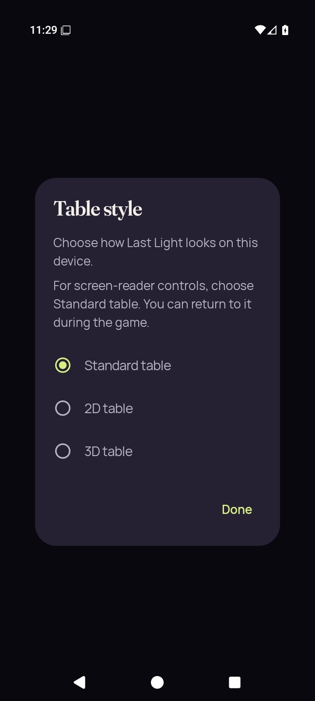</a>

`3d-seascape-leave-selector.png` · 720 × 1600 · 58,291 bytes.

SHA-256: `474aecc4c245b57b8e0c26ebc6a419afbeddad3cddfe4f9e0d2fe83453dcaa4e`.

**Preserved image; unviewed.** Original adaptive screenshot preserved without a direct pixel view or an independently established reviewed-byte representative in this bounded still publication. Runtime predicates do not supply a pixel verdict.

### 3d-seascape-portrait-native-ready

<a href="runtime/captures/3d-seascape-portrait-native-ready.png">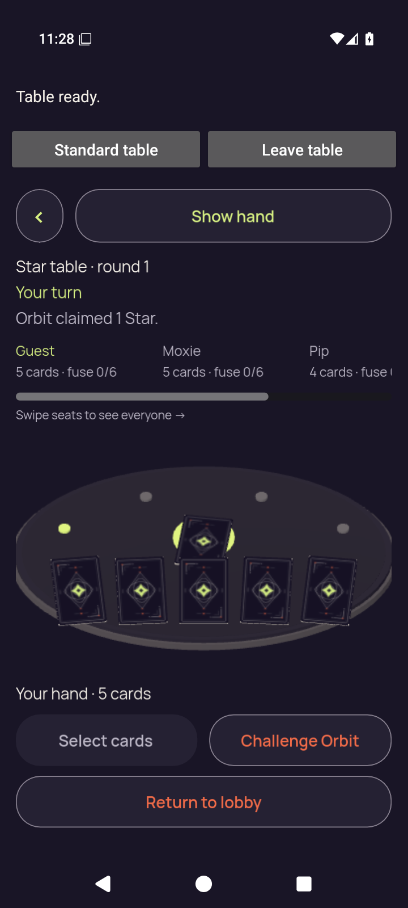</a>

`3d-seascape-portrait-native-ready.png` · 720 × 1600 · 191,260 bytes.

SHA-256: `907bf897fbda7d0e5f36e26c5b9b58d2798aab9b8bbb5c483392c522ac6db304`.

**Preserved image; unviewed.** Original adaptive screenshot preserved without a direct pixel view or an independently established reviewed-byte representative in this bounded still publication. Runtime predicates do not supply a pixel verdict.

### 3d-seascape-portrait-selector

<a href="runtime/captures/3d-seascape-portrait-selector.png">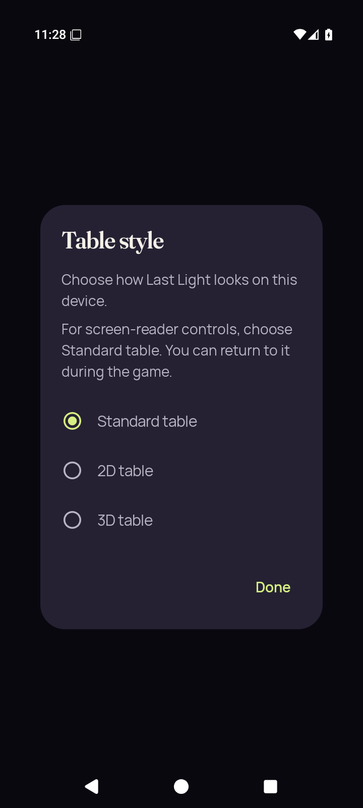</a>

`3d-seascape-portrait-selector.png` · 720 × 1600 · 58,332 bytes.

SHA-256: `7363a7fab2c9021d422c9eed4a58803a6c14bbb0427791878981181feadddfdc`.

**Preserved image; unviewed.** Original adaptive screenshot preserved without a direct pixel view or an independently established reviewed-byte representative in this bounded still publication. Runtime predicates do not supply a pixel verdict.

### 3d-seascape-reentry-selected

`3d-seascape-reentry-selected.png` · 720 × 1600 · 112,320 bytes.

SHA-256: `91e459d8857a00cb3eb72b55926eeef80ec3c77aabff9023ec032e69601ccba5`.

**Preserved image; unviewed.** Original adaptive screenshot preserved without a direct pixel view or an independently established reviewed-byte representative in this bounded still publication. Runtime predicates do not supply a pixel verdict.

### 3d-seascape-rotation-return-concealed

`3d-seascape-rotation-return-concealed.png` · 720 × 1600 · 117,112 bytes.

SHA-256: `3793c893cccdb6e99ba09d2a9e2d0767017825b0588e075e7b43aaab54e95399`.

**Preserved image; unviewed.** Original adaptive screenshot preserved without a direct pixel view or an independently established reviewed-byte representative in this bounded still publication. Runtime predicates do not supply a pixel verdict.

### 3d-seascape-rotation-return-first-card

`3d-seascape-rotation-return-first-card.png` · 720 × 1600 · 112,551 bytes.

SHA-256: `97ad3743cb4efbba5c4aaaa0fc30deffb75401b6ffe5f22f284e7e23b5147899`.

**Preserved image; unviewed.** Original adaptive screenshot preserved without a direct pixel view or an independently established reviewed-byte representative in this bounded still publication. Runtime predicates do not supply a pixel verdict.

### 3d-seascape-rotation-return-public

`3d-seascape-rotation-return-public.png` · 720 × 1600 · 117,370 bytes.

SHA-256: `b4018ebc34a1597692bc9a0f8852adfc4cc45b3b2ba220ebc5c885d4181c6960`.

**Preserved image; unviewed.** Original adaptive screenshot preserved without a direct pixel view or an independently established reviewed-byte representative in this bounded still publication. Runtime predicates do not supply a pixel verdict.

### 3d-seascape-rotation-return-selection-cleared

`3d-seascape-rotation-return-selection-cleared.png` · 720 × 1600 · 117,370 bytes.

SHA-256: `b4018ebc34a1597692bc9a0f8852adfc4cc45b3b2ba220ebc5c885d4181c6960`.

**Preserved image; unviewed.** Original adaptive screenshot preserved without a direct pixel view or an independently established reviewed-byte representative in this bounded still publication. Runtime predicates do not supply a pixel verdict.

### 3d-seascape-standard-return-concealed

`3d-seascape-standard-return-concealed.png` · 720 × 1600 · 117,512 bytes.

SHA-256: `a6eda1712d98d21c8b7ba0e8ac2f6d65bebe4df763cd1ec4ddf07c623f80806d`.

**Preserved image; unviewed.** Original adaptive screenshot preserved without a direct pixel view or an independently established reviewed-byte representative in this bounded still publication. Runtime predicates do not supply a pixel verdict.

### 3d-seascape-standard-return-first-card

`3d-seascape-standard-return-first-card.png` · 720 × 1600 · 112,649 bytes.

SHA-256: `09ea13e74db736b5ff92e4888bc17d791d5c15d51c80b6177e3f4c13e040bd8f`.

**Preserved image; unviewed.** Original adaptive screenshot preserved without a direct pixel view or an independently established reviewed-byte representative in this bounded still publication. Runtime predicates do not supply a pixel verdict.

### 3d-seascape-standard-return-public

`3d-seascape-standard-return-public.png` · 720 × 1600 · 117,469 bytes.

SHA-256: `d74a327a5094c61cda489c8d2447d5016049d8ffad8bce5d9ccae858e1cb37b5`.

**Preserved image; unviewed.** Original adaptive screenshot preserved without a direct pixel view or an independently established reviewed-byte representative in this bounded still publication. Runtime predicates do not supply a pixel verdict.

### 3d-seascape-standard-return-selection-cleared

`3d-seascape-standard-return-selection-cleared.png` · 720 × 1600 · 117,512 bytes.

SHA-256: `a6eda1712d98d21c8b7ba0e8ac2f6d65bebe4df763cd1ec4ddf07c623f80806d`.

**Preserved image; unviewed.** Original adaptive screenshot preserved without a direct pixel view or an independently established reviewed-byte representative in this bounded still publication. Runtime predicates do not supply a pixel verdict.

### 3d-split-baseline-first-card

<a href="runtime/captures/3d-split-baseline-first-card.png">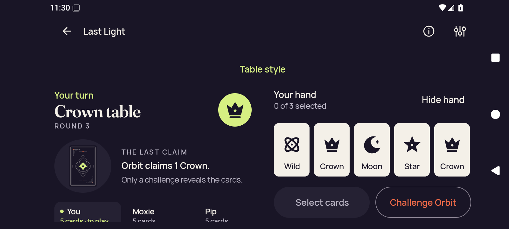</a>

`3d-split-baseline-first-card.png` · 1600 × 720 · 103,521 bytes.

SHA-256: `91c9d218d19ae7e5e8c6508e48f1453bbb7dae688ec6db52d6494427fed2019a`.

**Preserved image; unviewed.** Original adaptive screenshot preserved without a direct pixel view or an independently established reviewed-byte representative in this bounded still publication. Runtime predicates do not supply a pixel verdict.

### 3d-split-baseline-public

`3d-split-baseline-public.png` · 1600 × 720 · 107,942 bytes.

SHA-256: `6d79e1c19c4ff98a297cb29f70b2258111c781dfd83fa8fec6bfb7b3c0e60a1e`.

**Preserved image; unviewed.** Original adaptive screenshot preserved without a direct pixel view or an independently established reviewed-byte representative in this bounded still publication. Runtime predicates do not supply a pixel verdict.

### 3d-split-baseline-selected

<a href="runtime/captures/3d-split-baseline-selected.png">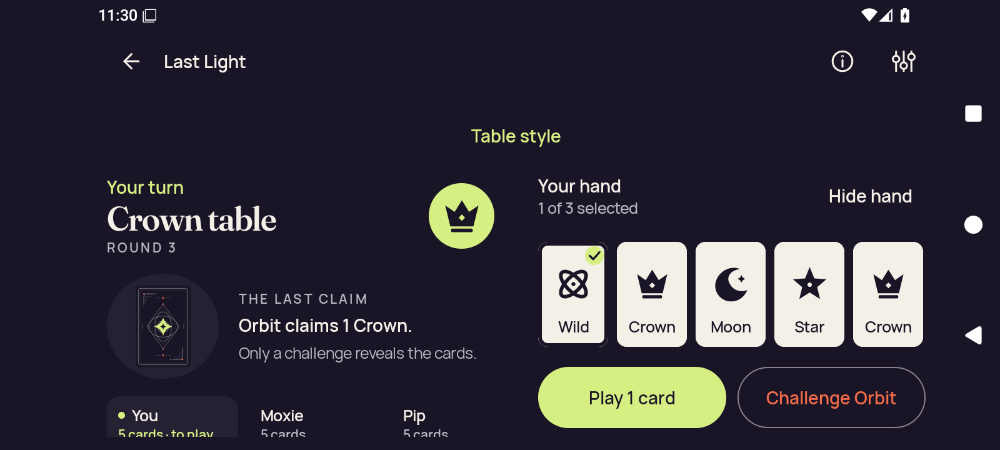</a>

`3d-split-baseline-selected.png` · 1600 × 720 · 104,291 bytes.

SHA-256: `6944a19e217683c03bfb1f5725a773bb1332b5a097576026c675b9eac2f0bc5e`.

**Preserved image; unviewed.** Original adaptive screenshot preserved without a direct pixel view or an independently established reviewed-byte representative in this bounded still publication. Runtime predicates do not supply a pixel verdict.

### 3d-split-entry-concealed

<a href="runtime/captures/3d-split-entry-concealed.png">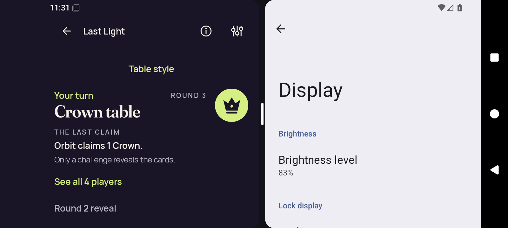</a>

`3d-split-entry-concealed.png` · 1600 × 720 · 79,409 bytes.

SHA-256: `fa19286515161ece506482822ef8d7e96b5987202d0be767988dda9e68284f89`.

**Preserved image; unviewed.** Original adaptive screenshot preserved without a direct pixel view or an independently established reviewed-byte representative in this bounded still publication. Runtime predicates do not supply a pixel verdict.

### 3d-split-entry-return-concealed

<a href="runtime/captures/3d-split-entry-return-concealed.png">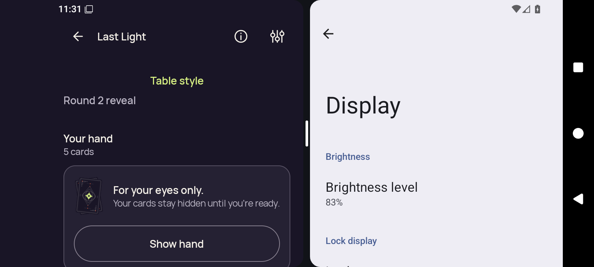</a>

`3d-split-entry-return-concealed.png` · 1600 × 720 · 77,994 bytes.

SHA-256: `4f3d7116065b30147d5890fb396967be987f185f376a16ec2e7d3de116cb76f2`.

**Preserved image; unviewed.** Original adaptive screenshot preserved without a direct pixel view or an independently established reviewed-byte representative in this bounded still publication. Runtime predicates do not supply a pixel verdict.

### 3d-split-entry-return-first-card

<a href="runtime/captures/3d-split-entry-return-first-card.png">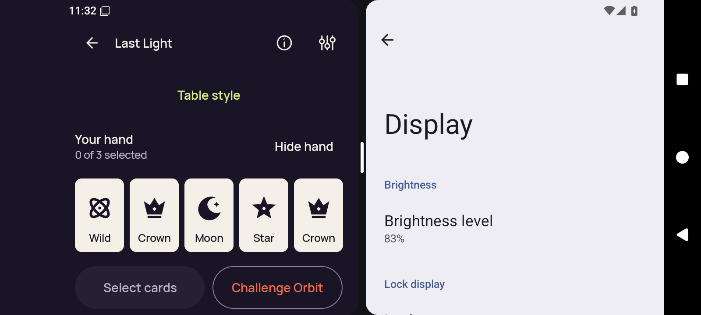</a>

`3d-split-entry-return-first-card.png` · 1600 × 720 · 78,183 bytes.

SHA-256: `aa9bd31664a8437247015dddb47594d3f46b2ed32fdc459a1f0e76b5a13db297`.

**Preserved image; unviewed.** Original adaptive screenshot preserved without a direct pixel view or an independently established reviewed-byte representative in this bounded still publication. Runtime predicates do not supply a pixel verdict.

### 3d-split-entry-return-public

<a href="runtime/captures/3d-split-entry-return-public.png">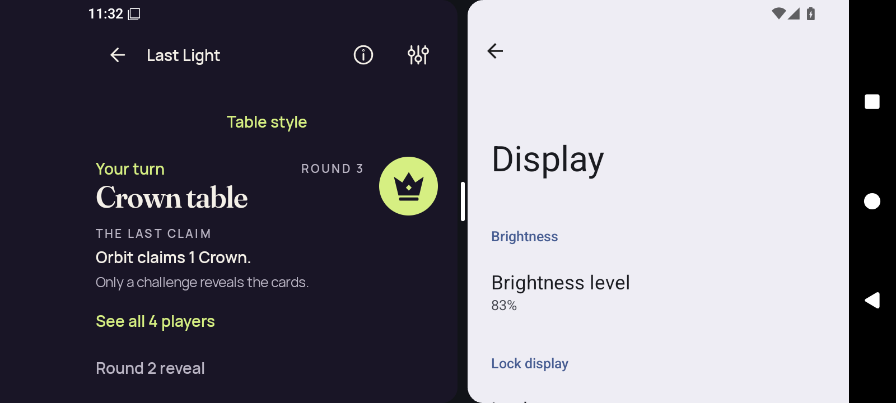</a>

`3d-split-entry-return-public.png` · 1600 × 720 · 79,753 bytes.

SHA-256: `4be4abccc279c04894c6feca64ee6d585e137f4be4e903de1521a55c4ca8168f`.

**Preserved image; unviewed.** Original adaptive screenshot preserved without a direct pixel view or an independently established reviewed-byte representative in this bounded still publication. Runtime predicates do not supply a pixel verdict.

### 3d-split-entry-return-selection-cleared

<a href="runtime/captures/3d-split-entry-return-selection-cleared.png">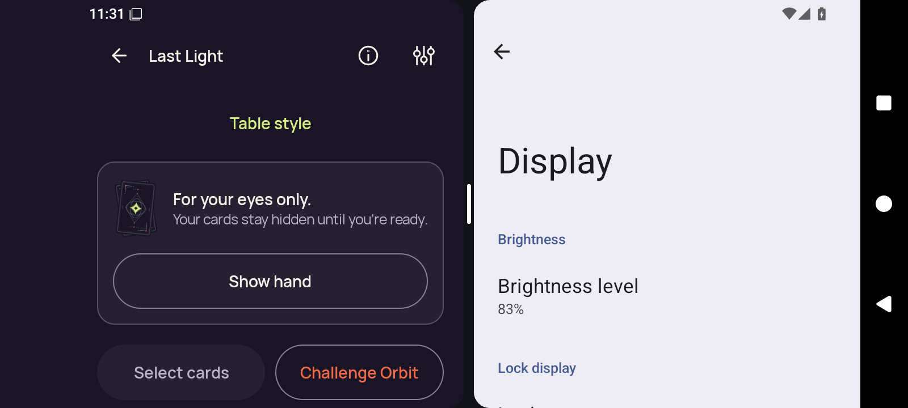</a>

`3d-split-entry-return-selection-cleared.png` · 1600 × 720 · 82,416 bytes.

SHA-256: `214dcf2f5b283f1f614f65c149b2dcaeb0ec1c1ae098f0360051cf47f0359855`.

**Preserved image; unviewed.** Original adaptive screenshot preserved without a direct pixel view or an independently established reviewed-byte representative in this bounded still publication. Runtime predicates do not supply a pixel verdict.

### 3d-split-exit-concealed

`3d-split-exit-concealed.png` · 1600 × 720 · 100,644 bytes.

SHA-256: `5aae288faab16df2ba9c8f6088dd5e271be9ca8ce3e4e680035245ddc401ccb0`.

**Preserved image; unviewed.** Original adaptive screenshot preserved without a direct pixel view or an independently established reviewed-byte representative in this bounded still publication. Runtime predicates do not supply a pixel verdict.

### 3d-split-exit-return-concealed

`3d-split-exit-return-concealed.png` · 1600 × 720 · 100,648 bytes.

SHA-256: `c12aa73bbb95b1c4dcce0fc1f71bbdf8e62e2f17436822f0aa086e9945b108d0`.

**Preserved image; unviewed.** Original adaptive screenshot preserved without a direct pixel view or an independently established reviewed-byte representative in this bounded still publication. Runtime predicates do not supply a pixel verdict.

### 3d-split-exit-return-first-card

`3d-split-exit-return-first-card.png` · 1600 × 720 · 103,058 bytes.

SHA-256: `e48eecbf6e71a3c0d829289e44bc54f662e38fe55aa6cb3b07c8649383d73fba`.

**Preserved image; unviewed.** Original adaptive screenshot preserved without a direct pixel view or an independently established reviewed-byte representative in this bounded still publication. Runtime predicates do not supply a pixel verdict.

### 3d-split-exit-return-public

`3d-split-exit-return-public.png` · 1600 × 720 · 107,485 bytes.

SHA-256: `76bd5d6a9b0dee2411b3c40f29d4d9c36083ecffd7c1559172f58c2d93f966d8`.

**Preserved image; unviewed.** Original adaptive screenshot preserved without a direct pixel view or an independently established reviewed-byte representative in this bounded still publication. Runtime predicates do not supply a pixel verdict.

### 3d-split-exit-return-selection-cleared

`3d-split-exit-return-selection-cleared.png` · 1600 × 720 · 107,485 bytes.

SHA-256: `76bd5d6a9b0dee2411b3c40f29d4d9c36083ecffd7c1559172f58c2d93f966d8`.

**Preserved image; unviewed.** Original adaptive screenshot preserved without a direct pixel view or an independently established reviewed-byte representative in this bounded still publication. Runtime predicates do not supply a pixel verdict.

### 3d-split-full-native-ready

<a href="runtime/captures/3d-split-full-native-ready.png">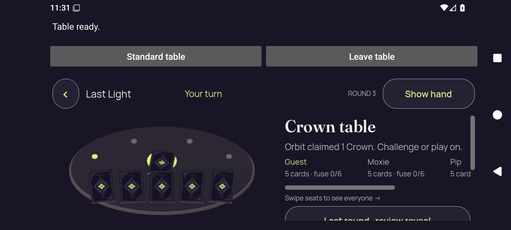</a>

`3d-split-full-native-ready.png` · 1600 × 720 · 169,114 bytes.

SHA-256: `625b6fd52953ef4d2db263407043b137d6c79fd01252816eefd2619bec6c1e6c`.

**Preserved image; unviewed.** Original adaptive screenshot preserved without a direct pixel view or an independently established reviewed-byte representative in this bounded still publication. Runtime predicates do not supply a pixel verdict.

### 3d-split-full-selector

`3d-split-full-selector.png` · 1600 × 720 · 40,384 bytes.

SHA-256: `9c6430be0e71dfef58afa2b0122d5b2175e7ebba77b09893d50eb2af9ce0a704`.

**Preserved image; unviewed.** Original adaptive screenshot preserved without a direct pixel view or an independently established reviewed-byte representative in this bounded still publication. Runtime predicates do not supply a pixel verdict.

### 3d-split-home

`3d-split-home.png` · 1600 × 720 · 135,668 bytes.

SHA-256: `d82bdd0e1228fd21b9b2bc6c1b87d0f74ab8dc531cc14c648eeae8a29fbdff5e`.

**Preserved image; unviewed.** Original adaptive screenshot preserved without a direct pixel view or an independently established reviewed-byte representative in this bounded still publication. Runtime predicates do not supply a pixel verdict.

### 3d-split-leave-confirmation

`3d-split-leave-confirmation.png` · 1600 × 720 · 39,931 bytes.

SHA-256: `e4bca32238104b5eba0c2b97bcf0cae63726190b14445c69dee1b695d20657fa`.

**Preserved image; unviewed.** Original adaptive screenshot preserved without a direct pixel view or an independently established reviewed-byte representative in this bounded still publication. Runtime predicates do not supply a pixel verdict.

### 3d-split-leave-native-ready

`3d-split-leave-native-ready.png` · 1600 × 720 · 169,244 bytes.

SHA-256: `ce5b2707031ad0062c44a9056026ce0f3b77544ec1f32db79bc0f7ef20f18d16`.

**Preserved image; unviewed.** Original adaptive screenshot preserved without a direct pixel view or an independently established reviewed-byte representative in this bounded still publication. Runtime predicates do not supply a pixel verdict.

### 3d-split-leave-selected

`3d-split-leave-selected.png` · 1600 × 720 · 103,968 bytes.

SHA-256: `d2611b44f81459ceb5e118a7a2a305633e87a76064bb37a9102af7f7b7932fc7`.

**Preserved image; unviewed.** Original adaptive screenshot preserved without a direct pixel view or an independently established reviewed-byte representative in this bounded still publication. Runtime predicates do not supply a pixel verdict.

### 3d-split-leave-selector

`3d-split-leave-selector.png` · 1600 × 720 · 40,422 bytes.

SHA-256: `712c1a532eec6d328a3aa97842a34541f12e713e545a4d4d57e994af560eb878`.

**Preserved image; unviewed.** Original adaptive screenshot preserved without a direct pixel view or an independently established reviewed-byte representative in this bounded still publication. Runtime predicates do not supply a pixel verdict.

### 3d-split-pane-native-ready

<a href="runtime/captures/3d-split-pane-native-ready.png">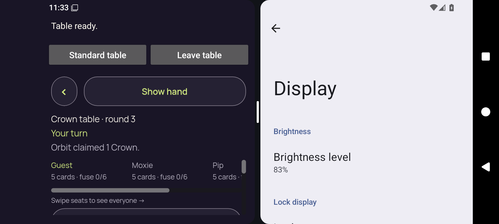</a>

`3d-split-pane-native-ready.png` · 1600 × 720 · 91,041 bytes.

SHA-256: `4c07e0484bbac867fad9d92caeaaeaae708eec0f76ee3de1223e870a2103a4e7`.

**Preserved image; unviewed.** Original adaptive screenshot preserved without a direct pixel view or an independently established reviewed-byte representative in this bounded still publication. Runtime predicates do not supply a pixel verdict.

### 3d-split-pane-selector

`3d-split-pane-selector.png` · 1600 × 720 · 61,394 bytes.

SHA-256: `fe8fdb095da8269b1023d59402058d185b796ce258637e6e2a7964bc33393d55`.

**Preserved image; unviewed.** Original adaptive screenshot preserved without a direct pixel view or an independently established reviewed-byte representative in this bounded still publication. Runtime predicates do not supply a pixel verdict.

### 3d-split-reentry-selected

<a href="runtime/captures/3d-split-reentry-selected.png">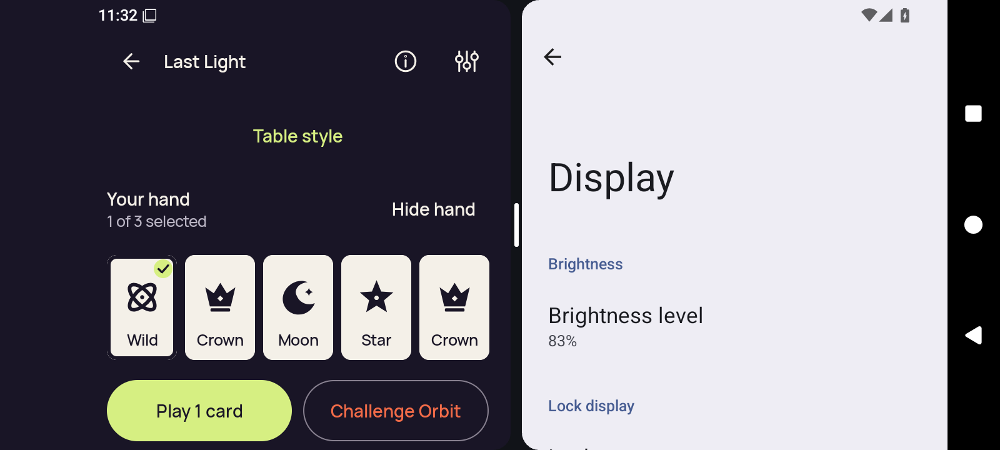</a>

`3d-split-reentry-selected.png` · 1600 × 720 · 78,831 bytes.

SHA-256: `1c608636646f7fa0fe40c94fcb88712aa8390aebd7bdc1ac287ae6a99a94eceb`.

**Preserved image; unviewed.** Original adaptive screenshot preserved without a direct pixel view or an independently established reviewed-byte representative in this bounded still publication. Runtime predicates do not supply a pixel verdict.

### final-diagnostic

`final-diagnostic.png` · 1600 × 720 · 135,668 bytes.

SHA-256: `d82bdd0e1228fd21b9b2bc6c1b87d0f74ab8dc531cc14c648eeae8a29fbdff5e`.

**Preserved image; unviewed.** Original adaptive screenshot preserved without a direct pixel view or an independently established reviewed-byte representative in this bounded still publication. Runtime predicates do not supply a pixel verdict.

Original media companions and review receipts

| Preserved file | Bytes | SHA-256 |
| --- | ---: | --- |
| [optimized/font-1.0/runtime/captures/2d-landscape-after-up.json](runtime/captures/2d-landscape-after-up.json) | 9,455 | `55c2fa56e3c38e2baec5cd0abc8d92efb2bc282315a54fd11b5154b7cf61d031` |
| [optimized/font-1.0/runtime/captures/2d-landscape-after-up.xml](runtime/captures/2d-landscape-after-up.xml) | 16,813 | `944c66f62534b0a13eaa5a8bc019248e4ab40d3ca561e575e73631dbf676d849` |
| [optimized/font-1.0/runtime/captures/2d-landscape-baseline-first-card.json](runtime/captures/2d-landscape-baseline-first-card.json) | 9,492 | `2fc194337c984b5b11d20581cff39577765f97bd6e8b4210a12c3ffbbbb0b0d3` |
| [optimized/font-1.0/runtime/captures/2d-landscape-baseline-first-card.xml](runtime/captures/2d-landscape-baseline-first-card.xml) | 22,436 | `0c9f3c55f54439b2bd9857dc5a1522e7926149ecb43331efefaef0d5be3ad151` |
| [optimized/font-1.0/runtime/captures/2d-landscape-baseline-public.json](runtime/captures/2d-landscape-baseline-public.json) | 9,480 | `1cf33b5498c675b433cbef733e32a7a2cde3bc58c45b7ec21c02ccf9383e6590` |
| [optimized/font-1.0/runtime/captures/2d-landscape-baseline-public.xml](runtime/captures/2d-landscape-baseline-public.xml) | 16,104 | `7954b7103302813f077c4b8c221700ba6c3a9327b86b770ef98c2514d892451a` |
| [optimized/font-1.0/runtime/captures/2d-landscape-baseline-selected.json](runtime/captures/2d-landscape-baseline-selected.json) | 9,486 | `9b761d01473051fac48a9a6b22a3b3e979a634eb60b3ff3d90348b19bd3f7e2d` |
| [optimized/font-1.0/runtime/captures/2d-landscape-baseline-selected.xml](runtime/captures/2d-landscape-baseline-selected.xml) | 22,432 | `c0087b8b02c2d31ccc64e50ca7a841dc290d3dc6810e8da32cd2c41ca4b1e6b8` |
| [optimized/font-1.0/runtime/captures/2d-landscape-home.json](runtime/captures/2d-landscape-home.json) | 9,447 | `54f949a8c8d9865bb852ee008460ed6df463bcef84d3a5744cebdb9c93f28a4d` |
| [optimized/font-1.0/runtime/captures/2d-landscape-home.xml](runtime/captures/2d-landscape-home.xml) | 13,534 | `8c516106e08aac703a072ba3006e89d6a8b0fa5345652accf20f3223429280af` |
| [optimized/font-1.0/runtime/captures/2d-landscape-initial-native-ready.json](runtime/captures/2d-landscape-initial-native-ready.json) | 11,765 | `5bc58906b029ab05e2f8576b3cca190a26749eb25e6285f261e0abd424b244c8` |
| [optimized/font-1.0/runtime/captures/2d-landscape-initial-native-ready.xml](runtime/captures/2d-landscape-initial-native-ready.xml) | 5,221 | `754b86f5cbebbc4c6c99e1fa9e8396fc2e130ca625e5aa955b3603944b61eb83` |
| [optimized/font-1.0/runtime/captures/2d-landscape-initial-selector.json](runtime/captures/2d-landscape-initial-selector.json) | 9,483 | `1464d10df3524357225e082e639232b3c07ca22675caf3b4805a5962eb310887` |
| [optimized/font-1.0/runtime/captures/2d-landscape-initial-selector.xml](runtime/captures/2d-landscape-initial-selector.xml) | 8,627 | `8dd6767d582b3214976da5bc917d1612ff1d2a90505cff45d2d13b88add95207` |
| [optimized/font-1.0/runtime/captures/2d-landscape-leave-confirmation.json](runtime/captures/2d-landscape-leave-confirmation.json) | 9,489 | `d5cfa02dc2de34f902926e039e16d7c517fd68405a69db90d8a9621f2c6e3a33` |
| [optimized/font-1.0/runtime/captures/2d-landscape-leave-confirmation.xml](runtime/captures/2d-landscape-leave-confirmation.xml) | 5,802 | `3979bafd154da469678fa69d82589043866471582a5d3f82c0108d000235530b` |
| [optimized/font-1.0/runtime/captures/2d-landscape-leave-native-ready.json](runtime/captures/2d-landscape-leave-native-ready.json) | 11,759 | `a503813f1c2c1a736e4a176e7fbc22e7dad21b4577644ecfddb99bcbfa512efa` |
| [optimized/font-1.0/runtime/captures/2d-landscape-leave-native-ready.xml](runtime/captures/2d-landscape-leave-native-ready.xml) | 5,203 | `f0f94a7bd1e71d110a6bdee9781bee1aafb9ddcb7099a51749306186a6bc94d5` |
| [optimized/font-1.0/runtime/captures/2d-landscape-leave-selected.json](runtime/captures/2d-landscape-leave-selected.json) | 9,477 | `bde42923817f87f6bd45a778966540135ab17b898be26071258e7f6735e98aef` |
| [optimized/font-1.0/runtime/captures/2d-landscape-leave-selected.xml](runtime/captures/2d-landscape-leave-selected.xml) | 22,434 | `863b18d1c4ff3b97df35e229246e1a3e89b9d8f5d0202675928721463ea606a3` |
| [optimized/font-1.0/runtime/captures/2d-landscape-leave-selector.json](runtime/captures/2d-landscape-leave-selector.json) | 9,477 | `4beed76f25dcfcc805249509d60ead9b39920c581e994c35388661889c5343e6` |
| [optimized/font-1.0/runtime/captures/2d-landscape-leave-selector.xml](runtime/captures/2d-landscape-leave-selector.xml) | 9,020 | `e26fdbe9fa5fb5cf4eefc26fe358d86cdc60af2dcae1433b3bd82ba04119c189` |
| [optimized/font-1.0/runtime/captures/2d-landscape-portrait-native-ready.json](runtime/captures/2d-landscape-portrait-native-ready.json) | 11,784 | `bf93a33c5ea4e61479c00e7ff2bb37f803b96e55f794b26c2349fd7146e83328` |
| [optimized/font-1.0/runtime/captures/2d-landscape-portrait-native-ready.xml](runtime/captures/2d-landscape-portrait-native-ready.xml) | 5,203 | `f0f94a7bd1e71d110a6bdee9781bee1aafb9ddcb7099a51749306186a6bc94d5` |
| [optimized/font-1.0/runtime/captures/2d-landscape-portrait-selector.json](runtime/captures/2d-landscape-portrait-selector.json) | 9,494 | `786a8eb3f462ee1895c66aee8cbf94d2f98f18c3540ed417867848bbdcda0edb` |
| [optimized/font-1.0/runtime/captures/2d-landscape-portrait-selector.xml](runtime/captures/2d-landscape-portrait-selector.xml) | 9,020 | `e26fdbe9fa5fb5cf4eefc26fe358d86cdc60af2dcae1433b3bd82ba04119c189` |
| [optimized/font-1.0/runtime/captures/2d-landscape-reentry-selected.json](runtime/captures/2d-landscape-reentry-selected.json) | 9,491 | `e5e4b61ac0a54f2b3db9e2052cbe0cc5ba27b3b000d9c40a382c363954c653c7` |
| [optimized/font-1.0/runtime/captures/2d-landscape-reentry-selected.xml](runtime/captures/2d-landscape-reentry-selected.xml) | 22,434 | `863b18d1c4ff3b97df35e229246e1a3e89b9d8f5d0202675928721463ea606a3` |
| [optimized/font-1.0/runtime/captures/2d-landscape-rotation-return-concealed.json](runtime/captures/2d-landscape-rotation-return-concealed.json) | 9,506 | `df00a55ce6d5261cea6a0f8f31bb0294216df8c3a821efa687c16489ddfd74c1` |
| [optimized/font-1.0/runtime/captures/2d-landscape-rotation-return-concealed.xml](runtime/captures/2d-landscape-rotation-return-concealed.xml) | 16,813 | `944c66f62534b0a13eaa5a8bc019248e4ab40d3ca561e575e73631dbf676d849` |
| [optimized/font-1.0/runtime/captures/2d-landscape-rotation-return-first-card.json](runtime/captures/2d-landscape-rotation-return-first-card.json) | 9,509 | `74382405d80c986728c4f48b094a6180fa7b5337f67345ca31c1668b21bc2aab` |
| [optimized/font-1.0/runtime/captures/2d-landscape-rotation-return-first-card.xml](runtime/captures/2d-landscape-rotation-return-first-card.xml) | 22,440 | `c4fe06e461be4b231dfdc10b8b9afc847d479b0518882a77306f993dd6aca84e` |
| [optimized/font-1.0/runtime/captures/2d-landscape-rotation-return-public.json](runtime/captures/2d-landscape-rotation-return-public.json) | 9,497 | `13e7930b72c3e5e56a5a02acb51970720ba8510877f7f7419239cbfb5a9e9f32` |
| [optimized/font-1.0/runtime/captures/2d-landscape-rotation-return-public.xml](runtime/captures/2d-landscape-rotation-return-public.xml) | 16,813 | `944c66f62534b0a13eaa5a8bc019248e4ab40d3ca561e575e73631dbf676d849` |
| [optimized/font-1.0/runtime/captures/2d-landscape-rotation-return-selection-cleared.json](runtime/captures/2d-landscape-rotation-return-selection-cleared.json) | 9,530 | `c561b1b2bf00c240fc3694a0bf2a82a2af512285e75c23e25c54fd9990629bed` |
| [optimized/font-1.0/runtime/captures/2d-landscape-rotation-return-selection-cleared.xml](runtime/captures/2d-landscape-rotation-return-selection-cleared.xml) | 16,813 | `944c66f62534b0a13eaa5a8bc019248e4ab40d3ca561e575e73631dbf676d849` |
| [optimized/font-1.0/runtime/captures/2d-landscape-standard-return-concealed.json](runtime/captures/2d-landscape-standard-return-concealed.json) | 9,518 | `10285459559305765fe619e151e79bd97899006af1edbdf3a33daf057ed95d36` |
| [optimized/font-1.0/runtime/captures/2d-landscape-standard-return-concealed.xml](runtime/captures/2d-landscape-standard-return-concealed.xml) | 16,813 | `944c66f62534b0a13eaa5a8bc019248e4ab40d3ca561e575e73631dbf676d849` |
| [optimized/font-1.0/runtime/captures/2d-landscape-standard-return-first-card.json](runtime/captures/2d-landscape-standard-return-first-card.json) | 9,521 | `9d0499295428e4471dbf67e2b076a54fcfb4d31b800bbfdbd1488c1f01351f5d` |
| [optimized/font-1.0/runtime/captures/2d-landscape-standard-return-first-card.xml](runtime/captures/2d-landscape-standard-return-first-card.xml) | 22,440 | `c4fe06e461be4b231dfdc10b8b9afc847d479b0518882a77306f993dd6aca84e` |
| [optimized/font-1.0/runtime/captures/2d-landscape-standard-return-public.json](runtime/captures/2d-landscape-standard-return-public.json) | 9,509 | `dea46cfbb60366768897eecd1ee253415e39886b0dd3c05dbd0889566275efce` |
| [optimized/font-1.0/runtime/captures/2d-landscape-standard-return-public.xml](runtime/captures/2d-landscape-standard-return-public.xml) | 16,813 | `944c66f62534b0a13eaa5a8bc019248e4ab40d3ca561e575e73631dbf676d849` |
| [optimized/font-1.0/runtime/captures/2d-landscape-standard-return-selection-cleared.json](runtime/captures/2d-landscape-standard-return-selection-cleared.json) | 9,542 | `89a87c8d38d5dd833ea6e0a02d1c2fa0e954d526c25a07736cb2b1e636b83a76` |
| [optimized/font-1.0/runtime/captures/2d-landscape-standard-return-selection-cleared.xml](runtime/captures/2d-landscape-standard-return-selection-cleared.xml) | 16,813 | `944c66f62534b0a13eaa5a8bc019248e4ab40d3ca561e575e73631dbf676d849` |
| [optimized/font-1.0/runtime/captures/2d-seascape-after-up.json](runtime/captures/2d-seascape-after-up.json) | 9,452 | `07f609336866063bc95a2e1a78c00e54a97ea0b4c1ceff9894c6d5e1af4a89b1` |
| [optimized/font-1.0/runtime/captures/2d-seascape-after-up.xml](runtime/captures/2d-seascape-after-up.xml) | 18,251 | `c5e5f37e65fdf796e186e0d93ab8c6833561ef407f8cafb4a458568a57df29ae` |
| [optimized/font-1.0/runtime/captures/2d-seascape-baseline-first-card.json](runtime/captures/2d-seascape-baseline-first-card.json) | 9,488 | `ebbfc5d5ebfef6e8f526ab56dcb7c73398651bf8701bd14813a9e77e81b3e923` |
| [optimized/font-1.0/runtime/captures/2d-seascape-baseline-first-card.xml](runtime/captures/2d-seascape-baseline-first-card.xml) | 23,867 | `c787636a2d9a39717b6678ba0a9b1a6f0da1149244c2f5c29984d9a184ed0c49` |
| [optimized/font-1.0/runtime/captures/2d-seascape-baseline-public.json](runtime/captures/2d-seascape-baseline-public.json) | 9,476 | `b1f43ad7c943268a0e4724d262d63215ef561af5b1c1dd5931fcca25fb418442` |
| [optimized/font-1.0/runtime/captures/2d-seascape-baseline-public.xml](runtime/captures/2d-seascape-baseline-public.xml) | 17,538 | `bfeb9f9a314819f3a4e2471a1876dddd515af6907d0f7a4be696575bb35a52bd` |
| [optimized/font-1.0/runtime/captures/2d-seascape-baseline-selected.json](runtime/captures/2d-seascape-baseline-selected.json) | 9,482 | `d38a9c59af53042957a4467afe61c0473eded930b47419e4439ec14eac46e507` |
| [optimized/font-1.0/runtime/captures/2d-seascape-baseline-selected.xml](runtime/captures/2d-seascape-baseline-selected.xml) | 23,863 | `f2cf144c76b88cd56e8df33b96dd2d9aa9e2480780d81320503e47dc1c486764` |
| [optimized/font-1.0/runtime/captures/2d-seascape-home.json](runtime/captures/2d-seascape-home.json) | 9,444 | `d1859e1f03eeca9a0a43870cf7174523d96c709b12b43e635d8e60f4e84110d4` |
| [optimized/font-1.0/runtime/captures/2d-seascape-home.xml](runtime/captures/2d-seascape-home.xml) | 13,534 | `8c516106e08aac703a072ba3006e89d6a8b0fa5345652accf20f3223429280af` |
| [optimized/font-1.0/runtime/captures/2d-seascape-initial-native-ready.json](runtime/captures/2d-seascape-initial-native-ready.json) | 11,762 | `156782b4217801c01f19a5201f7e73c0e2ad12fc00196971cc6f0188a10494f6` |
| [optimized/font-1.0/runtime/captures/2d-seascape-initial-native-ready.xml](runtime/captures/2d-seascape-initial-native-ready.xml) | 5,208 | `3d1f009e9155e261a42e26075c789d2729c5ce821a27a34a0014f22d816f323a` |
| [optimized/font-1.0/runtime/captures/2d-seascape-initial-selector.json](runtime/captures/2d-seascape-initial-selector.json) | 9,480 | `b1e13f087875c37067082bdea0c8659e2f1216d9e9688410fceb84d6b1198bcc` |
| [optimized/font-1.0/runtime/captures/2d-seascape-initial-selector.xml](runtime/captures/2d-seascape-initial-selector.xml) | 8,626 | `a52f8e349d92171867b46fbbb1a260e1bc9fbacf21da003b835b2b4277352d30` |
| [optimized/font-1.0/runtime/captures/2d-seascape-leave-confirmation.json](runtime/captures/2d-seascape-leave-confirmation.json) | 9,486 | `faae1ef26a96e4ad2c05c4a8edc625d201f8c1505da17c659d107639dcff4e79` |
| [optimized/font-1.0/runtime/captures/2d-seascape-leave-confirmation.xml](runtime/captures/2d-seascape-leave-confirmation.xml) | 5,802 | `3979bafd154da469678fa69d82589043866471582a5d3f82c0108d000235530b` |
| [optimized/font-1.0/runtime/captures/2d-seascape-leave-native-ready.json](runtime/captures/2d-seascape-leave-native-ready.json) | 11,756 | `93b010f7e426a690ba4fb2201e420e58d4e0e78cd400a654dba1d3b2a9f4ccc7` |
| [optimized/font-1.0/runtime/captures/2d-seascape-leave-native-ready.xml](runtime/captures/2d-seascape-leave-native-ready.xml) | 5,203 | `f0f94a7bd1e71d110a6bdee9781bee1aafb9ddcb7099a51749306186a6bc94d5` |
| [optimized/font-1.0/runtime/captures/2d-seascape-leave-selected.json](runtime/captures/2d-seascape-leave-selected.json) | 9,474 | `f46fe3ac17ceace47593b4c864ce5323e9e18c00c41eb220f10978bc6c0ff321` |
| [optimized/font-1.0/runtime/captures/2d-seascape-leave-selected.xml](runtime/captures/2d-seascape-leave-selected.xml) | 23,871 | `340c4b42450a72c850a1f88f518340d930df4f79f5c9d3da52b40a20b0003357` |
| [optimized/font-1.0/runtime/captures/2d-seascape-leave-selector.json](runtime/captures/2d-seascape-leave-selector.json) | 9,474 | `236fc27aa2dd3874f3782d2337ed38b58f6190ffcb2bd75e16b71a0dad094bd1` |
| [optimized/font-1.0/runtime/captures/2d-seascape-leave-selector.xml](runtime/captures/2d-seascape-leave-selector.xml) | 9,020 | `e26fdbe9fa5fb5cf4eefc26fe358d86cdc60af2dcae1433b3bd82ba04119c189` |
| [optimized/font-1.0/runtime/captures/2d-seascape-portrait-native-ready.json](runtime/captures/2d-seascape-portrait-native-ready.json) | 11,781 | `ad0c36a13593fd019a46c1b1f4603ea4373923870e0eca2f8ddea5a2d5c7b2b0` |
| [optimized/font-1.0/runtime/captures/2d-seascape-portrait-native-ready.xml](runtime/captures/2d-seascape-portrait-native-ready.xml) | 5,203 | `f0f94a7bd1e71d110a6bdee9781bee1aafb9ddcb7099a51749306186a6bc94d5` |
| [optimized/font-1.0/runtime/captures/2d-seascape-portrait-selector.json](runtime/captures/2d-seascape-portrait-selector.json) | 9,491 | `a70c50a4cfa55306d2979e805e2d2f7dff3184107c2da0d4652a9ef30009b155` |
| [optimized/font-1.0/runtime/captures/2d-seascape-portrait-selector.xml](runtime/captures/2d-seascape-portrait-selector.xml) | 9,020 | `e26fdbe9fa5fb5cf4eefc26fe358d86cdc60af2dcae1433b3bd82ba04119c189` |
| [optimized/font-1.0/runtime/captures/2d-seascape-reentry-selected.json](runtime/captures/2d-seascape-reentry-selected.json) | 9,488 | `18aeb3a79c95225d6348495d8078291f0e78af3c0375b8741d469e91aa69324b` |
| [optimized/font-1.0/runtime/captures/2d-seascape-reentry-selected.xml](runtime/captures/2d-seascape-reentry-selected.xml) | 23,871 | `340c4b42450a72c850a1f88f518340d930df4f79f5c9d3da52b40a20b0003357` |
| [optimized/font-1.0/runtime/captures/2d-seascape-rotation-return-concealed.json](runtime/captures/2d-seascape-rotation-return-concealed.json) | 9,503 | `1760403c5293b5b22e887f2239be878826ad780e83b0549fb8361355b621e07f` |
| [optimized/font-1.0/runtime/captures/2d-seascape-rotation-return-concealed.xml](runtime/captures/2d-seascape-rotation-return-concealed.xml) | 18,251 | `c5e5f37e65fdf796e186e0d93ab8c6833561ef407f8cafb4a458568a57df29ae` |
| [optimized/font-1.0/runtime/captures/2d-seascape-rotation-return-first-card.json](runtime/captures/2d-seascape-rotation-return-first-card.json) | 9,506 | `eaf66996b72b7408e3d6093c7aa0dfe655b4d8501f1bc167b3c04fce4e09b442` |
| [optimized/font-1.0/runtime/captures/2d-seascape-rotation-return-first-card.xml](runtime/captures/2d-seascape-rotation-return-first-card.xml) | 23,876 | `92a4c27a6b0f5bc084b548bd4ad880f9a6d2fc56b984e96686d28891ddf16eb4` |
| [optimized/font-1.0/runtime/captures/2d-seascape-rotation-return-public.json](runtime/captures/2d-seascape-rotation-return-public.json) | 9,494 | `2c3432afc009b1aa128566ee016b18ed71bffa7ce60abcca1bbbb075bdc4af6a` |
| [optimized/font-1.0/runtime/captures/2d-seascape-rotation-return-public.xml](runtime/captures/2d-seascape-rotation-return-public.xml) | 18,251 | `c5e5f37e65fdf796e186e0d93ab8c6833561ef407f8cafb4a458568a57df29ae` |
| [optimized/font-1.0/runtime/captures/2d-seascape-rotation-return-selection-cleared.json](runtime/captures/2d-seascape-rotation-return-selection-cleared.json) | 9,527 | `ebe09a5a96e445b6941659ae4d77886339dc4272cfa28b19d8eb30f239d9dd05` |
| [optimized/font-1.0/runtime/captures/2d-seascape-rotation-return-selection-cleared.xml](runtime/captures/2d-seascape-rotation-return-selection-cleared.xml) | 18,251 | `c5e5f37e65fdf796e186e0d93ab8c6833561ef407f8cafb4a458568a57df29ae` |
| [optimized/font-1.0/runtime/captures/2d-seascape-standard-return-concealed.json](runtime/captures/2d-seascape-standard-return-concealed.json) | 9,515 | `6c8849d38127871ab4fc5d63132b07a7dd7bf9dc707479513bd03f0b65189f92` |
| [optimized/font-1.0/runtime/captures/2d-seascape-standard-return-concealed.xml](runtime/captures/2d-seascape-standard-return-concealed.xml) | 18,251 | `c5e5f37e65fdf796e186e0d93ab8c6833561ef407f8cafb4a458568a57df29ae` |
| [optimized/font-1.0/runtime/captures/2d-seascape-standard-return-first-card.json](runtime/captures/2d-seascape-standard-return-first-card.json) | 9,518 | `accf24388a2ebb42c0f9feefe4c2b3623afa06ccf0733e93de7cab836a55cd12` |
| [optimized/font-1.0/runtime/captures/2d-seascape-standard-return-first-card.xml](runtime/captures/2d-seascape-standard-return-first-card.xml) | 23,876 | `92a4c27a6b0f5bc084b548bd4ad880f9a6d2fc56b984e96686d28891ddf16eb4` |
| [optimized/font-1.0/runtime/captures/2d-seascape-standard-return-public.json](runtime/captures/2d-seascape-standard-return-public.json) | 9,506 | `8dcf3a3003bcf8f628ccdee60b175b5f40eb3c2c75be76db110e3a95fbd91343` |
| [optimized/font-1.0/runtime/captures/2d-seascape-standard-return-public.xml](runtime/captures/2d-seascape-standard-return-public.xml) | 18,251 | `c5e5f37e65fdf796e186e0d93ab8c6833561ef407f8cafb4a458568a57df29ae` |
| [optimized/font-1.0/runtime/captures/2d-seascape-standard-return-selection-cleared.json](runtime/captures/2d-seascape-standard-return-selection-cleared.json) | 9,539 | `1264bd57296d1af4b852b3a5485c3904897f157d4486faf6afc4a11f004e0f59` |
| [optimized/font-1.0/runtime/captures/2d-seascape-standard-return-selection-cleared.xml](runtime/captures/2d-seascape-standard-return-selection-cleared.xml) | 18,251 | `c5e5f37e65fdf796e186e0d93ab8c6833561ef407f8cafb4a458568a57df29ae` |
| [optimized/font-1.0/runtime/captures/2d-split-baseline-first-card.json](runtime/captures/2d-split-baseline-first-card.json) | 11,265 | `8b5a6205eee1bcdcb8de3cf3cd7997e9dea952f5e3ff85dec0b14b3a7862c524` |
| [optimized/font-1.0/runtime/captures/2d-split-baseline-first-card.xml](runtime/captures/2d-split-baseline-first-card.xml) | 23,870 | `2ccf6df6876efbfacb41ade9078b0d871c34f0d7e39d65e80abd386fad6c9fde` |
| [optimized/font-1.0/runtime/captures/2d-split-baseline-public.json](runtime/captures/2d-split-baseline-public.json) | 11,253 | `82c701406f0d2c788b845eef91de904388394ca41f068e381a418c94ebc1991f` |
| [optimized/font-1.0/runtime/captures/2d-split-baseline-public.xml](runtime/captures/2d-split-baseline-public.xml) | 17,540 | `8119b87be2cb0bb88eb967147a3e2e3ee7a755ee70a7b2ea03574dcfea1b3c51` |
| [optimized/font-1.0/runtime/captures/2d-split-baseline-selected.json](runtime/captures/2d-split-baseline-selected.json) | 11,259 | `a9cc09301e4f8ef1908c21456defdf30af04403e199f22041d7524972215b6f1` |
| [optimized/font-1.0/runtime/captures/2d-split-baseline-selected.xml](runtime/captures/2d-split-baseline-selected.xml) | 23,866 | `cb4a9afbdfda0686a7c87bc0af21283f86bb2153567b94299dda867d215ed9e4` |
| [optimized/font-1.0/runtime/captures/2d-split-entry-concealed.json](runtime/captures/2d-split-entry-concealed.json) | 11,253 | `d460707092952b3a652a4fd8bf8bac1f6ab8d7134408a0b48c2b8e547668bcb1` |
| [optimized/font-1.0/runtime/captures/2d-split-entry-concealed.xml](runtime/captures/2d-split-entry-concealed.xml) | 12,096 | `c6b6bd16182cf794ac6e94375fe1f72340218800865025dba7146a153e8ac5e9` |
| [optimized/font-1.0/runtime/captures/2d-split-entry-return-concealed.json](runtime/captures/2d-split-entry-return-concealed.json) | 11,274 | `81b0f6d2bc66f72a04279d69c35ef6450219afadd55fff4f614cad392f5f5495` |
| [optimized/font-1.0/runtime/captures/2d-split-entry-return-concealed.xml](runtime/captures/2d-split-entry-return-concealed.xml) | 12,775 | `abb57178d5dcdce75ff6dfd1caaa1bfcac7eb56a7445f9d80072aac47a4c34a9` |
| [optimized/font-1.0/runtime/captures/2d-split-entry-return-first-card.json](runtime/captures/2d-split-entry-return-first-card.json) | 11,277 | `30924c9b57f0447b61071f73cb9b181b04c861dc4ef94a174970e75d4c02cff7` |
| [optimized/font-1.0/runtime/captures/2d-split-entry-return-first-card.xml](runtime/captures/2d-split-entry-return-first-card.xml) | 19,086 | `7511fc948e7c42b31019ae669c8aaf137bd84c733e28704874d5c2e744ba4b80` |
| [optimized/font-1.0/runtime/captures/2d-split-entry-return-public.json](runtime/captures/2d-split-entry-return-public.json) | 11,265 | `cc62feaf1eb2e44fcaf71c798edab52c534e87ac07823bae14c84d509c10a0cb` |
| [optimized/font-1.0/runtime/captures/2d-split-entry-return-public.xml](runtime/captures/2d-split-entry-return-public.xml) | 12,096 | `c6b6bd16182cf794ac6e94375fe1f72340218800865025dba7146a153e8ac5e9` |
| [optimized/font-1.0/runtime/captures/2d-split-entry-return-selection-cleared.json](runtime/captures/2d-split-entry-return-selection-cleared.json) | 11,298 | `26096e55daa01a5f5434dfe860e5addd95ab332752e1ec2ecd8817a431e4bdad` |
| [optimized/font-1.0/runtime/captures/2d-split-entry-return-selection-cleared.xml](runtime/captures/2d-split-entry-return-selection-cleared.xml) | 12,775 | `abb57178d5dcdce75ff6dfd1caaa1bfcac7eb56a7445f9d80072aac47a4c34a9` |
| [optimized/font-1.0/runtime/captures/2d-split-exit-concealed.json](runtime/captures/2d-split-exit-concealed.json) | 11,257 | `2553bd52497bccd27af2d6e312ff58e86ae7d6e5d9b3b5a99c0f467578cc74fe` |
| [optimized/font-1.0/runtime/captures/2d-split-exit-concealed.xml](runtime/captures/2d-split-exit-concealed.xml) | 17,526 | `b4fd470dfa60d1a958e3fec479b99ac973af6a31aa425e9c958606f11f5d5a4a` |
| [optimized/font-1.0/runtime/captures/2d-split-exit-return-concealed.json](runtime/captures/2d-split-exit-return-concealed.json) | 11,278 | `22bd759dd1accebabf62b0539985e9d0b5c018de50de1d53ec3be541fabc16ff` |
| [optimized/font-1.0/runtime/captures/2d-split-exit-return-concealed.xml](runtime/captures/2d-split-exit-return-concealed.xml) | 17,526 | `b4fd470dfa60d1a958e3fec479b99ac973af6a31aa425e9c958606f11f5d5a4a` |
| [optimized/font-1.0/runtime/captures/2d-split-exit-return-first-card.json](runtime/captures/2d-split-exit-return-first-card.json) | 11,281 | `3ea7d7228446a6531c6632edb612b3fe819ff23efd540e1de1caee4e7bb1128b` |
| [optimized/font-1.0/runtime/captures/2d-split-exit-return-first-card.xml](runtime/captures/2d-split-exit-return-first-card.xml) | 23,870 | `2ccf6df6876efbfacb41ade9078b0d871c34f0d7e39d65e80abd386fad6c9fde` |
| [optimized/font-1.0/runtime/captures/2d-split-exit-return-public.json](runtime/captures/2d-split-exit-return-public.json) | 11,269 | `b65094d3770cd0b1800ab6bde34c63de9f9b54b9f111cd63edc156272ce0e37e` |
| [optimized/font-1.0/runtime/captures/2d-split-exit-return-public.xml](runtime/captures/2d-split-exit-return-public.xml) | 17,540 | `8119b87be2cb0bb88eb967147a3e2e3ee7a755ee70a7b2ea03574dcfea1b3c51` |
| [optimized/font-1.0/runtime/captures/2d-split-exit-return-selection-cleared.json](runtime/captures/2d-split-exit-return-selection-cleared.json) | 11,302 | `390b56fdcfd4745df2ebdf4f99d37a9ff38a32d39fc1920d883274e244a5b2d8` |
| [optimized/font-1.0/runtime/captures/2d-split-exit-return-selection-cleared.xml](runtime/captures/2d-split-exit-return-selection-cleared.xml) | 17,540 | `8119b87be2cb0bb88eb967147a3e2e3ee7a755ee70a7b2ea03574dcfea1b3c51` |
| [optimized/font-1.0/runtime/captures/2d-split-full-native-ready.json](runtime/captures/2d-split-full-native-ready.json) | 13,537 | `87942551523aeb8d632145719d5f7ee576e933e49a974678628c8492c3c3047a` |
| [optimized/font-1.0/runtime/captures/2d-split-full-native-ready.xml](runtime/captures/2d-split-full-native-ready.xml) | 5,221 | `754b86f5cbebbc4c6c99e1fa9e8396fc2e130ca625e5aa955b3603944b61eb83` |
| [optimized/font-1.0/runtime/captures/2d-split-full-selector.json](runtime/captures/2d-split-full-selector.json) | 11,247 | `a0b644d462a16bb32520c11cd9a22bc613dd184a8d8a298e815c8c86a530581a` |
| [optimized/font-1.0/runtime/captures/2d-split-full-selector.xml](runtime/captures/2d-split-full-selector.xml) | 8,627 | `01b4b42671f8c99a7d92c3bbc0cc4b20a315292c0967230e6cc86ac7fda34108` |
| [optimized/font-1.0/runtime/captures/2d-split-home.json](runtime/captures/2d-split-home.json) | 11,232 | `16b43067023290fc5bbad75aee88402db6b61280f333f6002ff56ff0439652ed` |
| [optimized/font-1.0/runtime/captures/2d-split-home.xml](runtime/captures/2d-split-home.xml) | 12,781 | `569f473e48043efb184be21948bfa75e9c490fe008c274c44177c3af610d9d03` |
| [optimized/font-1.0/runtime/captures/2d-split-leave-confirmation.json](runtime/captures/2d-split-leave-confirmation.json) | 11,274 | `9442ea39437fde273347a9a125865aff5231d513c90f597c22e28ca3742f62e1` |
| [optimized/font-1.0/runtime/captures/2d-split-leave-confirmation.xml](runtime/captures/2d-split-leave-confirmation.xml) | 5,815 | `ef38d91109886057cd3220e98f78533a60e5a5095e9dd257bf67531136021e0d` |
| [optimized/font-1.0/runtime/captures/2d-split-leave-native-ready.json](runtime/captures/2d-split-leave-native-ready.json) | 13,544 | `df0f557697ba2a00490616573e0590aafb2e289d44f1bc095f5cb3a499992258` |
| [optimized/font-1.0/runtime/captures/2d-split-leave-native-ready.xml](runtime/captures/2d-split-leave-native-ready.xml) | 5,221 | `754b86f5cbebbc4c6c99e1fa9e8396fc2e130ca625e5aa955b3603944b61eb83` |
| [optimized/font-1.0/runtime/captures/2d-split-leave-selected.json](runtime/captures/2d-split-leave-selected.json) | 11,262 | `65c6811a26c56e5a67d6d08c05a3216cb8aa4e37a8611a49d1f9197446f38494` |
| [optimized/font-1.0/runtime/captures/2d-split-leave-selected.xml](runtime/captures/2d-split-leave-selected.xml) | 23,866 | `cb4a9afbdfda0686a7c87bc0af21283f86bb2153567b94299dda867d215ed9e4` |
| [optimized/font-1.0/runtime/captures/2d-split-leave-selector.json](runtime/captures/2d-split-leave-selector.json) | 11,262 | `e2445ff10591b359fa07673db539952735dbe02e2acf43f05e8749989e3aa6ed` |
| [optimized/font-1.0/runtime/captures/2d-split-leave-selector.xml](runtime/captures/2d-split-leave-selector.xml) | 8,627 | `7e92f64783561981d21f1f9a0032f439ef0cb22dd2fe0d7bb5828b2fd2af24ce` |
| [optimized/font-1.0/runtime/captures/2d-split-pane-native-ready.json](runtime/captures/2d-split-pane-native-ready.json) | 13,552 | `254f818d9446839ad895e41ad986fe64de8de5a21436cfc81340ac1680fda605` |
| [optimized/font-1.0/runtime/captures/2d-split-pane-native-ready.xml](runtime/captures/2d-split-pane-native-ready.xml) | 4,833 | `0473d0e383c20fede3fbb678c0a8663dc31176097c8d8e5b777d1f2e7d1c0364` |
| [optimized/font-1.0/runtime/captures/2d-split-pane-selector.json](runtime/captures/2d-split-pane-selector.json) | 11,254 | `258800001064e64b415b79a8e86e552d98bb37f70b69610a475e59e66cb98812` |
| [optimized/font-1.0/runtime/captures/2d-split-pane-selector.xml](runtime/captures/2d-split-pane-selector.xml) | 8,607 | `3dd7662e3798843ad068d96402ef48556d7b3ffb5d6077e205d430583f53e682` |
| [optimized/font-1.0/runtime/captures/2d-split-reentry-selected.json](runtime/captures/2d-split-reentry-selected.json) | 11,263 | `16d25b67cb6fd323c15d211c6cbf81c0c4a9b57f165f23d66fc9b4825c3b104a` |
| [optimized/font-1.0/runtime/captures/2d-split-reentry-selected.xml](runtime/captures/2d-split-reentry-selected.xml) | 19,082 | `c69ee069899b2400e0c5531ffccd4c262de2705e30c700d0b23c37a7816b41f9` |
| [optimized/font-1.0/runtime/captures/3d-landscape-after-up.json](runtime/captures/3d-landscape-after-up.json) | 11,244 | `fc56fbb34e8bba8e530a0b88fe23b60d239a4e8bf5d4aaf2d1bbb68cfba32a96` |
| [optimized/font-1.0/runtime/captures/3d-landscape-after-up.xml](runtime/captures/3d-landscape-after-up.xml) | 18,252 | `e3cd10e7d1e9fdc6650a5f7b016c3cff2d4a07190f152831d753522b318a26d4` |
| [optimized/font-1.0/runtime/captures/3d-landscape-baseline-first-card.json](runtime/captures/3d-landscape-baseline-first-card.json) | 11,281 | `c57d2ebcc64bd798b2b6a32aed6302bdad395ae20563898a3756da541bd68465` |
| [optimized/font-1.0/runtime/captures/3d-landscape-baseline-first-card.xml](runtime/captures/3d-landscape-baseline-first-card.xml) | 23,873 | `cacd97d185ca61c74a427bb8a8e36aaaa42b9ddfdac5e7cf9ea5221f16cd863d` |
| [optimized/font-1.0/runtime/captures/3d-landscape-baseline-public.json](runtime/captures/3d-landscape-baseline-public.json) | 11,269 | `07d8c5c8e5964d16c9fc656ed35e86ddbe30e0ac71d37c9bb24ae919393d3224` |
| [optimized/font-1.0/runtime/captures/3d-landscape-baseline-public.xml](runtime/captures/3d-landscape-baseline-public.xml) | 17,542 | `a99ded14158f9fac35c3029f4b37d2b549bdcd08a91bb15cd60b32e0d40d61de` |
| [optimized/font-1.0/runtime/captures/3d-landscape-baseline-selected.json](runtime/captures/3d-landscape-baseline-selected.json) | 11,275 | `f3555e8fa77ae37ce7a249b4af3c62332fd1f39d1fd349cefe40e9027a8be4b3` |
| [optimized/font-1.0/runtime/captures/3d-landscape-baseline-selected.xml](runtime/captures/3d-landscape-baseline-selected.xml) | 23,869 | `381f626f772a51d06b8b08b31666f751a66a4cb8f860aea53a9cc7f02c819301` |
| [optimized/font-1.0/runtime/captures/3d-landscape-home.json](runtime/captures/3d-landscape-home.json) | 11,236 | `0767a47f80c45ff1e651af3f626d51e5baf34b8631f94889e37e765cd62df0bd` |
| [optimized/font-1.0/runtime/captures/3d-landscape-home.xml](runtime/captures/3d-landscape-home.xml) | 13,534 | `8c516106e08aac703a072ba3006e89d6a8b0fa5345652accf20f3223429280af` |
| [optimized/font-1.0/runtime/captures/3d-landscape-initial-native-ready.json](runtime/captures/3d-landscape-initial-native-ready.json) | 13,562 | `5455b8a175743b9d6ff0ba32b5554c783ff097ed0d953fc1b135a38629e50d1d` |
| [optimized/font-1.0/runtime/captures/3d-landscape-initial-native-ready.xml](runtime/captures/3d-landscape-initial-native-ready.xml) | 5,221 | `754b86f5cbebbc4c6c99e1fa9e8396fc2e130ca625e5aa955b3603944b61eb83` |
| [optimized/font-1.0/runtime/captures/3d-landscape-initial-selector.json](runtime/captures/3d-landscape-initial-selector.json) | 11,272 | `5b4d7f1cf9879f55562a46fbdced7fb4570511aa92182ef2b351f3622ed19341` |
| [optimized/font-1.0/runtime/captures/3d-landscape-initial-selector.xml](runtime/captures/3d-landscape-initial-selector.xml) | 8,627 | `4994870601f0dccf05892fa571241151ecf6058f0c0364a40129d217802bcb37` |
| [optimized/font-1.0/runtime/captures/3d-landscape-leave-confirmation.json](runtime/captures/3d-landscape-leave-confirmation.json) | 11,278 | `1251e8b6f35199dd0cfa65764cdee9fca815c4802146c5fd68c9f9a5514ad68c` |
| [optimized/font-1.0/runtime/captures/3d-landscape-leave-confirmation.xml](runtime/captures/3d-landscape-leave-confirmation.xml) | 5,802 | `3979bafd154da469678fa69d82589043866471582a5d3f82c0108d000235530b` |
| [optimized/font-1.0/runtime/captures/3d-landscape-leave-native-ready.json](runtime/captures/3d-landscape-leave-native-ready.json) | 13,564 | `7f4f9a5fb7890d2cc63f0a7377cc8f2d45a8b0912c8e7eb962cf46ecb25b4995` |
| [optimized/font-1.0/runtime/captures/3d-landscape-leave-native-ready.xml](runtime/captures/3d-landscape-leave-native-ready.xml) | 5,203 | `f0f94a7bd1e71d110a6bdee9781bee1aafb9ddcb7099a51749306186a6bc94d5` |
| [optimized/font-1.0/runtime/captures/3d-landscape-leave-selected.json](runtime/captures/3d-landscape-leave-selected.json) | 11,266 | `86a548edc10ede7b4dddff04bc9ae5df2ed72067a8969dee4f1509edfebaa51a` |
| [optimized/font-1.0/runtime/captures/3d-landscape-leave-selected.xml](runtime/captures/3d-landscape-leave-selected.xml) | 23,873 | `b8afa5add8ba2d3f292f9ce1999f03d1ae38171de7937dc5b91efa51f32b962a` |
| [optimized/font-1.0/runtime/captures/3d-landscape-leave-selector.json](runtime/captures/3d-landscape-leave-selector.json) | 11,266 | `2e2f50bd6468cf8bf829dbe8adca914f4d107a22ce77bd3904fb07b0ba316e2e` |
| [optimized/font-1.0/runtime/captures/3d-landscape-leave-selector.xml](runtime/captures/3d-landscape-leave-selector.xml) | 9,020 | `e26fdbe9fa5fb5cf4eefc26fe358d86cdc60af2dcae1433b3bd82ba04119c189` |
| [optimized/font-1.0/runtime/captures/3d-landscape-portrait-native-ready.json](runtime/captures/3d-landscape-portrait-native-ready.json) | 13,581 | `5ac1b4a4f5ea608ab56738a39b32d17ca2c2dc9979d353adfc7651cf1a07be10` |
| [optimized/font-1.0/runtime/captures/3d-landscape-portrait-native-ready.xml](runtime/captures/3d-landscape-portrait-native-ready.xml) | 5,203 | `f0f94a7bd1e71d110a6bdee9781bee1aafb9ddcb7099a51749306186a6bc94d5` |
| [optimized/font-1.0/runtime/captures/3d-landscape-portrait-selector.json](runtime/captures/3d-landscape-portrait-selector.json) | 11,283 | `90fbd1d0c323253eb3963f5065c388f03c3c9ede6d5bcdc45ab007da861adbfb` |
| [optimized/font-1.0/runtime/captures/3d-landscape-portrait-selector.xml](runtime/captures/3d-landscape-portrait-selector.xml) | 9,020 | `e26fdbe9fa5fb5cf4eefc26fe358d86cdc60af2dcae1433b3bd82ba04119c189` |
| [optimized/font-1.0/runtime/captures/3d-landscape-reentry-selected.json](runtime/captures/3d-landscape-reentry-selected.json) | 11,280 | `8d4686093a24f40931026f46d455cd011e62be50321a0f558fb5f49d6177d64c` |
| [optimized/font-1.0/runtime/captures/3d-landscape-reentry-selected.xml](runtime/captures/3d-landscape-reentry-selected.xml) | 23,873 | `b8afa5add8ba2d3f292f9ce1999f03d1ae38171de7937dc5b91efa51f32b962a` |
| [optimized/font-1.0/runtime/captures/3d-landscape-rotation-return-concealed.json](runtime/captures/3d-landscape-rotation-return-concealed.json) | 11,295 | `6b03cd5c2db7e0d6cde1dbe50ae9ab7b2ab39babe51035391cf625c2e4fe3348` |
| [optimized/font-1.0/runtime/captures/3d-landscape-rotation-return-concealed.xml](runtime/captures/3d-landscape-rotation-return-concealed.xml) | 18,252 | `e3cd10e7d1e9fdc6650a5f7b016c3cff2d4a07190f152831d753522b318a26d4` |
| [optimized/font-1.0/runtime/captures/3d-landscape-rotation-return-first-card.json](runtime/captures/3d-landscape-rotation-return-first-card.json) | 11,298 | `fba5f0fc0a3dd015ada731254333fe3ea4472a53e58a041af4e6fa02ae5d3659` |
| [optimized/font-1.0/runtime/captures/3d-landscape-rotation-return-first-card.xml](runtime/captures/3d-landscape-rotation-return-first-card.xml) | 23,878 | `2ed49b85255d79933b3d68ed6997b759c2c5dd0ed31ee62b2632dc0f68617e35` |
| [optimized/font-1.0/runtime/captures/3d-landscape-rotation-return-public.json](runtime/captures/3d-landscape-rotation-return-public.json) | 11,286 | `b493a41e6802ef2ad375f8b90ae036812b842a76b2e4631b08456e174be96eb8` |
| [optimized/font-1.0/runtime/captures/3d-landscape-rotation-return-public.xml](runtime/captures/3d-landscape-rotation-return-public.xml) | 18,252 | `e3cd10e7d1e9fdc6650a5f7b016c3cff2d4a07190f152831d753522b318a26d4` |
| [optimized/font-1.0/runtime/captures/3d-landscape-rotation-return-selection-cleared.json](runtime/captures/3d-landscape-rotation-return-selection-cleared.json) | 11,319 | `626d057f835b65204524061636936fe024630df99c18bf67d2a7141160611535` |
| [optimized/font-1.0/runtime/captures/3d-landscape-rotation-return-selection-cleared.xml](runtime/captures/3d-landscape-rotation-return-selection-cleared.xml) | 18,252 | `e3cd10e7d1e9fdc6650a5f7b016c3cff2d4a07190f152831d753522b318a26d4` |
| [optimized/font-1.0/runtime/captures/3d-landscape-standard-return-concealed.json](runtime/captures/3d-landscape-standard-return-concealed.json) | 11,307 | `fd4872937707010b4be6a526fde9fa10bc2ba116d7a010b7fb848d531fd2375a` |
| [optimized/font-1.0/runtime/captures/3d-landscape-standard-return-concealed.xml](runtime/captures/3d-landscape-standard-return-concealed.xml) | 18,252 | `e3cd10e7d1e9fdc6650a5f7b016c3cff2d4a07190f152831d753522b318a26d4` |
| [optimized/font-1.0/runtime/captures/3d-landscape-standard-return-first-card.json](runtime/captures/3d-landscape-standard-return-first-card.json) | 11,310 | `591dfb601a027200fbf64a4434029833465459488553276e98fdd235a73beb11` |
| [optimized/font-1.0/runtime/captures/3d-landscape-standard-return-first-card.xml](runtime/captures/3d-landscape-standard-return-first-card.xml) | 23,878 | `2ed49b85255d79933b3d68ed6997b759c2c5dd0ed31ee62b2632dc0f68617e35` |
| [optimized/font-1.0/runtime/captures/3d-landscape-standard-return-public.json](runtime/captures/3d-landscape-standard-return-public.json) | 11,298 | `4d8c232c0c7735dfbde1b992ef2edee33d82e271dc2de63dac5a550b3f86c692` |
| [optimized/font-1.0/runtime/captures/3d-landscape-standard-return-public.xml](runtime/captures/3d-landscape-standard-return-public.xml) | 18,252 | `e3cd10e7d1e9fdc6650a5f7b016c3cff2d4a07190f152831d753522b318a26d4` |
| [optimized/font-1.0/runtime/captures/3d-landscape-standard-return-selection-cleared.json](runtime/captures/3d-landscape-standard-return-selection-cleared.json) | 11,331 | `9ca16be915614e0f1e3a4ed824ffe428db5acc940b0a172deef1f05ac0524d88` |
| [optimized/font-1.0/runtime/captures/3d-landscape-standard-return-selection-cleared.xml](runtime/captures/3d-landscape-standard-return-selection-cleared.xml) | 18,252 | `e3cd10e7d1e9fdc6650a5f7b016c3cff2d4a07190f152831d753522b318a26d4` |
| [optimized/font-1.0/runtime/captures/3d-seascape-after-up.json](runtime/captures/3d-seascape-after-up.json) | 11,240 | `a73b5dff4e4785ad80c6c4da7afc056cfdafef5e8bd5a11c056d47e2be8b20ea` |
| [optimized/font-1.0/runtime/captures/3d-seascape-after-up.xml](runtime/captures/3d-seascape-after-up.xml) | 18,249 | `40f9c5c9fff493821a1d16ce3e7e45ff5f63019880e4795e2a98bdf8dbc5bc47` |
| [optimized/font-1.0/runtime/captures/3d-seascape-baseline-first-card.json](runtime/captures/3d-seascape-baseline-first-card.json) | 11,277 | `df29cd1e5636a6c23136553b9f4f2171c33601c8b9dea87e8f58c224448a308a` |
| [optimized/font-1.0/runtime/captures/3d-seascape-baseline-first-card.xml](runtime/captures/3d-seascape-baseline-first-card.xml) | 23,865 | `de24add051ae84e25995e88e4fd57215e3332069407a750457ccfa86f832dbdc` |
| [optimized/font-1.0/runtime/captures/3d-seascape-baseline-public.json](runtime/captures/3d-seascape-baseline-public.json) | 11,265 | `d778fa126eeeffd8e1a3d7f946309a9f531f5b2a4d8269acd0092baa163c568a` |
| [optimized/font-1.0/runtime/captures/3d-seascape-baseline-public.xml](runtime/captures/3d-seascape-baseline-public.xml) | 17,536 | `c2b71c6159e3dde3a7a4c3df5e7c92abab8c74c79506f036698293dfb3580a67` |
| [optimized/font-1.0/runtime/captures/3d-seascape-baseline-selected.json](runtime/captures/3d-seascape-baseline-selected.json) | 11,271 | `954f5b2d4d42697b5b63ccd0ee01075cf38a76d4c066a41f6a7239634ed68a80` |
| [optimized/font-1.0/runtime/captures/3d-seascape-baseline-selected.xml](runtime/captures/3d-seascape-baseline-selected.xml) | 23,861 | `c28d03a507292d2e871400ab04c8e23b005fbfc6cf5cc1fbeafeacbd08bff387` |
| [optimized/font-1.0/runtime/captures/3d-seascape-home.json](runtime/captures/3d-seascape-home.json) | 11,232 | `e8e5447b19f73defdf0a23e7100efecf06a7cfdee6b3148b45a1d9ebdf9f8442` |
| [optimized/font-1.0/runtime/captures/3d-seascape-home.xml](runtime/captures/3d-seascape-home.xml) | 13,534 | `8c516106e08aac703a072ba3006e89d6a8b0fa5345652accf20f3223429280af` |
| [optimized/font-1.0/runtime/captures/3d-seascape-initial-native-ready.json](runtime/captures/3d-seascape-initial-native-ready.json) | 13,558 | `5bc62d7d6e1848f743794336408e66d78e89e71b8e8de55a3590f23e2904dc77` |
| [optimized/font-1.0/runtime/captures/3d-seascape-initial-native-ready.xml](runtime/captures/3d-seascape-initial-native-ready.xml) | 5,208 | `3d1f009e9155e261a42e26075c789d2729c5ce821a27a34a0014f22d816f323a` |
| [optimized/font-1.0/runtime/captures/3d-seascape-initial-selector.json](runtime/captures/3d-seascape-initial-selector.json) | 11,268 | `4e527a1fbb8f5ceae2d93514698d83f119f808e01e865b31aa794f9807863c7c` |
| [optimized/font-1.0/runtime/captures/3d-seascape-initial-selector.xml](runtime/captures/3d-seascape-initial-selector.xml) | 8,626 | `f6bb99823b3b11180d605f9b4a0940d70982f4ae3e110fd478b6accfc316fcea` |
| [optimized/font-1.0/runtime/captures/3d-seascape-leave-confirmation.json](runtime/captures/3d-seascape-leave-confirmation.json) | 11,274 | `f68f07596f3a2afc477e910b03d42a1a3ff04fffbf9e696a238ca1dacd1bb3d4` |
| [optimized/font-1.0/runtime/captures/3d-seascape-leave-confirmation.xml](runtime/captures/3d-seascape-leave-confirmation.xml) | 5,802 | `3979bafd154da469678fa69d82589043866471582a5d3f82c0108d000235530b` |
| [optimized/font-1.0/runtime/captures/3d-seascape-leave-native-ready.json](runtime/captures/3d-seascape-leave-native-ready.json) | 13,552 | `c2678590fe2c9adc061b66e87bdf574b6d7fc6fa3025f9d4197b2b5476b11146` |
| [optimized/font-1.0/runtime/captures/3d-seascape-leave-native-ready.xml](runtime/captures/3d-seascape-leave-native-ready.xml) | 5,203 | `f0f94a7bd1e71d110a6bdee9781bee1aafb9ddcb7099a51749306186a6bc94d5` |
| [optimized/font-1.0/runtime/captures/3d-seascape-leave-selected.json](runtime/captures/3d-seascape-leave-selected.json) | 11,262 | `0f3f5326ce458623947416cf5c77a3166f680bdfaec2c4bdcf1421ea1a5d1552` |
| [optimized/font-1.0/runtime/captures/3d-seascape-leave-selected.xml](runtime/captures/3d-seascape-leave-selected.xml) | 23,868 | `d3fd34bc9955b3439251ec436b5cb74b8196d0e25c7bee8d6eb7821bb7c239bb` |
| [optimized/font-1.0/runtime/captures/3d-seascape-leave-selector.json](runtime/captures/3d-seascape-leave-selector.json) | 11,262 | `c235a7d338c5c747e87266494896d781b4f6dc8526112ca6820edb49f4d68de2` |
| [optimized/font-1.0/runtime/captures/3d-seascape-leave-selector.xml](runtime/captures/3d-seascape-leave-selector.xml) | 9,020 | `e26fdbe9fa5fb5cf4eefc26fe358d86cdc60af2dcae1433b3bd82ba04119c189` |
| [optimized/font-1.0/runtime/captures/3d-seascape-portrait-native-ready.json](runtime/captures/3d-seascape-portrait-native-ready.json) | 13,577 | `fa08e3c627edb2b19b8c35f9560b4b4b153481d82ccdf28e42956a8c38e1dd70` |
| [optimized/font-1.0/runtime/captures/3d-seascape-portrait-native-ready.xml](runtime/captures/3d-seascape-portrait-native-ready.xml) | 5,203 | `f0f94a7bd1e71d110a6bdee9781bee1aafb9ddcb7099a51749306186a6bc94d5` |
| [optimized/font-1.0/runtime/captures/3d-seascape-portrait-selector.json](runtime/captures/3d-seascape-portrait-selector.json) | 11,279 | `b46e5b6a29b9eb3b72d37dfea5ad1a7eb6938fa006ead2acdfacab1782dcf69c` |
| [optimized/font-1.0/runtime/captures/3d-seascape-portrait-selector.xml](runtime/captures/3d-seascape-portrait-selector.xml) | 9,020 | `e26fdbe9fa5fb5cf4eefc26fe358d86cdc60af2dcae1433b3bd82ba04119c189` |
| [optimized/font-1.0/runtime/captures/3d-seascape-reentry-selected.json](runtime/captures/3d-seascape-reentry-selected.json) | 11,276 | `111d3cc2bf1fad5847998d7d535e77443634df9422a64be8cacc5855897b06b2` |
| [optimized/font-1.0/runtime/captures/3d-seascape-reentry-selected.xml](runtime/captures/3d-seascape-reentry-selected.xml) | 23,868 | `d3fd34bc9955b3439251ec436b5cb74b8196d0e25c7bee8d6eb7821bb7c239bb` |
| [optimized/font-1.0/runtime/captures/3d-seascape-rotation-return-concealed.json](runtime/captures/3d-seascape-rotation-return-concealed.json) | 11,291 | `aab6a3a0ea317fce049e859da2b79c5008612eff750df12d2863c536c305d533` |
| [optimized/font-1.0/runtime/captures/3d-seascape-rotation-return-concealed.xml](runtime/captures/3d-seascape-rotation-return-concealed.xml) | 18,249 | `40f9c5c9fff493821a1d16ce3e7e45ff5f63019880e4795e2a98bdf8dbc5bc47` |
| [optimized/font-1.0/runtime/captures/3d-seascape-rotation-return-first-card.json](runtime/captures/3d-seascape-rotation-return-first-card.json) | 11,294 | `f67b1ff4c564105d356a7937899252c7c0519a18e3f8f74a535b8a4d9c15cfbc` |
| [optimized/font-1.0/runtime/captures/3d-seascape-rotation-return-first-card.xml](runtime/captures/3d-seascape-rotation-return-first-card.xml) | 23,874 | `2f95d53fe8feefe82791e5ab62f8bee651c5c9e2472988e47c053e1ae4888a6f` |
| [optimized/font-1.0/runtime/captures/3d-seascape-rotation-return-public.json](runtime/captures/3d-seascape-rotation-return-public.json) | 11,282 | `bc1fe258e187181ee165127047871b85d2b513245bf097689f5fef06845d12b0` |
| [optimized/font-1.0/runtime/captures/3d-seascape-rotation-return-public.xml](runtime/captures/3d-seascape-rotation-return-public.xml) | 18,249 | `40f9c5c9fff493821a1d16ce3e7e45ff5f63019880e4795e2a98bdf8dbc5bc47` |
| [optimized/font-1.0/runtime/captures/3d-seascape-rotation-return-selection-cleared.json](runtime/captures/3d-seascape-rotation-return-selection-cleared.json) | 11,315 | `f0b427fc131a66a45a2f9d65f0191a92d32a47a0bd70acae1dd2dce91b343341` |
| [optimized/font-1.0/runtime/captures/3d-seascape-rotation-return-selection-cleared.xml](runtime/captures/3d-seascape-rotation-return-selection-cleared.xml) | 18,249 | `40f9c5c9fff493821a1d16ce3e7e45ff5f63019880e4795e2a98bdf8dbc5bc47` |
| [optimized/font-1.0/runtime/captures/3d-seascape-standard-return-concealed.json](runtime/captures/3d-seascape-standard-return-concealed.json) | 11,303 | `e71adac8690734cd9f29db3dfcfb403a6788ed458420810b60d436fd022d5207` |
| [optimized/font-1.0/runtime/captures/3d-seascape-standard-return-concealed.xml](runtime/captures/3d-seascape-standard-return-concealed.xml) | 18,249 | `40f9c5c9fff493821a1d16ce3e7e45ff5f63019880e4795e2a98bdf8dbc5bc47` |
| [optimized/font-1.0/runtime/captures/3d-seascape-standard-return-first-card.json](runtime/captures/3d-seascape-standard-return-first-card.json) | 11,306 | `7d337600ce10963b8dcb346f68550bba7332be1e8e8feb2f6c5ed372b4a7aff8` |
| [optimized/font-1.0/runtime/captures/3d-seascape-standard-return-first-card.xml](runtime/captures/3d-seascape-standard-return-first-card.xml) | 23,874 | `2f95d53fe8feefe82791e5ab62f8bee651c5c9e2472988e47c053e1ae4888a6f` |
| [optimized/font-1.0/runtime/captures/3d-seascape-standard-return-public.json](runtime/captures/3d-seascape-standard-return-public.json) | 11,294 | `fb143abab1d9222c8a12d59bdaae4f3f2e1f0ae4173ca233e3346b218297437c` |
| [optimized/font-1.0/runtime/captures/3d-seascape-standard-return-public.xml](runtime/captures/3d-seascape-standard-return-public.xml) | 18,249 | `40f9c5c9fff493821a1d16ce3e7e45ff5f63019880e4795e2a98bdf8dbc5bc47` |
| [optimized/font-1.0/runtime/captures/3d-seascape-standard-return-selection-cleared.json](runtime/captures/3d-seascape-standard-return-selection-cleared.json) | 11,327 | `a849047425a6d36d2df9bdde0ef1ab04580feae9049e4285076c65310291d61e` |
| [optimized/font-1.0/runtime/captures/3d-seascape-standard-return-selection-cleared.xml](runtime/captures/3d-seascape-standard-return-selection-cleared.xml) | 18,249 | `40f9c5c9fff493821a1d16ce3e7e45ff5f63019880e4795e2a98bdf8dbc5bc47` |
| [optimized/font-1.0/runtime/captures/3d-split-baseline-first-card.json](runtime/captures/3d-split-baseline-first-card.json) | 11,265 | `050d78ba66b63e4868004e80bd2def35d914cd578ced6bb184a38a47cb758515` |
| [optimized/font-1.0/runtime/captures/3d-split-baseline-first-card.xml](runtime/captures/3d-split-baseline-first-card.xml) | 23,872 | `6f818d5bd96843e99b1c598be2500d8c24b453609a2c81fa03a295d997eeb387` |
| [optimized/font-1.0/runtime/captures/3d-split-baseline-public.json](runtime/captures/3d-split-baseline-public.json) | 11,253 | `588e708ae0f773d1e3b35ac4fbc270a3fdc701ac6fc44bb22a9ca096b51e2be3` |
| [optimized/font-1.0/runtime/captures/3d-split-baseline-public.xml](runtime/captures/3d-split-baseline-public.xml) | 17,541 | `3ba5319b6d24223f376e989d0c88ab1290ee6c5bc5c3a9e2ebb45100d774eb52` |
| [optimized/font-1.0/runtime/captures/3d-split-baseline-selected.json](runtime/captures/3d-split-baseline-selected.json) | 11,259 | `be5c6059de4e10c395f863f38f2da2cdb944f96e6847fd20a7f644aa94e98271` |
| [optimized/font-1.0/runtime/captures/3d-split-baseline-selected.xml](runtime/captures/3d-split-baseline-selected.xml) | 23,868 | `88f135e176ef2774a540689f1578ce7249831db46fda178ef037508cf1a3efdf` |
| [optimized/font-1.0/runtime/captures/3d-split-entry-concealed.json](runtime/captures/3d-split-entry-concealed.json) | 11,253 | `8fde9c12b3c865d8ce026d0a5e0b56d4324dbc67d773f8c71893d50969be3bb6` |
| [optimized/font-1.0/runtime/captures/3d-split-entry-concealed.xml](runtime/captures/3d-split-entry-concealed.xml) | 12,082 | `dbe1873b3c3a6b59408ab8047a40e3bd355661abf1456dadff60b58e4a4520bd` |
| [optimized/font-1.0/runtime/captures/3d-split-entry-return-concealed.json](runtime/captures/3d-split-entry-return-concealed.json) | 11,274 | `a303498f1f59c017ec08e27946a97d9306fd3a93d8c241467fe5c92ae34d6d55` |
| [optimized/font-1.0/runtime/captures/3d-split-entry-return-concealed.xml](runtime/captures/3d-split-entry-return-concealed.xml) | 12,421 | `40b86be591b134a98fc5187456a4767d6bb86df928b54a9811cbc000e7063da2` |
| [optimized/font-1.0/runtime/captures/3d-split-entry-return-first-card.json](runtime/captures/3d-split-entry-return-first-card.json) | 11,277 | `f8a19194f94671fb0970af98086ceb4ab5d9bb3db72641ab991e581ab86e3467` |
| [optimized/font-1.0/runtime/captures/3d-split-entry-return-first-card.xml](runtime/captures/3d-split-entry-return-first-card.xml) | 19,087 | `116c8c23c398c632a3746be4b3d862917a23ff2983101811798e25116f72d727` |
| [optimized/font-1.0/runtime/captures/3d-split-entry-return-public.json](runtime/captures/3d-split-entry-return-public.json) | 11,265 | `085f5c05b36e9e528f9158c0f273fc36480744f58d06c1f96cdb358a6058efee` |
| [optimized/font-1.0/runtime/captures/3d-split-entry-return-public.xml](runtime/captures/3d-split-entry-return-public.xml) | 12,082 | `dbe1873b3c3a6b59408ab8047a40e3bd355661abf1456dadff60b58e4a4520bd` |
| [optimized/font-1.0/runtime/captures/3d-split-entry-return-selection-cleared.json](runtime/captures/3d-split-entry-return-selection-cleared.json) | 11,298 | `931e39a49ec84d217830c2944320c187abff30c89ef6c1dfc2ae0cd240dbe7d8` |
| [optimized/font-1.0/runtime/captures/3d-split-entry-return-selection-cleared.xml](runtime/captures/3d-split-entry-return-selection-cleared.xml) | 13,141 | `8af43a1a8bc0018224daca67190aa764e86649b4272bb9ccd6030d45e4e3675d` |
| [optimized/font-1.0/runtime/captures/3d-split-exit-concealed.json](runtime/captures/3d-split-exit-concealed.json) | 11,257 | `a9795f4f2c26fd09cd782ddf419b3fb9c2e46114a5c9a5ac16187ee9758bfcdc` |
| [optimized/font-1.0/runtime/captures/3d-split-exit-concealed.xml](runtime/captures/3d-split-exit-concealed.xml) | 17,527 | `f538194c1f2e719cc40e06541f72051bc761b71150b4b960c6953d501f182577` |
| [optimized/font-1.0/runtime/captures/3d-split-exit-return-concealed.json](runtime/captures/3d-split-exit-return-concealed.json) | 11,278 | `72c3c2ad24584981b891f6000fc1821954d9e373c95d5d2a673eb2949acfafb9` |
| [optimized/font-1.0/runtime/captures/3d-split-exit-return-concealed.xml](runtime/captures/3d-split-exit-return-concealed.xml) | 17,527 | `f538194c1f2e719cc40e06541f72051bc761b71150b4b960c6953d501f182577` |
| [optimized/font-1.0/runtime/captures/3d-split-exit-return-first-card.json](runtime/captures/3d-split-exit-return-first-card.json) | 11,281 | `40af6686e7f8171bed2f0db2df2e4d01d6e545a04804bae158c4f8a71b4f10de` |
| [optimized/font-1.0/runtime/captures/3d-split-exit-return-first-card.xml](runtime/captures/3d-split-exit-return-first-card.xml) | 23,872 | `6f818d5bd96843e99b1c598be2500d8c24b453609a2c81fa03a295d997eeb387` |
| [optimized/font-1.0/runtime/captures/3d-split-exit-return-public.json](runtime/captures/3d-split-exit-return-public.json) | 11,269 | `accdf8b6235181dcbb78e0b680e31097cea89c0a8142e6840e55ff4fdfdc44b6` |
| [optimized/font-1.0/runtime/captures/3d-split-exit-return-public.xml](runtime/captures/3d-split-exit-return-public.xml) | 17,541 | `3ba5319b6d24223f376e989d0c88ab1290ee6c5bc5c3a9e2ebb45100d774eb52` |
| [optimized/font-1.0/runtime/captures/3d-split-exit-return-selection-cleared.json](runtime/captures/3d-split-exit-return-selection-cleared.json) | 11,302 | `2a2bf8a39c4d7dc0a70f094b3b08337ba563e0f55ce5dd0df62cff34ef9a5fbb` |
| [optimized/font-1.0/runtime/captures/3d-split-exit-return-selection-cleared.xml](runtime/captures/3d-split-exit-return-selection-cleared.xml) | 17,541 | `3ba5319b6d24223f376e989d0c88ab1290ee6c5bc5c3a9e2ebb45100d774eb52` |
| [optimized/font-1.0/runtime/captures/3d-split-full-native-ready.json](runtime/captures/3d-split-full-native-ready.json) | 13,545 | `39bd1abae88646fbfe65cdadd8185b11244c5f7d9d6770136cf941173a787131` |
| [optimized/font-1.0/runtime/captures/3d-split-full-native-ready.xml](runtime/captures/3d-split-full-native-ready.xml) | 5,221 | `754b86f5cbebbc4c6c99e1fa9e8396fc2e130ca625e5aa955b3603944b61eb83` |
| [optimized/font-1.0/runtime/captures/3d-split-full-selector.json](runtime/captures/3d-split-full-selector.json) | 11,247 | `f31751111d3225d7e8218263b31d18008d9172820be6ab3c060333f06c81f79c` |
| [optimized/font-1.0/runtime/captures/3d-split-full-selector.xml](runtime/captures/3d-split-full-selector.xml) | 8,627 | `4994870601f0dccf05892fa571241151ecf6058f0c0364a40129d217802bcb37` |
| [optimized/font-1.0/runtime/captures/3d-split-home.json](runtime/captures/3d-split-home.json) | 11,232 | `7c9290a6aa6230c581d6ba9cc088ec31cd680c3bdc6561d889a944aeb0bcb20a` |
| [optimized/font-1.0/runtime/captures/3d-split-home.xml](runtime/captures/3d-split-home.xml) | 12,781 | `569f473e48043efb184be21948bfa75e9c490fe008c274c44177c3af610d9d03` |
| [optimized/font-1.0/runtime/captures/3d-split-leave-confirmation.json](runtime/captures/3d-split-leave-confirmation.json) | 11,274 | `5d0ebefd258643c61f4708651bc1fdf75aabf2b46ae4c924458047365d53e144` |
| [optimized/font-1.0/runtime/captures/3d-split-leave-confirmation.xml](runtime/captures/3d-split-leave-confirmation.xml) | 5,815 | `ef38d91109886057cd3220e98f78533a60e5a5095e9dd257bf67531136021e0d` |
| [optimized/font-1.0/runtime/captures/3d-split-leave-native-ready.json](runtime/captures/3d-split-leave-native-ready.json) | 13,552 | `684363febc8b85bf229c4dce37fa0601852c9cfc8de4e5eeb017b2ae70511c31` |
| [optimized/font-1.0/runtime/captures/3d-split-leave-native-ready.xml](runtime/captures/3d-split-leave-native-ready.xml) | 5,221 | `754b86f5cbebbc4c6c99e1fa9e8396fc2e130ca625e5aa955b3603944b61eb83` |
| [optimized/font-1.0/runtime/captures/3d-split-leave-selected.json](runtime/captures/3d-split-leave-selected.json) | 11,262 | `3c2ca86a02d788a2c5df53c741137cae5d6b0032963dcf0f8c708f3b7f2c61a0` |
| [optimized/font-1.0/runtime/captures/3d-split-leave-selected.xml](runtime/captures/3d-split-leave-selected.xml) | 23,868 | `88f135e176ef2774a540689f1578ce7249831db46fda178ef037508cf1a3efdf` |
| [optimized/font-1.0/runtime/captures/3d-split-leave-selector.json](runtime/captures/3d-split-leave-selector.json) | 11,262 | `224e2d9896edde5eb9f835388b099ac663fbbbc7d8561ca3c6c05e09ef483a43` |
| [optimized/font-1.0/runtime/captures/3d-split-leave-selector.xml](runtime/captures/3d-split-leave-selector.xml) | 8,627 | `4994870601f0dccf05892fa571241151ecf6058f0c0364a40129d217802bcb37` |
| [optimized/font-1.0/runtime/captures/3d-split-pane-native-ready.json](runtime/captures/3d-split-pane-native-ready.json) | 13,544 | `d241e6f7f79b99fb7fee258cf6b3ae4ccbb495cb5ec8c3c32e7613c0d35a056b` |
| [optimized/font-1.0/runtime/captures/3d-split-pane-native-ready.xml](runtime/captures/3d-split-pane-native-ready.xml) | 4,833 | `0473d0e383c20fede3fbb678c0a8663dc31176097c8d8e5b777d1f2e7d1c0364` |
| [optimized/font-1.0/runtime/captures/3d-split-pane-selector.json](runtime/captures/3d-split-pane-selector.json) | 11,254 | `19eff08deb738fb7d0b733c61cee3e780a5ee7174d19703534a64e6320a46fa1` |
| [optimized/font-1.0/runtime/captures/3d-split-pane-selector.xml](runtime/captures/3d-split-pane-selector.xml) | 8,607 | `3dd7662e3798843ad068d96402ef48556d7b3ffb5d6077e205d430583f53e682` |
| [optimized/font-1.0/runtime/captures/3d-split-reentry-selected.json](runtime/captures/3d-split-reentry-selected.json) | 11,263 | `90d6dbbf7d001e0ec5b21420e5b2752d96061bd539dded2949efff9b9393b9a7` |
| [optimized/font-1.0/runtime/captures/3d-split-reentry-selected.xml](runtime/captures/3d-split-reentry-selected.xml) | 19,083 | `b0a3a3691ec36c9d06e2408d39b7d153e56f45bc646a23ac206aed40ec7c9e59` |
| [optimized/font-1.0/runtime/captures/final-diagnostic.json](runtime/captures/final-diagnostic.json) | 11,241 | `2dcc00b929f63a4c58dff92197c9c89f7292608beaa55e3f10141ee4fdf55361` |
| [optimized/font-1.0/runtime/captures/final-diagnostic.xml](runtime/captures/final-diagnostic.xml) | 12,781 | `569f473e48043efb184be21948bfa75e9c490fe008c274c44177c3af610d9d03` |
| [optimized/font-1.0/runtime/captures/home-cold.json](runtime/captures/home-cold.json) | 9,410 | `07d78d8606caef269093f8c67047e6badd23d1cd6651db3d0b877622d049b75b` |
| [optimized/font-1.0/runtime/captures/home-cold.xml](runtime/captures/home-cold.xml) | 13,534 | `8c516106e08aac703a072ba3006e89d6a8b0fa5345652accf20f3223429280af` |
| [optimized/font-1.0/runtime/godot-adaptive-result.json](runtime/godot-adaptive-result.json) | 2,747,579 | `0bcb7cafbfff019c81c2d68192a990bcc3e56fb9d9f92d9fbd23132ef4c0a201` |
| [optimized/font-1.0/runtime/videos/2d-landscape-rotation.mp4](runtime/videos/2d-landscape-rotation.mp4) | 217,768 | `bb2fe906d1a10d3719977f2326c8becc27bfb9125017e5908930ae7614921647` |
| [optimized/font-1.0/runtime/videos/2d-seascape-rotation.mp4](runtime/videos/2d-seascape-rotation.mp4) | 225,106 | `62eaebd2ca6959f26c4d0d8c4429a7fe6a7687d31479b23b23d4dd4d6f94a56f` |
| [optimized/font-1.0/runtime/videos/2d-split-entry.mp4](runtime/videos/2d-split-entry.mp4) | 252,663 | `e727dd13ad236503cfc84453da220beda1dc98fa0e220554937ecf62dc448fa0` |
| [optimized/font-1.0/runtime/videos/2d-split-exit.mp4](runtime/videos/2d-split-exit.mp4) | 267,524 | `ff6b483e831e373b9c44a4d51c7a6b19c7e02b8bd669deb4134ca9a1fcc5893e` |
| [optimized/font-1.0/runtime/videos/3d-landscape-rotation.mp4](runtime/videos/3d-landscape-rotation.mp4) | 282,052 | `95ae35f144976ab572766eee42c5bee3702230d1ed627cca95fe88d92a1b4c1f` |
| [optimized/font-1.0/runtime/videos/3d-seascape-rotation.mp4](runtime/videos/3d-seascape-rotation.mp4) | 276,772 | `79016c9730d643948a4c0344ad4abec6c09b7a9ff07872f84fb1719c40b9e4e3` |
| [optimized/font-1.0/runtime/videos/3d-split-entry.mp4](runtime/videos/3d-split-entry.mp4) | 259,118 | `3b63e5cbc2d106de682ecd9d1e728d66a76cac81f380e54259d0de85e56cb2ae` |
| [optimized/font-1.0/runtime/videos/3d-split-exit.mp4](runtime/videos/3d-split-exit.mp4) | 255,703 | `d0f90f3c7e1313b8d4dd7dbe566a4d6f1381cab043985fffb91c64536ce1f4b8` |

