# Adaptive Android optimized, font 2.0 — CI 34540229407

Original consumer checks passed. Independent nonvisual review verified 100 scopes, 16 held proofs, 13 rejected diagnostics, 32 recorder receipts and 77 raw-state replays across all four groups. Those checks are not pixel evidence. Adaptive decoded frames and their pixel review will be published separately.

Exact source: `4ee4563def1c9a1b5060572efa2c3959c7d7677e`. Platform: Android API 36 emulator.

**137 images**: 137 preserved image; unviewed.

[Gallery index](../../../README.md) · [Batch scope and review counts](../../../provenance/20260911-4586/review-summary.json) · [Exact source paths, hashes and timestamps](../../../provenance/20260911-4586/source-map.json).

Independent network_transport admission verifies standalone PCK and four APK member identities. Embedded PCK, SDK/JNI and build verification remain pending; expected/reported 541ded4c is not promoted to a completed embedded-package audit.

These original PNGs have no new direct pixel views in this batch. Two cold-Home identities match a previously reviewed original; all other images retain their explicit unviewed status. The independent predicate review and original recordings do not substitute for frame review. Concurrent decoded-frame reviews will be published separately.

### final-screen

`final-screen.png` · 720 × 1600 · 753,455 bytes.

SHA-256: `19b0b469c83e9a2e3a86e90fa41e59d62a9a777a7d0a91e9d5ab85cce1a4e092`.

**Preserved image; unviewed.** Original adaptive screenshot preserved without a direct pixel view or an independently established reviewed-byte representative in this bounded still publication. Runtime predicates do not supply a pixel verdict.

### 2d-landscape-after-up

`2d-landscape-after-up.png` · 720 × 1600 · 129,342 bytes.

SHA-256: `36b48f182920e02f092a29d7301a92f50755fd714c00fc6af1d87975a8320326`.

**Preserved image; unviewed.** Original adaptive screenshot preserved without a direct pixel view or an independently established reviewed-byte representative in this bounded still publication. Runtime predicates do not supply a pixel verdict.

### 2d-landscape-baseline-first-card

`2d-landscape-baseline-first-card.png` · 1600 × 720 · 57,316 bytes.

SHA-256: `067036feb6e333a7946f2ece9d0dcb353a126a9ddf37d82c1dacbf6b6f72e6d3`.

**Preserved image; unviewed.** Original adaptive screenshot preserved without a direct pixel view or an independently established reviewed-byte representative in this bounded still publication. Runtime predicates do not supply a pixel verdict.

### 2d-landscape-baseline-public

`2d-landscape-baseline-public.png` · 1600 × 720 · 74,154 bytes.

SHA-256: `2045723d1cbdadf40f818b2ee00849f00ca48e9305bd2107177556be09d88671`.

**Preserved image; unviewed.** Original adaptive screenshot preserved without a direct pixel view or an independently established reviewed-byte representative in this bounded still publication. Runtime predicates do not supply a pixel verdict.

### 2d-landscape-baseline-selected

`2d-landscape-baseline-selected.png` · 1600 × 720 · 47,378 bytes.

SHA-256: `4c9bfd186d41b4a2967d9e37024070818b9a7d054bebc40f68d3c24c6c499e3a`.

**Preserved image; unviewed.** Original adaptive screenshot preserved without a direct pixel view or an independently established reviewed-byte representative in this bounded still publication. Runtime predicates do not supply a pixel verdict.

### 2d-landscape-home

`2d-landscape-home.png` · 720 × 1600 · 79,030 bytes.

SHA-256: `a5733437c1a5cf1f2a819f8906b408f8724d96401e0385fe4081711eaf9c235d`.

**Preserved image; unviewed.** Original adaptive screenshot preserved without a direct pixel view or an independently established reviewed-byte representative in this bounded still publication. Runtime predicates do not supply a pixel verdict.

### 2d-landscape-initial-native-ready

`2d-landscape-initial-native-ready.png` · 1600 × 720 · 84,247 bytes.

SHA-256: `33af4aa13b9105cf311d5de6940cf0ad632454251ab6e9dbcb55fc07fb88b5d2`.

**Preserved image; unviewed.** Original adaptive screenshot preserved without a direct pixel view or an independently established reviewed-byte representative in this bounded still publication. Runtime predicates do not supply a pixel verdict.

### 2d-landscape-initial-selector

`2d-landscape-initial-selector.png` · 1600 × 720 · 48,000 bytes.

SHA-256: `1e7a6dd92cf112dfe51e159925d2b7c12590f6a38bdb7d0cb5be8d861a8986bf`.

**Preserved image; unviewed.** Original adaptive screenshot preserved without a direct pixel view or an independently established reviewed-byte representative in this bounded still publication. Runtime predicates do not supply a pixel verdict.

### 2d-landscape-leave-confirmation

`2d-landscape-leave-confirmation.png` · 720 × 1600 · 61,198 bytes.

SHA-256: `8ee9abbad7bb44093a1feb0bffadbb5e87abc928ca451efdca5ed58dfc5d6a62`.

**Preserved image; unviewed.** Original adaptive screenshot preserved without a direct pixel view or an independently established reviewed-byte representative in this bounded still publication. Runtime predicates do not supply a pixel verdict.

### 2d-landscape-leave-native-ready

`2d-landscape-leave-native-ready.png` · 720 × 1600 · 122,937 bytes.

SHA-256: `3c4adaaf97fa3c7a8120ae6e149e09d2d58796fc91eeb546f8f46b79b737c8f7`.

**Preserved image; unviewed.** Original adaptive screenshot preserved without a direct pixel view or an independently established reviewed-byte representative in this bounded still publication. Runtime predicates do not supply a pixel verdict.

### 2d-landscape-leave-selected

`2d-landscape-leave-selected.png` · 720 × 1600 · 82,616 bytes.

SHA-256: `782fde080e5503063a5256e27631f90406cb7245c23753c9a69c1c1d0bcc64d1`.

**Preserved image; unviewed.** Original adaptive screenshot preserved without a direct pixel view or an independently established reviewed-byte representative in this bounded still publication. Runtime predicates do not supply a pixel verdict.

### 2d-landscape-leave-selector

`2d-landscape-leave-selector.png` · 720 × 1600 · 96,992 bytes.

SHA-256: `f08c48f4d7fd3a49a532265ec4e23ba8de35b307b3a378aa2e161f6774b4430f`.

**Preserved image; unviewed.** Original adaptive screenshot preserved without a direct pixel view or an independently established reviewed-byte representative in this bounded still publication. Runtime predicates do not supply a pixel verdict.

### 2d-landscape-portrait-native-ready

`2d-landscape-portrait-native-ready.png` · 720 × 1600 · 122,779 bytes.

SHA-256: `8e3487ab0f2b9e871c7f40391f10f77c8091b386a799806506662d62b16a3896`.

**Preserved image; unviewed.** Original adaptive screenshot preserved without a direct pixel view or an independently established reviewed-byte representative in this bounded still publication. Runtime predicates do not supply a pixel verdict.

### 2d-landscape-portrait-selector

`2d-landscape-portrait-selector.png` · 720 × 1600 · 96,717 bytes.

SHA-256: `fd5817791d15039fd3357f6f1c28769b00f88b095acd9deeaf8c7dbcf40c25e4`.

**Preserved image; unviewed.** Original adaptive screenshot preserved without a direct pixel view or an independently established reviewed-byte representative in this bounded still publication. Runtime predicates do not supply a pixel verdict.

### 2d-landscape-reentry-selected

`2d-landscape-reentry-selected.png` · 720 × 1600 · 82,355 bytes.

SHA-256: `b261410afeb991cc806dd64ceef49a7a5c01fae4b377855096ba08c030a67444`.

**Preserved image; unviewed.** Original adaptive screenshot preserved without a direct pixel view or an independently established reviewed-byte representative in this bounded still publication. Runtime predicates do not supply a pixel verdict.

### 2d-landscape-rotation-return-concealed

`2d-landscape-rotation-return-concealed.png` · 720 × 1600 · 129,236 bytes.

SHA-256: `bfc71ff82bb4cc9e8cb78ce7467d49ec557e82a0e510454c0e6c7b0d64780b92`.

**Preserved image; unviewed.** Original adaptive screenshot preserved without a direct pixel view or an independently established reviewed-byte representative in this bounded still publication. Runtime predicates do not supply a pixel verdict.

### 2d-landscape-rotation-return-first-card

`2d-landscape-rotation-return-first-card.png` · 720 × 1600 · 103,919 bytes.

SHA-256: `88add7578a046f6dd8675bda2f4667c3d3ac7ef790e8e1b38bd0b4d60fbe47f9`.

**Preserved image; unviewed.** Original adaptive screenshot preserved without a direct pixel view or an independently established reviewed-byte representative in this bounded still publication. Runtime predicates do not supply a pixel verdict.

### 2d-landscape-rotation-return-public

`2d-landscape-rotation-return-public.png` · 720 × 1600 · 128,599 bytes.

SHA-256: `eb7d1019a98e8bfe50e00bbca70cee3a16ddef24c82238a54dd0953cad394ee7`.

**Preserved image; unviewed.** Original adaptive screenshot preserved without a direct pixel view or an independently established reviewed-byte representative in this bounded still publication. Runtime predicates do not supply a pixel verdict.

### 2d-landscape-rotation-return-selection-cleared

`2d-landscape-rotation-return-selection-cleared.png` · 720 × 1600 · 112,534 bytes.

SHA-256: `67ff4edfa6c2ac8bb087d1ed8ceba3e880673a9f801d115c78105f51741f3bc4`.

**Preserved image; unviewed.** Original adaptive screenshot preserved without a direct pixel view or an independently established reviewed-byte representative in this bounded still publication. Runtime predicates do not supply a pixel verdict.

### 2d-landscape-standard-return-concealed

`2d-landscape-standard-return-concealed.png` · 720 × 1600 · 129,776 bytes.

SHA-256: `9b66bf08533582a334262d02895c636cbdc2bf2e35e8eaac1390f5f11e085b20`.

**Preserved image; unviewed.** Original adaptive screenshot preserved without a direct pixel view or an independently established reviewed-byte representative in this bounded still publication. Runtime predicates do not supply a pixel verdict.

### 2d-landscape-standard-return-first-card

`2d-landscape-standard-return-first-card.png` · 720 × 1600 · 104,779 bytes.

SHA-256: `2ca831d441e9c70734ba397a51c7ae7d0dc03faa81a7a559ad48cd4119cb00cb`.

**Preserved image; unviewed.** Original adaptive screenshot preserved without a direct pixel view or an independently established reviewed-byte representative in this bounded still publication. Runtime predicates do not supply a pixel verdict.

### 2d-landscape-standard-return-public

`2d-landscape-standard-return-public.png` · 720 × 1600 · 129,863 bytes.

SHA-256: `04d2c034571429f547ff6213df814eab3f26ba937fadd04666a8d2120be51fe7`.

**Preserved image; unviewed.** Original adaptive screenshot preserved without a direct pixel view or an independently established reviewed-byte representative in this bounded still publication. Runtime predicates do not supply a pixel verdict.

### 2d-landscape-standard-return-selection-cleared

`2d-landscape-standard-return-selection-cleared.png` · 720 × 1600 · 116,388 bytes.

SHA-256: `1189a5fe8427cfb17161a990d120158b8e79fd970c60d607522271883a189fea`.

**Preserved image; unviewed.** Original adaptive screenshot preserved without a direct pixel view or an independently established reviewed-byte representative in this bounded still publication. Runtime predicates do not supply a pixel verdict.

### 2d-seascape-after-up

`2d-seascape-after-up.png` · 720 × 1600 · 132,605 bytes.

SHA-256: `6b56dbdd8b096183a061032351b397d4c01f82a58b2775eab2e926654db2510f`.

**Preserved image; unviewed.** Original adaptive screenshot preserved without a direct pixel view or an independently established reviewed-byte representative in this bounded still publication. Runtime predicates do not supply a pixel verdict.

### 2d-seascape-baseline-first-card

`2d-seascape-baseline-first-card.png` · 1600 × 720 · 55,260 bytes.

SHA-256: `31ceece712b5610f14b57a3b85dd2216d3f369323ca35a3a988f626e0d5c4bb3`.

**Preserved image; unviewed.** Original adaptive screenshot preserved without a direct pixel view or an independently established reviewed-byte representative in this bounded still publication. Runtime predicates do not supply a pixel verdict.

### 2d-seascape-baseline-public

`2d-seascape-baseline-public.png` · 1600 × 720 · 76,692 bytes.

SHA-256: `6553ccb99e3c955817b9c35f8744b8520ca5cbc0300c56e80f35c521bb56f652`.

**Preserved image; unviewed.** Original adaptive screenshot preserved without a direct pixel view or an independently established reviewed-byte representative in this bounded still publication. Runtime predicates do not supply a pixel verdict.

### 2d-seascape-baseline-selected

`2d-seascape-baseline-selected.png` · 1600 × 720 · 48,885 bytes.

SHA-256: `2221433fc29950d5032d6ebb82db8b3a959c5b341d4b8662c48c3ede1e51462a`.

**Preserved image; unviewed.** Original adaptive screenshot preserved without a direct pixel view or an independently established reviewed-byte representative in this bounded still publication. Runtime predicates do not supply a pixel verdict.

### 2d-seascape-home

`2d-seascape-home.png` · 720 × 1600 · 79,283 bytes.

SHA-256: `f7423fc641c89a6e956232788091439d245905e26b5099559652bbc316710a0a`.

**Preserved image; unviewed.** Original adaptive screenshot preserved without a direct pixel view or an independently established reviewed-byte representative in this bounded still publication. Runtime predicates do not supply a pixel verdict.

### 2d-seascape-initial-native-ready

`2d-seascape-initial-native-ready.png` · 1600 × 720 · 87,924 bytes.

SHA-256: `ecef80ee59b04d50831285fa4b11ac147f1872971a3195a1eeca8b0b88a18086`.

**Preserved image; unviewed.** Original adaptive screenshot preserved without a direct pixel view or an independently established reviewed-byte representative in this bounded still publication. Runtime predicates do not supply a pixel verdict.

### 2d-seascape-initial-selector

`2d-seascape-initial-selector.png` · 1600 × 720 · 48,663 bytes.

SHA-256: `7432ed0a4096e3716d706f5c46d32c1b8cd631b5499e50bc8740fc6bc28c4257`.

**Preserved image; unviewed.** Original adaptive screenshot preserved without a direct pixel view or an independently established reviewed-byte representative in this bounded still publication. Runtime predicates do not supply a pixel verdict.

### 2d-seascape-leave-confirmation

`2d-seascape-leave-confirmation.png` · 720 × 1600 · 60,842 bytes.

SHA-256: `8b031169c3c974584950b30fe066b6e47eb814836be60cb831c1855757643d6c`.

**Preserved image; unviewed.** Original adaptive screenshot preserved without a direct pixel view or an independently established reviewed-byte representative in this bounded still publication. Runtime predicates do not supply a pixel verdict.

### 2d-seascape-leave-native-ready

`2d-seascape-leave-native-ready.png` · 720 × 1600 · 124,349 bytes.

SHA-256: `636a59def2de342a7f01c386daee1161ef6f19a4b4363b9d81f8a49dbcbb95ac`.

**Preserved image; unviewed.** Original adaptive screenshot preserved without a direct pixel view or an independently established reviewed-byte representative in this bounded still publication. Runtime predicates do not supply a pixel verdict.

### 2d-seascape-leave-selected

`2d-seascape-leave-selected.png` · 720 × 1600 · 83,124 bytes.

SHA-256: `30ed2b43ccc4e02c19a357dea6d2628436e682c4b375cf56c040fe966bb5531f`.

**Preserved image; unviewed.** Original adaptive screenshot preserved without a direct pixel view or an independently established reviewed-byte representative in this bounded still publication. Runtime predicates do not supply a pixel verdict.

### 2d-seascape-leave-selector

`2d-seascape-leave-selector.png` · 720 × 1600 · 96,689 bytes.

SHA-256: `64d119aaa73de7a6f566430c9b3d46306ec2f1ea297a212daa91dc32a3716ce3`.

**Preserved image; unviewed.** Original adaptive screenshot preserved without a direct pixel view or an independently established reviewed-byte representative in this bounded still publication. Runtime predicates do not supply a pixel verdict.

### 2d-seascape-portrait-native-ready

`2d-seascape-portrait-native-ready.png` · 720 × 1600 · 125,274 bytes.

SHA-256: `b3606ae6fa25d1c37526efa9929b2db9521bafed95827b9ff2a3a5b9d3d85d48`.

**Preserved image; unviewed.** Original adaptive screenshot preserved without a direct pixel view or an independently established reviewed-byte representative in this bounded still publication. Runtime predicates do not supply a pixel verdict.

### 2d-seascape-portrait-selector

`2d-seascape-portrait-selector.png` · 720 × 1600 · 97,621 bytes.

SHA-256: `271fe8af4c71e6d4294ae97c34f64b85059e2b9000dc39f9bc2bf9139dbe5ed0`.

**Preserved image; unviewed.** Original adaptive screenshot preserved without a direct pixel view or an independently established reviewed-byte representative in this bounded still publication. Runtime predicates do not supply a pixel verdict.

### 2d-seascape-reentry-selected

`2d-seascape-reentry-selected.png` · 720 × 1600 · 84,032 bytes.

SHA-256: `070361bb29641ea2a3c0cc0bcbdcc85cd313cd3acc8934e4eb9c9006c29ae7e7`.

**Preserved image; unviewed.** Original adaptive screenshot preserved without a direct pixel view or an independently established reviewed-byte representative in this bounded still publication. Runtime predicates do not supply a pixel verdict.

### 2d-seascape-rotation-return-concealed

`2d-seascape-rotation-return-concealed.png` · 720 × 1600 · 132,605 bytes.

SHA-256: `6b56dbdd8b096183a061032351b397d4c01f82a58b2775eab2e926654db2510f`.

**Preserved image; unviewed.** Original adaptive screenshot preserved without a direct pixel view or an independently established reviewed-byte representative in this bounded still publication. Runtime predicates do not supply a pixel verdict.

### 2d-seascape-rotation-return-first-card

`2d-seascape-rotation-return-first-card.png` · 720 × 1600 · 102,339 bytes.

SHA-256: `9c7dc3b41697229ed19cf6cec063538e14c2e4ce07815fbc8afdcd212f0a5038`.

**Preserved image; unviewed.** Original adaptive screenshot preserved without a direct pixel view or an independently established reviewed-byte representative in this bounded still publication. Runtime predicates do not supply a pixel verdict.

### 2d-seascape-rotation-return-public

`2d-seascape-rotation-return-public.png` · 720 × 1600 · 133,324 bytes.

SHA-256: `5169d916ac62dd89f5488a7442933fc9c034dcf6810908d7c38d3ef6ae747275`.

**Preserved image; unviewed.** Original adaptive screenshot preserved without a direct pixel view or an independently established reviewed-byte representative in this bounded still publication. Runtime predicates do not supply a pixel verdict.

### 2d-seascape-rotation-return-selection-cleared

`2d-seascape-rotation-return-selection-cleared.png` · 720 × 1600 · 113,009 bytes.

SHA-256: `5b127ad9071d0de309ff3ec1ed899ab895b9bda337a5dbdb225bca8ce412c33c`.

**Preserved image; unviewed.** Original adaptive screenshot preserved without a direct pixel view or an independently established reviewed-byte representative in this bounded still publication. Runtime predicates do not supply a pixel verdict.

### 2d-seascape-standard-return-concealed

`2d-seascape-standard-return-concealed.png` · 720 × 1600 · 133,323 bytes.

SHA-256: `c51130ef471d20d0aa0d3b26661f88f9154cadc6f79ae59d96d38aee68d8fe0a`.

**Preserved image; unviewed.** Original adaptive screenshot preserved without a direct pixel view or an independently established reviewed-byte representative in this bounded still publication. Runtime predicates do not supply a pixel verdict.

### 2d-seascape-standard-return-first-card

`2d-seascape-standard-return-first-card.png` · 720 × 1600 · 103,783 bytes.

SHA-256: `c549a6f36218d18a6999564092e41579e214a7a8ee2df3f4cb21697a263101a4`.

**Preserved image; unviewed.** Original adaptive screenshot preserved without a direct pixel view or an independently established reviewed-byte representative in this bounded still publication. Runtime predicates do not supply a pixel verdict.

### 2d-seascape-standard-return-public

`2d-seascape-standard-return-public.png` · 720 × 1600 · 132,470 bytes.

SHA-256: `8a4cb4ebe3ff66aff9f064052495d05a147cbc735c40b9fe6aa04a0eb546c087`.

**Preserved image; unviewed.** Original adaptive screenshot preserved without a direct pixel view or an independently established reviewed-byte representative in this bounded still publication. Runtime predicates do not supply a pixel verdict.

### 2d-seascape-standard-return-selection-cleared

`2d-seascape-standard-return-selection-cleared.png` · 720 × 1600 · 113,722 bytes.

SHA-256: `7f582588c332bd383d22924ce53a6338194afc9a52c16d87fc469f00d25f7e94`.

**Preserved image; unviewed.** Original adaptive screenshot preserved without a direct pixel view or an independently established reviewed-byte representative in this bounded still publication. Runtime predicates do not supply a pixel verdict.

### 2d-split-baseline-first-card

`2d-split-baseline-first-card.png` · 1600 × 720 · 56,527 bytes.

SHA-256: `9bc21ccdb101ba9c863e31afe4b407c5319db03b5dfd62957705055ae5654565`.

**Preserved image; unviewed.** Original adaptive screenshot preserved without a direct pixel view or an independently established reviewed-byte representative in this bounded still publication. Runtime predicates do not supply a pixel verdict.

### 2d-split-baseline-public

`2d-split-baseline-public.png` · 1600 × 720 · 68,239 bytes.

SHA-256: `61a82153f487acf234a5f844e58455773545037851d91892a75b2dbab9299671`.

**Preserved image; unviewed.** Original adaptive screenshot preserved without a direct pixel view or an independently established reviewed-byte representative in this bounded still publication. Runtime predicates do not supply a pixel verdict.

### 2d-split-baseline-selected

`2d-split-baseline-selected.png` · 1600 × 720 · 47,333 bytes.

SHA-256: `5b7e7ec88ff4070c419b1dd8b1d8cd3d7fc8b3bdb739d3751f9fd0a16cdc431d`.

**Preserved image; unviewed.** Original adaptive screenshot preserved without a direct pixel view or an independently established reviewed-byte representative in this bounded still publication. Runtime predicates do not supply a pixel verdict.

### 2d-split-entry-concealed

<a href="runtime/captures/2d-split-entry-concealed.png">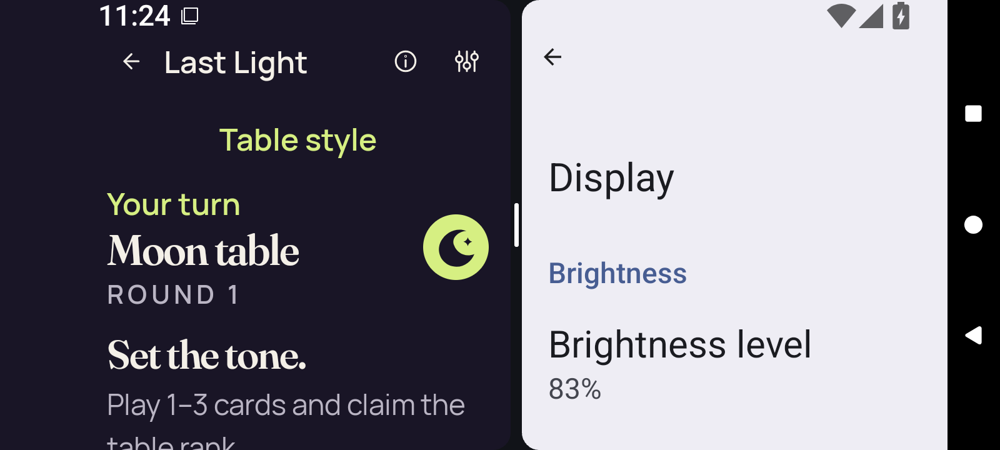</a>

`2d-split-entry-concealed.png` · 1600 × 720 · 93,990 bytes.

SHA-256: `c75b4b1631718b74c58c5227923844a3482f1f3206c599868f815c3a777bc661`.

**Preserved image; unviewed.** Original adaptive screenshot preserved without a direct pixel view or an independently established reviewed-byte representative in this bounded still publication. Runtime predicates do not supply a pixel verdict.

### 2d-split-entry-return-concealed

<a href="runtime/captures/2d-split-entry-return-concealed.png">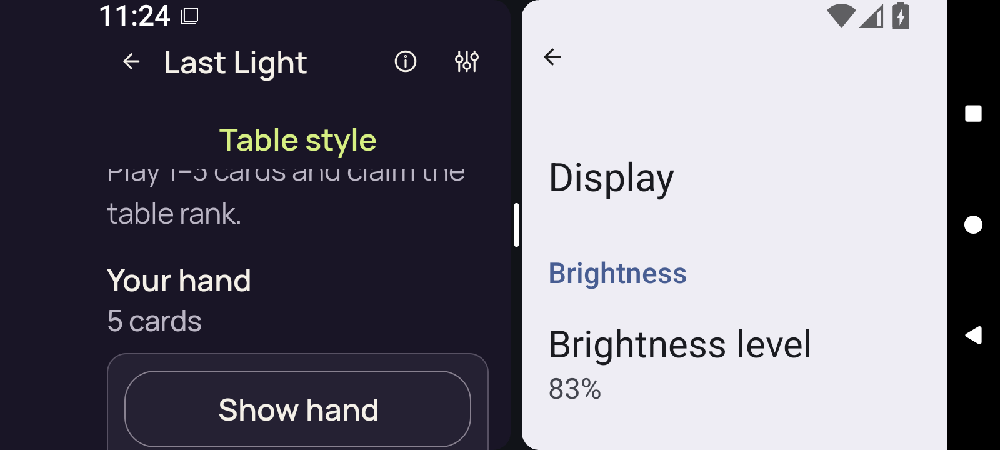</a>

`2d-split-entry-return-concealed.png` · 1600 × 720 · 81,161 bytes.

SHA-256: `7708eb96d7c3bfa1bcfbc30eb07035a0c1526ba9c2f3bc285a3ad39348f16087`.

**Preserved image; unviewed.** Original adaptive screenshot preserved without a direct pixel view or an independently established reviewed-byte representative in this bounded still publication. Runtime predicates do not supply a pixel verdict.

### 2d-split-entry-return-first-card

<a href="runtime/captures/2d-split-entry-return-first-card.png">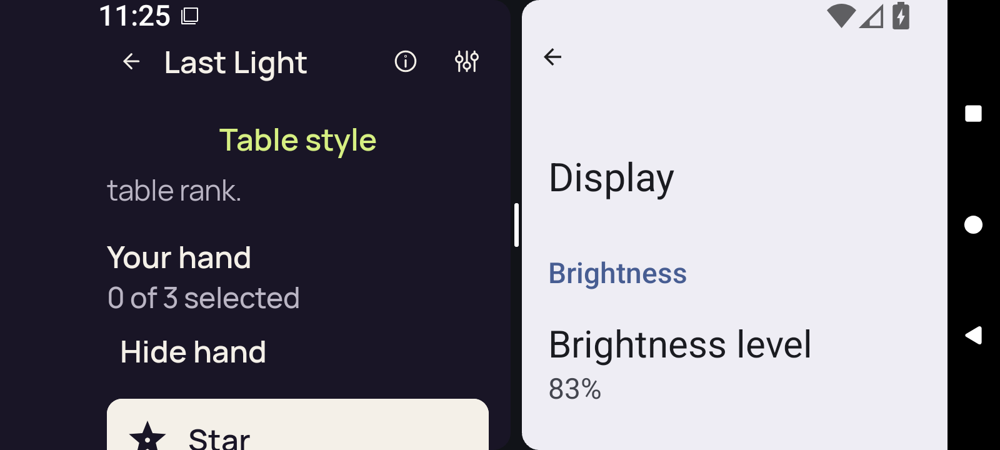</a>

`2d-split-entry-return-first-card.png` · 1600 × 720 · 75,475 bytes.

SHA-256: `b89fc37c9a8f0edbc123e2a0847a04760432375f3ae41169bab25c838c06ada0`.

**Preserved image; unviewed.** Original adaptive screenshot preserved without a direct pixel view or an independently established reviewed-byte representative in this bounded still publication. Runtime predicates do not supply a pixel verdict.

### 2d-split-entry-return-public

<a href="runtime/captures/2d-split-entry-return-public.png">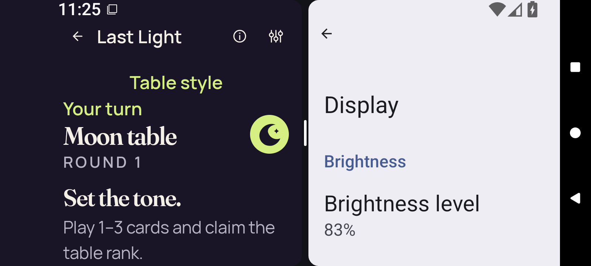</a>

`2d-split-entry-return-public.png` · 1600 × 720 · 96,564 bytes.

SHA-256: `b2c9384952c962bf1631c662e71f8bd943fca26fa28fa8a7692871a15860124a`.

**Preserved image; unviewed.** Original adaptive screenshot preserved without a direct pixel view or an independently established reviewed-byte representative in this bounded still publication. Runtime predicates do not supply a pixel verdict.

### 2d-split-entry-return-selection-cleared

<a href="runtime/captures/2d-split-entry-return-selection-cleared.png">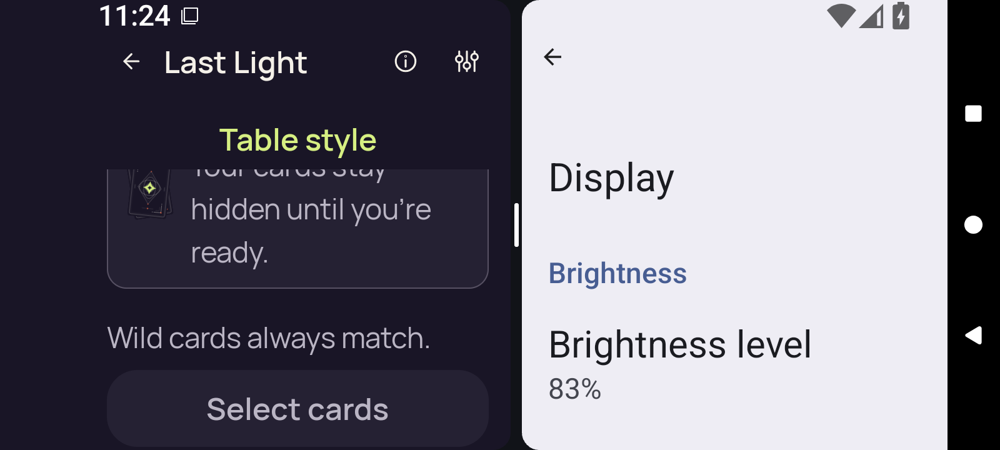</a>

`2d-split-entry-return-selection-cleared.png` · 1600 × 720 · 89,664 bytes.

SHA-256: `d87042115aa35c9c953d4b18eb76471022590082c39855ec8b647888b6034ea1`.

**Preserved image; unviewed.** Original adaptive screenshot preserved without a direct pixel view or an independently established reviewed-byte representative in this bounded still publication. Runtime predicates do not supply a pixel verdict.

### 2d-split-exit-concealed

`2d-split-exit-concealed.png` · 1600 × 720 · 69,066 bytes.

SHA-256: `4adfb683fac39578b8aa5c61dd59f5e8c814ac438d2705e04e6eef94488e3238`.

**Preserved image; unviewed.** Original adaptive screenshot preserved without a direct pixel view or an independently established reviewed-byte representative in this bounded still publication. Runtime predicates do not supply a pixel verdict.

### 2d-split-exit-return-concealed

`2d-split-exit-return-concealed.png` · 1600 × 720 · 63,006 bytes.

SHA-256: `b9272732b3c9aa76ac41083fe3b1fe04166497a2d789dfa7525638f32e1606ba`.

**Preserved image; unviewed.** Original adaptive screenshot preserved without a direct pixel view or an independently established reviewed-byte representative in this bounded still publication. Runtime predicates do not supply a pixel verdict.

### 2d-split-exit-return-first-card

`2d-split-exit-return-first-card.png` · 1600 × 720 · 48,249 bytes.

SHA-256: `857af5a0bd2c9edcfc6b978734d9da8cf18369b083c941eb3dd1fda2083b527d`.

**Preserved image; unviewed.** Original adaptive screenshot preserved without a direct pixel view or an independently established reviewed-byte representative in this bounded still publication. Runtime predicates do not supply a pixel verdict.

### 2d-split-exit-return-public

`2d-split-exit-return-public.png` · 1600 × 720 · 68,701 bytes.

SHA-256: `6cb516df03ea92199c8c96405028820e86421376e0b156dd93cf49c7f074fe77`.

**Preserved image; unviewed.** Original adaptive screenshot preserved without a direct pixel view or an independently established reviewed-byte representative in this bounded still publication. Runtime predicates do not supply a pixel verdict.

### 2d-split-exit-return-selection-cleared

`2d-split-exit-return-selection-cleared.png` · 1600 × 720 · 72,036 bytes.

SHA-256: `474fba546ef3c336cb892bb04c565935908a292ff746c2be4973f712943315cd`.

**Preserved image; unviewed.** Original adaptive screenshot preserved without a direct pixel view or an independently established reviewed-byte representative in this bounded still publication. Runtime predicates do not supply a pixel verdict.

### 2d-split-full-native-ready

`2d-split-full-native-ready.png` · 1600 × 720 · 74,887 bytes.

SHA-256: `13dcb28f4391423ad3ac93ceea9227aa1e3bca6e2439372a9ee69607bae3761d`.

**Preserved image; unviewed.** Original adaptive screenshot preserved without a direct pixel view or an independently established reviewed-byte representative in this bounded still publication. Runtime predicates do not supply a pixel verdict.

### 2d-split-full-selector

`2d-split-full-selector.png` · 1600 × 720 · 48,265 bytes.

SHA-256: `78dccd8f32f4dcfe00f2fc9d81157c65a5005edb3d5de4c2c8624c4acea7407d`.

**Preserved image; unviewed.** Original adaptive screenshot preserved without a direct pixel view or an independently established reviewed-byte representative in this bounded still publication. Runtime predicates do not supply a pixel verdict.

### 2d-split-home

`2d-split-home.png` · 1600 × 720 · 57,457 bytes.

SHA-256: `8872d5bc360d5de1e2474a486b8bda6bc5a0217a873342fb515a3b415f4963bd`.

**Preserved image; unviewed.** Original adaptive screenshot preserved without a direct pixel view or an independently established reviewed-byte representative in this bounded still publication. Runtime predicates do not supply a pixel verdict.

### 2d-split-leave-confirmation

`2d-split-leave-confirmation.png` · 1600 × 720 · 56,399 bytes.

SHA-256: `3a3ce556a63fa5dca86d4ff75f29db602f289d6de37cbfd63b7ece9d3c9d79fa`.

**Preserved image; unviewed.** Original adaptive screenshot preserved without a direct pixel view or an independently established reviewed-byte representative in this bounded still publication. Runtime predicates do not supply a pixel verdict.

### 2d-split-leave-native-ready

`2d-split-leave-native-ready.png` · 1600 × 720 · 75,581 bytes.

SHA-256: `1e1fc1033f8b7c8ed02357c14c430620a46ce4e912cd9204387edb39457897c0`.

**Preserved image; unviewed.** Original adaptive screenshot preserved without a direct pixel view or an independently established reviewed-byte representative in this bounded still publication. Runtime predicates do not supply a pixel verdict.

### 2d-split-leave-selected

`2d-split-leave-selected.png` · 1600 × 720 · 50,232 bytes.

SHA-256: `49cf07c2473d00ba5ad511c19bf86e0d43f0d632adac9175e48030ebec17b591`.

**Preserved image; unviewed.** Original adaptive screenshot preserved without a direct pixel view or an independently established reviewed-byte representative in this bounded still publication. Runtime predicates do not supply a pixel verdict.

### 2d-split-leave-selector

`2d-split-leave-selector.png` · 1600 × 720 · 49,011 bytes.

SHA-256: `2bcab66f553bc43b93a54c4526ad30f859af471ca7d0fe3cde5afc24f4553e13`.

**Preserved image; unviewed.** Original adaptive screenshot preserved without a direct pixel view or an independently established reviewed-byte representative in this bounded still publication. Runtime predicates do not supply a pixel verdict.

### 2d-split-pane-native-ready

<a href="runtime/captures/2d-split-pane-native-ready.png">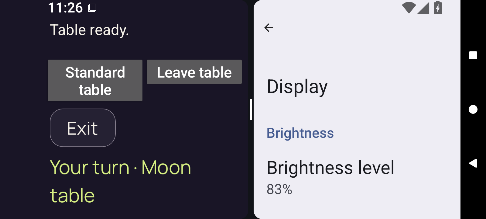</a>

`2d-split-pane-native-ready.png` · 1600 × 720 · 76,501 bytes.

SHA-256: `fc376581039ee7cb34279db1558e88ebeb6a84258b4d68a5fc6f36d2b6929f9d`.

**Preserved image; unviewed.** Original adaptive screenshot preserved without a direct pixel view or an independently established reviewed-byte representative in this bounded still publication. Runtime predicates do not supply a pixel verdict.

### 2d-split-pane-selector

`2d-split-pane-selector.png` · 1600 × 720 · 74,652 bytes.

SHA-256: `22d7ce267540589a9e656a132d526433a4d034d44b17b7d295764adf20f8eb13`.

**Preserved image; unviewed.** Original adaptive screenshot preserved without a direct pixel view or an independently established reviewed-byte representative in this bounded still publication. Runtime predicates do not supply a pixel verdict.

### 2d-split-reentry-selected

<a href="runtime/captures/2d-split-reentry-selected.png">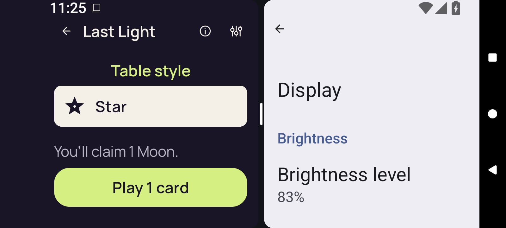</a>

`2d-split-reentry-selected.png` · 1600 × 720 · 70,084 bytes.

SHA-256: `3580ff9b1f169d1b245032fab559948cf12728345665db91848392e7c23eadff`.

**Preserved image; unviewed.** Original adaptive screenshot preserved without a direct pixel view or an independently established reviewed-byte representative in this bounded still publication. Runtime predicates do not supply a pixel verdict.

### 3d-landscape-after-up

`3d-landscape-after-up.png` · 720 × 1600 · 127,591 bytes.

SHA-256: `fce62a8bc183cc2133affebd9087e966d831f02f28bc7783239efd372dcda4bb`.

**Preserved image; unviewed.** Original adaptive screenshot preserved without a direct pixel view or an independently established reviewed-byte representative in this bounded still publication. Runtime predicates do not supply a pixel verdict.

### 3d-landscape-baseline-first-card

`3d-landscape-baseline-first-card.png` · 1600 × 720 · 49,587 bytes.

SHA-256: `513cfd61806e0cc808d645e17a67f2d3b898713ac079fac2d3082213d219c546`.

**Preserved image; unviewed.** Original adaptive screenshot preserved without a direct pixel view or an independently established reviewed-byte representative in this bounded still publication. Runtime predicates do not supply a pixel verdict.

### 3d-landscape-baseline-public

`3d-landscape-baseline-public.png` · 1600 × 720 · 67,708 bytes.

SHA-256: `de047df3826a12ddfc83655e1ce49d1a3845a4dcb10e6b9a39df7c5b7d2932aa`.

**Preserved image; unviewed.** Original adaptive screenshot preserved without a direct pixel view or an independently established reviewed-byte representative in this bounded still publication. Runtime predicates do not supply a pixel verdict.

### 3d-landscape-baseline-selected

`3d-landscape-baseline-selected.png` · 1600 × 720 · 49,499 bytes.

SHA-256: `4b9d8688f78b5ff4a4509bbc83b2e42f4118eb21ecc40b12a44eb360df98385c`.

**Preserved image; unviewed.** Original adaptive screenshot preserved without a direct pixel view or an independently established reviewed-byte representative in this bounded still publication. Runtime predicates do not supply a pixel verdict.

### 3d-landscape-home

`3d-landscape-home.png` · 720 × 1600 · 79,612 bytes.

SHA-256: `0bade5a73e813aa7ddd4b3f659ffc8dab5b8fb16e1074ad3eae29bccf0cf21c6`.

**Preserved image; unviewed.** Original adaptive screenshot preserved without a direct pixel view or an independently established reviewed-byte representative in this bounded still publication. Runtime predicates do not supply a pixel verdict.

### 3d-landscape-initial-native-ready

`3d-landscape-initial-native-ready.png` · 1600 × 720 · 94,014 bytes.

SHA-256: `e3507561c5450f419ca8e4afb6fecb9cfd1e7d88ee7719a3f58ad523e561cd8c`.

**Preserved image; unviewed.** Original adaptive screenshot preserved without a direct pixel view or an independently established reviewed-byte representative in this bounded still publication. Runtime predicates do not supply a pixel verdict.

### 3d-landscape-initial-selector

`3d-landscape-initial-selector.png` · 1600 × 720 · 48,857 bytes.

SHA-256: `056852d9d6848329c1b52412b701e446f60756f6777d3dd20afa2440c24d8914`.

**Preserved image; unviewed.** Original adaptive screenshot preserved without a direct pixel view or an independently established reviewed-byte representative in this bounded still publication. Runtime predicates do not supply a pixel verdict.

### 3d-landscape-leave-confirmation

`3d-landscape-leave-confirmation.png` · 720 × 1600 · 61,239 bytes.

SHA-256: `d8076e06109a72ae2a793d714eec69eb684942b33821b0caa8169f70b4044dd4`.

**Preserved image; unviewed.** Original adaptive screenshot preserved without a direct pixel view or an independently established reviewed-byte representative in this bounded still publication. Runtime predicates do not supply a pixel verdict.

### 3d-landscape-leave-native-ready

`3d-landscape-leave-native-ready.png` · 720 × 1600 · 147,720 bytes.

SHA-256: `875546385a1d856ea6d533abe1e63e60da9769223daad7d9c87f0c8f0ef3e000`.

**Preserved image; unviewed.** Original adaptive screenshot preserved without a direct pixel view or an independently established reviewed-byte representative in this bounded still publication. Runtime predicates do not supply a pixel verdict.

### 3d-landscape-leave-selected

`3d-landscape-leave-selected.png` · 720 × 1600 · 81,442 bytes.

SHA-256: `9d2cc42eb2803013bf5df66341d418e9b82f9f39627aa2497f51bace143dd791`.

**Preserved image; unviewed.** Original adaptive screenshot preserved without a direct pixel view or an independently established reviewed-byte representative in this bounded still publication. Runtime predicates do not supply a pixel verdict.

### 3d-landscape-leave-selector

`3d-landscape-leave-selector.png` · 720 × 1600 · 97,019 bytes.

SHA-256: `f80a2ee34fe2f643e8b0749f7f159ede91532dfcca46844743ec81fb0824fb2c`.

**Preserved image; unviewed.** Original adaptive screenshot preserved without a direct pixel view or an independently established reviewed-byte representative in this bounded still publication. Runtime predicates do not supply a pixel verdict.

### 3d-landscape-portrait-native-ready

`3d-landscape-portrait-native-ready.png` · 720 × 1600 · 148,398 bytes.

SHA-256: `8cd061134e7bee0f4fb6f4d889f8ec7895d23d1371331180c16fb7580aadf965`.

**Preserved image; unviewed.** Original adaptive screenshot preserved without a direct pixel view or an independently established reviewed-byte representative in this bounded still publication. Runtime predicates do not supply a pixel verdict.

### 3d-landscape-portrait-selector

`3d-landscape-portrait-selector.png` · 720 × 1600 · 97,781 bytes.

SHA-256: `c94419574eb2481ffda29c116a32620aeea8ddaffc5e33955e259718f01bd161`.

**Preserved image; unviewed.** Original adaptive screenshot preserved without a direct pixel view or an independently established reviewed-byte representative in this bounded still publication. Runtime predicates do not supply a pixel verdict.

### 3d-landscape-reentry-selected

`3d-landscape-reentry-selected.png` · 720 × 1600 · 81,423 bytes.

SHA-256: `dbc7f7fea96f7bd7d600851ef6eb4d3160b55381546655499a917617266703dc`.

**Preserved image; unviewed.** Original adaptive screenshot preserved without a direct pixel view or an independently established reviewed-byte representative in this bounded still publication. Runtime predicates do not supply a pixel verdict.

### 3d-landscape-rotation-return-concealed

`3d-landscape-rotation-return-concealed.png` · 720 × 1600 · 127,594 bytes.

SHA-256: `abfa69eb47b272c5f16b7917d3357512d92e00a85343ce67cc4334741338bb3a`.

**Preserved image; unviewed.** Original adaptive screenshot preserved without a direct pixel view or an independently established reviewed-byte representative in this bounded still publication. Runtime predicates do not supply a pixel verdict.

### 3d-landscape-rotation-return-first-card

`3d-landscape-rotation-return-first-card.png` · 720 × 1600 · 97,073 bytes.

SHA-256: `88c4af4bbf1b7aefbcbd69aeb1f14819019eeed29df173f9c1e3052c9cccba0d`.

**Preserved image; unviewed.** Original adaptive screenshot preserved without a direct pixel view or an independently established reviewed-byte representative in this bounded still publication. Runtime predicates do not supply a pixel verdict.

### 3d-landscape-rotation-return-public

`3d-landscape-rotation-return-public.png` · 720 × 1600 · 127,594 bytes.

SHA-256: `abfa69eb47b272c5f16b7917d3357512d92e00a85343ce67cc4334741338bb3a`.

**Preserved image; unviewed.** Original adaptive screenshot preserved without a direct pixel view or an independently established reviewed-byte representative in this bounded still publication. Runtime predicates do not supply a pixel verdict.

### 3d-landscape-rotation-return-selection-cleared

`3d-landscape-rotation-return-selection-cleared.png` · 720 × 1600 · 116,107 bytes.

SHA-256: `66fca90b7283a54a138fdbdeea90e57fefb014ef2422d8be7314bb276e0366d8`.

**Preserved image; unviewed.** Original adaptive screenshot preserved without a direct pixel view or an independently established reviewed-byte representative in this bounded still publication. Runtime predicates do not supply a pixel verdict.

### 3d-landscape-standard-return-concealed

`3d-landscape-standard-return-concealed.png` · 720 × 1600 · 128,187 bytes.

SHA-256: `bf55bd90385477c79fd68c9678088218590074a47a1abab3fc26b1b88e84b859`.

**Preserved image; unviewed.** Original adaptive screenshot preserved without a direct pixel view or an independently established reviewed-byte representative in this bounded still publication. Runtime predicates do not supply a pixel verdict.

### 3d-landscape-standard-return-first-card

`3d-landscape-standard-return-first-card.png` · 720 × 1600 · 97,717 bytes.

SHA-256: `aadae88f529b14703df6eb528f923d26c153b67ce98fac2c8bacab1ecbe2d9b2`.

**Preserved image; unviewed.** Original adaptive screenshot preserved without a direct pixel view or an independently established reviewed-byte representative in this bounded still publication. Runtime predicates do not supply a pixel verdict.

### 3d-landscape-standard-return-public

`3d-landscape-standard-return-public.png` · 720 × 1600 · 128,187 bytes.

SHA-256: `bf55bd90385477c79fd68c9678088218590074a47a1abab3fc26b1b88e84b859`.

**Preserved image; unviewed.** Original adaptive screenshot preserved without a direct pixel view or an independently established reviewed-byte representative in this bounded still publication. Runtime predicates do not supply a pixel verdict.

### 3d-landscape-standard-return-selection-cleared

`3d-landscape-standard-return-selection-cleared.png` · 720 × 1600 · 116,771 bytes.

SHA-256: `f441be1eca86c902428f06e4f77e750742edcfc1b79d4c4c7be36d22bfe997fe`.

**Preserved image; unviewed.** Original adaptive screenshot preserved without a direct pixel view or an independently established reviewed-byte representative in this bounded still publication. Runtime predicates do not supply a pixel verdict.

### 3d-seascape-after-up

`3d-seascape-after-up.png` · 720 × 1600 · 132,784 bytes.

SHA-256: `d4cba1f0eea95a48a43351e712cb404878a35311468da80b363d504721e53fe4`.

**Preserved image; unviewed.** Original adaptive screenshot preserved without a direct pixel view or an independently established reviewed-byte representative in this bounded still publication. Runtime predicates do not supply a pixel verdict.

### 3d-seascape-baseline-first-card

`3d-seascape-baseline-first-card.png` · 1600 × 720 · 56,149 bytes.

SHA-256: `efad3acdd12c732e30e37ddcfbf868488bf46f016a457d5b262132b4c7ce8748`.

**Preserved image; unviewed.** Original adaptive screenshot preserved without a direct pixel view or an independently established reviewed-byte representative in this bounded still publication. Runtime predicates do not supply a pixel verdict.

### 3d-seascape-baseline-public

`3d-seascape-baseline-public.png` · 1600 × 720 · 77,816 bytes.

SHA-256: `c3e24ed176ead4d9761c4d422cc1a97c06fc1774e49df6f11659aec0fa6c5004`.

**Preserved image; unviewed.** Original adaptive screenshot preserved without a direct pixel view or an independently established reviewed-byte representative in this bounded still publication. Runtime predicates do not supply a pixel verdict.

### 3d-seascape-baseline-selected

`3d-seascape-baseline-selected.png` · 1600 × 720 · 55,030 bytes.

SHA-256: `389ad5778eb47e7cfd4adc0dcb9649c80b44648ab08b68db089c1db268f38215`.

**Preserved image; unviewed.** Original adaptive screenshot preserved without a direct pixel view or an independently established reviewed-byte representative in this bounded still publication. Runtime predicates do not supply a pixel verdict.

### 3d-seascape-home

`3d-seascape-home.png` · 720 × 1600 · 80,662 bytes.

SHA-256: `96f0462ea0e75cf754490fdf09f1f687227f88904343735a07349ed970a14591`.

**Preserved image; unviewed.** Original adaptive screenshot preserved without a direct pixel view or an independently established reviewed-byte representative in this bounded still publication. Runtime predicates do not supply a pixel verdict.

### 3d-seascape-initial-native-ready

`3d-seascape-initial-native-ready.png` · 1600 × 720 · 95,160 bytes.

SHA-256: `39c56e75679e2c03cb992fec7fcb556bbb84687fc1bb10c8fe4a41b55110cfc1`.

**Preserved image; unviewed.** Original adaptive screenshot preserved without a direct pixel view or an independently established reviewed-byte representative in this bounded still publication. Runtime predicates do not supply a pixel verdict.

### 3d-seascape-initial-selector

`3d-seascape-initial-selector.png` · 1600 × 720 · 49,389 bytes.

SHA-256: `1ed435e85cd92b38b21480bc91b0bb4f2faf664eb1552d574e2b49480e38c39a`.

**Preserved image; unviewed.** Original adaptive screenshot preserved without a direct pixel view or an independently established reviewed-byte representative in this bounded still publication. Runtime predicates do not supply a pixel verdict.

### 3d-seascape-leave-confirmation

`3d-seascape-leave-confirmation.png` · 720 × 1600 · 62,208 bytes.

SHA-256: `0addef5dce54d303e29eda8ee694cc9d3ddc50b0bb5981d225c090c1c737a355`.

**Preserved image; unviewed.** Original adaptive screenshot preserved without a direct pixel view or an independently established reviewed-byte representative in this bounded still publication. Runtime predicates do not supply a pixel verdict.

### 3d-seascape-leave-native-ready

`3d-seascape-leave-native-ready.png` · 720 × 1600 · 159,141 bytes.

SHA-256: `0376c7be40dd4f14611238a68fd9e53da16045c33d5ebc1c98ba23c4a80ba9eb`.

**Preserved image; unviewed.** Original adaptive screenshot preserved without a direct pixel view or an independently established reviewed-byte representative in this bounded still publication. Runtime predicates do not supply a pixel verdict.

### 3d-seascape-leave-selected

`3d-seascape-leave-selected.png` · 720 × 1600 · 86,907 bytes.

SHA-256: `bad3805329d779f15cc94c5575217e6e02e650622513257f7c5b6eacb2e03feb`.

**Preserved image; unviewed.** Original adaptive screenshot preserved without a direct pixel view or an independently established reviewed-byte representative in this bounded still publication. Runtime predicates do not supply a pixel verdict.

### 3d-seascape-leave-selector

`3d-seascape-leave-selector.png` · 720 × 1600 · 97,884 bytes.

SHA-256: `f83a3d074a0738eee9314e32fd6d99284d527f5c7e65990c5a20fd5eeddd88ce`.

**Preserved image; unviewed.** Original adaptive screenshot preserved without a direct pixel view or an independently established reviewed-byte representative in this bounded still publication. Runtime predicates do not supply a pixel verdict.

### 3d-seascape-portrait-native-ready

`3d-seascape-portrait-native-ready.png` · 720 × 1600 · 159,321 bytes.

SHA-256: `bfc174efa2eff487f1caf6bcdb010c5ede517a3712e8a275f7f1ab38e1a50058`.

**Preserved image; unviewed.** Original adaptive screenshot preserved without a direct pixel view or an independently established reviewed-byte representative in this bounded still publication. Runtime predicates do not supply a pixel verdict.

### 3d-seascape-portrait-selector

`3d-seascape-portrait-selector.png` · 720 × 1600 · 97,494 bytes.

SHA-256: `388b06666644ed3d18797eaedad719df3ca81a914768d048a67a73f4acc4bb8e`.

**Preserved image; unviewed.** Original adaptive screenshot preserved without a direct pixel view or an independently established reviewed-byte representative in this bounded still publication. Runtime predicates do not supply a pixel verdict.

### 3d-seascape-reentry-selected

`3d-seascape-reentry-selected.png` · 720 × 1600 · 83,942 bytes.

SHA-256: `7c0f491fc7fa84ea3a03e45fea3e798a774b712d6dbebe51a95091fbaedb900a`.

**Preserved image; unviewed.** Original adaptive screenshot preserved without a direct pixel view or an independently established reviewed-byte representative in this bounded still publication. Runtime predicates do not supply a pixel verdict.

### 3d-seascape-rotation-return-concealed

`3d-seascape-rotation-return-concealed.png` · 720 × 1600 · 132,784 bytes.

SHA-256: `d4cba1f0eea95a48a43351e712cb404878a35311468da80b363d504721e53fe4`.

**Preserved image; unviewed.** Original adaptive screenshot preserved without a direct pixel view or an independently established reviewed-byte representative in this bounded still publication. Runtime predicates do not supply a pixel verdict.

### 3d-seascape-rotation-return-first-card

`3d-seascape-rotation-return-first-card.png` · 720 × 1600 · 108,409 bytes.

SHA-256: `7da939669ebd313198a3046ee346051e289211ee46a941175afa6e443e7c728a`.

**Preserved image; unviewed.** Original adaptive screenshot preserved without a direct pixel view or an independently established reviewed-byte representative in this bounded still publication. Runtime predicates do not supply a pixel verdict.

### 3d-seascape-rotation-return-public

`3d-seascape-rotation-return-public.png` · 720 × 1600 · 132,266 bytes.

SHA-256: `bc0ceac2269700008c3344ac2fd23a2139c7f0e74bda3c376401241807fdbe5e`.

**Preserved image; unviewed.** Original adaptive screenshot preserved without a direct pixel view or an independently established reviewed-byte representative in this bounded still publication. Runtime predicates do not supply a pixel verdict.

### 3d-seascape-rotation-return-selection-cleared

`3d-seascape-rotation-return-selection-cleared.png` · 720 × 1600 · 114,260 bytes.

SHA-256: `e9cf11e9d227acbc652284114502cc04d38c6216e4b4ec722090151b7f639854`.

**Preserved image; unviewed.** Original adaptive screenshot preserved without a direct pixel view or an independently established reviewed-byte representative in this bounded still publication. Runtime predicates do not supply a pixel verdict.

### 3d-seascape-standard-return-concealed

`3d-seascape-standard-return-concealed.png` · 720 × 1600 · 133,405 bytes.

SHA-256: `b3d48c5e5ae20e5ba09fff8f101fd78b1120f3802db08357d0fb6c58fc215429`.

**Preserved image; unviewed.** Original adaptive screenshot preserved without a direct pixel view or an independently established reviewed-byte representative in this bounded still publication. Runtime predicates do not supply a pixel verdict.

### 3d-seascape-standard-return-first-card

`3d-seascape-standard-return-first-card.png` · 720 × 1600 · 103,771 bytes.

SHA-256: `f88ec761a5bd3b32115d5474c27953ed4291768a92b79d80cc86469b4522c8e0`.

**Preserved image; unviewed.** Original adaptive screenshot preserved without a direct pixel view or an independently established reviewed-byte representative in this bounded still publication. Runtime predicates do not supply a pixel verdict.

### 3d-seascape-standard-return-public

`3d-seascape-standard-return-public.png` · 720 × 1600 · 133,405 bytes.

SHA-256: `b3d48c5e5ae20e5ba09fff8f101fd78b1120f3802db08357d0fb6c58fc215429`.

**Preserved image; unviewed.** Original adaptive screenshot preserved without a direct pixel view or an independently established reviewed-byte representative in this bounded still publication. Runtime predicates do not supply a pixel verdict.

### 3d-seascape-standard-return-selection-cleared

`3d-seascape-standard-return-selection-cleared.png` · 720 × 1600 · 120,475 bytes.

SHA-256: `8cec2af4d45ca47f95f56bcf3e53d16de30aadce7eec888e365a268e3a82c5df`.

**Preserved image; unviewed.** Original adaptive screenshot preserved without a direct pixel view or an independently established reviewed-byte representative in this bounded still publication. Runtime predicates do not supply a pixel verdict.

### 3d-split-baseline-first-card

<a href="runtime/captures/3d-split-baseline-first-card.png">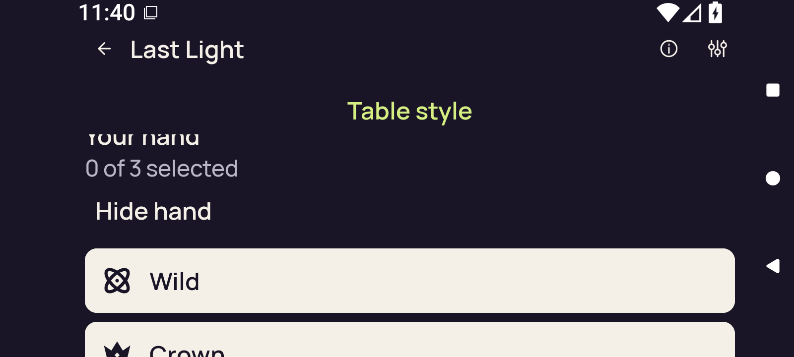</a>

`3d-split-baseline-first-card.png` · 1600 × 720 · 51,780 bytes.

SHA-256: `6f1a0c63700236c3a333b06d114d5d16988357e0d07a62c0e8e6160a2e90d3eb`.

**Preserved image; unviewed.** Original adaptive screenshot preserved without a direct pixel view or an independently established reviewed-byte representative in this bounded still publication. Runtime predicates do not supply a pixel verdict.

### 3d-split-baseline-public

`3d-split-baseline-public.png` · 1600 × 720 · 77,361 bytes.

SHA-256: `85b0e08dbe5959b2c5983c98cd343df31329d126196dd8e7685fd17655a25e08`.

**Preserved image; unviewed.** Original adaptive screenshot preserved without a direct pixel view or an independently established reviewed-byte representative in this bounded still publication. Runtime predicates do not supply a pixel verdict.

### 3d-split-baseline-selected

`3d-split-baseline-selected.png` · 1600 × 720 · 54,066 bytes.

SHA-256: `fc6fc11361812b464095049671820ecfe33c604cf8cc52f1204dd19ded85f13e`.

**Preserved image; unviewed.** Original adaptive screenshot preserved without a direct pixel view or an independently established reviewed-byte representative in this bounded still publication. Runtime predicates do not supply a pixel verdict.

### 3d-split-entry-concealed

<a href="runtime/captures/3d-split-entry-concealed.png">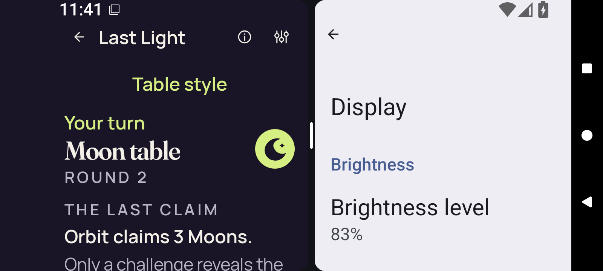</a>

`3d-split-entry-concealed.png` · 1600 × 720 · 99,155 bytes.

SHA-256: `1f402f4c29ea0eed03664830b6b504b7453ea72d84d6a9bfdc2f15e3bcd111a3`.

**Preserved image; unviewed.** Original adaptive screenshot preserved without a direct pixel view or an independently established reviewed-byte representative in this bounded still publication. Runtime predicates do not supply a pixel verdict.

### 3d-split-entry-return-concealed

<a href="runtime/captures/3d-split-entry-return-concealed.png">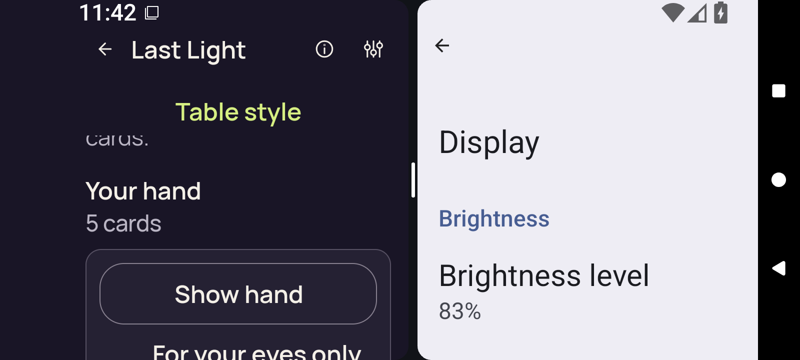</a>

`3d-split-entry-return-concealed.png` · 1600 × 720 · 78,158 bytes.

SHA-256: `02ef93a10dcc36e7535ab7d03117ae1111e1fb253b13ff6cf14a7338fd2b0d22`.

**Preserved image; unviewed.** Original adaptive screenshot preserved without a direct pixel view or an independently established reviewed-byte representative in this bounded still publication. Runtime predicates do not supply a pixel verdict.

### 3d-split-entry-return-first-card

<a href="runtime/captures/3d-split-entry-return-first-card.png">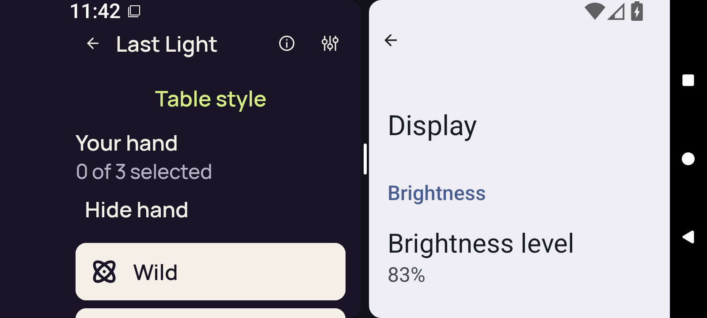</a>

`3d-split-entry-return-first-card.png` · 1600 × 720 · 73,075 bytes.

SHA-256: `454a8a4058687a9b66ea97f1bb12924b900fa46a1e08914365dfee9fc6ed83da`.

**Preserved image; unviewed.** Original adaptive screenshot preserved without a direct pixel view or an independently established reviewed-byte representative in this bounded still publication. Runtime predicates do not supply a pixel verdict.

### 3d-split-entry-return-public

<a href="runtime/captures/3d-split-entry-return-public.png">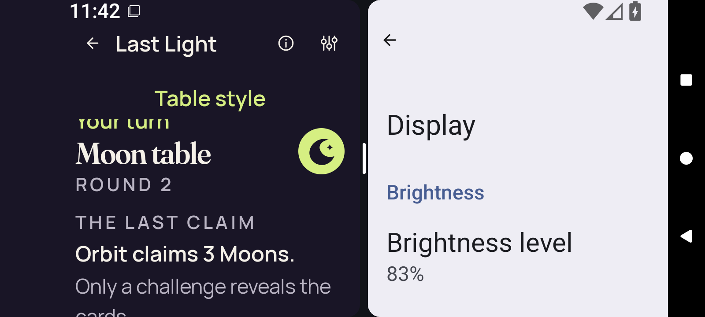</a>

`3d-split-entry-return-public.png` · 1600 × 720 · 101,385 bytes.

SHA-256: `876c90401a96ac7ca0f38bc5226ad33153d7f3ea7472c124a05d9736ccfb72cd`.

**Preserved image; unviewed.** Original adaptive screenshot preserved without a direct pixel view or an independently established reviewed-byte representative in this bounded still publication. Runtime predicates do not supply a pixel verdict.

### 3d-split-entry-return-selection-cleared

<a href="runtime/captures/3d-split-entry-return-selection-cleared.png">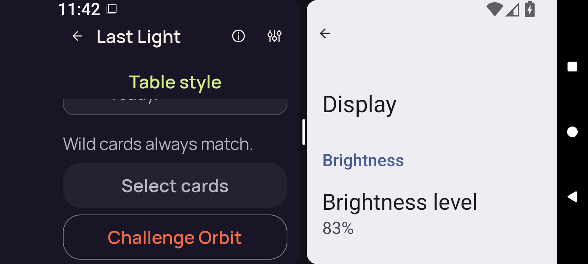</a>

`3d-split-entry-return-selection-cleared.png` · 1600 × 720 · 80,629 bytes.

SHA-256: `00d4bf26e4bb5cff57801c2adc0139444e89ea14c88788a9324176f980e4ae17`.

**Preserved image; unviewed.** Original adaptive screenshot preserved without a direct pixel view or an independently established reviewed-byte representative in this bounded still publication. Runtime predicates do not supply a pixel verdict.

### 3d-split-exit-concealed

`3d-split-exit-concealed.png` · 1600 × 720 · 76,647 bytes.

SHA-256: `8a8928eaaa1452a338b121de16d48ebfca050200744772e8925d366f7ecaf4e0`.

**Preserved image; unviewed.** Original adaptive screenshot preserved without a direct pixel view or an independently established reviewed-byte representative in this bounded still publication. Runtime predicates do not supply a pixel verdict.

### 3d-split-exit-return-concealed

`3d-split-exit-return-concealed.png` · 1600 × 720 · 57,272 bytes.

SHA-256: `ec982607ec802d9895a1dc3ab5abfa561ccc7638090ced964a515a6b34681ee6`.

**Preserved image; unviewed.** Original adaptive screenshot preserved without a direct pixel view or an independently established reviewed-byte representative in this bounded still publication. Runtime predicates do not supply a pixel verdict.

### 3d-split-exit-return-first-card

`3d-split-exit-return-first-card.png` · 1600 × 720 · 54,832 bytes.

SHA-256: `b57d1424c09b7b2f7732006589eaa498a31e3526a6a0b1284fb64c358db96646`.

**Preserved image; unviewed.** Original adaptive screenshot preserved without a direct pixel view or an independently established reviewed-byte representative in this bounded still publication. Runtime predicates do not supply a pixel verdict.

### 3d-split-exit-return-public

`3d-split-exit-return-public.png` · 1600 × 720 · 76,459 bytes.

SHA-256: `e951f3c13cb90deb071ef7e91544c72159e9596a86690e781d129a97ea2ad00a`.

**Preserved image; unviewed.** Original adaptive screenshot preserved without a direct pixel view or an independently established reviewed-byte representative in this bounded still publication. Runtime predicates do not supply a pixel verdict.

### 3d-split-exit-return-selection-cleared

`3d-split-exit-return-selection-cleared.png` · 1600 × 720 · 72,230 bytes.

SHA-256: `d3690afbd62e69be04ca30548f92e1efb41b4d516c5c7cc34ee0f2c997b606b0`.

**Preserved image; unviewed.** Original adaptive screenshot preserved without a direct pixel view or an independently established reviewed-byte representative in this bounded still publication. Runtime predicates do not supply a pixel verdict.

### 3d-split-full-native-ready

`3d-split-full-native-ready.png` · 1600 × 720 · 95,275 bytes.

SHA-256: `d166f58e44ad20d376a320641e57d31ad7f913000004f007f86f091e07acdf35`.

**Preserved image; unviewed.** Original adaptive screenshot preserved without a direct pixel view or an independently established reviewed-byte representative in this bounded still publication. Runtime predicates do not supply a pixel verdict.

### 3d-split-full-selector

`3d-split-full-selector.png` · 1600 × 720 · 47,461 bytes.

SHA-256: `8cbf8dc9eca0fe3fcd5f2e73339370644a0db5d4228cc155442220417ccefaab`.

**Preserved image; unviewed.** Original adaptive screenshot preserved without a direct pixel view or an independently established reviewed-byte representative in this bounded still publication. Runtime predicates do not supply a pixel verdict.

### 3d-split-home

`3d-split-home.png` · 1600 × 720 · 56,954 bytes.

SHA-256: `a4be00e71003793d857477e5097b03673dc6d952c4204cebc88d89236b80521c`.

**Preserved image; unviewed.** Original adaptive screenshot preserved without a direct pixel view or an independently established reviewed-byte representative in this bounded still publication. Runtime predicates do not supply a pixel verdict.

### 3d-split-leave-confirmation

`3d-split-leave-confirmation.png` · 1600 × 720 · 55,954 bytes.

SHA-256: `08208abbc0091491205c0352c6b957834ff15bab5debddbef1e285ab0dd4a4af`.

**Preserved image; unviewed.** Original adaptive screenshot preserved without a direct pixel view or an independently established reviewed-byte representative in this bounded still publication. Runtime predicates do not supply a pixel verdict.

### 3d-split-leave-native-ready

<a href="runtime/captures/3d-split-leave-native-ready.png">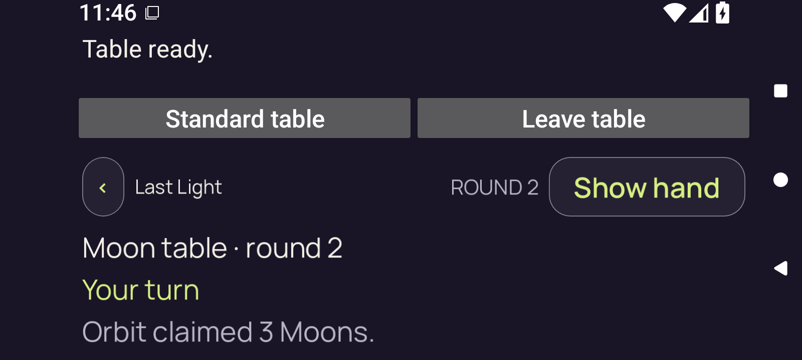</a>

`3d-split-leave-native-ready.png` · 1600 × 720 · 96,151 bytes.

SHA-256: `2ddc8cd50059bdb09b974711e425b4174303b0ee465155e1a47db6fbd1e29ec1`.

**Preserved image; unviewed.** Original adaptive screenshot preserved without a direct pixel view or an independently established reviewed-byte representative in this bounded still publication. Runtime predicates do not supply a pixel verdict.

### 3d-split-leave-selected

`3d-split-leave-selected.png` · 1600 × 720 · 50,523 bytes.

SHA-256: `27a052832b1306f6d3efb7132638cb8a7e331ef9e262add0488a032671c7576b`.

**Preserved image; unviewed.** Original adaptive screenshot preserved without a direct pixel view or an independently established reviewed-byte representative in this bounded still publication. Runtime predicates do not supply a pixel verdict.

### 3d-split-leave-selector

`3d-split-leave-selector.png` · 1600 × 720 · 48,318 bytes.

SHA-256: `50fd161e5584361a120bb56b13b97abe6dd56bc6bff8871a2ef4867648635a1c`.

**Preserved image; unviewed.** Original adaptive screenshot preserved without a direct pixel view or an independently established reviewed-byte representative in this bounded still publication. Runtime predicates do not supply a pixel verdict.

### 3d-split-pane-native-ready

<a href="runtime/captures/3d-split-pane-native-ready.png">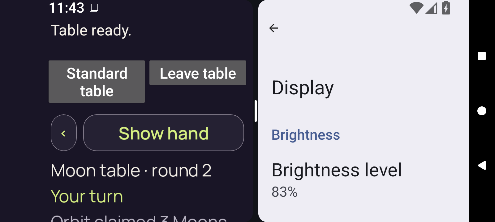</a>

`3d-split-pane-native-ready.png` · 1600 × 720 · 101,853 bytes.

SHA-256: `de6c55de1bff6ac4f72af53241abac79d94b64c5a3350796c887d628f21f23f4`.

**Preserved image; unviewed.** Original adaptive screenshot preserved without a direct pixel view or an independently established reviewed-byte representative in this bounded still publication. Runtime predicates do not supply a pixel verdict.

### 3d-split-pane-selector

<a href="runtime/captures/3d-split-pane-selector.png">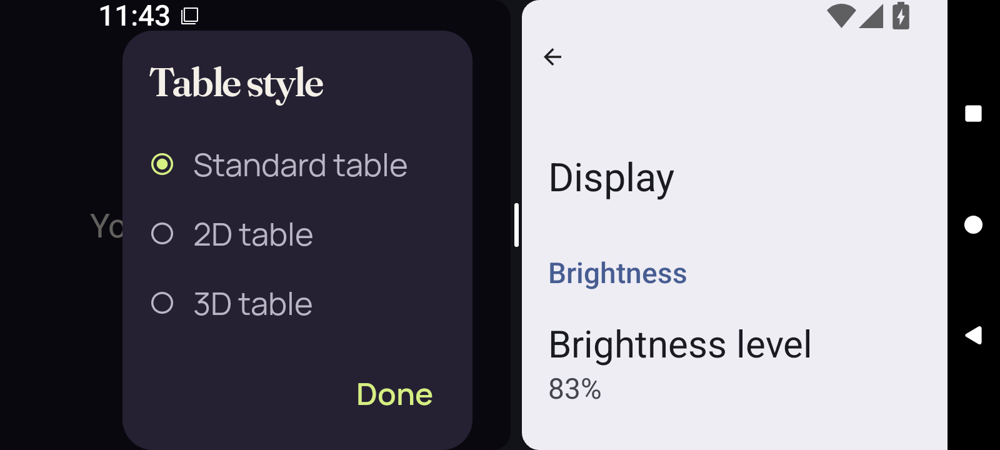</a>

`3d-split-pane-selector.png` · 1600 × 720 · 73,889 bytes.

SHA-256: `49c996a78c9a266a87b6875073c9d7da4e10535480805f6d4f535e03d4bf2b6b`.

**Preserved image; unviewed.** Original adaptive screenshot preserved without a direct pixel view or an independently established reviewed-byte representative in this bounded still publication. Runtime predicates do not supply a pixel verdict.

### 3d-split-reentry-selected

<a href="runtime/captures/3d-split-reentry-selected.png">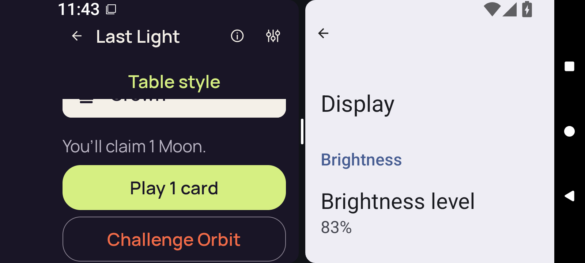</a>

`3d-split-reentry-selected.png` · 1600 × 720 · 76,401 bytes.

SHA-256: `f27268ecb5be0f1762bb70edd64537c890dc895b2c15edea19b8f7a781fc06a0`.

**Preserved image; unviewed.** Original adaptive screenshot preserved without a direct pixel view or an independently established reviewed-byte representative in this bounded still publication. Runtime predicates do not supply a pixel verdict.

### final-diagnostic

`final-diagnostic.png` · 1600 × 720 · 56,954 bytes.

SHA-256: `a4be00e71003793d857477e5097b03673dc6d952c4204cebc88d89236b80521c`.

**Preserved image; unviewed.** Original adaptive screenshot preserved without a direct pixel view or an independently established reviewed-byte representative in this bounded still publication. Runtime predicates do not supply a pixel verdict.

### home-cold

`home-cold.png` · 720 × 1600 · 78,688 bytes.

SHA-256: `d691f854e2f09f2421040d242a76ddb7e17e4114565fb97a19e0523bbb1012cf`.

**Preserved image; unviewed.** Original adaptive screenshot preserved without a direct pixel view or an independently established reviewed-byte representative in this bounded still publication. Runtime predicates do not supply a pixel verdict.

Original media companions and review receipts

| Preserved file | Bytes | SHA-256 |
| --- | ---: | --- |
| [optimized/font-2.0/runtime/captures/2d-landscape-after-up.json](runtime/captures/2d-landscape-after-up.json) | 9,463 | `cf11684eea4532451697002d2de98b5c00b8f4dfabc46ed574390b3448c93ffc` |
| [optimized/font-2.0/runtime/captures/2d-landscape-after-up.xml](runtime/captures/2d-landscape-after-up.xml) | 13,904 | `4b315916209825a7ae4bc6bbb4dc28ed970eccbee1bc7fc671590fa00bc17f10` |
| [optimized/font-2.0/runtime/captures/2d-landscape-baseline-first-card.json](runtime/captures/2d-landscape-baseline-first-card.json) | 9,500 | `d0ca3fe5e06a9cee4401d9b2e0246fc691b9ea5cb82f915da81ce8a44251010e` |
| [optimized/font-2.0/runtime/captures/2d-landscape-baseline-first-card.xml](runtime/captures/2d-landscape-baseline-first-card.xml) | 11,400 | `52ad143783bb8d1a217ca0ce001b478f1166de71515475c4e0e4462528e485ce` |
| [optimized/font-2.0/runtime/captures/2d-landscape-baseline-public.json](runtime/captures/2d-landscape-baseline-public.json) | 9,488 | `58e6191c988480e2deb95ef45c3327959bf9fa1d16682501644aa19b3c8dfb49` |
| [optimized/font-2.0/runtime/captures/2d-landscape-baseline-public.xml](runtime/captures/2d-landscape-baseline-public.xml) | 9,997 | `959087871c0721a2f163291ce99efaecd21c5793cad9e53b8b0025805444df4f` |
| [optimized/font-2.0/runtime/captures/2d-landscape-baseline-selected.json](runtime/captures/2d-landscape-baseline-selected.json) | 9,494 | `0cd9d8290f46c65c4d3214b9c5905327a609077b13b1ec0137812ef39af22eb8` |
| [optimized/font-2.0/runtime/captures/2d-landscape-baseline-selected.xml](runtime/captures/2d-landscape-baseline-selected.xml) | 12,076 | `f20a5302a3cc4e67586d742d559d41d020a47a26af406286a4d8aa8f6a0224e3` |
| [optimized/font-2.0/runtime/captures/2d-landscape-home.json](runtime/captures/2d-landscape-home.json) | 9,456 | `508a29a188629c39b7e67b2f21f4e17280f51ce673936cb20c7318df44afe847` |
| [optimized/font-2.0/runtime/captures/2d-landscape-home.xml](runtime/captures/2d-landscape-home.xml) | 9,316 | `9abf32e3a636d0907c41cdb770a99f06baf20000e4da7e1f56ae0fa6c5b81aea` |
| [optimized/font-2.0/runtime/captures/2d-landscape-initial-native-ready.json](runtime/captures/2d-landscape-initial-native-ready.json) | 11,775 | `4e680909140afe1c8ebabc31942af515a4a8591965499d4a62b45a12539c1060` |
| [optimized/font-2.0/runtime/captures/2d-landscape-initial-native-ready.xml](runtime/captures/2d-landscape-initial-native-ready.xml) | 5,221 | `714c8130e1b1ede502c44e0c43dee6a88a13a6877b43e9d42be3981d26c4001b` |
| [optimized/font-2.0/runtime/captures/2d-landscape-initial-selector.json](runtime/captures/2d-landscape-initial-selector.json) | 9,491 | `f03508861092ccda6030251c9ae57ee36af5efc1f20cba9d948585b0944e2040` |
| [optimized/font-2.0/runtime/captures/2d-landscape-initial-selector.xml](runtime/captures/2d-landscape-initial-selector.xml) | 8,628 | `5c50bbda587440c1b93695a97965b700a33c70606f834b7b7f33009174972838` |
| [optimized/font-2.0/runtime/captures/2d-landscape-leave-confirmation.json](runtime/captures/2d-landscape-leave-confirmation.json) | 9,498 | `b8e6fac8ad61f9ef818baae89b341cd4bd737e14d8b9410ccc3ff30a4999729f` |
| [optimized/font-2.0/runtime/captures/2d-landscape-leave-confirmation.xml](runtime/captures/2d-landscape-leave-confirmation.xml) | 5,809 | `b89c5d49046f101b527baa80099050a56ec58680bf1fe109d8e0fb52eaf98830` |
| [optimized/font-2.0/runtime/captures/2d-landscape-leave-native-ready.json](runtime/captures/2d-landscape-leave-native-ready.json) | 11,770 | `b45769378cb8d91212e9769612f114dd8e613798d56b3ca80af2e094d78a7e6c` |
| [optimized/font-2.0/runtime/captures/2d-landscape-leave-native-ready.xml](runtime/captures/2d-landscape-leave-native-ready.xml) | 5,203 | `661158f4c2e4ca1a1d6b19d63707d4429674b4f0caebfae3f089f57ca61f5369` |
| [optimized/font-2.0/runtime/captures/2d-landscape-leave-selected.json](runtime/captures/2d-landscape-leave-selected.json) | 9,486 | `0f94d0d87c3e336de1118c71f07b160571e94d1a899510edfb553981bbefefb8` |
| [optimized/font-2.0/runtime/captures/2d-landscape-leave-selected.xml](runtime/captures/2d-landscape-leave-selected.xml) | 18,038 | `6dd95b1f43883324251879d583ce45d880ef2f0a38c2297b0a0f67df113ae12d` |
| [optimized/font-2.0/runtime/captures/2d-landscape-leave-selector.json](runtime/captures/2d-landscape-leave-selector.json) | 9,486 | `eb83f9aa4dc82c4cb7c569543a42725619c7a5c2f0e4c98981a3b7629ede051c` |
| [optimized/font-2.0/runtime/captures/2d-landscape-leave-selector.xml](runtime/captures/2d-landscape-leave-selector.xml) | 9,031 | `27a32e747c77d2e646d457301e1b087d6a338f5323c7641dc7907d885b94d94b` |
| [optimized/font-2.0/runtime/captures/2d-landscape-portrait-native-ready.json](runtime/captures/2d-landscape-portrait-native-ready.json) | 11,786 | `7a6e1bd2addf594ad955d88b633eccd3de0be41149ff9160dfc08ae089d3edd4` |
| [optimized/font-2.0/runtime/captures/2d-landscape-portrait-native-ready.xml](runtime/captures/2d-landscape-portrait-native-ready.xml) | 5,203 | `661158f4c2e4ca1a1d6b19d63707d4429674b4f0caebfae3f089f57ca61f5369` |
| [optimized/font-2.0/runtime/captures/2d-landscape-portrait-selector.json](runtime/captures/2d-landscape-portrait-selector.json) | 9,502 | `a539f37ec3698d76458661a5eddcd89b3c08dd333dc331cf1c4bd373ad1e9960` |
| [optimized/font-2.0/runtime/captures/2d-landscape-portrait-selector.xml](runtime/captures/2d-landscape-portrait-selector.xml) | 9,031 | `27a32e747c77d2e646d457301e1b087d6a338f5323c7641dc7907d885b94d94b` |
| [optimized/font-2.0/runtime/captures/2d-landscape-reentry-selected.json](runtime/captures/2d-landscape-reentry-selected.json) | 9,499 | `877e09bac009b9eb0894bebe80df9bbdcfe313fb08b8b32c6286d071279144ac` |
| [optimized/font-2.0/runtime/captures/2d-landscape-reentry-selected.xml](runtime/captures/2d-landscape-reentry-selected.xml) | 18,038 | `6dd95b1f43883324251879d583ce45d880ef2f0a38c2297b0a0f67df113ae12d` |
| [optimized/font-2.0/runtime/captures/2d-landscape-rotation-return-concealed.json](runtime/captures/2d-landscape-rotation-return-concealed.json) | 9,514 | `5eaf49f8c9127fbe8d5ce8f6aee84e650eb6c5fca09288de57a6a711dbd46d7f` |
| [optimized/font-2.0/runtime/captures/2d-landscape-rotation-return-concealed.xml](runtime/captures/2d-landscape-rotation-return-concealed.xml) | 13,904 | `4b315916209825a7ae4bc6bbb4dc28ed970eccbee1bc7fc671590fa00bc17f10` |
| [optimized/font-2.0/runtime/captures/2d-landscape-rotation-return-first-card.json](runtime/captures/2d-landscape-rotation-return-first-card.json) | 9,517 | `723eec58da18e49f2c83b6d425429c9176fc0c525bf6b69adf43c23a45a861ac` |
| [optimized/font-2.0/runtime/captures/2d-landscape-rotation-return-first-card.xml](runtime/captures/2d-landscape-rotation-return-first-card.xml) | 16,340 | `384b8a38a5c6e5f2663d8ede946a89e6160c9bb07d891679782386959e26fad1` |
| [optimized/font-2.0/runtime/captures/2d-landscape-rotation-return-public.json](runtime/captures/2d-landscape-rotation-return-public.json) | 9,505 | `2db1b73cad8a0a11523d4eb6dc5f8655d1b74d9c3f909d3ee06e251f29cd512b` |
| [optimized/font-2.0/runtime/captures/2d-landscape-rotation-return-public.xml](runtime/captures/2d-landscape-rotation-return-public.xml) | 14,277 | `58c0c9acbfd69c1e61195d0c5db5658a0dbd9ca51c36ee473f1b7f144286510d` |
| [optimized/font-2.0/runtime/captures/2d-landscape-rotation-return-selection-cleared.json](runtime/captures/2d-landscape-rotation-return-selection-cleared.json) | 9,538 | `d1ae901fe91ebb37cbac3df15bd684e1257bdd1334a4cb1a1b814f794e2abbe6` |
| [optimized/font-2.0/runtime/captures/2d-landscape-rotation-return-selection-cleared.xml](runtime/captures/2d-landscape-rotation-return-selection-cleared.xml) | 15,319 | `53274ee6f33944ab20bd61d41b817033678e385ad08fb5716034d9eb3a02cdea` |
| [optimized/font-2.0/runtime/captures/2d-landscape-standard-return-concealed.json](runtime/captures/2d-landscape-standard-return-concealed.json) | 9,526 | `ee28bc6bd5704c7c375c32e0d5d12594f2a2ad2e3ec3e5d41e514f19926f87f1` |
| [optimized/font-2.0/runtime/captures/2d-landscape-standard-return-concealed.xml](runtime/captures/2d-landscape-standard-return-concealed.xml) | 13,904 | `4b315916209825a7ae4bc6bbb4dc28ed970eccbee1bc7fc671590fa00bc17f10` |
| [optimized/font-2.0/runtime/captures/2d-landscape-standard-return-first-card.json](runtime/captures/2d-landscape-standard-return-first-card.json) | 9,529 | `c3e4e41992340ef04cd59d2b1af95c07d242298c39b6298de0207a9cb198f7da` |
| [optimized/font-2.0/runtime/captures/2d-landscape-standard-return-first-card.xml](runtime/captures/2d-landscape-standard-return-first-card.xml) | 16,340 | `df598e08c3f1caa246dc87a2ada7acf5fa01c6a9d0f6b7af487d86bafcbf4827` |
| [optimized/font-2.0/runtime/captures/2d-landscape-standard-return-public.json](runtime/captures/2d-landscape-standard-return-public.json) | 9,517 | `b6e8a80b7e8800195e739aa16866254425a9e99ca82689926b5dfdfd83d81d3a` |
| [optimized/font-2.0/runtime/captures/2d-landscape-standard-return-public.xml](runtime/captures/2d-landscape-standard-return-public.xml) | 13,904 | `ea84db7515c24a2fe577ac4a9850cf4ac5f58d3581557ac2b9c4c218d11d74da` |
| [optimized/font-2.0/runtime/captures/2d-landscape-standard-return-selection-cleared.json](runtime/captures/2d-landscape-standard-return-selection-cleared.json) | 9,550 | `bcca18d8b034c943790df924a7bec1a5992d3ea5b96f3b934495577f2aa93d06` |
| [optimized/font-2.0/runtime/captures/2d-landscape-standard-return-selection-cleared.xml](runtime/captures/2d-landscape-standard-return-selection-cleared.xml) | 15,320 | `fa2479979d3315b20b97f80665b1c944eb60f05dcbb36e915e063b323e38b5e2` |
| [optimized/font-2.0/runtime/captures/2d-seascape-after-up.json](runtime/captures/2d-seascape-after-up.json) | 9,452 | `21b4ead2bd72619ebf9335f0d611df9fed78fa2c8c8808fbe91c1c2ac3d61f2e` |
| [optimized/font-2.0/runtime/captures/2d-seascape-after-up.xml](runtime/captures/2d-seascape-after-up.xml) | 13,907 | `6fd4dccba169d7c0ab2da193a1fff8fd2e17e620381153840fa7e28b21d40080` |
| [optimized/font-2.0/runtime/captures/2d-seascape-baseline-first-card.json](runtime/captures/2d-seascape-baseline-first-card.json) | 9,497 | `55de2b34092a9911bd717be6868668aab079c1b37132daa68485b21f1ba49c1e` |
| [optimized/font-2.0/runtime/captures/2d-seascape-baseline-first-card.xml](runtime/captures/2d-seascape-baseline-first-card.xml) | 11,767 | `0278afc778ff7b02314040b40d98e81eb23cec4e0cac56dd4b7bb87c07a1f390` |
| [optimized/font-2.0/runtime/captures/2d-seascape-baseline-public.json](runtime/captures/2d-seascape-baseline-public.json) | 9,485 | `5e2f2e5aa60cb20e8e5761c9b155c979e6e6c09700a1cddb7a6d0bb401156905` |
| [optimized/font-2.0/runtime/captures/2d-seascape-baseline-public.xml](runtime/captures/2d-seascape-baseline-public.xml) | 9,998 | `96666d3c7044cc6dff260168b95e499c9c94670de31d828e4e75b0563368ce7a` |
| [optimized/font-2.0/runtime/captures/2d-seascape-baseline-selected.json](runtime/captures/2d-seascape-baseline-selected.json) | 9,491 | `ba14c002b6e5f3b1907138750f92db7446bc7f72fec43fa9d8c213b990a14ca2` |
| [optimized/font-2.0/runtime/captures/2d-seascape-baseline-selected.xml](runtime/captures/2d-seascape-baseline-selected.xml) | 12,438 | `fa86d084887fac89fc26b1bcb38c9a2f26e4f682cd1008b80c552a276476bcad` |
| [optimized/font-2.0/runtime/captures/2d-seascape-home.json](runtime/captures/2d-seascape-home.json) | 9,444 | `261630bc14cb55d255c448fe9c4aa68b83a5b9b1be3814fa4b17e414c37d51b1` |
| [optimized/font-2.0/runtime/captures/2d-seascape-home.xml](runtime/captures/2d-seascape-home.xml) | 9,316 | `9abf32e3a636d0907c41cdb770a99f06baf20000e4da7e1f56ae0fa6c5b81aea` |
| [optimized/font-2.0/runtime/captures/2d-seascape-initial-native-ready.json](runtime/captures/2d-seascape-initial-native-ready.json) | 11,772 | `a8f979df1e05babc56f6e2bfc350e8aaeddb075e38e0a92ca5c4b36d0ce70b59` |
| [optimized/font-2.0/runtime/captures/2d-seascape-initial-native-ready.xml](runtime/captures/2d-seascape-initial-native-ready.xml) | 5,208 | `2746bff12d6c1197a90d096f9fc696c8dacc9181799507a9d36af5949025406c` |
| [optimized/font-2.0/runtime/captures/2d-seascape-initial-selector.json](runtime/captures/2d-seascape-initial-selector.json) | 9,472 | `439fb3cab149caa5b9c0a14d9938217368498889b17338ebc4aab7d90e80d7cb` |
| [optimized/font-2.0/runtime/captures/2d-seascape-initial-selector.xml](runtime/captures/2d-seascape-initial-selector.xml) | 8,626 | `f65f08d25c79ac3497d43748f6424f1a550c32b6d4457f9dd2cc40ae6465b9d1` |
| [optimized/font-2.0/runtime/captures/2d-seascape-leave-confirmation.json](runtime/captures/2d-seascape-leave-confirmation.json) | 9,494 | `0886b74cf6c19045aec4289b4a1f1fbae373d048715a913a8c0c65e0b463af1d` |
| [optimized/font-2.0/runtime/captures/2d-seascape-leave-confirmation.xml](runtime/captures/2d-seascape-leave-confirmation.xml) | 5,809 | `b89c5d49046f101b527baa80099050a56ec58680bf1fe109d8e0fb52eaf98830` |
| [optimized/font-2.0/runtime/captures/2d-seascape-leave-native-ready.json](runtime/captures/2d-seascape-leave-native-ready.json) | 11,766 | `8f5e01e5a15c4adc5e2f332f4d7572a4577de7a08270154d3370bdec672fb028` |
| [optimized/font-2.0/runtime/captures/2d-seascape-leave-native-ready.xml](runtime/captures/2d-seascape-leave-native-ready.xml) | 5,203 | `661158f4c2e4ca1a1d6b19d63707d4429674b4f0caebfae3f089f57ca61f5369` |
| [optimized/font-2.0/runtime/captures/2d-seascape-leave-selected.json](runtime/captures/2d-seascape-leave-selected.json) | 9,474 | `43c36b7a7f61bf9bb0de81fcf4ba1f331ff28620dddc7d08b7b472e2fa205ac1` |
| [optimized/font-2.0/runtime/captures/2d-seascape-leave-selected.xml](runtime/captures/2d-seascape-leave-selected.xml) | 18,038 | `acc71af60b45fe5b6af97ba86b8cda408035dee66ac5a56a016da364a96a2104` |
| [optimized/font-2.0/runtime/captures/2d-seascape-leave-selector.json](runtime/captures/2d-seascape-leave-selector.json) | 9,474 | `a8f8a9f658daf6313520440683f2ab8071059931275c7422fb8da2ab78a959ce` |
| [optimized/font-2.0/runtime/captures/2d-seascape-leave-selector.xml](runtime/captures/2d-seascape-leave-selector.xml) | 9,031 | `27a32e747c77d2e646d457301e1b087d6a338f5323c7641dc7907d885b94d94b` |
| [optimized/font-2.0/runtime/captures/2d-seascape-portrait-native-ready.json](runtime/captures/2d-seascape-portrait-native-ready.json) | 11,783 | `e073719e3711d4e28bd66dd95ce06888a5fe67b336520d8517bbb6e5b0c5cb83` |
| [optimized/font-2.0/runtime/captures/2d-seascape-portrait-native-ready.xml](runtime/captures/2d-seascape-portrait-native-ready.xml) | 5,203 | `661158f4c2e4ca1a1d6b19d63707d4429674b4f0caebfae3f089f57ca61f5369` |
| [optimized/font-2.0/runtime/captures/2d-seascape-portrait-selector.json](runtime/captures/2d-seascape-portrait-selector.json) | 9,499 | `a0c63475511a2a384b3512e1495f31b9e0a98a055d5d0dd1b198deeb3766a814` |
| [optimized/font-2.0/runtime/captures/2d-seascape-portrait-selector.xml](runtime/captures/2d-seascape-portrait-selector.xml) | 9,031 | `27a32e747c77d2e646d457301e1b087d6a338f5323c7641dc7907d885b94d94b` |
| [optimized/font-2.0/runtime/captures/2d-seascape-reentry-selected.json](runtime/captures/2d-seascape-reentry-selected.json) | 9,488 | `ccd28553a6502033c459233a1270f19890395c3bf38a2d6bce4c45f3e07ad650` |
| [optimized/font-2.0/runtime/captures/2d-seascape-reentry-selected.xml](runtime/captures/2d-seascape-reentry-selected.xml) | 18,038 | `acc71af60b45fe5b6af97ba86b8cda408035dee66ac5a56a016da364a96a2104` |
| [optimized/font-2.0/runtime/captures/2d-seascape-rotation-return-concealed.json](runtime/captures/2d-seascape-rotation-return-concealed.json) | 9,503 | `f0ac9943530b14f2dccb9884693140a5a4f4e2c8bf4a98af0e606213ae6c4e2d` |
| [optimized/font-2.0/runtime/captures/2d-seascape-rotation-return-concealed.xml](runtime/captures/2d-seascape-rotation-return-concealed.xml) | 13,907 | `6fd4dccba169d7c0ab2da193a1fff8fd2e17e620381153840fa7e28b21d40080` |
| [optimized/font-2.0/runtime/captures/2d-seascape-rotation-return-first-card.json](runtime/captures/2d-seascape-rotation-return-first-card.json) | 9,506 | `919dff7000b7a5b3486ab05d1e7aa153e2b28c6f743859ff879ea14e299c59d3` |
| [optimized/font-2.0/runtime/captures/2d-seascape-rotation-return-first-card.xml](runtime/captures/2d-seascape-rotation-return-first-card.xml) | 15,999 | `a0da50e89727dfcec28393519eb0ec548663210195108420172a0440817c3430` |
| [optimized/font-2.0/runtime/captures/2d-seascape-rotation-return-public.json](runtime/captures/2d-seascape-rotation-return-public.json) | 9,494 | `f38aa8080191fb4a24dee02cdcacf2bb91cefb6181cd9c6a5ec2f0cfcf6b4f3c` |
| [optimized/font-2.0/runtime/captures/2d-seascape-rotation-return-public.xml](runtime/captures/2d-seascape-rotation-return-public.xml) | 13,907 | `6fd4dccba169d7c0ab2da193a1fff8fd2e17e620381153840fa7e28b21d40080` |
| [optimized/font-2.0/runtime/captures/2d-seascape-rotation-return-selection-cleared.json](runtime/captures/2d-seascape-rotation-return-selection-cleared.json) | 9,527 | `3754d22b3f4cfd2c734f641284397f1fde442f840d690be5567ccc3294609a58` |
| [optimized/font-2.0/runtime/captures/2d-seascape-rotation-return-selection-cleared.xml](runtime/captures/2d-seascape-rotation-return-selection-cleared.xml) | 15,319 | `feb5c286b02a9f348091595973812cdda76a0a4b3e85b54c23435f89a51df602` |
| [optimized/font-2.0/runtime/captures/2d-seascape-standard-return-concealed.json](runtime/captures/2d-seascape-standard-return-concealed.json) | 9,515 | `80ad1cab75a19ad2db514136465e8bca26f234a79137d5123db4826725f172b9` |
| [optimized/font-2.0/runtime/captures/2d-seascape-standard-return-concealed.xml](runtime/captures/2d-seascape-standard-return-concealed.xml) | 13,907 | `6fd4dccba169d7c0ab2da193a1fff8fd2e17e620381153840fa7e28b21d40080` |
| [optimized/font-2.0/runtime/captures/2d-seascape-standard-return-first-card.json](runtime/captures/2d-seascape-standard-return-first-card.json) | 9,518 | `02b774b224b2c2523902e9bc7185064fa5c7a721dd0fc9bd07f98b7b0ad30da9` |
| [optimized/font-2.0/runtime/captures/2d-seascape-standard-return-first-card.xml](runtime/captures/2d-seascape-standard-return-first-card.xml) | 16,342 | `2b9aebf34364e870cb9ccb269621303072d551c6add24652d9934952ca991fca` |
| [optimized/font-2.0/runtime/captures/2d-seascape-standard-return-public.json](runtime/captures/2d-seascape-standard-return-public.json) | 9,506 | `b5f6efb922c8fc7aff3f69bc348b7e3bc4020e3ff3a3c55ce568bc80d1947ab1` |
| [optimized/font-2.0/runtime/captures/2d-seascape-standard-return-public.xml](runtime/captures/2d-seascape-standard-return-public.xml) | 14,280 | `1074d0932c942bf0ea6213a5f3b54c8a17d3814ef7e3a146f30f99d12e13fd8d` |
| [optimized/font-2.0/runtime/captures/2d-seascape-standard-return-selection-cleared.json](runtime/captures/2d-seascape-standard-return-selection-cleared.json) | 9,539 | `c168c38860107c9a4db863d475e44fb886d44100236ee6edb814e81b7cabcade` |
| [optimized/font-2.0/runtime/captures/2d-seascape-standard-return-selection-cleared.xml](runtime/captures/2d-seascape-standard-return-selection-cleared.xml) | 15,319 | `feb5c286b02a9f348091595973812cdda76a0a4b3e85b54c23435f89a51df602` |
| [optimized/font-2.0/runtime/captures/2d-split-baseline-first-card.json](runtime/captures/2d-split-baseline-first-card.json) | 11,273 | `f3927088ff7903ce978988ec3832fb2fc1d589501ffe29df85f0bb6da62e1af7` |
| [optimized/font-2.0/runtime/captures/2d-split-baseline-first-card.xml](runtime/captures/2d-split-baseline-first-card.xml) | 11,407 | `2a52bd02edf3f4cb46f931d276ca2e919528207d3a8d435556c4cbf2c7d43b0a` |
| [optimized/font-2.0/runtime/captures/2d-split-baseline-public.json](runtime/captures/2d-split-baseline-public.json) | 11,261 | `3395dad507ea11d3325d49b821694dab0727d5bd96cc2f7c32c59c4cd64e3582` |
| [optimized/font-2.0/runtime/captures/2d-split-baseline-public.xml](runtime/captures/2d-split-baseline-public.xml) | 9,635 | `aeec6076922e41926093ad4fa69f21fb41bc3707287c3ea696193a062b56c0fe` |
| [optimized/font-2.0/runtime/captures/2d-split-baseline-selected.json](runtime/captures/2d-split-baseline-selected.json) | 11,267 | `cdc050d829af635678e19af796962f96846e4ab1eb03e16d8de85f7de10be68e` |
| [optimized/font-2.0/runtime/captures/2d-split-baseline-selected.xml](runtime/captures/2d-split-baseline-selected.xml) | 12,075 | `ce1fabcc5ff52c3c9a595c7d99217658cf2063251c7eb653aa6f88c7155d7e94` |
| [optimized/font-2.0/runtime/captures/2d-split-entry-concealed.json](runtime/captures/2d-split-entry-concealed.json) | 11,261 | `643f34ca0e11597c4e08dea20388145ec4b9c2e152eb88b9039d578284506a19` |
| [optimized/font-2.0/runtime/captures/2d-split-entry-concealed.xml](runtime/captures/2d-split-entry-concealed.xml) | 9,609 | `7700a83257fd51c5be9749ce372e3b5213a6e21becfd5f171a659c7115785413` |
| [optimized/font-2.0/runtime/captures/2d-split-entry-return-concealed.json](runtime/captures/2d-split-entry-return-concealed.json) | 11,282 | `9f37474b820923ddc19219b4beeac32b34a3af5ccd17604098a861bea28d1aa7` |
| [optimized/font-2.0/runtime/captures/2d-split-entry-return-concealed.xml](runtime/captures/2d-split-entry-return-concealed.xml) | 10,315 | `681bd6c33288fd680ffbf892267f2097c1d48c64c462479969b060f0c4eed568` |
| [optimized/font-2.0/runtime/captures/2d-split-entry-return-first-card.json](runtime/captures/2d-split-entry-return-first-card.json) | 11,285 | `5324edf374eb8c2630a1f4a4c0e6118e0c621f5216e66df2059b4abc4d52a638` |
| [optimized/font-2.0/runtime/captures/2d-split-entry-return-first-card.xml](runtime/captures/2d-split-entry-return-first-card.xml) | 11,379 | `eb985b4b003fc72614f41b30b061a3a790205a6029a890da4f95707080633e5e` |
| [optimized/font-2.0/runtime/captures/2d-split-entry-return-public.json](runtime/captures/2d-split-entry-return-public.json) | 11,273 | `44d03e3e4a3c0afe7421430c3d877e98ba796f7c48a7c9d6970b5ca933150fe4` |
| [optimized/font-2.0/runtime/captures/2d-split-entry-return-public.xml](runtime/captures/2d-split-entry-return-public.xml) | 9,609 | `ba305758f81623b78d40eeb40dc3ea93d65e2923ce1bb88a434fd4595b0f8dc7` |
| [optimized/font-2.0/runtime/captures/2d-split-entry-return-selection-cleared.json](runtime/captures/2d-split-entry-return-selection-cleared.json) | 11,306 | `0bdd3b150e36fa113c562389d32102921778018f46fc5c3f7c342f3864b3ea59` |
| [optimized/font-2.0/runtime/captures/2d-split-entry-return-selection-cleared.xml](runtime/captures/2d-split-entry-return-selection-cleared.xml) | 10,659 | `9b79f6175bc429e201bf7516aeff7f46bfc57b31b34c8699c0f293d9e843c06a` |
| [optimized/font-2.0/runtime/captures/2d-split-exit-concealed.json](runtime/captures/2d-split-exit-concealed.json) | 11,265 | `419596a4296b075d9a8ceb4e43abf51fc3d452f8a21e4c06f5587e29ccd07331` |
| [optimized/font-2.0/runtime/captures/2d-split-exit-concealed.xml](runtime/captures/2d-split-exit-concealed.xml) | 9,635 | `aeec6076922e41926093ad4fa69f21fb41bc3707287c3ea696193a062b56c0fe` |
| [optimized/font-2.0/runtime/captures/2d-split-exit-return-concealed.json](runtime/captures/2d-split-exit-return-concealed.json) | 11,286 | `7f7de8df53b3782512b79d6b98afee6ebd290041379bb53dd02740d095743ac9` |
| [optimized/font-2.0/runtime/captures/2d-split-exit-return-concealed.xml](runtime/captures/2d-split-exit-return-concealed.xml) | 10,701 | `167eb99b46da47afdc8a944609fa49393b7b2a78e698325f344da0cea8ad3607` |
| [optimized/font-2.0/runtime/captures/2d-split-exit-return-first-card.json](runtime/captures/2d-split-exit-return-first-card.json) | 11,289 | `433d9277b6192a9f311cd4ab5a8c92ebb0c9c22b24a0c0b5b0d597c83086d0a6` |
| [optimized/font-2.0/runtime/captures/2d-split-exit-return-first-card.xml](runtime/captures/2d-split-exit-return-first-card.xml) | 11,407 | `cec95f2ba2be08e8687b2ac63f4dd1178ea68eb49c385cbbc1520f08a774a6fd` |
| [optimized/font-2.0/runtime/captures/2d-split-exit-return-public.json](runtime/captures/2d-split-exit-return-public.json) | 11,277 | `eb091d1b55872d226b1ef1348f43263702271cdd67be863644ad32209e254382` |
| [optimized/font-2.0/runtime/captures/2d-split-exit-return-public.xml](runtime/captures/2d-split-exit-return-public.xml) | 9,635 | `aeec6076922e41926093ad4fa69f21fb41bc3707287c3ea696193a062b56c0fe` |
| [optimized/font-2.0/runtime/captures/2d-split-exit-return-selection-cleared.json](runtime/captures/2d-split-exit-return-selection-cleared.json) | 11,310 | `caef34310e8e7b4cbd22442c24b6e9ddfa26cf7e81b9e04300fe45146749df0c` |
| [optimized/font-2.0/runtime/captures/2d-split-exit-return-selection-cleared.xml](runtime/captures/2d-split-exit-return-selection-cleared.xml) | 11,054 | `744cc33b31b8889afcee3d3c0fabbf32d09ebf654a33d75aa0108cb417558186` |
| [optimized/font-2.0/runtime/captures/2d-split-full-native-ready.json](runtime/captures/2d-split-full-native-ready.json) | 13,531 | `db17759bade48566af1ce8a6ad65b29e031fe97aaf54248a77e3a572b08855c4` |
| [optimized/font-2.0/runtime/captures/2d-split-full-native-ready.xml](runtime/captures/2d-split-full-native-ready.xml) | 5,221 | `714c8130e1b1ede502c44e0c43dee6a88a13a6877b43e9d42be3981d26c4001b` |
| [optimized/font-2.0/runtime/captures/2d-split-full-selector.json](runtime/captures/2d-split-full-selector.json) | 11,255 | `417084ea56f2df7d49c043b99ecaa5417d3ac495fbd25e304436c5bad80c27cd` |
| [optimized/font-2.0/runtime/captures/2d-split-full-selector.xml](runtime/captures/2d-split-full-selector.xml) | 8,272 | `9a9cfd2b4923892fbd7a8eaefdb986eea2aad899b4b6b49923259b83a3a63d93` |
| [optimized/font-2.0/runtime/captures/2d-split-home.json](runtime/captures/2d-split-home.json) | 11,240 | `94c7e2adc10ace06d0883ceb2e17ed80cb2fedf9ac6d11fc7cac659abd5ab208` |
| [optimized/font-2.0/runtime/captures/2d-split-home.xml](runtime/captures/2d-split-home.xml) | 7,565 | `18c57d080d6ef8289063ba66d33f7384bb421f2084e91becb539ff907b105781` |
| [optimized/font-2.0/runtime/captures/2d-split-leave-confirmation.json](runtime/captures/2d-split-leave-confirmation.json) | 11,282 | `8a1e3937377087f9638abe56b94ed6f0364df95c7ecc63cc4fbae74422c7f9bd` |
| [optimized/font-2.0/runtime/captures/2d-split-leave-confirmation.xml](runtime/captures/2d-split-leave-confirmation.xml) | 5,807 | `43c3079c1b71c787c9b029ec1eeb1d6bf27c5e1fc49695be542ce1e3a27a1d2c` |
| [optimized/font-2.0/runtime/captures/2d-split-leave-native-ready.json](runtime/captures/2d-split-leave-native-ready.json) | 13,554 | `457324d517fb49e31bdbb7845af448dbe41bb4357947b9935ad32760733cb3e6` |
| [optimized/font-2.0/runtime/captures/2d-split-leave-native-ready.xml](runtime/captures/2d-split-leave-native-ready.xml) | 5,221 | `714c8130e1b1ede502c44e0c43dee6a88a13a6877b43e9d42be3981d26c4001b` |
| [optimized/font-2.0/runtime/captures/2d-split-leave-selected.json](runtime/captures/2d-split-leave-selected.json) | 11,270 | `12e4cf8c8ea6a974c922fc8c71fe6ef64d067ab3dc78619c6c56cf3f8d31285e` |
| [optimized/font-2.0/runtime/captures/2d-split-leave-selected.xml](runtime/captures/2d-split-leave-selected.xml) | 11,722 | `ac29a1e98b232d04eb36ec005805640fe52c264f4bc9b75888b23506effffb2d` |
| [optimized/font-2.0/runtime/captures/2d-split-leave-selector.json](runtime/captures/2d-split-leave-selector.json) | 11,270 | `afa83f38bb8ae29e9883436c597e4bff875a2ec42703059e57f1aaba9001fcbd` |
| [optimized/font-2.0/runtime/captures/2d-split-leave-selector.xml](runtime/captures/2d-split-leave-selector.xml) | 8,191 | `4a1a05efbdb351cac8fdd88c33705f64b4e9028fc44f0ed48c935826f212fc1f` |
| [optimized/font-2.0/runtime/captures/2d-split-pane-native-ready.json](runtime/captures/2d-split-pane-native-ready.json) | 13,546 | `6a2d25fc5fc2133a2a6c5e14edebbb730f6916b8d6d9ba263f0dfc753aa14a9d` |
| [optimized/font-2.0/runtime/captures/2d-split-pane-native-ready.xml](runtime/captures/2d-split-pane-native-ready.xml) | 4,833 | `98da51a825b9d8cdeaec410149e0dd45452be9a27b6e65bb5817e6deb10ee070` |
| [optimized/font-2.0/runtime/captures/2d-split-pane-selector.json](runtime/captures/2d-split-pane-selector.json) | 11,262 | `c1f7802c163bd0cdcd51de8c24d474b75ebffb0d69ce3f660cf95e59b1fd4f18` |
| [optimized/font-2.0/runtime/captures/2d-split-pane-selector.xml](runtime/captures/2d-split-pane-selector.xml) | 8,607 | `543ab3f9200e1ac4d73ee58f0e63764ca88f875500ab75e0d38db9f1f9e6b8db` |
| [optimized/font-2.0/runtime/captures/2d-split-reentry-selected.json](runtime/captures/2d-split-reentry-selected.json) | 11,271 | `2773ef857fc78667bbf6d14ef56257165dea3f851b49051702ede15f36f3e50f` |
| [optimized/font-2.0/runtime/captures/2d-split-reentry-selected.xml](runtime/captures/2d-split-reentry-selected.xml) | 11,327 | `89fc4e4a7c4b07006261ff8f2315b1d9ac75965ebc48725ece9936f1607efa49` |
| [optimized/font-2.0/runtime/captures/3d-landscape-after-up.json](runtime/captures/3d-landscape-after-up.json) | 11,252 | `4bc1bf409992db1fed7f077ebae8c124e4b0f3182c975fc266ae610f026315e4` |
| [optimized/font-2.0/runtime/captures/3d-landscape-after-up.xml](runtime/captures/3d-landscape-after-up.xml) | 13,916 | `2435a71f80083ff0d6b70d12fe4dc39da982c570b294196d775535acf3df7bc7` |
| [optimized/font-2.0/runtime/captures/3d-landscape-baseline-first-card.json](runtime/captures/3d-landscape-baseline-first-card.json) | 11,289 | `bfa0f99fb8cb5f48c61a9e4b1ebbcc4231fee73fb62d2003548aafdb1dccf4de` |
| [optimized/font-2.0/runtime/captures/3d-landscape-baseline-first-card.xml](runtime/captures/3d-landscape-baseline-first-card.xml) | 11,408 | `fd9dcb85a6d63e9f35796d703e2b7e0576a1eb1e1d03acf745af9815070e60c0` |
| [optimized/font-2.0/runtime/captures/3d-landscape-baseline-public.json](runtime/captures/3d-landscape-baseline-public.json) | 11,277 | `802a123d1d89498f4adc71eb9bfd48363e31c33073e1a11bf25d4efc8f12de4e` |
| [optimized/font-2.0/runtime/captures/3d-landscape-baseline-public.xml](runtime/captures/3d-landscape-baseline-public.xml) | 9,635 | `c2af06d772158c2db91931befc61af22ecc508bd20a164984e5c6a699236eeb8` |
| [optimized/font-2.0/runtime/captures/3d-landscape-baseline-selected.json](runtime/captures/3d-landscape-baseline-selected.json) | 11,283 | `d26cdd75a4da556866217827ad0f94c93dd8f405404434053c29adc46d9c59f2` |
| [optimized/font-2.0/runtime/captures/3d-landscape-baseline-selected.xml](runtime/captures/3d-landscape-baseline-selected.xml) | 11,722 | `0007e220907e3b35de26cde58bdbe85279c5dd09d21779efe0e49df1f74984be` |
| [optimized/font-2.0/runtime/captures/3d-landscape-home.json](runtime/captures/3d-landscape-home.json) | 11,244 | `ac998c680da531e60413a48e5faae1310c641e8f2886651392283a905132b517` |
| [optimized/font-2.0/runtime/captures/3d-landscape-home.xml](runtime/captures/3d-landscape-home.xml) | 9,316 | `9abf32e3a636d0907c41cdb770a99f06baf20000e4da7e1f56ae0fa6c5b81aea` |
| [optimized/font-2.0/runtime/captures/3d-landscape-initial-native-ready.json](runtime/captures/3d-landscape-initial-native-ready.json) | 13,572 | `fe0cd04c768695088a8864b2517be75ce48594723c59943dc5f848239be4bec8` |
| [optimized/font-2.0/runtime/captures/3d-landscape-initial-native-ready.xml](runtime/captures/3d-landscape-initial-native-ready.xml) | 5,221 | `714c8130e1b1ede502c44e0c43dee6a88a13a6877b43e9d42be3981d26c4001b` |
| [optimized/font-2.0/runtime/captures/3d-landscape-initial-selector.json](runtime/captures/3d-landscape-initial-selector.json) | 11,280 | `a17e2797252a87d4e9770dcd400a00007dd3b793fdecf9d336499a4168ca6cf0` |
| [optimized/font-2.0/runtime/captures/3d-landscape-initial-selector.xml](runtime/captures/3d-landscape-initial-selector.xml) | 8,191 | `4a1a05efbdb351cac8fdd88c33705f64b4e9028fc44f0ed48c935826f212fc1f` |
| [optimized/font-2.0/runtime/captures/3d-landscape-leave-confirmation.json](runtime/captures/3d-landscape-leave-confirmation.json) | 11,286 | `dfc6897c90623048acb9abcb812894205fd25456ae4820a7d88e02a75b2da177` |
| [optimized/font-2.0/runtime/captures/3d-landscape-leave-confirmation.xml](runtime/captures/3d-landscape-leave-confirmation.xml) | 5,809 | `b89c5d49046f101b527baa80099050a56ec58680bf1fe109d8e0fb52eaf98830` |
| [optimized/font-2.0/runtime/captures/3d-landscape-leave-native-ready.json](runtime/captures/3d-landscape-leave-native-ready.json) | 13,558 | `bc8b5497eba66b5e3f1623dfdd9d0a98f25f3045228f4a5e7aad3669b9890895` |
| [optimized/font-2.0/runtime/captures/3d-landscape-leave-native-ready.xml](runtime/captures/3d-landscape-leave-native-ready.xml) | 5,203 | `661158f4c2e4ca1a1d6b19d63707d4429674b4f0caebfae3f089f57ca61f5369` |
| [optimized/font-2.0/runtime/captures/3d-landscape-leave-selected.json](runtime/captures/3d-landscape-leave-selected.json) | 11,274 | `58b75b650b0c539211b41956f89a725f41cbd02855cf59080d4b1b8d6e751222` |
| [optimized/font-2.0/runtime/captures/3d-landscape-leave-selected.xml](runtime/captures/3d-landscape-leave-selected.xml) | 17,313 | `8d15674cbecc57e15fd7ea2f99b84d75b721116091be74a9ec4d367abd90d4e0` |
| [optimized/font-2.0/runtime/captures/3d-landscape-leave-selector.json](runtime/captures/3d-landscape-leave-selector.json) | 11,274 | `3777bbefd89b4535dae5e8a1fdf1620857998a7112ddbf48e2f3aa6413c8695c` |
| [optimized/font-2.0/runtime/captures/3d-landscape-leave-selector.xml](runtime/captures/3d-landscape-leave-selector.xml) | 9,031 | `27a32e747c77d2e646d457301e1b087d6a338f5323c7641dc7907d885b94d94b` |
| [optimized/font-2.0/runtime/captures/3d-landscape-portrait-native-ready.json](runtime/captures/3d-landscape-portrait-native-ready.json) | 13,583 | `c3fe471f2f34d2c94651c57a4d18d73b2337ff11eb66dcc4636341846a16b538` |
| [optimized/font-2.0/runtime/captures/3d-landscape-portrait-native-ready.xml](runtime/captures/3d-landscape-portrait-native-ready.xml) | 5,203 | `661158f4c2e4ca1a1d6b19d63707d4429674b4f0caebfae3f089f57ca61f5369` |
| [optimized/font-2.0/runtime/captures/3d-landscape-portrait-selector.json](runtime/captures/3d-landscape-portrait-selector.json) | 11,291 | `0d3b57d4c365248bf77b3a6b138736255b608e48299b5aca77d241d612c3f41e` |
| [optimized/font-2.0/runtime/captures/3d-landscape-portrait-selector.xml](runtime/captures/3d-landscape-portrait-selector.xml) | 9,031 | `27a32e747c77d2e646d457301e1b087d6a338f5323c7641dc7907d885b94d94b` |
| [optimized/font-2.0/runtime/captures/3d-landscape-reentry-selected.json](runtime/captures/3d-landscape-reentry-selected.json) | 11,288 | `21209325a18dfeb698edd57eb890ccf208a07a0fbbcad37203640a3fd98f9924` |
| [optimized/font-2.0/runtime/captures/3d-landscape-reentry-selected.xml](runtime/captures/3d-landscape-reentry-selected.xml) | 17,313 | `8d15674cbecc57e15fd7ea2f99b84d75b721116091be74a9ec4d367abd90d4e0` |
| [optimized/font-2.0/runtime/captures/3d-landscape-rotation-return-concealed.json](runtime/captures/3d-landscape-rotation-return-concealed.json) | 11,303 | `50b5fabeb5dfecdfe6a36e085070de73b83fc1807379d013e0d9a1d440f074a6` |
| [optimized/font-2.0/runtime/captures/3d-landscape-rotation-return-concealed.xml](runtime/captures/3d-landscape-rotation-return-concealed.xml) | 13,916 | `2435a71f80083ff0d6b70d12fe4dc39da982c570b294196d775535acf3df7bc7` |
| [optimized/font-2.0/runtime/captures/3d-landscape-rotation-return-first-card.json](runtime/captures/3d-landscape-rotation-return-first-card.json) | 11,306 | `6c75323d91fdc639e9e6a4d9eec18bdbbfa4525d2a444111f793ee7fe34c59d8` |
| [optimized/font-2.0/runtime/captures/3d-landscape-rotation-return-first-card.xml](runtime/captures/3d-landscape-rotation-return-first-card.xml) | 15,980 | `d03362541f94e69adf6811e9e73d43a06ec31c2e0ac702b1d7e05322a78f4803` |
| [optimized/font-2.0/runtime/captures/3d-landscape-rotation-return-public.json](runtime/captures/3d-landscape-rotation-return-public.json) | 11,294 | `fe37124d1c4c7191f01927649740d101eb908155b568e2dd132b7b9fbcaaaa56` |
| [optimized/font-2.0/runtime/captures/3d-landscape-rotation-return-public.xml](runtime/captures/3d-landscape-rotation-return-public.xml) | 13,916 | `2435a71f80083ff0d6b70d12fe4dc39da982c570b294196d775535acf3df7bc7` |
| [optimized/font-2.0/runtime/captures/3d-landscape-rotation-return-selection-cleared.json](runtime/captures/3d-landscape-rotation-return-selection-cleared.json) | 11,327 | `41ea2a6bb763f620fb78228b61277e9f8b1bbb61ffdbb89878be5f0929a77864` |
| [optimized/font-2.0/runtime/captures/3d-landscape-rotation-return-selection-cleared.xml](runtime/captures/3d-landscape-rotation-return-selection-cleared.xml) | 14,619 | `c829c694214fb707a13815ddc8963546202bf16c2fd44821f46362cfd6c8bbad` |
| [optimized/font-2.0/runtime/captures/3d-landscape-standard-return-concealed.json](runtime/captures/3d-landscape-standard-return-concealed.json) | 11,315 | `ea32acdc5d906dacd9e76806d8f1c6b50d575426592b180468b341d5cfc51d31` |
| [optimized/font-2.0/runtime/captures/3d-landscape-standard-return-concealed.xml](runtime/captures/3d-landscape-standard-return-concealed.xml) | 13,916 | `2435a71f80083ff0d6b70d12fe4dc39da982c570b294196d775535acf3df7bc7` |
| [optimized/font-2.0/runtime/captures/3d-landscape-standard-return-first-card.json](runtime/captures/3d-landscape-standard-return-first-card.json) | 11,318 | `28189e410a5e8177e9d9d9bc97b9c1cd939a95884dd858f6a7237376928f7ec3` |
| [optimized/font-2.0/runtime/captures/3d-landscape-standard-return-first-card.xml](runtime/captures/3d-landscape-standard-return-first-card.xml) | 15,980 | `d03362541f94e69adf6811e9e73d43a06ec31c2e0ac702b1d7e05322a78f4803` |
| [optimized/font-2.0/runtime/captures/3d-landscape-standard-return-public.json](runtime/captures/3d-landscape-standard-return-public.json) | 11,306 | `d0535fd4f384facc894ff10566297eb9e61d3a76348f94a45a4d2c66ada3c445` |
| [optimized/font-2.0/runtime/captures/3d-landscape-standard-return-public.xml](runtime/captures/3d-landscape-standard-return-public.xml) | 13,916 | `2435a71f80083ff0d6b70d12fe4dc39da982c570b294196d775535acf3df7bc7` |
| [optimized/font-2.0/runtime/captures/3d-landscape-standard-return-selection-cleared.json](runtime/captures/3d-landscape-standard-return-selection-cleared.json) | 11,339 | `caa6ea51c8e1675766918ee19e92a6bf2cbf657003e7226439c93ab0aa959fae` |
| [optimized/font-2.0/runtime/captures/3d-landscape-standard-return-selection-cleared.xml](runtime/captures/3d-landscape-standard-return-selection-cleared.xml) | 14,619 | `c829c694214fb707a13815ddc8963546202bf16c2fd44821f46362cfd6c8bbad` |
| [optimized/font-2.0/runtime/captures/3d-seascape-after-up.json](runtime/captures/3d-seascape-after-up.json) | 11,248 | `75f1aed5b6ea6643cffd917b3690a388bb1a829905c9ba522d0d5cec69c7d05b` |
| [optimized/font-2.0/runtime/captures/3d-seascape-after-up.xml](runtime/captures/3d-seascape-after-up.xml) | 13,906 | `7ac308506ddcb2f4589d7344c0546a3a67ed205d3cddaaae61941fa87579b251` |
| [optimized/font-2.0/runtime/captures/3d-seascape-baseline-first-card.json](runtime/captures/3d-seascape-baseline-first-card.json) | 11,285 | `ec300ea74268d73cd786bb80fcd1a32957fb39fd14065fc067033fe69d783ce1` |
| [optimized/font-2.0/runtime/captures/3d-seascape-baseline-first-card.xml](runtime/captures/3d-seascape-baseline-first-card.xml) | 11,766 | `8e150dbe726315464758a3e6c2fc4cf229e1df7c9453492d2a6cd5fbd33fbed6` |
| [optimized/font-2.0/runtime/captures/3d-seascape-baseline-public.json](runtime/captures/3d-seascape-baseline-public.json) | 11,273 | `dc274780669b3a2d7ec92673957539ce5bd8b45b28cda39deca67eddca38c340` |
| [optimized/font-2.0/runtime/captures/3d-seascape-baseline-public.xml](runtime/captures/3d-seascape-baseline-public.xml) | 9,997 | `881b934514b500b6c4de55437705a9765075a12ce1696a769740a4ace764609b` |
| [optimized/font-2.0/runtime/captures/3d-seascape-baseline-selected.json](runtime/captures/3d-seascape-baseline-selected.json) | 11,279 | `1059e766bebcdd16865c172760ca468fabcebd3058bf2a983973c959c7a7c0c9` |
| [optimized/font-2.0/runtime/captures/3d-seascape-baseline-selected.xml](runtime/captures/3d-seascape-baseline-selected.xml) | 11,734 | `ff4df4049c6d828d605f54c232d38bf598b956510e5a8cb3f5c155a90b4d8839` |
| [optimized/font-2.0/runtime/captures/3d-seascape-home.json](runtime/captures/3d-seascape-home.json) | 11,240 | `b3887fd723bf4d95164e947f7774bd5936654385a935ade555691928a430d35a` |
| [optimized/font-2.0/runtime/captures/3d-seascape-home.xml](runtime/captures/3d-seascape-home.xml) | 9,316 | `9abf32e3a636d0907c41cdb770a99f06baf20000e4da7e1f56ae0fa6c5b81aea` |
| [optimized/font-2.0/runtime/captures/3d-seascape-initial-native-ready.json](runtime/captures/3d-seascape-initial-native-ready.json) | 13,568 | `85b97abb1f3da50563a5035f6f058716955291edfd2fec0967c4fb823a5957a7` |
| [optimized/font-2.0/runtime/captures/3d-seascape-initial-native-ready.xml](runtime/captures/3d-seascape-initial-native-ready.xml) | 5,208 | `2746bff12d6c1197a90d096f9fc696c8dacc9181799507a9d36af5949025406c` |
| [optimized/font-2.0/runtime/captures/3d-seascape-initial-selector.json](runtime/captures/3d-seascape-initial-selector.json) | 11,276 | `d273e10e1e0d2ca99fdd71afdc568892f7ccf58c8fa41000c120a2ed67596668` |
| [optimized/font-2.0/runtime/captures/3d-seascape-initial-selector.xml](runtime/captures/3d-seascape-initial-selector.xml) | 8,189 | `e85f77961eb8b4ba46cd28a6948dac0f0150240ac1ce66e076f5b6b9909d9ddf` |
| [optimized/font-2.0/runtime/captures/3d-seascape-leave-confirmation.json](runtime/captures/3d-seascape-leave-confirmation.json) | 11,282 | `c3c870a3e522d5e77887a07274bc70603572f95956548907d03e85ae33f1c444` |
| [optimized/font-2.0/runtime/captures/3d-seascape-leave-confirmation.xml](runtime/captures/3d-seascape-leave-confirmation.xml) | 5,809 | `b89c5d49046f101b527baa80099050a56ec58680bf1fe109d8e0fb52eaf98830` |
| [optimized/font-2.0/runtime/captures/3d-seascape-leave-native-ready.json](runtime/captures/3d-seascape-leave-native-ready.json) | 13,562 | `f2e21289c1b63c71d3b1127fd9c35316c4e5c76b6fde187ca9115f437e8dcfd9` |
| [optimized/font-2.0/runtime/captures/3d-seascape-leave-native-ready.xml](runtime/captures/3d-seascape-leave-native-ready.xml) | 5,203 | `661158f4c2e4ca1a1d6b19d63707d4429674b4f0caebfae3f089f57ca61f5369` |
| [optimized/font-2.0/runtime/captures/3d-seascape-leave-selected.json](runtime/captures/3d-seascape-leave-selected.json) | 11,270 | `d5f5553fb0a9bb4e2d74fcb394e0492291d03bdf5c691b0820f6ddee3fb46aa3` |
| [optimized/font-2.0/runtime/captures/3d-seascape-leave-selected.xml](runtime/captures/3d-seascape-leave-selected.xml) | 18,031 | `b93efed87f5c41b6d463c4242b5cdfa6b4ea705ea5eb713dd0072ad5d07b66d5` |
| [optimized/font-2.0/runtime/captures/3d-seascape-leave-selector.json](runtime/captures/3d-seascape-leave-selector.json) | 11,262 | `2c62987a26c3629e4b135efb528656c8f50f80f09fe6d4f8dad5721e41ba06fd` |
| [optimized/font-2.0/runtime/captures/3d-seascape-leave-selector.xml](runtime/captures/3d-seascape-leave-selector.xml) | 9,031 | `27a32e747c77d2e646d457301e1b087d6a338f5323c7641dc7907d885b94d94b` |
| [optimized/font-2.0/runtime/captures/3d-seascape-portrait-native-ready.json](runtime/captures/3d-seascape-portrait-native-ready.json) | 13,579 | `f7eb848d678b16517b0859d45be69d22d3930e9efcac544c992eea3eb462a62e` |
| [optimized/font-2.0/runtime/captures/3d-seascape-portrait-native-ready.xml](runtime/captures/3d-seascape-portrait-native-ready.xml) | 5,203 | `661158f4c2e4ca1a1d6b19d63707d4429674b4f0caebfae3f089f57ca61f5369` |
| [optimized/font-2.0/runtime/captures/3d-seascape-portrait-selector.json](runtime/captures/3d-seascape-portrait-selector.json) | 11,287 | `76e095e4591d22c080a5091f14293a14bee9fabd9e9c82b27ce4e26128891bf1` |
| [optimized/font-2.0/runtime/captures/3d-seascape-portrait-selector.xml](runtime/captures/3d-seascape-portrait-selector.xml) | 9,031 | `27a32e747c77d2e646d457301e1b087d6a338f5323c7641dc7907d885b94d94b` |
| [optimized/font-2.0/runtime/captures/3d-seascape-reentry-selected.json](runtime/captures/3d-seascape-reentry-selected.json) | 11,284 | `5a1b79ffaa4d03457faa2e6d77c3b8c1f884919bf7e409d391f485ab18982221` |
| [optimized/font-2.0/runtime/captures/3d-seascape-reentry-selected.xml](runtime/captures/3d-seascape-reentry-selected.xml) | 17,671 | `0c2fafc2d1ff42083d2348c31a237662db59325060c0500a52b9ff355117e0cb` |
| [optimized/font-2.0/runtime/captures/3d-seascape-rotation-return-concealed.json](runtime/captures/3d-seascape-rotation-return-concealed.json) | 11,299 | `6880d20bb5e40c93a9320c5aac48edb7c7aaff9b4b98a03734be783d09a259a0` |
| [optimized/font-2.0/runtime/captures/3d-seascape-rotation-return-concealed.xml](runtime/captures/3d-seascape-rotation-return-concealed.xml) | 13,906 | `7ac308506ddcb2f4589d7344c0546a3a67ed205d3cddaaae61941fa87579b251` |
| [optimized/font-2.0/runtime/captures/3d-seascape-rotation-return-first-card.json](runtime/captures/3d-seascape-rotation-return-first-card.json) | 11,302 | `274d32197a7c54dd2b73af50d51957b0706ff17c164ce5c9795fc481af98f06f` |
| [optimized/font-2.0/runtime/captures/3d-seascape-rotation-return-first-card.xml](runtime/captures/3d-seascape-rotation-return-first-card.xml) | 16,342 | `2ee993d27dc24386c30f780fb1428a8a44995145118a76ab2b7e10351c0de7a6` |
| [optimized/font-2.0/runtime/captures/3d-seascape-rotation-return-public.json](runtime/captures/3d-seascape-rotation-return-public.json) | 11,290 | `3cf14b0b5fa45657795ce43a72e38893efb4bc65bcb6aeeb2d87fff4437ebe0d` |
| [optimized/font-2.0/runtime/captures/3d-seascape-rotation-return-public.xml](runtime/captures/3d-seascape-rotation-return-public.xml) | 14,279 | `f38addc05b2cde80400c822f2bb7efb0286c1bbbc248395c9fce9ae69c7e72a4` |
| [optimized/font-2.0/runtime/captures/3d-seascape-rotation-return-selection-cleared.json](runtime/captures/3d-seascape-rotation-return-selection-cleared.json) | 11,323 | `e8b578d03f19e8dc5cf9d157450f425a8f5c03450a9f0de61381b4c1cf59396e` |
| [optimized/font-2.0/runtime/captures/3d-seascape-rotation-return-selection-cleared.xml](runtime/captures/3d-seascape-rotation-return-selection-cleared.xml) | 15,319 | `22ce535f1ed79a34a65fac62cbe1b4580cf4491ed5758c1b53819da967f25740` |
| [optimized/font-2.0/runtime/captures/3d-seascape-standard-return-concealed.json](runtime/captures/3d-seascape-standard-return-concealed.json) | 11,311 | `a9a54aed0e7e79da2e6230ed5bf8491e738eab96bfc39fd44ae127ec1f420561` |
| [optimized/font-2.0/runtime/captures/3d-seascape-standard-return-concealed.xml](runtime/captures/3d-seascape-standard-return-concealed.xml) | 13,906 | `7ac308506ddcb2f4589d7344c0546a3a67ed205d3cddaaae61941fa87579b251` |
| [optimized/font-2.0/runtime/captures/3d-seascape-standard-return-first-card.json](runtime/captures/3d-seascape-standard-return-first-card.json) | 11,314 | `6774a11fcdfc243aa8bd61c888f4562edaac2e06523c7c89fec92240cf0a1ccc` |
| [optimized/font-2.0/runtime/captures/3d-seascape-standard-return-first-card.xml](runtime/captures/3d-seascape-standard-return-first-card.xml) | 15,999 | `589e49d819a956ef029a529801cb986b296e2c3cfe99958b22220e045406036c` |
| [optimized/font-2.0/runtime/captures/3d-seascape-standard-return-public.json](runtime/captures/3d-seascape-standard-return-public.json) | 11,302 | `fab3307e58f8dab4bee34f6d65c362f111a557acc5f6ddb59062b41ccbdaa22b` |
| [optimized/font-2.0/runtime/captures/3d-seascape-standard-return-public.xml](runtime/captures/3d-seascape-standard-return-public.xml) | 13,906 | `7ac308506ddcb2f4589d7344c0546a3a67ed205d3cddaaae61941fa87579b251` |
| [optimized/font-2.0/runtime/captures/3d-seascape-standard-return-selection-cleared.json](runtime/captures/3d-seascape-standard-return-selection-cleared.json) | 11,335 | `9a2cf3622b3444a7c9f386a34ea07fb0547616fa7e2c27aca261f4f512864150` |
| [optimized/font-2.0/runtime/captures/3d-seascape-standard-return-selection-cleared.xml](runtime/captures/3d-seascape-standard-return-selection-cleared.xml) | 14,265 | `eb258726a69a132819b344344eb906d90c8e5e0585adc3af5ec207bb2070bea5` |
| [optimized/font-2.0/runtime/captures/3d-split-baseline-first-card.json](runtime/captures/3d-split-baseline-first-card.json) | 11,273 | `f3e525e4ef123bf61a95a6ba6c1efd5bdfe588fac37f4127a95ead191f21d765` |
| [optimized/font-2.0/runtime/captures/3d-split-baseline-first-card.xml](runtime/captures/3d-split-baseline-first-card.xml) | 12,427 | `c9aeb773e309fc6f62bef8bd7086a679d1ff8a2f9b286754b55db0d206518f90` |
| [optimized/font-2.0/runtime/captures/3d-split-baseline-public.json](runtime/captures/3d-split-baseline-public.json) | 11,261 | `a45069ae30a96879b78337dbee27bb20aadc85f621c82bf1bf8d99e666e0deb7` |
| [optimized/font-2.0/runtime/captures/3d-split-baseline-public.xml](runtime/captures/3d-split-baseline-public.xml) | 9,998 | `92bb7d172dc9bdaf26fc3dfe8b6c4fc53a1099b0fcf21061038a6663438478b1` |
| [optimized/font-2.0/runtime/captures/3d-split-baseline-selected.json](runtime/captures/3d-split-baseline-selected.json) | 11,267 | `4b640036a2a567d22a7b81aacb0b0c573aac9420b6160038ad35307f64a9d7fa` |
| [optimized/font-2.0/runtime/captures/3d-split-baseline-selected.xml](runtime/captures/3d-split-baseline-selected.xml) | 11,738 | `82e89d23669032fc640dafced1597fb474ad6a521804347516bfbbd31aa4114e` |
| [optimized/font-2.0/runtime/captures/3d-split-entry-concealed.json](runtime/captures/3d-split-entry-concealed.json) | 11,261 | `6310f486820762daee6912b74414e283ac36fae7ef0338dbd6b4f3b46d074d4d` |
| [optimized/font-2.0/runtime/captures/3d-split-entry-concealed.xml](runtime/captures/3d-split-entry-concealed.xml) | 9,972 | `2a4e7dff4737aa9a6374ca70f763a607ca96209a92df75da0760dfc1a0be8571` |
| [optimized/font-2.0/runtime/captures/3d-split-entry-return-concealed.json](runtime/captures/3d-split-entry-return-concealed.json) | 11,282 | `eababf5d52ee3e1d71f5de35365697bbaf99a0231db985a35d2d72df2a2ac112` |
| [optimized/font-2.0/runtime/captures/3d-split-entry-return-concealed.xml](runtime/captures/3d-split-entry-return-concealed.xml) | 10,675 | `1b639ca574e47be4447dc948539dc2259e7f33cd8d58b937411b3296dfcfcb25` |
| [optimized/font-2.0/runtime/captures/3d-split-entry-return-first-card.json](runtime/captures/3d-split-entry-return-first-card.json) | 11,285 | `b3bb18d6d5202513e81260f5a8b1cb6b8c30a9dfd2e0f0a59eba57466ef587e8` |
| [optimized/font-2.0/runtime/captures/3d-split-entry-return-first-card.xml](runtime/captures/3d-split-entry-return-first-card.xml) | 12,053 | `f5a9bc5780940dacb884087d3e9959f90033a06cbe7a7cd2ac405a5d24e7d6e1` |
| [optimized/font-2.0/runtime/captures/3d-split-entry-return-public.json](runtime/captures/3d-split-entry-return-public.json) | 11,273 | `d6c3cd0dec04d284ef28fa078203f7a7fd8e9e24f4260cdffa0c80e7462e903e` |
| [optimized/font-2.0/runtime/captures/3d-split-entry-return-public.xml](runtime/captures/3d-split-entry-return-public.xml) | 9,972 | `1c1bddd75569a98ff2c8752d9e4ff677884533b65f60573cd42f1c8d25c3ced8` |
| [optimized/font-2.0/runtime/captures/3d-split-entry-return-selection-cleared.json](runtime/captures/3d-split-entry-return-selection-cleared.json) | 11,306 | `57452fa03c2b1c0d31fe41c79f9aa0f3d2658b60fe790091ac56be5f07a95c09` |
| [optimized/font-2.0/runtime/captures/3d-split-entry-return-selection-cleared.xml](runtime/captures/3d-split-entry-return-selection-cleared.xml) | 11,043 | `4fd7dc72d78ae3cb295d777a66f72c352c84c91980c50a4ab2e4c17a0525a758` |
| [optimized/font-2.0/runtime/captures/3d-split-exit-concealed.json](runtime/captures/3d-split-exit-concealed.json) | 11,265 | `18d8f39ad35931f6f3cc602356982b749d77e80f324d673b781c054bddd021d4` |
| [optimized/font-2.0/runtime/captures/3d-split-exit-concealed.xml](runtime/captures/3d-split-exit-concealed.xml) | 9,998 | `c8cb6013326d56e4cca63036aeeab098cc60f250cea3a3b1ed29ce7434fae3de` |
| [optimized/font-2.0/runtime/captures/3d-split-exit-return-concealed.json](runtime/captures/3d-split-exit-return-concealed.json) | 11,286 | `3d67906f7fcf0f1475b713a7b79ebbe367f0156e5faa96c41e466be49a1bc2bb` |
| [optimized/font-2.0/runtime/captures/3d-split-exit-return-concealed.xml](runtime/captures/3d-split-exit-return-concealed.xml) | 10,704 | `1045f6152131e04ef248f8bf53ac52929ef8f5c8a848ddeb7d970dbf7fbb301a` |
| [optimized/font-2.0/runtime/captures/3d-split-exit-return-first-card.json](runtime/captures/3d-split-exit-return-first-card.json) | 11,289 | `a859a6521aff7d6dddd5cf84c91206126cfbc46fead827e3ae604ba34a0ad33e` |
| [optimized/font-2.0/runtime/captures/3d-split-exit-return-first-card.xml](runtime/captures/3d-split-exit-return-first-card.xml) | 11,769 | `551705bc2b1626baa180307bf1a4db853169f0b7fdaead2d73c5ad3935c17d61` |
| [optimized/font-2.0/runtime/captures/3d-split-exit-return-public.json](runtime/captures/3d-split-exit-return-public.json) | 11,277 | `c3aeff8582be1c125275c9a91495e472bdbca9ad2e1036694d72591bc938cedd` |
| [optimized/font-2.0/runtime/captures/3d-split-exit-return-public.xml](runtime/captures/3d-split-exit-return-public.xml) | 9,998 | `7a59cc89e3d57210d460510af37eff9d23162f1ce9026fbe797cafba8d6b1390` |
| [optimized/font-2.0/runtime/captures/3d-split-exit-return-selection-cleared.json](runtime/captures/3d-split-exit-return-selection-cleared.json) | 11,310 | `db5addabecaf384bdf4804f438f2354103e1cff471350cc477a97519efe92d24` |
| [optimized/font-2.0/runtime/captures/3d-split-exit-return-selection-cleared.xml](runtime/captures/3d-split-exit-return-selection-cleared.xml) | 12,120 | `0c1fe426249ea067109d98bede07b9b670d03c298c1590484d05a12b4ba8b04f` |
| [optimized/font-2.0/runtime/captures/3d-split-full-native-ready.json](runtime/captures/3d-split-full-native-ready.json) | 13,539 | `053d8797d407727bfa0a29fbb2c0f846192e06c1293bf749c07c61f1e9fbf528` |
| [optimized/font-2.0/runtime/captures/3d-split-full-native-ready.xml](runtime/captures/3d-split-full-native-ready.xml) | 5,221 | `714c8130e1b1ede502c44e0c43dee6a88a13a6877b43e9d42be3981d26c4001b` |
| [optimized/font-2.0/runtime/captures/3d-split-full-selector.json](runtime/captures/3d-split-full-selector.json) | 11,255 | `ea39555aaf29157fa3e16e250514c7b880f273fc0a366b41019c467a79e6a1bb` |
| [optimized/font-2.0/runtime/captures/3d-split-full-selector.xml](runtime/captures/3d-split-full-selector.xml) | 8,191 | `4a1a05efbdb351cac8fdd88c33705f64b4e9028fc44f0ed48c935826f212fc1f` |
| [optimized/font-2.0/runtime/captures/3d-split-home.json](runtime/captures/3d-split-home.json) | 11,240 | `26b31013a8d93d65bb83416e8803b6dad3b1921db2d89cd5b56fbf14b1fefa5c` |
| [optimized/font-2.0/runtime/captures/3d-split-home.xml](runtime/captures/3d-split-home.xml) | 7,565 | `070a5e86ca8786a16b256df884dc945329fe8f8e8edebbe9e68ce3cbb53fa595` |
| [optimized/font-2.0/runtime/captures/3d-split-leave-confirmation.json](runtime/captures/3d-split-leave-confirmation.json) | 11,282 | `f95db559248c5a3ceb4363fcc31296d32c7df6b379bbd74d0b9e6326e450d0ec` |
| [optimized/font-2.0/runtime/captures/3d-split-leave-confirmation.xml](runtime/captures/3d-split-leave-confirmation.xml) | 5,807 | `43c3079c1b71c787c9b029ec1eeb1d6bf27c5e1fc49695be542ce1e3a27a1d2c` |
| [optimized/font-2.0/runtime/captures/3d-split-leave-native-ready.json](runtime/captures/3d-split-leave-native-ready.json) | 13,562 | `a7bdb0b130db5109592e726305291f3cb3fa0fa8cbbb4b8c9a80b78dc956fa7f` |
| [optimized/font-2.0/runtime/captures/3d-split-leave-native-ready.xml](runtime/captures/3d-split-leave-native-ready.xml) | 5,221 | `714c8130e1b1ede502c44e0c43dee6a88a13a6877b43e9d42be3981d26c4001b` |
| [optimized/font-2.0/runtime/captures/3d-split-leave-selected.json](runtime/captures/3d-split-leave-selected.json) | 11,270 | `a472eafe1710f22b66b0331e6a8e227012459dd6fab30e481b16cdbca1204821` |
| [optimized/font-2.0/runtime/captures/3d-split-leave-selected.xml](runtime/captures/3d-split-leave-selected.xml) | 11,738 | `abd5b6778f3b3049d34e2014a3085035b824ac0f75b00b697a0d0f0a0274e4db` |
| [optimized/font-2.0/runtime/captures/3d-split-leave-selector.json](runtime/captures/3d-split-leave-selector.json) | 11,270 | `6dc030c1c95e961348988cf6833feb3c9b645bdef6cde81977a39ad7af7e717a` |
| [optimized/font-2.0/runtime/captures/3d-split-leave-selector.xml](runtime/captures/3d-split-leave-selector.xml) | 8,191 | `4a1a05efbdb351cac8fdd88c33705f64b4e9028fc44f0ed48c935826f212fc1f` |
| [optimized/font-2.0/runtime/captures/3d-split-pane-native-ready.json](runtime/captures/3d-split-pane-native-ready.json) | 13,554 | `dcca8097428a5bb6832fe30463ced40cb380c2ce462caede6a74094477818797` |
| [optimized/font-2.0/runtime/captures/3d-split-pane-native-ready.xml](runtime/captures/3d-split-pane-native-ready.xml) | 4,833 | `98da51a825b9d8cdeaec410149e0dd45452be9a27b6e65bb5817e6deb10ee070` |
| [optimized/font-2.0/runtime/captures/3d-split-pane-selector.json](runtime/captures/3d-split-pane-selector.json) | 11,262 | `484ddf43e9103593c31864091cb83130a124b988a4ebb8d3a83f58a5928b2948` |
| [optimized/font-2.0/runtime/captures/3d-split-pane-selector.xml](runtime/captures/3d-split-pane-selector.xml) | 8,171 | `0e37e7b461d7106e42d5b0365e01a97127dae9c714b87b29e4cd6cfc82fbfc87` |
| [optimized/font-2.0/runtime/captures/3d-split-reentry-selected.json](runtime/captures/3d-split-reentry-selected.json) | 11,271 | `b996320a125a3973fa01214fb438aed5da5659980cf4061a0fa57b5b0ec2a004` |
| [optimized/font-2.0/runtime/captures/3d-split-reentry-selected.xml](runtime/captures/3d-split-reentry-selected.xml) | 11,705 | `c3f446b50176098b0f4dd17f5dbb183167cd07ee1bffec7a6a46a641c6fcde07` |
| [optimized/font-2.0/runtime/captures/final-diagnostic.json](runtime/captures/final-diagnostic.json) | 11,249 | `e92ea1e7b859da16ae9818de200076407b2a9073fdba580a9fac4f2ae164132a` |
| [optimized/font-2.0/runtime/captures/final-diagnostic.xml](runtime/captures/final-diagnostic.xml) | 7,565 | `070a5e86ca8786a16b256df884dc945329fe8f8e8edebbe9e68ce3cbb53fa595` |
| [optimized/font-2.0/runtime/captures/home-cold.json](runtime/captures/home-cold.json) | 9,418 | `573e8cc3f1c1aff158943a3625546f0171b1a598d1afbdbe78fe9d3926273481` |
| [optimized/font-2.0/runtime/captures/home-cold.xml](runtime/captures/home-cold.xml) | 9,316 | `9abf32e3a636d0907c41cdb770a99f06baf20000e4da7e1f56ae0fa6c5b81aea` |
| [optimized/font-2.0/runtime/godot-adaptive-result.json](runtime/godot-adaptive-result.json) | 2,746,304 | `aebe6720483e96efddc3c1aa5ff862452aae507c6ab07665cb41181dab706dec` |
| [optimized/font-2.0/runtime/videos/2d-landscape-rotation.mp4](runtime/videos/2d-landscape-rotation.mp4) | 293,819 | `6c6277b2ad5dce71681af8a501f3ae9504ee70e92da46190dceaee6655f8c82d` |
| [optimized/font-2.0/runtime/videos/2d-seascape-rotation.mp4](runtime/videos/2d-seascape-rotation.mp4) | 290,795 | `3e05c6b517af81963d8c6e169d7046ec5f9fbcf776b8daa8ad37f3dbed88584f` |
| [optimized/font-2.0/runtime/videos/2d-split-entry.mp4](runtime/videos/2d-split-entry.mp4) | 296,799 | `8d64430198655048e501a2a72c6f75ae1bbf0b3c9666b88ea168c8ea05336ca5` |
| [optimized/font-2.0/runtime/videos/2d-split-exit.mp4](runtime/videos/2d-split-exit.mp4) | 279,949 | `45934e37b1013755a1099fed97b29a31c6dbd55d2b1d30181e9e059107616329` |
| [optimized/font-2.0/runtime/videos/3d-landscape-rotation.mp4](runtime/videos/3d-landscape-rotation.mp4) | 282,799 | `0b7ae3e75a1979062984cf466246bed305d207d7fa8aa6c55f5380e0f96e4347` |
| [optimized/font-2.0/runtime/videos/3d-seascape-rotation.mp4](runtime/videos/3d-seascape-rotation.mp4) | 268,344 | `452667bda4bbeb1f091693665dd54e5764d988370731f6f7e72c1792c906702a` |
| [optimized/font-2.0/runtime/videos/3d-split-entry.mp4](runtime/videos/3d-split-entry.mp4) | 306,663 | `f3a93f3716953d813be74dcbf42118b824f4c480491409fa0464eff63148d672` |
| [optimized/font-2.0/runtime/videos/3d-split-exit.mp4](runtime/videos/3d-split-exit.mp4) | 299,920 | `b2f57daa0dae55c782479afaf09cbf0ef1471df4d19f32e860b7778776bdd73f` |

