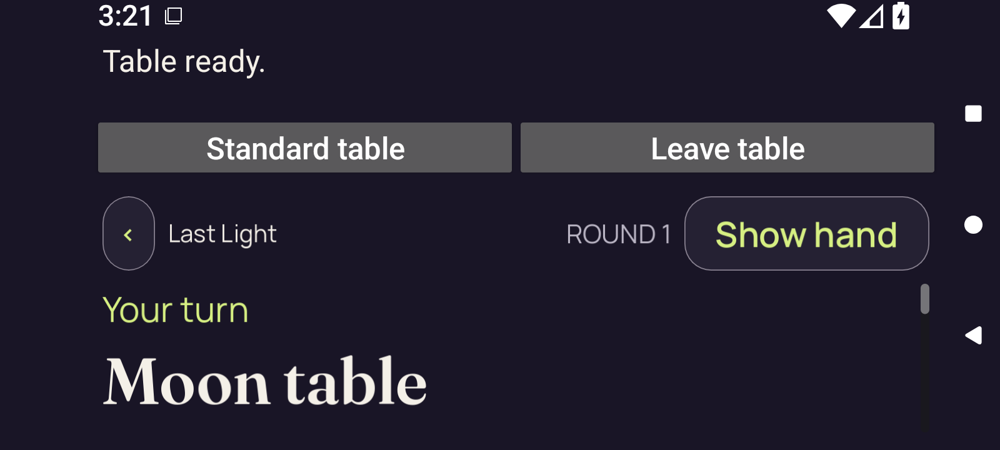
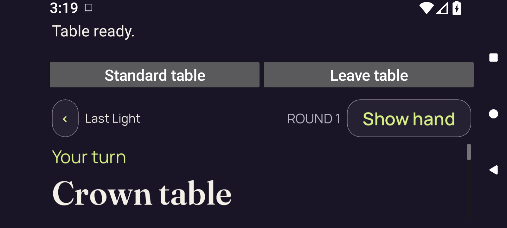
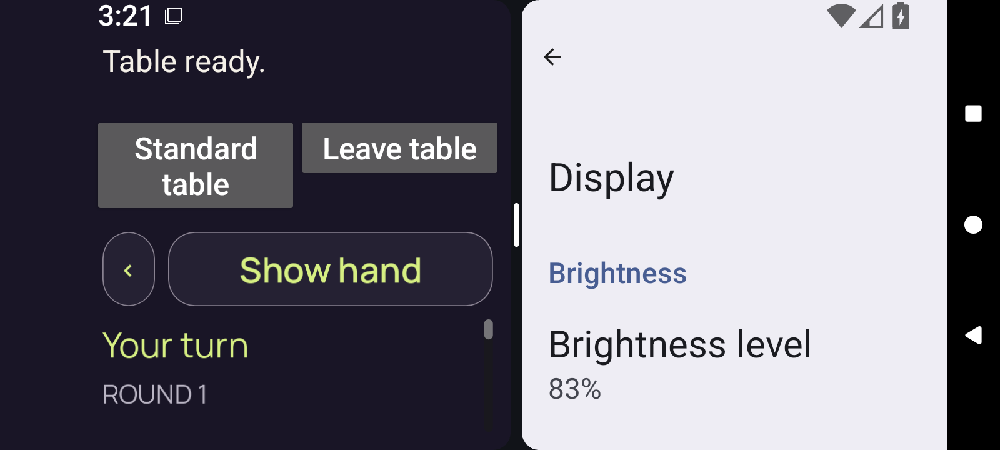

# Android font-2.0 native-ready checkpoints — CI 34555402070

**Four original 3D initial stills with attributed historical direct review.** The debug and optimized test-signed variants each retain a fullscreen and short split-pane checkpoint at font scale 2.0. The complete current claim, hand/card area and lower Play/Challenge actions are outside all four captured viewports; reachability and visual hand concealment remain unverified.

[Gallery index](../README.md) · [Capture manifest](manifest.json) · [Recovered pixel review and fresh identity verification](provenance/pixel-review/review.json) · [Recovery-review freeze](provenance/pixel-review/FROZEN.json)

A runtime restart erased the private gallery before publication. The original PNGs and JSON/XML pairs survived. The earlier complete pixel review and freeze were restored byte for byte from recorded tool output; the linked successor records distinguish those four historical direct views from zero new views. Source reports restored exactly and any explicitly reconstructed successor are labeled in the manifest. No new pixel view was performed.

Run `34555402070`, attempt 1, workflow head `aa10e0bd9055aa9fd1b5d80021754f06a8eff3c7`. Original API artifact metadata supplies this source attribution; embedded source, installed-package and complete-run collection qualification have separate records. The `native-ready` filenames retain the producer checkpoint names.

| Original variant | Stills | Recorded automated outcome |
| --- | ---: | --- |
| Debug, font 2.0 | 2 | 24 adaptive scopes and one installation passed; runner exit 0. [Original outcome receipt](provenance/collector/receipts/consumer-10183443556.outcomes-v1.json) · [Independent derived-receipt review](provenance/derived-outcome-review/CONSUMER-10183443556-DERIVED-OUTCOME-REVIEW.json). |
| Optimized, test signed, font 2.0 | 2 | 24 adaptive scopes and one installation passed; runner exit 0. [Original outcome receipt](provenance/collector/receipts/consumer-10183394128.outcomes-v1.json) · [Independent derived-receipt review](provenance/derived-outcome-review/CONSUMER-10183394128-DERIVED-OUTCOME-REVIEW.json). |

Both consumer receipts preserve `passed-automated-scope`. These host/chrome, configuration and lifecycle checks contain no engine gameplay assertion. The selected native split checkpoints provide readiness/geometry records, with no demonstrated body swipe or accepted Play/Challenge action. The independent derived-receipt reviews reused the original CRC/SHA proofs and did not replay ZIP members or native tests.

All four images show readable Show hand, Standard table and Leave table controls. Fullscreen public context includes Your turn, ROUND 1 and Moon table in debug or Crown table in optimized. The short split panes show Your turn and ROUND 1; their table titles and claims are outside the viewport. The reviewer reports no overlap or clipped visible label. A drawn scrollbar does not establish input delivery or content reachability.

No private faces are observed, but the hand area is offscreen. Show hand alone does not verify concealed hand pixels or continuous privacy. No table geometry or card-face artwork is visible, so these initial stills do not visually qualify 3D table geometry. Native accessibility, physical-device/network, store signing, performance and shipping qualification remain separate.

Each original JSON/XML pair and ZIP member identity is retained. Screenshot start/receipt times, XML receipt/sequence, capture intervals and filesystem timestamps remain distinct. The PNG and XML were acquired sequentially, not atomically; the XML surface bounds below are separate geometry observations. No video is selected or decoded for this publication, and earlier gallery review labels remain unchanged.

Source records: [Original API receipt](provenance/collector/metadata/20260911T033232.865895Z-receipt.json) · [Canonical metadata preservation](provenance/collector/receipts/metadata-copy-provenance-v1.json) · [Selected-source preparation receipt](provenance/source-preparation/shared-source-preflight.json). Pending package/collection labels inside retained earlier receipts remain historical; the original collection was subsequently frozen at 04:53 UTC. Collector closure adds no claim/action reachability or pixel-privacy acceptance.

## 01 · Debug font 2.0 fullscreen native-ready initial viewport

**Historical direct view** by `/root/pixel_d1_land`; 1600 × 720 original pixels. Android API 36, debug, font scale 2.0, 3D fullscreen native-ready initial capture. Your turn, ROUND 1, and Moon table are visible. Current-claim text, hand area, and lower actions are not visible in the initial viewport. No body-scroll reachability or hand-concealment acceptance.

The native wrapper says Table ready and shows readable Standard table and Leave table controls. The game HUD shows Last Light, ROUND 1, a complete Show hand label, Your turn, and Moon table. A vertical body scrollbar is visible. No current-claim sentence, hand area, card faces, or Play/Challenge action is in view.

The visible labels and native controls are readable without clipping or overlap. Initial body context extends through the table title; the claim, hand, and lower actions remain outside the captured viewport.

Original identity: `34555402070/1/10183443556/godot-adaptive/runtime/captures/3d-split-full-native-ready.png`. Original filename: `3d-split-full-native-ready.png`. Artifact `10183443556` / `android-adaptive-api36-debug-font-2.0-34555402070-1`.

Original size: 80,077 bytes. SHA-256: `9efd265232af7932c8e3b19c9e67ce84fb895383b6000b2c2d8c8b868a85e992`.

Screenshot acquisition: `2026-09-11T03:21:34.428+00:00` → `2026-09-11T03:21:34.609+00:00`. XML received: `2026-09-11T03:21:34.428+00:00`; sequence `695`. Capture interval: `2026-09-11T03:21:32.293+00:00` → `2026-09-11T03:21:34.710+00:00`.

Original stage `3d-split.entry-after-ready`: **passed** in the recorded automated scope. [Original JSON](debug/font-2.0/runtime/captures/3d-split-full-native-ready.json) · [Original XML](debug/font-2.0/runtime/captures/3d-split-full-native-ready.xml) · [Direct-view observations](provenance/pixel-review/direct-views-and-observations.json).

Separately acquired XML surface bounds: `[136, 286, 1516, 720]` pixels. Geometry is from the separately acquired original XML; it is not an atomic measurement of the PNG.

Review limits: Show hand is consistent with an unrevealed control state, but the hand area is offscreen, so visual hand concealment is unverified. A drawn scrollbar does not establish scrolling input or reachability. No 3D table geometry is visible in this short initial viewport.

## 02 · Debug font 2.0 short split-pane native-ready initial viewport

**Historical direct view** by `/root/pixel_d1_land`; 1600 × 720 original pixels. Android API 36, debug, font scale 2.0, 3D short split-pane native-ready initial capture. Your turn and ROUND 1 are visible; the table title is outside the initial viewport. Current-claim text, hand area, and lower actions are not visible in the initial viewport. No body-scroll reachability or hand-concealment acceptance.

PartyDeck occupies the left split pane beside Android Display settings. Its wrapper shows Table ready, Standard table wrapped over two lines, and Leave table. The HUD shows a back chevron, the complete Show hand label, Your turn, and ROUND 1. A short vertical scrollbar thumb is visible. The table title, current claim, hand, card faces, and lower actions are outside the viewport.

The visible native controls and Show hand fit; the public body shows turn and round only. There is no cut-off current-claim fragment in this initial still because no claim text is visible.

Original identity: `34555402070/1/10183443556/godot-adaptive/runtime/captures/3d-split-pane-native-ready.png`. Original filename: `3d-split-pane-native-ready.png`. Artifact `10183443556` / `android-adaptive-api36-debug-font-2.0-34555402070-1`.

Original size: 82,717 bytes. SHA-256: `572083a85c5c7d722e6e72b9094d1ab533c9bca316180e2f85d3cfe477c05d95`.

Screenshot acquisition: `2026-09-11T03:24:06.707+00:00` → `2026-09-11T03:24:06.889+00:00`. XML received: `2026-09-11T03:24:06.706+00:00`; sequence `752`. Capture interval: `2026-09-11T03:24:04.586+00:00` → `2026-09-11T03:24:06.993+00:00`.

Original stage `3d-split.stable-split-launch-exit`: **passed** in the recorded automated scope. [Original JSON](debug/font-2.0/runtime/captures/3d-split-pane-native-ready.json) · [Original XML](debug/font-2.0/runtime/captures/3d-split-pane-native-ready.xml) · [Direct-view observations](provenance/pixel-review/direct-views-and-observations.json).

Separately acquired XML surface bounds: `[136, 343, 817, 720]` pixels. Geometry is from the separately acquired original XML; it is not an atomic measurement of the PNG.

Review limits: No private faces are visible, but the hand is offscreen; this does not verify the concealed-hand panel. Initial pixels do not establish body-scroll reachability, native input, or complete public context. The Android Display settings pane is separate from the PartyDeck game viewport.

## 03 · Optimized test-signed font 2.0 fullscreen native-ready initial viewport

**Historical direct view** by `/root/pixel_d1_land`; 1600 × 720 original pixels. Android API 36, optimized test-signed, font scale 2.0, 3D fullscreen native-ready initial capture. Your turn, ROUND 1, and Crown table are visible. Current-claim text, hand area, and lower actions are not visible in the initial viewport. No body-scroll reachability or hand-concealment acceptance.

The native wrapper says Table ready and shows readable Standard table and Leave table controls. The game HUD shows Last Light, ROUND 1, a complete Show hand label, Your turn, and Crown table. A vertical body scrollbar is visible. No current-claim sentence, hand area, card faces, or Play/Challenge action is in view.

Visible headings and controls fit without clipped labels or overlap. Initial public context reaches the table title; the claim, hand, and lower actions are outside the captured viewport.

Original identity: `34555402070/1/10183394128/godot-adaptive/runtime/captures/3d-split-full-native-ready.png`. Original filename: `3d-split-full-native-ready.png`. Artifact `10183394128` / `android-adaptive-api36-optimized-test-signed-font-2.0-34555402070-1`.

Original size: 81,483 bytes. SHA-256: `667f026295ee77b0c2bcbdc63cfee6d3a2adabe59c169af0cc14f505b01b8bcd`.

Screenshot acquisition: `2026-09-11T03:19:38.207+00:00` → `2026-09-11T03:19:38.399+00:00`. XML received: `2026-09-11T03:19:38.206+00:00`; sequence `645`. Capture interval: `2026-09-11T03:19:36.049+00:00` → `2026-09-11T03:19:38.515+00:00`.

Original stage `3d-split.entry-after-ready`: **passed** in the recorded automated scope. [Original JSON](optimized/font-2.0/runtime/captures/3d-split-full-native-ready.json) · [Original XML](optimized/font-2.0/runtime/captures/3d-split-full-native-ready.xml) · [Direct-view observations](provenance/pixel-review/direct-views-and-observations.json).

Separately acquired XML surface bounds: `[136, 286, 1516, 720]` pixels. Geometry is from the separately acquired original XML; it is not an atomic measurement of the PNG.

Review limits: The shown Crown table and ROUND 1 belong to this capture and must not be conflated with a separate desktop authority fixture. Show hand alone does not establish hidden hand pixels because the hand area is offscreen. The scrollbar does not establish native input, scrolling, or reachability.

## 04 · Optimized test-signed font 2.0 short split-pane native-ready initial viewport

**Historical direct view** by `/root/pixel_d1_land`; 1600 × 720 original pixels. Android API 36, optimized test-signed, font scale 2.0, 3D short split-pane native-ready initial capture. Your turn and ROUND 1 are visible; the table title is outside the initial viewport. Current-claim text, hand area, and lower actions are not visible in the initial viewport. No body-scroll reachability or hand-concealment acceptance.

PartyDeck occupies the left split pane beside Android Display settings. Table ready, Standard table wrapped over two lines, Leave table, the back chevron, and the complete Show hand label are readable. The body shows Your turn, ROUND 1, and a short vertical scrollbar thumb. Table title, current claim, hand/card area, and lower actions are outside the viewport.

The visible controls and turn/round text fit the short pane. No current-claim fragment is visible; complete public context is not presented in this initial still.

Original identity: `34555402070/1/10183394128/godot-adaptive/runtime/captures/3d-split-pane-native-ready.png`. Original filename: `3d-split-pane-native-ready.png`. Artifact `10183394128` / `android-adaptive-api36-optimized-test-signed-font-2.0-34555402070-1`.

Original size: 82,521 bytes. SHA-256: `c7dc95c6750ee87241eb542ecc9573e89d5e30bb62a564a5bd624792442499bb`.

Screenshot acquisition: `2026-09-11T03:22:00.412+00:00` → `2026-09-11T03:22:00.593+00:00`. XML received: `2026-09-11T03:22:00.411+00:00`; sequence `698`. Capture interval: `2026-09-11T03:21:58.282+00:00` → `2026-09-11T03:22:00.698+00:00`.

Original stage `3d-split.stable-split-launch-exit`: **passed** in the recorded automated scope. [Original JSON](optimized/font-2.0/runtime/captures/3d-split-pane-native-ready.json) · [Original XML](optimized/font-2.0/runtime/captures/3d-split-pane-native-ready.xml) · [Direct-view observations](provenance/pixel-review/direct-views-and-observations.json).

Separately acquired XML surface bounds: `[136, 343, 817, 720]` pixels. Geometry is from the separately acquired original XML; it is not an atomic measurement of the PNG.

Review limits: No private faces are visible, but the offscreen hand prevents visual concealment verification. This separate capture does not inherit the table rank or actual claim from another screenshot or fixture. Initial stills do not establish body-scroll reachability, gesture acceptance, or continuous privacy.
