# Android 3D public-context sweep — run 34609437169

All **52 original 1600 × 720 captures** from Android focused run **#12**, run ID **34609437169**, attempt **1**, source `ef568520b0aadc298c7ffd89c4452ebe82605bd8`, are preserved here: **26 optimized test-signed** and **26 debug**. Each section retains its Standard pre-entry anchor followed by native **3D positions 00–24**, including the repeated no-progress endpoints.

[Gallery](../README.md) · [Capture manifest](manifest.json) · [Independent outcome review](provenance/review/closure/OUTCOME-REVIEW.json) · [Independent collection closure](provenance/review/closure/CLOSURE-REVIEW.json)

The recorded configuration is Android **API 36**, **font scale 2.0**, landscape multi-window. The public claim is **Star** in the optimized variant and **Crown** in debug.

**Eight focused outcomes and two installation outcomes are recorded as passed.** Those result checks and the attributed direct pixel observations retain separate scopes.

Collection limits: the stills document visible content and controls at the captured positions. They do not establish an executed Challenge action, Challenge hit testing or authority behavior, native body bottom, continuous privacy or behavior between captures, horizontal roster or full-table accessibility, screen-reader behavior, physical-device or LAN behavior, package or installed-copy acceptance, signing, store release or shipping activation.

The original collector receipts retain the flags written before later release and pixel review. The linked actual-release records and final pixel reviews record their own later closure; the original receipt bytes are preserved.

[Collector freeze](provenance/collector/collection-frozen.json) · [Actual collector release](provenance/collector/ANDROID12-FINAL-RELEASE.json) · [Input and linkage review](provenance/review/input/PHASE-A.json)

Every image below is an attributed direct original-detail view. Captions are reproduced verbatim, with local limits beside their image. Broader reviewer limits remain in the linked reviews and collection records. Gallery preparation adds no pixel view or image transformation.

## Optimized test-signed — Star

Artifact **10268304231** · public claim: **Orbit claimed 1 Star.** · reviewer: **/root/pixel_o1_land2**.

[Final focused review](provenance/review/optimized/REVIEW.json) · [Exact observed captions](provenance/review/optimized/VIEWS-SETTLED.json) · [Original identity checks](provenance/review/optimized/INTEGRITY-XML.json) · [Actual pixel-review release](provenance/review/optimized/ACTUAL-RELEASE.json) · [Reviewer freeze](provenance/review/optimized/FROZEN.json)

### Standard pre-entry anchor

<a href="optimized/godot-adaptive/runtime/captures/3d-context-pane-standard-actions.png">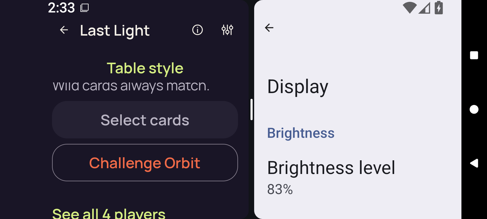</a>

Standard pre-entry anchor: complete disabled Select cards and outlined Challenge Orbit; no private card face or rank visible. This is Standard context only.

[Exact observed caption](provenance/review/optimized/VIEWS-SETTLED.json) — JSON pointer `/views/0/observation`.

Original member: `godot-adaptive/runtime/captures/3d-context-pane-standard-actions.png` · **85585 bytes** · SHA-256 `64e6d79c62583bc86228b4f6d10593584a80c0a8e63218df082bbda50c405bf1`.

### Native 3D position 00

Position00: complete Your turn and ROUND 1 within native body clip; Show hand header; no private card face/rank. Claim/guidance not yet visible.

[Exact observed caption](provenance/review/optimized/VIEWS-SETTLED.json) — JSON pointer `/views/1/observation`.

Original member: `godot-adaptive/runtime/captures/3d-context-position-00.png` · **83178 bytes** · SHA-256 `edd241048eddd191d30767ab9243c315a53ec61be290eb20e42cf1416dd283a1`.

### Native 3D position 01

<a href="optimized/godot-adaptive/runtime/captures/3d-context-position-01.png">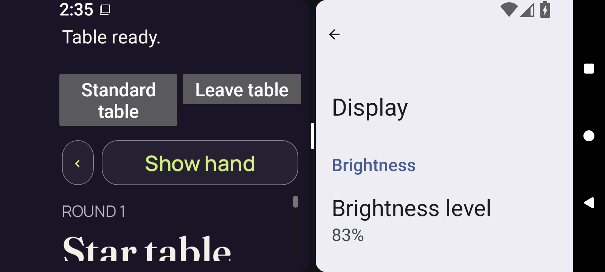</a>

Position01: complete ROUND 1; Star table enters with lower glyphs clipped at body bottom. Concealed header unchanged; no private face/rank.

[Exact observed caption](provenance/review/optimized/VIEWS-SETTLED.json) — JSON pointer `/views/2/observation`.

Original member: `godot-adaptive/runtime/captures/3d-context-position-01.png` · **87919 bytes** · SHA-256 `f0c8b16811abbbb006226879e04537bb6c1689727db960e3ed48efb43b2773ae`.

### Native 3D position 02

<a href="optimized/godot-adaptive/runtime/captures/3d-context-position-02.png">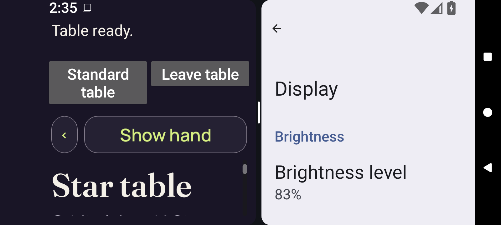</a>

Position02: full Star table legible, while claim is only entering at bottom. No private card face/rank; continued upward content movement.

[Exact observed caption](provenance/review/optimized/VIEWS-SETTLED.json) — JSON pointer `/views/3/observation`.

Original member: `godot-adaptive/runtime/captures/3d-context-position-02.png` · **87247 bytes** · SHA-256 `dc228ad5d2c9d50dd422e7b727e80d2042d41fabdfb89529226fd912a074daa5`.

### Native 3D position 03

<a href="optimized/godot-adaptive/runtime/captures/3d-context-position-03.png">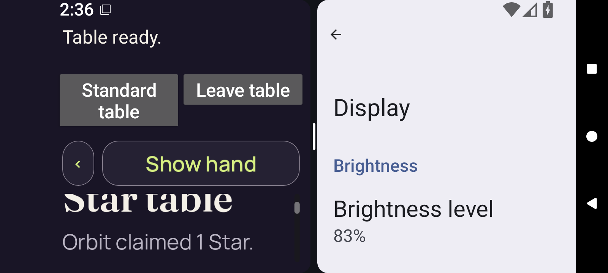</a>

Position03: complete Orbit claimed 1 Star. with final period; preceding Star table is clipped at top but was fully visible at02. No private card face/rank.

[Exact observed caption](provenance/review/optimized/VIEWS-SETTLED.json) — JSON pointer `/views/4/observation`.

Original member: `godot-adaptive/runtime/captures/3d-context-position-03.png` · **98030 bytes** · SHA-256 `8fe4d056116f1d350a9ff28d21564263625a00eea78d014be015c56556dcec37`.

### Native 3D position 04

<a href="optimized/godot-adaptive/runtime/captures/3d-context-position-04.png">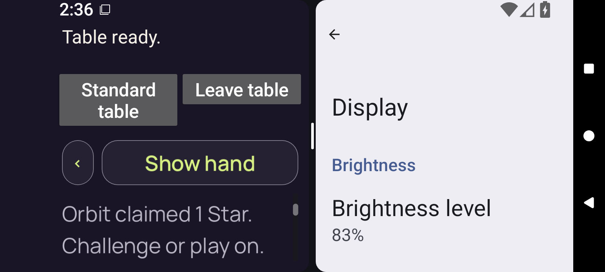</a>

Position04: complete Orbit claimed 1 Star. and Challenge or play on. simultaneously legible inside native clip, without clipped glyphs. No private card face/rank.

[Exact observed caption](provenance/review/optimized/VIEWS-SETTLED.json) — JSON pointer `/views/5/observation`.

Original member: `godot-adaptive/runtime/captures/3d-context-position-04.png` · **101213 bytes** · SHA-256 `0551442ea85fc96441dea34a135cef12e10939507740b17dd9e9c32ef686d37c`.

### Native 3D position 05

Position05: complete Challenge or play on. remains legible; Guest and Moxie public roster headings enter below. No private card face/rank.

[Exact observed caption](provenance/review/optimized/VIEWS-SETTLED.json) — JSON pointer `/views/6/observation`.

Original member: `godot-adaptive/runtime/captures/3d-context-position-05.png` · **98684 bytes** · SHA-256 `9d0da7c99989e26735e9f6b40a7348881f1a5b9fdf994cb2c189a85f25b49808`.

### Native 3D position 06

<a href="optimized/godot-adaptive/runtime/captures/3d-context-position-06.png">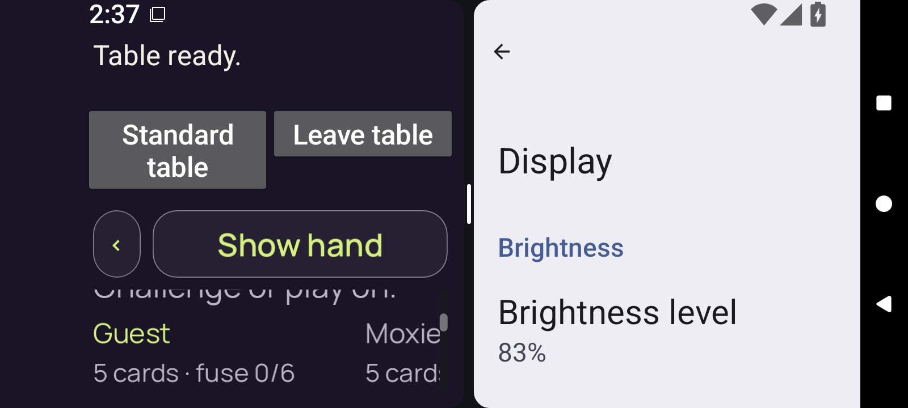</a>

Position06: Guest and 5 cards · fuse 0/6 legible; Moxie public column/count continues beyond right clip. Prior guidance exits at top. No private card face/rank.

[Exact observed caption](provenance/review/optimized/VIEWS-SETTLED.json) — JSON pointer `/views/7/observation`.

Original member: `godot-adaptive/runtime/captures/3d-context-position-06.png` · **104416 bytes** · SHA-256 `e8962dec906ec3dca9c87f99dfa0d2b2f371cc70becc9bad9fc08321554ce49f`.

### Native 3D position 07

Position07: public card-count/fuse row and horizontal roster scrollbar visible; additional roster columns remain beyond right clip. No private card face/rank.

[Exact observed caption](provenance/review/optimized/VIEWS-SETTLED.json) — JSON pointer `/views/8/observation`.

Original member: `godot-adaptive/runtime/captures/3d-context-position-07.png` · **97216 bytes** · SHA-256 `b32f596f66925511153933ae6ad37cf8a54e2dc097ff41bd265c7714cff33745`.

### Native 3D position 08

<a href="optimized/godot-adaptive/runtime/captures/3d-context-position-08.png">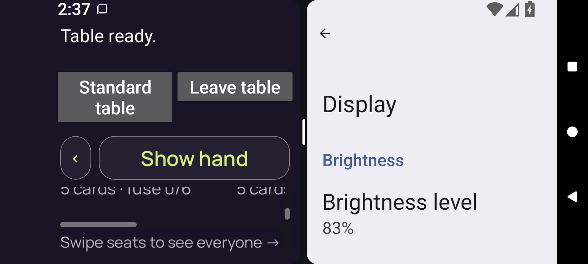</a>

Position08: horizontal roster scrollbar plus complete Swipe seats to see everyone arrow instruction. Vertical sweep does not exercise horizontal roster. No private card face/rank.

[Exact observed caption](provenance/review/optimized/VIEWS-SETTLED.json) — JSON pointer `/views/9/observation`.

Original member: `godot-adaptive/runtime/captures/3d-context-position-08.png` · **100959 bytes** · SHA-256 `747a20ebb354666d44e47739b9bf5b67a97b1c7a8cc02eb13d04a8a96c645af4`.

### Native 3D position 09

Position09: complete Swipe seats to see everyone arrow instruction and horizontal scrollbar; lower body otherwise blank. No private card face/rank.

[Exact observed caption](provenance/review/optimized/VIEWS-SETTLED.json) — JSON pointer `/views/10/observation`.

Original member: `godot-adaptive/runtime/captures/3d-context-position-09.png` · **89001 bytes** · SHA-256 `4b7aac324742cef156cf04ea5f67fe4d08f7f6aa563ad84f009c648afb3f2ff0`.

### Native 3D position 10

Position10: roster instruction exits at top while top edge of the 3D table enters at bottom. Show hand remains pinned; no private card face/rank.

[Exact observed caption](provenance/review/optimized/VIEWS-SETTLED.json) — JSON pointer `/views/11/observation`.

Original member: `godot-adaptive/runtime/captures/3d-context-position-10.png` · **91048 bytes** · SHA-256 `9027a0f491c3a10dcf90466c42f8cea47f2c057912da9c8bc3b0d19fac1cbe72`.

### Native 3D position 11

<a href="optimized/godot-adaptive/runtime/captures/3d-context-position-11.png">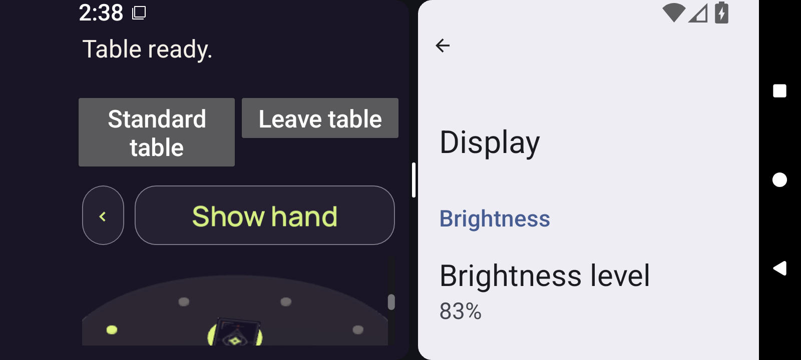</a>

Position11: upper 3D table and face-down center pile enter; no private rank, face or selected label. Show hand remains visible.

[Exact observed caption](provenance/review/optimized/VIEWS-SETTLED.json) — JSON pointer `/views/12/observation`.

Original member: `godot-adaptive/runtime/captures/3d-context-position-11.png` · **89797 bytes** · SHA-256 `63e3f7b472e2977dd61a9bd9673105add0ead460ff60578804ee495b16d23cbf`.

### Native 3D position 12

Position12: face-down center pile and five matching hand-card backs begin to appear. No private face/rank or selection indication.

[Exact observed caption](provenance/review/optimized/VIEWS-SETTLED.json) — JSON pointer `/views/13/observation`.

Original member: `godot-adaptive/runtime/captures/3d-context-position-12.png` · **113404 bytes** · SHA-256 `e27b199a2fb91c14b1b89f8d738b6e9bf07328059e9d257b8959e883d47cf51c`.

### Native 3D position 13

<a href="optimized/godot-adaptive/runtime/captures/3d-context-position-13.png">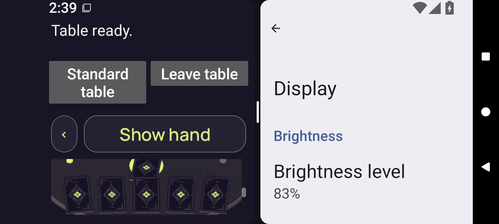</a>

Position13: five matching hand-card backs visible across the native stage, with face-down center pile above; no rank, private face or selected marker.

[Exact observed caption](provenance/review/optimized/VIEWS-SETTLED.json) — JSON pointer `/views/14/observation`.

Original member: `godot-adaptive/runtime/captures/3d-context-position-13.png` · **145363 bytes** · SHA-256 `9cd4a5c0f192a3b156264758082d0ff80b109fe708d9a7c0cdb7734839ca6d95`.

### Native 3D position 14

Position14: same five backs and lower table edge move upward; upper backs clip as expected from scrolling. No private face/rank.

[Exact observed caption](provenance/review/optimized/VIEWS-SETTLED.json) — JSON pointer `/views/15/observation`.

Original member: `godot-adaptive/runtime/captures/3d-context-position-14.png` · **135838 bytes** · SHA-256 `7344919e22073c1b5964f386b30ccf43563446a7bd4d679105f6989f71546f3e`.

### Native 3D position 15

<a href="optimized/godot-adaptive/runtime/captures/3d-context-position-15.png">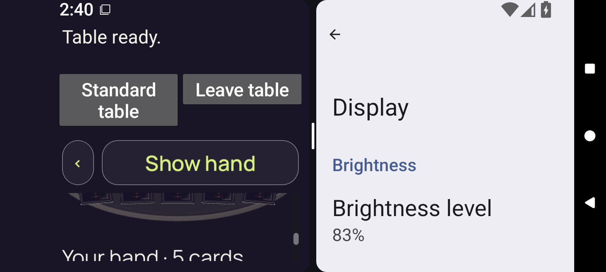</a>

Position15: lower card backs/table edge leave at top; Your hand · 5 cards enters with lower glyphs clipped. No private face/rank.

[Exact observed caption](provenance/review/optimized/VIEWS-SETTLED.json) — JSON pointer `/views/16/observation`.

Original member: `godot-adaptive/runtime/captures/3d-context-position-15.png` · **106153 bytes** · SHA-256 `0e9a87c6ace928abc1f5c4eac3916363c84a2e3a467554e9b5e8c7b1dc40aea5`.

### Native 3D position 16

<a href="optimized/godot-adaptive/runtime/captures/3d-context-position-16.png">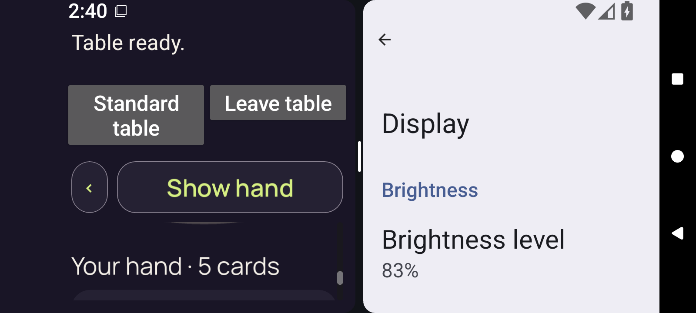</a>

Position16: full Your hand · 5 cards legible; top edge of disabled Play area enters at bottom. No private face/rank.

[Exact observed caption](provenance/review/optimized/VIEWS-SETTLED.json) — JSON pointer `/views/17/observation`.

Original member: `godot-adaptive/runtime/captures/3d-context-position-16.png` · **89011 bytes** · SHA-256 `ae7bc66258d2972eda9b9dc23738acb1387a47ceee8eb4db5335616af2f49cd2`.

### Native 3D position 17

<a href="optimized/godot-adaptive/runtime/captures/3d-context-position-17.png">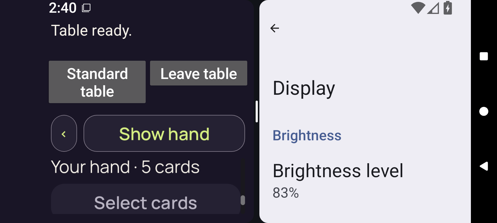</a>

Position17: full Your hand · 5 cards and Select cards text; Play control lower boundary is clipped. No private face/rank.

[Exact observed caption](provenance/review/optimized/VIEWS-SETTLED.json) — JSON pointer `/views/18/observation`.

Original member: `godot-adaptive/runtime/captures/3d-context-position-17.png` · **102252 bytes** · SHA-256 `0ba56f064751a404a3b0a38ef978202f2f6220409e6147e36cf7f00eba088d99`.

### Native 3D position 18

<a href="optimized/godot-adaptive/runtime/captures/3d-context-position-18.png">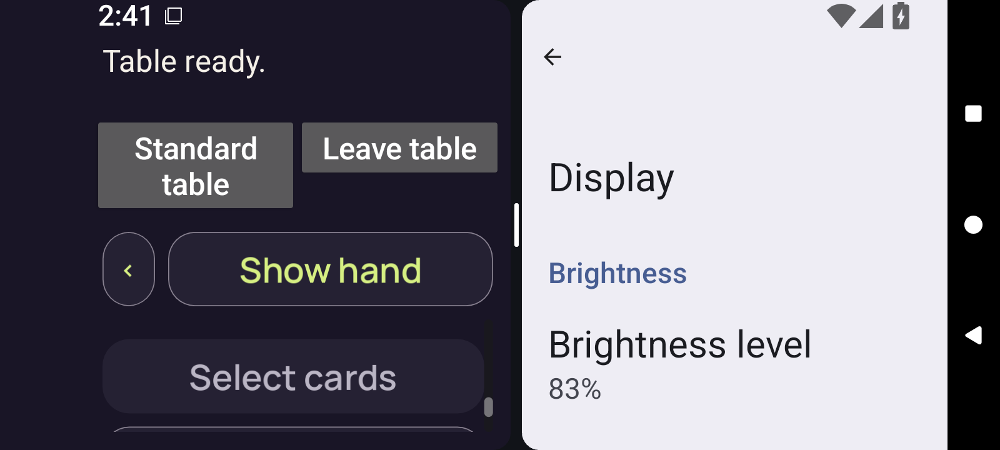</a>

Position18: complete disabled Select cards control and all glyphs fit with top/bottom space inside native clip. Only Challenge top outline enters below. No private face/rank.

[Exact observed caption](provenance/review/optimized/VIEWS-SETTLED.json) — JSON pointer `/views/19/observation`.

Original member: `godot-adaptive/runtime/captures/3d-context-position-18.png` · **85015 bytes** · SHA-256 `89b30e96651e49448a255f744d41c3c1fdae19a0e69575d56b6b6b810a559d49`.

### Native 3D position 19

<a href="optimized/godot-adaptive/runtime/captures/3d-context-position-19.png">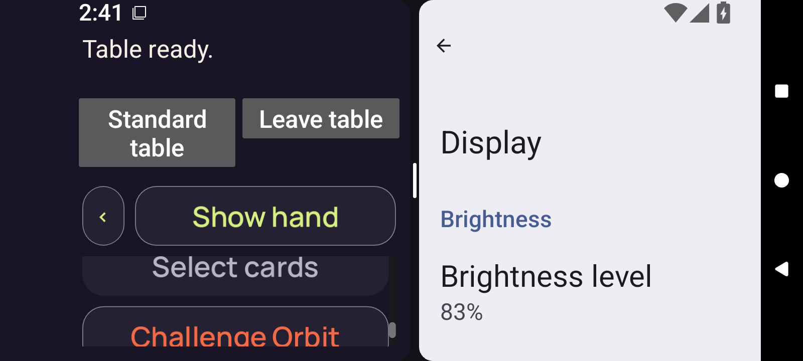</a>

Position19: Select cards exits at top and Challenge Orbit enters below, with lower Challenge glyphs/control clipped; not the acceptance frame. No private face/rank.

[Exact observed caption](provenance/review/optimized/VIEWS-SETTLED.json) — JSON pointer `/views/20/observation`.

Original member: `godot-adaptive/runtime/captures/3d-context-position-19.png` · **95777 bytes** · SHA-256 `529155e142956d677509e3ffdd386a580f51b663f2bb9656d1de065fabdab0f0`.

### Native 3D position 20

<a href="optimized/godot-adaptive/runtime/captures/3d-context-position-20.png">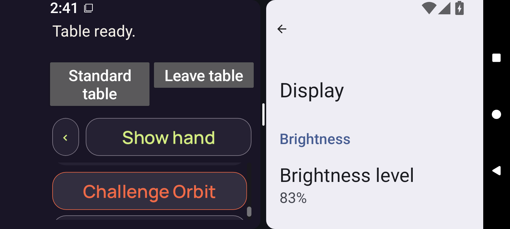</a>

Position20: complete Challenge Orbit label and rounded control border fully visible, approximately x164..775/y541..660, with space within native clip. No private face/rank; no gameplay tap inferred.

[Exact observed caption](provenance/review/optimized/VIEWS-SETTLED.json) — JSON pointer `/views/21/observation`.

Original member: `godot-adaptive/runtime/captures/3d-context-position-20.png` · **86326 bytes** · SHA-256 `ceedf1906484b0a641d4011e6118c46d0674ee1c1d10f329da54f7aad59c872a`.

### Native 3D position 21

Position21: Challenge control moves above top clip with upper glyphs/border cut; Return to lobby enters at bottom. Position20 supplies full Challenge acceptance. No private face/rank.

[Exact observed caption](provenance/review/optimized/VIEWS-SETTLED.json) — JSON pointer `/views/22/observation`.

Original member: `godot-adaptive/runtime/captures/3d-context-position-21.png` · **95494 bytes** · SHA-256 `ac70349c8de9d69f561b5648bdb043025b609d5dc5967a8fa0fc3c8b9f039ef6`.

### Native 3D position 22

Position22: Challenge mostly exits at top; complete Return to lobby control visible below. This endpoint alone does not establish body bottom. No private face/rank.

[Exact observed caption](provenance/review/optimized/VIEWS-SETTLED.json) — JSON pointer `/views/23/observation`.

Original member: `godot-adaptive/runtime/captures/3d-context-position-22.png` · **89515 bytes** · SHA-256 `a1577bebb201b2f31d4fb5679b02ea6a7595a14eae684613c8bc2bc5263a45ca`.

### Native 3D position 23

Position23: repeated body endpoint matches22, with Return to lobby fully visible and Challenge clipped above. No private face/rank; no body-bottom inference.

[Exact observed caption](provenance/review/optimized/VIEWS-SETTLED.json) — JSON pointer `/views/24/observation`.

Original member: `godot-adaptive/runtime/captures/3d-context-position-23.png` · **89516 bytes** · SHA-256 `39f5c2f17097def7b8d1ed1982fe501cece96b8feb20466edbcbbaefd11c47fa`.

### Native 3D position 24

Position24: same body endpoint again; clock and Challenge outline highlight differ, but content position stays fixed. No private face/rank; no body-bottom or continuous-privacy inference.

[Exact observed caption](provenance/review/optimized/VIEWS-SETTLED.json) — JSON pointer `/views/25/observation`.

Original member: `godot-adaptive/runtime/captures/3d-context-position-24.png` · **90358 bytes** · SHA-256 `81a2a5c35035fcfd04362e76061aecc40e8a56e319781a57a3af0c5980576958`.

## Debug — Crown

Artifact **10269022533** · public claim: **Orbit claimed 1 Crown.** · reviewer: **/root/pixel_d1_land**.

[Final focused review](provenance/review/debug/REVIEW.json) · [Exact observed captions](provenance/review/debug/REVIEW.json) · [Original identity checks](provenance/review/debug/INTEGRITY-AND-DECODE.json) · [Actual pixel-review release](provenance/review/debug/ACTUAL-RELEASE.json) · [Reviewer freeze](provenance/review/debug/FROZEN.json)

Captions describe only their named original still. completeVisibleRequiredText lists fully visible wording in that still; clipped fragments are not counted. Card backs are observed only where handCardBacksVisible is true. No private face/label was observed in any capture.

### Standard pre-entry anchor

<a href="debug/godot-adaptive/runtime/captures/3d-context-pane-standard-actions.png">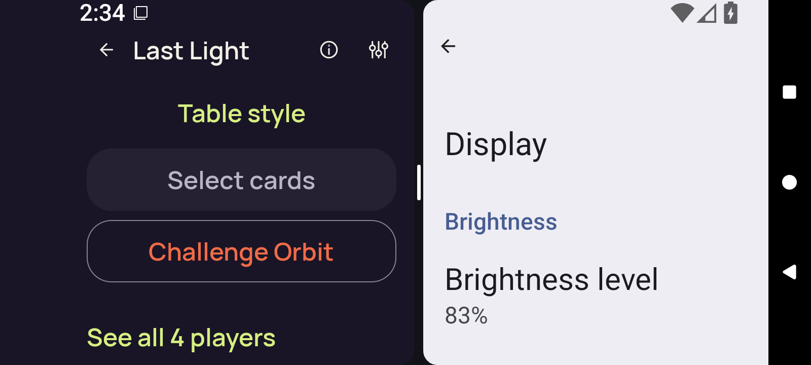</a>

Standard actions anchor shows the complete gray Select cards button and complete outlined Challenge Orbit button, both within the left split pane. Last Light header, Table style and See all 4 players are readable.

[Exact observed caption](provenance/review/debug/REVIEW.json) — JSON pointer `/captureRows/0/5`.

Original member: `godot-adaptive/runtime/captures/3d-context-pane-standard-actions.png` · **78116 bytes** · SHA-256 `c4b0cb12c83b15a637a35746bbce49c56999785b43743a1adddbaba781d056c1`.

### Native 3D position 00

<a href="debug/godot-adaptive/runtime/captures/3d-context-position-00.png">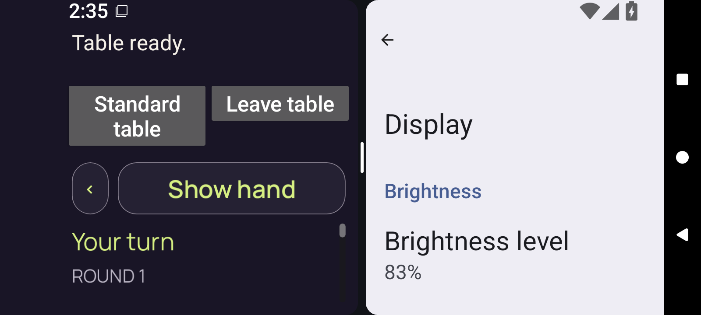</a>

Initial native body shows Your turn and complete ROUND 1. Table ready, Standard table, Leave table and fixed Show hand controls are fully visible. Body scrollbar is near the top.

[Exact observed caption](provenance/review/debug/REVIEW.json) — JSON pointer `/captureRows/1/5`.

Original member: `godot-adaptive/runtime/captures/3d-context-position-00.png` · **83178 bytes** · SHA-256 `edd241048eddd191d30767ab9243c315a53ec61be290eb20e42cf1416dd283a1`.

### Native 3D position 01

<a href="debug/godot-adaptive/runtime/captures/3d-context-position-01.png">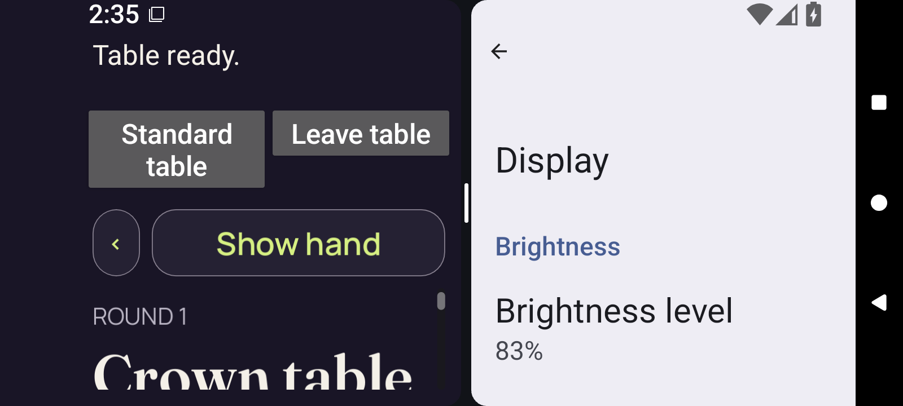</a>

ROUND 1 is complete after the first movement. The large Crown table title enters at the lower body edge with its lower glyph portions clipped.

[Exact observed caption](provenance/review/debug/REVIEW.json) — JSON pointer `/captureRows/2/5`.

Original member: `godot-adaptive/runtime/captures/3d-context-position-01.png` · **90970 bytes** · SHA-256 `fb568162b6e85967d4ff7cb3c8b7230eef4510f582edf63848c6a89c5140808b`.

### Native 3D position 02

<a href="debug/godot-adaptive/runtime/captures/3d-context-position-02.png">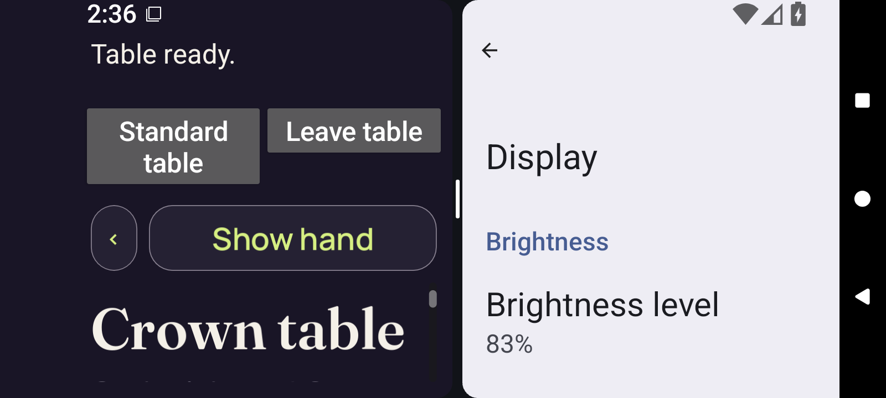</a>

The complete Crown table title is visible inside the native body band. No claim or action control is yet visible.

[Exact observed caption](provenance/review/debug/REVIEW.json) — JSON pointer `/captureRows/3/5`.

Original member: `godot-adaptive/runtime/captures/3d-context-position-02.png` · **93073 bytes** · SHA-256 `3fb508b9cfa55fa766d91906f195ddce1a87ffb3d2358be4940147b1c963fd88`.

### Native 3D position 03

<a href="debug/godot-adaptive/runtime/captures/3d-context-position-03.png">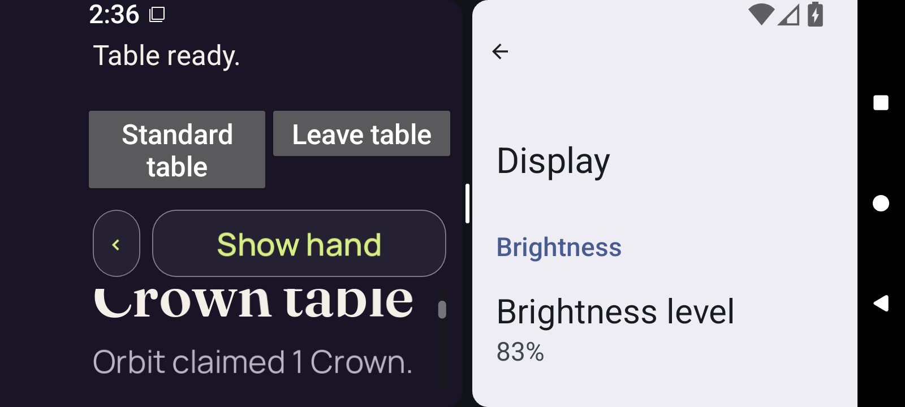</a>

The entire public claim Orbit claimed 1 Crown. is readable on one line. Crown table is clipped at the upper edge after its complete view in position 02.

[Exact observed caption](provenance/review/debug/REVIEW.json) — JSON pointer `/captureRows/4/5`.

Original member: `godot-adaptive/runtime/captures/3d-context-position-03.png` · **104871 bytes** · SHA-256 `df6854754da3adf6d563e9d014f6599242d1ce402e96ade1054f03b4b0af9a82`.

### Native 3D position 04

The complete public claim and complete Challenge or play on. guidance fit together in the native body band without clipping.

[Exact observed caption](provenance/review/debug/REVIEW.json) — JSON pointer `/captureRows/5/5`.

Original member: `godot-adaptive/runtime/captures/3d-context-position-04.png` · **98481 bytes** · SHA-256 `2ea95d16ab5cc2a938c41fd4aa58af42686721158b0bf56523390109bd054d4a`.

### Native 3D position 05

Guidance remains fully readable. The preceding claim is clipped at the upper body edge; the first public player-name row enters below.

[Exact observed caption](provenance/review/debug/REVIEW.json) — JSON pointer `/captureRows/6/5`.

Original member: `godot-adaptive/runtime/captures/3d-context-position-05.png` · **101667 bytes** · SHA-256 `956666cccae0917bc51aabf4bdcf8692cc36635719f153f1e259d680e0567ed8`.

### Native 3D position 06

Guidance leaves through the upper clip. The public player row shows Guest and Moxie; Guest's count/fuse text is readable, while the adjacent player's statistics extend beyond the right clip.

[Exact observed caption](provenance/review/debug/REVIEW.json) — JSON pointer `/captureRows/7/5`.

Original member: `godot-adaptive/runtime/captures/3d-context-position-06.png` · **105795 bytes** · SHA-256 `b802faa321023da32c71523c28707792e528ae5d9cf009e0bde1c7a28309384f`.

### Native 3D position 07

<a href="debug/godot-adaptive/runtime/captures/3d-context-position-07.png">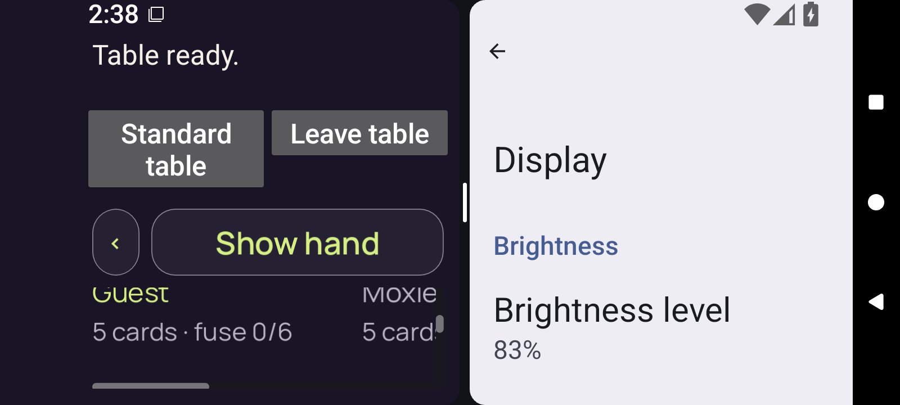</a>

Public player statistics remain visible with the adjacent column cropped at the right edge. A horizontal scrollbar is visible along the lower body edge; no horizontal traversal is demonstrated.

[Exact observed caption](provenance/review/debug/REVIEW.json) — JSON pointer `/captureRows/8/5`.

Original member: `godot-adaptive/runtime/captures/3d-context-position-07.png` · **100253 bytes** · SHA-256 `b987a1c56887f060aacfdecf1da6eadcad3a4ff456de18ed1610bb495f584eae`.

### Native 3D position 08

The player statistics leave through the upper clip. A horizontal scrollbar and the complete Swipe seats to see everyone arrow hint are visible, providing a navigation cue for the cropped player strip.

[Exact observed caption](provenance/review/debug/REVIEW.json) — JSON pointer `/captureRows/9/5`.

Original member: `godot-adaptive/runtime/captures/3d-context-position-08.png` · **101907 bytes** · SHA-256 `6100bcc8586f1f3cdde2ab37dac436def5b3e3ed3e0623c6a0674df4ae434f45`.

### Native 3D position 09

<a href="debug/godot-adaptive/runtime/captures/3d-context-position-09.png">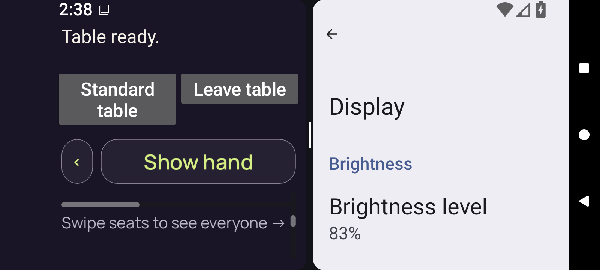</a>

The complete Swipe seats to see everyone arrow hint and horizontal scrollbar move upward through the native body band. No hand faces, private labels or lower action buttons are visible.

[Exact observed caption](provenance/review/debug/REVIEW.json) — JSON pointer `/captureRows/10/5`.

Original member: `godot-adaptive/runtime/captures/3d-context-position-09.png` · **87045 bytes** · SHA-256 `54c9c541c6ca456a510a0e3ce0907f83ebb36d4f41a84309e98f581721f689df`.

### Native 3D position 10

The seat-navigation hint is clipped at the upper body edge while the top edge of the rendered table enters from below.

[Exact observed caption](provenance/review/debug/REVIEW.json) — JSON pointer `/captureRows/11/5`.

Original member: `godot-adaptive/runtime/captures/3d-context-position-10.png` · **93989 bytes** · SHA-256 `f25afc4549948af9a88aa1e63d72bbe0a8c0b80473be89d30e1cc80ae368915e`.

### Native 3D position 11

<a href="debug/godot-adaptive/runtime/captures/3d-context-position-11.png">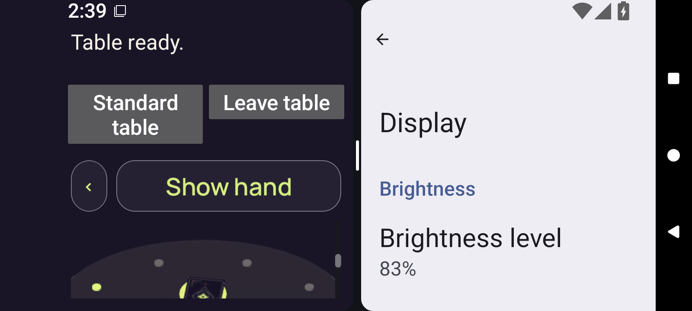</a>

More of the rendered table moves into the short body band. Seat markers and the upper part of a central face-down stack are visible; the table remains cropped vertically.

[Exact observed caption](provenance/review/debug/REVIEW.json) — JSON pointer `/captureRows/12/5`.

Original member: `godot-adaptive/runtime/captures/3d-context-position-11.png` · **88323 bytes** · SHA-256 `8111aa64e737d9567c33fee1331bb03bbdf592a4056ddd3f0bbd89481394965f`.

### Native 3D position 12

<a href="debug/godot-adaptive/runtime/captures/3d-context-position-12.png">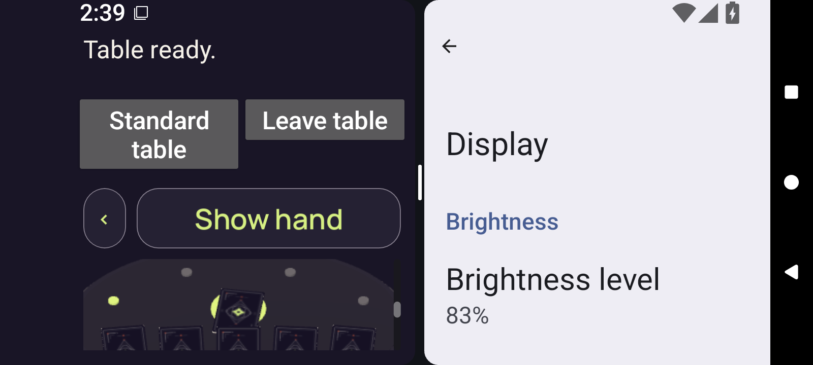</a>

The table and central face-down stack are visible, and the upper portions of five hand card backs enter along the lower clip. No private faces or labels are exposed.

[Exact observed caption](provenance/review/debug/REVIEW.json) — JSON pointer `/captureRows/13/5`.

Original member: `godot-adaptive/runtime/captures/3d-context-position-12.png` · **110322 bytes** · SHA-256 `d47ccb6187b15e4649faa287cafd5fd03c563bcad9e37b96a9857ac6566c913f`.

### Native 3D position 13

A row of five face-down hand card backs is visible across the body band. The central stack is partly clipped above; no hand face, rank label or selection highlight is visible.

[Exact observed caption](provenance/review/debug/REVIEW.json) — JSON pointer `/captureRows/14/5`.

Original member: `godot-adaptive/runtime/captures/3d-context-position-13.png` · **143491 bytes** · SHA-256 `a85220a0fbb51f22b75ff9ae590bd1dc82bd12e7992bcaafe0865f0564961334`.

### Native 3D position 14

The five card backs move toward the upper body clip; their lower portions and the table rim remain visible. No private faces or card labels appear.

[Exact observed caption](provenance/review/debug/REVIEW.json) — JSON pointer `/captureRows/15/5`.

Original member: `godot-adaptive/runtime/captures/3d-context-position-14.png` · **137834 bytes** · SHA-256 `747b059105f2f30afd677b1afe67f2ef6625f7e5edc7714d04add982513d21d2`.

### Native 3D position 15

Only the lower edges of the card backs and table rim remain above. Hand-summary text begins to enter at the lower body edge and is clipped.

[Exact observed caption](provenance/review/debug/REVIEW.json) — JSON pointer `/captureRows/16/5`.

Original member: `godot-adaptive/runtime/captures/3d-context-position-15.png` · **106592 bytes** · SHA-256 `d93f1000a851178228475a7bc7244f5aa386deb7d201a37178607e43c390864b`.

### Native 3D position 16

Your hand · 5 cards is fully readable. The card backs have left the band; only a small table-rim sliver remains above and the top of the action button enters below.

[Exact observed caption](provenance/review/debug/REVIEW.json) — JSON pointer `/captureRows/17/5`.

Original member: `godot-adaptive/runtime/captures/3d-context-position-16.png` · **88912 bytes** · SHA-256 `ac494e4f1f1cdcb7bf2b4d7d008d429e164d6ba7a09a20e4bc6423684837e2e7`.

### Native 3D position 17

<a href="debug/godot-adaptive/runtime/captures/3d-context-position-17.png">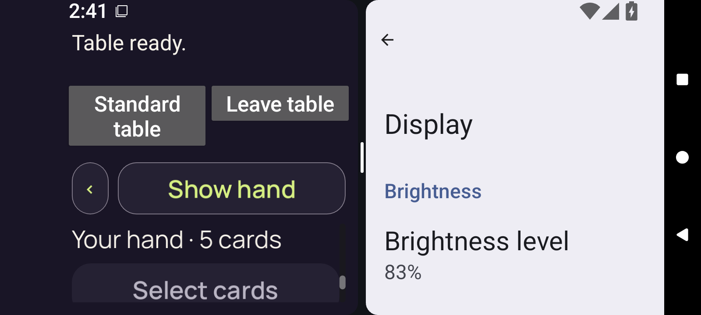</a>

Your hand · 5 cards and the full Select cards label are readable. The lower part of the Select cards button container is clipped by the body edge.

[Exact observed caption](provenance/review/debug/REVIEW.json) — JSON pointer `/captureRows/18/5`.

Original member: `godot-adaptive/runtime/captures/3d-context-position-17.png` · **98427 bytes** · SHA-256 `c00e578ef05cdb0955040814d7a842b2ce401999437fb3b41ebc90c7825d139c`.

### Native 3D position 18

The complete Select cards label and button container fit inside the body band. Only the upper outline of the next action enters at the lower edge; its label is not visible.

[Exact observed caption](provenance/review/debug/REVIEW.json) — JSON pointer `/captureRows/19/5`.

Original member: `godot-adaptive/runtime/captures/3d-context-position-18.png` · **85011 bytes** · SHA-256 `43daf9393482aaf90c7217edf223514a94e047e6526b03ab417e10880753890d`.

### Native 3D position 19

<a href="debug/godot-adaptive/runtime/captures/3d-context-position-19.png">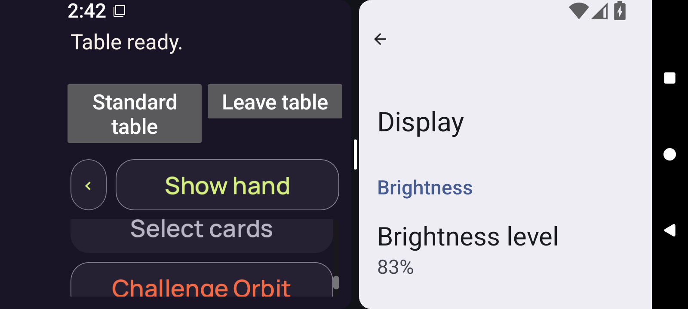</a>

Select cards moves through the upper clip. Challenge Orbit enters at the bottom, but its text descenders and lower button area are clipped.

[Exact observed caption](provenance/review/debug/REVIEW.json) — JSON pointer `/captureRows/20/5`.

Original member: `godot-adaptive/runtime/captures/3d-context-position-19.png` · **95786 bytes** · SHA-256 `0980b55bf1b7c047c76ea753db6cfbbe67009439d239b72c8db504a13bd89226`.

### Native 3D position 20

The full Challenge Orbit label and orange-outlined button fit inside the body band, separated from the fixed Show hand control. The next action's upper outline is visible below.

[Exact observed caption](provenance/review/debug/REVIEW.json) — JSON pointer `/captureRows/21/5`.

Original member: `godot-adaptive/runtime/captures/3d-context-position-20.png` · **86669 bytes** · SHA-256 `32c5d57ea112f19d67d127297cf3084c62c58ac56aee0c77e1215a97afe910ba`.

### Native 3D position 21

<a href="debug/godot-adaptive/runtime/captures/3d-context-position-21.png">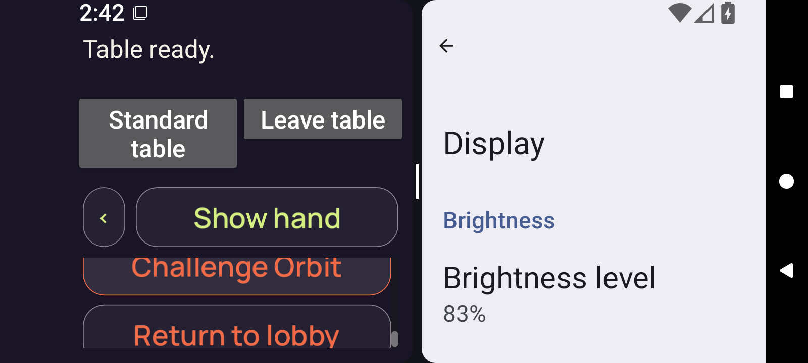</a>

Challenge Orbit moves through the upper clip. Return to lobby enters below with its lower button area and text descender clipped.

[Exact observed caption](provenance/review/debug/REVIEW.json) — JSON pointer `/captureRows/22/5`.

Original member: `godot-adaptive/runtime/captures/3d-context-position-21.png` · **95357 bytes** · SHA-256 `f9dc432b734a7be119961f7276e0e7ca69293f3796a6efb2e4a17e842231a2a8`.

### Native 3D position 22

Return to lobby is fully visible. Challenge Orbit is clipped above, showing only the lower text fragments and gray lower outline. This is the first capture at the final reported geometry.

[Exact observed caption](provenance/review/debug/REVIEW.json) — JSON pointer `/captureRows/23/5`.

Original member: `godot-adaptive/runtime/captures/3d-context-position-22.png` · **90583 bytes** · SHA-256 `4225c1ddbe4f8e70f78c8428701768c360f5e19db87ce72e29e70096466384c3`.

### Native 3D position 23

<a href="debug/godot-adaptive/runtime/captures/3d-context-position-23.png">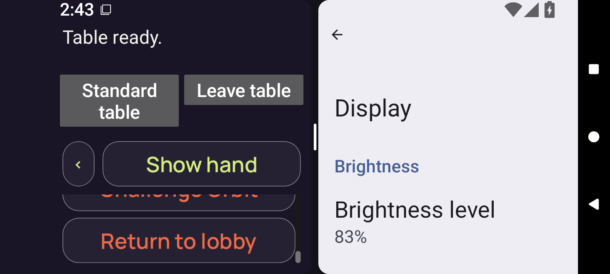</a>

After the centred-body zero-progress drag, Return to lobby remains fully visible and Challenge Orbit remains clipped above with a gray outline. The body layout appears unchanged from position 22; this is a separate original capture.

[Exact observed caption](provenance/review/debug/REVIEW.json) — JSON pointer `/captureRows/24/5`.

Original member: `godot-adaptive/runtime/captures/3d-context-position-23.png` · **90485 bytes** · SHA-256 `e27a3c2f88f94984e7cbcae04d4fc1981b85f7c622558958ff42c9f4e3bdf798`.

### Native 3D position 24

After the upper-body zero-progress drag, the same final body layout remains: Return to lobby is fully visible and Challenge Orbit is clipped above. The partial Challenge outline is now orange and the status clock has advanced; the original is not pixel-identical to the preceding capture.

[Exact observed caption](provenance/review/debug/REVIEW.json) — JSON pointer `/captureRows/25/5`.

Original member: `godot-adaptive/runtime/captures/3d-context-position-24.png` · **89075 bytes** · SHA-256 `5b5ea2f3870a7955cb15144fece09c3fcbf4db64e0b035fa7fbd96863cd37470`.

Original filenames, PNG bytes, retained file modes and nanosecond modification times are preserved. Retained extraction modification times are not relabeled as capture timestamps. The manifest binds every variant, artifact, member, exact caption pointer and source identity.
