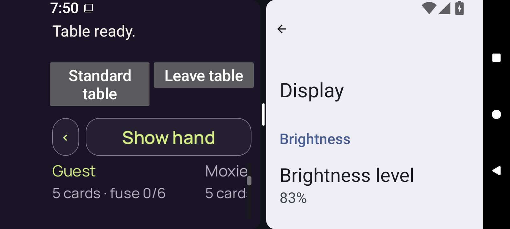
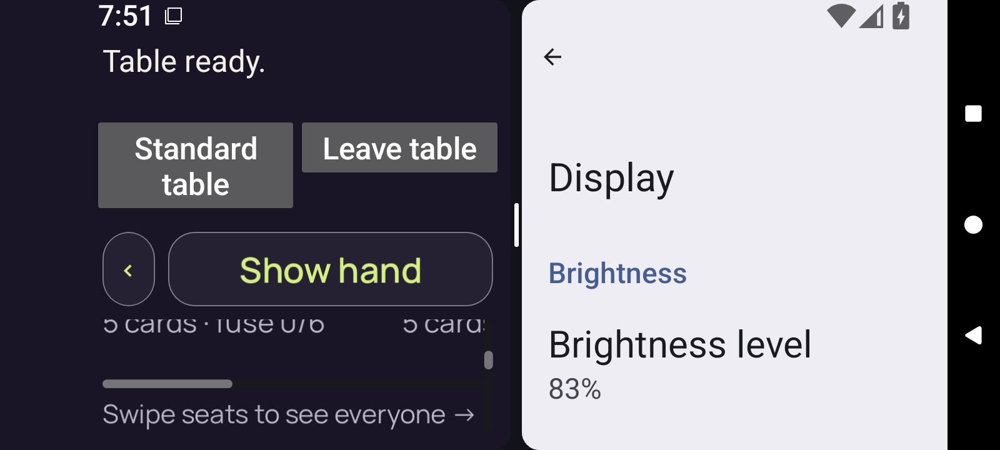

# debug — failed scroll overlap

[Diagnostic collection](../README.md) · [Manifest](../manifest.json)

The selected original result reports `3d.context-body-sweep` failed: 52 logical units exceed the unchanged 51.5-unit half-page limit.

[Original result JSON](../provenance/original-results/debug-result.json) · [Result-member extraction receipt](../provenance/extraction/run10-debug-diagnostic.json)

This is a bounded HTTP-range diagnostic selection. No complete archive is retained, no whole-archive hash was verified, and no canonical collection or native acceptance is added.

## Position 06

**Direct original-detail review — /root/pixel_d1_split**

Guest, Moxie and public card-count/fuse text occupy the body. The DOWN at [476,637] lies in blank roster space below the card-count text. No button is visible at that origin, and the horizontal roster track has not yet entered the visible body.

[Exact pixel record](../provenance/review/pixel-observations.json) — JSON pointer `/captures/2`.

Original member: `godot-adaptive/runtime/captures/3d-context-position-06.png`. Artifact `10189781843`. Screenshot interval: `2026-09-11T07:50:47.601+00:00` to `2026-09-11T07:50:47.785+00:00`.

Separate source-result position: `/checks/3d.context-body-sweep/positions/6`. Play rectangle `[16, 682, 349, 68]`; clip `[16, 96, 357, 103]`; Play is not fully enclosed.

## Position 07

**Direct original-detail review — /root/pixel_d1_split**

Roster text has moved up about 91 physical pixels, consistent with the recorded 52 logical units. The horizontal track is now visible around Y614 and the Swipe seats instruction below it. Native chrome and Show hand remain fixed.

[Exact pixel record](../provenance/review/pixel-observations.json) — JSON pointer `/captures/3`.

Original member: `godot-adaptive/runtime/captures/3d-context-position-07.png`. Artifact `10189781843`. Screenshot interval: `2026-09-11T07:51:06.510+00:00` to `2026-09-11T07:51:06.690+00:00`.

Separate source-result position: `/checks/3d.context-body-sweep/positions/7`. Play rectangle `[16, 630, 349, 68]`; clip `[16, 96, 357, 103]`; Play is not fully enclosed.

The source captures are sequential, not atomic. No complete current claim, Play, private rank text or card faces are visible in these selections. The bright optimized border is compatible with hover/pressed styling and does not prove focus.

