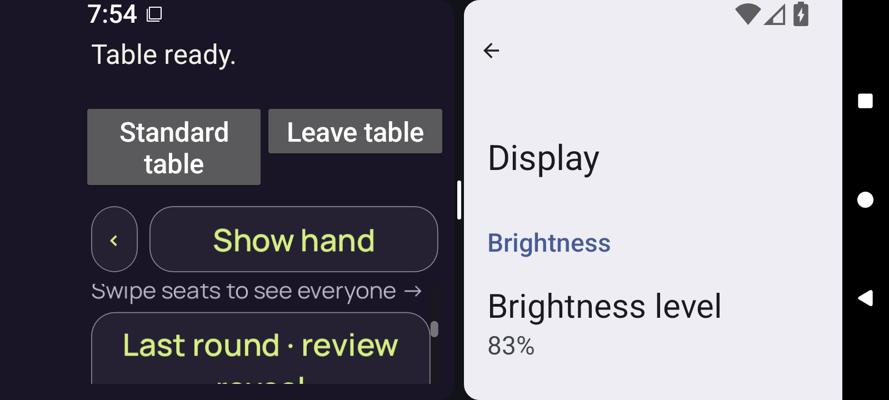
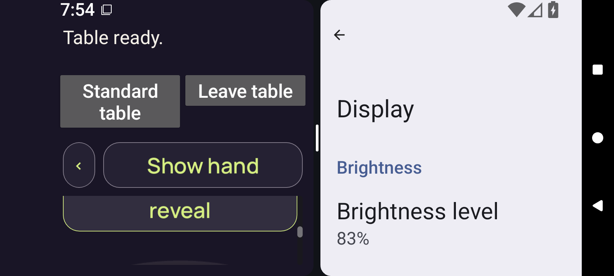

# optimized-test-signed — failed scroll overlap

[Diagnostic collection](../README.md) · [Manifest](../manifest.json)

The selected original result reports `3d.context-body-sweep` failed: 86 logical units exceed the unchanged 51.5-unit half-page limit.

[Original result JSON](../provenance/original-results/optimized-test-signed-result.json) · [Result-member extraction receipt](../provenance/extraction/run10-optimized-test-signed-diagnostic.json)

This is a bounded HTTP-range diagnostic selection. No complete archive is retained, no whole-archive hash was verified, and no canonical collection or native acceptance is added.

## Position 11

**Direct original-detail review — /root/pixel_d1_split**

Below Show hand, the Swipe seats instruction is visible. The Last round review button begins around physical Y562 and extends below the body bottom near Y691. Its first line reads Last round · review; the lower reveal line is clipped. The actual DOWN at [476,637] lies inside this partly clipped button.

[Exact pixel record](../provenance/review/pixel-observations.json) — JSON pointer `/captures/0`.

Original member: `godot-adaptive/runtime/captures/3d-context-position-11.png`. Artifact `10189890025`. Screenshot interval: `2026-09-11T07:54:23.577+00:00` to `2026-09-11T07:54:23.760+00:00`.

Separate source-result position: `/checks/3d.context-body-sweep/positions/11`. Play rectangle `[16, 550, 349, 68]`; clip `[16, 96, 357, 103]`; Play is not fully enclosed.

## Position 12

**Direct original-detail review — /root/pixel_d1_split**

The lower reveal line and button bottom are now visible; the button top and first line are clipped above the body. Its border is bright yellow-green. That color is compatible with table.gd hover/pressed styling and does not alone prove keyboard focus. Body scroll position has changed while the header remains fixed.

[Exact pixel record](../provenance/review/pixel-observations.json) — JSON pointer `/captures/1`.

Original member: `godot-adaptive/runtime/captures/3d-context-position-12.png`. Artifact `10189890025`. Screenshot interval: `2026-09-11T07:54:42.254+00:00` to `2026-09-11T07:54:42.433+00:00`.

Separate source-result position: `/checks/3d.context-body-sweep/positions/12`. Play rectangle `[16, 464, 349, 68]`; clip `[16, 96, 357, 103]`; Play is not fully enclosed.

The source captures are sequential, not atomic. No complete current claim, Play, private rank text or card faces are visible in these selections. The bright optimized border is compatible with hover/pressed styling and does not prove focus.

