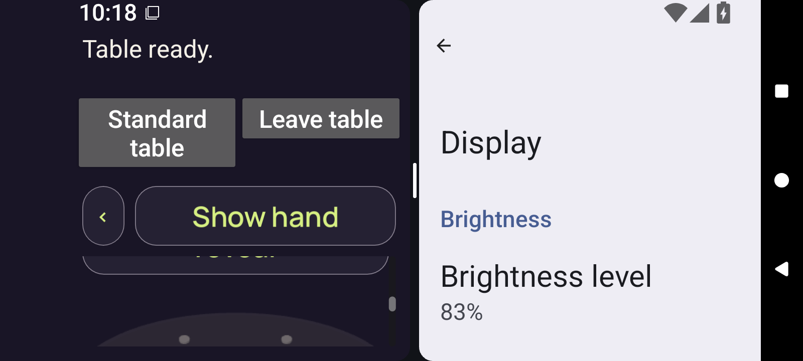
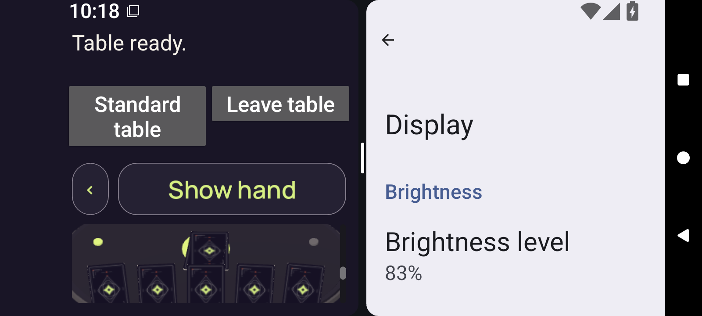

# Android 3D failed body swipe — run 34587116038

Source `b2566f53b2144dc5e17b1611b68aa692f7ffa092`, attempt 1. **The recorded run failed.**

[Gallery](../README.md) · [Capture manifest](manifest.json) · [Primary direct pixel review](provenance/review/PIXEL-REVIEW.json)

These two original 1600 × 720 PNGs show optimized test-signed 3D positions 12 and 13 at font scale 2.0. `/root/pixel_o1_land2` directly reviewed both originals at original detail.

`3d.context-body-sweep` failed with:

> Actual content jump leaves a gap in the required half-page capture overlap.

The final centred-body swipe runs from physical `[476,637]` to `[476,565]` over **1646 ms**. The recorded Play Y changes from **432 to 328**, a movement of **104 logical units**, exceeding the unchanged **51.5-unit** half-clip limit. The clip is `[16,96,357,103]`; Play is not fully enclosed.

Neither image is an input/focus trace. The recorded DOWN is in displayed stage background, so a direct hit on the clipped prior button is not supported; the cause of the excessive movement remains under source/reproduction review.

[Selected result telemetry](provenance/result/OBSERVED.json) · [Result-member extraction receipt](provenance/extraction/optimized-test-signed-result.json.receipt.json) · [PNG-member extraction receipt](provenance/extraction/PNG-WINDOW.json)

This is a bounded HTTP-range diagnostic selection. The complete ZIP is not retained and its API-declared hash remains unverified. The selected 1,141,915-byte original result JSON remains in its retained source location; this gallery preserves its exact hash and the selected telemetry/extraction receipts. References to other images or XML do not add files or review credit to this selection.

The reviewer observed no private card face or private rank label in either selected image. These stills do not establish continuous privacy, a complete public-context sequence, full claim/Play/Challenge reachability, package qualification or native acceptance.

## Position 12

**Direct original-detail review — /root/pixel_o1_land2**

Before the failed final body swipe: the Show hand header, a clipped button and the top of the concealed tabletop are visible. The recorded DOWN at [476,637] lies in the tabletop area below that button.

[Exact primary pixel record](provenance/review/PIXEL-REVIEW.json) — JSON pointer `/images/0`.

Original filename: `optimized-test-signed-3d-context-position-12.png`. Original ZIP member: `godot-adaptive/runtime/captures/3d-context-position-12.png`.

Capture timestamps are not supplied in the selected telemetry receipts; source file mtime is retained separately.

Scope: No private card face or private rank label is visible in this selected image. Selected failed-run diagnostic only; no complete public-context sequence, full claim/Play/Challenge reachability, package or native acceptance. Neither image is an input/focus trace. The recorded DOWN is in displayed stage background, so a direct hit on the clipped prior button is not supported; the cause of the excessive movement remains under source/reproduction review.

## Position 13

**Direct original-detail review — /root/pixel_o1_land2**

After the failed final body swipe: concealed card backs and the tabletop are visible below Show hand. The measured body movement is 104 logical units, exceeding the 51.5-unit half-clip limit; Play remains outside the body clip.

[Exact primary pixel record](provenance/review/PIXEL-REVIEW.json) — JSON pointer `/images/1`.

Original filename: `optimized-test-signed-3d-context-position-13.png`. Original ZIP member: `godot-adaptive/runtime/captures/3d-context-position-13.png`.

Capture timestamps are not supplied in the selected telemetry receipts; source file mtime is retained separately.

Scope: No private card face or private rank label is visible in this selected image. Selected failed-run diagnostic only; no complete public-context sequence, full claim/Play/Challenge reachability, package or native acceptance. Neither image is an input/focus trace. The recorded DOWN is in displayed stage background, so a direct hit on the clipped prior button is not supported; the cause of the excessive movement remains under source/reproduction review.

Two original PNGs and four pinned pixel/extraction/selected-telemetry receipts. Other result/receipt references add no image, view or archive acceptance.

Original image bytes, filenames, timestamps and source/review identities are preserved in the manifest. No new pixel view, media decode, download, archive audit or native test was performed by the gallery publisher.

