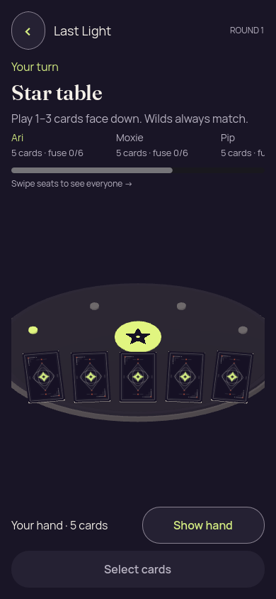
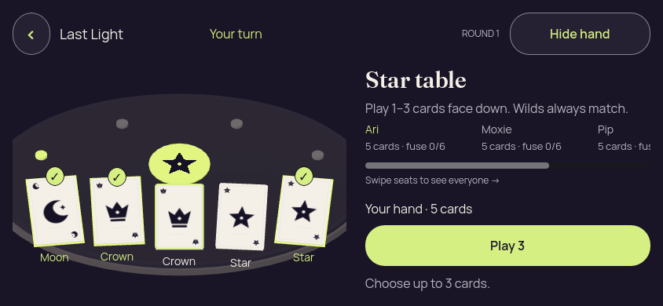
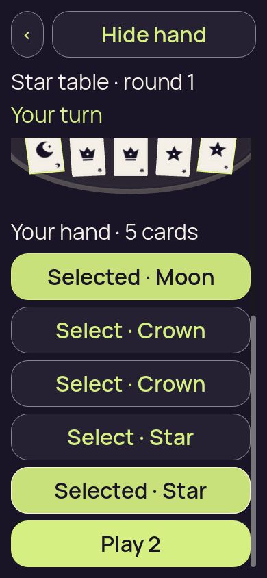
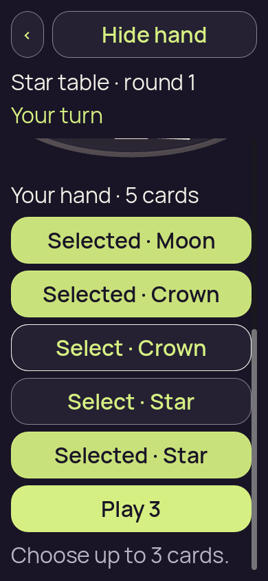
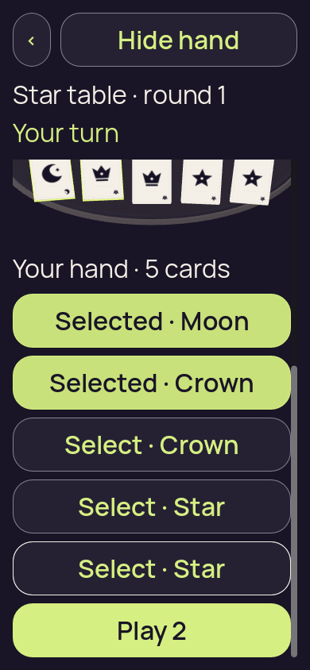
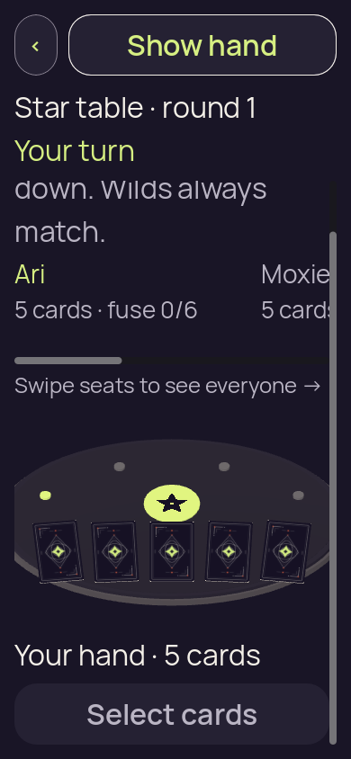
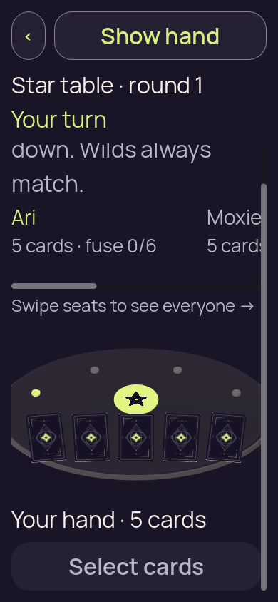
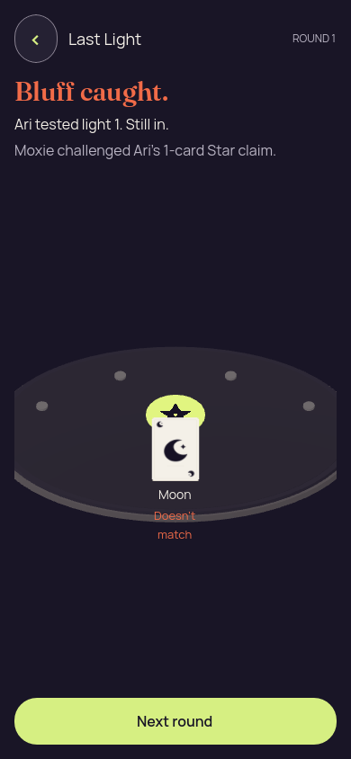

# Card3D baseline — desktop source run

[All collections](../../README.md) · [Preserved evidence](../evidence-index.md) · [Copy/review binding](../../godot-ios-retained-34520375602/provenance/publication-review/publication-binding.json) · [Completed focused review](../provenance/publication-review/partydeck-gallery-after-3433-card3d-visual-review-v1.json) · [Frozen source mapping](../provenance/source-map/source-map.json)

**All four recorded scene scenarios pass; exact paired frames match. Native qualification is not established.**

Original source execution with no PCK input; baseline capture identities stay separate.

Forty originals form 20 separate baseline/candidate pairs: six portrait, six short landscape, seven enlarged-text/emulated-touch and one resolved public-proof pair. All 20 pairs are byte-identical on Godot 4.7.2.stable.official.ed1daf0bf, OpenGL Compatibility under Xvfb/software Mesa, with unchanged MSAA_2X. The original commands use --path; no PCK was executed. Baseline is the frozen c65e264 renderer source; the candidate changes two of 155 source files through patch `a904d39cb259cae75085001f4733a0d7ee49cd1f2693f8c723ae914541c9b484`. Later integration/export is a separate identity.

Assets previously viewed two selected-hand candidate originals: portrait shows upright ranks, selected first/last borders/checks, Hide hand and Play 2; the scrolled enlarged-text frame shows the lower card strip, selected hand-choice buttons and Play 2. These prior observations are attributed to assets. Thirty-six other identities match reviewed published bytes; the two public-proof originals remain explicitly unviewed. No image was reopened for publication. The source map keeps its original actually_viewed flags unchanged; publication byte-match provenance is separate.

Both variants pass the four original desktop scene scenarios. Owner validation separately reports 560 numbered assertions: 306 redraw, 216 terminal-return and 38 resource sharing/lifetime. Independent review_game checked source and JSON/pairs without media viewing. These recorded frames do not prove native latency, shader-compilation reduction, accessibility, gameplay or native qualification. Foreground/resume refers to desktop checker commands; enlarged dragging uses emulated touch. Per-image timestamps remain null; execution-receipt timestamps are separate. The generic round-ended/01-concealed.png filename is captioned Resolved round with public proof.

20 separate original PNGs. Review methods: 19 exact reviewed published-byte match, 1 unviewed original — no visual acceptance.

Every thumbnail opens the unchanged original PNG. **UNVIEWED** means no direct pixel review or visual acceptance is asserted. Byte matching reuses only the earlier reviewed pixels; each execution, scenario and result remains separate. Frozen plans retain their historical pending flags; the completed review records final publication status. No image was recaptured or transformed, and no video was decoded.

| Original capture | Original identity and evidence | Review status and observation |
| --- | --- | --- |
|  <code>01-concealed.png</code> 3D · Portrait desktop viewport · 100% text · Initially concealed hand | 390 × 844 px · 64,145 bytes · text 1 SHA-256: <code>9b31edd4d8a07d0353e4732c5676f0e76b4fc536e193cc804e3f85ce52e51b9f</code> Source: <code>/tmp/partydeck-card3d-reuse-candidate-assets-v1-n6xs0bjq/evidence/baseline/portrait/01-concealed.png</code> Per-image timestamp: not recorded Execution receipt timestamp: 2026-09-10T20:45:32.600181+00:00 [Capture JSON](portrait/01-concealed.json) · [Original result](portrait/report.json) · [Execution receipt](portrait/receipt.json) · [Paired original](../candidate/portrait/01-concealed.png) | **Exact reviewed published-byte match**. Exact bytes match the separately reviewed published original godot-3d-20260910-v5/portrait/01-concealed.png. Only its recorded pixel observation is reused; this source execution, scenario and capture identity remain separate. [Separately reviewed published capture](../../godot-3d-20260910-v5/portrait/01-concealed.png); this original was not reopened. |
|  <code>02-revealed-selected.png</code> 3D · Portrait desktop viewport · 100% text · Revealed hand; two cards selected | 390 × 844 px · 57,781 bytes · text 1 SHA-256: <code>81ed93be5c09cb651fa182601adaebc6d4df7625623650ab37599bed886d825b</code> Source: <code>/tmp/partydeck-card3d-reuse-candidate-assets-v1-n6xs0bjq/evidence/baseline/portrait/02-revealed-selected.png</code> Per-image timestamp: not recorded Execution receipt timestamp: 2026-09-10T20:45:32.600181+00:00 [Capture JSON](portrait/02-revealed-selected.json) · [Original result](portrait/report.json) · [Execution receipt](portrait/receipt.json) · [Paired original](../candidate/portrait/02-revealed-selected.png) | **Exact reviewed published-byte match**. Exact bytes match the separately reviewed published original history/godot-3d-20260910-v6/portrait/02-revealed-selected.png. Only its recorded pixel observation is reused; this source execution, scenario and capture identity remain separate. [Separately reviewed published capture](../../history/godot-3d-20260910-v6/portrait/02-revealed-selected.png); this original was not reopened. |
|  <code>02a-selection-limit.png</code> 3D · Portrait desktop viewport · 100% text · Selection limit; three cards selected | 390 × 844 px · 61,182 bytes · text 1 SHA-256: <code>298fd444896c0ba7351436507993f82c00583531eb2d52016d63b55fd1a66ee4</code> Source: <code>/tmp/partydeck-card3d-reuse-candidate-assets-v1-n6xs0bjq/evidence/baseline/portrait/02a-selection-limit.png</code> Per-image timestamp: not recorded Execution receipt timestamp: 2026-09-10T20:45:32.600181+00:00 [Capture JSON](portrait/02a-selection-limit.json) · [Original result](portrait/report.json) · [Execution receipt](portrait/receipt.json) · [Paired original](../candidate/portrait/02a-selection-limit.png) | **Exact reviewed published-byte match**. Exact bytes match the separately reviewed published original history/godot-3d-20260910-v6/portrait/02a-selection-limit.png. Only its recorded pixel observation is reused; this source execution, scenario and capture identity remain separate. [Separately reviewed published capture](../../history/godot-3d-20260910-v6/portrait/02a-selection-limit.png); this original was not reopened. |
|  <code>02b-deselected-last.png</code> 3D · Portrait desktop viewport · 100% text · Last card deselected; two cards selected | 390 × 844 px · 57,501 bytes · text 1 SHA-256: <code>cb137e7569d79e796589b36404f8a81f8c310dd806d410751d0d4f44fd67fc0a</code> Source: <code>/tmp/partydeck-card3d-reuse-candidate-assets-v1-n6xs0bjq/evidence/baseline/portrait/02b-deselected-last.png</code> Per-image timestamp: not recorded Execution receipt timestamp: 2026-09-10T20:45:32.600181+00:00 [Capture JSON](portrait/02b-deselected-last.json) · [Original result](portrait/report.json) · [Execution receipt](portrait/receipt.json) · [Paired original](../candidate/portrait/02b-deselected-last.png) | **Exact reviewed published-byte match**. Exact bytes match the separately reviewed published original history/godot-3d-20260910-v6/portrait/02b-deselected-last.png. Only its recorded pixel observation is reused; this source execution, scenario and capture identity remain separate. [Separately reviewed published capture](../../history/godot-3d-20260910-v6/portrait/02b-deselected-last.png); this original was not reopened. |
|  <code>03-covered-again.png</code> 3D · Portrait desktop viewport · 100% text · Hand covered again | 390 × 844 px · 64,410 bytes · text 1 SHA-256: <code>f8d7410cf64da58de7c8befaa020f795f1cae903028d5a09473826f0b45374a1</code> Source: <code>/tmp/partydeck-card3d-reuse-candidate-assets-v1-n6xs0bjq/evidence/baseline/portrait/03-covered-again.png</code> Per-image timestamp: not recorded Execution receipt timestamp: 2026-09-10T20:45:32.600181+00:00 [Capture JSON](portrait/03-covered-again.json) · [Original result](portrait/report.json) · [Execution receipt](portrait/receipt.json) · [Paired original](../candidate/portrait/03-covered-again.png) | **Exact reviewed published-byte match**. Exact bytes match the separately reviewed published original history/godot-3d-20260910-v7/portrait/03-covered-again.png. Only its recorded pixel observation is reused; this source execution, scenario and capture identity remain separate. [Separately reviewed published capture](../../history/godot-3d-20260910-v7/portrait/03-covered-again.png); this original was not reopened. |
|  <code>04-resumed-covered.png</code> 3D · Portrait desktop viewport · 100% text · Covered after desktop foreground/resume commands | 390 × 844 px · 64,145 bytes · text 1 SHA-256: <code>9b31edd4d8a07d0353e4732c5676f0e76b4fc536e193cc804e3f85ce52e51b9f</code> Source: <code>/tmp/partydeck-card3d-reuse-candidate-assets-v1-n6xs0bjq/evidence/baseline/portrait/04-resumed-covered.png</code> Per-image timestamp: not recorded Execution receipt timestamp: 2026-09-10T20:45:32.600181+00:00 [Capture JSON](portrait/04-resumed-covered.json) · [Original result](portrait/report.json) · [Execution receipt](portrait/receipt.json) · [Paired original](../candidate/portrait/04-resumed-covered.png) | **Exact reviewed published-byte match**. Exact bytes match the separately reviewed published original godot-3d-20260910-v5/portrait/01-concealed.png. Only its recorded pixel observation is reused; this source execution, scenario and capture identity remain separate. [Separately reviewed published capture](../../godot-3d-20260910-v5/portrait/01-concealed.png); this original was not reopened. |
|  <code>01-concealed.png</code> 3D · Short landscape desktop viewport · 100% text · Initially concealed hand | 844 × 390 px · 70,695 bytes · text 1 SHA-256: <code>cd5f896d4fa87983000f1c405568ba821b45e734821fc437c0efb8ac677c39c7</code> Source: <code>/tmp/partydeck-card3d-reuse-candidate-assets-v1-n6xs0bjq/evidence/baseline/landscape/01-concealed.png</code> Per-image timestamp: not recorded Execution receipt timestamp: 2026-09-10T20:45:44.870840+00:00 [Capture JSON](landscape/01-concealed.json) · [Original result](landscape/report.json) · [Execution receipt](landscape/receipt.json) · [Paired original](../candidate/landscape/01-concealed.png) | **Exact reviewed published-byte match**. Exact bytes match the separately reviewed published original history/godot-3d-20260910-v7/landscape/01-concealed.png. Only its recorded pixel observation is reused; this source execution, scenario and capture identity remain separate. [Separately reviewed published capture](../../history/godot-3d-20260910-v7/landscape/01-concealed.png); this original was not reopened. |
|  <code>02-revealed-selected.png</code> 3D · Short landscape desktop viewport · 100% text · Revealed hand; two cards selected | 844 × 390 px · 60,995 bytes · text 1 SHA-256: <code>76266760558ca99f3d24eaa024b0545eccb6f82fee25c7a368204c2985c0765e</code> Source: <code>/tmp/partydeck-card3d-reuse-candidate-assets-v1-n6xs0bjq/evidence/baseline/landscape/02-revealed-selected.png</code> Per-image timestamp: not recorded Execution receipt timestamp: 2026-09-10T20:45:44.870840+00:00 [Capture JSON](landscape/02-revealed-selected.json) · [Original result](landscape/report.json) · [Execution receipt](landscape/receipt.json) · [Paired original](../candidate/landscape/02-revealed-selected.png) | **Exact reviewed published-byte match**. Exact bytes match the separately reviewed published original history/godot-3d-20260910-v7/landscape/02-revealed-selected.png. Only its recorded pixel observation is reused; this source execution, scenario and capture identity remain separate. [Separately reviewed published capture](../../history/godot-3d-20260910-v7/landscape/02-revealed-selected.png); this original was not reopened. |
|  <code>02a-selection-limit.png</code> 3D · Short landscape desktop viewport · 100% text · Selection limit; three cards selected | 844 × 390 px · 64,605 bytes · text 1 SHA-256: <code>6d464a90bfdd693f434341670cace29e6f50d01e72ae1cff6253742f9adb08f6</code> Source: <code>/tmp/partydeck-card3d-reuse-candidate-assets-v1-n6xs0bjq/evidence/baseline/landscape/02a-selection-limit.png</code> Per-image timestamp: not recorded Execution receipt timestamp: 2026-09-10T20:45:44.870840+00:00 [Capture JSON](landscape/02a-selection-limit.json) · [Original result](landscape/report.json) · [Execution receipt](landscape/receipt.json) · [Paired original](../candidate/landscape/02a-selection-limit.png) | **Exact reviewed published-byte match**. Exact bytes match the separately reviewed published original history/godot-3d-20260910-v7/landscape/02a-selection-limit.png. Only its recorded pixel observation is reused; this source execution, scenario and capture identity remain separate. [Separately reviewed published capture](../../history/godot-3d-20260910-v7/landscape/02a-selection-limit.png); this original was not reopened. |
|  <code>02b-deselected-last.png</code> 3D · Short landscape desktop viewport · 100% text · Last card deselected; two cards selected | 844 × 390 px · 60,910 bytes · text 1 SHA-256: <code>f8128351693224852c38e2fc0f6d6843cd4bc44a719990d63893737cf666057d</code> Source: <code>/tmp/partydeck-card3d-reuse-candidate-assets-v1-n6xs0bjq/evidence/baseline/landscape/02b-deselected-last.png</code> Per-image timestamp: not recorded Execution receipt timestamp: 2026-09-10T20:45:44.870840+00:00 [Capture JSON](landscape/02b-deselected-last.json) · [Original result](landscape/report.json) · [Execution receipt](landscape/receipt.json) · [Paired original](../candidate/landscape/02b-deselected-last.png) | **Exact reviewed published-byte match**. Exact bytes match the separately reviewed published original history/godot-3d-20260910-v7/landscape/02b-deselected-last.png. Only its recorded pixel observation is reused; this source execution, scenario and capture identity remain separate. [Separately reviewed published capture](../../history/godot-3d-20260910-v7/landscape/02b-deselected-last.png); this original was not reopened. |
|  <code>03-covered-again.png</code> 3D · Short landscape desktop viewport · 100% text · Hand covered again | 844 × 390 px · 71,156 bytes · text 1 SHA-256: <code>ed1a2ac010c57a9cc0deb7a35540406b80265a5d883fe8557fb31c0f51eff14c</code> Source: <code>/tmp/partydeck-card3d-reuse-candidate-assets-v1-n6xs0bjq/evidence/baseline/landscape/03-covered-again.png</code> Per-image timestamp: not recorded Execution receipt timestamp: 2026-09-10T20:45:44.870840+00:00 [Capture JSON](landscape/03-covered-again.json) · [Original result](landscape/report.json) · [Execution receipt](landscape/receipt.json) · [Paired original](../candidate/landscape/03-covered-again.png) | **Exact reviewed published-byte match**. Exact bytes match the separately reviewed published original history/godot-3d-20260910-v7/landscape/03-covered-again.png. Only its recorded pixel observation is reused; this source execution, scenario and capture identity remain separate. [Separately reviewed published capture](../../history/godot-3d-20260910-v7/landscape/03-covered-again.png); this original was not reopened. |
|  <code>04-resumed-covered.png</code> 3D · Short landscape desktop viewport · 100% text · Covered after desktop foreground/resume commands | 844 × 390 px · 70,695 bytes · text 1 SHA-256: <code>cd5f896d4fa87983000f1c405568ba821b45e734821fc437c0efb8ac677c39c7</code> Source: <code>/tmp/partydeck-card3d-reuse-candidate-assets-v1-n6xs0bjq/evidence/baseline/landscape/04-resumed-covered.png</code> Per-image timestamp: not recorded Execution receipt timestamp: 2026-09-10T20:45:44.870840+00:00 [Capture JSON](landscape/04-resumed-covered.json) · [Original result](landscape/report.json) · [Execution receipt](landscape/receipt.json) · [Paired original](../candidate/landscape/04-resumed-covered.png) | **Exact reviewed published-byte match**. Exact bytes match the separately reviewed published original history/godot-3d-20260910-v7/landscape/01-concealed.png. Only its recorded pixel observation is reused; this source execution, scenario and capture identity remain separate. [Separately reviewed published capture](../../history/godot-3d-20260910-v7/landscape/01-concealed.png); this original was not reopened. |
|  <code>01-concealed.png</code> 3D · Enlarged text with emulated touch drag · 200% text · Initially concealed hand | 390 × 844 px · 78,281 bytes · text 2 SHA-256: <code>a8f67e7c9cc2f5234e1283883056a861c54d1f898017f2b92991acaaffd7d685</code> Source: <code>/tmp/partydeck-card3d-reuse-candidate-assets-v1-n6xs0bjq/evidence/baseline/large-text/01-concealed.png</code> Per-image timestamp: not recorded Execution receipt timestamp: 2026-09-10T20:45:58.149459+00:00 [Capture JSON](large-text/01-concealed.json) · [Original result](large-text/report.json) · [Execution receipt](large-text/receipt.json) · [Paired original](../candidate/large-text/01-concealed.png) | **Exact reviewed published-byte match**. Exact bytes match the separately reviewed published original godot-3d-demand-redraw-20260910/3d-scene-large-text/01-concealed.png. Only its recorded pixel observation is reused; this source execution, scenario and capture identity remain separate. [Separately reviewed published capture](../../godot-3d-demand-redraw-20260910/3d-scene-large-text/01-concealed.png); this original was not reopened. |
|  <code>01a-emulated-touch-drag.png</code> 3D · Enlarged text with emulated touch drag · 200% text · After emulated touch drag; no card selected | 390 × 844 px · 67,198 bytes · text 2 SHA-256: <code>8b058ad50aeefb54eb6ae21e69978d044d918613115330273d5598b7e8d4da1d</code> Source: <code>/tmp/partydeck-card3d-reuse-candidate-assets-v1-n6xs0bjq/evidence/baseline/large-text/01a-emulated-touch-drag.png</code> Per-image timestamp: not recorded Execution receipt timestamp: 2026-09-10T20:45:58.149459+00:00 [Capture JSON](large-text/01a-emulated-touch-drag.json) · [Original result](large-text/report.json) · [Execution receipt](large-text/receipt.json) · [Paired original](../candidate/large-text/01a-emulated-touch-drag.png) | **Exact reviewed published-byte match**. Exact bytes match the separately reviewed published original godot-3d-demand-redraw-20260910/3d-scene-large-text/01a-emulated-touch-drag.png. Only its recorded pixel observation is reused; this source execution, scenario and capture identity remain separate. [Separately reviewed published capture](../../godot-3d-demand-redraw-20260910/3d-scene-large-text/01a-emulated-touch-drag.png); this original was not reopened. |
|  <code>02-revealed-selected.png</code> 3D · Enlarged text with emulated touch drag · 200% text · Revealed hand; two cards selected | 390 × 844 px · 67,233 bytes · text 2 SHA-256: <code>8f927ca58390aabe677d476d68ec345c2d4cb952935da54131e97165e4303737</code> Source: <code>/tmp/partydeck-card3d-reuse-candidate-assets-v1-n6xs0bjq/evidence/baseline/large-text/02-revealed-selected.png</code> Per-image timestamp: not recorded Execution receipt timestamp: 2026-09-10T20:45:58.149459+00:00 [Capture JSON](large-text/02-revealed-selected.json) · [Original result](large-text/report.json) · [Execution receipt](large-text/receipt.json) · [Paired original](../candidate/large-text/02-revealed-selected.png) | **Exact reviewed published-byte match**. Exact bytes match the separately reviewed published original godot-3d-demand-redraw-20260910/3d-scene-large-text/02-revealed-selected.png. Only its recorded pixel observation is reused; this source execution, scenario and capture identity remain separate. [Separately reviewed published capture](../../godot-3d-demand-redraw-20260910/3d-scene-large-text/02-revealed-selected.png); this original was not reopened. |
|  <code>02a-selection-limit.png</code> 3D · Enlarged text with emulated touch drag · 200% text · Selection limit; three cards selected | 390 × 844 px · 61,791 bytes · text 2 SHA-256: <code>b5f0dbee9e31ad3c4043c5a2282c11f9ecd0a576dfaec95e7fc382ac3fab3ba4</code> Source: <code>/tmp/partydeck-card3d-reuse-candidate-assets-v1-n6xs0bjq/evidence/baseline/large-text/02a-selection-limit.png</code> Per-image timestamp: not recorded Execution receipt timestamp: 2026-09-10T20:45:58.149459+00:00 [Capture JSON](large-text/02a-selection-limit.json) · [Original result](large-text/report.json) · [Execution receipt](large-text/receipt.json) · [Paired original](../candidate/large-text/02a-selection-limit.png) | **Exact reviewed published-byte match**. Exact bytes match the separately reviewed published original godot-3d-demand-redraw-20260910/3d-scene-large-text/02a-selection-limit.png. Only its recorded pixel observation is reused; this source execution, scenario and capture identity remain separate. [Separately reviewed published capture](../../godot-3d-demand-redraw-20260910/3d-scene-large-text/02a-selection-limit.png); this original was not reopened. |
|  <code>02b-deselected-last.png</code> 3D · Enlarged text with emulated touch drag · 200% text · Last card deselected; two cards selected | 390 × 844 px · 67,016 bytes · text 2 SHA-256: <code>93ec6951c8f1c3df7860af4584349d31a8674562d9057c286726a6895204d7c7</code> Source: <code>/tmp/partydeck-card3d-reuse-candidate-assets-v1-n6xs0bjq/evidence/baseline/large-text/02b-deselected-last.png</code> Per-image timestamp: not recorded Execution receipt timestamp: 2026-09-10T20:45:58.149459+00:00 [Capture JSON](large-text/02b-deselected-last.json) · [Original result](large-text/report.json) · [Execution receipt](large-text/receipt.json) · [Paired original](../candidate/large-text/02b-deselected-last.png) | **Exact reviewed published-byte match**. Exact bytes match the separately reviewed published original godot-3d-demand-redraw-20260910/3d-scene-large-text/02b-deselected-last.png. Only its recorded pixel observation is reused; this source execution, scenario and capture identity remain separate. [Separately reviewed published capture](../../godot-3d-demand-redraw-20260910/3d-scene-large-text/02b-deselected-last.png); this original was not reopened. |
|  <code>03-covered-again.png</code> 3D · Enlarged text with emulated touch drag · 200% text · Hand covered again | 390 × 844 px · 78,404 bytes · text 2 SHA-256: <code>519ce556fb6bfc3e434f091a7f5f83e76ba5415a44f898b776a80a3a3862ed1c</code> Source: <code>/tmp/partydeck-card3d-reuse-candidate-assets-v1-n6xs0bjq/evidence/baseline/large-text/03-covered-again.png</code> Per-image timestamp: not recorded Execution receipt timestamp: 2026-09-10T20:45:58.149459+00:00 [Capture JSON](large-text/03-covered-again.json) · [Original result](large-text/report.json) · [Execution receipt](large-text/receipt.json) · [Paired original](../candidate/large-text/03-covered-again.png) | **Exact reviewed published-byte match**. Exact bytes match the separately reviewed published original godot-3d-demand-redraw-20260910/3d-scene-large-text/03-covered-again.png. Only its recorded pixel observation is reused; this source execution, scenario and capture identity remain separate. [Separately reviewed published capture](../../godot-3d-demand-redraw-20260910/3d-scene-large-text/03-covered-again.png); this original was not reopened. |
|  <code>04-resumed-covered.png</code> 3D · Enlarged text with emulated touch drag · 200% text · Covered after desktop foreground/resume commands | 390 × 844 px · 77,886 bytes · text 2 SHA-256: <code>1377b6b7330fb5c07e932e74e40ef2b99e8aeae431a7247899b3fed479e44d01</code> Source: <code>/tmp/partydeck-card3d-reuse-candidate-assets-v1-n6xs0bjq/evidence/baseline/large-text/04-resumed-covered.png</code> Per-image timestamp: not recorded Execution receipt timestamp: 2026-09-10T20:45:58.149459+00:00 [Capture JSON](large-text/04-resumed-covered.json) · [Original result](large-text/report.json) · [Execution receipt](large-text/receipt.json) · [Paired original](../candidate/large-text/04-resumed-covered.png) | **Exact reviewed published-byte match**. Exact bytes match the separately reviewed published original godot-3d-demand-redraw-20260910/3d-scene-large-text/04-resumed-covered.png. Only its recorded pixel observation is reused; this source execution, scenario and capture identity remain separate. [Separately reviewed published capture](../../godot-3d-demand-redraw-20260910/3d-scene-large-text/04-resumed-covered.png); this original was not reopened. |
|  <code>01-concealed.png</code> 3D · Resolved public-proof scenario · 100% text · Resolved round with public proof | 390 × 844 px · 34,441 bytes · text 1 SHA-256: <code>f094bb90fc51ab2000915505dfdedb7dfdcee1cf327a35292fe96cb92fcde844</code> Source: <code>/tmp/partydeck-card3d-reuse-candidate-assets-v1-n6xs0bjq/evidence/baseline/round-ended/01-concealed.png</code> Per-image timestamp: not recorded Execution receipt timestamp: 2026-09-10T20:46:06.957327+00:00 [Capture JSON](round-ended/01-concealed.json) · [Original result](round-ended/report.json) · [Execution receipt](round-ended/receipt.json) · [Paired original](../candidate/round-ended/01-concealed.png) | **UNVIEWED original — no visual acceptance**. Original capture retained without direct visual review. Its recorded scenario is Resolved round with public proof despite the generic filename 01-concealed.png. No pixel observation or visual acceptance is asserted. |
