# Godot 2D and 3D — older packed desktop CI 34427418175

[All screenshot collections](../README.md)

**Evidence status:** Both desktop modes pass with equal 42-view authority traces and clean exits. This exact older CI source retains the wrong Star emblem and missing final explanation in the 3D winner.

Each presentation completes the same seed-2 match through real Godot input, the shared bridge and the existing Kotlin authority: two viewer plays, two challenges and thirteen round advances to the round-14 winner. Both full traces contain 42 equal authority views; both renderer exits are 0. The original comparison report exactly matches the per-mode results, and every nested capture matches its original receipt, PNG hash and dimensions. Retained logs have no engine/script errors.

[Original comparison report](report.json) · [2D result and trace](2d/result.json) · [3D result and trace](3d/result.json) · [2D runtime log](2d/godot.log) · [3D runtime log](3d/godot.log) · [Original pack receipt](../godot-android-34427418175/provenance/partydeck-last-light.receipt.json).

Actual Godot `4.7.2-stable (official)`, gl_compatibility / X11 / Xvfb, 430 × 932 desktop pixels, text scale 1.0 and reduced motion enabled. Exact CI revision `c0474960f76459bf07160ec3dba6dcbb084af3ea`; `workingTreeDirty=false`. This is a new CI source record even where it matches an already reviewed local image.

- Source fingerprint SHA-256: `26426170ab4341d7ff72b3b387b3f70f5938376d0285f216d102fb27689f9637`.
- Executed PCK SHA-256: `6bb343ada85e9554ae8886159c6a0461b9232ce5eff864e0ca424f0a7189caa8`; independently recomputed and matched to every receipt.
- Complete authority trace SHA-256: `79b5b2a6415a365d531da3488b7b87f1b2309f2b1208899ee5b4618da16be674`; independently recomputed for both traces.
- Run interval: `2026-09-10T01:58:45.169252561Z` to `2026-09-10T01:59:29.850977493Z`.

The CI 3D winner visibly retains the wrong Star emblem behind a Moon proof for a Crown claim and omits the named final explanation. Its winner original was opened directly during this review. All 22 image hashes also match the [earlier local packed run](../godot-matched-packed-20260910/README.md), which was already visually reviewed. The [corrected local v5](../godot-matched-packed-v5-20260910/README.md) and [final ordered pack](../godot-matched-packed-ordered-20260910/README.md) use a later source fingerprint and remain separate. Desktop success does not turn the [four failed native entries](../godot-android-34427418175/README.md) from this CI workflow into a gameplay pass.

Concealed, covered, background, public-outcome and fresh-entry states have zero private faces, labels and selection. The play-pending frame retains the own revealed hand while selection clears before the authority reply. Return and fresh-entry/leave coverage is in the original result; no native lobby screenshot is implied. The foreground probe covers desktop renderer behavior, not native OS snapshots. Native touch/accessibility, native lifecycle, audio, sustained device performance and physical LAN remain outside this run’s qualification.

Source directory: `/tmp/partydeck-engine-ci/34427418175/godot-comparison-builds/godot/qualification/build/ci/desktop`. All 22 original PNGs and their 27 original receipts/results/logs are preserved with original filenames and bytes. Inline thumbnails open those original files.

## 2D

| Original image | Scenario and provenance |
| --- | --- |
| <a href="2d/01-concealed.png">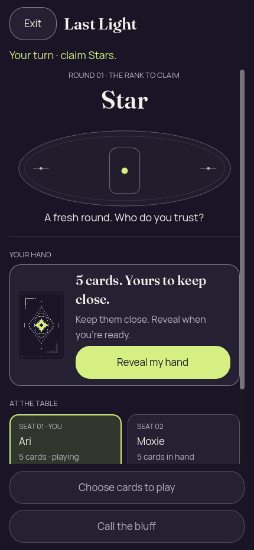</a> | **Initial concealed own hand — 2D** Godot 4.7.2 desktop 2D, real Kotlin authority, packed renderer Original: [01-concealed.png](2d/01-concealed.png) 430 × 932 px; text 1× SHA-256: <code>1609dcecbe23473394038126943aee9545ce82932cdab1b9dbbedb36b7a9fc46</code> [Original receipt](2d/01-concealed.receipt.json) |
|  | **Own hand revealed without selection — 2D** Godot 4.7.2 desktop 2D, real Kotlin authority, packed renderer Original: [02-revealed.png](2d/02-revealed.png) 430 × 932 px; text 1× SHA-256: <code>a54d55a66ec2f09cd921a10b8127b77052862d8973aab05423b55ca7132b41b0</code> [Original receipt](2d/02-revealed.receipt.json) |
|  | **Moon selected for a one-card Star claim — 2D** Godot 4.7.2 desktop 2D, real Kotlin authority, packed renderer Original: [03-selected.png](2d/03-selected.png) 430 × 932 px; text 1× SHA-256: <code>b926c9f847c2b4c8065c376169b3242f4044f5605ebca6472c6a061dcffbf1b8</code> [Original receipt](2d/03-selected.receipt.json) |
|  | **Hand covered and selection cleared — 2D** Godot 4.7.2 desktop 2D, real Kotlin authority, packed renderer Original: [04-covered.png](2d/04-covered.png) 430 × 932 px; text 1× SHA-256: <code>1609dcecbe23473394038126943aee9545ce82932cdab1b9dbbedb36b7a9fc46</code> [Original receipt](2d/04-covered.receipt.json) |
|  | **Private hand erased while the presentation is inactive — 2D** Godot 4.7.2 desktop 2D, real Kotlin authority, packed renderer Original: [05-background-privacy.png](2d/05-background-privacy.png) 430 × 932 px; text 1× SHA-256: <code>ca40b79751f9444a908be3f638d02b566e375fb91e77fbe84487ebd667810814</code> [Original receipt](2d/05-background-privacy.receipt.json) Bridge foreground=false conceals private faces, labels and selection. This desktop probe does not qualify native OS snapshot behavior. |
| <a href="2d/06-play-pending.png">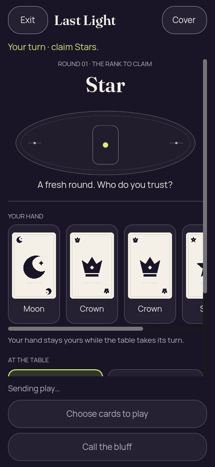</a> | **Play pending before the authority reply — 2D** Godot 4.7.2 desktop 2D, real Kotlin authority, packed renderer Original: [06-play-pending.png](2d/06-play-pending.png) 430 × 932 px; text 1× SHA-256: <code>b2741012013047fe9e7d6aa375d1092b86b8a82fad6d3c0021bfafd4ae0130ba</code> [Original receipt](2d/06-play-pending.receipt.json) Before authority acceptance, the own hand remains revealed, selection clears and gameplay controls are disabled. This pending frame is not the accepted result. |
| <a href="2d/07-public-round-result.png">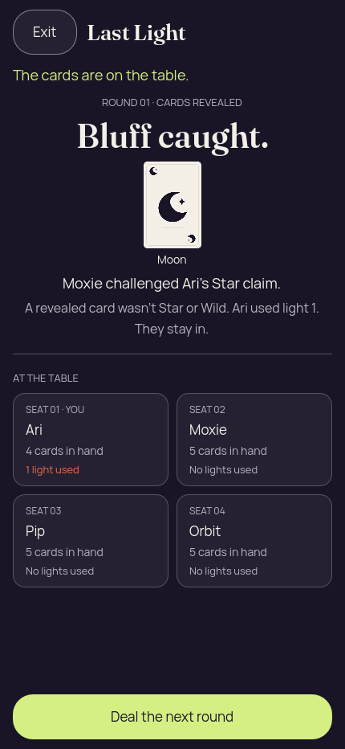</a> | **Moxie catches Ari’s Star bluff; public Moon revealed — 2D** Godot 4.7.2 desktop 2D, real Kotlin authority, packed renderer Original: [07-public-round-result.png](2d/07-public-round-result.png) 430 × 932 px; text 1× SHA-256: <code>18087509121376c9f028470b1d15683356438a050bcfe5a35e545e1d5caa158e</code> [Original receipt](2d/07-public-round-result.receipt.json) Moxie challenged Ari’s one-card Star claim. Moon did not match; Ari used light 1 and remains in. |
|  | **Round 2 starts with Moxie and Crown required — 2D** Godot 4.7.2 desktop 2D, real Kotlin authority, packed renderer Original: [08-next-round.png](2d/08-next-round.png) 430 × 932 px; text 1× SHA-256: <code>f6f7e337cd87695c7d718aa0e63504562f592f42d04d252d5e550cc11fdf6755</code> [Original receipt](2d/08-next-round.receipt.json) |
|  | **Challenge to Orbit’s Crown claim pending authority reply — 2D** Godot 4.7.2 desktop 2D, real Kotlin authority, packed renderer Original: [09-challenge-pending.png](2d/09-challenge-pending.png) 430 × 932 px; text 1× SHA-256: <code>9f2f5f9a0eb89bed27b71eb99c96a30975c4333695d0d823b9ddab426d83729b</code> [Original receipt](2d/09-challenge-pending.receipt.json) Calling challenge is visible with private counts zero and gameplay controls disabled, before the next authority view. |
| <a href="2d/10-winner.png">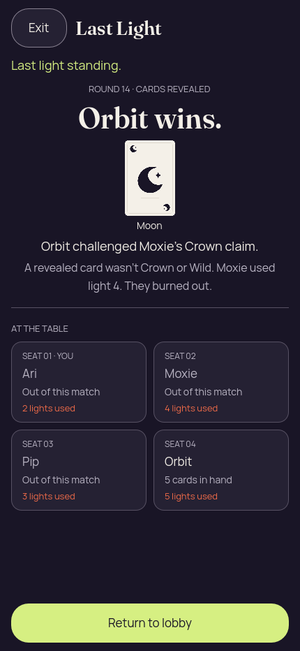</a> | **Orbit wins after the final Crown bluff is caught — 2D** Godot 4.7.2 desktop 2D, real Kotlin authority, packed renderer Original: [10-winner.png](2d/10-winner.png) 430 × 932 px; text 1× SHA-256: <code>4d83c897e5670096846e637d3219452a367e744b83dde44d8faf97c3f15a26f7</code> [Original receipt](2d/10-winner.receipt.json) Authority outcome: Orbit challenged Moxie’s one-card Crown claim. Public Moon did not match; Moxie used light 4 and burned out. The final challenge and penalty explanation are visible. |
|  | **Fresh round-1 presentation after return and re-entry — 2D** Godot 4.7.2 desktop 2D, real Kotlin authority, packed renderer Original: [12-fresh-presentation.png](2d/12-fresh-presentation.png) 430 × 932 px; text 1× SHA-256: <code>1609dcecbe23473394038126943aee9545ce82932cdab1b9dbbedb36b7a9fc46</code> [Original receipt](2d/12-fresh-presentation.receipt.json) |

## 3D

| Original image | Scenario and provenance |
| --- | --- |
|  | **Initial concealed own hand — 3D** Godot 4.7.2 desktop 3D, real Kotlin authority, packed renderer Original: [01-concealed.png](3d/01-concealed.png) 430 × 932 px; text 1× SHA-256: <code>0ba1de5264dee6cdf258061b13c93d7495c81395e3d00fa792edde81acc127f8</code> [Original receipt](3d/01-concealed.receipt.json) |
| <a href="3d/02-revealed.png">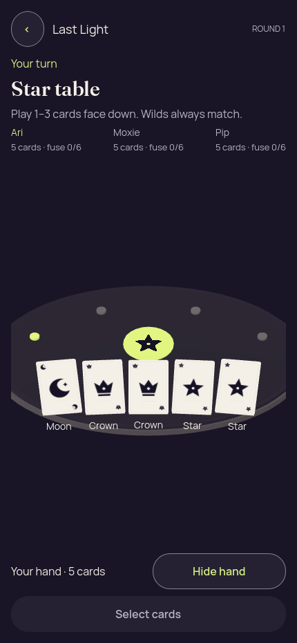</a> | **Own hand revealed without selection — 3D** Godot 4.7.2 desktop 3D, real Kotlin authority, packed renderer Original: [02-revealed.png](3d/02-revealed.png) 430 × 932 px; text 1× SHA-256: <code>4bc3e80f119400e2832b979d1780d1467a07270f3974ef746bcc8f285faccb8c</code> [Original receipt](3d/02-revealed.receipt.json) |
| <a href="3d/03-selected.png">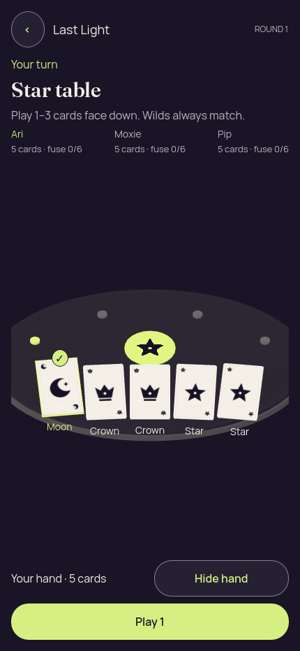</a> | **Moon selected for a one-card Star claim — 3D** Godot 4.7.2 desktop 3D, real Kotlin authority, packed renderer Original: [03-selected.png](3d/03-selected.png) 430 × 932 px; text 1× SHA-256: <code>167d1a432266eeceb19d1114740dfe064d502e8c8204f6d0d16d2e7ed2b99118</code> [Original receipt](3d/03-selected.receipt.json) |
|  | **Hand covered and selection cleared — 3D** Godot 4.7.2 desktop 3D, real Kotlin authority, packed renderer Original: [04-covered.png](3d/04-covered.png) 430 × 932 px; text 1× SHA-256: <code>0ba1de5264dee6cdf258061b13c93d7495c81395e3d00fa792edde81acc127f8</code> [Original receipt](3d/04-covered.receipt.json) |
| <a href="3d/05-background-privacy.png">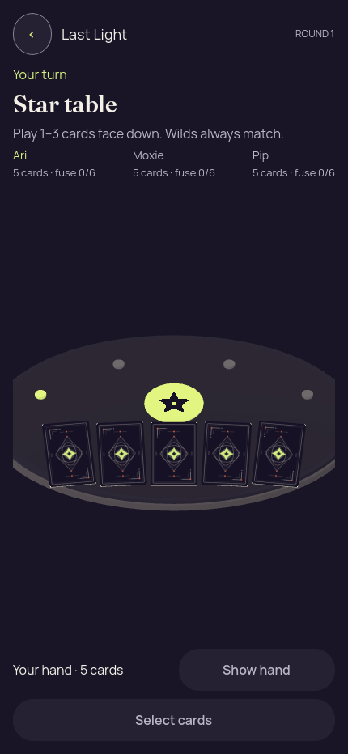</a> | **Private hand erased while the presentation is inactive — 3D** Godot 4.7.2 desktop 3D, real Kotlin authority, packed renderer Original: [05-background-privacy.png](3d/05-background-privacy.png) 430 × 932 px; text 1× SHA-256: <code>34119f4c45455b6c34c02c0eba9009982174e6b28a7410b41340bab6d968063c</code> [Original receipt](3d/05-background-privacy.receipt.json) Bridge foreground=false conceals private faces, labels and selection. This desktop probe does not qualify native OS snapshot behavior. |
|  | **Play pending before the authority reply — 3D** Godot 4.7.2 desktop 3D, real Kotlin authority, packed renderer Original: [06-play-pending.png](3d/06-play-pending.png) 430 × 932 px; text 1× SHA-256: <code>5f0f6369b7ac17fde0df47d3e56e4f80bd8c2e6417f0a6297500dba740f4c0ec</code> [Original receipt](3d/06-play-pending.receipt.json) Before authority acceptance, the own hand remains revealed, selection clears and gameplay controls are disabled. This pending frame is not the accepted result. |
| <a href="3d/07-public-round-result.png">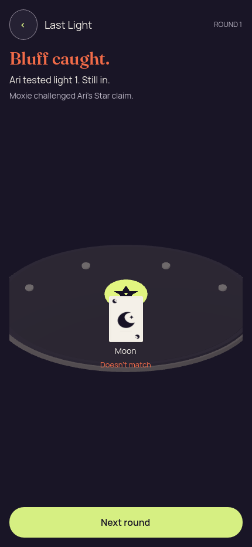</a> | **Moxie catches Ari’s Star bluff; public Moon revealed — 3D** Godot 4.7.2 desktop 3D, real Kotlin authority, packed renderer Original: [07-public-round-result.png](3d/07-public-round-result.png) 430 × 932 px; text 1× SHA-256: <code>5330f8e1dda046f1481892e5d1b170375f877e0c63ada3df488642a9e6e44095</code> [Original receipt](3d/07-public-round-result.receipt.json) Moxie challenged Ari’s one-card Star claim. Moon did not match; Ari used light 1 and remains in. |
| <a href="3d/08-next-round.png">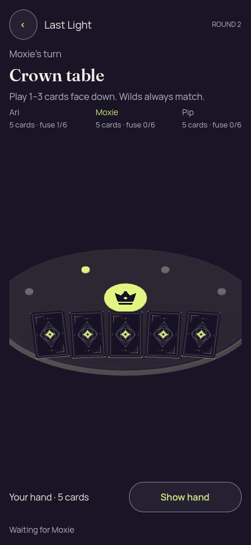</a> | **Round 2 starts with Moxie and Crown required — 3D** Godot 4.7.2 desktop 3D, real Kotlin authority, packed renderer Original: [08-next-round.png](3d/08-next-round.png) 430 × 932 px; text 1× SHA-256: <code>0fdeb8086dd0f6dad358900d7194a576d35f222bbc1b3d0a998fd9af672d101e</code> [Original receipt](3d/08-next-round.receipt.json) |
|  | **Challenge to Orbit’s Crown claim pending authority reply — 3D** Godot 4.7.2 desktop 3D, real Kotlin authority, packed renderer Original: [09-challenge-pending.png](3d/09-challenge-pending.png) 430 × 932 px; text 1× SHA-256: <code>b3ab16127dc46671cd3268969474b7fb15d2f57a787c255696c595907669512f</code> [Original receipt](3d/09-challenge-pending.receipt.json) Calling challenge is visible with private counts zero and gameplay controls disabled, before the next authority view. |
| <a href="3d/10-winner.png">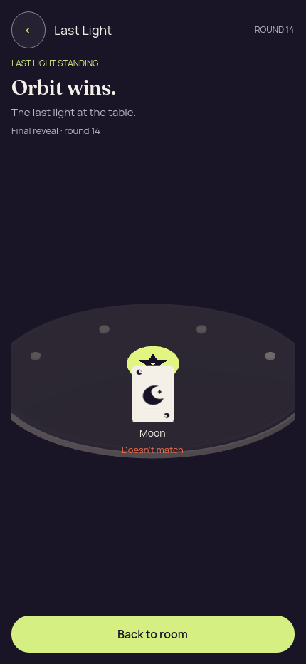</a> | **Orbit wins — wrong Star emblem and missing final explanation retained — 3D** Godot 4.7.2 desktop 3D, real Kotlin authority, packed renderer Original: [10-winner.png](3d/10-winner.png) 430 × 932 px; text 1× SHA-256: <code>77c1965666087c455ea27e8e7b856c41f80d51b14fcca76fb2beac889a935179</code> [Original receipt](3d/10-winner.receipt.json) Authority outcome: Orbit challenged Moxie’s one-card Crown claim. Public Moon did not match; Moxie used light 4 and burned out. Retained visual defect: the table still displays a Star emblem for the Crown claim and omits the named final challenge/burnout explanation. Corrected later local originals are archived separately. |
| <a href="3d/12-fresh-presentation.png">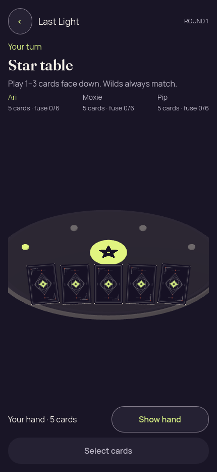</a> | **Fresh round-1 presentation after return and re-entry — 3D** Godot 4.7.2 desktop 3D, real Kotlin authority, packed renderer Original: [12-fresh-presentation.png](3d/12-fresh-presentation.png) 430 × 932 px; text 1× SHA-256: <code>0ba1de5264dee6cdf258061b13c93d7495c81395e3d00fa792edde81acc127f8</code> [Original receipt](3d/12-fresh-presentation.receipt.json) |
