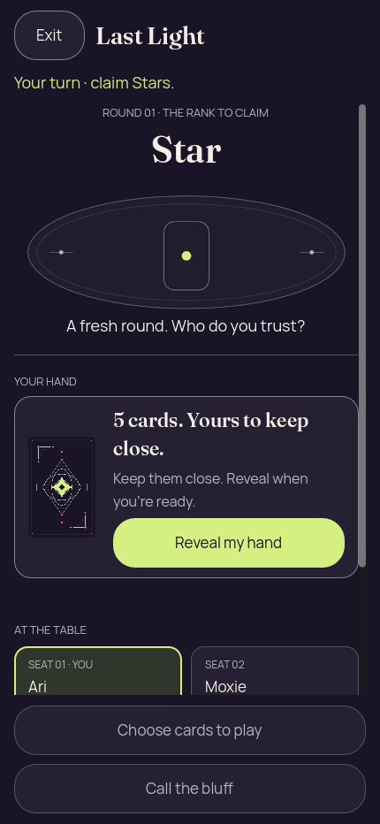
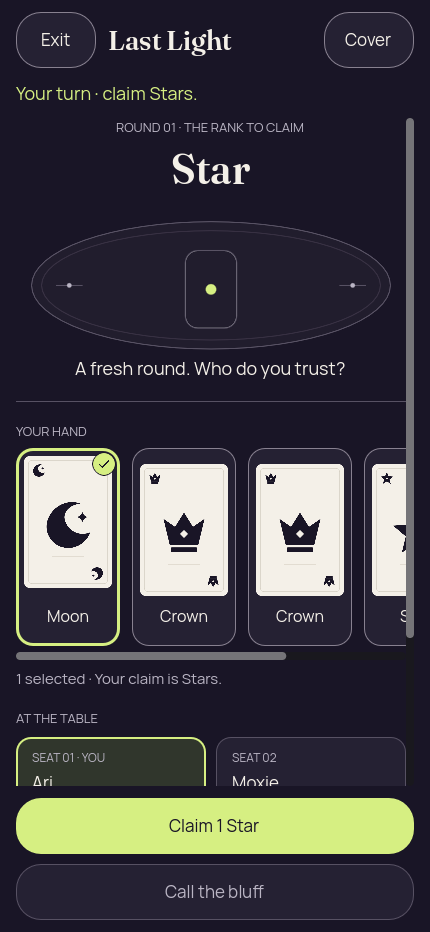
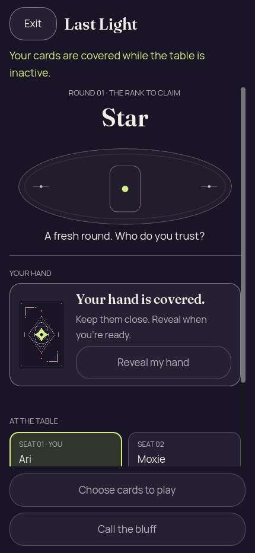
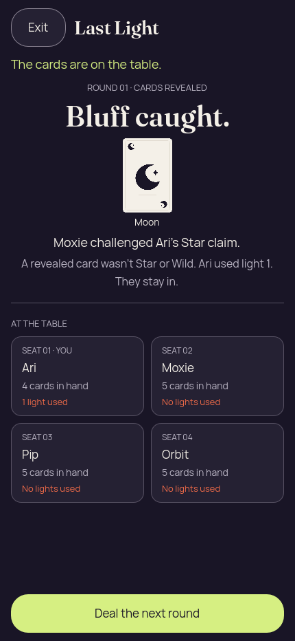
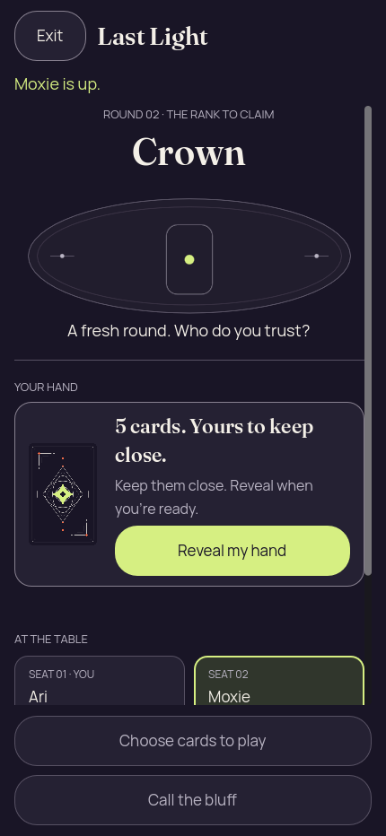
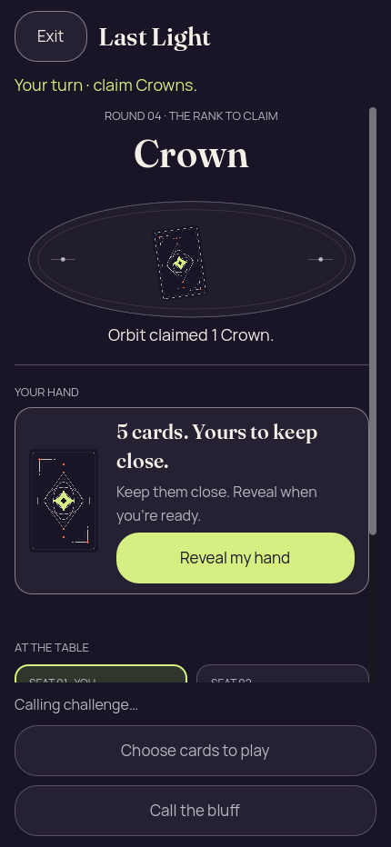
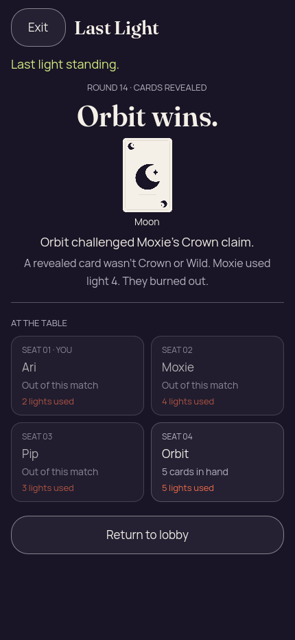

# Godot 2D — first complete match through the real authority

[All screenshot collections](../README.md)

**Evidence status:** The seed-2 gameplay scenario completed: 2 viewer plays, 2 viewer challenges, 13 round advances and a winner in round 14. Actual Godot Button inputs passed through the shared bridge and Kotlin LastLightEngine; pending/authority-view, privacy, navigation-intent and fresh-entry assertions completed. The original report says passed, but the original Godot log records ERROR: Comparison loopback connection closed during shutdown. That report did not check child exit. Clean engine exit is not qualified by this run.

Actual Godot 4.7.2-stable (official), gl_compatibility / X11 / Xvfb; 430 × 932 pixels, text scale 1.0, reduced motion enabled. Desktop rendering at a phone-sized viewport is not native phone execution.

Working-tree basis: [`5dd00c994cdef2a5c0fdee023595d6c691b81651`](https://github.com/Apdelrahman1911/PartyDeck/commit/5dd00c994cdef2a5c0fdee023595d6c691b81651); the run reports `workingTreeDirty=true`, so this is **not an exact clean source revision**. The harness checked that its source fingerprint did not change during the run.

Source fingerprint SHA-256: `264752032a7425fcfa4995eb03e8a8abb807b337c9a744eda66989d0efd97935`.

Authority trace SHA-256: `79b5b2a6415a365d531da3488b7b87f1b2309f2b1208899ee5b4618da16be674` (independently recomputed from the retained trace).

Run: `2026-09-09T23:58:56.263518790Z` to `2026-09-09T23:59:11.999396064Z`.

[Original run report](report.json) · [Original 2D result and trace](2d/result.json) · [Original Godot log](2d/godot.log). Every image links to its original scenario receipt, including Godot version/backend, viewport, seed, source fingerprint, authority revision/view hash and renderer privacy diagnostics.

The shutdown log reports `ERROR: Comparison loopback connection closed` from `renderer_probe.gd` (`_process:71`, `_fail:289`). The owner confirmed a teardown ordering defect: the JVM closed its socket after the quit reply while the probe still waited before marking shutdown. Gameplay/capture assertions and source stability are retained; the original report’s `passed` field is not evidence of clean process shutdown. Original PNGs, reports and scenario receipts remain unchanged.

All 11 images were independently visually reviewed. Concealed, covered, inactive, public-result and fresh-entry captures agree with zero private face/label/selection diagnostics. The Moon-as-Star bluff, round proof, redeal and Orbit winner are clear at this viewport. The earlier compact-layout design concerns remain; this run does not visually qualify 200% accepted gameplay, an eliminated spectator during active play, previous-round proof inspection, or six seats with long names.

Scope remains desktop renderer gameplay. No native accessibility, native navigation screen, OS lifecycle protection, physical LAN or store-signing result is claimed. Only 2D ran here: `sameAuthorityTrace=false` means this is not a 2D/3D parity run. Sequence number 11 is absent because the renderer did not require a lobby confirmation screenshot; no missing frame is invented.

| Original image | Scenario and provenance |
| --- | --- |
|  | **Initial concealed hand** Godot 4.7.2 desktop 2D, real Kotlin authority, 430 × 932 viewport Original: [01-concealed.png](2d/01-concealed.png) 430 × 932 px; text 1.0×; seed 2 SHA-256: <code>573c066bbb9a94a5b8ee38b27c5768b06fab0bf96506f91388d92b9ec6be069c</code> Authority revision: 0 View SHA-256: <code>edf527cc8ff21d8a5485008fc35d21e784dda2adb745e2c1188b9c6b08f447ca</code> [Original receipt](2d/01-concealed.receipt.json) |
|  | **Own hand revealed** Godot 4.7.2 desktop 2D, real Kotlin authority, 430 × 932 viewport Original: [02-revealed.png](2d/02-revealed.png) 430 × 932 px; text 1.0×; seed 2 SHA-256: <code>a54d55a66ec2f09cd921a10b8127b77052862d8973aab05423b55ca7132b41b0</code> Authority revision: 0 View SHA-256: <code>edf527cc8ff21d8a5485008fc35d21e784dda2adb745e2c1188b9c6b08f447ca</code> [Original receipt](2d/02-revealed.receipt.json) |
|  | **Moon selected for a Star claim** Godot 4.7.2 desktop 2D, real Kotlin authority, 430 × 932 viewport Original: [03-selected.png](2d/03-selected.png) 430 × 932 px; text 1.0×; seed 2 SHA-256: <code>b926c9f847c2b4c8065c376169b3242f4044f5605ebca6472c6a061dcffbf1b8</code> Authority revision: 0 View SHA-256: <code>edf527cc8ff21d8a5485008fc35d21e784dda2adb745e2c1188b9c6b08f447ca</code> [Original receipt](2d/03-selected.receipt.json) Selected Moon is visibly checked; the primary action correctly says Claim 1 Star. The hand scrolls horizontally beyond the captured cards. |
|  | **Hand covered and selection cleared** Godot 4.7.2 desktop 2D, real Kotlin authority, 430 × 932 viewport Original: [04-covered.png](2d/04-covered.png) 430 × 932 px; text 1.0×; seed 2 SHA-256: <code>573c066bbb9a94a5b8ee38b27c5768b06fab0bf96506f91388d92b9ec6be069c</code> Authority revision: 0 View SHA-256: <code>edf527cc8ff21d8a5485008fc35d21e784dda2adb745e2c1188b9c6b08f447ca</code> [Original receipt](2d/04-covered.receipt.json) |
|  | **Inactive presentation with private hand erased** Godot 4.7.2 desktop 2D, real Kotlin authority, 430 × 932 viewport Original: [05-background-privacy.png](2d/05-background-privacy.png) 430 × 932 px; text 1.0×; seed 2 SHA-256: <code>ff16dba781567c7262efa6acd75d77c80da7fd2afacd628866d7d8c14113c413</code> Authority revision: 0 View SHA-256: <code>edf527cc8ff21d8a5485008fc35d21e784dda2adb745e2c1188b9c6b08f447ca</code> [Original receipt](2d/05-background-privacy.receipt.json) Renderer foreground message is false, private faces/labels/selection are cleared and Reveal is disabled. This is not a native OS lifecycle snapshot test. |
|  | **Play submitted, awaiting authority acceptance** Godot 4.7.2 desktop 2D, real Kotlin authority, 430 × 932 viewport Original: [06-play-pending.png](2d/06-play-pending.png) 430 × 932 px; text 1.0×; seed 2 SHA-256: <code>b2741012013047fe9e7d6aa375d1092b86b8a82fad6d3c0021bfafd4ae0130ba</code> Authority revision: 0 View SHA-256: <code>edf527cc8ff21d8a5485008fc35d21e784dda2adb745e2c1188b9c6b08f447ca</code> [Original receipt](2d/06-play-pending.receipt.json) Captured before acceptance at authority revision 0; Sending play is visible and gameplay actions are disabled. Own card faces remain visible in this pending frame. |
|  | **Round 1 result: Moon bluff caught against a Star claim** Godot 4.7.2 desktop 2D, real Kotlin authority, 430 × 932 viewport Original: [07-public-round-result.png](2d/07-public-round-result.png) 430 × 932 px; text 1.0×; seed 2 SHA-256: <code>0b5c78fa181a6b9f63e658dcaf761b870a3e3999bafe6fd6972079ad45075e90</code> Authority revision: 2 View SHA-256: <code>0aa7ada0d2891b98c3751f2ece396f921c4eaa223f44d344a860ff006766b852</code> [Original receipt](2d/07-public-round-result.receipt.json) Public Moon proof and Star-or-Wild mismatch explanation are visible; Ari used light 1 and remains in. |
|  | **Round 2 redeal with Moxie taking the turn** Godot 4.7.2 desktop 2D, real Kotlin authority, 430 × 932 viewport Original: [08-next-round.png](2d/08-next-round.png) 430 × 932 px; text 1.0×; seed 2 SHA-256: <code>52d55bcbabc8b2eae5bf9a07758ec4fd0be4288285fb2db9ea9d2160dc15a280</code> Authority revision: 3 View SHA-256: <code>598baddae45fa6e87442003dd27d382e28529575c23ebf6b363b79ec914f40ea</code> [Original receipt](2d/08-next-round.receipt.json) New deal begins concealed; the previous round proof is not shown in this screenshot. |
|  | **Challenge submitted, awaiting authority acceptance** Godot 4.7.2 desktop 2D, real Kotlin authority, 430 × 932 viewport Original: [09-challenge-pending.png](2d/09-challenge-pending.png) 430 × 932 px; text 1.0×; seed 2 SHA-256: <code>7e0b63d3254c3e85659b76828acf1c4d644dc312e77bf6cec3d44bb58509999a</code> Authority revision: 10 View SHA-256: <code>40a9485d3575a9891e566cb632da0e357ea0c43542ebc38a6927198a5a2a9e68</code> [Original receipt](2d/09-challenge-pending.receipt.json) Captured before acceptance at authority revision 10; Calling challenge is visible and gameplay actions are disabled. Hand remains covered. |
|  | **Round 14 result: Orbit wins** Godot 4.7.2 desktop 2D, real Kotlin authority, 430 × 932 viewport Original: [10-winner.png](2d/10-winner.png) 430 × 932 px; text 1.0×; seed 2 SHA-256: <code>0d40ebdba17a674973244aaf8ea0734d9db2e783c39ee21fa7197213f743fb31</code> Authority revision: 41 View SHA-256: <code>ce5672d29351f3e806102334c6b6ed1946ad63ba2cc206b5064a883f128e69ad</code> [Original receipt](2d/10-winner.receipt.json) Orbit wins after Moxie burns out on light 4; the final public proof and Return to lobby action are visible. |
|  | **Fresh seeded presentation after return-to-lobby intent** Godot 4.7.2 desktop 2D, real Kotlin authority, 430 × 932 viewport Original: [12-fresh-presentation.png](2d/12-fresh-presentation.png) 430 × 932 px; text 1.0×; seed 2 SHA-256: <code>573c066bbb9a94a5b8ee38b27c5768b06fab0bf96506f91388d92b9ec6be069c</code> Authority revision: 0 View SHA-256: <code>edf527cc8ff21d8a5485008fc35d21e784dda2adb745e2c1188b9c6b08f447ca</code> [Original receipt](2d/12-fresh-presentation.receipt.json) The harness exercised the return-to-lobby bridge intent, reset the renderer and opened a fresh seeded presentation. No native lobby screen is claimed. |
