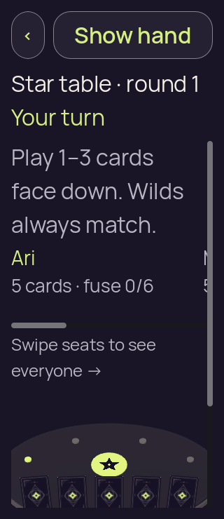
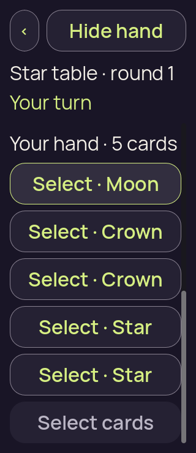
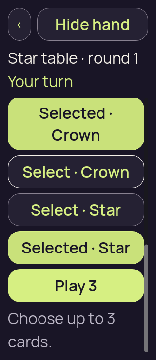
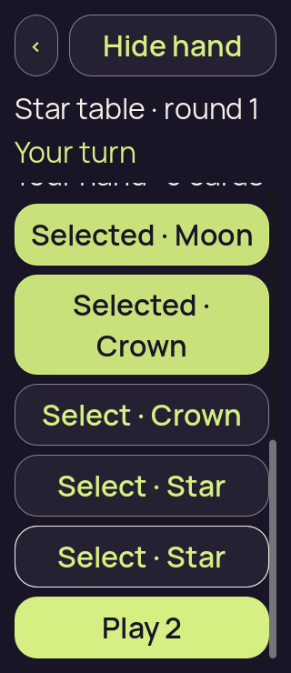
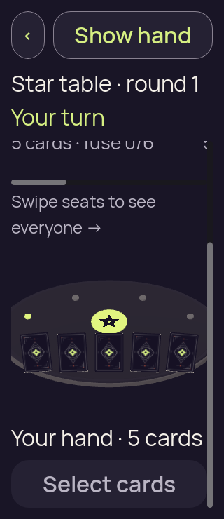
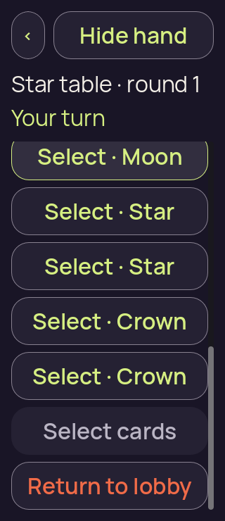
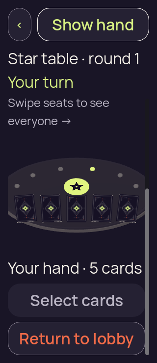
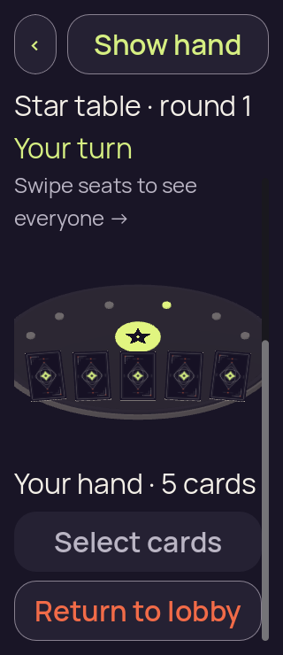
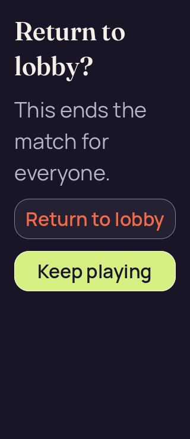

# Godot frame reconciliation — focused packed 3D at 200% text

[All screenshot collections](../README.md) · [Companion local authority run](../godot-frame-reconciliation-packed-20260910/README.md)

**Evidence status:** Both focused local reports pass. Fifteen originals preserve the default-seat and six-long-name fixtures, including intermediate emulated-drag, three-card-limit and deselection frames. Actual Godot 4.7.2 renders the recorded PCK with Compatibility/OpenGL on Linux at **320 × 740 and 200% text**. These static recipient-safe views do not establish native-device behavior or authority-accepted gameplay.

Pinned Star table, round, actor and Show/Hide stay visible during scrolling. The default two-card selection shows readable complete rank actions and Play 2; limit feedback and deselection remain legible. The six-seat roster scrolls horizontally. In some long-name selected frames, the first selected card is above the clip while the focused last card and Play remain visible; not every card is fully visible at once. Hide/resume clear private faces, labels and selection. The six-seat lobby confirmation has the full consequence and both complete choices.

The captured selection counts progress **2 → 3 (fourth rejected) → 2**. The emulated drag leaves selection at zero. Its `authorityEvents=1` is the initial Ready event, not accepted gameplay. [Exact checker](three_d_scene_check.gd), case-specific fixtures, invocation bases, complete runtime logs, diagnostics and image hashes are retained.

The local source basis is dirty commit `86ca7f56f7ebbc3e64e4d49da82d5d667535098e`, not an exact whole-tree revision. PCK SHA-256: `0ed324c19016f28987d6294f915c107f62234670b149f73bab585af93e29ae6d`. The matching immutable pack and [later clean CI export receipt](../godot-android-34446327045/provenance/partydeck-last-light.receipt.json) were checked separately; the later receipt does not replace the local invocation. Source: `/tmp/partydeck-frame-reconciliation-packed-v1/focused-3d`. Thumbnails open unchanged originals.

## Default seats

[Original report](large-text-touch/report.json) · [Invocation](large-text-touch/basis.json) · [Fixture](large-text-touch/fixture.json) · [Gesture diagnostics](large-text-touch/gesture-diagnostics.json)

| Original image | Scenario and provenance |
| --- | --- |
|  | **Initial concealed 3D fixture — default seats** Godot 4.7.2 Linux OpenGL desktop fixture, 320 × 740, emulated touch Original: [01-concealed.png](large-text-touch/01-concealed.png) 320 × 740 px; text 2× SHA-256: <code>cb29857d3589cc486fc6724c8893e73e757403cfaf18f0253cc0701e57cf52d6</code> [Original measurements](large-text-touch/01-concealed.json) [Original result](large-text-touch/report.json) Packed desktop fixture at 200% text; static recipient-safe view and emulated input. No authority-accepted gameplay or native-device claim. No private card face, rank label or selected binding is present. |
|  | **Hand after emulated touch drag with zero selected cards — default seats** Godot 4.7.2 Linux OpenGL desktop fixture, 320 × 740, emulated touch Original: [01a-emulated-touch-drag.png](large-text-touch/01a-emulated-touch-drag.png) 320 × 740 px; text 2× SHA-256: <code>eef3f4d15c29d51756ac22258f52b13fabd4858f0b6de5eb204a0715c8904ba5</code> [Original measurements](large-text-touch/01a-emulated-touch-drag.json) [Original result](large-text-touch/report.json) Packed desktop fixture at 200% text; static recipient-safe view and emulated input. No authority-accepted gameplay or native-device claim. The recorded drag leaves selection at zero. authorityEvents=1 is the initial Ready event, not gameplay acceptance. |
|  | **Two selected cards and Play 2 — default seats** Godot 4.7.2 Linux OpenGL desktop fixture, 320 × 740, emulated touch Original: [02-revealed-selected.png](large-text-touch/02-revealed-selected.png) 320 × 740 px; text 2× SHA-256: <code>39cd72cf3bc4ac535db3bf6df979ce17b4771fbfff5db72e1d89fa735e710bc1</code> [Original measurements](large-text-touch/02-revealed-selected.json) [Original result](large-text-touch/report.json) Packed desktop fixture at 200% text; static recipient-safe view and emulated input. No authority-accepted gameplay or native-device claim. Paired diagnostics record 2 selected cards. Pinned Show/Hide and actor/rank context stay visible during scrolling. Rank action labels, selection feedback and the primary Play action are readable in the captured scrolled state. |
|  | **Three-card limit after the rejected fourth selection — default seats** Godot 4.7.2 Linux OpenGL desktop fixture, 320 × 740, emulated touch Original: [02a-selection-limit.png](large-text-touch/02a-selection-limit.png) 320 × 740 px; text 2× SHA-256: <code>ebe2b9f2a8b7517f0ca6bff81be42de450af370382d41b3b7650e0abe96984b7</code> [Original measurements](large-text-touch/02a-selection-limit.json) [Original result](large-text-touch/report.json) Packed desktop fixture at 200% text; static recipient-safe view and emulated input. No authority-accepted gameplay or native-device claim. Paired diagnostics record 3 selected cards. Pinned Show/Hide and actor/rank context stay visible during scrolling. Rank action labels, selection feedback and the primary Play action are readable in the captured scrolled state. |
|  | **Last selected card deselected; two remain — default seats** Godot 4.7.2 Linux OpenGL desktop fixture, 320 × 740, emulated touch Original: [02b-deselected-last.png](large-text-touch/02b-deselected-last.png) 320 × 740 px; text 2× SHA-256: <code>4abfa0547a0f4c41f81464d7d7764331a712662a1bfe05c7256bb04a5193b174</code> [Original measurements](large-text-touch/02b-deselected-last.json) [Original result](large-text-touch/report.json) Packed desktop fixture at 200% text; static recipient-safe view and emulated input. No authority-accepted gameplay or native-device claim. Paired diagnostics record 2 selected cards. Pinned Show/Hide and actor/rank context stay visible during scrolling. Rank action labels, selection feedback and the primary Play action are readable in the captured scrolled state. |
|  | **Hide clears private faces, labels and selection — default seats** Godot 4.7.2 Linux OpenGL desktop fixture, 320 × 740, emulated touch Original: [03-covered-again.png](large-text-touch/03-covered-again.png) 320 × 740 px; text 2× SHA-256: <code>5ed45c165eb85b4607a963f1ceea3b6477c39c8bf50934e389b1694074e8eaa8</code> [Original measurements](large-text-touch/03-covered-again.json) [Original result](large-text-touch/report.json) Packed desktop fixture at 200% text; static recipient-safe view and emulated input. No authority-accepted gameplay or native-device claim. No private card face, rank label or selected binding is present. |
|  | **Local scene resumes with a concealed hand — default seats** Godot 4.7.2 Linux OpenGL desktop fixture, 320 × 740, emulated touch Original: [04-resumed-covered.png](large-text-touch/04-resumed-covered.png) 320 × 740 px; text 2× SHA-256: <code>095beb89fe3fb7e2b1f748ac14d3ebccbdc334017f81866c83ee8adb4aed5e84</code> [Original measurements](large-text-touch/04-resumed-covered.json) [Original result](large-text-touch/report.json) Packed desktop fixture at 200% text; static recipient-safe view and emulated input. No authority-accepted gameplay or native-device claim. No private card face, rank label or selected binding is present. |

## Six long names

[Original report](six-long-names-large-text/report.json) · [Invocation](six-long-names-large-text/basis.json) · [Fixture](six-long-names-large-text/fixture.json) · [Gesture diagnostics](six-long-names-large-text/gesture-diagnostics.json)

| Original image | Scenario and provenance |
| --- | --- |
|  | **Initial concealed 3D fixture — six long names** Godot 4.7.2 Linux OpenGL desktop fixture, 320 × 740, emulated touch Original: [01-concealed.png](six-long-names-large-text/01-concealed.png) 320 × 740 px; text 2× SHA-256: <code>d2a19f623dcb036640582f1ad9fe7d7eb9ae2226fe167b160132f70237d8208c</code> [Original measurements](six-long-names-large-text/01-concealed.json) [Original result](six-long-names-large-text/report.json) Packed desktop fixture at 200% text; static recipient-safe view and emulated input. No authority-accepted gameplay or native-device claim. No private card face, rank label or selected binding is present. |
|  | **Hand after emulated touch drag with zero selected cards — six long names** Godot 4.7.2 Linux OpenGL desktop fixture, 320 × 740, emulated touch Original: [01a-emulated-touch-drag.png](six-long-names-large-text/01a-emulated-touch-drag.png) 320 × 740 px; text 2× SHA-256: <code>f437ebceabd6527c6777d75c04e9fb4007922650a042d450a348c4441e89fb97</code> [Original measurements](six-long-names-large-text/01a-emulated-touch-drag.json) [Original result](six-long-names-large-text/report.json) Packed desktop fixture at 200% text; static recipient-safe view and emulated input. No authority-accepted gameplay or native-device claim. The recorded drag leaves selection at zero. authorityEvents=1 is the initial Ready event, not gameplay acceptance. |
|  | **Two selected cards and Play 2 — six long names** Godot 4.7.2 Linux OpenGL desktop fixture, 320 × 740, emulated touch Original: [02-revealed-selected.png](six-long-names-large-text/02-revealed-selected.png) 320 × 740 px; text 2× SHA-256: <code>047a4ed11344904ac5df65f2e13b45207b71b24dc60dfdaf9c5587003a0dc449</code> [Original measurements](six-long-names-large-text/02-revealed-selected.json) [Original result](six-long-names-large-text/report.json) Packed desktop fixture at 200% text; static recipient-safe view and emulated input. No authority-accepted gameplay or native-device claim. Paired diagnostics record 2 selected cards. Pinned Show/Hide and actor/rank context stay visible during scrolling. The six-seat roster scrolls horizontally. Some earlier hand content lies above the clip; the focused last card and Play remain visible. Not every card is simultaneously fully visible. |
|  | **Three-card limit after the rejected fourth selection — six long names** Godot 4.7.2 Linux OpenGL desktop fixture, 320 × 740, emulated touch Original: [02a-selection-limit.png](six-long-names-large-text/02a-selection-limit.png) 320 × 740 px; text 2× SHA-256: <code>574234d36ef821257fb765438aa85de33c09c6941d4d0305820119b1264aab53</code> [Original measurements](six-long-names-large-text/02a-selection-limit.json) [Original result](six-long-names-large-text/report.json) Packed desktop fixture at 200% text; static recipient-safe view and emulated input. No authority-accepted gameplay or native-device claim. Paired diagnostics record 3 selected cards. Pinned Show/Hide and actor/rank context stay visible during scrolling. The six-seat roster scrolls horizontally. Some earlier hand content lies above the clip; the focused last card and Play remain visible. Not every card is simultaneously fully visible. |
|  | **Last selected card deselected; two remain — six long names** Godot 4.7.2 Linux OpenGL desktop fixture, 320 × 740, emulated touch Original: [02b-deselected-last.png](six-long-names-large-text/02b-deselected-last.png) 320 × 740 px; text 2× SHA-256: <code>5a5597c0ff5520dcae12eee058001aea44eb8f5ac051d8b4895be8b19419b2fa</code> [Original measurements](six-long-names-large-text/02b-deselected-last.json) [Original result](six-long-names-large-text/report.json) Packed desktop fixture at 200% text; static recipient-safe view and emulated input. No authority-accepted gameplay or native-device claim. Paired diagnostics record 2 selected cards. Pinned Show/Hide and actor/rank context stay visible during scrolling. The six-seat roster scrolls horizontally. Some earlier hand content lies above the clip; the focused last card and Play remain visible. Not every card is simultaneously fully visible. |
|  | **Hide clears private faces, labels and selection — six long names** Godot 4.7.2 Linux OpenGL desktop fixture, 320 × 740, emulated touch Original: [03-covered-again.png](six-long-names-large-text/03-covered-again.png) 320 × 740 px; text 2× SHA-256: <code>5df5e2e92f0992f9fab3cd14adbc9f79a6fb5ab7c2dce5562f05d51139569eba</code> [Original measurements](six-long-names-large-text/03-covered-again.json) [Original result](six-long-names-large-text/report.json) Packed desktop fixture at 200% text; static recipient-safe view and emulated input. No authority-accepted gameplay or native-device claim. No private card face, rank label or selected binding is present. |
|  | **Local scene resumes with a concealed hand — six long names** Godot 4.7.2 Linux OpenGL desktop fixture, 320 × 740, emulated touch Original: [04-resumed-covered.png](six-long-names-large-text/04-resumed-covered.png) 320 × 740 px; text 2× SHA-256: <code>c026d991f3bbaa3e74da26e5a76c1e687a72a3a3849fa5a5dfa5618eb77c3b6d</code> [Original measurements](six-long-names-large-text/04-resumed-covered.json) [Original result](six-long-names-large-text/report.json) Packed desktop fixture at 200% text; static recipient-safe view and emulated input. No authority-accepted gameplay or native-device claim. No private card face, rank label or selected binding is present. |
|  | **Six-seat return confirmation with both complete choices — six long names** Godot 4.7.2 Linux OpenGL desktop fixture, 320 × 740, emulated touch Original: [05-lobby-confirmation.png](six-long-names-large-text/05-lobby-confirmation.png) 320 × 740 px; text 2× SHA-256: <code>b99bf2755d270f042dd938e0adb08482d886a14ccd43a60c9383dba06ad361d1</code> [Original measurements](six-long-names-large-text/05-lobby-confirmation.json) [Original result](six-long-names-large-text/report.json) Packed desktop fixture at 200% text; static recipient-safe view and emulated input. No authority-accepted gameplay or native-device claim. The full consequence and both complete confirmation choices are visible at 200% text; the fixture does not establish authority acceptance of a lobby intent. |
