# Godot iOS authority host — partial gameplay and secure exit

[All screenshot collections](../README.md) · [CI run 34434392993](https://github.com/Apdelrahman1911/PartyDeck/actions/runs/34434392993)

**Evidence status: four reference matches fail; the secure default renderer-exit test passes.** The actual Swift host calls the Kotlin authority framework and receives real Godot input. These originals establish bounded accepted gameplay and privacy/exit observations; no complete native reference match passes. The [original XCTest log](evidence/authority-host-test.log) records all five case outcomes, despite its final restarted suite footer saying passed.

| Test | Original PNGs | Executed result and stopping point |
| --- | ---: | --- |
| 2D, 100% | 10 | Two viewer plays, two challenges, seven advances; round 8/revision 23. The eighth Next tap uses earlier geometry and its authority-counter wait times out. The final PNG still shows a running, settled public result and complete Next action. No winner or match teardown. |
| 2D, 200% | 0 | The process aborts during `AudioDriverCoreAudio::start` / `Main::setup2`, before Ready. XCTest cannot read the dead app. Its original failed-recording placeholder and debug attachment remain in the manifest; there is no dedicated screenshot to substitute. |
| 3D, 200% | 8 | Captured checkpoints reach one accepted play and the round-1 public outcome. Later original app-stream metrics reach round 2/revision 5 after one advance, then the checker rejects an unsettled Next target before a second continuation touch. No full match or close. |
| 3D, 100% | 4 | Actual Ready, reveal/select/hide and native pause/cover. The Home wait expires while XCTest still reports Running Foreground; Home appears later. Zero gameplay intents and no completed return from Home. |
| Secure default 2D exit | 1 | Actual Godot Exit passes: `EXIT_REQUESTED`, released authority/controller/view, one cleanup, empty queues, absent singleton/bridge/render loop, restored idle timer and responsive Host +1. This case uses the secure default seed, not the reference fixture. |

Exact source: `a8dbb199024ed7de395a9d1c1a857c5cdbc7e340`. [Simulator metadata](evidence/authority-simulator.json) records iPhone 17, runtime 26.4.1 and SDK 26.4; [Xcode](evidence/authority-host-xcode-version.log) is 26.4.1 (17E202). All original PNGs are 1206 × 2622 pixels at display scale 3. Open scenes report 378 × 691 UIKit/logical engine points. The actual renderer is `GDTOpenGLLayer`, OpenGL ES 3.0 Compatibility / Apple Software Renderer. Text is explicitly 1.0 or 2.0. All 21 measurement attachments record `reduceMotion=false` and `soundEnabled=true`; these settings do not qualify audio behavior or reduced-motion behavior.

- App executable SHA-256: `12bd8a8c1e5798e06a257236a80186e36cefda9a7bb9f3b6d132b1cfb0e8762a`. Original archive, all 15 bundled files, executable Mach-O UUID, framework archive and both native engine archives independently match their receipts.
- Bundled PCK SHA-256: `6599f825a418f9d2a7049b3ba9325e8e0dcb474685262899079231b7ec955938`, matching the [original pack receipt](provenance/partydeck-last-light.receipt.json) and the [passing desktop comparison](../godot-desktop-34433457249/README.md).
- [Original build receipt](evidence/authority-host-build-result.json) and [input receipt](evidence/authority-host-inputs.json) were written before runtime execution; their compile-only flags do not summarize the later native tests.

The 2D/200% [original app crash](runtime/crash-02-AuthorityHost.ips) is `EXC_CRASH/SIGABRT`. The [original app stream](runtime/app-stdout-stderr-001.log) records `Start: RPC timeout. Apparently deadlocked. Aborting now.` at line 871. Its stack includes `_ReportRPCTimeout`, `AURemoteIO::Start`, `AudioDriverCoreAudio::start`, `AudioServer::init`, `Main::setup2` and the native host bootstrap. The cause of the RPC timeout remains unresolved; concurrent system crashes do not establish a causal relationship.

At 2D/100%, the [last touch geometry](attachments/F59C864B-0F69-4E58-9688-F8BE9C92DA20.json) uses Next rect `[16,557,346,56]`, diagnostic sequence 164/revision 23. The [failure measurement](attachments/558CD4BC-5079-4100-89C0-01F364D8AD39.json) and original PNG show the same revision with Next at `[16,623,346,56]`, sequence 190. The earlier center is outside the later button; the engine remains running through 3314 iterations with no terminal failure or outstanding diagnostics. Initial entry also has a separate visible layout limit: only seven of Reveal’s 56 logical points fit inside the scroll clip. Its other 49 points/147 pixels are clipped; later scrolled originals show the complete action.

At 3D/200%, the [last full stream metric](runtime/last-app-metrics-pid-15771.json), independently matched to its original source line, records revision 5/sequence 203 and Next rect `[0,0,32,68]` with zero clip and `visible=false`. That record is retained while native surface queries run, and the original fit assertion fails before another touch. No later layout requery establishes a persistent oversized settled control. The last two PNGs are earlier round-1 checkpoints, not screenshots of this later round-2 geometry.

For 3D/100%, the [original fourth test session](runtime/xcode-test-session-04.log) explicitly records Running Foreground at the 04:04:07.340 deadline after a 10.013-second wait. SpringBoard’s Home view appears at 04:04:09.223, and PID 26821 is still alive at 04:04:09.969. Independent decoding of the [original recording](attachments/9C7122EE-03B2-4592-82A5-DED0DB57F092.mp4) shows an opaque cover at actual PTS 243.846667 s, followed by an 11.345-second recording gap and Home frames beginning at PTS 255.191667 s. [Corrected frame provenance](provenance/frame-provenance.json) preserves those actual timestamps: seek filenames are not observed frame times. Derived frames stay outside the gallery.

The 2D/100% and 3D/200% Home/resume paths complete with the same authority and presentation, bootstrap count 1 and no private faces/labels/selection after return. All three rendered reference cases exercise reveal/select/hide and explicit native pause/cover. The two original Home screenshots remain lifecycle evidence; neither has a paired metric JSON. No App Switcher capture, same-process re-entry, full reference match, audio dormancy, KMP app-factory integration or physical-device Metal acceptance follows from these results.

All **23 original PNGs and 211 exported attachments** are preserved, including 21 measurement JSONs, 42 touch geometries and three MP4s. Every exported file independently matches its original raw or Zstandard-compressed xcresult payload. Five full session logs, the full original app stream and three crash payloads are retained with independently checked [source indexes](runtime/decoded-object-index.json). Large build symbol dumps/linker maps and app binaries are not copied into this screenshot gallery; their identities remain in original receipts. Attachment failure-association flags do not override the enclosing test’s actual outcome.

[Original attachment manifest](attachments/manifest.json) · [Frozen reviewer-audit inventory](provenance/audit-frozen.json) · [Later downloaded-artifact audit](provenance/evidence-summary.json) · [Later independent diagnosis](provenance/final-diagnosis.json). The review summaries and extracted metric indexes were produced after downloading the CI originals. Source: `/tmp/partydeck-engine-ci/34434392993/godot-ios-authority-gameplay/artifacts/authority-attachments`. The earlier [successful diagnostic-only probe](../godot-ios-probe-34431377938/README.md) remains a separate collection.

## 2D — 100% text

| Original image | Scenario and provenance |
| --- | --- |
| <a href="attachments/E258BAD9-A689-4C14-AD2E-4042E2F7A215.png">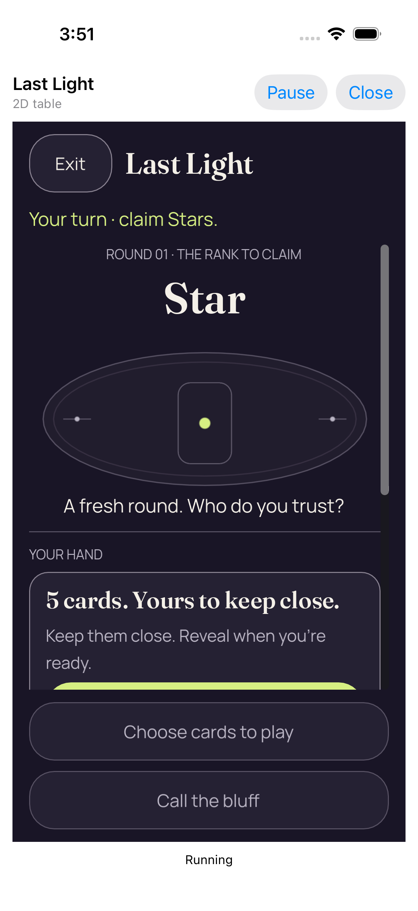</a> | **01 concealed 2d text 1** iPhone 17 simulator, iOS runtime 26.4.1, actual native Last Light authority host Original: [E258BAD9-A689-4C14-AD2E-4042E2F7A215.png](attachments/E258BAD9-A689-4C14-AD2E-4042E2F7A215.png) 1206 × 2622 px; text 1× SHA-256: <code>d645b9c8919a3ded815f348f846056b19a69bc6d8b83b10c84b5a014d3910f23</code> [Original measurements](attachments/0385D1DF-7F8B-4388-A78C-98FFA488C34D.json) This checkpoint belongs to an overall failed reference-match test. No native reference match reaches the winner or completed match teardown in this run. Initial round-1 Star table, Ari’s turn, five own cards concealed, zero private faces/labels/selection and zero accepted gameplay intents. Only the upper seven logical points of Reveal are visible. Original rect [32,538,306,56] ends at y=594; clip [16,118,346,427] ends at y=545. The remaining 49 points/147 pixels are clipped. Later scrolling exposes the complete button. |
| <a href="attachments/16B907EE-B799-45B4-A011-3E1B69C5A88A.png">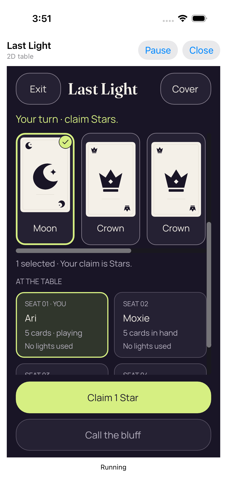</a> | **02 revealed and selected 2d text 1** iPhone 17 simulator, iOS runtime 26.4.1, actual native Last Light authority host Original: [16B907EE-B799-45B4-A011-3E1B69C5A88A.png](attachments/16B907EE-B799-45B4-A011-3E1B69C5A88A.png) 1206 × 2622 px; text 1× SHA-256: <code>b9be42039dea261ee61966ee6f5e339f830f2a708fcf1c23f3b918e2fda30375</code> [Original measurements](attachments/943BF0C1-1669-4E13-95E2-C721C2B766E0.json) This checkpoint belongs to an overall failed reference-match test. No native reference match reaches the winner or completed match teardown in this run. Moon is selected for a one-Star claim. The paired metrics retain five private faces, one selected card and five private labels in 2D or six in 3D; no authority gameplay intent has been accepted yet. |
| <a href="attachments/B5C79E5A-58A3-4126-9591-4AE62A6B9DB5.png">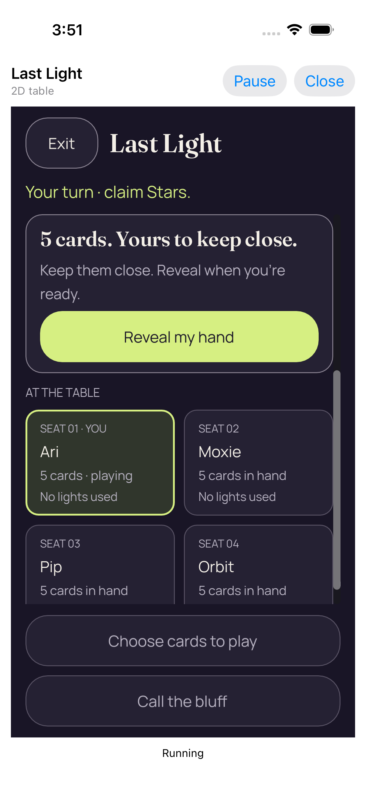</a> | **03 private bindings cleared 2d text 1** iPhone 17 simulator, iOS runtime 26.4.1, actual native Last Light authority host Original: [B5C79E5A-58A3-4126-9591-4AE62A6B9DB5.png](attachments/B5C79E5A-58A3-4126-9591-4AE62A6B9DB5.png) 1206 × 2622 px; text 1× SHA-256: <code>30062405746a7545b606927de45e428b50a8e571f125a367e1dc5fd9c39c792c</code> [Original measurements](attachments/C8CE9D08-504E-4C58-8D65-34AA1F2C3769.json) This checkpoint belongs to an overall failed reference-match test. No native reference match reaches the winner or completed match teardown in this run. Actual Hide/Cover clears private faces, private labels and selection without advancing the authority. The concealed hand and available Reveal/Show action remain visible. |
|  | **Native cover with paused private bindings cleared** iPhone 17 simulator, iOS runtime 26.4.1, actual native Last Light authority host Original: [C7886308-DCDA-4E2D-B237-B91A7778BAA7.png](attachments/C7886308-DCDA-4E2D-B237-B91A7778BAA7.png) 1206 × 2622 px; text 1× SHA-256: <code>00ebfdbbff0c3bad97176fa3690019ca760af13e37deb3158cb16aaaa7a2083c</code> [Original measurements](attachments/AAAC69B1-4F79-4875-BCFB-0297469E84FF.json) This checkpoint belongs to an overall failed reference-match test. No native reference match reaches the winner or completed match teardown in this run. The actual native cover completely hides the engine surface. Paired metrics report paused state, stopped render loop and zero private faces, labels and selection; the original test also checks that iterations stop during its pause interval. |
|  | **Actual home screen while game is backgrounded** iPhone 17 simulator, iOS runtime 26.4.1, actual native Last Light authority host Original: [85F7E477-DBC7-49DC-8EED-665722E54686.png](attachments/85F7E477-DBC7-49DC-8EED-665722E54686.png) 1206 × 2622 px; text 1× SHA-256: <code>943876bca8875c0335f3c4b0d62b0822cd95253ea52ba52bf80c097d3ff43776</code> This checkpoint belongs to an overall failed reference-match test. No native reference match reaches the winner or completed match teardown in this run. Original iOS Home screen captured after reveal/selection and an actual successful background-state wait. This is retained lifecycle evidence, not pre-install preparation. The test attaches no separate metrics JSON to this Home image. |
|  | **Same authority resumed with concealed cards** iPhone 17 simulator, iOS runtime 26.4.1, actual native Last Light authority host Original: [CF154979-89EF-4DA1-BCF7-54BC15BD3E09.png](attachments/CF154979-89EF-4DA1-BCF7-54BC15BD3E09.png) 1206 × 2622 px; text 1× SHA-256: <code>20ef429fb21ff4acbb9fb4cf4e571060ef909eb865b33ef3ae072b9188da3d18</code> [Original measurements](attachments/9BA17C0D-FCC1-4D62-AB55-0AC8AE46AAB8.json) This checkpoint belongs to an overall failed reference-match test. No native reference match reaches the winner or completed match teardown in this run. The original test reactivates the same authority after Home. Revision remains 0, bootstrap count remains 1 and the presentation identity is preserved; private faces, labels and selection are zero. This does not establish App Switcher snapshot coverage. |
| <a href="attachments/F39CA620-A327-4F1F-951E-4791D120DCAE.png">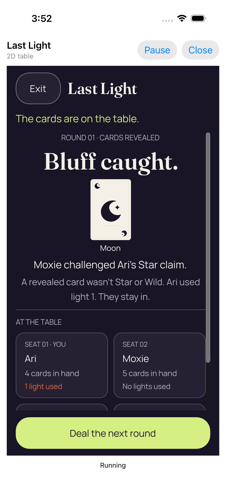</a> | **04 actual viewer play 2d text 1** iPhone 17 simulator, iOS runtime 26.4.1, actual native Last Light authority host Original: [F39CA620-A327-4F1F-951E-4791D120DCAE.png](attachments/F39CA620-A327-4F1F-951E-4791D120DCAE.png) 1206 × 2622 px; text 1× SHA-256: <code>b5f437fb1f2153bff89308ed89475e9b978671b58c3e8cb494bc80b8ceb57b4b</code> [Original measurements](attachments/C6C228DB-958A-4C0B-B2F7-FBFE77D12F18.json) This checkpoint belongs to an overall failed reference-match test. No native reference match reaches the winner or completed match teardown in this run. An actual accepted viewer play is followed by Moxie challenging Ari’s one-Star claim. Public Moon catches the bluff; Ari uses light 1 and stays in. Authority revision 2/round 1, one viewer play, zero viewer challenges and zero round advances. Both original stage captures remain separate. |
|  | **05 public outcome 2d text 1** iPhone 17 simulator, iOS runtime 26.4.1, actual native Last Light authority host Original: [10C3F276-7EC4-490B-9431-646ED9290637.png](attachments/10C3F276-7EC4-490B-9431-646ED9290637.png) 1206 × 2622 px; text 1× SHA-256: <code>b5f437fb1f2153bff89308ed89475e9b978671b58c3e8cb494bc80b8ceb57b4b</code> [Original measurements](attachments/E690F03E-0324-4E72-8470-46E753CD556B.json) This checkpoint belongs to an overall failed reference-match test. No native reference match reaches the winner or completed match teardown in this run. An actual accepted viewer play is followed by Moxie challenging Ari’s one-Star claim. Public Moon catches the bluff; Ari uses light 1 and stays in. Authority revision 2/round 1, one viewer play, zero viewer challenges and zero round advances. Both original stage captures remain separate. |
| <a href="attachments/05D84B71-0663-495D-BEC5-F9434C5BE92D.png">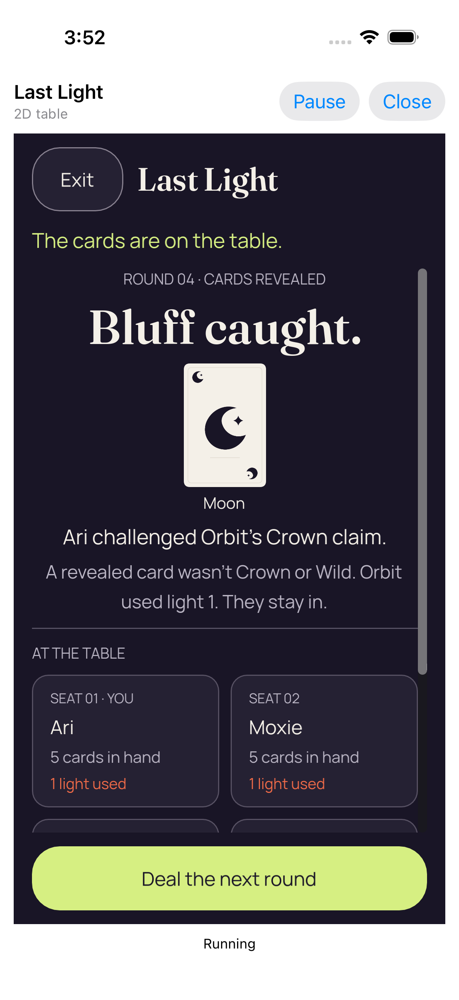</a> | **06 actual viewer challenge 2d text 1** iPhone 17 simulator, iOS runtime 26.4.1, actual native Last Light authority host Original: [05D84B71-0663-495D-BEC5-F9434C5BE92D.png](attachments/05D84B71-0663-495D-BEC5-F9434C5BE92D.png) 1206 × 2622 px; text 1× SHA-256: <code>0a374018dcda782b4d7e308a6217e4d4b407473816197ee23046b74a10c1ebfd</code> [Original measurements](attachments/6C38CFC6-3032-4894-B042-ACB630A78CCA.json) This checkpoint belongs to an overall failed reference-match test. No native reference match reaches the winner or completed match teardown in this run. Ari challenges Orbit’s Crown claim; public Moon catches the bluff. Orbit uses light 1 and stays in. The original measurements record one play, one challenge and three advances at round 4/revision 11. |
| <a href="attachments/D4C77069-04CF-4C23-B658-56178786A1AA.png">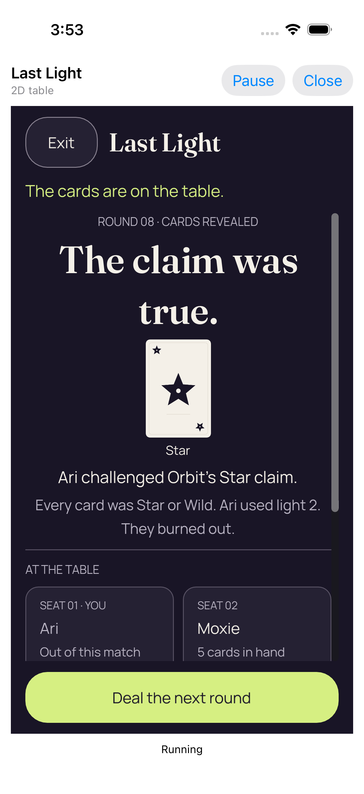</a> | **Failed authority wait** iPhone 17 simulator, iOS runtime 26.4.1, actual native Last Light authority host Original: [D4C77069-04CF-4C23-B658-56178786A1AA.png](attachments/D4C77069-04CF-4C23-B658-56178786A1AA.png) 1206 × 2622 px; text 1× SHA-256: <code>798f6deeec49e5468a9b2d5350625df3c6a7323f3d4079aae8f60f93f3c03078</code> [Original measurements](attachments/558CD4BC-5079-4100-89C0-01F364D8AD39.json) This checkpoint belongs to an overall failed reference-match test. No native reference match reaches the winner or completed match teardown in this run. Round 8/revision 23: Ari challenges Orbit’s Star claim; public Star makes it truthful, so Ari uses light 2 and burns out. The complete Next action is visible. Two plays, two challenges and seven advances have been accepted; the eighth advance does not occur. The recorded tap used Next rect [16,557,346,56] at diagnostic sequence 164. Later same-revision sequence 190 reports [16,623,346,56], so the earlier center is outside the later button. The engine remains READY/running through 3314 iterations with no terminal failure or outstanding diagnostics; a persistent authority defect is not established. |

## 3D — 200% text

| Original image | Scenario and provenance |
| --- | --- |
| <a href="attachments/A6D643BB-D00C-4B28-87DF-C113EC30AEDC.png">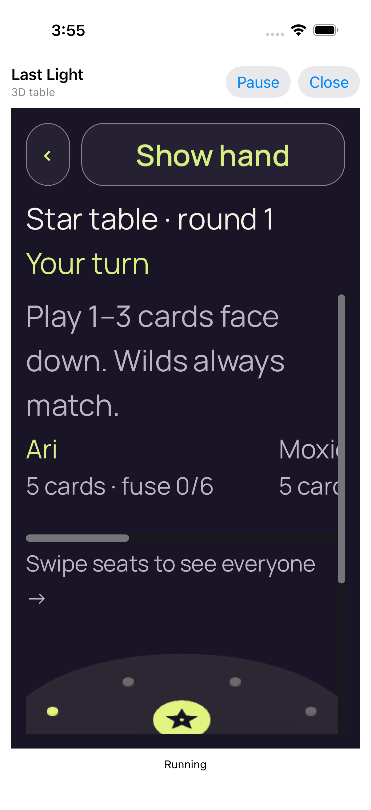</a> | **01 concealed 3d text 2** iPhone 17 simulator, iOS runtime 26.4.1, actual native Last Light authority host Original: [A6D643BB-D00C-4B28-87DF-C113EC30AEDC.png](attachments/A6D643BB-D00C-4B28-87DF-C113EC30AEDC.png) 1206 × 2622 px; text 2× SHA-256: <code>626f5b5309ed06d32b71d03acc0becf3bcb818ef4b345003f1442dd28140679a</code> [Original measurements](attachments/ADC46867-E47B-46D2-B909-CF8C4DFC2688.json) This checkpoint belongs to an overall failed reference-match test. No native reference match reaches the winner or completed match teardown in this run. Initial round-1 Star table, Ari’s turn, five own cards concealed, zero private faces/labels/selection and zero accepted gameplay intents. The enlarged Show hand, current rank/round and actor fit above scrollable content; most of the table/hand is below this initial viewport. |
| <a href="attachments/2AEC4A3B-6615-4AFA-A0CB-7EF49BCC45B9.png">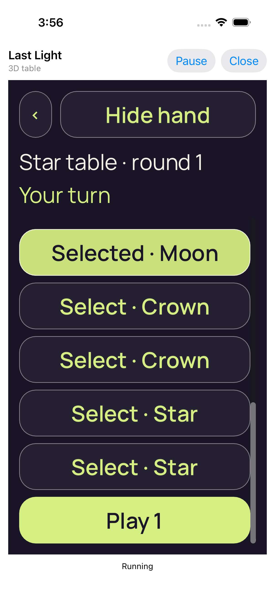</a> | **02 revealed and selected 3d text 2** iPhone 17 simulator, iOS runtime 26.4.1, actual native Last Light authority host Original: [2AEC4A3B-6615-4AFA-A0CB-7EF49BCC45B9.png](attachments/2AEC4A3B-6615-4AFA-A0CB-7EF49BCC45B9.png) 1206 × 2622 px; text 2× SHA-256: <code>ed8ccd761078eda692bccb9dced5f4a746369f75571b1f74462719ec2e5e511f</code> [Original measurements](attachments/8D1E018D-1D3F-47D0-8DFF-A4F3773F249F.json) This checkpoint belongs to an overall failed reference-match test. No native reference match reaches the winner or completed match teardown in this run. Moon is selected for a one-Star claim. The paired metrics retain five private faces, one selected card and five private labels in 2D or six in 3D; no authority gameplay intent has been accepted yet. All five enlarged rank actions and the complete Play 1 action are visible after scrolling. |
| <a href="attachments/B9A55227-017B-40E4-823F-2332ACE3BF63.png">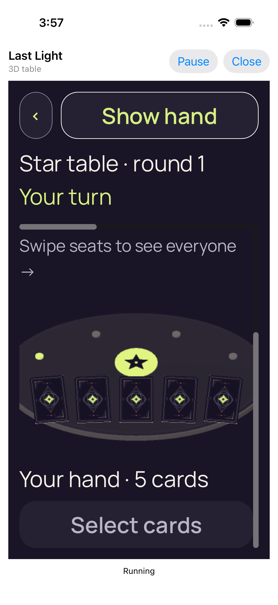</a> | **03 private bindings cleared 3d text 2** iPhone 17 simulator, iOS runtime 26.4.1, actual native Last Light authority host Original: [B9A55227-017B-40E4-823F-2332ACE3BF63.png](attachments/B9A55227-017B-40E4-823F-2332ACE3BF63.png) 1206 × 2622 px; text 2× SHA-256: <code>d1a0360c9067ea83e091fe44bc0baf4c22bc747b8c366da6cdcf62bed43917db</code> [Original measurements](attachments/D9B82D2A-2766-4AA9-BDDB-800CA1312669.json) This checkpoint belongs to an overall failed reference-match test. No native reference match reaches the winner or completed match teardown in this run. Actual Hide/Cover clears private faces, private labels and selection without advancing the authority. The concealed hand and available Reveal/Show action remain visible. |
| <a href="attachments/523527B0-4156-4925-9973-BEEF3CFB9184.png">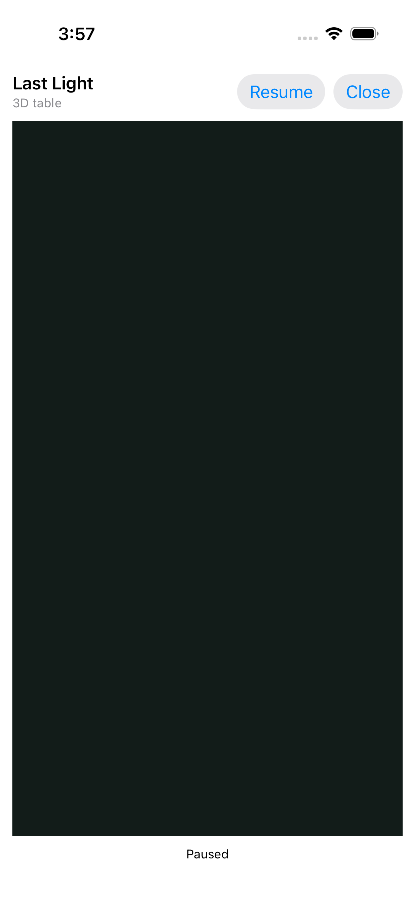</a> | **Native cover with paused private bindings cleared** iPhone 17 simulator, iOS runtime 26.4.1, actual native Last Light authority host Original: [523527B0-4156-4925-9973-BEEF3CFB9184.png](attachments/523527B0-4156-4925-9973-BEEF3CFB9184.png) 1206 × 2622 px; text 2× SHA-256: <code>83fcafe0edef4fbaafdde3c8bcdfe4eb95e686fa21f550aed7be11998cc8cb90</code> [Original measurements](attachments/D8BC9757-9258-4024-B6B2-64171D49D4DE.json) This checkpoint belongs to an overall failed reference-match test. No native reference match reaches the winner or completed match teardown in this run. The actual native cover completely hides the engine surface. Paired metrics report paused state, stopped render loop and zero private faces, labels and selection; the original test also checks that iterations stop during its pause interval. |
| <a href="attachments/7734C09D-9B88-4910-A527-B0D06CC4A934.png">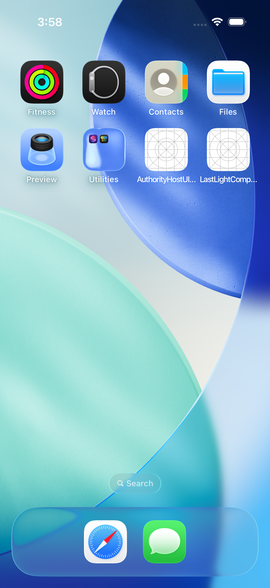</a> | **Actual home screen while game is backgrounded** iPhone 17 simulator, iOS runtime 26.4.1, actual native Last Light authority host Original: [7734C09D-9B88-4910-A527-B0D06CC4A934.png](attachments/7734C09D-9B88-4910-A527-B0D06CC4A934.png) 1206 × 2622 px; text 2× SHA-256: <code>672f3aee3f60082772bfebc18e2ed9db23b24f54349fcc752e3be8c1ee9f7702</code> This checkpoint belongs to an overall failed reference-match test. No native reference match reaches the winner or completed match teardown in this run. Original iOS Home screen captured after reveal/selection and an actual successful background-state wait. This is retained lifecycle evidence, not pre-install preparation. The test attaches no separate metrics JSON to this Home image. |
|  | **Same authority resumed with concealed cards** iPhone 17 simulator, iOS runtime 26.4.1, actual native Last Light authority host Original: [E5605DB5-D092-479C-A2A1-F46009D77176.png](attachments/E5605DB5-D092-479C-A2A1-F46009D77176.png) 1206 × 2622 px; text 2× SHA-256: <code>0c7d7d7d51a00cbff5680418194519fe88385737cc4f3d5e6676887251bb347b</code> [Original measurements](attachments/E26DF816-69F6-489E-A41F-32343B72EC91.json) This checkpoint belongs to an overall failed reference-match test. No native reference match reaches the winner or completed match teardown in this run. The original test reactivates the same authority after Home. Revision remains 0, bootstrap count remains 1 and the presentation identity is preserved; private faces, labels and selection are zero. This does not establish App Switcher snapshot coverage. |
| <a href="attachments/5DF38D00-6B40-4FD0-B7FD-EC3E031DF611.png">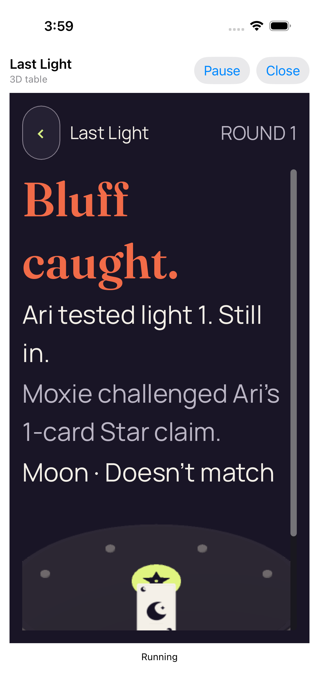</a> | **04 actual viewer play 3d text 2** iPhone 17 simulator, iOS runtime 26.4.1, actual native Last Light authority host Original: [5DF38D00-6B40-4FD0-B7FD-EC3E031DF611.png](attachments/5DF38D00-6B40-4FD0-B7FD-EC3E031DF611.png) 1206 × 2622 px; text 2× SHA-256: <code>86c1f077fcba02c8ea3c95e78dd38ef2222d45e58a6aad2e5575848258e2d584</code> [Original measurements](attachments/FF8BB570-1179-43F8-A395-23ACB0CC0932.json) This checkpoint belongs to an overall failed reference-match test. No native reference match reaches the winner or completed match teardown in this run. An actual accepted viewer play is followed by Moxie challenging Ari’s one-Star claim. Public Moon catches the bluff; Ari uses light 1 and stays in. Authority revision 2/round 1, one viewer play, zero viewer challenges and zero round advances. Both original stage captures remain separate. The enlarged result text is visible, while the public card/table and continuation continue below this initial viewport. A later original app stream reaches round 2/revision 5 after one accepted advance; that later state has no dedicated PNG. |
|  | **05 public outcome 3d text 2** iPhone 17 simulator, iOS runtime 26.4.1, actual native Last Light authority host Original: [C02D9609-3004-4D42-A1C3-D509F8C8C6A0.png](attachments/C02D9609-3004-4D42-A1C3-D509F8C8C6A0.png) 1206 × 2622 px; text 2× SHA-256: <code>86c1f077fcba02c8ea3c95e78dd38ef2222d45e58a6aad2e5575848258e2d584</code> [Original measurements](attachments/1D333EBC-0C7A-4CAA-959A-383857C90670.json) This checkpoint belongs to an overall failed reference-match test. No native reference match reaches the winner or completed match teardown in this run. An actual accepted viewer play is followed by Moxie challenging Ari’s one-Star claim. Public Moon catches the bluff; Ari uses light 1 and stays in. Authority revision 2/round 1, one viewer play, zero viewer challenges and zero round advances. Both original stage captures remain separate. The enlarged result text is visible, while the public card/table and continuation continue below this initial viewport. A later original app stream reaches round 2/revision 5 after one accepted advance; that later state has no dedicated PNG. |

## 3D — 100% text

| Original image | Scenario and provenance |
| --- | --- |
| <a href="attachments/7804D23F-03A3-4603-A0D0-6B047ABD770C.png">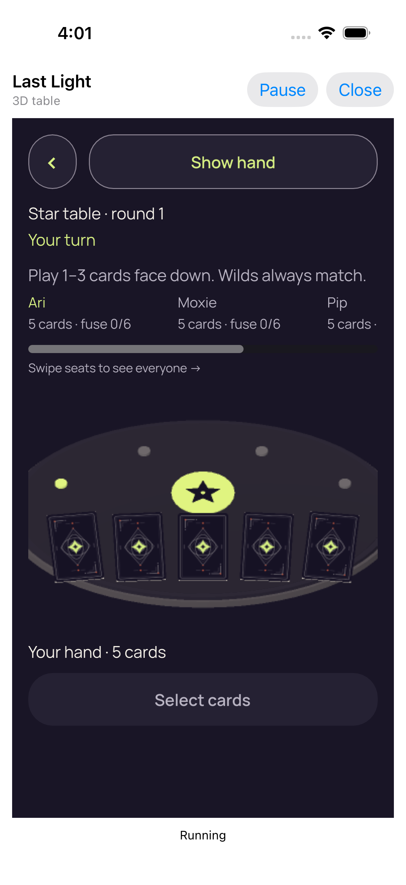</a> | **01 concealed 3d text 1** iPhone 17 simulator, iOS runtime 26.4.1, actual native Last Light authority host Original: [7804D23F-03A3-4603-A0D0-6B047ABD770C.png](attachments/7804D23F-03A3-4603-A0D0-6B047ABD770C.png) 1206 × 2622 px; text 1× SHA-256: <code>e2f88410298b375eacacfd49d5dbf959519ab604346fb3965cf03c6f9c7f19c9</code> [Original measurements](attachments/FF01A692-1962-4B0F-89E4-4239413A273F.json) This checkpoint belongs to an overall failed reference-match test. No native reference match reaches the winner or completed match teardown in this run. Initial round-1 Star table, Ari’s turn, five own cards concealed, zero private faces/labels/selection and zero accepted gameplay intents. |
| <a href="attachments/E18ADFA6-6D68-4F8E-B514-540250AB79AC.png">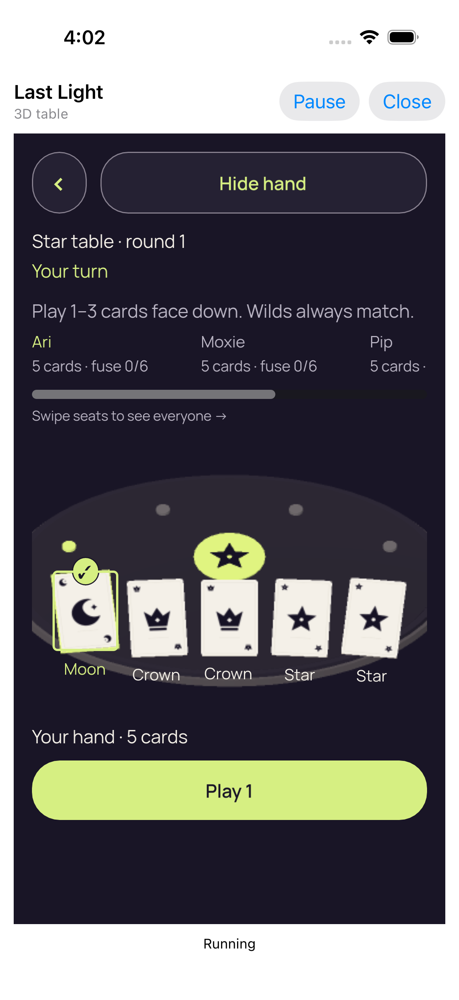</a> | **02 revealed and selected 3d text 1** iPhone 17 simulator, iOS runtime 26.4.1, actual native Last Light authority host Original: [E18ADFA6-6D68-4F8E-B514-540250AB79AC.png](attachments/E18ADFA6-6D68-4F8E-B514-540250AB79AC.png) 1206 × 2622 px; text 1× SHA-256: <code>06ea0c50815d3e3282ae52083c8225d5a7335adaeef72101ddfe6688bbd25e61</code> [Original measurements](attachments/20710EFC-B231-49F2-A29A-B16BA65F5711.json) This checkpoint belongs to an overall failed reference-match test. No native reference match reaches the winner or completed match teardown in this run. Moon is selected for a one-Star claim. The paired metrics retain five private faces, one selected card and five private labels in 2D or six in 3D; no authority gameplay intent has been accepted yet. |
| <a href="attachments/78669BAA-B76D-47ED-974E-3FE8CB14501C.png">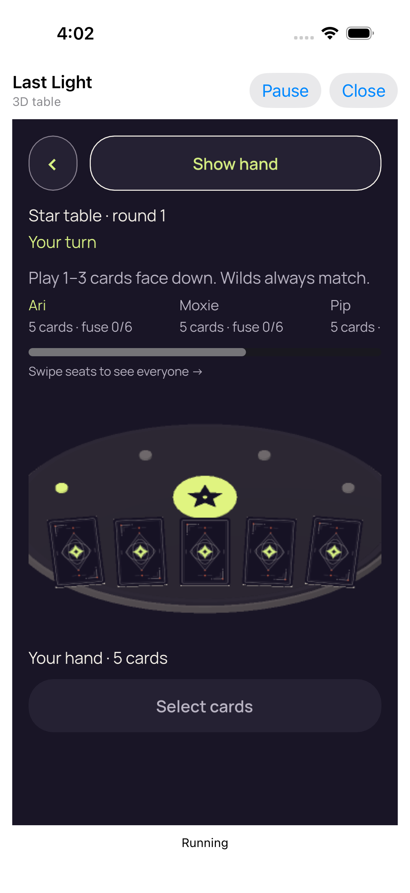</a> | **03 private bindings cleared 3d text 1** iPhone 17 simulator, iOS runtime 26.4.1, actual native Last Light authority host Original: [78669BAA-B76D-47ED-974E-3FE8CB14501C.png](attachments/78669BAA-B76D-47ED-974E-3FE8CB14501C.png) 1206 × 2622 px; text 1× SHA-256: <code>6da22a510652764f55e4d5822fde568bcab40aa562bfe8be579f86bc5575e43f</code> [Original measurements](attachments/AE80CA79-2D60-4F79-A9F1-113970CEF586.json) This checkpoint belongs to an overall failed reference-match test. No native reference match reaches the winner or completed match teardown in this run. Actual Hide/Cover clears private faces, private labels and selection without advancing the authority. The concealed hand and available Reveal/Show action remain visible. |
| <a href="attachments/0C376300-9D19-4543-A77A-50045E3049EB.png">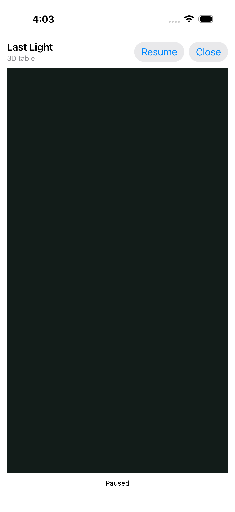</a> | **Native cover with paused private bindings cleared** iPhone 17 simulator, iOS runtime 26.4.1, actual native Last Light authority host Original: [0C376300-9D19-4543-A77A-50045E3049EB.png](attachments/0C376300-9D19-4543-A77A-50045E3049EB.png) 1206 × 2622 px; text 1× SHA-256: <code>584a7b96340b2c684813142e024b86c313c1f2249e3fe01cf4a9d36b74cc77e1</code> [Original measurements](attachments/EC478D4F-300D-47CF-80B3-86C0E062BDC3.json) This checkpoint belongs to an overall failed reference-match test. No native reference match reaches the winner or completed match teardown in this run. The actual native cover completely hides the engine surface. Paired metrics report paused state, stopped render loop and zero private faces, labels and selection; the original test also checks that iterations stop during its pause interval. |

## Secure default renderer exit

| Original image | Scenario and provenance |
| --- | --- |
| <a href="attachments/8E96D544-137A-4B2C-BE65-00F673109831.png">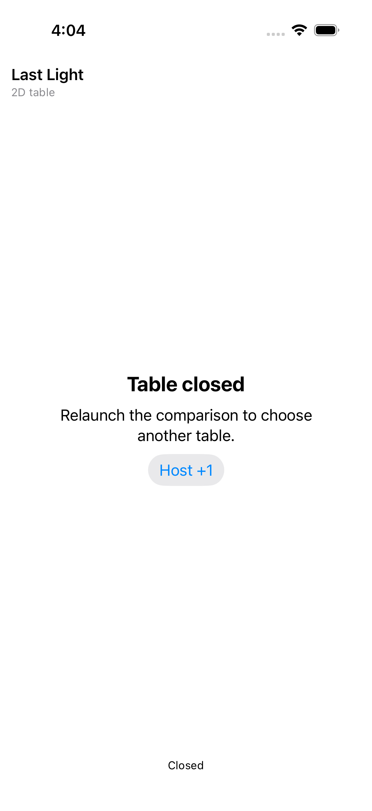</a> | **Secure default table exited through Godot input** iPhone 17 simulator, iOS runtime 26.4.1, actual native Last Light authority host Original: [8E96D544-137A-4B2C-BE65-00F673109831.png](attachments/8E96D544-137A-4B2C-BE65-00F673109831.png) 1206 × 2622 px; text 1× SHA-256: <code>2a5830d10a2875e7db1bd524ac8bc8ab43c9b8e5e5d4d221b671320ba9e34437</code> [Original measurements](attachments/94F4E67E-5772-4055-9556-471A0192C3E7.json) This secure default launch-and-exit test passes, with referenceSeed2=false. Actual Godot Exit produces EXIT_REQUESTED; authority, native controller/view and singleton are released, cleanup runs once, queues empty and idle-timer policy restores. Host +1 increments to 1. No full match or same-process re-entry is established. |
