# Godot iOS authority host — normal matches pass; both 200% cases fail

[All screenshot collections](../README.md) · [CI run 34439760695](https://github.com/Apdelrahman1911/PartyDeck/actions/runs/34439760695) · [Previous authority run](../godot-ios-authority-34434392993/README.md)

**Evidence status: both normal-text reference matches and secure default renderer Exit pass; both 200% reference tests fail.** The actual Swift host calls the Kotlin authority framework and receives real Godot input. The [original XCTest log](evidence/authority-host-test.log) records three passing and two failing cases, ending with TEST FAILED. The final runner’s two-test subtotal does not replace that five-case aggregate.

| Test | Original PNGs | Actual result and stopping point |
| --- | ---: | --- |
| 2D / 100% | 11 | Actual Home, same-presentation concealed resume, the full seed-2 match, Orbit’s round-14 win and ReturnToLobby cleanup pass. Initial Reveal still clips by 49 logical points. |
| 2D / 200% | 8 | One viewer play at round 1/revision 2; zero advances and no Next tap. Three native scrolls and five geometry changes exhaust the shared eight-iteration quota. The last Next rect fits, but no further stable observation is reached before scrollBound. |
| 3D / 100% | 11 | Actual Home, same-presentation concealed resume, the full seed-2 match, Orbit’s round-14 win and ReturnToLobby cleanup pass. |
| 3D / 200% | 5 | Reveal/select/hide and opaque manual pause pass. Actual Home UI appears within the 20-second deadline, but the frozen state predicate still reads foreground (4) and fails. No completed Home resume or gameplay intent. |
| Secure default renderer Exit | 1 | Actual Godot Exit passes with released authority/controller/view, one cleanup, empty queues, restored idle timer and responsive Host +1. The case uses the secure default seed and has no gameplay intents. |

Exact CI revision `f85f8158054ab70cc3f981c23a6854bb7b0630b6`. [Simulator metadata](evidence/authority-simulator.json) records iPhone 17, runtime 26.4.1 and SDK 26.4; [Xcode](evidence/authority-host-xcode-version.log) is 26.4.1 (17E202). Original PNGs are 1206 × 2622 pixels at display scale 3. Open scenes report 378 × 691 UIKit/logical engine points. Actual drawing uses `GDTOpenGLLayer`, OpenGL ES 3.0 Compatibility / Apple Software Renderer. All **33 paired measurements** record `reduceMotion=false` and `soundEnabled=true` at the case’s 1.0/2.0 text scale.

The app executable is `12bd8a8c1e5798e06a257236a80186e36cefda9a7bb9f3b6d132b1cfb0e8762a` and its Mach-O UUID independently matches the [package audit](provenance/authority-package-evidence-summary.json). Fourteen of the 15 app-archive files, including all runtime payloads, are byte-identical to the preceding authority run. Only the bundled pack receipt differs, in staging paths, command timestamps and durations. The PCK remains `6599f825a418f9d2a7049b3ba9325e8e0dcb474685262899079231b7ec955938`, matching the [original receipt](provenance/partydeck-last-light.receipt.json). Framework and native archive identities, source hashes and app resources independently match their receipts. The previous CoreAudio startup abort did not reproduce; this rerun establishes no audio/runtime fix or audio-dormancy qualification. The original [build](evidence/authority-host-build-result.json) and [input](evidence/authority-host-inputs.json) receipts predate runtime execution, so their compile-only flags do not summarize these later native tests.

Both normal matches finish at round 14/revision 41 with Orbit (`seat-4`), two viewer plays, two challenges, thirteen advances and twenty-four opponent actions. Their winner PNGs visibly retain the Crown claim, public Moon and final named Moxie burnout explanation. Home/resume preserves the presentation ID and bootstrap count 1 while clearing private faces, labels and selection. Both ReturnToLobby receipts and secure Exit record cleanup 1/depth 0, released authority/controller/view, absent OS singleton and bridge, stopped render loop, empty queues, restored idle-timer policy and hostCounter 1. These are complete normal-text comparison-host matches; same-process re-entry and the production KMP app factory remain unqualified.

Normal 2D initial Reveal remains a visible defect: rect `[32,538,306,56]` ends at y=594, while clip `[16,118,346,427]` ends at y=545. Only seven of 56 logical points are visible; **49 points/147 pixels are clipped**. Later scrolling exposes the complete action. Passing the match script does not resolve that initial layout defect.

The two 2D/200% post-play/outcome originals show the **scrolled lower roster**, without a visible outcome title or public proof. Their paired measurements establish the round-1 outcome. The [later scroll review](review/2d-200-scroll-test-excerpts.log), independently checked against the original session and app stream, records three 234-point gestures at 500 pixels/s with no end hold. Five geometry changes also count against the shared eight-iteration quota. Last renderer sequence **66** (request/accepted-diagnostics 67) places Next `[16,341,338,72]` fully inside `[16,211,346,468]`. No further stable observation or Next tap occurs; the checker ends at `scrollBound`. The final engine remains running without a native failure. This does not establish persistent final clipping or authority rejection.

The 3D/200% [failure PNG](attachments/FC2F83FD-72AB-465A-838D-151A9F5A3829.png) visibly shows Home. The [original state receipt](attachments/993BB05F-9E38-4906-8951-B4F459DEC8B3.json) still reports `enteredBackground=false` and `observedApplicationState=4`; the frozen test therefore remains failed. Independently checked [original session bytes](runtime/data.0~dyVfldi0leQXH5a1-jC_zyxbfTj0hHxZn8diQaFH5i-_E4cr9r0FTKI3U1FLIzbZK3PE-BSqsmyB8pwKq_WmBg==.bin) and [numbered reviewer excerpts](review/3d-200-home-session-excerpts.log) establish this UTC chronology on 2026-09-10:

| Time | Retained original observation |
| --- | --- |
| 05:23:35.437–35.927 | Home press begins and synthesized input completes. |
| 05:23:36.326 | SpringBoard `SBRootFolderController` reports `ViewDidAppear`, within the deadline. |
| 05:23:37.196 / 37.231 | App scene, then switcher/deck, report disappearance. |
| 05:23:55.942 | The 20-second predicate receipt still reports foreground state 4 / false. |
| 05:23:55.976–56.290 | The retained Home screenshot is requested and completed. |
| 05:23:56.358647 | Original app-stream line 347486: paused, foreground false, opaque cover, stopped loop, zero private/selected bindings, iteration 631, bootstrap 1 and renderer sequence 134. |
| 05:23:57.091 / 57.101 | Runner PID 10373 exits 75; AuthorityHost PID 16826 is explicitly confirmed alive afterward. |

This run shows an XCTest state-observation discrepancy, with actual Home UI inside the deadline. Its cause remains unresolved. SpringBoard foreground alone is insufficient evidence of Home: the [separate notification-overlay counterexample](review/springboard-notification-counterexample.log) is retained. The previous run’s delayed Home and recording gap describe that earlier run only. No completed 3D/200% Home resume or full match is established here.

All **285 exported attachments and their original manifest** are retained: 36 PNGs, 33 paired measurement JSONs, 76 actual touch geometries, 82 observed-control records, two MP4s and the other original exports, including extensionless snapshots/events. Each exported file independently matches its raw or Zstandard-compressed xcresult object. Every actual touched control is recorded enabled/visible, at least 44 × 44 logical points and wholly inside its recorded clip and viewport; that verifies those taps, not every control in every state. The [full original app stream](runtime/app-stdout-stderr-001.log), three complete Xcode session payloads covering all five tests, and one [searchd crash payload](runtime/data.0~UpfryZbKO93rW2uhZhMht4m8qoJqc7fzR7dmjRbtP2s0Kq0xRet1UJcOo5juwhSe7UN9kHUXl98zPNuznIPMyw==.bin) are retained with their [decoded-object index](runtime/decoded-object-index.json). The crash is searchd PID 3616, not AuthorityHost. Five unsupported `mouse_get_position` severity lines remain in the [native excerpt](runtime/app-native-severity-excerpts.log); no general crash-immunity claim follows.

[Later independent diagnosis](review/final-native-diagnosis.json) · [Reviewer summary](review/native-review-summary.md) · [698 extracted metric rows](review/app-metrics.jsonl) · [Frozen audit inventory](provenance/audit-frozen.json) · [Later collection audit](provenance/evidence-summary.json) · [Original attachment manifest](attachments/manifest.json). Reviewer summaries, numbered excerpts, extracted metrics and the candidate test source were produced after the original execution. Their source provenance remains explicit. Large symbol/linker dumps and app binaries stay outside this gallery, with identities in the original receipts. Derived video frames and internal review sheets are not original captures.

The three successful Home/resume paths are the two normal matches and 2D/200%. Their Home PNGs have no separate paired measurement JSON. App Switcher snapshot coverage, same-process re-entry, native screen-reader traversal, audio dormancy, KMP app-factory integration and physical-device Metal acceptance remain open. Source: `/tmp/partydeck-engine-ci/34439760695/godot-ios-authority-gameplay/artifacts/authority-attachments`. Every thumbnail displays and opens its unchanged original PNG.

## 2D — 100% text

| Original image | Scenario and provenance |
| --- | --- |
| <a href="attachments/44A1649E-B20D-409F-831A-64EBCE70BD7D.png">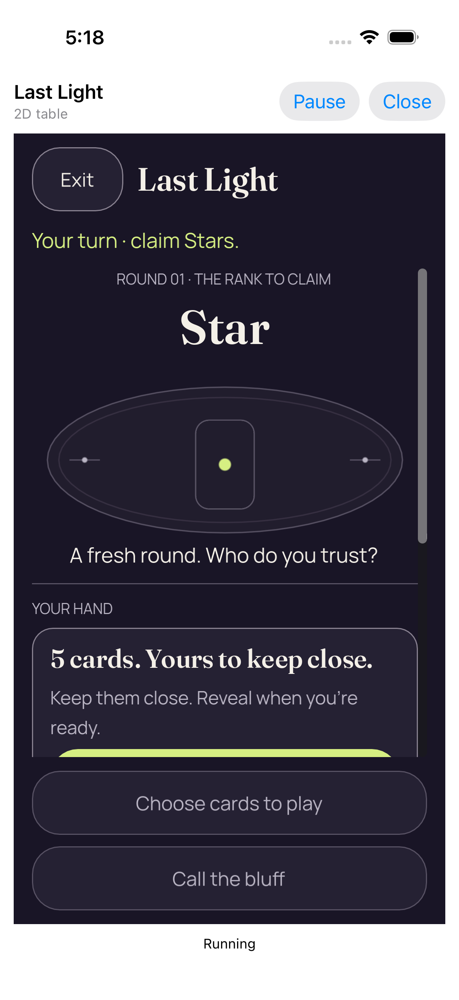</a> | **01 concealed 2d text 1** iPhone 17 simulator, runtime 26.4.1, actual native Last Light authority host Original: [44A1649E-B20D-409F-831A-64EBCE70BD7D.png](attachments/44A1649E-B20D-409F-831A-64EBCE70BD7D.png) 1206 × 2622 px; text 1× SHA-256: <code>26265cb1f1145bb02daddca6cc46bbf71af2c33d634866fb7b198e7e4ec6d335</code> [Original measurements](attachments/3983DF40-6B7D-4C03-81CB-EA73AB336DAB.json) The enclosing normal-text reference test passes actual Home, same-presentation concealed resume, the full seed-2 match and ReturnToLobby cleanup. This checkpoint remains distinct from the later final state. Round-1 Star table, Ari’s turn, five concealed own cards and zero private faces, labels or selection. No gameplay intent has been accepted. Only seven of Reveal’s 56 logical points are visible: rect [32,538,306,56], clip [16,118,346,427]. The remaining 49 points/147 pixels are clipped; later scrolling exposes the complete action. |
| <a href="attachments/10B6B361-9335-4447-AD4A-513839687946.png">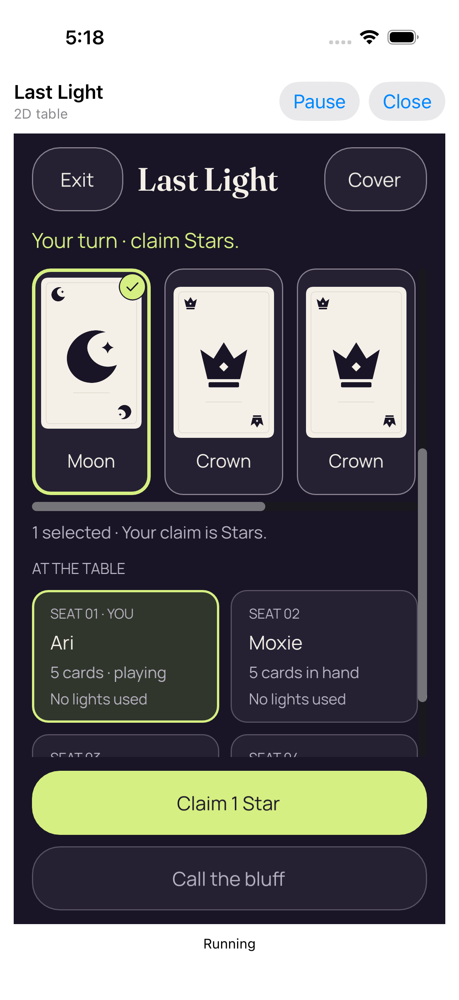</a> | **02 revealed and selected 2d text 1** iPhone 17 simulator, runtime 26.4.1, actual native Last Light authority host Original: [10B6B361-9335-4447-AD4A-513839687946.png](attachments/10B6B361-9335-4447-AD4A-513839687946.png) 1206 × 2622 px; text 1× SHA-256: <code>9077e4c3d1c6fcce3a7206c12492925bcebdd11ece75c2beafcb6096c0701d58</code> [Original measurements](attachments/6ACFBF7D-8564-4188-9821-43658BDC4AE0.json) The enclosing normal-text reference test passes actual Home, same-presentation concealed resume, the full seed-2 match and ReturnToLobby cleanup. This checkpoint remains distinct from the later final state. Actual touch reveals the five-card hand and selects Moon for a one-Star claim. Paired metrics retain five private faces, one selected card, and five private labels in 2D or six in 3D; no authority gameplay intent has been accepted yet. |
| <a href="attachments/9F9E5A9D-D8FF-4C6F-B16F-C6B9AF77BC5F.png">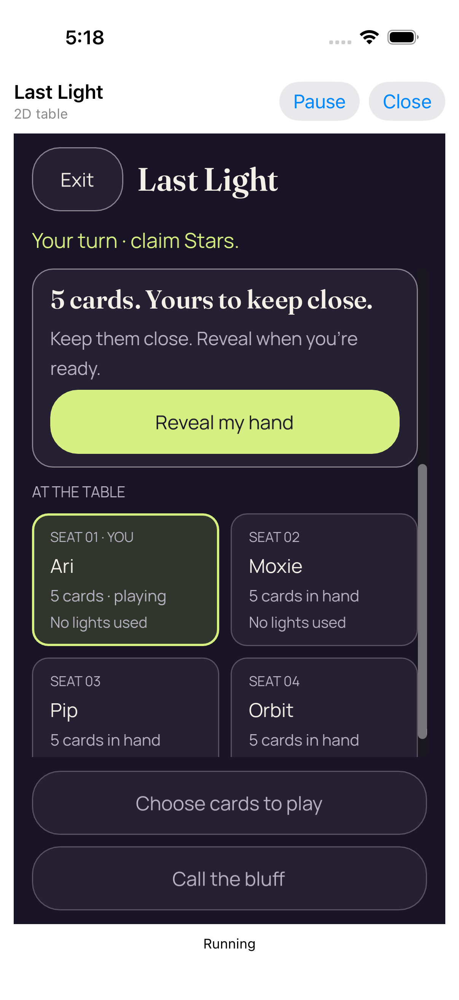</a> | **03 private bindings cleared 2d text 1** iPhone 17 simulator, runtime 26.4.1, actual native Last Light authority host Original: [9F9E5A9D-D8FF-4C6F-B16F-C6B9AF77BC5F.png](attachments/9F9E5A9D-D8FF-4C6F-B16F-C6B9AF77BC5F.png) 1206 × 2622 px; text 1× SHA-256: <code>a4c132216cc54102307508428547a1d780541fa65bc4a39ad443511d43a70a4e</code> [Original measurements](attachments/29848433-BBE6-4E4F-A17F-FFE22DFC25B6.json) The enclosing normal-text reference test passes actual Home, same-presentation concealed resume, the full seed-2 match and ReturnToLobby cleanup. This checkpoint remains distinct from the later final state. Actual Hide clears private faces, private labels and selection without advancing the authority. The own hand returns to its concealed state. |
|  | **Native cover with paused private bindings cleared** iPhone 17 simulator, runtime 26.4.1, actual native Last Light authority host Original: [620F69A4-5140-4BEF-9EFF-E16925FA61A8.png](attachments/620F69A4-5140-4BEF-9EFF-E16925FA61A8.png) 1206 × 2622 px; text 1× SHA-256: <code>45f0b0f28a3fa18ad6f5521693e1ed6f861c12d372acb94ff838c22527bbaf21</code> [Original measurements](attachments/57A1440B-7818-4C76-891C-CCD125ACAAE9.json) The enclosing normal-text reference test passes actual Home, same-presentation concealed resume, the full seed-2 match and ReturnToLobby cleanup. This checkpoint remains distinct from the later final state. The native cover visibly hides the complete engine surface. Paired measurements report paused state, stopped render loop and zero private faces, labels or selection; the test checks that iterations stop during the explicit pause interval. |
|  | **Actual home screen while game is backgrounded** iPhone 17 simulator, runtime 26.4.1, actual native Last Light authority host Original: [2C58BC1A-3823-41F8-938A-096348A7CB0D.png](attachments/2C58BC1A-3823-41F8-938A-096348A7CB0D.png) 1206 × 2622 px; text 1× SHA-256: <code>116ddff07283823357cd518a9b96d1054238f1acee9cb12a096b23fe610992da</code> The enclosing normal-text reference test passes actual Home, same-presentation concealed resume, the full seed-2 match and ReturnToLobby cleanup. This checkpoint remains distinct from the later final state. Original Home capture after an actual successful background-state wait. This is exercised lifecycle evidence, with no separately paired measurement attachment; the same test subsequently resumes concealed. |
| <a href="attachments/F31957A5-1740-43BC-AEEF-2B84E3AC4364.png">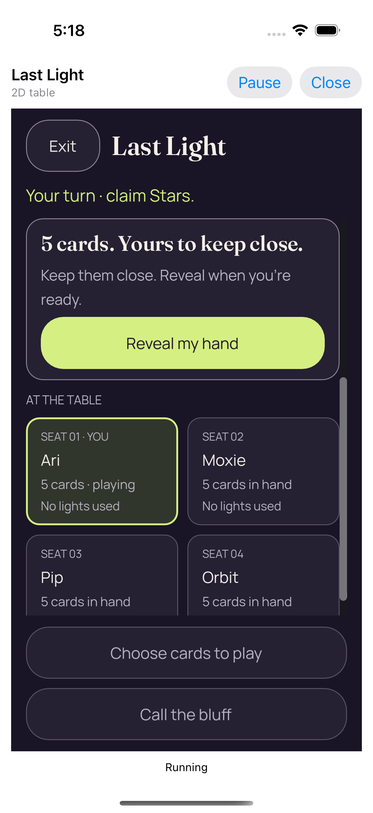</a> | **Same authority resumed with concealed cards** iPhone 17 simulator, runtime 26.4.1, actual native Last Light authority host Original: [F31957A5-1740-43BC-AEEF-2B84E3AC4364.png](attachments/F31957A5-1740-43BC-AEEF-2B84E3AC4364.png) 1206 × 2622 px; text 1× SHA-256: <code>dd70583643cbf36ad5526bf69027ea75bee063b961b6df0a447dcd40e4c77102</code> [Original measurements](attachments/B0DD0235-E419-4DC1-87A0-1FB7DE1A468D.json) The enclosing normal-text reference test passes actual Home, same-presentation concealed resume, the full seed-2 match and ReturnToLobby cleanup. This checkpoint remains distinct from the later final state. After Home, the same presentation/authority resumes at revision 0 with bootstrap count 1. Private faces, private labels and selection are zero. This is resume of the existing presentation, not a new engine entry. |
|  | **04 actual viewer play 2d text 1** iPhone 17 simulator, runtime 26.4.1, actual native Last Light authority host Original: [F41AC090-51F1-4B90-9ECF-87176C07357E.png](attachments/F41AC090-51F1-4B90-9ECF-87176C07357E.png) 1206 × 2622 px; text 1× SHA-256: <code>c85a18821a3a07a12e1c4d51acd6edadf1e3e88bd97fd8d0497b56e07088190e</code> [Original measurements](attachments/9D5EF1F8-AEB6-4A3C-A8A0-2F8F70766E32.json) The enclosing normal-text reference test passes actual Home, same-presentation concealed resume, the full seed-2 match and ReturnToLobby cleanup. This checkpoint remains distinct from the later final state. Moxie challenges Ari’s one-Star claim; the public Moon catches the bluff, Ari uses light 1 and stays in. Paired authority measurements record round 1/revision 2, one viewer play, zero viewer challenges and zero advances. Repeated checkpoint pixels remain separate originals. |
| <a href="attachments/B438F195-D373-4204-A581-9C6581F608BD.png">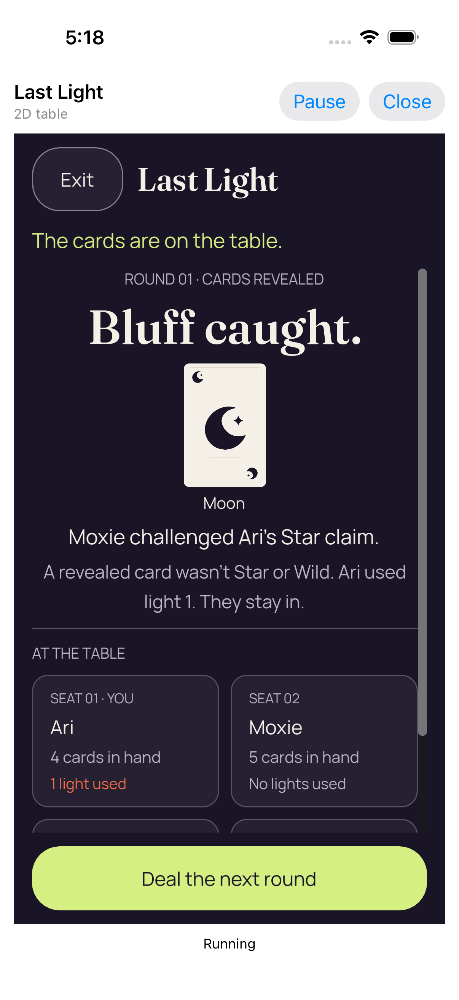</a> | **05 public outcome 2d text 1** iPhone 17 simulator, runtime 26.4.1, actual native Last Light authority host Original: [B438F195-D373-4204-A581-9C6581F608BD.png](attachments/B438F195-D373-4204-A581-9C6581F608BD.png) 1206 × 2622 px; text 1× SHA-256: <code>c85a18821a3a07a12e1c4d51acd6edadf1e3e88bd97fd8d0497b56e07088190e</code> [Original measurements](attachments/CAB7A9E5-B212-425A-BE0A-C1919A3AB6BC.json) The enclosing normal-text reference test passes actual Home, same-presentation concealed resume, the full seed-2 match and ReturnToLobby cleanup. This checkpoint remains distinct from the later final state. Moxie challenges Ari’s one-Star claim; the public Moon catches the bluff, Ari uses light 1 and stays in. Paired authority measurements record round 1/revision 2, one viewer play, zero viewer challenges and zero advances. Repeated checkpoint pixels remain separate originals. |
| <a href="attachments/424EB2F8-2423-41C9-B265-FBA66C406EF2.png">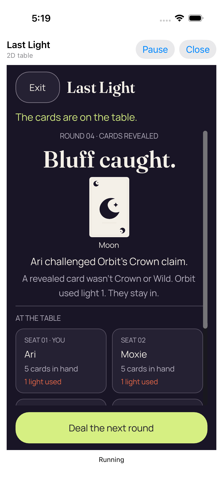</a> | **06 actual viewer challenge 2d text 1** iPhone 17 simulator, runtime 26.4.1, actual native Last Light authority host Original: [424EB2F8-2423-41C9-B265-FBA66C406EF2.png](attachments/424EB2F8-2423-41C9-B265-FBA66C406EF2.png) 1206 × 2622 px; text 1× SHA-256: <code>55deddbbf9254b399d0945ebc4f481fc84a0f596b18422e969d2d51a7adbe155</code> [Original measurements](attachments/83C7B7E2-C2CE-4D73-8C3D-37692CBA1561.json) The enclosing normal-text reference test passes actual Home, same-presentation concealed resume, the full seed-2 match and ReturnToLobby cleanup. This checkpoint remains distinct from the later final state. Ari challenges Orbit’s Crown claim; public Moon catches the bluff. Orbit uses light 1 and stays in. Paired measurements record round 4/revision 11, one play, one challenge and three advances. |
| <a href="attachments/BBB6D42A-8613-4B3D-B78D-0A50D475C3CF.png">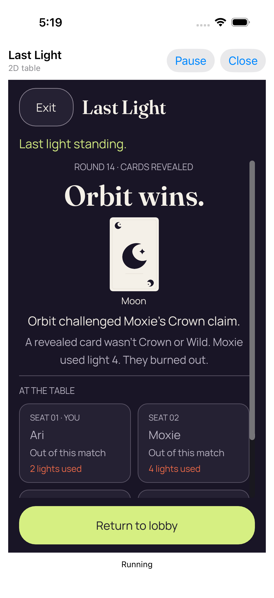</a> | **07 real winner 2d text 1** iPhone 17 simulator, runtime 26.4.1, actual native Last Light authority host Original: [BBB6D42A-8613-4B3D-B78D-0A50D475C3CF.png](attachments/BBB6D42A-8613-4B3D-B78D-0A50D475C3CF.png) 1206 × 2622 px; text 1× SHA-256: <code>03442cb6fc028dcca443b1da2f452f87922ed8e7efc191a4331629753e3ffe10</code> [Original measurements](attachments/5338AD43-F031-4B7C-89F0-DD8423D0C4C3.json) The enclosing normal-text reference test passes actual Home, same-presentation concealed resume, the full seed-2 match and ReturnToLobby cleanup. This checkpoint remains distinct from the later final state. Orbit wins at round 14/revision 41 after two viewer plays, two challenges, thirteen advances and twenty-four opponent actions. The original visibly shows the Crown claim, public Moon and final named Moxie burnout explanation, with Return to lobby available. |
|  | **09 table returned through authority 2d text 1** iPhone 17 simulator, runtime 26.4.1, actual native Last Light authority host Original: [F9110FD4-1DBB-481C-BA72-5F8187CC687D.png](attachments/F9110FD4-1DBB-481C-BA72-5F8187CC687D.png) 1206 × 2622 px; text 1× SHA-256: <code>ffbeea7fe049841c1f54c7b2d20f0f3ee2637a9e28423471ff92b1e6abffc2d6</code> [Original measurements](attachments/C4139F3B-2562-464E-9DFA-A99128C8D045.json) The enclosing normal-text reference test passes actual Home, same-presentation concealed resume, the full seed-2 match and ReturnToLobby cleanup. This checkpoint remains distinct from the later final state. Actual ReturnToLobby produces Table closed and Host +1. Cleanup count 1/depth 0, released authority/controller/view, absent OS singleton and bridge, stopped loop, empty queues and restored idle-timer policy are recorded; hostCounter is 1. |

## 2D — 200% text

| Original image | Scenario and provenance |
| --- | --- |
| <a href="attachments/E7F1FB3D-16CF-4EC0-8DCC-2A4FD9E98F3C.png">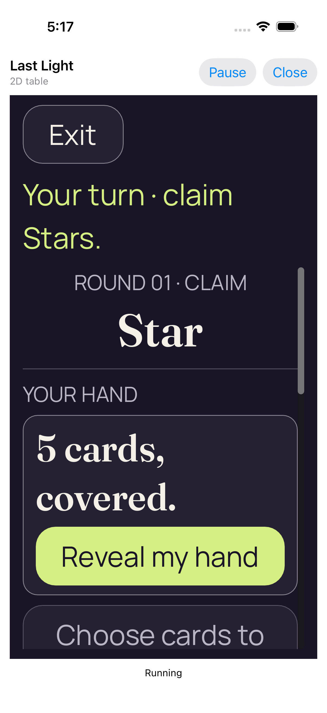</a> | **01 concealed 2d text 2** iPhone 17 simulator, runtime 26.4.1, actual native Last Light authority host Original: [E7F1FB3D-16CF-4EC0-8DCC-2A4FD9E98F3C.png](attachments/E7F1FB3D-16CF-4EC0-8DCC-2A4FD9E98F3C.png) 1206 × 2622 px; text 2× SHA-256: <code>362fca36d2bc572f621048c19d1f0f5170827c0c2d7454bf1cf065bd2426ccb9</code> [Original measurements](attachments/83CD663A-E5E0-464F-A4BE-E6396FD03828.json) The enclosing 2D/200% reference test fails at scrollBound after one play at round 1/revision 2. Zero advances and no Next tap; no full match or close occurs. Round-1 Star table, Ari’s turn, five concealed own cards and zero private faces, labels or selection. No gameplay intent has been accepted. The enlarged initial Reveal fits within the recorded scroll clip. Later outcome navigation is a separate failed stage. |
| <a href="attachments/A344C875-64D9-43AE-9CB1-17B9ACA56309.png">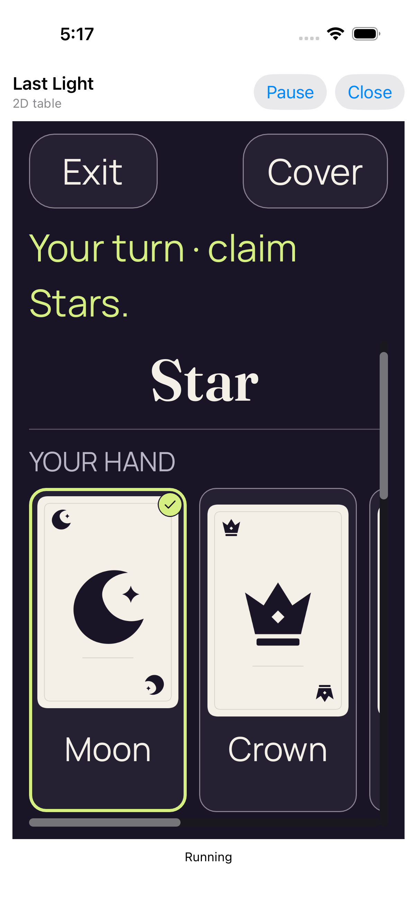</a> | **02 revealed and selected 2d text 2** iPhone 17 simulator, runtime 26.4.1, actual native Last Light authority host Original: [A344C875-64D9-43AE-9CB1-17B9ACA56309.png](attachments/A344C875-64D9-43AE-9CB1-17B9ACA56309.png) 1206 × 2622 px; text 2× SHA-256: <code>fd551b3b0e56b6e77d6a4c620967bd6efb246ef6236f2e325eba68b395df39e7</code> [Original measurements](attachments/E0E81BD1-287E-4544-86B5-BC80275D5713.json) The enclosing 2D/200% reference test fails at scrollBound after one play at round 1/revision 2. Zero advances and no Next tap; no full match or close occurs. Actual touch reveals the five-card hand and selects Moon for a one-Star claim. Paired metrics retain five private faces, one selected card, and five private labels in 2D or six in 3D; no authority gameplay intent has been accepted yet. |
|  | **03 private bindings cleared 2d text 2** iPhone 17 simulator, runtime 26.4.1, actual native Last Light authority host Original: [721EB9BD-E709-4068-96F2-79A365148D7F.png](attachments/721EB9BD-E709-4068-96F2-79A365148D7F.png) 1206 × 2622 px; text 2× SHA-256: <code>bbeff04960dbed503002935047bdfaaea94396eb8bcf2906f592f2c3dd0bce06</code> [Original measurements](attachments/3188C0BC-63E8-40D3-A626-5748BDB39C0B.json) The enclosing 2D/200% reference test fails at scrollBound after one play at round 1/revision 2. Zero advances and no Next tap; no full match or close occurs. Actual Hide clears private faces, private labels and selection without advancing the authority. The own hand returns to its concealed state. |
| <a href="attachments/1F4441CE-DC7E-4EBD-AD37-941E0B9B94E4.png">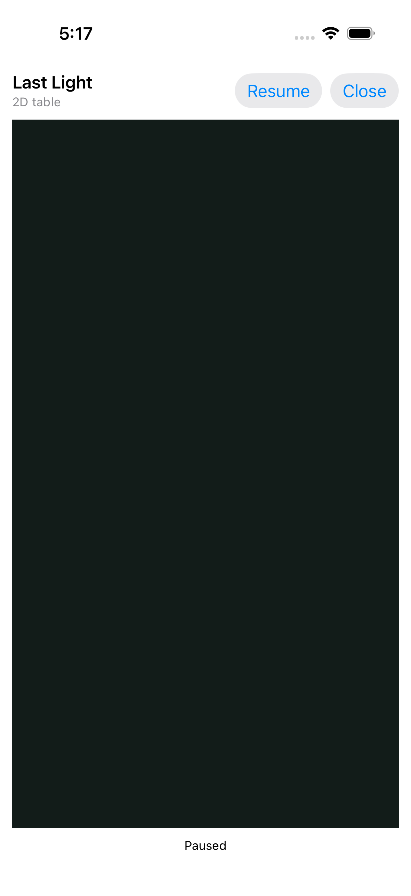</a> | **Native cover with paused private bindings cleared** iPhone 17 simulator, runtime 26.4.1, actual native Last Light authority host Original: [1F4441CE-DC7E-4EBD-AD37-941E0B9B94E4.png](attachments/1F4441CE-DC7E-4EBD-AD37-941E0B9B94E4.png) 1206 × 2622 px; text 2× SHA-256: <code>34ae3b15ac455b07a3294be69002da687d8e10eb1858f8376b901f4c72667cb2</code> [Original measurements](attachments/78564B8F-E37D-4BE8-B392-16329034D46D.json) The enclosing 2D/200% reference test fails at scrollBound after one play at round 1/revision 2. Zero advances and no Next tap; no full match or close occurs. The native cover visibly hides the complete engine surface. Paired measurements report paused state, stopped render loop and zero private faces, labels or selection; the test checks that iterations stop during the explicit pause interval. |
|  | **Actual home screen while game is backgrounded** iPhone 17 simulator, runtime 26.4.1, actual native Last Light authority host Original: [B36905AC-D36B-4934-8705-7267B608D6E4.png](attachments/B36905AC-D36B-4934-8705-7267B608D6E4.png) 1206 × 2622 px; text 2× SHA-256: <code>78abd261c545360504ae52ef15dceedfec2c76a3406ff872beaf000a410234c0</code> The enclosing 2D/200% reference test fails at scrollBound after one play at round 1/revision 2. Zero advances and no Next tap; no full match or close occurs. Original Home capture after an actual successful background-state wait. This is exercised lifecycle evidence, with no separately paired measurement attachment; the same test subsequently resumes concealed. |
| <a href="attachments/322A7E89-4A64-4DA3-B355-5E4E4A0BC4DA.png">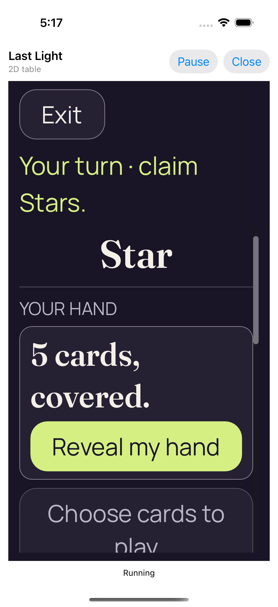</a> | **Same authority resumed with concealed cards** iPhone 17 simulator, runtime 26.4.1, actual native Last Light authority host Original: [322A7E89-4A64-4DA3-B355-5E4E4A0BC4DA.png](attachments/322A7E89-4A64-4DA3-B355-5E4E4A0BC4DA.png) 1206 × 2622 px; text 2× SHA-256: <code>7747058cd9eb41168140060a560f09b861b95bab7ad9acc3646101b860490d49</code> [Original measurements](attachments/B62AE1A3-190D-454F-9E98-4BEE8374F3E7.json) The enclosing 2D/200% reference test fails at scrollBound after one play at round 1/revision 2. Zero advances and no Next tap; no full match or close occurs. After Home, the same presentation/authority resumes at revision 0 with bootstrap count 1. Private faces, private labels and selection are zero. This is resume of the existing presentation, not a new engine entry. |
| <a href="attachments/273A513A-C60E-4BB7-B0A3-FBB011A41CAE.png">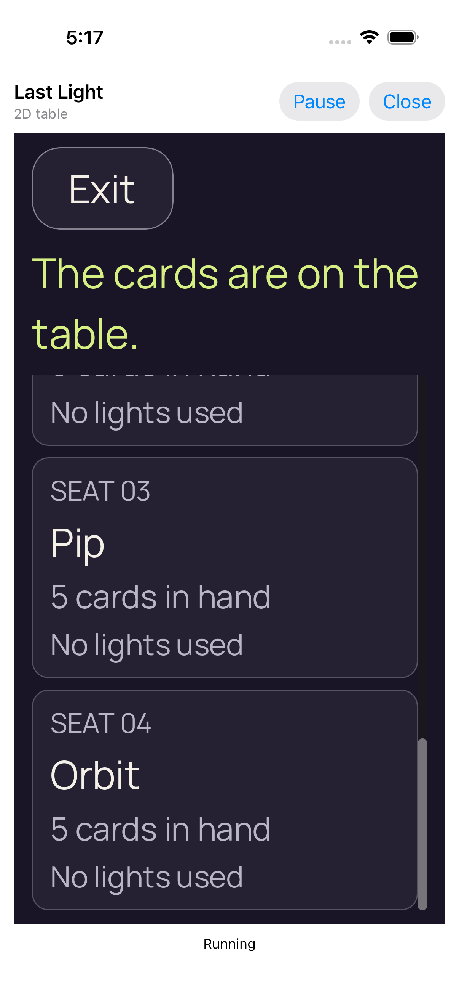</a> | **04 actual viewer play 2d text 2** iPhone 17 simulator, runtime 26.4.1, actual native Last Light authority host Original: [273A513A-C60E-4BB7-B0A3-FBB011A41CAE.png](attachments/273A513A-C60E-4BB7-B0A3-FBB011A41CAE.png) 1206 × 2622 px; text 2× SHA-256: <code>bd22accfce268c6bae4e9701c4c7713bfce7f309dd4d7ffe7f47f0a34ed78ce8</code> [Original measurements](attachments/4B9ED2BB-D693-43CE-AA72-373151EA1713.json) The enclosing 2D/200% reference test fails at scrollBound after one play at round 1/revision 2. Zero advances and no Next tap; no full match or close occurs. The original enlarged PNG shows the scrolled lower roster; the outcome title and public proof are not visibly depicted. Its paired measurement records one accepted play, the round-1 outcome and revision 2. Both original checkpoint files remain separate. Later stream sequence 66 places Next [16,341,338,72] fully inside clip [16,211,346,468]. The bounded guard ends before another stable observation or a tap; final persistent clipping or authority rejection is not established. |
|  | **05 public outcome 2d text 2** iPhone 17 simulator, runtime 26.4.1, actual native Last Light authority host Original: [E4F66EB4-B8B9-4F50-89E5-599C03A591D4.png](attachments/E4F66EB4-B8B9-4F50-89E5-599C03A591D4.png) 1206 × 2622 px; text 2× SHA-256: <code>bd22accfce268c6bae4e9701c4c7713bfce7f309dd4d7ffe7f47f0a34ed78ce8</code> [Original measurements](attachments/9C844A48-19F9-46B6-B762-4EAF9A930E1F.json) The enclosing 2D/200% reference test fails at scrollBound after one play at round 1/revision 2. Zero advances and no Next tap; no full match or close occurs. The original enlarged PNG shows the scrolled lower roster; the outcome title and public proof are not visibly depicted. Its paired measurement records one accepted play, the round-1 outcome and revision 2. Both original checkpoint files remain separate. Later stream sequence 66 places Next [16,341,338,72] fully inside clip [16,211,346,468]. The bounded guard ends before another stable observation or a tap; final persistent clipping or authority rejection is not established. |

## 3D — 100% text

| Original image | Scenario and provenance |
| --- | --- |
| <a href="attachments/B4F4E77F-6939-42CB-A290-66D8AD5A0C74.png">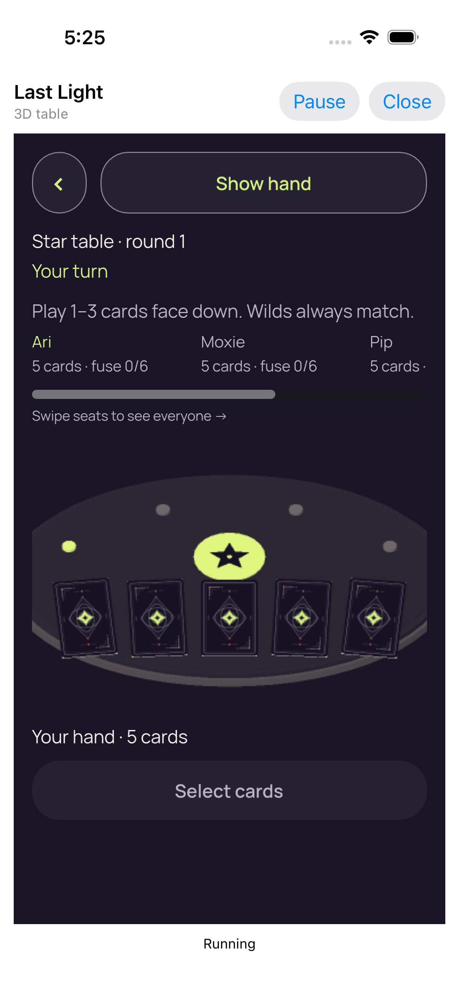</a> | **01 concealed 3d text 1** iPhone 17 simulator, runtime 26.4.1, actual native Last Light authority host Original: [B4F4E77F-6939-42CB-A290-66D8AD5A0C74.png](attachments/B4F4E77F-6939-42CB-A290-66D8AD5A0C74.png) 1206 × 2622 px; text 1× SHA-256: <code>96cb50e3d47e3889856abbe456d5fa7a545783ac4e27bbefe6e83fe8646d1cd1</code> [Original measurements](attachments/33E2F1BC-AB92-4BBE-B30B-6D2E23405F63.json) The enclosing normal-text reference test passes actual Home, same-presentation concealed resume, the full seed-2 match and ReturnToLobby cleanup. This checkpoint remains distinct from the later final state. Round-1 Star table, Ari’s turn, five concealed own cards and zero private faces, labels or selection. No gameplay intent has been accepted. |
| <a href="attachments/80FE57C3-C451-4422-9522-586FBF6BCC46.png">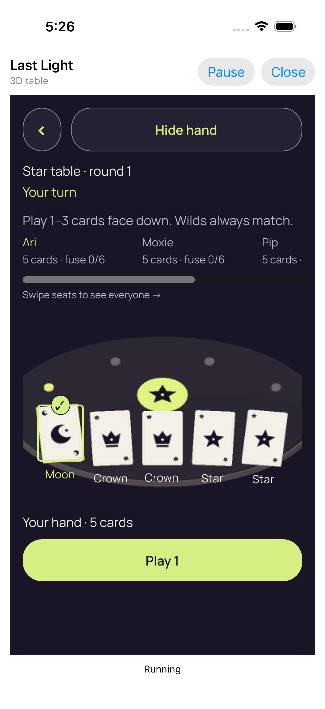</a> | **02 revealed and selected 3d text 1** iPhone 17 simulator, runtime 26.4.1, actual native Last Light authority host Original: [80FE57C3-C451-4422-9522-586FBF6BCC46.png](attachments/80FE57C3-C451-4422-9522-586FBF6BCC46.png) 1206 × 2622 px; text 1× SHA-256: <code>82682e4cda00ee720217c02c70a67ce1edeadaa50e54395a1d27045fc0172428</code> [Original measurements](attachments/8BE26F2B-60FE-4845-991A-BDB1A3B6E824.json) The enclosing normal-text reference test passes actual Home, same-presentation concealed resume, the full seed-2 match and ReturnToLobby cleanup. This checkpoint remains distinct from the later final state. Actual touch reveals the five-card hand and selects Moon for a one-Star claim. Paired metrics retain five private faces, one selected card, and five private labels in 2D or six in 3D; no authority gameplay intent has been accepted yet. |
| <a href="attachments/D32566A4-E191-4514-AE7D-30BA4C90DF5D.png">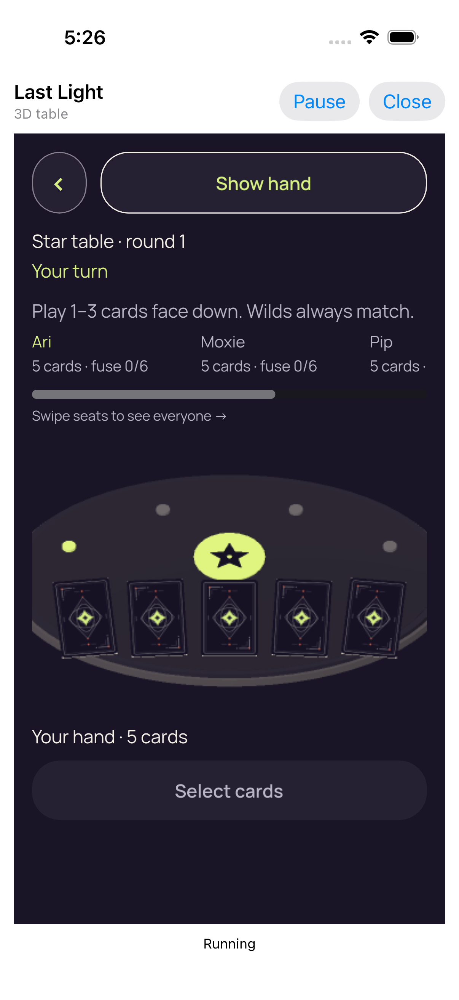</a> | **03 private bindings cleared 3d text 1** iPhone 17 simulator, runtime 26.4.1, actual native Last Light authority host Original: [D32566A4-E191-4514-AE7D-30BA4C90DF5D.png](attachments/D32566A4-E191-4514-AE7D-30BA4C90DF5D.png) 1206 × 2622 px; text 1× SHA-256: <code>eeee47da84af731344c97d71137f54b17576dc16868fab3c330d3cbd8ebd512d</code> [Original measurements](attachments/B195C2E9-ACCB-49A4-A306-463273E1C01F.json) The enclosing normal-text reference test passes actual Home, same-presentation concealed resume, the full seed-2 match and ReturnToLobby cleanup. This checkpoint remains distinct from the later final state. Actual Hide clears private faces, private labels and selection without advancing the authority. The own hand returns to its concealed state. |
| <a href="attachments/EE097879-AFF7-4F30-906F-88CFA364278A.png">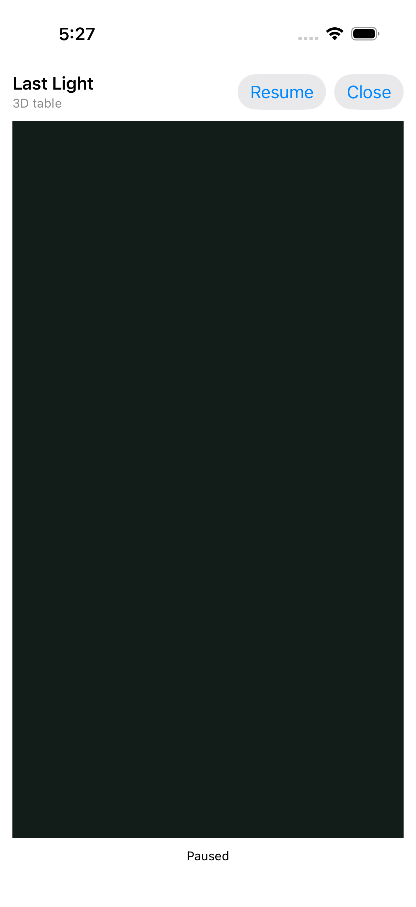</a> | **Native cover with paused private bindings cleared** iPhone 17 simulator, runtime 26.4.1, actual native Last Light authority host Original: [EE097879-AFF7-4F30-906F-88CFA364278A.png](attachments/EE097879-AFF7-4F30-906F-88CFA364278A.png) 1206 × 2622 px; text 1× SHA-256: <code>7410489314865ecc037e6ea6b67ae4eb92a240126e3b3ea38cccf3e37662b361</code> [Original measurements](attachments/EC1A7F23-CAE7-4058-ABAD-E5A14EAD5102.json) The enclosing normal-text reference test passes actual Home, same-presentation concealed resume, the full seed-2 match and ReturnToLobby cleanup. This checkpoint remains distinct from the later final state. The native cover visibly hides the complete engine surface. Paired measurements report paused state, stopped render loop and zero private faces, labels or selection; the test checks that iterations stop during the explicit pause interval. |
| <a href="attachments/B0767479-C29D-44A7-B107-59DDDD60E74A.png">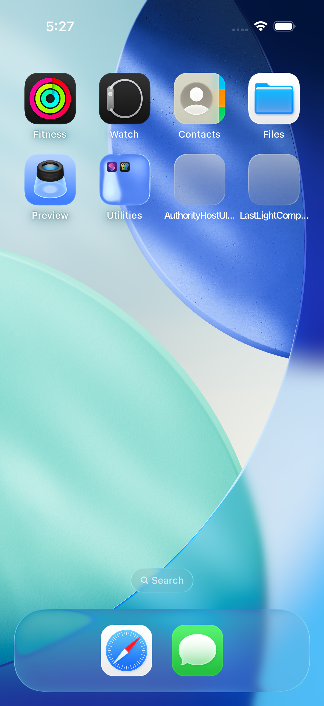</a> | **Actual home screen while game is backgrounded** iPhone 17 simulator, runtime 26.4.1, actual native Last Light authority host Original: [B0767479-C29D-44A7-B107-59DDDD60E74A.png](attachments/B0767479-C29D-44A7-B107-59DDDD60E74A.png) 1206 × 2622 px; text 1× SHA-256: <code>8012abb3ac0149785f7983b3ac80b0ad22613cf9af9b43ecb59dc1537fcd97b8</code> The enclosing normal-text reference test passes actual Home, same-presentation concealed resume, the full seed-2 match and ReturnToLobby cleanup. This checkpoint remains distinct from the later final state. Original Home capture after an actual successful background-state wait. This is exercised lifecycle evidence, with no separately paired measurement attachment; the same test subsequently resumes concealed. |
|  | **Same authority resumed with concealed cards** iPhone 17 simulator, runtime 26.4.1, actual native Last Light authority host Original: [C29C7375-C983-4F5B-A431-9F3B26AF2AF8.png](attachments/C29C7375-C983-4F5B-A431-9F3B26AF2AF8.png) 1206 × 2622 px; text 1× SHA-256: <code>b107283b4b28fce85631272a5a88cafe45eed3336587f02063495785c1f100ee</code> [Original measurements](attachments/18319034-C36B-430C-9866-FF2668EE7364.json) The enclosing normal-text reference test passes actual Home, same-presentation concealed resume, the full seed-2 match and ReturnToLobby cleanup. This checkpoint remains distinct from the later final state. After Home, the same presentation/authority resumes at revision 0 with bootstrap count 1. Private faces, private labels and selection are zero. This is resume of the existing presentation, not a new engine entry. |
|  | **04 actual viewer play 3d text 1** iPhone 17 simulator, runtime 26.4.1, actual native Last Light authority host Original: [B7ABBF27-4FE4-4E3B-A9F2-795659320D9C.png](attachments/B7ABBF27-4FE4-4E3B-A9F2-795659320D9C.png) 1206 × 2622 px; text 1× SHA-256: <code>6f727a67a3207b6e0e8da7234d65c0463d54bded991c1554e6f40907835f856f</code> [Original measurements](attachments/CE24DF04-9896-40BC-8461-1927BB5F539C.json) The enclosing normal-text reference test passes actual Home, same-presentation concealed resume, the full seed-2 match and ReturnToLobby cleanup. This checkpoint remains distinct from the later final state. Moxie challenges Ari’s one-Star claim; the public Moon catches the bluff, Ari uses light 1 and stays in. Paired authority measurements record round 1/revision 2, one viewer play, zero viewer challenges and zero advances. Repeated checkpoint pixels remain separate originals. |
|  | **05 public outcome 3d text 1** iPhone 17 simulator, runtime 26.4.1, actual native Last Light authority host Original: [5DE9BC0D-150E-4910-A5FA-D6D1BB0A551F.png](attachments/5DE9BC0D-150E-4910-A5FA-D6D1BB0A551F.png) 1206 × 2622 px; text 1× SHA-256: <code>6f727a67a3207b6e0e8da7234d65c0463d54bded991c1554e6f40907835f856f</code> [Original measurements](attachments/24245FE3-F250-415A-A38E-B1477D65E344.json) The enclosing normal-text reference test passes actual Home, same-presentation concealed resume, the full seed-2 match and ReturnToLobby cleanup. This checkpoint remains distinct from the later final state. Moxie challenges Ari’s one-Star claim; the public Moon catches the bluff, Ari uses light 1 and stays in. Paired authority measurements record round 1/revision 2, one viewer play, zero viewer challenges and zero advances. Repeated checkpoint pixels remain separate originals. |
| <a href="attachments/6ACC043E-4899-4D98-97E5-32B4FC002083.png">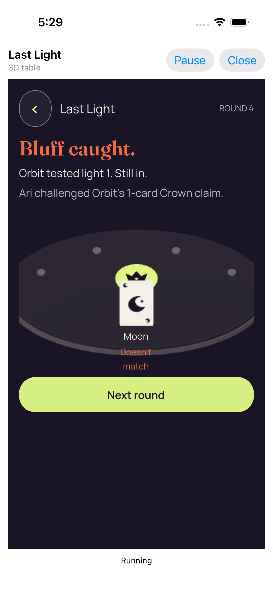</a> | **06 actual viewer challenge 3d text 1** iPhone 17 simulator, runtime 26.4.1, actual native Last Light authority host Original: [6ACC043E-4899-4D98-97E5-32B4FC002083.png](attachments/6ACC043E-4899-4D98-97E5-32B4FC002083.png) 1206 × 2622 px; text 1× SHA-256: <code>0b9985e95032906a75d199e3643051ed9f150dd905e3751addcec58ba5c3efe1</code> [Original measurements](attachments/A05FFCF5-5689-44A3-BA62-D2E615AD4843.json) The enclosing normal-text reference test passes actual Home, same-presentation concealed resume, the full seed-2 match and ReturnToLobby cleanup. This checkpoint remains distinct from the later final state. Ari challenges Orbit’s Crown claim; public Moon catches the bluff. Orbit uses light 1 and stays in. Paired measurements record round 4/revision 11, one play, one challenge and three advances. |
| <a href="attachments/5AF72B25-8A60-4D72-BE54-92D06DE30374.png">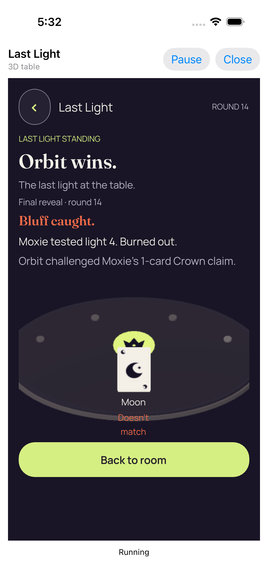</a> | **07 real winner 3d text 1** iPhone 17 simulator, runtime 26.4.1, actual native Last Light authority host Original: [5AF72B25-8A60-4D72-BE54-92D06DE30374.png](attachments/5AF72B25-8A60-4D72-BE54-92D06DE30374.png) 1206 × 2622 px; text 1× SHA-256: <code>2bad0d361fa3f6e93295cfd3e41671a1309a822dd263cba2a544453c817198fd</code> [Original measurements](attachments/E32FBF14-E998-431D-9E57-34AC57B56C9F.json) The enclosing normal-text reference test passes actual Home, same-presentation concealed resume, the full seed-2 match and ReturnToLobby cleanup. This checkpoint remains distinct from the later final state. Orbit wins at round 14/revision 41 after two viewer plays, two challenges, thirteen advances and twenty-four opponent actions. The original visibly shows the Crown claim, public Moon and final named Moxie burnout explanation, with Return to lobby available. |
| <a href="attachments/C3DE2694-25B8-44EE-8A44-62CBBD7D449B.png">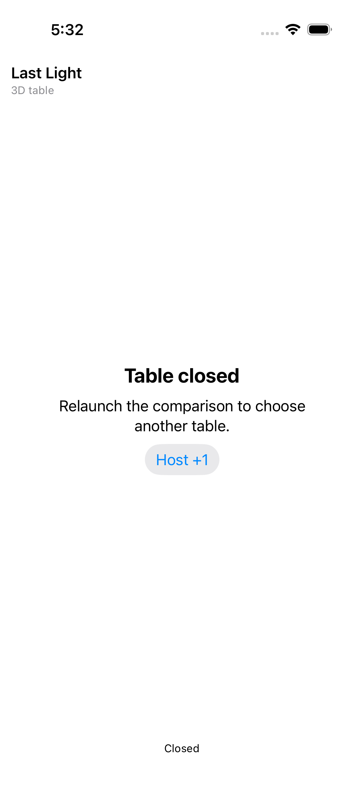</a> | **09 table returned through authority 3d text 1** iPhone 17 simulator, runtime 26.4.1, actual native Last Light authority host Original: [C3DE2694-25B8-44EE-8A44-62CBBD7D449B.png](attachments/C3DE2694-25B8-44EE-8A44-62CBBD7D449B.png) 1206 × 2622 px; text 1× SHA-256: <code>556469062cdac65dd3d52c1f7b88dd9b7834556006d30528d2b4be62deb99438</code> [Original measurements](attachments/3F38D953-17C5-4A58-8AAC-530AB62D918F.json) The enclosing normal-text reference test passes actual Home, same-presentation concealed resume, the full seed-2 match and ReturnToLobby cleanup. This checkpoint remains distinct from the later final state. Actual ReturnToLobby produces Table closed and Host +1. Cleanup count 1/depth 0, released authority/controller/view, absent OS singleton and bridge, stopped loop, empty queues and restored idle-timer policy are recorded; hostCounter is 1. |

## 3D — 200% text

| Original image | Scenario and provenance |
| --- | --- |
| <a href="attachments/81A2F1F0-D8E9-4EA7-9B4D-A813DB8082C0.png">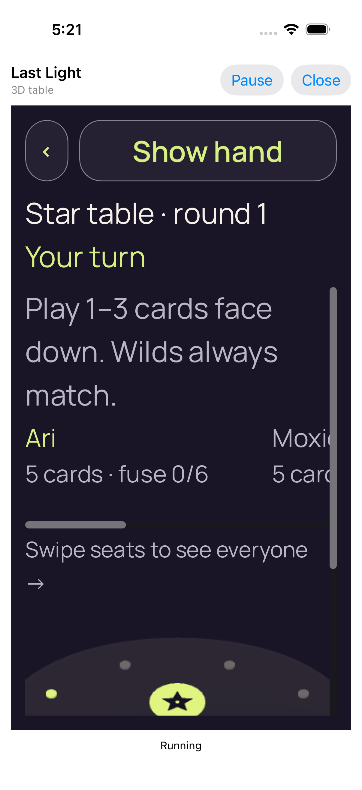</a> | **01 concealed 3d text 2** iPhone 17 simulator, runtime 26.4.1, actual native Last Light authority host Original: [81A2F1F0-D8E9-4EA7-9B4D-A813DB8082C0.png](attachments/81A2F1F0-D8E9-4EA7-9B4D-A813DB8082C0.png) 1206 × 2622 px; text 2× SHA-256: <code>4993ce419bc45b749c60ba7fa188dbcbc2b07f224ce07ca97f88bc369b9c9b69</code> [Original measurements](attachments/552A2AE6-C22F-4E86-98EF-07CB730C4C22.json) The enclosing 3D/200% reference test fails its Home-state predicate despite actual Home UI appearing within the deadline. No completed Home resume or gameplay intent occurs. Round-1 Star table, Ari’s turn, five concealed own cards and zero private faces, labels or selection. No gameplay intent has been accepted. The enlarged Show hand action and current rank/actor remain above the scrollable table content. |
| <a href="attachments/F9ABCCE3-9A12-47D2-962B-FA79261901AB.png">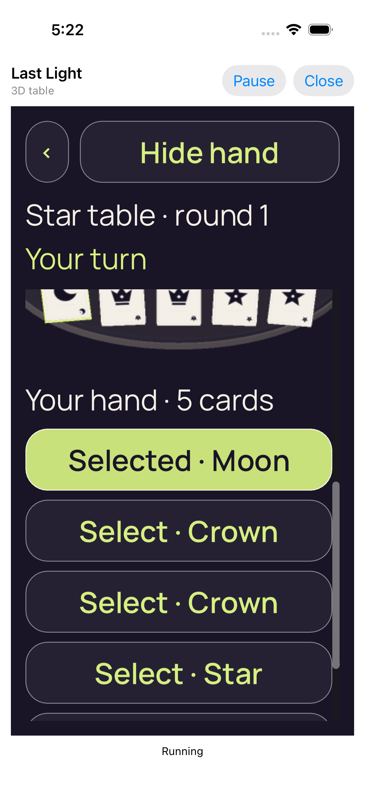</a> | **02 revealed and selected 3d text 2** iPhone 17 simulator, runtime 26.4.1, actual native Last Light authority host Original: [F9ABCCE3-9A12-47D2-962B-FA79261901AB.png](attachments/F9ABCCE3-9A12-47D2-962B-FA79261901AB.png) 1206 × 2622 px; text 2× SHA-256: <code>be8cd9c4fe45c117a3e336c727746ad5cbbde5ced15a1d3b4b4e9da08bd848d5</code> [Original measurements](attachments/0988194F-F6B9-49E6-9BF2-E12523D85CD2.json) The enclosing 3D/200% reference test fails its Home-state predicate despite actual Home UI appearing within the deadline. No completed Home resume or gameplay intent occurs. Actual touch reveals the five-card hand and selects Moon for a one-Star claim. Paired metrics retain five private faces, one selected card, and five private labels in 2D or six in 3D; no authority gameplay intent has been accepted yet. |
| <a href="attachments/E3B116D2-9A60-4BDD-B032-D1C63EBF07D7.png">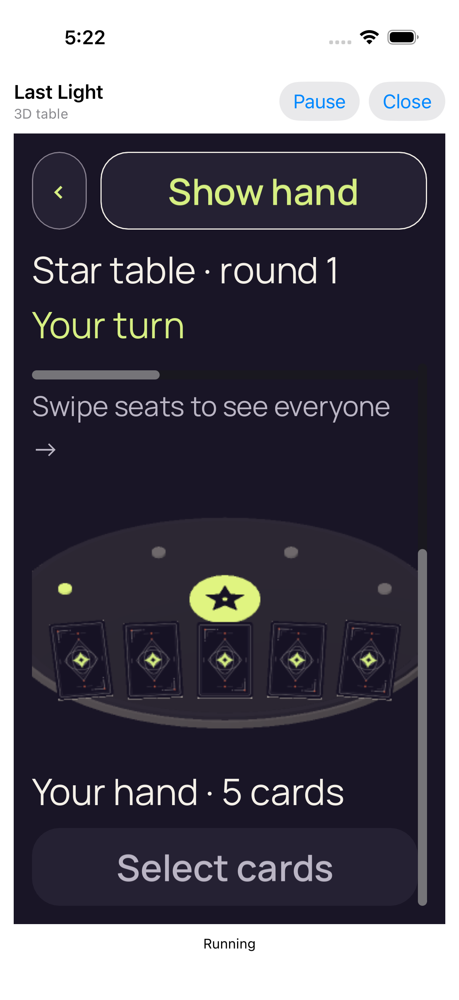</a> | **03 private bindings cleared 3d text 2** iPhone 17 simulator, runtime 26.4.1, actual native Last Light authority host Original: [E3B116D2-9A60-4BDD-B032-D1C63EBF07D7.png](attachments/E3B116D2-9A60-4BDD-B032-D1C63EBF07D7.png) 1206 × 2622 px; text 2× SHA-256: <code>93560b1ae80fe330d2d34e57349577020d012832f518253859e3adf57691ed74</code> [Original measurements](attachments/D26CD462-9B6D-4A65-B19B-02B1B6A47DC1.json) The enclosing 3D/200% reference test fails its Home-state predicate despite actual Home UI appearing within the deadline. No completed Home resume or gameplay intent occurs. Actual Hide clears private faces, private labels and selection without advancing the authority. The own hand returns to its concealed state. |
|  | **Native cover with paused private bindings cleared** iPhone 17 simulator, runtime 26.4.1, actual native Last Light authority host Original: [0652AC2E-BDF5-4C83-8CFE-A500F0287EE1.png](attachments/0652AC2E-BDF5-4C83-8CFE-A500F0287EE1.png) 1206 × 2622 px; text 2× SHA-256: <code>fef668f5fa8d65e4beb817182822452994125d49c01c755f3345dd436f3b7571</code> [Original measurements](attachments/D6A269C5-6B8E-4E47-8F3F-F1A1B7DDAB38.json) The enclosing 3D/200% reference test fails its Home-state predicate despite actual Home UI appearing within the deadline. No completed Home resume or gameplay intent occurs. The native cover visibly hides the complete engine surface. Paired measurements report paused state, stopped render loop and zero private faces, labels or selection; the test checks that iterations stop during the explicit pause interval. |
|  | **Failed native Home transition** iPhone 17 simulator, runtime 26.4.1, actual native Last Light authority host Original: [FC2F83FD-72AB-465A-838D-151A9F5A3829.png](attachments/FC2F83FD-72AB-465A-838D-151A9F5A3829.png) 1206 × 2622 px; text 2× SHA-256: <code>f3a62fcc75c1abb1ccdd11dc99f01d8494fb1bd4c0a30c0b5534660c0eace0ae</code> [Original measurements](attachments/3E9B0DD4-A2E5-4EA0-9CFF-854FD9BE3837.json) The enclosing 3D/200% reference test fails its Home-state predicate despite actual Home UI appearing within the deadline. No completed Home resume or gameplay intent occurs. Despite the attachment’s failure title, the PNG visibly shows Home. Home appears within the 20-second deadline, while the original receipt still reports enteredBackground=false and observedApplicationState=4. The test remains failed; no subsequent Home resume is completed. The paired native state is paused with foreground=false, opaque cover, stopped loop and zero private/selected bindings. A later original session check confirms AuthorityHost PID 16826 remains alive after the runner exits 75; no AuthorityHost crash is established here. |

## Secure default renderer Exit

| Original image | Scenario and provenance |
| --- | --- |
|  | **Secure default table exited through Godot input** iPhone 17 simulator, runtime 26.4.1, actual native Last Light authority host Original: [255B8550-A6B4-4F06-8868-52BFD5D6E747.png](attachments/255B8550-A6B4-4F06-8868-52BFD5D6E747.png) 1206 × 2622 px; text 1× SHA-256: <code>272061290cf3bacd73350110c906e6b0e2df269d553ebbfe47f4fa3a98806fe7</code> [Original measurements](attachments/F6022A2B-EB36-4B65-B979-0E85EE3B2688.json) The secure default launch-and-exit case passes with referenceSeed2=false and no gameplay intents. Actual Godot Exit produces EXIT_REQUESTED; authority, controller/view and singleton are released, cleanup runs once, queues empty and idle-timer policy restores. Host +1 increments to 1. |
