# Godot iOS authority host — four reference failures and secure Exit success

[All screenshot collections](../README.md) · [CI run 34460468965](https://github.com/Apdelrahman1911/PartyDeck/actions/runs/34460468965) · [Earlier authority run](../godot-ios-authority-34439760695/README.md)

**Evidence status: all four reference tests fail; secure default renderer Exit passes.** These are the original results from the actual Swift host, Kotlin authority framework and Godot renderer. Reaching a pictured checkpoint does not replace a failed test result. All **35 original PNGs and 359 non-PNG attachments** remain retained with their original UUID filenames.

| Test | Original PNGs | Original result and recorded progress |
| --- | ---: | --- |
| 2D / 200% | 9 | Fails: “The real renderer must report current bounded diagnostics.” The final failure measurement is round 4/revision 10, with one accepted play, three advances and zero viewer challenges. Three actual Next taps are retained. |
| 2D / 100% | 9 | Fails the revision assertion: 42 versus expected 41. Reaches the round-14 winner with two plays, thirteen advances, zero viewer challenges and one lobby touch. The failed reference test is not qualified as passing. |
| 3D / 200% | 8 | Fails with controlMissing. Actual input receipts include one play and three Next taps. The last paired outcome screenshot is the earlier round-1 checkpoint, not the final app-stream progress. |
| 3D / 100% | 8 | Fails: “The actual Godot control must be enabled.” Actual receipts include one play and one Next tap. Its outcome screenshots likewise precede later recorded progress. |
| Secure default renderer Exit | 1 | Passes one actual scene Exit, cleanup and released ownership with responsive Host +1. It does not qualify a full secure match or retained-engine lifecycle. |

Exact source revision is `31d148f9b6bbfa15d1746e1029858b86714362a3`. The [simulator metadata](runtime-evidence/godot-ios-authority-gameplay/evidence/authority-simulator.json), [Xcode record](runtime-evidence/godot-ios-authority-gameplay/evidence/authority-host-xcode-version.log) and original runtime logs identify the environment. The originals are 1206 × 2622 pixels at display scale 3; open scenes report a 378 × 691 logical-point surface using `GDTOpenGLLayer`. All 31 paired measurements record normal motion and sound enabled. These settings do not establish audio dormancy or physical-device performance.

The app executable SHA-256 is `dab16ac20c60ffa95def5139b524b5aa7b85ef2d34622c795c5b216c930c0e94`; the PCK SHA-256 is `8f24944d61b0430cfec4a32bb1d03d2c7da9f55918264e9cfcded1c675d21539`. All six artifact ZIPs and their extracted bytes were independently verified. All 394 attachment payloads match the original SQLite UUID mappings and decoded XCResult objects; the app archive's fifteen members and bounded source/pack inputs also match. [Package audit](provenance/authority-package-evidence-summary.json) · [Original pack receipt](provenance/partydeck-last-light.receipt.json) · [Attachment audit](provenance/authority-attachment-evidence-summary.json) · [Original XCTest log](runtime-evidence/godot-ios-authority-gameplay/evidence/authority-host-test.log).

All four reference cases visibly reach Home with SpringBoard dock icons. Their original observations still report `applicationReportedBackground=false` and application state 4. The gallery preserves the measured discrepancy alongside the Home images and subsequent concealed resumes; it does not invent a replacement state or transfer an older run's Home failure. Manual Pause frames show an opaque native cover. These images do not establish iOS App Switcher snapshot privacy.

Normal 2D initial Reveal still clips: the original control is 56 logical points high, with 31 points visible and 25 points/75 pixels below its clip. Later scrolled Reveal frames fit. At 200%, hand controls, result explanations and Next actions can continue below the captured viewport. The original two-dimensional failure image shows covered cards and complete Reveal/Call the bluff controls at round 4; those visible controls do not override the diagnostics failure. Normal 2D's winner image shows the complete named Crown-claim challenge, Moon mismatch, Moxie's light-4 burnout and Return to lobby, while its measured revision remains 42.

The [normal-text diagnosis](review/normal-text-v1/normal-text-failure-diagnosis.json), original AX lines, source/proposal provenance and base/proposed files are preserved as a seventeen-file historical supplement. Its **v1 patch is rejected and unapplied**: it is a diagnostic-currentness shortcut, not a tested correction. The later corrected proposal is separate work and is not evidence from this historical run.

[Independent source audit](review/partydeck-gallery-1717-ios-source-audit.json) · [Later completed visual review](review/partydeck-gallery-1717-ios-visual-review.json) · [Collection freeze](provenance/collection-evidence-frozen.json). Review reconciles 31 measurements, 65 actual touch geometries and 75 observed controls. Thirty-three originals were inspected in twelve internal sheets; the requested failure original and secure Exit original were viewed directly at original resolution without making derivatives. All derived sheets remain outside the gallery. The earlier source audit's pending visual-review wording stays unchanged.

Four original recordings and the original decoded [app output stream](runtime/app-stdout-stderr-001.log) are preserved. The decoder receipt reports no crash candidates. Full native matrix, production KMP factories, screen-reader traversal, App Switcher privacy, retained lifecycle, LAN, audio dormancy and physical-device acceptance remain open. Archive and package binaries stay outside the gallery.

Source: `/tmp/partydeck-engine-ci/34460468965/godot-ios-authority-gameplay/artifacts/authority-attachments`. Thumbnails display and link only the unchanged originals. Original suggested attachment names, timestamps, source objects, exact revision and paired measurements remain in the manifest.

## 2D / 200% text

| Original image | Scenario and provenance |
| --- | --- |
| <a href="attachments/0A726DF7-9828-4323-9682-CB121E64C345.png">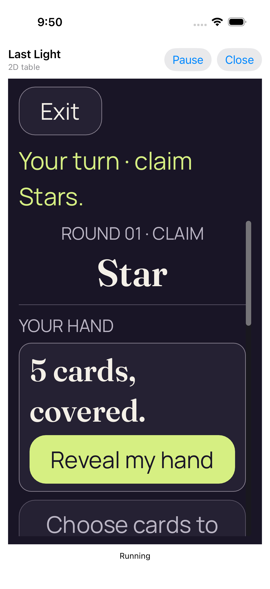</a> | **01 concealed 2d text 2** iPhone 17 simulator, actual native Last Light authority host Original: [0A726DF7-9828-4323-9682-CB121E64C345.png](attachments/0A726DF7-9828-4323-9682-CB121E64C345.png) 1206 × 2622 px; text 2× SHA-256: <code>4ce7245b5629ac0a252e886dcbd6a892569282a4a78f79499f230538fc219a96</code> [Original measurements](attachments/7888B6B1-5BE8-401A-A207-80B76C2D26B2.json) Original reference test: Failure. failed - The real renderer must report current bounded diagnostics. Reveal is complete; the lower Choose cards action clips. |
| <a href="attachments/8F6A5DFE-E105-4444-B911-99BCD87B933A.png">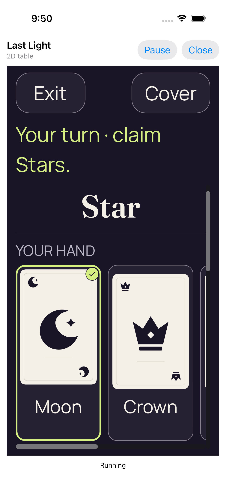</a> | **02 revealed and selected 2d text 2** iPhone 17 simulator, actual native Last Light authority host Original: [8F6A5DFE-E105-4444-B911-99BCD87B933A.png](attachments/8F6A5DFE-E105-4444-B911-99BCD87B933A.png) 1206 × 2622 px; text 2× SHA-256: <code>65fce4bc88261819f1d0ed95ea839684f55a5320ef6f419fbee846f065187838</code> [Original measurements](attachments/7AF63AAD-916D-45E6-827C-B4B58AA36FE6.json) Original reference test: Failure. failed - The real renderer must report current bounded diagnostics. Moon is selected with a check/outline. The hand scrolls horizontally and does not show every card together. |
| <a href="attachments/90A36AD2-8EB3-4043-91E6-B8E17D45755D.png">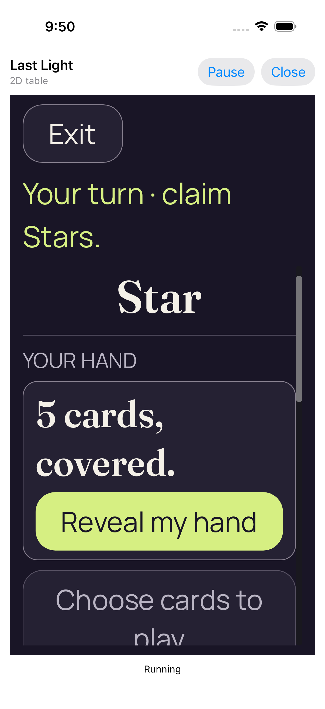</a> | **03 private bindings cleared 2d text 2** iPhone 17 simulator, actual native Last Light authority host Original: [90A36AD2-8EB3-4043-91E6-B8E17D45755D.png](attachments/90A36AD2-8EB3-4043-91E6-B8E17D45755D.png) 1206 × 2622 px; text 2× SHA-256: <code>e3524ff010e2309a6d3a6982d4c240b3833134c49fc00d5d6e3673d39d929a15</code> [Original measurements](attachments/3A47403E-C25F-4128-B660-8D9F27FB123F.json) Original reference test: Failure. failed - The real renderer must report current bounded diagnostics. Only concealed cards remain; private faces, per-card rank labels and selection are absent. Reveal/Show hand is complete. |
|  | **Native cover with paused private bindings cleared** iPhone 17 simulator, actual native Last Light authority host Original: [9F279F3B-0903-4153-A7A8-F962002F3FE6.png](attachments/9F279F3B-0903-4153-A7A8-F962002F3FE6.png) 1206 × 2622 px; text 2× SHA-256: <code>ed770810d56ee8da2fe881f1fb9a0bcbeaf6ec687a9655721ec334c650bf105c</code> [Original measurements](attachments/0F837427-3C58-4CB1-BF94-CC1D01549D67.json) Original reference test: Failure. failed - The real renderer must report current bounded diagnostics. Native Pause presents an opaque cover with no private game content. |
| <a href="attachments/82D506DE-117F-4507-AA98-34B1C1371522.png">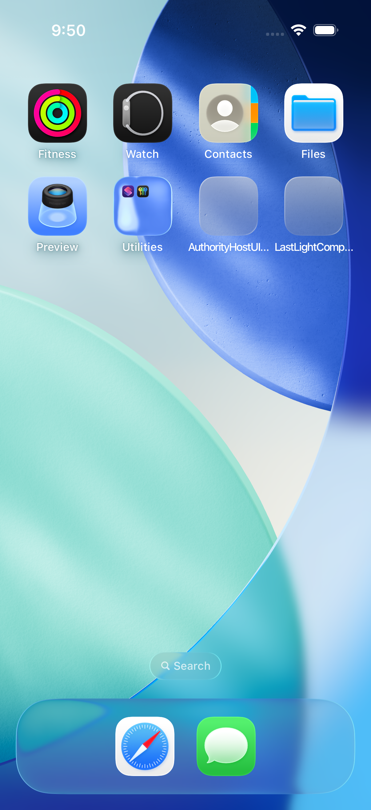</a> | **Actual Home screen before game reactivation** iPhone 17 simulator, actual native Last Light authority host Original: [82D506DE-117F-4507-AA98-34B1C1371522.png](attachments/82D506DE-117F-4507-AA98-34B1C1371522.png) 1206 × 2622 px; text 2× SHA-256: <code>8eb677e78859c736b72841618b5fc4577e8abe9de8423a32dbc4c2a70fbc1d66</code> [Original Home observation](attachments/31C20255-B6C2-49E0-9BEE-9D4BB49A15D2.json) Original reference test: Failure. failed - The real renderer must report current bounded diagnostics. SpringBoard and dock icons are visibly present. The original observation still reports applicationReportedBackground=false and application state 4; both observations are preserved. |
|  | **Same authority resumed with concealed cards** iPhone 17 simulator, actual native Last Light authority host Original: [F9BD1788-3AFA-48CC-AFCB-A27DDC1CCF35.png](attachments/F9BD1788-3AFA-48CC-AFCB-A27DDC1CCF35.png) 1206 × 2622 px; text 2× SHA-256: <code>f0235c88c7c4d314920c07ecf8a5a5ccd0f8ec96d5e5ca7f11a45516f8603286</code> [Original measurements](attachments/5564F1D5-A3E2-4E09-81CE-68798D63A6E5.json) Original reference test: Failure. failed - The real renderer must report current bounded diagnostics. Only concealed cards remain; private faces, per-card rank labels and selection are absent. Reveal/Show hand is complete. |
| <a href="attachments/43FF31CD-30A5-476E-90FE-2978644091AF.png">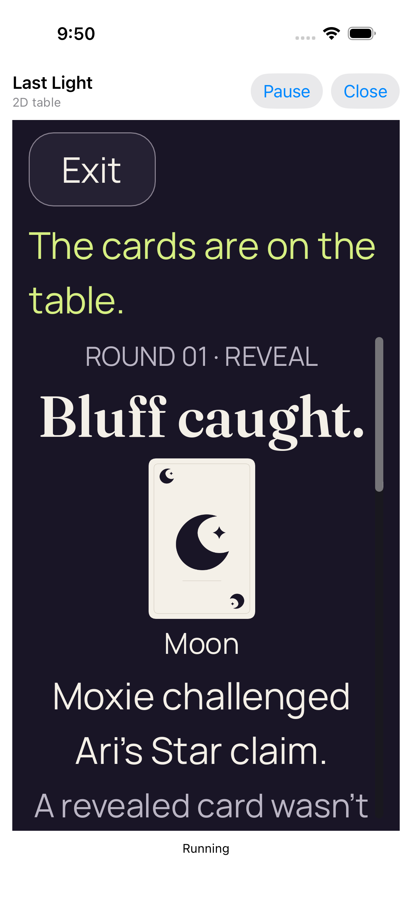</a> | **04 actual viewer play 2d text 2** iPhone 17 simulator, actual native Last Light authority host Original: [43FF31CD-30A5-476E-90FE-2978644091AF.png](attachments/43FF31CD-30A5-476E-90FE-2978644091AF.png) 1206 × 2622 px; text 2× SHA-256: <code>72e64a30d19b1d9d043e0d3ff3e9f1d256e4d788f247d11a100a88d16758b84b</code> [Original measurements](attachments/68F42722-5788-48C9-82BB-56A7A5151FFE.json) Original reference test: Failure. failed - The real renderer must report current bounded diagnostics. Paired screenshot checkpoint: round 1/revision 2, one accepted viewer play. Moxie challenges Ari’s Star claim and public Moon does not match. The remaining consequence and Next action continue below this viewport. |
|  | **05 public outcome 2d text 2** iPhone 17 simulator, actual native Last Light authority host Original: [138B160F-F32C-460C-A9E6-E7518F95506B.png](attachments/138B160F-F32C-460C-A9E6-E7518F95506B.png) 1206 × 2622 px; text 2× SHA-256: <code>72e64a30d19b1d9d043e0d3ff3e9f1d256e4d788f247d11a100a88d16758b84b</code> [Original measurements](attachments/7ED3159D-62E6-43F5-9A84-749D0D4E2CF8.json) Original reference test: Failure. failed - The real renderer must report current bounded diagnostics. Paired screenshot checkpoint: round 1/revision 2, one accepted viewer play. Moxie challenges Ari’s Star claim and public Moon does not match. The remaining consequence and Next action continue below this viewport. |
| <a href="attachments/1A0CB96E-19D3-47D8-8D72-BEC8B875D34F.png">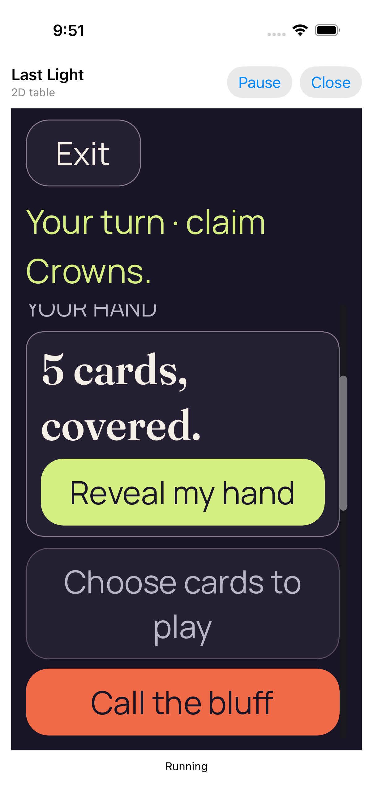</a> | **Failed authority wait** iPhone 17 simulator, actual native Last Light authority host Original: [1A0CB96E-19D3-47D8-8D72-BEC8B875D34F.png](attachments/1A0CB96E-19D3-47D8-8D72-BEC8B875D34F.png) 1206 × 2622 px; text 2× SHA-256: <code>374ff9acd134d70d809fe85d948c82dab923e90ba0581d4509fb6c4bfd46bd83</code> [Original measurements](attachments/4E3E6C50-16C6-4F83-B70D-A50CF466405D.json) Original reference test: Failure. failed - The real renderer must report current bounded diagnostics. Viewed directly at original resolution. Five cards are covered; Reveal and Call the bluff are complete and Choose cards is disabled. YOUR HAND clips at the upper scroll edge. Paired failure measurement: round 4/revision 10, one accepted play and three advances. Visible controls do not override the bounded-diagnostics failure. |

## 2D / 100% text

| Original image | Scenario and provenance |
| --- | --- |
| <a href="attachments/5FDB72F3-C00B-44AC-850C-A9BBBCB1EE65.png">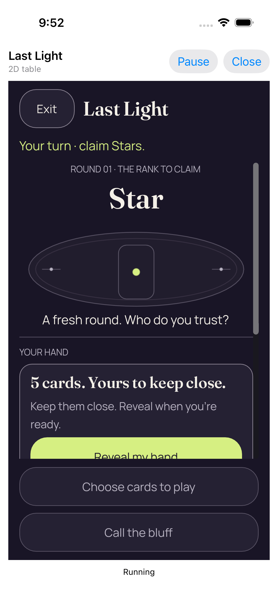</a> | **01 concealed 2d text 1** iPhone 17 simulator, actual native Last Light authority host Original: [5FDB72F3-C00B-44AC-850C-A9BBBCB1EE65.png](attachments/5FDB72F3-C00B-44AC-850C-A9BBBCB1EE65.png) 1206 × 2622 px; text 1× SHA-256: <code>92c667dc8936d075031eb341a3652df2d79fee9c8e426cb7f0466bf610dcfca0</code> [Original measurements](attachments/6FE766C4-A009-4DFC-8C19-7824DB747D91.json) Original reference test: Failure. XCTAssertEqual failed: (&quot;Optional(&quot;42&quot;)&quot;) is not equal to (&quot;Optional(&quot;41&quot;)&quot;) Initial Reveal clips: 31 of 56 logical points are visible; 25 points/75 pixels are below the clip. Later scrolled Reveal frames fit. |
| <a href="attachments/405C1183-3BCA-48EB-A577-29014159F1E1.png">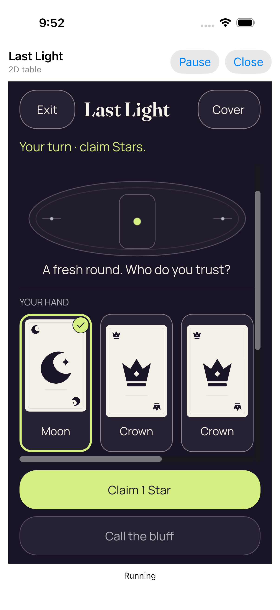</a> | **02 revealed and selected 2d text 1** iPhone 17 simulator, actual native Last Light authority host Original: [405C1183-3BCA-48EB-A577-29014159F1E1.png](attachments/405C1183-3BCA-48EB-A577-29014159F1E1.png) 1206 × 2622 px; text 1× SHA-256: <code>5b1e68d397a4b0191a07a22a147072c4ee21d848a3c5de273955a330ed668e02</code> [Original measurements](attachments/8AAA2C30-5164-4D59-8BA1-024F95CB4C62.json) Original reference test: Failure. XCTAssertEqual failed: (&quot;Optional(&quot;42&quot;)&quot;) is not equal to (&quot;Optional(&quot;41&quot;)&quot;) Moon is selected with a check/outline. The hand scrolls horizontally and does not show every card together. |
| <a href="attachments/079528EB-7186-4596-B6CE-7D211BD9EBCB.png">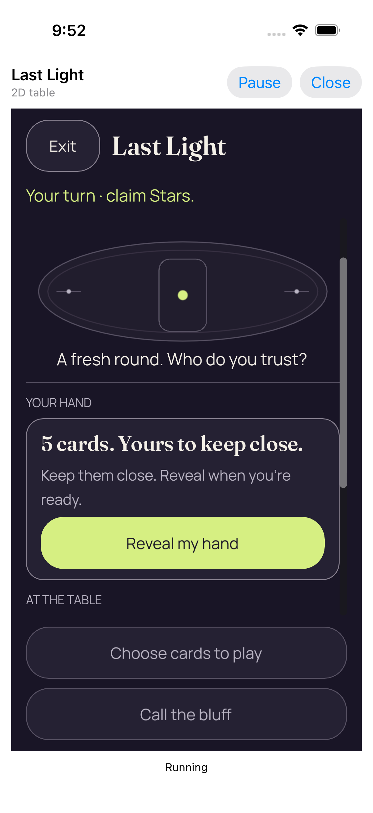</a> | **03 private bindings cleared 2d text 1** iPhone 17 simulator, actual native Last Light authority host Original: [079528EB-7186-4596-B6CE-7D211BD9EBCB.png](attachments/079528EB-7186-4596-B6CE-7D211BD9EBCB.png) 1206 × 2622 px; text 1× SHA-256: <code>8344648f837b10dc0ec9ebd7b3caa7f01cec2b50e50c38ed34a636dc06450b66</code> [Original measurements](attachments/A537EC1E-6B05-49B1-B37C-EED749BF5975.json) Original reference test: Failure. XCTAssertEqual failed: (&quot;Optional(&quot;42&quot;)&quot;) is not equal to (&quot;Optional(&quot;41&quot;)&quot;) Only concealed cards remain; private faces, per-card rank labels and selection are absent. Reveal/Show hand is complete. |
|  | **Native cover with paused private bindings cleared** iPhone 17 simulator, actual native Last Light authority host Original: [6D44AD4F-D817-4CDF-850D-01DB9ABCCA19.png](attachments/6D44AD4F-D817-4CDF-850D-01DB9ABCCA19.png) 1206 × 2622 px; text 1× SHA-256: <code>b1e758cd6ecdeaf578ebb69b52ce64d32c9943afb800467d7478e6bd417398e1</code> [Original measurements](attachments/95AED3CB-7EC7-45F3-9195-9A9A9B35EEED.json) Original reference test: Failure. XCTAssertEqual failed: (&quot;Optional(&quot;42&quot;)&quot;) is not equal to (&quot;Optional(&quot;41&quot;)&quot;) Native Pause presents an opaque cover with no private game content. |
|  | **Actual Home screen before game reactivation** iPhone 17 simulator, actual native Last Light authority host Original: [94A99EE0-32CD-457E-82E8-5AA30EE798EB.png](attachments/94A99EE0-32CD-457E-82E8-5AA30EE798EB.png) 1206 × 2622 px; text 1× SHA-256: <code>22ca945bc0704bd2551b7f580759ffc1a2cd273253fe4db3cdafd390c855fc90</code> [Original Home observation](attachments/0B7E1F64-AB85-465F-8433-00ABACE1A7C4.json) Original reference test: Failure. XCTAssertEqual failed: (&quot;Optional(&quot;42&quot;)&quot;) is not equal to (&quot;Optional(&quot;41&quot;)&quot;) SpringBoard and dock icons are visibly present. The original observation still reports applicationReportedBackground=false and application state 4; both observations are preserved. |
|  | **Same authority resumed with concealed cards** iPhone 17 simulator, actual native Last Light authority host Original: [F813FFC1-D824-4576-B3D8-167123D0D52D.png](attachments/F813FFC1-D824-4576-B3D8-167123D0D52D.png) 1206 × 2622 px; text 1× SHA-256: <code>eda6b5eab61b38ad0f8656e913b505dbdb6e9367c2e2011b396d0f0a8180ad3d</code> [Original measurements](attachments/2D712513-F435-4E80-A192-6015556136C5.json) Original reference test: Failure. XCTAssertEqual failed: (&quot;Optional(&quot;42&quot;)&quot;) is not equal to (&quot;Optional(&quot;41&quot;)&quot;) Only concealed cards remain; private faces, per-card rank labels and selection are absent. Reveal/Show hand is complete. |
| <a href="attachments/8725FB7C-4309-4EBD-A8C4-6D1EB7164757.png">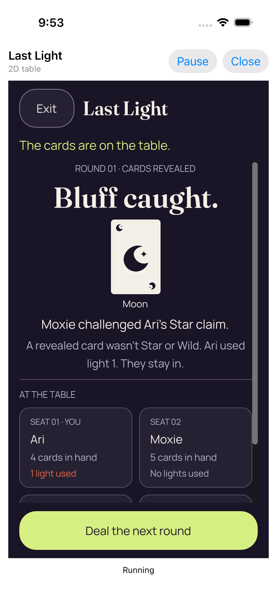</a> | **04 actual viewer play 2d text 1** iPhone 17 simulator, actual native Last Light authority host Original: [8725FB7C-4309-4EBD-A8C4-6D1EB7164757.png](attachments/8725FB7C-4309-4EBD-A8C4-6D1EB7164757.png) 1206 × 2622 px; text 1× SHA-256: <code>7a4ba2e322491d53329df959c640a272d9b0fe420981a9624636b9ea64b2f4e4</code> [Original measurements](attachments/490C3C8E-40DD-48EA-81E7-91496A52576F.json) Original reference test: Failure. XCTAssertEqual failed: (&quot;Optional(&quot;42&quot;)&quot;) is not equal to (&quot;Optional(&quot;41&quot;)&quot;) Paired screenshot checkpoint: round 1/revision 2, one accepted viewer play. Moxie challenges Ari’s Star claim and public Moon does not match. The complete light-1 Still in consequence and Next action fit. |
|  | **05 public outcome 2d text 1** iPhone 17 simulator, actual native Last Light authority host Original: [7D54F0F4-E709-41C4-A2FA-5DA563A79A71.png](attachments/7D54F0F4-E709-41C4-A2FA-5DA563A79A71.png) 1206 × 2622 px; text 1× SHA-256: <code>7a4ba2e322491d53329df959c640a272d9b0fe420981a9624636b9ea64b2f4e4</code> [Original measurements](attachments/B9ACA36E-F377-4B93-B765-93A520B2A0A8.json) Original reference test: Failure. XCTAssertEqual failed: (&quot;Optional(&quot;42&quot;)&quot;) is not equal to (&quot;Optional(&quot;41&quot;)&quot;) Paired screenshot checkpoint: round 1/revision 2, one accepted viewer play. Moxie challenges Ari’s Star claim and public Moon does not match. The complete light-1 Still in consequence and Next action fit. |
| <a href="attachments/EDE90B57-BF38-4EFA-AD0A-B2797F0AD790.png">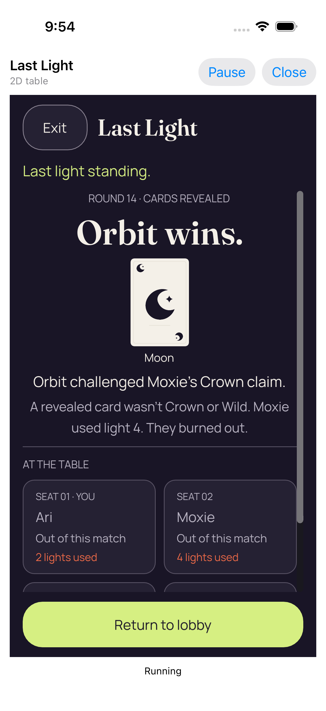</a> | **07 real winner 2d text 1** iPhone 17 simulator, actual native Last Light authority host Original: [EDE90B57-BF38-4EFA-AD0A-B2797F0AD790.png](attachments/EDE90B57-BF38-4EFA-AD0A-B2797F0AD790.png) 1206 × 2622 px; text 1× SHA-256: <code>19f8aa69a2b69031888193e3f9d407fb23e903367baef4dab144627889a3b63b</code> [Original measurements](attachments/BC7CD14E-0600-4584-8A9D-BD565E769E46.json) Original reference test: Failure. XCTAssertEqual failed: (&quot;Optional(&quot;42&quot;)&quot;) is not equal to (&quot;Optional(&quot;41&quot;)&quot;) Orbit wins at round 14; paired authority revision is 42. The complete named Crown-claim challenge, Moon mismatch, Moxie’s light-4 burnout and Return to lobby fit. The failed 42-versus-41 assertion is retained. |

## 3D / 200% text

| Original image | Scenario and provenance |
| --- | --- |
| <a href="attachments/96F3DB35-F710-4B79-A08B-812C42A9A28F.png">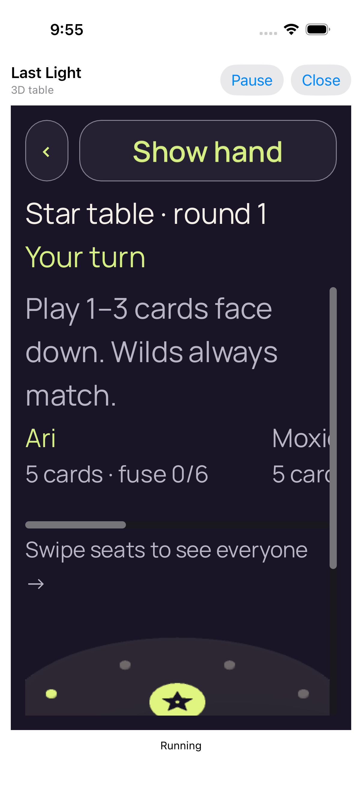</a> | **01 concealed 3d text 2** iPhone 17 simulator, actual native Last Light authority host Original: [96F3DB35-F710-4B79-A08B-812C42A9A28F.png](attachments/96F3DB35-F710-4B79-A08B-812C42A9A28F.png) 1206 × 2622 px; text 2× SHA-256: <code>911db91517736afe146a1babc3965feaadbe9d2aba76c7e5d92a7575b56940de</code> [Original measurements](attachments/ADA2EF75-E73C-4115-9014-214F6662ABA9.json) Original reference test: Failure. failed: caught error: &quot;controlMissing&quot; Show hand and turn/rank/round context are complete. The seat roster scrolls; at enlarged text the lower table continues below the viewport. |
| <a href="attachments/0FB5FF40-0E9A-4E92-AA26-5F11C210D1A3.png">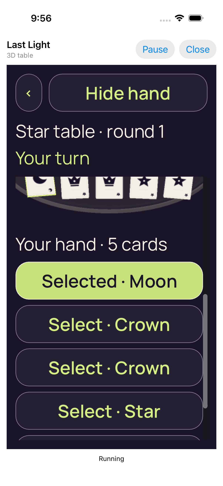</a> | **02 revealed and selected 3d text 2** iPhone 17 simulator, actual native Last Light authority host Original: [0FB5FF40-0E9A-4E92-AA26-5F11C210D1A3.png](attachments/0FB5FF40-0E9A-4E92-AA26-5F11C210D1A3.png) 1206 × 2622 px; text 2× SHA-256: <code>ca61fd2b2d7d0ab385862c95900b7bab3c048daaaa8b6644b5b3cea7fd857dfc</code> [Original measurements](attachments/863F2C03-D8EA-4012-8644-3D3101DEBC6A.json) Original reference test: Failure. failed: caught error: &quot;controlMissing&quot; Selected · Moon, two Crown controls and one Star fit; the fifth control is below. Visual table cards clip at the upper scroll edge. |
| <a href="attachments/F8390B2E-6901-4815-B5B1-FAA1828CC075.png">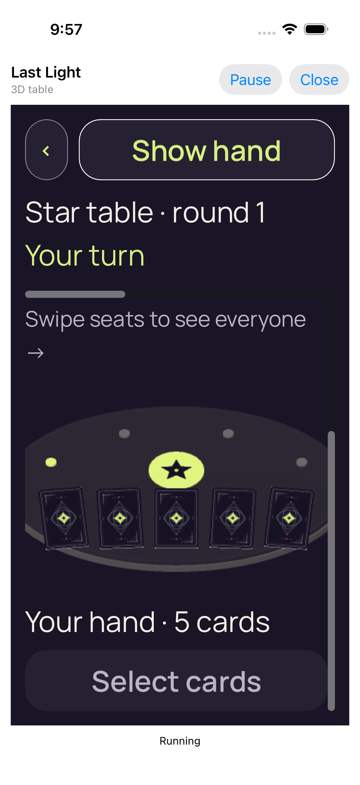</a> | **03 private bindings cleared 3d text 2** iPhone 17 simulator, actual native Last Light authority host Original: [F8390B2E-6901-4815-B5B1-FAA1828CC075.png](attachments/F8390B2E-6901-4815-B5B1-FAA1828CC075.png) 1206 × 2622 px; text 2× SHA-256: <code>560874299b445cc7f1a28aade0c359e70b0226278ad815d5e7cb50cc0d021812</code> [Original measurements](attachments/960622C2-EBC2-4C04-9557-A2973196A589.json) Original reference test: Failure. failed: caught error: &quot;controlMissing&quot; Only concealed cards remain; private faces, per-card rank labels and selection are absent. Reveal/Show hand is complete. |
|  | **Native cover with paused private bindings cleared** iPhone 17 simulator, actual native Last Light authority host Original: [C5497E4F-09FC-488A-AEB7-1909B1B6A6AF.png](attachments/C5497E4F-09FC-488A-AEB7-1909B1B6A6AF.png) 1206 × 2622 px; text 2× SHA-256: <code>2c020ce5bd1c99f8071b3520031e5691ea44582e56a2fb53e418a34efb659e22</code> [Original measurements](attachments/A563B024-0A81-49DA-9FAD-C5827FF987AB.json) Original reference test: Failure. failed: caught error: &quot;controlMissing&quot; Native Pause presents an opaque cover with no private game content. |
|  | **Actual Home screen before game reactivation** iPhone 17 simulator, actual native Last Light authority host Original: [CAD4321D-4935-41DE-A8D4-F6853EBBA4F4.png](attachments/CAD4321D-4935-41DE-A8D4-F6853EBBA4F4.png) 1206 × 2622 px; text 2× SHA-256: <code>363d0224ccc50f48b912ce1f7168ba070976b00a18820797a53794ebfd1c9e99</code> [Original Home observation](attachments/D82AE74F-A7E3-4798-A7CB-A5AD32EAA6A8.json) Original reference test: Failure. failed: caught error: &quot;controlMissing&quot; SpringBoard and dock icons are visibly present. The original observation still reports applicationReportedBackground=false and application state 4; both observations are preserved. |
| <a href="attachments/29BE8B05-C75B-448E-B177-A6CDE6500AB1.png">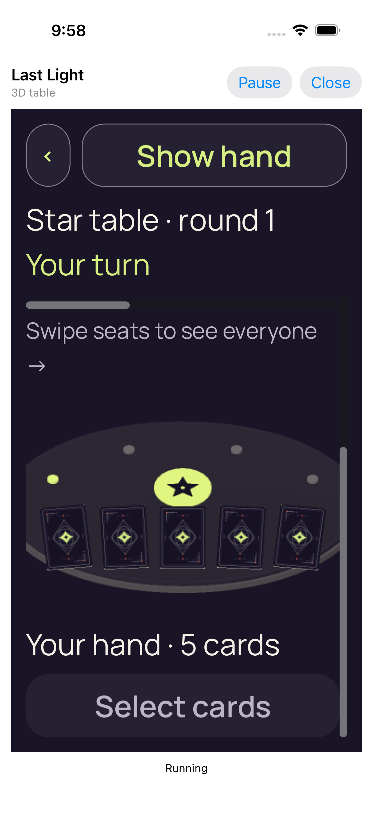</a> | **Same authority resumed with concealed cards** iPhone 17 simulator, actual native Last Light authority host Original: [29BE8B05-C75B-448E-B177-A6CDE6500AB1.png](attachments/29BE8B05-C75B-448E-B177-A6CDE6500AB1.png) 1206 × 2622 px; text 2× SHA-256: <code>60c30cbf2c4573067660e955f88ac0ca36f0b7107151c4157e1f5ee87e3adebe</code> [Original measurements](attachments/942C7483-ABAA-420A-8B23-39E02AF2F50A.json) Original reference test: Failure. failed: caught error: &quot;controlMissing&quot; Only concealed cards remain; private faces, per-card rank labels and selection are absent. Reveal/Show hand is complete. |
| <a href="attachments/0DD4EC28-7948-4F38-9320-824BC1244A55.png">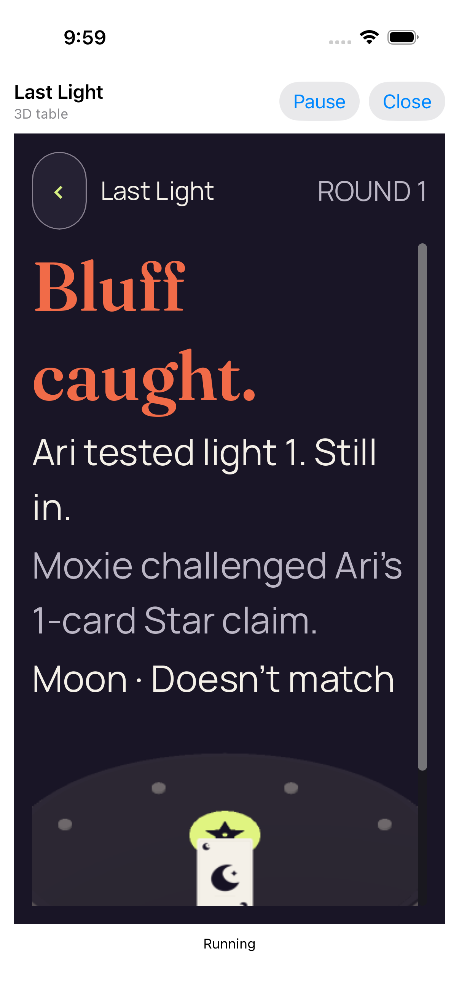</a> | **04 actual viewer play 3d text 2** iPhone 17 simulator, actual native Last Light authority host Original: [0DD4EC28-7948-4F38-9320-824BC1244A55.png](attachments/0DD4EC28-7948-4F38-9320-824BC1244A55.png) 1206 × 2622 px; text 2× SHA-256: <code>b74d7d03c6721525cac2081c77ca0127203c9487aabe136a4df3b19aa6884440</code> [Original measurements](attachments/169821B2-5FE1-42AD-8DC3-C48FE0AE1080.json) Original reference test: Failure. failed: caught error: &quot;controlMissing&quot; Paired screenshot checkpoint: round 1/revision 2, one accepted viewer play. Moxie challenges Ari’s Star claim and public Moon does not match. The complete named consequence fits, while the public card/table clips and Next is below the viewport. Later Next touches and app-stream progress are separate evidence; this earlier screenshot checkpoint is not the final test state. |
|  | **05 public outcome 3d text 2** iPhone 17 simulator, actual native Last Light authority host Original: [C9E25D7D-63EC-4E73-9315-DC6C7569C859.png](attachments/C9E25D7D-63EC-4E73-9315-DC6C7569C859.png) 1206 × 2622 px; text 2× SHA-256: <code>b74d7d03c6721525cac2081c77ca0127203c9487aabe136a4df3b19aa6884440</code> [Original measurements](attachments/34937D29-7529-427F-8CFE-ECAB4025A731.json) Original reference test: Failure. failed: caught error: &quot;controlMissing&quot; Paired screenshot checkpoint: round 1/revision 2, one accepted viewer play. Moxie challenges Ari’s Star claim and public Moon does not match. The complete named consequence fits, while the public card/table clips and Next is below the viewport. Later Next touches and app-stream progress are separate evidence; this earlier screenshot checkpoint is not the final test state. |

## 3D / 100% text

| Original image | Scenario and provenance |
| --- | --- |
| <a href="attachments/222CB0F0-1090-4FDB-950C-07EBEB964E71.png">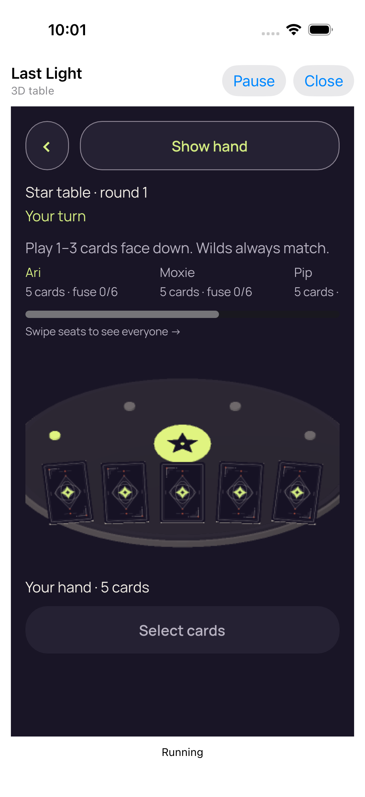</a> | **01 concealed 3d text 1** iPhone 17 simulator, actual native Last Light authority host Original: [222CB0F0-1090-4FDB-950C-07EBEB964E71.png](attachments/222CB0F0-1090-4FDB-950C-07EBEB964E71.png) 1206 × 2622 px; text 1× SHA-256: <code>d264e2dc6808a0f42d9d25f4a906cd0369083a9655413a7c69f7526d1c8dc001</code> [Original measurements](attachments/3DF5CD3A-2126-47FF-9750-0DFDC8404748.json) Original reference test: Failure. failed - The actual Godot control must be enabled. Show hand and turn/rank/round context are complete. The seat roster scrolls; at enlarged text the lower table continues below the viewport. |
| <a href="attachments/2803AD60-1CDB-4B4D-8540-5BDCCFA0915C.png">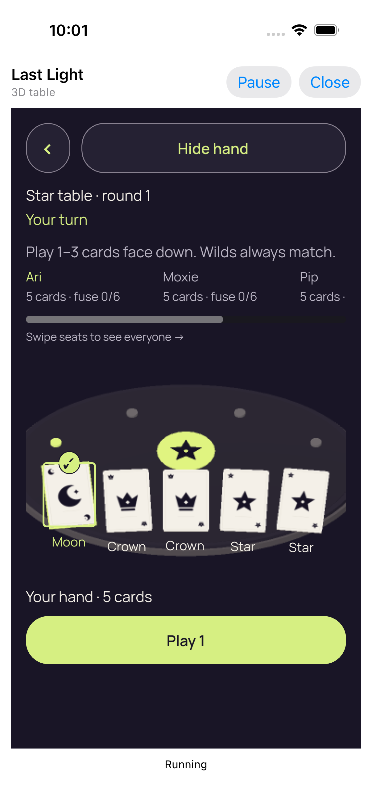</a> | **02 revealed and selected 3d text 1** iPhone 17 simulator, actual native Last Light authority host Original: [2803AD60-1CDB-4B4D-8540-5BDCCFA0915C.png](attachments/2803AD60-1CDB-4B4D-8540-5BDCCFA0915C.png) 1206 × 2622 px; text 1× SHA-256: <code>cda86ea023f994199cb460509a23cd857efdcfe93615492c167f8e0c3e031377</code> [Original measurements](attachments/9C6A9DF3-F3E7-498D-9393-DF7127BA686F.json) Original reference test: Failure. failed - The actual Godot control must be enabled. All five normal-size card faces/rank words and Play 1 fit; Moon has a check/outline. |
| <a href="attachments/3CE38DFB-E775-4CCF-AA44-8C5AC95E4525.png">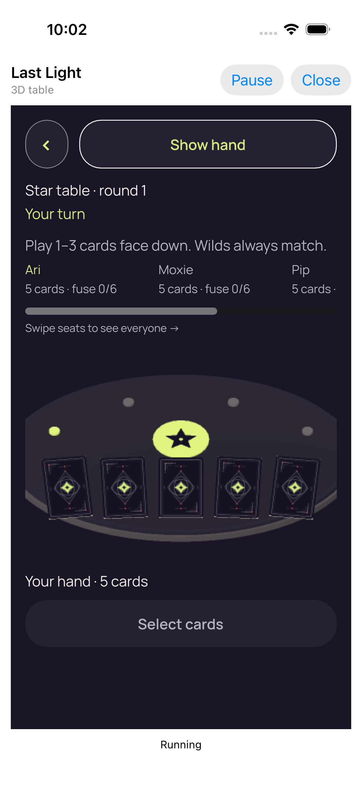</a> | **03 private bindings cleared 3d text 1** iPhone 17 simulator, actual native Last Light authority host Original: [3CE38DFB-E775-4CCF-AA44-8C5AC95E4525.png](attachments/3CE38DFB-E775-4CCF-AA44-8C5AC95E4525.png) 1206 × 2622 px; text 1× SHA-256: <code>1ae4fa1d54e20e2a7edd407bcaa15a310d1c89f18fdb1600b987026a47fdc5a5</code> [Original measurements](attachments/B02AEAEC-B715-4E9A-802D-B62311A7C9F5.json) Original reference test: Failure. failed - The actual Godot control must be enabled. Only concealed cards remain; private faces, per-card rank labels and selection are absent. Reveal/Show hand is complete. |
| <a href="attachments/0DA6DF6B-C04F-4473-A8FF-787CB41C1F0A.png">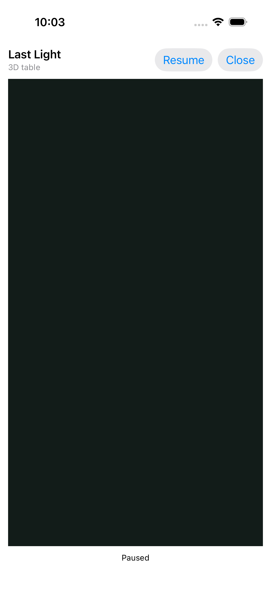</a> | **Native cover with paused private bindings cleared** iPhone 17 simulator, actual native Last Light authority host Original: [0DA6DF6B-C04F-4473-A8FF-787CB41C1F0A.png](attachments/0DA6DF6B-C04F-4473-A8FF-787CB41C1F0A.png) 1206 × 2622 px; text 1× SHA-256: <code>78f09e4068e3fa9c6392166a60954c620aec19113f368caec26985f4d861b513</code> [Original measurements](attachments/F427DF38-9A1F-4EA3-968C-33CB066A1510.json) Original reference test: Failure. failed - The actual Godot control must be enabled. Native Pause presents an opaque cover with no private game content. |
|  | **Actual Home screen before game reactivation** iPhone 17 simulator, actual native Last Light authority host Original: [C3689E53-9146-47F1-B1A5-B040FDDCE0F1.png](attachments/C3689E53-9146-47F1-B1A5-B040FDDCE0F1.png) 1206 × 2622 px; text 1× SHA-256: <code>e948b1abc1b1e100645ad696a5763f3cbdf53c3d98b3eb076d67638eb7b83d59</code> [Original Home observation](attachments/3B05F18B-756C-4A53-93D9-E8C27F2D9188.json) Original reference test: Failure. failed - The actual Godot control must be enabled. SpringBoard and dock icons are visibly present. The original observation still reports applicationReportedBackground=false and application state 4; both observations are preserved. |
|  | **Same authority resumed with concealed cards** iPhone 17 simulator, actual native Last Light authority host Original: [94ABE9F5-69B0-485C-83B3-E570100D3CDE.png](attachments/94ABE9F5-69B0-485C-83B3-E570100D3CDE.png) 1206 × 2622 px; text 1× SHA-256: <code>b1883edd9d0d375dbef3570f2399d85f49e7a261cb3a61ceead0d02cdb51e770</code> [Original measurements](attachments/7DD6FE35-45AC-4159-80FD-71F5369969EE.json) Original reference test: Failure. failed - The actual Godot control must be enabled. Only concealed cards remain; private faces, per-card rank labels and selection are absent. Reveal/Show hand is complete. |
| <a href="attachments/8DD13522-1FA0-476D-A7F8-C881B46B02C9.png">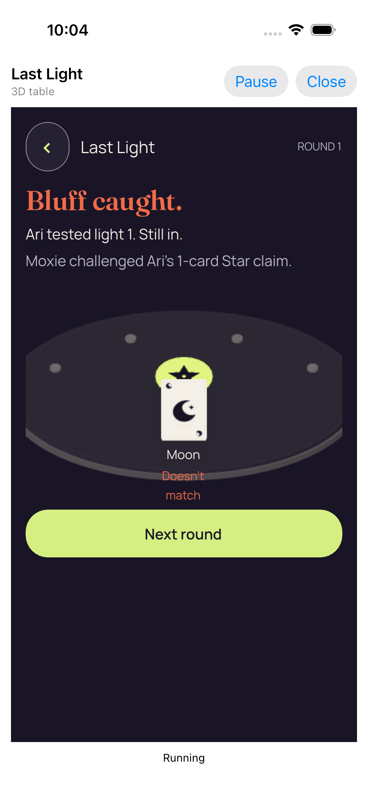</a> | **04 actual viewer play 3d text 1** iPhone 17 simulator, actual native Last Light authority host Original: [8DD13522-1FA0-476D-A7F8-C881B46B02C9.png](attachments/8DD13522-1FA0-476D-A7F8-C881B46B02C9.png) 1206 × 2622 px; text 1× SHA-256: <code>a855ad22c03c0395bf2326df25124ce20bdbd1c060eb769f5a0f70cd09008d79</code> [Original measurements](attachments/16B6940F-9221-45B2-A5DD-DD613D6748F3.json) Original reference test: Failure. failed - The actual Godot control must be enabled. Paired screenshot checkpoint: round 1/revision 2, one accepted viewer play. Moxie challenges Ari’s Star claim and public Moon does not match. The complete light-1 Still in consequence and Next action fit. Later Next touches and app-stream progress are separate evidence; this earlier screenshot checkpoint is not the final test state. |
|  | **05 public outcome 3d text 1** iPhone 17 simulator, actual native Last Light authority host Original: [6783E95D-B6AB-4EE7-B68D-2AA0B9374110.png](attachments/6783E95D-B6AB-4EE7-B68D-2AA0B9374110.png) 1206 × 2622 px; text 1× SHA-256: <code>a855ad22c03c0395bf2326df25124ce20bdbd1c060eb769f5a0f70cd09008d79</code> [Original measurements](attachments/BFA86F4A-1C13-44D4-8F6A-13D7AFF90797.json) Original reference test: Failure. failed - The actual Godot control must be enabled. Paired screenshot checkpoint: round 1/revision 2, one accepted viewer play. Moxie challenges Ari’s Star claim and public Moon does not match. The complete light-1 Still in consequence and Next action fit. Later Next touches and app-stream progress are separate evidence; this earlier screenshot checkpoint is not the final test state. |

## Secure default renderer Exit

| Original image | Scenario and provenance |
| --- | --- |
| <a href="attachments/6CFF04E3-5306-465E-B3C7-58FE0849238C.png">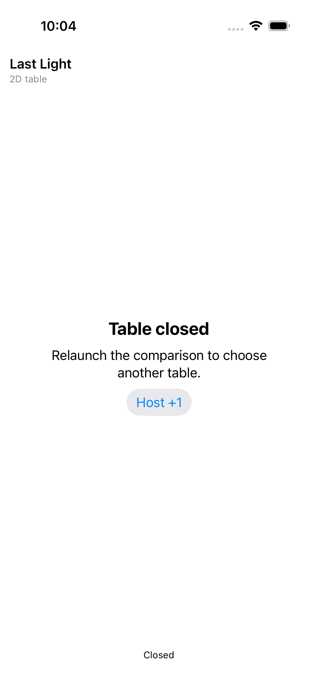</a> | **Secure default table exited through Godot input** iPhone 17 simulator, actual native Last Light authority host Original: [6CFF04E3-5306-465E-B3C7-58FE0849238C.png](attachments/6CFF04E3-5306-465E-B3C7-58FE0849238C.png) 1206 × 2622 px; text 1× SHA-256: <code>5fe080b99d5b0b2f7a47ff96e374510f1240f82cb93abc3bd38693aa1eca6c85</code> [Original measurements](attachments/316007A0-B6E9-43FB-BCEF-A79795EBCE03.json) Original secure default renderer Exit test: Success; no full secure match or retained-engine lifecycle is qualified. Viewed directly at original resolution. Table closed, the relaunch instruction, Host +1 and Closed status appear; the Godot surface is absent. |
