# Godot iOS authority host — CI 34473325295

All four reference-seed-2 matches at normal/200% text pass with authority return, and secure default renderer Exit passes. This is the preceding successful authority run.

45 unchanged original PNGs from exact revision `0f666e0ab7fdce63d5fa668442dae1c9fda86a1d`, renderer PCK SHA-256 `91eeb2fba17dd291564bf2e005f85c0924f813f044f945297f10b281e608b2e6`. The enclosing workflow concludes `failure`. Companion suite: [godot-ios-retained-34473325295](../godot-ios-retained-34473325295/README.md).

These are actual iPhone 17 simulator captures at 1206 × 2622 pixels. Authority scale labels follow their recorded cases; retained scale is left unrecorded where measurements do not specify it. Each thumbnail opens its unchanged original UUID filename.

| Recorded case | Result | Original PNGs | Scope |
| --- | --- | ---: | --- |
| 2D · 200% text | Success | 11 | 2D at 200% passes the complete reference match and authority return. The initial Reveal panel fits, but the hand, result explanation and lobby action require scrolling; the larger named winner is fully visible. |
| 2D · 100% text | Success | 11 | Normal 2D completes the reference match and returns through the authority. Its initial Reveal control remains clipped; scrolling exposes later hand controls fully. Result and winner actions fit, while the seat grid extends below the scroll area. |
| 3D · 200% text | Success | 11 | 3D at 200% passes the complete reference match and authority return. The fixed rank/turn and Show/Hide header remain clear, while table geometry, the card list, lower result content and lobby action require scrolling. |
| 3D · 100% text | Success | 11 | Normal 3D passes its complete reference match and authority return. Hand faces and main actions fit; the final winner includes a correct Crown table emblem, Moon proof and named burnout explanation. The roster remains horizontally scrollable. |
| Secure default renderer Exit | Success | 1 | Secure default renderer Exit passes within its bounded launch-and-exit scope. |

The [independent source audit](review/partydeck-gallery-next-ios-34473325295-source-audit.json) verifies all six ZIPs and 3,146 extracted members, original SQLite case results, exported payload identities, producer source inputs, compiled PCK entries and both packaged apps. The [completed visual review](review/partydeck-gallery-next-ios-34473325295-visual-review.json) binds every image to its per-image notes. Internal review sheets remain outside the gallery.

This suite has 404 independently verified original attachment payloads. Compact measurements, failed predicates, results, source and provenance are published here. Other large runtime logs, archives, binaries and internal attachments remain separately retained with exact source paths and hashes in the audit; verification is not a claim that every large payload was duplicated into this page.

This run predates the demand-redraw change. The optional mouse-interception patch is absent. Comparing these revisions does not isolate a frame, texture, scheduling or stall cause.

Native production KMP factories, VoiceOver traversal, physical-device Metal/performance, physical sensor shutdown and real audio interruptions are not qualified by these simulator cases. Secure default Exit is a launch-and-exit fixture, not a secure-default full match.

## 2D · 200% text

2D at 200% passes the complete reference match and authority return. The initial Reveal panel fits, but the hand, result explanation and lobby action require scrolling; the larger named winner is fully visible.

| Original image | Scenario and provenance |
| --- | --- |
| <a href="attachments/58471CF6-27DF-4228-A663-0E8CD708284D.png">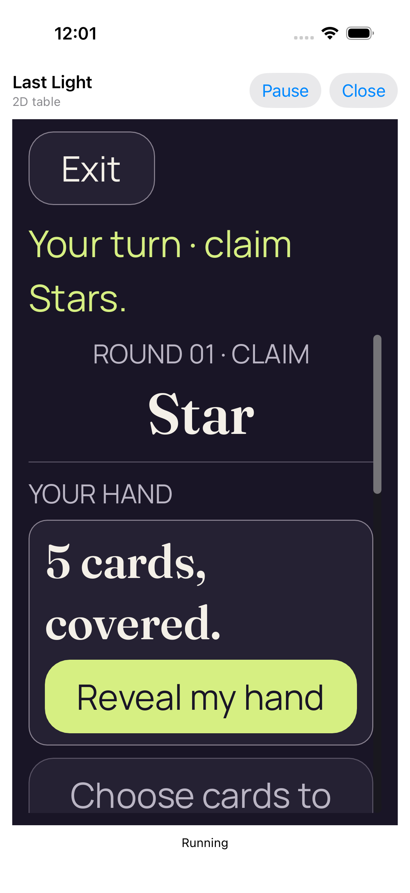</a> | **01 concealed 2d text 2** iPhone 17 simulator, actual native Last Light authority host Original: [58471CF6-27DF-4228-A663-0E8CD708284D.png](attachments/58471CF6-27DF-4228-A663-0E8CD708284D.png) 1206 × 2622 px; text 2× SHA-256: <code>031b0b0ad06af3235c2e3886de65ba319f5dadd9b9a8a84716e444b0a804e4f4</code> [Original paired measurements](evidence/attachments/2FE2C06A-DDB9-492F-80BD-F6BFC3E1B667.json) Recorded enclosing case: Success Initial Reveal label and rounded panel are complete. The disabled Choose cards action continues below the scroll viewport. |
| <a href="attachments/CF0FD7C3-F9EA-417C-BE8A-882B6F9D23A6.png">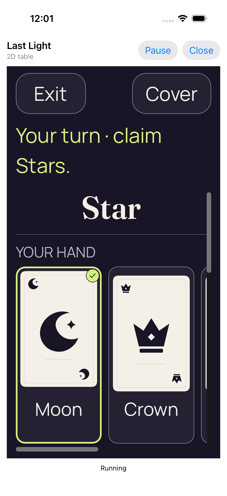</a> | **02 revealed and selected 2d text 2** iPhone 17 simulator, actual native Last Light authority host Original: [CF0FD7C3-F9EA-417C-BE8A-882B6F9D23A6.png](attachments/CF0FD7C3-F9EA-417C-BE8A-882B6F9D23A6.png) 1206 × 2622 px; text 2× SHA-256: <code>c3d37f174dc4d93438966b1ee060f9c8d620d12069e2634bf0636f010244314e</code> [Original paired measurements](evidence/attachments/9CF58D22-3DD1-4C6B-9DBF-E253D1D01510.json) Recorded enclosing case: Success The selected Moon has a complete lime outline and check. Crown is readable; further cards require horizontal scrolling and the play action is below the current viewport. |
| <a href="attachments/0C98608C-030C-4753-B4AE-EFA4656B9C92.png">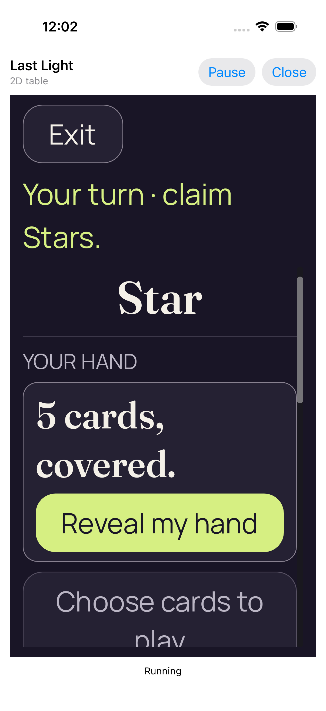</a> | **03 private bindings cleared 2d text 2** iPhone 17 simulator, actual native Last Light authority host Original: [0C98608C-030C-4753-B4AE-EFA4656B9C92.png](attachments/0C98608C-030C-4753-B4AE-EFA4656B9C92.png) 1206 × 2622 px; text 2× SHA-256: <code>30c2dbd6e31e893a16a3cbe7483dee623aadb1d31e04d81e907c1c2e1bf12c05</code> [Original paired measurements](evidence/attachments/A70F5A99-2973-4EDB-9F1A-54C7BAF758D3.json) Recorded enclosing case: Success Private faces are replaced by the covered-hand panel. Reveal is complete; the lower disabled action is clipped by the scroll viewport. |
| <a href="attachments/4C9A3042-ECB1-4EFB-B8E0-27AFE83ED1F5.png">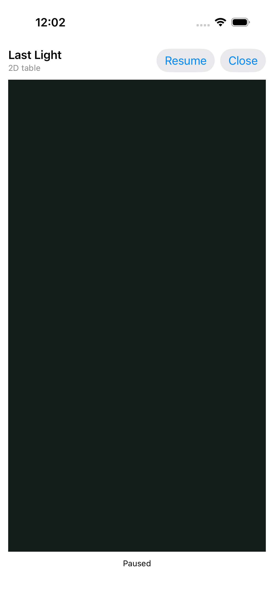</a> | **Native cover with paused private bindings cleared** iPhone 17 simulator, actual native Last Light authority host Original: [4C9A3042-ECB1-4EFB-B8E0-27AFE83ED1F5.png](attachments/4C9A3042-ECB1-4EFB-B8E0-27AFE83ED1F5.png) 1206 × 2622 px; text 2× SHA-256: <code>e640cbf2e882ceac761b1e432eb7f474357065ef39d5de0030a92943e824fab0</code> [Original paired measurements](evidence/attachments/99588ECF-A3FA-4A79-8DAB-BA0659155942.json) Recorded enclosing case: Success An opaque dark native cover fills the renderer surface. Resume and Close remain in the native header; no game hand is visible. |
|  | **Actual Home screen before game reactivation** iPhone 17 simulator, actual native Last Light authority host Original: [45225120-9C99-44BE-845A-15261EEFE432.png](attachments/45225120-9C99-44BE-845A-15261EEFE432.png) 1206 × 2622 px; text 2× SHA-256: <code>baf37d439db66cdb6fedef845844b9ed03c1e9cedda609d528d4be4da879fb6e</code> Recorded enclosing case: Success The actual iOS Home screen and Safari/Messages dock are visible. No game content is exposed; raw application-state discrepancies remain in the evidence. |
|  | **Same authority resumed with concealed cards** iPhone 17 simulator, actual native Last Light authority host Original: [D001ADB2-B70C-46A6-B924-711846D52ED1.png](attachments/D001ADB2-B70C-46A6-B924-711846D52ED1.png) 1206 × 2622 px; text 2× SHA-256: <code>f80441bc798f37df76401e6b56da6f2f4c37897e05e6f54119889af45baebebf</code> [Original paired measurements](evidence/attachments/5E5C5A0A-B03D-4A69-9C4D-680E27FC7A9F.json) Recorded enclosing case: Success The resumed view is concealed with a complete Reveal control. The disabled action still extends below the viewport. |
| <a href="attachments/FAD22E32-3095-4B28-89F4-494F23BDBF35.png">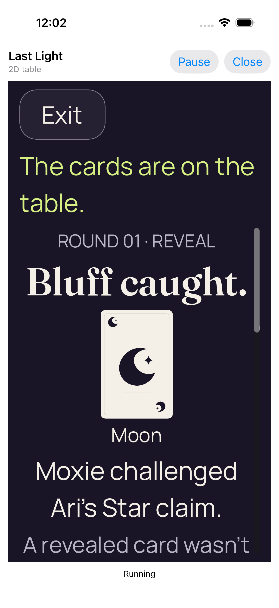</a> | **04 actual viewer play 2d text 2** iPhone 17 simulator, actual native Last Light authority host Original: [FAD22E32-3095-4B28-89F4-494F23BDBF35.png](attachments/FAD22E32-3095-4B28-89F4-494F23BDBF35.png) 1206 × 2622 px; text 2× SHA-256: <code>53eb77732073a7387a280bb078bb07cae846382fde18d6dc38fcd57e9a8fa5c6</code> [Original paired measurements](evidence/attachments/E1EA9E79-82A2-49D0-8838-A2F0D2EE6279.json) Recorded enclosing case: Success The public Moon and Bluff caught heading are clear. The named challenge wraps legibly; the explanation and next action extend below the viewport. |
|  | **05 public outcome 2d text 2** iPhone 17 simulator, actual native Last Light authority host Original: [E833B774-99A8-4B02-B6E9-8C38DA12A435.png](attachments/E833B774-99A8-4B02-B6E9-8C38DA12A435.png) 1206 × 2622 px; text 2× SHA-256: <code>53eb77732073a7387a280bb078bb07cae846382fde18d6dc38fcd57e9a8fa5c6</code> [Original paired measurements](evidence/attachments/7A8D670E-D4E8-40E8-993A-8C24064CC3D7.json) Recorded enclosing case: Success The separately captured public outcome retains the same readable proof and clipped lower explanation; it remains a distinct original. |
| <a href="attachments/76F661E7-508F-43E2-B755-0B586416E39A.png">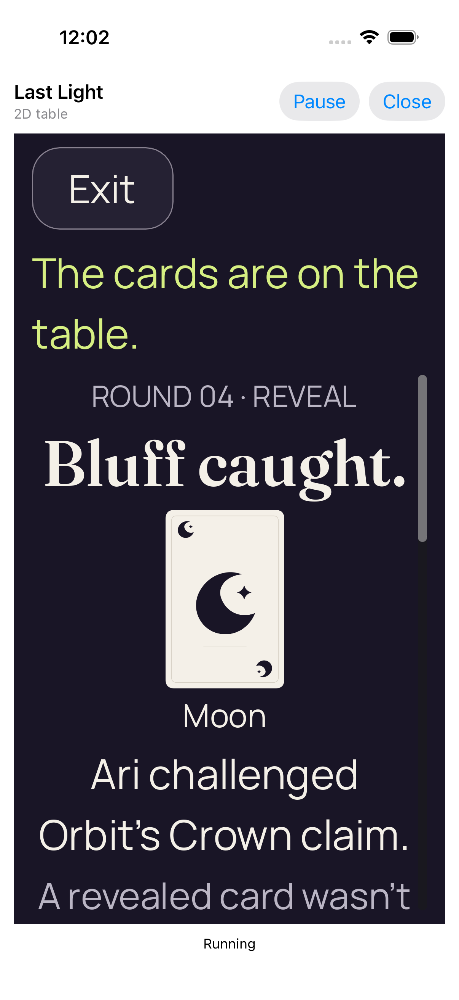</a> | **06 actual viewer challenge 2d text 2** iPhone 17 simulator, actual native Last Light authority host Original: [76F661E7-508F-43E2-B755-0B586416E39A.png](attachments/76F661E7-508F-43E2-B755-0B586416E39A.png) 1206 × 2622 px; text 2× SHA-256: <code>ca3bbdb6ef72e25b938030e028926054d19284b214aaec393bb4168f99adb27b</code> [Original paired measurements](evidence/attachments/C7DDF086-15A9-48F7-91F0-AE15DF98E25A.json) Recorded enclosing case: Success Round 4 shows a readable Bluff caught heading, public Moon and Ari challenging Orbit. The lower explanation and next action remain below the current viewport. |
| <a href="attachments/2DB787D4-87E6-428E-B8C2-5BB714EA483C.png">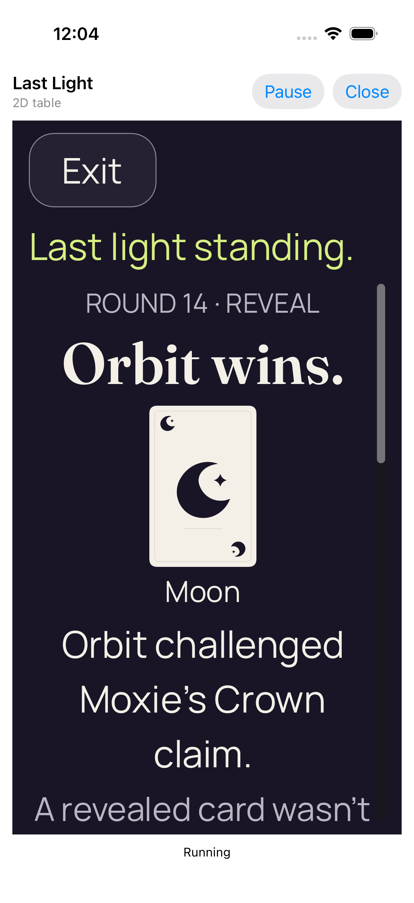</a> | **07 real winner 2d text 2** iPhone 17 simulator, actual native Last Light authority host Original: [2DB787D4-87E6-428E-B8C2-5BB714EA483C.png](attachments/2DB787D4-87E6-428E-B8C2-5BB714EA483C.png) 1206 × 2622 px; text 2× SHA-256: <code>32be44cb093e41677916608054d4f65d2b26dbd27d75501f28a2c7667545539c</code> [Original paired measurements](evidence/attachments/E0A82418-7656-4C0C-83E4-AF753427B26D.json) Recorded enclosing case: Success Orbit wins and the public Moon are fully visible. The named Crown challenge wraps clearly, while the lower explanation and lobby action require scrolling. The original complete case passes. |
|  | **09 table returned through authority 2d text 2** iPhone 17 simulator, actual native Last Light authority host Original: [711F4AA0-5DAD-4711-9F9B-976F80EF5BC2.png](attachments/711F4AA0-5DAD-4711-9F9B-976F80EF5BC2.png) 1206 × 2622 px; text 2× SHA-256: <code>54e68b5f2f170d395363940c313466285085db116095c2a9d9212716355785c1</code> [Original paired measurements](evidence/attachments/40F6DA05-E79A-438B-9E54-C85B75B77A87.json) Recorded enclosing case: Success The authority return reaches the native Table closed shell with relaunch guidance, Host +1 and Closed status; no game content remains. |

## 2D · 100% text

Normal 2D completes the reference match and returns through the authority. Its initial Reveal control remains clipped; scrolling exposes later hand controls fully. Result and winner actions fit, while the seat grid extends below the scroll area.

| Original image | Scenario and provenance |
| --- | --- |
| <a href="attachments/64A9D245-0DC8-4AD4-A9E8-B589DA97205C.png">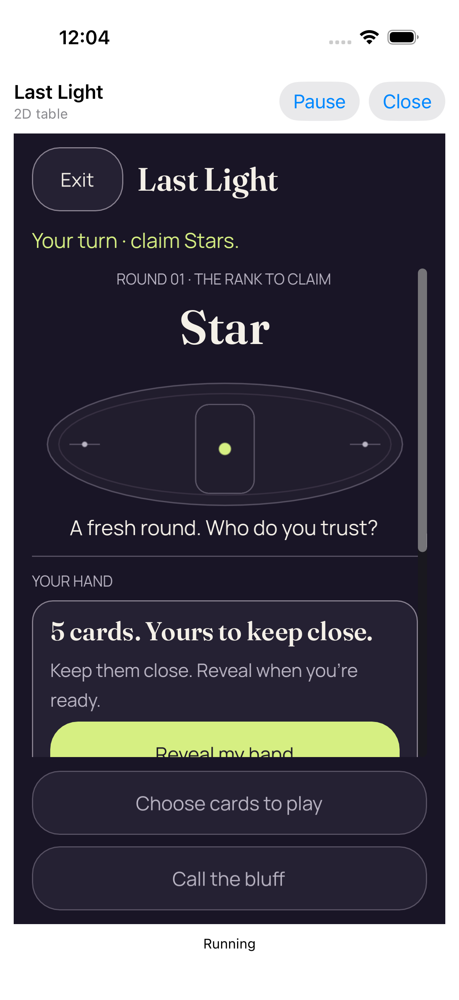</a> | **01 concealed 2d text 1** iPhone 17 simulator, actual native Last Light authority host Original: [64A9D245-0DC8-4AD4-A9E8-B589DA97205C.png](attachments/64A9D245-0DC8-4AD4-A9E8-B589DA97205C.png) 1206 × 2622 px; text 1× SHA-256: <code>774bebd913dc8b049a500dbf22690a4ba73ee37022a4c90389c0403c193ff5ea</code> [Original paired measurements](evidence/attachments/5B053283-E1F5-4A44-8B06-BC17375FA5F5.json) Recorded enclosing case: Success Initial Reveal is cut by the lower edge of the central scroll region: its text and lower border are incomplete. The fixed Choose cards and Call the bluff actions fit. |
| <a href="attachments/17C270A0-CE80-4A82-9581-D4CE99D15443.png">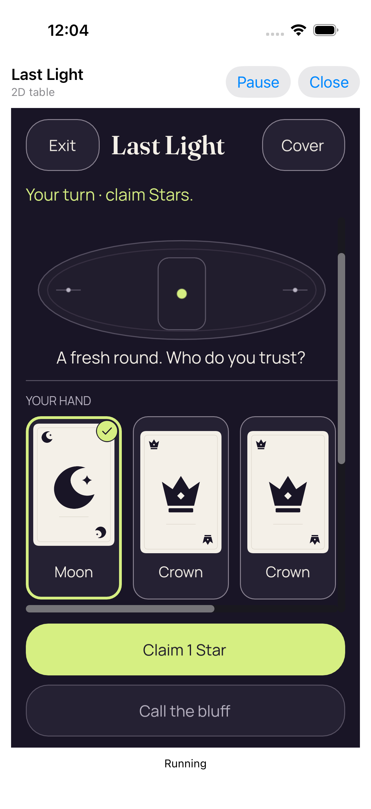</a> | **02 revealed and selected 2d text 1** iPhone 17 simulator, actual native Last Light authority host Original: [17C270A0-CE80-4A82-9581-D4CE99D15443.png](attachments/17C270A0-CE80-4A82-9581-D4CE99D15443.png) 1206 × 2622 px; text 1× SHA-256: <code>c6b42e24e604ab52430e22d8afc2d010823c51635ae2f725a01eaff170bed960</code> [Original paired measurements](evidence/attachments/E6936178-E602-4BCA-B698-937E8D14D1AC.json) Recorded enclosing case: Success After scrolling, the selected Moon outline/check and visible Crown cards are complete. Claim 1 Star and the disabled bluff action fit below the hand. |
| <a href="attachments/220C19B5-A5A5-41E2-9760-0602AC421D41.png">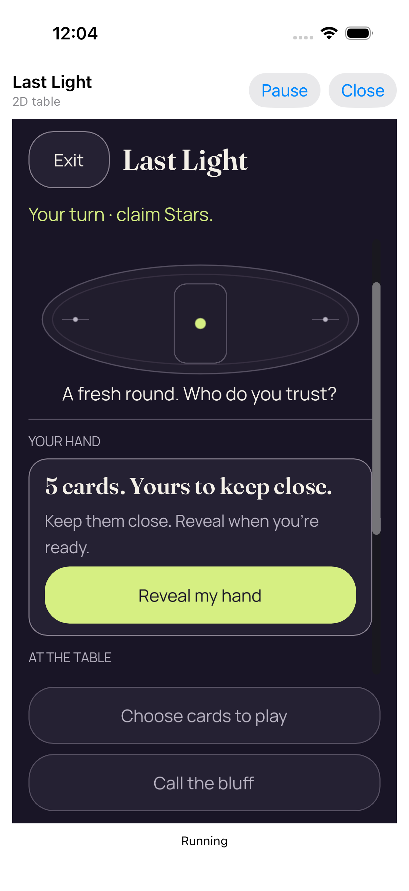</a> | **03 private bindings cleared 2d text 1** iPhone 17 simulator, actual native Last Light authority host Original: [220C19B5-A5A5-41E2-9760-0602AC421D41.png](attachments/220C19B5-A5A5-41E2-9760-0602AC421D41.png) 1206 × 2622 px; text 1× SHA-256: <code>a82ffe17d49fe71c394383b3d96684652b306adb7fb3bc906458555c7dc2b674</code> [Original paired measurements](evidence/attachments/FE0B7E48-BA79-466D-920A-253D6288A064.json) Recorded enclosing case: Success Cover removes private faces and exposes the full Reveal button in the scrolled panel. The title and current claim remain readable. |
|  | **Native cover with paused private bindings cleared** iPhone 17 simulator, actual native Last Light authority host Original: [C8718BBE-6DA8-4910-AA1F-00C8E930F02B.png](attachments/C8718BBE-6DA8-4910-AA1F-00C8E930F02B.png) 1206 × 2622 px; text 1× SHA-256: <code>3c57604170a7085e038e29df6cc67dad07dd83b4343d95080e37e9e4e8db9353</code> [Original paired measurements](evidence/attachments/2AD16C93-A4F8-4EF2-BDEC-F667AEC9E096.json) Recorded enclosing case: Success The native paused surface is fully covered. Resume and Close remain visible and no private card face is exposed. |
|  | **Actual Home screen before game reactivation** iPhone 17 simulator, actual native Last Light authority host Original: [BD4FDB78-9FEE-4667-8DB2-2F786B370784.png](attachments/BD4FDB78-9FEE-4667-8DB2-2F786B370784.png) 1206 × 2622 px; text 1× SHA-256: <code>0fc9db737f37caef1f7c283a53b1c32155614e677ff37ec3bb9d43865343ea3d</code> Recorded enclosing case: Success The actual Home screen and Safari/Messages dock are visible without game content. Preserve the original application-state report alongside this observation. |
|  | **Same authority resumed with concealed cards** iPhone 17 simulator, actual native Last Light authority host Original: [C00D1339-A77A-4999-84DA-185989895E72.png](attachments/C00D1339-A77A-4999-84DA-185989895E72.png) 1206 × 2622 px; text 1× SHA-256: <code>0e38ab4ff709e35f922e4876fdb49e6119dc64e7a74f7f61707ba90929788ce5</code> [Original paired measurements](evidence/attachments/330A1CA3-05B1-4B8A-A2E3-807F00427146.json) Recorded enclosing case: Success The same authority resumes concealed. The full Reveal panel and fixed disabled gameplay actions fit this scrolled state. |
|  | **04 actual viewer play 2d text 1** iPhone 17 simulator, actual native Last Light authority host Original: [DAC16416-6DB5-452C-BAA1-0196742195F9.png](attachments/DAC16416-6DB5-452C-BAA1-0196742195F9.png) 1206 × 2622 px; text 1× SHA-256: <code>3c8f6e6eb4804878b3ad3c0e5e01c211f66c92792c91a681dddf07fd5d7e3d9e</code> [Original paired measurements](evidence/attachments/397929CD-BAF2-4396-875F-4E098A198FE6.json) Recorded enclosing case: Success Bluff caught, the Moon proof, named challenge and light consequence are readable. Deal the next round is complete; lower seat rows continue in the scroll region. |
| <a href="attachments/6C600F09-522B-46B1-8112-A9B3CC04C767.png">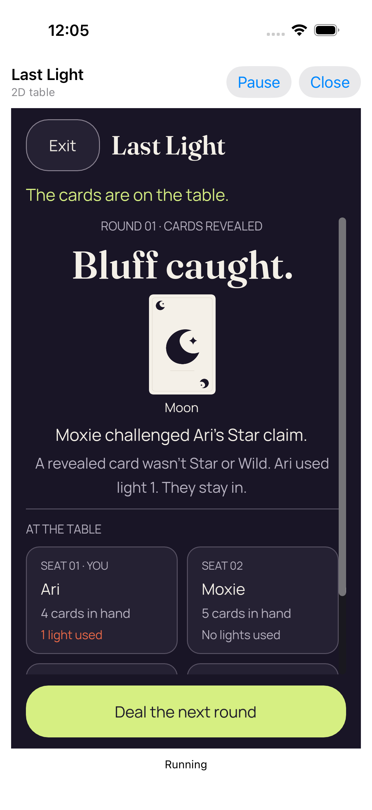</a> | **05 public outcome 2d text 1** iPhone 17 simulator, actual native Last Light authority host Original: [6C600F09-522B-46B1-8112-A9B3CC04C767.png](attachments/6C600F09-522B-46B1-8112-A9B3CC04C767.png) 1206 × 2622 px; text 1× SHA-256: <code>3c8f6e6eb4804878b3ad3c0e5e01c211f66c92792c91a681dddf07fd5d7e3d9e</code> [Original paired measurements](evidence/attachments/2F6CECFE-4876-4DD0-A938-0FA519721CCB.json) Recorded enclosing case: Success The separate public-outcome capture retains the full proof and next action, with the lower seat grid partly outside the viewport. |
| <a href="attachments/B137C059-4857-42E6-81D6-5D95DB914F55.png">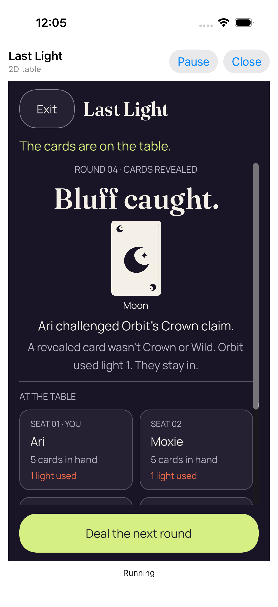</a> | **06 actual viewer challenge 2d text 1** iPhone 17 simulator, actual native Last Light authority host Original: [B137C059-4857-42E6-81D6-5D95DB914F55.png](attachments/B137C059-4857-42E6-81D6-5D95DB914F55.png) 1206 × 2622 px; text 1× SHA-256: <code>df79c0bc4b1e7eb88e037979ace3c9926c88ec980d0a939767caa66d84c99fbd</code> [Original paired measurements](evidence/attachments/9B20DD36-75BA-4819-975C-9927F08CDD94.json) Recorded enclosing case: Success Round 4 names Ari challenging Orbit and shows the Moon mismatch. The explanation and next-round action fit; lower seats remain scrollable. |
| <a href="attachments/B29C9983-7C1F-43EE-8C91-D0ACB76C344C.png">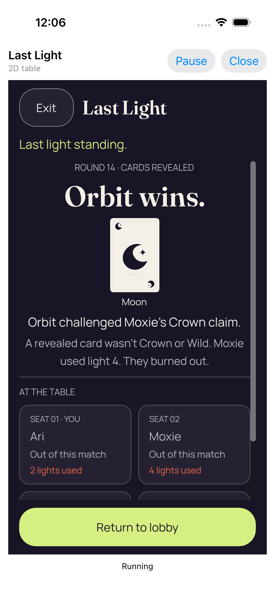</a> | **07 real winner 2d text 1** iPhone 17 simulator, actual native Last Light authority host Original: [B29C9983-7C1F-43EE-8C91-D0ACB76C344C.png](attachments/B29C9983-7C1F-43EE-8C91-D0ACB76C344C.png) 1206 × 2622 px; text 1× SHA-256: <code>6cd1a4f34c6f58f711a87fd35e845f3b77cecff52260334ca6a6df1f3fab4bd3</code> [Original paired measurements](evidence/attachments/11303C24-E7B8-4498-957E-B38771F09AFE.json) Recorded enclosing case: Success Orbit wins, the Moon proof, named challenge and Moxie burnout explanation are complete. Return to lobby is fully visible; lower seat rows remain scrollable. |
|  | **09 table returned through authority 2d text 1** iPhone 17 simulator, actual native Last Light authority host Original: [99FDBAC8-CAF1-45B3-8D30-EBD6478B6761.png](attachments/99FDBAC8-CAF1-45B3-8D30-EBD6478B6761.png) 1206 × 2622 px; text 1× SHA-256: <code>ad4e01d464d3ca3110c6c6d519c8fd8cdd8e3f1e2505b308ec00ab4a91e0ebff</code> [Original paired measurements](evidence/attachments/87D93A0D-0F93-471D-9CAC-2F5BC754E355.json) Recorded enclosing case: Success The renderer has closed into the native Table closed shell. Relaunch guidance, Host +1 and Closed status are visible, with no game cards. |

## 3D · 200% text

3D at 200% passes the complete reference match and authority return. The fixed rank/turn and Show/Hide header remain clear, while table geometry, the card list, lower result content and lobby action require scrolling.

| Original image | Scenario and provenance |
| --- | --- |
| <a href="attachments/EBC327B8-5D40-470B-8396-9C36355532FE.png">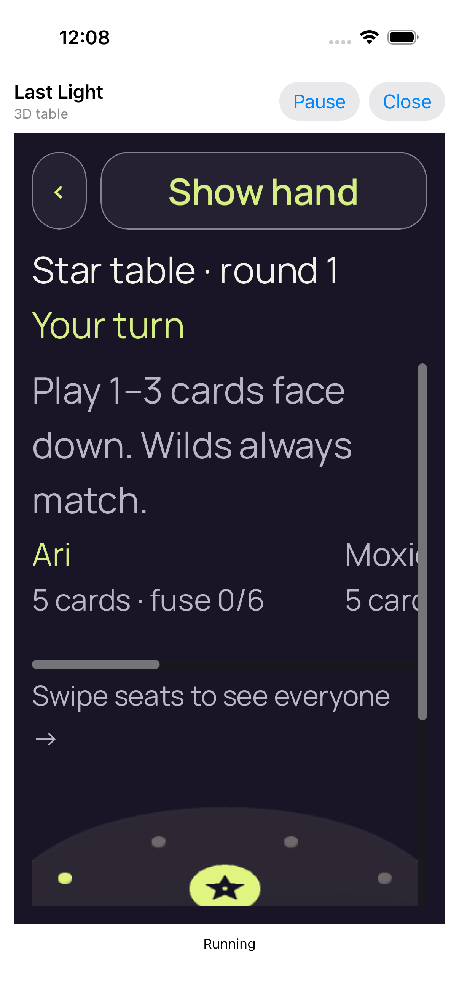</a> | **01 concealed 3d text 2** iPhone 17 simulator, actual native Last Light authority host Original: [EBC327B8-5D40-470B-8396-9C36355532FE.png](attachments/EBC327B8-5D40-470B-8396-9C36355532FE.png) 1206 × 2622 px; text 2× SHA-256: <code>d65a7f87206c1a20f589dd42e90bc31446c55f7be7aa8b0e6072cb5c8a8a4816</code> [Original paired measurements](evidence/attachments/3F668518-AE12-4C9B-9200-AD2A88CCC28A.json) Recorded enclosing case: Success Back, Show hand, Star table and Your turn are readable. The wide seat roster is horizontally clipped and the lower 3D table lies mostly below the initial scroll viewport. |
| <a href="attachments/3F3ACFA1-973A-4FF5-A595-61CA331F3A25.png">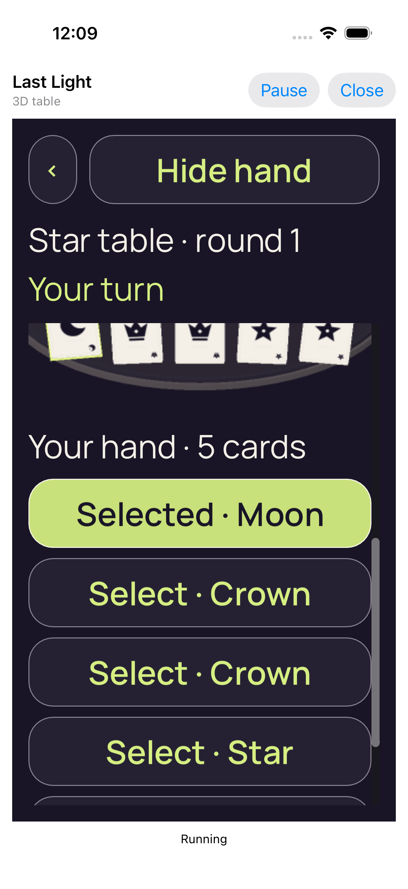</a> | **02 revealed and selected 3d text 2** iPhone 17 simulator, actual native Last Light authority host Original: [3F3ACFA1-973A-4FF5-A595-61CA331F3A25.png](attachments/3F3ACFA1-973A-4FF5-A595-61CA331F3A25.png) 1206 × 2622 px; text 2× SHA-256: <code>31aa4d5f1dbd01b3d8e5af250d53fe5b14930e735da114b001681e54a1dc5d49</code> [Original paired measurements](evidence/attachments/FA85E604-DFB6-4936-9846-1323DB37DF02.json) Recorded enclosing case: Success Hide hand and current-turn context remain fixed. Selected Moon and Crown row labels are readable, but the 3D cards are clipped above the scroll area and later rows/play are below it. |
| <a href="attachments/FD339438-89AD-4B9D-B399-AF83419ADDA7.png">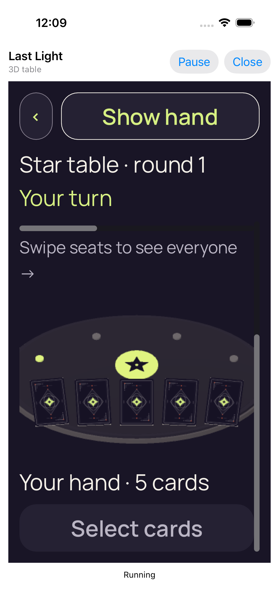</a> | **03 private bindings cleared 3d text 2** iPhone 17 simulator, actual native Last Light authority host Original: [FD339438-89AD-4B9D-B399-AF83419ADDA7.png](attachments/FD339438-89AD-4B9D-B399-AF83419ADDA7.png) 1206 × 2622 px; text 2× SHA-256: <code>702a30692abba81085bba2067884fe5382ca6ccb757078b42005b9d9ee1f6910</code> [Original paired measurements](evidence/attachments/9A962A63-FB7B-4243-9A5C-52376CB3825D.json) Recorded enclosing case: Success Private faces are concealed and the five card backs are visible. Show hand and the disabled Select cards action fit this scrolled position; roster context is partly above it. |
|  | **Native cover with paused private bindings cleared** iPhone 17 simulator, actual native Last Light authority host Original: [78B86360-D6A6-4723-BE73-65B6DB810A67.png](attachments/78B86360-D6A6-4723-BE73-65B6DB810A67.png) 1206 × 2622 px; text 2× SHA-256: <code>c2f3e07a7c263ec5a5a9b9be94a97ac57082b719084fe8c4b4552942bed8ca32</code> [Original paired measurements](evidence/attachments/7D488912-07AF-44EE-B67C-DA0477F760D3.json) Recorded enclosing case: Success An opaque native pause cover fills the renderer surface and clears game imagery. Resume and Close remain visible. |
|  | **Actual Home screen before game reactivation** iPhone 17 simulator, actual native Last Light authority host Original: [65D63037-2B69-44A2-B98A-CE046CD1424C.png](attachments/65D63037-2B69-44A2-B98A-CE046CD1424C.png) 1206 × 2622 px; text 2× SHA-256: <code>990cafa02045ffd8bba805932de314aaacbba82ed3620d2ce6434cd963d9937e</code> Recorded enclosing case: Success The actual Home screen and dock are visible without the game hand. This does not change the raw application-state observation. |
| <a href="attachments/0B93F8A3-DFD8-404A-9FE6-13142CBED627.png">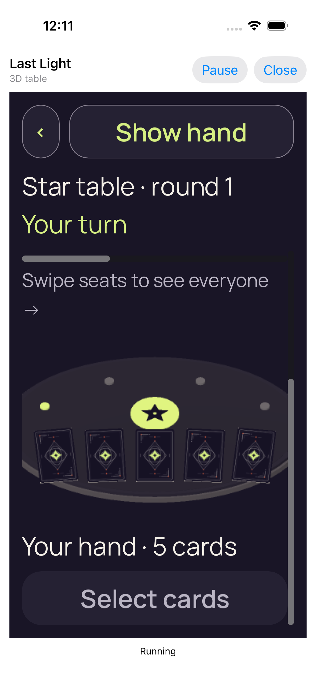</a> | **Same authority resumed with concealed cards** iPhone 17 simulator, actual native Last Light authority host Original: [0B93F8A3-DFD8-404A-9FE6-13142CBED627.png](attachments/0B93F8A3-DFD8-404A-9FE6-13142CBED627.png) 1206 × 2622 px; text 2× SHA-256: <code>1d7a3533cd45a83e39d05e56f08b8a2ed73a14c50e1c58583a5edeb6179618ad</code> [Original paired measurements](evidence/attachments/5ECAF45C-0B6D-4190-A6E9-524FAABB554D.json) Recorded enclosing case: Success Reactivation preserves a scrolled concealed view: five backs and the disabled Select cards action fit. Show hand, Star table and Your turn remain fixed above it. |
| <a href="attachments/9D9ACD13-55DA-4D7E-B3E7-C475DCB2E72E.png">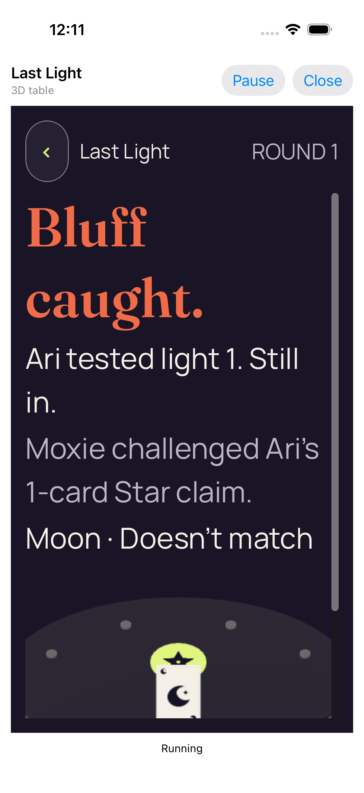</a> | **04 actual viewer play 3d text 2** iPhone 17 simulator, actual native Last Light authority host Original: [9D9ACD13-55DA-4D7E-B3E7-C475DCB2E72E.png](attachments/9D9ACD13-55DA-4D7E-B3E7-C475DCB2E72E.png) 1206 × 2622 px; text 2× SHA-256: <code>4da8b40cb04ba425c08402b74eccb343d81066e0f1d07d9533fc62747af101a1</code> [Original paired measurements](evidence/attachments/2EE63A65-EC3C-44E3-B2EF-E140578E0E3A.json) Recorded enclosing case: Success Bluff caught wraps across two lines with a readable named challenge and Moon mismatch. The public table is clipped at the bottom and Next round is below the current viewport. |
|  | **05 public outcome 3d text 2** iPhone 17 simulator, actual native Last Light authority host Original: [772CDE5F-21C6-4FEE-B36E-6604B4EC8C19.png](attachments/772CDE5F-21C6-4FEE-B36E-6604B4EC8C19.png) 1206 × 2622 px; text 2× SHA-256: <code>4da8b40cb04ba425c08402b74eccb343d81066e0f1d07d9533fc62747af101a1</code> [Original paired measurements](evidence/attachments/300D9DF0-BF26-405F-9CA5-828A81199492.json) Recorded enclosing case: Success The separate public-outcome capture retains the readable named challenge and Moon mismatch, with the table partly cut by the lower scroll edge. |
| <a href="attachments/D1174EC5-625A-458B-A18F-FB5A3CB6BC7B.png">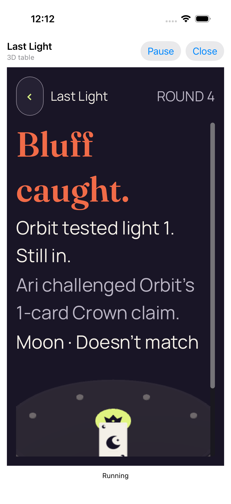</a> | **06 actual viewer challenge 3d text 2** iPhone 17 simulator, actual native Last Light authority host Original: [D1174EC5-625A-458B-A18F-FB5A3CB6BC7B.png](attachments/D1174EC5-625A-458B-A18F-FB5A3CB6BC7B.png) 1206 × 2622 px; text 2× SHA-256: <code>16450f14b304c77cef5397ad53d580b468647d26e25994e0906f227b2577a82b</code> [Original paired measurements](evidence/attachments/65AC3508-0772-4762-9551-F6389CFDA9F1.json) Recorded enclosing case: Success Round 4 shows Ari challenging Orbit and the readable Moon mismatch. The table is partly below the viewport and Next round requires scrolling. |
| <a href="attachments/41413850-C843-450F-810A-43A1AA021FA6.png">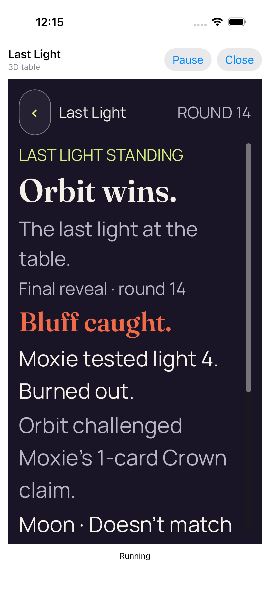</a> | **07 real winner 3d text 2** iPhone 17 simulator, actual native Last Light authority host Original: [41413850-C843-450F-810A-43A1AA021FA6.png](attachments/41413850-C843-450F-810A-43A1AA021FA6.png) 1206 × 2622 px; text 2× SHA-256: <code>6b7f6a4c9a3638105585d6739f051ee356f51117eeec103e5b4dc364c54b3832</code> [Original paired measurements](evidence/attachments/9CFB33F3-BE96-4D14-9EB9-9E48A81034A1.json) Recorded enclosing case: Success Orbit wins, the final Bluff caught result, Moxie light-4 burnout and named Crown challenge are readable. The public table and return action lie below this scroll position. |
|  | **09 table returned through authority 3d text 2** iPhone 17 simulator, actual native Last Light authority host Original: [E30E51B9-3782-44FC-8F6B-604E5A44100F.png](attachments/E30E51B9-3782-44FC-8F6B-604E5A44100F.png) 1206 × 2622 px; text 2× SHA-256: <code>f78b2240dcdeb819ba800c8acb7bcdd62493987791eb7545971f0934d6ac5ab1</code> [Original paired measurements](evidence/attachments/DDB953A6-DF96-4740-B73D-02BDE2B77C68.json) Recorded enclosing case: Success The 3D authority return reaches the native Table closed shell with Host +1 and Closed status, without game cards. |

## 3D · 100% text

Normal 3D passes its complete reference match and authority return. Hand faces and main actions fit; the final winner includes a correct Crown table emblem, Moon proof and named burnout explanation. The roster remains horizontally scrollable.

| Original image | Scenario and provenance |
| --- | --- |
|  | **01 concealed 3d text 1** iPhone 17 simulator, actual native Last Light authority host Original: [5C51D395-65D2-49A7-91F1-17B6F9A76BB6.png](attachments/5C51D395-65D2-49A7-91F1-17B6F9A76BB6.png) 1206 × 2622 px; text 1× SHA-256: <code>5d794c39e1259a37ae4136d09f7dc0dbca0c844fc77a8a28c9c807820a2f1437</code> [Original paired measurements](evidence/attachments/4545F6B0-84A5-4B6F-AC2A-769D4E989030.json) Recorded enclosing case: Success All five card backs, Show hand and the disabled Select cards action fit. Star table and Your turn remain readable; the roster extends horizontally beyond the viewport. |
| <a href="attachments/31056A15-857E-4640-B797-93EEEFED6C2B.png">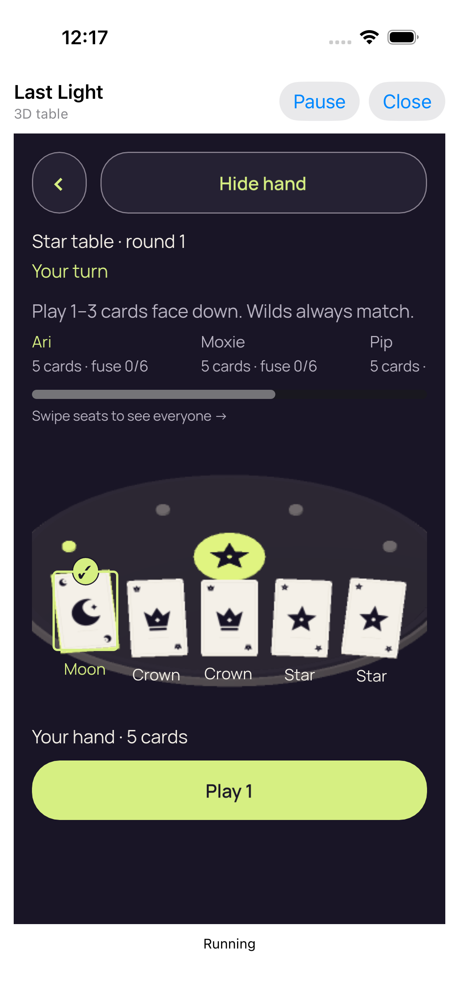</a> | **02 revealed and selected 3d text 1** iPhone 17 simulator, actual native Last Light authority host Original: [31056A15-857E-4640-B797-93EEEFED6C2B.png](attachments/31056A15-857E-4640-B797-93EEEFED6C2B.png) 1206 × 2622 px; text 1× SHA-256: <code>7692bd540e9145f0b3aa75419606e2f292efcbb7cf9225552e9c1e29fb224727</code> [Original paired measurements](evidence/attachments/5F4F9B89-04AA-4E99-AE50-177E762C6D58.json) Recorded enclosing case: Success All five faces and rank captions fit. The selected Moon has a lime marker/check and Play 1 is complete; the roster remains horizontally scrollable. |
| <a href="attachments/3A8DE5B8-71E0-4468-9E3B-E99FEDD3D186.png">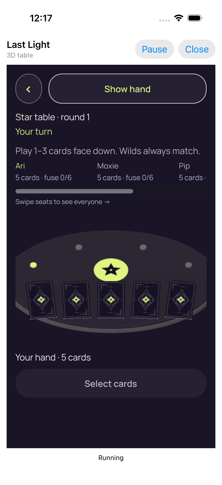</a> | **03 private bindings cleared 3d text 1** iPhone 17 simulator, actual native Last Light authority host Original: [3A8DE5B8-71E0-4468-9E3B-E99FEDD3D186.png](attachments/3A8DE5B8-71E0-4468-9E3B-E99FEDD3D186.png) 1206 × 2622 px; text 1× SHA-256: <code>44de3b3067aaba36ed2bae5e8252ad2a87e91761a91a99cd5ebd096351d845d0</code> [Original paired measurements](evidence/attachments/7A2A481F-390B-4D12-9E1B-03FDC16C3956.json) Recorded enclosing case: Success Cover replaces all private faces and rank captions with five backs. Show hand and disabled Select cards fit. |
|  | **Native cover with paused private bindings cleared** iPhone 17 simulator, actual native Last Light authority host Original: [59B8A70F-A313-4F9F-91A0-588DE903A2CD.png](attachments/59B8A70F-A313-4F9F-91A0-588DE903A2CD.png) 1206 × 2622 px; text 1× SHA-256: <code>6938d2c1e19dfa80bdd868f36a29779ae3f0d902b49a9920a0a7fa0c999744d5</code> [Original paired measurements](evidence/attachments/5CB119A2-913C-4F06-830E-E05A270E10D5.json) Recorded enclosing case: Success The native pause cover is opaque across the renderer surface, with no exposed game imagery. |
| <a href="attachments/08BA8DAF-4B57-4313-9FFD-459F1E550531.png">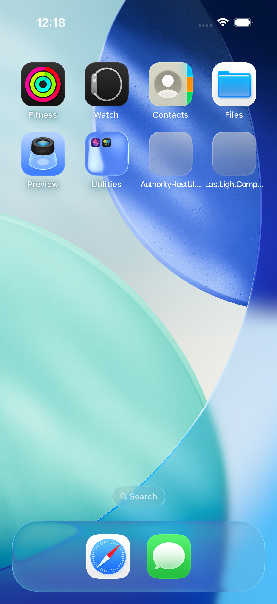</a> | **Actual Home screen before game reactivation** iPhone 17 simulator, actual native Last Light authority host Original: [08BA8DAF-4B57-4313-9FFD-459F1E550531.png](attachments/08BA8DAF-4B57-4313-9FFD-459F1E550531.png) 1206 × 2622 px; text 1× SHA-256: <code>d3ab4f136e60d54ded8193ec574ad565fcb5d2ad4a67588b0991b261ead7a7fd</code> Recorded enclosing case: Success The original Home screenshot shows the Safari/Messages dock and no game cards; retain the separate raw app-state observation. |
| <a href="attachments/46C9D921-C966-4221-A12A-EC470258828C.png">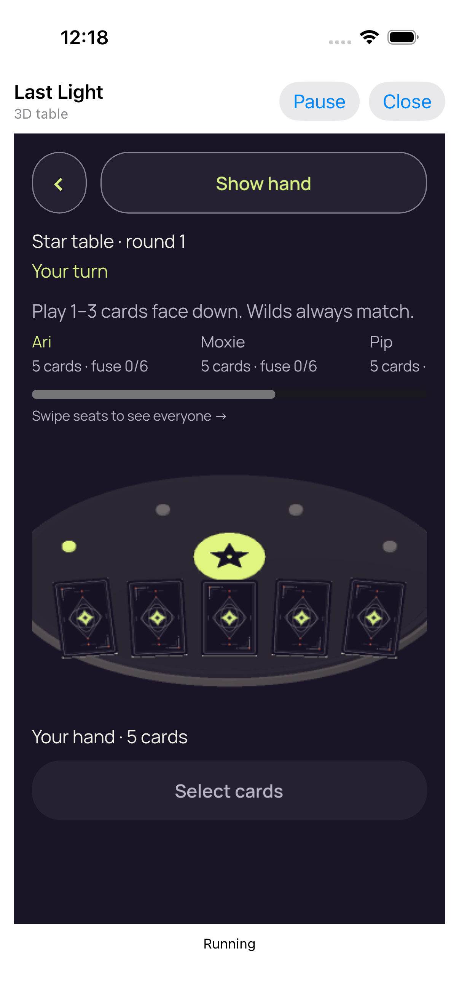</a> | **Same authority resumed with concealed cards** iPhone 17 simulator, actual native Last Light authority host Original: [46C9D921-C966-4221-A12A-EC470258828C.png](attachments/46C9D921-C966-4221-A12A-EC470258828C.png) 1206 × 2622 px; text 1× SHA-256: <code>85870e5306ab3ab0de758923f2b561853343967838e74958b49bd6365d7b2e96</code> [Original paired measurements](evidence/attachments/8828544D-EFB2-4B5C-B53D-57CCB709EBE9.json) Recorded enclosing case: Success The resumed 3D hand is fully concealed with a complete Show hand action and current-turn context. |
| <a href="attachments/18DF7279-3B31-4073-ADA2-8B083881D980.png">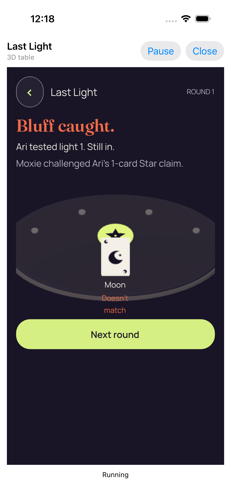</a> | **04 actual viewer play 3d text 1** iPhone 17 simulator, actual native Last Light authority host Original: [18DF7279-3B31-4073-ADA2-8B083881D980.png](attachments/18DF7279-3B31-4073-ADA2-8B083881D980.png) 1206 × 2622 px; text 1× SHA-256: <code>c8be16977f8f3972e88abc867050d661a4c374d9e565edb2db8ac82a7a0e30c8</code> [Original paired measurements](evidence/attachments/0D7E8CAF-2A57-47A2-B863-831076CEB43C.json) Recorded enclosing case: Success Bluff caught, named challenger/claim, Moon mismatch and Next round are visible. The small mismatch caption crosses the table edge but remains legible. |
|  | **05 public outcome 3d text 1** iPhone 17 simulator, actual native Last Light authority host Original: [74EA3ED0-A91B-4EF5-A570-AAF7D7A40B56.png](attachments/74EA3ED0-A91B-4EF5-A570-AAF7D7A40B56.png) 1206 × 2622 px; text 1× SHA-256: <code>ccfdff6b9aac06f4f1f45ef54f9a3bfa84d401395b1d652b1b09d0c297811e62</code> [Original paired measurements](evidence/attachments/067DDCE9-610D-4DF9-9E15-E4CBAAC2F936.json) Recorded enclosing case: Success The separate public-outcome capture retains a readable public Moon mismatch and full Next round action. |
| <a href="attachments/EF447165-899E-4FC6-AA35-CC5FA7E724D7.png">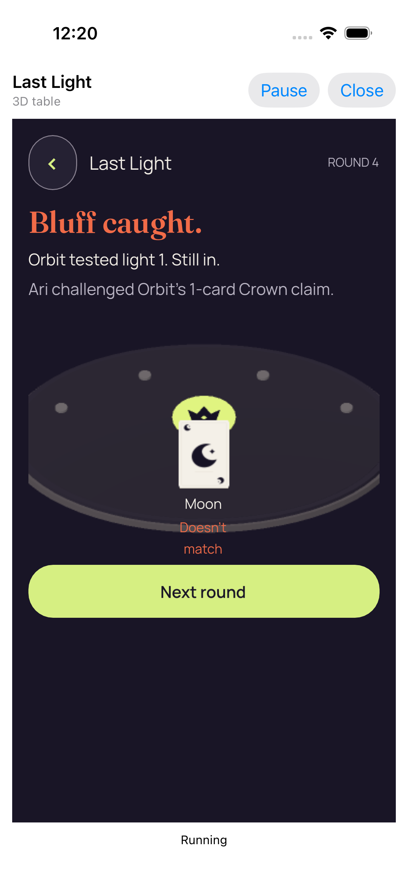</a> | **06 actual viewer challenge 3d text 1** iPhone 17 simulator, actual native Last Light authority host Original: [EF447165-899E-4FC6-AA35-CC5FA7E724D7.png](attachments/EF447165-899E-4FC6-AA35-CC5FA7E724D7.png) 1206 × 2622 px; text 1× SHA-256: <code>7db4f5393b44f1321624866195723265e872a13aede4c57d6cad23237f6422c3</code> [Original paired measurements](evidence/attachments/B184DA3C-7035-41B0-9B87-75A56A212072.json) Recorded enclosing case: Success The round-4 public Moon is paired with the Crown table emblem and named Ari/Orbit challenge. Next round is fully visible; the small mismatch caption remains legible across the table edge. |
| <a href="attachments/C7AE1D9F-F2EE-46A0-B6B8-BC7630D4F716.png">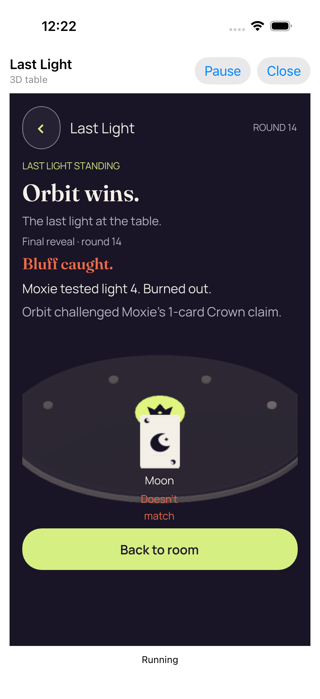</a> | **07 real winner 3d text 1** iPhone 17 simulator, actual native Last Light authority host Original: [C7AE1D9F-F2EE-46A0-B6B8-BC7630D4F716.png](attachments/C7AE1D9F-F2EE-46A0-B6B8-BC7630D4F716.png) 1206 × 2622 px; text 1× SHA-256: <code>5dde5673e5f8a5858baa4e638120fd24302d87487d0a883effdc77d100f5b0c0</code> [Original paired measurements](evidence/attachments/877FB1C5-CDCC-404A-9D27-3B4665487D96.json) Recorded enclosing case: Success Orbit wins, the final named challenge and Moxie burnout explanation fit. The Crown table emblem, public Moon and complete Back to room action are visible. |
|  | **09 table returned through authority 3d text 1** iPhone 17 simulator, actual native Last Light authority host Original: [AEEF6968-1E68-43AE-B22B-2AEF201DE554.png](attachments/AEEF6968-1E68-43AE-B22B-2AEF201DE554.png) 1206 × 2622 px; text 1× SHA-256: <code>ceedd4891e9f3ace57de21dc1c167458c226e65fc4b7ac9d85a7d86606be56a4</code> [Original paired measurements](evidence/attachments/B2061337-D7BD-40D8-AC5A-C3AA57B8F826.json) Recorded enclosing case: Success The native Table closed shell confirms the captured authority return, with relaunch guidance and Host +1 visible and no renderer content. |

## Secure default renderer Exit

Secure default renderer Exit passes within its bounded launch-and-exit scope.

| Original image | Scenario and provenance |
| --- | --- |
| <a href="attachments/6E2424D1-B1A0-400E-BA34-C8839863CAD8.png">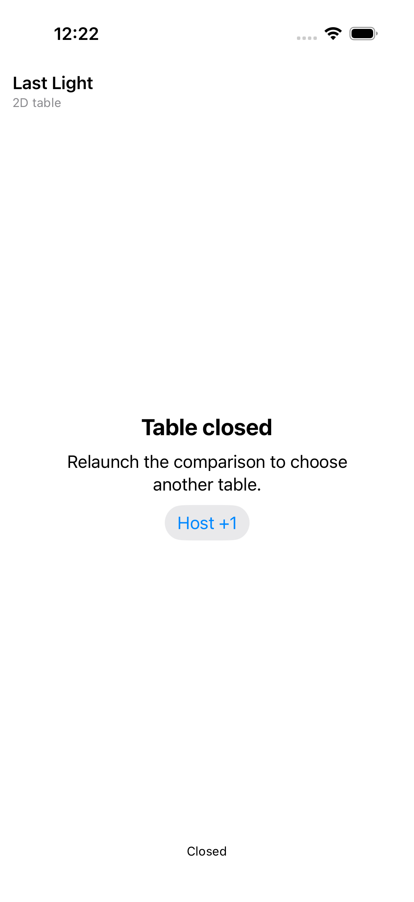</a> | **Secure default table exited through Godot input** iPhone 17 simulator, actual native Last Light authority host Original: [6E2424D1-B1A0-400E-BA34-C8839863CAD8.png](attachments/6E2424D1-B1A0-400E-BA34-C8839863CAD8.png) 1206 × 2622 px; text 1× SHA-256: <code>679088075972c217680fed001e97d946c9bbb00a07ecdab234c88205f07c9373</code> [Original paired measurements](evidence/attachments/18B3A043-4AFF-43C4-87A8-B6DE6F4E4E62.json) Recorded enclosing case: Success The native Table closed shell shows relaunch guidance, Host +1 and Closed status without renderer content. This proves the captured exit state, not a secure-default full match. |
